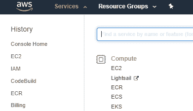
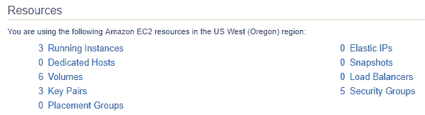
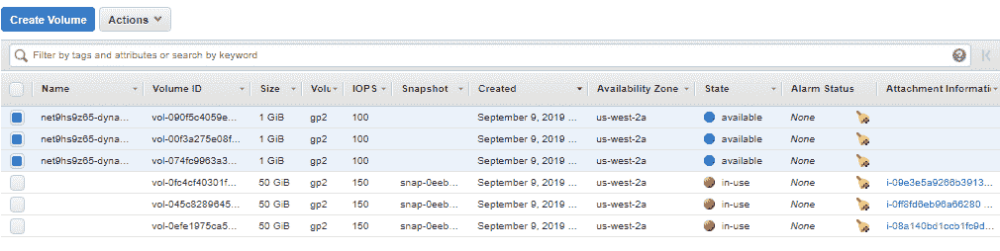
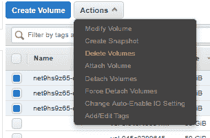
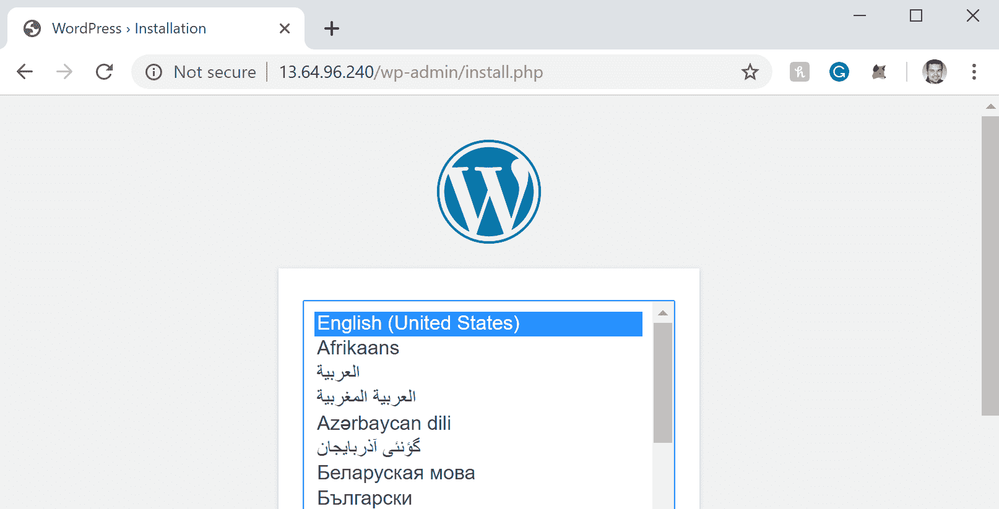
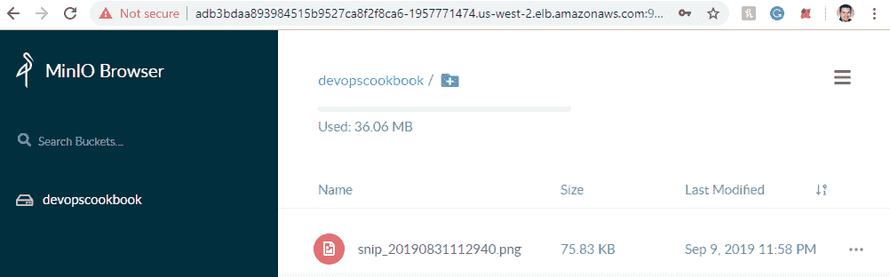

# 为有状态工作负载做准备

在本章中，我们将讨论在 Kubernetes 上使用流行的开源存储解决方案，以及如何保护应用程序的状态免受节点或应用程序故障的影响并共享相同的数据，或者当 pod 在不同的节点上重新计划时如何处理卷的重新附加。遵循本章中的方法后，您将获得在自我管理的基础架构或私有云中同时使用数据块和文件存储选项的技能。

在这一章中，我们将介绍以下食谱:

*   管理库本内斯的亚马逊电子商务卷
*   管理库本内特斯的 GCE PD 卷
*   在 Kubernetes 中管理 Azure 磁盘卷
*   使用 Rook 配置和管理持久存储
*   使用 OpenEBS 配置和管理持久存储
*   在 Kubernetes 上为共享存储设置 NFS
*   存储问题疑难解答

# 技术要求

本节中的方法假设您已经根据[第 1 章](01.html)、*构建生产就绪型库本内特集群*中描述的推荐方法之一部署了一个功能性库本内特集群。

Kubernetes 的命令行工具`kubectl`将用于本节剩余的食谱，因为它是针对 Kubernetes 集群运行命令的主要命令行界面。我们还将使用`helm`来部署解决方案。

# 管理库本内斯的亚马逊电子商务卷

亚马逊弹性块存储(亚马逊 EBS)为亚马逊 EC2 实例提供持久的块级存储卷，这些实例在 AWS 中由`kops`创建的 Kubernetes 集群和亚马逊 EKS 集群中使用。在本节中，我们将为您在 AWS 中运行的 Kubernetes 中的应用程序创建存储类。您将学习如何在 Kubernetes 中创建存储类资源，您将了解随着 EBS 卷类型性能的变化而变化的可用参数，并使用新的**容器存储接口** ( **CSI** )来使用 EBS 卷。

# 准备好

将`k8sdevopscookbook/src`存储库克隆到您的工作站，以便能够使用`chapter5`目录下的清单文件:

```
$ git clone https://github.com/k8sdevopscookbook/src.git
$ cd chapter5
```

确保您已经准备好 Kubernetes 集群并且`kubectl`已配置为管理集群资源。

# 怎么做…

本节进一步细分为以下小节，以简化流程:

*   创建 EBS 存储类
*   更改默认存储类别
*   将 EBS 卷用于持久存储
*   使用 EBS 存储类动态创建持久卷
*   删除 EBS 永久卷
*   安装 EBS CSI 驱动程序以管理 EBS 卷

# 创建 EBS 存储类

让我们执行以下步骤来了解构建 EBS 存储类所需的存储类参数，我们可以使用该存储类从 AWS Cloud 动态请求新的持久卷:

1.  使用指定的置备程序、`kubernetes.io/aws-ebs`和`gp2`类型创建基本存储类:

```
$ cat <<EOF | kubectl apply -f -
apiVersion: storage.k8s.io/v1
kind: StorageClass
metadata:
 name: aws-gp2
provisioner: kubernetes.io/aws-ebs
parameters:
 type: gp2
 fsType: ext4 
reclaimPolicy: Retain
allowVolumeExpansion: true
mountOptions:
 - debug
volumeBindingMode: Immediate
EOF
```

这里接受的其他类型值包括`io1`、`sc1`和`st1`。您可以在*中的 AWS EBS 卷类型链接上找到不同卷类型的定义和用例，另请参见*部分。

On Amazon EKS clusters, the default EBS volume type is `gp2`. For database workloads, such as MongoDB, Cassandra, and PostgreSQL, `io1-type`, high-performance SSDs are recommended.

2.  列出存储类别。确认列表中有新的`aws-gp2`。根据云提供商或 Kubernetes 部署工具的不同，您可能会在列表中看到类似以下内容的其他存储类:

```
$ kubectl get sc
NAME                      PROVISIONER                    AGE
aws-gp2                   kubernetes.io/aws-ebs          8s
default                   kubernetes.io/aws-ebs          25h
gp2 (default)             kubernetes.io/aws-ebs          25h
openebs-hostpath          openebs.io/local               175m
openebs-jiva-default      openebs.io/provisioner-iscsi   175m
```

存储类是动态资源调配的基础。正如您在我们的示例中看到的，您的群集中可能有多个存储类。理想情况下，创建存储类时应该考虑应用程序的需求，因为某些应用程序需要更快的卷，而其他应用程序可能会利用 Rook 和 OpenEBS 等解决方案提供的多可用性区域复制，我们将在本章稍后部分进行部署。

# 更改默认存储类别

动态存储资源调配是扩展应用程序的关键部分。当存储类不是由**持久卷声明** ( **聚氯乙烯**指定时，库本内特斯使用默认选项。让我们执行以下步骤，将首选存储类设置为默认存储类:

1.  通过将`is-default-class`值设置为`true`，创建一个新的存储类，同时将其定义为默认值。我们这里的示例使用了`io1`音量类型并将`iopsPerGB`限制为`10`。还将`reclaimPolicy`设置为`Retain`，表示如果用户删除相关 PVC，卷将被保留(另外两个保留策略选项为`Recycle`和`Delete`):

```
$ cat <<EOF | kubectl apply -f -
apiVersion: storage.k8s.io/v1
kind: StorageClass
metadata:
 name: aws-io1-slow
 annotations:
 storageclass.kubernetes.io/is-default-class: "true"
provisioner: kubernetes.io/aws-ebs
parameters:
 type: io1
 iopsPerGB: "10"
 fsType: ext4
reclaimPolicy: Retain
allowVolumeExpansion: true
EOF
```

2.  要在现有存储类创建后更改其状态，请先选择一个存储类:

```
$ kubectl get sc
NAME                   PROVISIONER           AGE
aws-gp2                kubernetes.io/aws-ebs 6m28s
aws-io1-slow (default) kubernetes.io/aws-ebs 4m29s
```

3.  让我们将现有的存储类`aws-io1-slow`设置为非默认选项:

```
$ kubectl patch storageclass aws-io1-slow -p '{"metadata": {"annotations":{"storageclass.kubernetes.io/is-default-class":"false"}}}'
```

4.  现在，再次将`aws-gp2`定义为默认存储类:

```
$ kubectl patch storageclass aws-gp2 -p '{"metadata": {"annotations":{"storageclass.kubernetes.io/is-default-class":"true"}}}'
```

5.  确认新的默认存储类别:

```
$ kubectl get sc
NAME               PROVISIONER           AGE
aws-gp2 (default)  kubernetes.io/aws-ebs 10m
aws-io1-slow       kubernetes.io/aws-ebs 8m
```

确保一次总是有一个默认存储类，否则没有定义存储类的 PVC 将会失败。

# 将 EBS 卷用于持久存储

作为创建物理卷和动态创建卷的替代方法，您也可以手动创建一个卷，并通过执行以下步骤将其作为永久卷直接附加到您的应用程序:

1.  使用以下命令行界面在与工作节点相同的区域中创建 EBS 卷:

```
$ aws ec2 create-volume --availability-zone=us-west-2a --size=10 --volume-type=gp2
```

2.  使用您在*步骤 1:* 中创建的 EBS `volumeID`部署测试应用程序

```
$ cat <<EOF | kubectl apply -f -
apiVersion: v1
kind: Pod
metadata:
 name: test-server
spec:
 containers:
 - image: gcr.io/google_containers/test-webserver
 name: test-container
 volumeMounts:
 - mountPath: /test-ebs
 name: test-volume
 volumes:
 - name: test-volume
 awsElasticBlockStore:
 volumeID: vol-02f4bc9b938604f72
 fsType: ext4
EOF
```

3.  确认你的吊舱处于`Running`状态:

```
$ kubectl get pods
NAME        READY STATUS  RESTARTS AGE
test-server 1/1   Running 0        4m32s
```

手动创建永久卷(PVs)的主要优点是 PVs 不连接到单个集群或命名空间。它们作为资源存在于您的 AWS 云帐户上，甚至可以跨集群共享，在集群中，动态创建的 PVC 只存在于创建的命名空间中，并且只能由同一命名空间中的 pod 使用。

# 使用 EBS 存储类动态创建持久卷

作为状态资源集的一部分，`volumeClaimTemplates`可以使用由您选择的`PersistentVolume`资源调配者调配的`PersistentVolumes`来提供持久存储。在本食谱中，我们将使用 StorageClass 为您的应用程序动态创建 PVs。让我们从以下步骤开始:

1.  在应用程序部署清单的`volumeClaimTemplates`部分下添加`aws-gp2`存储类行，类似于以下示例:

```
...
  volumeClaimTemplates:
  - metadata:
      name: datadir
      annotations:
        volume.beta.kubernetes.io/storage-class: aws-gp2
    spec:
      accessModes: [ "ReadWriteOnce" ]
      resources:
        requests:
          storage: 1G
...
```

2.  在本食谱中，我们将使用`aws-gp2`存储类部署 Redis StatefulSet。在执行 YAML 清单之前，请查看示例存储库中`src/chapter5/aws`目录下的清单:

```
$ cat aws/redis-statefulset.yml
```

3.  使用以下示例创建 Redis 状态集:

```
$ kubectl apply -f aws/redis-statefulset.yml
```

4.  验证是否已经创建了吊舱。在这个食谱中，我们的例子有三个副本的状态集。因此，您应该会看到三个副本正在运行，类似于以下输出:

```
$ kubectl get pods
NAME READY STATUS  RESTARTS AGE
rd-0 1/1   Running 0        9m9s
rd-1 1/1   Running 0        7m56s
rd-2 1/1   Running 0        6m47s
```

5.  列出创建的聚氯乙烯和聚氯乙烯。您应该会看到创建了三个 PVC 和三个 PVs，类似于这里的示例输出:

```
$ kubectl get pvc,pv
NAME STATUS VOLUME CAPACITY ACCESS MODES STORAGECLASS AGE
datadir-rd-0 Bound pvc-8a538aa3-7382-4147-adde-1ea3dbaaafb4 1Gi RWO aws-gp2 10m
datadir-rd-1 Bound pvc-171fbee3-39bf-4450-961f-6c1417ff3897 1Gi RWO aws-gp2 9m1s
datadir-rd-2 Bound pvc-b40df89b-5349-4f02-8510-917012579746 1Gi RWO aws-gp2 7m52s$ 
NAME CAPACITY ACCESS MODES RECLAIM POLICY STATUS CLAIM STORAGECLASS REASON AGE
pvc-171fbee3-39bf-4450-961f-6c1417ff3897 1Gi RWO Retain Bound default/datadir-rd-1 aws-gp2 9m18s
pvc-8a538aa3-7382-4147-adde-1ea3dbaaafb4 1Gi RWO Retain Bound default/datadir-rd-0 aws-gp2 10m
pvc-b40df89b-5349-4f02-8510-917012579746 1Gi RWO Retain Bound default/datadir-rd-2 aws-gp2 8m10s
```

现在，您知道如何动态创建持久卷作为部署的一部分。

# 删除 EBS 永久卷

当回收策略设置为保留卷时，需要通过观察以下步骤分别删除它们:

1.  请记住，删除您的工作负载不会删除永久虚电路和永久虚电路，除非永久虚电路清单包含在清单中:

```
$ kubectl delete -f redis-statefulset.yml
```

2.  列出剩余的 PVs:

```
$ kubectl get pv
NAME CAPACITY ACCESS MODES RECLAIM POLICY STATUS CLAIM STORAGECLASS REASON AGE
pvc-171fbee3-39bf-4450-961f-6c1417ff3897 1Gi RWO Retain Bound default/datadir-rd-1 aws-gp2 13m
pvc-8a538aa3-7382-4147-adde-1ea3dbaaafb4 1Gi RWO Retain Bound default/datadir-rd-0 aws-gp2 15m
pvc-b40df89b-5349-4f02-8510-917012579746 1Gi RWO Retain Bound default/datadir-rd-2 aws-gp2 12m
```

3.  删除 PVc。您可以通过在单个命令中添加名称来一次删除多个 PVC，如下所示:

```
$ kubectl delete pvc datadir-rd-0 datadir-rd-1 datadir-rd-2
```

4.  删除 PVs。您可以通过在一个命令中添加多个 PVs 的名称来一次删除它们，如下所示:

```
$ kubectl delete pv <pv-name-1> <pv-name-2> <pv-name-3>
```

虽然我们删除了 PVC 和 PVs，但我们的 EBS 卷仍然保留。现在让我们也删除这些:

5.  打开您的 AWS 管理控制台，单击计算选项下的 EC2:



6.  在资源部分下，单击卷:



7.  选择可用和未使用的卷。从*使用 EBS 存储类创建动态持久卷*配方中，我们有三个未使用的卷:



8.  从操作下拉菜单中，选择删除卷:



我们已经成功删除了与作为 Redis StatefulSet 资源的一部分创建的应用程序相关的所有存储资源。

# 安装 EBS CSI 驱动程序以管理 EBS 卷

亚马逊 EBS CSI 驱动程序提供了一个 Kubernetes CSI 接口，允许亚马逊 EKS 集群简单地管理持久卷的亚马逊 EBS 卷的生命周期。在本食谱中，我们将通过观察以下步骤来学习如何安装 EBS CSI 驱动程序:

1.  EBS CSI 与您的 AWS 卷通信，以按需创建卷。因此，它需要访问凭据。用您的 AWS 凭据替换此处的`key_id`和`access_key`值，并使用秘密资源配置 CSI 驱动程序权限:

```
$ cat <<EOF | kubectl apply -f -
apiVersion: v1
kind: Secret
metadata:
 name: aws-secret
 namespace: kube-system
stringData:
 key_id: "YOUR_KEY_ID_HERE"
 access_key: "YOUR_ACCESS_KEY_HERE"
EOF
```

2.  从存储库位置部署 AWS EBS CSI 驱动程序。以下命令将创建集群角色绑定、CSI 控制器部署和将运行您拥有的每个工作节点的`ebs-csi-node`daemmonset:

```
$ kubectl apply -k "github.com/kubernetes-sigs/aws-ebs-csi-driver/deploy/kubernetes/overlays/stable/?ref=master"
```

3.  验证驱动程序是否正在运行:

```
$ kubectl get pods -n kube-system | grep ebs-csi
ebs-csi-controller-8579f977f4-ljfhm 4/4 Running 0 2m37s
ebs-csi-controller-8579f977f4-qw6ld 4/4 Running 0 2m37s
ebs-csi-node-5x8nh 3/3 Running 0 2m37s
ebs-csi-node-cfghj 3/3 Running 0 2m37s
ebs-csi-node-xp569 3/3 Running 0 2m37s
ebs-csi-node-z45hn 3/3 Running 0 2m37s
```

4.  现在，创建一个新的存储类，它将使用`ebs.csi.aws.com`作为置备程序:

```
$ cat <<EOF | kubectl apply -f -
kind: StorageClass
apiVersion: storage.k8s.io/v1
metadata:
 name: aws-csi-ebs
provisioner: ebs.csi.aws.com
volumeBindingMode: WaitForFirstConsumer
EOF
```

5.  创建一个聚氯乙烯:

```
$ cat <<EOF | kubectl apply -f -
apiVersion: v1
kind: PersistentVolumeClaim
metadata:
 name: csi-ebs-pvc
spec:
 accessModes:
 - ReadWriteOnce
 storageClassName: aws-csi-ebs
 resources:
 requests:
 storage: 4Gi
EOF
```

6.  创建一个使用聚氯乙烯并写入`/data/out.txt`文件的容器:

```
$ cat <<EOF | kubectl apply -f -
apiVersion: v1
kind: Pod
metadata:
 name: app
spec:
 containers:
 - name: app
 image: centos
 command: ["/bin/sh"]
 args: ["-c", "while true; do echo $(date -u) >> /data/out.txt; sleep 5; done"]
 volumeMounts:
 - name: persistent-storage
 mountPath: /data
 volumes:
 - name: persistent-storage
 persistentVolumeClaim:
 claimName: csi-ebs-pvc
EOF
```

7.  验证我们的`mytestapp` pod 是否将数据写入卷:

```
$ kubectl exec -it mytestapp cat /data/out.txt
Mon Sep 9 17:40:25 UTC 2019
```

8.  通过使用以下命令删除 pod 和 PVC 来删除资源:

```
$ kubectl delete pod mytestapp && kubectl delete pvc csi-ebs-pvc
```

现在，您知道如何使用 CSI 驱动程序来调配 EBS 卷了。CSI 驱动程序提供了一个统一的接口来响应 Kubernetes 上的存储请求。只要安装了驱动程序并具有驱动程序实现的功能，无论底层存储系统如何，用户都可以使用它。

# 请参见

*   AWS EBS 卷类型:[https://docs . AWS . Amazon . com/AWSEC2/latest/user guide/ebsvolumetypes . html](https://docs.aws.amazon.com/AWSEC2/latest/UserGuide/EBSVolumeTypes.html)
*   AWS EBS CSI 驱动程序库:[https://github.com/kubernetes-sigs/aws-ebs-csi-driver](https://github.com/kubernetes-sigs/aws-ebs-csi-driver)
*   AWS EBS CSI 驱动程序文档:[https://docs . AWS . Amazon . com/eks/latest/user guide/EBS-CSI . html](https://docs.aws.amazon.com/eks/latest/userguide/ebs-csi.html)

# 管理库本内特斯的 GCE PD 卷

**谷歌云平台**(**【GCP】**)提供持久的块级存储卷，供**谷歌 Kubernetes 引擎** ( **GKE** )实例使用。在本节中，我们将为您在 GKE 运行的 Kubernetes 中的应用程序创建存储类。您将学习在 Kubernetes 中创建一个 StorageClass 资源，您将了解随着 GCP PD 卷类型性能的变化而变化的可用参数，并使用新的 CSI。

# 准备好

将`k8sdevopscookbook/src`存储库克隆到您的工作站:

```
$ git clone https://github.com/k8sdevopscookbook/src.git
$ cd src/chapter5
```

确保您已经准备好了一个区域 GKE 集群，并且`kubectl`已配置为管理集群资源。

# 怎么做…

本节进一步细分为以下小节，以简化流程:

*   创建 GCE 永久磁盘存储类
*   更改默认存储类别
*   将 GCE PD 卷用于持久存储
*   使用 GCE PD 存储类创建动态持久卷
*   正在删除 GCE PD 持久卷
*   安装 GCP 计算 PD CSI 驱动程序来管理 PD 卷

# 创建 GCE 永久磁盘存储类

让我们执行以下步骤来学习存储类参数，以构建一个 GCE PD 存储类，我们可以使用它来动态请求新的持久卷:

1.  基于 GKE 的 Kubernetes 集群使用默认存储类创建。按如下方式列出存储类别:

```
$ kubectl get sc
NAME               PROVISIONER          AGE
standard (default) kubernetes.io/gce-pd 81s
```

2.  描述`standard`存储类:

```
$ kubectl describe sc standard
Name: standard
IsDefaultClass: Yes
Annotations: storageclass.beta.kubernetes.io/is-default-class=true
Provisioner: kubernetes.io/gce-pd
Parameters: type=pd-standard
AllowVolumeExpansion: <unset>
MountOptions: <none>
ReclaimPolicy: Delete
VolumeBindingMode: Immediate
Events: <none>
```

3.  使用指定的置备程序`kubernetes.io/gce-pd`和`pd-standard`类型创建基本存储类:

```
$ cat <<EOF | kubectl apply -f -
kind: StorageClass 
apiVersion: storage.k8s.io/v1 
metadata:
 name: gce-pd 
provisioner: kubernetes.io/gce-pd 
parameters:
 type: pd-standard
volumeBindingMode: WaitForFirstConsumer
allowedTopologies:
- matchLabelExpressions:
 - key: failure-domain.beta.kubernetes.io/zone
 values:
 - us-central1-a
 - us-central1-b
EOF
```

您可以在*参见*部分的 *GCE PD 卷类型*链接中找到不同卷类型的定义和用例。

On GKE clusters, the default PD volume type is `pd-standard`. For database workloads, such as MongoDB, Cassandra, and PostgreSQL, `pd-ssd-type`, high-performance SSDs are recommended.

4.  列出存储类别:

```
$ kubectl get sc
NAME                      PROVISIONER                    AGE
gce-pd                    kubernetes.io/gce-pd           3s
standard (default)        kubernetes.io/gce-pd           17m
```

GKE 附带了一个名为`standard`的默认存储类。您的群集中可能有多个存储类。理想情况下，创建存储类时应考虑应用程序的要求，因为某些应用程序需要更快的卷，而其他应用程序可能会利用其他解决方案提供的多可用性区域复制。

# 更改默认存储类别

动态存储资源调配是扩展应用程序的关键部分。当存储类不是由 PVC 指定时，Kubernetes 使用默认选项。让我们执行以下步骤，将首选存储类设置为默认存储类:

1.  让我们创建一个新的存储类，同时通过将`is-default-class`设置为`true`将其定义为默认选项:

```
$ cat <<EOF | kubectl apply -f -
kind: StorageClass 
apiVersion: storage.k8s.io/v1 
metadata:
 name: gce-pd-ssd 
 annotations:
 storageclass.kubernetes.io/is-default-class: "true"
provisioner: kubernetes.io/gce-pd 
parameters:
 type: pd-ssd
reclaimPolicy: Retain
allowVolumeExpansion: true
volumeBindingMode: WaitForFirstConsumer
allowedTopologies:
- matchLabelExpressions:
 - key: failure-domain.beta.kubernetes.io/zone
 values:
 - us-central1-a
 - us-central1-b
EOF
```

2.  拥有多个默认存储类会导致问题。你需要移除一个。要在现有存储类创建后更改其状态，请先选择一个存储类:

```
$ kubectl get sc
NAME                 PROVISIONER AGE
gce-pd               kubernetes.io/gce-pd 3m52s
gce-pd-ssd (default) kubernetes.io/gce-pd 4s
standard (default)   kubernetes.io/gce-pd 21m
```

3.  让我们将`standard`和`gce-pd-ssd`存储类设置为非默认:

```
$ kubectl patch storageclass standard -p '{"metadata": {"annotations":{"storageclass.beta.kubernetes.io/is-default-class":"false"}}}'
$ kubectl patch storageclass gce-pd-ssd -p '{"metadata": {"annotations":{"storageclass.kubernetes.io/is-default-class":"false"}}}'
```

4.  现在让我们再次将`gce-pd`定义为默认存储类:

```
$ kubectl patch storageclass gce-pd -p '{"metadata": {"annotations":{"storageclass.kubernetes.io/is-default-class":"true"}}}'
```

5.  确认新的默认存储类别:

```
$ kubectl get sc
NAME             PROVISIONER          AGE
gce-pd (default) kubernetes.io/gce-pd 8m25s
gce-pd-ssd       kubernetes.io/gce-pd 4m37s
standard         kubernetes.io/gce-pd 25m
```

现在，您已经学习了如何用新的存储类替换默认存储类。确保一次总是有一个默认存储类；否则，没有定义存储类但期望默认存储类的 PVC 将会失败。

# 将 GCE PD 卷用于持久存储

作为创建物理卷和动态创建卷的替代方法，您也可以手动创建一个卷，并通过观察以下步骤将其作为永久卷直接附加到您的应用程序:

1.  在与工作节点相同的区域中创建一个 GCE PD 卷:

```
$ gcloud beta compute disks create gce-disk-1 --region us-central1 --replica-zones us-central1-b,us-central1-c 
Created [https://www.googleapis.com/compute/beta/projects/devopscookbook/regions/us-central1/disks/gce-disk-1].
NAME       ZONE SIZE_GB TYPE        STATUS
gce-disk-1      500     pd-standard READY
```

2.  使用现有卷名`gce-disk-1`创建 PV:

```
$ cat <<EOF | kubectl apply -f -
apiVersion: v1
kind: PersistentVolume
metadata:
 name: gce-disk-1
spec:
 storageClassName: ""
 capacity:
 storage: 500G
 accessModes:
 - ReadWriteOnce
 gcePersistentDisk:
 pdName: gce-disk-1
 fsType: ext4
EOF
```

3.  使用光伏名称`gce-disk-1`创建聚氯乙烯:

```
$ cat <<EOF | kubectl apply -f -
apiVersion: v1
kind: PersistentVolumeClaim
metadata:
 name: pvc-gcedisk1
spec:
 storageClassName: ""
 volumeName: gce-disk-1
 accessModes:
 - ReadWriteOnce
 resources:
 requests:
 storage: 500G
EOF
```

4.  使用您在*步骤 1:* 中创建的`volumeMounts`名称`gce-disk-1`部署测试应用程序

```
$ cat <<EOF | kubectl apply -f -
apiVersion: v1
kind: Pod
metadata:
 name: test-server
spec:
 containers:
 - image: gcr.io/google_containers/test-webserver
 name: test-container
 volumeMounts:
 - mountPath: /test-ebs
 name: test-volume
 volumes:
 - name: test-volume
 persistentVolumeClaim:
 claimName: pvc-gcedisk1
EOF
```

5.  确认你的吊舱处于`Running`状态:

```
$ kubectl get pods
NAME        READY STATUS  RESTARTS AGE
test-server 1/1   Running 0        4m32s
```

手动创建 PVs 的主要优点是 PVs 不附加到单个集群或命名空间。它们作为资源存在于您的 GCP 帐户中，甚至可以跨集群共享。另一方面，动态创建的 PVC 只存在于创建的命名空间中，并且只能由同一命名空间中的 pod 使用。

# 使用 GCE PD 存储类创建动态持久卷

作为状态资源集的一部分，`volumeClaimTemplates`可以使用由您选择的`PersistentVolume`资源调配者调配的`PersistentVolumes`来提供持久存储。在本食谱中，我们将使用 StorageClass 为您的应用程序动态创建 PVs:

1.  在应用程序部署清单的`volumeClaimTemplates`部分下添加`gce-pd`存储类行，类似于以下示例:

```
...
 volumeClaimTemplates:
 - metadata:
 name: datadir
 annotations:
 volume.beta.kubernetes.io/storage-class: gce-pd
 spec:
 accessModes: [ "ReadWriteOnce" ]
 resources:
 requests:
 storage: 1G
...
```

2.  在本食谱中，我们将使用`gce-pd`存储类部署 Redis Statefulset。在执行 YAML 清单之前，请查看示例存储库中`src/chapter5/gcp`目录下的清单:

```
$ cat gcp/redis-statefulset.yml
```

3.  创建 Redis StatefulSet:

```
$ kubectl apply -f redis-statefulset.yml
```

4.  验证是否已经创建了吊舱:

```
$ kubectl get pods
NAME READY STATUS  RESTARTS AGE
rd-0 1/1   Running 0        2m27s
rd-1 1/1   Running 0        81s
rd-2 0/1   Running 0        19s
```

5.  列出已创建的 PVC 和 PVs:

```
$ kubectl get pvc, pv
NAME STATUS VOLUME CAPACITY ACCESS MODES STORAGECLASS AGE
datadir-rd-0 Bound pvc-3481b73c-d347-11e9-b514-42010a80005e 1Gi RWO gce-pd 3m1s
datadir-rd-1 Bound pvc-5b8cc2d6-d347-11e9-b514-42010a80005e 1Gi RWO gce-pd 115s
datadir-rd-2 Bound pvc-80d826b9-d347-11e9-b514-42010a80005e 1Gi RWO gce-pd 53s
NAME CAPACITY ACCESS MODES RECLAIM POLICY STATUS CLAIM STORAGECLASS REASON AGE
pvc-3481b73c-d347-11e9-b514-42010a80005e 1Gi RWO Delete Bound default/datadir-rd-0 gce-pd 3m16s
pvc-5b8cc2d6-d347-11e9-b514-42010a80005e 1Gi RWO Delete Bound default/datadir-rd-1 gce-pd 2m11s
pvc-80d826b9-d347-11e9-b514-42010a80005e 1Gi RWO Delete Bound default/datadir-rd-2 gce-pd 68s
```

现在，您知道如何动态创建 GCE PD 持久卷，作为应用程序部署的一部分。

# 正在删除 GCE PD 持久卷

当回收策略设置为保留卷时，需要通过观察以下步骤分别删除它们:

1.  请记住，删除您的工作负载不会删除永久虚电路和永久虚电路，除非永久虚电路清单包含在清单中:

```
$ kubectl delete -f redis-statefulset.yml
statefulset.apps "rd" deleted
service "redis" deleted
```

2.  列出剩余的 PVs:

```
$ kubectl get pv
NAME CAPACITY ACCESS MODES RECLAIM POLICY STATUS CLAIM STORAGECLASS REASON AGE
pvc-171fbee3-39bf-4450-961f-6c1417ff3897 1Gi RWO Retain Bound default/datadir-rd-1 aws-gp2 13m
pvc-8a538aa3-7382-4147-adde-1ea3dbaaafb4 1Gi RWO Retain Bound default/datadir-rd-0 aws-gp2 15m
pvc-b40df89b-5349-4f02-8510-917012579746 1Gi RWO Retain Bound default/datadir-rd-2 aws-gp2 12m
```

3.  删除 PVc。您可以通过在单个命令中添加名称来一次删除多个 PVC，如下所示:

```
$ kubectl delete pvc datadir-rd-0 datadir-rd-1 datadir-rd-2
```

我们已经成功删除了与作为 Redis StatefulSet 资源的一部分创建的应用程序相关的所有存储资源。

# 安装 GCP 计算 PD CSI 驱动程序来管理 PD 卷

GCP 计算 PD CSI 驱动程序提供了 Kubernetes CSI 接口，允许 GKE 群集简单地管理持久卷的 GKE 卷的生命周期。在本食谱中，我们将通过观察以下步骤来了解安装 GCP 计算 PD CSI 驱动程序所需的步骤:

1.  克隆 GCP 犯罪现场调查驱动程序项目:

```
$ git clone https://github.com/kubernetes-sigs/gcp-compute-persistent-disk-csi-driver.git
$ cd gcp-compute-persistent-disk-csi-driver/
```

2.  在存储您的服务帐户私钥文件的位置，用您的 GCP 项目名称`GCE_PD_SA_DIR`替换`PROJECT`名称，并设置 GCP 服务帐户变量:

```
$ EXPORT PROJECT="DevOpsCookBook"
$ GCE_PD_SA_NAME=my-gce-pd-csi-sa 
$ GCE_PD_SA_DIR=/my/safe/credentials/directory 
$ ./deploy/setup-project.sh
```

3.  部署 GCP 计算 PD CSI 驱动程序:

```
$ GCE_PD_SA_DIR=/my/safe/credentials/directory
$ GCE_PD_DRIVER_VERSION=stable
$ ./deploy/kubernetes/deploy-driver.sh
```

4.  验证驱动程序是否正在运行:

```
$ kubectl get pods -n kube-system | grep ebs-csi
csi-gce-pd-controller   4/4 Running 0 31s
csi-gce-pd-node-f8w8w   3/3 Running 0 31s
csi-gce-pd-node-g8qn5   3/3 Running 0 31s
csi-gce-pd-node-n2fhp   3/3 Running 0 31s
```

5.  现在，使用`pd.csi.storage.gke.io`置备程序创建一个新的区域存储类:

```
$ cat <<EOF | kubectl apply -f -
apiVersion: storage.k8s.io/v1
kind: StorageClass
metadata:
 name: gcp-csi-pd
provisioner: pd.csi.storage.gke.io
parameters:
 type: pd-standard
 replication-type: regional-pd
volumeBindingMode: WaitForFirstConsumer
EOF
```

6.  创建一个聚氯乙烯:

```
$ cat <<EOF | kubectl apply -f -
apiVersion: v1
kind: PersistentVolumeClaim
metadata:
 name: csi-gcp-pd-pvc
spec:
 accessModes:
 - ReadWriteOnce
 storageClassName: gcp-csi-pd
 resources:
 requests:
 storage: 4Gi
EOF
```

7.  创建一个使用聚氯乙烯并写入`/data/out.txt`文件的容器:

```
$ cat <<EOF | kubectl apply -f -
apiVersion: v1
kind: Pod
metadata:
 name: mytestapp
spec:
 containers:
 - name: app
 image: centos
 command: ["/bin/sh"]
 args: ["-c", "while true; do echo $(date -u) >> /data/out.txt; sleep 5; done"]
 volumeMounts:
 - name: persistent-storage
 mountPath: /data
 volumes:
 - name: persistent-storage
 persistentVolumeClaim:
 claimName: csi-gcp-pd-pvc
EOF
```

8.  验证我们的`mytestapp` pod 是否将数据写入卷:

```
$ kubectl exec -it mytestapp cat /data/out.txt
Mon Sep 9 18:20:38 UTC 2019
```

9.  移除资源:

```
$ kubectl delete pod mytestapp && kubectl delete pvc csi-gcp-pd-pvc 
```

现在，您知道如何利用 CSI 驱动程序在 GKE 集群上部署 GCE PD 卷了。

# 它是如何工作的...

本食谱向您展示了如何使用 Kubernetes 存储类以及 PVC 和 PV 概念快速调配动态持久卷。

在*创建 GCP 持久磁盘存储类*配方中，在*步骤 3* 中，您使用`allowedTopologies`参数创建了`gce-pd`存储类，并在值下设置了两个 GKE 区:`us-central1-a`和`us-central1-b`。

当在存储类中定义`allowedTopologies`时，GCP 创建一个区域永久磁盘，并在同一区域的两个区域之间复制数据，以获得更高的可用性。

使用此选项创建的卷也以类似于此处标签的方式进行标记:`failure-domain.beta.kubernetes.io/region : us-central1`和`failure-domain.beta.kubernetes.io/region : us-central1-a`

区域 PDs 有助于在区域停电中幸存下来。在这种情况下，Kubernetes 集群将使用该卷将工作负载故障转移到另一个区域。

在 GKE 群集上构建高可用性有状态工作负载时，建议使用此选项。

# 请参见

*   GCE PD 类型:[https://cloud.google.com/persistent-disk/](https://cloud.google.com/persistent-disk/)
*   GCE PD CSI 驱动库:[https://github . com/kubernetes-sigs/GCP-compute-persistent-disk-CSI-driver](https://github.com/kubernetes-sigs/gcp-compute-persistent-disk-csi-driver)

# 在 Kubernetes 中管理 Azure 磁盘卷

Azure Cloud 提供持久的块级存储卷，供 **Azure Kubernetes 引擎** ( **AKS** )使用。在本节中，我们将为您在 AKS 中运行的 Kubernetes 中的应用程序创建存储类。您将学习如何在 Kubernetes 中创建存储类资源，了解随着 Azure Disk 卷类型性能的变化而变化的可用参数，还将学习如何使用新的 CSI。

# 准备好

将`k8sdevopscookbook/src`存储库克隆到您的工作站，以便使用`chapter5`目录下的清单文件:

```
$ git clone https://github.com/k8sdevopscookbook/src.git
$ cd src/chapter5
```

确保您已经准备好了一个区域 GKE 集群，并且`kubectl`已配置为管理集群资源。

# 怎么做…

本节进一步细分为以下小节，以简化流程:

*   创建 Azure 磁盘存储类
*   将默认存储类别更改为 ZRS
*   使用 Azure 磁盘存储类创建动态虚拟卷
*   删除 Azure 磁盘永久卷
*   安装 Azure 磁盘 CSI 驱动程序

# 创建 Azure 磁盘存储类

让我们执行以下步骤来了解构建 Azure Disk 存储类所需的存储类参数，我们可以使用该存储类从 AKS 动态请求新的持久卷:

1.  默认情况下，基于 AKS 的 Kubernetes 集群使用两个本地冗余(LRS)存储类创建。让我们列出您的 AKS 集群上的存储类:

```
$ kubectl get sc
NAME PROVISIONER AGE
default (default) kubernetes.io/azure-disk 13m
managed-premium kubernetes.io/azure-disk 13m
```

2.  描述`default`存储类:

```
$ kubectl describe sc default
Name: default
IsDefaultClass: Yes
...
Provisioner: kubernetes.io/azure-disk
Parameters: cachingmode=ReadOnly,kind=Managed,storageaccounttype=Standard_LRS
AllowVolumeExpansion: <unset>
MountOptions: <none>
ReclaimPolicy: Delete
VolumeBindingMode: Immediate
Events: <none>
```

3.  使用指定的置备程序`kubernetes.io/azure-disk`和`Standard_ZRS` skuName 创建一个区域冗余存储类:

```
$ cat <<EOF | kubectl apply -f -
kind: StorageClass
apiVersion: storage.k8s.io/v1
metadata:
 name: azure-zrs
provisioner: kubernetes.io/azure-disk
parameters:
 storageaccounttype: Standard_ZRS
 kind: Shared
reclaimPolicy: Retain
allowVolumeExpansion: true
volumeBindingMode: Immediate
EOF
```

您可以在*参见*部分的 *Azure 磁盘卷类型*链接中找到不同卷类型的定义和用例。

On Azure Cloud clusters, the default Azure Disk volume type is `Standard_LRS`. For database workloads, such as MongoDB, Cassandra, and PostgreSQL, `Premium_LRS`-type, high-performance SSDs are recommended.

4.  列出存储类别:

```
$ kubectl get sc
NAME              PROVISIONER              AGE
azure-zrs         kubernetes.io/azure-disk 4s
default (default) kubernetes.io/azure-disk 18m
managed-premium   kubernetes.io/azure-disk 18m
```

正如您在我们的示例中看到的，AKS 集群带有两个预定义的存储类。

# 将默认存储类别更改为 ZRS

动态存储资源调配是扩展应用程序的关键部分。当存储类不是由 PVC 指定时，Kubernetes 使用默认选项。让我们执行以下步骤，将首选存储类设置为默认存储类:

1.  让我们将现有的`default`存储类设置为非默认选项:

```
$ kubectl patch storageclass default -p '{"metadata": {"annotations":{"storageclass.beta.kubernetes.io/is-default-class":"false"}}}'
```

2.  现在，再次将`azure-zrs`定义为默认存储类:

```
$ kubectl patch storageclass azure-zrs -p '{"metadata": {"annotations":{"storageclass.kubernetes.io/is-default-class":"true"}}}'
```

3.  确认新的默认存储类别。您应该会看到新的`azure-zrs`作为默认值，类似于以下输出:

```
$ kubectl get sc
NAME                PROVISIONER AGE
azure-zrs (default) kubernetes.io/azure-disk 4m38s
default             kubernetes.io/azure-disk 23m
managed-premium     kubernetes.io/azure-disk 23m
```

现在，您知道如何将首选存储类设置为 AKS 集群上的默认存储类。

# 使用 Azure 磁盘存储类创建动态虚拟卷

作为状态资源集的一部分，`volumeClaimTemplates`可以使用由您选择的`PersistentVolume`资源调配者调配的`PersistentVolumes`来提供持久存储。在本食谱中，我们将使用 Azure 存储类为您的应用程序动态创建 PVs:

1.  在应用程序部署清单的`volumeClaimTemplates`部分下添加`azure-zrs`存储类行，类似于以下示例:

```
...
  volumeClaimTemplates:
  - metadata:
      name: datadir
      annotations:
        volume.beta.kubernetes.io/storage-class: azure-zrs
    spec:
      accessModes: [ "ReadWriteOnce" ]
      resources:
        requests:
          storage: 1G
...
```

2.  在本食谱中，我们将使用`azure-zrs`存储类部署 Redis Statefulset。在执行 YAML 清单之前，请查看示例存储库中`src/chapter5/azure`目录下的清单:

```
$ cat azure/redis-statefulset.yml
```

3.  创建 Redis StatefulSet:

```
$ kubectl apply -f redis-statefulset.yml
```

4.  验证是否已经创建了吊舱。在这个食谱中，我们的例子有三个副本的状态集。因此，您应该会看到三个副本正在运行，类似于以下输出:

```
$ kubectl get pods
NAME READY STATUS  RESTARTS AGE
rd-0 1/1   Running 0        6m24s
rd-1 1/1   Running 0        4m14s
rd-2 1/1   Running 0        2m13s
```

5.  列出创建的 PVC 和 PVs。您应该会看到创建了三个 PVC 和三个 PVs，类似于这里的示例输出:

```
$ kubectl get pvc, pv
NAME STATUS VOLUME CAPACITY ACCESS MODES STORAGECLASS AGE
datadir-rd-0 Bound pvc-afaafb97-d376-11e9-88a2-a2c82783dcda 1Gi RWO azure-zrs 4m31s
datadir-rd-1 Bound pvc-fc9f3a35-d376-11e9-88a2-a2c82783dcda 1Gi RWO azure-zrs 2m22s
datadir-rd-2 Bound pvc-453d185d-d377-11e9-88a2-a2c82783dcda 1Gi RWO azure-zrs 20s
NAME CAPACITY ACCESS MODES RECLAIM POLICY STATUS CLAIM STORAGECLASS REASON AGE
pvc-453d185d-d377-11e9-88a2-a2c82783dcda 1Gi RWO Delete Bound default/datadir-rd-2 azure-zrs 22s
pvc-afaafb97-d376-11e9-88a2-a2c82783dcda 1Gi RWO Delete Bound default/datadir-rd-0 azure-zrs 4m42s
pvc-fc9f3a35-d376-11e9-88a2-a2c82783dcda 1Gi RWO Delete Bound default/datadir-rd-1 azure-zrs 2m38s
```

现在，您知道了如何在 AKS 集群上动态创建持久卷作为应用程序部署的一部分。

# 删除 Azure 磁盘永久卷

当回收策略设置为保留卷时，需要通过观察以下步骤分别删除它们:

1.  请记住，删除您的工作负载不会删除永久虚电路和永久虚电路，除非永久虚电路清单包含在清单中:

```
$ kubectl delete -f redis-statefulset.yml
statefulset.apps "rd" deleted
service "redis" deleted
```

2.  列出剩余的 PVs:

```
$ kubectl get pv
NAME CAPACITY ACCESS MODES RECLAIM POLICY STATUS CLAIM STORAGECLASS REASON AGE
pvc-171fbee3-39bf-4450-961f-6c1417ff3897 1Gi RWO Retain Bound default/datadir-rd-1 aws-gp2 13m
pvc-8a538aa3-7382-4147-adde-1ea3dbaaafb4 1Gi RWO Retain Bound default/datadir-rd-0 aws-gp2 15m
pvc-b40df89b-5349-4f02-8510-917012579746 1Gi RWO Retain Bound default/datadir-rd-2 aws-gp2 12m
```

3.  删除 PVc。您可以通过在单个命令中添加名称来一次删除多个 PVC，如下所示:

```
$ kubectl delete pvc datadir-rd-0 datadir-rd-1 datadir-rd-2
```

我们现在已经成功删除了与作为 Redis StatefulSet 资源的一部分创建的应用程序相关的所有存储资源。

# 安装 Azure 磁盘 CSI 驱动程序

Azure 磁盘 CSI 驱动程序提供了 Kubernetes CSI，它允许 AKS 集群简单地管理持久卷的 Azure 磁盘卷的生命周期。在本食谱中，我们将通过观察以下步骤来了解安装 Azure Disk CSI 驱动程序所需的步骤:

1.  部署 Azure 磁盘 CSI 驱动程序:

```
$ kubectl apply -f https://raw.githubusercontent.com/kubernetes-sigs/azuredisk-csi-driver/master/deploy/crd-csi-driver-registry.yaml
$ kubectl apply -f https://raw.githubusercontent.com/kubernetes-sigs/azuredisk-csi-driver/master/deploy/crd-csi-node-info.yaml
$ kubectl apply -f https://raw.githubusercontent.com/kubernetes-sigs/azuredisk-csi-driver/master/deploy/rbac-csi-azuredisk-controller.yaml
$ kubectl apply -f https://raw.githubusercontent.com/kubernetes-sigs/azuredisk-csi-driver/master/deploy/csi-azuredisk-controller.yaml
$ kubectl apply -f https://raw.githubusercontent.com/kubernetes-sigs/azuredisk-csi-driver/master/deploy/csi-azuredisk-node.yaml
```

2.  验证驱动程序正在运行该控制器，并且`azuredisk-node`daemmonset 正在运行:

```
$ kubectl get po -o wide -n kube-system | grep csi-azuredisk
csi-azuredisk-controller-9bc7f4d77-cbgxs 6/6 Running 0 5m31s 10.244.2.4 aks-agentpool-40109510-2 <none> <none>
csi-azuredisk-node-7kqzm 3/3 Running 0 5m27s 10.240.0.5 aks-agentpool-40109510-1 <none> <none>
csi-azuredisk-node-gm6dr 3/3 Running 0 5m27s 10.240.0.4 aks-agentpool-40109510-2 <none> <none>
csi-azuredisk-node-wqsls 3/3 Running 0 5m27s 10.240.0.6 aks-agentpool-40109510-0 <none> <none>
```

3.  现在，创建一个新的存储类:

```
$ cat <<EOF | kubectl apply -f -
apiVersion: storage.k8s.io/v1
kind: StorageClass
metadata:
 name: disk.csi.azure.com
provisioner: disk.csi.azure.com
parameters:
 skuname: Standard_LRS 
 kind: managed 
 cachingMode: ReadOnly
reclaimPolicy: Delete
volumeBindingMode: Immediate
EOF
```

4.  使用存储类名`disk.csi.azure.com`创建一个聚氯乙烯:

```
cat <<EOF | kubectl apply -f -
apiVersion: v1
kind: PersistentVolumeClaim
metadata:
 name: csi-azure-pvc
spec:
 accessModes:
 - ReadWriteOnce
 storageClassName: disk.csi.azure.com
 resources:
 requests:
 storage: 4Gi
EOF
```

5.  创建一个使用`csi-azure-pvc`聚氯乙烯并写入`/data/out.txt`文件的容器:

```
$ cat <<EOF | kubectl apply -f -
apiVersion: v1
kind: Pod
metadata:
 name: mytestapp
spec:
 containers:
 - name: app
 image: centos
 command: ["/bin/sh"]
 args: ["-c", "while true; do echo $(date -u) >> /data/out.txt; sleep 5; done"]
 volumeMounts:
 - name: persistent-storage
 mountPath: /data
 volumes:
 - name: persistent-storage
 persistentVolumeClaim:
 claimName: csi-azure-pvc
EOF
```

6.  验证我们的`mytestapp` pod 是否将数据写入卷:

```
$ kubectl exec -it mytestapp cat /data/out.txt
Mon Sep 9 19:23:29 UTC 2019
```

现在您知道如何使用 Azure Disk CSI 驱动程序在您的 AKS 集群上配置持久卷了。

# 请参见

*   Azure Disk 卷类型:[https://azure . Microsoft . com/en-us/pricing/details/managed-disks/](https://azure.microsoft.com/en-us/pricing/details/managed-disks/)
*   AWS EBS CSI 驱动程序库:[https://github.com/kubernetes-sigs/azuredisk-csi-driver](https://github.com/kubernetes-sigs/azuredisk-csi-driver)

# 使用 Rook 配置和管理持久存储

Rook 是 Kubernetes 的一个云原生开源存储编排器。Rook 在 Kubernetes 中提供了自我管理、自我扩展和自我修复的分布式存储系统。在本节中，我们将为您在 Kubernetes 中的应用程序使用 Rook 存储编排器创建多个存储提供商。您将学习为需要持久存储的有状态应用程序创建 Ceph 提供程序。

# 准备好

确保您已经准备好 Kubernetes 集群并且`kubectl`已配置为管理集群资源。

# 怎么做…

本节进一步细分为以下小节，以简化流程:

*   使用 Rook 安装 Ceph 提供程序
*   创建 Ceph 集群
*   验证 Ceph 群集的运行状况
*   创建 Ceph 块存储类
*   使用 Ceph 块存储类创建动态 PVs

# 使用 Rook 安装 Ceph 提供程序

让我们执行以下步骤，使用 Rook 项目启动并运行 Ceph 横向扩展存储解决方案:

1.  克隆车存储库:

```
$ git clone https://github.com/rook/rook.git
$ cd rook/cluster/examples/kubernetes/ceph/
```

2.  部署车操作员:

```
$ kubectl create -f common.yaml 
$ kubectl create -f operator.yaml 
```

3.  验证车操作员:

```
$ kubectl get pod -n rook-ceph
NAME                                READY STATUS  RESTARTS AGE
rook-ceph-operator-6b66859964-vnrfx 1/1   Running 0        2m12s
rook-discover-8snpm                 1/1   Running 0        97s
rook-discover-mcx9q                 1/1   Running 0        97s
rook-discover-mdg2s                 1/1   Running 0        97s
```

现在，您已经学习了如何为运行在 Kubernetes 上的 Ceph 提供程序部署 Rook 编排组件。

# 创建 Ceph 集群

让我们执行以下步骤，使用 Rook 运算符部署 Ceph 集群:

1.  创建 Ceph 集群:

```
$ cat <<EOF | kubectl apply -f -
apiVersion: ceph.rook.io/v1
kind: CephCluster
metadata:
 name: rook-ceph
 namespace: rook-ceph
spec:
 cephVersion:
 image: ceph/ceph:v14.2.3-20190904
 dataDirHostPath: /var/lib/rook
 mon:
 count: 3
 dashboard:
 enabled: true
 storage:
 useAllNodes: true
 useAllDevices: false
 directories:
 - path: /var/lib/rook
EOF
```

2.  验证所有吊舱都在运行:

```
$ kubectl get pod -n rook-ceph
```

一分钟内，一个功能齐全的 Ceph 集群将被部署并准备使用。您可以在*中的*车 Ceph 存储文档*链接中阅读更多关于 Ceph 的信息，另请参见*部分。

# 验证 Ceph 群集的运行状况

rook 工具箱是一个容器，包含用于 Rook 调试和测试的常用工具。让我们执行以下步骤来部署 Rook 工具箱，以验证集群运行状况:

1.  部署 Rook 工具箱:

```
$ kubectl apply -f toolbox.yaml
```

2.  验证工具箱是否正在运行:

```
$ kubectl -n rook-ceph get pod -l "app=rook-ceph-tools"
NAME                             READY STATUS  RESTARTS AGE
rook-ceph-tools-6fdfc54b6d-4kdtm 1/1   Running 0        109s
```

3.  连接到工具箱:

```
$ kubectl -n rook-ceph exec -it $(kubectl -n rook-ceph get pod -l "app=rook-ceph-tools" -o jsonpath='{.items[0].metadata.name}') bash
```

4.  验证集群是否处于健康状态(`HEALTH_OK`):

```
# ceph status
 cluster:
 id: 6b6e4bfb-bfef-46b7-94bd-9979e5e8bf04
 health: HEALTH_OK
 services:
 mon: 3 daemons, quorum a,b,c (age 12m)
 mgr: a(active, since 12m)
 osd: 3 osds: 3 up (since 11m), 3 in (since 11m)
 data:
 pools: 0 pools, 0 pgs
 objects: 0 objects, 0 B
 usage: 49 GiB used, 241 GiB / 291 GiB avail
 pgs:
```

5.  完成故障排除后，使用以下命令删除部署:

```
$ kubectl -n rook-ceph delete deployment rook-ceph-tools
```

现在，您知道如何部署 Rook 工具箱及其用于调试和测试 Rook 的常用工具了。

# 创建 Ceph 块存储类

让我们执行以下步骤为 Ceph 存储创建一个存储类。：

1.  创建`CephBlockPool`:

```
$ cat <<EOF | kubectl apply -f -
apiVersion: ceph.rook.io/v1
kind: CephBlockPool
metadata:
 name: replicapool
 namespace: rook-ceph
spec:
 failureDomain: host
 replicated:
 size: 3
EOF
```

2.  创建一个 Rook Ceph 块存储类:

```
$ cat <<EOF | kubectl apply -f -
apiVersion: storage.k8s.io/v1
kind: StorageClass
metadata:
 name: rook-ceph-block
provisioner: rook-ceph.rbd.csi.ceph.com
parameters:
 clusterID: rook-ceph
 pool: replicapool
 imageFormat: "2"
 imageFeatures: layering
 csi.storage.k8s.io/provisioner-secret-name: rook-ceph-csi
 csi.storage.k8s.io/provisioner-secret-namespace: rook-ceph
 csi.storage.k8s.io/node-stage-secret-name: rook-ceph-csi
 csi.storage.k8s.io/node-stage-secret-namespace: rook-ceph
 csi.storage.k8s.io/fstype: xfs
reclaimPolicy: Delete
EOF
```

3.  确认已创建存储类:

```
$ kubectl get sc
NAME              PROVISIONER                AGE
default (default) kubernetes.io/azure-disk   6h27m
rook-ceph-block   rook-ceph.rbd.csi.ceph.com 3s
```

从前面的置备程序名称`rook-ceph.rbd.csi.ceph.com`可以看出，Rook 还使用 CSI 与 Kubernetes APIs 进行交互。该驱动程序针对 RWO pod 访问进行了优化，其中只有一个 pod 可以访问存储。

# 使用 Ceph 块存储类创建动态 PVs

在这个食谱中，我们将使用由 Rook Ceph 块存储提供商创建的动态持久卷来部署 Wordpress。让我们执行以下步骤:

1.  克隆示例存储库:

```
$ git clone https://github.com/k8sdevopscookbook/src.git
$ cd src/chapter5/rook/
```

2.  查看`mysql.yaml`和`wordpress.yaml`。请注意，PVC 使用的是`rook-ceph-block`存储类别:

```
$ cat mysql.yaml && cat wordpress.yaml
```

3.  部署 MySQL 和 WordPress:

```
$ kubectl apply -f mysql.yaml 
$ kubectl apply -f wordpress.yaml
```

4.  确认创建的永久卷:

```
$ kubectl get pv
NAME CAPACITY ACCESS MODES RECLAIM POLICY STATUS CLAIM STORAGECLASS REASON AGE
pvc-eb2d23b8-d38a-11e9-88a2-a2c82783dcda 20Gi RWO Delete Bound default/mysql-pv-claim rook-ceph-block 38s
pvc-eeab1ebc-d38a-11e9-88a2-a2c82783dcda 20Gi RWO Delete Bound default/wp-pv-claim rook-ceph-block 38s
```

5.  获取 WordPress 服务的外部 IP:

```
$ kubectl get service
NAME            TYPE         CLUSTER-IP  EXTERNAL-IP  PORT(S)      AGE
kubernetes      ClusterIP    10.0.0.1    <none>       443/TCP      6h34m
wordpress       LoadBalancer 10.0.102.14 13.64.96.240 80:30596/TCP 3m36s
wordpress-mysql ClusterIP    None        <none>       3306/TCP     3m42s
```

6.  在浏览器中打开 Wordpress 服务的外部 IP 以访问您的 WordPress 部署:



现在你知道如何获得流行的 WordPress 服务，持久存储存储在基于 Rook 的 Ceph 存储上，并开始运行。

# 请参见

*   车文档:[https://rook.io/docs/rook/master/](https://rook.io/docs/rook/master/)
*   Rook Ceph 存储文档:[https://rook.io/docs/rook/master/ceph-storage.html](https://rook.io/docs/rook/master/ceph-storage.html)
*   鲁克社区休闲频道:[https://slack.rook.io/](https://slack.rook.io/)

# 使用 OpenEBS 配置和管理持久存储

OpenEBS 是一个流行的开源、云原生存储(CNS)项目，拥有一个庞大的社区。在本节中，我们将安装一个 OpenEBS 持久存储提供程序。您将了解如何在 Kubernetes 上使用不同类型的存储引擎选项为有状态工作负载创建卷。

# 准备好

对于这个食谱，我们需要安装`helm`和`kubectl`。确保您已经准备好了 Kubernetes 集群并且`kubectl`已经配置好管理集群资源。

# 怎么做…

本节进一步细分为以下小节，以简化流程:

*   安装 iSCSI 客户端先决条件
*   安装开启器
*   使用临时存储创建永久卷
*   创建存储池
*   创建 openers 存储类
*   使用 OpenEBS 存储类创建动态 PVs

# 安装 iSCSI 客户端先决条件

OpenEBS 存储提供商要求 iSCSI 客户端在所有工作节点上运行:

1.  在所有工作节点上，按照步骤安装并启用`open-iscsi`:

```
$ sudo apt-get update && sudo apt-get install open-iscsi && sudo service open-iscsi restart
```

2.  验证 iSCSI 服务正在运行:

```
$ systemctl status iscsid
● iscsid.service - iSCSI initiator daemon (iscsid)
 Loaded: loaded (/lib/systemd/system/iscsid.service; enabled; vendor preset: enabled)
 Active: active (running) since Sun 2019-09-08 07:40:43 UTC; 7s ago
 Docs: man:iscsid(8)
```

3.  如果服务状态显示为非活动，则启用并启动 iscsid 服务:

```
$ sudo systemctl enable iscsid && sudo systemctl start iscsid
```

安装 iSCSI 服务后，您就可以在集群上安装 OpenEBS 了。

# 安装开启器

让我们执行以下步骤来快速安装 OpenEBS 控制平面:

1.  使用操作员安装 OpenEBS 服务:

```
$ kubectl apply -f https://openebs.github.io/charts/openebs-operator.yaml
```

2.  确认所有 OpenEBS 吊舱都在运行:

```
$ kubectl get pods --namespace openebs
NAME                                        READY STATUS  RESTARTS AGE
maya-apiserver-dcbc87f7f-k99fz              0/1   Running 0        88s
openebs-admission-server-585c6588d-j29ng    1/1   Running 0        88s
openebs-localpv-provisioner-cfbd49877-jzjxl 1/1   Running 0        87s
openebs-ndm-fcss7                           1/1   Running 0        88s
openebs-ndm-m4qm5                           1/1   Running 0        88s
openebs-ndm-operator-bc76c6ddc-4kvxp        1/1   Running 0        88s
openebs-ndm-vt76c                           1/1   Running 0        88s
openebs-provisioner-57bbbd888d-jb94v        1/1   Running 0        88s
openebs-snapshot-operator-7dd598c655-2ck74  2/2   Running 0        88s
```

OpenEBS 由这里列出的核心组件组成。节点磁盘管理器(NDM)是 OpenEBS 的重要组成部分之一，它负责检测磁盘变化，并作为 DaemonSet 在您的工作节点上运行。

# 使用临时存储创建永久卷

OpenEBS 目前提供三种存储引擎选项(Jiva、cStor 和 LocalPV)。第一个存储引擎选项`Jiva`可以在临时存储之上创建复制存储。让我们执行以下步骤来配置使用临时存储的存储:

1.  列出默认存储类别:

```
$ kubectl get sc
NAME                      PROVISIONER                                              AGE
openebs-device            openebs.io/local                                         25m
openebs-hostpath          openebs.io/local                                         25m
openebs-jiva-default      openebs.io/provisioner-iscsi                             25m
openebs-snapshot-promoter volumesnapshot.external-storage.k8s.io/snapshot-promoter 25m
```

2.  描述`openebs-jiva-default`存储类:

```
$ kubectl describe sc openebs-jiva-default
Name: openebs-jiva-default
IsDefaultClass: No
Annotations: cas.openebs.io/config=- name: ReplicaCount
 value: "3"
- name: StoragePool
 value: default
```

3.  使用`openebs-jiva-default`创建持久卷声明:

```
$ cat <<EOF | kubectl apply -f -
kind: PersistentVolumeClaim
apiVersion: v1
metadata:
 name: demo-vol1-claim
spec:
 storageClassName: openebs-jiva-default
 accessModes:
 - ReadWriteOnce
 resources:
 requests:
 storage: 5G
EOF
```

4.  确认聚氯乙烯状态为`BOUND`:

```
$ kubectl get pvc
NAME STATUS VOLUME CAPACITY ACCESS MODES STORAGECLASS AGE
demo-vol1-claim Bound pvc-cb7485bc-6d45-4814-adb1-e483c0ebbeb5 5G RWO openebs-jiva-default 4s
```

5.  现在，使用聚氯乙烯动态调配持久卷:

```
$ kubectl apply -f https://raw.githubusercontent.com/openebs/openebs/master/k8s/demo/percona/percona-openebs-deployment.yaml
```

6.  现在列出吊舱，并确保您的工作负载、OpenEBS 控制器和副本都处于运行状态:

```
$ kubectl get pods
NAME                                                          READY STATUS  RESTARTS AGE
percona-767db88d9d-2s8np                                      1/1   Running 0        75s
pvc-cb7485bc-6d45-4814-adb1-e483c0ebbeb5-ctrl-54d7fd794-s8svt 2/2   Running 0        2m23s
pvc-cb7485bc-6d45-4814-adb1-e483c0ebbeb5-rep-647458f56f-2b9q4 1/1   Running 1        2m18s
pvc-cb7485bc-6d45-4814-adb1-e483c0ebbeb5-rep-647458f56f-nkbfq 1/1   Running 0        2m18s
pvc-cb7485bc-6d45-4814-adb1-e483c0ebbeb5-rep-647458f56f-x7s9b 1/1   Running 0        2m18s
```

现在，您知道如何在 Kubernetes 上为您的有状态应用程序配置高可用性的云原生存储。

# 创建存储池

在本方案中，我们将使用连接到您的节点的原始数据块设备来创建存储池。这些设备可以是 AWS EBS 卷、GCP PDs、Azure 磁盘、虚拟磁盘或 vSAN 卷。设备可以连接到您的工作节点虚拟机，如果您使用的是裸机 Kubernetes 集群，则基本上可以连接到物理磁盘。让我们执行以下步骤，用原始数据块设备创建存储池:

1.  列出节点上未使用和无人认领的数据块设备:

```
$ kubectl get blockdevices -n openebs
NAME NODENAME SIZE CLAIMSTATE STATUS AGE
blockdevice-24d9b7652893384a36d0cc34a804c60c ip-172-23-1-176.us-west-2.compute.internal 107374182400 Unclaimed Active 52s
blockdevice-8ef1fd7e30cf0667476dba97975d5ac9 ip-172-23-1-25.us-west-2.compute.internal 107374182400 Unclaimed Active 51s
blockdevice-94e7c768ef098a74f3e2c7fed6d82a5f ip-172-23-1-253.us-west-2.compute.internal 107374182400 Unclaimed Active 52s
```

在我们的示例中，我们在 AWS EC2 上有一个三节点 Kubernetes 集群，每个节点都附加了一个 EBS 卷。

2.  从*步骤 1* 开始，使用无人认领的设备创建存储池:

```
$ cat <<EOF | kubectl apply -f -
apiVersion: openebs.io/v1alpha1
kind: StoragePoolClaim
metadata:
 name: cstor-disk-pool
 annotations:
 cas.openebs.io/config: |
 - name: PoolResourceRequests
 value: |-
 memory: 2Gi
 - name: PoolResourceLimits
 value: |-
 memory: 4Gi
spec:
 name: cstor-disk-pool
 type: disk
 poolSpec:
 poolType: striped
 blockDevices:
 blockDeviceList:
 - blockdevice-24d9b7652893384a36d0cc34a804c60c
 - blockdevice-8ef1fd7e30cf0667476dba97975d5ac9
 - blockdevice-94e7c768ef098a74f3e2c7fed6d82a5f
EOF
```

3.  列出存储池声明:

```
$ kubectl get spc
NAME AGE
cstor-disk-pool 29s
```

4.  验证已创建了一个池，并且其状态为`Healthy`:

```
$ kubectl get csp
NAME                 ALLOCATED FREE  CAPACITY STATUS  TYPE    AGE
cstor-disk-pool-8fnp 270K      99.5G 99.5G    Healthy striped 3m9s
cstor-disk-pool-nsy6 270K      99.5G 99.5G    Healthy striped 3m9s
cstor-disk-pool-v6ue 270K      99.5G 99.5G    Healthy striped 3m10s
```

5.  现在，我们可以使用存储类中的存储池来调配动态卷。

# 创建 openers 存储类

让我们执行以下步骤来创建一个新的存储类来使用存储池，这是我们之前在*创建存储池*配方中创建的:

1.  使用 cStor `StoragePoolClaim`名称`cstor-disk-pool`创建一个 OpenEBS cStor 存储类，包含三个副本:

```
$ cat <<EOF | kubectl apply -f -
apiVersion: storage.k8s.io/v1
kind: StorageClass
metadata:
 name: openebs-cstor-default
 annotations:
 openebs.io/cas-type: cstor
 cas.openebs.io/config: |
 - name: StoragePoolClaim
 value: "cstor-disk-pool"
 - name: ReplicaCount
 value: "3"
provisioner: openebs.io/provisioner-iscsi
EOF
```

2.  列出存储类别:

```
$ kubectl get sc
NAME                  PROVISIONER                  AGE
default               kubernetes.io/aws-ebs        25m
gp2 (default)         kubernetes.io/aws-ebs        25m
openebs-cstor-default openebs.io/provisioner-iscsi 6s
openebs-device        openebs.io/local             20m
openebs-hostpath      openebs.io/local             20m
openebs-jiva-default  openebs.io/provisioner-iscsi 20m
openebs-snapshot-promoter volumesnapshot.external-storage.k8s.io/snapshot-promoter 20m
ubun
```

3.  将`gp2` AWS EBS 存储类设置为非默认选项:

```
$ kubectl patch storageclass gp2 -p '{"metadata": {"annotations":{"storageclass.beta.kubernetes.io/is-default-class":"false"}}}'
```

4.  将`openebs-cstor-default`定义为默认存储类别:

```
$ kubectl patch storageclass openebs-cstor-default -p '{"metadata": {"annotations":{"storageclass.kubernetes.io/is-default-class":"true"}}}'
```

请确保先前的存储类不再设置为默认存储类，并且您只有一个默认存储类。

# 使用 OpenEBS 存储类创建动态 PVs

让我们执行以下步骤，使用 OpenEBS 存储提供程序部署动态创建的持久卷:

1.  克隆示例存储库:

```
$ git clone https://github.com/k8sdevopscookbook/src.git
$ cd src/chapter5/openebs/
```

2.  回顾`minio.yaml`，注意 PVC 使用的是`openebs-stor-default`存储类。

3.  部署 Minio:

```
$ kubectl apply -f minio.yaml
deployment.apps/minio-deployment created
persistentvolumeclaim/minio-pv-claim created
service/minio-service created
```

4.  获取 Minio 服务负载平衡器的外部 IP:

```
$ kubectl get service
NAME TYPE CLUSTER-IP EXTERNAL-IP PORT(S) AGE
kubernetes ClusterIP 10.3.0.1 <none> 443/TCP 54m
minio-service LoadBalancer 10.3.0.29 adb3bdaa893984515b9527ca8f2f8ca6-1957771474.us-west-2.elb. amazonaws.com 9000:32701/TCP 3s
```

5.  将端口`9000`添加到地址的末尾，并在浏览器中打开 Minio 服务的外部 IP:
6.  使用用户名`minio`和密码`minio123`登录由持久 OpenEBS 卷支持的 Minio 部署:



您现在已经成功地部署了一个有状态的应用程序，该应用程序部署在 OpenEBS cStor 存储引擎上。

# 它是如何工作的...

这个配方向您展示了如何使用 OpenEBS 快速调配持久存储提供程序。

在*使用临时存储创建持久卷*的方法中，在*第 6 步*中，当我们使用`openebs-jiva-default`存储类部署工作负载时，OpenEBS 推出了带有三个副本的 OpenEBS 卷。

要设置一个副本，就像单节点 Kubernetes 集群的情况一样，您可以创建一个新的存储类(类似于我们在*创建 OpenEBS 存储类*配方中创建的存储类)，并将`ReplicaCount`变量值设置为`1`:

```
apiVersion: openebs.io/v1alpha1
kind: StoragePool
metadata:
  name: my-pool
  type: hostdir
spec:
  path: "/my/openebs/folder"
```

当使用临时存储时，OpenEBS Jiva 存储引擎使用每个可用节点上的`/var/openebs`目录来创建副本稀疏文件。如果要更改默认设置或创建新的存储池资源，可以创建新的存储池并设置自定义路径。

# 请参见

*   OpenEBS 文档:[https://docs.openebs.io/](https://docs.openebs.io/)
*   超越基础:OpenEBS 研讨会:[https://github.com/openebs/community/tree/master/workshop](https://github.com/openebs/community/tree/master/workshop)
*   OpenEBS 社区休闲频道:[https://openebs.io/join-our-slack-community](https://openebs.io/join-our-slack-community)
*   OpenEBS 企业平台:[https://mayadata.io/product](https://mayadata.io/product)
*   管理有状态工作负载的 OpenEBS 主管:[https://account.mayadata.io/login](https://account.mayadata.io/login)

# 在 Kubernetes 上为共享存储设置 NFS

尽管这不是性能最好的解决方案，但 NFS 仍用于需要多节点写访问的云原生应用程序。在本节中，我们将为这种类型的应用程序创建一个基于 NFS 的持久存储。您将学习如何使用 OpenEBS 和 Rook 为需要在 Kubernetes 上共享存储的有状态工作负载创建可访问的持久卷。

# 准备好

对于这个食谱，我们需要将`rook`或`openebs`安装为管弦乐队。确保您已经准备好了 Kubernetes 集群并且`kubectl`已经配置好管理集群资源。

# 怎么做…

当涉及到提供 NFS 服务时，有两种流行的选择。本节进一步细分为以下几个小节，解释使用 Rook 和 OpenEBS 的过程:

*   安装 NFS 先决条件
*   使用鲁克·NFS 运营商安装 NFS 提供商
*   使用鲁克·NFS 算子存储类创建动态 NFS PVs
*   使用 OpenEBS 安装 NFS 提供商
*   使用 OpenEBS 操作员存储类创建动态 NFS PVs

# 安装 NFS 先决条件

为了能够装载 NFS 卷，需要在所有工作节点上预安装 NFS 客户端软件包，您计划在这些节点上安装 NFS 装载的 pod:

1.  如果您正在使用 Ubuntu，请在所有工作节点上安装`nfs-common`:

```
$ sudo apt install -y nfs-common
```

2.  如果使用 CentOS，请在所有工作节点上安装`nfs-common`:

```
$ yum install nfs-utils
```

现在我们已经在工作节点上安装了`nfs-utils`，并准备部署 NFS 服务器。

# 使用鲁克·NFS 运营商安装 NFS 提供商

让我们执行以下步骤，使用鲁克·NFS 提供商选项让 NFS 提供商发挥作用:

1.  克隆车存储库:

```
$ git clone https://github.com/rook/rook.git
$ cd rook/cluster/examples/kubernetes/nfs/
```

2.  部署鲁克·NFS 操作员:

```
$ kubectl create -f operator.yaml
```

3.  确认操作员正在运行:

```
$ kubectl get pods -n rook-nfs-system
NAME READY STATUS RESTARTS AGE
rook-nfs-operator-54cf68686c-f66f5 1/1 Running 0 51s
rook-nfs-provisioner-79fbdc79bb-hf9rn 1/1 Running 0 51s
```

4.  创建命名空间，`rook-nfs`:

```
$ cat <<EOF | kubectl apply -f -
apiVersion: v1
kind: Namespace
metadata:
 name: rook-nfs
EOF
```

5.  确保您已将首选存储提供商定义为默认存储类别。在这个配方中，我们使用`openebs-cstor-default`，使用 OpenEBS 配方在持久存储中定义。
6.  创建一个聚氯乙烯:

```
$ cat <<EOF | kubectl apply -f -
apiVersion: v1
kind: PersistentVolumeClaim
metadata:
 name: nfs-default-claim
 namespace: rook-nfs
spec:
 accessModes:
 - ReadWriteMany
 resources:
 requests:
 storage: 1Gi
EOF
```

7.  创建 NFS 实例:

```
$ cat <<EOF | kubectl apply -f -
apiVersion: nfs.rook.io/v1alpha1
kind: NFSServer
metadata:
 name: rook-nfs
 namespace: rook-nfs
spec:
 serviceAccountName: rook-nfs
 replicas: 1
 exports:
 - name: share1
 server:
 accessMode: ReadWrite
 squash: "none"
 persistentVolumeClaim:
 claimName: nfs-default-claim
 annotations:
 # key: value
EOF
```

8.  验证 NFS 吊舱处于`Running`状态:

```
$ kubectl get pod -l app=rook-nfs -n rook-nfs 
NAME       READY  STATUS  RESTARTS AGE
rook-nfs-0 1/1    Running 0        2m
```

通过观察前面的命令，将创建一个 NFS 服务器实例类型。

# 使用鲁克·NFS 算子存储类创建动态 NFS PVs

NFS 在 Kubernetes 环境中使用，是因为它对需要同时访问相同数据的应用程序的`ReadWriteMany`能力。在本食谱中，我们将执行以下步骤来动态创建基于 NFS 的持久卷:

1.  使用*中的`exportName`、`nfsServerName`和`nfsServerNamespace`创建鲁克·NFS 存储类，使用鲁克·NFS 操作员*配方安装 NFS 提供商:

```
$ cat <<EOF | kubectl apply -f -
apiVersion: storage.k8s.io/v1
kind: StorageClass
metadata:
 labels:
 app: rook-nfs
 name: rook-nfs-share1
parameters:
 exportName: share1
 nfsServerName: rook-nfs
 nfsServerNamespace: rook-nfs
provisioner: rook.io/nfs-provisioner
reclaimPolicy: Delete
volumeBindingMode: Immediate
EOF
```

2.  现在，您可以使用`rook-nfs-share1`存储类为需要`ReadWriteMany`访问的应用程序创建 PVC:

```
$ cat <<EOF | kubectl apply -f -
apiVersion: v1
kind: PersistentVolumeClaim
metadata:
 name: rook-nfs-pv-claim
spec:
 storageClassName: "rook-nfs-share1"
 accessModes:
 - ReadWriteMany
 resources:
 requests:
 storage: 1Mi
EOF
```

通过观察前面的命令，将创建一个 NFS 光伏。

# 使用 OpenEBS 安装 NFS 置备程序

OpenEBS 提供了一个受 OpenEBS 底层存储引擎选项保护的 NFS 置备程序。让我们执行以下步骤，让 OpenEBS 启动并运行 NFS 服务:

1.  克隆示例存储库:

```
$ git clone https://github.com/k8sdevopscookbook/src.git
$ cd src/chapter5/openebs
```

2.  在这个食谱中，我们使用的是`openebs-jiva-default`存储类。查看目录内容，并在 NFS 目录下应用`YAML`文件:

```
$ kubectl apply -f nfs
```

3.  列出聚氯乙烯并确认已创建名为`openebspvc`的聚氯乙烯:

```
$ kubectl get pvc
NAME       STATUS VOLUME                                   CAPACITY ACCESS MODES STORAGECLASS         AGE
openebspvc Bound  pvc-9f70c0b4-efe9-4534-8748-95dba05a7327 110G     RWO          openebs-jiva-default 13m
```

# 使用 OpenEBS NFS 置备程序存储类创建动态 NFS PVs

让我们执行以下步骤来动态部署受 OpenEBS 存储提供商保护的 NFS 光伏:

1.  列出存储类别，确认`openebs-nfs`存在:

```
$ kubectl get sc
NAME                            PROVISIONER                  AGE
openebs-cstor-default (default) openebs.io/provisioner-iscsi 14h
openebs-device                  openebs.io/local             15h
openebs-hostpath                openebs.io/local             15h
openebs-jiva-default            openebs.io/provisioner-iscsi 15h
openebs-nfs                     openebs.io/nfs               5s
openebs-snapshot-promoter       volumesnapshot.external-storage.k8s.io/snapshot-promoter 15h
```

2.  现在，您可以使用`openebs-nfs`存储类为需要`ReadWriteMany`访问的应用程序创建 PVC:

```
$ cat <<EOF | kubectl apply -f -
apiVersion: v1
kind: PersistentVolumeClaim
metadata:
 name: openebs-nfs-pv-claim
spec:
 storageClassName: "openebs-nfs"
 accessModes:
 - ReadWriteMany
 resources:
 requests:
 storage: 1Mi
EOF
```

# 请参见

*   鲁克·NFS 操作员文档:[https://github . com/rook/rook/blob/master/Documentation/NFS . MD](https://github.com/rook/rook/blob/master/Documentation/nfs.md)
*   OpenEBS 供应读写多 PVC:[https://docs.openebs.io/docs/next/rwm.html](https://docs.openebs.io/docs/next/rwm.html)

# 存储问题疑难解答

在本节中，您将学习如何解决与 Kubernetes 相关的最常见的存储问题。遵循本章中的方法后，您将获得对处于挂起或终止状态的持久卷进行故障排除所需的基本技能。

# 准备好

确保您已经准备好 Kubernetes 集群并且`kubectl`已配置为管理集群资源。

# 怎么做…

本节进一步细分为以下小节，以简化流程:

*   处于挂起状态的持久卷
*   一旦删除了聚氯乙烯，光伏就会卡住

# 处于挂起状态的持久卷

您已经部署了一个应用程序，但是 pods 和持久卷声明都处于挂起状态，类似于以下内容:

```
$ kubectl get pvc
NAME STATUS VOLUME CAPACITY ACCESS MODES STORAGECLASS AGE
mysql-pv-claim Pending rook-ceph-block 28s
```

让我们执行以下步骤来开始故障排除:

1.  首先，描述聚氯乙烯以了解根本原因:

```
$ kubectl describe pvc mysql-pv-claim
...
Events:
 Type Reason Age From Message
 ---- ------ ---- ---- -------
 Warning ProvisioningFailed 3s (x16 over 3m42s) persistentvolume-controller storageclass.storage.k8s.io "rook-ceph-block" not found
```

2.  由于存储类别不正确或不存在，聚氯乙烯被卡住。我们需要用有效的资源来更改存储类。按如下方式列出存储类别:

```
$ kubectl get sc
NAME                             PROVISIONER                                              AGE
default                          kubernetes.io/aws-ebs                                    102m
gp2                              kubernetes.io/aws-ebs                                    102m
openebs-cstor-default (default)  openebs.io/provisioner-iscsi                             77m
openebs-device                   openebs.io/local                                         97m
openebs-hostpath                 openebs.io/local                                         97m
openebs-jiva-default             openebs.io/provisioner-iscsi                             97m
openebs-snapshot-promoter        volumesnapshot.external-storage.k8s.io/snapshot-promoter 97m
```

3.  使用`kubectl delete -f <deployment.yaml>`删除部署。
4.  编辑部署并用上一步输出的有效存储类替换`storageClassName`字段，在我们的例子中为`openebs-cstor-default`。
5.  使用`kubectl apply -f <deployment.yaml>`重新部署应用程序。
6.  确认聚氯乙烯状态为`Bound`:

```
$ kubectl get pvc
NAME STATUS VOLUME CAPACITY ACCESS MODES STORAGECLASS AGE
mysql-pv-claim Bound pvc-bbf2b01e-2a69-4c4c-b9c2-48921959c363 20Gi RWO openebs-cstor-default 5s
```

现在，您已经成功地解决了因缺少存储资源而导致的聚氯乙烯问题。

# 一旦删除了聚氯乙烯，光伏就会卡住

您删除了一个聚氯乙烯。但是，聚氯乙烯或光伏删除卡在终止状态，类似于以下内容:

```
$ kubectl get pv
NAME CAPACITY ACCESS MODES RECLAIM POLICY STATUS CLAIM STORAGECLASS REASON AGE
pvc-bbf2b01e-2a69-4c4c-b9c2-48921959c363 20Gi RWO Delete Terminating default/mysql-pv-claim gp2 7m45s
```

编辑处于终止状态的卡住的 PVs 或 PVC:

```
$ kubectl edit pv <PV_Name>
```

移除类似`- kubernetes.io/pv-protection`的终结器，并保存更改。