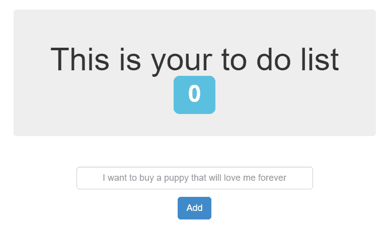

# 七、扩展和升级应用

在本章中，我们将讨论我们可以用来动态扩展运行在 Kubernetes 上的容器化服务的方法和策略，以处理我们服务不断变化的流量需求。遵循本章中的方法后，您将拥有创建负载平衡器以将流量分配给多个工作人员并增加带宽所需的技能。您还将知道如何在最短的停机时间内处理生产中的升级。

在本章中，我们将介绍以下食谱:

*   Kubernetes 上的扩展应用
*   将应用分配给具有优先级的节点
*   创建外部负载平衡器
*   使用 Istio 创建入口服务和服务网格
*   使用链接创建入口服务和服务网格
*   Kubernetes体内的自愈能力
*   通过蓝色/绿色部署管理升级

# 技术要求

本章中的方法假设您已经按照[第 1 章](01.html)、*中描述的推荐方法之一部署了功能性 Kubernetes 集群，构建生产就绪型 Kubernetes 集群*。

本章的其余部分将使用 Kubernetes 命令行工具`kubectl`，因为它是针对 Kubernetes 集群运行命令的主要命令行界面。我们还将在有 helm 图表的地方使用 Helm 来部署解决方案。

# Kubernetes 上的扩展应用

在本节中，我们将执行应用和集群扩展任务。您将学习如何在 Kubernetes 中手动和自动扩展您的服务容量，以支持动态流量。

# 准备好

将`k8sdevopscookbook/src`存储库克隆到您的工作站，以使用`chapter7`目录中的清单文件，如下所示:

```
$ git clone https://github.com/k8sdevopscookbook/src.git
$ cd /src/chapter7/
```

确保您已准备好 Kubernetes 集群，并且`kubectl`和`helm`已配置为管理集群资源。

# 怎么做…

本节进一步分为以下几个小节，以简化这一过程:

*   验证度量服务器的安装
*   手动缩放应用
*   使用水平POD自动缩放器自动缩放应用

# 验证度量服务器的安装

本节中使用水平POD自动缩放器配方的*自动缩放应用也需要在您的集群上安装度量服务器。度量服务器是一个集群范围的核心资源使用数据聚合器。按照以下步骤验证度量服务器的安装:*

1.  通过运行以下命令确认是否需要安装度量服务器:

```
$ kubectl top node
error: metrics not available yet
```

2.  如果安装正确，您应该会看到以下节点指标:

```
$ kubectl top nodes
NAME                          CPU(cores) CPU% MEMORY(bytes) MEMORY%
ip-172-20-32-169.ec2.internal 259m       12%  1492Mi        19%
ip-172-20-37-106.ec2.internal 190m       9%   1450Mi        18%
ip-172-20-48-49.ec2.internal  262m       13%  2166Mi        27%
ip-172-20-58-155.ec2.internal 745m       37%  1130Mi        14%
```

如果您收到一条说明`metrics not available yet`的错误消息，那么您需要按照下一章*中提供的步骤，使用 Kubernetes 度量服务器*添加度量来安装度量服务器。

# 手动缩放应用

当应用的使用率增加时，就有必要扩大应用的规模。Kubernetes 是为处理大规模工作负载的编排而构建的。

让我们执行以下步骤来了解如何手动扩展应用:

1.  将目录更改为`/src/chapter7/charts/node`，在这里可以找到您在*准备*部分创建的示例存储库的本地克隆:

```
$ cd /charts/node/
```

2.  使用以下命令安装待办事项应用示例。这个 Helm 图表将部署两个POD，包括一个 Node.js 服务和一个 MongoDB 服务:

```
$ helm install . --name my-ch7-app
```

3.  获取`my-ch7-app-node`的服务 IP 连接到应用。以下命令将返回应用的外部地址:

```
$ export SERVICE_IP=$(kubectl get svc --namespace default my-ch7-app-node --template "{{ range (index .status.loadBalancer.ingress 0) }}{{.}}{{ end }}")
$ echo http://$SERVICE_IP/
http://mytodoapp.us-east-1.elb.amazonaws.com/
```

4.  在网页浏览器中打开从*第 3 步*开始的地址。您将获得一个功能齐全的待办事项应用:



5.  使用`helm status`检查应用的状态。您将在`Available`栏中看到作为部署的一部分已经部署的POD数量:

```
$ helm status my-ch7-app
LAST DEPLOYED: Thu Oct 3 00:13:10 2019
NAMESPACE: default
STATUS: DEPLOYED
RESOURCES:
==> v1/Deployment
NAME               READY UP-TO-DATE AVAILABLE AGE
my-ch7-app-mongodb 1/1   1          1         9m9s
my-ch7-app-node    1/1   1          1         9m9s
...
```

6.  从单个副本的当前比例将节点窗格缩放到`3`副本:

```
$ kubectl scale --replicas 3 deployment/my-ch7-app-node
deployment.extensions/my-ch7-app-node scaled
```

7.  再次检查应用的状态，并确认这次可用副本的数量为`3`，并且`v1/Pod`部分中的`my-ch7-app-node`POD的数量已增加到`3`:

```
$ helm status my-ch7-app
...
RESOURCES:
==> v1/Deployment
NAME READY UP-TO-DATE AVAILABLE AGE
my-ch7-app-mongodb 1/1 1 1 26m
my-ch7-app-node 3/3 3 3 26m
...
==> v1/Pod(related)
NAME READY STATUS RESTARTS AGE
my-ch7-app-mongodb-5499c954b8-lcw27 1/1 Running 0 26m
my-ch7-app-node-d8b94964f-94dsb 1/1 Running 0 91s
my-ch7-app-node-d8b94964f-h9w4l 1/1 Running 3 26m
my-ch7-app-node-d8b94964f-qpm77 1/1 Running 0 91s
```

8.  要缩小您的应用，请重复*步骤 5* ，但这次使用`2`副本:

```
$ kubectl scale --replicas 2 deployment/my-ch7-app-node
deployment.extensions/my-ch7-app-node scaled
```

这样，您就学会了如何在需要时扩展应用。当然，您的 Kubernetes 集群资源也应该能够支持不断增长的工作负载容量。您将使用这些知识来测试Kubernetes配方中*自动治疗舱的服务治疗功能。*

下一个食谱将向您展示如何根据实际资源消耗而不是手动步骤自动扩展工作负载。

# 使用水平POD自动缩放器自动缩放应用

在本食谱中，您将学习如何创建**水平POD自动缩放器** ( **HPA** )来自动缩放我们在之前的食谱中创建的应用。我们还将使用负载生成器测试 HPA，以模拟流量增加影响我们服务的场景。请遵循以下步骤:

1.  首先，确保您已经从*手动扩展应用*配方中部署了待办事项示例应用。当您运行以下命令时，应该会列出 MongoDB 和 Node pods:

```
$ kubectl get pods | grep my-ch7-app
my-ch7-app-mongodb-5499c954b8-lcw27 1/1 Running 0 4h41m
my-ch7-app-node-d8b94964f-94dsb     1/1 Running 0 4h16m
my-ch7-app-node-d8b94964f-h9w4l     1/1 Running 3 4h41m
```

2.  使用以下命令以声明方式创建 HPA。当达到`targetCPUUtilizationPercentage`阈值时，这将自动执行在`1`到`5`副本之间扩展应用的过程。在我们的示例中，pods 的 CPU 利用率目标的平均值被设置为`50`使用率。当利用率超过此阈值时，您的副本将会增加:

```
cat <<EOF | kubectl apply -f -
apiVersion: autoscaling/v1
kind: HorizontalPodAutoscaler
metadata:
 name: my-ch7-app-autoscaler
 namespace: default
spec:
 scaleTargetRef:
 apiVersion: apps/v1
 kind: Deployment
 name: my-ch7-app-node
 minReplicas: 1
 maxReplicas: 5
 targetCPUUtilizationPercentage: 50
EOF
```

虽然大多数情况下结果可能是相同的，但是声明性配置需要理解 Kubernetes 对象配置规范和文件格式。作为替代方案，`kubectl`可以用于 Kubernetes 对象的命令式管理。

Note that you must have a request set in your deployment to use autoscaling. If you do not have a request for CPU in your deployment, the HPA will deploy but will not work correctly.
You can also create the same `HorizontalPodAutoscaler` imperatively by running the `$ kubectl autoscale deployment my-ch7-app-node --cpu-percent=50 --min=1 --max=5` command.

3.  确认当前副本的数量和 HPA 的状态。运行以下命令时，副本数量应为`1`:

```
$ kubectl get hpa
NAME                  REFERENCE                  TARGETS       MINPODS MAXPODS REPLICAS AGE
my-ch7-app-autoscaler Deployment/my-ch7-app-node 0%/50%        1       5       1        40s
```

4.  获取`my-ch7-app-node`的服务 IP，以便下一步使用:

```
$ export SERVICE_IP=$(kubectl get svc --namespace default my-ch7-app-node --template "{{ range (index .status.loadBalancer.ingress 0) }}{{.}}{{ end }}")
$ echo http://$SERVICE_IP/
http://mytodoapp.us-east-1.elb.amazonaws.com/
```

5.  启动一个新的终端窗口，并创建一个负载生成器来测试 HPA。确保您使用来自*步骤 4* 输出的实际服务 IP 替换了以下代码中的`YOUR_SERVICE_IP`。此命令将为您的待办事项应用生成流量:

```
$ kubectl run -i --tty load-generator --image=busybox /bin/sh

while true; do wget -q -O- YOUR_SERVICE_IP; done
```

6.  等待几分钟，让自动缩放器响应不断增加的流量。当负载生成器在一个终端上运行时，在单独的终端窗口上运行以下命令，以监控增加的 CPU 利用率。在我们的示例中，这被设置为`210%`:

```
$ kubectl get hpa
NAME                  REFERENCE                  TARGETS       MINPODS MAXPODS REPLICAS AGE
my-ch7-app-autoscaler Deployment/my-ch7-app-node 210%/50%      1       5       1        23m
```

7.  现在，检查部署大小，并确认由于工作负载增加，部署已调整到`5`副本:

```
$ kubectl get deployment my-ch7-app-node
NAME            READY UP-TO-DATE AVAILABLE AGE
my-ch7-app-node 5/5   5          5         5h23m
```

8.  在运行负荷发生器的终端屏幕上，按 *Ctrl* + *C* 终止负荷发生器。这将阻止流量进入您的应用。
9.  等待几分钟，让自动校准仪进行调整，然后通过运行以下命令来验证 HPA 状态。当前的 CPU 利用率应该更低。在我们的例子中，它显示它下降到`0%`:

```
$ kubectl get hpa
NAME                  REFERENCE                  TARGETS MINPODS MAXPODS REPLICAS AGE
my-ch7-app-autoscaler Deployment/my-ch7-app-node 0%/50%  1       5       1        34m
```

10.  检查部署大小，并确认由于停止流量生成器，部署已缩减至`1`副本:

```
$ kubectl get deployment my-ch7-app-node
NAME            READY UP-TO-DATE AVAILABLE AGE
my-ch7-app-node 1/1   1          1         5h35m
```

在本教程中，您学习了如何根据不断变化的指标自动调整应用。当应用扩展时，它们会在现有的工作节点上动态调度。

# 它是如何工作的...

本食谱向您展示了如何基于 Kubernetes 指标手动和自动动态调整部署中的POD数量。

在本食谱中，在*步骤 2* 、中，我们创建了一个自动缩放器，使用`minReplicas: 1`和`maxReplicas: 5`在定义的最小值之间调整副本的数量。如下例所示，调整标准由`targetCPUUtilizationPercentage: 50`指标触发:

```
spec:
  scaleTargetRef:
    apiVersion: apps/v1
    kind: Deployment
    name: my-ch7-app-node
  minReplicas: 1
  maxReplicas: 5
  targetCPUUtilizationPercentage: 50
```

`targetCPUUtilizationPercentage`与`autoscaling/v1`原料药一起使用。你很快就会看到`targetCPUUtilizationPercentage`将被一个叫做度量的数组所取代。

要了解新指标和自定义指标，请运行以下命令。这将把我们用 V1 API 创建的清单返回到使用 V2 API 的新清单中:

```
$ kubectl get hpa.v2beta2.autoscaling my-ch7-app-node -o yaml
```

这使您能够指定其他资源指标。默认情况下，CPU 和内存是唯一受支持的资源指标。除了这些资源度量之外，v2 APIs 还支持两种其他类型的度量，这两种度量都被认为是定制度量:每 pod 定制度量和对象度量。您可以通过访问*中提到的*Kubernetes HPA 文档*链接了解更多信息，另请参见*部分。

# 请参见

*   使用自定义指标的 Kubernetes pod 自动缩放器:[https://sysdig.com/blog/kubernetes-autoscaler/](https://sysdig.com/blog/kubernetes-autoscaler/)
*   kuble HPA 文件:[https://kuble tes . io/docs/tasks/run-application/horizontal-pod-auto scale/](https://kubernetes.io/docs/tasks/run-application/horizontal-pod-autoscale/)
*   使用配置文件对 Kubernetes 对象进行声明式管理:[https://Kubernetes . io/docs/tasks/manage-Kubernetes-Objects/declarative-config/](https://kubernetes.io/docs/tasks/manage-kubernetes-objects/declarative-config/)
*   使用配置文件对 Kubernetes 对象进行命令式管理:[https://Kubernetes . io/docs/tasks/manage-Kubernetes-Objects/命令式-config/](https://kubernetes.io/docs/tasks/manage-kubernetes-objects/imperative-config/)

# 将应用分配给节点

在本节中，我们将确保不会将 pods 调度到不合适的节点上。您将学习如何使用节点选择器、污点、容忍和设置优先级来将 pods 调度到 Kubernetes 节点中。

# 准备好

确保您已准备好 Kubernetes 集群，并且`kubectl`和`helm`已配置为管理集群资源。

# 怎么做…

本节进一步分为以下几个小节，以简化这一过程:

*   标记节点
*   使用节点选择器将POD分配给节点
*   使用节点和荚间相似性将荚分配给节点

# 标记节点

Kubernetes 标签用于指定资源的重要属性，这些属性可用于将组织结构应用于系统对象。在本食谱中，我们将了解用于 Kubernetes 节点的常见标签，并应用一个自定义标签，以便在将豆荚调度到节点时使用。

让我们执行以下步骤来列出已经分配给节点的一些默认标签:

1.  列出已分配给节点的标签。在我们的示例中，我们将使用已经部署在 AWS EC2 上的 kops 集群，因此您还将看到相关的 AWS 标签，例如可用性区域:

```
$ kubectl get nodes --show-labels
NAME                          STATUS ROLES AGE VERSION LABELS
ip-172-20-49-12.ec2.internal  Ready   node  23h v1.14.6 
kubernetes.io/arch=amd64,kubernetes.io/instance-type=t3.large,
kubernetes.io/os=linux,failure-domain.beta.kubernetes.io/region=us-east-1,
failure-domain.beta.kubernetes.io/zone=us-east-1a,
kops.k8s.io/instancegroup=nodes,kubernetes.io/hostname=ip-172-20-49-12.ec2.internal,
kubernetes.io/role=node,node-role.kubernetes.io/node=
...
```

2.  获取集群中的节点列表。在下一步中，我们将使用节点名称来分配标签:

```
$ kubectl get nodes
NAME                           STATUS ROLES  AGE VERSION
ip-172-20-49-12.ec2.internal   Ready  node   23h v1.14.6
ip-172-20-50-171.ec2.internal  Ready  node   23h v1.14.6
ip-172-20-58-83.ec2.internal   Ready  node   23h v1.14.6
ip-172-20-59-8.ec2.internal    Ready  master 23h v1.14.6
```

3.  将两个节点标记为`production`和`development`。从*步骤 2* 的输出中使用您的工作节点名称运行以下命令:

```
$ kubectl label nodes ip-172-20-49-12.ec2.internal environment=production
$ kubectl label nodes ip-172-20-50-171.ec2.internal environment=production
$ kubectl label nodes ip-172-20-58-83.ec2.internal environment=development
```

4.  验证新标签是否已分配给节点。这一次，除了标有`role=master`的节点外，您应该会在所有节点上看到`environment`标签:

```
$ kubectl get nodes --show-labels
```

建议为将使用您集群的其他人记录标签。虽然它们并不直接暗示核心系统的语义，但请确保它们仍然有意义，并且与所有用户相关。

# 使用节点选择器将POD分配给节点

在本食谱中，我们将学习如何使用节点选择器原语将 pod 调度到选定的节点上:

1.  在一个名为`todo-dev`的新目录中，创建我们在*中使用的 Helm 图表的副本，手动缩放应用*配方。我们稍后将编辑模板，以便指定`nodeSelector`:

```
$ cd src/chapter7/charts
$ mkdir todo-dev
$ cp -a node/* todo-dev/
$ cd todo-dev
```

2.  编辑`templates`目录中的`deployment.yaml`文件:

```
$ vi templates/deployment.yaml
```

3.  在`containers:`参数前添加`nodeSelector:`和`environment: "{{ .Values.environment }}"`。这应该如下所示:

```
...
          mountPath: {{ .Values.persistence.path }}
      {{- end }}
# Start of the addition
      nodeSelector:
        environment: "{{ .Values.environment }}"
# End of the addition
      containers:
      - name: {{ template "node.fullname" . }}

...
```

Helm 安装使用模板生成配置文件。如前例所示，为了简化自定义提供值的方式，使用了`{{expr}}`，这些值来自`values.yaml`文件名。`values.yaml`文件包含图表的默认值。

Although it may not be practical on large clusters, instead of using `nodeSelector` and labels, you can also schedule a pod on one specific node using the `nodeName` setting. In that case, instead of the `nodeSelector` setting, you add `nodeName: yournodename` to your deployment manifest.

4.  现在我们已经添加了变量，编辑`values.yaml`文件。这是我们将环境设置为`development`标签的地方:

```
$ vi values.yaml
```

5.  将`environment: development`行添加到文件的末尾。它应该如下所示:

```
...
## Affinity for pod assignment
## Ref: https://kubernetes.io/docs/concepts/configuration/assign-pod-node/#affinity-and-anti-affinity
##
affinity: {}
environment: development
```

6.  编辑`Chart.yaml`文件，将图表名称更改为其文件夹名称。在这个食谱中，它被称为`todo-dev`。进行这些更改后，前两行应该如下所示:

```
apiVersion: v1
name: todo-dev
...
```

7.  更新 Helm 依赖项并构建它们。以下命令将提取所有依赖项并构建 Helm 图表:

```
$ helm dep update & helm dep build
```

8.  检查图表中的问题。如果图表的文件有任何问题，林挺进程会提出来；否则，不应发现故障:

```
$ helm lint .
==> Linting .
Lint OK
1 chart(s) linted, no failures
```

9.  使用以下命令安装待办事项应用示例。这个 Helm 图将部署两个POD，包括一个 Node.js 服务和一个 MongoDB 服务，除了这次节点被标记为`environment: development`:

```
$ helm install . --name my-app7-dev --set serviceType=LoadBalancer
```

10.  使用以下命令检查是否已经在开发节点上调度了所有的 pods。您会发现`my-app7-dev-todo-dev`POD在标有`environment: development`的节点上运行:

```
$ for n in $(kubectl get nodes -l environment=development --no-headers | cut -d " " -f1); do kubectl get pods --all-namespaces --no-headers --field-selector spec.nodeName=${n} ; done
```

至此，您已经学习了如何使用`nodeSelector`原语将工作负载单元安排到选定的节点上。

# 使用节点和荚间相似性将荚分配给节点

在本食谱中，我们将学习如何使用节点选择器，使用相似性和反相似性特性，扩展我们在前面的食谱*中表达的约束，将豆荚分配给标记的节点。*

让我们使用一种基于场景的方法来简化不同相似性选择器选项的方法。我们将采用前面的例子，但这次有复杂的要求:

*   `todo-prod`必须在带有`environment:production`标签的节点上进行调度，如果不能，则应该失败。
*   `todo-prod`应该在标有`failure-domain.beta.kubernetes.io/zone=us-east-1a`或`us-east-1b`的节点上运行，但是如果不满足标签要求，可以在任何地方运行。
*   `todo-prod`必须和`mongodb`在同一个区域跑，但是不应该在`todo-dev`跑的区域跑。

The requirements listed here are only examples in order to represent the use of some affinity definition functionality. This is not the ideal way to configure this specific application. The labels may be completely different in your environment.

前面的场景将涵盖两种类型的节点关联性选项(`requiredDuringSchedulingIgnoredDuringExecution`和`preferredDuringSchedulingIgnoredDuringExecution`)。您将在我们的示例中看到这些选项。让我们开始吧:

1.  创建我们在*中使用的赫尔姆图表的副本，手动将应用*配方缩放到名为`todo-prod`的新目录。我们稍后将编辑模板，以便指定`nodeAffinity`规则:

```
$ cd src/chapter7/charts
$ mkdir todo-prod
$ cp -a node/* todo-prod/
$ cd todo-prod
```

2.  编辑`values.yaml`文件。要访问它，请使用以下命令:

```
$ vi values.yaml
```

3.  将最后一行`affinity: {}`替换为以下代码。此更改将满足我们之前定义的第一个要求，这意味着 pod 只能放置在带有`environment`标签且值为`production`的节点上:

```
## Affinity for pod assignment
## Ref: https://kubernetes.io/docs/concepts/configuration/assign-pod-node/#affinity-and-anti-affinity
# affinity: {}
# Start of the affinity addition #1
affinity:
 nodeAffinity:
 requiredDuringSchedulingIgnoredDuringExecution:
 nodeSelectorTerms:
 - matchExpressions:
 - key: environment
 operator: In
 values:
 - production
# End of the affinity addition #1
```

也可以在`nodeSelectorTerms`下指定多个`matchExpressions`。在这种情况下，pod 只能被调度到满足所有`matchExpressions`的节点上，这可能会限制您成功调度的机会。

Although it may not be practical on large clusters, instead of using `nodeSelector` and labels, you can also schedule a pod on a specific node using the `nodeName` setting. In this case, instead of the `nodeSelector` setting, add `nodeName: yournodename` to your deployment manifest.

4.  现在，在前面的代码添加下添加下面的行。此添加将满足我们定义的第二个要求，这意味着标签为`failure-domain.beta.kubernetes.io/zone`且值为`us-east-1a`或`us-east-1b`的节点将是首选节点:

```
          - production
# End of the affinity addition #1
# Start of the affinity addition #2
    preferredDuringSchedulingIgnoredDuringExecution:
    - weight: 1
      preference:
        matchExpressions:
        - key: failure-domain.beta.kubernetes.io/zone
          operator: In
          values:
          - us-east-1a
          - us-east-1b
# End of the affinity addition #2
```

5.  对于第三个需求，我们将使用荚间亲和和反亲和功能。它们允许我们根据已经在节点上运行的 pod 上的标签来限制我们的 pod 有资格被调度的节点，而不是采用节点上的标签来进行调度。以下 podAffinity `requiredDuringSchedulingIgnoredDuringExecution`规则将寻找存在`app: mongodb`的节点，并使用`failure-domain.beta.kubernetes.io/zone`作为拓扑关键字，向我们显示 pod 被允许调度的位置:

```
          - us-east-1b
# End of the affinity addition #2
# Start of the affinity addition #3a
  podAffinity:
    requiredDuringSchedulingIgnoredDuringExecution:
    - labelSelector:
        matchExpressions:
        - key: app
          operator: In
          values:
          - mongodb
      topologyKey: failure-domain.beta.kubernetes.io/zone
# End of the affinity addition #3a
```

6.  添加以下几行来完成要求。这一次，`podAntiAffinity preferredDuringSchedulingIgnoredDuringExecution`规则将寻找存在`app: todo-dev`的节点，并使用`failure-domain.beta.kubernetes.io/zone`作为拓扑关键字:

```
      topologyKey: failure-domain.beta.kubernetes.io/zone
# End of the affinity addition #3a
# Start of the affinity addition #3b
  podAntiAffinity:
    preferredDuringSchedulingIgnoredDuringExecution:
    - weight: 100
      podAffinityTerm:
        labelSelector:
          matchExpressions:
          - key: app
            operator: In
            values:
            - todo-dev
        topologyKey: failure-domain.beta.kubernetes.io/zone
# End of the affinity addition #3b
```

7.  编辑`Chart.yaml`文件，将图表名称更改为其文件夹名称。在这个食谱中，它被称为`todo-prod`。进行这些更改后，前两行应该如下所示:

```
apiVersion: v1
name: todo-prod
...
```

8.  更新 Helm 依赖项并构建它们。以下命令将提取所有依赖项并构建 Helm 图表:

```
$ helm dep update & helm dep build
```

9.  检查图表中的问题。如果图表文件有任何问题，林挺进程会提出来；否则，不应发现故障:

```
$ helm lint .
==> Linting .
Lint OK
1 chart(s) linted, no failures
```

10.  使用以下命令安装待办事项应用示例。这个 Helm 图表将部署两个单元，包括一个 Node.js 服务和一个 MongoDB 服务，这一次遵循我们在本食谱开始时定义的详细需求:

```
$ helm install . --name my-app7-prod --set serviceType=LoadBalancer
```

11.  使用以下命令检查节点上已调度的所有POD是否标记为`environment: production`。您会发现`my-app7-dev-todo-dev`POD在节点上运行:

```
$ for n in $(kubectl get nodes -l environment=production --no-headers | cut -d " " -f1); do kubectl get pods --all-namespaces --no-headers --field-selector spec.nodeName=${n} ; done
```

在本食谱中，您学习了高级 pod 调度实践，同时在 Kubernetes 中使用了许多原语，包括`nodeSelector`、节点关联性和 pod 间关联性。现在，您将能够配置一组位于同一定义拓扑中或安排在不同区域的应用，以便您有更好的**服务级别协议** ( **服务级别协议**)时间。

# 它是如何工作的...

本节中的食谱向您展示了如何在首选位置安排POD，有时是基于复杂的需求。

在*标注节点*食谱中，在*步骤 1* 中，你可以看到一些标准的标注已经应用到你的节点上了。以下是对它们的含义和用途的简短解释:

*   `kubernetes.io/arch`:这来自`runtime.GOARCH`参数，应用于节点，以识别在混合架构集群中运行不同架构容器映像的位置，如 x86、arm、arm64、ppc64le 和 s390x。
*   `kubernetes.io/instance-type`:这仅在您的集群部署在云提供商上时有用。实例类型告诉我们很多关于平台的信息，尤其是对于人工智能和机器学习工作负载，您需要在具有图形处理器或更快存储选项的实例上运行一些 pods。
*   `kubernetes.io/os`:应用于节点，来自`runtime.GOOS`。除非您在同一个集群中有 Linux 和 Windows 节点，否则它可能不太有用。
*   `failure-domain.beta.kubernetes.io/region`和`/zone`:如果您的集群部署在云提供商上，或者您的基础设施分布在不同的故障域中，这也更有用。在数据中心中，它可用于定义机架解决方案，以便您可以在不同的机架上安排机架，从而提高可用性。
*   `kops.k8s.io/instancegroup=nodes`:这是设置为实例组名称的节点标签。它仅用于 kops 集群。
*   `kubernetes.io/hostname`:显示工作人员的主机名。
*   `kubernetes.io/role`:这显示了工人在集群中的角色。一些常见的值包括用于表示工作节点的`node`和`master`，这表明该节点是主节点，并且默认情况下不可调度工作负载。

在*使用节点和荚间亲缘关系*将荚分配给节点的方法中，在*步骤 3* 中，节点亲缘关系规则规定，荚只能放置在具有关键字为`environment`且值为`production`的标签的节点上。

在*步骤 4* 中，首选`affinity key: value`要求(`preferredDuringSchedulingIgnoredDuringExecution`)。这里的`weight`字段可以是介于`1`和`100`之间的值。对于满足这些要求的每个节点，Kubernetes 调度程序都会计算一个和。总分最高的节点优先。

这里使用的另一个细节是`In`参数。节点关联支持以下运算符:`In`、`NotIn`、`Exists`、`DoesNotExist`、`Gt`和`Lt`。您可以通过在*中提到的示例*链接查看*调度程序相似性，了解更多关于操作符的信息，另请参见*部分。

If selector and affinity rules are not well planned, they can easily block pods getting scheduled on your nodes. Keep in mind that if you have specified both `nodeSelector` and `nodeAffinity` rules, both requirements must be met for the pod to be scheduled on the available nodes.

在*步骤 5* 中，使用荚间亲和性(`podAffinity`)来满足荚规格中的要求。在这个食谱中，`podAffinity`是`requiredDuringSchedulingIgnoredDuringExecution`。这里，`matchExpressions`表示一个POD只能在`failure-domain.beta.kubernetes.io/zone`与其他带有`app: mongodb`标签的POD运行的节点相匹配的节点上运行。

在*步骤 6* 中，使用`preferredDuringSchedulingIgnoredDuringExecution`满足`podAntiAffinity`的要求。在这里，`matchExpressions`说一个POD不能在`failure-domain.beta.kubernetes.io/zone`与其他带有`app: todo-dev`标签的POD运行的节点相匹配的节点上运行。通过设置`100`增加重量。

# 请参见

*   已知标签、注释和污点列表:[https://kubernetes . io/docs/reference/kubernetes-API/标签-注释-污点/](https://kubernetes.io/docs/reference/kubernetes-api/labels-annotations-taints/)
*   在 Kubernetes 文档中为节点分配 Pods:[https://Kubernetes . io/docs/tasks/configure-pod-container/assign-Pods-Nodes/](https://kubernetes.io/docs/tasks/configure-pod-container/assign-pods-nodes/)
*   关于 Kubernetes 文档中标签和选择器的更多信息:[https://Kubernetes . io/docs/concepts/overview/使用对象/标签/](https://kubernetes.io/docs/concepts/overview/working-with-objects/labels/)
*   调度程序关联性示例:[https://banzaicloud.com/blog/k8s-affinities/](https://banzaicloud.com/blog/k8s-affinities/)
*   节点关联性和节点选择器设计文档:[https://github . com/kubernetes/community/blob/master/contributor/design-propositions/scheduling/node affinity . MD](https://github.com/kubernetes/community/blob/master/contributors/design-proposals/scheduling/nodeaffinity.md)
*   Interpod 拓扑亲和与反亲和设计文档:[https://github . com/kubernetes/community/blob/master/投稿人/设计-提案/调度/podaffinity.md](https://github.com/kubernetes/community/blob/master/contributors/design-proposals/scheduling/podaffinity.md)

# 创建外部负载平衡器

负载平衡器服务类型是相对简单的入口替代服务，它使用基于云的外部负载平衡器。外部负载平衡器服务类型的支持仅限于特定的云提供商，但受到最受欢迎的云提供商的支持，包括 AWS、GCP、Azure、阿里巴巴云和 OpenStack。

在本节中，我们将使用负载平衡器公开我们的工作负载端口。我们将学习如何使用`inlet-operator`为公共云上的集群以及您的私有集群创建外部 GCE/AWS 负载平衡器。

# 准备好

确保您已准备好 Kubernetes 集群，并且`kubectl`和`helm`已配置为管理集群资源。在本食谱中，我们使用的是已经使用`kops`部署在 AWS 上的集群，如[第 1 章](01.html)、*构建生产就绪型 Kubernetes 集群*中*亚马逊网络服务*食谱中所述。相同的指令将适用于所有主要的云提供商。

要访问示例文件，请将`k8sdevopscookbook/src`存储库克隆到您的工作站，以使用`src/chapter7/lb`目录中的配置文件，如下所示:

```
$ git clone https://github.com/k8sdevopscookbook/src.git
$ cd src/chapter7/lb/
```

克隆示例存储库后，您可以继续查看菜谱。

# 怎么做…

本节进一步分为以下几个小节，以简化这一过程:

*   创建外部云负载平衡器
*   查找服务的外部地址

# 创建外部云负载平衡器

当您创建一个应用并将其公开为 Kubernetes 服务时，您通常需要通过一个 IP 地址或 URL 从外部访问该服务。在本食谱中，您将学习如何创建负载平衡器，也称为云负载平衡器。

在前面的章节中，我们看到了几个使用负载平衡器服务类型来公开 IP 地址的示例，包括前面章节中使用 MinIO 配置和管理 S3 对象存储的*和使用 Kasten* 方法的*应用备份和恢复，以及本章中在*将应用分配给节点*方法中提供的待办应用。*

让我们使用 MinIO 应用来学习如何创建负载平衡器。按照以下步骤创建服务，并使用外部负载平衡器服务公开它:

1.  查看`src/chapter7/lb`中示例目录中`minio.yaml`文件的内容，并使用以下命令进行部署。这将创建一个状态集和一个服务，其中 MinIO 端口通过端口号`9000`在内部暴露给集群。您可以选择应用相同的步骤，并为自己的应用创建负载平衡器。在这种情况下，跳到*步骤 2* :

```
$ kubectl apply -f minio.yaml
```

2.  列出 Kubernetes 上可用的服务。您将会看到，MinIO 服务在`EXTERNAL-IP`字段下显示`ClusterIP`作为服务类型和`none`:

```
$ kubectl get svc
NAME       TYPE      CLUSTER-IP EXTERNAL-IP PORT(S)  AGE
kubernetes ClusterIP 100.64.0.1 <none>      443/TCP  5d
minio      ClusterIP None       <none>      9000/TCP 4m
```

3.  通过将`TYPE`设置为`LoadBalancer`来创建新服务。以下命令将使用`TCP`协议在`targetPort: 9000`公开我们的 MinIO 应用的`port: 9000`，如下所示:

```
cat <<EOF | kubectl apply -f -
apiVersion: v1
kind: Service
metadata:
 name: minio-service
spec:
 type: LoadBalancer
 ports:
 - port: 9000
 targetPort: 9000
 protocol: TCP
 selector:
 app: minio
EOF
```

前面的命令将立即创建`Service`对象，但是云提供商端的实际负载平衡器可能需要 30 秒到 1 分钟才能完全初始化。虽然对象会声明它已经准备好了，但是在负载平衡器初始化之前，它不会运行。与入口控制器相比，这是云负载平衡器的缺点之一，我们将在下一个食谱*中看到，使用 Istio* 创建入口服务和服务网格。

作为*步骤 3* 的替代，您也可以使用以下命令创建负载平衡器:

```
$ kubectl expose rc example --port=9000 --target-port=9000 --name=minio-service --type=LoadBalancer
```

# 查找服务的外部地址

让我们执行以下步骤来获取服务的外部可达地址:

1.  列出使用`LoadBalancer`类型的服务。`EXTERNAL-IP`栏将显示云供应商提供的地址:

```
$ kubectl get svc |grep LoadBalancer
NAME          TYPE         CLUSTER-IP    EXTERNAL-IP                                  PORT(S)        AGE
minio-service LoadBalancer 100.69.15.120 containerized.me.us-east-1.elb.amazonaws.com 9000:30705/TCP 4h39m
```

2.  如果您运行在云提供商服务(如 AWS)上，您也可以使用以下命令来获取确切的地址。您可以将其复制并粘贴到网络浏览器中:

```
$ SERVICE_IP=http://$(kubectl get svc minio-service \
-o jsonpath='{.status.loadBalancer.ingress[0].hostname}:{.spec.ports[].targetPort}')
$ echo $SERVICE_IP
```

3.  如果您在裸机服务器上运行，那么您可能不会有`hostname`条目。例如，如果您正在运行 metalllb([https://metallb.universe.tf/](https://metallb.universe.tf/))，一个用于裸机 Kubernetes 集群的负载平衡器，或者 SeeSaw([https://github.com/google/seesaw](https://github.com/google/seesaw))，一个基于 **Linux 虚拟服务器** ( **LVS** )的负载平衡平台，那么您需要寻找`ip`条目来代替:

```
$ SERVICE_IP=http://$(kubectl get svc minio-service \
-o jsonpath='{.status.loadBalancer.ingress[0].ip}:{.spec.ports[].targetPort}')
$ echo $SERVICE_IP
```

前面的命令将返回类似`https://containerized.me.us-east-1.elb.amazonaws.com:9000`的链接。

# 它是如何工作的...

这个方法向您展示了如何快速创建云负载平衡器，以通过外部地址公开您的服务。

在*创建云负载均衡器*配方中，在*步骤 3* 中，当在 Kubernetes 中创建负载均衡器服务时，将代表您创建云提供商负载均衡器，而无需单独查看云服务提供商 API。此功能可以帮助您轻松管理 Kubernetes 集群之外的负载平衡器的创建，但同时需要花费一些时间来完成，并且每个服务都需要一个单独的负载平衡器，因此这可能成本很高并且不太灵活。

为了给负载平衡器带来灵活性并增加更多的应用级功能，您可以使用入口控制器。使用入口，流量路由可以由入口资源中定义的规则控制。在接下来的两个食谱中，您将了解更多关于流行的入口网关的信息，*使用 Istio* 创建入口服务和服务网格，以及*使用 Linkerd* 创建入口服务和服务网格。

# 请参见

*   负载平衡器服务类型的 Kubernetes 文档:[https://kubernetes . io/docs/concepts/services-networking/service/# load balancer](https://kubernetes.io/docs/concepts/services-networking/service/#loadbalancer)
*   在亚马逊 EKS 上使用负载平衡器
*   在 AKS 上使用负载平衡器:[https://docs . Microsoft . com/en-us/azure/AKS/负载平衡器-标准](https://docs.microsoft.com/en-us/azure/aks/load-balancer-standard)
*   在阿里巴巴云上使用负载平衡器:[https://www.alibabacloud.com/help/doc-detail/53759.htm](https://www.alibabacloud.com/help/doc-detail/53759.htm)
*   私有 kubernetes 集群的负载平衡器:[https://blog . alexellis . io/本地 Kubernetes 集群入口/](https://blog.alexellis.io/ingress-for-your-local-kubernetes-cluster/)

# 使用 Istio 创建入口服务和服务网格

Istio 是一个流行的开源服务网格。在本节中，我们将启动并运行基本的 Istio 服务网格功能。您将学习如何创建服务网格来保护、连接和监控微服务。

服务网格是一个非常详细的概念，我们不打算解释任何详细的用例。相反，我们将专注于启动和运行我们的服务。

# 准备好

确保您已准备好 Kubernetes 集群，并且`kubectl`和`helm`已配置为管理集群资源。

将`https://github.com/istio/istio`存储库克隆到您的工作站，如下所示:

```
$ git clone https://github.com/istio/istio.git 
$ cd istio
```

我们将使用前面存储库中的示例在我们的 Kubernetes 集群上安装 Istio。

# 怎么做…

本节进一步分为以下几个小节，以简化这一过程:

*   使用 Helm 安装 Istio
*   验证安装
*   创建入口网关

# 使用 Helm 安装 Istio

让我们执行以下步骤来安装 Istio:

1.  在我们部署 Istio 之前，创建所需的 Istio CRDs:

```
$ helm install install/kubernetes/helm/istio-init --name istio-init \
--namespace istio-system
```

2.  使用默认配置安装 Istio。这将部署 Istio 核心组件，即`istio-citadel`、`istio-galley`、`istio-ingressgateway`、`istio-pilot`、`istio-policy`、`istio-sidecar-injector`和`istio-telemetry`:

```
$ helm install install/kubernetes/helm/istio --name istio \
--namespace istio-system
```

3.  通过标记运行应用的命名空间来启用自动侧钻注入。在本食谱中，我们将使用`default`命名空间:

```
$ kubectl label namespace default istio-injection=enabled
```

为了能够为您的应用获得 Istio 功能，pods 需要运行 Istio sidecar 代理。前面的命令将自动注入 Istio 边车。作为替代方案，您可以在*中使用`istioctl`命令找到手动将 Istio 侧车添加到POD的说明，安装 Istio 侧车说明*链接在*中提供，另请参见*部分。

# 验证安装

让我们执行以下步骤来确认 Istio 已成功安装:

1.  检查已创建的 Istio CRDs 的数量。下面的命令应该返回`23`，这是 Istio 已经创建的 CRD 的数量:

```
$ kubectl get crds | grep 'istio.io' | wc -l
23
```

2.  运行以下命令，并确认已创建 Istio 核心组件服务列表:

```
$ kubectl get svc -n istio-system
NAME                   TYPE         CLUSTER-IP     EXTERNAL-IP PORT(S)             AGE
istio-citadel          ClusterIP    100.66.235.211 <none>      8060/TCP,...        2m10s
istio-galley           ClusterIP    100.69.206.64  <none>      443/TCP,...         2m11s
istio-ingressgateway   LoadBalancer 100.67.29.143  domain.com  15020:31452/TCP,... 2m11s
istio-pilot            ClusterIP    100.70.130.148 <none>      15010/TCP,...       2m11s
istio-policy           ClusterIP    100.64.243.176 <none>      9091/TCP,...        2m11s
istio-sidecar-injector ClusterIP    100.69.244.156 <none>      443/TCP,...         2m10s
istio-telemetry        ClusterIP    100.68.146.30  <none>      9091/TCP,...        2m11s
prometheus             ClusterIP    100.71.172.191 <none>      9090/TCP            2m11s
```

3.  确保列出的所有POD都处于`Running`状态:

```
$ kubectl get pods -n istio-system
```

4.  确认 Istio 注入启用了命名空间。您应该只看到`default`命名空间的`istio-injection`:

```
$ kubectl get namespace -L istio-injection
NAME            STATUS AGE  ISTIO-INJECTION
default         Active 5d8h enabled
istio-system    Active 40m
kube-node-lease Active 5d8h
kube-public     Active 5d8h
kube-system     Active 5d8h
```

您总是可以通过向名称空间添加`istio-injection=enabled`标签来为其他名称空间启用注入。

# 创建入口网关

Istio 没有使用控制器来负载平衡流量，而是使用网关。让我们执行以下步骤，为我们的示例应用创建 Istio 入口网关:

1.  查看`src/chapter7/lb`中示例目录中`minio.yaml`文件的内容，并使用以下命令进行部署。这将创建一个状态集和一个服务，其中 MinIO 端口通过端口号`9000`在内部暴露给集群。您也可以选择应用相同的步骤，并为自己的应用创建一个入口网关。在这种情况下，跳到*步骤 2* :

```
$ kubectl apply -f minio.yaml
```

2.  获取入口 IP 和端口:

```
$ export INGRESS_HOST=$(kubectl -n istio-system get service istio-ingressgateway -o jsonpath='{.status.loadBalancer.ingress[0].hostname}')
$ export INGRESS_PORT=$(kubectl -n istio-system get service istio-ingressgateway -o jsonpath='{.spec.ports[?(@.name=="http2")].port}')
$ export SECURE_INGRESS_PORT=$(kubectl -n istio-system get service istio-ingressgateway -o jsonpath='{.spec.ports[?(@.name=="https")].port}')
```

3.  创建新的 Istio 网关:

```
$ cat <<EOF | kubectl apply -f -
apiVersion: networking.istio.io/v1alpha3
kind: Gateway
metadata:
 name: minio-gateway
spec:
 selector:
 istio: ingressgateway 
 servers:
 - port:
 number: 80
 name: http
 protocol: HTTP
 hosts:
 - "*"
EOF
```

4.  创建一个新的`VirtualService`通过网关将请求转发到 MinIO 实例。这有助于为网关指定路由，并将网关绑定到`VirtualService`:

```
$ cat <<EOF | kubectl apply -f -
apiVersion: networking.istio.io/v1alpha3
kind: VirtualService
metadata:
 name: minio
spec:
 hosts:
 - "*"
 gateways:
 - minio-gateway.default
 http:
 - match:
 - uri:
 prefix: /
 route:
 - destination:
 port:
 number: 9000
 host: minio
EOF
```

这种配置将使您的服务暴露给使用 Istio 的外部访问，并且您将对规则有更多的控制。

# 它是如何工作的...

这个食谱向您展示了如何快速配置 Istio 服务网格，并使用自定义 Istio 资源(如入口网关)向外部访问开放服务。

为了使服务网格正常运行，网格中的每个POD都需要运行一个特使侧车。在*使用赫尔姆*配方安装 Istio 的过程中，在*步骤 3* 中，我们启用了`default`命名空间中POD的自动注入，以便部署在该命名空间中的POD将运行特使侧车。

入口控制器是一个反向代理，在 Kubernetes 集群中运行并配置路由规则。在*创建入口网关*的方法中，在*步骤 2* 中，与传统的 Kubernetes 入口对象不同，我们使用了 Istio CRDs(如网关、虚拟服务和目的规则)来创建入口。

我们使用`istio: ingressgateway`选择器为入口网关创建了一个网关规则，以便接受端口号`80`上的 HTTP 流量。

在*第 4 步*中，我们为想要公开的 MinIO 服务创建了一个虚拟服务。由于网关可能位于不同的名称空间，我们使用`minio-gateway.default`来设置网关名称。

有了这个，我们已经使用 HTTP 公开了我们的服务。通过查看*部分的链接，您可以了解更多关于使用 HTTPS 协议公开服务的信息。*

# 还有更多…

虽然很受欢迎，但 Istio 并不是最简单的入口。我们强烈建议您查看适用于您的用例的所有选项，并考虑替代方案。因此，了解如何移除 Istio 是很有用的。

# 删除 Istio

您可以使用以下命令删除 Istio:

```
$ helm delete istio
$ helm delete istio-init
```

如果您想从 Helm 记录中完全删除已删除的发行记录，并释放发行名称供以后使用，请在前面的命令中添加`--purge`参数。

# 请参见

*   微妙地： [https://istio.io/docs/](https://istio.io/docs/)
*   微妙地： [https://istio.io/docs/examples/bookinfo/](https://istio.io/docs/examples/bookinfo/)
*   安装 Istio sidecar:[https://Istio . io/docs/setup/additional-setup/sidecar-injection/](https://istio.io/docs/setup/additional-setup/sidecar-injection/)
*   凯尔西·海托华的入门教程:https://github.com/kelseyhightower/istio-ingress-tutorial
    T2
*   与 Istio 的交通管理:[https://istio.io/docs/tasks/traffic-management/](https://istio.io/docs/tasks/traffic-management/)
*   伊斯蒂欧安保:https://istio.io/docs/tasks/security/T2
*   与 Istio 一起执行政策:[https://istio.io/docs/tasks/policy-enforcement/](https://istio.io/docs/tasks/policy-enforcement/)
*   用 Istio 采集遥测信息:[https://istio.io/docs/tasks/telemetry/](https://istio.io/docs/tasks/telemetry/)
*   使用证书管理器创建 Kubernetes 入口:[https://istio . io/docs/tasks/traffic-management/ingress/ingress-certmgr/](https://istio.io/docs/tasks/traffic-management/ingress/ingress-certmgr/)

# 使用链接创建入口服务和服务网格

在本节中，我们将启动并运行基本的 Linkerd 服务网格。您将学习如何创建服务网格来保护、连接和监控微服务。

服务网格本身就是一个非常详细的概念，我们不打算在这里解释任何详细的用例。相反，我们将专注于启动和运行我们的服务。

# 准备好

确保您已准备好 Kubernetes 集群，并且`kubectl`和`helm`已配置为管理集群资源。

要访问该配方的示例文件，请将`k8sdevopscookbook/src`存储库克隆到您的工作站，以使用`src/chapter7/linkerd`目录中的配置文件，如下所示:

```
$ git clone https://github.com/k8sdevopscookbook/src.git
$ cd src/chapter7/linkerd/
```

克隆了前面的存储库之后，您就可以开始使用菜谱了。

# 怎么做…

本节进一步分为以下几个小节，以简化这一过程:

*   安装链接的 cli
*   安装链接
*   验证链接的部署
*   查看链接的指标

# 安装链接的 cli

要与 Linkerd 交互，需要安装`linkerd` CLI。请遵循以下步骤:

1.  通过运行以下命令安装`linkerd`命令行界面:

```
$ curl -sL https://run.linkerd.io/install | sh
```

2.  将`linkerd`命令行界面添加到您的路径中:

```
$ export PATH=$PATH:$HOME/.linkerd2/bin
```

3.  通过运行以下命令，验证`linkerd`命令行界面是否已安装。它应该显示服务器不可用，因为我们还没有安装它:

```
$ linkerd version
Client version: stable-2.5.0
Server version: unavailable
```

4.  验证`linkerd`可以安装。此命令将检查集群，并指出问题(如果存在):

```
$ linkerd check --pre
Status check results are √
```

如果状态检查看起来不错，你可以继续下一个食谱。

# 安装链接

与替代方案相比，Linkerd 更容易上手和管理，因此它是我首选的服务网格。

使用链路命令行界面安装链路控制平面。该命令将使用默认选项并在`linkerd`命名空间中安装链接器组件:

```
$ linkerd install | kubectl apply -f -
```

提取所有容器映像可能需要一分钟左右的时间。之后，您可以通过遵循下一个方法*验证 Linkerd 部署来验证组件的运行状况。*

# 验证链接的部署

验证 Linkerd 的部署和安装过程一样简单。

运行以下命令来验证安装。这将显示控制平面组件和 API 的长摘要，并确保您运行的是最新版本:

```
$ linkerd check
...

control-plane-version
---------------------
√ control plane is up-to-date
√ control plane and cli versions match

Status check results are √
```

如果状态检查良好，就可以用一个示例应用测试 Linkerd 了。

# 添加链接到服务

按照以下步骤将 Linkerd 添加到我们的演示应用中:

1.  将目录更改到`linkerd`文件夹:

```
$ cd /src/chapter7/linkerd
```

2.  部署演示应用，它混合使用 gRPC 和 HTTP 调用来为用户的投票应用提供服务:

```
$ kubectl apply -f emojivoto.yml
```

3.  获取演示应用的服务 IP。以下命令将返回应用的外部可访问地址:

```
$ SERVICE_IP=http://$(kubectl get svc web-svc -n emojivoto \
-o jsonpath='{.status.loadBalancer.ingress[0].hostname}:{.spec.ports[].targetPort}')
$ echo $SERVICE_IP
```

4.  在网页浏览器中从*第 3 步*打开外部地址，确认应用功能正常:


5.  通过标记运行应用的命名空间来启用自动侧钻注入。在这个食谱中，我们使用`emojivoto`命名空间:

```
$ kubectl label namespace emojivoto linkerd.io/inject=enabled
```

您也可以通过使用
`kubectl get -n emojivoto deploy -o yaml | linkerd inject - | kubectl apply -f -`命令修补运行应用的POD来手动注入`linkerd`边车。在这个食谱中，使用了`emojivoto`命名空间。

# 还有更多…

本节进一步分为以下几个小节，以简化这一过程:

*   访问仪表板
*   删除链接

# 访问仪表板

我们可以使用端口转发或者使用入口来访问仪表板。让我们从简单的方法开始，即通过端口转发到您的本地系统:

1.  通过运行以下命令查看 Linkerd 仪表板:

```
$ linkerd dashboard &
```

2.  访问浏览器中的以下链接查看仪表板:

```
http://127.0.0.1:50750
```

上述命令将设置一个从本地系统转发到`linkerd-web`POD的端口。

如果您想从外部 IP 访问仪表板，请执行以下步骤:

1.  下载入口定义示例:

```
$ wget https://raw.githubusercontent.com/k8sdevopscookbook/src/master/chapter7/linkerd/ingress-nginx.yaml
```

2.  在`src/chapter7/linkerd`目录下的`ingress-nginx.yaml`文件中编辑入口配置，并将第 27 行的`- host` : `dashboard.example.com`更改为您希望显示仪表板的网址。使用以下命令应用配置:

```
$ kubectl apply -f ingress-nginx.yaml
```

前面的示例文件使用`linkerddashboard.containerized.me`作为仪表板地址。它还通过使用`admin/admin`凭证的基本身份验证来保护访问。强烈建议您通过使用`username:password`格式更改配置的`auth`部分中定义的 base64 编码密钥对来使用自己的凭据。

# 删除链接

要删除链接器控制平面，请运行以下命令:

```
$ linkerd install --ignore-cluster | kubectl delete -f -
```

该命令将为 Linkerd 控制平面提取所有配置文件的列表，包括名称空间、服务帐户和 CRD，并删除它们。

# 请参见

*   连接的
*   与 Linkerd 的常见任务:[https://linkerd.io/2/tasks/](https://linkerd.io/2/tasks/)
*   常见问题链接问答:[https://linkerd.io/2/faq/](https://linkerd.io/2/faq/)

# Kubernetes体内的自愈能力

Kubernetes 在集群级别具有自我修复能力。它会重新启动失败的容器，在节点死亡时重新安排 pods，甚至杀死不响应用户定义的运行状况检查的容器。

在本节中，我们将执行应用和集群扩展任务。您将学习如何使用活跃度和就绪性探测器来监控容器运行状况，并在出现故障时触发重启操作。

# 准备好

确保您已准备好 Kubernetes 集群，并且`kubectl`和`helm`已配置为管理集群资源。

# 怎么做…

本节进一步分为以下几个小节，以简化这一过程:

*   测试自愈豆荚
*   向POD添加活性探测器

# 测试自愈豆荚

在本食谱中，我们将在部署中手动移除豆荚，以展示 Kubernetes 如何替换它们。稍后，我们将学习如何使用用户定义的运行状况检查来实现自动化。现在，让我们测试一下 Kubernetes 对被摧毁的豆荚的自我修复能力:

1.  创建包含两个或多个副本的部署或状态集。例如，我们将使用上一章中使用的 MinIO 应用，在*中使用 MinIO* 配方配置和管理 S3 对象存储。该示例有四个副本:

```
$ cd src/chapter7/autoheal/minio
$ kubectl apply -f minio.yaml
```

2.  列出作为状态集一部分部署的 MinIO POD。您将看到四个POD:

```
$ kubectl get pods |grep minio
minio-0 1/1 Running 0 4m38ms
minio-1 1/1 Running 0 4m25s
minio-2 1/1 Running 0 4m12s
minio-3 1/1 Running 0 3m48s
```

3.  删除一个豆荚来测试 Kubernetes 的自动修复功能，并立即再次列出豆荚。您将看到终止的 pod 将被快速重新安排和部署:

```
$ kubectl delete pod minio-0
pod "minio-0" deleted
$ kubectl get pods |grep miniominio-0
minio-0 0/1 ContainerCreating 0 2s
minio-1 1/1 Running           0 8m9s
minio-2 1/1 Running           0 7m56s
minio-3 1/1 Running           0 7m32s
```

有了这个，你已经测试了Kubernetes在操作中手动摧毁一个豆荚后的自愈能力。现在，我们将学习如何向豆荚添加健康状态检查，以让 Kubernetes 自动杀死无响应的豆荚，从而重新启动它们。

# 向POD添加活性探测器

Kubernetes 使用活跃度探测器来找出何时重启容器。活跃度可以通过在容器内运行活跃度探测命令并验证它通过 TCP 套接字活跃度探测返回`0`或通过向指定路径发送 HTTP 请求来检查。在这种情况下，如果路径返回成功代码，那么 kubelet 将认为容器是健康的。在本食谱中，我们将学习如何向示例应用发送 HTTP 请求方法。让我们执行以下步骤来添加活跃度探测器:

1.  在`src/chapter7/autoheal/minio`目录中编辑`minio.yaml`文件，并在`volumeMounts`节的正下方，在`volumeClaimTemplates`之前添加以下`livenessProbe`节。您的 YAML 货单应该如下所示。这将每隔`20`秒向`/minio/health/live`位置发送一个 HTTP 请求，以验证其运行状况:

```
...
        volumeMounts:
        - name: data
          mountPath: /data
#### Starts here 
        livenessProbe:
          httpGet:
            path: /minio/health/live
            port: 9000
          initialDelaySeconds: 120
          periodSeconds: 20
#### Ends here 
  # These are converted to volume claims by the controller
  # and mounted at the paths mentioned above.
  volumeClaimTemplates:
```

对于使用 HTTP 请求工作的活动探测器，应用需要公开未经身份验证的运行状况检查端点。在我们的例子中，MinIO 通过`/minio/health/live`端点提供这一点。如果您的工作负载没有类似的端点，您可能希望在您的 pods 中使用 liveness 命令来验证它们的运行状况。

2.  部署应用。它将创建四个POD:

```
$ kubectl apply -f minio.yaml
```

3.  通过描述其中一个POD来确认活性探测器。您将看到类似如下的`Liveness`描述:

```
$ kubectl describe pod minio-0
...
 Liveness: http-get http://:9000/minio/health/live delay=120s timeout=1s period=20s #success=1 #failure=3
...
```

4.  为了测试活跃度探针，我们需要再次编辑`minio.yaml`文件。这一次，将`livenessProbe`端口设置为`8000`，这是应用无法响应 HTTP 请求的地方。重复*步骤 2* 和 *3* ，重新部署应用，并检查 pod 描述中的事件。您将在事件中看到一条`minio failed liveness probe, will be restarted`消息:

```
$ kubectl describe pod minio-0
```

5.  您可以通过列出POD来确认重启。您将会看到，由于每个 MinIO pod 的活动状态都失败，因此它会被重新启动多次:

```
$ kubectl get pods
NAME    READY STATUS  RESTARTS AGE
minio-0 1/1   Running 4        12m
minio-1 1/1   Running 4        12m
minio-2 1/1   Running 3        11m
minio-3 1/1   Running 3        11m
```

在本食谱中，您学习了如何为运行在 Kubernetes 集群中的应用实现自动修复功能。

# 它是如何工作的...

这个食谱向您展示了如何在运行于 Kubernetes 上的应用中使用活性探测器。

在*添加活跃度探测器到豆荚*食谱中，在*步骤 1* 中，我们添加了一个基于 HTTP 请求的健康检查。

通过添加 StatefulSet 路径和端口，我们让 kubelet 探测定义的端点。这里，`initialDelaySeconds`字段告诉 kubelet 应该在第一次探测前等待`120`秒。如果您的应用需要一段时间来准备好端点，那么请确保在第一次探测之前留出足够的时间；否则，您的 pods 将在端点响应请求之前重新启动。

在*第 3 步*中，`periodSeconds`字段指定 kubelet 应每隔`20`秒执行一次活性探测。同样，根据应用的预期可用性，您应该为您的应用设置一个合适的时间段。

# 请参见

*   配置活跃度和就绪探测器:[https://kubernetes . io/docs/tasks/configure-pod-container/configure-活跃度-就绪-启动-探测器/](https://kubernetes.io/docs/tasks/configure-pod-container/configure-liveness-readiness-startup-probes/)
*   Kubernetes 最佳实践:设置运行状况检查:[https://cloud . Google . com/blog/products/GCP/kubernetes-最佳实践-设置-运行状况检查-就绪和活动-探测](https://cloud.google.com/blog/products/gcp/kubernetes-best-practices-setting-up-health-checks-with-readiness-and-liveness-probes)

# 通过蓝色/绿色部署管理升级

蓝绿色部署体系结构是一种通过运行两个相同的生产环境来减少停机时间的方法，这两个环境可以在需要时进行切换。这两种环境被识别为蓝色和绿色。在本节中，我们将执行翻转应用升级。您将学习如何通过使用 Kubernetes 中的蓝色/绿色部署，将应用的新版本转移到持久存储上。

# 准备好

确保您已准备好 Kubernetes 集群，并且`kubectl`和`helm`已配置为管理集群资源。

对于这个方法，我们需要一个持久存储提供程序来从应用的一个版本中获取快照，并对应用的另一个版本使用克隆来保留持久卷内容。我们将使用 OpenEBS 作为持久存储提供者，但是您也可以使用任何 CSI 兼容的存储提供者。

按照*持久存储使用 OpenEBS* 配方中[第 5 章](05.html)、*准备有状态工作负载*中的说明，确保已使用 cStor 存储引擎配置了 OpenEBS。

# 怎么做…

本节进一步分为以下几个小节，以简化这一过程:

*   创建蓝色部署
*   创建绿色部署
*   将流量从蓝色切换到绿色

# 创建蓝色部署

有许多传统工作负载无法与 Kubernetes 的滚动更新方式配合使用。如果您的工作负载需要部署新版本并立即切换到该版本，那么您可能需要执行蓝色/绿色部署。使用蓝色/绿色部署方法，我们将当前生产标记为蓝色。在下一个配方中，我们将在将服务重定向到绿色之前创建一个名为绿色的相同生产环境。

让我们执行以下步骤来创建第一个应用，我们称之为蓝色:

1.  将目录更改为该配方示例所在的位置:

```
$ cd /src/chapter7/bluegreen
```

2.  查看`blue-percona.yaml`文件的内容，并使用该文件创建应用的蓝色版本:

```
$ kubectl create -f blue-percona.yaml
pod "blue" created
persistentvolumeclaim "demo-vol1-claim" created
```

3.  查看`percona-svc.yaml`文件的内容，并使用该文件创建服务。您将看到服务中的`selector`设置为`app: blue`。该服务会将所有 MySQL 流量转发到蓝色窗格:

```
$ kubectl create -f percona-svc.yaml
```

4.  获取`percona`的服务 IP。在我们的示例中，集群 IP 是`10.3.0.75`:

```
$ kubectl get svc percona
NAME TYPE CLUSTER-IP EXTERNAL-IP PORT(S) AGE
percona ClusterIP 10.3.0.75 <none> 3306/TCP 1m
```

5.  编辑`sql-loadgen.yaml`文件，用您的 percona 服务 IP 替换目标 IP 地址。在我们的例子中，是`10.3.0.75`:

```
      containers:
      - name: sql-loadgen
        image: openebs/tests-mysql-client
        command: ["/bin/bash"]
        args: ["-c", "timelimit -t 300 sh MySQLLoadGenerate.sh 10.3.0.75 > /dev/null 2>&1; exit 0"]
        tty: true
```

6.  通过运行`sql-loadgen.yaml`作业启动负载发电机:

```
$ kubectl create -f sql-loadgen.yaml
```

此作业将生成一个 MySQL 负载，目标是转发给 Percona 工作负载的服务的 IP(当前为蓝色)。

# 创建绿色部署

让我们执行以下步骤来部署新版本的应用，作为我们的绿色部署。我们将服务切换到绿色，拍摄蓝色持久卷的快照，并将绿色工作负载部署到新的 pod 中:

1.  让我们从蓝色应用的 PVC 中创建一个数据快照，并使用它来部署绿色应用:

```
$ kubectl create -f snapshot.yaml
volumesnapshot.volumesnapshot.external-storage.k8s.io "snapshot-blue" created
```

2.  查看`green-percona.yaml`文件的内容，并使用该文件创建应用的绿色版本:

```
$ kubectl create -f green-percona.yaml
pod "green" created
persistentvolumeclaim "demo-snap-vol-claim" created
```

此窗格将使用蓝色应用中的聚氯乙烯快照作为其原始聚氯乙烯。

# 将流量从蓝色切换到绿色

让我们执行以下步骤，将流量从蓝色切换到新的绿色部署:

使用以下命令编辑服务，并用`green`替换`blue`。服务流量将被转发到标有`green`的POD:

```
$ kubectl edit svc percona
```

在本食谱中，您已经学习了如何使用蓝色/绿色部署策略升级具有状态工作负载的应用。

# 请参见

*   使用 Jenkins 在 Kubernetes 实现零宕机部署:[https://Kubernetes . io/blog/2018/04/30/零宕机-部署-kubernetes-jenkins/](https://kubernetes.io/blog/2018/04/30/zero-downtime-deployment-kubernetes-jenkins/)
*   蓝色/绿色部署简单指南:[https://codefresh.io/kubernetes-tutorial/blue-green-deploy/](https://codefresh.io/kubernetes-tutorial/blue-green-deploy/)
*   Kubernetes 蓝绿色部署示例:[https://github . com/containers solutions/k8s-部署-策略/树/主/蓝绿色](https://github.com/ContainerSolutions/k8s-deployment-strategies/tree/master/blue-green)