# 八、Kubernetes 的可观测性和监控

在本章中，我们将讨论内置的 Kubernetes 工具和适用于您的容器化 DevOps 环境的流行的第三方监控选项。您将学习如何监控性能分析的指标，以及如何监控和管理 Kubernetes 资源的实时成本。

到本章结束时，您应该已经了解以下内容:

*   Kubernetes的监控
*   检查容器
*   使用亚马逊云观察进行监控
*   使用谷歌 Stackdriver 进行监控
*   使用 Azure 监视器进行监视
*   利用普罗米修斯和格拉夫纳监控Kubernetes虫
*   使用 Sysdig 进行监控和性能分析
*   使用 Kubecost 管理资源成本

# 技术要求

本章中的方法假设您已经按照[第 1 章](01.html)、*中描述的推荐方法之一部署了功能性 Kubernetes 集群，构建生产就绪型 Kubernetes 集群*。

Kubernetes 的命令行工具`kubectl`将用于本章的其余部分，因为它是针对 Kubernetes 集群运行命令的主要命令行界面。我们还将在有 Helm 图表的地方使用 Helm 来部署解决方案。

# Kubernetes的监控

在本节中，我们将配置我们的 Kubernetes 集群，以获取核心指标，如 CPU 和内存。您将学习如何在命令行界面和用户界面中使用内置的 Kubernetes 工具来监控 Kubernetes 指标。

# 准备好

确保您已经准备好 Kubernetes 集群并且`kubectl`已配置为管理集群资源。

将`k8sdevopscookbook/src`存储库克隆到您的工作站，以使用`chapter8`目录中的清单文件:

```
$ git clone https://github.com/k8sdevopscookbook/src.git
$ cd /src/chapter8
```

使用 Kubernetes 仪表板配方的*监控指标需要 Kubernetes 仪表板 v2.0.0 或更高版本才能运行。如果您想向仪表板添加度量功能，请按照[第 1 章](01.html)、*构建生产就绪型库伯内特集群*中的*部署库伯内特仪表板*配方中的说明，确保安装了库伯内特仪表板。*

# 怎么做…

本节进一步分为以下几个小节，以简化流程:

*   使用 Kubernetes 度量服务器添加度量
*   使用命令行界面监控指标
*   使用 Kubernetes 仪表板监控指标
*   监控节点运行状况

# 使用 Kubernetes 度量服务器添加度量

获取核心系统指标(如 CPU 和内存)不仅提供有用的信息，而且是扩展的 Kubernetes 功能(如水平POD自动缩放)所必需的，我们在[第 7 章](07.html)*缩放和升级应用*中提到了这些功能:

1.  通过运行以下命令，将度量服务器存储库克隆到您的客户端:

```
$ git clone https://github.com/kubernetes-incubator/metrics-        server.git
```

2.  通过运行以下命令应用`metrics-server/deploy/1.8+`目录中的清单来部署度量服务器:

```
$ kubectl apply -f metrics-server/deploy/1.8+
```

该命令将在`kube-space`命名空间中创建所需的资源。

# 使用命令行界面监控指标

作为度量服务器的一部分，资源度量应用编程接口提供对单元和节点的中央处理器和内存资源度量的访问。让我们使用资源指标应用编程接口从命令行界面访问指标数据:

1.  首先，让我们显示节点资源利用率:

```
$ kubectl top nodes
NAME                          CPU(cores) CPU% MEMORY(bytes) MEMORY%
ip-172-20-32-169.ec2.internal 259m       12%  1492Mi        19%
ip-172-20-37-106.ec2.internal 190m       9%   1450Mi        18%
ip-172-20-48-49.ec2.internal  262m       13%  2166Mi        27%
ip-172-20-58-155.ec2.internal 745m       37%  1130Mi        14%
```

该命令将返回所有 Kubernetes 节点上已使用的 CPU 和内存。

There are a couple of ways to use the metrics information. First of all, at any given time, usage of both CPU and memory should be below your desired threshold, otherwise new nodes need to be added to your cluster to handle services smoothly. Balanced utilization is also important, which means that if the percentage of memory usage is higher than the average percentage of CPU usage, you may need to consider changing your cloud instance type to use better-balanced VM instances.

2.  显示任何命名空间中 pod 资源的利用率。在本例中，我们列出了`openebs`命名空间中的豆荚:

```
$ kubectl top pods -n openebs
NAME                                         CPU(cores) MEMORY(bytes)
maya-apiserver-6ff5bc7bdd-l5gmt              2m         10Mi
openebs-admission-server-76dbdf97d9-swjw9    0m         3Mi
openebs-localpv-provisioner-6777f78966-f6lzp 2m         8Mi
openebs-ndm-operator-797495544c-hblxv        5m         12Mi
openebs-ndm-prvcr                            1m         6Mi
openebs-ndm-qmr66                            1m         6Mi
openebs-ndm-xbc2q                            1m         6Mi
openebs-provisioner-58bbbb8575-jzch2         3m         7Mi
openebs-snapshot-operator-6d7545dc69-b2zr7   4m         15Mi
```

该命令应该返回所有POD上已使用的 CPU 和内存。Kubernetes 的功能，如水平POD缩放器，可以利用这些信息来缩放您的POD。

# 使用 Kubernetes 仪表板监控指标

默认情况下，除非安装了 Kubernetes 指标服务器并且`kubernetes-metrics-scraper`侧车容器正在运行，否则 Kubernetes 仪表板不会显示详细的指标。

让我们首先验证所有必要的组件都在运行，然后我们将看到如何从 Kubernetes Dashboard 访问度量数据:

1.  确认`kubernetes-metrics-scraper`POD正在运行。如果没有，请按照*中的说明安装库本内斯仪表板*在[章节](01.html)中部署库本内斯仪表板[r](01.html)[1](01.html)*构建生产就绪库本内斯集群*:

```
$ kubectl get pods -n kubernetes-dashboard
NAME                                       READY STATUS  RESTARTS AGE
dashboard-metrics-scraper-69fcc6d9df-hhkkw 1/1   Running 0        177m
kubernetes-dashboard-566c79c67d-xqc6h      1/1   Running 0        177m
```

2.  在 Kubernetes 仪表板上，选择名称空间，然后单击概述菜单。该视图显示了该命名空间中的 pods 及其 CPU 和内存利用率:

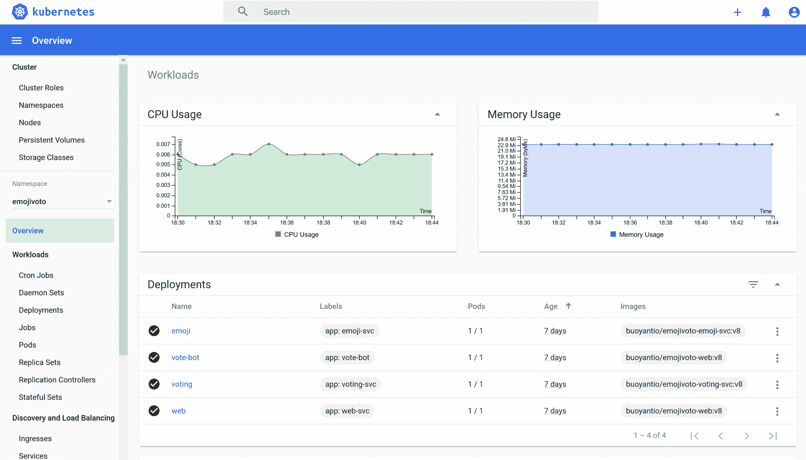

3.  在 Kubernetes 仪表板上，选择一个名称空间，然后单击概述菜单中的 Pods。此视图显示了所选命名空间内工作负载的总体 CPU 和内存利用率:

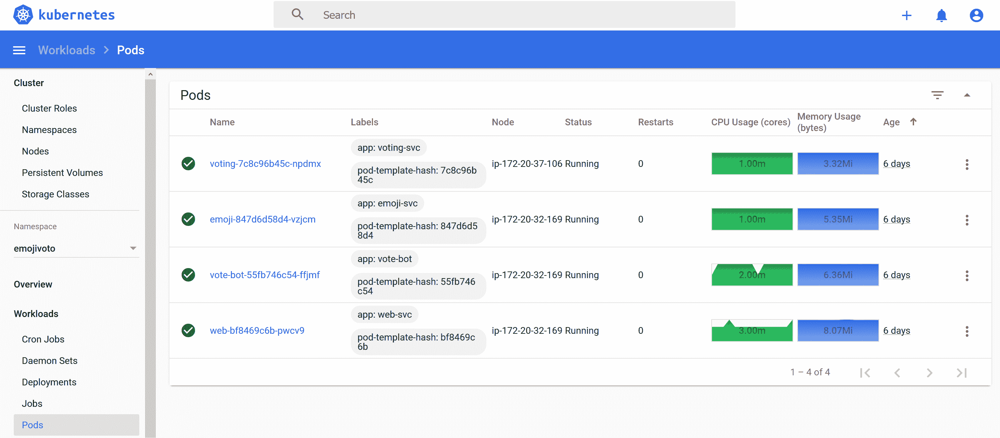

4.  选择集群菜单下的节点。此视图显示集群中具有 CPU 和内存利用率的节点:

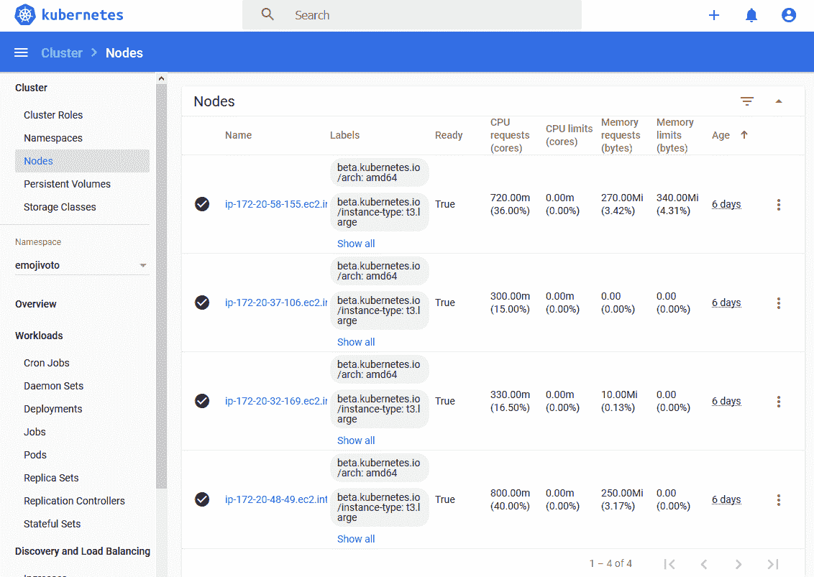

如果请求和限制设置得非常高，那么它们可能会占据超出预期的集群份额。

# 监控节点运行状况

在本食谱中，我们将学习如何在 Kubernetes 集群中创建 DaemonSet 来监控节点运行状况。节点问题检测器将从守护程序收集节点问题，并将它们作为节点条件和事件报告给应用编程接口服务器:

1.  首先从`/src/chapter8`文件夹检查`node-problem-detector.yaml`文件的内容，并创建 DaemonSet 来运行节点问题检测器:

```
$ cat debug/node-problem-detector.yaml
$ kubectl apply -f debug/node-problem-detector.yaml
```

2.  获取集群中节点的列表。该命令将返回工作节点和主节点:

```
$ kubectl get nodes
NAME                          STATUS ROLES  AGE   VERSION
ip-172-20-32-169.ec2.internal Ready  node   6d23h v1.14.6
ip-172-20-37-106.ec2.internal Ready  node   6d23h v1.14.6
ip-172-20-48-49.ec2.internal  Ready  master 6d23h v1.14.6
ip-172-20-58-155.ec2.internal Ready  node   6d23h v1.14.6
```

3.  通过将以下命令中的节点名替换为您的一个节点名并运行它来描述节点的状态。在输出中，检查`Conditions`部分的错误信息。以下是输出示例:

```
$ kubectl describe node ip-172-20-32-169.ec2.internal | grep -i condition -A 20 | grep Ready -B 20
Conditions:
 Type Status LastHeartbeatTime LastTransitionTime Reason Message
 ---- ------ ----------------- ------------------ ------ -------
 NetworkUnavailable False Sat, 12 Oct 2019 00:06:46 +0000 Sat, 12 Oct 2019 00:06:46 +0000 RouteCreated RouteController created a route
 MemoryPressure False Fri, 18 Oct 2019 23:43:37 +0000 Sat, 12 Oct 2019 00:06:37 +0000 KubeletHasSufficientMemory kubelet has sufficient memory available
 DiskPressure False Fri, 18 Oct 2019 23:43:37 +0000 Sat, 12 Oct 2019 00:06:37 +0000 KubeletHasNoDiskPressure kubelet has no disk pressure
 PIDPressure False Fri, 18 Oct 2019 23:43:37 +0000 Sat, 12 Oct 2019 00:06:37 +0000 KubeletHasSufficientPID kubelet has sufficient PID available
 Ready True Fri, 18 Oct 2019 23:43:37 +0000 Sat, 12 Oct 2019 00:06:37 +0000 KubeletReady kubelet is posting ready status
```

4.  此外，您可以通过用条件之一替换命令的最后一部分来检查`KernelDeadlock`、`MemoryPressure`和`DiskPressure`条件。下面是`KernelDeadlock`的一个例子:

```
$ kubectl get node ip-172-20-32-169.ec2.internal -o yaml | grep -B5 KernelDeadlock
 - lastHeartbeatTime: "2019-10-18T23:58:53Z"
 lastTransitionTime: "2019-10-18T23:49:46Z"
 message: kernel has no deadlock
 reason: KernelHasNoDeadlock
 status: "False"
 type: KernelDeadlock
```

节点问题检测器可以检测无响应的运行时守护程序；硬件问题，如坏的 CPU、内存或磁盘；内核问题，包括内核死锁条件；损坏的文件系统；无响应的运行时守护程序；以及基础设施守护程序问题，如 NTP 服务中断。

# 请参见

*   Kubernetes Metrics 服务器设计文档:[https://github . com/kubernetes/community/blob/master/投稿人/设计-提案/仪器/metrics-server.md](https://github.com/kubernetes/community/blob/master/contributors/design-proposals/instrumentation/metrics-server.md)
*   在 OpenShift Container Platform 中配置和使用监控栈:[https://access . RedHat . com/documentation/en-us/OpenShift _ Container _ Platform/4.2/html/monitoring/index](https://access.redhat.com/documentation/en-us/openshift_container_platform/4.2/html/monitoring/index)
*   Krex，一个永恒的资源总管:[https://github . com/Kris-nova/krex](https://github.com/kris-nova/krex)

# 检查容器

在本节中，我们将解决与处于挂起、映像回退或崩溃回退状态的POD相关的问题。您将学习如何在 Kubernetes 中检查和调试存在部署问题的POD。

# 准备好

确保您已经准备好 Kubernetes 集群并且`kubectl`已配置为管理集群资源。

# 怎么做…

本节进一步分为以下几个小节，以简化流程:

*   检查处于待定状态的POD
*   检查处于映像后退状态的POD
*   检查处于故障回路退避状态的POD

# 检查处于待定状态的POD

当您在 Kubernetes 上部署应用时，不可避免的是，您迟早需要获得更多关于应用的信息。在本食谱中，我们将学习检查处于待定状态的POD的常见POD问题:

1.  在`/src/chapter8`文件夹中，检查`mongo-sc.yaml`文件的内容，并运行以下命令进行部署。部署清单包括带有三个副本的 MongoDB Statefulset，Service，由于参数错误，它将陷入挂起状态，我们将检查它以找到来源:

```
$ cat debug/mongo-sc.yaml
$ kubectl apply -f debug/mongo-sc.yaml
```

2.  通过运行以下命令列出POD。您会注意到`mongo-0`POD的状态为`Pending`:

```
$ kubectl get pods
NAME    READY STATUS  RESTARTS AGE
mongo-0 0/2   Pending 0        3m
```

3.  使用`kubectl describe pod`命令获取POD的附加信息，并查找`Events`部分。在这种情况下，`Warning`指的是一个未绑定的`PersistentVolumeClaim`:

```
$ kubectl describe pod mongo-0
...
Events:
 Type    Reason           Age    From          Message
 ----    ------           ----   ----          -------
 Warning FailedScheduling 2m34s (x34 over 48m) default-scheduler pod has unbound immediate PersistentVolumeClaims (repeated 3 times)

```

4.  现在我们知道我们需要查看聚氯乙烯状态，感谢上一步的结果，让我们获得聚氯乙烯列表，以便检查问题。你会看到 PVCs 也卡在`Pending`状态:

```
$ kubectl get pvc
NAME              STATUS  VOLUME CAPACITY ACCESS MODES STORAGECLASS AGE
mongo-pvc-mongo-0 Pending                              storageclass 53m
```

5.  使用`kubectl describe pvc`命令获取 PVCs 的附加信息，并查看事件描述的位置。在本例中，`Warning`指向一个名为`storageclass`的缺失存储类:

```
$ kubectl describe pvc mongo-pvc-mongo-0
...
Events:
 Type    Reason             Age  From           Message
 ----    ------             ---- ----           -------
 Warning ProvisioningFailed 70s  (x33 over 58m) persistentvolume-controller storageclass.storage.k8s.io "storageclass" not found

```

6.  列出存储类别。您会注意到您没有名为`storageclass`的存储类:

```
$ kubectl get sc
NAME                            PROVISIONER AGE
default                         kubernetes.io/aws-ebs 16d
gp2                             kubernetes.io/aws-ebs 16d
openebs-cstor-default (default) openebs.io/provisioner-iscsi 8d
openebs-device                  openebs.io/local 15d
openebs-hostpath                openebs.io/local 15d
openebs-jiva-default            openebs.io/provisioner-iscsi 15d
openebs-snapshot-promoter       volumesnapshot.external-storage.k8s.io/snapshot-promoter 15d
```

7.  现在我们知道我们在*步骤 1* 中应用的清单文件使用了一个不存在的存储类。在这种情况下，您可以创建缺少的存储类，也可以编辑清单以包含现有的存储类来解决问题。
    让我们从现有的默认存储类创建缺失的存储类，如下例所示`gp2`:

```
$ kubectl create -f sc-gp2.yaml
```

8.  通过运行以下命令列出POD。您会注意到，所有先前在*步骤 2* 中`Pending`的豆荚的状态现在都是`Running`:

```
$ kubectl get pods
NAME    READY STATUS  RESTARTS AGE
mongo-0 2/2   Running 0        2m18s
mongo-1 2/2   Running 0        88s
mongo-2 2/2   Running 0        50s
```

你已经成功地学会了如何检查为什么一个POD是悬而未决的，并修复它。

# 检查处于映像后退状态的POD

有时，您的清单文件可能在映像名称中有一个错别字，或者映像位置可能已更改。因此，当您部署应用时，将找不到容器映像，部署将陷入困境。在本食谱中，我们将学习如何检查POD卡在`ImagePullBackOff`状态的常见问题:

1.  在`/src/chapter8`文件夹中，检查`mongo-image.yaml`文件的内容，并通过运行以下命令进行部署。部署清单包括带有三个副本的 MongoDB Statefulset、Service，并将由于容器映像名称中的键入错误而陷入 ImagePullBackOff 状态，我们将对其进行检查以找到来源:

```
$ cat debug/mongo-image.yaml
$ kubectl apply -f debug/mongo-image.yaml
```

2.  通过运行以下命令列出POD。您会注意到`mongo-0`POD的状态为`ImagePullBackOff`:

```
$ kubectl get pods
NAME    READY STATUS           RESTARTS AGE
mongo-0 0/2   ImagePullBackOff 0        32s
```

3.  使用`kubectl describe pod`命令获取POD的附加信息，并查找`Events`部分。在这种情况下，`Warning`就指着一个失败的`mongi`形象:

```
$ kubectl describe pod mongo-0
...
Events:
 Type    Reason           Age    From          Message
 ----    ------           ----   ----          -------
 Warning Failed 25s (x3 over 68s) kubelet, ip-172-20-32-169.ec2.internal Error: ErrImagePull
 Warning Failed 25s (x3 over 68s) kubelet, ip-172-20-32-169.ec2.internal Failed to pull image "mongi": rpc error: code = Unknown desc = Error response from daemon: pull access denied for mongi, repository does not exist or may require 'docker login'
 Normal Pulling 25s (x3 over 68s) kubelet, ip-172-20-32-169.ec2.internal Pulling image "mongi"
 Normal BackOff 14s (x4 over 67s) kubelet, ip-172-20-32-169.ec2.internal Back-off pulling image "mongi"
 Warning Failed 14s (x4 over 67s) kubelet, ip-172-20-32-169.ec2.internal Error: ImagePullBackOff
```

4.  现在我们知道我们需要确认容器映像名称。正确的名字应该是`mongo`。让我们编辑清单文件`mongo-image.yaml`，并将映像名称更改为`mongo`，如下所示:

```
... 
spec:
 terminationGracePeriodSeconds: 10
 containers:
 - name: mongo
 image: mongo
 command:
...
```

5.  通过运行以下命令删除并重新部署资源:

```
$ kubectl delete -f mongo-image.yaml
$ kubectl apply -f mongo-image.yaml
```

6.  通过运行以下命令列出POD。您会注意到，所有先前在**TEP 2*中处于`ImagePullBackOff`状态的豆荚现在都处于`Running`状态:*

 *```
$ kubectl get pods
NAME    READY STATUS  RESTARTS AGE
mongo-0 2/2   Running 0        4m55s
mongo-1 2/2   Running 0        4m55s
mongo-2 2/2   Running 0        4m55s
```

您已经成功学习了检查状态为`ImagePullBackOff`的POD并对其进行故障排除。

# 检查处于故障回路退避状态的POD

在`CrashLoopBackOff`状态下检查容器基本上类似于检查待处理容器，但是可能还需要对您正在创建的容器工作负载有更多的了解。`CrashLoopBackOff`当容器内的应用不断崩溃、pod 的参数配置不正确、活跃度探测失败或在 Kubernetes 上部署时出错时发生。

在本食谱中，我们将学习如何检查POD卡在`CrashLoopBackOff`状态的常见问题:

1.  在`/src/chapter8`文件夹中，检查`mongo-config.yaml`文件的内容，并运行以下命令进行部署。部署清单包括一个带有三个副本的 MongoDB 状态集“服务”，由于缺少配置文件而导致错误，它将陷入 CrashLoopBackOff 状态，我们将检查它以查找来源:

```
$ cat debug/mongo-config.yaml
$ kubectl apply -f debug/mongo-config.yaml
```

2.  通过运行以下命令列出POD。您会注意到`mongo-0`POD的状态为`CrashLoopBackOff`或`Error`:

```
$ kubectl get pods
NAME READY STATUS RESTARTS AGE
mongo-0 1/2 CrashLoopBackOff 3 58s
```

3.  使用`kubectl describe pod`命令获取POD的附加信息，并查找`Events`部分。在这种情况下，`Warning`显示容器已经重启，但它没有指向任何有用的信息:

```
$ kubectl describe pod mongo-0
...
Events:
 Type    Reason           Age    From          Message
 ----    ------           ----   ----          -------
...
 Normal Pulled 44s (x4 over 89s) kubelet, ip-172-20-32-169.ec2.internal Successfully pulled image "mongo"
 Warning BackOff 43s (x5 over 87s) kubelet, ip-172-20-32-169.ec2.internal Back-off restarting failed container

```

4.  当窗格中的事件没有用时，您可以使用`kubectl logs`命令从窗格中获取附加信息。使用以下命令检查 pod 日志中的消息。日志消息指向一个丢失的文件；需要进一步检查货单:

```
$ kubectl logs mongo-0 mongo
/bin/sh: 1: cannot open : No such file
```

5.  检查并仔细查看应用清单文件`mongo-config.yaml`，您会发现环境变量`MYFILE`在这种情况下丢失了:

```
...
 spec:
 terminationGracePeriodSeconds: 10
 containers:
 - name: mongo
 image: mongo
 command: ["/bin/sh"]
 args: ["-c", "sed \"s/foo/bar/\" < $MYFILE"]
...
```

6.  要解决这个问题，您可以在部署中添加一个`ConfigMap`。编辑`mongo-config.yaml`文件，并通过在文件开头添加带有`ConfigMap`资源的`MYFILE`参数来添加缺失的文件，如下所示:

```
$ cat <<EOF | kubectl apply -f -
apiVersion: v1
kind: ConfigMap
metadata:
 name: app-env
data:
 MYFILE: "/etc/profile"
EOF
```

7.  通过运行以下命令删除并重新部署资源:

```
$ kubectl delete -f mongo-image.yaml
$ kubectl apply -f mongo-image.yaml
```

8.  通过运行以下命令列出POD。您会注意到，对于之前在第 2 步中处于碰撞回路后退状态的所有POD，现在的状态都是`Running`。

```
$ kubectl get pods
NAME    READY STATUS  RESTARTS AGE
mongo-0 2/2   Running 0        4m15s
mongo-1 2/2   Running 0        4m15s
mongo-2 2/2   Running 0        4m15s
```

您已经成功学习了如何检查 pod 的 CrashLoopBackOff 问题并修复它。

# 请参见

*   调试初始化容器:[https://kubernetes . io/docs/tasks/debug-application-cluster/debug-init-containers/](https://kubernetes.io/docs/tasks/debug-application-cluster/debug-init-containers/)
*   调试POD和复制控制器[https://kubernetes . io/docs/tasks/debug-application-cluster/debug-POD-复制-控制器/](https://kubernetes.io/docs/tasks/debug-application-cluster/debug-pod-replication-controller/)
*   调试状态集:[https://kubernetes . io/docs/tasks/debug-application-cluster/debug-stateful-set/](https://kubernetes.io/docs/tasks/debug-application-cluster/debug-stateful-set/)
*   确定 pod 故障原因:[https://kubernetes . io/docs/tasks/debug-application-cluster/decision-reason-pod-failure/](https://kubernetes.io/docs/tasks/debug-application-cluster/determine-reason-pod-failure/)
*   puck，微服务调试器:[https://github.com/solo-io/squash](https://github.com/solo-io/squash)

# 使用亚马逊云观察进行监控

在本节中，我们将使用亚马逊云观察容器洞察来监控、隔离和诊断您的容器化应用和微服务环境。作为一名 DevOps 或系统工程师，您将学习如何使用 Amazon ECS CloudWatch 指标来监控服务运行状况和当前警报，这些指标使用自动仪表盘按 pod、节点、命名空间和服务汇总您的 Amazon EKS 集群的性能和运行状况。

# 准备好

将`k8sdevopscookbook/src`存储库克隆到您的工作站，以使用`chapter8`目录中的清单文件:

```
$ git clone https://github.com/k8sdevopscookbook/src.git
$ cd src/chapter8/
```

确保您已经准备好亚马逊 EKS 库本内斯集群并配置`kubectl`来管理集群资源。如果您还没有这样的集群，您可以按照[第 1 章](01.html)、*构建生产就绪型Kubernetes集群*、在亚马逊网络服务上配置Kubernetes集群一节中的说明进行操作。

# 怎么做…

本节进一步分为以下几个小节，以简化流程:

*   启用 Webhook 授权模式
*   为亚马逊 EKS 安装容器洞察代理
*   查看容器洞察指标

# 启用 Webhook 授权模式

如果您使用运行在 AWS EC2 实例上的`kops`选项部署了一个 Kubernetess 集群，而不是使用亚马逊 EKS，那么您的 Kubernete 需要启用 Webhook 授权模式。

让我们遵循以下步骤:

1.  使用以下两个标志启用`webhook`授权模式。第一个标志允许使用 ServiceAccount 令牌对 kubelet 进行身份验证。第二个标志允许 kubelet 执行 RBAC 请求，并决定是否允许请求资源(在本例中为 Amazon CloudWatch)访问资源端点:

```
--authentication-token-webhook=true 
--authorization-mode=Webhook 
```

2.  您还需要为 Kubernetes 工作节点的 IAM 角色添加必要的策略。在[https://console.aws.amazon.com/ec2/](https://console.aws.amazon.com/ec2/)打开亚马逊 EC2 控制台。

3.  在资源下，单击运行实例:

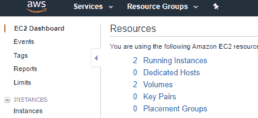

4.  从列表中选择一个工作节点实例，并在“描述”选项卡上选择 IAM 角色。在我们的示例中，eks CTL-萌-彩虹-157155665-NodeInstanceRole-MOT7WBCOOOHE 是 IAM 角色:

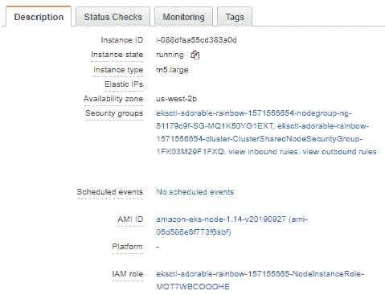

5.  在权限选项卡上，单击附加策略按钮:

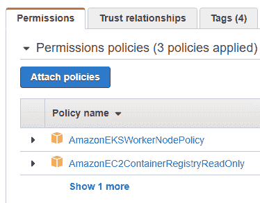

6.  在搜索框内，输入`CloudWatchAgentServerPolicy`并选择策略:

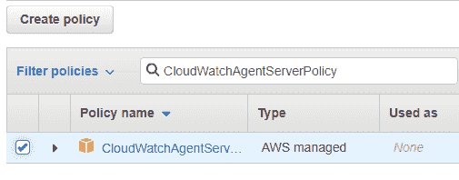

7.  单击附加策略按钮，将策略附加到您的 IAM 角色:

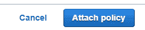

现在，您已经成功启用了 Webhook 授权模式，并向 IAM 角色添加了所需的策略。

# 为亚马逊 EKS 安装容器洞察代理

在本食谱中，我们将使云观察代理能够从我们的 EKS 库本内斯集群中收集集群指标:

1.  使用以下命令在集群上创建名为`amazon-cloudwatch`的命名空间:

```
$ cat <<EOF | kubectl apply -f -
apiVersion: v1
kind: Namespace
metadata:
 name: amazon-cloudwatch
 labels:
 name: amazon-cloudwatch
EOF
```

2.  在您在*步骤 1 中创建的名称空间`amazon-cloudwatch`中为 CloudWatch 代理创建一个服务帐户。*以下命令还将创建`cloudwatch-agent-role`集群角色和集群角色绑定:

```
$ kubectl apply -f cloudwatch/cwagent-serviceaccount.yaml
```

3.  使用`eksctl`命令或从亚马逊容器服务仪表板获取您的 EKS 集群的名称。在这里，我们将使用`eksctl`来获取集群名称。在我们的例子中，集群名为`adorable-rainbow-1571556654`:

```
$ eksctl get cluster
NAME                        REGION
adorable-rainbow-1571556654 us-west-2
```

4.  为云观察代理创建配置映射。在运行以下命令之前，请从*步骤 3* 用集群名称替换`"cluster_name": "adorable-rainbow-1571556654"`:

```
$ cat <<EOF | kubectl apply -f -
apiVersion: v1
kind: ConfigMap
metadata:
 name: cwagentconfig
 namespace: amazon-cloudwatch
data:
 cwagentconfig.json: |
 {
 "logs": {
 "metrics_collected": {
 "kubernetes": {
 "cluster_name": "{{cluster_name}}",
 "metrics_collection_interval": 60
 }
 },
 "force_flush_interval": 5
 }
 }
EOF
```

5.  将 CloudWatch 代理部署为 DaemonSet。前面的命令将使用 StatsD，这是一个网络守护程序，它侦听通过 UDP 或 TCP 发送的统计信息，如计数器和计时器，并将聚合发送到 CloudWatch，如果可用，还可以使用可插拔后端服务:

```
$ kubectl apply -f cloudwatch/cwagent.yaml
```

6.  通过运行以下命令，验证 CloudWatch 代理程序盒是否已创建。由于代理作为 DaemonSets 运行，您应该能够看到列出的每个工作节点一个 pod。在我们的示例中，我们有两个工作节点和两个代理程序盒正在运行:

```
$ kubectl get pods -n amazon-cloudwatch
NAME                   READY STATUS  RESTARTS AGE
cloudwatch-agent-dtpxt 1/1   Running 0        67s
cloudwatch-agent-j7frt 1/1   Running 0        67s
```

完成后，CloudWatch 代理将开始向 CloudWatch 容器 Insights 服务发送性能日志事件。

# 查看容器洞察指标

在本食谱中，我们将学习如何使用 CloudWatch 来监控 Kubernetes 集群中的节点和 pod 指标:

1.  在[https://console.aws.amazon.com/cloudwatch/](https://console.aws.amazon.com/cloudwatch/)打开 CloudWatch 控制台:

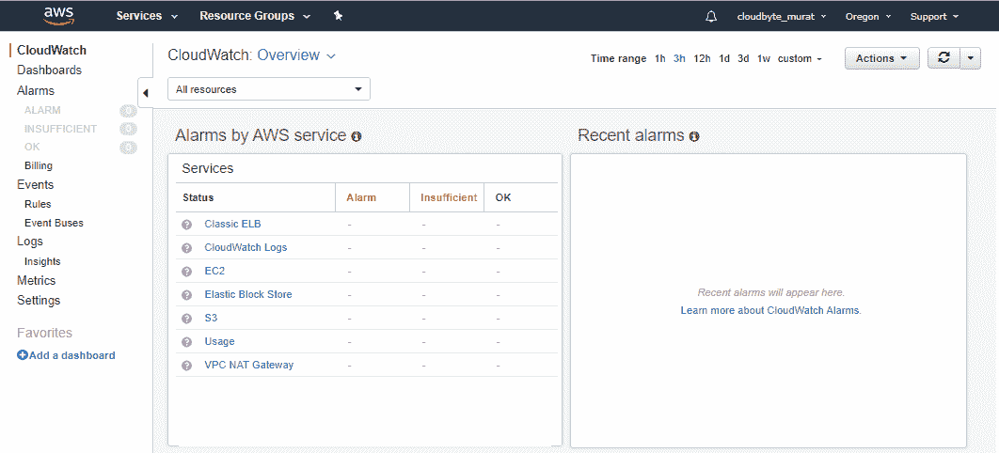

2.  单击概述选项旁边的向下箭头按钮，并从列表中选择容器洞察:

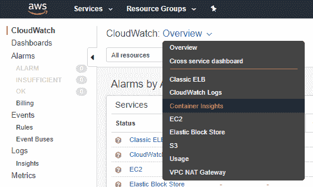

3.  要查看 EKS 节点的运行状况和统计数据，请在左上角切换到 EKS 节点。新视图上的图表将在类似于以下屏幕截图的历史视图中显示资源利用率、集群故障和节点数量:

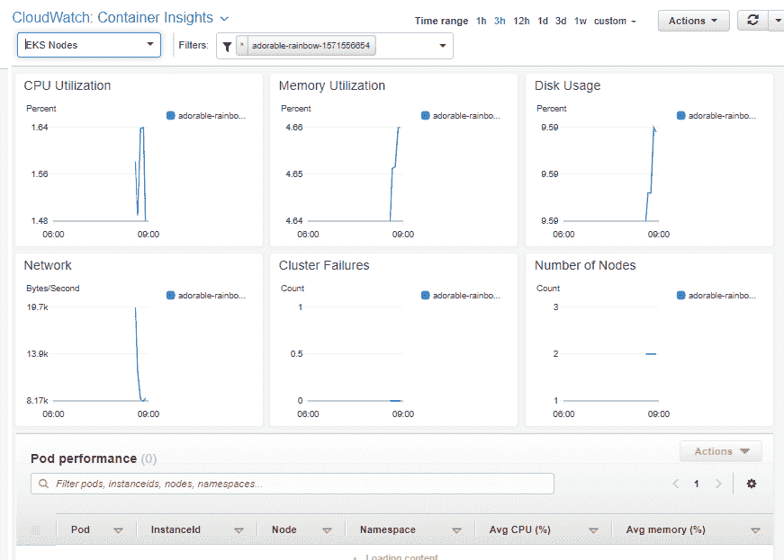

4.  要查看容器性能统计数据，请在左上角切换到 EKS POD。新视图上的图表将显示 pods 的总资源利用率和 pods 列表，以及它们各自的 CPU 和内存消耗百分比，类似于下面的屏幕截图:

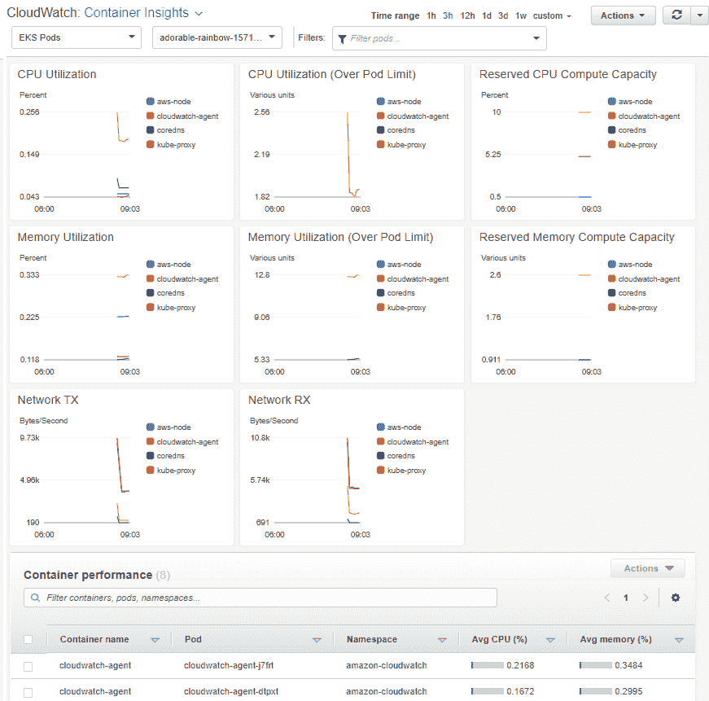

5.  要查看任何资源的详细日志或自动气象站 x 光跟踪，请从列表中选择资源名称，然后单击操作按钮。从下拉菜单中，您可以选择要查看的日志。选择后，日志将在新窗口中打开:

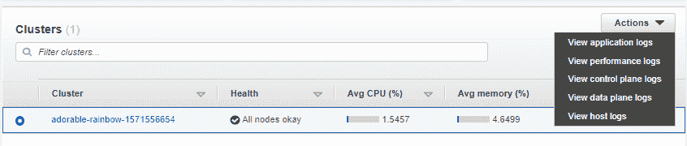

现在，您已经学习了如何使用 Container Insights 监控 Kubernetes 集群中的节点和 pod 指标。

# 请参见

*   使用 Container Insights[https://docs . AWS . Amazon . com/Amazon cloudwatch/latest/monitoring/Container Insights . html](https://docs.aws.amazon.com/AmazonCloudWatch/latest/monitoring/ContainerInsights.html)
*   使用 CloudWatch 异常检测[https://docs . AWS . Amazon . com/Amazon CloudWatch/latest/monitoring/CloudWatch _ exception _ Detection . html](https://docs.aws.amazon.com/AmazonCloudWatch/latest/monitoring/CloudWatch_Anomaly_Detection.html)
*   Container Insights 收集的指标列表:[https://docs . AWS . Amazon . com/Amazon cloudwatch/latest/monitoring/Container-Insights-metrics-eks . html](https://docs.aws.amazon.com/AmazonCloudWatch/latest/monitoring/Container-Insights-metrics-EKS.html)

# 使用谷歌 Stackdriver 进行监控

在本节中，我们将使用谷歌 Stackdriver Kubernetes 引擎监控来监控、隔离和诊断您的容器化应用和微服务环境。您将学习如何使用 Stackdriver Kubernetes 引擎监控在**谷歌 Kubernetes 引擎** ( **GKE** )上聚合来自您的 Kubernetes 环境的日志、事件和指标，以帮助您了解应用在生产中的行为。

# 准备好

确保您已经准备好 GKE 集群并配置`kubectl`来管理集群资源。如果您还没有，您可以按照*在谷歌云平台上配置库本内斯集群*食谱中[第 1 章](01.html)、*构建生产就绪库本内斯集群*中的说明进行操作。

# 怎么做…

本节进一步分为以下几个小节，以简化流程:

*   为 GKE 安装 Stackdriver Kubernetes 发动机监控支持
*   在 Stackdriver 上配置工作区
*   使用 Stackdriver 监控 GKE 指标

# 为 GKE 安装 Stackdriver Kubernetes 发动机监控支持

安装 Stackdriver 监控支持使您能够使用高级分析和跟踪功能轻松监控 GKE 集群、调试日志和分析集群性能。在此方案中，我们将启用 Stackdriver Kubernetes 引擎监控支持，从我们的 GKE 集群收集集群指标:

1.  在[https://console.cloud.google.com/kubernetes](https://console.cloud.google.com/kubernetes)打开谷歌 Kubernetes 引擎控制台。在此控制台上，您将看到您的 GKE 集群列表。在我们的示例中，我们只有一个集群，它被称为 k8s-devops-cookbook-1:


2.  单击集群旁边的小笔形编辑图标:


3.  在群集配置页面上，确保禁用了传统堆栈河日志记录和传统堆栈河监控，并将堆栈河库本内斯引擎监控选项设置为启用:


4.  单击保存按钮将更改应用到您的集群。

# 在 Stackdriver 上配置工作区

Stackdriver 监控可帮助您更深入地了解您的公共云。Stackdriver 的监控功能包括监控、记录、跟踪、错误报告和警报，以收集公共云服务的性能和诊断数据。Kubernetes 监控是完整解决方案的一小部分。在本食谱中，您将学习如何在第一次访问 Stackdriver 工作空间后对其进行配置:

1.  在[https://app.google.stackdriver.com](https://app.google.stackdriver.com)打开 Stackdriver 控制台。第一次访问控制台时，您需要将工作区添加到控制台，否则您将看到一个类似于以下内容的空仪表板:

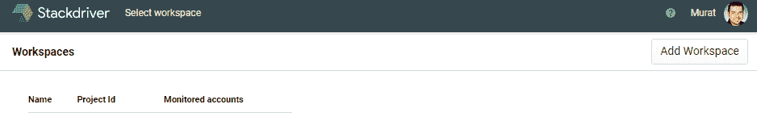

2.  单击“添加工作区”按钮以包含您现有的工作区。系统会询问您的谷歌云平台项目名称。单击空的“选择项目”字段，并从列表中选择您的项目。在我们的例子中，它是 DevOpsCookBook。选择项目后，单击创建工作区按钮:

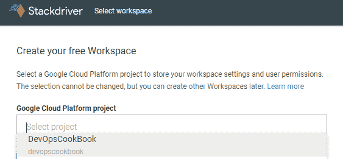

3.  Stackdriver 还允许您监控 AWS 帐户。对于这个食谱，我们将跳过这个选项。单击跳过自动气象站设置进入下一步:

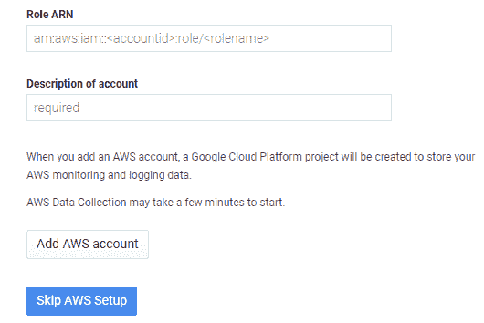

4.  在安装堆栈审核代理窗口中，单击继续按钮。
5.  在通过电子邮件获取报告窗口中，选择通过电子邮件发送报告的频率。选择每周报告。请注意，您始终可以选择“无报告”，并在以后启用此功能:

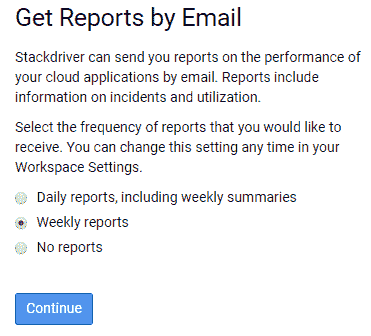

6.  最后，单击启动监控按钮访问 Stackdriver 控制台:

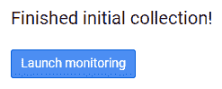

现在，您已经配置了 Stackdriver 工作区，以便从公共云服务中收集诊断数据。

# 使用 Stackdriver 监控 GKE 指标

安装 Stackdriver 监控支持使您能够使用高级分析和跟踪功能轻松监控 GKE 集群、调试日志和分析集群性能。在此方案中，我们将启用 Stackdriver Kubernetes 引擎监控支持，从我们的 GKE 集群收集集群指标:

1.  遵循*在 Stackdriver* 配方上配置工作区后，在[https://app.google.stackdriver.com](https://app.google.stackdriver.com)打开 Stackdriver 控制台:


2.  从“资源”菜单中，单击库本内斯引擎选项:

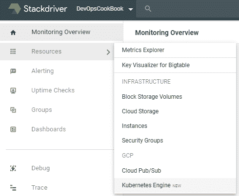

3.  Kubernetes 引擎视图将显示启用 Stackdriver Kubernetes 引擎监控的集群列表。在我们的示例中，您可以看到我们有一个可用的集群:

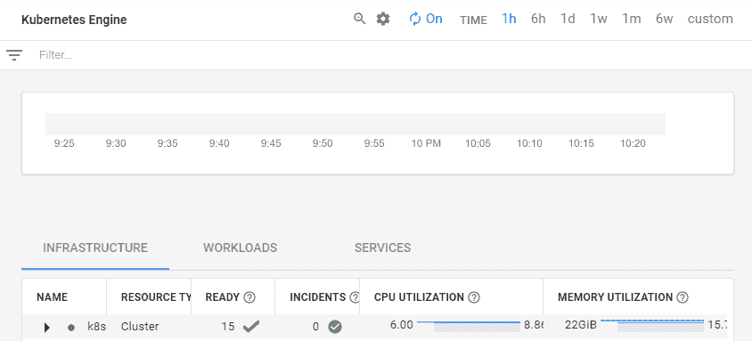

4.  在基础架构选项卡上，单击群集名称旁边的展开图标。Stackdriver 将使用单个工作节点展开列表。在“就绪”列中，您可以看到每个节点中已部署且处于就绪状态的POD数量。在“CPU 利用率”列中，左侧的值显示可用 CPU 总数，右侧的值显示当前利用率百分比。同样，在“内存利用率”列中，左侧的值显示总可用内存(GiB)，右侧的值显示当前利用率百分比:

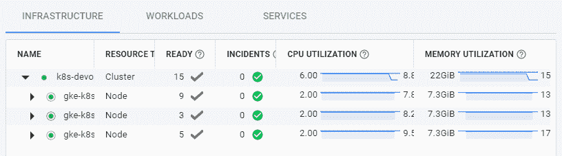

5.  单击节点名称旁边的展开图标，列表将展开以显示部署在该特定节点上的 pod:

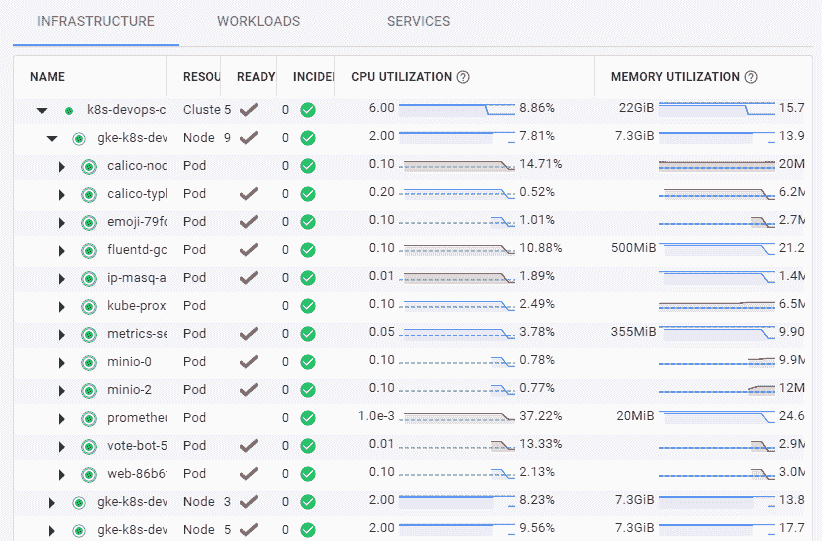

6.  单击集群中的一个豆荚。Stackdriver 将显示 pod 指标的详细视图，包括 pod 的重启、CPU、内存、存储和网络利用率。在我们的示例中，我们可以看到普罗米修斯POD的指标:

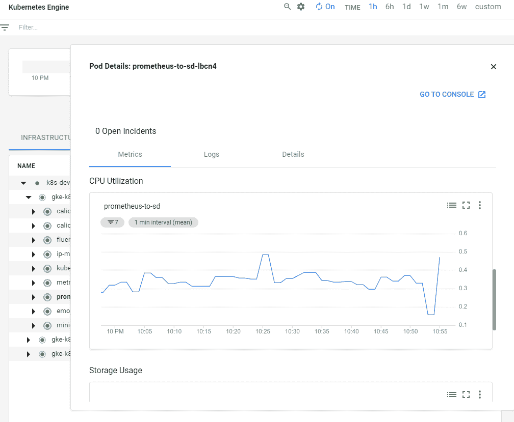

7.  单击日志选项卡切换到日志摘要视图。此视图将仅显示最近的日志:

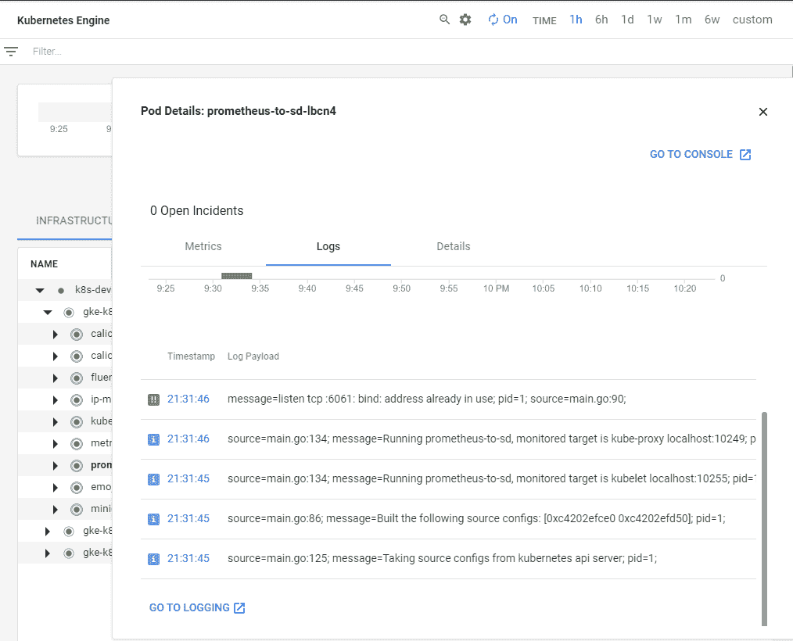

8.  单击转到控制台按钮打开详细的日志视图，您可以在其中查看较旧的日志，并使用过滤器创建指标:

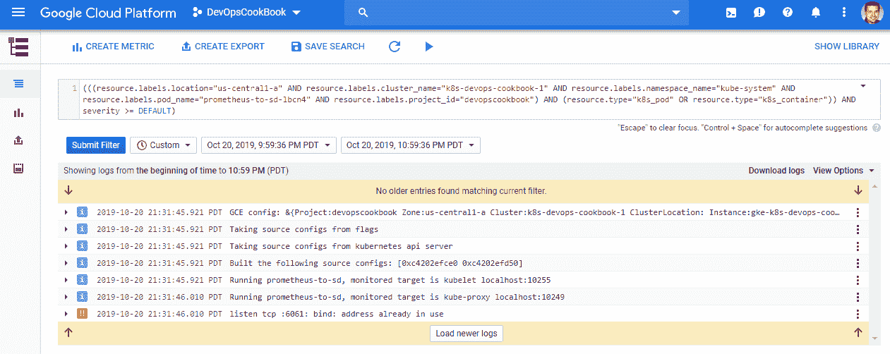

现在，您知道如何使用 Stackdriver 来监控 GKE 集群和部署在 GKE 集群上的资源的运行状况、性能指标和日志。

# 请参见

*   谷歌 Stackdriver 文档:[https://cloud.google.com/stackdriver/docs/](https://cloud.google.com/stackdriver/docs/)
*   使用 Prometheus 搭配 Stackdriver Kubernetes 引擎监控:[https://cloud . Google . com/Monitoring/Kubernetes-Engine/Prometheus](https://cloud.google.com/monitoring/kubernetes-engine/prometheus)
*   stack driver Prometheus sidecar:https://github . com/stack driver/stack driver-Prometheus-sidecar
*   GCP 倡导者在 Stackdriver 上发表的技术文章集:[https://medium.com/google-cloud/tagged/stackdriv](https://medium.com/google-cloud/tagged/stackdriver)[er](https://medium.com/google-cloud/tagged/stackdriver)

# 使用 Azure 监视器进行监视

在本节中，我们将使用 Azure Monitor 来监视、隔离和诊断您的容器化应用和微服务环境。您将在**Azure Kubernetes Service**(**AKS**)上学习如何使用 Azure Monitor 从 Kubernetes 环境中聚合日志、事件和指标，以帮助您了解应用在生产中的行为。

# 准备好

确保您已经准备好 AKS 集群并配置`kubectl`来管理集群资源。如果您还没有，您可以按照*在谷歌云平台上配置库本内斯集群*食谱中[第 1 章](01.html)、*构建生产就绪库本内斯集群*中的说明进行操作。

# 怎么做…

本节进一步分为以下几个小节，以简化流程:

*   使用命令行界面启用 Azure 监视器对 AKS 的支持
*   使用 Azure 监视器监控 AKS 性能指标
*   使用 Azure 监视器查看实时日志

# 使用命令行界面启用 Azure 监视器对 AKS 的支持

通过 Kubernetes Metrics API 从 Kubernetes 中可用的控制器、节点和容器中收集内存和处理器指标，为 AKS 集群启用 Azure Monitor 可为您提供性能可见性。

在此方案中，我们将启用来自 AKS Kubernetes 集群的监控，通过日志分析代理的容器化版本收集指标和日志:

1.  如果您已经按照[第 1 章](01.html)、*中的*在 AKS* 上配置托管 Kubernetes 集群的方法部署了 AKS 集群，您可以使用以下命令为您的集群启用 Azure Monitor。将名称`AKSCluster`替换为您的 AKS 集群名称，并将资源组`k8sdevopscookbook`替换为您在运行以下命令之前创建集群时使用的 Azure 资源组名称:*

```
$ az aks enable-addons -a monitoring \
--name AKSCluster --resource-group k8sdevopscookbook
```

If you are deploying a new cluster, you can add the `--enable-addons monitoring` parameter to the CLI command to enable Azure Monitor functionality for your AKS cluster during the cluster creation as follows:

**`$ az aks create --resource-group k8sdevopscookbook \`**
**`--name AKSCluster \`**
**`--node-count 3 \`**
**`--service-principal <appId> \`**
**`--client-secret <password> \`**
**`--enable-addons monitoring  \`**
**`--generate-ssh-keys`**

完成后，该命令将为您的 AKS 集群启用 Azure 监视器和日志。

# 使用 Azure 监视器监控 AKS 性能指标

AKS 集群的性能指标可以直接从 AKS 集群管理控制面板查看，也可以通过 Azure Monitor 控制面板查看。在本食谱中，我们将通过 Azure Monitor 监控 AKS 性能指标:

1.  按照*使用 CLI* 配方启用 Azure Monitor 对 AKS 的支持后，在[https://portal.azure.com](https://portal.azure.com)打开 Azure 门户，点击 Kubernetes 服务按钮进入 AKS 管理仪表盘:

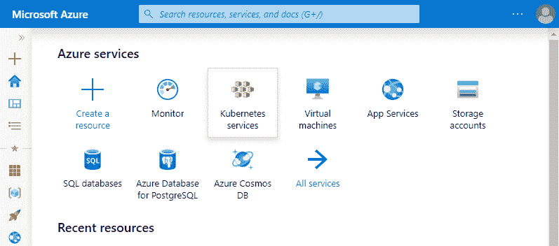

2.  在 Kubernetes 服务视图中，单击您的集群名称。在我们的例子中，它是 AKSCluster:

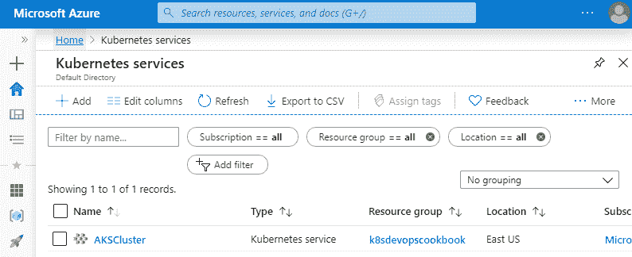

3.  单击监视器容器菜单，为您的 AKS 集群打开 Azure 监视器洞察视图:

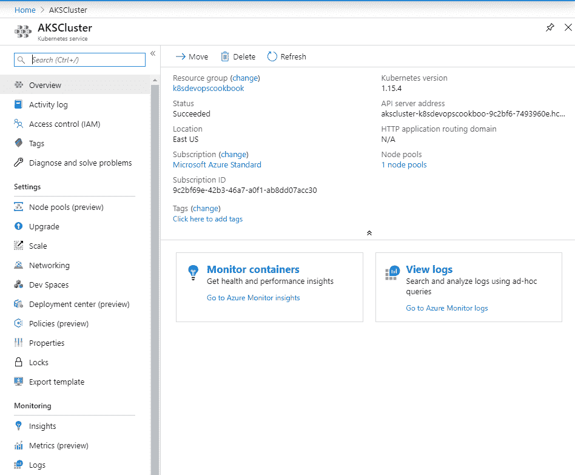

4.  AKS 集群的监控信息分为五类:集群、节点、控制器、容器和部署。在此视图中，在群集选项卡上，您将能够看到节点 CPU 和内存利用率、AKS 节点计数和活动 pod 计数，如下所示:


5.  单击节点选项卡切换到节点性能指标视图。默认情况下，显示过去 6 小时第 95 个百分点的 CPU 使用数据。可以使用页面上的下拉菜单来调整这些选项:


6.  单击节点名称旁边的展开图标，一个列表将展开，以显示部署在该特定节点上的内部容器。在此视图中，可以查看每个资源的 CPU 利用率和正常运行时间:


现在，您知道如何通过 Azure Monitor 洞察来监控 AKS 性能指标。

# 使用 Azure 监视器查看实时日志

除了性能指标，Azure Monitor 还可以帮助查看来自 AKS 集群资源的日志。在本食谱中，我们将学习如何使用 Azure Monitor 访问事件和日志:

1.  在显示集群中的 pod 事件和实时指标之前，您需要应用`ClusterRoleBinding`。通过在 AKS 集群上运行以下命令创建一个`ClusterRole`:

```
$ cat <<EOF | kubectl apply -f -
apiVersion: rbac.authorization.k8s.io/v1 
kind: ClusterRole 
metadata: 
 name: containerHealth-log-reader 
rules: 
 - apiGroups: [""] 
 resources: ["pods/log", "events"] 
 verbs: ["get", "list"] 
EOF
```

2.  通过在 AKS 集群上运行以下命令创建一个`ClusterRoleBinding`:

```
$ cat <<EOF | kubectl apply -f -
apiVersion: rbac.authorization.k8s.io/v1 
kind: ClusterRoleBinding 
metadata: 
 name: containerHealth-read-logs-global 
roleRef: 
 kind: ClusterRole 
 name: containerHealth-log-reader 
 apiGroup: rbac.authorization.k8s.io 
subjects: 
 - kind: User 
 name: clusterUser 
 apiGroup: rbac.authorization.k8s.io
EOF
```

3.  单击监视器容器菜单，为您的 AKS 集群打开 Azure 监视器洞察视图。
4.  单击节点名称旁边的展开图标，一个列表将展开，显示部署在该特定节点上的 pod 和容器:

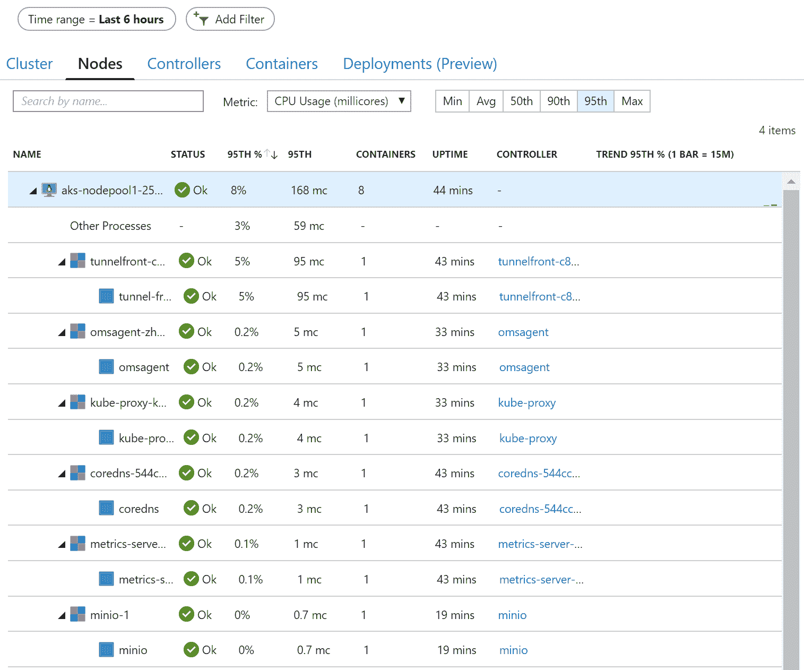

5.  单击集群中的一个豆荚。Insights 将在右侧面板上显示 pods 指标的详细视图:

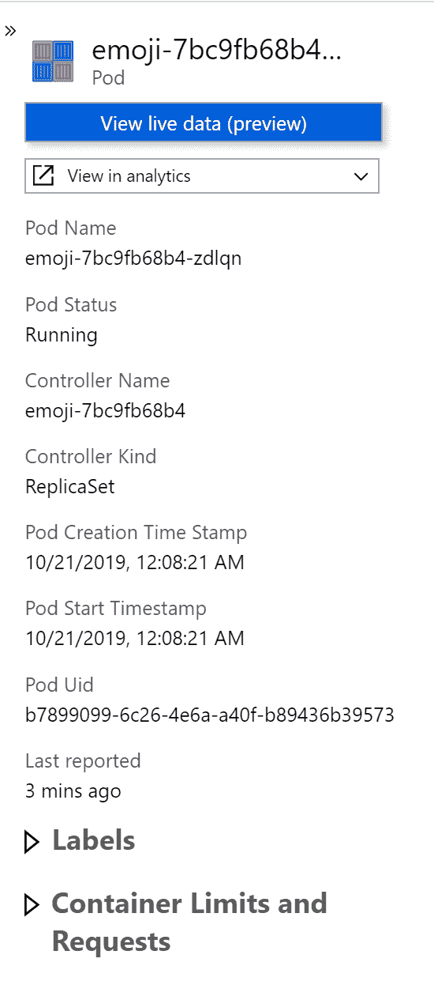

6.  在右侧窗格中，单击查看实时数据按钮。此选项将使用来自 pods 和实时指标的实时事件展开视图，如下图所示。事件可用于解决我们在本章的*检查容器*一节中讨论的 pod 问题:

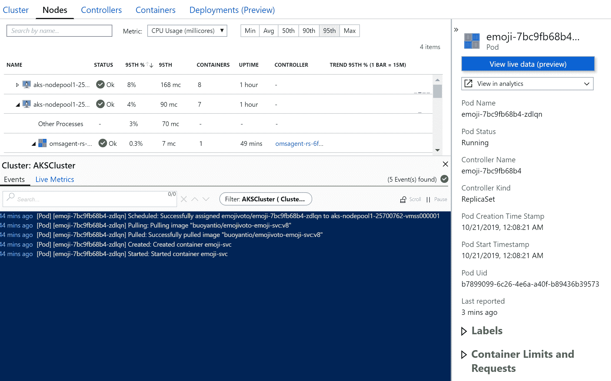

7.  您看到的日志和事件消息取决于视图中选择的资源类型。单击“在分析中查看”按钮，切换到 Kubernetes 事件日志:

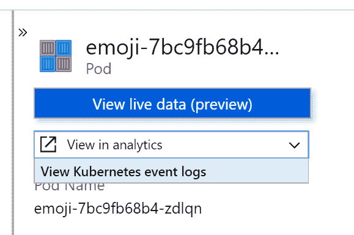

8.  在此视图中，您将能够查看和过滤 pod 事件:

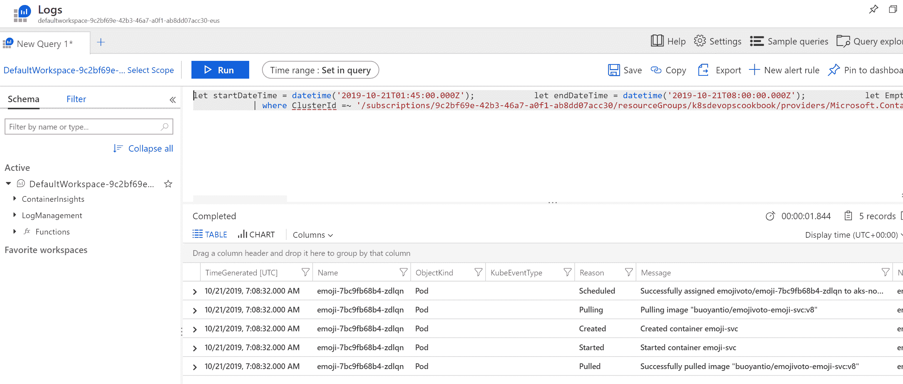

9.  这一次，点击容器内的一个容器。Insights 将在右侧面板中显示容器信息和性能指标的详细视图:

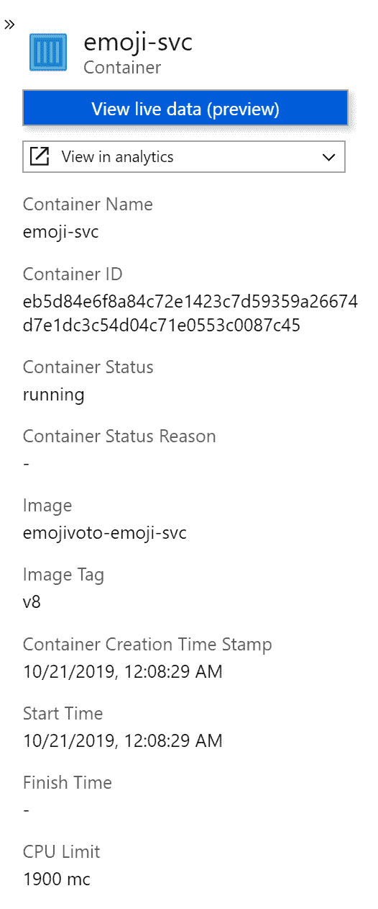

10.  在右侧窗格中，单击分析中的查看按钮切换到查看容器日志:

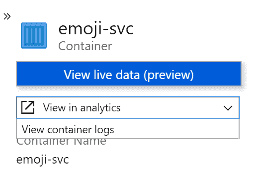

11.  在此视图中，您将能够查看和过滤容器日志:

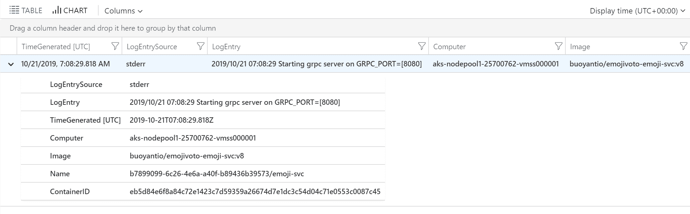

现在您知道如何使用 Azure Monitor 来监控 AKS 集群的运行状况、性能指标和日志，以及部署在 AKS 集群上的资源。

# 请参见

*   Azure Monitor for containers 文档:[https://docs . Microsoft . com/en-us/azure/azure-Monitor/insights/container-insights-概述](https://docs.microsoft.com/en-us/azure/azure-monitor/insights/container-insights-overview)
*   将普罗米修斯与 Azure Monitor 配合使用:[https://Azure . Microsoft . com/en-us/blog/Azure-Monitor-for-containers-with-professional-in-professional/](https://azure.microsoft.com/en-us/blog/azure-monitor-for-containers-with-prometheus-now-in-preview/)

# 利用普罗米修斯和格拉夫纳监控Kubernetes虫

在本节中，我们将在Kubernetes集群上部署普罗米修斯和格拉夫纳。您将学习如何使用 Prometheus 监控 Kubernetes 服务，并使用 Grafana 仪表板可视化集群和应用指标。

# 准备好

将`k8sdevopscookbook/src`存储库克隆到您的工作站，以使用`chapter8`目录中的清单文件:

```
$ git clone https://github.com/k8sdevopscookbook/src.git
$ cd /src/chapter8
```

确保您已经准备好 Kubernetes 集群并且`kubectl`已配置为管理集群资源。

# 怎么做…

本节进一步分为以下几个小节，以简化流程:

*   使用舵角图部署普罗米修斯操作员
*   使用 Grafana 仪表板监控指标
*   添加 Grafana 仪表板来监控应用

# 使用舵角图部署普罗米修斯

普罗米修斯是一个流行的开源事件监控和警报解决方案。普罗米修斯在时间序列数据库中记录实时指标，它是 Kubernetes 集群中最受欢迎的监控组件之一。几乎所有新的托管 Kubernetes 解决方案都以某种方式安装了 Prometheus，作为集群部署的一部分。在本食谱中，您将学习如何使用 Helm 图表在 Kubernetes 集群上部署普罗米修斯:

1.  更新 Helm 存储库。此命令将从公共图表存储库中本地获取最新图表:

```
$ helm repo update
```

2.  使用`helm install`命令在`monitoring`命名空间中部署普罗米修斯操作器。该命令将部署普罗米修斯以及警报管理器、格拉夫纳、节点导出器和 kube 状态度量插件；基本上，在 Kubernetes 集群上使用 Prometheus 所需的一组组件:

```
$ helm install stable/prometheus-operator --name prometheus \
 --namespace monitoring
```

3.  验证监控命名空间中部署的 pods 的状态:

```
$ kubectl get pods -n monitoring
NAME READY STATUS RESTARTS AGE
alertmanager-prometheus-prometheus-oper-alertmanager-0 2/2 Running 0 88s
prometheus-grafana-6c6f7586b6-f9jbr 2/2 Running 0 98s
prometheus-kube-state-metrics-57d6c55b56-wf4mc 1/1 Running 0 98s
prometheus-prometheus-node-exporter-8drg7 1/1 Running 0 98s
prometheus-prometheus-node-exporter-lb7l5 1/1 Running 0 98s
prometheus-prometheus-node-exporter-vx7w2 1/1 Running 0 98s
prometheus-prometheus-oper-operator-86c9c956dd-88p82 2/2 Running 0 98s
prometheus-prometheus-prometheus-oper-prometheus-0 3/3 Running 1 78s
```

现在，普罗米修斯已经安装了在 Kubernetes 环境中运行它所需的组件包。

# 使用 Grafana 仪表板监控指标

Grafana 是一个开源的分析和监控解决方案。默认情况下，Grafana 用于查询普罗米修斯。按照以下说明公开附带的 Grafana 服务实例，并通过您的 web 浏览器访问它:

1.  获取`monitoring`命名空间中的服务列表:

```
$ kubectl get svc -n monitoring
NAME                                    TYPE      CLUSTER-IP   EXTERNAL-IP PORT(S)                    AGE
alertmanager-operated                   ClusterIP None         <none>      9093/TCP,9094/TCP,9094/UDP 33m
prometheus-grafana                      ClusterIP 10.0.1.132   <none>      80/TCP                     33m
prometheus-kube-state-metrics           ClusterIP 10.0.69.144  <none>      8080/TCP                   33m
prometheus-operated                     ClusterIP None         <none>      9090/TCP                   33m
prometheus-prometheus-node-exporter     ClusterIP 10.0.100.183 <none>      9100/TCP                   33m
prometheus-prometheus-oper-alertmanager ClusterIP 10.0.202.140 <none>      9093/TCP                   33m
prometheus-prometheus-oper-operator     ClusterIP 10.0.174.214 <none>      8080/TCP,443/TCP           33m
prometheus-prometheus-oper-prometheus   ClusterIP 10.0.243.177 <none>      9090/TCP                   33m
```

2.  使用`kubectl port-forward`命令创建端口转发以访问格拉夫纳用户界面。该命令将本地端口`8000`转发到运行中的格拉夫纳POD的端口`3000`:

```
$ kubectl port-forward -n monitoring prometheus-grafana 8000:80
```

As an alternative, you can patch the `prometheus-grafana` service using the `kubectl edit svc prometheus-grafana -n monitoring` command and change the service type, `ClusterIP`, to `LoadBalancer` to expose the service externally using a cloud load balancer.

3.  在你的网络浏览器中进入`http://localhost:8000`(或者外部 IP，如果使用负载均衡器)。您应该会看到 Grafana 登录页面:

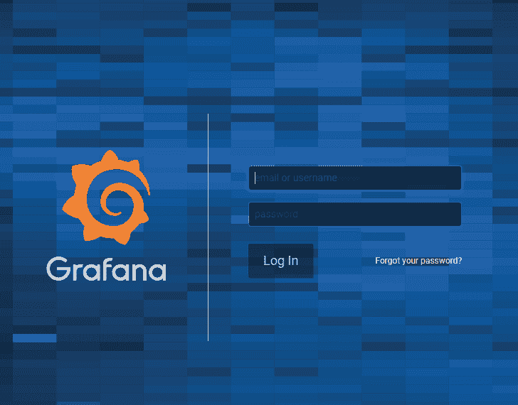

4.  使用`admin`作为用户名，`prom-operator`作为密码登录:

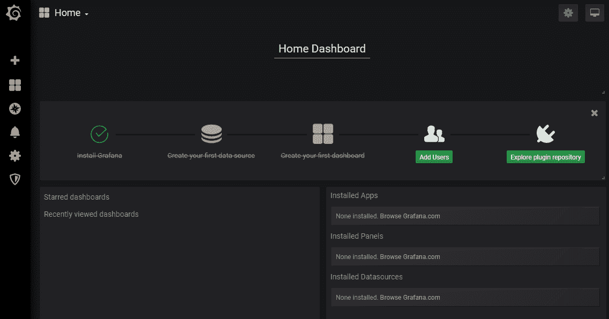

5.  单击仪表板左上角的主页按钮，列出可用的内置仪表板:

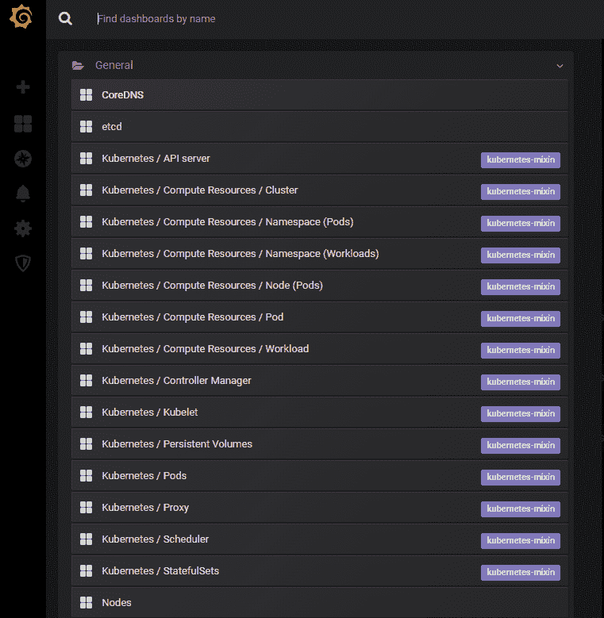

6.  例如，从列表中选择节点仪表板以显示 Kubernetes 节点指标。在此视图中，您将看到节点资源的图形表示，包括 CPU、内存、磁盘和网络利用率:

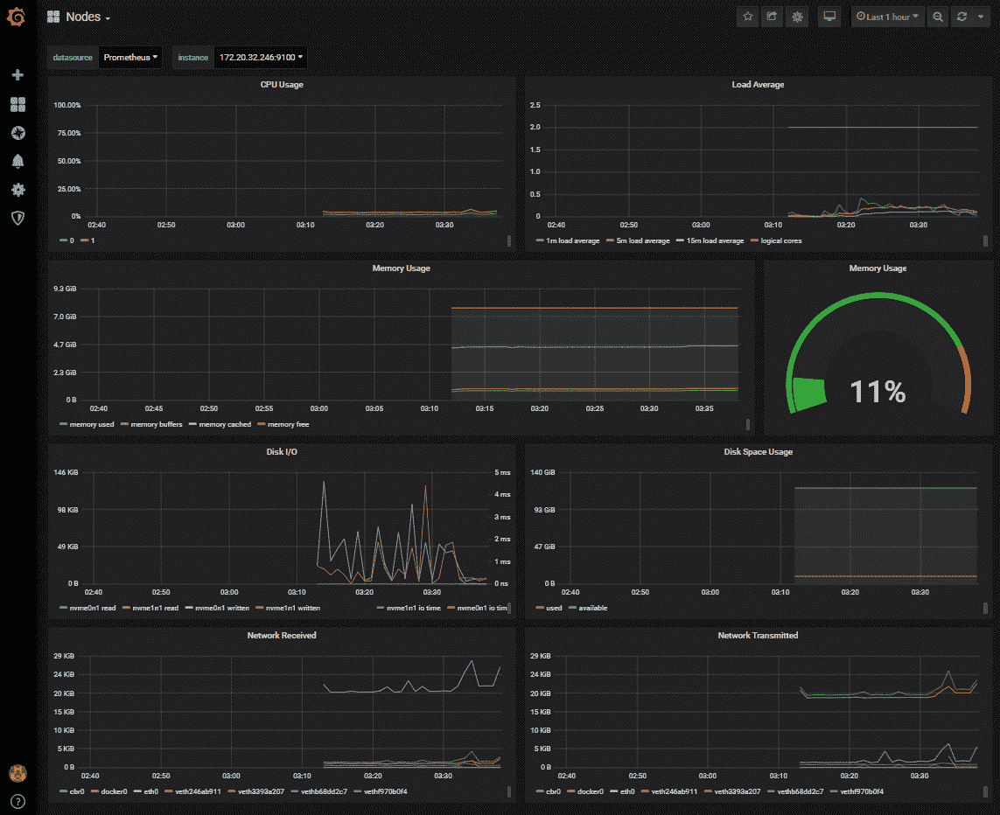

现在你知道如何在格拉夫纳导航仪表盘了。您可以使用 Grafana 可视化 Kubernetes 指标和其他工作负载指标，这些指标通过遵循下一个配方为普罗米修斯提供指标。

# 添加 Grafana 仪表板来监控应用

Grafana 用于可视化普罗米修斯上存储的指标。它提供了带有模板变量的动态且可重用的仪表板。在本食谱中，我们将学习如何从预构建的仪表板库中添加新的仪表板，以监控部署在 Kubernetes 上的应用:

1.  每个应用都有与应用连续性相关的不同指标。首先，应用需要向普罗米修斯公开度量(关于编写普罗米修斯导出器的更多信息可在*部分获得，另请参见*部分)，并且必须将普罗米修斯作为数据源添加到 Grafana。对于此配方，我们将使用我们在[第 3 章](03.html)、*建立 CI/CD 管道*中部署的詹金斯，在*詹金斯 X* 配方中建立 CI/CD 管道。
2.  点击仪表板左上角的主页按钮，然后点击 Grafana.com 上的查找仪表板:

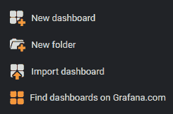

3.  在搜索栏中，输入`Jenkins`。您将看到几个詹金斯特有的仪表盘:

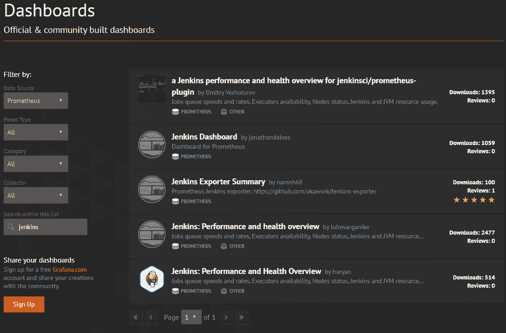

4.  点击詹金斯:性能和健康概述，并将标识复制到剪贴板。此时，您只需要将仪表板 ID 306 添加到您的 Grafana 实例中:

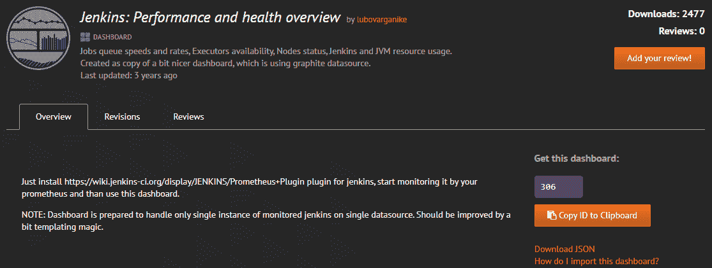

5.  如果仪表板未启用，请按照概述部分中的说明操作。
6.  在 Grafana 界面，点击导入仪表盘。将仪表板标识 306 粘贴到 Grafana.com 仪表板字段中。Grafana 将自动检测仪表板并显示详细信息:

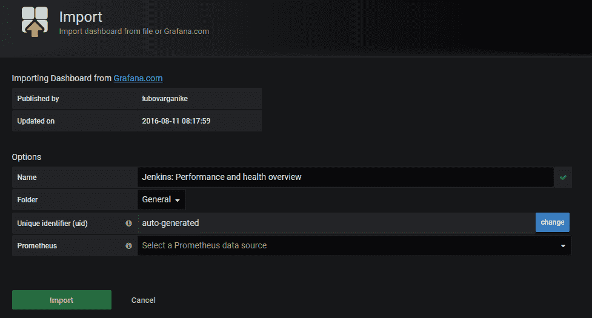

7.  选择普罗米修斯作为数据源名称，然后单击导入:

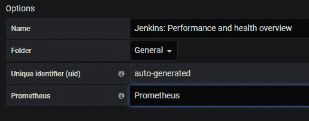

8.  单击主页按钮再次列出仪表板，您将在最新的仪表板列表中找到新的仪表板:

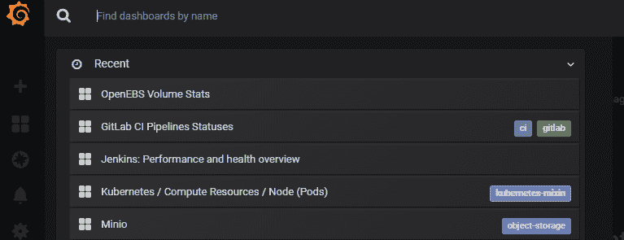

同样，您可以在 Grafana 上找到我们在前面章节中使用的应用的预构建仪表板，例如云提供商服务监控(AWS、GCP、Azure、Alibaba)、GitLab CI、Minio、OpenEBS 以及许多其他 Kubernetes 集群指标。

# 请参见

*   普罗米修斯文件:[https://prometheus.io/docs/introduction/overview/](https://prometheus.io/docs/introduction/overview/)
*   书写普罗米修斯出口商:https://prometheus.io/docs/instrumenting/writing_exporters/T2】
*   普罗米修斯的 GitHub 存储库-操作员:[https://github.com/coreos/prometheus-operator](https://github.com/coreos/prometheus-operator)T2】
*   Grafana 文档:[https://grafana . com/docs/](https://grafana.com/docs/)
*   Grafana 社区控制板:https://grafana . com/grafana/dashboards
*   Grafana 插件:[https://grafana . com/grafana/plugins](https://grafana.com/grafana/plugins)
*   启用詹金斯普罗米修斯插件:[https://wiki.jenkins.io/display/JENKINS/Prometheus+Plugin](https://wiki.jenkins.io/display/JENKINS/Prometheus+Plugin)
*   添加 Stackdriver 作为数据源:[https://grafana.com/grafana/plugins/stackdriver](https://grafana.com/grafana/plugins/stackdriver)
*   添加 Azure Monitor 作为数据源:[https://grafana . com/grafana/plugins/grafana-Azure-Monitor-data source](https://grafana.com/grafana/plugins/grafana-azure-monitor-datasource)
*   普罗米修斯替代品:
    *   大狗:[https://www.datadoghq.com](https://www.datadoghq.com)
    *   新遗迹:[https://newrelic.com](https://newrelic.com)
    *   开启猎鹰:[http://open-falcon.org](http://open-falcon.org)

# 使用 Sysdig 进行监控和性能分析

在本节中，我们将使用 Sysdig Monitor 来监控和简化 Kubernetes 故障排除。您将学习如何安装 Sysdig Monitor 并扩展 Prometheus 功能，以满足更高级的企业需求。

# 准备好

这里提到的所有操作都需要一个 Sysdig 帐户。如果你没有，去[https://sysdig.com/sign-up/](https://sysdig.com/sign-up/)创建一个试用或完整账户。

对于这个配方，我们需要准备好一个 Kubernetes 集群，并且安装 Kubernetes 命令行工具`kubectl`和`helm`来管理集群资源。

# 怎么做…

本节进一步分为以下几个小节，以简化流程:

*   安装 Sysdig 代理
*   分析应用性能

# 安装 Sysdig 代理

Sysdig Monitor 是一个工具，用于监控和故障排除作为 Sysdig 云本地可见性和安全平台的一部分提供的应用。在本食谱中，您将学习部署 Sysdig Monitor 并利用普罗米修斯指标:

1.  如果您没有准备好系统监控访问密钥，请在[https://app.sysdigcloud.com/#/settings/agentInstallation](https://app.sysdigcloud.com/#/settings/agentInstallation)进入您的帐户设置，并检索您的访问密钥:

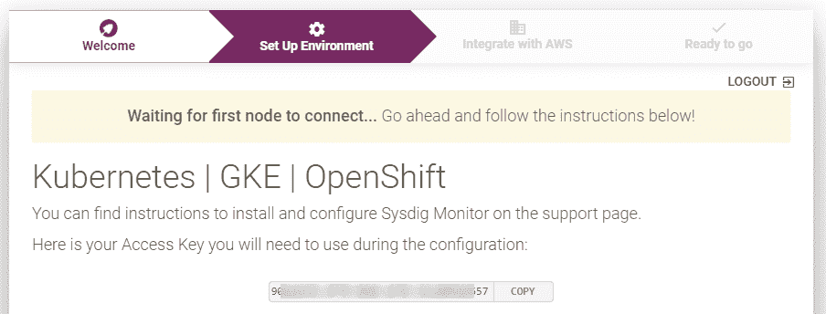

2.  从*步骤 1* 用您的系统监控访问键替换以下命令中的`YourAccessKey`后，使用 Helm 图表安装系统监控代理。此命令将把 Sysdig 监视器和 Sysdig 安全所需的 Sysdig 代理作为 DaemonSet 安装到集群中的所有 Kubernetes 工作节点上:

```
$ helm install --name sysdig-agent --set sysdig.accessKey=YourAccessKey, \ sysdig.settings.tags='linux:ubuntu, dept:dev,local:ca' \
--set sysdig.settings.k8s_cluster_name='my_cluster' stable/sysdig
```

3.  一旦安装了 Sysdig 代理，Sysdig 监视器就会检测到这些节点。在这个视图中，应该检测所有节点。在我们的示例中，我们检测到四个节点。单击“转到下一步”按钮继续:

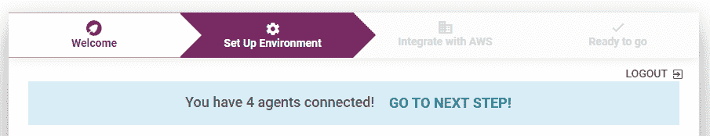

4.  Sysdig Monitor 提供了与 AWS 的深度集成。如果您的 Kubernetes 集群部署在 AWS 上，您可以选择通过在此输入您的 AWS 访问密钥 ID 和密码来启用集成；否则，单击跳过按钮跳过 AWS 集成:

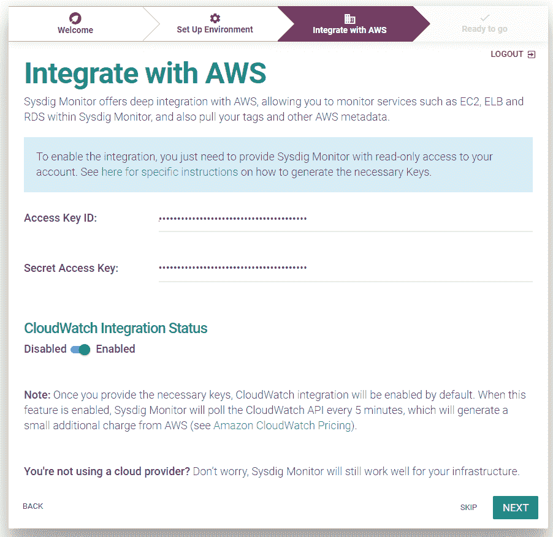

5.  单击让我们开始探索系统挖掘监视器:

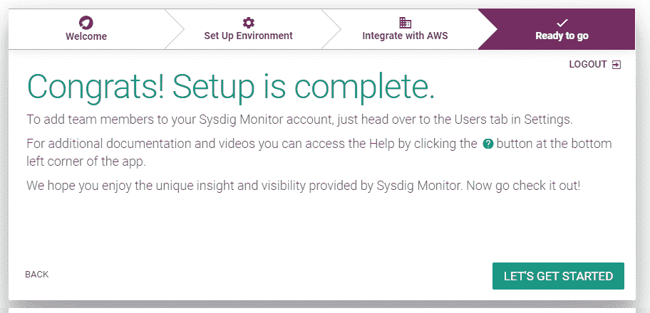

现在，您知道如何部署 Sysdig Monitor 并利用普罗米修斯指标了。

# 分析应用性能

延迟、流量、错误和饱和被谷歌 SRE 团队视为黄金信号。

让我们按照这些说明来学习如何通过 Sysdig Monitor 界面在 Kubernetes 上为您的应用找到黄金信号:

1.  在[https://app.sysdigcloud.com](https://app.sysdigcloud.com)登录您的系统挖掘云原生可见性和安全性平台仪表板:

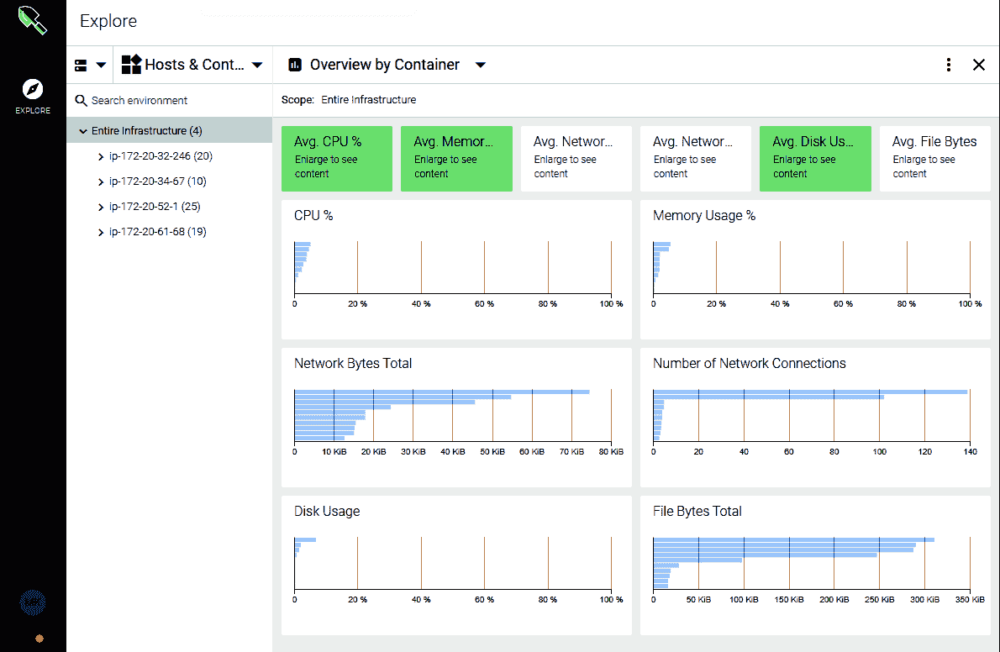

2.  资源会自动分组到主机和容器组中。单击组下拉列表并选择部署和单元:


3.  单击仪表板和指标下拉列表，并选择默认仪表板|应用下的 HTTP 仪表板:

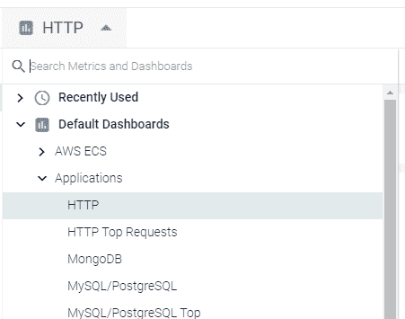

4.  Sysdig 可以识别和解码 HTTP 等应用协议，并为您提供详细的指标。在此视图中，您可以看到整个基础架构的请求数量、请求最多的 URL 或端点、最慢的 URL 以及 HTTP 响应代码和请求类型:

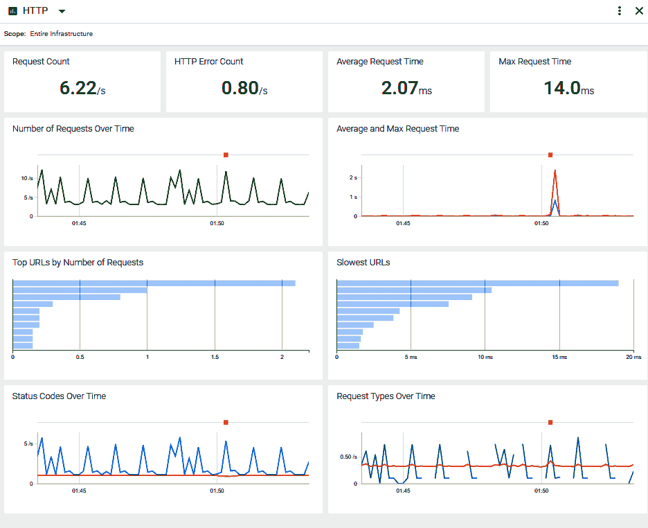

5.  作为性能故障排除的一个示例，将鼠标移动到最慢网址图上，以识别响应时间慢的问题和应用。在我们的示例中，我们看到前面部署的 Kubecost Prometheus 服务器的响应时间很慢，为 48 毫秒:

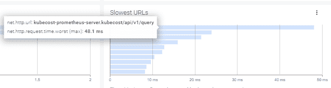

现在，您已经掌握了如何浏览 Sysdig 仪表板的基本知识。Sysdig 提供了深度跟踪功能，可以在监视多个容器时使用。我们将在[第 9 章](09.html)、*保护应用和集群*中了解更多关于 Sysdig 的安全特性和异常检测用法。您可以在*参见*部分的*系统示例*链接中找到其他用例。

# 请参见

*   sysdig Falco–行为活动监控工具:[https://github.com/draios/oss-falco](https://github.com/draios/oss-falco)
*   sysdig Inspect–容器故障排除和安全调查工具:[https://github.com/draios/sysdig-inspect](https://github.com/draios/sysdig-inspect)
*   监控分布式系统(黄金信号):[https://landing . Google . com/sre/sre-book/chapters/monitoring-distributed-systems/](https://landing.google.com/sre/sre-book/chapters/monitoring-distributed-systems/)
*   Sysdig 示例:https://github . com/draos/sys dig/wiki/sys dig 示例

# 使用 Kubecost 管理资源成本

在这一节中，我们将安装和配置开源的 Kubecost 项目，它为您提供了与成本相关的 Kubernetes 资源的可见性。您将学习如何监控资源成本，以减少支出并潜在地防止基于资源的停机。

# 准备好

这个配方需要在 AWS 或 GCP 部署一个功能强大的 Kubernetes 集群。目前，不支持其他云提供商。

在执行以下食谱中的命令之前，您需要安装`kubectl`和`helm`。您可以在[第 2 章](02.html)、*在 Kubernetes 上运行应用*的*使用 Helm 图表*部署工作负载部分找到 Helm 的安装说明。

# 怎么做…

为了简化流程，本节进一步分为以下几个小节:

*   安装 Kubecost
*   访问 Kubecost 仪表板
*   监控 Kubernetes 资源成本分配

# 安装 Kubecost

Kubecost 创建了 Kubernetes 当前和历史 Kubernetes 支出的资源粒度模型。这些模型可用于在支持多个应用、团队和部门的 Kubernetes 环境中提供对资源分配和成本透明度的监控。在本食谱中，我们将了解启动和运行 Kubecost 的基本步骤:

1.  将库贝科斯特图表存储库添加到本地赫尔姆存储库列表:

```
$ helm repo add kubecost https://kubecost.github.io/cost-analyzer/
```

2.  使用`Helm install`命令将 Kubecost 安装到`kubecost`命名空间中:

```
$ helm install kubecost/cost-analyzer --namespace kubecost --name kubecost --set kubecostToken="dGVzdEB0ZXN0LmNvbQ==xm343yadf98"
```

3.  验证所有POD都在运行。如您所见，该项目还部署了自己的普罗米修斯和格拉夫纳实例:

```
$ kubectl get pods -nkubecost
NAME READY STATUS RESTARTS AGE
cost-analyzer-checks-1571781600-6mhwh 0/1 Completed 0 7m1s
kubecost-cost-analyzer-54bc969689-8rznl 3/3 Running 0 9m7s
kubecost-grafana-844d4b9844-dkdvn 3/3 Running 0 9m7s
kubecost-prometheus-alertmanager-85bbbd6b7b-fpmqr 2/2 Running 0 9m7s
kubecost-prometheus-kube-state-metrics-857c5d4b4f-gxmgj 1/1 Running 0 9m7s
kubecost-prometheus-node-exporter-6bsp2 1/1 Running 0 9m7s
kubecost-prometheus-node-exporter-jtw2h 1/1 Running 0 9m7s
kubecost-prometheus-node-exporter-k69fh 1/1 Running 0 9m7s
kubecost-prometheus-pushgateway-7689458dc9-rx5jj 1/1 Running 0 9m7s
kubecost-prometheus-server-7b8b759d74-vww8c 2/2 Running 0 9m7s
```

If you have an existing Prometheus deployment, `node-exporter` pods may get stuck in Pending mode. In that case, you need to use different ports for Kubecost to be deployed; otherwise, pods will not be able to get the requested pod ports.

现在，您已经安装了 Kubernetes 成本分析器，其中包含了在 Kubernetes 环境中运行该分析器所需的一组组件。

# 访问 Kubecost 仪表板

让我们按照以下说明访问 Kubernetes 仪表板，您可以在其中实时监控 Kubernetes 资源及其成本:

1.  获取`kubecost`命名空间中的服务列表:

```
$ kubectl get svc -nkubecost
NAME TYPE CLUSTER-IP EXTERNAL-IP PORT(S) AGE
kubecost-cost-analyzer ClusterIP 100.65.53.41 <none> 9001/TCP,9003/TCP,9090/TCP 13m
kubecost-grafana ClusterIP 100.69.52.23 <none> 80/TCP 13m
kubecost-prometheus-alertmanager ClusterIP 100.71.217.248 <none> 80/TCP 13m
kubecost-prometheus-kube-state-metrics ClusterIP None <none> 80/TCP 13m
kubecost-prometheus-node-exporter ClusterIP None <none> 9100/TCP 13m
kubecost-prometheus-pushgateway ClusterIP 100.69.137.163 <none> 9091/TCP 13m
kubecost-prometheus-server ClusterIP 100.64.7.82 <none> 80/TCP 13m
```

2.  使用`kubectl port-forward`命令创建一个端口转发来访问 Kubecost 用户界面。该命令将把本地端口`9090`转发到库贝科斯特成本分析器POD:

```
$ kubectl port-forward --namespace kubecost deployment/kubecost-cost-analyzer 9090
```

As an alternative, you can patch the `kubecost-cost-analyzer` service using the `kubectl edit svc kubecost-cost-analyzer -nkubecost` command and change the service type `ClusterIP` to `LoadBalancer` to expose the service externally using a cloud load balancer.

3.  在网络浏览器中打开地址`http://localhost:9090`(或者外部 IP，如果使用负载平衡器)。您应该会看到 Kubecost 登录页面:

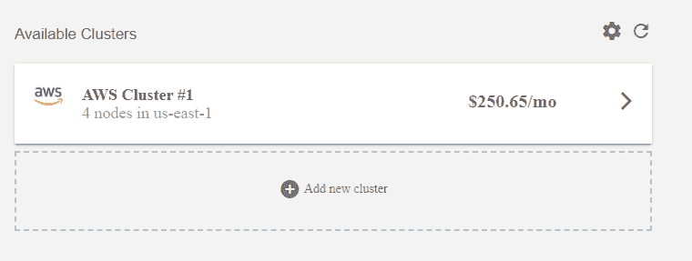

4.  仪表板可以通过在一个仪表板中添加额外的 Kubecost 端点来扩展，并用于从单个仪表板监控多个集群。如果您有多个集群，请单击添加新集群图标，并从其他集群添加您的端点 URL:

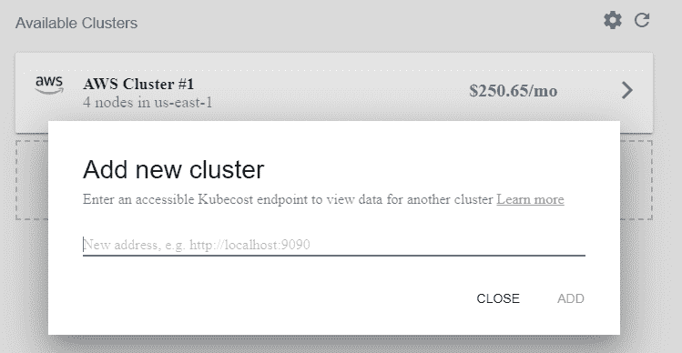

# 监控 Kubernetes 资源成本分配

让我们按照以下说明学习如何监控与 Kubernetes 相关的云支出，并使用 Kubecost 找到可能的节约建议:

1.  按照上一个配方*进入 Kubecost 仪表盘*，进入你的 Kubecost 仪表盘。单击仪表板上的集群名称，访问详细摘要。该视图将以闲置资源的形式显示每月成本和集群效率:

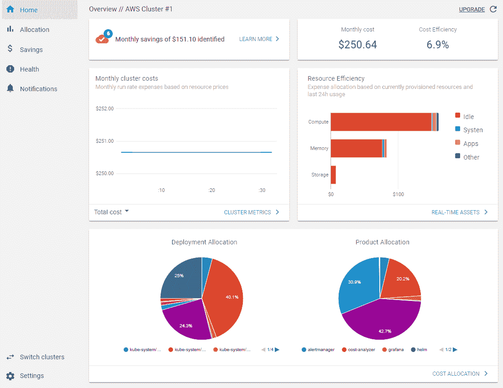

2.  点击实时资产按钮。此视图显示了与当前云提供商相关的实时成本。在我们的示例中，它是一个主服务器，使用`kops`在一个 AWS 集群上部署了三个 worker Kubernetes 集群，每个集群自创建以来显示大约 60 美元的账单:

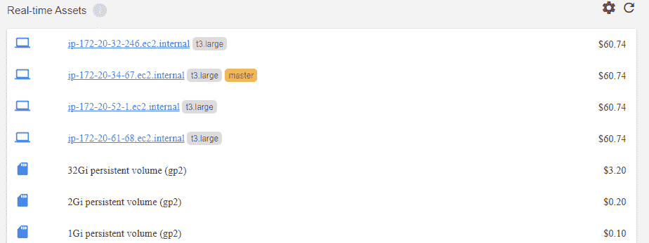

3.  单击“分配”菜单。该视图显示了当前命名空间中的累积成本。您可以应用范围筛选器来获取所选命名空间中资源的每日、每周、每月或自定义范围成本:

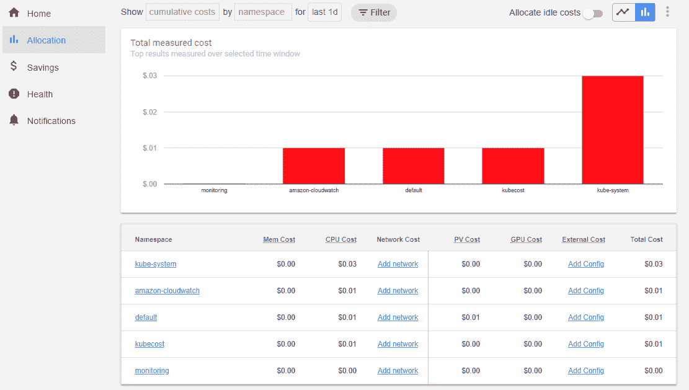

4.  单击“储蓄”菜单。该菜单中的信息非常重要，并指出您可以采取的可能优化步骤。例如，下面的视图显示，如果我们缩减集群，我们有两个未充分利用的节点(利用率低于 60%)可以节省成本。在这种情况下，我们可以耗尽节点并缩小集群。单击每个储蓄类别，了解您可以采取哪些措施来实现此处显示的储蓄率:

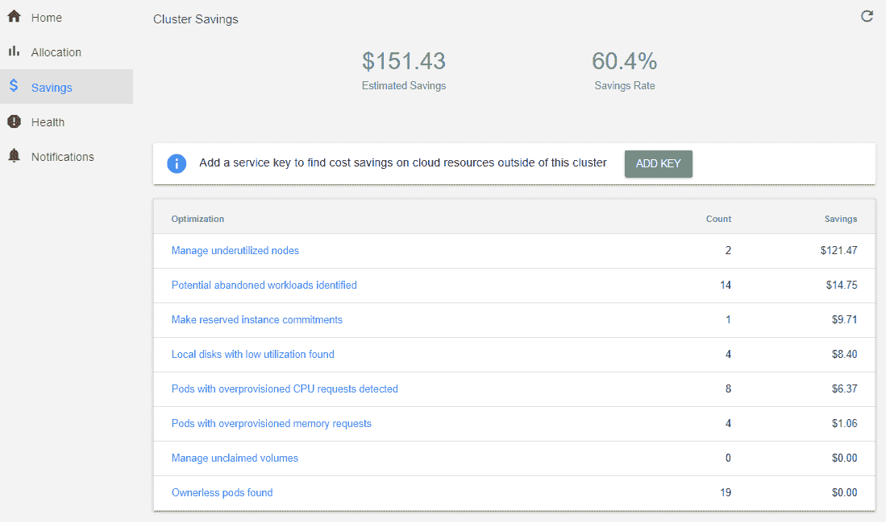

5.  单击健康菜单。此视图显示了可靠性和集群健康风险的评估:

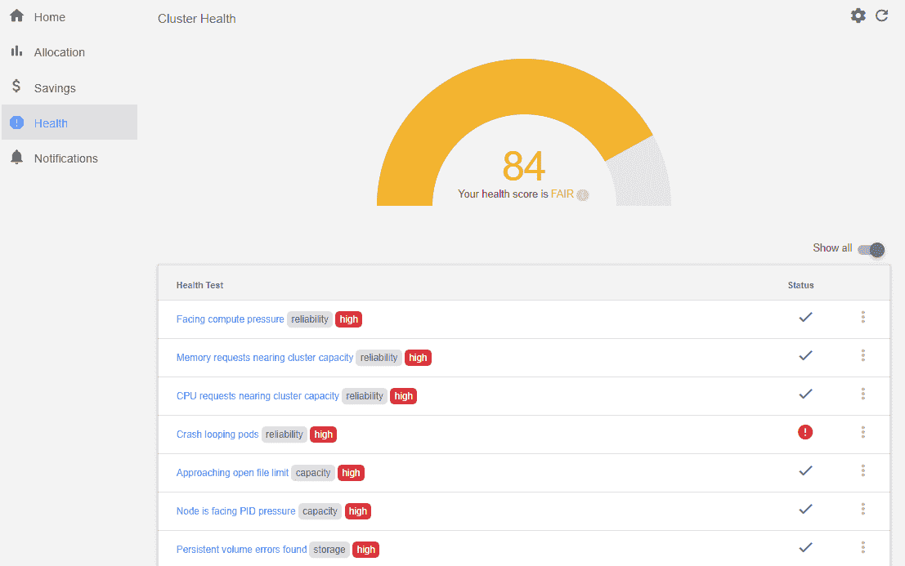

6.  禁用“全部显示”选项，列出需要您注意的问题。在我们的示例中，我们看到一个指向 Crash 循环POD的高优先级。您可以按照本章中*检查容器*部分的说明来进一步确定问题:

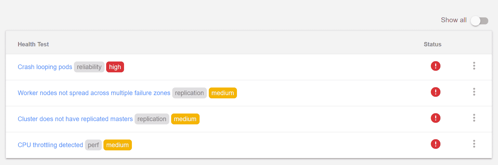

7.  单击通知菜单。从该菜单中，您可以指定如何处理通知。如果您有一个 Slack 频道，您可以点击此处的添加按钮向其转发通知；否则，电子邮件通知可以作为一个选项:

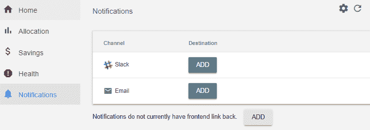

现在，您已经掌握了监控项目成本的知识，并且更好地了解了应该采取什么措施来提高 DevOps 环境的投资回报。

# 请参见

*   kubi test 文档:t0]http://docs . kubi test . com/
*   仅将 Kubecost 部署为 pod:[https://github . com/kube cost/cost-model/blob/master/部署为 pod.md](https://github.com/kubecost/cost-model/blob/master/deploying-as-a-pod.md)*