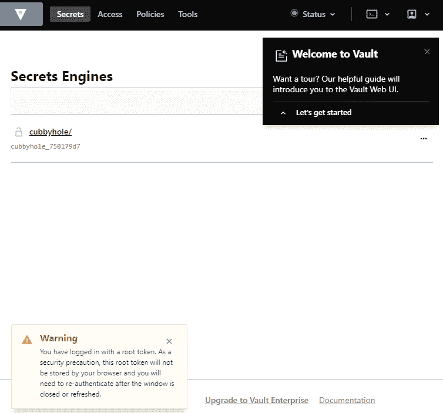

# 保护应用和集群

00000000000000000 在本章中，我们将在从测试到生产上线之前，讨论减少攻击面和保护 Kubernetes 集群的基本步骤。我们将讨论安全审计、将开发包构建到 CI/CD 管道中、检测性能分析的指标，以及如何安全地管理机密和凭据。

在本章中，我们将介绍以下食谱:

*   利用 RBAC 强化集群安全
*   配置 Pod 安全策略
*   使用 Kubernetes CIS 基准测试进行安全审计
*   使用 Aqua Security 将开发包构建到管道中
*   使用 Falco 监控可疑的应用活动
*   使用哈希公司保险库保护凭据

# 技术要求

本章中的方法要求您按照[第 1 章](01.html)*中描述的推荐方法之一，构建生产就绪型Kubernetes集群*，部署一个功能性Kubernetes集群。

本章的其余部分将使用 Kubernetes 命令行工具`kubectl`，因为它是针对 Kubernetes 集群运行命令的主要命令行界面。我们还将使用`helm`来部署解决方案。

# 利用 RBAC 强化集群安全

在像 Kubernetes 这样的复杂系统中，授权机制用于设置谁被允许对集群资源进行哪些更改并对其进行操作。**基于角色的访问控制** ( **RBAC** )是一种高度集成到 Kubernetes 中的机制，它授予用户和应用对 Kubernetes APIs 的细粒度访问权限。

作为良好的实践，您应该将节点和 RBAC 授权者与`NodeRestriction`准入插件一起使用。

在本节中，我们将介绍如何启用 RBAC，以及如何创建角色和角色绑定来授予应用和用户对集群资源的访问权限。

# 准备好

确保您已准备好启用 RBAC 的 Kubernetes 集群(由于 Kubernetes 1.6，默认情况下启用了 RBAC)，并且已经配置了`kubectl`和`helm`，以便您可以管理集群资源。创建私钥还要求您在尝试为用户创建密钥之前拥有`openssl`工具。

将`k8sdevopscookbook/src`存储库克隆到您的工作站，以使用`chapter9`目录中的清单文件，如下所示:

```
$ git clone https://github.com/k8sdevopscookbook/src.git
$ cd src/chapter9/rbac
```

默认情况下，从 Kubernetes 1.6 开始启用 RBAC。如果因为任何原因被禁用，用`--authorization-mode=RBAC`启动 API 服务器启用 RBAC。

# 怎么做…

本节进一步分为以下几个小节，以简化这一过程:

*   查看默认角色
*   创建用户帐户
*   创建角色和角色绑定
*   测试 RBAC 规则

# 查看默认角色

RBAC 是 Kubernetes 集群的核心组件，它允许我们创建和授予对象角色，并控制对集群内资源的访问。这个食谱将帮助你理解角色和角色绑定的内容。

让我们执行以下步骤来查看集群中的默认角色和角色绑定:

1.  使用以下命令查看默认集群角色。您将看到一个很长的混合列表，其中包含`system:`、`system:controller:`和其他一些前缀为`roles. system:*`的角色，这些角色由基础架构使用，`system:controller`角色由 Kubernetes 控制器管理器使用，该管理器是一个监视集群共享状态的控制循环。总的来说，当您需要解决权限问题时，它们都很好，但是我们不会经常使用它们:

```
$ kubectl get clusterroles
$ kubectl get clusterrolebindings
```

2.  查看 Kubernetes 拥有的系统角色之一，了解它们的用途和限制。在下面的例子中，我们看到的是`system:node`，它定义了 kubelets 的权限。在规则的输出中，`apiGroups:`表示核心应用编程接口组，`resources`表示Kubernetes资源类型，`verbs`表示角色上允许的应用编程接口操作:

```
$ kubectl get clusterroles system:node -oyaml
```

3.  让我们查看默认的面向用户的角色，因为它们是我们更感兴趣的角色。没有`system:`前缀的角色是面向用户的角色。以下命令将只列出非系统角色:前缀角色。使用角色绑定在特定命名空间中授予的主要角色是`admin`、`edit`和`view`角色:

```
$ kubectl get clusterroles | grep -v '^system'
NAME AGE
admin 8d #gives read-write access
 to all resources
cluster-admin 8d #super-user, gives read-write access
 to all resources
edit 8d #allows create/update/delete on resources except RBAC permissions
kops:dns-controller 8d
kube-dns-autoscaler 8d
view 8d #read-only access to resources
```

4.  现在，使用以下命令查看默认集群绑定，即`cluster-admin`。您将看到，该绑定授予`system:masters`组集群范围的超级用户权限，该权限具有`cluster-admin`角色:

```
$ kubectl get clusterrolebindings/cluster-admin -o yaml
apiVersion: rbac.authorization.k8s.io/v1
kind: ClusterRoleBinding
metadata:
...
roleRef:
 apiGroup: rbac.authorization.k8s.io
 kind: ClusterRole
 name: cluster-admin
subjects:
- apiGroup: rbac.authorization.k8s.io
 kind: Group
 name: system:masters
```

自 Kubernetes 1.6 版本以来，默认情况下启用了 RBAC，并且可以创建新用户，并且在管理员用户为特定资源分配权限之前，无需权限即可启动。现在，您知道了可用的默认角色。

在下面的食谱中，您将学习如何创建新的角色和角色绑定，并授予帐户所需的权限。

# 创建用户帐户

正如 Kubernetes 文档中所解释的，Kubernetes 没有对象来表示正常的用户帐户。因此，它们需要在外部进行管理(查看*中的 *Kubernetes 认证*文档，更多详细信息请参见*部分)。这个食谱将向您展示如何使用私钥创建和管理用户帐户。

让我们执行以下步骤来创建用户帐户:

1.  为示例用户创建私钥。在我们的例子中，关键文件是`user3445.key`:

```
$ openssl genrsa -out user3445.key 2048
```

2.  使用我们在*步骤 1* 中创建的私钥创建名为`user3445.csr`的**证书签名请求** ( **CSR** )。在`-subj`参数中设置用户名(`/CN`)和组名(`/O`)。在下面的例子中，用户名是`john.geek`，而组是`development`:

```
$ openssl req -new -key user3445.key \
-out user3445.csr \
-subj "/CN=john.geek/O=development"
```

3.  要使用内置签名者，您需要找到群集的群集签名证书。默认情况下，`ca.crt`和`ca.key`文件应该在`/etc/kubernetes/pki/`目录下。如果使用 kops 部署，可以从`s3://$BUCKET_NAME/$KOPS_CLUSTER_NAME/pki/private/ca/*.key`和`s3://$BUCKET_NAME/$KOPS_CLUSTER_NAME/pki/issued/ca/*.crt`下载集群签名密钥。找到密钥后，将以下代码中提到的`CERT_LOCATION`更改为文件的当前位置，并生成最终签名证书:

```
$ openssl x509 -req -in user3445.csr \
-CA CERT_LOCATION/ca.crt \
-CAkey CERT_LOCATION/ca.key \
-CAcreateserial -out user3445.crt \
-days 500
```

4.  如果所有文件都已找到，*步骤 3* 中的命令应返回类似如下的输出:

```
Signature ok
subject=CN = john.geek, O = development
Getting CA Private Key
```

在我们继续之前，请确保您将签名的密钥存储在安全的目录中。作为行业最佳实践，建议使用机密引擎或保管库存储。在本章后面的*中，您将了解更多关于使用哈希公司保险库*保护凭证的信息。

5.  使用新用户凭据创建新上下文:

```
$ kubectl config set-credentials user3445 --client-certificate=user3445.crt --client-key=user3445.key
$ kubectl config set-context user3445-context --cluster=local --namespace=secureapp --user=user3445
```

6.  使用以下注释列出现有上下文。您将看到新的`user3445-context`已经创建:

```
$ kubectl config get-contexts
CURRENT NAME                    CLUSTER AUTHINFO NAMESPACE
*       service-account-context local   kubecfg
 user3445-context        local   user3445 secureapp
```

7.  现在，尝试使用新的用户上下文来列出 pods。由于新用户没有任何角色，并且默认情况下没有为新用户分配任何角色，因此您将收到拒绝访问错误:

```
$ kubectl --context=user3445-context get pods
Error from server (Forbidden): pods is forbidden: User "john.geek" cannot list resource "pods" in API group "" in the namespace "secureapps"
```

8.  或者，您可以使用`openssl base64 -in <infile> -out <outfile>`命令对所有三个文件(`user3445.crt`、`user3445.csr`和`user3445.key`)进行`base64`编码，并将填充的`config-user3445.yml`文件分发给您的开发人员。一个示例文件可以在本书的`src/chapter9/rbac`目录下的 GitHub 存储库中找到。有许多方法可以分发用户凭据。使用文本编辑器查看示例:

```
$ cat config-user3445.yaml
```

至此，您已经学会了如何创建新用户。接下来，您将创建角色并将其分配给用户。

# 创建角色和角色绑定

角色和角色绑定总是在已定义的命名空间中使用，这意味着与用于向节点等群集范围的资源授予权限的集群角色和集群角色绑定相比，只能向与角色和角色绑定位于同一命名空间的资源授予权限。

让我们执行以下步骤，在集群中创建一个角色和角色绑定示例:

1.  首先，创建一个命名空间，我们将在其中创建角色和角色绑定。在我们的例子中，命名空间是`secureapp`:

```
$ kubectl create ns secureapp
```

2.  使用以下规则创建角色。该角色基本上允许在我们在*步骤 1 中创建的`secureapp`命名空间中的`deployer`角色的部署、副本集和吊舱上执行所有操作。*请注意，授予的任何权限都只是附加的，没有拒绝规则:

```
$ cat <<EOF | kubectl apply -f -
apiVersion: rbac.authorization.k8s.io/v1
kind: Role
metadata:
 namespace: secureapp
 name: deployer
rules:
- apiGroups: ["", "extensions", "apps"]
 resources: ["deployments", "replicasets", "pods"]
 verbs: ["get", "list", "watch", "create", "update", "patch", "delete"]
EOF
```

3.  使用`secureapp`命名空间中的`deployer`角色和用户名`john.geek`创建角色绑定。我们这样做是因为角色绑定只能引用存在于同一命名空间中的角色:

```
$ cat <<EOF | kubectl apply -f -
kind: RoleBinding
apiVersion: rbac.authorization.k8s.io/v1
metadata:
 name: deployer-binding
 namespace: secureapp
subjects:
- kind: User
 name: john.geek
 apiGroup: ""
roleRef:
 kind: Role
 name: deployer
 apiGroup: ""
EOF
```

至此，您已经学习了如何创建一个新角色，并使用角色绑定向用户授予权限。

# 测试 RBAC 规则

让我们执行以下步骤来测试我们之前创建的角色和角色绑定:

1.  在用户有权访问的`secureapp`命名空间中部署一个测试容器:

```
$ cat <<EOF | kubectl --context=user3445-context apply -f -
apiVersion: v1
kind: Pod
metadata:
 name: busybox
 namespace: secureapp
spec:
 containers:
 - image: busybox
 command:
 - sleep
 - "3600"
 imagePullPolicy: IfNotPresent
 name: busybox
 restartPolicy: Always
EOF
```

在新用户的上下文中列出豆荚。在*步骤 7* 中创建用户帐户配方失败的相同命令现在应该成功执行:

```
$ kubectl --context=user3445-context get pods 
NAME    READY STATUS  RESTARTS AGE
busybox 1/1   Running 1        2m
```

如果您尝试在不同的名称空间中创建同一个 pod，您将看到命令将无法执行。

# 它是如何工作的...

这个配方向您展示了如何在 Kubernetes 中创建新用户，以及如何快速创建角色和角色绑定来授予 Kubernetes 上用户帐户的权限。

Kubernetes 集群有两种类型的用户:

*   **用户账号**:用户账号为外部管理的普通用户。
*   **服务账户**:服务账户是与 Kubernetes 服务相关联的用户，由 Kubernetes API 使用自己的资源进行管理。

您可以通过查看*中的*管理服务帐户*链接了解更多关于服务帐户的信息，另请参见*部分。

在*创建角色和角色绑定*配方中，在*步骤 1* 中，我们创建了一个名为`deployer`的角色。然后，在*步骤 2* 中，我们将与部署者角色相关联的规则授予用户帐户`john.geek`。

RBAC 使用`rbac.authorization.k8s.io`应用编程接口做出授权决定。这允许管理员使用 Kubernetes APIs 动态配置策略。如果您想使用现有的角色并授予某个人集群范围的超级用户权限，您可以使用带有集群角色绑定的`cluster-admin`集群角色。集群角色没有命名空间限制，可以在任何具有授予权限的命名空间中执行命令。总的来说，在为用户分配`cluster-admin`集群角色时，您应该小心。集群角色也可以限于命名空间，如果与角色绑定一起使用来授予权限，则类似于角色。

# 请参见

*   Kubernetes 文档中的 RBAC 授权:[https://Kubernetes . io/docs/reference/access-authn-authz/RBAC/# role binding-and-cluster role binding](https://kubernetes.io/docs/reference/access-authn-authz/rbac/#rolebinding-and-clusterrolebinding)
*   关于默认角色和角色绑定的更多信息:[https://kubernetes . io/docs/reference/access-authn-authz/RBAC/#默认角色和角色绑定](https://kubernetes.io/docs/reference/access-authn-authz/rbac/#default-roles-and-role-bindings)
*   基于 Kubernetes 审核日志自动生成 RBAC 策略:[https://github.com/liggitt/audit2rbac](https://github.com/liggitt/audit2rbac)
*   Kubernetes 认证:[https://kubernetes . io/docs/reference/access-authn-authz/Authentication/](https://kubernetes.io/docs/reference/access-authn-authz/authentication/)
*   管理服务帐户:[https://kubernetes . io/docs/reference/access-authn-authz/Service-Accounts-admin/](https://kubernetes.io/docs/reference/access-authn-authz/service-accounts-admin/)
*   kubectl-bindrole 工具，用于查找绑定到指定服务帐户的 Kubernetes 角色:[https://github.com/Ladicle/kubectl-bindrole](https://github.com/Ladicle/kubectl-bindrole)

# 配置 Pod 安全策略

**pod 安全策略** ( **PSP** )用于 Kubernetes 集群，以实现 Pod 创建的粒度授权并控制 Pod 的安全方面。PodSecurityPolicy 对象定义了 pod 被集群接受并按预期运行的条件。

在本节中，我们将介绍 Kubernetes 上 PSP 的重新创建和配置。

# 准备好

确保您已准备好启用 RBAC 的 Kubernetes 集群(由于 Kubernetes 1.6，默认情况下启用了 RBAC)，并且`kubectl`和`helm`已配置为管理集群资源。

将`k8sdevopscookbook/src`存储库克隆到您的工作站，以使用`chapter9`目录中的清单文件，如下所示:

```
$ git clone https://github.com/k8sdevopscookbook/src.git
$ cd src/chapter9/psp
```

通过运行`kubectl get psp`命令，验证是否需要在您的集群上启用 PodSecurityPolicy。如果您收到消息称`the server doesn't have a resource type "podSecurityPolicies".`，则需要在您的集群上启用 PSP。

# 怎么做…

本节进一步分为以下几个小节，以简化这一过程:

*   在 EKS 启用私营保安公司
*   在 GKE 启用私营保安公司
*   在 AKS 上启用 PSp
*   创建受限 PSp

# 在 EKS 启用私营保安公司

作为最佳实践，在您创建自己的策略之前，不应启用 PSP。这个食谱将带你了解如何在亚马逊 EKS 上启用 PSP，以及如何查看默认策略。

让我们执行以下步骤:

1.  部署 Kubernetes 版或更高版本。PSP 将默认启用。默认配置附带一个名为`eks.privileged`的无中断策略，该策略没有任何限制。使用以下命令查看默认策略:

```
$ kubectl get psp eks.privileged
NAME           PRIV CAPS SELINUX  RUNASUSER FSGROUP  SUPGROUP READONLYROOTFS VOLUMES
eks.privileged true *    RunAsAny RunAsAny  RunAsAny RunAsAny false          *
```

2.  描述策略以查看其全部详细信息，如下所示:

```
$ kubectl describe psp eks.privileged
```

3.  要查看、恢复或删除默认 PSP，请使用名为`eks-privileged-psp.yaml`的`src/chapter9/psp`中示例存储库中的 YAML 清单。

# 在 GKE 启用私营保安公司

作为最佳实践，在您创建自己的策略之前，不应启用 PSP。本食谱将带您了解如何在**谷歌 Kubernetes 引擎** ( **GKE** )上启用 PSP，以及如何查看默认策略。

让我们执行以下步骤:

1.  您可以在您部署的集群上启用 PSP，方法是按照*中【第 1 章】、 *构建生产就绪型 Kubernetes 集群*中给出的说明，通过运行以下命令在 GKE* 上配置托管 Kubernetes 集群。将`k8s-devops-cookbook-1`替换为您自己的集群名称:

```
$ gcloud beta container clusters update k8s-devops-cookbook-1 --enable-pod-security-policy
```

2.  默认配置附带了一个名为`gce.privileged`的无中断策略，该策略没有任何限制，并且有几个其他策略。使用以下命令查看默认策略:

```
$ kubectl get psp
NAME                         PRIV  CAPS SELINUX  RUNASUSER FSGROUP  SUPGROUP READONLYROOTFS VOLUMES
gce.event-exporter           false      RunAsAny RunAsAny  RunAsAny RunAsAny false          hostPath,secret
gce.fluentd-gcp              false      RunAsAny RunAsAny  RunAsAny RunAsAny false          configMap,hostPath,secret
gce.persistent-volume-binder false      RunAsAny RunAsAny  RunAsAny RunAsAny false          nfs,secret,projected
gce.privileged               true  *    RunAsAny RunAsAny  RunAsAny RunAsAny false          *
gce.unprivileged-addon       false SETPCAP,MKNOD,AUDIT_WRITE,CHOWN,NET_RAW,DAC_OVERRIDE,FOWNER,FSETID,KILL,SETGID,SETUID,NET_BIND_SERVICE,SYS_CHROOT,SETFCAP RunAsAny RunAsAny RunAsAny RunAsAny false emptyDir,configMap,secret,projected
```

3.  描述策略以查看其全部详细信息，如下所示:

```
$ kubectl describe psp gce.privileged
```

4.  要查看、恢复或删除默认 PSP，请使用名为`gce-privileged-psp.yaml`的`src/chapter9/psp`中示例存储库中的 YAML 清单。

# 在 AKS 上启用 PodSecurityPolicy 策略

作为最佳实践，在创建自己的策略之前，不应启用 PodSecurityPolicy。本菜谱将带您了解如何在 **Azure Kubernetes 服务** ( **AKS** )上启用 PSP，以及如何查看默认策略。

让我们执行以下步骤:

1.  您可以在已部署的集群上启用 PSP，方法是按照[第 1 章](01.html) *构建生产就绪型 Kubernetes 集群*中给出的说明，在*中通过运行以下命令在 AKS* 配方上配置托管 Kubernetes 集群。将`k8sdevopscookbook`替换为您自己的资源组，将`AKSCluster`替换为您的集群名称:

```
$ az aks create --resource-group k8sdevopscookbook \
--name AKSCluster \
--enable-pod-security-policy
```

2.  默认配置附带一个名为`privileged`的无中断策略，没有任何限制。使用以下命令查看默认策略:

```
$ kubectl get psp
NAME PRIV CAPS SELINUX RUNASUSER FSGROUP SUPGROUP READONLYROOTFS VOLUMES
privileged true * RunAsAny RunAsAny RunAsAny RunAsAny false * configMap,emptyDir,projected,secret,downwardAPI,persistentVolumeClaim
```

3.  描述策略以查看其全部详细信息，如下所示:

```
$ kubectl describe psp privileged
```

4.  要查看、恢复或删除默认 PSP，请使用名为`aks-privileged-psp.yaml`的`src/chapter9/psp`中示例存储库中的 YAML 清单。

# 创建受限 PSp

作为安全最佳实践，建议限制 pods 中的容器以 root 用户权限运行，以限制任何可能的风险。在特权模式下运行时，在容器内运行的进程与容器外的进程具有相同的特权和访问权限，这可能会增加攻击者访问某些管理功能的风险。

让我们执行以下步骤来创建根访问受限的 PodSecurityPolicy 策略:

1.  部署新的受限`PodSecurityPolicy`:

```
$ cat <<EOF | kubectl apply -f -
apiVersion: extensions/v1beta1
kind: PodSecurityPolicy
metadata:
 name: restricted-psp
spec:
 privileged: false
 runAsUser:
 rule: MustRunAsNonRoot
 seLinux:
 rule: RunAsAny
 fsGroup:
 rule: RunAsAny
 supplementalGroups:
 rule: RunAsAny
 volumes:
 - '*'
EOF
```

2.  确认策略已创建。您会注意到`RUNASUSER`列显示`MustRunAsNonRoot`，表示不允许使用 root 权限:

```
$ kubectl get psp restricted-psp
NAME           PRIV  CAPS     SELINUX  RUNASUSER        FSGROUP   SUPGROUP READONLYROOTFS VOLUMES
restricted-psp false          RunAsAny MustRunAsNonRoot RunAsAny  RunAsAny false          *
```

3.  通过运行需要 root 访问权限的 pod 来验证 PSP。部署将失败，并显示一条消息说明`container has runAsNonRoot and image will run as root`，如下代码所示:

```
$ kubectl run --image=mariadb:10.4.8 mariadb --port=3306 --env="MYSQL_ROOT_PASSWORD=my-secret-pw"
$ kubectl get pods
NAME                     READY STATUS                                                RESTARTS AGE
mariadb-5584b4f9d8-q6whd 0/1   container has runAsNonRoot and image will run as root 0        46s
```

至此，您已经了解了如何创建根访问受限的 PodSecurityPolicy。

# 还有更多…

本节进一步分为以下几个小节，以简化这一过程:

*   限制吊舱访问特定的卷类型
*   使用 Kubernetes PSPs 顾问

# 限制吊舱访问特定的卷类型

作为 PodSecurityPolicy 规则的一部分，您可能希望限制特定类型卷的使用。在本食谱中，您将学习如何将容器限制为体积类型。

让我们执行以下步骤来创建一个 PodSecurityPolicy 策略:

1.  创建新的受限`PodSecurityPolicy`。此策略仅将卷的类型限制为`nfs`:

```
$ cat <<EOF | kubectl apply -f -
kind: PodSecurityPolicy
metadata:
 name: restricted-vol-psp
spec:
 privileged: false
 runAsUser:
 rule: RunAsAny
 seLinux:
 rule: RunAsAny
 fsGroup:
 rule: RunAsAny
 supplementalGroups:
 rule: RunAsAny
 volumes:
 - 'nfs'
EOF
```

2.  通过部署需要持久存储的应用来验证策略。这里，我们将使用前几章中的 MinIO 示例。部署应该会失败，并显示消息`persistentVolumeClaim volumes are not allowed to be used`:

```
$ kubectl create -f \
https://raw.githubusercontent.com/k8sdevopscookbook/src/master/chapter6/minio/minio.yaml
```

3.  删除 PSP 和部署:

```
$ kubectl delete psp restricted-vol-psp
$ kubectl delete -f \
https://raw.githubusercontent.com/k8sdevopscookbook/src/master/chapter6/minio/minio.yaml
```

4.  新 PSP 的推荐允许卷集为`configMap`、`downwardAPI`、`emptyDir`、`persistentVolumeClaim`、`secret`和`projected`。您可以通过转到*中的*支持的卷类型*链接找到卷类型的完整列表，另请参见*部分。使用以下内容创建新的受限 PodSecurityPolicy。该政策仅将卷的类型限制为`persistentVolumeClaim`:

```
$ cat <<EOF | kubectl apply -f -
kind: PodSecurityPolicy
metadata:
 name: permit-pvc-psp
spec:
 privileged: false
 runAsUser:
 rule: RunAsAny
 seLinux:
 rule: RunAsAny
 fsGroup:
 rule: RunAsAny
 supplementalGroups:
 rule: RunAsAny
 volumes:
 - 'persistentVolumeClaim'
EOF
```

5.  重复*步骤 2* 部署应用。这一次，将允许`persistentVolumeClaim`创建，并将创建 pod 请求的聚氯乙烯。

# 使用 Kubernetes PodSecurityPolicy 策略顾问

Kubernetes PodSecurityPolicy Advisor 是来自 Sysdig 的一个简单工具，用于在 Kubernetes 中实施最佳安全实践。`kube-psp-advisor`扫描 Kubernetes 资源的现有安全上下文，并为集群中的资源生成 PSPs，以删除不必要的权限。

让我们执行以下步骤来启用集群上的`kube-psp-advisor`:

1.  使用以下命令克隆存储库并构建项目:

```
$ git clone https://github.com/sysdiglabs/kube-psp-advisor
$ cd kube-psp-advisor && make build
```

2.  通过执行二进制文件运行扫描过程。如果您想将扫描限制在一个名称空间，您可以通过在命令中添加`--namespace=`参数来指定它，类似于下面的代码。如果不这样做，它将扫描整个集群。完成后，将生成一个`PodSecurityPolicy`:

```
$ ./kube-psp-advisor --namespace=secureapp > psp-advisor.yaml
```

3.  查看`psp-advisor.yaml`文件的内容并应用生成的 PSP:

```
$ cat psp-advisor.yaml
$ kubectl apply -f psp-advisor.yaml
```

至此，您已经学会了如何以更简单的方式生成 PSP，以减少可能增加攻击面的不必要权限。

# 请参见

*   Kubernetes 文档–pod security policy:[https://kubernetes . io/docs/concepts/policy/pod-security-policy/](https://kubernetes.io/docs/concepts/policy/pod-security-policy/)
*   支持的卷类型:[https://kubernetes . io/docs/concepts/storage/volumes/#卷类型](https://kubernetes.io/docs/concepts/storage/volumes/#types-of-volumes)

# 使用 Kubernetes CIS 基准测试进行安全审计

Kubernetes CIS 基准测试是被行业专家接受的安全配置最佳实践。《CIS 基准指南》可从【https://www.cisecurity.org/】的 ( **CIS** )网站以 PDF 文件的形式下载。`kube-bench`是一个自动化文档化检查的应用。

在本节中，我们将介绍安装和使用开源`kube-bench`工具来运行 Kubernetes CIS 基准测试，用于 Kubernetes 集群的安全审计。

# 准备好

对于这个配方，我们需要准备好一个 Kubernetes 集群，并安装 Kubernetes 命令行工具`kubectl`。

将`k8sdevopscookbook/src`存储库克隆到您的工作站，以使用`chapter9`目录中的清单文件，如下所示:

```
$ git clone https://github.com/k8sdevopscookbook/src.git
$ cd src/chapter9/cis
```

有些测试以 Kubernetes 节点为目标，只能在完全自我管理的集群上执行，在这些集群中，您可以控制主节点。因此，EKS、GKE、AKS 等托管集群将无法执行所有测试，需要不同的工作描述或参数来执行测试。必要时会提到这些。

# 怎么做…

本节进一步分为以下几个小节，以简化这一过程:

*   在 Kubernetes 上运行 kube-bench
*   在托管 Kubernetes 服务上运行 kube-bench
*   在 OpenShift 上运行 kube-bench
*   运行 kube-hunter

# 在 Kubernetes 上运行 kube-bench

CIS 基准测试对主节点和工作节点都进行了测试。因此，测试的全部范围只能在您可以控制主节点的自我管理集群上完成。在本食谱中，您将学习如何直接在主节点和工作节点上运行 kube-bench。

让我们执行以下步骤来运行 CIS 建议的测试:

1.  在您的一个主节点和一个工作节点上下载并安装`kube-bench`命令行界面:

```
$ curl --silent --location "https://github.com/aquasecurity/kube-bench/releases/download/v0.1.0/kube-bench_0.1.0_linux_amd64.tar.gz" | tar xz -C /tmp
$ sudo mv /tmp/kube-bench /usr/local/bin
```

2.  SSH 进入您的 Kubernetes 主节点并运行以下命令。它将快速返回测试结果，并附有解释和建议后续运行的附加手动测试列表。这里可以看到`31`检查通过，`36`测试失败:

```
$ kube-bench master
...
== Summary ==
31 checks PASS
36 checks FAIL
24 checks WARN
1 checks INFO
```

3.  要保存结果，请使用以下命令。测试完成后，将`kube-bench-master.txt`文件移动到您的本地主机进行进一步检查:

```
$ kube-bench master > kube-bench-master.txt
```

4.  查看`kube-bench-master.txt`文件的内容。您将从Kubernetes指南的 CIS 基准中看到检查的状态，类似于以下内容:

```
[INFO] 1 Master Node Security Configuration
[INFO] 1.1 API Server
[PASS] 1.1.1 Ensure that the --anonymous-auth argument is set to false (Not Scored)
[FAIL] 1.1.2 Ensure that the --basic-auth-file argument is not set (Scored)
[PASS] 1.1.3 Ensure that the --insecure-allow-any-token argument is not set (Not Scored)
[PASS] 1.1.4 Ensure that the --kubelet-https argument is set to true (Scored)
[FAIL] 1.1.5 Ensure that the --insecure-bind-address argument is not set (Scored)
[FAIL] 1.1.6 Ensure that the --insecure-port argument is set to 0 (Scored)
[PASS] 1.1.7 Ensure that the --secure-port argument is not set to 0 (Scored)
[FAIL] 1.1.8 Ensure that the --profiling argument is set to false (Scored)
[FAIL] 1.1.9 Ensure that the --repair-malformed-updates argument is set to false (Scored)
[PASS] 1.1.10 Ensure that the admission control plugin AlwaysAdmit is not set (Scored)
...
```

测试被分为在 CIS 基准指南中建议的类别，如应用编程接口服务器、调度程序、控制器管理器、配置管理器等，通用安全原语和 podcasteripolicy。

5.  按照报告的*补救*部分中建议的方法修复失败的问题，并重新运行测试以确认已经进行了纠正。您可以在此处看到前一份报告建议的一些补救措施:

```
== Remediations ==
1.1.2 Follow the documentation and configure alternate mechanisms for authentication. Then,
edit the API server pod specification file /etc/kubernetes/manifests/kube-apiserver.manifest
on the master node and remove the --basic-auth-file=<filename>
parameter.

1.1.5 Edit the API server pod specification file /etc/kubernetes/manifests/kube-apiserver.manife$
on the master node and remove the --insecure-bind-address
parameter.

1.1.6 Edit the API server pod specification file /etc/kubernetes/manifests/kube-apiserver.manife$
apiserver.yaml on the master node and set the below parameter.
--insecure-port=0

1.1.8 Edit the API server pod specification file /etc/kubernetes/manifests/kube-apiserver.manife$
on the master node and set the below parameter.
--profiling=false

1.2.1 Edit the Scheduler pod specification file /etc/kubernetes/manifests/kube-scheduler.manifest
file on the master node and set the below parameter.
--profiling=false
...
```

6.  让我们从前面的列表中选择一个问题。`1.2.1`建议我们禁用概要分析 API 端点。其原因是，通过分析数据可以发现高度敏感的系统信息，并且通过分析集群而产生的数据量和负载量可能会因该功能而停止服务(拒绝服务攻击)。编辑`kube-scheduler.manifest`文件，在`kube-schedule`命令后添加`--profiling=false`，如下图所示:

```
...
spec:
 containers:
 - command:
 - /bin/sh
 - -c
 - mkfifo /tmp/pipe; (tee -a /var/log/kube-scheduler.log < /tmp/pipe & ) ; exec
 /usr/local/bin/kube-scheduler --profiling=False --kubeconfig=/var/lib/kube-scheduler/kubeconfig
 --leader-elect=true --v=2 > /tmp/pipe 2>&1
...
```

7.  再次运行测试，确认`1.2.1`上的问题已得到纠正。这里可以看到通过测试的人数从`31`增加到了`32`。又一张支票已被清除:

```
$ kube-bench master
...
== Summary ==
32 checks PASS
35 checks FAIL
24 checks WARN
1 checks INFO
```

8.  使用以下命令在工作节点上运行测试:

```
$ kube-bench node
...
== Summary ==
9 checks PASS
12 checks FAIL
2 checks WARN
1 checks INFO
```

9.  要保存结果，请使用以下命令。测试完成后，将`kube-bench-worker.txt`文件移动到您的本地主机进行进一步检查:

```
$ kube-bench node > kube-bench-worker.txt
```

10.  查看`kube-bench-worker.txt`文件的内容。您将从Kubernetes指南的 CIS 基准中看到检查的状态，类似于以下内容:

```
[INFO] 2 Worker Node Security Configuration
[INFO] 2.1 Kubelet
[PASS] 2.1.1 Ensure that the --anonymous-auth argument is set to false (Scored)
[FAIL] 2.1.2 Ensure that the --authorization-mode argument is not set to AlwaysAllow (Scored)
[PASS] 2.1.3 Ensure that the --client-ca-file argument is set as appropriate (Scored)
...
```

同样，遵循所有修正，直到清除主节点和工作节点上所有失败的测试。

# 在托管 Kubernetes 服务上运行 kube-bench

托管 Kubernetes 服务(如 EKS、GKE、AKS 等)之间的区别在于，您不能在主服务器上运行检查。相反，您必须只遵循上一个配方中的工作人员检查，或者运行一个 Kubernetes 作业来验证您的环境。在本食谱中，您将学习如何在基于托管 Kubernetes 服务的节点上运行 kube-bench，以及如何在没有直接 SSH 访问节点的情况下运行 kube-bench。

让我们执行以下步骤来运行 CIS 建议的测试:

1.  对于这个配方，我们将使用 EKS 作为我们的 Kubernetes 服务，但是如果您愿意，您可以将 Kubernetes 和容器注册服务更改为其他云提供商。首先，创建一个 ECR 存储库，我们将在其中存放 kube-bench 映像:

```
$ aws ecr create-repository --repository-name k8sdevopscookbook/kube-bench --image-tag-mutability MUTABLE
```

2.  将`kube-bench`存储库克隆到您的本地主机:

```
$ git clone https://github.com/aquasecurity/kube-bench.git
```

3.  登录您的**弹性容器登记处** ( **ECR** 账户。在将映像推送到注册表之前，您需要经过身份验证:

```
$ $(aws ecr get-login --no-include-email --region us-west-2)
```

4.  通过运行以下命令构建 kube-bench 映像:

```
$ docker build -t k8sdevopscookbook/kube-bench 
```

5.  将`<AWS_ACCT_NUMBER>`替换为你的 AWS 账号，执行后推送至 ECR 库。第一个命令将创建一个标签，而第二个命令将推送映像:

```
$ docker tag k8sdevopscookbook/kube-bench:latest <AWS_ACCT_NUMBER>.dkr.ecr.us-west-2.amazonaws.com/k8s/kube-bench:latest
# docker push <AWS_ACCT_NUMBER>.dkr.ecr.us-west-2.amazonaws.com/k8s/kube-bench:latest
```

6.  编辑`job-eks.yaml`文件，用您在*步骤 5* 中推送的映像的 URI 替换第 12 行的映像名称。它看起来应该类似于以下内容，只是您应该在映像 URI 中使用您的 AWS 账号:

```
apiVersion: batch/v1
kind: Job
metadata:
 name: kube-bench
spec:
 template:
 spec:
 hostPID: true
 containers:
 - name: kube-bench
 # Push the image to your ECR and then refer to it here
 image: 316621595343.dkr.ecr.us-west-2.amazonaws.com/k8sdevopscookbook/kube-bench:latest
...
```

7.  使用以下命令运行作业。它将很快执行和完成:

```
$ kubectl apply -f job-eks.yaml
```

8.  列出在集群中创建的 kube-bench pods。它应该显示`Completed`作为状态，类似于下面的例子:

```
$ kubectl get pods |grep kube-bench
kube-bench-7lxzn 0/1 Completed 0 5m
```

9.  用前一个命令的输出替换 pod 名称，并查看 pod 日志以检索`kube-bench`结果。在我们的示例中，吊舱名称为`kube-bench-7lxzn`:

```
$ kubectl logs kube-bench-7lxzn
```

现在，您可以在任何托管的 Kubernetes 集群上运行 kube-bench。获取日志后，遵循所有补救建议，直到清除工作节点上失败的测试。

# 在 OpenShift 上运行 kube-bench

OpenShift 有不同的命令行工具，所以如果我们运行默认的测试作业，除非指定，否则我们将无法收集集群上所需的信息。在这个食谱中，你将学习如何在 OpenShift 上运行`kube-bench`。

让我们执行以下步骤来运行 CIS 建议的测试:

1.  SSH 进入您的 OpenShift 主节点，并基于您的 OpenShift 版本使用`--version ocp-3.10`或`ocp-3.11`运行以下命令。目前，仅支持 3.10 和 3.11:

```
$ kube-bench master --version ocp-3.11
```

2.  要保存结果，请使用以下命令。测试完成后，将`kube-bench-master.txt`文件移动到您的本地主机进行进一步检查:

```
$ kube-bench master --version ocp-3.11 > kube-bench-master.txt
```

3.  SSH 进入您的 OpenShift worker 节点，并重复本食谱的前两个步骤，但这次使用您正在运行的 OpenShift 版本的`node`参数。在我们的例子中，这是 OCP 3.11:

```
$ kube-bench node --version ocp-3.11 > kube-bench-node.txt
```

遵循在 Kubernetes 上运行 kube-bench 配方的说明，使用建议的补救措施来修补安全问题。

# 它是如何工作的...

本食谱向您展示了如何使用 kube-bench 在集群上快速运行 CIS Kubernetes 基准测试。

在 Kubernetes 食谱上的*运行 kube-bench 中，在 s *tep 1* 中，在您执行检查之后，kube-bench 访问了保存在以下目录中的配置文件:`/var/lib/etcd`、`/var/lib/kubelet`、`/etc/systemd`、`/etc/kubernetes`和`/usr/bin`。因此，运行检查的用户需要提供对所有配置文件的 root/sudo 访问权限。*

如果在默认目录中找不到配置文件，检查将会失败。最常见的问题是`/usr/bin`目录中缺少`kubectl`二进制。kubectl 用于检测 Kubernetes 版本。您可以通过使用`--version`作为命令的一部分来指定 Kubernetes 版本来跳过该目录，类似于以下内容:

```
$ kube-bench master --version 1.14
```

*第一步*将返回四种不同的状态。`PASS`和`FAIL`状态是不言自明的，因为它们指示测试是成功运行还是失败运行。`WARN`表示测试需要人工验证，这意味着需要注意。最后，`INFO`表示不需要进一步动作。

# 请参见

*   cis kublers 基准:t0]https://www . cissecurity . org/benchmark/kublets/
*   库贝-工作台库:[https://github.com/aquasecurity/kube-bench](https://github.com/aquasecurity/kube-bench)
*   如何自定义默认配置:[https://github . com/aqua security/kube-bench/blob/master/docs/readme . MD #配置和变量](https://github.com/aquasecurity/kube-bench/blob/master/docs/README.md#configuration-and-variables)
*   基于 Kubernetes 的应用的自动化合规性检查:[https://github.com/cds-snc/security-goals](https://github.com/cds-snc/security-goals)
*   从头开始强化Kubernetes:https://github.com/hardening-kubernetes/from-scratch
*   CNCF 博客 9 Kubernetes 安全最佳实践每个人都必须遵循:[https://www . cncf . io/Blog/2019/01/14/9-Kubernetes-Security-最佳实践-每个人都必须遵循/](https://www.cncf.io/blog/2019/01/14/9-kubernetes-security-best-practices-everyone-must-follow/)
*   牧场主强化指南[https://Rancher . com/docs/Rancher/v2 . x/en/security/强化-2.2/](https://rancher.com/docs/rancher/v2.x/en/security/hardening-2.2/)

*   必备的 Kubernetes 安全审计工具:
    *   kube-bench:https://github . com/aqua security/kube-bench
    *   kube-hunter:https://kube-hunter . aquasec . com/
    *   忽必烈:https://github . com/shopify/忽必烈
    *   kubi EC:[https://github . com/control plan/kubi EC](https://github.com/controlplaneio/kubesec)
    *   开放政策代理人:[https://www.openpolicyagent.org/](https://www.openpolicyagent.org/)
    *   k8 uard:[https://k8guard.github.io/](https://k8guard.github.io/)

# 使用 Aqua Security 将开发包构建到管道中

DevOps Security 的**左移**方法变得越来越流行，这意味着安全性必须内置到流程和管道中。缩短管道的最大问题之一是，它们通常很少有空间进行适当的安全检查。因此，引入了另一种称为**的方法来尽快部署变更**，这是 DevOps 成功的关键。

在本节中，我们将介绍使用 Aqua Security 自动检查容器映像中的漏洞，以减少应用攻击面。

# 准备好

请确保使用首选CI/CD工具配置了现有的CI/CD流水线。如果没有，按照[第 3 章](03.html)、*建设 CI/CD 管道*中的说明，配置 GitLab 或 CircleCI。

将`k8sdevopscookbook/src`存储库克隆到您的工作站，以使用`chapter9`目录中的清单文件，如下所示:

```
$ git clone https://github.com/k8sdevopscookbook/src.git
$ cd src/chapter9
```

确保您已经准备好 Kubernetes 集群并且`kubectl`已配置为管理集群资源。

# 怎么做…

本节将向您展示如何将 Aqua 与您的 CI/CD 平台集成。本节进一步分为以下几个小节，以简化这一过程:

*   使用 Aqua Security Trivy 扫描映像
*   在 GitLab 中构建漏洞扫描
*   将漏洞扫描构建到 CircleCI 中

# 使用 Trivy 扫描映像

Trivy 是一个开源的容器扫描工具，用于识别容器漏洞。它是市场上最简单、最精确的扫描工具之一。在这个食谱中，我们将学习如何使用 Trivy 安装和扫描容器映像。

让我们执行以下步骤来运行 Trivy:

1.  获取最新的 Trivy 版本号，并将其保存在变量中:

```
$ VERSION=$(curl --silent "https://api.github.com/repos/aquasecurity/trivy/releases/latest" | \
grep '"tag_name":' | \
sed -E 's/.*"v([^"]+)".*/\1/')
```

下载并安装`trivy`命令行界面:

```
$ curl --silent --location "https://github.com/aquasecurity/trivy/releases/download/v${VERSION}/trivy_${VERSION}_Linux-64bit.tar.gz" | tar xz -C /tmp
$ sudo mv /trivy /usr/local/bin
```

3.  通过运行以下命令验证`trivy`是否正常工作。它将返回其当前版本:

```
$ trivy --version
trivy version 0.1.7
```

4.  通过用目标映像替换容器映像名称来执行`trivy`检查。在我们的示例中，我们扫描了 Docker Hub 存储库中的`postgres:12.0`映像:

```
$ trivy postgres:12.0
2019-11-12T04:08:02.013Z INFO Updating vulnerability database...
2019-11-12T04:08:07.088Z INFO Detecting Debian vulnerabilities...

postgres:12.0 (debian 10.1)
===========================
Total: 164 (UNKNOWN: 1, LOW: 26, MEDIUM: 122, HIGH: 14, CRITICAL: 1)
...
```

5.  测试摘要将显示已检测到的漏洞数量，并将包括一个详细的漏洞列表，以及它们的 id 和对每个漏洞的解释:

```
+-----------+---------------+----------+----------+-----------+------+
| LIBRARY   | V ID          | SEVERITY | INST VER | FIXED VER | TITLE|
+-----------+------------------+-------+----------+-----------+------+
| apt       | CVE-2011-3374 | LOW      | 1.8.2    |           |      |
+-----------+---------------+          +----------+-----------+------+
| bash      | TEMP-0841856  |          | 5.0-4    |           |      |
+-----------+---------------+          +----------+-----------+------+
| coreutils | CVE-2016-2781 |          | 8.30-3   |           |      |
+           +---------------+          +          +-----------+------+
|           | CVE-2017-18018|          |          |           |      |
+-----------+---------------+----------+----------+-----------+------+
| file      | CVE-2019-18218| HIGH     | 1:5.35-4 | 1:5.35-4+d| file:|
...
```

至此，您已经学会了如何快速扫描您的容器映像。Trivy 支持多种容器基础映像(CentOS、Ubuntu、Alpine、Distorless 等)，并且本机支持容器注册中心，如 Docker Hub、Amazon ECR 和 Google 容器注册中心 GCR。Trivy 完全适合 CI。在接下来的两个食谱中，您将学习如何将 Trivy 添加到 CI 管道中。

# 在 GitLab 中构建漏洞扫描

借助 GitLab Auto DevOps，容器扫描作业使用 CoreOS Clair 来分析 Docker 映像中的漏洞。然而，它并不是基于阿尔卑斯山的映像的所有安全问题的完整数据库。Aqua Trivy 的漏洞数量几乎翻了一番，更适合 CI。有关详细的比较，请参考*中的*繁琐比较*链接，另请参见*部分。这个食谱将带你通过增加一个测试阶段到一个 GitLab CI 管道。

让我们执行以下步骤，在 GitLab 中添加 Trivy 漏洞检查:

1.  编辑项目中的CI/CD流水线配置`.gitlab-ci.yml`文件:

```
$ vim .gitlab-ci.yml
```

2.  向管道中添加一个新阶段并定义该阶段。你可以在`src/chapter9/devsecops`目录中找到一个例子。在我们的例子中，我们使用`vulTest`艺名:

```
stages:
 - build
 - vulTest
 - staging
 - production
#Add the Step 3 here
```

3.  增加新阶段，即`vulTest`。定义新阶段时，需要指定阶段名称父键。在我们的例子中，父键是`trivy`。`before_script`部分的命令将下载`trivy`二进制文件:

```
trivy:
 stage: vulTest
 image: docker:stable-git
 before_script:
 - docker build -t trivy-ci-test:${CI_COMMIT_REF_NAME} .
 - export VERSION=$(curl --silent "https://api.github.com/repos/aquasecurity/trivy/releases/latest" | grep '"tag_name":' | sed -E 's/.*"v([^"]+)".*/\1/')
 - wget https://github.com/aquasecurity/trivy/releases/download/v${VERSION}/trivy_${VERSION}_Linux-64bit.tar.gz
 - tar zxvf trivy_${VERSION}_Linux-64bit.tar.gz
 variables:
 DOCKER_DRIVER: overlay2
 allow_failure: true
 services:
 - docker:stable-dind
#Add the Step 4 here
```

4.  最后，查看并添加 Trivy 扫描脚本，完成`vulTest`阶段。以下脚本将返回严重漏洞的`--exit-code 1`，如下所示:

```
 script:
 - ./trivy --exit-code 0 --severity HIGH --no-progress --auto-refresh trivy-ci-test:${CI_COMMIT_REF_NAME}
 - ./trivy --exit-code 1 --severity CRITICAL --no-progress --auto-refresh trivy-ci-test:${CI_COMMIT_REF_NAME}
 cache:
 directories:
 - $HOME/.cache/trivy
```

现在，您可以运行您的管道，新阶段将包含在您的管道中。如果检测到严重漏洞，管道将会失败。如果您不想让阶段使您的管道失败，您也可以为关键漏洞指定`--exit-code 0`。

# 将漏洞扫描构建到 CircleCI 中

CircleCI 使用 Orbs 包装预定义的示例来加快项目配置。目前 Trivy 没有 CircleCI Orb，但是用 CircleCI 配置 Trivy 还是很容易的。这个食谱将带你通过增加一个测试阶段到 CircleCI 管道。

让我们执行以下步骤，在 CircleCI 中添加 Trivy 漏洞检查:

1.  在`.circleci/config.yml`中编辑位于我们项目库中的 CircleCI 配置文件。您可以在`src/chapter9/devsecops`目录中找到我们的示例:

```
$ vim .circleci/config.yml
```

2.  首先添加作业和映像。在本食谱中，工作名称为`build`:

```
jobs:
 build:
 docker:
 - image: docker:18.09-git
#Add the Step 3 here
```

3.  开始添加步骤来建立您的形象。`checkout`步骤将从其代码库中签出项目。由于我们的工作需要 docker 命令，添加`setup_remote_docker`。执行此步骤时，将创建一个远程环境，并适当配置您当前的主容器:

```
 steps:
 - checkout
 - setup_remote_docker
 - restore_cache:
 key: vulnerability-db
 - run:
 name: Build image
 command: docker build -t trivy-ci-test:${CIRCLE_SHA1} .
#Add the Step 4 here
```

4.  添加安装 Trivy 的必要步骤:

```
 - run:
 name: Install trivy
 command: |
 apk add --update curl
 VERSION=$(
 curl --silent "https://api.github.com/repos/aquasecurity/trivy/releases/latest" | \
 grep '"tag_name":' | \
 sed -E 's/.*"v([^"]+)".*/\1/'
 )

 wget https://github.com/aquasecurity/trivy/releases/download/v${VERSION}/trivy_${VERSION}_Linux-64bit.tar.gz
 tar zxvf trivy_${VERSION}_Linux-64bit.tar.gz
 mv trivy /usr/local/bin
#Add the Step 5 here
```

5.  添加用 Trivy 扫描本地映像的步骤。根据需要修改`trivy`参数和首选退出代码。这里，`trivy`只检查关键漏洞(`--severity CRITICAL`)，如果发现漏洞(`--exit-code 1`)则失败。它抑制进度条(`--no-progress`)并在更新其版本时自动刷新数据库(`--auto-refresh`):

```
 - run:
 name: Scan the local image with trivy
 command: trivy --exit-code 1 --severity CRITICAL --no-progress --auto-refresh trivy-ci-test:${CIRCLE_SHA1}
 - save_cache:
 key: vulnerability-db
 paths:
 - $HOME/.cache/trivy
#Add the Step 6 here
```

6.  最后，更新工作流以触发漏洞扫描:

```
workflows:
 version: 2
 release:
 jobs:
 - build
```

现在，您可以在 CircleCI 中运行您的管道，新阶段将包含在您的管道中。

# 请参见

*   Aqua Security Trivy 对比:[https://github . com/aqua Security/Trivy #与其他扫描仪对比](https://github.com/aquasecurity/trivy#comparison-with-other-scanners)
*   Aqua Security Trivy CI 示例:[https://github . com/aqua Security/Trivy #与其他扫描仪的比较](https://github.com/aquasecurity/trivy#comparison-with-other-scanners)
*   映像漏洞测试的 Aqua Security Trivy 替代方案:
    *   Aqua 安全微型扫描仪:https://github . com/aqua security/micro scanner
    *   明确:[https://github . com/coreos/clear](https://github.com/coreos/clair)
    *   坞站中心:https://beta . docs . docker . com/v 17.12/坞站-云/构建/映像扫描/
    *   GCR:[https://cloud . Google . com/container-registry/docs/container-analysis](https://cloud.google.com/container-registry/docs/container-analysis)
    *   分层洞察:[https://layeredinsight.com/](https://layeredinsight.com/)
    *   新矢量:[https://neuvector.com/vulnerability-scanning/](https://neuvector.com/vulnerability-scanning/)
    *   系统安全:[https://sysdig.com/products/secure/](https://sysdig.com/products/secure/)
    *   quay:[https://coreos . com/quay-enterprise/docs/latest/security-scanning . html](https://coreos.com/quay-enterprise/docs/latest/security-scanning.html)
    *   twistlock:[https://www . twistlock . com/platform/漏洞-管理-工具/](https://www.twistlock.com/platform/vulnerability-management-tools/)

# 使用 Falco 监控可疑的应用活动

Falco 是一个云原生运行时安全工具集。Falco 通过其运行时规则引擎深入了解系统行为。它用于检测应用、容器、主机和 Kubernetes 编排器中的入侵和异常。

在本节中，我们将介绍 Falco 在 Kubernetes 上的安装和基本用法。

# 准备好

将`k8sdevopscookbook/src`存储库克隆到您的工作站，以使用`chapter9`目录中的清单文件，如下所示:

```
$ git clone https://github.com/k8sdevopscookbook/src.git
$ cd src/chapter9
```

确保您已准备好 Kubernetes 集群，并且`kubectl`和`helm`已配置为管理集群资源。

# 怎么做…

本节将向您展示如何配置和运行 Falco。本节进一步分为以下几个小节，以简化这一过程:

*   安装鹰嘴豆泥
*   使用 Falco 检测异常
*   定义自定义规则

# 安装鹰嘴豆泥

Falco 可以通过各种方式安装，包括通过将 Falco 部署为 DaemonSet 或使用 Helm 直接安装在 Linux 主机上。这个食谱将告诉你如何安装 Falco 作为 DaemonSet。

让我们执行以下步骤，将 Falco 部署到我们的集群上:

1.  将 Falco 存储库克隆到您当前的工作目录中:

```
$ git clone https://github.com/falcosecurity/falco.git
$ cd falco/integrations/k8s-using-daemonset/k8s-with-rbac
```

2.  为法尔科创建一个服务帐户。以下命令还将为其创建集群角色和集群角色绑定:

```
$ kubectl create -f falco-account.yaml
```

3.  从克隆的存储库位置使用以下命令创建服务:

```
$ kubectl create -f falco-service.yaml
```

4.  创建`config`目录，复制`config`目录下的部署配置文件和规则文件。我们需要稍后编辑这些内容:

```
$ mkdir config
$ cp ../../../falco.yaml config/
$ cp ../../../rules/falco_rules.* config/
$ cp ../../../rules/k8s_audit_rules.yaml config/
```

5.  使用`config/`目录中的配置文件创建配置图。稍后，DaemonSet 将使用配置映射为 Falco 吊舱提供配置:

```
$ kubectl create configmap falco-config --from-file=config
```

6.  最后，使用以下命令部署 Falco:

```
$ kubectl create -f falco-daemonset-configmap.yaml
```

7.  验证是否已成功创建了 DaemonSet 吊舱。您应该看到集群上每个可调度的工作节点有一个 pod。在我们的示例中，我们使用了一个具有四个工作节点的 Kubernetes 集群:

```
$ kubectl get pods | grep falco-daemonset
falco-daemonset-94p8w 1/1 Running 0 2m34s
falco-daemonset-c49v5 1/1 Running 0 2m34s
falco-daemonset-htrxw 1/1 Running 0 2m34s
falco-daemonset-kwms5 1/1 Running 0 2m34s
```

这样，Falco 已经部署并开始监控行为活动，以检测节点上应用中的异常活动。

# 使用 Falco 检测异常

Falco 检测到各种可疑行为。在这个配方中，我们将在正常的生产集群中产生一些可疑的活动。

让我们执行以下步骤来生成触发 syscall 事件丢弃的活动:

1.  首先，在我们测试一些行为之前，我们需要回顾完整的规则。法尔科有两个规则文件。默认规则位于`/etc/falco/falco_rules.yaml`，而本地规则文件位于`/etc/falco/falco_rules.local.yaml`。您的自定义规则和修改应在`falco_rules.local.yaml`文件中:

```
$ cat config/falco_rules.yaml
$ cat config/falco_rules.local.yaml
```

2.  您将看到一长串默认规则和宏。其中一些如下:

```
- rule: Disallowed SSH Connection
- rule: Launch Disallowed Container
- rule: Contact K8S API Server From Container
- rule: Unexpected K8s NodePort Connection
- rule: Launch Suspicious Network Tool in Container
- rule: Create Symlink Over Sensitive Files
- rule: Detect crypto miners using the Stratum protocol
```

3.  让我们测试一下法尔科是如何工作的，方法是在其中一个法尔科吊舱中安装一个 bash shell，然后查看日志。列出法尔科豆荚:

```
$ kubectl get pods | grep falco-daemonset
falco-daemonset-94p8w 1/1 Running 0 2m34s
falco-daemonset-c49v5 1/1 Running 0 2m34s
falco-daemonset-htrxw 1/1 Running 0 2m34s
falco-daemonset-kwms5 1/1 Running 0 2m34s
```

4.  从前面命令的输出中获取对其中一个 Falco pods 的 bash shell 访问，并查看日志:

```
$ kubectl exec -it falco-daemonset-94p8w bash
$ kubectl logs falco-daemonset-94p8w

```

5.  在日志中，您将看到 Falco 检测到我们的外壳访问了豆荚:

```
{"output":"00:58:23.798345403: Notice A shell was spawned in a container with an attached terminal (user=root k8s.ns=default k8s.pod=falco-daemonset-94p8w container=0fcbc74d1b4c shell=bash parent=docker-runc cmdline=bash terminal=34816 container_id=0fcbc74d1b4c image=falcosecurity/falco) k8s.ns=default k8s.pod=falco-daemonset-94p8w container=0fcbc74d1b4c k8s.ns=default k8s.pod=falco-daemonset-94p8w container=0fcbc74d1b4c","priority":"Notice","rule":"Terminal shell in container","time":"2019-11-13T00:58:23.798345403Z", "output_fields": {"container.id":"0fcbc74d1b4c","container.image.repository":"falcosecurity/falco","evt.time":1573606703798345403,"k8s.ns.name":"default","k8s.pod.name":"falco-daemonset-94p8w","proc.cmdline":"bash","proc.name":"bash","proc.pname":"docker-runc","proc.tty":34816,"user.name":"root"}}
```

至此，您已经学会了如何使用 Falco 来检测异常和可疑行为。

# 定义自定义规则

法尔科规则可以通过添加我们自己的规则来扩展。在这个食谱中，我们将部署一个简单的应用，并创建一个新的规则来检测访问我们数据库的恶意应用。

执行以下步骤为 Falco 创建应用并定义自定义规则:

1.  转到`src/chapter9/falco`目录，这是我们的示例所在的位置:

```
$ cd src/chapter9/falco
```

2.  创建新的`falcotest`命名空间:

```
$ kubectl create ns falcotest
```

3.  查看 YAML 清单，并使用以下命令部署它们。这些命令将创建一个 MySQL pod、web 应用、一个客户端，我们将使用它来 ping 应用及其服务:

```
$ kubectl create -f mysql.yaml
$ kubectl create -f ping.yaml
$ kubectl create -f client.yaml
```

4.  现在，使用默认凭证为`bob/foobar`的客户端窗格向我们的应用发送 ping。正如预期的那样，我们将能够进行身份验证并成功完成任务:

```
$ kubectl exec client -n falcotest -- curl -F "s=OK" -F "user=bob" -F "passwd=foobar" -F "ipaddr=localhost" -X POST http://ping/ping.php
```

5.  编辑`falco_rules.local.yaml`文件:

```
$ vim config/falco_rules.local.yaml
```

6.  将以下规则添加到文件末尾并保存:

```
 - rule: Unauthorized process
 desc: There is a running process not described in the base template
 condition: spawned_process and container and k8s.ns.name=falcotest and k8s.deployment.name=ping and not proc.name in (apache2, sh, ping)
 output: Unauthorized process (%proc.cmdline) running in (%container.id)
 priority: ERROR
 tags: [process]
```

7.  通过运行以下命令，更新用于 DaemonSet 的配置映射，并删除 pods 以获得新配置:

```
$ kubectl delete -f falco-daemonset-configmap.yaml
$ kubectl create configmap falco-config --from-file=config --dry-run --save-config -o yaml | kubectl apply -f -
$ kubectl apply -f falco-daemonset-configmap.yaml
```

8.  我们将执行 SQL 注入攻击，并访问存储我们的 MySQL 凭据的文件。我们的新定制规则应该能够检测到它:

```
$ kubectl exec client -n falcotest -- curl -F "s=OK" -F "user=bad" -F "passwd=wrongpasswd' OR 'a'='a" -F "ipaddr=localhost; cat /var/www/html/ping.php" -X POST http://ping/ping.php
```

9.  前面的命令将返回 PHP 文件的内容。您将能够在那里找到 MySQL 凭据:

```
3 packets transmitted, 3 received, 0% packet loss, time 2044ms
rtt min/avg/max/mdev = 0.028/0.035/0.045/0.007 ms
<?php
$link = mysqli_connect("mysql", "root", "foobar", "employees");
?>
```

10.  列出法尔科豆荚:

```
$ kubectl get pods | grep falco-daemonset
falco-daemonset-5785b 1/1 Running 0 9m52s
falco-daemonset-brjs7 1/1 Running 0 9m52s
falco-daemonset-mqcjq 1/1 Running 0 9m52s
falco-daemonset-pdx45 1/1 Running 0 9m52s
```

11.  从法尔科吊舱查看日志:

```
$ kubectl exec -it falco-daemonset-94p8w bash
$ kubectl logs falco-daemonset-94p8w

```

12.  在日志中，您将看到 Falco 检测到我们的外壳访问了豆荚:

```
05:41:59.9275580001: Error Unauthorized process (cat /var/www/html/ping.php) running in (5f1b6d304f99) k8s.ns=falcotest k8s.pod=ping-74dbb488b6-6hwp6 container=5f1b6d304f99
```

这样，您就知道如何使用 Kubernetes 元数据添加自定义规则，如`k8s.ns.name`和`k8s.deployment.name`。您也可以使用其他过滤器。这在*中的*支持的过滤器*链接中有更详细的描述，另请参见*部分。

# 它是如何工作的...

这个方法向您展示了当应用在 Kubernetes 上运行时，如何根据应用的预定义和自定义规则来检测异常。

在*第 5 步*中，我们创建了一个法尔科豆荚使用的配置图。Falco 有两种类型的规则文件。

在第 6 步中，当我们创建 DaemonSet 时，所有默认规则都是通过 ConfigMap 中的`falco_rules.yaml`文件提供的。这些放在吊舱内部的`/etc/falco/falco_rules.yaml`中，而本地规则文件`falco_rules.local.yaml,`可以在`/etc/falco/falco_rules.local.yaml`中找到。

默认规则文件包含许多常见异常和威胁的规则。所有的定制都必须添加到`falco_rules.local.yaml`文件中，这是我们在*定义定制规则*配方*中所做的。*

在*定义自定义规则中，在*步骤 6* 中，我们创建了一个包含`rules`元素的自定义规则文件。法尔科规则文件是一个 YAML 文件，它使用三种元素:`rules`、`macros`和`lists`。*

规则定义了发送相关警报的特定条件。规则是至少包含下列关键字的文件:

*   `rule`:规则的名称
*   `condition`:应用于事件以检查它们是否匹配规则的表达式
*   `desc`:规则用途的详细描述
*   `output`:显示给用户的信息
*   `priority`:紧急、警报、严重、错误、警告、通知、信息或调试

您可以通过*中提供的【了解法尔科规则】链接了解更多关于这些规则的信息，另请参见*部分。

# 请参见

*   法尔科文件:[https://falco.org/docs/](https://falco.org/docs/)
*   Falco 存储库和集成示例:[https://github.com/falcosecurity/falco](https://github.com/falcosecurity/falco)
*   理解法尔科规则:[https://falco.org/dochttps://falco.org/docs/rules/s/rules/](https://falco.org/dochttps://falco.org/docs/rules/s/rules/)
*   比较 Falco 与其他工具:[https://sysdig . com/blog/selinux-seccomp-Falco-technical-discussion/](https://sysdig.com/blog/selinux-seccomp-falco-technical-discussion/)
*   支持的过滤器:[https://github . com/DRA IOs/Sysdig/wiki/Sysdig-用户指南#所有支持的过滤器](https://github.com/draios/sysdig/wiki/Sysdig-User-Guide#all-supported-filters)

# 使用哈希公司保险库保护凭据

HashiCorp Vault 是一种流行的工具，用于安全地存储和访问凭据、API 密钥和证书等机密。Vault 提供安全的秘密存储、按需动态秘密、数据加密和对秘密撤销的支持。

在本节中，我们将介绍 Kubernetes 的安装以及访问和存储机密的基本用例。

# 准备好

将`k8sdevopscookbook/src`存储库克隆到您的工作站，以使用`chapter9`目录中的清单文件，如下所示:

```
$ git clone https://github.com/k8sdevopscookbook/src.git
$ cd src/chapter9
```

确保您已准备好 Kubernetes 集群，并且`kubectl`和`helm`已配置为管理集群资源。

# 怎么做…

本节进一步分为以下几个小节，以简化这一过程:

*   在 Kubernetes 上安装保险库
*   访问保管库用户界面
*   在保管库中存储凭据

# 在 Kubernetes 上安装保险库

这个食谱将向您展示如何在 Kubernetes 上获得保管库服务。让我们执行以下步骤，使用 Helm 图表安装 Vault:

1.  克隆图表存储库:

```
$ git clone https://github.com/hashicorp/vault-helm.git
$ cd vault-helm
```

2.  查看最新的稳定版本:

```
$ git checkout v$(curl --silent "https://api.github.com/repos/hashicorp/vault-helm/releases/latest" | \
grep '"tag_name":' | \
sed -E 's/.*"v([^"]+)".*/\1/')
```

3.  如果您想安装高可用性的保险库，请跳到*步骤 4*；否则，使用此处显示的 Helm 图表参数安装独立版本:

```
$ helm install --name vault --namespace vault ./
```

4.  要部署使用高可用性存储后端(如 Consul)的高可用性版本，请使用以下 Helm 图表参数。这将使用包含三个副本的状态集来部署保管库:

```
$ helm install --name vault --namespace vault --set='server.ha.enabled=true' ./
```

5.  验证吊舱的状态。您会注意到吊舱还没有准备好，因为准备探测器需要首先初始化 Vault:

```
$ $ kubectl get pods -nvault
NAME                                  READY STATUS  RESTARTS AGE
vault-0                               0/1   Running 0        83s
vault-agent-injector-5fb898d6cd-rct82 1/1   Running 0        84s
```

6.  检查初始化状态。应该是`false`:

```
$ kubectl exec -it vault-0 -nvault -- vault status
Key             Value
---             -----
Seal Type       shamir
Initialized     false
Sealed          true
Total Shares    0
Threshold       0
Unseal Progress 0/0
Unseal Nonce    n/a
Version         n/a
HA Enabled      false
```

7.  初始化保管库实例。以下命令将返回解封密钥和根令牌:

```
$ kubectl exec -it vault-0 -nvault -- vault operator init -n 1 -t 1

Unseal Key 1: lhLeU6SRdUNQgfpWAqWknwSxns1tfWP57iZQbbYtFSE=
Initial Root Token: s.CzcefEkOYmCt70fGSbHgSZl4
Vault initialized with 1 key shares and a key threshold of 1\. Please securely
distribute the key shares printed above. When the Vault is re-sealed,
restarted, or stopped, you must supply at least 1 of these keys to unseal it
before it can start servicing requests.
```

8.  使用以下命令输出的解封密钥解封保管库:

```
$ kubectl exec -it vault-0 -nvault -- vault operator unseal lhLeU6SRdUNQgfpWAqWknwSxns1tfWP57iZQbbYtFSE=
Key          Value
---          -----
Seal Type    shamir
Initialized  true
Sealed       false
Total Shares 1
Threshold    1
Version      1.3.1
Cluster Name vault-cluster-6970c528
Cluster ID   dd88cca8-20bb-326c-acb3-2d924bb1805c
HA Enabled   false
```

9.  验证吊舱的状态。您将看到就绪探测器已经过验证，并且吊舱已经就绪:

```
$ kubectl get pods -nvault
NAME                                  READY STATUS  RESTARTS AGE
vault-0                               1/1   Running 0        6m29s
vault-agent-injector-5fb898d6cd-rct82 1/1   Running 0        6m30s
```

Vault 在初始化后即可使用。现在，你知道如何让 Vault 在 Kubernetes 上运行了。

# 访问保管库用户界面

默认情况下，使用 Helm 图表安装时会启用保管库用户界面。让我们执行以下步骤来访问保管库用户界面:

1.  由于对保管库的访问是一个安全问题，因此不建议将其公开给服务。使用端口转发使用以下命令访问保管库用户界面:

```
$ kubectl port-forward vault-0 -nvault 8200:8200
```

2.  转发完成后，您可以在`http://localhost:8200`进入用户界面:



现在，您可以访问网络用户界面。参加保管库网络用户界面之旅，熟悉它的功能。

# 在保管库中存储凭据

这个食谱将向你展示如何在库本内斯使用金库，并从金库中检索秘密。

让我们执行以下步骤来启用 Vault 中的 Kubernetes 身份验证方法:

1.  使用您的令牌登录保管库:

```
$ vault login <root-token-here>
```

2.  向保管库写入秘密:

```
$ vault write secret/foo value=bar
Success! Data written to: secret/foo
$ vault read secret/foo
Key              Value
---              -----
refresh_interval 768h
value            bar
```

3.  让我们配置 Vault 的 Kubernetes 身份验证后端。首先，创建一个服务帐户:

```
$ kubectl -n vault create serviceaccount vault-k8s
```

4.  为`vault-k8s`服务帐户创建角色绑定:

```
$ cat <<EOF | kubectl apply -f -
apiVersion: rbac.authorization.k8s.io/v1beta1
kind: ClusterRoleBinding
metadata:
 name: role-tokenreview-binding
 namespace: default
roleRef:
 apiGroup: rbac.authorization.k8s.io
 kind: ClusterRole
 name: system:auth-delegator
subjects:
- kind: ServiceAccount
 name: vault-k8s
 namespace: default
EOF
```

5.  获取令牌:

```
$ SECRET_NAME=$(kubectl -n vault get serviceaccount vault-k8s -o jsonpath={.secrets[0].name})
$ ACCOUNT_TOKEN=$(kubectl -n vault get secret ${SECRET_NAME} -o jsonpath={.data.token} | base64 --decode; echo)
$ export VAULT_SA_NAME=$(kubectl get sa -n vault vault-k8s -o jsonpath=”{.secrets[*].name}”)
$ export SA_CA_CRT=$(kubectl get secret $VAULT_SA_NAME -n vault -o jsonpath={.data.'ca\.crt'} | base64 --decode; echo)
```

6.  在保管库中启用 Kubernetes 身份验证后端:

```
$ vault auth enable kubernetes
$ vault write auth/kubernetes/config kubernetes_host=”https://MASTER_IP:6443" kubernetes_ca_cert=”$SA_CA_CRT” token_reviewer_jwt=$TR_ACCOUNT_TOKEN
```

7.  使用`policy.hcl`文件从示例存储库中创建名为`vault-policy`的新策略:

```
$ vault write sys/policy/vault-policy policy=@policy.hcl
```

8.  接下来，为服务帐户创建一个角色:

```
$ vault write auth/kubernetes/role/demo-role \
 bound_service_account_names=vault-coreos-test \
 bound_service_account_namespaces=default \
 policies=demo-policy \
 ttl=1h
```

9.  通过运行以下命令向角色进行身份验证:

```
$ DEFAULT_ACCOUNT_TOKEN=$(kubectl get secret $VAULT_SA_NAME -n vault -o jsonpath={.data.token} | base64 — decode; echo )
```

10.  通过运行以下命令，使用令牌登录保管库:

```
$ vault write auth/kubernetes/login role=demo-role jwt=${DEFAULT_ACCOUNT_TOKEN}
```

11.  在`secret/demo`路径创建一个秘密:

```
$ vault write secret/demo/foo value=bar
```

至此，您已经学习了如何使用 Vault 创建 Kubernetes 身份验证后端，并使用 Vault 存储 Kubernetes 秘密。

# 请参见

*   印度大麻公司金库文件:[https://www.vaultproject.io/docs/](https://www.vaultproject.io/docs/)
*   印度大麻公司金库仓库:[https://github.com/hashicorp/vault-helm](https://github.com/hashicorp/vault-helm)
*   在 kubernetes 上实践 Vault:[https://github . com/hashi corp/在 Kubernetes 上实践 Vault](https://github.com/hashicorp/hands-on-with-vault-on-kubernetes)