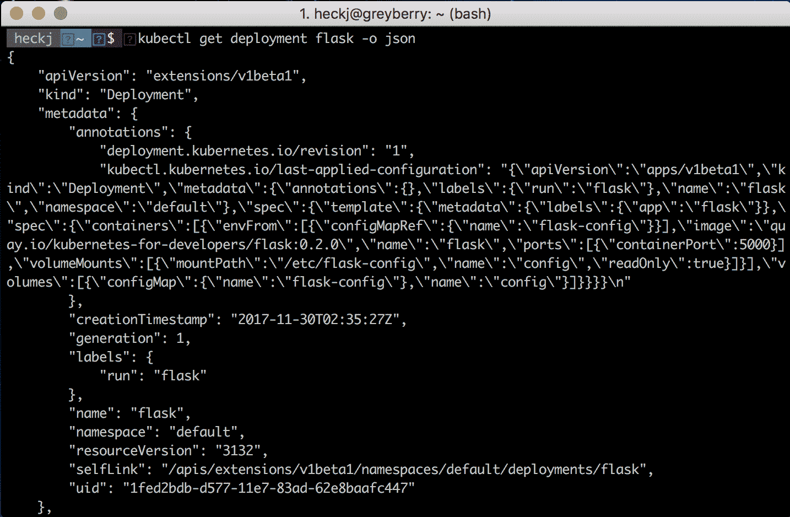

# 四、声明性基础设施

Kubernetes 本质上是一个声明性系统。在前面的章节中，我们已经使用`kubectl run`和`kubectl expose`等命令探索了 Kubernetes 及其一些关键概念。这些命令都是命令:现在就做这件事。Kubernetes 通过将这些资源作为对象本身进行管理来实现这一点。`kubectl`API 服务器将这些请求转换成资源表示，然后存储它们，各个控制器的工作是了解当前状态并根据请求进行处理。

我们可以直接利用声明性结构——所有的服务、Pods 等都可以用 JSON 或 YAML 文件来表示。在本章中，我们将把您的应用定义为声明性基础结构。我们将采用现有的简单 Kubernetes Pods，并将它们放入声明中，您可以在代码旁边管理这些声明；存储在源代码管理中，并部署来运行您的软件。我们还将介绍配置映射和机密，以允许您定义配置和应用结构，并探索如何使用它们。

本章的章节包括:

*   命令式与陈述式
*   声明您的第一个应用
*   库资源注释
*   库资源-config map
*   库比涅斯资源-秘密
*   带有 ConfigMap 的 Python 示例

# 命令式和声明式命令

到目前为止，我们的例子集中在快速和命令性的命令上，比如`kubectl run`来创建一个部署，然后运行我们的软件。这对于一些快速的事情来说很方便，但是不容易暴露 API 的全部灵活性。为了利用通过 Kubernetes 提供的所有选项，管理描述您想要的部署的文件通常更有效。

使用这些文件时，可以使用`kubectl create`、`kubectl delete`、`kubectl replace`等命令以及`-f`选项来指定要使用的文件。命令式命令对于简单的设置来说既简单又有效，但是您很快就需要一系列重复的命令来充分利用所有功能。您可能会将这些命令集存储在一个备忘单中，但这可能会变得很麻烦，而且并不总是清晰的。

Kubernetes 还提供了一个声明机制，利用`kubectl apply`命令，该命令接收文件，检查当前状态，并根据需要管理更新——创建、删除等，同时还保留了一个简单的更改审计日志。

我建议将`kubectl apply`命令用于任何比运行单个进程更复杂的事情，这可能是您开发的大多数服务。您可能不需要开发中的审计跟踪。您可能会在舞台/金丝雀环境或生产环境中，因此熟悉和熟悉它们有利于理解它们。

最重要的是，将应用的描述保存在文件中，可以将它们包含在源代码控制中，就像代码一样对待它们。这为您提供了在团队成员之间共享该应用结构的一致方法，所有成员都可以使用它来提供一致的环境。

`kubectl apply`命令有一个`-f`选项来指定文件或文件目录，还有一个`-R`选项，如果您正在建立一个复杂的部署，它将递归地下降目录。

随着本书的深入，我将使用 YAML 格式的声明性命令和配置(带注释)来描述和操作 Kubernetes 资源。如果您有强烈的偏好，也可以使用 JSON。

Note: If you would like a command-line tool to parse YAML, there is an equivalent to `jq` for JSON: `yq`. Our examples won't go into that much detail, but if you want to use the tool you can find more information about it at [https://yq.readthedocs.io](https://yq.readthedocs.io).

# YAML 的一堵墙

这些配置看起来像什么？其中绝大多数都是以 YAML 格式进行管理的，选项和配置看起来非常多。Kubernetes 中的每个资源都有自己的格式，其中一些格式正在改变，并且正在积极开发中。您会注意到一些 API 和对象结构会主动引用`alpha`或`beta`来指示项目中那些资源的成熟状态。项目倾向于以非常保守的方式使用这些术语:

*   `alpha`倾向于表示这是一个早期实验，数据格式可能会改变，但实现最终目标的东西可能会存在
*   `beta`比纯粹的实验性更可靠，并且可能用于生产负载，尽管特定的资源格式没有被完全锁定，并且在 Kubernetes 版本中可能会略有变化

请注意，随着 Kubernetes 新版本的推出，alpha 和 beta APIs 也在不断发展。如果使用早期版本，它可能会被弃用，最终不可用。您需要使用您正在使用的 Kubernetes 版本来跟踪这些更新。

资源、选项和格式的正式文档位于参考文档下的 [https://kubernetes.io](https://kubernetes.io) 中。在我写这篇文章的时候，当前发布的版本是 1.8，参考文档可以在[https://kubernetes.io/docs/api-reference/v1.8/](https://kubernetes.io/docs/api-reference/v1.8/)上找到。该文档是从 Kubernetes 项目源中生成的，并在每次发布时更新，通常大约每三个月发布一次。

除了浏览参考文档，您还可以从现有的 Kubernetes 对象中获取声明。当您使用`kubectl get`命令请求 Kubernetes 资源时，您可以添加`-o yaml --export`选项。

如果您喜欢这种格式，`-o yaml`选项可以改为`-o json`。`--export`将删除一些无关的信息，这些信息是特定于 Kubernetes 中资源的当前状态和身份的，对您外部存储没有好处。

虽然 1.8 版的功能还不完全，但是您应该能够请求一个名称空间中的所有资源，存储这些配置，并使用这些文件来精确地复制它。实际上，这一过程中会遇到一些困难，因为导出的版本并不总是完全符合您的需求。此时，管理自己的声明文件要好得多。

最后，我建议使用 YAML 作为这些声明的格式。您可以使用 JSON，但是 YAML 允许您在声明中添加注释，这对阅读这些文件的其他人非常有用——这是 JSON 格式所没有的功能。

# 创建简单的部署

让我们从看看`kubectl run`为我们创造了什么开始，并从那里开始工作。我们使用以下命令创建了早期的简单部署:

```
kubectl run flask --image=quay.io/kubernetes-for-developers/flask:0.1.1 --port=5000
```

在示例中，我们用`kubectl get deployment flask -o json`命令转储了声明的状态。让我们重复一遍，除了使用`-o yaml --export`选项:

```
kubectl get deployment flask -o yaml --export
```

输出应该如下所示:

```
apiVersion: extensions/v1beta1
kind: Deployment
metadata:
 annotations:
 deployment.kubernetes.io/revision: "1"
 creationTimestamp: null
 generation: 1
 labels:
 run: flask
 name: flask
 selfLink: /apis/extensions/v1beta1/namespaces/default/deployments/flask
spec:
 replicas: 1
 selector:
 matchLabels:
 run: flask
 strategy:
 rollingUpdate:
 maxSurge: 1
 maxUnavailable: 1
 type: RollingUpdate
 template:
 metadata:
 creationTimestamp: null
 labels:
 run: flask
 spec:
 containers:
 - image: quay.io/kubernetes-for-developers/flask:latest
 imagePullPolicy: Always
 name: flask
 ports:
 - containerPort: 5000
 protocol: TCP
 resources: {}
 terminationMessagePath: /dev/termination-log
 terminationMessagePolicy: File
 dnsPolicy: ClusterFirst
 restartPolicy: Always
 schedulerName: default-scheduler
      securityContext: {}
 terminationGracePeriodSeconds: 30
status: {}
```

任何 Kubernetes 资源的一般格式都有相同的前四个对象:

*   `apiVersion`
*   `kind`
*   `metadata`
*   `spec`

如果您正在从 Kubernetes 检索信息，您将看到第五个键:`status`。状态不应由用户定义，而是由 Kubernetes 在检索对象以共享其当前状态时提供。如果您错过了`kubectl get`命令上的`--export`选项，它将包括状态。

您将看到分散在对象中的元数据，因为这些对象彼此相关，并在概念上建立在彼此之上。元数据包含在每个资源中，即使它可能被组合(如前所示)成一个引用。对于我们创建的部署，它使用了一个部署的声明性引用，包装了一个复制集，包装了一个 Pod。

你可以在下面的网址上看到这些的正式定义:

*   部署:[https://kubernetes . io/docs/API-reference/v 1.8/# deployment-v 1 beta 2-apps](https://kubernetes.io/docs/api-reference/v1.8/#deployment-v1beta2-apps)
*   replication set:[https://kubrines . io/docs/API-reference/v 1.8/# replicaset-v1 beta 2-apps](https://kubernetes.io/docs/api-reference/v1.8/#replicaset-v1beta2-apps)
*   pod:[https://kubrines . io/docs/API-reference/v1.8/# pod-v1-core](https://kubernetes.io/docs/api-reference/v1.8/#pod-v1-core)

您可能会注意到复制集和部署几乎是相同的。部署扩展了复制集，每个部署实例都至少有一个复制集。部署包括如何在运行的软件上执行更新的声明性选项(和责任)。Kubernetes 建议您在部署代码时，直接在副本集上使用 Deployment，以便在更新代码时准确指定您希望它如何反应。

在部署`spec`([https://kubernetes . io/docs/API-reference/v 1.8/# deployments pec-v 1 beta 2-apps](https://kubernetes.io/docs/api-reference/v1.8/#deploymentspec-v1beta2-apps))中，关键模板下的所有项目都是从 Pod 模板规范中定义的。您可以在[https://kubernetes . io/docs/API-reference/v 1.8/# Pod template spec-v1-core](https://kubernetes.io/docs/api-reference/v1.8/#podtemplate-v1-core)查看 Pod 模板规范的详细信息。

如果您查看在线文档，您会看到大量我们没有指定的选项。如果没有指定，Kubernetes 仍然会使用规范中定义的默认值来填充值。

你可以完全指定，也可以随便指定。必填字段的数量很少。当您想要不同于默认值的值时，通常只需要定义可选字段。例如，对于部署，必填字段是要部署的名称和映像。

我建议您在为自己的代码创建声明时，在 YAML 保持最少的声明集。这将有助于更容易地理解您的资源声明，并且随着注释的自由使用，应该会使生成的文件更容易理解。

# 声明您的第一个应用

继续选择其中一个示例并创建一个部署声明，然后尝试使用该声明创建一个。

我建议创建一个名为`deploy`的目录，并将你的声明文件放在里面。这是用`flask`的例子:

```
flask.yml
apiVersion: apps/v1beta1
kind: Deployment
metadata:
 name: flask
 labels:
 run: flask
spec:
 template:
 metadata:
 labels:
 app: flask
 spec:
 containers:
 - name: flask
 image: quay.io/kubernetes-for-developers/flask:0.1.1
 ports: 
 - containerPort: 5000
```

试用文件之前，请删除现有部署:

```
kubectl delete deployment flask
```

使用`--validate`选项让`kubectl`检查文件是一个很好的做法，您可以将其与`--dry-run`一起使用，将文件与 Kubernetes 中存在的任何内容进行比较，以让您明确知道它将做什么。YAML 很容易阅读，不幸的是，由于它使用空白来定义结构，更容易犯格式错误。使用`--validate`选项，`kubectl`将警告您遗漏字段或其他问题。没有它，`kubectl`往往会悄无声息地失败，干脆无视它不懂的东西:

```
kubectl apply -f deploy/flask.yml --dry-run --validate
```

您应该会看到如下结果:

```
deployment "flask" created (dry run)
```

如果你碰巧打了一个错别字，你会在输出中看到一个错误报告。我在其中一个键`metadata`上故意打了一个错别字，结果如下:

```
error: error validating "deploy/flask.yml": error validating data: found invalid field metdata for v1.PodTemplateSpec; if you choose to ignore these errors, turn validation off with --validate=false
```

一旦您对数据的有效性感到满意并且能够如您所期望的那样工作，就可以使用以下命令创建对象:

```
kubectl apply -f deploy/flask.yml
```

仍然很容易犯一些小错误，这些小错误不会立即显现出来，但是当您尝试运行代码时会变得清晰。您可以使用`kubectl get`命令检查特定资源。我鼓励您也使用`kubectl describe`命令不仅查看资源的状态，还可以查看 Kubernetes 关于资源的所有相关事件:

```
kubectl describe deployment/flask
 Name: flask
Namespace: default
CreationTimestamp: Sun, 22 Oct 2017 14:03:27 -0700
Labels: run=flask
Annotations: deployment.kubernetes.io/revision=1
 kubectl.kubernetes.io/last-applied-configuration={"apiVersion":"apps/v1beta1","kind":"Deployment","metadata":{"annotations":{},"labels":{"run":"flask"},"name":"flask","namespace":"default"},"spec":{"t...
Selector: app=flask
Replicas: 1 desired | 1 updated | 1 total | 1 available | 0 unavailable
StrategyType: RollingUpdate
MinReadySeconds: 0
RollingUpdateStrategy: 25% max unavailable, 25% max surge
Pod Template:
 Labels: app=flask
 Containers:
 flask:
 Image: quay.io/kubernetes-for-developers/flask:0.1.1
 Port: 5000/TCP
 Environment: <none>
 Mounts: <none>
 Volumes: <none>
Conditions:
 Type Status Reason
 ---- ------ ------
 Available True MinimumReplicasAvailable
 Progressing True NewReplicaSetAvailable
OldReplicaSets: <none>
NewReplicaSet: flask-2003485262 (1/1 replicas created)
Events:
 Type Reason Age From Message
 ---- ------ ---- ---- -------
 Normal ScalingReplicaSet 5s deployment-controller Scaled up replica set flask-2003485262 to 1
```

一旦您对声明按预期工作感到满意，就将其与代码一起存储在源代码控制中。本书的示例部分将转向使用存储配置，Python 和 Node.js 示例将在本章和以后的章节中更新。

If you want to create Kubernetes resources and then later manage them with the `kubectl apply` command, you should use the `--save-config` option when running the `kubectl run` or `kubectl create` commands. This will explicitly add in the annotations that `kubectl apply` expects to be there when it's run. If they aren't there, the commands will still operate correctly, but you'll get a warning:

```
Warning: kubectl apply should be used on resource created by either kubectl create --save-config or kubectl apply
```

# ImagePullPolicy

如果您在尝试时在代码中使用`:latest`标签，您可能已经注意到`imagePullPolicy`的值被设置为`Always`:

```
imagePullPolicy: Always
```

这告诉 Kubernetes 总是尝试从容器存储库中加载新的 Docker 映像。如果您使用除`:latest`以外的标签，那么默认的(`IfNotPresent`)只有在本地缓存中找不到容器映像时才会尝试重新加载它们。

这是一种在您频繁更新代码时非常有用的技术。我建议你只有在自己工作的时候才使用这个，因为分享`:latest`到底意味着什么的知识可能会很困难，并导致很多混乱。

It is generally considered a bad practice to use the `:latest` tag in any staging or production deployment, simply because of the uncertainty of what it references.

# 审查跟踪

当您使用`kubectl apply`命令时，它会自动在 Kubernetes 资源中为您维护一个审计跟踪作为注释。如果使用以下命令:

```
kubectl describe deployment flask
```

您将看到类似于以下内容的可读性很好的输出:

```
Name: flask
Namespace: default
CreationTimestamp: Sat, 16 Sep 2017 08:31:00 -0700
Labels: run=flask
Annotations: deployment.kubernetes.io/revision=1
kubectl.kubernetes.io/last-applied-configuration={"apiVersion":"apps/v1beta1","kind":"Deployment","metadata":{"annotations":{},"labels":{"run":"flask"},"name":"flask","namespace":"default"},"spec":{"t...
Selector: app=flask
Replicas: 1 desired | 1 updated | 1 total | 1 available | 0 unavailable
StrategyType: RollingUpdate
MinReadySeconds: 0
RollingUpdateStrategy: 25% max unavailable, 25% max surge
Pod Template:
 Labels: app=flask
 Containers:
 flask:
 Image: quay.io/kubernetes-for-developers/flask:0.1.1
 Port: 5000/TCP
 Environment: <none>
 Mounts: <none>
 Volumes: <none>
Conditions:
 Type Status Reason
 ---- ------ ------
 Available True MinimumReplicasAvailable
 Progressing True NewReplicaSetAvailable
OldReplicaSets: <none>
NewReplicaSet: flask-866287979 (1/1 replicas created)
Events:
 FirstSeen LastSeen Count From SubObjectPath Type Reason Message
 --------- -------- ----- ---- ------------- -------- ------ ------
 2d 2d 1 deployment-controller Normal ScalingReplicaSetScaled up replica set flask-866287979 to 1
```

我提到的审计跟踪包含在注释`kubectl.kubernetes.io/last-applied-configuration`中，其中包括最后应用的配置。因为那个注释相当长，所以在这个输出中被剪辑了一点。如果使用以下命令转储整个对象，您可以看到完整的详细信息:

```
kubectl get deployment flask -o json
```

这里我们感兴趣的信息是`metadata` | `annotations` `kubectl.kubernetes.io/last-applied-configuration`。注释中的全部细节可能如下所示:



# 库资源注释

在标签和选择器用于分组和选择 Kubernetes 资源集的地方，注释提供了一种添加特定于资源的元数据的方法，这些元数据可以由 Kubernetes 或在其运行的容器中访问。

正如您刚刚看到的，`kubectl apply`在资源被调用时，会自动应用一个注释来跟踪上次应用的资源配置状态。在最后一章中，您可能已经注意到了部署控制器用来跟踪修订的注释`deployment.kubernetes.io/revision`，我们谈到了`kubectl`用来显示部署展开的变更历史的`kubernetes.io/change-cause`注释。

注释可以是简单的值或复杂的块(如`kubectl.kubernetes.io/last-applied-configuration`的情况)。到目前为止的例子是使用注释共享信息的 Kubernetes 工具，尽管注释也用于共享容器中的信息供应用使用。

您可以使用它们来包含诸如添加版本控制修订信息、内部版本号、相关的人类可读的联系信息等信息。

像标签一样，可以使用命令`kubectl`命令`kubectl annotate`添加注释。一般来说，注释使用与标签相同的关键机制，因此任何在其前缀中包含`kubernetes.io`的注释都是来自 Kubernetes 项目。

标签旨在对 Kubernetes 对象(Pods、部署、服务等)进行分组和组织。注释旨在提供特定于一个实例(或几个实例)的附加信息，通常作为注释本身中的附加数据。

# 在 Pods 中显示标签和注释

Kubernetes 可以直接在容器中公开关于 Pod 的数据，通常作为特定文件系统中的文件，您的代码可以读取和使用这些文件。通过容器规范，并使用 Kubernetes 所称的`downwardAPI`，标签、注释等可以作为文件在您的容器中提供。

这可能是一种在容器中公开注释信息(如构建时间、源代码引用哈希等)的方便方式，以便您的运行时代码可以读取和引用这些信息。

要使 Pods 标签和注释可用，需要为容器定义一个卷装载，然后为卷装载点指定`downwardAPI`和其中的项目。

更新`flask`部署文件:

```
apiVersion: apps/v1beta1
kind: Deployment
metadata:
 name: flask
 labels:
 run: flask
 annotations:
 example-key: example-data
spec:
 template:
 metadata:
 labels:
 app: flask
 spec:
 containers:
 - name: flask
 image: quay.io/kubernetes-for-developers/flask:0.1.1
 ports:
 - containerPort: 5000
 volumeMounts:
          - name: podinfo
 mountPath: /podinfo
 readOnly: false
 volumes:
 - name: podinfo
 downwardAPI:
 items:
 - path: "labels"
 fieldRef:
 fieldPath: metadata.labels
 - path: "annotations"
 fieldRef:
 fieldPath: metadata.annotations
```

下半部分中的详细信息标识了一个挂载点，这是一个将在容器内部创建的目录结构。它还规定卷应该使用带有特定元数据的`downwardAPI`；在这种情况下，标签和注释。

指定卷装载位置时，请注意不要指定已经存在且有文件(如/等)的位置，否则容器可能无法按预期运行。挂载点不会抛出错误——它只是覆盖容器中该位置可能已经存在的内容。

您可以使用以下命令应用此更新的声明:

```
kubectl apply -f ./flask.yml
```

现在我们可以打开一个运行 Pod 的外壳，命令如下:

```
kubectl exec flask-463137380-d4bfx -it -- sh
```

在活动外壳中，运行以下命令:

```
ls -l /podinfo
total 0
lrwxrwxrwx    1 root     root            18 Sep 16 18:14 annotations -> ..data/annotations
lrwxrwxrwx    1 root     root            13 Sep 16 18:14 labels -> ..data/labels
cat /podinfo/annotations
kubernetes.io/config.seen="2017-09-16T18:14:04.024412807Z"
kubernetes.io/config.source="api"
kubernetes.io/created-by="{\"kind\":\"SerializedReference\",\"apiVersion\":\"v1\",\"reference\":{\"kind\":\"ReplicaSet\",\"namespace\":\"default\",\"name\":\"flask-463137380\",\"uid\":\"d262ca60-9b0a-11e7-884c-0aef48c812e4\",\"apiVersion\":\"extensions\",\"resourceVersion\":\"121204\"}}\n"
cat /podinfo/labels
app="flask"
pod-template-hash="463137380"
```

您可以通过以下方式将其与 Pod 本身的注释进行比较:

```
kubectl describe pod flask-463137380-d4bfx
Name: flask-463137380-d4bfx
Namespace: default
Node: minikube/192.168.64.3
Start Time: Sat, 16 Sep 2017 11:14:04 -0700
Labels: app=flask
pod-template-hash=463137380
Annotations: kubernetes.io/created-by={"kind":"SerializedReference","apiVersion":"v1","reference":{"kind":"ReplicaSet","namespace":"default","name":"flask-463137380","uid":"d262ca60-9b0a-11e7-884c-0aef48c812e4","a...
Status: Running
IP: 172.17.0.5
Created By: ReplicaSet/flask-463137380
Controlled By: ReplicaSet/flask-463137380
```

关于 Pods 的各种数据可以在 Pods 中公开，并且相同的数据可以通过环境变量公开给 Pods。可公开的全套数据详见 Kubernetes 文档([https://Kubernetes . io/docs/tasks/inject-data-application/down-API-volume-expose-pod-information/](https://kubernetes.io/docs/tasks/inject-data-application/downward-api-volume-expose-pod-information/))。

虽然使用这种机制来提供一种传递配置数据的方式看起来很方便也很明显，但是 Kubernetes 提供了额外的功能，专门为容器内的代码提供配置，包括密码、访问令牌和其他机密所需的私有配置。

# 库资源 configmap

当您将容器创建为代码的只读实例时，您很快就需要一种方法来以标志或配置的形式提供小的更改。也许，更重要的是，您不想在容器映像中包含私有细节，如 API 密钥、密码或身份验证令牌。

Kubernetes 支持两个资源来帮助和链接这类信息。第一个是 ConfigMap，它可以单独或跨 Pods 用于您的应用部署，为您的应用提供了一个更新和传播配置的单一位置。Kubernetes 还支持 Secret 的概念，这是一种锁定得多的配置类型，可以更严格地控制，并且只在您需要的地方公开。

例如，可以使用 ConfigMap 来控制示例 Redis 部署的基本配置，使用 Secret 来分发敏感的身份验证凭据以供客户端连接。

# 创建配置映射

您可以使用`kubectl`创建`configmap`命令创建配置图，配置数据在命令行上设置，或者来自您存储的一个或多个文件。为了方便起见，它还支持加载文件目录。

在命令行上从单个键/值对创建非常简单，但可能是管理配置最不方便的。例如，运行以下命令:

```
kubectl create configmap example-config --from-literal=log.level=err
```

这将创建一个名为`example-config`的配置图，其中包含一个键/值对。您可以看到加载了以下内容的所有配置列表:

```
kubectl get configmap
NAME             DATA      AGE
example-config   0         2d
```

并使用以下内容查看配置映射:

```
kubectl describe configmap example-config
Name: example-config
Namespace: default
Labels: <none>
Annotations: <none>
Data
====
log.level:
----
err
Events: <none>
```

您还可以请求 YAML 格式的原始数据:

```
kubectl get configmap example-config -o yaml --export apiVersion: v1
data:
 log.level: err
kind: ConfigMap
metadata:
 creationTimestamp: null
 name: example-config
 selfLink: /api/v1/namespaces/default/configmaps/example-config
```

您还可以请求 JSON 格式的原始数据:

```
kubectl get configmap example-config -o json --export {
 "apiVersion": "v1",
 "data": {
 "log.level": "err"
 },
 "kind": "ConfigMap",
 "metadata": {
 "creationTimestamp": null,
 "name": "example-config",
 "selfLink": "/api/v1/namespaces/default/configmaps/example-config"
 }
}
```

从文字创建的配置值通常是字符串。

如果您想要创建配置值，您的代码可以将其解析为不同的类型(数字、布尔值等)，那么您将希望将这些配置指定为文件，或者将它们定义为 YAML 或 JSON 中的配置映射对象内的 blobs。

如果您希望在单独的文件中管理配置，它们可以有多行简单的`key=value`格式，每行一个配置。`kubectl create configmap <name> --from-file <filename>`命令将加载这些文件，根据文件名创建一个`configmap`名称，每个文件包含文件中的所有相关数据。如果您已经有正在使用的配置文件，则可以使用此选项基于这些文件制作配置映射。

例如，如果您想要一个要加载到配置映射中的配置文件`config.ini`:

```
[unusual]
greeting=hello
onoff=true
anumber=3
```

您可以使用以下命令创建`iniconfig`配置图:

```
kubectl create configmap iniconfig --from-file config.ini --save-config
```

将该数据作为配置映射转储出去:

```
kubectl get configmap iniconfig -o yaml --export
```

应该返回类似于以下内容的内容:

```
apiVersion: v1
data:
 config.ini: |
 [unusual]
 greeting=hello
 onoff=true
 anumber=3
kind: ConfigMap
metadata:
 name: iniconfig
 selfLink: /api/v1/namespaces/default/configmaps/iniconfig
```

YAML 输出中的管道符号(`|`)定义了多行输入。这些类型的配置不能作为环境变量直接使用，因为它们对该格式无效。一旦您将它们添加到 Pod 规范中，它们就可以作为文件使用。将它们添加到您的 Pod 规范中非常类似于使用向下的 API 将 Pod 容器中的标签或注释公开为文件。

# 管理配置映射

一旦创建了配置图，就不能使用`kubectl create`命令用另一个配置图覆盖它。您可以删除它并重新创建它，尽管更有效的选择是像其他 Kubernetes 资源一样管理配置声明，用`kubectl apply`命令更新它。

如果您在尝试一些想法时使用`kubectl create`命令创建了一个初始配置图，您可以使用`kubectl apply`命令开始管理该配置，方式与我们之前在部署中使用的方式相同:导出 YAML，然后从该文件中使用`kubectl apply`。

例如，要在部署目录中获取和存储我们之前创建的配置，您可以使用以下命令:

```
kubectl get configmap example-config -o yaml --export > deploy/example-config.yml
```

在 Kubernetes 的 1.7 版本中，在导出中添加了一些不是严格需要的字段，但是如果您将它们留在其中，也不会有任何伤害。查看该文件，您应该会看到如下内容:

```
apiVersion: v1
data:
 log.level: err
kind: ConfigMap
metadata:
 creationTimestamp: null
 name: example-config
 selfLink: /api/v1/namespaces/default/configmaps/example-config
```

`data`、`apiVersion`、`kind`和元数据的键都很关键，但元数据下的一些子项不是必需的。例如，你可以删除`metadata.creationTimestamp`和`metadata.selfLink`。

您现在在 Kubernetes 中仍然有 ConfigMap 资源，所以第一次运行`kubectl apply`时，它会提醒您正在做一些有点意外的事情:

```
kubectl apply -f deploy/example-config.yml
Warning: kubectl apply should be used on resource created by either kubectl create --save-config or kubectl apply
configmap "example-config" configured
```

您可以通过使用`kubectl create`命令的`--save-config`选项来消除此警告，该选项将包括`kubectl apply`期望出现的注释。

此时，`kubectl apply`已经应用了其 diff 并进行相关更新。如果您现在从 Kubernetes 检索数据，它将具有`kubectl apply`在更新资源时添加的注释:

```
kubectl get configmap example-config -o yaml --export
apiVersion: v1
data:
 log.level: err
kind: ConfigMap
metadata:
 annotations:
 kubectl.kubernetes.io/last-applied-configuration: |
 {"apiVersion":"v1","data":{"log.level":"err"},"kind":"ConfigMap","metadata":{"annotations":{},"name":"example-config","namespace":"default"}}
 creationTimestamp: null
 name: example-config
 selfLink: /api/v1/namespaces/default/configmaps/example-config
```

# 将配置公开到您的容器映像中

将配置数据公开到容器中有两种主要方式:

*   将一个或多个配置映射中的键连接到为 Pod 设置的环境变量中
*   Kubernetes 可以将一个或多个配置映射中的数据映射到装载在 Pod 中的卷中

主要区别在于，环境变量通常在调用容器开始时设置一次，并且通常是简单的字符串值，其中作为卷中的数据装载的配置映射可能更复杂，如果更新配置映射资源，将会得到更新。

Note that no mechanism exists to explicitly tells your container that a ConfigMap value has been updated. As of version 1.9, Kubernetes does not include any means to signal to Pods and Containers that something has updated.

此外，作为文件装载公开的配置数据不会立即更新。在更新配置映射资源和查看相关 Pods 中反映的更改之间存在延迟。

# 环境变量

定义 Pod 规范时，除了强制名称和映像键之外，还可以指定一个`env`键。环境键需要一个名称，您可以添加一个使用`valueFrom:`进行引用的键来从配置映射中获取数据。

例如，要将我们的示例配置公开为环境变量，您可以向 Pod 规范添加以下小节:

```
env:
 - name: LOG_LEVEL_KEY
 valueFrom:
 configMapKeyRef:
 name: example-config
 Key: log.level
```

您可以在 Pod 规范中包含多个环境变量，如果您将配置拆分为多个部分以使其更容易(或更合理)管理，则每个环境变量都可以引用不同的配置映射。

您还可以将所有键/值的整个配置映射作为单个块映射到环境变量中。

您可以使用`envFrom`并指定配置映射，而不是在`env`下使用单独的键，例如:

```
envFrom:
 - configMapRef:
 name: example-config
```

通过这种设置，当 Pod 启动时，每个配置数据键/值都将作为环境变量加载。

You can create keys in ConfigMap that are not legal to be environment variables, such as keys starting with a number. In those cases, Kubernetes will load all the other keys and record the failed keys in the event log, but otherwise not throw an error. You can use `kubectl get events` to see the failed messages, where it will show each key that it skipped because it was invalid.

如果您想使用传递给命令的参数在容器中运行的配置映射值之一，也可以这样做。当您通过`env`和名称指定环境变量时，您可以使用`$(ENVIRONMENT_VARIABLE_NAME)`在 Pod 规范的其他地方引用该变量。

例如，下面的`spec`片段在容器的调用中使用了环境变量:

```
spec:
 containers:
 - name: test-container
 image: gcr.io/google_containers/busybox
 command: [ "/bin/sh", "-c", "echo $(LOG_LEVEL_KEY)" ]
 env:
 - name: LOG_LEVEL_KEY
 valueFrom:
 configMapKeyRef:
 name: example-config
 key: log.level
```

# 将配置映射作为容器内的文件公开

将配置映射数据公开到容器内的文件中与将注释和标签公开到容器中非常相似。Pod 上的规格有两个部分。首先是为容器定义一个卷，包括它的名称，以及它应该安装的位置:

```
 volumeMounts:
 - name: config
 mountPath: /etc/kconfig
 readOnly: true
```

第二部分是卷描述，其中引用了卷的相同名称，并将配置映射作为属性列出，以指示从哪里获取值:

```
 volumes:
 - name: config
 configMap:
 name: example-config
```

应用该规范后，这些值将作为容器中的文件提供:

```
ls -al /etc/kconfig/
total 12
drwxrwxrwx    3 root     root          4096 Sep 17 00:57 .
drwxr-xr-x    1 root     root          4096 Sep 17 00:57 ..
drwxr-xr-x    2 root     root          4096 Sep 17 00:57 ..9989_17_09_00_57_49.704362876
lrwxrwxrwx    1 root     root            31 Sep 17 00:57 ..data -> ..9989_17_09_00_57_49.704362876
lrwxrwxrwx    1 root     root            16 Sep 17 00:57 log.level -> ..data/log.level
cat /etc/kconfig/log.level
Err
```

您可以使用环境变量或配置文件向应用提供配置数据，具体取决于哪一个更容易满足您的需求。我们将更新示例以使用配置映射并将配置映射添加到部署中，并引用示例应用代码中的值。

# 对配置映射的依赖关系

如果您开始引用 Pod 规范中的配置映射，则是在为您的资源创建对该配置映射的依赖。例如，如果您添加了前面的一些示例来将`example-data`公开为环境变量，但是没有将`example-config`配置映射添加到 Kubernetes，当您尝试部署或更新 Pod 时，它将报告一个错误。

如果发生这种情况，错误通常会在`kubectl get pods`中报告，或者在事件日志中可见:

```
kubectl get pods
NAME                     READY     STATUS                                  RESTARTS   AGE
flask-4207440730-xpq8t   0/1       configmaps "example-config" not found   0          2d
kubectl get events
LASTSEEN   FIRSTSEEN   COUNT     NAME                     KIND         SUBOBJECT                TYPE      REASON                  SOURCE                  MESSAGE
2d         2d          1         flask-4207440730-30vn0   Pod                                   Normal    Scheduled               default-scheduler       Successfully assigned flask-4207440730-30vn0 to minikube
2d         2d          1         flask-4207440730-30vn0   Pod                                   Normal    SuccessfulMountVolume   kubelet, minikube       MountVolume.SetUp succeeded for volume "podinfo"
2d         2d          1         flask-4207440730-30vn0   Pod                                   Normal    SuccessfulMountVolume   kubelet, minikube       MountVolume.SetUp succeeded for volume "default-token-s40w4"
2d         2d          2         flask-4207440730-30vn0   Pod          spec.containers{flask}   Normal    Pulling                 kubelet, minikube       pulling image "quay.io/kubernetes-for-developers/flask:latest"
2d         2d          2         flask-4207440730-30vn0   Pod          spec.containers{flask}   Normal    Pulled                  kubelet, minikube       Successfully pulled image "quay.io/kubernetes-for-developers/flask:latest"
2d         2d          2         flask-4207440730-30vn0   Pod          spec.containers{flask}   Warning   Failed                  kubelet, minikube       Error: configmaps "example-config" not found
2d         2d          2         flask-4207440730-30vn0   Pod                                   Warning   FailedSync              kubelet, minikube       Error syncing pod
2d         2d          1         flask-4207440730         ReplicaSet                            Normal    SuccessfulCreate        replicaset-controller   Created pod: flask-4207440730-30vn0
2d         2d          1         flask                    Deployment                            Normal    ScalingReplicaSet       deployment-controller   Scaled up replica set flask-4207440730 to 1
```

如果您在事实之后添加配置映射，Pod 将在所需资源可用时启动。

# 库比涅资源-秘密

配置图非常适合一般配置，但是很容易看到，这可能是不需要的。对于某些配置，如密码、授权令牌或应用编程接口密钥，您通常需要一种更受控制的机制来保护这些值。这就是资源秘密旨在解决的问题。

秘密通常是单独创建(和管理)的，内部 Kubernetes 使用`base64`编码存储这些数据。

您可以在命令行上创建一个秘密，方法是首先将值写入一个或多个文件，然后在`create`命令中指定这些文件。Kubernetes 将负责进行所有相关的`base64`编码并将其存储起来。例如，如果您想要存储数据库用户名和密码，您可以执行以下操作:

```
echo -n “admin” > username.txt
echo -n “sdgp63lkhsgd” > password.txt
kubectl create secret generic database-creds --from-file=username.txt --from-file=password.txt
```

请注意，在命名机密名称时，您可以使用任何字母数字字符，如`-`或`.`，但不允许使用下划线。

如果使用以下命令:

```
kubectl get secrets
```

您可以看到我们刚刚创建的秘密:

```
NAME                  TYPE                                  DATA      AGE
database-creds        Opaque                                2         2d
default-token-s40w4   kubernetes.io/service-account-token   3         5d
```

通过使用以下内容:

```
kubectl describe secret database-creds
Name: database-creds
Namespace: default
Labels: <none>
Annotations: <none>
Type: Opaque
Data
====
password.txt: 18 bytes
username.txt: 11 bytes
```

您可以看到报告为类型`Opaque`的秘密，以及与数据相关联的字节数。

您仍然可以通过以下方式获取秘密:

```
kubectl get secret database-creds -o yaml --export
```

这将显示`base64`编码值:

```
apiVersion: v1
data:
  password.txt: 4oCcc2RncDYzbGtoc2dk4oCd
  username.txt: 4oCcYWRtaW7igJ0=
kind: Secret
metadata:
  creationTimestamp: null
  name: database-creds
  selfLink: /api/v1/namespaces/default/secrets/database-creds
type: Opaque
```

而如果你`base64`解码数值，你会看到原来的版本:

```
echo "4oCcc2RncDYzbGtoc2dk4oCd" | base64 --decode
“sdgp63lkhsgd”
```

请注意，任何能够访问您的 Kubernetes 集群资源的人都可以检索和查看这些秘密。此外，我不建议您像声明的其余部分一样管理存储在源代码控制中的秘密。这样做暴露了源代码控制系统中的那些秘密(以`base64`形式)。

# 将秘密暴露在容器中

我们可以以非常类似于公开配置图的方式向 Pod 公开机密。与配置映射一样，您可以选择将机密作为环境变量公开，或者作为装载在 Pod 指定的卷中的文件公开。

公开秘密的格式看起来与公开配置映射值相同，只是在规范中使用了`secretKeyRef`而不是`configMapRef`。

例如，要将前面的示例密码公开为环境变量，您可以在 Pod 规范中使用以下内容:

```
 env:
 - name: DB_PASSWORD
 valueFrom:
 secretKeyRef:
 name: database-creds
 key: password.txt
```

然后在容器内查看环境变量容器`DB_PASSWORD`:

```
kubectl exec flask-509298146-ql1t9 -it -- sh
env | grep DB
DB_PASSWORD=“sdgp63lkhsgd”
```

一个更好的方法是利用 Kubernetes 包含的能力，在容器中装载要作为文件公开的秘密。该配置与公开配置映射值非常相似，只是将机密定义为规范中的卷属性，而不是配置映射。

在规范中，您需要为容器定义一个`volumeMount`，表示它在容器中的位置:

```
 volumeMounts:
 - name: secrets
 mountPath: "/secrets"
```

然后定义如何从机密填充该卷的内容:

```
 volumes:
 - name: secrets
 secret:
 secretName: database-creds
 items:
 - key: password.txt
 path: db_password
```

使用此配置进行部署后，容器中有一个`/secrets/db_password`文件，其内容来自我们的秘密:

```
/ # ls -l /secrets/
total 0
lrwxrwxrwx    1 root     root            18 Sep 17 00:49 db_password -> ..data/db_password
/ # ls -l /secrets/db_password
lrwxrwxrwx    1 root     root            18 Sep 17 00:49 /secrets/db_password -> ..data/db_password
/ # cat /secrets/db_password
“sdgp63lkhsgd”
```

# 秘密和安全——秘密有多秘密？

有道理，但不是加密安全的，至少在 Kubernetes 1.8 中是这样。如果从安全角度来看机密，对机密的约束比在 ConfigMap 中保留值更好，但是安全配置文件有很大的限制。

本质上，秘密的数据存储在 etcd 3.0 的纯文本(albiet 编码文本)中，这是 Kubernetes 1.8 的基础。它不使用静态加密或对称密钥来保存(和访问)秘密。如果您正在运行自己的 Kubernetes 集群，请注意，不安全的 etcd 是集群整体安全性的一个重大弱点。

对于许多应用和用例来说，这是完全可以接受的，但是如果您需要在您的开发和生产环境中适应更高的安全性配置文件，那么您将需要考虑与 Kubernetes 协同工作的工具。最常被讨论的替代/扩展是 Vault，一个来自哈希公司的开源项目。您可以在[https://www . Vault project . io](https://www.vaultproject.io)上找到更多关于 Vault 的详细信息。

Kubernetes 项目在秘密和秘密管理方面也没有停滞不前，也在改进它们的特性。随着 1.7 版本的发布，Kubernetes 包含了**基于角色的访问控制**(**【RBAC】**)，该项目正在根据路线图进行维护和开发，该路线图将围绕其安全配置文件改进 Kubernetes 的功能，并支持未来与外部机密管理来源(如 Vault)进行更轻松的协调。

# 示例–带配置图的 Python/Flask 部署

这个例子建立在我们前面的 Python/Flask 例子的基础上。该扩展将添加一个配置映射，该映射使用环境变量和结构化文件，以及代码更新来使用这些值。

首先，添加一个既有顶级值又有更深层配置的配置映射。顶值将作为环境变量公开，多行 YAML 将作为容器内的文件公开:

```
# CONFIGURATION FOR THE FLASK APP
kind: ConfigMap
apiVersion: v1
metadata:
 name: flask-config
data:
 CONFIG_FILE: “/etc/flask-config/feature.flags“
 feature.flags: |
 [features]
 greeting=hello
 debug=true
```

该配置映射使用`envFrom`键与部署的 Pod 规范更新进行映射，并作为一个卷来提供文件映射:

```
 spec:
 containers:
 - name: flask
 image: quay.io/kubernetes-for-developers/flask:latest
 ports:
 - containerPort: 5000
 envFrom:
 - configMapRef:
 name: flask-config
 volumeMounts:
 - name: config
 mountPath: /etc/flask-config
 volumes:
 - name: config
 configMap:
 name: flask-config
```

此更新依赖于部署中名为`flask-config`的配置映射。如果未加载配置映射，并且我们仅尝试加载更新的部署，则在该配置映射可用之前，它不会更新部署。为了避免意外丢失文件的情况，您可以将配置映射和部署规范放在同一个 YAML 文件中，在新的一行中用`---`隔开。然后，您可以按照使用`kubectl apply`命令时指定的顺序部署多个资源。

如果更容易理解或管理，您也可以将每个资源保存在单独的文件中，这主要取决于您的偏好。`kubectl apply`命令包括引用目录中所有文件的选项，包括递归-因此对文件进行排序和结构化；然而，自己管理它们是最有意义的。

为了与这个例子相匹配，https://github.com/kubernetes-for-developers/kfd-flask 的代码有一个标签，你可以用它来一次更新所有的文件:

```
git checkout 0.2.0
```

(如果跳过前面的示例，可能需要先克隆存储库:`git clone https://github.com/kubernetes-for-developers/kfd-flask`)

代码更新后，部署更新:

```
kubectl apply -f deploy/
```

一旦部署完毕，您可以使用`kubectl exec`在 Pod 中运行一个交互式外壳，并检查部署和已经暴露的内容。

# 侧边栏–JSONPATH

我们可以使用如下命令查找特定的 Pod:

```
kubectl get pods -l app=flask
```

这将找到与`app=flask`选择器匹配的豆荚，并打印出类似如下的人类可读输出:

```
NAME                     READY     STATUS    RESTARTS   AGE
flask-2376258259-p1cwb   1/1       Running   0          8m
```

同样的数据以结构化的形式(JSON、YAML 等)提供，我们可以用工具如`jq`来解析。Kubectl 包括两个额外的选项，使其成为一个更方便的工具——您可以使用`JSONPATH or GO_TEMPLATE`来挖掘特定的值。通过将`JSONPATH`内置到`kubectl`客户端中，而不是执行前面的两步过程来获取 Pod 名称，您可以直接获取我们想要使用的具体细节，即名称:

```
kubectl get pods -l app=flask -o jsonpath='{.items[*].metadata.name}'
```

这将返回以下内容:

```
flask-2376258259-p1cwb
```

这可以很容易地嵌入到一个 shell 命令中，使用`$()`来执行它。这最终是一个复杂得多的命令，但是它处理了我们询问 Kubernetes 相关 Pod 名称的步骤，这对于许多交互命令来说是至关重要的。

例如，我们可以使用以下命令在与此部署相关联的 Pod 中打开一个交互式外壳:

```
kubectl exec $(kubectl get pods -l app=flask \
-o jsonpath='{.items[*].metadata.name}') \
-it -- /bin/sh
```

这将获得 Pod 的名称，并将其嵌入到`kubectl exec`中，以使用`/bin/sh`命令运行交互会话。

打开此会话后，您可以看到已经用以下内容设置的环境变量:

```
env
```

这将向您显示所有环境变量集，其中一个应该如下:

```
CONFIG_FILE=/etc/flask-config/feature.flags
```

您可以看到更复杂的配置数据:

```
cat $CONFIG_FILE
[features]
greeting=hello
debug=true
```

我们根据我们放入部署规范中的内容，精心制作了配置映射，以获得该文件的正确位置。如果我们改变部署规范，而不是配置图，那么嵌入环境变量`CONFIG_FILE`中的位置将是不正确的。

使用 YAML 的 Kubernetes 部署、配置映射和服务规范，有很多重复的数据没有被提取出来。从开发人员的角度来看，这会感到尴尬，违反了通常被推崇的“不要重复自己”的口头禅。有很多重复和小的改变对部署规范造成不幸影响的地方。

Kubernetes 项目正在发展与这些文件交互的方式，努力使生成相关配置更适合仍处于早期开发阶段的项目。随着 Kubernetes 的不断成熟，在定义资源声明时，这应该会演变成更像代码的特性。

# 使用 Python/Flask 中的配置映射

在 Python 中，您可以使用 os.environ 查看环境变量，例如:

```
import os
os.environ.get('CONFIG_FILE’)
```

当在代码中使用`os.environ.get`处理未设置环境变量的情况时，可以设置默认值:

```
import os
os.environ.get('CONFIG_FILE’,’./feature.flags’)
```

我们在这里设置`CONFIG_FILE`环境变量，向您展示如何实现，但并不是严格需要读取配置文件——如果需要，更方便的是允许您覆盖该值。

Python 还包括一个解析和读取 INI 风格配置文件的模块，就像我们在 ConfigMap 中添加的模块一样。继续下面的例子:

```
from configparser import SafeConfigParser
from pathlib import Path
# initialize the configuration parser with all the existing environment variables
parser = SafeConfigParser(os.environ)
```

从这里，ConfigParser 已经加载了一个名为`DEFAULT`的部分，其中包含了所有的环境变量，我们可以检索其中的一个:

```
Python 3.6.1 (default, May  2 2017, 15:16:41)
[GCC 6.3.0] on linux
Type "help", "copyright", "credits" or "license" for more information.
>>> import os
>>> from configparser import SafeConfigParser
>>> from pathlib import Path
>>> # initialize the configuration parser with all the existing environment variables
... parser = SafeConfigParser(os.environ)
>>> parser.get('DEFAULT','CONFIG_FILE')
'/etc/flask-config/feature.flags'
```

我们可以使用基于存储在该配置映射中的 INI 文件的一个部分来扩展解析器，该部分在文件系统的`/etc/flask-config/feature.flags`处公开，代码如下:

```
# default location of ./feature.flags is used if the environment variable isn’t set
config_file = Path(os.environ.get('CONFIG_FILE','/opt/feature.flags'))
# verify file exists before attempting to read and extend the configuration
if config_file.is_file():
 parser.read(os.environ.get('CONFIG_FILE'))
```

现在解析器将加载环境变量中的`DEFAULT`部分和配置映射数据中的`'features'`部分:

```
>>> parser.sections()
['features']
>>> parser.getboolean('features','debug')
True
```

ConfigParser 还允许您在代码中包含默认值:

```
>>> parser.getboolean('features','something-else’,fallback=False)
False
```

然后，我们使用这种代码来基于该配置映射设置启用或禁用调试:

```
if __name__ == '__main__':
 debug_enable = parser.getboolean('features','debug',fallback=False)
 app.run(debug=debug_enable,host='0.0.0.0')
```

您可以在[https://docs.python.org/3/library/configparser.html](https://docs.python.org/3/library/configparser.html)找到更多关于如何利用 Python 3 的 ConfigParser 的细节。

# 摘要

在这一章中，我们详细研究了如何利用 Kubernetes 的声明性，并通过规范文件管理我们的应用。我们还研究了注释、配置映射和机密，以及如何在 Pods 中创建和使用它们。我们以更新我们的 Python 和 Node.js 应用来使用 ConfigMaps 来运行我们之前设置的示例代码来结束这一章，并简要介绍了如何利用`kubectl`中的内置`JSONPATH`来使该工具在提供您想要的特定信息方面更加强大。