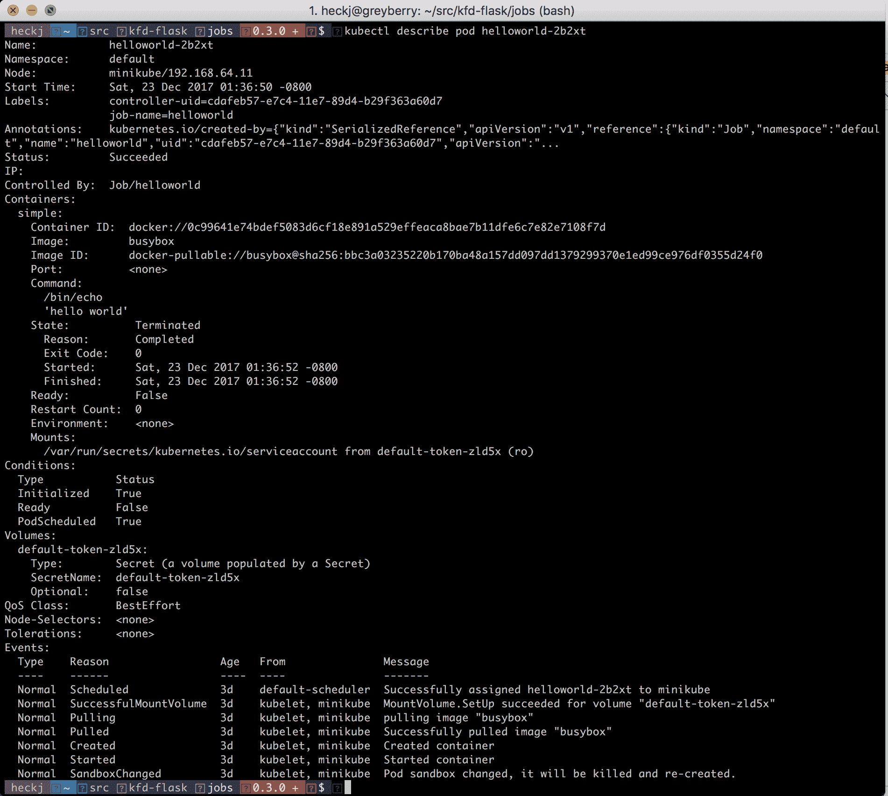
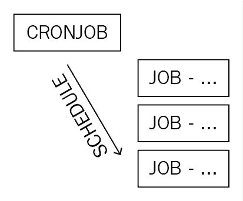
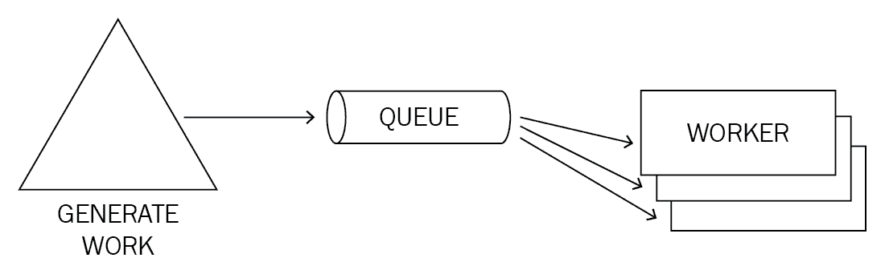
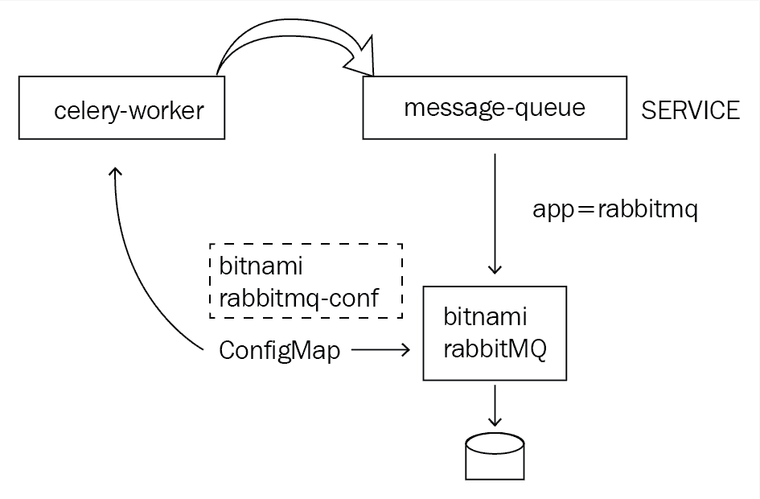
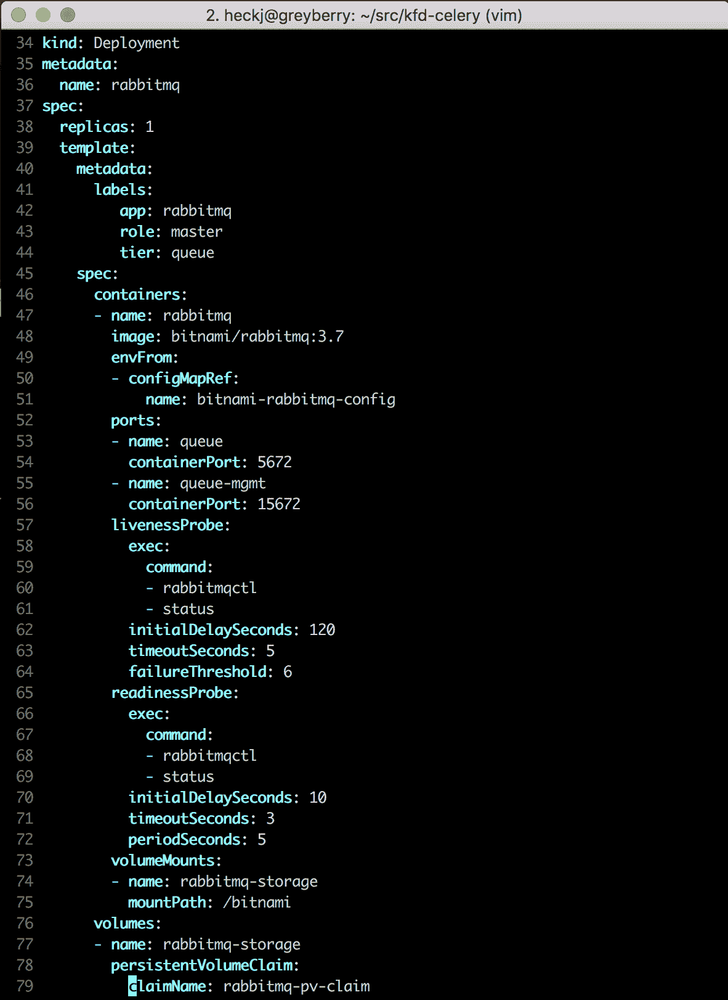
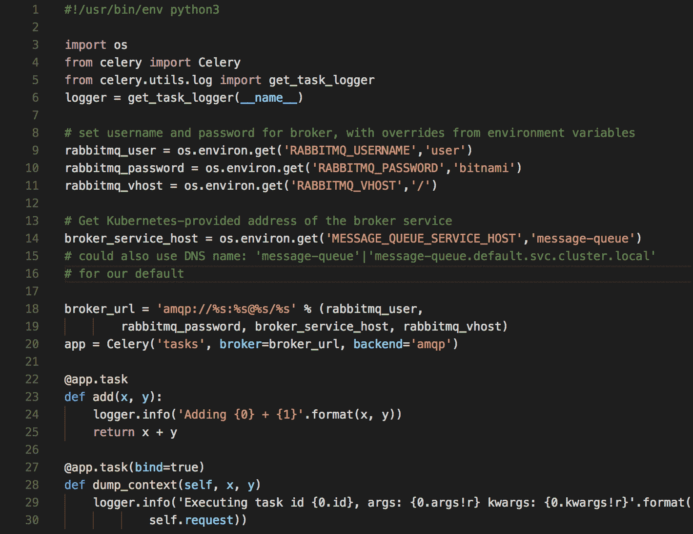
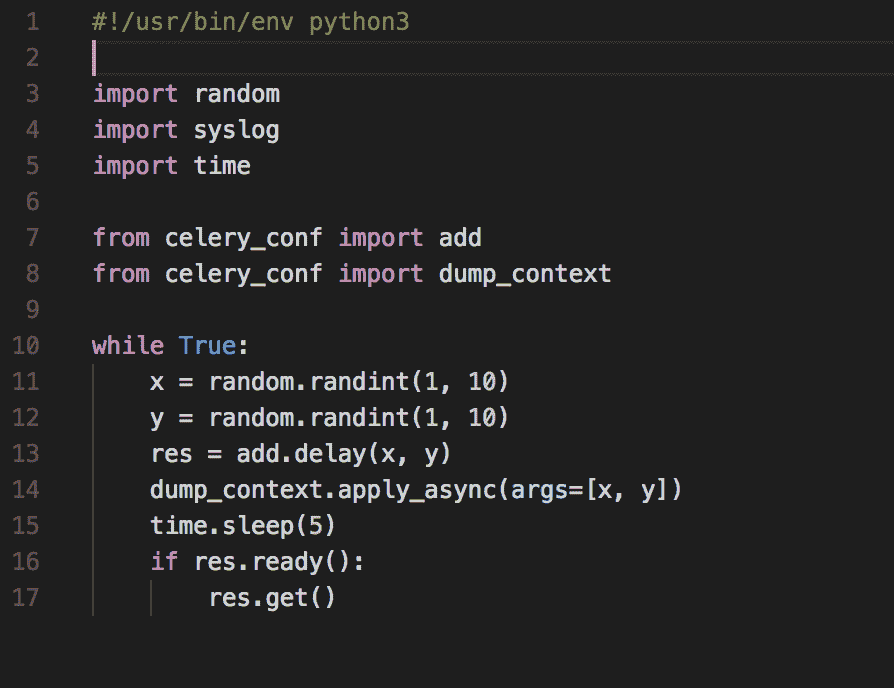
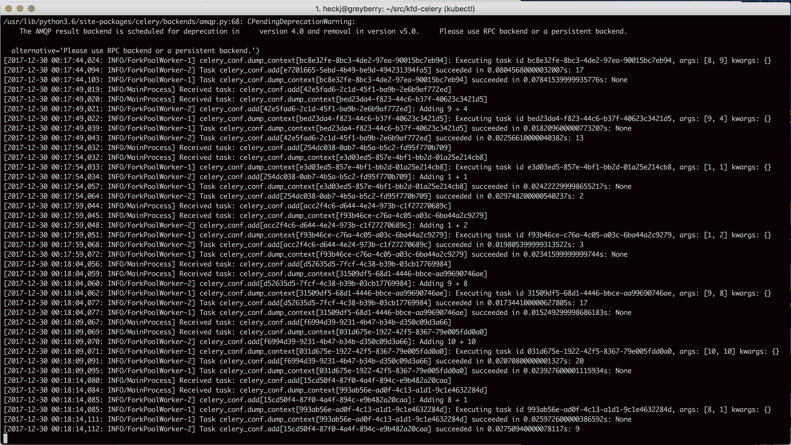
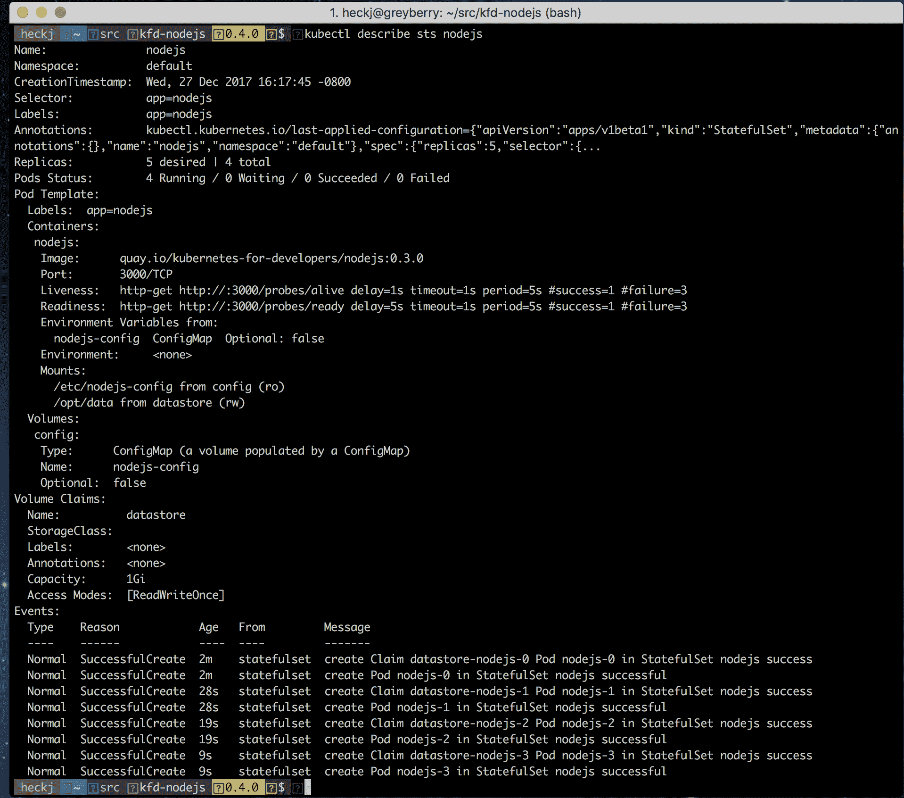

# 六、Kubernetes 中的后台处理

Kubernetes 包括对一次性(也称为批处理)计算工作的支持，以及对异步后台工作的常见用例的支持。在这一章中，我们看一下 Kubernetes 的 job 概念，以及它的邻居 CronJob。我们还研究了 Kubernetes 如何处理和支持持久性，以及 Kubernetes 中可用的一些选项。然后，我们看看 Kubernetes 如何支持异步后台任务，以及 Kubernetes 如何表示、操作和跟踪这些任务。我们还讨论了如何设置从消息队列操作的工作代码。

本章涵盖的主题包括:

*   职位
*   克朗乔布
*   Python 和芹菜的工作队列示例
*   坚持与 Kubernetes
*   有状态集
*   **自定义资源定义** ( **CRDs** )

# 职位

到目前为止，我们讨论的大部分内容都集中在持续、长期运行的流程上。Kubernetes 还支持更短的软件离散运行。Kubernetes 中的一项工作专注于一个离散的运行，该运行预计将在某个合理已知的时间范围内结束，并报告成功或失败。作业使用并建立在与长时间运行的软件相同的结构上，因此它们在核心使用 pod 规范，并添加了跟踪成功完成数量的概念。

最简单的用例是运行单个 pod 直到完成，让 Kubernetes 处理由于节点故障或重新启动导致的任何故障。您可以对作业使用的两个可选设置是并行和完成。不指定并行度，默认为`1`，一次只调度一个作业。您可以将这两个值都指定为整数，以便并行运行多个作业来实现多个完成，如果作业是从某种形式的工作队列中工作，则可以不设置完成。

重要的是要知道，完成和并行性的设置并不是保证，因此您的 pods 中的代码需要能够容忍多个实例运行。同样，如果容器出现故障(例如，当使用`restartPolicy OnFailure`时)，作业需要容忍容器重新启动，并且如果在重新启动时发现自己在新的 pod 上运行(这可能在节点出现故障时发生)，则需要处理任何初始化或设置。如果您的作业正在使用临时文件、锁或处理本地文件来完成其工作，它应该在启动时验证状态，而不是假设文件将一直存在，以防处理过程中出现故障。

当作业运行到完成时，系统不会再创建任何 pod，但也不会删除该 pod。这使您可以询问容器状态的成功或失败，并查看容器中的任何日志。已经运行到完成的 POD 不会在简单的`kubectl get pods`运行中出现，但是如果您使用`-a`选项，将会出现。您可以删除已完成的作业，当您使用`kubectl delete`删除作业时，相关的 pod 也会被删除和清理。

作为一个例子，让我们运行一个示例作业来看看这是如何工作的。简单打印`hello world`的简单作业可以用以下 YAML 指定:

```
apiVersion: batch/v1
kind: Job
metadata:
  name: helloworld
spec:
  template:
    metadata:
      name: helloworld
    spec:
      containers:
      - name: simple
        image: busybox
        command: ["/bin/echo", "'hello world'"]
      restartPolicy: Never
```

然后您可以使用`kubectl create`或`kubectl apply`运行该作业:

```
kubectl apply -f simplejob.yaml
```

`kubectl get jobs`的预期命令将向您显示存在的作业及其当前状态。由于这项工作非常简单，它可能会在您运行命令查看其当前状态之前完成:

```
kubectl get jobs
NAME         DESIRED   SUCCESSFUL   AGE
helloworld   1         1            3d
```

和豆荚一样，你可以使用`kubectl describe`命令获得更详细的状态和输出:

```
kubectl describe job helloworld
Name:           helloworld
Namespace:      default
Selector:       controller-uid=cdafeb57-e7c4-11e7-89d4-b29f363a60d7
Labels:         controller-uid=cdafeb57-e7c4-11e7-89d4-b29f363a60d7
                job-name=helloworld
Annotations:    kubectl.kubernetes.io/last-applied-configuration={"apiVersion":"batch/v1","kind":"Job","metadata":{"annotations":{},"name":"helloworld","namespace":"default"},"spec":{"backoffLimit":4,"template":{"met...
Parallelism:    1
Completions:    1
Start Time:     Sat, 23 Dec 2017 01:36:50 -0800
Pods Statuses:  0 Running / 1 Succeeded / 0 Failed
Pod Template:
  Labels:  controller-uid=cdafeb57-e7c4-11e7-89d4-b29f363a60d7
           job-name=helloworld
  Containers:
   simple:
    Image:  busybox
    Port:   <none>
    Command:
      /bin/echo
      'hello world'
    Environment:  <none>
    Mounts:       <none>
  Volumes:        <none>
Events:
  Type    Reason            Age   From            Message
  ----    ------            ----  ----            -------
  Normal  SuccessfulCreate  3d    job-controller  Created pod: helloworld-2b2xt
```

如果您运行命令`kubectl get pods`，您将不会在 POD 列表中看到 POD`helloworld-2b2xt`，但是运行`kubectl get pods -a`将显示 POD，包括仍然存在的已完成或失败的 POD:

```
NAME                           READY     STATUS      RESTARTS   AGE
helloworld-2b2xt               0/1       Completed   0          3d
```

如果你只是想亲眼看看 POD 的状态，使用`kubectl describe`获取细节会以人类可读的形式向你显示信息:

```
kubectl describe pod helloworld-2b2xt
```

这方面的一个例子如下:



如果你用这个例子中的 shell 脚本做一个简单的工作，很容易出错。在这些情况下，默认情况下 Kubernetes 会反复重试运行 pod，让系统中的 pod 处于失败状态，以便您查看。在这种情况下，设置回退限制可以限制系统重试作业的次数。如果不指定该值，它将使用默认值六次尝试。

命令中有简单错误的作业可能如下所示:

```
kubectl describe job helloworld
Name:           helloworld
Namespace:      default
Selector:       controller-uid=6693f83a-e7c7-11e7-89d4-b29f363a60d7
Labels:         controller-uid=6693f83a-e7c7-11e7-89d4-b29f363a60d7
                job-name=helloworld
Annotations:    kubectl.kubernetes.io/last-applied-configuration={"apiVersion":"batch/v1","kind":"Job","metadata":{"annotations":{},"name":"helloworld","namespace":"default"},"spec":{"template":{"metadata":{"name":"h...
Parallelism:    1
Completions:    1
Start Time:     Sat, 23 Dec 2017 01:55:26 -0800
Pods Statuses:  0 Running / 0 Succeeded / 6 Failed
Pod Template:
  Labels:  controller-uid=6693f83a-e7c7-11e7-89d4-b29f363a60d7
           job-name=helloworld
  Containers:
   simple:
    Image:  busybox
    Port:   <none>
    Command:
      /bin/sh
      echo
      'hello world'
    Environment:  <none>
    Mounts:       <none>
  Volumes:        <none>
Events:
  Type     Reason                Age   From           Message
  ----     ------                ----  ----            -------
  Normal   SuccessfulCreate      3d    job-controller  Created pod: helloworld-sz6zj
  Normal   SuccessfulCreate      3d    job-controller  Created pod: helloworld-vtzh7
  Normal   SuccessfulCreate      3d    job-controller  Created pod: helloworld-2gh74
  Normal   SuccessfulCreate      3d    job-controller  Created pod: helloworld-dfggg
  Normal   SuccessfulCreate      3d    job-controller  Created pod: helloworld-z2llj
  Normal   SuccessfulCreate      3d    job-controller  Created pod: helloworld-69d4t
  Warning  BackoffLimitExceeded  3d    job-controller  Job has reach the specified backoff limit
```

又看着`pods`:

```
kubectl get pods -a
NAME               READY     STATUS    RESTARTS   AGE
helloworld-2gh74   0/1       Error     0          3d
helloworld-69d4t   0/1       Error     0          3d
helloworld-dfggg   0/1       Error     0          3d
helloworld-sz6zj   0/1       Error     0          3d
helloworld-vtzh7   0/1       Error     0          3d
helloworld-z2llj   0/1       Error     0          3d
```

每个 pod 的日志都将可用，因此您可以诊断出问题所在。

如果你确实犯了一个错误，那么你可能会忍不住对工作规范进行快速修改，并使用`kubectl apply`来修复错误。作业被系统认为是不可变的，所以如果你试图快速修复并应用它，你会得到一个错误。当您处理作业时，最好删除作业并创建一个新的作业。

作业与 Kubernetes 中其他对象的生命周期无关，因此，如果您正在考虑使用一个对象来初始化持久性存储中的数据，请记住，您需要协调运行该作业。如果您希望每次在服务开始预加载数据之前都检查一些逻辑，那么您最好使用初始化容器，正如我们在上一章中所探讨的那样。

一些适合作业的常见情况是将备份加载到数据库中、制作备份、进行一些更深入的系统自检或诊断，或者运行带外清理逻辑。在所有这些情况下，您想知道您编写的函数已经运行完成，并且成功了。在失败的情况下，您可能想要重试，或者只是通过日志了解发生了什么。

# 克朗乔布

CronJobs 是一个扩展，它建立在作业的基础上，允许您指定作业运行时的循环计划。这个名字来源于一个叫做`cron`的常见的用于调度循环脚本的 Linux 实用程序。CronJobs 在 Kubernetes 版本时是 alpha 版本，在 1.8 版本时移到了 beta 版本，在 1.9 版本时仍然是 beta 版本。请记住，Kubernetes 的规范可能会有所变化，但倾向于相当可靠，并具有预期的测试版效用，因此 CronJobs 的 v1 版本可能会有所不同，但您可能会期望它非常接近本文撰写之时的可用版本。

该规范与作业高度相关，主要区别是 CronJob，并且有一个必需的字段调度，该调度采用一个表示运行该作业的时间的字符串。

该字符串的格式是五个数字，可以使用通配符。这些字段代表:

*   分钟(0–59)
*   小时(0–23)
*   一个月中的某一天(1–31)
*   月份(1-12)
*   一周中的某一天(0–6)

一`*`还是？可以在这些字段中使用一个字符来表示任何值都是可接受的。一个字段还可以包括一个`*/`和一个数字，该数字表示由相关数字指定的某个间隔的重复实例。这种格式的一些例子有:

*   `12 * * * *`:每小时跑一次，每小时 12 分钟
*   `*/5 * * * *`:每 5 分钟跑一次
*   `0 0 * * 0`:每周六午夜跑步

还有一些特殊的字符串可以用于更容易理解的常见事件:

*   `@yearly`
*   `@monthly`
*   `@weekly`
*   `@daily`
*   ``@hourly``

CronJob 有五个您可以指定的附加字段，但这些字段不是必需的。与作业不同，CronJobs 是可变的(就像 pods、部署等)，因此这些值可以在创建 CronJob 后更改或更新。

第一个是`startingDeadlineSeconds`，如果指定的话，如果 Kubernetes 没有在指定的截止时间内开始工作，那么它将对何时可以开始工作进行限制。如果时间超过`startingDeadlineSeconds`，该迭代将被标记为失败。

第二个是`concurrencyPolicy`，它控制 Kubernetes 是否允许同一作业的多个实例并发运行。默认为`Allow`，这将让多个作业同时运行，`Forbid`和`Replace`交替出现。`Forbid`如果第一个作业仍在运行，将把下一个作业标记为失败，`Replace`将取消第一个作业，并尝试再次运行相同的代码。

第三个字段是`suspended`，默认为`False`，可用于暂停计划中任何进一步的作业调用。如果一个作业已经在运行，并且`suspend`被添加到 CronJob 规范中，那么当前的作业将运行到完成，但是不会安排任何进一步的作业。

第四个和第五个字段是`successfulJobsHistoryLimit`和`failedJobsHistoryLimit`，分别默认为`3`和`1`的值。默认情况下，Kubernetes 将清除超出这些值的旧作业，但保留最近的成功和失败，包括日志，以便可以按照您的意愿检查它们。

当您创建一个 CronJob 时，您还需要选择(并在您的规范中定义)一个`restartPolicy`。CronJob 不允许`Always`的默认值，因此您需要在`OnFailure`和`Never`之间进行选择。

每分钟打印`hello world`的简单 CronJob 可能如下所示:

```
apiVersion: batch/v1beta1
kind: CronJob
metadata:
  name: helloworld
spec:
  schedule: "*/1 * * * *"
  jobTemplate:
    spec:
      template:        spec:
          containers:
          - name: simple
            image: busybox
            command: ["/bin/sh", "-c", "echo", "'hello world'"]
          restartPolicy: OnFailure
```

使用`kubectl apply -f cronjob.yaml`创建该作业后，可以看到使用`kubectl get cronjob`的汇总输出:

```
NAME         SCHEDULE      SUSPEND   ACTIVE    LAST SCHEDULE   AGE

helloworld   */1 * * * *   False     1         3d              3d
```

或者，用`kubectl describe cronjob helloworld`查看更详细的输出:

```
Name:                       helloworld
Namespace:                  default
Labels:                     <none>
Annotations:                kubectl.kubernetes.io/last-applied-configuration={"apiVersion":"batch/v1beta1","kind":"CronJob","metadata":{"annotations":{},"name":"helloworld","namespace":"default"},"spec":{"jobTemplate":{"spec":{"...
Schedule:                   */1 * * * *
Concurrency Policy:         Allow
Suspend:                    False
Starting Deadline Seconds:  <unset>
Selector:                   <unset>
Parallelism:                <unset>
Completions:                <unset>
Pod Template:
  Labels:  <none>
  Containers:
   simple:
    Image:  busybox
    Port:   <none>
    Command:
      /bin/sh
      -c
      echo
      'hello world'
    Environment:     <none>
    Mounts:          <none>
  Volumes:           <none>
Last Schedule Time:  Sat, 23 Dec 2017 02:46:00 -0800
Active Jobs:         <none>
Events:
  Type    Reason            Age   From                Message
  ----    ------            ----  ----                -------
  Normal  SuccessfulCreate  3d    cronjob-controller  Created job helloworld-1514025900
  Normal  SawCompletedJob   3d    cronjob-controller  Saw completed job: helloworld-1514025900
  Normal  SuccessfulCreate  3d    cronjob-controller  Created job helloworld-1514025960
  Normal  SawCompletedJob   3d    cronjob-controller  Saw completed job: helloworld-1514025960
```

正如您从这个输出中可能猜到的那样，CronJob 实际上是根据您定义的时间表以及规范中的模板创建作业。每个作业根据 CronJob 的名称获得自己的名称，并且可以独立查看:



通过使用`kubectl get jobs`命令，您可以看到根据上一个克隆作业定义的计划创建的作业:

```
kubectl get jobs
NAME                    DESIRED   SUCCESSFUL   AGE
helloworld-1514025900   1         1            3d
helloworld-1514025960   1         1            3d helloworld-1514026020   1         1            3d

```

您可以通过`kubectl get pods`利用`-a`选项，查看这些作业中每一个作业创建并运行到完成的单元:

```
kubectl get pods -a
NAME                          READY     STATUS      RESTARTS   AGE
helloworld-1514025900-5pj4r   0/1       Completed   0          3d
helloworld-1514025960-ckshh   0/1       Completed   0          3d
helloworld-1514026020-gjrfh   0/1       Completed   0          3d
```

# Python 和芹菜的工作队列示例

当 CronJob 能够按照特定的时间表运行重复的任务时，另一个常见的需求是或多或少地持续处理一系列工作项目。一项工作很好地面向运行单个任务，直到它完成，但是如果你需要处理的事情数量足够大，保持一个持续的过程来处理这些项目可能会更有效。

适应这种工作的常见模式使用消息队列，如下所示:



有了消息队列，您可以有一个 API 前端来创建异步运行的工作，将它移动到一个队列中，然后让许多工作进程从队列中拉出来做相关的工作。亚马逊有一个基于网络的服务正好支持这种处理模式，叫做**简单队列服务** ( **SQS** )。这种模式的一个巨大好处是将工作人员从请求中分离出来，因此您可以根据需要独立地扩展这些部分。

您可以在 Kubernetes 中做完全相同的事情，将队列作为服务运行，工作人员作为部署连接到该队列。Python 有一个流行的框架，芹菜，它从一个消息执行后台处理，支持许多队列机制。我们将研究如何建立一个示例队列和工作进程，以及如何在 Kubernetes 中利用芹菜这样的框架。

# 芹菜工人的例子

芹菜从 2009 年就开始开发和使用了，比 Kubernetes 早得多。它被编写为可以部署在多台机器上。这相当好地转化为容器，我们的例子将说明这一点。你可以在[http://docs.celeryproject.org/en/latest/](http://docs.celeryproject.org/en/latest/)获得更多关于芹菜的细节。

在本例中，我们将设置一个服务，部署 RabbitMQ 和单独部署我们自己的容器**芹菜工人**，以处理该队列中的作业:



这个例子的部署和源代码可以在 https://github.com/kubernetes-for-developers/kfd-celery/的 GitHub 上找到。您可以使用以下命令获取此代码:

```
git clone https://github.com/kubernetes-for-developers/kfd-celery -b 0.4.0
cd kfd-celery
```

# RabbitMQ 和配置

这个例子使用了一个包含 Bitnami 的 RabbitMQ 的容器。该映像的来源可在[https://github.com/bitnami/bitnami-docker-rabbitmq](https://github.com/bitnami/bitnami-docker-rabbitmq)获得，容器映像在[https://hub.docker.com/r/bitnami/rabbitmq/](https://hub.docker.com/r/bitnami/rabbitmq/)的 DockerHub 上公开托管。

RabbitMQ 有大量可与之配合使用的选项，以及多种部署方式，包括在集群中支持 HA。对于这个例子，我们在一个部署中使用一个单一的 RabbitMQ 副本来支持一个名为`message-queue`的服务。我们还设置了一个带有一些变量的`ConfigMap`，这些变量可能需要针对本地设置进行调整，尽管在本例中，这些值与容器中的默认值相同。部署确实使用了一个持久性卷，以便在出现故障时为队列启用持久性。我们将在本章后面讨论持久卷以及如何使用它们。

我们创建的`ConfigMap`将被 RabbitMQ 容器和我们的工作人员部署使用。`ConfigMap`叫做`queue-config.yaml`，内容如下:

```
---
apiVersion: v1
kind: ConfigMap
metadata:
  name: bitnami-rabbitmq-config
data:
  RABBITMQ_USERNAME: "user"
  RABBITMQ_PASSWORD: "bitnami"
  RABBITMQ_VHOST: "/"
  RABBITMQ_NODE_PORT_NUMBER: "5672"
  RABBITMQ_MANAGER_PORT_NUMBER: "15672"
  WORKER_DEBUG_LEVEL: "info"
```

要部署它，可以使用以下命令:

```
kubectl apply -f deploy/queue-config.yaml
configmap "bitnami-rabbitmq-config" created
```

`ConfigMap`是基于 Bitnami RabbitMQ 容器的文档创建的，该容器支持通过环境变量设置许多配置项。您可以在 Docker Hub 的网页上或者 GitHub 的源代码中看到容器的所有细节。在我们的例子中，我们设置了一些最常见的值。

**Note**: You would probably want to set username and password more correctly with secrets instead of including the values in a `ConfigMap`.

您可以看到部署规范:



这就是如何部署实例:

```
kubectl apply -f deploy/rabbitmq.yml service "message-queue" created
persistentvolumeclaim "rabbitmq-pv-claim" created
deployment "rabbitmq" created
```

# 芹菜工人

为了创建一个工人，我们制作了自己的容器映像，非常类似于 Flask 容器。Dockerfile 使用 Alpine Linux，并将 Python 3 显式加载到该映像上，然后从一个`requirements.txt`文件安装需求，并添加两个 Python 文件。第一个，`celery_conf.py`，是 Python 对几个直接取自芹菜文档的任务的定义。第二个，`submit_tasks.py`是一个简短的例子，它旨在以交互方式运行来创建工作并通过队列发送。容器还包括两个外壳脚本:`run.sh`和`celery_status.sh`。

在所有这些情况下，我们使用从前面的`ConfigMap`中获得的环境变量来设置工作人员的日志输出，以及用于与 Kubernetes 中的 RabbitMQ 通信的主机、用户名和密码。

Dockerfile 使用`run.sh`脚本作为其命令，因此我们可以使用这个 shell 脚本来设置任何环境变量并调用芹菜。因为芹菜最初是作为命令行工具编写的，所以使用 shell 脚本来设置和调用您想要的东西非常方便。下面就来仔细看看`run.sh`:


脚本设置了两个 shell 脚本选项，`-e`和`-x`。第一个，(`-e`)，就是要确保如果我们在脚本中犯了一个错别字或者一个命令返回了一个错误，脚本本身也会返回一个错误。第二个(`-x`)将脚本中调用的命令回传给`STDOUT`，所以我们可以在容器日志输出中看到。

带有`DEBUG_LEVEL`的下一行使用 shell 查找默认环境变量:`WORKER_DEBUG_LEVEL`。如果设置好了，它会使用它，并且`WORKER_DEBUG_LEVEL`更早地被添加到`ConfigMap`中。如果没有设置该值，这将使用默认的`info`来代替它，所以如果`ConfigMap`中缺少该值，我们在这里仍然有一个合理的值。

如前所述，芹菜是作为命令行实用程序编写的，它利用 Python 的模块加载来完成工作。Python 模块加载包括从当前目录工作，因此我们显式地更改为包含 Python 代码的目录。最后，脚本调用命令启动一个芹菜工人。

我们在脚本`celery_status.sh`中使用了类似的结构，该结构用于提供一个 exec 命令，该命令在 worker 容器的活跃度和就绪性探测中使用，关键思想是如果命令`celery status`没有错误地返回，则容器正在与 RabbitMQ 进行有效的通信，并且应该能够完全处理任务。

包含将要调用的逻辑的代码都在`celery_conf.py:`中



您可以看到，我们再次使用环境变量来获取与 RabbitMQ(主机名、用户名、密码和`vhost`)通信所需的值，并从默认的环境变量中组装这些值(如果没有提供的话)。主机名默认值(`message-queue`)也与我们的服务定义中的服务名相匹配，该服务名面向 RabbitMQ，为我们提供了一个稳定的默认值。代码的其余部分来自芹菜文档，提供了两个示例任务，我们也可以分别导入和使用。

您可以使用以下命令部署工作人员:

```
kubectl apply -f deploy/celery-worker.yaml
```

这应该报告创建的部署，例如:

```
deployment "celery-worker" created
```

现在，您应该同时运行两个部署。你可以用`kubectl get pods`来验证这一点:

```
NAME                            READY     STATUS    RESTARTS   AGE
celery-worker-7c59b58df-qptlc   1/1       Running   0          11m
rabbitmq-6c656f667f-rp2zm       1/1       Running   0          14m
```

要更交互式地观察系统，请运行以下命令:

```
kubectl log deploy/celery-worker -f
```

这将从`celery-worker`流式传输日志，例如:


这将显示`celery-worker`部署的日志。打开第二个终端窗口，调用以下命令运行带有交互式外壳的临时 pod:

```
kubectl run -i --tty \
--image quay.io/kubernetes-for-developers/celery-worker:0.4.0 \
--restart=Never --image-pull-policy=Always --rm testing /bin/sh
```

在 shell 中，您现在可以运行脚本来生成一些任务供工作人员处理:

```
python3 submit_tasks.py
```

这个脚本的一个例子是:



该脚本将无限期运行，大约每五秒钟调用一次 worker 中的两个示例任务，在显示日志的窗口中，您应该会看到来自芹菜 worker 的输出更新和记录的结果:



# 坚持与 Kubernetes

到目前为止，我们所有的例子，甚至代码，本质上都是无状态的。在最后一章中，我们介绍了一个使用 Redis 的容器，但是没有为它指定任何特殊的东西。默认情况下，Kubernetes 将假设与 pod 相关联的任何资源都是短暂的，如果节点出现故障，或者部署被删除，所有相关联的资源都可以并且将随之被删除。

也就是说，我们所做的几乎所有工作都需要在某个地方存储和维护状态——数据库、对象存储，甚至持久的内存队列。Kubernetes 包括对持久性的支持，在撰写本文时，它仍在以相当快的速度变化和发展。

# 卷

Kubernetes 中最早的支持是对卷的支持，卷可以由集群管理员定义，我们已经看到了这种构造的一些变体，在[第 4 章](04.html)、*声明性基础设施*中，使用 Downward API 将配置公开到容器中。

另一种可以轻松使用的卷是`emptyDir`，您可以在 pod 规范中使用它来创建一个空目录，并将其安装到您的 pod 中的一个或多个容器中。这通常是在本地节点可用的任何存储上创建的，但包括一个选项来指定内存介质*，您可以使用它来创建一个临时的内存支持文件系统。这占用了节点上更多的内存，但创建了一个非常快速、短暂的文件系统供您的 pods 使用。如果您的代码想要使用磁盘上的一些暂存空间，维护定期检查点，或者加载临时内容，这可能是管理该空间的一个非常好的方法。*

 *正如我们在配置中所指定的，当您使用一个卷时，您可以在卷下指定它，并在`volumeMounts`下创建一个相关条目，指示您在每个容器上的使用位置。

我们可以修改我们的 Flask 示例应用，使其具有一个缓存空间，这是一个内存支持的临时空间:

```
    spec:
      containers:
      - name: flask
        image: quay.io/kubernetes-for-developers/flask:0.3.0
        imagePullPolicy: Always
        ports:
        - containerPort: 5000
        volumeMounts:
          - name: config
            mountPath: /etc/flask-config
            readOnly: true
          - name: cache-volume
            mountPath: /opt/cache
      volumes:
        - name: config
          configMap:
            name: flask-config
        - name: cache-volume
          emptyDir:
            medium: Memory
```

如果我们部署这个版本的规范，并在容器中打开一个交互式外壳，您可以看到`/opt/cache`被列为类型为`tmpfs`的卷:

```
df -h Filesystem                Size      Used Available Use% Mounted on
overlay                  15.3G      1.7G     12.7G  12% /
tmpfs                  1000.1M         0   1000.1M   0% /dev
tmpfs                  1000.1M         0   1000.1M   0% /sys/fs/cgroup
tmpfs                  1000.1M         0   1000.1M   0% /opt/cache
/dev/vda1                15.3G      1.7G     12.7G  12% /dev/termination-log
/dev/vda1                15.3G      1.7G     12.7G  12% /etc/flask-config
/dev/vda1                15.3G      1.7G     12.7G  12% /etc/resolv.conf
/dev/vda1                15.3G      1.7G     12.7G  12% /etc/hostname
/dev/vda1                15.3G      1.7G     12.7G  12% /etc/hosts
shm                      64.0M         0     64.0M   0% /dev/shm
tmpfs                  1000.1M     12.0K   1000.1M   0% /run/secrets/kubernetes.io/serviceaccount
tmpfs                  1000.1M         0   1000.1M   0% /proc/kcore
tmpfs                  1000.1M         0   1000.1M   0% /proc/timer_list
tmpfs                  1000.1M         0   1000.1M   0% /proc/timer_stats
tmpfs                  1000.1M         0   1000.1M   0% /sys/firmware
```

如果我们指定了没有类型为`Memory`的介质的卷，目录将显示在本地磁盘上:

```
df -h Filesystem                Size      Used Available Use% Mounted on
overlay                  15.3G      1.7G     12.7G  12% /
tmpfs                  1000.1M         0   1000.1M   0% /dev
tmpfs                  1000.1M         0   1000.1M   0% /sys/fs/cgroup
/dev/vda1                15.3G      1.7G     12.7G  12% /dev/termination-log
/dev/vda1                15.3G      1.7G     12.7G  12% /etc/flask-config
/dev/vda1                15.3G      1.7G     12.7G  12% /opt/cache
/dev/vda1                15.3G      1.7G     12.7G  12% /etc/resolv.conf
/dev/vda1                15.3G      1.7G     12.7G  12% /etc/hostname
/dev/vda1                15.3G      1.7G     12.7G  12% /etc/hosts
shm                      64.0M         0     64.0M   0% /dev/shm
tmpfs                  1000.1M     12.0K   1000.1M   0% /run/secrets/kubernetes.io/serviceaccount
tmpfs                  1000.1M         0   1000.1M   0% /proc/kcore
tmpfs                  1000.1M         0   1000.1M   0% /proc/timer_list
tmpfs                  1000.1M         0   1000.1M   0% /proc/timer_stats
tmpfs                  1000.1M         0   1000.1M   0% /sys/firmware
```

如果您使用云提供商上的卷，则可以使用其中一个持久卷。在这些情况下，您需要在云提供商处创建一个持久磁盘，该磁盘可由您的 Kubernetes 集群所在的节点访问，但这允许您在任何 pod 或节点的生命周期之外保留数据。每个云提供商的卷特定于每个提供商，例如`awsElasticBlockStore`、`azureDisk`或`gcePersistentDisk`。

There are a number of other volume types available, and most of these depend on how your cluster was set up and what might be available in that setup. You can get a sense of all the supported volumes from the formal documentation for volumes at [https://kubernetes.io/docs/concepts/storage/volumes/.](https://kubernetes.io/docs/concepts/storage/volumes/)

# 持久卷和持久卷声明

如果您想要使用持久卷，而不依赖于您构建集群的具体位置，那么您可能想要利用两个较新的 Kubernetes 资源:`PersistentVolume`和`PersistentVolumeClaim`。它们将如何提供卷的细节分开，并允许您更详细地指定如何使用这些卷，两者都属于动态卷供应的思想，这意味着当您将代码部署到 Kubernetes 中时，系统应该使任何持久卷都可以从已经识别的磁盘中获得。Kubernetes 管理员将需要指定至少一个(可能更多)存储类，这些存储类用于定义集群可用的持久卷的一般行为和后备存储。如果您在亚马逊网络服务、谷歌计算引擎或微软的 Azure 上使用 Kubernetes，那么这些公共产品都有预定义的存储类可供使用。您可以在[https://kubernetes . io/docs/concepts/storage/storage-class/](https://kubernetes.io/docs/concepts/storage/storage-classes/)的文档中看到默认存储类及其定义方式。如果您在本地使用 Minikube 进行试用，它还附带了一个定义的默认存储类，使用`HostPast`的卷类型。

定义用于部署中代码的`PersistentVolumeClaim`非常类似于用`EmptyDir`定义配置卷或缓存，除了在 pod 规范中引用资源之前需要创建一个`persistentVolumeClaim`资源。

我们可以用于 Redis 存储的一个示例`persistentVolumeClaim`可能是:

```
apiVersion: v1
kind: PersistentVolumeClaim
metadata:
  name: redis-pv-claim
  labels:
    app: redis-master
spec:
  accessModes:
    - ReadWriteOnce
  resources:
    requests:
      storage: 1Gi
```

这将创建一个 1 GB 的卷供我们的容器使用。我们可以将它添加到 Redis 容器中，通过名称引用这个`persistentVolumeClaim`来给它提供持久存储:

```
apiVersion: apps/v1beta1
kind: Deployment
metadata:
  name: redis-master
spec:
  replicas: 1
  template:
    metadata:
      labels:
         app: redis
         role: master
         tier: backend
    spec:
      containers:
      - name: redis-master
        image: redis:4
        ports:
        - containerPort: 6379
        volumeMounts:
        - name: redis-persistent-storage
          mountPath: /data
      volumes:
      - name: redis-persistent-storage
        persistentVolumeClaim:
          claimName: redis-pv-claim
```

选择`/data`的`mountPath`来匹配 Redis 容器的构建方式。如果我们查看该容器的文档(来自[https://hub.docker.com/_/redis/](https://hub.docker.com/_/redis/))，我们可以看到内置配置期望所有数据都从`/data`路径使用，因此我们可以用我们自己的`persistentVolumeClaim`覆盖该路径，以便用超出部署生命周期的东西来支持该空间。

如果您将这些更改部署到 Minikube，您可以看到集群中反映的结果资源:

```
kubectl get persistentvolumeclaims NAME             STATUS    VOLUME                                     CAPACITY   ACCESS MODES   STORAGECLASS   AGE
redis-pv-claim   Bound     pvc-f745c6f1-e7d8-11e7-89d4-b29f363a60d7   1Gi        RWO            standard       3d kubectl get persistentvolumes NAME                                       CAPACITY   ACCESS MODES   RECLAIM POLICY   STATUS    CLAIM                    STORAGECLASS   REASON    AGE
pvc-f745c6f1-e7d8-11e7-89d4-b29f363a60d7   1Gi        RWO            Delete           Bound     default/redis-pv-claim   standard                 3d
```

我们还可以在 Redis 实例中打开一个交互式终端，看看它是如何设置的:

```
kubectl exec -it redis-master-6f944f6c8b-gm2cb -- /bin/sh # df -h
Filesystem      Size  Used Avail Use% Mounted on
overlay          16G  1.8G   13G  12% /
tmpfs          1001M     0 1001M   0% /dev
tmpfs          1001M     0 1001M   0% /sys/fs/cgroup
/dev/vda1        16G  1.8G   13G  12% /data
shm              64M     0   64M   0% /dev/shm
tmpfs          1001M   12K 1001M   1% /run/secrets/kubernetes.io/serviceaccount
tmpfs          1001M     0 1001M   0% /sys/firmware
```

# 有状态集

在动态配置之后，当您考虑持久性系统时，无论它们是经典数据库、键值数据存储、内存缓存还是基于文档的数据存储，通常都希望有某种形式的冗余和故障转移。复制集和部署在支持其中一些功能方面发挥了相当大的作用，尤其是在持久卷方面，但是让这些系统与 Kubernetes 更全面地集成将非常有益，这样我们就可以利用 Kubernetes 来处理这些系统的生命周期和协调。这项工作的起点是状态集，它的行为类似于部署和复制集，因为它们管理一组荚。

状态集不同于其他系统，因为它们还支持每个 pod 具有稳定、唯一的身份和特定的有序扩展，包括向上和向下扩展。有状态集在 Kubernetes 中相对较新，首先出现在 Kubernetes 1.5 中，并在 1.9 版本中进入测试版。有状态集还与我们前面提到的特定服务(无头服务)密切合作，无头服务需要在有状态集之前创建，负责豆荚的网络标识。

需要提醒的是，无头服务是一种没有特定集群 IP 的服务，而是作为单个端点向与其相关联的所有 pod 提供唯一的服务标识。这意味着任何使用该服务的系统都需要知道该服务具有特定于身份的端点，并且需要能够与其想要的端点进行通信。当有状态集与无头服务一起创建以匹配它时，pods 将根据有状态集的名称和序号获得一个标识。例如，如果我们创建了一个名为 datastore 的有状态集，并请求了三个副本，那么 pods 将被创建为`datastore-0`、`datastore-1`和`datastore-2`。有状态集还有一个`serviceName`字段，包含在服务的域名中。为了完成这个例子，如果我们将`serviceName`设置为`db`，那么为 POD 创建的相关域名系统条目将是:

*   `datastore-0.db.[namespace].svc.cluster.local`
*   `datastore-1.db.[namespace].svc.cluster.local`
*   `datastore-2.db.[namespace].svc.cluster.local`

随着副本数量的变化，有状态集也将显式地小心添加和删除豆荚。它从最高编号开始顺序终止 POD，并且在较低编号的 POD 报告`Ready`和`Running`之前不会终止较高编号的 POD。从 Kubernetes 1.7 开始，状态集引入了通过可选字段`podManagementPolicy`来改变这一点的能力。默认情况下，`OrderedReady`按照所述进行操作，而另一种情况下，`Parallel`不按顺序操作，也不要求较低编号的 POD 在终止 POD 之前为`Running`或`Ready`。

滚动更新类似于部署，在有状态集上也略有不同。它由`updateStrategy`可选字段定义，如果没有明确设置，则使用`OnDelete`设置。使用此设置，Kubernetes 不会删除旧的豆荚，即使在规格更新后，需要您手动删除那些豆荚。当你这样做的时候，系统会根据更新后的规格自动重建 POD。另一个值是`RollingUpdate`，它的作用更类似于自动终止和重新创建 POD 的部署，但是要明确遵循命令，并且在继续更新下一个 POD 之前，验证 POD 已经*准备好并运行*。`RollingUpdate`还有一个额外的(可选的)字段，`partition`，如果用数字指定，将使`RollingUpdate`仅在 POD 的一个子集上自动运行。例如，如果分区设置为`3`并且您有`6`副本，那么只有 pods `3`、`4`和`5`会随着规格的更新而自动更新。POD`0`、`1`和`2`将被单独留下，即使它们被手动删除，它们也会在以前的版本中被重新创建。分区功能对于部署更新或执行分阶段部署非常有用。

# 使用状态集的 Node.js 示例

应用中的代码不需要任何状态集机制，但是让我们将它作为一个易于理解的更新来展示如何使用状态集以及如何观察它的操作。

此更新的代码可在 GitHub 上获得，项目位于:分支 0.4.0 上的[https://github.com/kubernetes-for-developers/kfd-nodejs](https://github.com/kubernetes-for-developers/kfd-nodejs)。除了部署规范被更改为有状态集之外，项目的代码没有更改。您可以使用以下命令获取此版本的代码:

```
git clone https://github.com/kubernetes-for-developers/kfd-nodejs -b 0.4.0

cd kfd-nodejs
```

服务定义发生了变化，删除了`Nodeport`类型并将`clusterIP`设置为`None`。`nodejs-service`的新定义现在为:

```
kind: Service
apiVersion: v1
metadata:
    name: nodejs-service
spec:
  ports:
  - port: 3000
    name: web
  clusterIP: None
  selector:
      app: nodejs
```

这将设置一个无头服务来与有状态集一起使用。从部署到状态集的改变同样简单，用类型`StatefulSet`替换类型`Deployment`，为`serviceName`添加值，复制副本，并设置选择器。我继续添加了一个带有持久卷声明的数据存储装载，以展示如何与您现有的规范集成。现有的`ConfigMap`、`livenessProbe`和`readinessProbe`设置全部保留。最终的`StatefulSet`规格现在为:

```
apiVersion: apps/v1beta1
kind: StatefulSet
metadata:
  name: nodejs
spec:
  serviceName: "nodejs"
  replicas: 5
  selector:
    matchLabels:
      app: nodejs
  template:
    metadata:
      labels:
         app: nodejs
    spec:
      containers:
      - name: nodejs
        image: quay.io/kubernetes-for-developers/nodejs:0.3.0
        imagePullPolicy: Always
        ports:
        - containerPort: 3000
          name: web
        envFrom:
        - configMapRef:
            name: nodejs-config
        volumeMounts:
            - name: config
              mountPath: /etc/nodejs-config
              readOnly: true
            - name: datastore
              mountPath: /opt/data
        livenessProbe:
          httpGet:
            path: /probes/alive
            port: 3000
          initialDelaySeconds: 1
          periodSeconds: 5
        readinessProbe:
          httpGet:
            path: /probes/ready
            port: 3000
          initialDelaySeconds: 5
          periodSeconds: 5
      volumes:
        - name: config
          configMap:
            name: nodejs-config
  updateStrategy:
    type: RollingUpdate
  volumeClaimTemplates:
  - metadata:
      name: datastore
    spec:
      accessModes: [ "ReadWriteOnce" ]
      resources:
        requests:
          storage: 1Gi
```

由于我们在上一章中更新了代码以使用 Redis 及其就绪性探测器，我们将希望确保 Redis 已经启动并运行，以使这个有状态集继续前进。您可以使用以下命令部署更新后的 Redis 服务定义集:

```
kubectl apply -f deploy/redis.yaml
```

现在，我们可以利用带有`kubectl get`的观察选项(`-w`)来观察 Kubernetes 如何设置有状态集并仔细进行。打开另一个终端窗口并运行以下命令:

```
kubectl get pods -w -l app=nodejs
```

首先，您不应该看到任何输出，但是随着 Kubernetes 在有状态集中的推进，更新将会出现。

在您的原始终端窗口中，使用以下命令将我们更新的规范部署为`StatefulSet`:

```
kubectl apply -f deploy/nodejs.yaml
```

您应该会看到一个回应，即`service`、`configmap`和`statefulset`对象都已创建:

```
service "nodejs-service" unchanged
configmap "nodejs-config" unchanged
statefulset "nodejs" created
```

在您观看豆荚的窗口中，当第一个容器上线时，您应该会看到输出开始出现。每当手表触发与我们设置的描述符(`-l app=nodejs`)相匹配的一个 POD 的更新时，输出中将出现一行:

```
NAME       READY     STATUS    RESTARTS   AGE
nodejs-0   0/1       Pending   0          2h
nodejs-0   0/1       Pending   0         2h
nodejs-0   0/1       ContainerCreating   0         2h
nodejs-0   0/1       Running   0         2h
nodejs-0   1/1       Running   0         2h
nodejs-1   0/1       Pending   0         2h
nodejs-1   0/1       Pending   0         2h
nodejs-1   0/1       ContainerCreating   0         2h
nodejs-1   0/1       Running   0         2h
nodejs-1   1/1       Running   0         2h
nodejs-2   0/1       Pending   0         2h
nodejs-2   0/1       Pending   0         2h
nodejs-2   0/1       ContainerCreating   0         2h
nodejs-2   0/1       Running   0         2h
nodejs-2   1/1       Running   0         2h
nodejs-3   0/1       Pending   0         2h
nodejs-3   0/1       Pending   0         2h
```

我们设置的定义有五个副本，因此总共将生成五个 pod。您可以使用以下命令查看该卷展栏的状态:

```
kubectl get sts nodejs
NAME      DESIRED   CURRENT   AGE
nodejs    5         5         2h
```

在前面的命令中，`sts`是`statefulset`的快捷方式。您还可以使用以下命令以人类可读的形式获得当前状态的更详细视图:

```
kubectl describe sts nodejs
```



如果您编辑规范，将副本更改为两个，然后应用更改，您将看到 POD 按照与设置相反的顺序被拆下——首先是最高序号。以下命令:

```
kubectl apply -f deploy/nodejs.yml
```

应该报告:

```
service "nodejs-service" unchanged
configmap "nodejs-config" unchanged
statefulset "nodejs" configured
```

在你观看 POD 的窗口中，你会看到`nodejs-4`开始终止，并且它会持续到`nodejs-3`然后`nodejs-2`终止。

如果您要运行一个临时的`pod`来查看 DNS:

```
kubectl run -i --tty --image busybox dns-test --restart=Never --rm /bin/sh
```

您可以使用`nslookup`命令验证`pods`的域名系统值:

```
/ # nslookup nodejs-1.nodejs-service
Server: 10.96.0.10
Address 1: 10.96.0.10 kube-dns.kube-system.svc.cluster.local

Name: nodejs-1.nodejs-service
Address 1: 172.17.0.6 nodejs-1.nodejs-service.default.svc.cluster.local

/ # nslookup nodejs-0.nodejs-service
Server: 10.96.0.10
Address 1: 10.96.0.10 kube-dns.kube-system.svc.cluster.local

Name: nodejs-0.nodejs-service
Address 1: 172.17.0.4 nodejs-0.nodejs-service.default.svc.cluster.local
```

# 自定义资源定义

有状态集不会自动匹配所有可用的持久存储，其中一些有更复杂的逻辑需求来管理应用的生命周期。当 Kubernetes 着眼于如何支持扩展其控制器以支持更复杂的逻辑时，该项目从 Operators 的想法开始，Operators 是可以包含在 Kubernetes 项目中的外部代码，并从 Kubernetes 1.8 开始发展，以使其在`CustomResourceDefinitions`中更加明确。自定义资源扩展了 Kubernetes API，允许创建自定义 API 对象，并与自定义控制器匹配，您也可以将该控制器加载到 Kubernetes 中，以处理这些对象的生命周期。

Custom Resource Definitions go beyond the scope of what we will cover in this book, although you should be aware that they exist. You can get more details about Custom Resource Definitions and how to extend Kubernetes at the project's documentation site: [https://kubernetes.io/docs/concepts/api-extension/custom-resources/.](https://kubernetes.io/docs/concepts/api-extension/custom-resources/)

通过开源项目可以获得许多操作符，它们利用自定义资源定义来管理 Kubernetes 中的特定应用。CoreOS 团队支持操作员和定制资源来管理普罗米修斯和`etcd`。还有一个开源存储资源和相关技术，称为 Rook，它使用自定义资源定义运行。

截至本文撰写之时，如何用 Kubernetes 最好地运营持久性商店的广泛问题仍在发展。在 Kubernetes 中，有许多例子可以说明如何运行自己选择的数据库或 NoSQL 数据存储，它还支持冗余和故障转移。这些系统中的大多数都是用各种机制来支持管理的，很少有人支持自动扩展和冗余。有许多支持各种数据存储的技术可以作为例子。一些更复杂的系统使用运算符和这些自定义资源定义；其他人使用带有更简单副本集的荚和容器集来实现他们的目标。

# 摘要

在本章中，我们回顾了 jobs 和 CronJobs，Kubernetes 分别提供它们来支持批处理和计划批处理。我们还查看了一个 Python 示例，说明如何使用 RabbitMQ 设置芹菜工作队列，并将两个部署配置为协同工作。然后，我们研究了 Kubernetes 如何为卷`PersistentVolume`提供持久性，以及它的`PersistentVolumeClaims`概念，用于根据需要自动为部署创建卷。Kubernetes 还支持有状态集，这是一种需要稳定身份和持久卷的部署变体，我们看了一个简单的 Node.js 示例，它将我们之前的部署示例转换为有状态集。我们在这一章结束时看了用于扩展 Kubernetes 的自定义资源定义。

在下一章中，我们将开始研究如何利用 Kubernetes 来获取关于所有这些结构的信息。我们回顾了如何捕获和查看指标，利用 Kubernetes 和其他开源项目，以及从 Kubernetes 鼓励的水平扩展系统中整理日志的例子。*