# 监控和度量

在前几章中，我们研究了 Kubernetes 对象和资源中使用的声明性结构。最终目标是让 Kubernetes 帮助我们运行软件，在这一章中，我们将看看当我们以更大的规模运行应用时，我们如何获得更多的信息，以及我们可以为此使用的一些开源工具。Kubernetes 已经在收集和使用一些关于集群节点利用率的信息，Kubernetes 内部开始收集特定于应用的指标，甚至将这些指标用作管理软件的控制点的能力也在不断增强。

在本章中，我们将深入探讨基本可观察性的这些方面，并介绍如何为您的本地开发使用设置它们，以及如何利用它们来收集、聚合和公开您的软件在扩展时如何运行的细节。本章的主题包括:

*   Kubernetes 的内置指标
*   库伯内特的理念——服务质量
*   使用普罗米修斯捕获指标
*   安装和使用 Grafana
*   使用普罗米修斯查看应用指标

# Kubernetes 的内置指标

Kubernetes 内置了一些基本的工具，可以知道集群中每个节点消耗了多少 CPU 和内存。在最近的 Kubernetes 版本(1.5 到 1.9)中，究竟捕获了什么以及如何捕获一直在快速发展。许多 Kubernetes 安装将通过一个名为 cAdvisor 的程序来获取关于底层容器正在使用什么资源的信息。这段代码是由谷歌创建的，用于收集、聚合和公开容器如何运行的指标，这是根据节点拥有的资源和可用的资源知道新容器放在哪里的关键一步。

Kubernetes 集群中的每个节点都将运行 cAdvisor 并收集信息，而这又被 *kubelet* 捕获和使用，后者是每个节点上的本地代理，负责启动、停止和管理运行容器所需的各种资源。

cAdvisor 公开了一个简单的基于 web 的 UI，您可以使用它来手动查看任何节点的详细信息。如果您可以访问节点的端口`4194`，这是显示 cAdvisor 详细信息的默认位置。根据您的群集设置，这可能不容易访问。在使用 Minikube 的情况下，它很容易直接获得。

如果您已经安装并运行了 Minikube，则可以使用以下命令:

```
minikube ip
```

要获取运行单节点 Kubernetes 集群的开发机器本地的虚拟机的 IP 地址，您可以访问正在运行的 cAdvisor，从而打开浏览器并导航到端口`4194`处的该 IP 地址。例如，在运行 Minikube 的 macOS 上，您可以使用以下命令:

```
open http://$(minikube ip):4194/
```

您将看到简单的用户界面，显示一个类似如下的页面:

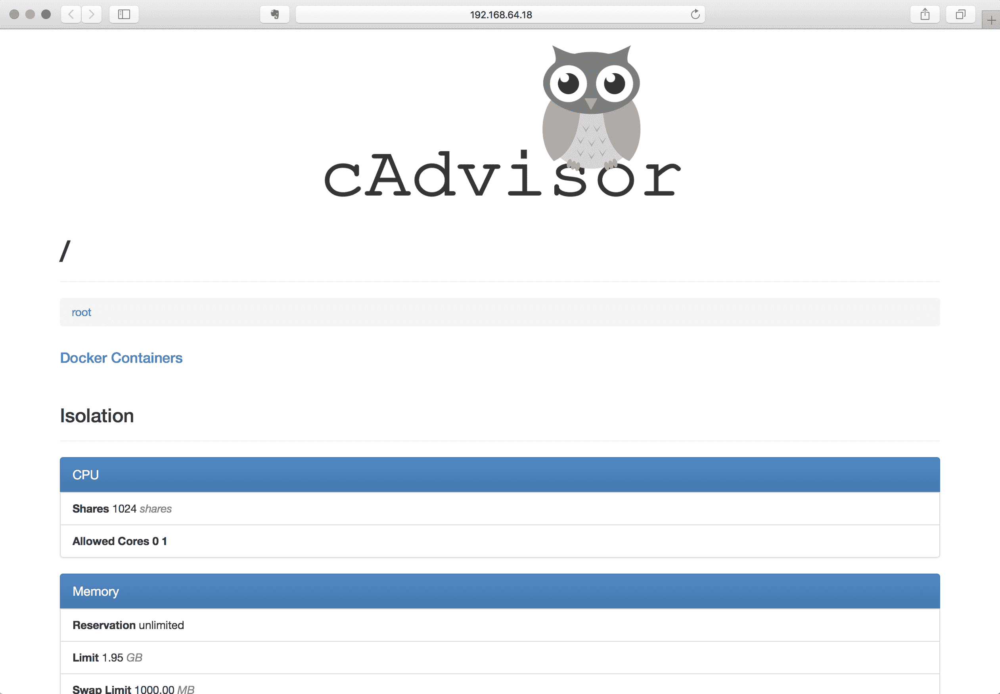

向下滚动一点，您会看到许多仪表和信息表:

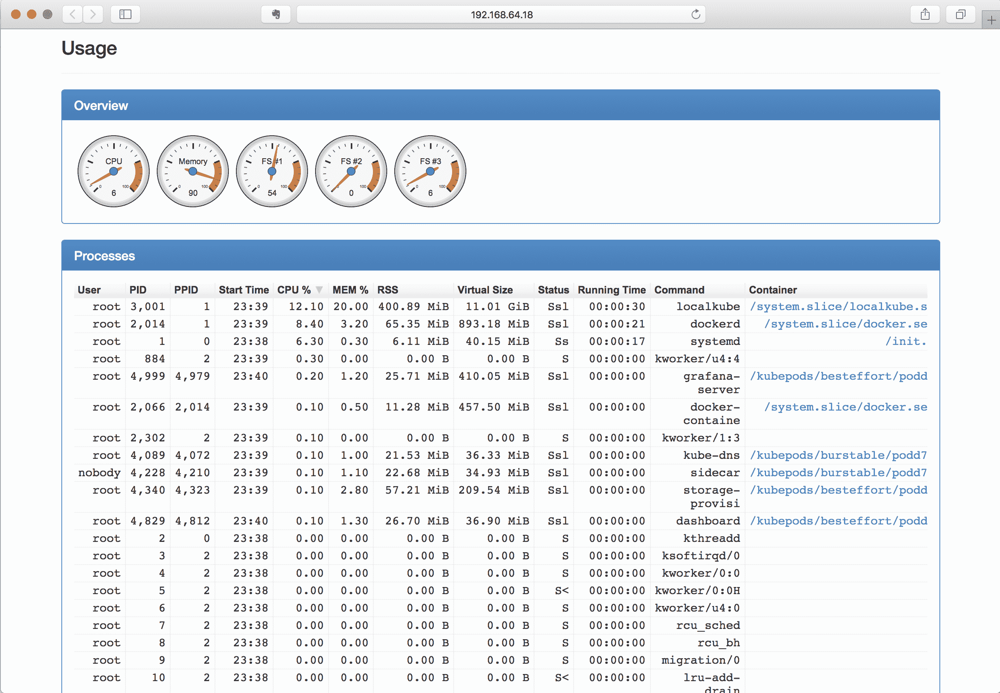

下面是一组简单的图表，显示了 CPU、内存、网络和文件系统的使用情况。这些图形和表格将在您观看时更新并自动刷新，并代表 Kubernetes 在您的集群运行时捕获的关于集群的基本信息。

Kubernetes 还通过自己的应用编程接口提供关于自己的指标——它的应用编程接口服务器和相关组件。通过`kubectl`代理使应用编程接口可用后，您可以直接使用`curl`命令查看这些指标:

```
kubectl proxy
```

在单独的终端窗口中:

```
curl http://127.0.0.1:8001/metrics
```

Kubernetes 的许多安装都使用了一个名为 Heapster 的程序，从 Kubernetes 和每个节点的 cAdvisor 实例中收集指标，并将它们存储在一个时间序列数据库中，如 InfluxDB。从 Kubernetes 1.9 开始，开源项目正在从 Heapster 向可插拔解决方案转移，常见的替代解决方案是 Prometheus，它经常用于短期指标捕获。

如果您正在使用 Minikube，您可以使用`minikube`插件轻松地将 Heapster 添加到您的本地环境中。像仪表板一样，它将在自己的基础设施上运行 Kubernetes 的软件，在本例中是 Heapster、InfluxDB 和 Grafana。

这将启用 Minikube 中的附加组件，您可以使用以下命令:

```
minikube addons enable heapster
heapster was successfully enabled
```

在后台，Minikube 将启动并配置 Heapster、InfluxDB 和 Grafana，将其创建为一个服务。您可以使用以下命令:

```
minikube addons open heapster
```

这将为格拉夫纳打开一个浏览器窗口。设置容器时，该命令将等待，但当服务端点可用时，它将打开一个浏览器窗口:

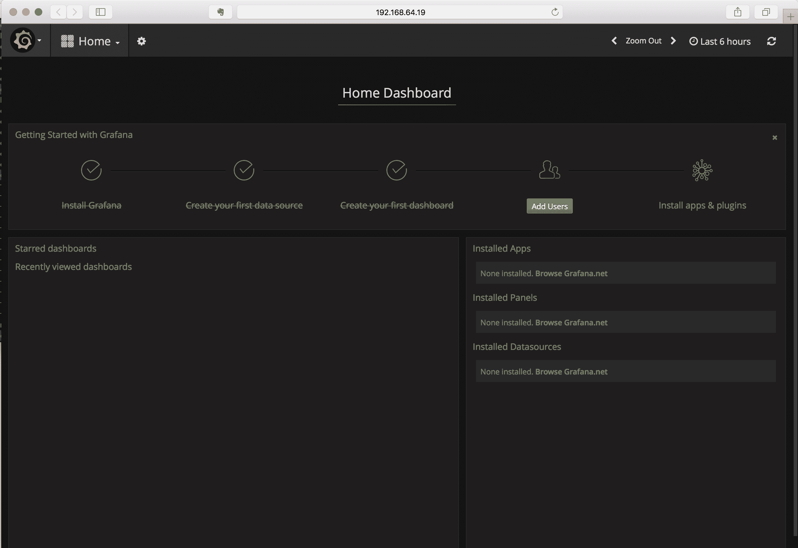

Grafana 是一个单页应用，用于显示图形和从公共数据源构建仪表板。在 Minikube Heapster 插件创建的版本中，Grafana 配置了两个仪表板:集群和 Pods。如果在默认视图中选择标记为主页的下拉菜单，则可以选择其他仪表板进行查看。

Heapster、InfluxDB 和 Grafana 都需要一两分钟的时间来收集和捕获环境的一些基本指标，但是很快，您就可以转到这些其他仪表板来查看正在运行的信息。例如，我部署了本书前面章节中的所有示例应用，并转到集群仪表板，大约 10 分钟后，视图如下所示:

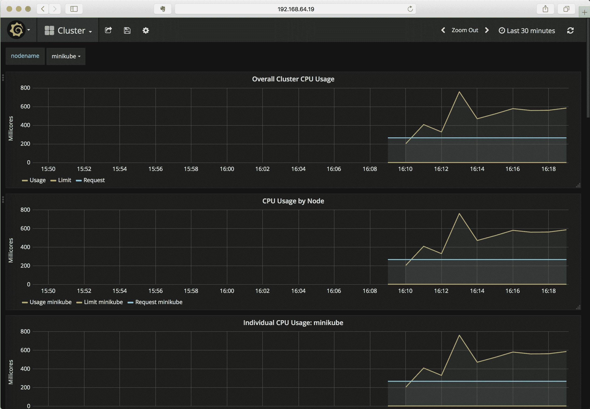

向下滚动此控制面板，您将看到按节点划分的 CPU、内存、文件系统和网络使用情况，以及这方面的总体集群视图。您可能会注意到，CPU 图表中有三行被跟踪—使用、限制和请求—它们与实际使用的资源、请求的数量以及对容器和容器设置的任何限制相匹配。

如果切换到 pods 控制面板，您将看到该控制面板包含当前在集群中运行的所有 Pods 的选项，并提供每个选项的详细视图。在此处显示的示例中，我从我部署的`flask`示例应用中选择了 pod:

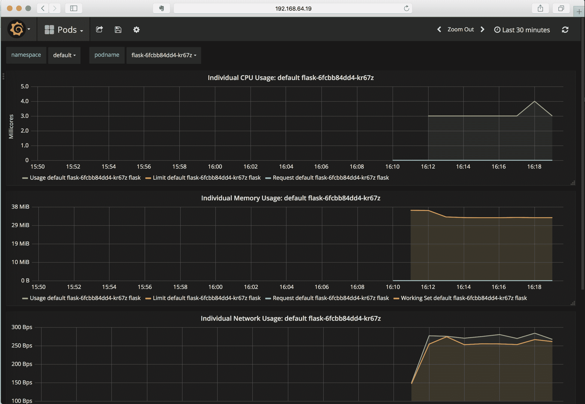

向下滚动，您可以看到包括内存、CPU、网络和磁盘利用率的图表。Heapster、Grafana 和 InfluxDB 的集合将在您创建新的 pods 时自动记录它们，您可以在 Pods 仪表板中的名称空间和 Pods 名称之间进行选择。

# Kubernetes 理念–服务质量

在 Kubernetes 中创建 pod 时，还会根据请求 pod 时提供的数据为其分配一个服务质量类。这被调度器用来在调度过程中提供一些前期保证，以及稍后在吊舱本身的管理中。支持的三个类是:

*   `Guaranteed`
*   `Burstable`
*   `BestEffort`

分配给 pod 的类取决于您报告的资源限制以及 pod 中容器的 CPU 和内存利用率请求。在前面的例子中，没有一个容器被分配了请求或限制，所以所有这些容器在运行时都被分类为`BestEffort`。

资源请求和限制在容器内的每个容器上定义。如果我们向容器添加一个请求，我们要求 Kubernetes 确保集群有足够的资源来运行我们的 pod(内存、中央处理器或两者都有)，并且它将验证可用性作为调度的一部分。如果我们增加一个限制，我们要求 Kubernetes 观察容器，如果容器超过我们设定的限制，我们会做出反应。对于限制，如果容器试图超过 CPU 限制，容器将被简单地限制到定义的 CPU 限制。如果超过内存限制，容器经常被终止，您可能会在`reason`描述中看到那些终止的容器的错误消息`OOM killed`。

如果设置了请求，除了当也设置了限制，并且该限制具有与请求相同的值，在这种情况下，`Guaranteed`的服务等级被分配之外，吊舱通常被设置为`Burstable`的服务质量等级。作为调度的一部分，如果一个 pod 被认为是在`Guaranteed`服务类中，Kubernetes 将在集群中保留资源，如果过载，它将倾向于首先过期并驱逐`BestEffort`容器，然后是`Burstable`。群集通常需要预期失去资源容量(例如，一个或多个节点出现故障)。在这种情况下，`Guaranteed`级吊舱一旦被安排到集群中，在面对这种故障时将具有最长的寿命。

我们可以通过增加对 CPU 和内存的请求和限制来更新我们的`flask`示例窗格，使其能够以`Guaranteed`服务质量运行:

```
    spec:
      containers:
      - name: flask
        image: quay.io/kubernetes-for-developers/flask:0.4.0
        resources:
          limits:
            memory: "100Mi"
            cpu: "500m"
          requests:
            memory: "100Mi"
            cpu: "500m"
```

这就对中央处理器和内存提出了相同值的请求和限制——在本例中，100 兆内存和大约半个核心的中央处理器利用率。

通常认为最佳做法是至少为您想要在生产模式下运行的所有容器和容器定义请求，并且最好也定义限制。

# 为您的容器选择请求和限制

如果您不确定使用什么值来设置容器的请求和/或限制，那么确定这些值的最佳方法是观察它们。有了希普斯特，或者普罗米修斯，和格拉夫纳，你可以看到每个豆荚消耗了多少资源。

有一个三步的过程，你可以用你的代码来看看它采取了什么:

1.  运行您的代码，查看空闲时消耗了多少资源
2.  向代码中添加负载，并验证负载下的资源消耗
3.  设置好约束后，运行另一个持续一段时间的负载测试，以查看代码是否符合定义的界限

第一步(空闲时复习)会给你一个好的开始。利用 Grafana，或者利用集群节点上可用的 cAdvisor，只需部署有问题的 pod。在前面的例子中，我们使用了本书前面的`flask`例子，您可以看到一个空闲的烧瓶应用消耗了大约 3 毫核心(. 003%的核心)和大约 35 MB 的内存。这为 CPU 和内存的请求提供了一个基础。

第二步通常最好通过运行**递增负载测试**(也称为**斜坡负载测试**)来检查吊舱在负载下的反应。一般来说，你会看到你的负载随着请求线性上升，然后弯下腰，或者膝盖，开始变得瓶颈。您可以查看相同的 Grafana 或 cAdvisor 面板，以显示加载期间的利用率。

如果您想生成一点简单的负载，您可以使用 Apache benchmark([https://httpd.apache.org/docs/2.4/programs/ab.html](https://httpd.apache.org/docs/2.4/programs/ab.html))等工具生成一些特定的负载点。例如，要使用该工具运行一个交互式容器，该工具可以对 Flask 应用起作用，您可以使用以下命令:

```
kubectl run -it --rm --restart=Never \
--image=quay.io/kubernetes-for-developers/ab quicktest -- sh
```

该映像同时安装了`curl`和`ab`，因此您可以验证您可以使用以下命令与我们在前面的示例中创建的 Flask-service 进行对话:

```
curl -v http://flask-service.default:5000/
```

这应该会返回一些详细的输出，显示连接和基本请求如下:

```
* Trying 10.104.90.234...
* TCP_NODELAY set
* Connected to flask-service.default (10.104.90.234) port 5000 (#0)
> GET / HTTP/1.1
> Host: flask-service.default:5000
> User-Agent: curl/7.57.0
> Accept: */*
>
* HTTP 1.0, assume close after body
< HTTP/1.0 200 OK
< Content-Type: text/html; charset=utf-8
< Content-Length: 10
< Server: Werkzeug/0.13 Python/3.6.3
< Date: Mon, 08 Jan 2018 02:22:26 GMT
<
* Closing connection 0
```

一旦你确认一切如你所料，你可以用`ab`运行一些负载:

```
ab -c 100 -n 5000 http://flask-service.default:5000/ 
This is ApacheBench, Version 2.3 <$Revision: 1807734 $>
Copyright 1996 Adam Twiss, Zeus Technology Ltd, http://www.zeustech.net/
Licensed to The Apache Software Foundation, http://www.apache.org/

Benchmarking flask-service.default (be patient)
Completed 500 requests
Completed 1000 requests
Completed 1500 requests
Completed 2000 requests
Completed 2500 requests
Completed 3000 requests
Completed 3500 requests
Completed 4000 requests
Completed 4500 requests
Completed 5000 requests
Finished 5000 requests
Server Software: Werkzeug/0.13
Server Hostname: flask-service.default
Server Port: 5000
Document Path: /
Document Length: 10 bytes
Concurrency Level: 100
Time taken for tests: 3.454 seconds
Complete requests: 5000
Failed requests: 0
Total transferred: 810000 bytes
HTML transferred: 50000 bytes
Requests per second: 1447.75 [#/sec] (mean)
Time per request: 69.072 [ms] (mean)
Time per request: 0.691 [ms] (mean, across all concurrent requests)
Transfer rate: 229.04 [Kbytes/sec] received

Connection Times (ms)
 min mean[+/-sd] median max
Connect: 0 0 0.3 0 3
Processing: 4 68 7.4 67 90
Waiting: 4 68 7.4 67 90
Total: 7 68 7.2 67 90

Percentage of the requests served within a certain time (ms)
 50% 67
 66% 69
 75% 71
 80% 72
 90% 77
 95% 82
 98% 86
 99% 89
 100% 90 (longest request)
```

您将在 cAdvisor 中看到相应的资源使用量跳跃，或者大约一分钟后，Grafana 与 Heapster 一起。为了在 Heapster 和 Grafana 中获得有用的值，您将希望运行扩展负载测试，因为该数据正在被聚合，您将希望理想地运行负载测试几分钟，因为一分钟的粒度是 Grafana 使用 Heapster 聚合到的基本级别。

cAdvisor 会更新得更快，如果您正在查看交互图，您会看到它们会随着负载测试的进行而更新:

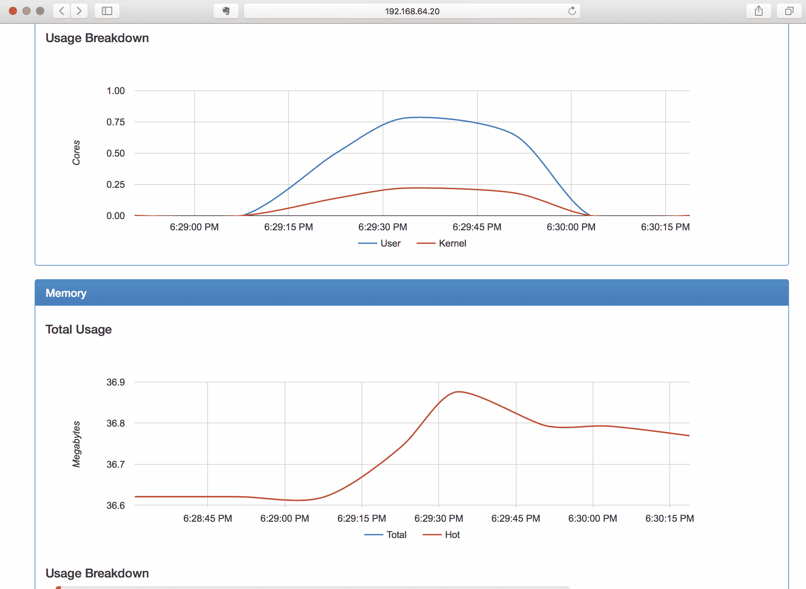

在这种情况下，您可以看到我们的内存使用量保持在 36 MB 左右，并且我们的 CPU 在负载测试期间达到了峰值(对于这个应用，您可能会有所预期)。

如果我们应用前面的请求和限制示例，并更新 flask 部署，那么当 CPU 达到大约 1/2 核心 CPU 限制时，您会看到负载变平。

这个过程的第三步主要是通过一个更长时间运行的负载测试来验证您对 CPU 和内存需求的评估。通常，您会运行一个扩展负载(最少几分钟长)，并设置您的请求和限制来验证容器是否能够满足预期的流量。该评估中最常见的缺陷是在执行扩展负载测试时看到内存缓慢攀升，导致容器被 OOM 终止(因超出其内存限制而被终止)。

我们在示例中拥有的 100 MiB 内存保留了比该容器需要的内存多得多的内存，因此我们可以轻松地将其减少到 40 MiB，并进行最后的验证步骤。

在设置请求和限制时，您希望选择最有效地描述您的需求的值，但不要浪费预留的资源。要运行更扩展的负载测试，请键入:

```
ab -c 100 -n 50000 http://flask-service.default:5000/
```

最终的 Grafana 输出如下:

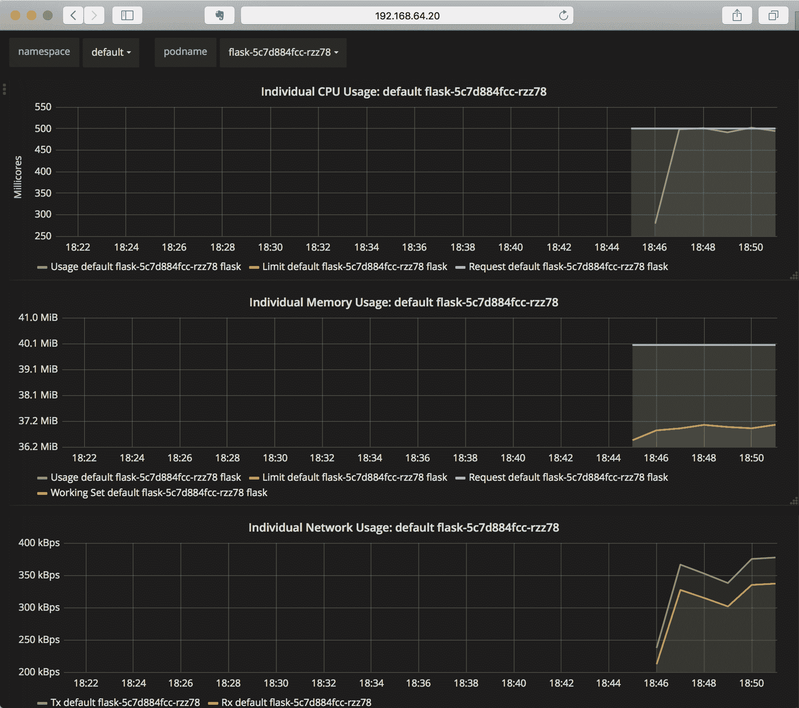

# 使用普罗米修斯捕获指标

Prometheus 是一个著名的开源工具，用于监控，它和 Kubernetes 社区之间正在进行相当多的共生工作。Kubernetes 应用度量以 Prometheus 格式公开。该格式包括*计数器*、*量表*、*直方图*和*汇总*的数据类型，以及指定与特定指标关联的标签的方法。随着普罗米修斯和Kubernetes的发展，普罗米修斯的度量格式似乎正在成为项目内部及其各个组成部分的事实标准。

有关这种格式的更多信息，请参见普罗米修斯项目的在线文档:

*   [https://prometheus.io/docs/concepts/data_model/](https://prometheus.io/docs/concepts/data_model/)
*   [https://prometheus.io/docs/concepts/metric_types/](https://prometheus.io/docs/concepts/metric_types/)
*   [https://Prometheus . io/docs/instrumenting/exposure _ formats/](https://prometheus.io/docs/instrumenting/exposition_formats/)

除了度量格式之外，Prometheus 还提供了相当多的功能作为其自己的开源项目，并且在 Kubernetes 之外使用。这个项目的架构给出了其主要组件的合理含义:

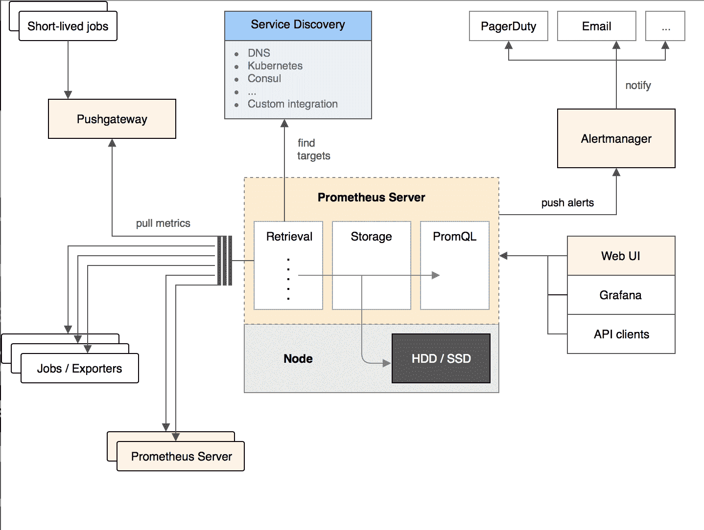

普罗米修斯服务器本身就是我们将在本章中研究的。其核心是，它定期扫描多个远程位置，从这些位置收集数据，将其存储在短期时间序列数据库中，并提供查询该数据库的方法。普罗米修斯的扩展允许系统将这些时间序列指标导出到其他系统，以便进行长期存储。此外，Prometheus 还包括一个警报管理器，该管理器可以配置为根据捕获的信息和从时间序列指标中得出的信息发送警报，或者更一般地调用操作。

Prometheus 并不打算成为指标的长期存储，它可以与各种其他系统一起工作，以更长期地捕获和管理数据。常见的普罗米修斯安装维护数据 6 到 24 小时，每个安装可配置。

普罗米修斯最简单的安装包括普罗米修斯服务器本身和服务配置。但是，为了充分利用普罗米修斯，安装通常更加广泛和复杂，每个警报管理器和普罗米修斯服务器都有一个单独的部署，推送网关(允许其他系统主动向普罗米修斯发送指标)也有一个部署，DaemonSet 从集群中的每个节点捕获数据，并将这些信息公开并导出到普罗米修斯，从而利用 cAdvisor。

更复杂的软件安装可以通过管理一组 YAML 文件来完成，正如我们在本书前面所探讨的那样。对于如何管理和安装一组部署、服务、配置等，还有其他选项。我们将利用一个更常见的工具 Helm 来完成这类工作，而不是记录所有的部分，Helm 与 Kubernetes 项目紧密相关，通常被称为 Kubernetes 的包管理器。

You can find significantly more information about Helm from the project's documentation site at [https://helm.sh](https://helm.sh).

# 安装舵

Helm 是一个由两部分组成的系统:命令行工具和运行在 Kubernetes 集群中的软件，命令行工具与这些软件交互。通常，您在本地需要的是命令行工具，而该工具又将用于将所需的组件安装到您的集群中。

安装 Helm 命令行工具的文档可在项目网站上获得:[https://github . com/kubernetes/Helm/blob/master/docs/install . MD .](https://github.com/kubernetes/helm/blob/master/docs/install.md)

如果您在本地使用 macOS，它可以通过家酿获得，并且可以通过以下方式安装:

```
brew install kubernetes-helm
```

或者，如果您在 Linux 主机上工作，Helm 项目提供了一个脚本，您可以使用它来安装 Helm:

```
curl https://raw.githubusercontent.com/kubernetes/helm/master/scripts/get > get_helm.sh
chmod 700 get_helm.sh
./get_helm.sh
```

一旦安装了 Helm，您就可以使用命令`helm init`使用它来安装集群内运行的组件(称为 Tiller)。您应该看到如下输出:

```
$HELM_HOME has been configured at /Users/heckj/.helm.

Tiller (the Helm server-side component) has been installed into your Kubernetes Cluster.
Happy Helming!
```

除了为其使用设置一些本地配置文件之外，这还在您的集群上为其集群端组件 **Tiller** 在`kube-system`命名空间内进行了部署。如果您想查看详细信息，可以查看该部署:

```
kubectl describe deployment tiller-deploy -n kube-system
```

此时，您已经安装了 Helm，您可以使用 Helm 命令版本验证您的安装版本(命令行和集群上的内容)。这非常类似于`kubectl`版本，报告其版本和与之通信的系统版本:

```
helm version 
Client: &amp;version.Version{SemVer:"v2.7.2", GitCommit:"8478fb4fc723885b155c924d1c8c410b7a9444e6", GitTreeState:"clean"}
Server: &amp;version.Version{SemVer:"v2.7.2", GitCommit:"8478fb4fc723885b155c924d1c8c410b7a9444e6", GitTreeState:"clean"}
```

现在，我们可以继续讨论我们设置 Helm 的原因:安装普罗米修斯。

# 使用头盔安装普罗米修斯

Helm 使用一组配置文件来描述它需要安装什么，以什么顺序，用什么参数。这些配置被称为图表，并在 GitHub 中维护，其中维护默认的 Helm 存储库。

您可以通过命令`helm repo list`查看 Helm 正在使用的存储库:

```
helm repo list 
NAME URL
stable https://kubernetes-charts.storage.googleapis.com
local http://127.0.0.1:8879/charts
```

这个默认值是一个 GitHub 存储库的包装器，你可以在[https://github.com/kubernetes/charts](https://github.com/kubernetes/charts)查看存储库的内容。查看所有可用图表的另一种方法是命令`helm search`。

最好确保您有可用的存储库的最新缓存。您可以使用命令`helm repo update`将缓存更新到最新，镜像 GitHub 中的图表。

最终的更新应该报告成功，输出类似于:

```
help repo update

Hang tight while we grab the latest from your chart repositories...
...Skip local chart repository
...Successfully got an update from the "stable" chart repository
Update Complete.  Happy Helming!
```

我们将使用稳定/普罗米修斯图表(托管于[https://github . com/kubernetes/charts/tree/master/stable/Prometheus](https://github.com/kubernetes/charts/tree/master/stable/prometheus))。我们可以使用 Helm 在本地绘制图表，以更详细地查看它:

```
helm fetch --untar stable/prometheus 
```

该命令从默认存储库中下载图表，并在本地将其解压到名为 Prometheus 的目录中。在目录中看一下，应该会看到几个文件和一个名为`templates`的目录:

```
.helmignore
Chart.yaml
README.md
templates
values.yaml
```

这是图表的常见模式，`Chart.yaml`描述图表将要安装的软件。`values.yaml`是默认配置值的集合，在将要创建的所有不同的 Kubernetes 资源中使用，模板目录包含模板化文件的集合，这些文件将被呈现出来，以便在集群中安装该软件所需的所有 Kubernetes 资源。典型地，`README.md`将包括`values.yaml`中所有值的描述、它们的用途以及安装建议。

我们现在可以安装`prometheus`，我们将通过利用 Helm 的几个选项、设置发布名称和使用命名空间来实现:

```
helm install prometheus -n monitor --namespace monitoring
```

这将安装包含在`prometheus`目录中的图表，安装包含在名称空间`monitoring`中的所有组件，并在所有对象的前面加上一个发布名称`monitor`。如果我们没有指定这些值中的任何一个，Helm 会使用默认的名称空间，并生成一个随机的发布名称来唯一标识安装。

当调用这个函数时，您会看到相当多的输出，描述了创建的内容及其在过程开始时的状态，随后是一段注释，提供了如何访问刚刚安装的软件的信息:

```
NAME: monitor
LAST DEPLOYED: Sun Jan 14 15:00:40 2018
NAMESPACE: monitoring
STATUS: DEPLOYED
RESOURCES:
==> v1/ConfigMap
NAME DATA AGE
monitor-prometheus-alertmanager 1 1s
monitor-prometheus-server 3 1s

==> v1/PersistentVolumeClaim
NAME STATUS VOLUME CAPACITY ACCESS MODES STORAGECLASS AGE
monitor-prometheus-alertmanager Bound pvc-be6b3367-f97e-11e7-92ab-e697d60b4f2f 2Gi RWO standard 1s
monitor-prometheus-server Bound pvc-be6b8693-f97e-11e7-92ab-e697d60b4f2f 8Gi RWO standard 1s

==> v1/Service
NAME TYPE CLUSTER-IP EXTERNAL-IP PORT(S) AGE
monitor-prometheus-alertmanager ClusterIP 10.100.246.164 <none> 80/TCP 1s
monitor-prometheus-kube-state-metrics ClusterIP None <none> 80/TCP 1s
monitor-prometheus-node-exporter ClusterIP None <none> 9100/TCP 1s
monitor-prometheus-pushgateway ClusterIP 10.97.187.101 <none> 9091/TCP 1s
monitor-prometheus-server ClusterIP 10.110.247.151 <none> 80/TCP 1s

==> v1beta1/DaemonSet
NAME DESIRED CURRENT READY UP-TO-DATE AVAILABLE NODE SELECTOR AGE
monitor-prometheus-node-exporter 1 1 0 1 0 <none> 1s

==> v1beta1/Deployment
NAME DESIRED CURRENT UP-TO-DATE AVAILABLE AGE
monitor-prometheus-alertmanager 1 1 1 0 1s
monitor-prometheus-kube-state-metrics 1 1 1 0 1s
monitor-prometheus-pushgateway 1 1 1 0 1s
monitor-prometheus-server 1 1 1 0 1s

==> v1/Pod(related)
NAME READY STATUS RESTARTS AGE
monitor-prometheus-node-exporter-bc9jp 0/1 ContainerCreating 0 1s
monitor-prometheus-alertmanager-6c59f855d-bsp7t 0/2 ContainerCreating 0 1s
monitor-prometheus-kube-state-metrics-57747bc8b6-l7pzw 0/1 ContainerCreating 0 1s
monitor-prometheus-pushgateway-5b99967d9c-zd7gc 0/1 ContainerCreating 0 1s
monitor-prometheus-server-7895457f9f-jdvch 0/2 Pending 0 1s

NOTES:
The prometheus server can be accessed via port 80 on the following DNS name from within your cluster:
monitor-prometheus-server.monitoring.svc.cluster.local

Get the prometheus server URL by running these commands in the same shell:
 export POD_NAME=$(kubectl get pods --namespace monitoring -l "app=prometheus,component=server" -o jsonpath="{.items[0].metadata.name}")
 kubectl --namespace monitoring port-forward $POD_NAME 9090

The prometheus alertmanager can be accessed via port 80 on the following DNS name from within your cluster:
monitor-prometheus-alertmanager.monitoring.svc.cluster.local

Get the Alertmanager URL by running these commands in the same shell:
 export POD_NAME=$(kubectl get pods --namespace monitoring -l "app=prometheus,component=alertmanager" -o jsonpath="{.items[0].metadata.name}")
 kubectl --namespace monitoring port-forward $POD_NAME 9093

The prometheus PushGateway can be accessed via port 9091 on the following DNS name from within your cluster:
monitor-prometheus-pushgateway.monitoring.svc.cluster.local

Get the PushGateway URL by running these commands in the same shell:
 export POD_NAME=$(kubectl get pods --namespace monitoring -l "app=prometheus,component=pushgateway" -o jsonpath="{.items[0].metadata.name}")
 kubectl --namespace monitoring port-forward $POD_NAME 9093

For more information on running prometheus, visit:
https://prometheus.io/
```

`helm list`将显示您已安装的当前版本:

```
NAME REVISION UPDATED STATUS CHART NAMESPACE
monitor 1 Sun Jan 14 15:00:40 2018 DEPLOYED prometheus-4.6.15 monitoring
```

您可以使用`helm status`命令以及版本名称来获取图表创建的所有 Kubernetes 资源的当前状态:

```
helm status monitor
```

注释部分包含在模板中，并在每次状态调用时再次呈现，通常编写为包含如何访问软件的注释。

You can install a chart without having explicitly retrieved it first. Helm will use any local charts first, but fall back to searching through its available repositories, so we could have installed this same chart with just this command:
`**helm install stable/prometheus -n monitor --namespace monitoring**`

您还可以让 Helm 将`values.yaml`及其模板混合在一起，以渲染出它将创建的所有对象，并简单地显示它们，这对于查看所有片段如何组合在一起非常有用。这样做的命令是`helm template`，要渲染用于创建Kubernetes资源的 YAML，命令应该是:

```
helm template prometheus -n monitor --namespace monitoring
```

`helm template`命令确实要求图表在本地文件系统上可用，因此虽然`helm install`可以从远程存储库工作，但您需要使用`helm fetch`在本地拥有图表，以便利用`helm template`命令。

# 使用普罗米修斯查看指标

使用笔记中提供的详细信息，您可以设置端口转发，就像我们在本书前面所做的那样，并直接访问普罗米修斯。笔记中显示的信息如下所示:

```
export POD_NAME=$(kubectl get pods --namespace monitoring -l "app=prometheus,component=server" -o jsonpath="{.items[0].metadata.name}")

kubectl --namespace monitoring port-forward $POD_NAME 9090
```

这将允许您使用浏览器直接访问普罗米修斯服务器。在终端运行这些命令，然后打开浏览器，导航到`http://localhost:9090/`。

您可以通过查看`http://localhost:9090/targets`处的目标列表来查看普罗米修斯正在监控的内容的当前状态:

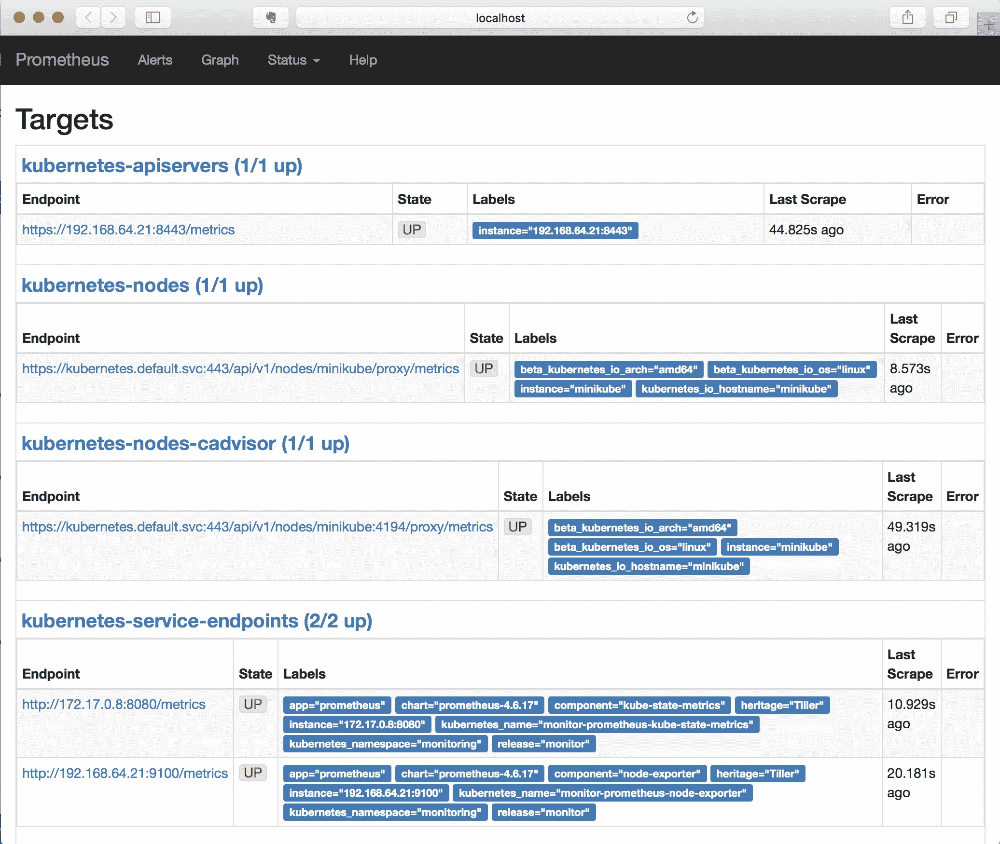

在`http://localhost:9090/graph`切换到普罗米修斯查询/浏览器，可以查看普罗米修斯已经收集的指标。收集了大量的指标，我们特别感兴趣的是那些与我们之前在 cAdvisor 和 Heapster 中看到的信息相匹配的指标。在 1.7 及更高版本的 Kubernetes 集群中，这些指标被移动，并由我们在截图中的目标中看到的`kubernetes-nodes-cadvisor`作业专门收集。

在查询浏览器中，您可以开始键入度量名称，它将尝试自动完成，或者您可以使用下拉菜单查看所有可能度量的列表。输入指标名称`container_memory_usage_bytes`，点击*进入*查看表格形式的指标列表。

好的度量的一般形式会有一些度量是什么的标识符，并且通常以一个单元标识符结束，在这种情况下，是字节。查看该表，您可以看到收集的指标以及每个指标的一组相当密集的键值对。

这些键值对是度量标准上的标签，一般来说，在 Kubernetes 中，它们的功能类似于标签和选择器。

此处显示了一个示例指标，经过重新格式化以便于阅读:

```
container_memory_usage_bytes{
  beta_kubernetes_io_arch="amd64",
  beta_kubernetes_io_os="linux",
  container_name="POD",
  id="/kubepods/podf887aff9-f981-11e7-92ab-e697d60b4f2f/25fa74ef205599036eaeafa7e0a07462865f822cf364031966ff56a9931e161d",
  image="gcr.io/google_containers/pause-amd64:3.0",
  instance="minikube",
  job="kubernetes-nodes-cadvisor",
  kubernetes_io_hostname="minikube",
  name="k8s_POD_flask-5c7d884fcc-2l7g9_default_f887aff9-f981-11e7-92ab-e697d60b4f2f_0",
  namespace="default",
  pod_name="flask-5c7d884fcc-2l7g9"
} 249856
```

在查询中，我们可以通过在查询中包含与这些标签的匹配来过滤我们感兴趣的指标。例如，与特定容器相关联的所有指标都将有一个`image`标记，因此我们可以通过以下方式筛选出这些指标:

```
container_memory_usage_bytes{image!=""}
```

您可能已经注意到，名称空间和 pod 名称也包括在内，我们也可以匹配它们。例如，为了查看与我们部署示例应用的默认命名空间相关的指标，我们可以添加`namespace="default"`:

```
container_memory_usage_bytes{image!="",namespace="default"}
```

这开始归结为更合理的指标数量。虽然表格会显示最新的值，但这些值的历史是我们感兴趣的。如果您在当前查询中选择“图形”按钮，它将尝试呈现您选择的指标的单个图形，例如:

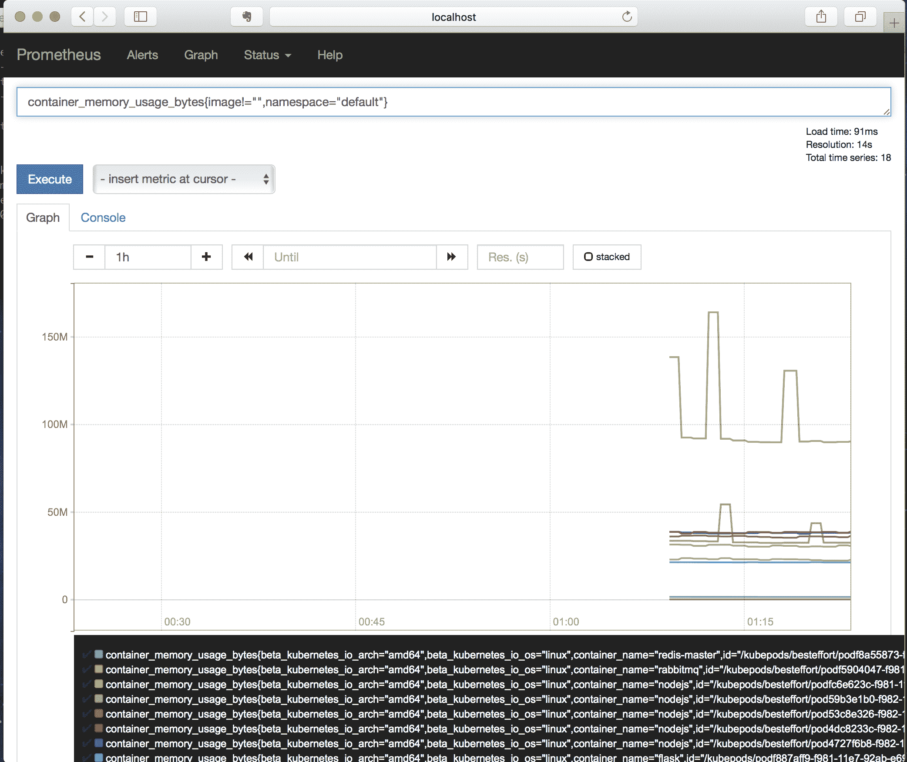

因为度量还包括`container_name`来匹配部署，所以您可以将其调整到单个容器。例如，要查看与我们的`flask`部署相关的内存使用情况:

```
container_memory_usage_bytes{image!="",namespace="default",container_name="flask"}
```

如果我们在`flask`部署中扩大副本的数量，它将为每个容器创建新的度量，因此为了一次不仅查看单个容器，还可以查看集合，我们可以利用普罗米修斯查询语言中的聚合运算符。一些最有用的操作符包括`sum`、`count`、`count_values`和`topk`。

我们还可以使用这些相同的聚合操作符将度量分组在一起，其中聚合的集合中有不同的标记值。例如，将`flask`部署上的副本增加到三个后，我们可以通过以下方式查看部署的总内存使用情况:

```
sum(container_memory_usage_bytes{image!="",
namespace="default",container_name="flask"})
```

然后按容器名称将它再次分成每个容器:

```
sum(container_memory_usage_bytes{image!="",
namespace="default",container_name="flask"}) by (name)
```

graph 函数可以给你一个很好的视觉概述，包括堆叠值，如下所示:

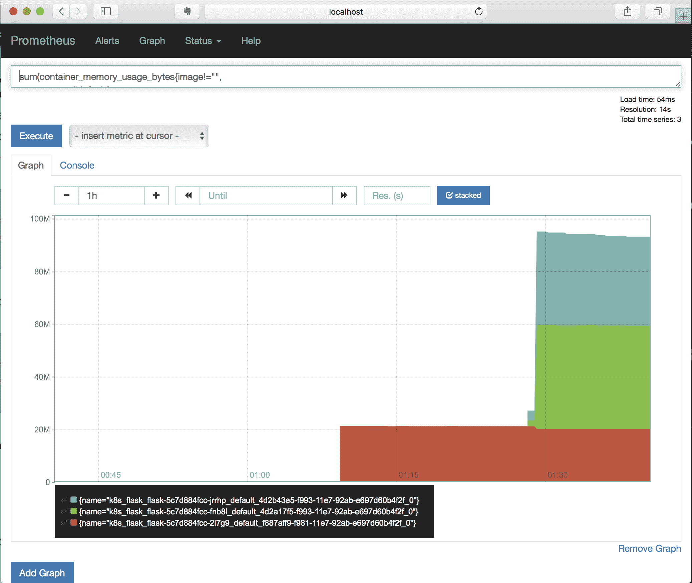

随着图表变得越来越复杂，您可能希望开始收集您最感兴趣的查询，并将这些图表的仪表板放在一起以便能够使用它们。这将我们引向另一个开源项目，Grafana，它可以很容易地托管在 Kubernetes 上，提供仪表板和图表。

# 安装 Grafana

Grafana 本身并不是一个复杂的安装，但是配置它可以。Grafana 可以插入许多不同的后端系统，并为它们提供仪表板和图形。在我们的示例中，我们希望让它提供来自普罗米修斯的仪表板。我们将设置一个安装，然后通过它的用户界面进行配置。

我们可以再次使用 Helm 来安装 Grafana，由于我们已经将 Prometheus 放入了名称空间监控中，我们将对 Grafana 进行同样的操作。我们可以做`helm fetch`并安装查看图表。在这种情况下，我们将直接安装它们:

```
helm install stable/grafana -n viz --namespace monitoring
```

在结果输出中，您将在创建的资源中看到一个秘密、配置映射和部署，在注释中，类似于:

```
NOTES:
1\. Get your 'admin' user password by running:

kubectl get secret --namespace monitoring viz-grafana -o jsonpath="{.data.grafana-admin-password}" | base64 --decode ; echo

2\. The Grafana server can be accessed via port 80 on the following DNS name from within your cluster:

viz-grafana.monitoring.svc.cluster.local

Get the Grafana URL to visit by running these commands in the same shell:

export POD_NAME=$(kubectl get pods --namespace monitoring -l "app=viz-grafana,component=grafana" -o jsonpath="{.items[0].metadata.name}")
 kubectl --namespace monitoring port-forward $POD_NAME 3000

3\. Login with the password from step 1 and the username: admin
```

The notes first include information about retrieving the secret. This highlights a feature that you will see used in several charts: where it requires a confidential password, it will generate a unique one and save it as a secret. This secret is directly available to people with access to the namespace and `kubectl`.

使用提供的命令检索 Grafana 界面的密码:

```
kubectl get secret --namespace monitoring viz-grafana -o jsonpath="{.data.grafana-admin-password}" | base64 --decode ; echo
```

然后打开终端并运行以下命令来访问仪表板:

```
export POD_NAME=$(kubectl get pods --namespace monitoring -l "app=viz-grafana,component=grafana" -o jsonpath="{.items[0].metadata.name}")

kubectl --namespace monitoring port-forward $POD_NAME 3000
```

然后，打开一个浏览器窗口，导航到`https://localhost:3000/`，应该会显示 Grafana 登录窗口:

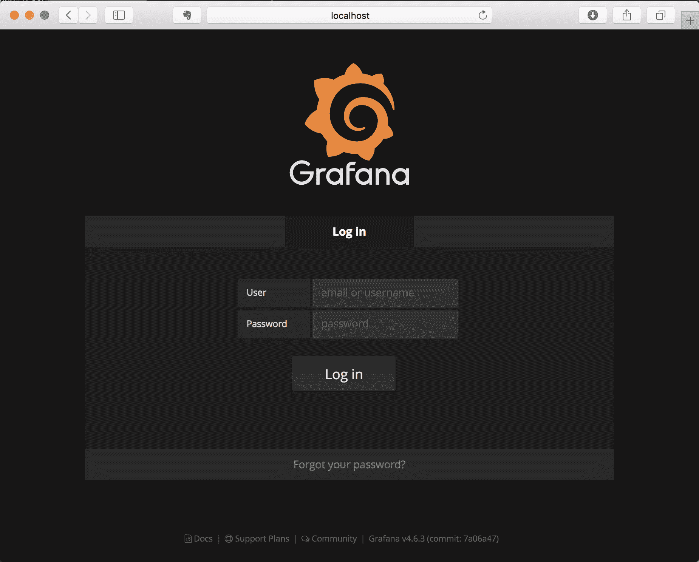

现在，使用用户名`admin`登录；密码是你之前找回的秘密。这将带您进入格拉夫纳的主页仪表板，您可以在其中配置数据源并将图形组装到仪表板中:

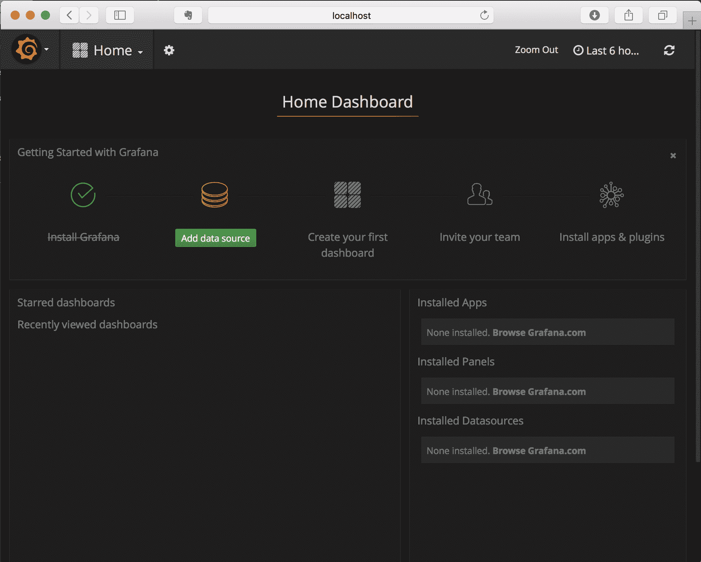

单击添加数据源，您将看到一个带有两个选项卡的窗口:配置允许您将位置设置为数据源，仪表板允许您导入仪表板配置。

在配置下，将数据源的类型设置为普罗米修斯，在显示名称的地方，可以输入`prometheus`。以类型命名数据源有点多余，如果您的集群中有多个 Prometheus 实例，您可能希望单独命名它们，并专门为它们命名。将我们的普罗米修斯实例的域名添加到网址中，这样格拉夫纳就可以访问它:`http://monitor-prometheus-server.monitoring.svc.cluster.local`。当我们使用赫尔姆安装普罗米修斯时，笔记中也列出了这个名字。

单击仪表板选项卡并导入普罗米修斯统计数据和格拉夫纳指标，这将为普罗米修斯和格拉夫纳本身提供内置仪表板。单击返回到配置选项卡，向下滚动，然后单击添加按钮来设置普罗米修斯数据源。添加数据源时，您应该会看到它正在工作:

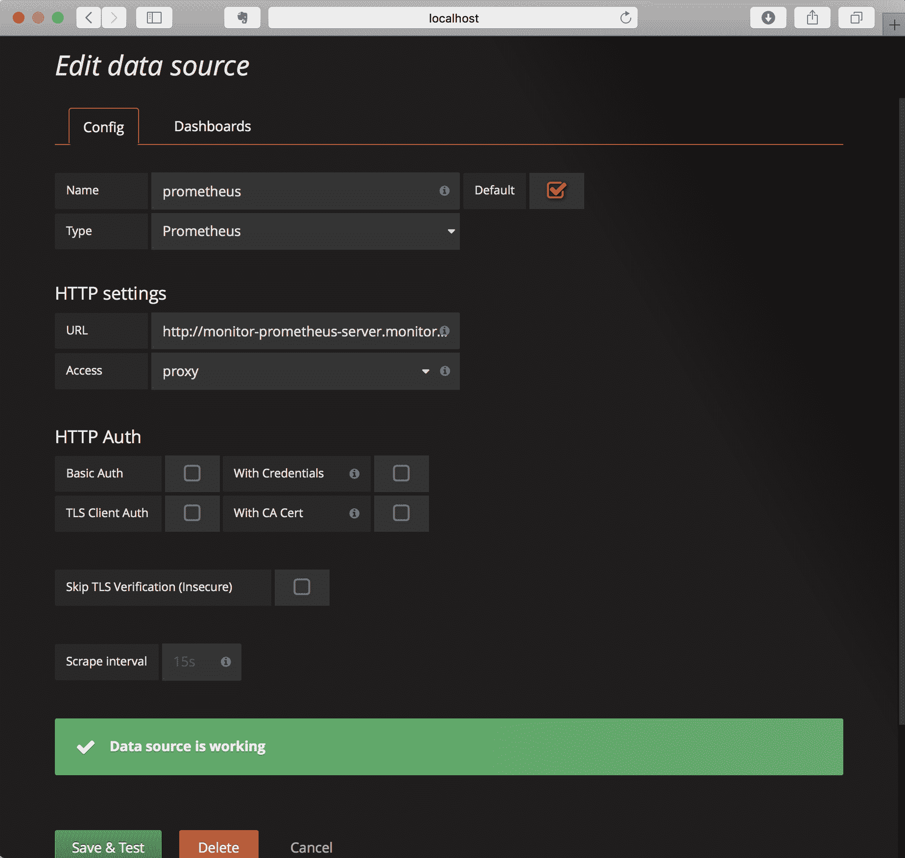

现在，您可以导航到内置仪表板并查看一些信息。网页用户界面的顶部由下拉列表组成，左上角是整体的 Grafana 配置，下一个列表是您设置的仪表板，通常从 Home 仪表板开始。选择我们刚刚导入的普罗米修斯统计仪表板，您应该会看到一些关于普罗米修斯的初始信息:

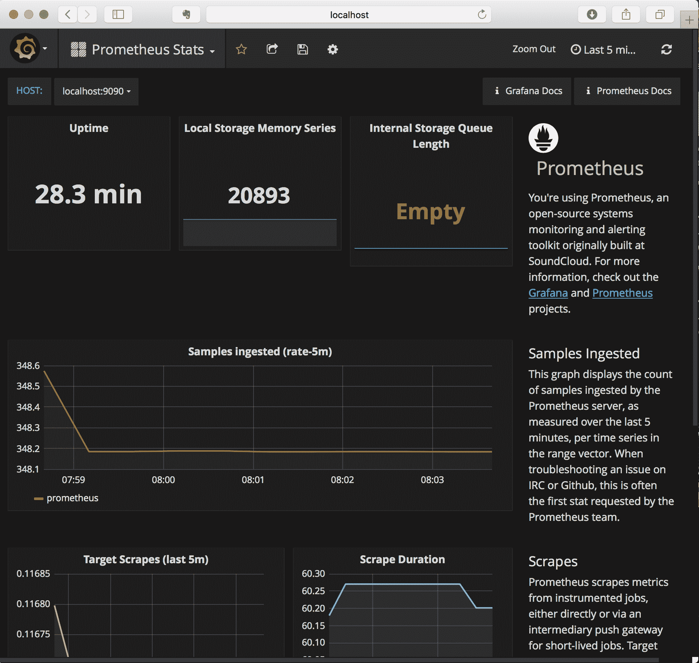

Grafana 项目维护了一个仪表板集合，您可以搜索并直接使用，或者使用灵感来修改和创建自己的仪表板。您可以在已共享的仪表板中进行搜索，例如，将其限制为来源于普罗米修斯并与Kubernetes相关的仪表板。你会在[https://grafana.com/dashboards?dataSource=prometheus&看到各种各样的仪表盘浏览，其中一些包括截图；search=kubernetes](https://grafana.com/dashboards?dataSource=prometheus&search=kubernetes) 。

您可以使用仪表板编号将这些导入到您的 Grafana 实例中。例如，仪表板 1621 和 162 是用于监控整个集群运行状况的通用仪表板:

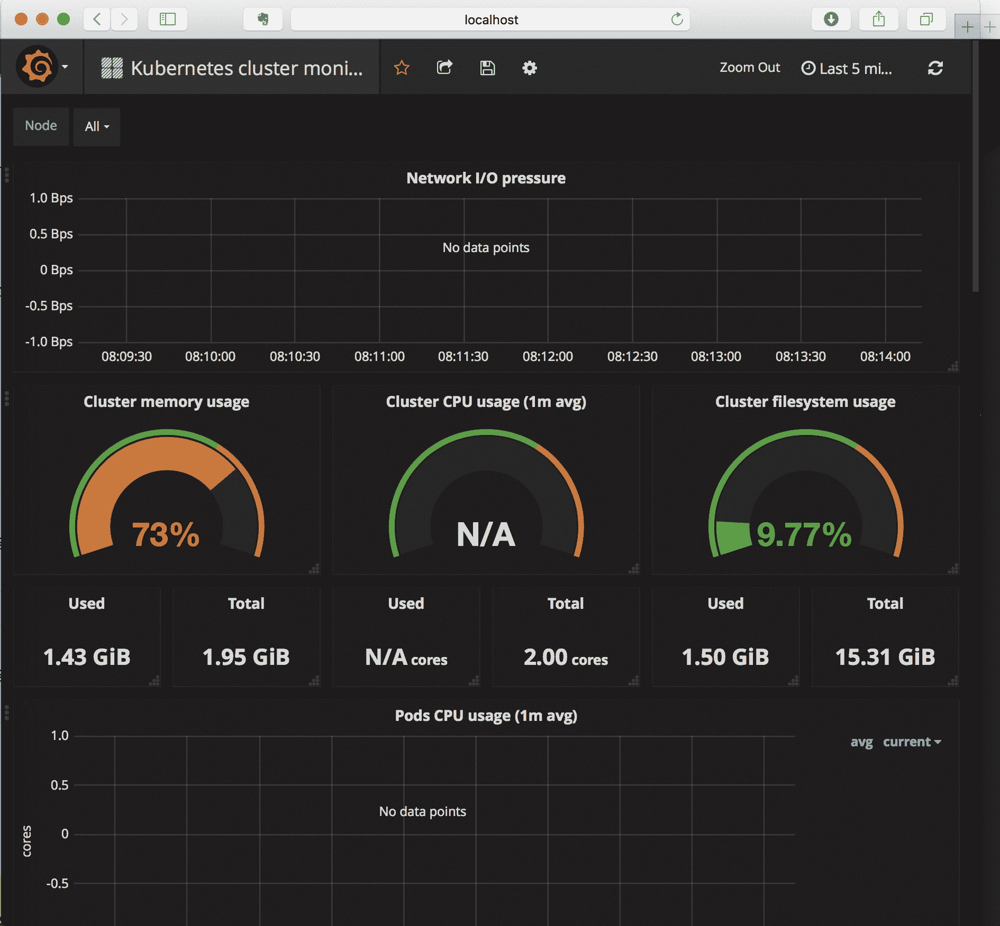

这些仪表板的最佳价值是向您展示如何配置您自己的图形和制作您自己的仪表板。在每个控制面板中，您可以选择图表并选择“编辑”来查看所使用的查询和显示所做的选择，并根据您的值调整它们。每个仪表板也可以共享回格拉夫纳托管网站，或者您可以查看配置的 JSON 并将其保存在本地。

The work going on with the Prometheus operator is working towards making it easier to bring up Prometheus and Grafana together, pre-configured and running to monitor your cluster and the applications within your cluster. If you are interested in trying it out, see the project README that is hosted by CoreOS at [https://github.com/coreos/prometheus-operator/tree/master/helm](https://github.com/coreos/prometheus-operator/tree/master/helm), which can also be installed with Helm.

现在您已经安装了 Grafana 和 Prometheus，在运行负载测试时，您可以使用它们来遵循类似的过程来确定您自己软件的 CPU 和内存利用率。在本地运行普罗米修斯的好处之一是它提供了收集应用度量的能力。

# 使用普罗米修斯查看应用指标

虽然您可以在 Prometheus 中添加一个作业，以包含从特定端点刮取 Prometheus 指标的配置，但我们之前进行的安装包含一个配置，该配置将根据 pods 上的注释动态更新它正在查看的内容。普罗米修斯的好处之一是，它支持基于注释自动检测集群中的变化，并且它可以查找支持服务的 pod 的端点。

由于我们使用 Helm 部署了普罗米修斯，所以您可以在`values.yaml`文件中找到嵌入的相关配置。寻找普罗米修斯作业`kubernetes-service-endpoints`，你会发现配置和一些如何使用它的文档。如果本地没有这些文件，可以在[https://github . com/kubernetes/charts/blob/master/stable/Prometheus/values . YAML # L747-L776 查看这个配置。](https://github.com/kubernetes/charts/blob/master/stable/prometheus/values.yaml#L747-L776)

该配置在集群中寻找具有注释`prometheus.io/scrape`的服务。如果设置为`true`，普罗米修斯将自动尝试将该端点添加到它正在监视的目标列表中。默认情况下，它将尝试访问 URI `/metrics`的指标，并使用与服务相同的端口。您可以使用附加注释来更改这些默认值，例如，`prometheus.io/path = "/alternatemetrics"`将尝试从路径`/alternatemetrics`读取指标。

通过使用服务作为组织度量收集的手段，我们有了一种机制，它将自动随着 pods 的数量而扩展。而在其他环境中，您可能需要在每次添加或删除实例时重新配置监控，普罗米修斯和Kubernetes一起工作无缝地捕获这些数据。

这一功能使我们能够轻松地从应用中公开定制的指标，并让普罗米修斯获取它们。有几种方法可以使用它，但最明显的是更好地了解应用的运行情况。随着普罗米修斯收集指标和格拉夫纳作为仪表板工具安装，您也可以使用这个组合来创建自己的应用仪表板。

普罗米修斯项目支持多种语言的客户端库，这使得以其格式收集和公开指标变得更加容易。我们将使用其中的一些库向您展示如何测试我们的 Python 和 Node.js 示例。在您自己开始直接使用这些库之前，阅读 Prometheus 项目提供的关于如何编写度量导出器及其度量名称的预期约定的文档是非常值得的。你可以在项目网站上找到这个文档:[https://prometheus.io/docs/instrumenting/writing_exporters/](https://prometheus.io/docs/instrumenting/writing_exporters/)。

# 普罗米修斯的烧瓶度量

您可以在[https://github.com/prometheus/client_python](https://github.com/prometheus/client_python)找到从 Python 公开度量的库，并使用以下命令使用`pip`安装它:

```
pip install prometheus_client
```

Depending on your setup, you may need to use `**sudo pip install prometheus_client**` to install the client with `pip`.

对于我们的`flask`示例，您可以从分支 0.5.0 从[https://github.com/kubernetes-for-developers/kfd-flask](https://github.com/kubernetes-for-developers/kfd-flask)下载完整的示例代码。获取此更新示例的命令如下:

```
git clone https://github.com/kubernetes-for-developers/kfd-flask -b 0.5.0
```

如果您在`exampleapp.py`内查看，您可以看到我们使用两个度量的代码，一个直方图和一个计数器，并使用 flask 框架在请求开始和请求结束时添加回调，并捕获时间差:

```
FLASK_REQUEST_LATENCY = Histogram('flask_request_latency_seconds', 'Flask Request Latency',
 ['method', 'endpoint'])
FLASK_REQUEST_COUNT = Counter('flask_request_count', 'Flask Request Count',
 ['method', 'endpoint', 'http_status'])

def before_request():
   request.start_time = time.time()

def after_request(response):
   request_latency = time.time() - request.start_time
   FLASK_REQUEST_LATENCY.labels(request.method, request.path).observe(request_latency)
   FLASK_REQUEST_COUNT.labels(request.method, request.path, response.status_code).inc()
   return response
```

该库还包括一个助手应用，可以非常容易地生成要由普罗米修斯抓取的指标:

```
@app.route('/metrics')
def metrics():
   return make_response(generate_latest())
```

这个代码已经被做成一个容器映像，`quay.io/kubernetes-for-developers/flask:0.5.0`。有了这些补充，我们只需要给`flask-service`添加注释:

```
kind: Service
apiVersion: v1
metadata:
   name: flask-service
   annotations:
       prometheus.io/scrape: "true"
spec:
  type: NodePort
  ports:
  - port: 5000
  selector:
      app: flask
```

一旦从示例的目录中部署了`kubectl apply -f deploy/`，该服务将由单个 pod 支持，普罗米修斯将开始将其作为目标。如果使用`kubectl proxy`命令，您可以看到该命令生成的特定度量响应。在我们的例子中，pods 的名字是`flask-6596b895b-nqqqz`，所以在`http://localhost:8001/api/v1/proxy/namespaces/default/pods/flask-6596b895b-nqqqz/metrics`可以很容易地查询度量。

这些指标的示例如下:

```
flask_request_latency_seconds_bucket{endpoint="/",le="0.005",method="GET"} 13.0 flask_request_latency_seconds_bucket{endpoint="/",le="0.01",method="GET"} 13.0 flask_request_latency_seconds_bucket{endpoint="/",le="0.025",method="GET"} 13.0 flask_request_latency_seconds_bucket{endpoint="/",le="0.05",method="GET"} 13.0 flask_request_latency_seconds_bucket{endpoint="/",le="0.075",method="GET"} 13.0 flask_request_latency_seconds_bucket{endpoint="/",le="0.1",method="GET"} 13.0 flask_request_latency_seconds_bucket{endpoint="/",le="0.25",method="GET"} 13.0 flask_request_latency_seconds_bucket{endpoint="/",le="0.5",method="GET"} 13.0 flask_request_latency_seconds_bucket{endpoint="/",le="0.75",method="GET"} 13.0 flask_request_latency_seconds_bucket{endpoint="/",le="1.0",method="GET"} 13.0 flask_request_latency_seconds_bucket{endpoint="/",le="2.5",method="GET"} 13.0 flask_request_latency_seconds_bucket{endpoint="/",le="5.0",method="GET"} 13.0 flask_request_latency_seconds_bucket{endpoint="/",le="7.5",method="GET"} 13.0 flask_request_latency_seconds_bucket{endpoint="/",le="10.0",method="GET"} 13.0 flask_request_latency_seconds_bucket{endpoint="/",le="+Inf",method="GET"} 13.0 flask_request_latency_seconds_count{endpoint="/",method="GET"} 13.0 flask_request_latency_seconds_sum{endpoint="/",method="GET"} 0.0012879371643066406 
# HELP flask_request_count Flask Request Count 
# TYPE flask_request_count counter flask_request_count{endpoint="/alive",http_status="200",method="GET"} 645.0 flask_request_count{endpoint="/ready",http_status="200",method="GET"} 644.0 flask_request_count{endpoint="/metrics",http_status="200",method="GET"} 65.0 flask_request_count{endpoint="/",http_status="200",method="GET"} 13.0
```

您可以在这个示例中看到名为`flask_request_latency_seconds`和`flask_request_count`的指标，并且您可以在 Prometheus 浏览器界面中查询这些相同的指标。

# Prometheus 的 Node.js 度量

JavaScript 有类似于 Python 的客户端库。事实上，使用`express-prom-bundle`来检测 Node.js express 应用甚至更容易，而`express-prom-bundle`又使用`prom-client`。您可以使用以下命令安装此库:

```
npm install express-prom-bundle --save
```

然后可以在代码中使用它。下面将为 express 设置一个中间件:

```
const promBundle = require("express-prom-bundle");
const metricsMiddleware = promBundle({includeMethod: true});
```

然后，在设置这个应用时，您只需包含中间件:

```
app.use(metricsMiddleware)
```

位于[https://github.com/kubernetes-for-developers/kfd-nodejs](https://github.com/kubernetes-for-developers/kfd-nodejs)的示例代码具有这些更新，您可以使用以下命令从分支 0.5.0 中检出该代码:

```
git clone https://github.com/kubernetes-for-developers/kfd-nodejs -b 0.5.0
```

像 Python 代码一样，Node.js 示例包括用注释`prometheus.io/scrape: "true"`更新服务:

```
kind: Service
apiVersion: v1
metadata:
 name: nodejs-service
 annotations:
   prometheus.io/scrape: "true"
spec:
 ports:
 - port: 3000
   name: web
 clusterIP: None
 selector:
   app: nodejs
```

# 普罗米修斯的服务信号

您可以通过三个关键指标来判断服务的运行状况和状态。对于服务仪表板来说，测量和构建这些指标作为了解您的服务如何运行的基准已经变得相对常见。

基于网络的服务的这些关键指标是:

*   出错率
*   响应时间
*   吞吐量

错误率可以通过使用`http_request_duration_seconds_count`度量内的标签来收集，该度量包含在`express-prom-bundle`中。我们可以在普罗米修斯中使用的查询。我们可以匹配响应代码的格式，并计算 500 个响应相对于所有响应的数量增加。

普罗米修斯的查询可能是:

```
sum(increase(http_request_duration_seconds_count{status_code=~"^5..$"}[5m])) / sum(increase(http_request_duration_seconds_count[5m]))
```

由于我们自己的示例服务的负载很小，并且可能没有错误，这个查询不太可能返回任何数据点，但是您可以将它作为一个示例来探索构建您自己的错误响应查询。

响应时间很难衡量和理解，尤其是在服务繁忙的情况下。我们通常包含处理请求所需时间的直方图度量的原因是为了能够查看这些请求随时间的分布。使用直方图，我们可以跨窗口聚合请求，然后查看这些请求的速率。在我们前面的 Python 示例中，`flask_request_latency_seconds`是一个直方图，每个请求都有一个标签，标明它在直方图桶中的位置、使用的 HTTP 方法和 URI 端点。我们可以使用这些标签来聚合这些请求的速率，并使用以下 Prometheus 查询来查看中间值，即第 95 个<sup>和第 99 个<sup>百分位:</sup></sup>

中位数:

```
histogram_quantile(0.5, sum(rate(flask_request_latency_seconds_bucket[5m])) by (le, method, endpoint))
```

95 <sup>第</sup>百分位:

```
histogram_quantile(0.95, sum(rate(flask_request_latency_seconds_bucket[5m])) by (le, method, endpoint))
```

99 <sup>第</sup>百分位:

```
histogram_quantile(0.99, sum(rate(flask_request_latency_seconds_bucket[5m])) by (le, method, endpoint))
```

吞吐量是关于测量给定时间范围内的请求总数，可以直接从`flask_request_latency_seconds_count`中得出，并根据端点和方法进行查看:

```
sum(rate(flask_request_latency_seconds_count[5m])) by (method, endpoint)
```

# 摘要

在这一章中，我们介绍了普罗米修斯，并展示了如何安装它，使用它从您的 Kubernetes 集群中捕获指标，并展示了如何安装和使用 Grafana 来提供仪表板，使用捕获并临时存储在普罗米修斯中的指标。然后，我们研究了如何从您自己的代码中公开自定义指标，并利用 Prometheus 来捕获它们，以及您可能感兴趣的一些指标示例，例如错误率、响应时间和吞吐量。

在下一章中，我们将继续研究应用的可观察性，以及帮助我们捕获日志和跟踪的工具。