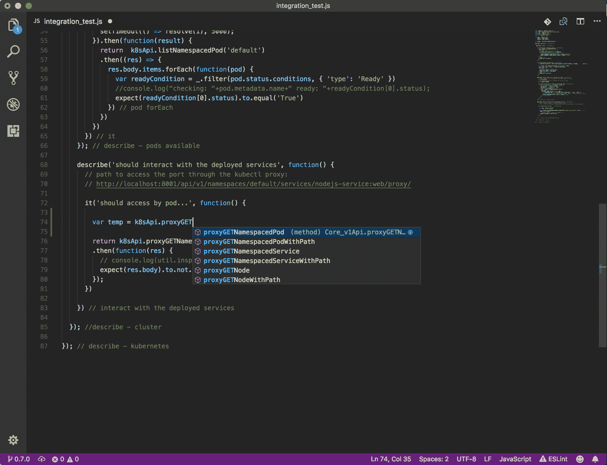
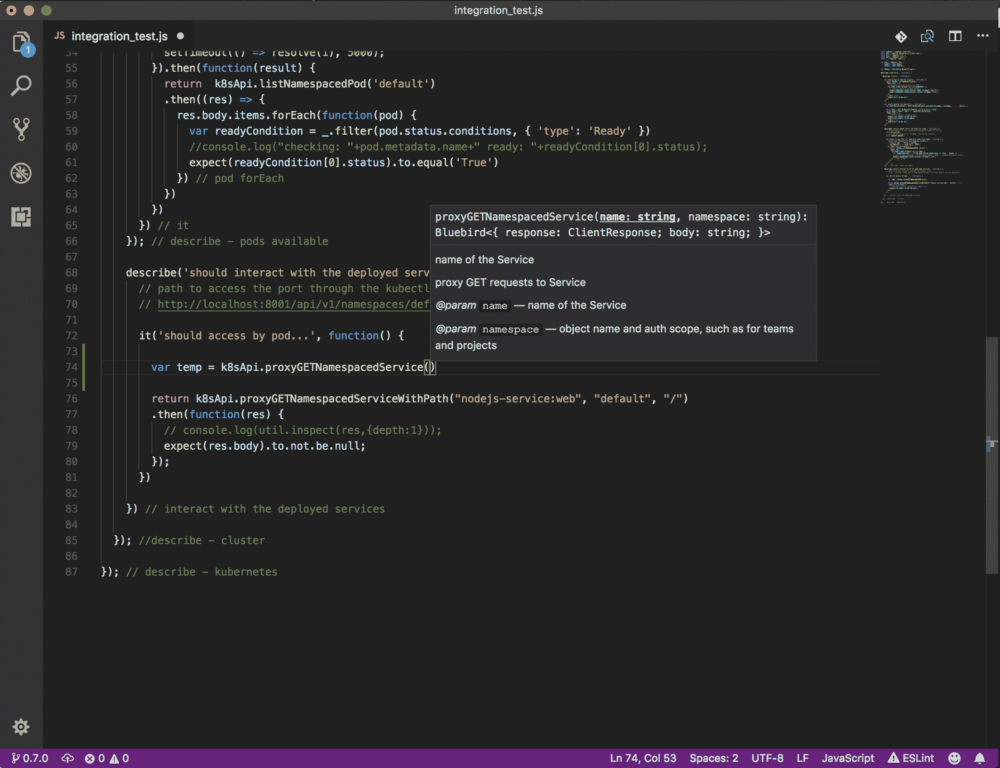
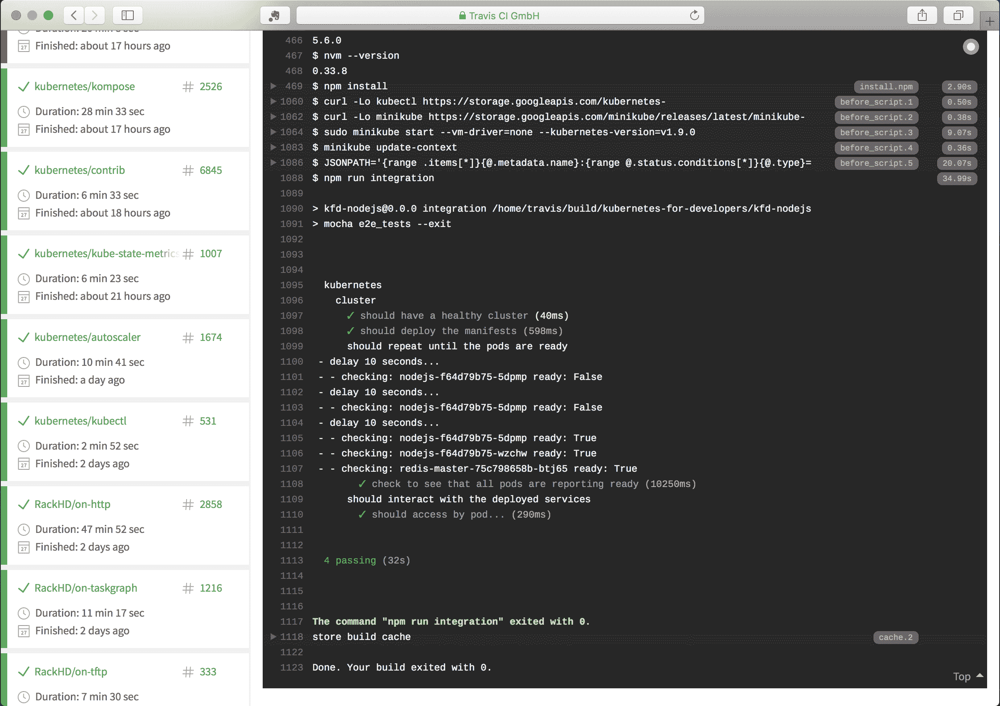
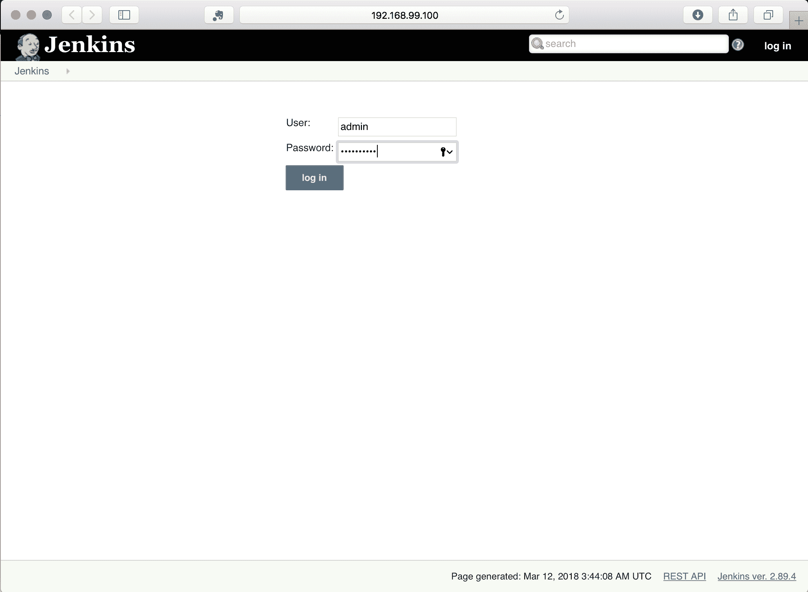
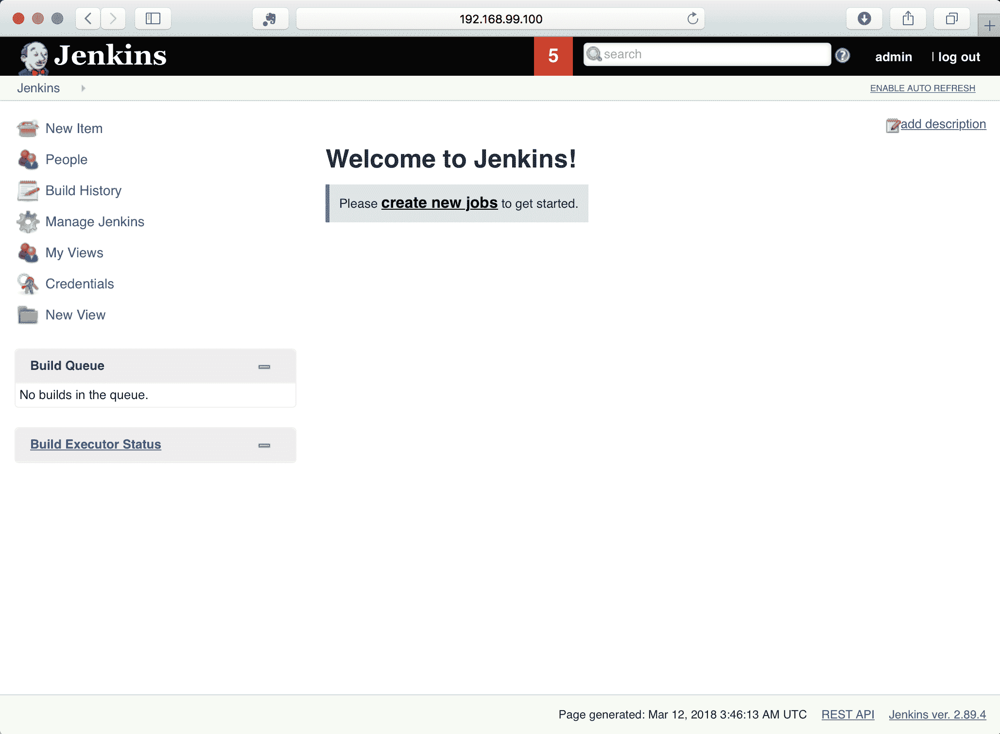
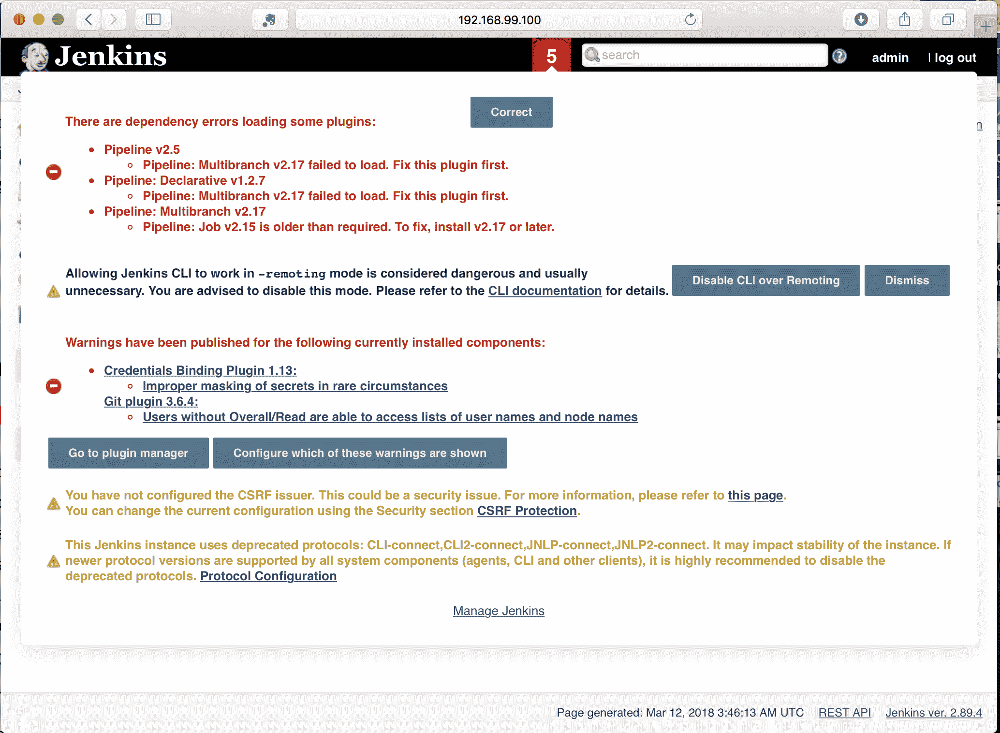
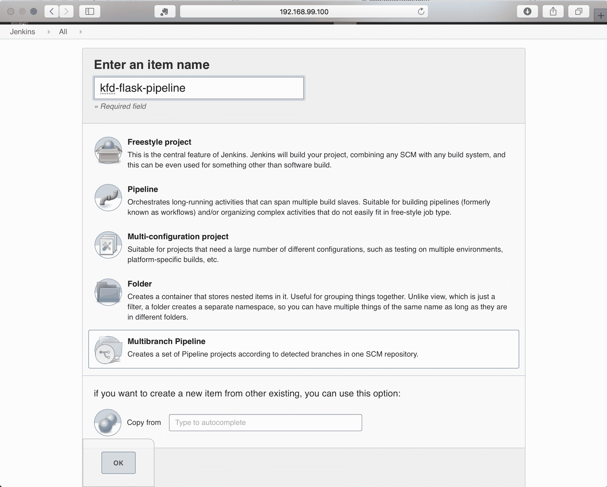
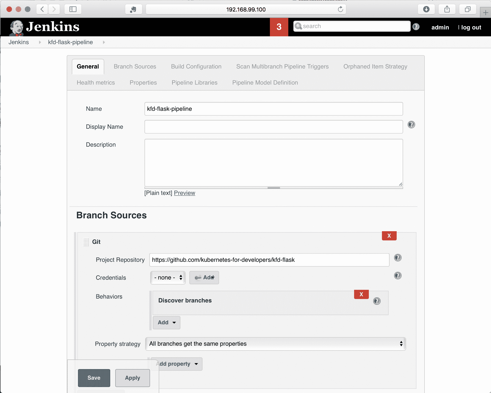
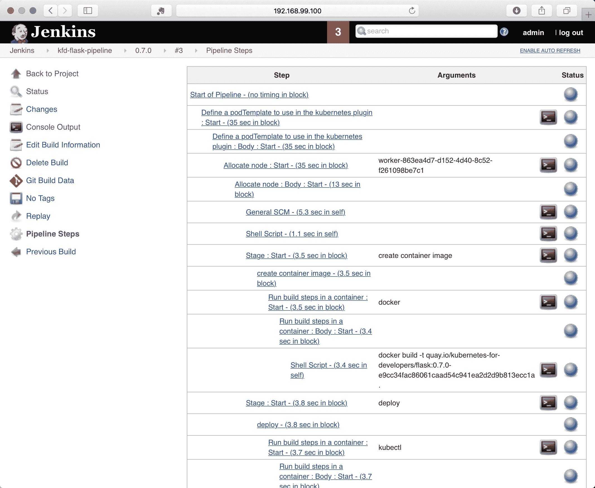

# 集成测试

到目前为止，我们已经回顾了如何在 Kubernetes 中运行您的代码和描述您的服务。我们还研究了如何利用额外的工具来获取关于代码如何在每个 pod 和聚合上运行的信息。本章以此为基础，研究如何使用 Kubernetes 来验证您的代码，并举例说明完成该测试的不同方法，以及如何利用 Kubernetes 进行验证测试的建议。

本章的主题包括:

*   使用 Kubernetes 测试策略
*   使用 Bats 进行简单验证
*   示例–用 Python 测试代码
*   示例–使用 Node.js 测试代码
*   与 Kubernetes 持续集成

# 使用 Kubernetes 测试策略

在软件工程的开发和验证过程中，有各种各样的测试。在这个分类中，有一些测试非常好地利用了 Kubernetes 的优势。与测试相关的术语可能是模糊和混乱的，所以为了清楚起见，我们将简要回顾一下我将使用的术语以及这些类型的测试之间的区别。这些主题还有很多变体，我在这里没有详细介绍，但是为了描述 Kubernetes 最有效的地方，这个列表就足够了:

*   **单元测试**:单元测试是测试的*最低等级*；这侧重于应用程序中的接口、实现和模块。单元测试经常意味着只对测试关注的组件进行隔离测试。这些测试通常旨在非常快速、容易地直接在开发人员的系统上运行，并且通常无法访问相关代码可能依赖的外部服务。这些测试通常不处理状态或持久性，主要关注业务逻辑和接口验证。

*   **功能测试**:功能测试是单元测试的下一步，这意味着代码库是针对它们的底层系统使用的，没有假货、模型或其他层，否则这些层会假装像远程依赖。这些类型的测试通常应用于服务的子集，测试和验证完整的服务，并使用直接依赖关系(通常是数据库或持久性存储)。功能测试通常意味着对持久性存储中的状态进行验证，以及这种验证如何随着代码的操作而改变。

*   **集成测试**:集成测试将软件所有需要的部分组装在一起，验证单个组件以及组件之间的相互作用。系统的状态通常被定义或设置为集成测试中的关键设置，并且因为状态在系统中被表示和验证，所以测试倾向于有序和更线性的，通常使用合成的交互来验证代码及其工作方式(以及如何失败)。

功能测试和集成测试之间有一条模糊的界线，前者通常集中在被验证的整体服务的一个子集上，而后者同时代表大部分或者你的服务或者整个系统。

*   **端到端测试**:在集成测试可能意味着测试系统的一部分的地方，端到端测试特定于意味着测试和验证整个系统及其所有依赖关系。通常，端到端测试和集成测试是同义的。

*   **性能测试**:之前的术语关注的是代码和与之交互的任何底层依赖项之间的验证范围，性能测试关注的是验证的类型而不是范围。这些测试旨在衡量代码和服务的效率或利用率；它们利用了多少 CPU 和内存，以及它们对给定的一组底层资源的响应速度。他们关注的不是代码的正确性，而是规模和底层服务需求的验证。性能测试经常要求相关系统不仅可以运行，而且要有足够的资源来提供准确的结果，并且在运行时要有一定程度的预期隔离，这样外部资源限制就不会人为地限制结果。

*   **交互/探索性测试**:交互测试，有时也被称为探索性测试，与其说是一个关于范围的术语，不如说是一个隐含意图的术语。这些类型的测试通常要求系统的至少一部分是可操作的，并且如果不扩展以支持高水平的请求，通常意味着整个系统是可操作的。这些测试侧重于让人们在没有任何预定义的或结构化的事件流的情况下与系统交互，这种相同的设置通常用于验收验证或其他类型测试的细化，作为验证测试本身的一种手段。

# 审查测试所需的资源

当我们完成这个测试分类时，运行测试所需的计算资源和时间通常会增长，变得更加重要。根据正在开发的软件的范围，很可能需要比单台机器更多的资源。在较低层次的测试通常可以被优化以利用计算机中所有可能的资源的情况下，端到端测试的序列化性质在验证过程中往往效率较低且更耗时。

在建立测试时，您需要了解验证软件所需的计算资源的大小。这可以对应于确定给定 pod 需要多少内存和 CPU 的过程，并扩展到需要根据您正在测试和想要实现的目标来了解所有依赖项的所有资源。

Where we have been using Minikube for most of these examples, modern development and dependencies can easily exceed the amount of resources you can give to Minikube for its single-node cluster.

在您的测试中使用 Kubernetes 是最有效的，当您想要设置和使用与集成测试和测试场景相对应的大部分环境时，集成测试和测试场景期望完整的系统具有可操作的所有依赖关系。

当然，您可以在开发过程中使用 Kubernetes，在 Kubernetes 中运行单元测试或功能测试等测试，尽管当您更多地关注集成、端到端以及前面概述的分类法的后期部分时，您可能会发现利用 Kubernetes 的好处要多得多。

因为 Kubernetes 擅长描述服务的期望状态并保持它们运行，所以它可以非常有效地用于您想要设置大部分或许多服务一起交互的地方。此外，在您期望测试花费更多时间和资源的地方，Kubernetes 非常适合，因为它要求您将代码锁定在离散的版本化容器中，这也可能花费大量时间和处理。

# 测试中使用 Kubernetes 的模式

使用 Kubernetes 进行测试的方法有很多种，首先需要确定的一件事是您在哪里运行正在测试的系统，以及您在哪里运行将验证该系统的测试。

# 在 Kubernetes 测试本地和系统测试

最常见的模式，尤其是在开发测试时，是从您的开发机器上对运行在 Kubernetes 中的代码运行测试。在您创建测试之后，可以使用相同的模式对一个 Kubernetes 集群运行您的测试，该集群包含来自连续集成服务的代码。当您开始开发时，您可能能够在本地开发机器上使用 Minikube 运行所有这些。总的来说，这种模式是一种很好的开始方式，它通过在您希望获得反馈的地方运行测试来解决从测试中获得反馈的问题——要么在您自己的开发系统上，要么从代表您的 CI 系统中。

# 在 Kubernetes 命名空间中测试本地和系统测试

如果您正在测试的系统超出了 Minikube 所能支持的范围，或者可能在什么时候，常见的解决方案是开始使用远程集群，由您、您的 IT 团队或云提供商管理。当您开始使用远程计算来做到这一点时，共享和隔离变得很重要，特别是对于依赖于系统状态的测试，在这些测试中，对状态的控制对于了解验证是否正确至关重要。Kubernetes 通常具有良好的隔离性，利用名称空间的工作方式可以使代码的设置和测试变得更加容易。您可以通过在单个名称空间中运行相关的 pods 和服务来利用名称空间，并通过利用每个服务的短 DNS 名称在它们之间进行一致的引用。这可以被可视化为一个堆栈，您可以在其中并行有效地部署许多这样的堆栈。在早期的模式中，以及在本书的大多数示例中，我们使用了默认的名称空间，但是所有的命令都可以包含一个名称空间作为选项，只需在 kubectl 命令上添加`-n <namespace>`。

Namespaces support quotas for a variety of resources, and you will want to see what is defined and validate that you have sufficient allowances set up. Especially in shared environments, using Quota to put a cap on consumption is common.

# Kubernetes 中的测试和 Kubernetes 命名空间中的系统测试

主题的一个变体是在 Kubernetes 中打包和运行您的测试——或者在同一个命名空间中，或者在与您的测试系统不同的命名空间中。这比在本地运行测试要慢，因为它需要您将测试打包到一个容器中，就像您处理代码一样。代价是有一种非常一致的方法来运行这些测试并与被测系统交互。

如果您在一个非常多样化的开发环境中工作，每个人都有稍微不同的设置，那么这个模式可以巩固测试，这样每个人都有相同的体验。此外，当本地测试需要通过公开的服务访问远程 Kubernetes 时(例如使用 Minikube 的 NodePort，或者可能是提供程序上的`LoadBalancer`)，您可以通过使用服务名来简化这种访问，服务名可以在同一个名称空间中，也可以使用包含名称空间的更长的服务名。

在 Kubernetes 中运行测试的另一个挑战是获得结果。虽然收集结果并将其发布到远程位置是很有可能的，但这种模式并不常见。使用这种模式时，一个更常见的解决方案是让一个集群专用于测试，该集群还包括一些连续的集成基础设施，或者作为集群的一部分，或者与集群并行并具有对集群的专用访问，然后作为测试自动化的一部分运行测试并捕获结果。我们将在本章后面更深入地研究持续集成。

# 使用 Bats 进行简单验证

一个相当常见的愿望是简单地部署所有的东西，并进行一些查询来验证结果系统是可操作的。当您执行这些操作时，它们经常被捕获在 Makefiles 或 shell 脚本中，作为验证功能基线的简单程序。几年前，开发了一个名为 Bats 的系统，它代表 Bash 自动化测试系统，使得使用 shell 脚本运行测试稍微方便一些。

有几个使用 Bats 测试部署在 Kubernetes 的系统的例子。测试通常简单易懂，易于扩展和使用。你可以在 Bats 的 GitHub 主页[https://github.com/sstephenson/bats](https://github.com/sstephenson/bats)找到更多关于 Bats 的信息。您可能还会看到 Bats 在一些与 Kubernetes 相关的项目中使用，用于简单的验证。

Bitnami 已经建立了一个示例 GitHub 存储库，作为使用 Bats 和 Minikube 的起点，并被设计为也与 Travis.CI 等外部 CI 系统一起工作。您可以在[https://github.com/bitnami/kubernetes-travis](https://github.com/bitnami/kubernetes-travis)找到该示例。

如果您利用 Bats，您将希望有助手脚本来设置您的部署，并等待相关部署报告就绪，或者在设置时测试失败。在 Bitnami 示例中，脚本`cluster_common.bash`和`libtest.bash`具有这些辅助函数。如果您想使用这个路径，您可以从它们的存储库中的文件开始，并更新和扩展它们以满足您的需求。

集成测试从加载库和创建本地集群开始，然后部署测试中的系统:

```
# __main__ () {
. scripts/cluster_common.bash
. scripts/libtest.bash
# Create the 'minikube' or 'dind' cluster
create_k8s_cluster ${TEST_CONTEXT}
# Deploy our stack
bats tests/deploy-stack.bats
```

`deploy-stacks.bats`可以表示为 Bats 测试，在 Bitnami 示例中，它验证了 Kubernetes 工具都是在本地定义的，然后将部署本身封装为测试:

这是来自[https://github . com/bitnami/kubernetes-Travis/blob/master/tests/deploy-stack . bats](https://github.com/bitnami/kubernetes-travis/blob/master/tests/deploy-stack.bats)的例子:

```
# Bit of sanity
@test "Verify needed kubernetes tools installed" {
 verify_k8s_tools
}
@test "Deploy stack" {
# Deploy the stack we want to test
./scripts/deploy.sh delete >& /dev/null || true
./scripts/deploy.sh create
   k8s_wait_for_pod_running --namespace=kube-system -lname=traefik-ingress-lb
   k8s_wait_for_pod_running -lapp=my-nginx
}
```

脚本`deploy.sh`被设置为通过使用`kubectl create`、`kubectl delete`或`kubectl apply`命令来删除或创建和加载清单，就像我们在本书前面所做的那样。

一旦完成，集成测试将继续访问集群。在 Bitnami 示例中，他们使用 Kubernetes Ingress 一致地访问集群，并设置了脚本来捕获和返回用于通过`Ingress`访问底层系统的 IP 地址和 URL 路径。你也可以利用`kubectl port-forward`或`kubectl proxy`，正如我们在本书前面所展示的:

```
# Set env vars for our test suite
# INGRESS_IP: depend on the deployed cluster (dind or minikube)
INGRESS_IP=$(get_ingress_ip ${TEST_CONTEXT})
# URL_PATH: Dynamically find it from 1st ingress rule
URL_PATH=$(kubectl get ing -ojsonpath='{.items[0].spec.rules[0].http.paths[0].path}')
# Verify no empty vars:
: ${INGRESS_IP:?} ${URL_PATH:?}
```

设置好之后，就可以使用 Bats 再次调用集成测试，并捕获整个过程的退出代码，用于反映测试是成功还是失败:

```
# With the stack ready, now run the tests thru bats:
export SVC_URL="http://my-nginx.default.svc${URL_PATH:?}"
export ING_URL="${INGRESS_IP:?}${URL_PATH:?}"
bats tests/integration-tests.bats
exit_code=$?

[[ ${exit_code} == 0 ]] && echo "TESTS: PASS" || echo "TESTS: FAIL"
exit ${exit_code}
# }
```

虽然这很容易上手，但是在 bash 中编程很快就成为它自己的专长，虽然 bash 的基本用法很常见，也很容易理解，但是该示例中的一些更复杂的助手可以进行一些挖掘来完全理解。

If you are having trouble with a shell script, then a common debugging solution is to add `set -x` near the top of the script. Within bash, this turns on a command echo, so that all the commands within the script are echoed to standard out so that you can see what is happening.

一个好的模式是用你熟悉的语言编写测试。您可以经常利用这些语言的测试框架来帮助您。您可能仍然希望使用像 Bitnami 示例这样的外壳脚本来设置代码并将其部署到集群中，并使用您更熟悉的语言的逻辑和结构进行测试。

# 示例–使用 Python 进行集成测试

就 Python 而言，这里的示例代码使用 PyTest 作为测试框架。示例代码可以在 GitHub 上找到，在存储库的 0.7.0 分支[https://github.com/kubernetes-for-developers/kfd-flask/](https://github.com/kubernetes-for-developers/kfd-flask/)。

您可以使用以下命令下载该示例:

```
git clone https://github.com/kubernetes-for-developers/kfd-flask/ -b 0.7.0
```

在示例中，我按照 PyTest 中推荐的模式，更改了代码结构，将应用程序本身的所有 Python 代码移动到`src`目录下。如果您以前没有使用过 PyTest，那么在[https://docs.pytest.org/en/latest/goodpractices.html](https://docs.pytest.org/en/latest/goodpractices.html)回顾他们的最佳实践是非常值得的。

如果您查看或下载代码，您还会注意到一个新文件`test-dependencies.txt`，它定义了许多特定于测试的依赖项。Python 没有一个清单，在这个清单中，它们将生产依赖项与开发或测试期间使用的依赖项分开，所以我自己将依赖项分开:

```
pytest
pytest-dependency
kubernetes
requests
```

实际的集成测试位于目录`e2e_tests`下，主要是作为一种模式，让您拥有一个本地目录，用于您想要在正常开发期间创建的任何单元或功能测试。

我在这个例子中使用的模式是利用我们在 Kubernetes 中的代码，并利用 Minikube 在集群外部访问它。如果您的环境需要比本地开发机器更多的资源，同样的模式可以很好地与 AWS、Google 或 Azure 中托管的集群一起工作。

`e2e_tests`中的`README`文件显示了如何运行测试的示例。我利用`pip`和`virtualenv`设置本地环境，安装依赖项，然后使用 PyTest 直接运行测试:

```
virtualenv .venv
source .venv/bin/activate
pip3 install -r test-requirements.txt
pytest -v
```

如果您运行这些测试，您应该会看到类似于以下内容的输出:

```
======= test session starts =======
platform darwin -- Python 3.6.4, pytest-3.4.2, py-1.5.2, pluggy-0.6.0 -- /Users/heckj/src/kfd-flask/e2e_tests/.venv/bin/python3.6
cachedir: .pytest_cache
rootdir: /Users/heckj/src/kfd-flask/e2e_tests, inifile:
plugins: dependency-0.3.2
collected 7 items

tests/test_smoke.py::test_kubernetes_components_healthy PASSED [ 14%]
tests/test_smoke.py::test_deployment PASSED [ 28%]
tests/test_smoke.py::test_list_pods PASSED [ 42%]
tests/test_smoke.py::test_deployment_ready PASSED [ 57%]
tests/test_smoke.py::test_pods_running PASSED [ 71%]
tests/test_smoke.py::test_service_response PASSED [ 85%]
tests/test_smoke.py::test_python_client_service_response PASSED [100%]

======= 7 passed in 1.27 seconds =======
```

PyTest 包含大量插件，包括一种以 JUnit XML 格式导出测试结果的方法。您可以通过使用`--junitxml`选项调用 PyTest 创建这样的报告:

```
pytest --junitxml=results.xml
```

这些测试中的代码利用了我们到目前为止构建的示例:我们的部署 YAML 和我们用存储库中的代码制作的图像。测试做了一个简单的验证，即集群是可用的和健康的(并且我们可以与之通信)，然后使用`kubectl`来部署我们的代码。然后，在继续与服务交互并获得简单响应之前，它会等待，直到代码部署完毕，并定义了最大超时。

这个例子主要是向您展示如何与远程 Kubernetes 集群交互，包括使用`python-kubernetes`客户端库。

# PyTest 和 PyTest-依赖

PyTest 首先是一个单元测试框架。单元测试框架通常有不同于集成测试的需求，幸运的是 PyTest 有一种方法允许开发人员指定一个测试需要在另一个测试之前运行和完成。这是通过`pytest-dependency`插件完成的。在代码中，您将看到一些用依赖标记注释的测试用例。要使用这个插件，您需要定义哪些测试可以作为依赖目标，对于任何需要在它之后运行的测试，您需要定义它们所依赖的测试:

```
@pytest.mark.dependency()
def test_kubernetes_components_healthy(kube_v1_client):
    # iterates through the core kuberneters components to verify the cluster is reporting healthy
    ret = kube_v1_client.list_component_status()
    for item in ret.items:
        assert item.conditions[0].type == "Healthy"
        print("%s: %s" % (item.metadata.name, item.conditions[0].type))
```

该测试检查以验证群集是否可访问以及响应是否正常。这个测试不依赖于任何其他测试，所以它只有基本的注释，进一步的测试将指定这个测试需要在运行之前完成，带有这个注释:

```
@pytest.mark.dependency(depends=["test_kubernetes_components_healthy"])
```

这可以使测试注释相当冗长，但是允许您显式地定义执行的顺序。默认情况下，大多数单元测试框架不保证特定的顺序或执行，当您测试包含状态和状态变化的系统时，这可能是至关重要的——这正是我们对集成测试所做的。

# PyTest 设备和 python-kubernetes 客户端

前面的例子还利用了一个简单的文本夹具，为我们提供了一个 Python Kubernetes 客户端实例来与集群进行交互。Python 客户端可能很难使用，因为它是从 OpenAPI 规范生成的，并且为每个 API 端点都有类设置，其中有几个。特别是，随着 Kubernetes API 的各个部分在 alpha、beta 和最终发布阶段的发展，这些 API 端点将会移动，这意味着当您升级与您交互的 Kubernetes 集群的版本时，您正在使用的客户端代码可能需要更改。

`python-kubernetes`客户端确实附带了现成的源代码和所有方法的生成索引，如果您要使用该客户端，我建议您随身携带。代码存储在[https://github.com/kubernetes-client/python](https://github.com/kubernetes-client/python)中，版本存储在分支机构中。我使用的版本是 5.0，它与 Kubernetes 版本配对，并支持早期版本。包含 OpenAPI 生成的方法的所有文档的`README`可在[上获得。](https://github.com/kubernetes-client/python/blob/release-5.0/kubernetes/README.md)

PyTest 夹具为其他测试设置客户端:

```
@pytest.fixture
def kube_v1_client():
    kubernetes.config.load_kube_config()
    v1 = kubernetes.client.CoreV1Api()
    return v1
```

在这种情况下，客户端加载本地可用的`kubeconfig`来访问集群。根据您的开发环境，您可能希望研究向集群进行身份验证的替代方案。

虽然可以使用 python-kubernetes 客户端进行部署，但该示例显示了如何使用本地`kubectl`命令行与集群进行交互。在这种情况下，它比定义您想要在 Python 中部署的内容的完整定义少得多:

```
@pytest.mark.dependency(depends=["test_kubernetes_components_healthy"])
def test_deployment():
    # https://docs.python.org/3/library/subprocess.html#subprocess.run
    # using check=True will throw an exception if a non-zero exit code is returned, saving us the need to assert
    # using timeout=10 will throw an exception if the process doesn't return within 10 seconds
    # Enables the deployment
    process_result = subprocess.run('kubectl apply -f ../deploy/', check=True, shell=True, timeout=10)
```

如果您想利用其他工具来部署您的代码，这种机制可能是非常宝贵的，并且在编写集成测试时总是一个有用的后备方案。还要注意，这个测试依赖于我们前面提到的测试，强制它在集群健康验证测试之后运行。

Be aware that debugging these commands when the system fails can be more difficult, because so much is happening outside of the actual test with commands like these. You will want to be aware of what process is invoking the test, its permissions relative to your environment, and so forth.

# 等待状态变化

在部署之后，我们期望部署和服务都变得活跃，但是这不会立即发生。根据您的环境，这可能发生得很快，或者相当慢。集成测试的危害是无法知道什么时候完成了什么，并且通过调用`sleep()`来解决这个问题，以便等待更长的时间。在这个例子中，我们明确地检查状态，而不仅仅是等待任意的时间，并希望系统准备就绪:

```
@pytest.mark.dependency(depends=["test_deployment_ready"])
def test_pods_running(kube_v1_client):
    TOTAL_TIMEOUT_SECONDS = 300
    DELAY_BETWEEN_REQUESTS_SECONDS = 5
    now = time.time()
    while (time.time() < now+TOTAL_TIMEOUT_SECONDS):
        pod_list = kube_v1_client.list_namespaced_pod("default")
        print("name\tphase\tcondition\tstatus")
        for pod in pod_list.items:
            for condition in pod.status.conditions:
                print("%s\t%s\t%s\t%s" % (pod.metadata.name, pod.status.phase, condition.type, condition.status))
                if condition.type == 'Ready' and condition.status == 'True':
                    return
        time.sleep(DELAY_BETWEEN_REQUESTS_SECONDS)
    assert False
```

该示例的最大超时时间为`300`秒，以使部署变为活动状态，并且在请求环境状态时会有短暂的延迟，然后才会继续。如果超过总的超时时间，测试将报告失败-通过使用`pytest-dependency`，所有依赖于此的以下测试将不会运行-短路测试过程以报告失败。

# 访问部署

最后两个测试突出了与集群中运行的代码进行交互的两种方式。

第一个示例期望设置并运行一些东西，提供对测试之外的集群的访问，并且简单地使用 Python `requests`库直接发出 HTTP 请求:

```
@pytest.mark.dependency(depends=["test_deployment_ready"])
def test_service_response(kubectl_proxy):
    NAMESPACE="default"
    SERVICE_NAME="flask-service"
    URI = "http://localhost:8001/api/v1/namespaces/%s/services/%s/proxy/" % (NAMESPACE, SERVICE_NAME)
    print("requesting %s" % (URI))
    r = requests.get(URI)
    assert r.status_code == 200
```

这是一个难以置信的基本测试，相当脆弱。它使用代码前面定义的 PyTest 夹具来设置`kubectl proxy`的调用，以提供对集群的访问:

```
@pytest.fixture(scope="module")
def kubectl_proxy():
    # establish proxy for kubectl communications
    # https://docs.python.org/3/library/subprocess.html#subprocess-replacements
    proxy = subprocess.Popen("kubectl proxy &", stdout=subprocess.PIPE, shell=True)
    yield
    # terminate the proxy
    proxy.kill()
```

虽然这通常是可行的，但当事情失败时，追踪问题就更难了，而且 fixture 机制在分叉 shell 命令中设置(和拆除)代理调用时并不完全可靠。

第二个示例使用 python-kubernetes 客户端通过一系列方法访问服务，这些方法允许您通过 kubernetes 附带的代理轻松调用 HTTP 请求。客户端配置负责对集群进行身份验证，您通过代理直接利用客户端而不是使用外部代理来访问代码:

```
@pytest.mark.dependency(depends=["test_deployment_ready"])
def test_python_client_service_response(kube_v1_client):
    from pprint import pprint
    from kubernetes.client.rest import ApiException
    NAMESPACE="default"
    SERVICE_NAME="flask-service"
    try:
        api_response = kube_v1_client.proxy_get_namespaced_service(SERVICE_NAME, NAMESPACE)
        pprint(api_response)
        api_response = kube_v1_client.proxy_get_namespaced_service_with_path(SERVICE_NAME, NAMESPACE, "/metrics")
        pprint(api_response)
    except ApiException as e:
        print("Exception when calling CoreV1Api->proxy_get_namespaced_service: %s\n" % e)
```

如果您不需要篡改标头或以其他方式使您的 HTTP 请求变得复杂，这种机制是很好的，这在使用通用 Python 客户端(如`requests`)时更容易访问。有一系列支持各种 HTTP/REST 风格调用的方法，所有调用都以`proxy`为前缀:

*   `proxy_get`
*   `proxy_delete`
*   `proxy_head`
*   `proxy_options`
*   `proxy_patch`
*   ``proxy_put``

每个端点都映射到以下端点:

*   `namespaced_pod`
*   `namespaced_pod_with_path`
*   `namespaced_service`
*   `namespaced_service_with_path`

这为您提供了一些灵活性，标准的 REST 命令可以直接发送到 pod，也可以发送到服务端点。`with_path`选项允许您定义在吊舱或服务上与您交互的特定 URI。

# 示例–使用 Node.js 进行集成测试

Node.js 示例使用摩卡、chai、supertest 和 JavaScript kubernetes 客户端，其方式与 Python 示例非常相似。示例代码可以在 GitHub 上找到，位于知识库的 0.7.0 分支[https://github.com/kubernetes-for-developers/kfd-nodejs/](https://github.com/kubernetes-for-developers/kfd-nodejs/)。

您可以使用以下命令下载该示例:

```
git clone https://github.com/kubernetes-for-developers/kfd-nodejs/ -b 0.7.0
```

我利用 Node.js 的机制将开发依赖与生产依赖分开，并将这些依赖中的大部分添加到`package.json`中。我还直接在`test`目录中设置了一个简单的单元测试，并在`e2e-tests`目录中设置了一个单独的集成测试。我还设置了命令，以便您可以通过`npm`运行这些测试:

```
npm test
```

对于单元测试，代码在本地运行，并利用`supertest`在本地机器上访问 JavaScript 运行时内的所有内容。这不考虑任何远程服务或系统(例如与依赖 Redis 的端点交互):

```
> kfd-nodejs@0.0.0 test /Users/heckj/src/kfd-nodejs
> mocha --exit

express app
GET / 200 283.466 ms - 170
 ✓ should respond at the root (302ms)
GET /probes/alive 200 0.930 ms - 3
 ✓ should respond at the liveness probe point

 2 passing (323ms)
```

在`e2e_tests`目录中，有一个 Python 测试的模拟，它验证集群是可操作的，设置部署，然后访问该代码。这可以通过以下命令调用:

```
npm run integration
```

调用测试将向您展示类似于以下内容的内容:

```
> kfd-nodejs@0.0.0 integration /Users/heckj/src/kfd-nodejs
> mocha e2e_tests --exit

kubernetes
 cluster
 ✓ should have a healthy cluster
 ✓ should deploy the manifests (273ms)
 should repeat until the pods are ready
 - delay 5 seconds...
 ✓ check to see that all pods are reporting ready (5016ms)
 should interact with the deployed services
 ✓ should access by pod...

 4 passing (5s)
```

# Node.js 测试以及与 mocha 和 chai 的依赖关系

测试代码本身在`e2e_tests/integration_test.js`处，我利用摩卡和 chai 以 BDD 风格的结构布局测试。摩卡和柴的 BDD 结构的一个方便的副作用是测试可以被`describe`和`it`所包裹，这两个结构决定了测试如何运行。`describe`块中的任何东西都没有保证顺序，但是您可以嵌套`describe`块来获得您想要的结构。

# 验证群集运行状况

JavaScript Kubernetes 客户端的生成方式与 Python 客户端非常相似，都来自 OpenAPI 定义，并映射到 Kubernetes 的版本。您可以在[https://github.com/kubernetes-client/javascript](https://github.com/kubernetes-client/javascript)找到该客户端，尽管该存储库没有与 Python 客户端相同级别的生成文档。相反，开发人员在一定程度上反映了客户端的 TypeScript 中的类型，这使得编辑器和 IDEs 能够在您编写测试时进行某种程度的自动代码完成:

```
const k8s = require('@kubernetes/client-node');
var chai = require('chai')
 , expect = chai.expect
 , should = chai.should();

var k8sApi = k8s.Config.defaultClient();

describe('kubernetes', function() {
  describe('cluster', function() {
    it('should have a healthy cluster', function() {
       return k8sApi.listComponentStatus()
       .then((res) => {
         // console.log(util.inspect(res.body));
         res.body.items.forEach(function(component) {
         // console.log(util.inspect(value));
         expect(component.conditions[0].type).to.equal("Healthy");
         expect(component.conditions[0].status).to.equal("True");
       })
     }, (err) => {
        expect(err).to.be.null;
     });
   }) // it
```

代码的嵌套会使得在正确的级别进行缩进和跟踪变得非常棘手，因此测试代码利用承诺来简化回调结构。前面的示例使用了一个 Kubernetes 客户端，它会自动从运行它的环境中获取凭据，这是其中几个客户端的一个特性，因此如果您希望安排特定的访问，请注意这一点。

在 Python 客户端有一个方法`list_component_status`的地方，JavaScript 模式将名称和 CamelCase 格式放在一起，所以这里同样的调用是`listComponentStatus`。结果随后以承诺的形式传递，我们迭代各个元素来验证集群组件都报告健康。

这个例子留下了一些检查返回的对象的注释代码。在几乎没有外部文档的情况下，我发现在开发测试时查看返回的内容很方便，常见的技巧是使用`util.inspect`功能并将结果记录到`STDOUT`:

```
const util = require('util');
console.log(util.inspect(res.body));
```

# 使用 kubectl 部署

遵循 Python 示例，我在命令行上使用`kubectl`来部署代码，从集成测试中调用它:

```
it('should deploy the manifests', function() {
  var manifest_directory = path.normalize(path.join(path.dirname(__filename), '..', '/deploy'))
  const exec = util.promisify(require('child_process').exec);
  return exec('kubectl apply -f '+manifest_directory)
  .then((res) => {
    // console.log(util.inspect(res));
    expect(res.stdout).to.not.be.null;
    expect(res.stderr).to.be.empty;
  }, (err) => {
    expect(err).to.be.null;
  })
})
```

这段特殊的代码取决于测试用例的位置以及它与存储清单的部署目录的相对目录，就像前面的例子一样，它使用承诺来链接调用执行的验证。

# 等待吊舱变得可用

使用 Node.js、promises 和回调时，等待和重试的过程要复杂得多。在这种情况下，我利用了 mocha 测试库的功能来允许重试测试，并操纵测试结构的一部分的总超时，以获得相同的最终结果:

```
describe('should repeat until the pods are ready', function() {
  // Mocha supports a retry mechanism limited by number of retries...
  this.retries(30);
  // an a default timeout of 20,000ms that we can increase
  this.timeout(300000);

it('check to see that all pods are reporting ready', function() {
   return new Promise(function(resolve, reject) {
       console.log(' - delay 5 seconds...')
       setTimeout(() => resolve(1), 5000);
   }).then(function(result) {
       return k8sApi.listNamespacedPod('default')
      .then((res) => {
         res.body.items.forEach(function(pod) {
           var readyCondition = _.filter(pod.status.conditions, { 'type': 'Ready' })
          //console.log("checking: "+pod.metadata.name+" ready: "+readyCondition[0].status);
          expect(readyCondition[0].status).to.equal('True')
        }) // pod forEach
    })
  })
}) // it

}) // describe pods available
```

通过在测试中返回承诺，每一个测试都已经与摩卡提供的预设超时`20`秒不同步。在每个`describe`中，你可以调整摩卡如何运行测试——在这种情况下，将总超时设置为 5 分钟，并声明测试最多可以重试`30`次。为了降低检查迭代的速度，我还加入了一个超时承诺，在调用集群检查以获得 pod 运行状况之前，它只引入了五秒钟的延迟。

# 与部署交互

与部署交互的代码比 Python 示例更简单，利用了 Kubernetes 客户端和代理:

```
describe('should interact with the deployed services', function() {
  // path to access the port through the kubectl proxy:
  // http://localhost:8001/api/v1/namespaces/default/services/nodejs-service:web/proxy/
 it('should access by pod...', function() {
   return k8sApi.proxyGETNamespacedServiceWithPath("nodejs-service:web", "default", "/")
   .then(function(res) {
      // console.log(util.inspect(res,{depth:1}));
      expect(res.body).to.not.be.null;
    });
  })
}) // interact with the deployed services
```

在这个分支中，我将运行的代码从有状态集更改为部署，因为获得对无头端点的代理访问被证明是复杂的。通过 DNS 可以很容易地从集群内部访问状态集，但是在当前的客户端代码中似乎不容易支持映射到外部。

像 Python 代码一样，有一个通过客户端发出 REST 风格请求的调用矩阵:

*   `proxyGET`
*   `proxyDELETE`
*   `proxyHEAD`
*   `proxyOPTIONS`
*   `proxyPATCH`
*   `proxyPUT`

每个都映射到端点:

*   `namespacedPod`
*   `namespacedPodWithPath`
*   `namespacedService`
*   `namespacedServiceWithPath`

这为您提供了一些灵活性，可以将标准的 REST 命令直接发送到 pod 或服务端点。像 Python 代码一样，`withPath`选项允许您定义在 pod 或服务上与之交互的特定 URI。

如果您在编辑器(如 Visual Studio Code)中编写这些测试，代码完成将有助于提供文档中缺少的一些细节。以下是显示`method`选项的代码完成示例:



当您选择一个方法时，TypeScript 注释也可以向您展示 JavaScript 方法期望的选项:



# 与 Kubernetes 持续集成

一旦你有了集成测试，得到一些可操作的东西来验证这些测试是非常重要的。如果你不运行这些测试，它们实际上是无用的——所以在你进行开发的时候，有一个一致调用测试的方法是很重要的。经常可以看到持续集成为开发做了大量的自动化提升。

开发团队有许多选项可以帮助您进行持续集成，甚至更高级的表亲，持续部署。以下工具概述了编写本文时可用的以及开发人员在容器和/或 Kubernetes 中使用的代码:

*   **特拉维斯。CI** :特拉维斯。CI([https://travis-ci.org/](https://travis-ci.org/))是一个托管的持续集成服务，它相当受欢迎，因为该公司提供免费服务，可以轻松插入公共和开源存储库的 GitHub。相当多的开源项目利用了特拉维斯。CI 做基础测试验证。

*   **无人机。IO** :无人机。IO([https://drone.io/](https://drone.io/))是持续集成的托管或本地选项，也是开源软件本身，托管于[https://github.com/drone/drone](https://github.com/drone/drone)。无人机有一个广泛的插件库，包括一个用于 Helm([https://github.com/ipedrazas/drone-helm](https://github.com/ipedrazas/drone-helm))的插件，这使得它对一些使用 Helm 部署软件的开发团队很有吸引力。

*   **git lab**:git lab([https://about.gitlab.com/](https://about.gitlab.com/))是一个开源的源代码控制解决方案，包括持续集成。像无人机一样，它可以在您的本地环境中使用，或者您可以使用托管版本。在以前的选项对源代码控制机制不可知的地方，Gitlab CI 与 Gitlab 紧密绑定，只有当您也愿意使用 Gitlab 时，它才有效地变得有用。

*   **詹金斯**:詹金斯([https://jenkins.io/](https://jenkins.io/))是 CI 解决方案的鼻祖，最初被称为 Hudson，广泛应用于各种环境。詹金斯的托管版本可以通过一些提供商获得，但它主要是一个开源解决方案，您需要自己部署和管理。它有惊人(也许是压倒性的)数量的插件和选项，特别是一个库本内特插件([https://github.com/jenkinsci/kubernetes-plugin](https://github.com/jenkinsci/kubernetes-plugin))，它将让一个 Jenkins 实例在一个库本内特集群中运行它的测试。

*   **Concourse**:Concourse([https://concourse-ci.org/](https://concourse-ci.org/))和 Jenkins 一样，是一个开源项目，而不是托管解决方案，内置于 CloudFoundry 项目中，作为一个一流的概念专注于部署的管道(对于 Jenkins 等一些较老的项目来说，这相对较新)。像无人机一样，它被设置为一个连续的交付管道，是您开发过程中不可或缺的一部分。

# 示例–对特拉维斯使用 Minikube。海峡群岛

前面展示的使用 Bats 运行测试的示例是由 Bitnami 的团队创建的，他们还利用该示例存储库将代码构建和部署到 Travis.CI 上托管和运行的 Minikube 实例中。他们的示例存储库在线于[https://github.com/bitnami/kubernetes-travis](https://github.com/bitnami/kubernetes-travis)，它安装 Minikube 以及其他工具来构建和部署到一个小型 Kubernetes 实例中。

特拉维斯。配置项通过`.travis.yml`文件进行配置，如何配置以及有哪些选项可用的文档在线托管在[https://docs.travis-ci.com](https://docs.travis-ci.com)。特拉维斯。默认情况下，配置项将尝试理解所使用的语言，并将其构建脚本定向到该语言，主要关注为每个请求运行构建并合并到存储库中。

Node.js 示例添加了一个设置并运行当前集成测试的示例`.travis.yml`:

```
language: node_js
node_js:
 - lts/*
cache:
 directories:

 - "node_modules"
sudo: required
services:
 - docker
env:
- CHANGE_MINIKUBE_NONE_USER=true

before_script:
- curl -Lo kubectl https://storage.googleapis.com/kubernetes-release/release/v1.9.0/bin/linux/amd64/kubectl && chmod +x kubectl && sudo mv kubectl /usr/local/bin/
- curl -Lo minikube https://storage.googleapis.com/minikube/releases/latest/minikube-linux-amd64 && chmod +x minikube && sudo mv minikube /usr/local/bin/
- sudo minikube start --vm-driver=none --kubernetes-version=v1.9.0
- minikube update-context
- JSONPATH='{range .items[*]}{@.metadata.name}:{range @.status.conditions[*]}{@.type}={@.status};{end}{end}'; until kubectl get nodes -o jsonpath="$JSONPATH" 2>&1 | grep -q "Ready=True"; do sleep 1; done

script:
- npm run integration
```

在我们的例子中，设置为`nodejs`的键`language`定义了特拉维斯将如何运行的很大一部分。我们定义使用哪个版本的 node . js(`lts/*`)，默认情况下，系统将使用运行`npm test`的`npm`来验证我们的构建。这将运行我们的单元测试，但不会调用我们的集成测试。

您可以通过操作`before_script`和`script`键下的值来扩展测试前发生的事情以及测试使用的内容。在前面的例子中，我们通过从发布的位置下载来预加载`minikube`和`kubectl`，然后前面的例子启动 Minikube 并等待命令`kubectl get nodes`返回肯定的结果。

通过在关键脚本下添加`npm run integration`，我们覆盖了默认的 Node.js 行为，转而运行我们的集成测试。开发该示例时，更新被推送到 0.7.0 分支，该分支作为主存储库的拉请求打开。这些更新的结果被发布到托管解决方案中，可在[https://travis-ci.org/kubernetes-for-developers/kfd-nodejs](https://travis-ci.org/kubernetes-for-developers/kfd-nodejs)获得。例如，以下是显示成功生成的生成页面:



# 后续步骤

这个示例构建没有完成从源到容器再到部署的整个过程。相反，它依赖于预构建的映像，该映像带有在部署清单中设置的标记，在源代码管理中进行管理。特拉维斯。CI 确实包括使用 Docker 构建映像的功能，并且有文档说明如何利用 Docker 在[https://docs.travis-ci.com/user/docker/](https://docs.travis-ci.com/user/docker/)单独测试单个容器。

Travis 还具有存储凭证以构建 Docker 映像并将其推送到映像存储库中的功能，最近还增加了分阶段构建的功能，以便您可以在容器构建中进行管道构建，然后在集成测试中使用它。

您需要更新 Kubernetes 声明来使用所讨论的图像，这个例子没有显示这个过程。启用这种功能的常见模式包括对我们在示例中存储在部署目录中的清单进行模板化，并使用传入的特定变量来呈现它们。

helm([https://docs.helm.sh/](https://docs.helm.sh/))是实现这一需求的一种方法:我们可能有一个`charts`目录，并将清单写成模板，而不是有一个带有清单的`deploy`目录。Helm 使用可以根据需要创建的`values`文件来提供用于渲染模板的变量，在创建带有标签的 Docker 图像后，可以将相同的标签值添加到`values`文件中并用于部署。

另一个选择是一个名为 ksonnet([https://ksonnet . io](https://ksonnet.io))的较新项目，该项目建立在开源库[http://jsonnet.org/](http://jsonnet.org/)的基础上，使一种基于 Kubernetes 原型的可组合模板风格语言可用。ksonnet 相对较新，仍在建立中。使用 Helm，您可以使用 Go 模板，并且在创建图表时需要对该格式有所熟悉。ksonnet 有自己的模板编写风格，你可以在项目网站上找到教程和例子:[https://ksonnet.io/tour/welcome](https://ksonnet.io/tour/welcome)。

# 示例-使用詹金斯和库本内斯插件

虽然不是托管解决方案，但 Jenkins 是最常用的持续集成工具之一。让 Jenkins 的一个实例在 Kubernetes 集群上运行非常简单，由于 Kubernetes 特定的插件，它也可以在 Kubernetes 集群中完成所有的构建。

以这种方式安装詹金斯的最快方法之一是使用 Helm。默认的 Helm 存储库包括一个用于运行 Jenkins 的维护图表，以及使用 Jenkins Kubernetes 插件的配置。我们将使用的图表可在 GitHub 上的[https://GitHub . com/kubernetes/charts/tree/master/stable/Jenkins](https://github.com/kubernetes/charts/tree/master/stable/jenkins)获得。你也可以获得更多关于詹金斯库本内特斯插件的细节，该插件安装在[https://wiki.jenkins.io/display/JENKINS/Kubernetes+Plugin](https://wiki.jenkins.io/display/JENKINS/Kubernetes+Plugin)的图表中。

# 使用 Helm 安装詹金斯

在本例中，我将介绍如何在本地机器上设置并将 Jenkins 安装到 Minikube 集群中，以便进行实验。您可以使用非常类似的过程来安装到任何 Kubernetes 集群中，但是您需要根据您的目标集群进行一些修改。

如果您的笔记本电脑上还没有安装 Helm，您可以按照项目网站上的说明进行安装:[https://docs.helm.sh/using_helm/#installing-helm](https://docs.helm.sh/using_helm/#installing-helm)。一旦您的本地系统上有了命令行客户端，您就可以引导其余部分。

第一步是在集群上安装 Helm 并更新存储库。这是通过运行两个命令来实现的:

```
helm init
```

输出将非常小，显示类似于下面的内容:

```
$HELM_HOME has been configured at /Users/heckj/.helm.

Tiller (the Helm server-side component) has been installed into your Kubernetes Cluster.

Please note: by default, Tiller is deployed with an insecure 'allow unauthenticated users' policy.
For more information on securing your installation see: https://docs.helm.sh/using_helm/#securing-your-helm-installation
Happy Helming!
```

正如上面提到的，Tiller 是 Helm 的服务器端组件，它负责协调从`helm`命令行工具调用的安装。默认情况下，`helm init`会将 Tiller 安装到`kube-system`命名空间中，因此您可以使用以下命令在集群中看到它:

```
kubectl get pods -n kube-system
NAME READY STATUS RESTARTS AGE
coredns-599474b9f4-gh99f 1/1 Running 0 3m
kube-addon-manager-minikube 1/1 Running 0 3m
kubernetes-dashboard-77d8b98585-f4qh9 1/1 Running 0 3m
storage-provisioner 1/1 Running 0 3m
tiller-deploy-865dd6c794-5b9g5 1/1 Running 0 3m
```

一旦进入`Running`状态，最好加载最新的存储库索引。它附带了许多已经安装的图表，但是图表确实会定期更新，这将确保您拥有最新的图表:

```
helm repo update
```

更新过程通常非常快，返回如下内容:

```
Hang tight while we grab the latest from your chart repositories...
...Skip local chart repository
...Successfully got an update from the "stable" chart repository
Update Complete. ⎈ Happy Helming!⎈
```

它提到的`"stable" chart repository`是在 GitHub 上的 Kubernetes 项目中主持的:[https://github.com/kubernetes/charts](https://github.com/kubernetes/charts)。在该存储库中，有一个包含所有图表的`stable`目录。如果您使用`helm search`命令，它将显示一个图表和相关版本的列表，与 GitHub 存储库相匹配。

使用`helm search jenkins`命令将向您显示我们将使用的目标:

```
NAME CHART VERSION APP VERSION DESCRIPTION
stable/jenkins 0.14.1 2.73 Open source continuous integration server. It s...
```

请注意，图表有图表版本以及报告的*应用版本*。许多图表包装了现有的开源项目，这些图表与它们部署的系统分开维护。Kubernetes 项目中`stable`存储库中的图表努力成为如何构建图表的示例，并对整个社区有用。在这种情况下，图表版本为`0.14.1`，据报道正在部署詹金斯版本`2.73`。

您可以使用`helm inspect`命令获取特定图表的更多详细信息，例如:

```
 helm inspect stable/jenkins
```

这将向您显示大量输出，从以下内容开始:

```
appVersion: "2.73"
description: Open source continuous integration server. It supports multiple SCM tools
 including CVS, Subversion and Git. It can execute Apache Ant and Apache Maven-based
 projects as well as arbitrary scripts.
home: https://jenkins.io/
icon: https://wiki.jenkins-ci.org/download/attachments/2916393/logo.png
maintainers:
- email: lachlan.evenson@microsoft.com
 name: lachie83
- email: viglesias@google.com
 name: viglesiasce
name: jenkins
sources:
- https://github.com/jenkinsci/jenkins
- https://github.com/jenkinsci/docker-jnlp-slave
version: 0.14.1

---
# Default values for jenkins.
# This is a YAML-formatted file.
# Declare name/value pairs to be passed into your templates.
# name: value

## Overrides for generated resource names
# See templates/_helpers.tpl
# nameOverride:
# fullnameOverride:

Master:
 Name: jenkins-master
 Image: "jenkins/jenkins"
 ImageTag: "lts"
 ImagePullPolicy: "Always"
# ImagePullSecret: jenkins
 Component: "jenkins-master"
 UseSecurity: true
```

最上面是进入图表存储库索引的信息和用于提供`helm search`命令结果的信息，后面的部分是图表支持的配置选项。

大多数图表都力求拥有和使用良好的默认值，但期望您可以在适当的地方提供覆盖值。在将 Jenkins 部署到 Minikube 的情况下，我们将希望这样做，因为图表使用的默认`values.yaml`预期使用`LoadBalancer`，而 Minikube 不支持。

在`helm inspect`的扩展输出中可以看到`values.yaml`的全部细节。在用 Helm 安装任何东西之前，最好先看看它代表您做了什么，以及它为配置提供了什么价值。

我们将创建一个小的`yaml`文件来覆盖其中一个默认值:`Master.ServiceType`。如果你浏览一下`helm inspect`命令的输出，你会看到一个参考来改变它安装在 Minikube 上。

创建一个包含以下内容的`jenkins.yaml`文件:

```
Master:
  ServiceType: NodePort
```

现在，我们可以看到 Helm 在我们要求它安装时会创建什么，使用选项`--dry-run`和`--debug`来获得详细的输出:

```
helm install stable/jenkins --name j \
-f jenkins.yaml --dry-run --debug
```

运行这个命令会将大量信息转储到你的终端屏幕，也就是 Helm 代表你安装的所有东西的渲染清单。您可以看到部署、机密、配置图和服务。

您可以通过运行完全相同的命令开始安装过程，减去`--dry-run`和`--debug`选项:

```
helm install stable/jenkins --name j -f jenkins.yaml
```

这将为您提供它创建的所有 Kubernetes 对象的列表，以及一些注释:

```
NAME: j
LAST DEPLOYED: Sun Mar 11 20:33:34 2018
NAMESPACE: default
STATUS: DEPLOYED

RESOURCES:
==> v1/Pod(related)
NAME READY STATUS RESTARTS AGE
j-jenkins-6ff797cc8d-qlhbk 0/1 Init:0/1 0 0s
==> v1/Secret
NAME TYPE DATA AGE
j-jenkins Opaque 2 0s
==> v1/ConfigMap
NAME DATA AGE
j-jenkins 3 0s
j-jenkins-tests 1 0s
==> v1/PersistentVolumeClaim
NAME STATUS VOLUME CAPACITY ACCESS MODES STORAGECLASS AGE
j-jenkins Bound pvc-24a90c2c-25a6-11e8-9548-0800272e7159 8Gi RWO standard 0s
==> v1/Service
NAME TYPE CLUSTER-IP EXTERNAL-IP PORT(S) AGE
j-jenkins-agent ClusterIP 10.107.112.29 <none> 50000/TCP 0s
j-jenkins NodePort 10.106.245.61 <none> 8080:30061/TCP 0s
==> v1beta1/Deployment
NAME DESIRED CURRENT UP-TO-DATE AVAILABLE AGE
j-jenkins 1 1 1 0 0s

NOTES:
1\. Get your 'admin' user password by running:
 printf $(kubectl get secret --namespace default j-jenkins -o jsonpath="{.data.jenkins-admin-password}" | base64 --decode);echo
2\. Get the Jenkins URL to visit by running these commands in the same shell:
 export NODE_PORT=$(kubectl get --namespace default -o jsonpath="{.spec.ports[0].nodePort}" services j-jenkins)
 export NODE_IP=$(kubectl get nodes --namespace default -o jsonpath="{.items[0].status.addresses[0].address}")
 echo http://$NODE_IP:$NODE_PORT/login

3\. Login with the password from step 1 and the username: admin

For more information on running Jenkins on Kubernetes, visit:
https://cloud.google.com/solutions/jenkins-on-container-engine
```

生成的注释呈现为模板，通常提供如何访问服务的说明。使用`helm status`命令，您总是可以获得重复的相同信息。

当我们调用 Helm 时，我们将其命名为`release j`以保持其简短。要获取有关此版本当前状态的信息，请使用以下命令:

```
helm status j
```

这是一个相当大的安装，将需要一段时间来安装。您可以使用`kubectl get events -w`等命令观看从该安装中推出的事件。随着部署的进行，这将更新事件，输出如下所示:

```
2018-03-11 20:08:23 -0700 PDT 2018-03-11 20:08:23 -0700 PDT 1 minikube.151b0d76e3a375e1 Node Normal NodeReady kubelet, minikube Node minikube status is now: NodeReady

2018-03-11 20:38:28 -0700 PDT 2018-03-11 20:38:28 -0700 PDT 1 j-jenkins-6ff797cc8d-qlhbk.151b0f1b339a1485 Pod spec.containers{j-jenkins} Normal Pulling kubelet, minikube pulling image "jenkins/jenkins:lts"

2018-03-11 20:38:29 -0700 PDT 2018-03-11 20:38:29 -0700 PDT 1 j-jenkins-6ff797cc8d-qlhbk.151b0f1b7a153b09 Pod spec.containers{j-jenkins} Normal Pulled kubelet, minikube Successfully pulled image "jenkins/jenkins:lts"

2018-03-11 20:38:29 -0700 PDT 2018-03-11 20:38:29 -0700 PDT 1 j-jenkins-6ff797cc8d-qlhbk.151b0f1b7d270e5e Pod spec.containers{j-jenkins} Normal Created kubelet, minikube Created container

2018-03-11 20:38:30 -0700 PDT 2018-03-11 20:38:30 -0700 PDT 1 j-jenkins-6ff797cc8d-qlhbk.151b0f1b8359a5e4 Pod spec.containers{j-jenkins} Normal Started kubelet, minikube Started container
```

一旦部署完全可用，您就可以使用注释中的说明开始访问它。

# 访问詹金斯

随着部署的进展，图表和图像共同构成了一些秘密，以保存访问詹金斯的密码等信息。这些说明包括一个命令，用于从 Kubernetes 获取该密码并将其显示在您的终端上:

```
printf $(kubectl get secret --namespace default j-jenkins -o jsonpath="{.data.jenkins-admin-password}" | base64 --decode);echo
```

运行该命令并复制输出，因为我们需要它来登录到您的 Jenkins 实例。接下来的命令告诉你如何获得一个网址来访问詹金斯。您可以使用这些命令来获取信息，并打开浏览器来访问 Jenkins。如果将此部署到 Minikube，还可以使用 Minikube 打开相关服务的浏览器窗口:

```
minikube service j-jenkins
```

第一页将向您提供凭据请求。使用`admin`作为您在前面命令中读取的用户名和密码:



然后，登录将为您提供对 Jenkins 的管理访问:



# 更新詹金斯

当您连接时，在前面的示例中，您可能会看到带有数字的红色菜单项。这是詹金斯如何提醒你应该考虑立即更新的事情。我强烈建议您点击该号码并查看它所呈现的内容:



在维护图表和基本图像的同时，无法提前确定的更新或注意事项也可能变得可用。尤其是詹金斯的插件，可以得到更新，詹金斯会检查现有的插件是否有可能更新。您可以单击此页面上的按钮来运行更新，重新启动 Jenkins，或了解有关其建议的更多信息。

詹金斯图表包括一个存储插件更新的`persistent-volume-claim`，所以除非你禁用它，否则你可以安全地将更新加载到詹金斯插件，并告诉它重新启动自己以使这些插件更新生效。

# 示例管道

这种安装的好处之一是，您创建的作业可以运行完全在 Kubernetes 集群中构建和运行的管道。管道可以定义为使用 Jenkins 中的工具构建的东西，您可以直接输入它们，也可以从源代码管理中加载它们。

Python/Flask 应用程序的示例代码有一个基本的詹金斯文件，向您展示了这是如何工作的。Jenkinsfile 被添加到 0.7.0 分支，您可以在[https://github . com/kubernetes-for-developers/kfd-flask/blob/0 . 7 . 0/Jenkins file](https://github.com/kubernetes-for-developers/kfd-flask/blob/0.7.0/Jenkinsfile)在线查看。

该管道被设置为从源代码管理中使用，构建 Docker 映像，并与 Kubernetes 交互。该示例没有将映像推送到存储库，也没有部署映像，遵循与上一个 Travis 相同的模式。CI 示例。

要在您的 Jenkins 实例中启用此示例，您需要导航到 Jenkins 的首页并选择“新项目”。从那里，选择多分支管道并命名作业`kfd-flask-pipeline`:



创建后，要输入的关键项是源代码管理中内容的位置。你可以输入`https://github.com/kubernetes-for-developers/kfd-flask`来使用这个例子:



保存配置，它应该构建示例，到达 GitHub，获取管道，然后配置并运行它。

加载各种图像可能需要相当长的时间，一旦完成，詹金斯将提供结果:



在管道示例中，它从源代码管理中检出，基于分支和`git commit`构建一个带有标签名的新 Docker 图像，然后稍后与 Kubernetes 交互，向您显示它运行的集群中当前活动的 pods 列表。

詹金斯和我们的特拉维斯有着同样的需求。配置项示例，例如更改清单以运行一个完整的序列，这可以通过使用 Helm 或者 ksonnet 在前面的示例上进行构建来解决。

# 管道的后续步骤

关于 Jenkins 管道的全部内容超出了我们的讨论范围，但是关于管道和 Kubernetes 插件的完整文档可以在网上找到:

*   [https://jenkins.io/doc/book/pipeline/syntax/](https://jenkins.io/doc/book/pipeline/syntax/)提供了关于管道语法、如何编写管道以及默认内置哪些选项的文档。
*   [https://github.com/jenkinsci/kubernetes-plugin](https://github.com/jenkinsci/kubernetes-plugin)详细介绍了 Jenkins Kubernetes 插件的功能和工作原理，并在 GitHub repo 中提供了一些如何将该插件用于一些示例管道的示例:[https://GitHub . com/Jenkins ci/Kubernetes-plugin/tree/master/examples](https://github.com/jenkinsci/kubernetes-plugin/tree/master/examples)。
*   詹金斯总文档非常广泛，可在[https://jenkins.io/doc/](https://jenkins.io/doc/)获得，还有关于如何在[https://jenkins.io/doc/book/pipeline/jenkinsfile/](https://jenkins.io/doc/book/pipeline/jenkinsfile/)创建和使用詹金斯文件的更多细节。使用詹金斯文件的一个显著好处是，管道应该做什么的声明可以存储在源代码控制中的代码旁边。
*   [https://jenkins.io/doc/pipeline/steps/credentials-binding/](https://jenkins.io/doc/pipeline/steps/credentials-binding/)详细介绍了一种公开秘密和凭证的方法，以便您可以在管道中使用它们，例如，将图像更新推送到 DockerHub、Quay 或您自己的私有图像存储库。

# 摘要

在本章中，我们深入研究了如何在测试代码时使用 Kubernetes。我们研究了您可以通过集成测试探索的模式。我们指出了一个使用 shell 脚本在 Kubernetes 中运行集成测试的简单示例，然后更深入地探讨了使用 Python 和 Node.js 使用 Kubernetes 运行集成测试的示例。最后，我们总结了可以使用集群的持续集成的选项，并探索了两个选项:使用 Travis。CI 作为托管解决方案，以及如何在您自己的 Kubernetes 集群上使用 Jenkins。

在下一章中，我们将研究如何将我们已经探索过的多个部分整合在一起，并展示如何对运行在 Kubernetes 上的代码进行基准测试。