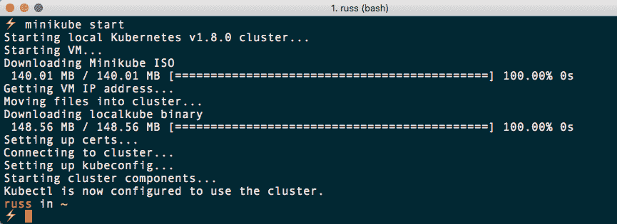
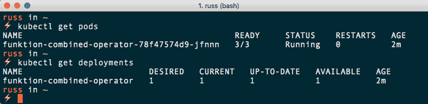
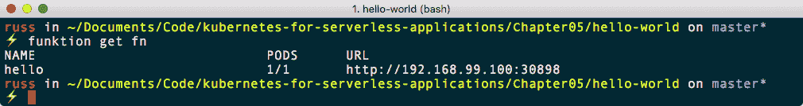
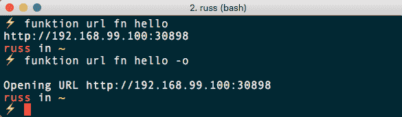
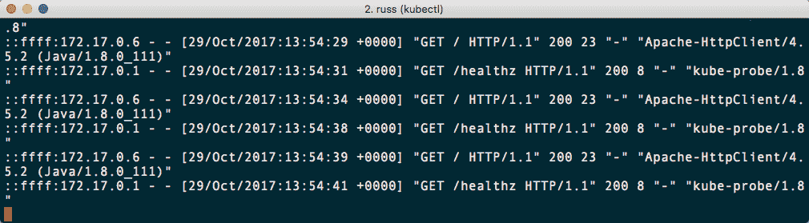
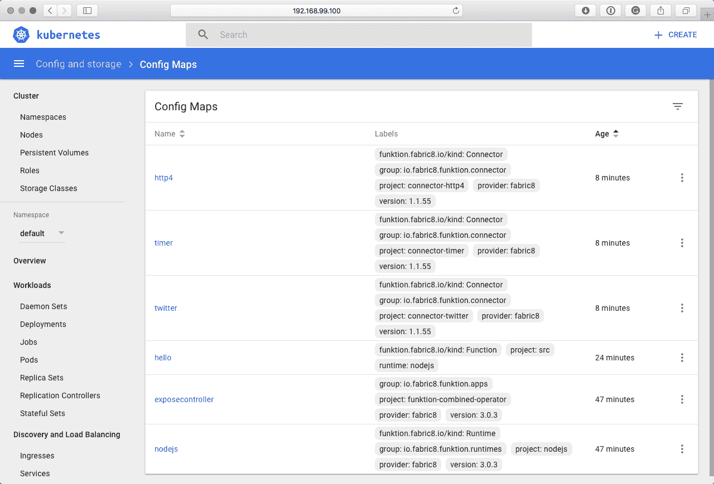
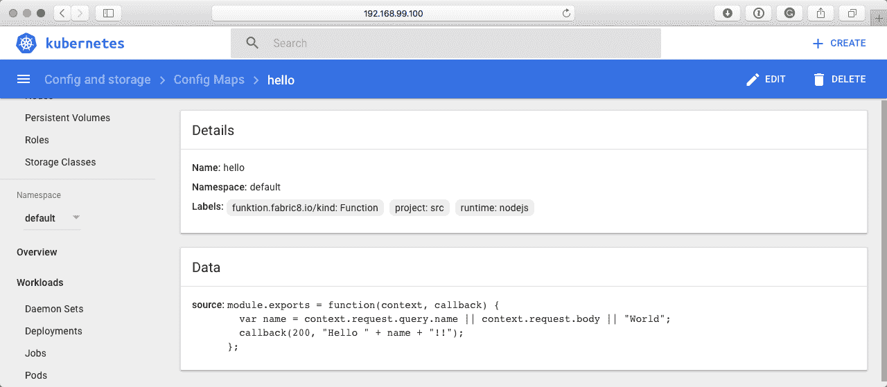
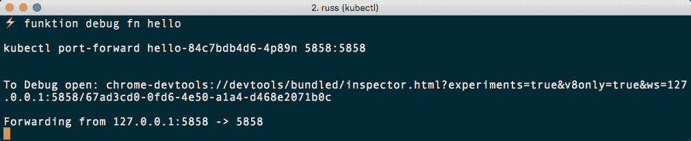
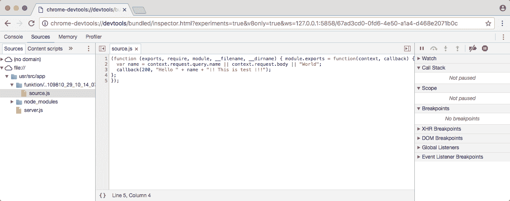
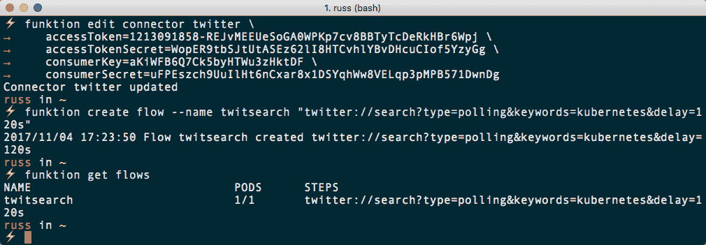

# 五、将函数用于无服务器应用

在我们继续在公共云中启动 Kubernetes 集群之前，我们将再看一个本地示例；这一次，我们将关注芬克顿。我们将涵盖以下主题:

*   介绍功能
*   安装和配置功能
*   使用 function 运行我们的第一个函数
*   推特流量

在我们完成安装和配置 Funktion 之前，我们应该花点时间讨论一下它的功能，因为它与本书中介绍的其他框架有些不同。

# 介绍功能

Funktion 的标语将其描述为 Kubernetes 基于事件的 Lambda 编程。从表面上看，Funktion 似乎非常接近 Kubeless 和我们在前几章中讨论过的其他无服务器框架。然而，它有自己的特点，这使它有别于我们正在研究的其他框架。

我们正在研究的大多数无服务器函数都支持两种基本事件类型:

*   **HTTP** :这是使用标准 HTTP 请求将数据传递给框架的地方；通常，数据将作为 JSON 对象发布
*   **订阅**:这是框架在事件流中监听主题的地方，例如，Kubeless 使用 Apache Kafka([https://kafka.apache.org/](https://kafka.apache.org/))

Funktion 扩展了事件类型的数量——事实上，它支持大约 200 种不同类型的事件。那是一个相当大的飞跃！它使用 Apache Camel([https://camel.apache.org/](https://camel.apache.org/))来实现这一点。Apache Camel 是一个开源的 Java 框架，作为开发人员的管道，允许他们摄取和发布数据。

为了让您了解 Apache Camel 支持的一些事件流，从而了解 Funktion，以下是一些亮点:

*   AWS-SNS 支持与亚马逊的**简单通知服务** ( **SNS** )
*   Braintree 允许与 Braintree 支付网关服务进行交互
*   etcd 允许您与 etcd 键值存储进行交互
*   脸书开放了完整的脸书原料药
*   GitHub 允许您监听来自 GitHub 的事件
*   卡夫卡——像库布尼斯一样，你可以订阅卡夫卡的作品
*   Twitter 让你能够监听标签、帖子等等

还有许多其他的，如领英、Slack、各种 SQL 和 NoSQL 数据库，文件服务，如来自 AWS、Dropbox 和 box 的 S3，等等。

所有这些选择使得它与我们已经和将要研究的其他框架相比是一个非常好的提议。

有几个不同的组件组成了一个功能部署。首先我们有一个**功能**；这是代码本身，由 Kubernetes ConfigMap 管理。

函数本身不是很有用，因为它只作为数据存在于配置映射中。正因为如此，我们需要一个**运行时**，一个接受函数并在被调用时执行它的 Kubernetes 部署。当 function 操作符(稍后将详细介绍)检测到添加了新功能时，会自动创建运行时。

接下来，我们有一个**连接器**；这是一个事件源的表示，例如我们在本节前面讨论的事件源——它包含关于事件类型、配置(例如 API 凭据)以及数据搜索参数的信息。

然后我们有**流**；这是一系列步骤，可能会消耗来自调用函数的连接器的事件。

最后，我们有**function**运算符。这是一个运行在 Kubernetes 中的 pod，它监控构成我们 function 部署的所有组件，例如函数、运行时、连接器和流。它负责创建提供功能的 Kubernetes 服务。

Funktion is open source and is released under Apache License 2.0; it was developed by fabric8, which is an upstream project for Red Hat's JBoss Middleware platform. fabric8 itself is a Java-focused microservice platform based on Docker, Kubernetes, and Jenkins. It also works well with Red Hat's own OpenShift platform.

现在我们已经有了一点关于 Funktion 与其他框架的区别的背景知识，我们可以考虑将其安装在我们的单节点 Kubernetes 集群上。

# 安装和配置功能

使用芬克顿有三个步骤。首先，我们需要安装命令行。这是部署和管理我们的功能部署的大部分命令将被输入的地方。安装命令行客户端后，我们可以使用 Minikube 启动单节点 Kubernetes 集群，然后使用 Funktion CLI 引导我们的环境。

# 命令行客户端

像我们正在讨论的许多框架一样，Funktion 是用 Go 编写的。这意味着我们的三个平台都有独立的可执行文件。

然而，在撰写本文时，没有任何安装程序可以在 macOS 上使用 Homebrew 或在 Windows 10 Professional 上使用 Chocolatey，这意味着我们将在所有三个平台上进行手动安装。

可执行文件可从 GitHub 上的项目发布页面获得，你可以在[https://github.com/funktionio/funktion/releases/](https://github.com/funktionio/funktion/releases/)找到。在撰写本文时，当前版本是 1.0.14，因此以下说明将涵盖该版本的安装；如果您需要安装更高版本，请在以下命令中替换版本号。

让我们从学习如何在 macOS 上安装开始。

# macOS 10.13 高山区

在 macOS 上安装很简单，因为项目已经发布了未压缩的独立可执行文件。我们所需要做的就是下载正确的包，并使其可执行。为此，请运行以下命令:

```
$ curl -L https://github.com/funktionio/funktion/releases/download/v1.0.14/funktion-darwin-amd64 > /usr/local/bin/funktion
$ chmod +x /usr/local/bin/funktion
```

现在安装了命令行工具，我们可以通过运行以下命令来测试它:

```
$ funktion version
```

Funktion 版本将按如下方式返回:


正如你所看到的，虽然安装过程很简单，但是这个包在自制程序中不可用也有缺点。如果是这样，那么更新到更高的版本会更容易，因为每当您运行:

```
$ brew update
$ brew upgrade
```

照目前的情况来看，如果你需要升级的话，你必须删除当前的版本并在它的位置下载新的版本。

# Windows 10 专业版

在 Windows 上安装 Funktion 命令行客户端的过程与 macOS 类似。首先，通过从任务栏中的 PowerShell 菜单中选择以管理员身份运行，以管理员用户身份打开一个 PowerShell 窗口。一旦打开，应该会看到你在`C:\WINDOWS\system32`文件夹中；如果你不是，那就跑:

```
$ cd C:\WINDOWS\system32
```

一旦进入`C:\WINDOWS\system32`文件夹，运行以下命令:

```
$ Invoke-WebRequest -Uri https://github.com/funktionio/funktion/releases/download/v1.0.14/funktion-windows-amd64.exe -UseBasicParsing -OutFile funktion.exe
```

然后，您应该能够运行以下命令来检查通过运行安装的 Funktion 命令行客户端的版本:

```
$ funktion version
```

Funktion 版本将按如下方式返回:


同样，由于我们没有使用包管理器来安装 Funktion 升级，为此，您必须删除旧的可执行文件，然后重复安装过程，确保更新网址中的版本号以反映您想要的版本。

# Ubuntu 17.04

最后，我们有 Ubuntu 17.04。安装过程与我们为 macOS 执行的命令非常相似。但是，请确保我们下载了正确的可执行文件，并且使用了`sudo`命令，因为`/usr/local/bin`文件夹的权限在操作系统之间略有不同:

```
$ sudo sh -c "curl -L https://github.com/funktionio/funktion/releases/download/v1.0.14/funktion-linux-amd64 > /usr/local/bin/funktion"
$ sudo chmod +x /usr/local/bin/funktion
```

一旦下载并成为可执行文件，您应该能够运行:

```
$ funktion version
```

您应该会看到如下内容:


现在我们已经在三个操作系统上安装了命令行客户端，我们可以继续部署了。

# 启动单节点 Kubernetes 集群

您可能已经注意到，我们再次发现我们现在可以在您使用的任何操作系统上使用相同的命令。这意味着本章中的其余命令将能够在我们的所有三个目标操作系统上运行。

在我们使用 Minikube 启动单节点 Kubernetes 集群之前，您可以通过运行以下命令来检查是否有任何更新。macOS 10.13 高塞拉用户可以运行:

```
$ brew update
$ brew upgrade
```

然后，要检查和更新 Minikube，请运行以下命令，从以下命令开始:

```
$ brew cask outdated
```

这将为您提供一个可以更新的软件包列表。如果列出了 Minikube，请运行以下命令:

```
$ brew cask reinstall minikube
```

Windows 10 专业版用户可以运行:

```
$ choco upgrade all
```

Ubuntu 17.04 用户将需要查看[第 3 章](03.html)、*中的发布页面详细信息，在本地安装 Kubernetes】，删除旧的二进制文件，并使用较新的版本重复安装过程。*

检查完 Minikube 的更新后，您可以通过运行以下命令启动集群:

```
$ minikube start
```

根据[第 3 章](03.html)、*在本地安装 Kubernetes*和[第 4 章](04.html)、*介绍无库功能*，这将启动单节点 Kubernetes 集群，并配置您的本地 Kubernetes 客户端与之交互。如果您已经更新了 Minikube，您可能还会注意到下载并安装了 Kubernetes 的更新版本:



如果您已经升级了 Minikube，您可以使用以下命令检查一切是否正在运行:

```
$ minikube status
$ kubectl get all
$ minikube dashboard
```

现在，我们的单节点 Kubernetes 集群已经恢复运行，Funktion 安装的最后阶段是引导部署。

# 引导功能

安装 Funktion 非常简单，事实上，它是一个命令:

```
$ funktion install platform
```

这将产生以下输出:


一两分钟后，你应该可以跑了:

```
$ kubectl get pods
$ kubectl get deployments
```

上述命令将检查部署的状态:



您还应该能够在 Kubernetes 仪表板中看到 Pods 和部署:


运行以下命令将返回一个空列表:

```
$ funktion get function
```

这证明了 function 命令行客户端可以连接到您新安装的 function 部署并与之交互。

# 部署简单的功能

现在我们已经启动并运行了 Funktion 部署，我们可以看一下部署一个非常简单的 hello world 示例。在支持本书的 GitHub 资源库的`/Chapter05/hello-world/src`文件夹中，会找到一个名为`hello.js`的文件。该文件包含以下代码:

```
module.exports = function(context, callback) {
  var name = context.request.query.name || context.request.body || "World";
  callback(200, "Hello " + name + "!!");
};
```

在`/Chapter05/hello-world/`文件夹中运行以下命令将使用前面的代码创建我们的第一个函数:

```
$ funktion create fn -f src/hello.js
```

输出应该如下所示:


从终端输出可以看到，这已经创建了一个名为`hello`的`function`。现在，我们让`function`运行以下命令:

```
$ funktion get function
```

这应该会返回一些结果。从下面的输出中可以看到，我们现在可以看到列出的`NAME`、`PODS`和`URL`:



我们可以运行以下命令来返回函数的`URL`，或者在浏览器中打开它:

```
$ funktion url fn hello
$ funktion url fn hello -o
```

您应该会看到以下结果:



打开的浏览器窗口显示以下内容。我相信你会同意这不是最激动人心的一页:


但它确实证明了我们的功能正在工作并显示内容。您可以通过运行以下命令来显示该函数的日志:

```
$ funktion logs function hello
```

这将实时将日志内容流式传输到您的终端窗口。您可以通过刷新浏览器几次来看到这一点，您应该会看到您的页面请求与内部运行状况检查请求一起被记录。

现在我们已经创建了第一个函数，我们可以安装一些连接器。为此，请运行以下命令:

```
$ funktion install connector http4 timer twitter
```

现在我们已经安装了一些连接器，我们可以创建一个流。我们的第一个流程将使用计时器连接器:

```
$ funktion create flow timer://foo?period=5000 http://hello/
```

这将创建一个名为`foo`的流程，每隔`5000`毫秒执行一次，目标是我们名为`hello`的函数。要获取有关流的信息，您可以运行以下命令:

```
$ funktion get flow
```

您应该会看到以下内容:


可以看到，这个流程叫做`timer-foo1`；当与它交互时，我们需要使用这个名称。例如，您可以通过运行以下命令来检查流的日志:

```
$ funktion logs flow timer-foo1
```

或者在 Kubernetes 仪表板中，您可以找到名为`timer-foo1`的吊舱，并查看那里的日志:


通过运行以下命令检查函数的日志:

```
$ funktion logs function hello
```

你应该看到每五秒钟就有一个来自`Apache-HttpClient/4.5.2`用户代理的客户端的页面请求。这是定时器流程:



要删除流，只需运行:

```
$ funktion delete flow timer-foo1
```

这将移除运行连接器的 pod，并且您的功能将停止接收自动请求。

回到 Kubernetes 仪表板，点击配置地图，应该会显示出 Funktion 创建的所有内容的列表。如您所见，Funktion 的大多数部分都有一个配置图:



点击`hello`的配置地图会显示如下页面:



如您所见，这包含了我们函数的代码，它已经自动检测到它是用 Node.js 编写的，并且它是从`src`文件夹中部署的。

在我们看更高级的例子之前，还有一件事你可能会觉得有趣，那就是与 *Chrome Dev* 工具的集成。为此，请运行以下命令:

```
$ funktion debug fn hello
```

这将在前台打开一个进程，并给你一个放入谷歌浏览器的网址:



一旦你打开谷歌浏览器并指向你的功能，你就可以执行一些任务，比如直接在浏览器中编辑代码:



Any changes made using the Chrome Dev tools are made directly within the pod and they will not persist if you relaunch the pod; this should be used purely for testing.

要删除我们的`hello`功能，我们只需要运行:

```
$ funktion delete function hello
```

这应该会给我们留下一个干净的安装，为更高级的示例做好准备。

# 推特流

在前一节中，我们安装了 Twitter 连接器，现在让我们看一下如何配置它来获取一些数据。首先，您可以通过运行以下命令来查看连接器的所有可配置选项:

```
$ funktion edit connector twitter -l
```

您应该会看到如下终端输出:


如您所见，您可以配置代理，也可以提供`accessToken`、`accessTokenSecret`、`consumerKey`和`consumerSecret`。你应该有前一章的这些。如果没有，则使用[第 4 章](04.html)、*介绍无库功能*中的说明重新生成它们。

与我将用来演示您需要运行的命令的令牌和机密一样，前面截图中列出的详细信息是默认的虚拟占位符详细信息，并且无效。

要用自己的详细信息更新连接器，请运行以下命令，确保用自己的详细信息替换详细信息:

```
$ funktion edit connector twitter \
 accessToken=1213091858-REJvMEEUeSoGA0WPKp7cv8BBTyTcDeRkHBr6Wpj \
 accessTokenSecret=WopER9tbSJtUtASEz62lI8HTCvhlYBvDHcuCIof5YzyGg \
 consumerKey=aKiWFB6Q7Ck5byHTWu3zHktDF \
 consumerSecret=uFPEszch9UuIlHt6nCxar8x1DSYqhWw8VELqp3pMPB571DwnDg
```

您应该会收到连接器已更新的确认。现在，我们能够启动一个使用推特适配器的流程。为此，我们应该运行以下命令:

```
$ funktion create flow --name twitsearch "twitter://search?type=polling&keywords=kubernetes&delay=120s"
$ funktion get flows
```

我们将看到以下内容:



启动 pod 后，您可以通过运行以下命令来检查日志:

```
$ funktion logs flow twitsearch
```

或者通过查看仪表板中`twitsearch`舱的日志:


如您所见，Camel 正在打印一系列包含 Kubernetes 作品的推文。您的应用可以订阅这个流，然后您可以处理推文。最后，运行以下命令将删除该流:

```
$ funktion delete flow twitsearch
```

然后，您可以使用`minikube delete`命令移除您的 Minikube 机器。

# 摘要

在这一章中，我们简要地看了一下芬克顿。我们安装了命令行客户端，然后将其安装在我们的单节点 Kubernetes 集群上。部署后，我们启动了一个测试功能，并在使用众多事件流之一搜索包含 Kubernetes 的推文之前与之交互。

Funktion 仍处于早期开发阶段，目前有一个小型但活跃的社区在该项目的 GitHub 页面上做出贡献。正因为如此，在撰写本文时，还没有太多充分利用 Funktion 通过 Apache Camel 支持的许多流的成熟应用的实例。如果您计划编写任何接收数据并对其进行处理的应用，我建议您密切关注 Funktion。

在下一章中，我们将研究如何将我们的 Kubernetes 集群从本地机器上的单节点集群转变为公共云上的多节点集群。