# 2。库本内斯概述

概述

在本章中，我们将对 Kubernetes 进行第一次实践介绍。本章将向您简要概述 Kubernetes 的不同组件以及它们如何协同工作。我们还将尝试使用一些基本的 Kubernetes 组件。

到本章结束时，您将拥有一个单节点 Minikube 环境，您可以在其中运行本书中的许多练习和活动。您将能够理解 Kubernetes 的高级架构，并确定不同组件的角色。您还将学习将容器化应用迁移到 Kubernetes 环境所需的基础知识。

# 简介

在上一章的结尾，我们提供了对 Kubernetes 的简单而抽象的介绍，以及它的一些优点。在本章中，我们将为您提供对 Kubernetes 如何工作的更具体的高级理解。首先，我们将向您介绍如何安装 Minikube，这是一个方便的工具，可以创建单节点集群，并为 Kubernetes 提供一个方便的学习环境。然后，我们将对所有组件进行 10，000 英尺的概述，包括它们的职责以及它们如何相互作用。之后，我们将把上一章构建的 Docker 应用迁移到 Kubernetes，并说明它如何享受 Kubernetes 提供的好处，例如创建多个副本和版本更新。最后，我们将解释应用如何响应外部和内部流量。

在我们深入了解 Kubernetes 的不同方面之前，对其进行概述非常重要，这样当我们了解到不同方面的更多细节时，您就会知道它们在大环境中的位置。此外，当我们更深入地探索如何使用 Kubernetes 在生产环境中部署应用时，您将会了解如何在后台处理所有事情。这也将帮助您进行优化和故障排除。

# 设置Kubernetes

你有没有问过这样一个问题:*如何轻松安装 Kubernetes？*“三年前，很难给出一个令人信服的答案。很尴尬，但这是真的。Kubernetes 是一个复杂的系统，安装并管理好它并不是一件容易的事情。

然而，随着 Kubernetes 社区的扩展和成熟，出现了越来越多的用户友好型工具。从今天开始，根据您的要求，有许多选项可供选择:

*   如果您使用的是物理(裸机)服务器或**虚拟机** ( **虚拟机**)，那么 Kubeadm 非常适合。
*   如果您在云环境中运行，Kops 和 Kubespray 可以简化 Kubernetes 的安装，以及与云提供商的集成。事实上，我们将在*第 11 章*、*中教你如何使用 Kops 在 AWS 上部署 Kubernetes，并再看一下我们可以用来设置 Kubernetes 的各种选项。*
*   如果你想减轻管理 Kubernetes 控制平面的负担(我们将在本章稍后了解)，几乎所有的云提供商都有自己的 Kubernetes 托管服务，如**谷歌 Kubernetes 引擎**(**GKE**)**亚马逊弹性 Kubernetes 服务**(**EKS**)**Azure Kubernetes 服务**(**AKS**)**IBM Kubernetes 服务**(【T13
*   如果你只是想要一个游乐场来研究Kubernetes，Minikube 和 Kind 可以帮助你在几分钟内旋转一个Kubernetes集群。

我们将在本书中广泛使用 Minikube 作为一个方便的学习环境。但是在我们继续安装过程之前，让我们仔细看看 Minikube 本身。

## 迷你库贝概述

Minikube 是一个可以用来设置单节点集群的工具，它提供了方便的命令和参数来配置集群。它的主要目的是提供一个本地测试环境。它打包了一个虚拟机，该虚拟机包含安装到您的主机上的 Kubernetes 的所有核心组件，所有这些都是一次性的。这允许它支持任何操作系统，只要预装了虚拟化工具(也称为 Hypervisor)。以下是 Minikube 支持的最常见的虚拟机管理程序:

*   VirtualBox(适用于所有操作系统)
*   特定于 Linux 的
*   Hyperkit(特定于 macOS)
*   Hyper-V(特定于窗口)

关于所需的硬件资源，最低要求是 2 GB RAM 和任何支持虚拟化的双核 CPU(英特尔 VT 或 AMD-V)，但如果您尝试更重的工作负载，当然需要更强大的机器。

就像任何其他现代软件一样，Kubernetes 提供了一个方便的命令行客户端，称为 kubectl，允许用户方便地与集群交互。在下一个练习中，我们将设置 Minikube 并使用一些基本的 kubectl 命令。我们将在下一章中更详细地讨论 kubectl。

## 练习 2.01:Minikube 和 Kubernetes 集群入门

在本练习中，我们将使用 Ubuntu 20.04 作为安装 Minikube 的基础操作系统，使用它我们可以轻松启动单节点 Kubernetes 集群。一旦 Kubernetes 集群已经建立，您应该能够检查它的状态并使用`kubectl`与它交互:

注意

由于本练习涉及软件安装，您需要以超级用户身份登录。切换到根用户的简单方法是运行以下命令:`sudo su -`。

在本练习的*步骤 9* 中，我们将创建一个常规用户，然后切换回该用户。

1.  First, ensure that VirtualBox is installed. You can confirm this by using the following command:

    ```
    which VirtualBox
    ```

    您应该会看到以下输出:

    ```
    /usr/bin/VirtualBox
    ```

    如果已经成功安装了 VirtualBox，`which`命令应该显示可执行文件的路径，如前面的截图所示。如果没有，请确保您已经按照*前言*中提供的说明安装了 VirtualBox。

2.  Download the Minikube standalone binary by using the following command:

    ```
    curl -Lo minikube https://github.com/kubernetes/minikube/releases/download/<version>/minikube-<ostype-arch> && chmod +x minikube
    ```

    在此命令中，`<version>`应替换为特定版本，如`v1.5.2`(这是我们将在本章中使用的版本)或`latest`。根据您的主机操作系统，应该将`<ostype-arch>`替换为`linux-amd64`(对于 Ubuntu)或`darwin-amd64`(对于 macOS)。

    注意

    为了确保与本书提供的命令兼容，我们建议您安装 Minikube 版本`v1.5.2`。

    您应该会看到以下输出:

    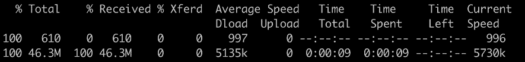

    图 2.1:下载 Minikube 二进制文件

    前面的命令包含两部分:第一个命令`curl`下载 Minikube 二进制文件，而第二个命令`chmod`更改权限使其可执行。

3.  Move the binary into the system path (in the example, it's `/usr/local/bin`) so that we can directly run Minikube, regardless of which directory the command is run in:

    ```
    mv minikube /usr/local/bin
    ```

    当成功执行时，移动(`mv`)命令不会在终端中给出响应。

4.  After running the move command, we need to confirm that the Minikube executable is now in the correct location:

    ```
    which minikube
    ```

    您应该会看到以下输出:

    ```
    /usr/local/bin/minikube
    ```

    注意

    如果`which minikube`命令没有给出预期的结果，您可能需要通过运行`export PATH=$PATH:/usr/local/bin`将`/usr/local/bin`显式添加到您的系统路径中。

5.  You can check the version of Minikube using the following command:

    ```
    minikube version
    ```

    您应该会看到以下输出:

    ```
    minikube version: v1.5.2
    commit: 792dbf92a1de583fcee76f8791cff12e0c9440ad-dirty
    ```

6.  Now, let's download kubectl version `v1.16.2` (so that it's compatible with the version of Kubernetes that our setup of Minikube will create later) and make it executable by using the following command:

    ```
    curl -LO https://storage.googleapis.com/kubernetes-release/release/v1.16.2/bin/<ostype>/amd64/kubectl && chmod +x kubectl
    ```

    如前所述，`<ostype>`应该替换为`linux`(对于 Ubuntu)或`darwin`(对于 macOS)。

    您应该会看到以下输出:

    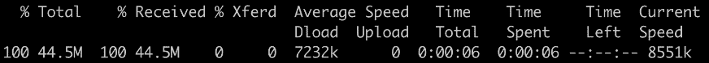

    图 2.2:下载库比特二进制文件

7.  然后，将其移动到系统路径，就像我们之前对 Minikube 的可执行文件所做的那样:

    ```
    mv kubectl /usr/local/bin
    ```

8.  Now, let's check whether the executable for kubectl is at the correct path:

    ```
    which kubectl
    ```

    您应该会看到以下响应:

    ```
    /usr/local/bin/kubectl
    ```

9.  Since we are currently logged in as the `root` user, let's create a regular user called `k8suser` by running the following command:

    ```
    useradd k8suser
    ```

    当系统提示您输入所需密码时，请输入。系统还会提示您输入其他详细信息，例如您的全名。只需按*进入*即可选择跳过这些细节。您应该会看到类似如下的输出:

    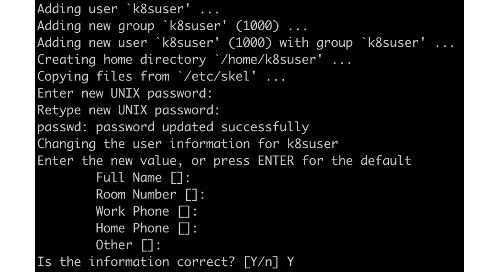

    图 2.3:创建新的 Linux 用户

    进入`Y`点击*进入*确认创建用户的最终提示，如上一张截图末尾所示。

10.  Now, switch user from `root` to `k8suser`:

    ```
    su - k8suser
    ```

    您应该会看到以下输出:

    ```
    root@ubuntu:~# su – k8suser
    k8suser@ubuntu:~$
    ```

11.  Now, we can create a Kubernetes cluster using `minikube start`:

    ```
    minikube start --kubernetes-version=v1.16.2
    ```

    注意

    如果要管理多个集群，Minikube 会为每个集群提供一个`--profile <profile name>`参数。

    下载虚拟机映像并设置好一切需要几分钟时间。Minikube 成功启动后，您应该会看到类似以下内容的响应:

    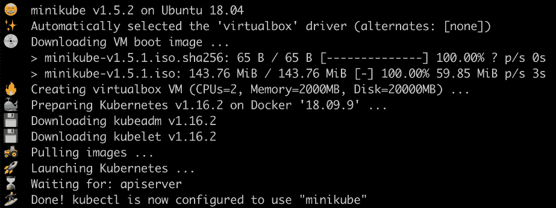

    图 2.4: Minikube 首次启动

    正如我们前面提到的，Minikube 启动了一个虚拟机实例，其中包含了 Kubernetes 的所有组件。默认情况下，它使用 VirtualBox，您可以使用`--vm-driver`标志来指定特定的虚拟机管理程序驱动程序(例如 macOS 的`hyperkit`)。Minikube 还提供了`--kubernetes-version`标志，因此您可以指定想要使用的 Kubernetes 版本。如果没有指定，它将使用 Minikube 版本最终确定时可用的最新版本。在本章中，为了确保 Kubernetes 版本与 kubectl 版本的兼容性，我们明确指定了 Kubernetes 版本`v1.16.2`。

    以下命令应该有助于确定由 Minikube 启动的 Kubernetes 集群是否正常运行。

12.  Use the following command to get the basic status of the various components of the cluster:

    ```
    minikube status
    ```

    您应该会看到以下响应:

    ```
    host: Running
    kubelet: Running
    apiserver: Running
    kubeconfig: Configured
    ```

13.  Now, let's look at the version of the kubectl client and Kubernetes server:

    ```
    kubectl version --short
    ```

    您应该会看到以下响应:

    ```
    Client Version: v1.16.2
    Server Version: v1.16.2
    ```

14.  Let's learn how many machines comprise the cluster and get some basic information about them:

    ```
    kubectl get node
    ```

    您应该会看到类似以下内容的响应:

    ```
    NAME          STATUS          ROLES          AGE          VERSION
    minikube      Ready           master         2m41s        v1.16.2
    ```

完成本练习后，您应该已经使用单节点 Kubernetes 集群设置了 Minikube。在下一节中，我们将进入 Minikube 虚拟机，看看集群是如何组成的，以及使其工作的 Kubernetes 的各种组件。

# Kube 链接组件概述

通过完成前面的练习，您已经启动并运行了一个单节点 Kubernetes 集群。在播放你的第一场音乐会之前，让我们稍等一会儿，拉开窗帘到后台看一看，看看 Kubernetes 是如何在幕后构建的，然后检查 Minikube 是如何在其 VM 内将其各种组件粘合在一起的。

Kubernetes 有几个使机器轮子转动的核心部件。它们如下:

*   应用编程接口服务器
*   和 cd
*   控制器管理器
*   调度程序
*   KubernetesKubernetesKubernetesKubernetesKubernetesKubernetesKubernetesKubernetesKubernetesKubernetesKubernetesKubernetesKubernetesKubernetesKubernetesKubernetes

这些组件对于 Kubernetes 集群的运行至关重要。

除了这些核心组件之外，您还可以在容器中部署应用，这些容器被捆绑在一起作为容器。我们将在*第 5 章*、*豆荚*中了解更多关于豆荚的信息。这些容器和其他一些资源是由一种叫做 API 对象的东西定义的。

一个 **API 对象**描述了在 Kubernetes 中应该如何使用某个资源。我们通常使用人类可读的清单文件来定义 API 对象，然后使用一个工具(比如 kubectl)来解析它，并将其交给 Kubernetes API 服务器。然后，Kubernetes 尝试创建对象中指定的资源，并将其状态与对象定义中所需的状态相匹配，如清单文件中所述。接下来，我们将向您介绍这些组件在 Minikube 创建的单节点集群中是如何组织和运行的。

Minikube 提供了一个名为`minikube ssh`的命令，用于从主机(在我们的机器中，它是运行 Ubuntu 20.04 的物理机器)获得对`minikube`虚拟机的 SSH 访问，该虚拟机是我们 Kubernetes 集群中的唯一节点。让我们看看它是如何工作的:

```
minikube ssh
```

您将看到以下输出:

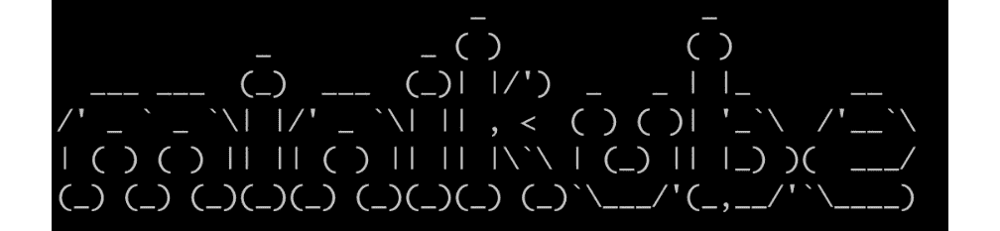

图 2.5:通过 SSH 访问 Minikube 虚拟机

注意

在运行`minikube ssh`之后，本节后面将显示的所有命令都被认为是在 Minikube 虚拟机中运行的。

容器技术带来了封装应用的便利。Minikube 也不例外——它利用容器将 Kubernetes 组件粘合在一起。在 Minikube 虚拟机中，Docker 是预安装的，因此它可以管理核心的 Kubernetes 组件。你可以通过运行`docker ps`来看看这个；然而，结果可能是压倒性的，因为它包括所有正在运行的容器——核心 Kubernetes 组件和附加组件，以及所有列——这将输出一个非常大的表。

为了简化输出并使其更容易阅读，我们将把来自`docker ps`的输出导入另外两个 Bash 命令:

1.  `grep -v pause`: This will filter the results by not displaying the "sandbox" containers.

    没有`grep -v pause`，你会发现每个容器都与一个“沙盒”容器“配对”(在 Kubernetes 中，它被实现为一个`pause`映像)。这是因为，如前一章所述，Linux 容器可以通过加入相同(或不同)的 Linux 命名空间来关联(或隔离)。在 Kubernetes 中，一个“沙盒”容器用于引导一个 Linux 命名空间，然后运行真实应用的容器能够加入该命名空间。为了简洁起见，关于所有这些在引擎盖下如何工作的更详细的细节被排除在范围之外。

    注意

    如果没有明确指定，术语“名称空间”在本书中可以与“Kubernetes 名称空间”互换使用。就“Linux 命名空间”而言，“Linux”不会被省略以避免混淆。

2.  `awk '{print $NF}'`: This will only print the last column with a container name.

    因此，最终命令如下:

    ```
    docker ps | grep -v pause | awk '{print $NF}'
    ```

    您应该会看到以下输出:

    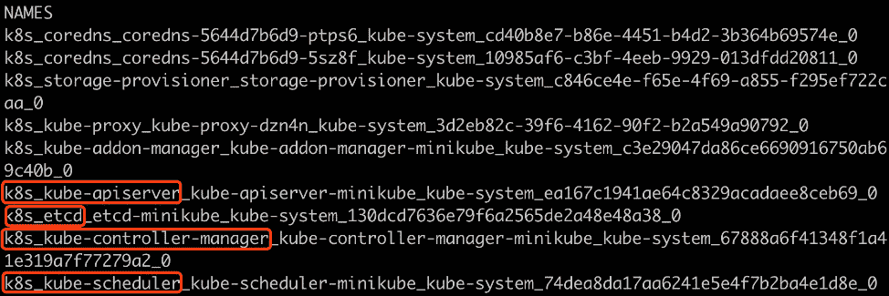

图 2.6:通过运行 Minikube 虚拟机获取容器列表

前面截图中突出显示的容器基本上是 Kubernetes 的核心组件。我们将在接下来的章节中详细讨论其中的每一个。

## etcd

分布式系统随时可能面临各种故障(网络、存储等)。为了确保在出现故障时仍能正常工作，关键的群集元数据和状态必须以可靠的方式存储。

Kubernetes 将集群元数据和状态抽象为一系列 API 对象。例如，节点 API 对象表示 Kubernetes 工作节点的规范及其最新状态。

Kubernetes 使用 **etcd** 作为后端键值数据库，在 Kubernetes 集群的生命周期中保持 API 对象。需要注意的是，在不经过 API 服务器的情况下，不允许任何东西(内部集群资源或外部客户端)与 etcd 对话。对 etcd 的任何更新或来自 etcd 的任何请求都只能通过调用 API 服务器来进行。

实际上，etcd 通常与多个实例一起部署，以确保数据以安全和容错的方式保存。

## 应用编程接口服务器

API 服务器允许标准 API 访问 Kubernetes API 对象。它是唯一与后端存储(etcd)对话的组件。

此外，通过利用它是与 etcd 通信的单一联系点这一事实，它为客户提供了一个方便的界面来“观察”他们可能感兴趣的任何 API 对象。一旦创建、更新或删除了应用编程接口对象，正在“观察”的客户端将获得即时通知，以便他们可以对这些更改采取行动。“监视”客户端也被称为“控制器”，它已经成为一个非常受欢迎的实体，被用于内置的 Kubernetes 对象和 Kubernetes 扩展中。

注意

您将在*第 4 章*、*中了解更多关于 API 服务器如何与 Kubernetes* 、 *(API 服务器)*、以及在*第 7 章*、 *Kubernetes 控制器*中了解更多关于控制器的信息。

## 调度程序

调度程序负责将传入的工作负载分配到最合适的节点。关于分布的决定是由调度器对整个集群的理解以及一系列调度算法做出的。

注意

您将在*第 17 章*、*库本内斯*中了解更多关于调度程序的信息。

## 控制经理

正如我们前面在 *API 服务器*小节中提到的，API 服务器公开了“观察”几乎任何 API 对象的方法，并通知观察者正在观察的 API 对象的变化。

它的工作方式很像发布者-订阅者模式。控制器管理器作为一个典型的订阅者，只监视它感兴趣的应用编程接口对象，然后尝试进行适当的更改，将当前状态移向对象中描述的期望状态。

例如，如果它从应用编程接口服务器获得更新，称一个应用声称有两个副本，但现在群集中只有一个副本，它将创建第二个副本，以使应用遵守其所需的副本数量。协调过程在控制器管理器的生命周期中持续运行，以确保所有应用保持在预期状态。

控制器管理器聚合各种类型的控制器来遵守 API 对象的语义，例如我们将在本章后面介绍的部署和服务。

## 库伯莱在哪里？

请注意，etcd、API 服务器、调度器和控制器管理器构成了 Kubernetes 的控制平面。运行这些组件的机器称为主节点。另一方面，kubelet 部署在每个工作机上。

在我们的单节点 Minikube 集群中，kubelet 部署在承载控制平面组件的同一个节点上。但是，在大多数生产环境中，它不会部署在任何主节点上。当我们在*第 11 章*、*构建自己的高可用性集群*中部署多节点集群时，我们将了解更多关于生产环境的信息。

kubelet 的主要目的是与底层容器运行时(例如，Docker、containerd 或 cri-o)对话，以调出容器并确保容器按预期运行。此外，它负责将状态更新发送回应用编程接口服务器。

但是，如前面的截图所示，`docker ps`命令没有显示任何名为`kubelet`的内容。为了启动、停止或重启任何软件，并使其在出现故障时自动重启，通常，我们需要一个工具来管理其生命周期。在 Linux 中，systemd 有这个责任。在 Minikube 中，kubelet 由 systemd 管理，并作为本机二进制文件而不是 Docker 容器运行。我们可以运行以下命令来检查其状态:

```
systemctl status kubelet
```

您应该会看到类似如下的输出:

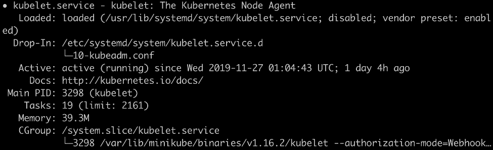

图 2.7:kube let 的状态

默认情况下，kubelet 的配置文件(存储在`/var/lib/kubelet/config.yaml`中)中有`staticPodPath`的配置。kubelet 被指示持续观察该路径下文件的变化，该路径下的每个文件代表一个 Kubernetes 组件。让我们通过首先在库布雷的`config`文件中找到`staticPodPath`来理解这意味着什么:

```
grep "staticPodPath" /var/lib/kubelet/config.yaml
```

您应该会看到以下输出:

```
staticPodPath: /etc/kubernetes/manifests
```

现在，让我们看看这个路径的内容:

```
ls /etc/kubernetes/manifests
```

您应该会看到以下输出:

```
addon-manager.yaml.tmpl kube-apiserver.yaml      kube-scheduler.yaml
etcd.yaml               kube-controller-manager.yaml
```

如文件列表所示，Kubernetes 的核心组件是由在 YAML 文件中指定了定义的对象定义的。在 Minikube 环境中，除了管理用户创建的 pods 之外，kubelet 还充当 systemd 的等价物，以便管理 Kubernetes 系统级组件的生命周期，例如 API 服务器、调度器、控制器管理器和其他附加组件。一旦这些 YAML 文件中的任何一个发生更改，kubelet 就会自动检测到这一点，并更新集群的状态，使其与更新后的 YAML 配置中定义的所需状态相匹配。

我们就此打住，不再深入探究 Minikube 的设计。除了“静态组件”之外，kubelet 还是“常规应用”的管理者，以确保它们在节点上按预期运行，并根据 API 规范或在资源短缺时驱逐 pods。

## 多维数据集代理

kube-proxy 出现在`docker ps`命令的输出中，但是当我们在前面的小节中探索该目录时，它并没有出现在`/etc/kubernetes/manifests`中。这暗示了它的角色——它更多地被定位为附加组件，而不是核心组件。

kube-proxy 被设计为运行在每个节点上的分布式网络路由器。它的最终目标是确保到达**服务**(这是我们稍后将介绍的一个 API 对象)端点的入站流量可以被正确路由。此外，如果多个容器为一个应用服务，它能够通过利用底层的 Linux iptables/IPVS 技术以循环方式平衡流量。

还有一些其他的附加组件，比如 CoreDNS，尽管我们将跳过这些，这样我们就可以专注于核心组件并获得一个高级的画面。

注意

有时，kube 代理和 CoreDNS 也被认为是 Kubernetes 安装的核心组件。在某种程度上，这在技术上是正确的，因为它们在大多数情况下是强制性的；否则，服务应用编程接口对象将无法工作。然而，在本书中，我们更倾向于将它们归类为“附加组件”，因为它们专注于一个特定的 Kubernetes API 资源的实现，而不是一般的工作流。此外，kube-proxy 和 CoreDNS 是在`addon-manager.yaml.tmpl`中定义的，而不是在与其他核心 Kubernetes 组件相同的级别上描述的。

# Kubernetes〔t0〕你的建筑

在前一节中，我们获得了核心 Kubernetes 组件的第一印象:etcd、API 服务器、调度器、控制器管理器和 kubelet。这些组件加上其他附加组件组成了 Kubernetes 体系结构，如下图所示:

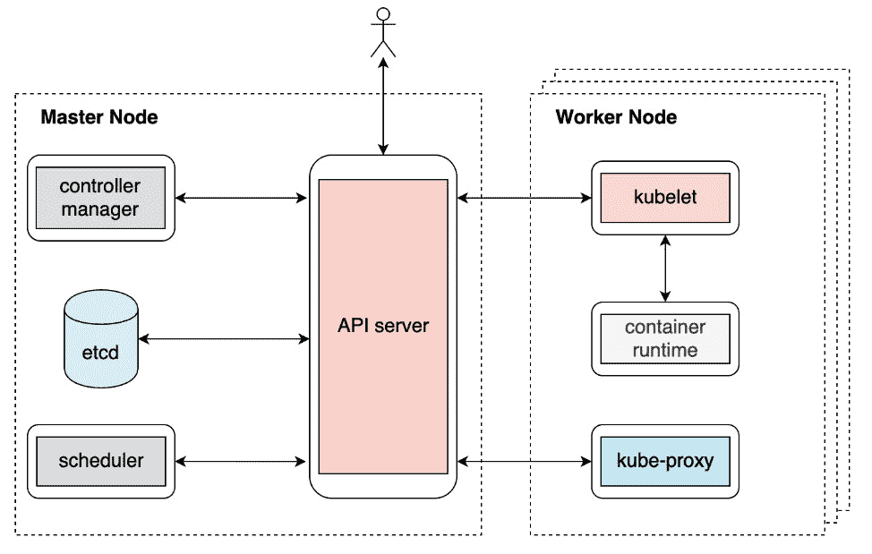

图 2.8:无缝体系结构

在这一点上，我们不会太详细地看每个组件。然而，从高层次的角度来看，理解组件如何相互通信以及为什么以这种方式设计是至关重要的。

首先要了解的是 API 服务器可以与哪些组件进行交互。从前面的图中，我们可以很容易地看出，API 服务器可以与几乎所有其他组件进行对话(容器运行时除外，它由 kubelet 处理)，并且它还可以直接与最终用户进行交互。这种设计让 API 服务器充当了 Kubernetes 的“心脏”。此外，应用编程接口服务器还会仔细检查传入的请求，并将应用编程接口对象写入后端存储(etcd)。换句话说，这使得应用编程接口服务器成为安全控制措施(如身份验证、授权和审计)的节流器。

要理解的第二件事是不同的 Kubernetes 组件(除了 API 服务器)如何相互交互。事实证明，它们之间没有明确的联系——控制器管理器不与调度器对话，kubelet 也不与 kube-proxy 对话。

你没看错——他们确实需要相互协作来完成许多功能，但他们从不直接相互交流。相反，它们通过应用编程接口服务器进行隐式通信。更准确地说，它们通过观察、创建、更新或删除相应的应用编程接口对象来进行通信。这也称为控制器/操作员模式。

## 容器网络接口

有几个联网方面需要考虑，例如 pod 如何与其主机的网络接口通信，节点如何与其他节点通信，以及最终 pod 如何跨不同节点与任何 pod 通信。由于网络基础设施在云或内部环境中差异很大，Kubernetes 选择通过定义一个名为**容器网络接口** ( **CNI** )的规范来解决这些问题。不同的 CNI 提供商可以遵循相同的接口，并实现符合 Kubernetes 标准的逻辑，以确保整个 Kubernetes 网络正常工作。我们将在*第 11 章*、*构建自己的高可用性集群*中重温 CNI 的理念。现在，让我们回到不同的 Kubernetes 组件如何工作的讨论。

本章稍后，*练习 2.05* 、*Kubernetes 如何管理 Pod 的生命周期*，将帮助您巩固对此的理解，并阐明一些事情，例如不同的 Kubernetes 组件如何同步或异步运行以确保典型的 Kubernetes 工作流，以及如果这些组件中的一个或多个出现故障会发生什么。该练习将帮助您更好地理解整体 Kubernetes 体系结构。但在此之前，让我们将前一章中的容器化应用介绍给 Kubernetes 世界，并探索 Kubernetes 的一些好处。

# 迁移 g 容器化应用于Kubernetes

在前一章中，我们构建了一个简单的 HTTP 服务器`k8s-for-beginners`，它作为 Docker 容器运行。它非常适合示例应用。但是，如果您必须管理数千个容器，并适当地协调和安排它们，会怎么样呢？如何在不停机的情况下升级服务？在意外失败时，如何保持服务健康？这些问题超出了仅仅使用容器的系统的能力。我们需要的是一个能够编排和管理我们的容器的平台。

我们已经告诉您，Kubernetes 是我们需要的解决方案。接下来，我们将引导您完成一系列练习，这些练习涉及如何使用 Kubernetes 本地方法在 Kubernetes 中编排和运行容器。

## 吊舱规格化

一个简单的想法是，我们希望看到在 Kubernetes 中运行容器的等效 API 调用或命令是什么。正如*第 1 章*、*对 Kubernetes 和 Containers* 的介绍中所解释的，一个容器可以加入另一个容器的命名空间，这样它们就可以访问彼此的资源(例如网络、存储等)，而不会产生额外的开销。在现实世界中，一些应用可能需要几个容器紧密协作，或者并行，或者以特定的顺序(一个容器的输出将由另一个容器处理)。此外，一些通用容器(例如，日志代理、网络节流代理等)可能需要与其目标容器密切合作。

因为一个应用可能经常需要几个容器，所以容器不是 Kubernetes 中的最小操作单元；相反，它引入了一个名为**豆荚**的概念来捆绑一个或多个容器。Kubernetes 提供了一系列规范来描述这个 pod 应该是什么样子，包括一些细节，比如映像、资源请求、启动命令等等。为了将这个 pod 规范发送给 Kubernetes，特别是 Kubernetes API 服务器，我们将使用 Kubernetes。

注意

我们将在*第 5 章*、*吊舱*中了解更多关于吊舱的信息，但我们将在本章中使用它们进行简单的演示。您可以在此链接参考可用吊舱规格的完整列表:[https://godoc.org/k8s.io/api/core/v1#PodSpec](https://godoc.org/k8s.io/api/core/v1#PodSpec)。

接下来，让我们学习如何通过编写 pod 规范文件(也称为规范、清单、配置或配置文件)在 Kubernetes 中运行单个容器。在 Kubernetes 中，您可以使用 YAML 或 JSON 来编写这个规范文件，尽管通常使用 YAML，因为它更易于阅读和编辑。

考虑以下非常简单的吊舱的 YAML 规格:

```
kind: Pod
apiVersion: v1
metadata:
  name: k8s-for-beginners
spec:
  containers:
  - name: k8s-for-beginners
    image: packtworkshops/the-kubernetes-workshop:k8s-for-beginners
```

让我们简单介绍一下不同的领域:

*   `kind`告诉 Kubernetes 要创建哪种类型的对象。在这里，我们正在创建一个`Pod`。在后面的章节中，您将看到许多其他类型，如部署、状态集、配置映射等。
*   `apiVersion`指定 API 对象的特定版本。不同的版本可能会有所不同。
*   `metadata`包括一些可用于唯一识别 pod 的属性，如名称和命名空间。如果我们不指定名称空间，它将进入`default`名称空间。
*   `spec`包含一系列描述 pod 的字段。在这个例子中，有一个容器指定了它的映像网址和名称。

Pods 是最容易部署的 Kubernetes 对象之一，因此我们将在下面的练习中使用它们来学习如何使用 YAML 清单部署对象。

## 申请 YAML 舱单

一旦我们准备好了 YAML 清单，我们就可以使用`kubectl apply -f <yaml file>`或`kubectl create -f <yaml file>`来指示应用编程接口服务器保存清单中定义的应用编程接口资源。当您第一次从头开始创建 pod 时，您使用哪两个命令并没有太大区别。然而，我们可能经常需要修改 YAML(比方说，如果我们想升级映像版本)并重新应用它。如果我们使用`kubectl create`命令，我们必须删除并重新创建它。但是，使用`kubectl apply`命令，我们可以重新运行相同的命令，增量变化将由 Kubernetes 自动计算和应用。

从操作角度来看，这非常方便。例如，如果我们使用某种形式的自动化，重复相同的命令会简单得多。因此，我们将在下面的练习中使用`kubectl apply`，不管它是否是第一次应用。

注意

关于 kubectl 的详细信息可以在*第 4 章*、*如何与 Kubernetes (API Server)* 进行通信中获得。

## 练习 2.02:在库本内斯跑豆荚

在前面的练习中，我们启动了 Minikube，并查看了作为 pods 运行的各种 Kubernetes 组件。现在，在这个练习中，我们将部署我们的吊舱。按照以下步骤完成本练习:

注意

如果您已经尝试了 *Kubernetes 组件概述*部分的命令，在开始本练习之前，不要忘记使用`exit`命令退出 SSH 会话。除非另有规定，所有使用`kubectl`的命令都应该在主机上运行，而不是在 Minikube 虚拟机中运行。

1.  In Kubernetes, we use a spec file to describe an API object such as a pod. As mentioned earlier, we will stick to YAML as it is more human-readable and editable friendly. Create a file named `k8s-for-beginners-pod.yaml` (using any text editor of your choice) with the following content:

    ```
    kind: Pod
    apiVersion: v1
    metadata:
      name: k8s-for-beginners
    spec:
      containers:
      - name: k8s-for-beginners
        image: packtworkshops/the-kubernetes-workshop:k8s-for-      beginners
    ```

    注意

    请用上一章创建的映像路径替换前面 YAML 文件最后一行的映像路径。

2.  On the host machine, run the following command to create this pod:

    ```
    kubectl apply -f k8s-for-beginners-pod.yaml
    ```

    您应该会看到以下输出:

    ```
    pod/k8s-for-beginners created
    ```

3.  Now, we can use the following command to check the pod's status:

    ```
    kubectl get pod
    ```

    您应该会看到以下响应:

    ```
    NAME                   READY     STATUS      RESTARTS       AGE
    k8s-for-beginners      1/1       Running     0              7s
    ```

    默认情况下，`kubectl get pod`将使用表格格式列出所有豆荚。在前面的输出中，我们可以看到`k8s-for-beginners`吊舱运行正常，并且它有一个准备好的容器(`1/1`)。此外，kubectl 提供了一个名为`-o`的附加标志，这样我们就可以调整输出格式。例如，`-o yaml`或`-o json`将分别以 YAML 或 JSON 格式返回 pod API 对象的完整输出，因为它的存储版本在 Kubernetes 的后端存储(etcd)中。

4.  You can use the following command to get more information about the pod:

    ```
    kubectl get pod -o wide
    ```

    您应该会看到以下输出:

    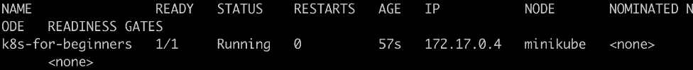

    图 2.9:获取更多关于 pods 的信息

    如您所见，输出仍然是表格格式，我们获得了附加信息，如`IP`(内部 pod IP)和`NODE`(pod 运行在哪个节点上)。

5.  You can get the list of nodes in our cluster by running the following command:

    ```
    kubectl get node
    ```

    您应该会看到以下响应:

    ```
    NAME          STATUS          ROLES          AGE          VERSION
    minikube      Ready           master         30h          v1.16.2
    ```

6.  The IP listed in *Figure 2.9* refers to the internal IP Kubernetes assigned for this pod, and it's used for pod-to-pod communication, not for routing external traffic to pods. Hence, if you try to access this IP from outside the cluster, you will get nothing. You can try that using the following command from the host machine, which will fail:

    ```
    curl 172.17.0.4:8080
    ```

    注意

    记得在*步骤 4* 中将`172.17.0.4`更改为您为环境获得的值，如*图 2.9* 所示。

    `curl`命令将挂起，不返回任何内容，如下所示:

    ```
    k8suser@ubuntu:~$ curl 172.17.0.4:8080
    ^C
    ```

    需要按 *Ctrl* + *C* 才能中止。

7.  In most cases, end-users don't need to interact with the internal pod IP. However, just for observation purposes, let's SSH into the Minikube VM:

    ```
    minikube ssh
    ```

    您将在终端中看到以下响应:

    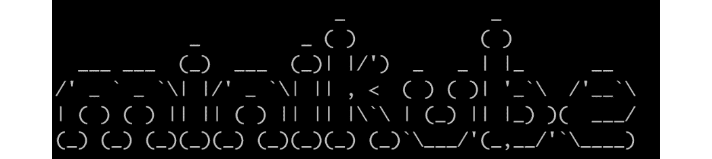

    图 2.10:通过 SSH 访问 Minikube 虚拟机

8.  Now, try calling the IP from inside the Minikube VM to verify that it works:

    ```
    curl 172.17.0.4:8080
    ```

    你应该得到一个成功的回应:

    ```
    Hello Kubernetes Beginners!
    ```

这样，我们已经成功地在 Kubernetes 集群上的一个 pod 中部署了我们的应用。我们可以确认它正在工作，因为当我们从集群内部调用应用时会得到响应。现在，您可以使用`exit`命令结束 Minikube SSH 会话。

## 服务 Sp 规格

上一节的最后一部分证明了网络通信在集群内部的不同组件之间非常有效。但是在现实世界中，您不会期望应用的用户获得 SSH 访问您的集群来使用您的应用。因此，您希望您的应用可以从外部访问。

为了促进这一点，Kubernetes 提供了一个名为**服务**的概念来抽象对应用的 pods 的网络访问。服务充当网络代理，接受来自外部用户的网络流量，然后将其分发到内部 pod。但是，应该有一种方法来描述服务和相应 pods 之间的关联规则。Kubernetes 使用在 pod 定义中定义的标签和在 Service 定义中定义的标签选择器来描述这种关系。

注意

您将在*第 6 章*、*标签和注释*中了解更多关于标签和标签选择器的信息。

让我们考虑以下服务的示例规范:

```
kind: Service
apiVersion: v1
metadata:
  name: k8s-for-beginners
spec:
  selector:
    tier: frontend
  type: NodePort
  ports:
  - port: 80
    targetPort: 8080
```

类似于 pod 规范，这里我们定义`kind`和`apiVersion`，而`name`在`metadata`字段下定义。在`spec`字段下，有几个关键字段需要注意:

*   `selector`定义要选择的标签，以匹配与相应豆荚的关系，正如您将在下面的练习中看到的，这些豆荚应该被正确标记。
*   `type`定义服务的类型。如果未指定，默认类型为`ClusterIP`，这意味着它只在集群内使用，即内部使用。这里，我们将其指定为`NodePort`。这意味着该服务将在集群的每个节点中公开一个端口，并将该端口与相应的 pod 相关联。另一个众所周知的类型叫做`LoadBalancer`，它通常不会在普通的 Kubernetes 产品中实现。相反，Kubernetes 将实现委托给每个云提供商，如 GKE、EKS 等。
*   `ports` include a series of `port` fields, each with a `targetPort` field. The `targetPort` field is the actual port that's exposed by the destination pod.

    因此，可以通过`<service ip>:<port>`在内部访问该服务。现在，例如，如果您有一个 NGINX pod 在内部运行并监听端口 8080，那么您应该将`targetPort`定义为`8080`。您可以为`port`字段指定任意数字，例如本例中的`80`。Kubernetes 将建立并维护`<service IP>:<port>`和`<pod IP>:<targetPort>`之间的映射。在下面的练习中，我们将学习如何从集群外部访问服务，并通过服务将外部流量引入集群内部。

在下面的练习中，我们将定义服务清单，并使用`kubectl apply`命令创建它们。您将了解到，在 Kubernetes 中解决问题的常见模式是找出合适的 API 对象，然后使用 YAML 清单编写详细的规范，最后创建对象使其生效。

## 练习 2.03:通过服务访问 Pod

在前面的练习中，我们观察到内部 pod IP 对集群之外的任何人都不起作用。在本练习中，我们将创建服务，这些服务将充当连接器，将外部请求映射到目标单元，这样我们就可以在不进入集群的情况下从外部访问单元。按照以下步骤完成本练习:

1.  Firstly, let's tweak the pod spec from *Exercise 2.02*, *Running a Pod in Kubernetes*, to apply some labels. Modify the contents of the `k8s-for-beginners-pod1.yaml` file, as follows:

    ```
    kind: Pod
    apiVersion: v1
    metadata:
      name: k8s-for-beginners
     labels:
     tier: frontend
    spec:
      containers:
      - name: k8s-for-beginners
        image: packtworkshops/the-kubernetes-workshop:k8s-for-      beginners
    ```

    这里，我们在`labels`字段下添加了一个标签对`tier: frontend`。

2.  Because the pod name remains the same, let's rerun the `apply` command so that Kubernetes knows that we're trying to update the pod's spec, instead of creating a new pod:

    ```
    kubectl apply -f k8s-for-beginners-pod1.yaml
    ```

    您应该会看到以下响应:

    ```
    pod/k8s-for-beginners configured
    ```

    在幕后，对于`kubectl apply`命令，kubectl 生成指定的 YAML 和 Kubernetes 服务器端存储(即 etcd)中存储的版本之间的差异。如果请求有效(也就是说，我们没有在规范格式或命令中犯任何错误)，kubectl 将向 Kubernetes API 服务器发送一个 HTTP 补丁。因此，将仅应用增量更改。如果您查看返回的消息，您会看到它显示的是`pod/k8s-for-beginners configured`而不是`created`，因此我们可以确定它正在应用增量更改，并且没有创建新的 pod。

3.  You can use the following command to explicitly display the labels that have been applied to existing pods:

    ```
    kubectl get pod --show-labels
    ```

    您应该会看到以下响应:

    ```
    NAME              READY  STATUS   RESTARTS   AGE  LABELS
    k8s-for-beginners 1/1    Running  0          16m  tier=frontend
    ```

    现在这个容器已经有了`tier: frontend`属性，我们准备创建一个服务并将其链接到容器。

4.  创建一个名为`k8s-for-beginners-svc.yaml`的文件，内容如下:

    ```
    kind: Service
    apiVersion: v1
    metadata:
      name: k8s-for-beginners
    spec:
      selector:
        tier: frontend
      type: NodePort
      ports:
      - port: 80
        targetPort: 8080
    ```

5.  Now, let's create the Service using the following command:

    ```
    kubectl apply -f k8s-for-beginners-svc.yaml
    ```

    您应该会看到以下响应:

    ```
    service/k8s-for-beginners created
    ```

6.  Use the `get` command to return the list of created Services and confirm whether our Service is online:

    ```
    kubectl get service
    ```

    您应该会看到以下响应:

    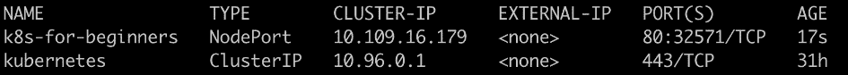

    图 2.11:获取服务列表

    所以，你可能已经注意到`PORT(S)`列输出`80:32571/TCP`。端口`32571`是一个自动生成的端口，暴露在每个节点上，这是有意为之，以便外部用户可以访问它。现在，在继续下一步之前，退出 SSH 会话。

7.  Now, we have the "external port" as `32571`, but we still need to find the external IP. Minikube provides a utility we can use to easily access the `k8s-for-beginners` Service:

    ```
    minikube service k8s-for-beginners
    ```

    您应该会看到类似以下内容的响应:

    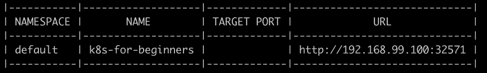

    图 2.12:获取访问节点端口服务的网址和端口

    根据您的环境，这也可能会自动打开浏览器网页，以便您可以访问服务。从网址上，你可以看到服务端口是`32571`。外部 IP 实际上是 Minikube 虚拟机的 IP。

8.  You can also access our application from outside the cluster via the command line:

    ```
    curl http://192.168.99.100:32571
    ```

    您应该会看到以下响应:

    ```
    Hello Kubernetes Beginners!
    ```

综上所述，在本练习中，我们创建了一个`NodePort`服务，使外部用户无需进入集群即可访问内部豆荚。在引擎盖下，有几层交通过渡使这种情况发生:

*   第一层是从外部用户到机器 IP 在自动生成的随机端口(3XXXX)。
*   第二层是从随机端口(3XXXX)到服务 IP (10。在港口`80`。
*   第三层来自服务 IP (10。最终到达端口`8080`处的吊舱 IP。

下面是说明这些相互作用的图表:

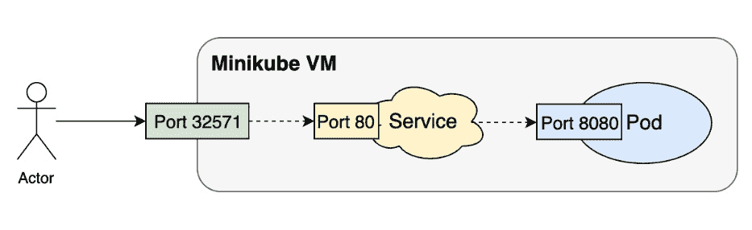

图 2.13:将流量从集群外的用户路由到运行我们应用的 pod

## 服务和吊舱

在上一个练习的*步骤 3* 中，您可能已经注意到服务试图通过标签(在`spec`部分下的`selector`字段)来匹配 pod，而不是使用固定的 pod 名称或类似的东西。从 pod 的角度来看，它不需要知道哪个服务正在为它带来流量。(在一些罕见的情况下，它甚至可以映射到多个服务；也就是说，多个服务可能正在向一个 pod 发送流量。)

这种基于标签的匹配机制在 Kubernetes 中被广泛使用。它使应用编程接口对象能够在运行时松散耦合。例如，您可以将`tier: frontend`指定为标签选择器，标签选择器将依次与被标记为`tier: frontend`的豆荚相关联。

因此，在创建服务时，支持盒是否存在并不重要。稍后创建后备容器是完全可以接受的，并且在创建它们之后，服务对象将与正确的容器相关联。在内部，整个映射逻辑由服务控制器实现，服务控制器是控制器管理器组件的一部分。也有可能一个服务一次有两个匹配的容器，然后创建第三个带有匹配标签的容器，或者删除一个现有的容器。在任一种情况下，服务控制器都可以检测到这种变化，并确保用户始终可以通过服务端点访问他们的应用。

在 Kubernetes 中，使用不同种类的 API 对象编排应用，然后使用标签或其他松散耦合的约定将它们粘合在一起，这是一种非常常用的模式。这也是容器编排的关键部分。

# 交付 Kubernetes-本地应用

在前几节中，我们将一个基于 Docker 的应用迁移到 Kubernetes，并成功地从 Minikube 虚拟机内部和外部访问了它。现在，让我们看看如果我们从头开始设计我们的应用，以便可以使用 Kubernetes 进行部署，Kubernetes 还能提供什么其他好处。

随着应用的使用越来越多，运行某些 pod 的几个副本来提供业务功能可能是很常见的。在这种情况下，仅仅将不同的容器分组在一个容器中是不够的。我们需要继续前进，创造出一组组能够协同工作的豆荚。Kubernetes 为多组 pods 提供了几种抽象，如部署、DaemonSets、Jobs、CronJobs 等。就像服务对象一样，这些对象也可以通过使用在 YAML 文件中定义的规范来创建。

为了开始理解 Kubernetes 的好处，让我们使用一个部署来演示如何在多个单元中复制(放大/缩小)一个应用。

使用 Kubernetes 提取豆荚组具有以下优势:

*   **为冗余创建吊舱的副本**:这是像 Deployments 这样的吊舱组的抽象的主要优势。一个部署可以用给定的规范创建几个容器。部署将自动确保它创建的单元处于在线状态，并且它将自动替换任何出现故障的单元。
*   **轻松升级和回滚** : Kubernetes 提供了不同的策略，可以用来升级应用，也可以回滚版本。这一点很重要，因为在现代软件开发中，软件通常是迭代开发的，更新也经常发布。升级可以改变部署规范中的任何内容。它可以是标签或任何其他字段的更新、映像版本升级、其嵌入容器的更新等等。

让我们看一下示例部署规范的一些值得注意的方面:

k8s-适合初学者-deploy.yaml

```
apiVersion: apps/v1
kind: Deployment
metadata:
  name: k8s-for-beginners
spec:
  replicas: 3
  selector:
    matchLabels:
      tier: frontend
 template:
 metadata:
 labels:
 tier: frontend
 spec:
 containers:
 - name: k8s-for-beginners
 image: packtworkshops/the-kubernetes-workshop:k8s-for-          beginners
```

除了将 pod 规范包装为“模板”，部署还必须指定其种类(`Deployment`)以及 API 版本(`apps/v1`)。

注意

由于某些历史原因，规范名称`apiVersion`仍在使用。但从技术上讲，字面意思是`apiGroupVersion`。在前面的部署示例中，它属于`apps`组，是版本`v1`。

在部署规范中，`replicas`字段指示Kubernetes使用`template`字段中定义的吊舱规范启动三个吊舱。`selector`字段的作用与我们在服务案例中看到的相同，它旨在以松散耦合的方式将部署对象与特定的单元相关联。如果您想要将任何已存在的单元置于新部署的管理之下，这一点尤其有用。

在部署或其他类似的应用编程接口对象中定义的副本号表示有多少个吊舱应该连续运行的期望状态。如果这些豆荚中的一些因为一些意想不到的原因而失败，Kubernetes 会自动检测到这一点，并创建相应数量的豆荚来代替它们。我们将在下面的练习中探讨这一点。

在下面的练习中，我们将看到一个正在运行的部署。

## 练习 2.04 :扩展 Kubernetes 应用

在 Kubernetes 中，通过更新部署规范的`replicas`字段，很容易增加运行应用的副本数量。在本练习中，我们将实验如何上下扩展 Kubernetes 应用。按照以下步骤完成本练习:

1.  Create a file named `k8s-for-beginners-deploy.yaml` using the content shown here:

    ```
    apiVersion: apps/v1
    kind: Deployment
    metadata:
      name: k8s-for-beginners
    spec:
      replicas: 3
      selector:
        matchLabels:
          tier: frontend
      template:
     metadata:
     labels:
     tier: frontend
     spec:
     containers:
     - name: k8s-for-beginners
     image: packtworkshops/the-kubernetes-workshop:k8s-for-          beginners
    ```

    如果你仔细观察，你会发现这个部署规范很大程度上是基于早期练习(`k8s-for-beginners-pod1.yaml`)中的 pod 规范，你可以在`template`字段下看到。

2.  Next, we can use kubectl to create the Deployment:

    ```
    kubectl apply -f k8s-for-beginners-deploy.yaml
    ```

    您应该会看到以下输出:

    ```
    deployment.apps/k8s-for-beginners created
    ```

3.  Given that the Deployment has been created successfully, we can use the following command to show all the Deployment's statuses, such as their names, running pods, and so on:

    ```
    kubectl get deploy
    ```

    您应该会得到以下响应:

    ```
    NAME                   READY   UP-TO-DATE   AVAILABLE    AGE
    k8s-for-beginners      3/3     3            3            41s
    ```

    注意

    如前一条命令所示，我们用`deploy`代替`deployment`。这两种方法都有效，`deploy`是`deployment`允许的简称。您可以在此链接找到一些常用简称的快速列表:[https://kubernetes . io/docs/reference/kube CTL/overview/# resource-type](https://kubernetes.io/docs/reference/kubectl/overview/#resource-types)。

    您也可以通过运行`kubectl api-resources`来查看短名称，而无需指定资源类型。

4.  A pod called `k8s-for-beginners` exists that we created in the previous exercise. To ensure that we see only the pods being managed by the Deployment, let's delete the older pod:

    ```
    kubectl delete pod k8s-for-beginners
    ```

    您应该会看到以下响应:

    ```
    pod "k8s-for-beginners" deleted
    ```

5.  Now, get a list of all the pods:

    ```
    kubectl get pod
    ```

    您应该会看到以下响应:

    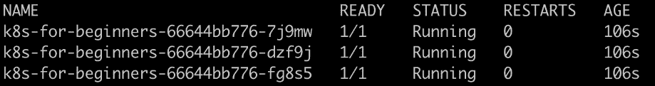

    图 2.14:获取吊舱列表

    部署已经创建了三个容器，它们的标签(在*步骤 1* 中的`labels`字段中指定)恰好与我们在上一节中创建的服务相匹配。那么，如果我们尝试访问该服务，会发生什么？去往该服务的网络流量是否会智能地路由到新的三个吊舱？让我们测试一下。

6.  To see how the traffic is distributed to the three pods, we can simulate a number of consecutive requests to the Service endpoint by running the `curl` command inside a Bash `for` loop, as follows:

    ```
    for i in $(seq 1 30); do curl <minikube vm ip>:<service node port>; done
    ```

    注意

    在此命令中，如果运行的是相同的 Minikube 实例，请使用与上一练习中相同的 IP 和端口。如果您已经重新启动 Minikube 或进行了任何其他更改，请按照上一练习的*步骤 9* 获取 Minikube 集群的正确 IP。

    使用正确的 IP 和端口运行命令后，您应该会看到以下输出:

    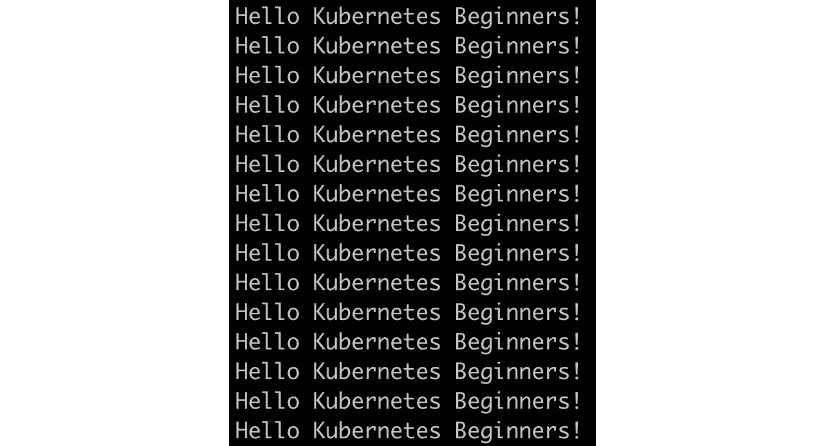

    图 2.15:重复访问我们的应用

    从输出中，我们可以看出所有 30 个请求都获得了预期的响应。

7.  You can run `kubectl logs <pod name>` to check the log of each pod. Let's go one step further and figure out the exact number of requests each pod has responded to, which might help us find out whether the traffic was evenly distributed. To do that, we can pipe the logs of each pod into the `wc` command to get the number of lines:

    ```
    kubectl logs <pod name> | wc -l
    ```

    运行前面的命令三次，复制你获得的 pod 名称，如图*图 2.16* :

    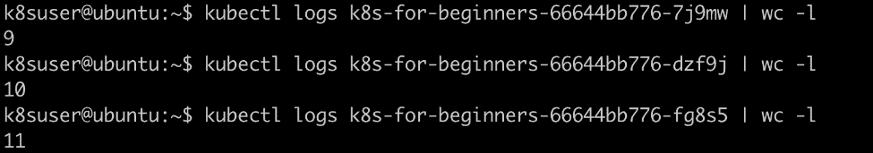

    图 2.16:获取运行我们应用的三个 pod 副本的日志

    结果显示，三个豆荚分别处理了`9`、`10`和`11`请求。由于样本量小，分布不是绝对均匀的(即每个样本的`10`，但足以表明服务使用的默认循环分配策略)。

    注意

    您可以通过查看官方文档了解更多关于 kube-proxy 如何利用 iptables 执行内部负载平衡的信息:https://kubernetes . io/docs/concepts/services-networking/service/# proxy-mode-iptables。

8.  Next, let's learn how to scale up a Deployment. There are two ways of accomplishing this: one way is to modify the Deployment's YAML config, where we can set the value of `replicas` to another number (such as `5`), while the other way is to use the `kubectl scale` command, as follows:

    ```
    kubectl scale deploy k8s-for-beginners --replicas=5
    ```

    您应该会看到以下响应:

    ```
    deployment.apps/k8s-for-beginners scaled
    ```

9.  Let's verify whether there are five pods running:

    ```
    kubectl get pod
    ```

    您应该会看到类似以下内容的响应:

    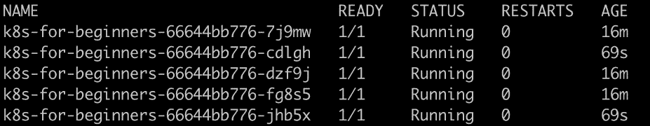

    图 2.17:获取吊舱列表

    输出显示现有的三个吊舱被保留，两个新的吊舱被创建。

10.  Similarly, you can specify replicas that are smaller than the current number. In our example, let's say that we want to shrink the replica's number to `2`. The command for this would look as follows:

    ```
    kubectl scale deploy k8s-for-beginners --replicas=2
    ```

    您应该会看到以下响应:

    ```
    deployment.apps/k8s-for-beginners scaled
    ```

11.  Now, let's verify the number of pods:

    ```
    kubectl get pod
    ```

    您应该会看到类似以下内容的响应:

    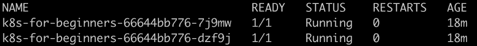

    图 2.18:获取豆荚列表

    如前面的截图所示，有两个吊舱，它们都在按预期运行。因此，用Kubernetes的话来说，我们可以说，“部署处于其期望的状态”。

12.  We can run the following command to verify this:

    ```
    kubectl get deploy
    ```

    您应该会看到以下响应:

    ```
    NAME                   READY    UP-TO-DATE   AVAILABLE    AGE
    k8s-for-beginners      2/2      2            2           19m
    ```

13.  Now, let's see what happens if we delete one of the two pods:

    ```
    kubectl delete pod <pod name>
    ```

    您应该会得到以下响应:

    ```
    pod "k8s-for-beginners-66644bb776-7j9mw" deleted
    ```

14.  Check the status of the pods to see what has happened:

    ```
    kubectl get pod
    ```

    您应该会看到以下响应:

    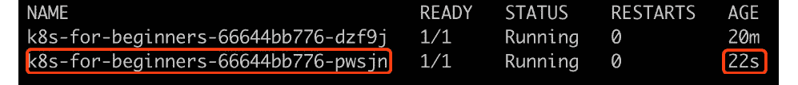

图 2.19:获取吊舱列表

我们可以看到还有两个吊舱。从输出来看，值得注意的是第一个吊舱名称与*图 2.18* 中的第二个吊舱相同(这是没有被删除的那个)，但是突出显示的吊舱名称与*图 2.18* 中的任何一个吊舱都不同。这表示突出显示的窗格是新创建的窗格，用于替换删除的窗格。部署创建了一个新的容器，以便运行容器的数量满足所需的部署状态。

在本练习中，我们学习了如何上下扩展部署。您可以以同样的方式缩放其他类似的 Kubernetes 对象，如 DaemonSets 和 StatefulSets。此外，对于此类对象，Kubernetes 将尝试自动恢复故障吊舱。

# 荚果生命周期和 库伯内特族成分

本章前面几节简要描述了 Kubernetes 组件以及它们如何在内部相互协作。另一方面，我们还演示了如何使用一些 Kubernetes API 对象(Pods、服务和部署)来组合您的应用。

但是一个 Kubernetes API 对象是如何被不同的 Kubernetes 组件管理的呢？让我们以吊舱为例。它的生命周期可以说明如下:

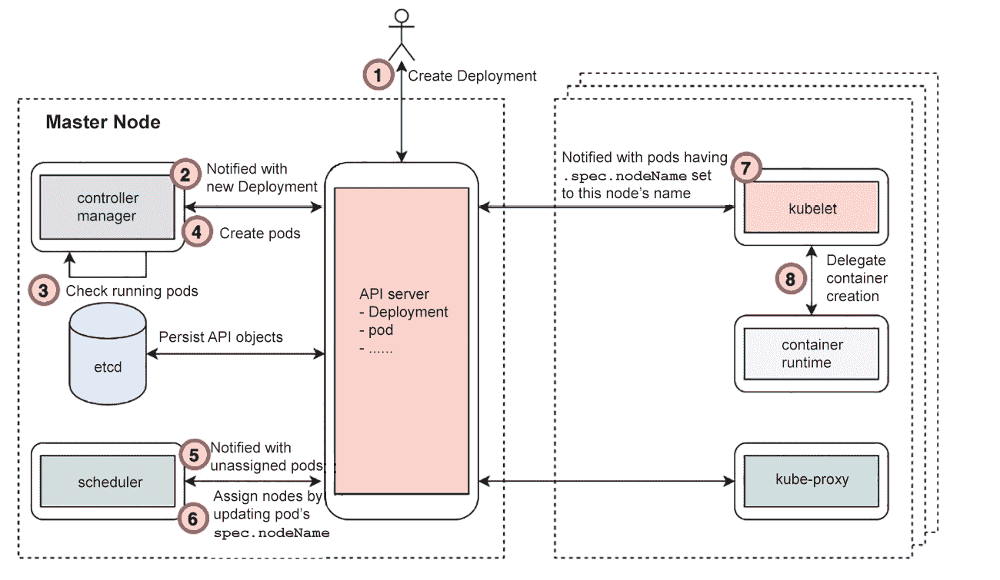

图 2.20:创建 pod 背后的过程

整个过程可以分解如下:

1.  A user starts to deploy an application by sending a Deployment YAML manifest to the Kubernetes API server. The API server verifies the request and checks whether it's valid. If it is, it persists the Deployment API object to its backend datastore (etcd).

    注意

    对于任何通过修改应用编程接口对象而发展的步骤，交互必须发生在 etcd 和应用编程接口服务器之间，因此我们没有将交互明确地列为额外的步骤。

2.  到目前为止，豆荚还没有被创造出来。控制器管理器从应用编程接口服务器获得部署已创建的通知。
3.  然后，控制器管理器检查所需数量的复制盒是否已经在运行。
4.  如果没有足够的吊舱运行，它会创建适当数量的吊舱。pod 的创建是通过向 API 服务器发送带有 pod 规范的请求来完成的。这与用户如何应用部署 YAML 非常相似，但主要区别在于这是在控制器管理器内部以编程方式进行的。
5.  虽然已经创建了 pods，但它们只不过是存储在 etcd 中的一些 API 对象。现在，调度程序从应用编程接口服务器收到一个通知，说已经创建了新的吊舱，并且没有为它们分配运行的节点。
6.  调度程序检查资源使用情况以及现有的 pod 分配，然后计算最适合每个新 pod 的节点。在这一步结束时，调度程序通过将 pod 的`nodeName`规格设置为所选节点，向应用编程接口服务器发送更新请求。
7.  到目前为止，吊舱已经被分配了一个合适的节点来运行。但是，没有运行任何物理容器。换句话说，应用还没有工作。每个 kubelet(在不同的工作节点上运行)都会收到通知，指示一些 pods 预计将运行。然后，每个 kubelet 将检查要运行的 pods 是否已经被分配了 kubelet 正在运行的节点。
8.  一旦 kubelet 确定 pod 应该在其节点上，它就调用底层容器运行时(例如 Docker、container der 或 cri-o)来加速主机上的容器。一旦容器启动，kubelet 负责向 API 服务器报告其状态。

考虑到这个基本流程，您现在应该对以下问题的答案有一个模糊的理解:

*   谁负责豆荚的制作？创造时豆荚的状态是什么？
*   谁负责放置豆荚？放置后吊舱的状态如何？
*   谁带来了混凝土容器？
*   谁负责整个消息传递过程，以确保所有组件协同工作？

在下面的练习中，我们将使用一系列具体的实验来帮助你巩固这种理解。这将让你看到事情在实践中是如何运作的。

## 练习 2.05:如何管理豆荚的生命周期

由于 Kubernetes 集群包含多个组件，并且每个组件同时工作，因此通常很难知道 pod 生命周期的每个阶段到底发生了什么。为了解决这个问题，我们将使用一种电影剪辑技术来“以慢动作播放整个生命周期”，从而观察每个阶段。我们将关闭主平面组件，然后尝试创建一个吊舱。然后，我们将对看到的错误做出反应，并慢慢地将每个组件一个接一个地上线。这将允许我们一步一步地放慢和检查豆荚创造过程的每个阶段。按照以下步骤完成本练习:

1.  First, let's delete the Deployment and Service we created earlier by using the following command:

    ```
    kubectl delete deploy k8s-for-beginners && kubectl delete service k8s-for-beginners
    ```

    您应该会看到以下响应:

    ```
    deployment.apps "k8s-for-beginners" deleted
    service "k8s-for-beginners" deleted
    ```

2.  Prepare two terminal sessions: one (host terminal) to run commands on your host machine and another (Minikube terminal) to pass commands inside the Minikube VM via SSH. Thus, your Minikube session will be initiated like this:

    ```
    minikube ssh
    ```

    您将看到以下输出:

    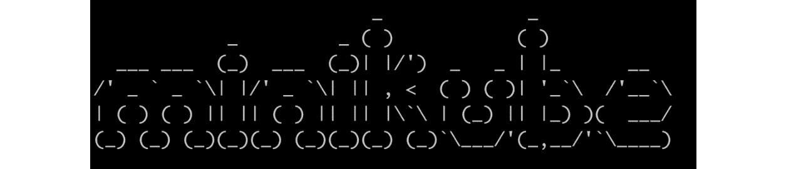

    图 2.21:通过 SSH 访问 Minikube 虚拟机

    注意

    所有`kubectl`命令预计将在主机终端会话中运行，而所有`docker`命令将在 Minikube 终端会话中运行。

3.  In the Minikube session, clean up all stopped Docker containers:

    ```
    docker rm $(docker ps -a -q)
    ```

    您应该会看到以下输出:

    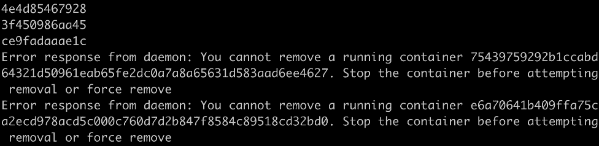

    图 2.22:清理所有停止的 Docker 容器

    您可能会看到一些错误消息，例如“您无法删除正在运行的容器……”。这是因为前面的`docker rm`命令针对所有容器(`docker ps -a -q`)运行，但不会停止任何正在运行的容器。

4.  In the Minikube session, stop the kubelet by running the following command:

    ```
    sudo systemctl stop kubelet
    ```

    成功执行后，此命令不会显示任何响应。

    注意

    在本练习的后面，我们将手动停止和启动其他 Kubernetes 组件，例如 API 服务器，这些组件由 Minikube 环境中的 kubelet 管理。因此，要求你在这个练习中首先停止 kubelet 否则，kubelet 将自动重新启动其托管组件。

    请注意，在典型的生产环境中，与 Minikube 不同，没有必要在主节点上运行 kubelet 来管理主平面组件；kubelet 只是工作节点上的强制组件。

5.  After 30 seconds, check the cluster's status by running the following command in your host terminal session:

    ```
    kubectl get node
    ```

    您应该会看到以下响应:

    ```
    NAME         STATUS       ROLES      AGE       VERSION
    minikube     NotReady     master     32h       v1.16.2
    ```

    预计`minikube`节点的状态将更改为`NotReady`，因为 kubelet 已经停止。

6.  In your Minikube session, stop `kube-scheduler`, `kube-controller-manager`, and `kube-apiserver`. As we saw earlier, all of these are running as Docker containers. Hence, you can use the following commands, one after the other:

    ```
    docker stop $(docker ps | grep kube-scheduler | grep -v pause | awk '{print $1}')
    docker stop $(docker ps | grep kube-controller-manager | grep -v pause | awk '{print $1}')
    docker stop $(docker ps | grep kube-apiserver | grep -v pause | awk '{print $1}')
    ```

    您应该会看到以下响应:

    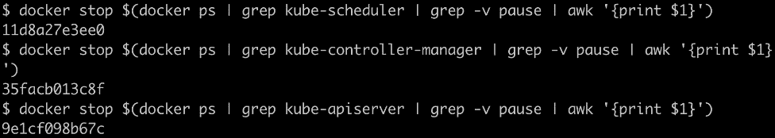

    图 2.23:停止运行 Kubernetes 组件的容器

    正如我们在 *Kubernetes 组件概述*一节中所解释的那样，`grep -v pause | awk '{print $1}'`命令可以获取所需 Docker 容器的确切容器 ID ( `$1` =第一列)。然后，`docker pause`命令可以暂停正在运行的 Docker 容器。

    现在，三个主要的 Kubernetes 组件已经停止。

7.  现在，您需要在您的主机上创建一个部署规范。创建一个名为`k8s-for-beginners-deploy2.yaml`的文件，内容如下:

    ```
    apiVersion: apps/v1
    kind: Deployment
    metadata:
      name: k8s-for-beginners
    spec:
      replicas: 1
      selector:
        matchLabels:
          tier: frontend
      template:
        metadata:
          labels:
            tier: frontend
        spec:
          containers:
          - name: k8s-for-beginners
            image: packtworkshops/the-kubernetes-workshop:k8s-for-          beginners
    ```

8.  Try to create the Deployment by running the following command on your host session:

    ```
    kubectl apply -f k8s-for-beginners-deploy2.yaml
    ```

    您应该会看到类似这样的响应:

    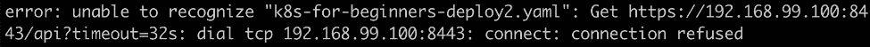

    图 2.24:尝试创建新部署

    不出所料，我们得到了一个网络超时错误，因为我们故意停止了 Kubernetes API 服务器。如果 API 服务器关闭，您不能运行任何`kubectl`命令或使用任何依赖 API 请求的等效工具(如 Kubernetes 仪表板):

    ```
    The connection to the server 192.168.99.100:8443 was refused – did you specify the right host or port?
    ```

9.  Let's see what happens if we restart the API server and try to create the Deployment once more. Restart the API server container by running the following command in your Minikube session:

    ```
    docker start $(docker ps -a | grep kube-apiserver | grep -v pause | awk '{print $1}')
    ```

    该命令试图找到承载 API 服务器的停止容器的容器 ID，然后启动它。你应该得到这样的回答:

    ```
    9e1cf098b67c
    ```

10.  Wait for 10 seconds. Then, check whether the API server is online. You can run any simple kubectl command for this. Let's try getting the list of nodes by running the following command in the host session:

    ```
    kubectl get node
    ```

    您应该会看到以下响应:

    ```
    NAME         STATUS       ROLES      AGE       VERSION
    minikube     NotReady     master     32h       v1.16.2
    ```

    正如你所看到的，我们能够得到一个没有错误的回应。

11.  Let's try to create the Deployment again:

    ```
    kubectl apply -f k8s-for-beginners-deploy2.yaml
    ```

    您应该会看到以下响应:

    ```
    deployment.apps/k8s-for-beginners created
    ```

12.  Let's check whether the Deployment has been created successfully by running the following command:

    ```
    kubectl get deploy
    ```

    您应该会看到以下响应:

    ```
    NAME               READY     UP-TO-DATE    AVAILABLE   AGE
    k8s-for-beginners  0/1       0             0           113s
    ```

    从前面的截图来看，似乎有问题，因为在`READY`列中，我们可以看到`0/1`，这表明有 0 个吊舱与此部署相关联，而所需的数量是 1(我们在部署规范的`replicas`字段中指定)。

13.  Let's check that all the pods that are online:

    ```
    kubectl get pod
    ```

    您应该会得到类似以下内容的回复:

    ```
    No resources found in default namespace.
    ```

    我们可以看到我们的吊舱还没有被创造出来。这是因为 Kubernetes API 服务器只创建 API 对象；任何 API 对象的实现都是由其他组件执行的。例如，在部署的情况下，是`kube-controller-manager`创建了相应的吊舱。

14.  Now, let's restart the `kube-controller-manager`. Run the following command in your Minikube session:

    ```
    docker start $(docker ps -a | grep kube-controller-manager | grep -v pause | awk '{print $1}')
    ```

    您应该会看到类似以下内容的响应:

    ```
    35facb013c8f
    ```

15.  After waiting for a few seconds, check the status of the Deployment by running the following command in the host session:

    ```
    kubectl get deploy
    ```

    您应该会看到以下响应:

    ```
    NAME               READY     UP-TO-DATE    AVAILABLE   AGE
    k8s-for-beginners  0/1       1             0           5m24s
    ```

    正如我们所看到的，我们正在寻找的吊舱仍然没有上线。

16.  Now, check the status of the pod:

    ```
    kubectl get pod
    ```

    您应该会看到以下响应:

    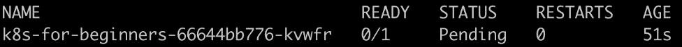

    图 2.25:获取吊舱列表

    输出与*步骤 15* 中的输出不同，因为在这种情况下，一个吊舱由`kube-controller-manager`创建。但是，我们可以在`STATUS`栏下看到`Pending`。这是因为将 pod 分配给合适的节点不是`kube-controller-manager`的责任；这是`kube-scheduler`的责任。

17.  Before starting `kube-scheduler`, let's take a look at some additional information about the pod:

    ```
    kubectl get pod -o wide
    ```

    您应该会看到以下响应:

    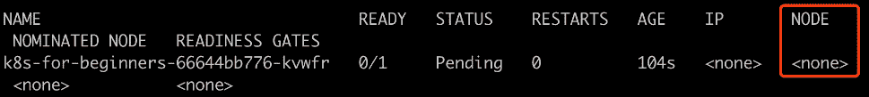

    图 2.26:获取关于 pod 的更多信息

    突出显示的`NODE`列表示没有节点被分配给该窗格。这证明调度程序工作不正常，我们知道这一点是因为我们将其脱机。如果调度程序是在线的，这个响应将表明没有地方让这个吊舱着陆。

    注意

    您将在*第 17 章*、*Kubernetes*中了解更多关于吊舱调度的信息。

18.  Let's restart `kube-scheduler` by running the following command in the Minikube session:

    ```
    docker start $(docker ps -a | grep kube-scheduler | grep -v pause | awk '{print $1}')
    ```

    您应该会看到类似以下内容的响应:

    ```
    11d8a27e3ee0
    ```

19.  We can verify that `kube-scheduler` is working by running the following command in the host session:

    ```
    kubectl describe pod k8s-for-beginners-66644bb776-kvwfr
    ```

    请从您在*步骤 17* 得到的响应中获取吊舱名称，如*图 2.26* 所示。您应该会看到以下输出:

    ```
    Name:         k8s-for-beginners-66644bb776-kvwfr
    Namespace:    default
    Priority:     0
    Node:         <none>
    ```

    为了更好地展示，我们正在截断输出截图。请看以下摘录，突出`Events`部分:

    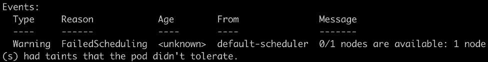

    图 2.27:检查 pod 报告的事件

    在`Events`部分，我们可以看到`kube-scheduler`已经尝试调度，但是它报告没有可用的节点。为什么会这样？

    这是因为，之前，我们停止了 kubelet，而 Minikube 环境是一个单节点集群，因此没有可用的节点具有可以放置 pod 的正常 kubelet。

20.  Let's restart the kubelet by running the following command in the Minikube session:

    ```
    sudo systemctl start kubelet
    ```

    成功执行后，终端中不应给出任何响应。

21.  In the host terminal, verify the status of the Deployment by running the following command in the host session:

    ```
    kubectl get deploy
    ```

    您应该会看到以下响应:

    ```
    NAME               READY     UP-TO-DATE    AVAILABLE   AGE
    k8s-for-beginners  1/1       1             1           11m
    ```

    现在，一切看起来都很健康，因为部署在`READY`列下显示`1/1`，这意味着 pod 在线。

22.  Similarly, verify the status of the pod:

    ```
    kubectl get pod -o wide
    ```

    您应该会得到类似如下的输出:

    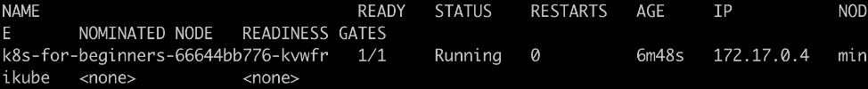

图 2.28:获取关于 pod 的更多信息

我们可以在`STATUS`下看到`Running`，它已经被分配到`minikube`节点。

在本练习中，我们通过打破 Kubernetes 组件，然后一个接一个地恢复它们，来追踪豆荚生命周期的每个阶段。根据我们对这个练习的观察，我们对本次演习前提出的问题有了更清楚的答案:

*   **步骤 12–16**:我们看到在部署的情况下，控制器管理器负责请求创建 pods。
*   **步骤 17–19**:调度器负责选择放置在吊舱中的节点。它通过将吊舱的`nodeName`规格设置为所需节点来分配节点。此时，将 pod 与节点相关联仅仅发生在 API 对象级别。
*   **第 20-22 步**:库贝莱实际上是提起容器来让我们的吊舱运行。

在一个吊舱的整个生命周期中，Kubernetes 组件通过适当地更新一个吊舱的规格来进行合作。应用编程接口服务器是接受 pod 更新请求以及向相关方报告 pod 更改的关键组件。

在接下来的活动中，我们将集合本章中学习的技能，了解如何从基于容器的环境迁移到 Kubernetes 环境，以便运行我们的应用。

## 活动 2.01:在 Kubernetes 运行 P 年龄视图应用

在*活动 1.01* 、*创建一个简单的页面计数应用*中，在前一章中，我们构建了一个名为 Pageview 的 web 应用，并将其连接到 Redis 后端数据存储。那么，这里有一个问题:在不对源代码进行任何更改的情况下，我们可以将基于 Docker 的应用迁移到 Kubernetes 并立即享受 Kubernetes 的好处吗？根据给定的指导方针，在本活动中尝试一下。

本活动分为两部分:在第一部分中，我们将使用我们的应用创建一个简单的 pod，该 pod 通过一个 Service 暴露给集群外的流量，并连接到作为另一个 pod 运行的 Redis 数据存储区。在第二部分中，我们将把应用扩展到三个副本。

**使用服务将页面视图应用连接到 Redis 数据存储**

类似于 Docker 中的`--link`选项，Kubernetes 提供了一个服务，作为一个抽象层来展示一个可以在内部或外部访问的应用(比如，一系列标有相同标签集的豆荚)。例如，正如我们在本章中讨论的，前端应用可以通过`NodePort`服务公开，以便外部用户可以访问。除此之外，在本活动中，我们需要定义一个内部服务，以便向前端应用公开后端应用。请遵循以下步骤:

1.  在*活动 1.01* 、*创建一个简单的页面计数应用*中，我们构建了两个 Docker 映像—一个用于前端页面视图 web 应用，另一个用于后端 Redis 数据存储。您可以使用我们在本章中学习的技能将它们迁移到 Kubernetes YAMLs 中。
2.  Two pods (each managed by a Deployment) for the application is not enough. We also have to create the Service YAML to link them together.

    确保清单中的`targetPort`字段与 Redis 映像中定义的暴露端口一致，在本例中为`6379`。就`port`字段而言，理论上，它可以是任何端口，只要它与页面视图应用中指定的端口一致。

    这里值得一提的另一件事是 Redis 数据存储的 pod 的`name`字段。它是页面视图应用源代码中引用 Redis 数据存储的符号。

    现在，您应该有三个 YAMLs 两个豆荚和一个服务。使用`kubectl -f <yaml file name>`应用它们，然后使用`kubectl get deploy,service`确保它们被成功创建。

3.  At this stage, the Pageview app should function well since it's connected to the Redis app via the Service. However, the Service only works as the internal connector to ensure they can talk to each other inside the cluster.

    要从外部访问页面视图应用，我们需要定义一个`NodePort`服务。与内部服务不同，我们需要明确指定`type`为`NodePort`。

4.  使用`kubectl -f <yaml file name>`应用外部服务 YAML。
5.  运行`minikube service <external service name>`获取服务网址。
6.  多次访问该网址，以确保页面视图数量每次增加一个。

至此，我们已经在 Kubernetes 中成功运行了 Pageview 应用。但是如果页面视图应用关闭了呢？虽然 Kubernetes 可以自动创建一个替换 pod，但在检测到故障和新 pod 准备就绪之间仍有停机时间。

常见的解决方案是增加应用的副本数量，以便只要至少有一个副本在运行，整个应用都可用。

**在多个副本中运行页面视图应用**

页面视图应用当然可以使用单个副本。但是，在生产环境中，高可用性是必不可少的，这是通过跨节点维护多个副本以避免单点故障来实现的。(这将在后面的章节中详细介绍。)

在 Kubernetes 中，为了确保应用的高可用性，我们可以简单地增加副本数量。请按照以下步骤操作:

1.  修改 YAML 页面视图，将`replicas`更改为`3`。
2.  通过运行`kubectl apply -f <pageview app yaml>`应用这些更改。
3.  通过运行`kubectl get pod`，你应该能够看到三个页面视图吊舱在运行。
4.  Access the URL shown in the output of the `minikube service` command multiple times.

    检查每个窗格的日志，查看请求是否在三个窗格中得到平均处理。

5.  现在，让我们验证一下页面视图应用的高可用性。在保持一个健康的豆荚的同时，连续终止任意豆荚。您可以通过编写脚本来手动或自动实现这一点。或者，您可以打开另一个终端，检查页面视图应用是否始终可以访问。

如果您选择编写脚本来终止 pods，您将看到类似以下的结果:

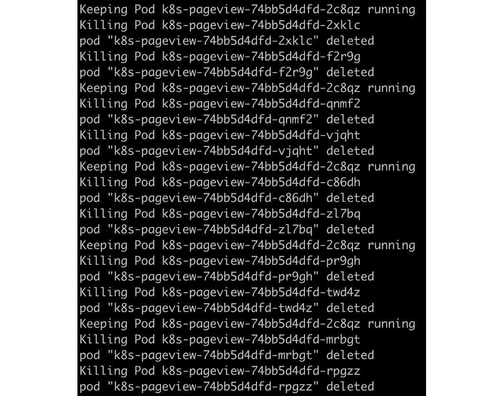

图 2.29:通过脚本杀死豆荚

假设您采用了类似的方法，并编写了一个脚本来检查应用是否在线，您应该会看到类似以下内容的输出:

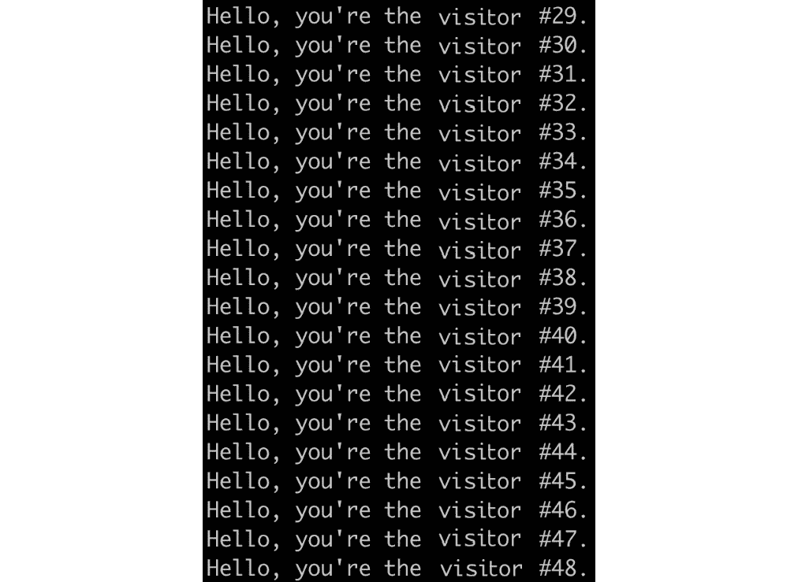

图 2.30:通过脚本重复访问应用

注意

该活动的解决方案可在以下地址找到:[https://packt.live/304PEoD](https://packt.live/304PEoD)。

## 多节点集群的 Kubernetes 优势一瞥

只有在多节点集群的背景下看到 Kubernetes 的优势，才能真正体会到它的优势。与本书的许多其他章节一样，本章使用单节点集群(Minikube 环境)来演示 Kubernetes 提供的功能。然而，在真实的生产环境中，Kubernetes 部署有多个工作节点和主节点。只有这样，您才能确保单个节点中的故障不会影响应用的总体可用性。可靠性只是多节点 Kubernetes 集群能给我们带来的众多好处之一。

但是等等——我们不需要使用 Kubernetes 就可以实现应用并以高度可用的方式*部署它们，这难道不是真的吗？没错，但这通常会带来很多管理上的麻烦，无论是在管理应用还是基础架构方面。例如，在初始部署期间，您可能必须手动干预以确保所有冗余容器没有在同一台机器上运行。在节点出现故障的情况下，您不仅需要确保新的复制副本得到正确重新分配，而且为了保证高可用性，您还需要确保新的复制副本不会落在已经运行现有复制副本的节点上。这可以通过使用 DevOps 工具或在应用端注入逻辑来实现。然而，这两种方式都非常复杂。Kubernetes 提供了一个统一的平台，通过使用 Kubernetes 原语(API 对象)描述我们想要的高可用性特性，我们可以使用该平台将应用连接到适当的节点。这种模式解放了应用开发人员的思想，因为他们只需要考虑如何构建他们的应用。高可用性所需的功能，如故障检测和恢复，由 Kubernetes 在幕后负责。*

# 总结

在本章中，我们使用 Minikube 来配置单节点 Kubernetes 集群，并对 Kubernetes 的核心组件及其关键设计原理进行了概要介绍。之后，我们将一个现有的 Docker 容器迁移到 Kubernetes，并探索了一些基本的 Kubernetes API 对象，例如 pods、Services 和 Deployments。最后，我们有意破坏了一个 Kubernetes 集群，并一次恢复一个组件，这使我们能够理解不同的 Kubernetes 组件如何协同工作，使一个 pod 在一个节点上启动并运行。

在本章中，我们一直使用 kubectl 来管理我们的集群。我们快速介绍了这个工具，但是在下一章中，我们将更仔细地了解这个强大的工具，并探索我们可以使用它的各种方式。