# 3 .忽必烈-忽必烈指挥中心

概观

在本章中，我们将解开一些常见的 kubectl 命令，并看看如何使用 kubectl 来控制我们的 Kubernetes 集群。我们将在这一章开始时，简单了解一下当使用 kubectl 命令与 Kubernetes 集群通信时，端到端过程是什么样子的。然后，我们将为 Bash 终端设置一些快捷方式和自动完成功能。我们将从使用 kubectl 的基础开始，学习如何创建、删除和管理 Kubernetes 对象。我们将通过练习了解 Kubernetes 中管理资源的两种方法——声明式和命令式。到本章结束时，您还将学习如何使用 Kubernetes 实时更新运行在 Kubernetes 集群上的实时应用。

# 简介

在*第 1 章**库本内斯和容器介绍*中，我们看到库本内斯是一个可移植的、高度可扩展的开源容器编排工具。它提供了非常强大的功能，可用于大规模管理容器化工作负载。在前一章中，您已经大致了解了 Kubernetes 的不同组件是如何协同工作以实现预期目标的。我们还在*第二章*中演示了 kubectl 的一些基本用法。在这一章中，我们将更仔细地看看这个实用程序，看看我们如何利用它的潜力。

重申一下，kubectl 是一个命令行实用程序，用于与 Kubernetes 集群交互并执行各种操作。有两种方法可以在管理集群时使用 kubectl 命令式管理和声明式管理，前者侧重于命令而不是 YAML 清单，以实现所需的状态，后者侧重于创建和更新 YAML 清单文件。kubectl 可以支持这两种管理技术来管理 Kubernetes API 对象(也称为 Kubernetes API 原语)。在前一章中，我们看到了各种组件如何不断尝试将集群的状态从实际状态更改为所需状态。这可以通过使用 kubectl 命令或 YAML 清单来实现。

kubectl 允许您向 Kubernetes 集群发送命令。`kubectl`命令可用于部署应用、检查和管理 Kubernetes 对象，或进行故障排除和查看日志。有趣的是，尽管 kubectl 是控制 Kubernetes 集群并与之通信的标准工具，但它并不与 Kubernetes 一起提供。因此，即使您在集群的任何节点上运行 kubect，您也需要单独安装 kubect 二进制文件，这是我们在上一章的*练习 2.01* 、【Minikube 和 Kubernetes 集群入门中所做的。

本章将引导您了解 kubectl 的幕后功能，并提供更多关于如何使用 kubectl 命令与一些常用的 Kubernetes 对象进行交互的见解。我们将学习如何为 kubectl 设置一些快捷方式。我们将引导您不仅使用 Kubernetes 创建新的对象，还将对 Kubernetes 中的实时部署进行更改。但在此之前，让我们先从窗帘后面看一眼，了解一下 kubectl 是如何与 Kubernetes 交流的。

# 库贝斯克如何与库贝斯克沟通

正如我们在上一章中看到的，API 服务器管理最终用户和 Kubernetes 之间的通信，它还充当集群的 API 网关。为了实现这一点，它通过 HTTP 和 HTTPS 协议实现了 RESTful API，以执行 CRUD 操作，从而根据用户通过 kubectl 发送的指令来填充和修改 Kubernetes API 对象，如 pods、服务等。这些说明可以是各种形式。例如，要检索集群中运行的吊舱的信息，我们将使用`kubectl get pods`命令，而要创建新的吊舱，我们将使用`kubectl run`命令。

首先，让我们看看当你运行一个`kubectl`命令时，幕后发生了什么。请看下图，它提供了该过程的概述，然后我们将进一步了解该过程的不同细节:

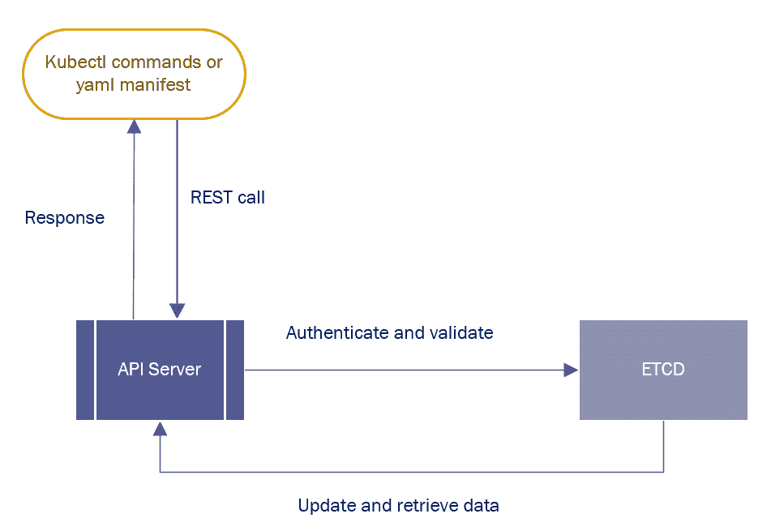

图 3.1:kube CTL 实用程序的典型流程图

kubectl 命令被转换成 API 调用，然后被发送到 API 服务器。然后，应用编程接口服务器验证并确认请求。一旦认证和验证阶段成功，应用编程接口服务器在`etcd`中检索和更新数据，并以请求的信息进行响应。

# 使用自动完成和快捷方式设置环境

在大多数 Linux 环境中，在开始使用本章中提到的指令之前，您可以为 kubectl 命令设置自动完成。了解自动完成和快捷方式在 Linux 环境中的工作方式将对那些有兴趣获得认证的人有很大帮助，例如由 Linux 基金会授予的**认证 Kubernetes 管理员** ( **CKA** )和**认证 Kubernetes 应用开发人员** ( **CKAD** )。我们将在下面的练习中学习如何设置自动完成。

## 练习 3.01:设置自动完成

在本练习中，我们将向您展示如何在 Bash 中设置自动完成和 kubectl 命令的别名。这是一个有用的功能，将帮助您节省时间，避免错别字。执行以下步骤完成本练习:

1.  我们需要`bash-completion`包，如果还没有安装就安装。您可以在[https://github.com/scop/bash-completion](https://github.com/scop/bash-completion)前往 GitHub 资源库获取各种平台的安装说明。如果您正在运行 Ubuntu 20.04，您可以使用以下命令通过 APT 包管理器安装它:

    ```
    sudo apt-get install bash-completion
    ```

2.  You can use the following command to set up autocomplete in Bash:

    ```
    source <(kubectl completion bash)
    ```

    注意

    该命令以及本练习中的后续命令在成功执行后不会在终端中显示任何响应。

3.  如果你想让自动完成在你的 Bash shell 中持久化，你可以使用下面的命令，它会把`kubectl`自动完成写到你当前用户目录中的`.bashrc`文件中:

    ```
    echo "source <(kubectl completion bash)" >> ~/.bashrc 
    ```

4.  您也可以使用`alias`关键字为您的`kubectl`命令设置别名，如下所示:

    ```
    alias k=kubectl
    ```

5.  同样，如果您想为某些特定命令设置别名，您可以使用类似如下的命令:

    ```
    alias kcdp='kubectl describe po'
    alias kcds='kubectl describe svc'
    alias kcdd='kubectl describe deploy'
    ```

6.  Finally, you can use the following command to set up the completion of `kubectl` commands when you press *Tab*:

    ```
    complete -F __start_kubectl k
    ```

    注意

    您也可以使用以下命令在`zsh`(Bash shell 的替代)中设置自动完成:

    `source <(kubectl completion zsh)`

    `echo "if [ $commands[kubectl] ]; then source <(kubectl completion zsh); fi" >> ~/.zshrc`

在本练习结束时，您将为您的 Bash shell 设置一个自动完成功能。您也可以在命令中使用别名，如`k`而不是`kubectl`。然而，为了避免混淆并保持标准化的结构，我们将在本书中使用完整的命令。

## 设置 kubeconfig 配置文件

在大多数企业环境中，通常有多个 Kubernetes 集群，这取决于组织的策略。管理员、开发人员或处理 Kubernetes 集群的任何其他角色都需要与这些集群中的几个进行交互，并在它们之间进行切换，以便在不同的集群上执行不同的操作。

配置文件让事情变得简单多了。您可以使用该文件存储关于不同集群、用户、命名空间和身份验证机制的信息。这样的配置文件被称为 **kubeconfig** 文件。请注意，kubeconfig 是引用 kubectl 配置文件的通用方式，它不是`config`文件的名称。kubectl 使用这样的文件来存储我们选择集群和与其 API 服务器通信所需的信息。

默认情况下，kubectl 在`$HOME/.kube`目录中查找文件。在大多数情况下，您可以指定一个`KUBECONFIG`环境变量或使用`--kubeconfig`标志来指定 kubeconfig 文件。那些文件通常保存在`$HOME/.kube/config`中。

注意

您可以通过在[https://kubernetes . io/docs/tasks/access-application-cluster/configure-access-multi-clusters/# set-kubernetic-environment-variable](https://kubernetes.io/docs/tasks/access-application-cluster/configure-access-multiple-clusters/#set-the-kubeconfig-environment-variable)处设置`KUBECONFIG`环境变量和`--kubeconfig`标志，了解如何配置对多个集群的访问。

安全上下文用于定义 pods 的权限和访问控制设置。我们将在*第 13 章*、*运行时和*中重新讨论访问控制和安全的概念。

让我们看一下 kubeconfig 文件，了解这是如何工作的。您可以使用以下命令查看 kubeconfig 文件:

```
kubectl config view
```

或者，您也可以使用以下命令:

```
cat $HOME/.kube/config
```

您应该会得到类似如下的输出:

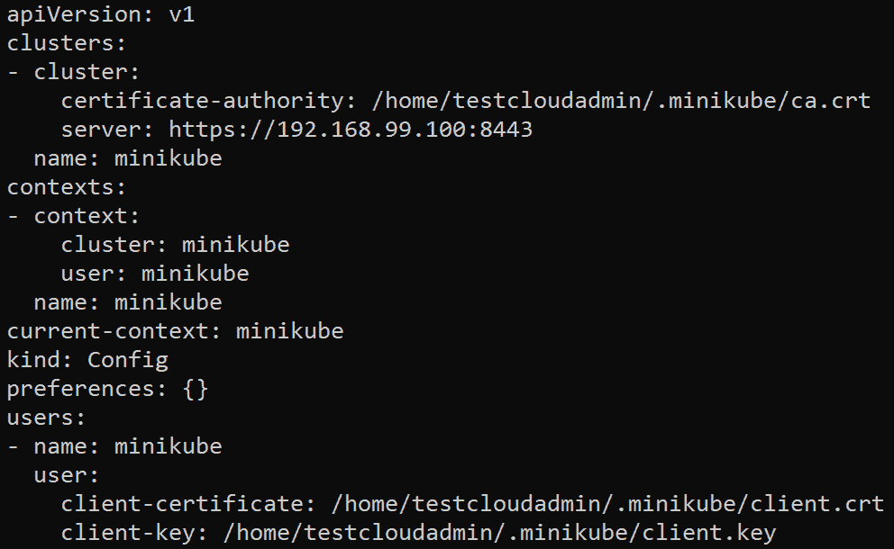

图 3.2:kube CTL 配置视图命令的输出

A `context`是访问一个集群所需要的一组信息。它包含集群的名称、用户和命名空间。*图 3.2* 中的`current-context`字段显示了您正在使用的当前上下文。如果要切换当前上下文，可以使用以下命令:

```
kubectl config use-context <the cluster you want to switch to>
```

例如，如果我们想要切换到名为`minikube`的上下文，我们将使用以下命令:

```
kubectl config use-context minikube
```

这将产生类似如下的输出:

```
Switched to context "minikube".
```

# 常用库必选命令

如前所述，kubectl 是一个 CLI 工具，用于与 Kubernetes API 服务器进行通信。kubectl 有很多有用的命令来使用 Kubernetes。在本节中，我们将向您介绍一些常用的 Kubernetes 命令和快捷方式，它们用于管理 Kubernetes 对象。

## 创建、管理和删除 Kubernetes 对象的常用 Kubernetes 命令

有几个简单的 kubectl 命令，您几乎会一直使用。在本节中，我们将了解一些基本的 kubectl 命令:

*   `get <object>`:可以用这个命令得到想要的对象类型列表。使用`all`而不是指定一个对象类型会得到各种对象的列表。默认情况下，这将获得默认命名空间中指定对象类型的列表。您可以使用`-n`标志从特定的名称空间获取对象；例如`kubectl get pod -n mynamespace`。
*   `describe <object-type> <object-name>`:可以使用此命令查看特定对象的所有相关信息；例如，`kubectl describe pod mypod`。
*   `logs <object-name>`:你可以使用这个命令来检查特定对象的所有相关日志，找出该对象创建时发生了什么；例如，`kubectl logs mypod`。
*   `edit <object-type> <object-name>`:可以使用此命令编辑特定对象；例如，`kubectl edit pod mypod`。
*   `delete <object-type> <object-name>`:可以使用此命令删除特定对象；例如，`kubectl delete pod mypod`。
*   `create <filename.yaml>`:可以用这个命令创建一堆已经在 YAML 清单文件中定义的 Kubernetes 对象；例如，`kubectl create -f your_spec.yaml`。
*   `apply <filename.yaml>`:可以用这个命令创建或者更新一堆已经在 YAML 清单文件中定义的 Kubernetes 对象；例如，`kubectl apply -f your_spec.yaml`。

## 一些简单的 kubectl 命令的演练

在本节中，我们将向您介绍一些常用的 kubectl 命令。本节主要用于演示目的，因此您可能看不到在这些映像中看到的确切输出。但是，本节将帮助您理解如何使用这些命令。在以后的练习中，以及在本书中，你会广泛地使用其中的大部分。让我们来看看:

*   If you want to display nodes, use the following command:

    ```
    kubectl get nodes
    ```

    您将看到类似如下的输出:

    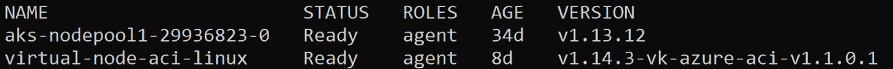

图 3.3:kube CTL 获取节点命令的输出

由于我们在*练习 3.01* 、*设置自动完成*中设置了别名，所以您也可以使用以下命令获得相同的结果:

```
k get no
```

*   If you want to display all current namespaces, you can use the following command:

    ```
    kubectl get namespaces
    ```

    您应该会看到类似如下的输出:

    ```
    NAME                  STATUS         AGE
    default               Active         7m5s
    kube-node-lease       Active         7m14s
    kube-public           Active         7m14s
    kube-system           Active         7m15s
    ```

    您也可以使用以下缩短的命令获得相同的结果:

    ```
    k get ns
    ```

*   If you want to check the version of `kubectl`, you can use the following command:

    ```
    kubectl version
    ```

    您将看到类似如下的输出:

    ```
    Client version: version.Info{Major:"1", Minor:"17", GitVersion:"v1.17.2, GitCommit: 59603c6e503c87169aea6106f57b9f242f64df89", GitTreeState:"clean", BuildDate:"2020-01-21T22:17:28Z, GoVersion:"go1.13.5", Compiler:"gc", Platform:"linux/amd64}
    Server version: version.Info{Major:"1", Minor:"17", GitVersion:"v1.17.2, GitCommit: 59603c6e503c87169aea6106f57b9f242f64df89", GitTreeState:"clean", BuildDate:"2020-01-18T23:22:30Z, GoVersion:"go1.13.5", Compiler:"gc", Platform:"linux/amd64}
    ```

*   If you want to see some information regarding your current Kubernetes cluster, you can use the following command:

    ```
    kubectl cluster-info
    ```

    您应该会看到类似如下的输出:

    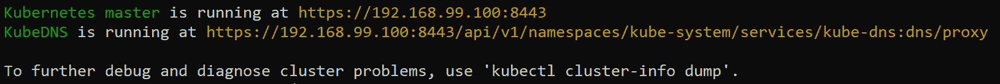

图 3.4:kube CTL 集群信息命令的输出

在我们继续演示之前，我们将提到几个可以用来创建示例应用的命令，我们已经在本章的 GitHub 存储库中提供了这些命令。使用以下命令获取运行应用所需的所有对象的 YAML 规范:

```
curl https://raw.githubusercontent.com/PacktWorkshops/Kubernetes-Workshop/master/Chapter03/Activity03.01/sample-application.yaml --output sample-application.yaml
```

现在，您可以使用以下命令部署`sample-application.yaml`文件:

```
kubectl apply -f sample-application.yaml 
```

如果您可以看到以下输出，这意味着示例应用已经在您的 Kubernetes 集群中成功创建:

```
deployment.apps/redis-back created
service/redis-back created
deployment.apps/melonvote-front created
service/melonvote-front created
```

现在您已经部署了提供的应用，如果您尝试本节后面显示的任何命令，您将看到与该应用相关的各种对象、事件等。请注意，您的输出可能与此处显示的映像不完全匹配:

*   You can use the following command to get everything in your cluster under the `default` namespace:

    ```
    kubectl get all
    ```

    这将产生类似如下的输出:

    

图 3.5:kube CTL get all 命令的输出

*   Events describe what has happened so far in the Kubernetes cluster, and you can use events to get a better insight into your cluster and aid in any troubleshooting efforts. To list all the events in the default namespace, use the following command:

    ```
    kubectl get events
    ```

    这将产生类似如下的输出:

    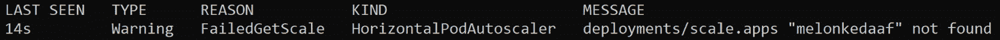

图 3.6:kube CTL 获取事件命令的输出

*   A service is an abstraction that's used to expose an application to the end-user. You will learn more about services in *Chapter 8*, *Service Discovery*. You can use the following command to list all services:

    ```
    kubectl get services
    ```

    这将产生类似如下的输出:

    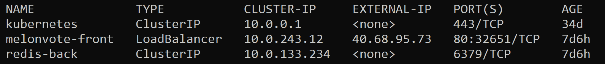

图 3.7:kube CTL 获取服务命令的输出

您可以使用以下缩短的命令获得相同的结果:

```
k get svc
```

*   A Deployment is an API object that allows us to easily manage and update pods. You will learn more about Deployments in *Chapter 7*, *Kubernetes Controllers*. You can get the list of Deployments using the following command:

    ```
    kubectl get deployments 
    ```

    这应该给出类似于以下内容的响应:

    ```
    NAME               READY    UP-TO-DATE    AVAILABLE     AGE
    aci-helloworld     1/1      1             1             34d
    melonvote-front    1/1      1             1             7d6h
    redis-back         1/1      1             1             7d6h
    ```

    您也可以使用以下命令的缩短版本获得相同的结果:

    ```
    k get deploy
    ```

### get 命令的一些有用标志

如您所见，`get`命令是一个非常标准的命令，当我们需要获取集群中的对象列表时会用到它。它还有几个有用的标志。让我们来看看其中的几个:

*   If you want to list a particular type of resource from all your namespaces, you can add the `--all-namespaces` flag in the command. For example, if we want to list all Deployments from all namespaces, we can use the following command:

    ```
    kubectl get deployments --all-namespaces
    ```

    这将产生类似如下的输出:

    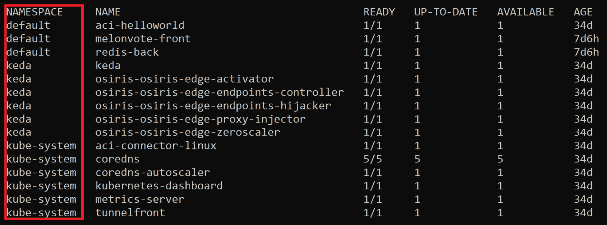

图 3.8:kube CTL 的输出获得了所有名称空间下的部署

您还可以看到左侧有一个额外的列，它指定了各个部署的名称空间。

*   If you want to list a specific type of resource from a specific namespace, you can use the `-n` flag. Here, the `-n` flag stands for `namespace`. For example, if you want to list all Deployments in a namespace called `keda`, the following command would be used:

    ```
    kubectl get deployments -n keda
    ```

    该命令将显示类似如下的输出:

    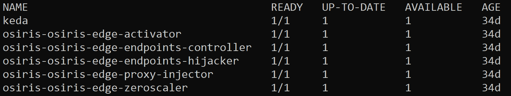

图 3.9:kube CTL 的输出获得了 keda 名称空间下的部署

*   You can add the `--show-labels` flag to display the labels of the objects in the list. For example, if you wanted to get the list of all the pods in the `default` namespace, along with their labels, you would use the following command:

    ```
    kubectl get pods --show-labels
    ```

    该命令应该给出类似于以下内容的输出:

    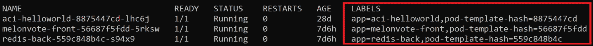

图 3.10:kube CTL 获取带有所有标签的豆荚的输出

右侧有一个额外的列，用于指定豆荚的标签。

*   You can use the `-o wide` flag to display more information about objects. Here, the `-o` flag stands for `output`. Let's look at a simple example of how to use this flag:

    ```
    kubectl get pods -o wide
    ```

    这将产生类似如下的输出:

    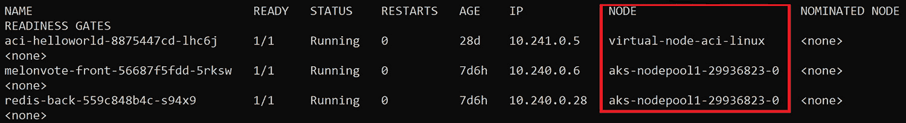

图 3.11:kube CTL get pods 的输出包含附加信息

您还可以在右侧看到额外的列，这些列指定了 pods 在哪些节点上运行，以及该节点的内部 IP 地址。您可以在[上找到更多使用`-o`标志的方法。](https://kubernetes.io/docs/reference/kubectl/overview/#output-options)

注意

我们将本节限制在通常用于限制本章范围的命令上。你可以在[https://kubernetes . io/docs/reference/generated/kubectl/kube CTL-commands](https://kubernetes.io/docs/reference/generated/kubectl/kubectl-commands)找到更多 kube CTL 命令。

# 在Kubernetes进行部署

正如我们前面提到的，部署是管理和更新 pods 的一种便捷方式。在 Kubernetes 中定义部署是为集群中运行的应用提供声明性更新的有效方法。

您可以通过使用 kubectl 命令或使用声明性 YAML 清单文件来创建部署。在下面的练习中，我们将在 Kubernetes 中部署一个应用(本练习将使用 Nginx)，并学习如何使用 Kubernetes 命令与 Deployments 交互，以及如何修改 YAML 清单文件。

## 练习 3.02:创建部署

有两种方法可以在 Kubernetes 中创建部署–使用`kubectl create` / `run`命令和创建 YAML 格式的清单文件，然后使用`kubectl apply`命令。我们可以通过这两个选项实现相同的目标。让我们尝试这两种方法，然后进行比较:

1.  Create a Deployment using the following command directly:

    ```
    kubectl create deployment kubeserve --image=nginx:1.7.8
    ```

    您可以预期类似以下的输出:

    ```
    deployment.apps/kubeserve created
    ```

    注意

    您也可以使用`kubectl run`命令创建部署。要在这里获得相同的结果，可以使用以下命令:

    `kubectl run nginx --image=nginx:1.7.8`

    `kubectl run nginx --image=nginx:1.7.8 --replicas=3`

2.  You can also create a Deployment by defining the YAML manifest file for your Deployment. Use your preferred text editor to create a file named `sample-deployment.yaml` with the following content:

    ```
    apiVersion: apps/v1
    kind: Deployment
    metadata:
      name: kubeserve 
      labels:
        app: kubeserve 
    spec:
      replicas : 3
      selector:
        matchLabels:
          app: kubeserve 
      template:
        metadata:
          labels:
            app: kubeserve 
        spec:
          containers:
          - name: nginx
            image: nginx
            ports:
            - containerPort: 80
    ```

    在这个 YAML 定义中，`replicas`字段定义了这个部署中的副本吊舱的数量。

3.  Use the following command to apply the configuration you've defined in the YAML manifest file:

    ```
    kubectl apply -f sample-deployment.yaml
    ```

    示例输出如下所示:

    ```
    kubectl apply -f sample-deployment.yaml
    ```

4.  Use the following command to check the Deployments that currently exist in the `default` namespace:

    ```
    kubectl get deployments 
    ```

    输出如下所示:

    ```
    NAME              READY    UP-TO-DATE    AVAILABLE     AGE
    aci-helloworld    1/1      1             1             27d
    kubeserve         3/3      3             3             26m
    ```

在本练习中，我们看到了使用不同方法创建部署的差异。`kubectl create`命令广泛用于测试。对于大多数实现了现代 DevOps 方法的企业解决方案来说，使用 YAML 定义来方便地定义配置，然后使用 Git 等源代码控制工具来跟踪它们更有意义。当您的组织将 YAML 定义与 DevOps 工具集成时，它会使解决方案更易于管理和追踪。

既然我们已经了解了如何创建部署，在下一个练习中，我们将学习如何修改或更新已经运行的部署。随着软件更新到新版本，错误被识别和修复，对应用的需求发生变化，或者您的组织转向全新的解决方案，这是您经常需要做的事情。我们还将学习如何将部署回滚到早期版本，如果更新没有导致预期的结果，您将需要这样做。

## 练习 3.03:更新部署

在本练习中，我们将把上一练习中部署的应用更新到更高的版本，并演示如何在必要时将部署回滚到以前的版本。

与我们看到的创建部署的两种方法类似，也有两种方法来更新应用——使用`kubectl set image`命令和更新 YAML 清单文件，然后使用`kubectl apply`命令。这些步骤将引导您完成这两种方法:

1.  First, let's get the details of the current Deployment using the following command:

    ```
    kubectl describe deploy kubeserve
    ```

    您将获得类似如下的输出:

    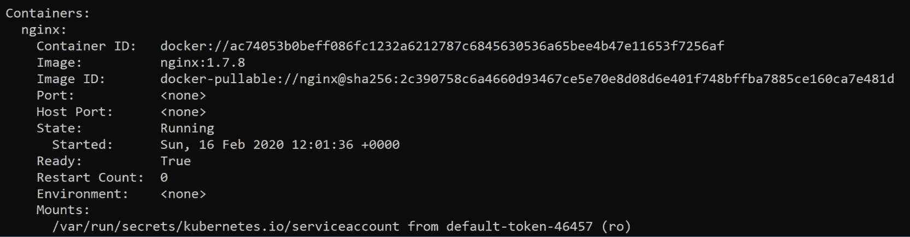

    图 3.12:描述库存储部署

2.  You can update the image using the following command:

    ```
    kubectl set image deployment/kubeserve nginx=nginx:1.9.1 –-record
    ```

    `image`子命令表示我们想要更新对象的`image`字段，如我们在上一练习的*步骤 2* 中看到的 YAML 清单中所定义的。

    然后，我们以`<object-type>/<object name>`格式指定对象。

    下一部分`nginx=nginx:1.9.1`，告诉 Kubernetes 在 NGINX 的 Docker Hub 存储库中寻找标记为`1.9.1`的特定映像。您可以在[https://hub.docker.com/_/nginx?tab=tags](https://hub.docker.com/_/nginx?tab=tags)查看可用的标签。

    当您想要将您的`kubectl`命令所做的更新保存到当前资源时，`--record`标志非常有用。

    通过应用此方法，您将获得类似于以下内容的输出:

    ```
    deployment.extensions/kubeserve image updated
    ```

3.  Now, let's get the details of the Deployment using the following command:

    ```
    kubectl describe deploy kubeserve
    ```

    您应该会看到以下输出:

    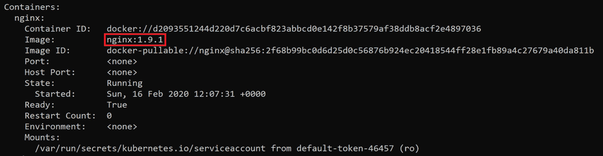

    图 3.13:使用 kube CTL description 命令检查容器中的映像版本

    在前面的截图中，可以看到图片已经成功更新到`1.9.1`版本。

    另一种获得相同结果的方法是修改 YAML 文件，然后使用`kubectl apply`命令。我们将使用在上一练习中创建的同一个 YAML 文件。如果没有对象的 YAML 文件，可以使用以下命令导出 YAML 清单:

    ```
    kubectl get deploy kubeserve -o yaml > kubeserve-spec.yaml
    ```

    该命令将输出一个名为`kubeserve-spec.yaml`的文件，其中包含集群中有效的清单。然后，您可以使用 vim、nano 或任何其他文本编辑器对其进行编辑，然后使用`kubectl apply`命令应用编辑后的`kubeserve-spec.yaml`清单，如上一练习所示，并添加了`--record`标志。

4.  If you want to perform a rollback, you can use the following command:

    ```
    kubectl rollout undo deployments kubeserve
    ```

    您将看到类似如下的输出:

    ```
    deployment.extensions/kubeserve rolled back
    ```

5.  You can use the `kubectl rollout history` command to check all the revisions for a specific Deployment, as shown here:

    ```
    kubectl rollout history deployment kubeserve
    ```

    您将看到类似如下的输出:

    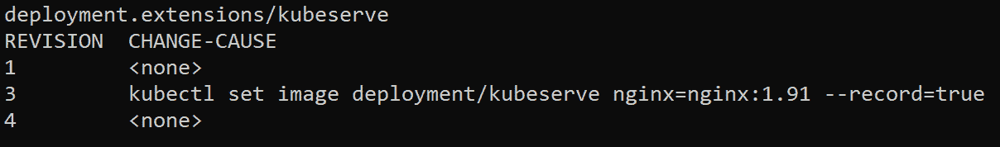

    图 3.14:kube CTL 卷展栏历史命令的输出

6.  You can also use the following command to check the details of a specific revision:

    ```
    kubectl rollout history deployment kubeserve --revision=3
    ```

    该命令的输出如下:

    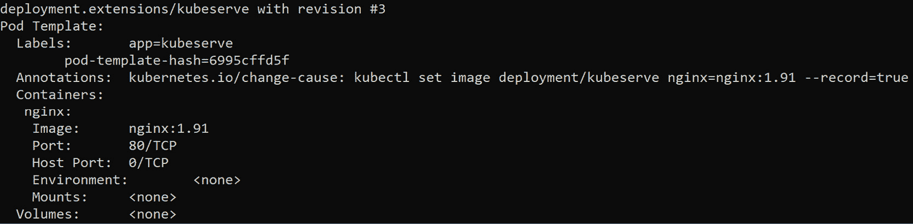

    图 3.15:检查修订版 3 的细节

7.  You can roll back a Deployment to a specific revision by specifying the `--to-revision` flag:

    ```
    kubectl rollout undo deployments kubeserve --to-revision=3
    ```

    您将看到类似如下的输出:

    ```
    deployment.extensions/kubeserve rolled back
    ```

在本练习中，我们学习了如何更新现有的部署，以及如何将部署回滚到其早期规格。

部署允许我们以声明的方式定义副本容器的期望状态。我们将在*第 7 章*、*库本内斯控制器*中重新探讨部署的工作原理并了解更多信息。如果您有意删除单个 pod 副本，或者 pod 由于任何原因出现故障，由于我们定义了一个具有固定数量副本的部署，因此部署将在您删除 pod 的同时不断重新创建 pod。这就是我们所说的*自动修复*。因此，您需要删除部署本身，这也将删除由其管理的所有 pods。我们将在下面的练习中学习如何做到这一点。

## 练习 3.04:删除部署

在本练习中，我们将删除在上一练习中创建的部署:

1.  Get a list of existing Deployments using the following command:

    ```
    kubectl get deployment
    ```

    您可以预期类似以下的输出:

    ```
    NAME              READY    UP-TO-DATE    AVAILABLE     AGE
    aci-helloworld    1/1      1             1             27d
    kubeserve         3/3      3             3             26m
    melonkedaaf       0/0      0             0             26d
    ```

2.  Let's say that, for the purpose of this exercise, we want to delete the `kubeserve` Deployment that we created in the previous exercise. Use the following command to delete the Deployment:

    ```
    kubectl delete deployment kubeserve
    ```

    示例输出将类似于以下内容:

    ```
    deployment.extensions "kubeserve" deleted
    ```

3.  Get the list of Deployments to check and make sure that the target Deployment has been deleted successfully:

    ```
    kubectl get deployment
    ```

    您应该会看到类似如下的输出:

    ```
    NAME              READY    UP-TO-DATE    AVAILABLE     AGE
    aci-helloworld    1/1      1             1             27d
    kubeserve         0/0      0             0             26d
    ```

您也可以使用`kubectl delete`命令删除任何其他对象。但是，正如我们前面提到的，在部署管理的单元这样的情况下，删除单个单元是没有意义的，因为部署将只是重新创建它们，所以您需要删除部署。

## 活动 3.01:编辑真实应用的实时部署

假设您是一名 SysOps 工程师，被要求管理一个集群并部署一个 web 应用。您已经将其部署到您的 Kubernetes 集群中，并向公众开放。自该应用成功部署以来，您一直在监视它，并且您检测到该 web 应用在高峰时间遇到了节流问题。根据您的监控，您想要实现的解决方案是为该应用分配更多的内存和 CPU。因此，您需要编辑部署，以便能够分配足够的 CPU 和内存资源来运行应用，并在最后测试该应用。您需要证明您的 web 应用已经启动并运行，并且可以通过您选择的浏览器通过公共 IP 地址进行访问。

为了模拟这个场景，我们将在 Kubernetes 集群中部署一个示例应用，并向您展示如何编辑实时部署。编辑实时部署是您在修复问题或进行测试时需要做的事情。

您可以使用以下命令获取将在本活动中使用的 YAML 清单文件:

```
curl https://raw.githubusercontent.com/PacktWorkshops/Kubernetes-Workshop/master/Chapter03/Activity03.01/sample-application.yaml --output sample-application.yaml
```

该清单文件定义了运行应用所需的所有不同对象，以及应用本身。

注意

本清单改编自微软 Azure 提供的开源示例，可在[https://github.com/Azure-Samples/azure-voting-app-redis](https://github.com/Azure-Samples/azure-voting-app-redis)获得。

执行以下步骤完成本活动:

1.  首先，使用`kubectl apply`命令和提供的 YAML 定义文件部署目标 web 应用。
2.  获取公开您的应用的服务的 IP 地址。对于这个简单的场景，这将类似于上一章的*练习 2.03，通过服务*访问 Pod。后面的章节将解释如何使用入口控制器并创建入口资源来公开前端应用。
3.  Use the `kubectl edit` command to edit the live deployment. You will need to edit the deployment named `melonvote-front`. The following are the fields that you need to modify to satisfy the requirements of this scenario. You can simply double these values:

    a) `resources.limits.cpu`:这是 CPU 使用的资源限制。

    b) `resources.limits.memory`:这是内存使用的资源限制。

    c) `resources.requests.cpu`:这是启动和运行应用所需的最小 CPU 使用量。

    d) `resources.requests.memory`:这是启动和运行应用所需的最小内存使用量。

在本练习结束时，您将能够看到用 Kubernetes 部署的应用的用户界面:


图 3.16:活动的预期输出

注意

该活动的解决方案可在以下地址找到:[https://packt.live/304PEoD](https://packt.live/304PEoD)。

# 总结

本章揭示了 kubectl 如何允许我们使用 API 调用来控制我们的 Kubernetes 集群。首先，我们学习了如何为 kubectl 命令设置环境，并查看了一些快捷方式。此外，我们还介绍了如何使用 Kubernetes 命令创建、编辑和删除 Kubernetes 对象，并以一个部署为例进行了说明。最后，我们部署了一个真实的应用，并向您展示了如何编辑实时部署。本章中的每一个例子都在一般的上下文中应用过；但是，我们相信本章中开发的技能可以帮助您解决在专业环境中可能遇到的特定问题。

在下一章中，您将探索这座桥的另一面，并深入研究 API 服务器是如何工作的。您还将进一步了解 REST API 请求以及 API 服务器如何处理它们。