# 五、PODS

概述

本章介绍了 pods 的概念，并讲述了如何正确配置和部署它们。我们将从创建一个简单的 pod 开始，在其中运行您的应用容器。我们将解释 pod 配置的不同方面意味着什么，并根据您的应用或用例决定使用哪种配置。您将能够为 pods 定义资源分配要求和限制。然后，我们将继续了解如何调试 pod，检查日志，并在需要时对其进行更改。本章还介绍了一些更有用的工具来管理 pods 中的故障，例如活跃性和就绪性探测以及重启策略。

# 简介

在前一章中，我们学习了如何使用 kubectl 与 Kubernetes API 进行交互。在这一章和接下来的几章中，我们将使用这些知识与 API 交互来创建各种类型的 Kubernetes 对象。

在 Kubernetes 系统中，许多实体表示集群的状态以及集群的工作负载是什么样子。这些实体被称为 Kubernetes 对象。Kubernetes 对象描述了各种各样的事情，例如，什么容器将在集群中运行，它们将使用什么资源，这些容器将如何相互作用，以及它们将如何暴露给外部世界。

pod 是 Kubernetes 的基本构造块，可以描述为部署的基本单元。就像我们将流程定义为执行中的程序一样，我们可以将 pod 定义为 Kubernetes 世界中正在运行的流程。豆荚是Kubernetes最小的复制单位。一个POD中可以运行任意数量的容器。pod 基本上是运行在节点上的容器的包装器。用豆荚代替单独的容器有几个好处。例如，pod 中的容器具有共享卷、Linux 命名空间和 cgroups。每个容器都有一个唯一的 IP 地址，端口空间由该容器中的所有容器共享。这意味着 pod 中的不同容器可以使用它们在 localhost 上的相应端口相互通信。

理想情况下，只有当我们希望在 Kubernetes 集群中一起管理和定位多个容器时，才应该在一个 pod 中使用它们。例如，我们可能有一个运行我们的应用的容器和另一个从应用容器获取日志并将它们转发到某个中央存储的容器。在这种情况下，我们希望我们的两个容器保持在一起，共享同一个 IP，以便它们可以通过本地主机进行通信，并且共享同一个存储，以便第二个容器可以读取我们的应用容器正在生成的日志。

在本章中，我们将介绍什么是 pod，它是如何工作的，以及如何定义它的 pod 规范，它描述了 pod 的状态。我们将经历POD生命周期的不同阶段，并学习如何使用健康检查或探测器来控制POD。让我们从学习如何配置 pod 开始。

# POD配置

为了能够成功配置 pod，我们首先必须能够阅读和理解 pod 配置文件。以下是 pod 配置文件示例:

```
apiVersion: v1
kind: Pod
metadata:
  name: pod-name
spec:
  containers:
  - name: container1-name
    image: container1-image
  - name: container2-name
    image: container2-image
```

我们可以将POD的配置分解为四个主要组件:

*   `apiVersion`:我们将要使用的 Kubernetes API 的版本。
*   `kind`:我们试图创建的那种 Kubernetes 对象，在本例中是一个`Pod`。
*   `metadata`:唯一标识我们正在创建的对象的元数据或信息。
*   `spec`:我们的 pod 的规范，例如容器名、映像名、卷和资源请求。

`apiVersion`、`kind`和`metadata`适用于所有类型的 Kubernetes 对象，并且是必填字段。`spec`也是必填字段；但是，对于不同类型的对象，它的布局是不同的。

下面的练习演示了如何使用这样的 pod 配置文件来创建一个简单的 pod。

## 练习 5.01:用单个容器创建容器

在本练习中，我们旨在创建第一个运行单个容器的简单 pod。要完成本练习，请执行以下步骤:

1.  创建一个名为`single-container-pod.yaml`的文件，内容如下:

    ```
    apiVersion: v1
    kind: Pod
    metadata:
      name: first-pod
    spec:
      containers:
      - name: my-first-container
        image: nginx
    ```

2.  Run the following command in Terminal to create a pod with the preceding configuration:

    ```
    kubectl create -f single-container-pod.yaml
    ```

    您应该会看到以下响应:

    ```
    pod/first-pod created
    ```

    输出表明已经创建了 pod。

3.  Verify that the pod was created by getting the list of all the pods using this command:

    ```
    kubectl get pods
    ```

    您应该会看到以下响应:

    ```
    NAME         READY       STATUS       RESTARTS      AGE
    first-pod    1/1         Running      0             5m44s
    ```

4.  Now that we have created our first pod, let's look into it in more detail. To do that, we can describe the pod we just created using the following command in Terminal:

    ```
    kubectl describe pod first-pod
    ```

    您应该会看到以下输出:

    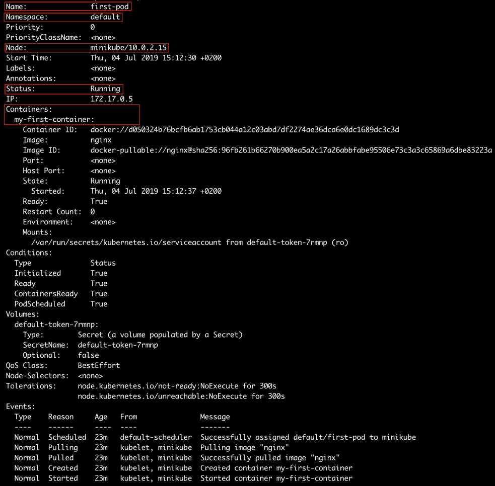

图 5.1:描述第一个POD

输出显示了我们刚刚创建的 pod 的各种细节。在接下来的部分中，我们将浏览前面输出中突出显示的部分，以了解关于正在运行的 pod 的更多信息。

## n〔t0〕name

此字段说明容器的名称，有时也称为容器标识。Pod 名称在特定的命名空间中是唯一的。pod 名称最长可达 253 个字符。pod 名称中允许的字符包括数字(0-9)、小写字母(a-z)、连字符(-)和点(。).

考虑*图 5.1* 所示输出中的第二行:

```
Name: first-pod
```

它与我们在 YAML 配置中提到的相同。

## n〔t0〕amespace

Kubernetes 支持命名空间在同一个物理集群内创建多个虚拟集群。如果我们想为在同一个集群上工作的不同团队提供独立的环境，我们可能需要使用名称空间。命名空间还有助于确定对象名称的范围。例如，在同一个命名空间中不能有两个同名的容器。然而，有可能在两个不同的名称空间中有两个同名的容器。现在考虑*图 5.1* 所示输出中的第二行:

```
Namespace: default
```

我们可以通过传递特定 kubectl 命令的`--namespace`参数来临时更改请求的名称空间，也可以更新 kubectl 配置来更改所有后续 kubectl 命令的名称空间。要创建新的命名空间，我们可以使用以下命令:

```
kubectl create namespaces <namespace-name>
```

T 这里有两种方法可以在不同的名称空间中创建 pod——通过使用 CLI 命令，或者通过在 pod 配置中指定名称空间。下面的练习演示了如何在不同的名称空间中创建 pods，以获得前面提到的名称空间的好处。

## 练习 5.02:通过在 CLI 中指定名称空间，在不同的名称空间中创建 Pod

在本练习中，我们将在`default`以外的名称空间中创建一个 pod。我们将使用*练习 5.01* 、*中的相同容器配置，通过在命令参数中指定名称空间来创建一个具有单个容器的容器*。按照以下步骤完成练习:

1.  Run the following command to view all the available namespaces in our Kubernetes cluster:

    ```
    kubectl get namespaces
    ```

    您应该会看到以下名称空间列表:

    ```
    NAME               STATUS       AGE
    default            Active       16d
    kube-node-lease    Active       16d
    kube-public        Active       16d
    kube-system        Active       16d
    ```

    输出显示了我们的 Kubernetes 集群中的所有名称空间。`default`命名空间，顾名思义，是在没有任何命名空间的情况下创建的所有 Kubernetes 对象的默认命名空间。

2.  Run the following command to create the pod with the `single-container-pod.yaml` pod configuration but in a different namespace:

    ```
    kubectl --namespace kube-public create -f single-container-pod.yaml
    ```

    您应该会看到以下响应:

    ```
    pod/first-pod created
    ```

    注意

    如果在特定的命名空间中创建 pod，则只能通过切换到该命名空间来查看它。

3.  Verify that the pod was created in the `kube-public` namespace:

    ```
    kubectl --namespace kube-public get pods
    ```

    您应该会看到以下响应:

    ```
    NAME            READY       STATUS      RESTARTS     AGE
    first-pod       1/1         Running     0            8s
    ```

这里的输出显示我们已经成功地在`kube-public`命名空间中创建了 pod。

下一个练习演示如何基于 YAML 文件在不同的名称空间中创建 pod。

## E 练习 5.03:通过在 Pod 配置 YAML 文件中指定名称空间，在不同的名称空间中创建 Pod

在本练习中，我们将在 YAML 配置文件中添加一行，以指定使用该文件创建的所有 pods 都使用指定的名称空间。

1.  Run the following command to view all the available namespaces in our Kubernetes cluster:

    ```
    kubectl get namespaces
    ```

    您应该会看到以下名称空间列表:

    ```
    NAME               STATUS       AGE
    default            Active       16d
    kube-node-lease    Active       16d
    kube-public        Active       16d
    kube-system        Active       16d
    ```

2.  接下来，创建一个名为`single-container-pod-with-namespace.yaml`的文件，配置如下:

    ```
    apiVersion: v1
    kind: Pod
    metadata:
      name: first-pod-with-namespace
      namespace: kube-public
    spec:
      containers:
      - name: my-first-container
        image: nginx
    ```

3.  Run the following command to create a pod with the `single-container-pod-with-namespace.yaml` pod configuration:

    ```
    kubectl create -f single-container-pod-with-namespace.yaml
    ```

    您应该会看到以下响应:

    ```
    pod/first-pod-with-namespace created
    ```

4.  Verify that the pod was created in the `kube-public` namespace:

    ```
    kubectl --namespace kube-public get pods
    ```

    您应该会看到以下豆荚列表:

    ```
    NAME                     READY     STATUS      RESTARTS   AGE
    first-pod                 1/1      Running     0          5m2s
    first-pod-with-namespace  1/1      Running     0          46s
    ```

    输出显示我们创建的新 pod 占据了`kube-public`命名空间。使用`single-container-pod-with-namespace.yaml`容器配置创建的任何其他容器将占用相同的名称空间。

在下面的练习中，我们将更改默认的 kubectl 名称空间，这样所有没有定义名称空间的 pods 都将采用我们新定义的名称空间，而不是`default`。

## E 练习 5.04:更改所有后续库命令的名称空间

在本练习中，我们将把所有后续 kubectl 命令的名称空间从`default`更改为`kube-public`。

1.  Run the following command to view all the available namespaces in our Kubernetes cluster:

    ```
    kubectl get namespaces
    ```

    您应该会看到以下名称空间列表:

    ```
    NAME               STATUS       AGE
    default            Active       16d
    kube-node-lease    Active       16d
    kube-public        Active       16d
    kube-system        Active       16d
    ```

2.  Run the following command to change the namespace for all subsequent requests by modifying the current context:

    ```
    kubectl config set-context $(kubectl config current-context) --namespace kube-public
    ```

    Y 您应该会看到以下响应:

    ```
    Context "minikube" modified.
    ```

3.  Run the following command to list all the pods in the `kube-public` namespace without using the `namespace` argument:

    ```
    kubectl get pods
    ```

    您应该会看到以下豆荚列表:

    ```
    NAME                     READY     STATUS      RESTARTS   AGE
    first-pod                 1/1      Running     0          48m
    first-pod-with-namespace  1/1      Running     0          44m
    ```

    输出显示，前面的命令列出了我们在`kube-public`命名空间中创建的所有豆荚。我们在*练习 5.01* 、*中看到用单个容器*创建一个容器，`kubectl get pods`命令在默认名称空间中显示容器。但是在这里，我们从`kube-public`命名空间中获得结果。

4.  In this step, we will undo the changes so that it doesn't affect the upcoming exercises in this chapter. We will change the default namespace to `default` again to avoid any confusion:

    ```
    kubectl config set-context $(kubectl config current-context) --namespace default
    ```

    您应该会看到以下响应:

    ```
    Context "minikube" modified.
    ```

在本练习中，我们已经看到了如何更改和重置上下文的默认命名空间。

## 节点

正如您在前面几章中所学的，节点是在我们的集群中运行的各种机器。此字段反映该 pod 运行的 Kubernetes 集群中的节点。了解 pod 在哪个节点上运行可以帮助我们解决该 pod 的调试问题。观察*图 5.1* 所示输出的第六行:

```
Node: minikube/10.0.2.15
```

通过运行以下命令，我们可以列出 Kubernetes 集群中的所有节点:

```
kubectl get nodes
```

您应该会看到以下响应:

```
NAME         STATUS      ROLES       AGE         VERSION
minikube     Ready       <none>      16d         v1.14.3
```

在本例中，我们的集群中只有一个节点，因为我们使用 Minikube 进行这些练习:

```
apiVersion: v1
kind: Pod
metadata:
  name: firstpod
spec:
  nodeName: my-favorite-node # run this pod on a specific node
  containers:
  - name: my-first-pod
    image: nginx
```

如果我们的集群中有多个节点，我们可以通过在配置中添加以下`nodeName`字段来配置我们的 pod 在特定节点上运行，如前一个规范中的第六行所示。

注意

在生产环境中，`nodeName`通常不用于分配某个 pod 在所需节点上运行。在下一章中，我们将了解`nodeSelector`，这是控制 pod 分配到哪个节点的更好方法。

## s〔t0〕状态

此字段告诉我们 pod 的状态，以便我们可以采取适当的措施，例如根据需要启动或停止 pod。虽然这个演示展示了获取 pod 状态的方法之一，但在实际操作中，您可能希望基于 pod 状态自动执行操作。考虑*图 5.1* 所示输出的第十行:

```
Status: Running
```

这表示POD的当前状态为`Running`。此字段反映了 pod 处于生命周期的哪个阶段。我们将在本章的下一节讨论POD生命周期的各个阶段。

## C 联系人

在本章的前面，我们看到我们可以将不同的容器捆绑在一个容器中。此字段列出了我们在此窗格中创建的所有容器。考虑*图 5.1* 中从第 12 行开始的输出字段:


图 5.2:描述命令中的容器字段

这个案子我们只有一个。我们可以看到容器的名称和映像与我们在 YAML 配置中指定的相同。以下是我们可以设置的其他字段列表:

*   `Image`:码头工人映像的名称
*   `Args`:容器入口点的参数
*   `Command`:容器启动后运行的命令
*   `Ports`:要从容器中公开的端口列表
*   `Env`:容器中要设置的环境变量列表
*   `resources`:容器的资源需求

在下面的练习中，我们将使用一个简单的命令创建一个容器。

## 例 ercise 5.05:使用命令行界面命令创建运行容器的容器

在本练习中，我们将通过运行命令来创建一个容器。

1.  首先，让我们用以下 pod 配置创建一个名为`pod-with-container-command.yaml`的文件:

    ```
    apiVersion: v1
    kind: Pod
    metadata:
      name: command-pod
    spec:
      containers:
      - name: container-with-command
        image: ubuntu
        command:
        - /bin/bash
        - -ec
        - while :; do echo '.'; sleep 5; done
    ```

2.  Run the following command to create the pod using the configuration defined in the `pod-with-container-command.yaml` file:

    ```
    kubectl create -f pod-with-container-command.yaml
    ```

    您应该会看到以下响应:

    ```
    pod/command-pod created
    ```

    我们在上一步中创建的 YAML 文件指示 pod 用 Ubuntu 映像启动一个容器，并运行以下命令:

    ```
    /bin/bash -ec "while :; do echo '.'; sleep 5; done"
    ```

    该命令应每 5 秒钟在新行上打印一个点(`.`)字符。

3.  Let's check the logs of this pod to verify that it's doing what it's expected to do. To check the logs of a pod, we can use the `kubectl logs` command:

    ```
    kubectl logs command-pod -f
    ```

    您应该会看到以下响应:

    

图 5.3:命令舱的以下日志

在定期更新的日志中，我们看到每 5 秒钟就有一个点(`.`)字符印在新的一行上。因此，我们成功地创建了所需的容器。

注意

`-f`标志是跟随容器上的原木。也就是说，日志保持实时更新。如果我们跳过该标志，我们将看到日志，而不会跟随它们。

在下一个练习中，我们将运行一个打开端口的容器，这是您必须经常做的事情，以使集群的其余部分或互联网可以访问该容器。

## 练习 5.06:创建运行暴露端口的容器的容器

在本练习中，我们将创建一个 pod，该 pod 运行一个容器，该容器将公开一个我们可以从 pod 外部访问的端口。

1.  首先，让我们用以下 pod 配置创建一个名为`pod-with-exposed-port.yaml`的文件:

    ```
    apiVersion: v1
    kind: Pod
    metadata:
      name: port-exposed-pod
    spec:
      containers:
        - name: container-with-exposed-port
          image: nginx
          ports:
            - containerPort: 80
    ```

2.  Run the following command to create the pod using the `pod-with-exposed-port.yaml` file:

    ```
    kubectl create -f pod-with-exposed-port.yaml
    ```

    您应该会看到以下响应:

    ```
    pod/port-exposed-pod created
    ```

    这个容器应该创建一个容器并暴露它的端口`80`。我们已经将 pod 配置为运行一个带有`nginx`映像的容器，这是一个流行的网络服务器。

3.  Next, we will forward port `80` from the pod to localhost:

    ```
    sudo kubectl port-forward pod/port-exposed-pod 80
    ```

    您应该会看到以下响应:

    ```
    Forwarding from 127.0.0.1:80 -> 80
    Forwarding from [::1] -> 80
    ```

    这将使端口`80`从 pod 暴露到本地主机端口`80`。

    注意

    我们需要让这个命令在一个终端上运行。

4.  现在，我们可以简单地在浏览器的地址栏中输入`http://localhost`或`http://127.0.0.1`。
5.  Alternatively, we can run the following command and see the HTML source code of the default index page in the response:

    ```
    curl 127.0.0.1
    ```

    您应该会看到以下输出:

    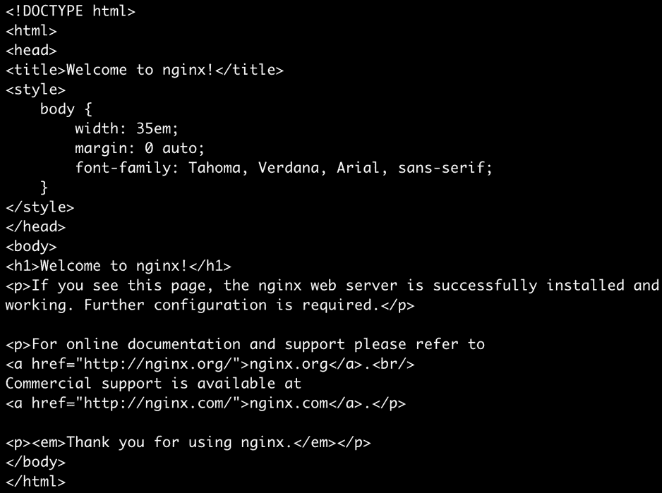

    图 5.4:使用 curl 获取 HTML 源代码

6.  Next, let's verify that the pod is actually receiving the request by checking the logs using the `kubectl logs` command:

    ```
    kubectl logs port-exposed-pod
    ```

    您应该会看到以下响应:

    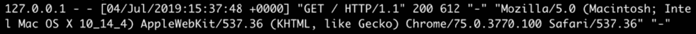

图 5.5:检查 nginx POD的日志

日志显示，运行`nginx`映像的容器正在接收我们对 localhost 的 HTTP 请求，并按预期做出响应。

我们还可以定义容器的最小和最大资源分配。这对于管理我们的部署所使用的资源非常有用。这可以使用 YAML 配置文件中的以下两个字段来实现:

*   `limits`:描述此容器允许的最大资源量。
*   `requests`:描述此容器所需的最小资源量。

我们可以使用这些字段来定义容器的最小和最大内存和 CPU 资源。中央处理器资源以中央处理器为单位。1 个 CPU 单元意味着容器可以访问 1 个逻辑 CPU 核心。

在下一个练习中，我们将创建一个定义了资源需求的容器。

## 练习 ise 5.07:创建运行有资源需求的容器的容器

在本练习中，我们将创建一个具有资源需求的容器的容器。首先，让我们看看如何配置容器的资源需求:

1.  Create a file named `pod-with-resource-requirements.yaml` with a pod configuration that specifies both `limits` and `requests` for memory and CPU resources, as shown here:

    ```
    apiVersion: v1
    kind: Pod
    metadata:
      name: resource-requirements-pod
    spec:
      containers:
        - name: container-with-resource-requirements
          image: nginx
          resources:
            limits:
              memory: "128M"
              cpu: "1"
            requests:
              memory: "64M"
              cpu: "0.5"
    ```

    在这个 YAML 文件中，我们将容器的最小内存需求定义为 64 MB，容器可以占用的最大内存为 128 MB。如果容器试图分配超过 128 MB 的内存，它将被终止，状态为 `OOMKilled`。

    CPU 对 CPU 的最低 CPU 要求是 0.5(也可以理解为 500 毫 CPU，可以写成`500m`而不是`0.5`，容器最多只允许使用 1 个 CPU 单元。

2.  Next, we will create the pod that uses this YAML configuration with the `kubectl create` command:

    ```
    kubectl create -f pod-with-resource-requirements.yaml
    ```

    您应该会看到以下响应:

    ```
    pod/resource-requirements-pod created
    ```

3.  Next, let's make sure the pod is created with the correct resource requirements. Check the pod definitions using the `describe` command:

    ```
    kubectl describe pod resource-requirements-pod
    ```

    您应该会看到以下输出:

    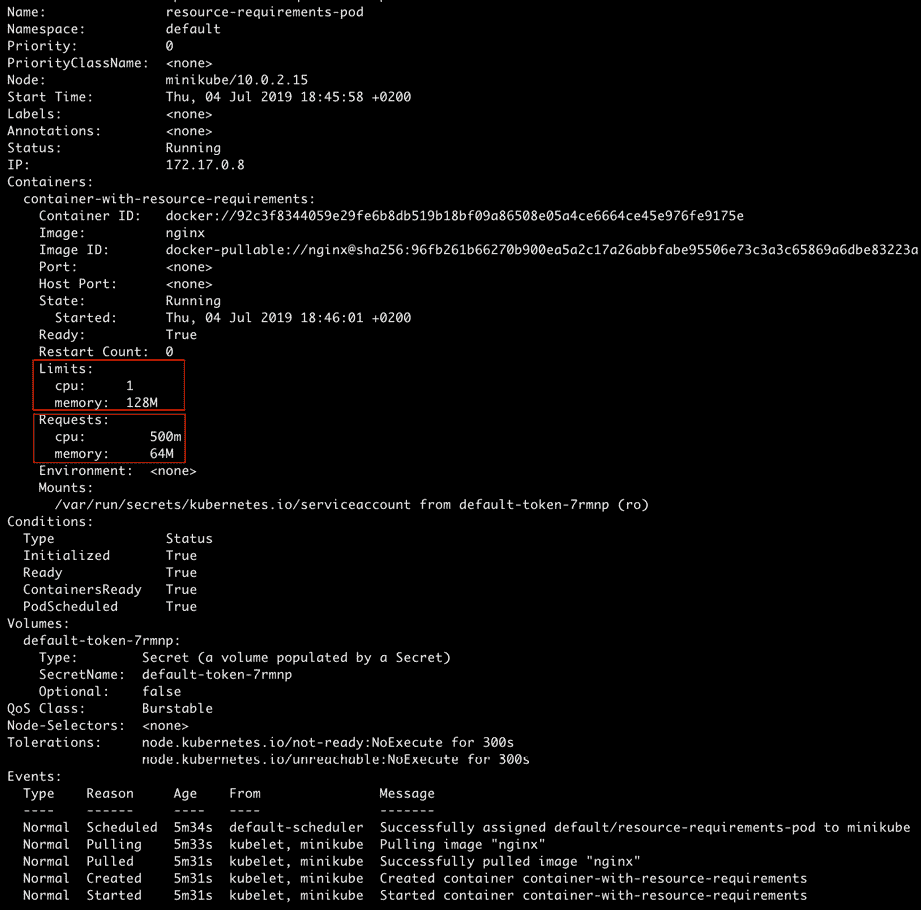

图 5.6:描述资源需求-pod

输出中突出显示的字段显示，pod 已经被分配了我们在 YAML 文件中声明的`limits`和`requests`部分。

如果我们为 pod 定义了不切实际的资源需求，会发生什么？让我们在下面的练习中探讨这一点。

## Exerci se 5.08:用任何节点都无法满足的资源请求创建 Pod

在本练习中，我们将创建一个包含大量资源请求的 pod，这些请求对于集群中的节点来说太大了，然后看看会发生什么。

1.  Create a file named `pod-with-huge-resource-requirements.yaml` with the following pod configuration:

    ```
    apiVersion: v1
    kind: Pod
    metadata:
      name: huge-resource-requirements-pod
    spec:
      containers:
        - name: container-with-huge-resource-requirements
          image: nginx
          resources:
            limits:
              memory: "128G"
              cpu: "1000"
            requests:
              memory: "64G"
              cpu: "500"
    ```

    在这个 YAML 文件中，我们将最低要求定义为 64 GB 内存和 500 个 CPU 内核。运行本练习的机器不太可能满足这些要求。

2.  Next, we will create the pod that uses this YAML configuration with the `kubectl create` command:

    ```
    kubectl create -f pod-with-huge-resource-requirements.yaml
    ```

    您应该会看到以下响应:

    ```
    pod/huge-resource-requirements-pod created
    ```

3.  Now, let's see what's going on with our pod. Get its status using the `kubectl get` command:

    ```
    kubectl get pod huge-resource-requirements-pod
    ```

    您应该会看到以下响应:

    

    图 5.7:获取巨大资源需求 pod 的状态

    我们看到POD已经处于`Pending`状态快一分钟了。那不寻常！

4.  Let's dig deeper and describe the pod using the following command:

    ```
    kubectl describe pod huge-resource-requirements-pod
    ```

    您应该会看到以下输出:

    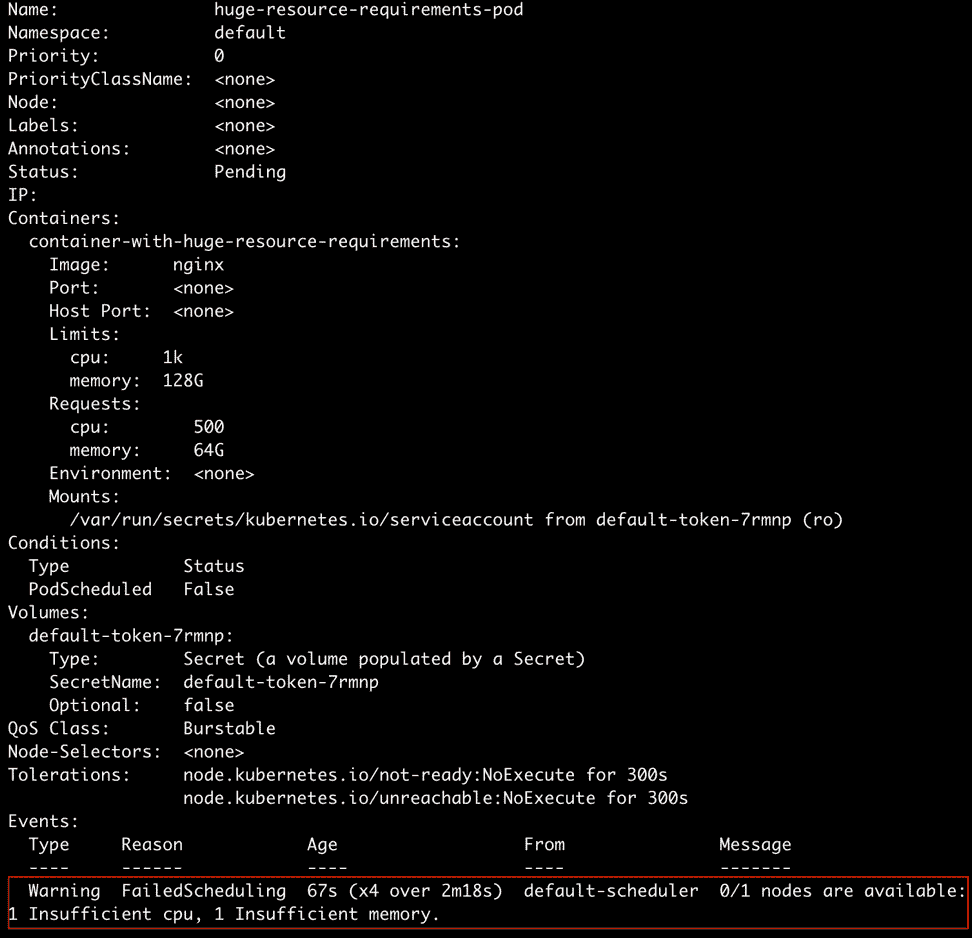

图 5.8:描述巨大资源需求 pod

让我们关注输出的最后一行。我们可以清楚地看到，有一条警告称，Kubernetes 控制器找不到任何满足 pod 的 CPU 和内存要求的节点。因此，POD调度失败。

总而言之，pod 调度基于资源需求。pod 将仅在满足其所有资源要求的节点上进行调度。如果我们不指定资源(内存或 CPU)限制，pod 可以使用的资源数量没有上限。

这带来了一个坏的 pod 消耗太多 CPU 或分配太多内存的风险，从而影响在同一命名空间/集群中运行的其他 pod。因此，在生产环境中向 pod 配置添加资源请求和限制是一个好主意。

正如本章前面提到的，一个POD可以运行多个容器。在下面的练习中，我们将创建一个包含多个容器的容器。

## 练习 5.09:创建一个内部有多个容器的容器

在本练习中，我们将创建一个包含多个容器的容器。为此，我们可以使用上一节中使用的配置，唯一的区别是`containers`字段现在将包含多个容器规格。按照以下步骤完成练习:

1.  使用以下 pod 配置创建名为`multiple-container-pod.yaml`的文件:

    ```
    apiVersion: v1
    kind: Pod
    metadata:
      name: multi-container-pod
    spec:
      containers:
        - name: first-container
          image: nginx
        - name: second-container
          image: ubuntu
          command:
            - /bin/bash
            - -ec
            - while :; do echo '.'; sleep 5; done
    ```

2.  Next, we will create a pod that uses the preceding YAML configuration with the `kubectl create` command:

    ```
    kubectl create -f multiple-container-pod.yaml
    ```

    您应该会看到以下响应:

    ```
    pod/multi-container-pod created
    ```

3.  Next, we will describe the pod and see what containers it is running:

    ```
    kubectl describe pod multi-container-pod
    ```

    您应该会看到以下输出:

    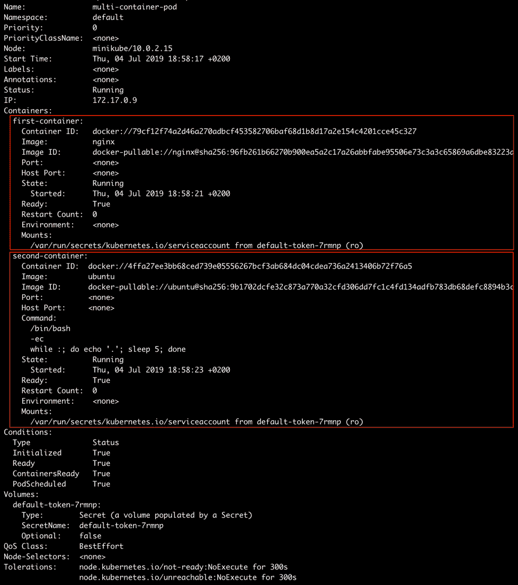

图 5.9:描述多容器POD

从前面的输出可以看出，我们有两个容器在一个容器中运行。现在，我们需要确保可以从任何一个容器中访问日志。

我们可以指定容器名称来获取在 pod 中运行的特定容器的日志，如下所示:

```
kubectl logs <pod-name> <container-name>
```

例如，要查看每 5 秒钟在新行上打印出点的第二个容器的日志，请使用以下命令:

```
kubectl logs multi-container-pod second-container -f
```

您应该会看到以下响应:


图 5.10:多容器舱中第二个容器的日志

我们在这里看到的输出类似于*练习 5.05* ，*使用命令行界面命令创建一个运行容器*的 Pod，因为我们实际上使用了一个类似于我们在那里定义的容器。

因此，我们创建了一个包含多个容器的 pod，并访问了所需容器的日志。

# 豆荚的生命周期

现在我们知道了如何运行 pod 以及如何为我们的用例配置它，在这一节中，我们将讨论 pod 的生命周期，以更详细地了解它是如何工作的。

## POD的相位

每个豆荚都有一个豆荚状态，告诉我们豆荚处于生命周期的哪个阶段。我们可以通过运行`kubectl get`命令来查看POD状态:

```
kubectl get pod
```

您将看到以下响应:

```
NAME         READY       STATUS        RESTARTS      AGE
first-pod    1/1         Running       0             5m44s
```

对于我们第一个名为`first-pod`的POD，我们看到POD处于`Running`状态。

让我们看看豆荚在其生命周期中可以有哪些不同的状态:

*   `Pending`:这意味着 pod 已经提交给集群，但是控制器还没有创建它所有的容器。它可能正在下载映像或等待在其中一个集群节点上调度 pod。
*   `Running`:此状态表示 pod 已分配给一个集群节点，并且至少有一个容器正在运行或正在启动。
*   `Succeeded`:这个状态表示POD已经运行，并且它的所有容器已经成功终止。
*   `Failed`:此状态表示 pod 已经运行，并且至少有一个容器以非零退出代码终止，即它没有执行其命令。
*   `Unknown`: This means that the state of the pod could not be found. This may be because of the inability of the controller to connect with the node that the pod was assigned to.

    注意

    `get pod`命令不能被驱逐或删除。为此，您可以使用`--show-all`标志，但自 Kubernetes v1.15 以来，它已被弃用。

# 探针/Hea 第 1 次检查

探测器是一种运行状况检查，可以配置为检查在容器中运行的容器的运行状况。探测器可用于确定容器是否正在运行或准备接收请求。探测器可能会返回以下结果:

*   `Success`:容器通过健康检查。
*   `Failure`:容器运行状况检查失败。
*   `Unknown`:健康检查因未知原因失败。

## P 长袍的类型

以下类型的探头可供我们使用。

### 活性探针

这是一种健康检查，用于确定特定容器是否正在运行。如果容器未能通过活性探测，控制器将尝试根据为 pod 配置的重启策略在同一节点上重启 pod。

当我们希望容器在特定检查失败时被终止并重新启动时，指定一个活性探测器是一个好主意。

### 准备状态探测器

这是一种健康检查，用于确定特定容器是否准备好接收请求。我们如何定义容器的就绪性很大程度上取决于容器内运行的应用。

例如，对于服务于 web 应用的容器，就绪可能意味着容器已经加载了所有静态资产，建立了与数据库的连接，启动了 web 服务器，并在主机上打开了一个特定的端口来开始服务请求。另一方面，对于服务于某些数据的容器，只有当它已经从磁盘加载了所有数据并且准备好开始服务于对该数据的请求时，就绪性探测才应该成功。

如果一个容器未能通过就绪探测，Kubernetes 控制器将确保容器不接收任何请求。如果容器指定了就绪探测，则其默认状态将为`Failure`，直到就绪探测成功。只有在就绪探测器返回`Success`状态后，容器才会开始接收请求。如果没有配置就绪探测器，容器一启动就会开始接收请求。

## 配置探针的离子

我们可以使用许多通用字段来配置探测器:

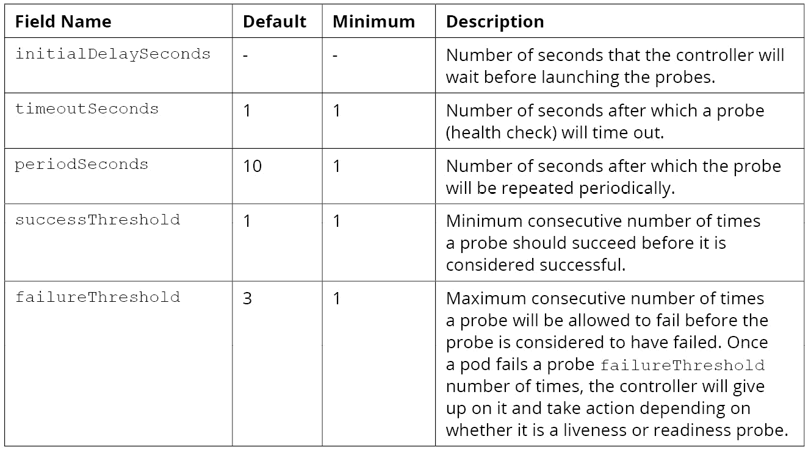

图 5.11 :探头配置字段表

## 探针的实施

探测器(活性或就绪)可以通过向容器传递命令、让它获取一些资源或尝试连接到它来实现，正如我们将在本节中看到的。我们可以在同一个容器中使用不同的活跃度和就绪性探测实现。

### 命令专业是

在探测的命令实现中，控制器将让容器执行指定的命令，以便在容器上执行探测。对于这个实现，我们使用`command`字段。此字段指定要执行的命令，以便在容器上执行探测。它可以是字符串或数组。

以下示例显示了如何在容器规范中使用活跃度和就绪探测器配置:

```
livenessProbe:
  exec:
    command:
    - cat
    - /tmp/health
  initialDelaySeconds:
  periodSeconds: 15
  failureThreshold: 3
readinessProbe:
  exec:
    command:
    - cat
    - /tmp/health
  initialDelaySeconds:
  periodSeconds: 15
```

### HTTP 请求测试探针

在这种类型的探测中，控制器将向给定的地址(主机和端口)发送一个 GET HTTP 请求，以在容器上执行探测。可以设置要在探测请求中发送的自定义 HTTP 头。

我们可以设置以下字段来配置 HTTP 请求探测:

*   `host`:将向其发出请求的主机名。它默认为 pod 的 IP 地址。
*   `path`:向其发出请求的路径。
*   `port`:请求发送到的端口的名称或编号。
*   `httpHeaders`:请求中要设置的自定义标题。
*   `scheme`:请求时使用的方案。默认值是 HTTP。

下面是一个针对活跃度和就绪性的 HTTP 请求探测示例:

```
livenessProbe:
  httpGet:
    path: /health-check
    port: 8080
  initialDelaySeconds: 10
  periodSeconds: 20
readinessProbe:
  httpGet:
    path: /health-check
    port: 8080
  initialDelaySeconds: 5
  periodSeconds: 10
```

### TCP 插座探头

在探测器的这种实现中，控制器将尝试在给定主机和指定端口号上建立连接。我们可以使用以下两个字段进行探测:

*   `host`:将建立连接的主机名。它默认为 pod 的 IP 地址。
*   `port`:要连接的端口的名称或编号。

下面是一个 TCP 套接字探针的示例:

```
livenessProbe:
  tcpSocket:
    port: 8080
  initialDelaySeconds: 10
  periodSeconds: 20
readinessProbe:
  tcpSocket:
    port:8080
  initialDelaySeconds: 5
  periodSeconds: 10
```

### 重启 Pol 冰冷

我们可以在POD规范中指定`restartPolicy`来指示控制器重启POD所需的条件。`restartPolicy`的默认值为`Always`。它可以采用以下值:

*   `Always`:当POD终止时，总是重新启动POD。
*   `OnFailure`:仅当POD因故障而终止时，才重新启动POD。
*   `Never`:POD终止后，切勿重启。

如果我们希望 pod 在出现问题或变得不健康时崩溃并重启，我们应该将重启策略设置为`Always`或`OnFailure`。

在下面的练习中，我们将使用命令实现创建一个活动探测器。

## 练习 5。 10:创建运行带有活动探测和无重启策略的容器的容器

在本练习中，我们将创建一个带有活动探测和无重启策略的 pod。不为 pod 指定重启策略意味着将使用`Always`的默认策略。

1.  Create `liveness-probe.yaml` with the following pod configuration:

    ```
    apiVersion: v1
    kind: Pod
    metadata:
      name: liveness-probe
    spec:
      containers:
        - name: ubuntu-container
          image: ubuntu
          command:
            - /bin/bash
            - -ec
            - touch /tmp/live; sleep 30; rm /tmp/live; sleep 600
          livenessProbe:
            exec:
              command:
                - cat
                - /tmp/live
            initialDelaySeconds: 5
            periodSeconds: 5
    ```

    这种 pod 配置意味着将有一个从 Ubuntu 映像创建的容器，并且一旦启动，将运行以下命令:

    ```
    /bin/bash -ec "touch /tmp/live; sleep 30; rm /tmp/live; sleep 600"
    ```

    前面的命令在路径`/tmp/live`创建一个空文件，休眠 30 秒，删除`/tmp/live`文件，然后休眠 10 分钟，成功终止。

    接下来，我们有一个 liveness 探测器，它每 5 秒执行一次以下命令，初始延迟为 5 秒:

    ```
    cat /tmp/live
    ```

2.  运行以下命令，使用`liveness-probe.yaml`创建POD:

    ```
    kubectl create -f liveness-probe.yaml
    ```

3.  When the container starts, the liveness probe will succeed because the command will execute successfully. Now, let's wait for at least 30 seconds and run the `describe` command:

    ```
    kubectl describe pod liveness-probe
    ```

    您应该会看到以下输出:

    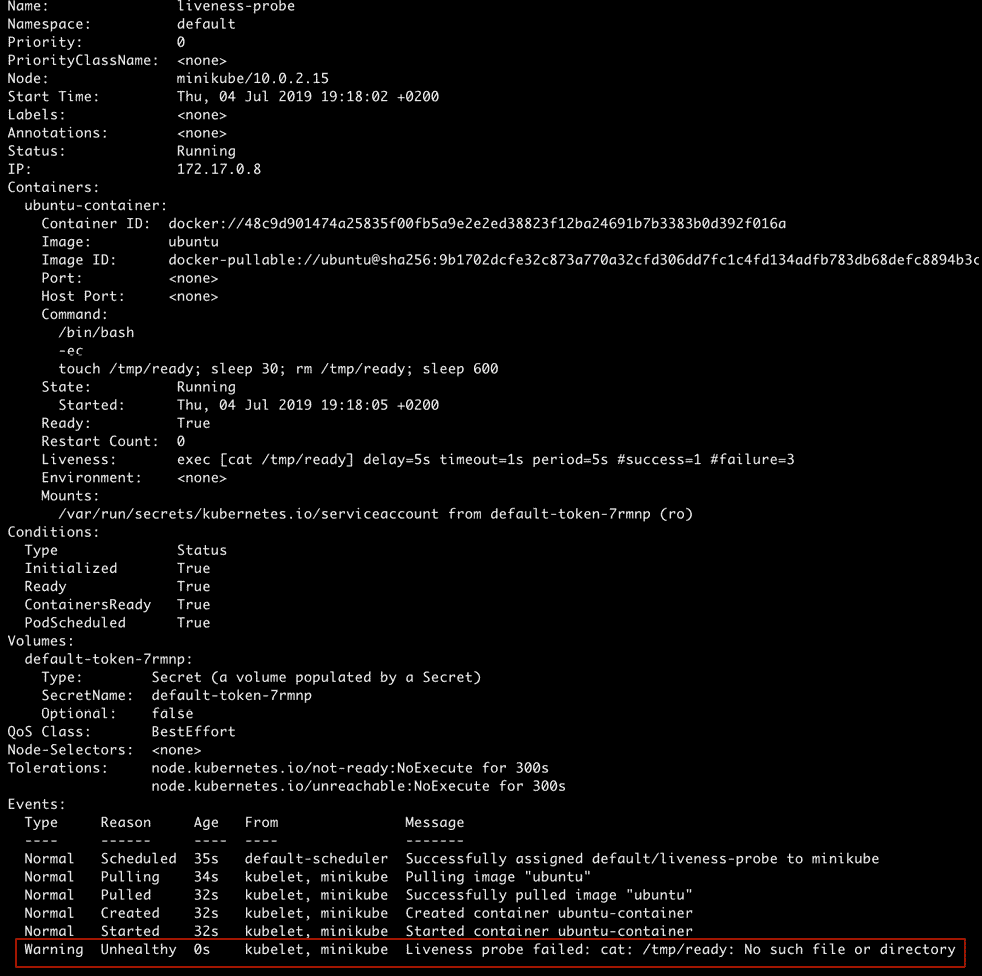

    图 5.12:描述活性-探测:第一次失败

    在突出显示的最后一行中，我们可以看到 liveness 探测首次失败。

4.  Let's wait for a few more seconds until the probe has failed three times and run the same command again:

    ```
    kubectl describe pod liveness-probe
    ```

    您应该会看到以下输出:

    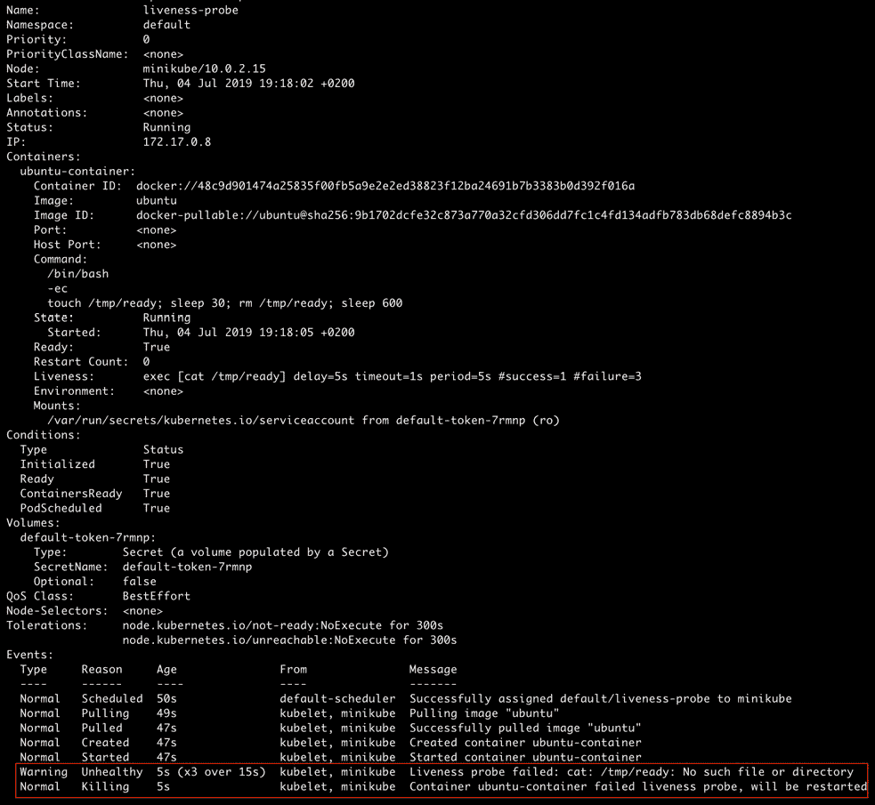

    图 5.13:描述活跃度-探测:三次失败后

    输出中最后两个突出显示的行告诉我们活跃度探测器已经失败了三次。现在，POD将被杀死并重新启动。

5.  Next, we will verify that the pod has been restarted at least once using the following command:

    ```
    kubectl get pod liveness-probe
    ```

    您应该会看到以下响应:

    ```
    NAME             READY     STATUS      RESTARTS    AGE
    liveness-probe   1/1       Running     1           89s
    ```

此输出显示，活跃度探测器出现故障时，pod 已重新启动。

现在让我们看看如果我们将重启策略设置为`Never`会发生什么。

## 练习 5.11:创建运行带有活跃度探测器和重启策略的容器的容器

在本练习中，我们将使用上一练习中相同的 pod 配置，唯一的区别是`restartPolicy`字段将被设置为`Never`。按照以下步骤完成活动:

1.  使用以下POD配置创建`liveness-probe-with-restart-policy.yaml`:

    ```
    apiVersion: v1
    kind: Pod
    metadata:
      name: liveness-probe-never-restart
    spec:
      restartPolicy: Never
      containers:
        - name: ubuntu-container
          image: ubuntu
          command:
            - /bin/bash
            - -ec
            - touch /tmp/ready; sleep 30; rm /tmp/ready; sleep 600
          livenessProbe:
            exec:
              command:
                - cat
                - /tmp/ready
            initialDelaySeconds: 5
            periodSeconds: 5
    ```

2.  Run the following command to create the pod using `liveness-probe.yaml`:

    ```
    kubectl create -f liveness-probe-with-restart-policy.yaml
    ```

    您应该会看到以下响应:

    ```
    pod/liveness-probe-never-restart created
    ```

3.  Let's wait for around one minute and run the `describe` command:

    ```
    kubectl describe pod liveness-probe-never-restart
    ```

    您应该会看到以下输出:

    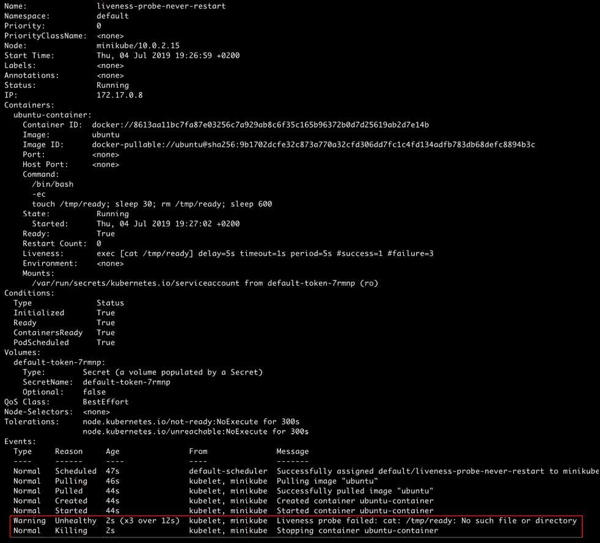

图 5.14:描述活跃度-探测-永不重启

正如我们所看到的，在最后两个高亮显示的行中，控制器将只杀死容器，并且永远不会尝试重启它，遵守 pod 规范中指定的重启策略。

在下面的练习中，我们将看一下准备情况调查的实现。

## 练习 5.12: 创建运行带有就绪探测器的容器的POD

在本练习中，我们将创建一个带有容器的POD，该容器带有就绪探测器。

1.  Create a file named `readiness-probe.yaml` with the following pod configuration:

    ```
    apiVersion: v1
    kind: Pod
    metadata:
      name: readiness-probe
    spec:
      containers:
        - name: ubuntu-container
          image: ubuntu
          command:
            - /bin/bash
            - -ec
            - sleep 30; touch /tmp/ready; sleep 600
          readinessProbe:
            exec:
              command:
                - cat
                - /tmp/ready
            initialDelaySeconds: 10
            periodSeconds: 5
    ```

    前面的 pod 配置指定将有一个从 Ubuntu 映像创建的容器，并且一旦启动，将运行以下命令:

    ```
    /bin/bash -ec "sleep 30; touch /tmp/ready; sleep 600"
    ```

    前面的命令休眠 30 秒，在`/tmp/ready`创建一个空文件，然后休眠 10 分钟，成功终止。

    接下来，我们有一个就绪探测器，它每 5 秒执行一次以下命令，初始延迟为 10 秒:

    ```
    cat /tmp/ready
    ```

2.  Run the following command to create the pod using `readiness-probe.yaml`:

    ```
    kubectl create -f readiness-probe.yaml
    ```

    您应该会看到以下响应:

    ```
    pod/readiness-probe created
    ```

    当容器启动时，就绪探头的默认值为`Failure`。它将等待 10 秒钟，然后第一次执行探测。

3.  Let's check the state of the pod:

    ```
    kubectl get pod readiness-probe
    ```

    您应该会看到以下响应:

    ```
    NAME              READY       STATUS       RESTARTS       AGE
    readiness-probe   0/1         Running      0              8s
    ```

    我们可以看到POD还没有准备好。

4.  Now, let's try to find more information about this pod using the `describe` command. If we wait for more than 10 seconds after the container starts, we will see that the readiness probe starts failing:

    ```
    kubectl describe pod readiness-probe
    ```

    您应该会看到以下输出:

    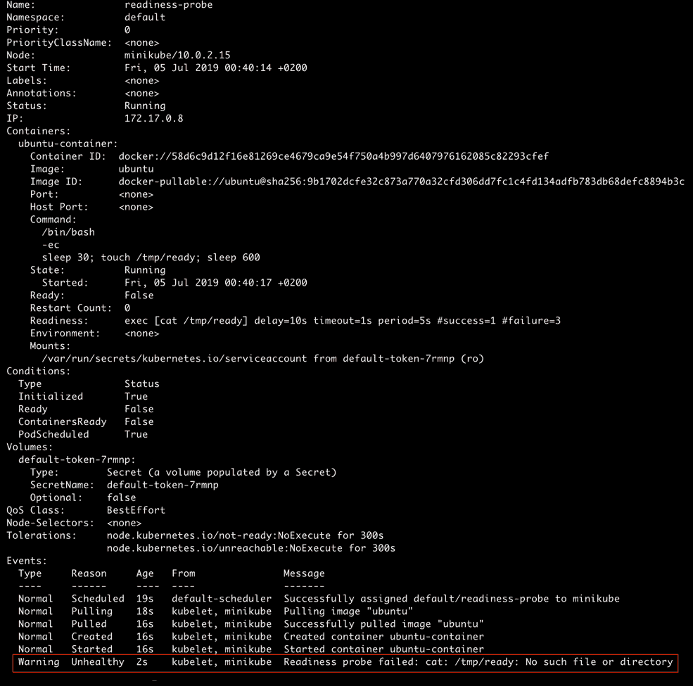

    图 5.15:描述就绪状态-探测

    该输出告诉我们，就绪探测器已经失败过一次。如果我们等待一段时间，然后再次运行该命令，我们会看到就绪探测器一直失败，直到容器启动 30 秒后。此后，准备状态探测将开始成功，因为文件将在`/tmp/ready`创建。

5.  Let's check the state of the pod again:

    ```
    kubectl get pod readiness-probe
    ```

    您应该会看到以下响应:

    ```
    NAME              READY    STATUS      RESTARTS     AGE
    readiness-probe   1/1      Running     0            66s
    ```

我们可以看到探测器已经成功，POD现在处于`Ready`状态。

## 使用探针时的最佳实践

探针的不正确使用不会帮助您达到预期的目的，甚至可能会损坏POD。遵循以下实践来正确使用探头:

*   对于活性探测器，`initialDelaySeconds`应该明显大于应用启动所需的时间。否则，容器很可能会陷入重启循环，在这个循环中，它会不断地使活性探测器失败，从而不断地被控制器重启。
*   对于就绪探测器来说，`initialDelaySeconds`可能很小，因为我们希望容器一准备好就启用到 pod 的流量，并且在容器启动时更频繁地轮询容器在大多数情况下不会造成任何伤害。
*   对于就绪探测器，我们应该小心设置`failureThreshold`，以确保我们的就绪探测器不会在临时停机或系统出现问题时过早放弃。

## 活动 5.01: 在 Pod 中部署应用

想象一下，你正在和一个开发团队一起工作，他们已经构建了一个很棒的应用，他们希望你部署在一个 pod 中。应用有一个启动过程，大约需要 20 秒来加载所有需要的资产。一旦应用启动，就可以开始接收请求了。如果由于某种原因，应用崩溃了，你会希望 pod 也重新启动。他们已经给了您创建 pod 的任务，该 pod 使用的配置将尽可能以最佳方式满足应用开发人员的这些需求。

我们提供了一个预先制作的应用映像来模拟上面提到的应用的行为。您可以在 pod 规范中使用这条线来获得它:

```
image: packtworkshops/the-kubernetes-workshop:custom-application-for-    pods-chapter
```

注意

理想情况下，您会希望在不同的名称空间中创建这个 pod，以使它与您在练习中创建的其他内容分开。因此，请随意创建一个名称空间，并在该名称空间中创建 pod。

以下是完成本活动的高层次步骤:

1.  为您的 pod 创建一个新的命名空间。
2.  创建适合应用要求的 pod 配置。确保您使用适当的名称空间、重启策略、就绪性和活跃度探测器，以及应用开发人员提供的容器映像。
3.  使用您刚刚创建的配置创建一个 pod。
4.  Make sure the pod is running as per the requirements.

    注意

    该活动的解决方案可在以下地址找到:[https://packt.live/304PEoD](https://packt.live/304PEoD)。

# 总结

在这 一章中，我们已经探索了 pod 配置的各种组件，并了解了何时使用什么。我们现在应该能够创建一个 pod，并根据您的应用的需要选择 pod 配置中各个字段的正确值。这种能力使我们能够利用我们对这个重要的基本构件的强大理解，并将其扩展到开发一个成熟的、可靠部署的应用。

在下一章中，我们将讨论如何向 pods 添加标签和任意元数据，并使用它们来识别或搜索 pods。这将帮助我们组织我们的POD，并在需要时选择它们的子集。