# 6。标签和注释

概观

元数据对任何组织都非常有用，它可以用来管理集群中可能成千上万的资源。本章教您如何向您的 pods 或任何其他 Kubernetes 对象添加元数据。将向您介绍标签和注释的概念。我们还将解释它们的用例，以便您可以决定是否为特定用例使用标签或注释。您将通过使用标签选择器来选择或过滤有组织的对象集，从而利用标签来组织对象。您还将使用注释向对象添加非结构化元数据信息。

# 简介

在前一章中，我们创建了各种各样的豆荚，并管理它们的生命周期。一旦我们开始使用不同的豆荚，理想情况下，我们会希望根据某些属性对它们进行组织、分组和过滤。要做到这一点，我们需要向我们的吊舱添加一些信息，以便我们以后可以使用这些信息来组织它们。我们已经看到了使用`name`和`namespace`字段作为荚的元数据。除了这些字段之外，我们还可以向 pods 添加键值对，以便添加额外的信息作为标签和注释。

在本章中，我们将为这些 pods 分配元数据，以便通过基于一些元数据的查询来识别 pods，然后添加额外的非结构化元数据。我们将详细介绍标签和标注并考察它们之间的区别。我们将同时使用标签和注释，并看看何时使用其中之一。

# 标签

标签是元数据，包含与 Kubernetes 对象相关的可识别信息。这些基本上是键值对，可以附加到像 pods 这样的对象。每个键对于一个对象必须是唯一的。标签包含对用户有意义的信息。标签可以在创建时附加到豆荚上，也可以在运行时添加或修改。以下是 YAML 文件中标签的显示示例:

```
metadata:
  labels:
    key1: value1
    key2: value2
```

## 标签的约束

如前所述，标签是键值对。标签键和值应该遵循某些规则。这些约束之所以存在，是因为这样，通过在内部使用优化的数据结构和算法，可以更快地评估使用标签的查询。Kubernetes 使用优化的数据结构在内部维护标签到相应对象的映射，以加快查询速度。

### 标签键

下面是标签键的一个示例:

```
label_prefix.com/worker-node-1
```

我们可以看到，标签键由两部分组成:标签前缀和标签名称。让我们仔细看看这两个部分:

*   **Label prefix**: The label prefix is optional and must be a DNS subdomain. It cannot be longer than 253 characters and cannot contain spaces. The label prefix is always followed by a forward slash (`/`). If no prefix is used, the label key is assumed to be private to the user. Some of the prefixes, such as `kubernetes.io/` and `k8s.io/`, are reserved for use solely by the Kubernetes core systems.

    在我们的示例中，`label_prefix.com/`是该标签密钥的前缀。

*   **Label name**: The label name is required and can be up to 63 characters long. The label name can only start and end with alphanumeric characters (a – z, A – Z, 0 – 9); however, it can contain dashes (`-`), underscores (`_`), dots (`.`), and alphanumeric characters in between. A label name cannot have spaces or line breaks.

    在`label_prefix.com/worker-node-1`的例子中，标签键的名称是`worker-node-1`。

### 标签值

标签值最长可达 63 个字符。与标签名称类似，标签值也应以字母数字字符开始和结束。但是，它们可以包含破折号(`-`)、下划线(`_`)、点(`.`)以及介于两者之间的字母数字字符。标签值不能有空格或换行符。

## 我们为什么需要标签？

标签通常用于组织对象的子集。然后可以根据这些标签过滤这些对象。有了标签，您还可以在选定的节点上运行特定的 pods。这两种情况将在下一节中详细解释。

### 按组织/团队/项目组织 Pods

标签的用例之一可能是使用基于您公司的团队或组织的标签。假设您的组织有几个团队在不同的项目上工作。你可以让不同的团队只列出他们的任务，甚至是那些特定项目的任务。在此基础上，如果您是基础架构服务提供商，则可以使用组织标签将更改仅应用于与特定客户端组织相关联的 pods。对于这样的用例，可以使用`team`、`org`、`project`等标签键。以下是此类用例的示例`labels`部分:

```
metadata:
  labels:
    environment: production
    team: devops-infra
    project: test-k8s-infra
```

### 在特定节点上运行选择性荚

另一个有用的场景是，您希望将 pod 分配给具有特定硬件或其他属性的特定节点。这可以通过向具有特殊硬件或其他属性的节点添加标签来实现。我们可以使用`nodeSelector`将 pod 分配给任何具有特定标签的节点。考虑以下示例:

```
apiVersion: v1
kind: Pod
metadata:
  name: pod-with-node-selector
spec:
  containers:
  - name: first-container
    image: nginx
 nodeSelector:
 region: east-us
 disktype: ssd
```

前面的 pod 模板可用于确保 pod 将被分配给位于`east-us`区域并具有`ssd`存储的节点。该检查基于添加到节点的标签。因此，我们需要确保将适当的`region`和`disktype`标签分配给所有适用的节点。

注意

请注意，将在`nodeSelector`部分使用的确切节点标签将由云基础设施提供商提供，标签密钥和值可能会发生变化。本例中使用的值只是为了演示用例。

在接下来的练习中，我们将向您展示如何创建带有标签的窗格，如何向运行窗格添加标签，以及如何修改和/或删除运行窗格的现有标签。

## 练习 6.01:创建带标签的 Pod

在本练习中，我们旨在创建一个带有一些标签的 pod。为了成功完成本练习，请执行以下步骤:

1.  Create a file called `pod-with-labels.yaml` with the following content:

    ```
    apiVersion: v1
    kind: Pod
    metadata:
      name: pod-with-labels
      labels:
        app: nginx
        foo: bar
    spec:
      containers:
      - name: first-container
        image: nginx
    ```

    从前面的片段中可以看到，我们添加了`app`和`foo`标签，并分别为它们分配了`nginx`和`bar`的值。现在，我们需要用这些标签创建一个 pod，并验证标签是否已经实际包含在 pod 中，这将是接下来几个步骤的重点。

2.  Run the following command in the Terminal to create the pod with the preceding configuration:

    ```
    kubectl create -f pod-with-labels.yaml
    ```

    您应该会看到以下响应:

    ```
    pod/pod-with-labels created
    ```

3.  Verify that the pod was created by using the `kubectl get` command:

    ```
    kubectl get pod pod-with-labels
    ```

    以下输出表明已经创建了 pod:

    ```
    NAME              READY      STATUS        RESTARTS     AGE
    pod-with-labels   1/1        Running       0            4m4s
    ```

4.  Verify that the `labels` metadata was actually added to the pod using the `kubectl describe` command:

    ```
    kubectl describe pod pod-with-labels
    ```

    这将导致以下输出:

    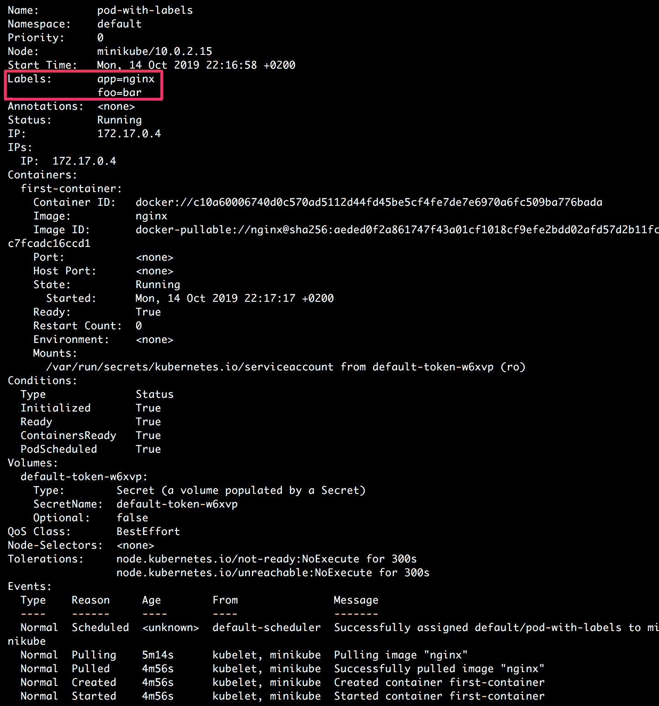

图 6.1:描述带有标签的吊舱

输出显示了与 pod 相关的各种细节(正如我们在上一章中所看到的)。在这种情况下，我们将重点关注输出的高亮部分，它显示了所需的标签`app=nginx`和`foo=bar`实际上已经添加到了 pod 中。请注意，在本练习中，我们在创建 pod 时添加了标签。但是，当一个 pod 已经在运行时，如何给它添加标签呢？下一个练习将回答这个问题。

## 练习 6.02:向跑步吊舱添加标签

在本练习中，我们旨在创建一个没有标签的 pod，然后在 pod 运行后添加标签。为了成功完成本练习，请执行以下步骤:

1.  Create a file called `pod-without-initial-labels.yaml` with the following content:

    ```
    apiVersion: v1
    kind: Pod
    metadata:
      name: pod-without-initial-labels
    spec:
      containers:
      - name: first-container
        image: nginx
    ```

    请注意，我们还没有向我们的 pod 添加任何标签。

2.  Run the following command in the Terminal to create the pod with the configuration mentioned in the previous step:

    ```
    kubectl create -f pod-without-initial-labels.yaml
    ```

    您应该会看到以下响应:

    ```
    pod/pod-without-initial-labels created
    ```

3.  Verify that the pod was created by using the `kubectl get` command:

    ```
    kubectl get pod pod-without-initial-labels
    ```

    以下输出表明已经创建了 pod:

    

    图 6.2:检查不带初始标签的 pod 的状态

4.  Check if the `labels` metadata was actually added to the pod using the `kubectl describe` command:

    ```
    kubectl describe pod pod-without-initial-labels
    ```

    您应该会看到以下输出:

    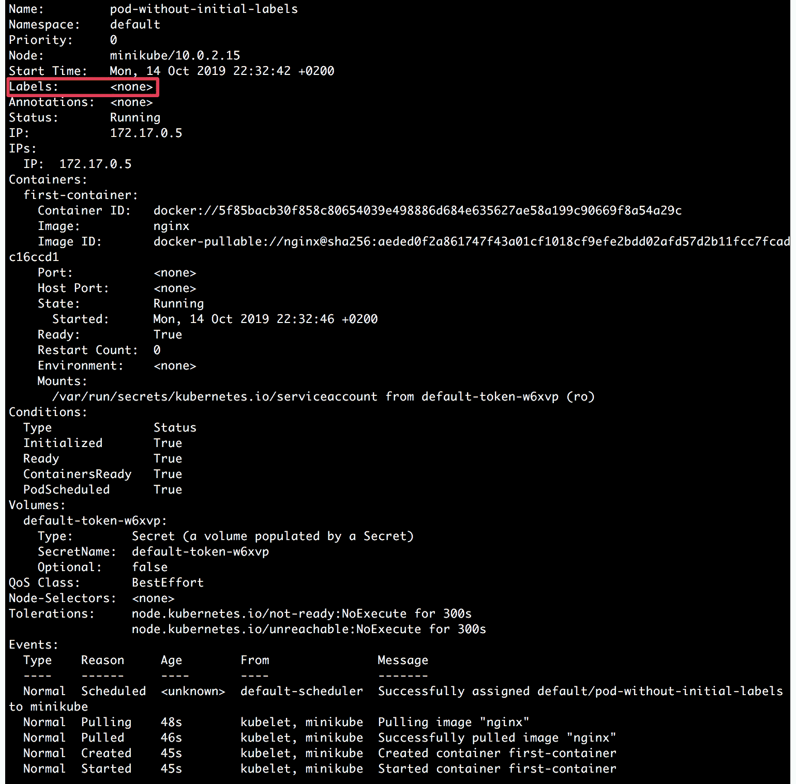

    图 6.3:描述不带初始标签的 pod

    在输出的高亮部分，我们可以注意到`Labels`字段为空。因此，我们可以验证，默认情况下，没有标签被添加到 pod。在接下来的几个步骤中，我们将添加一个标签，然后再次运行 pod 来验证该标签是否实际包含在 pod 中。

5.  Add a label using the `kubectl label` command as follows:

    ```
    kubectl label pod pod-without-initial-labels app=nginx
    ```

    您应该会看到以下响应:

    ```
    pod/pod-without-initial-labels labeled
    ```

    输出显示`pod-without-initial-labels`吊舱被标记。

6.  Verify that the label was actually added in the last step by using the `kubectl describe` command:

    ```
    kubectl describe pod pod-without-initial-labels
    ```

    您应该会看到以下输出:

    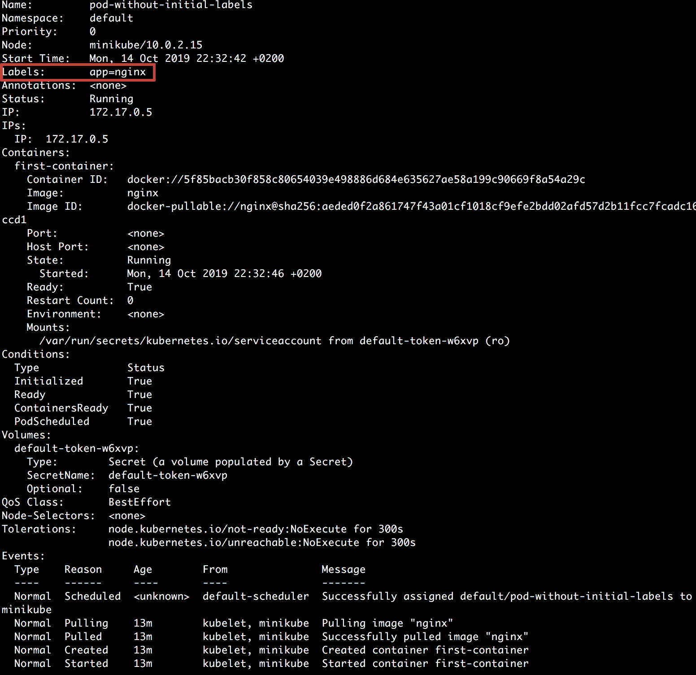

    图 6.4:验证 app=nginx 标签已添加

    我们可以在输出的高亮部分观察到`app=nginx`标签实际上被添加到了 pod 中。在前面的例子中，我们只添加了一个标签。但是，您可以向一个 pod 添加多个标签，这将在接下来的步骤中完成。

7.  Next, let's add multiple labels in the same command. We can do this by passing multiple labels in the `key=value` format, separated by spaces:

    ```
    kubectl label pod pod-without-initial-labels foo=bar foo2=baz
    ```

    您应该会看到以下响应:

    ```
    pod/pod-without-initial-labels labeled
    ```

8.  Verify that the two labels were added to the pod using the `kubectl describe` command:

    ```
    kubectl describe pod pod-without-initial-labels
    ```

    您应该会看到以下输出:

    

图 6.5:验证是否还添加了新的两个标签

在输出的高亮部分，我们可以看到两个新标签`foo=bar,`和`foo2=baz`也被添加到了 pod 中。

在下一个练习中，我们将了解如何删除和修改已经运行的 pod 的现有标签。

## 练习 6.03:修改和/或删除运行窗格的现有标签

在本练习中，我们旨在创建一个带有一些标签的 pod，并在 pod 运行时修改和删除标签。为了成功完成本练习，请执行以下步骤:

1.  Create a file called `pod-with-some-labels.yaml` with the following content:

    ```
    apiVersion: v1
    kind: Pod
    metadata:
      name: pod-with-some-labels
      labels:
        app: nginx
    spec:
      containers:
      - name: first-container
        image: nginx
    ```

    正如你在 pod 定义中看到的，我们只添加了一个标签`app`，值为`nginx`。

2.  Run the following command in the Terminal to create the pod with the preceding configuration:

    ```
    kubectl create -f pod-with-some-labels.yaml
    ```

    您应该会看到以下响应:

    ```
    pod/pod-with-some-labels created
    ```

3.  Verify that the pod was created by using the `kubectl get` command:

    ```
    kubectl get pod pod-with-some-labels
    ```

    以下输出表明已经创建了 pod:

    

    图 6.6:检查带有某些标签的容器的状态

4.  Verify that the labels were added as specified in the pod configuration using the `kubectl describe` command:

    ```
    kubectl describe pod pod-with-some-labels
    ```

    您应该会看到以下输出:

    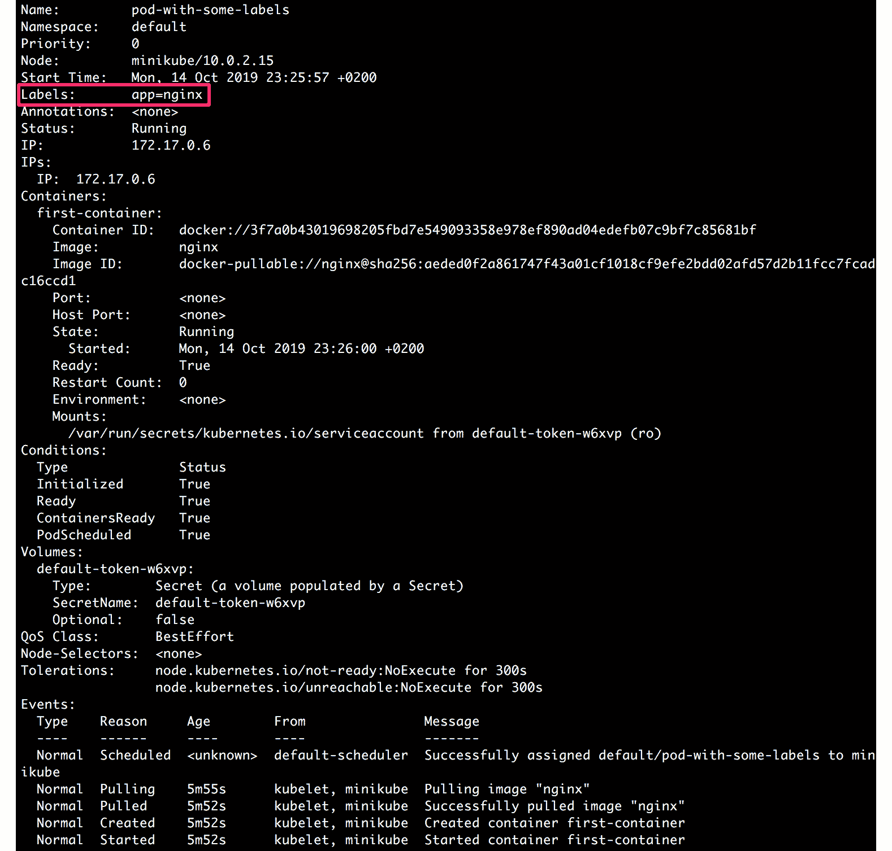

    图 6.7:验证标签是否添加到带有一些标签的 pod 中

    一旦我们确定`app=nginx`标签存在，我们将在下一步修改该标签。

5.  Modify the `app=nginx` label to `app=nginx-application` using the `kubectl label` command:

    ```
    kubectl label --overwrite pod pod-with-some-labels app=nginx-application
    ```

    您应该会看到以下响应:

    ```
    pod/pod-with-some-labels labeled
    ```

6.  Verify that the value of label was modified from `nginx` to `nginx-application` using the `kubectl describe` command:

    ```
    kubectl describe pod pod-with-some-labels
    ```

    以下屏幕截图显示了该命令的输出:

    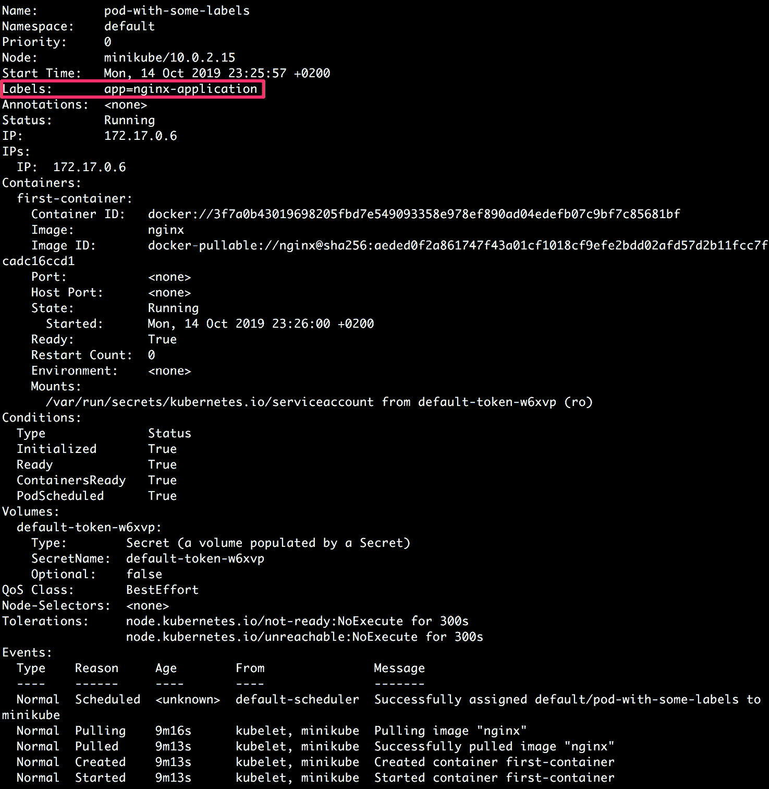

    图 6.8:验证标签值已被修改

    如输出中突出显示的，我们可以看到带有`app`键的标签有一个新值，`nginx-application`。

7.  Delete the label with the `app` key using the `kubectl label` command:

    ```
    kubectl label pod pod-with-some-labels app-
    ```

    请注意前面命令末尾的连字符。您应该会看到以下响应:

    ```
    pod/pod-with-some-labels labeled
    ```

8.  Verify that the label with the `app` key was actually deleted using the `kubectl describe` command:

    ```
    kubectl describe pod pod-with-some-labels
    ```

    您应该会看到以下输出:

    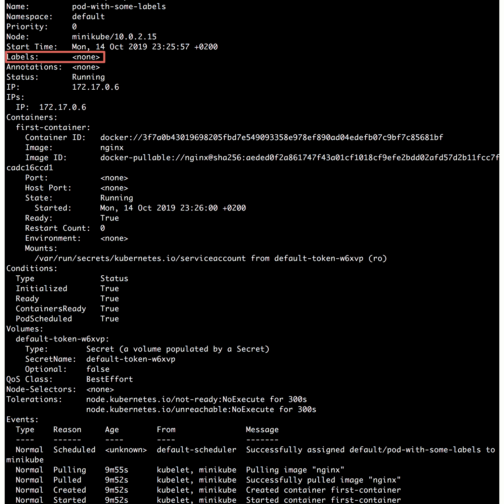

图 6.9:验证所需的标签实际上已从容器中删除

如前一个输出中突出显示的，我们可以再次注意到带有`app`键的标签被删除，因此 pod 现在没有标签。因此，我们已经学习了如何修改和删除运行 pod 的现有标签。

## 使用标签选择器选择 Kubernetes 对象

为了根据标签对各种对象进行分组，我们使用了标签选择器。它允许用户识别一组符合特定标准的对象。

我们可以对`kubectl get`命令使用以下语法，并使用`-l`或`--label`参数传递标签选择器:

```
kubectl get pods -l {label_selector}
```

在下面的练习中，我们将看到如何在实际场景中使用该命令。在此之前，让我们了解一下在这些命令中可以使用哪些类型的`{label_selector}`参数。

目前，标签选择器有两种类型:基于等式的和基于集合的。

### 基于等式的选择器

基于等式的选择器允许根据标签键和值选择 Kubernetes 对象。这些类型的选择器允许我们为给定的标签键匹配所有具有特定标签值的对象。事实上，我们也有基于不平等的选择器。

总的来说，有三种操作符:`=`、`==`、`!=`。

前两个实际上在操作上是相同的，表示基于等式的操作，而第三个表示基于不等式的操作。当使用这些类型的选择器时，我们可以使用前面的任何操作符指定多个条件。

例如，如果我们使用标签键，如`environment`和`team`，我们可能希望使用以下选择器:

```
environment=production
```

前面的选择器匹配所有具有标签键环境和相应`production`值的对象:

```
team!=devops-infra
```

前面的选择器匹配所有没有`team`标签键或存在`team`标签键的对象，对应的值是**而不是**等于`devops-infra`。

同样，我们也可以一起使用两个选择器，用逗号(`,`)隔开:

```
environment=production,team!=devops-infra
```

在前面的示例中，选择器将匹配所有与两个选择器指定的标准相匹配的对象。逗号充当指定的两个选择器之间的逻辑“与”(`&&`)运算符。现在让我们在下面的练习中尝试一下这些选择器的实现。

## 练习 6.04:使用基于等式的标签选择器选择豆荚

在本练习中，我们旨在创建一些具有不同标签的豆荚，然后使用基于相等的选择器来选择它们。为了成功完成本练习，请执行以下步骤:

1.  Create a file called `pod-frontend-production.yaml` with the following content:

    ```
    apiVersion: v1
    kind: Pod
    metadata:
      name: frontend-production
      labels:
        environment: production
        role: frontend
    spec:
      containers:
      - name: application-container
        image: nginx
    ```

    我们可以看到，这是 pod 的模板，有以下两个标签:`environment=production`和`role=frontend`。

2.  Create another file called `pod-backend-production.yaml` with the following content:

    ```
    apiVersion: v1
    kind: Pod
    metadata:
      name: backend-production
      labels:
        environment: production
        role: backend
    spec:
      containers:
      - name: application-container
        image: nginx
    ```

    这是带有以下两个标签的 pod 模板:`environment=production`和`role=backend`。

3.  Create another file called `pod-frontend-staging.yaml` with the following content:

    ```
    apiVersion: v1
    kind: Pod
    metadata:
      name: frontend-staging
      labels:
        environment: staging
        role: frontend
    spec:
      containers:
      - name: application-container
        image: nginx
    ```

    这是带有以下两个标签的 pod 模板:`environment=staging`和`role=frontend`。

4.  Create all three pods using the following three commands:

    ```
    kubectl create -f pod-frontend-production.yaml
    ```

    您应该会看到以下响应:

    ```
    pod/frontend-production created
    ```

    现在，运行以下命令:

    ```
    kubectl create -f pod-backend-production.yaml
    ```

    以下响应表明 pod 已创建:

    ```
    pod/backend-production created
    ```

    现在，运行以下命令:

    ```
    kubectl create -f pod-frontend-staging.yaml
    ```

    这应给出以下响应:

    ```
    pod/frontend-staging created
    ```

5.  Verify that all three pods are created with correct labels using the `--show-labels` argument to the `kubectl get` command. First, let's check the `frontend-production` pod:

    ```
    kubectl get pod frontend-production --show-labels
    ```

    以下响应表明`frontend-production`吊舱已经创建:

    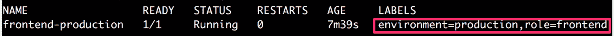

    图 6.10:验证前端生产容器的标签

6.  Now, check the `backend-production` pod:

    ```
    kubectl get pod backend-production --show-labels
    ```

    以下响应表明`backend-production`吊舱已经创建:

    

    图 6.11:验证后端生产容器的标签

7.  Finally, check the `frontend-staging` pod:

    ```
    kubectl get pod frontend-staging --show-labels
    ```

    以下响应表明`frontend-staging`吊舱已经创建:

    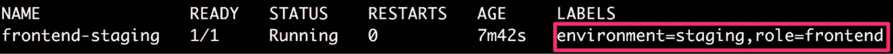

    图 6.12:验证前端分段盒的标签

8.  Now, we will use label selectors to see all the pods that are assigned to the production environment. We can do this by using `environment=production` as the label selector with the `kubectl get` command:

    ```
    kubectl get pods -l environment=production
    ```

    在下面的输出中，我们可以看到它只显示那些带有标签`environment`键和`production`值的豆荚:

    ```
    NAME                    READY      STATUS       RESTARTS    AGE
    backend-production      1/1        Running      0           67m
    frontend-production     1/1        Running      0           68m
    ```

    您可以从*图 6.10* 和*图 6.11* 中确认这些是带有`environment=production`标签的豆荚。

9.  Next, we will use label selectors to see all the pods that have the `frontend` role and the `staging` environment. We can do this by using the label selector with the `kubectl get` command, as shown here:

    ```
    kubectl get pods -l role=frontend,environment=staging
    ```

    在下面的输出中，我们可以看到它只显示了那些以`staging`为环境，以`frontend`为角色的豆荚:

    ```
    NAME                    READY      STATUS       RESTARTS    AGE
    frontend-staging        1/1        Running      0           72m
    ```

在本练习中，我们使用了标签选择器来选择特定的豆荚。这种用于`get`命令的标签选择器提供了一种基于标签来选择所需豆荚组的便捷方式。这也代表了一种常见的场景，在这种场景中，您可能希望将一些更改仅应用于生产或转移环境中涉及的 pods，或者前端或后端基础架构。

### 基于集合的选择器

基于集合的选择器允许基于给定键的一组值来选择 Kubernetes 对象。这些类型的选择器允许我们将具有给定标签键的所有对象与给定值集中的值进行匹配。

有三种操作符:`in`、`notin`和`exists`。让我们借助一些例子来看看这些运算符的含义:

```
environment in (production, staging)
```

在前面的示例中，选择器匹配所有具有`environment`标签键的对象，并且值为`production`或`staging`:

```
team notin (devops-infra)
```

上例中的选择器匹配所有具有`team`标签键的对象，并且该值不是`devops-infra`值。它还匹配那些没有`team`标签键的对象:

```
!critical
```

在上例中，选择器相当于`exists`操作。它匹配所有没有`critical`标签键的对象。它根本不检查值。

注意

这两种类型的选择器也可以一起使用，正如我们将在*练习 6.06* 、*中观察到的，使用混合标签选择器*选择豆荚。

让我们在下面的练习中实现基于集合的选择器。

## 练习 6.05:使用基于集合的标签选择器选择豆荚

在本练习中，我们旨在创建一些带有不同标签的豆荚，然后使用基于集合的选择器来选择它们。

注意

在本练习中，我们假设您已经成功完成了*练习 6.04* ，*使用基于等式的标签选择器*选择豆荚。我们将重复使用在那个练习中创建的豆荚。

为了成功完成本练习，请执行以下步骤:

1.  Open the terminal and verify that the `frontend-production` pod we created in *Exercise 6.04*, *Selecting Pods Using Equality-Based Label Selectors*, is still running and has the required labels. We will be using the `--show-labels` argument with the `kubectl get` command:

    ```
    kubectl get pod frontend-production --show-labels
    ```

    以下响应表明`frontend-production`吊舱存在:

    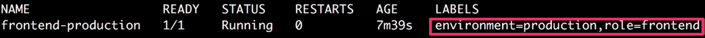

    图 6.13:验证前端生产容器的标签

2.  Verify that the `backend-production` pod we created in *Exercise 6.04*, *Selecting Pods Using Equality-Based Label Selectors* is still running and has the required labels using the `kubectl get` command with the `--show-labels` argument:

    ```
    kubectl get pod backend-production --show-labels
    ```

    以下响应表明`backend-production`吊舱存在:

    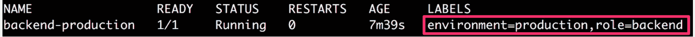

    图 6.14:验证后端生产容器的标签

3.  Verify that the `frontend-staging` pod we created in *Exercise 6.04*, *Selecting Pods Using Equality-Based Label Selectors* is still running and has the required labels using the `kubectl get` command with the `--show-labels` argument:

    ```
    kubectl get pod frontend-staging --show-labels
    ```

    以下响应表明`frontend-staging`吊舱存在:

    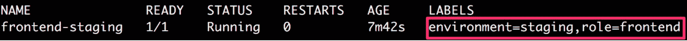

    图 6.15:验证前端分段盒的标签

4.  Now, we will use the label selectors to match all the pods for which the environment is `production`, and the role is either `frontend` or `backend`. We can do this by using the label selector with the `kubectl get` command as shown here:

    ```
    kubectl get pods -l 'role in (frontend, backend),environment in (production)'
    ```

    您应该会看到以下响应:

    ```
    NAME                    READY      STATUS       RESTARTS    AGE
    backend-production      1/1        Running      0           82m
    frontend-production     1/1        Running      0           82m
    ```

5.  Next, we will use the label selectors to match all those pods that have the `environment` label and whose role is anything other than `backend`. We also want to exclude those pods that don't have the `role` label set:

    ```
    kubectl get pods -l 'environment,role,role notin (backend)'
    ```

    这将产生以下输出:

    ```
    NAME                    READY      STATUS       RESTARTS    AGE
    frontend-production     1/1        Running      0           86m
    frontend-staging        1/1/       Running      0           86m
    ```

在这个例子中，我们有基于集合的选择器，可以用来获得想要的豆荚。我们还可以将这些与基于选择器的豆荚结合起来，正如我们将在下面的练习中看到的那样。

## 练习 6.06:使用混合标签选择器选择豆荚

在本练习中，我们旨在创建一些具有不同标签的豆荚，然后使用基于等式和基于集合的选择器的组合来选择它们。

注意

在本练习中，我们假设您已经成功完成了*练习 6.04* ，*使用基于等式的标签选择器*选择豆荚。我们将重复使用在那个练习中创建的豆荚。

为了成功完成本练习，请执行以下步骤:

1.  Open the terminal and verify that the `frontend-production` pod we created in *Exercise 6.04*, *Selecting Pods Using Equality-Based Label Selectors*, is still running and has the required labels. We will be using the `--show-labels` argument with the `kubectl get` command:

    ```
    kubectl get pod frontend-production --show-labels
    ```

    以下响应表明`frontend-production`吊舱存在:

    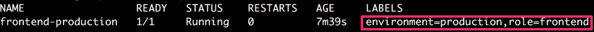

    图 6.16:验证前端生产容器的标签

2.  Verify that the `backend-production` pod we created in *Exercise 6.04*, *Selecting Pods Using Equality-Based Label Selectors* is still running and has the required labels using the `kubectl get` command with the `--show-labels` argument:

    ```
    kubectl get pod backend-production --show-labels
    ```

    以下响应表明`backend-production`吊舱存在:

    

    图 6.17:验证后端生产容器的标签

3.  Verify that the `frontend-staging` pod we created in *Exercise 6.04*, *Selecting Pods Using Equality-Based Label Selectors* is still running and has the required labels using the `kubectl get` command with the `--show-labels` argument:

    ```
    kubectl get pod frontend-staging --show-labels
    ```

    以下响应表明`frontend-staging`吊舱存在:

    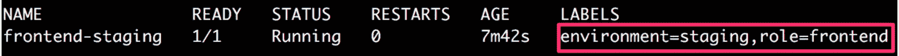

    图 6.18:验证前端分段盒的标签

4.  Now, we will use the label selectors to match all the pods that have a `frontend` role and whose environment is one of `production`, `staging`, or `dev`:

    ```
    kubectl get pods -l 'role=frontend,environment in (production,staging,dev)'
    ```

    该命令应给出以下吊舱列表:

    ```
    NAME                    READY      STATUS       RESTARTS    AGE
    frontend-production     1/1        Running      0           95m
    frontend-staging        1/1        Running      0           95m
    ```

在输出中，我们只能看到那些具有`frontend`角色的吊舱，而`environment`可以是任何一个给定值。因此，我们已经看到，可以根据需要混合使用不同类型的选择器。

# 注释

正如我们之前看到的，标签用于添加识别元数据，我们以后可以使用这些元数据来过滤或选择对象。然而，就我们可以在值中存储的内容而言，标签有一定的限制，例如开头和结尾的 63 个字符和字母数字字符的限制。另一方面，就可以在注释中存储何种数据而言，注释的约束较少。但是，我们不能通过使用注释来过滤或选择对象。

注释是所有的 所以键值对可以用来存储与库本内特对象相关的非结构化信息。以下是 YAML 文件中注释的显示示例:

```
metadata:
  annotations:
    key1: value1
    key2: value2
```

## 约束为安的符号

如前一节所述，注释和标签一样，都是键值对。但是，注释的规则比标签键和值的规则更宽松。限制更宽松的原因是缺乏对使用注释过滤或选择对象的支持。这是因为注释的键值对没有存储在高效查找的数据结构中。因此，这里的限制较少。

### 注释键

与标签键类似，注释键也有两个部分:前缀和名称。注释前缀和名称的约束分别与标签前缀和名称的约束相同。

下面是注释键可能出现的一个示例:

```
annotation_prefix.com/worker-node-identifier
```

### 注释值

就可能包含的数据注释值种类而言，没有任何限制。

## 注释用例

注释通常用于添加不会用于过滤或选择对象的元数据。它用于添加元数据，用户或工具将使用这些元数据来获取更多关于 Kubernetes 对象的主观信息。让我们看看使用注释可能有用的一些场景:

*   注释可用于添加时间戳、提交 SHA、问题跟踪器链接或负责组织中特定对象的用户的姓名/信息。在这种情况下，根据我们的用例，我们可以使用以下类型的元数据:

    ```
    metadata:
      annotations:
        timestamp: 123456789
        commit-SHA: d6s9shb82365yg4ygd782889us28377gf6
        JIRA-issue: "https://your-jira-link.com/issue/ABC-1234"
        owner: "https://internal-link.to.website/username"
    ```

*   注释还可以用来添加关于客户端库或工具的信息。我们可以添加库的名称、使用的版本和公共文档链接等信息。这些信息以后可以用于我们应用程序中的调试问题:

    ```
    metadata:
      annotations:
        node-version: 13.1.0
        node-documentation: "https://nodejs.org/en/docs/"
    ```

*   我们还可以使用注释来存储之前部署的 pod 配置。这对于弄清楚在当前版本之前部署了什么配置以及发生了什么变化非常有帮助:

    ```
    metadata:
      annotations:
        previous-configuration: "{ some json containing the       previously deployed configuration of the object }"
    ```

*   注释还可以用来存储配置或检查点，这对我们应用程序的部署过程很有帮助。

在下面的练习中，我们将学习如何向 pod 添加注释。

## 练习 6.07:添加注释以帮助应用程序调试

在本练习中，我们将向 pod 添加一些任意的元数据。为了成功完成本练习，请执行以下步骤:

1.  Create a file called `pod-with-annotations.yaml` with the following content:

    ```
    apiVersion: v1
    kind: Pod
    metadata:
      name: pod-with-annotations
     annotations:
     commit-SHA: d6s9shb82365yg4ygd782889us28377gf6
     JIRA-issue: "https://your-jira-link.com/issue/ABC-1234"
     timestamp: "123456789"
     owner: "https://internal-link.to.website/username"
    spec:
      containers:
      - name: application-container
        image: nginx
    ```

    pod 定义中突出显示的部分显示了我们添加的注释。

2.  Run the following command in the Terminal to create the pod using the `kubectl create` command:

    ```
    kubectl create -f pod-with-annotations.yaml
    ```

    您应该会得到以下响应:

    ```
    pod/pod-with-annotations created
    ```

3.  Run the following command in the Terminal to verify that the pod was created as desired:

    ```
    kubectl get pod pod-with-annotations
    ```

    您应该会看到以下豆荚列表:

    ```
    NAME                    READY      STATUS       RESTARTS    AGE
    pod-with-annotations    1/1        Running      0           29s
    ```

4.  Run the following command in the Terminal to verify that the created pod has the desired annotations:

    ```
    kubectl describe pod pod-with-annotations
    ```

    您应该会看到该命令的以下输出:

    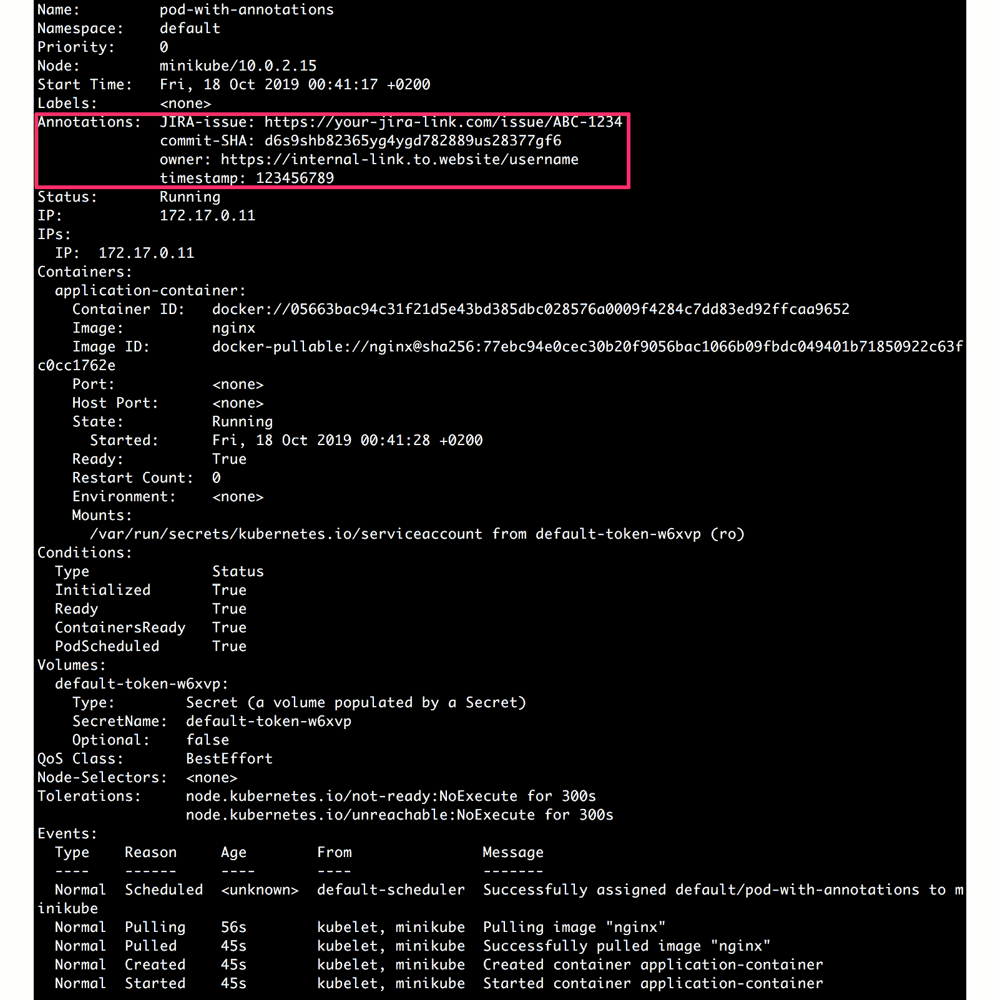

图 6.19:验证带有注释的容器的注释

正如我们在前面输出的突出显示部分所看到的，所需的元数据已经作为注释添加到 pod 中。现在，任何可能知道所用键名的部署工具或客户端都可以使用这些数据。

## 使用注释

在前面的练习中，我们创建了一个带有注释的 pod。与标签类似，我们可以向运行窗格添加注释，并修改/删除运行窗格的注释。这可以通过运行与标签类似的命令来实现。下面的列表向您展示了可以对注释以及相关命令执行的各种操作:

*   Thus, we can add annotations to a running pod by using the following command:

    ```
    kubectl annotate pod <pod_name> <annotation_key>=<annotation_label>
    ```

    在前面的命令中，我们可以添加类似于多个标签的多个注释，如在*练习 6.02**的*步骤 7* 中，将标签添加到跑步舱*。

*   我们还可以修改(覆盖)注释，如下所示:

    ```
    kubectl annotate --overwrite pod <pod_name> <annotation_key>=<annotation_label>
    ```

*   最后，我们可以使用以下命令删除注释:

    ```
    kubectl annotate pod <pod_name> <annotation_key>-
    ```

请注意前面命令末尾的连字符。既然我们已经了解了标签和注释，以及我们可以使用它们的各种方式，让我们在下面的活动中将所有这些结合起来。

## 活动 6.01:创建带有标签/注释的豆荚，并根据给定标准对其进行分组

考虑一下你正在支持两个团队`product-development`和`infra-libraries`。两个团队都有一些适用于不同环境(生产或试运行)的应用程序单元。如果情况确实如此，团队也希望将他们的吊舱标记为关键。

简而言之，您需要按照以下元数据要求创建三个窗格:

*   在生产环境中运行的`arbitrary-product-application`吊舱，归`product-development`团队所有。这需要标记为非关键 pod。
*   在生产环境中运行的`infra-libraries-application`吊舱，归`infra-libraries`团队所有。这需要标记为关键吊舱。
*   一个运行在临时环境中的`infra-libraries-application-staging`吊舱，归`infra-libraries`团队所有。由于它是分段运行的，所以不需要指明吊舱的关键程度。

除此之外，两个团队还想添加另一个元数据——“团队链接”，他们想在其中存储团队联系信息的内部链接。

创建完所有三个单元后，您应该能够执行以下任务:

1.  将所有在生产环境中运行的关键单元分组。
2.  Group all the pods that are not critical among all environments.

    注意

    理想情况下，您会希望将这个 pod 创建在一个不同的名称空间中，以便将其与您在练习中创建的其他内容分开。因此，请随意创建一个名称空间，并在该名称空间中创建 pod。

执行此活动的高级步骤如下:

1.  为此活动创建命名空间。
2.  写出所有三个吊舱的吊舱配置。确保所有请求的元数据在标签和注释中正确添加。
3.  使用上一步中编写的配置创建所有三个豆荚。
4.  确保所有三个单元都在运行，并且具有所有请求的元数据。
5.  将所有在生产环境中运行的关键单元分组。
6.  对所有环境中不重要的所有吊舱进行分组。

对于第一个任务，您的目标应该是在完成活动后获得`infra-libraries-application` pod，如下所示:

```
NAME                         READY   STATUS       RESTARTS    AGE
infra-libraries-application  1/1     Running      0           12m
```

对于第二个任务，您的目标是在完成活动后获得`arbitrary-product-application`和`infra-libraries-application-staging`，如下所示:

```
NAME                                 READY  STATUS    RESTARTS   AGE
arbitrary-product-application        1/1    Running   0          14m
infra-libraries-application-staging  1/1    Running   0          14m
```

注意

该活动的解决方案可在以下地址找到:[https://packt.live/304PEoD](https://packt.live/304PEoD)。

# 总结

在本章中，我们描述了标签和注释，并使用它们来添加元数据信息，这些信息可以是可用于过滤或选择对象的可识别信息，也可以是用户或工具用来获取更多关于应用程序状态的上下文的不可识别信息。更具体地说，我们还使用标签和注释来组织对象，例如 pods。这些都是重要的技能，可以帮助您更有效地管理 Kubernetes 对象。

在接下来的章节中，随着我们对更多 Kubernetes 对象(如部署和服务)的熟悉，我们将看到标签和标签选择器在组织用于部署或发现的 pods 时的进一步应用。