# 7。不可思议的控制器

概观

本章介绍 Kubernetes 控制器的概念，并解释如何使用它们来创建复制部署。我们将描述不同类型的控制器的使用，例如复制集、部署、DaemonSets、状态集和作业。您将学习如何为特定的用例选择合适的控制器。通过实践练习，我们将指导您如何使用这些具有所需配置的控制器来为您的应用程序部署 Pods 的多个副本。您还将学习如何使用各种命令来管理它们。

# 简介

在前几章中，我们创建了不同的 Pods，手动管理它们的生命周期，并向它们添加元数据(标签或注释)来帮助组织和识别各种 Pods。在这一章中，我们将看一看几个 Kubernetes 对象，它们可以帮助您以声明的方式管理几个副本 Pods。

在生产环境中部署应用程序时，有几个原因会让您想要一个以上的 Pods 副本。拥有多个副本可确保您的应用程序在一个或多个 Pods 出现故障的情况下继续工作。除了处理故障之外，复制还允许您平衡不同副本之间的负载，以便一个 Pod 不会因大量请求而过载，从而允许您轻松提供比单个 Pod 更高的流量。

Kubernetes 支持可用于复制的不同控制器，如复制集、部署、DaemonSets、状态集和作业。控制器是一个对象，它确保应用程序在整个运行时以所需的状态运行。这些控制器中的每一个对于特定的用例都是有用的。在本章中，我们将逐一探索一些最常用的控制器，并了解如何以及何时在现实生活场景中使用它们。

# 复制集

如前所述，拥有应用程序的多个副本可以确保即使少数副本失败，它仍然可用。这也使得我们可以轻松地扩展我们的应用程序来平衡负载，以服务更多的流量。例如，如果我们正在构建一个向用户公开的 web 应用程序，我们希望至少有两个应用程序副本，以防其中一个失败或意外死亡。我们还希望失败的复制副本能够自行恢复。除此之外，如果我们的流量开始增长，我们会希望增加运行我们的应用程序的 Pods(副本)的数量。副本集是一个库本内特控制器，它在任何给定的时间保持一定数量的吊舱运行。

ReplicaSet 充当 Kubernetes 集群中不同节点上多个 Pods 的主管。复制集将终止或启动新的 Pods，以匹配复制集模板中指定的配置。因此，即使您的应用程序只需要一个 Pod，使用它们也是一个好主意。即使有人删除了唯一运行的 Pod，复制集也会确保创建一个新的 Pod 来替换它，从而确保一个 Pod 始终运行。

复制集可用于无限期可靠地运行单个 Pod 或运行同一 Pod 的多个实例。

## 复制集配置

让我们首先看一个复制集的配置示例，然后我们将介绍不同字段的含义:

```
apiVersion: apps/v1
kind: ReplicaSet
metadata:
  name: nginx-replicaset
  labels:
    app: nginx
spec:
 replicas: 2
 selector:
 matchLabels:
 environment: production
 template:
 metadata:
 labels:
 environment: production
 spec:
 containers:
 - name: nginx-container
 image: nginx
```

与 Pod 配置一样，复制集也需要`apiVersion`、`kind`和`metadata`等字段。对于副本集，应用编程接口版本`apps/v1`是当前版本，`kind`字段将始终为`ReplicaSet`。到目前为止，与我们在吊舱配置中看到的不同的一个领域是`spec`。

现在，我们将看到我们需要在`spec`字段中指定哪些信息。

### 复制品

`spec`下的`replicas`字段指定复制集应该同时运行多少个吊舱。在前面的示例中，您可以看到以下值:

```
replicas: 2
```

复制集将创建或删除 Pods，以匹配此数字。如果未指定，该字段的默认值为`1`。

### 下的模板

在`template`字段中，我们将指定我们想要使用这个复制集运行的 Pod 的模板。这个 Pod 模板将与我们在前两章中使用的 Pod 模板完全相同。像往常一样，我们可以以标签和注释的形式向 Pods 添加元数据。复制集将在需要的时候使用这个豆荚模板来创建新的豆荚。上一个示例中的以下部分包含模板:

```
template:
  metadata:
    labels:
      environment: production
  spec:
    containers:
    - name: nginx-container
      image: nginx
```

### 吊舱选择器

这是一个非常重要的部分。在`spec`下的`selector`字段中，我们可以指定复制集将使用的标签选择器，以识别要管理的 Pods:

```
selector:
  matchLabels:
    environment: production
```

前面的例子保证了我们的控制器将只管理带有`environment: production`标签的 Pods。

现在让我们开始创建我们的第一个副本集。

## 练习 7.01:用 nginx 容器创建一个简单的副本集

在本练习中，我们将创建一个简单的复制集，并检查它创建的 Pods。要成功完成本练习，请执行以下步骤:

1.  Create a file called `replicaset-nginx.yaml` with the following content:

    ```
    apiVersion: apps/v1
    kind: ReplicaSet
    metadata:
      name: nginx-replicaset
      labels:
        app: nginx
    spec:
     replicas: 2
     selector:
     matchLabels:
     environment: production
     template:
     metadata:
     labels:
     environment: production
     spec:
     containers:
     - name: nginx-container
     image: nginx
    ```

    正如您在配置的高亮部分看到的，我们有三个字段:`replicas`、`selector`和`template`。我们已经将副本数量设置为`2`。吊舱选择器的设置方式使得该复制集可以管理带有`environment: production`标签的吊舱。Pod 模板具有我们在前面章节中使用的简单 Pod 配置。我们已经确保 Pod 标签选择器与模板中的 Pod 标签完全匹配。

2.  Run the following command to create the ReplicaSet using the preceding configuration:

    ```
    kubectl create -f replicaset-nginx.yaml
    ```

    您应该会看到以下响应:

    ```
    replicaset.apps/nginx-replicaset created
    ```

3.  Verify that the ReplicaSet was created by using the `kubectl get` command:

    ```
    kubectl get rs nginx-replicaset
    ```

    注意`rs`是所有 kubectl 命令中`replicaset`的缩写。

    您应该会看到以下响应:

    ```
    NAME               DESIRED    CURRENT    READY    AGE
    nginx-replicaset   2          2          2        30s
    ```

    如您所见，我们有一个副本集，其中包含两个所需的副本，正如我们在*步骤 1* 中的`replicaset-nginx.yaml`中定义的那样。

4.  Verify that the Pods were actually created by using the following command:

    ```
    kubectl get pods
    ```

    您应该会得到以下响应:

    ```
    NAME                     READY    STATUS   RESTARTS   AGE
    nginx-replicaset-b8fwt   1/1      Running  0          51s
    nginx-replicaset-k4h9r   1/1      Running  0          51s
    ```

    我们可以看到，由复制集创建的 Pods 的名称以复制集的名称作为前缀。

5.  Now that we have created our first ReplicaSet, let's look at it in more detail to understand what actually happened during its creation. To do that, we can describe the ReplicaSet we just created by using the following command in the terminal:

    ```
    kubectl describe rs nginx-replicaset
    ```

    您应该会看到类似如下的输出:

    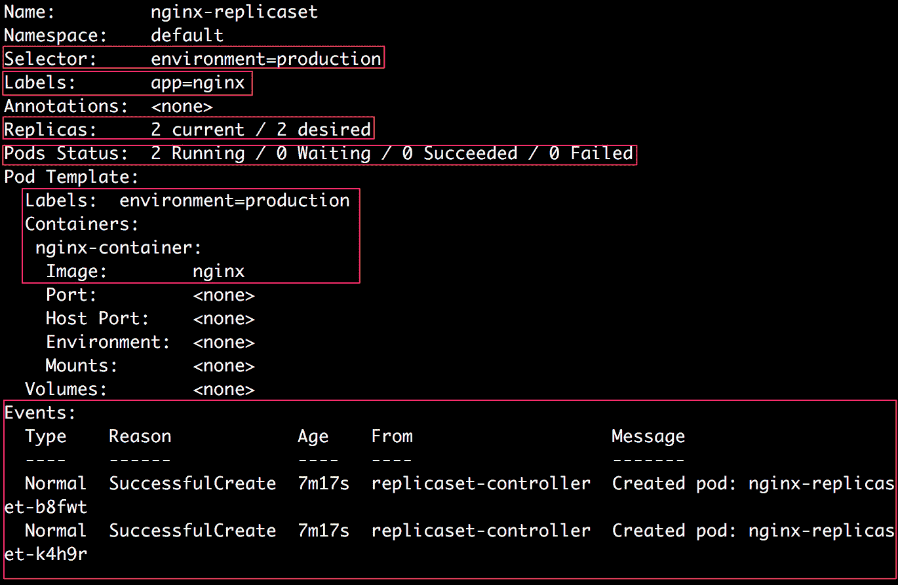

    图 7.1:描述 nginx-replicaset

6.  Next, we will inspect the Pods created by this ReplicaSet and verify that they have been created with the correct configuration. Run the following command to get a list of the Pods that are running:

    ```
    kubectl get pods
    ```

    您应该会看到如下响应:

    ```
    NAME                     READY    STATUS   RESTARTS   AGE
    nginx-replicaset-b8fwt   1/1      Running  0          38m
    nginx-replicaset-k4h9r   1/1      Running  0          38m
    ```

7.  Run the following command to describe one of the Pods by copying its name:

    ```
    kubectl describe pod <pod_name>
    ```

    您应该会看到类似如下的输出:

    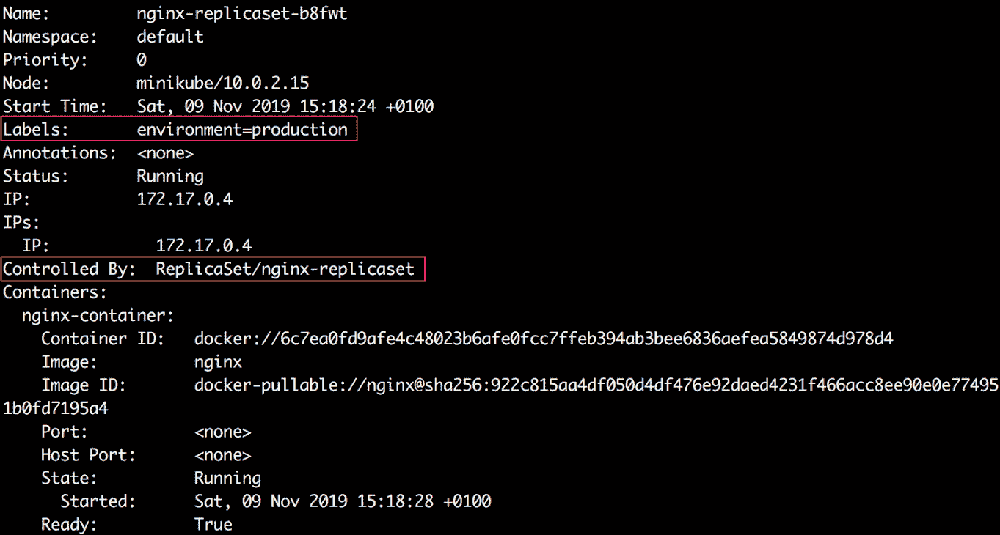

图 7.2:列表框

在前面输出的高亮部分，我们可以清楚地看到吊舱有`environment=production`标签，由`ReplicaSet/nginx-replicaset`控制。

因此，在本练习中，我们创建了一个简单的复制集。在下面的子主题中，我们将浏览前面输出中突出显示的部分，以了解正在运行的复制集。

### 复制集上的标签

从*图 7.1* 所示的输出中考虑以下一行:

```
Labels:       app=nginx
```

它显示，根据需要，复制集是用名为`app`的标签键创建的，值为`nginx`。

### 复制集的选择器

现在，从*图 7.1* 所示的输出中考虑以下行:

```
Selector:     environment=production
```

这表明复制集配置有`environment=production` Pod 选择器。这意味着该复制集将尝试获取具有该标签的 Pods。

### 复制品

从*图 7.1* 所示的输出中考虑以下一行:

```
Replicas:     2 current / 2 desired
```

我们可以看到副本集对 Pods 的期望计数为`2`，并且它还显示当前存在两个副本。

### 豆荚状态

虽然`Replicas`字段仅显示当前存在的吊舱数量，`Pods Status`显示这些吊舱的实际状态:

```
Pods Status:  2 Running / 0 Waiting / 0 Succeeded / 0 Failed
```

我们可以看到，目前在这个副本集下运行着两个 Pods。

### 豆荚模板

现在，让我们考虑输出的`Pod Template`部分，如图 7.1 所示。我们可以看到 Pod 模板与配置中描述的相同。

### 事件

在*图 7.1* 所示输出的最后一部分，我们可以看到有两个事件，这表示创建了两个荚，以达到复制集所需的两个荚的数量。

在上一个练习中，我们创建了一个复制集来维护许多正在运行的复制副本。现在，让我们考虑一个场景，其中一些节点或 Pods 由于某种原因出现故障。我们将看到在这种情况下副本集的行为。

## 练习 7.02:删除由副本集管理的豆荚

在本练习中，我们将删除一个由复制集管理的 Pods，看看它如何响应。这样，我们将模拟一个或多个 Pods 在副本集运行时出现故障:

注意

在本练习中，我们将假设您已经成功完成了前面的练习，因为我们将重用在该练习中创建的复制集。

1.  Verify that the Pods created by the ReplicaSet are still running:

    ```
    kubectl get pods
    ```

    您应该会看到类似以下的响应:

    ```
    NAME                     READY    STATUS   RESTARTS   AGE
    nginx-replicaset-9tgb9   1/1      Running  0          103s
    nginx-replicaset-zdjb5   1/1      Running  0          103s
    ```

2.  Delete the first Pod to replicate Pod failure during runtime by using the following command:

    ```
    kubectl delete pod <pod_name>
    ```

    您应该会看到类似以下内容的响应:

    ```
    pod "nginx-replicaset-9tgb9" deleted
    ```

3.  Describe the ReplicaSet and check the events:

    ```
    kubectl describe rs nginx-replicaset
    ```

    您应该会看到类似如下的输出:

    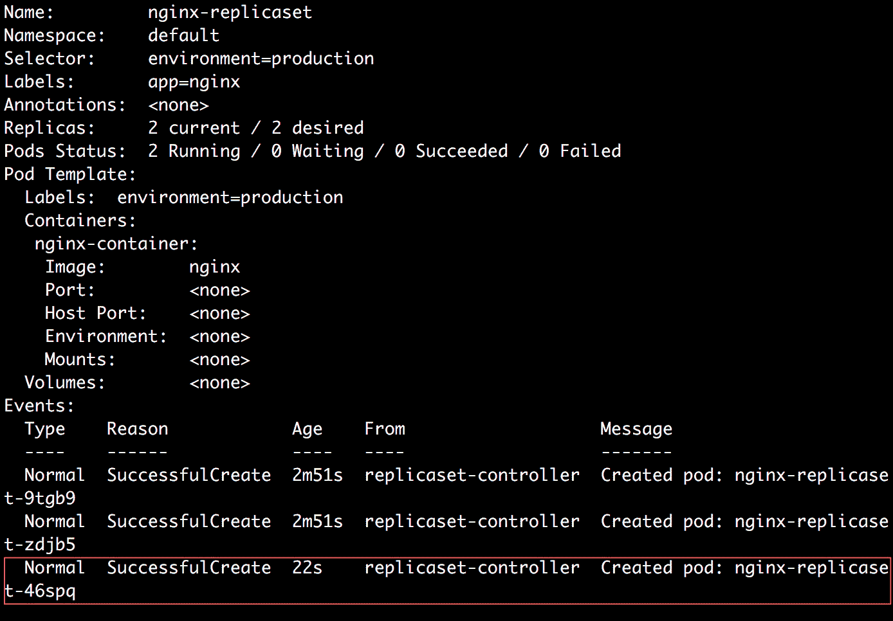

    图 7.3:描述复制集

    正如前面输出中突出显示的，我们可以看到，在删除了一个 Pod 之后，复制集使用复制集配置的`Template`部分中的 Pod 配置创建了一个新的 Pod。即使我们删除了复制集管理的所有 Pods，它们也会被重新创建。因此，为了永久删除所有的豆荚并避免豆荚的重新创建，我们需要删除复制集本身。

4.  Run the following command to delete the ReplicaSet:

    ```
    kubectl delete rs nginx-replicaset
    ```

    您应该会看到以下响应:

    ```
    replicaset.apps "nginx-replicaset" deleted
    ```

    如上图所示，删除了`nginx-replicaset`副本集。

5.  Run the following command to verify that the Pods managed by the ReplicaSet were also deleted:

    ```
    kubectl get pods
    ```

    您应该会得到以下响应:

    ```
    No resources found in default namespace
    ```

    从这个输出可以看出，我们可以验证 Pods 是否被删除了。

考虑一个场景，其中您已经部署了单个 Pod 进行测试。现在，它已经准备好上线了。您将所需的标签更改从开发应用到生产，现在您希望使用复制集来控制这一点。我们将在下面的练习中看到如何做到这一点。

## 练习 7.03:假设匹配的 Pod 已经存在，创建一个复制集

在本练习中，我们将创建一个与复制集中的 Pod 模板相匹配的 Pod，然后创建复制集。我们的目标是证明新创建的复制集将获得现有的 Pod，并开始管理它，就像它自己创建了该 Pod 一样。

为了成功完成本练习，请执行以下步骤:

1.  创建一个名为`pod-matching-replicaset.yaml`的文件，内容如下:

    ```
    apiVersion: v1
    kind: Pod
    metadata:
      name: pod-matching-replicaset
      labels:
        environment: production
    spec:
      containers:
      - name: first-container
        image: nginx
    ```

2.  Run the following command to create the Pod using the preceding configuration:

    ```
    kubectl create -f pod-matching-replicaset.yaml
    ```

    您应该会看到以下响应:

    ```
    pod/pod-matching-replicaset created
    ```

3.  创建一个名为`replicaset-nginx.yaml`的文件，内容如下:

    ```
    apiVersion: apps/v1
    kind: ReplicaSet
    metadata:
      name: nginx-replicaset
      labels:
        app: nginx
    spec:
      replicas: 2
      selector:
        matchLabels:
          environment: production
      template:
        metadata:
          labels:
            environment: production
        spec:
          containers:
          - name: nginx-container
            image: nginx
    ```

4.  Run the following command to create the ReplicaSet using the preceding configuration:

    ```
    kubectl create -f replicaset-nginx.yaml
    ```

    您应该会看到类似以下内容的响应:

    ```
    replicaset.apps/nginx-replicaset created
    ```

    该输出表明已经创建了 Pod。

5.  Run the following command to check the status of the ReplicaSet:

    ```
    kubectl get rs nginx-replicaset
    ```

    您应该会得到以下响应:

    ```
    NAME               DESIRED   CURRENT   READY   AGE
    nginx-replicaset   2         2         2       2
    ```

    我们可以看到，根据需要，目前有两个由复制集管理的 Pods。

6.  Next, let's check what Pods are running by using the following command:

    ```
    kubectl get pods
    ```

    您应该会看到类似如下的输出:

    ```
    NAME                     READY      STATUS    RESTARTS    AGE
    nginx-replicaset-4dr7s   1/1        Running   0           28s
    pod-matching-replicaset  1/1        Running   0           81s
    ```

    在这个输出中，我们可以看到手动创建的名为`pod-matching-replicaset`的 Pod 仍然在运行，并且只有一个由`nginx-replicaset`副本集创建的新 Pod。

7.  Next, we will use the `kubectl describe` command to check whether the Pod named `pod-matching-replicaset` is being managed by the ReplicaSet:

    ```
    kubectl describe pod pod-matching-replicaset
    ```

    您应该会看到类似如下的输出:

    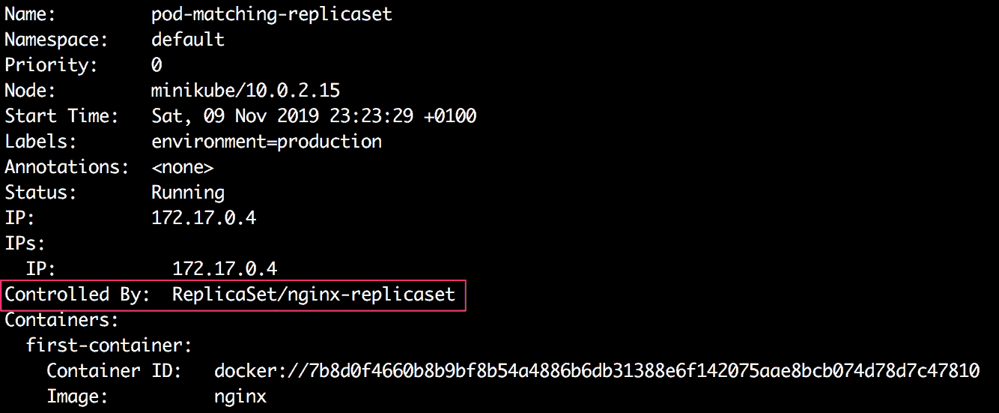

    图 7.4:描述吊舱

    在截断输出的突出显示部分，我们可以看到，尽管这个 Pod 是在 ReplicaSet 事件存在之前手动创建的，但是这个 Pod 现在是由 ReplicaSet 本身管理的。

8.  Next, we will describe the ReplicaSet to see how many Pod creations were triggered by it:

    ```
    kubectl describe rs nginx-replicaset
    ```

    您应该会看到类似如下的输出:

    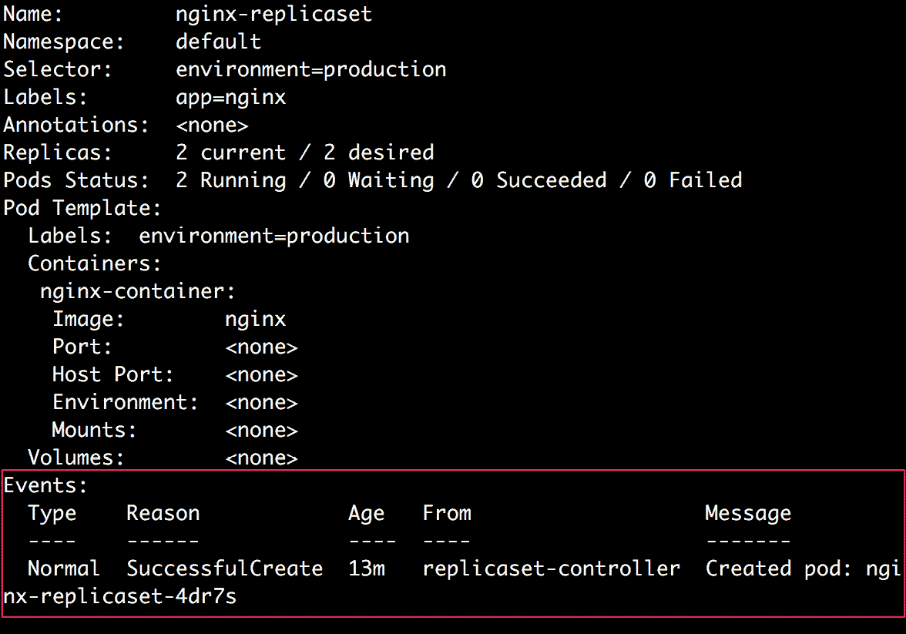

    图 7.5:描述复制集

9.  Run the following command to delete the ReplicaSet for cleanup:

    ```
    kubectl delete rs nginx-replicaset
    ```

    您应该会看到以下响应:

    ```
    replicaset.apps "nginx-replicaset" deleted
    ```

    因此，我们可以看到，复制集能够获取现有的 Pods，只要它们符合标签选择器标准。如果匹配的 Pods 多于所需数量，复制集将终止一些 Pods，以保持运行 Pods 的总数。

另一个常见的操作是水平缩放您之前创建的副本集。假设您创建了一个具有一定数量副本的副本集，之后您需要更多或更少的副本来管理增加或减少的需求。让我们看看如何在下一个练习中扩展副本的数量。

## 练习 7.04:创建副本集后缩放副本集

在本练习中，我们将创建一个包含两个副本的副本集，然后对其进行修改以增加副本的数量。然后，我们将减少副本的数量。

为了成功完成本练习，请执行以下步骤:

1.  创建一个名为`replicaset-nginx.yaml`的文件，内容如下:

    ```
    apiVersion: apps/v1
    kind: ReplicaSet
    metadata:
      name: nginx-replicaset
      labels:
        app: nginx
    spec:
     replicas: 2
      selector:
        matchLabels:
          environment: production
      template:
        metadata:
          labels:
            environment: production
        spec:
          containers:
          - name: nginx-container
            image: nginx
    ```

2.  Run the following command to create the ReplicaSet using the `kubectl apply` command, as described in the preceding code:

    ```
    kubectl apply -f replicaset-nginx.yaml
    ```

    您应该会得到以下响应:

    ```
    replicaset.apps/nginx-replicaset created
    ```

3.  Run the following command to check all the existing Pods:

    ```
    kubectl get pods
    ```

    您应该会得到类似以下内容的回复:

    ```
    NAME                     READY    STATUS    RESTARTS    AGE
    nginx-replicaset-99tj7   1/1      Running   0           23s
    nginx-replicaset-s4stt   1/1      Running   0           23s
    ```

    我们可以看到副本集创建了两个 Pods。

4.  Run the following command to scale up the number of replicas for the ReplicaSet to `4`:

    ```
    kubectl scale --replicas=4 rs nginx-replicaset
    ```

    您应该会看到以下响应:

    ```
    replicaset.apps/nginx-replicaset scaled
    ```

5.  Run the following command to check all the Pods that are running:

    ```
    kubectl get pods
    ```

    您应该会看到类似如下的输出:

    ```
    NAME                     READY    STATUS    RESTARTS    AGE
    nginx-replicaset-99tj7   1/1      Running   0           75s
    nginx-replicaset-klh6k   1/1      Running   0           21s
    nginx-replicaset-lrqsk   1/1      Running   0           21s
    nginx-replicaset-s4stt   1/1      Running   0           75s
    ```

    我们可以看到现在总共有四个 Pods。在我们应用新配置后，复制集创建了两个新的 Pods。

6.  Next, let's run the following command to scale down the number of replicas to `1`:

    ```
    kubectl scale --replicas=1 rs nginx-replicaset
    ```

    您应该会看到以下响应:

    ```
    replicaset.apps/nginx-replicaset scaled
    ```

7.  Run the following command to check all the Pods that are running:

    ```
    kubectl get pods
    ```

    您应该会看到类似以下内容的响应:

    ```
    nginx-replicaset-s4stt   1/1      Running   0           11m
    ```

    我们可以看到，这一次，副本集从`1`的期望计数中删除了所有超过计数的 Pods，只保留一个副本运行。

8.  Run the following command to delete the ReplicaSet for cleanup:

    ```
    kubectl delete rs nginx-replicaset
    ```

    您应该会看到以下响应:

    ```
    replicaset.apps "nginx-replicaset" deleted
    ```

在本练习中，我们成功地上下扩展了副本的数量。如果应用程序的流量因任何原因而增长或减少，这可能特别有用。

# 部署

部署是一个 Kubernetes 对象，它充当复制集的包装器，使其更容易使用。一般来说，为了管理复制的服务，建议您使用部署来管理复制集和由复制集创建的 Pods。

使用部署的主要动机是维护修订历史。每次对副本集或底层 Pods 进行更改时，部署都会记录副本集的新版本。这样，使用部署可以轻松回滚到以前的状态或版本。请记住，每次回滚也会为部署创建一个新版本。下图概述了管理容器化应用程序的不同对象的层次结构:

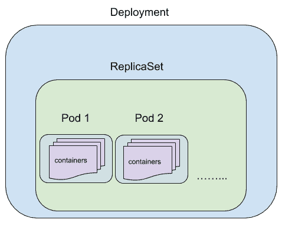

图 7.6:部署、复制集、容器和容器的层次结构

## 部署配置

部署的配置实际上非常类似于复制集的配置。下面是一个部署配置示例:

```
apiVersion: apps/v1
kind: Deployment
metadata:
  name: nginx-deployment
  labels:
    app: nginx
spec:
  replicas: 3
  strategy:
    type: RollingUpdate
    rollingUpdate:
      maxUnavailable: 1
      maxSurge: 1
  selector:
    matchLabels:
      app: nginx
      environment: production
  template:
    metadata:
      labels:
        app: nginx
        environment: production
    spec:
      containers:
      - name: nginx-container
        image: nginx
```

`kind`字段的值为`Deployment`。其余配置与复制集的配置相同。部署还有`replicas`、`selector`和 Pod `template`字段，使用方式与复制集相同。

### 策略

在`spec`下的`strategy`字段中，我们可以指定部署在用新的吊舱替换旧的吊舱时应该使用的策略。这可以是`RollingUpdate`也可以是`Recreate`。默认值为`RollingUpdate`。

滚动更新

这是一种用于在不停机的情况下更新部署的策略。通过`RollingUpdate`策略，控制器逐个更新 Pods。因此，在任何给定的时间，总会有一些 Pods 运行。当您想要更新 Pod 模板而不导致应用程序停机时，这种策略特别有用。但是，请注意，滚动更新意味着可能有两个不同版本的 Pods(旧的和新的)同时运行。

如果应用程序提供静态信息，这通常没问题，因为使用两个不同版本的应用程序提供流量通常没有坏处，只要提供的信息是相同的。所以，`RollingUpdate`通常是这些应用的好策略。一般来说，对于新版本存储的数据可以由旧版本的应用程序读取和处理的应用程序，我们可以使用`RollingUpdate`。

以下是将策略设置为`RollingUpdate`的配置示例:

```
strategy:
  type: RollingUpdate
  rollingUpdate:
    maxUnavailable: 1
    maxSurge: 1
```

`maxUnavailable`是更新期间不可用的最大 Pods 数。此字段可以指定为代表不可用 Pods 最大数量的整数，也可以指定为代表不可用副本总数百分比的字符串。对于前面的示例配置，Kubernetes 将确保在应用更新时不会有多个副本变得不可用。`maxUnavailable`的默认值为`25%`。

`maxSurge`是可以计划/创建的最大 Pods 数量，高于期望的 Pods 数量(如`replicas`字段中所指定的)。该字段也可以指定为整数或百分比字符串，如`maxUnavailable`。`maxSurge`的默认值也是`25%`。

因此，在前面的例子中，我们告诉 Kubernetes 控制器一次更新一个 Pod，这样就不会有超过一个 Pod 不可用，也不会有超过四个 Pod 被调度。

这两个参数——`maxUnavailable`和`maxSurge`——可以针对可用性和扩展或缩减部署的速度进行调整。例如，`maxUnavailable: 0`和`maxSurge: "30%"`确保快速扩展，同时始终保持所需的容量。`maxUnavailable: "15%"`和`maxSurge: 0`确保部署可以在不使用任何额外容量的情况下进行，代价是运行的 Pods 最少减少 15%。

**重现**

在这个策略中，在用更新的配置创建新的吊舱之前，所有现有的吊舱都被杀死。这意味着在更新期间会有一些停机时间。但是，这可以确保部署中运行的所有 Pods 都在同一个版本上(旧版本或新版本)。当使用需要共享状态的应用程序 Pods 时，这种策略特别有用，这样我们就不能同时运行两个不同版本的 Pods。该策略可以指定如下:

```
strategy:
  type: Recreate
```

使用`Recreate`更新策略的一个很好的用例是，在使用新代码之前，我们是否需要运行一些数据迁移或数据处理。在这种情况下，我们将需要使用`Recreate`策略，因为如果不首先为所有 Pods 运行迁移或处理，我们将无法承受任何新代码与旧代码一起运行。

现在我们已经研究了部署配置中的不同字段，让我们在下面的练习中实现它们。

## 练习 7.05:使用 Nginx 容器创建简单部署

在本练习中，我们将使用上一节中描述的配置创建第一个部署窗格。

要成功完成本练习，请执行以下步骤:

1.  Create a file called `nginx-deployment.yaml` with the following content:

    ```
    apiVersion: apps/v1
    kind: Deployment
    metadata:
      name: nginx-deployment
      labels:
        app: nginx
    spec:
      replicas: 3
      selector:
        matchLabels:
          app: nginx
          environment: production
      template:
        metadata:
          labels:
            app: nginx
            environment: production
        spec:
          containers:
          - name: nginx-container
            image: nginx
    ```

    在这个配置中，我们可以看到部署将有三个运行带有`app: nginx`和`environment: production`标签的 Pods 副本。

2.  Run the following command to create the Deployment defined in the previous step:

    ```
    kubectl apply -f nginx-deployment.yaml
    ```

    您应该会看到以下响应:

    ```
    deployment.apps/nginx-deployment created
    ```

3.  Run the following command to check the status of the Deployment:

    ```
    kubectl get deployment nginx-deployment
    ```

    您应该会看到类似以下内容的响应:

    ```
    NAME              READY    UP-TO-DATE    AVAILABLE   AGE
    nginx-deployment  3/3      3             3           26m
    ```

4.  Run the following command to check all the Pods that are running:

    ```
    kubectl get pods
    ```

    您应该会看到类似以下内容的响应:

    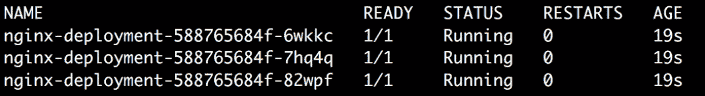

    图 7.7:部署创建的 Pods 列表

    我们可以看到，部署已经根据需要创建了三个 Pods。

    让我们试着自动理解给 Pods 起的名字。`nginx-deployment`创建名为`nginx-deployment-588765684f`的复制集。然后，复制集创建了 Pods 的三个副本，每个副本都有一个名称，该名称以复制集的名称为前缀，后跟唯一的标识符。

5.  Now that we have created our first Deployment, let's look at it in more detail to understand what actually happened during its creation. To do that, we can describe the Deployment we just created using the following command in the terminal:

    ```
    kubectl describe rs nginx-deployment
    ```

    您应该会看到类似如下的输出:

    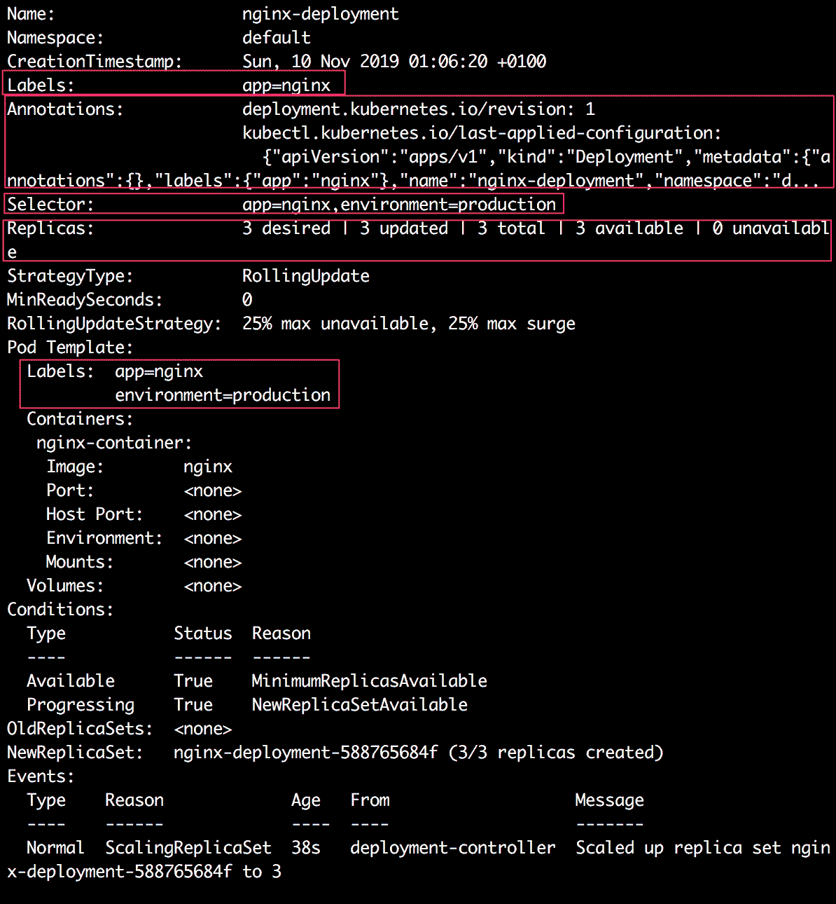

图 7.8:描述 nginx 部署

该输出显示了关于我们刚刚创建的部署的各种细节。在下面的子主题中，我们将浏览前面输出中突出显示的部分，以了解正在运行的部署。

### 部署上的标签和注释

类似于 ReplicaSets，我们可以在*图 7.8* 所示的输出中看到如下高亮显示的一行:

```
Labels:    app=nginx
```

这表明部署是使用`app=nginx`标签创建的。现在，让我们考虑输出中的下一个字段:

```
Annotations:    deployment.kubernetes.io/revision: 1
                kubectl.kubernetes.io/last-applied-configuration:
{"apiVersion":"apps/v1","kind":"Deployment","metadata":{"annotations":{},"labels":{"app":"nginx"},"name":"nginx-deployment","namespace":"d...
```

有两个注释会自动添加到部署中。

**修订注释**

Kubernetes 控制器添加了一个带有`deployment.kubernetes.io/revision`键的注释，其中包含特定部署的修订信息。

**上次应用的配置注释**

控制器添加的另一个注释有`kubectl.kubernetes.io/last-applied-configuration`键，它包含应用于部署的最后一个配置(JSON 格式)。如果新版本运行不佳，此注释在将部署回滚到以前的版本时特别有用。

### 部署选择器

现在，从*图 7.8* 所示的输出中考虑以下行:

```
Selector:    app=nginx,environment=production
```

这显示了部署配置了哪些 Pod 选择器。因此，本次部署将尝试获得具有这两个标签的 Pods。

### 复制品

从*图 7.8* 所示的输出中考虑以下一行:

```
Replicas:    3 desired | 3 updated | 3 total | 3 available | 0 unavailable
```

我们可以看到，部署为 Pods 提供了期望的`3`计数，并且它还显示当前存在`3`副本。

## 回滚部署

在现实场景中，您可能会在更改部署配置时出错。您可以轻松撤消更改并回滚到部署的以前稳定版本。

我们可以使用`kubectl rollout`命令来检查修订历史和回滚。但是要做到这一点，我们还需要在使用任何`apply`或`set`命令修改部署时使用`--record`标志。该标志记录了推出历史。然后，您可以使用以下命令查看卷展栏历史:

```
kubectl rollout history deployment <deployment_name>
```

然后，我们可以使用以下命令撤消任何更新:

```
kubectl rollout undo deployment <deployment_name>
```

让我们在下面的练习中仔细看看这是如何工作的:

## 练习 7.06:回滚部署

在本练习中，我们将更新部署两次。我们将在第二次更新中故意出错，并尝试回滚到以前的版本:

1.  创建一个名为`app-deployment.yaml`的文件，内容如下:

    ```
    apiVersion: apps/v1
    kind: Deployment
    metadata:
      name: app-deployment
      labels:
        environment: production
    spec:
      replicas: 3
      selector:
        matchLabels:
          app: nginx
          environment: production
      template:
        metadata:
          labels:
            app: nginx
            environment: production
        spec:
          containers:
          - name: nginx-container
            image: nginx
    ```

2.  Run the following command to create the Deployment:

    ```
    kubectl apply -f app-deployment.yaml
    ```

    您应该会看到以下响应:

    ```
    deployment.apps/app-deployment created
    ```

3.  Run the following command to check the rollout history of the newly created Deployment:

    ```
    kubectl rollout history deployment app-deployment
    ```

    您应该会看到以下响应:

    ```
    deployment.apps/app-deployment
    REVISION     CHANGE-CAUSE
    1            <none>
    ```

    该输出显示，部署到目前为止还没有部署历史。

4.  For the first update, let's change the name of the container to `nginx` instead of `nginx-container`. Update the content of the `app-deployment.yaml` file with the following:

    ```
    apiVersion: apps/v1
    kind: Deployment
    metadata:
      name: app-deployment
      labels:
        environment: production
    spec:
      replicas: 3
      selector:
        matchLabels:
          app: nginx
          environment: production
      template:
        metadata:
          labels:
            app: nginx
            environment: production
        spec:
          containers:
     - name: nginx
            image: nginx
    ```

    如您所见，这个模板中唯一改变的是容器名称。

5.  Apply the changed configuration using the `kubectl apply` command with the `--record` flag. The `--record` flag ensures that the update to the Deployment is recorded in the rollout history of the Deployment:

    ```
    kubectl apply -f app-deployment.yaml --record
    ```

    您应该会看到以下响应:

    ```
    deployment.apps/app-deployment configured
    ```

    请注意，`--record`标志维护的部署历史不同于注释中存储的过去配置，我们在子部分的*标签和注释中看到了这一点。*

6.  Wait for a few seconds to allow the Deployment to recreate the Pods with the updated Pod configuration, and then run the following command to check the rollout history of the Deployment:

    ```
    kubectl rollout history deployment app-deployment
    ```

    您应该会看到以下响应:

    

    图 7.9:检查部署历史

    在输出中，我们可以看到部署的第二个版本已经创建。它还跟踪使用了什么命令来更新部署。

7.  Next, let's update the Deployment and assume that we made a mistake while doing so. In this example, we will update the container image to `ngnx` (note the intentional spelling error) instead of `nginx` using the `set image` command:

    ```
    kubectl set image deployment app-deployment nginx=ngnx --record
    ```

    您应该会看到以下响应:

    ```
    deployment.apps/app-deployment image updated
    ```

8.  Wait for a few seconds for Kubernetes to recreate the new containers, and then check the status of the Deployment rollout using the `kubectl rollout status` command:

    ```
    kubectl rollout status deployment app-deployment
    ```

    您应该会看到以下响应:

    ```
    Waiting for deployment "app-deployment" rollout to finish: 1 out of 3 new replicas have been updated...
    ```

    在这个输出中，我们可以看到还没有新的副本准备好。按 *Ctrl* + *C* 退出并继续。

9.  Run the following command to check the state of the Pods:

    ```
    kubectl get pods
    ```

    您应该会看到以下输出:

    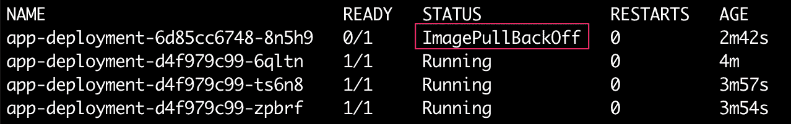

    图 7.10:检查吊舱的状态

    我们可以在输出中看到，新创建的 Pod 失败了，出现了`ImagePullBackOff`错误，这意味着 Pod 无法拉出图像。这是意料之中的，因为我们在图像的名称中有一个错别字。

10.  Next, check the revision history of the Deployment again by using the following command:

    ```
    kubectl rollout history deployment app-deployment
    ```

    您应该会看到以下响应:

    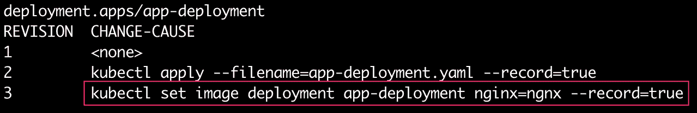

    图 7.11:检查部署的部署历史

    我们可以看到部署的第三个版本是使用包含错别字的`set image`命令创建的。现在，我们假装在更新部署时犯了一个错误，我们将看到如何撤销这个错误并回滚到部署的最后一个稳定版本。

11.  Run the following command to roll back to the previous revision:

    ```
    kubectl rollout undo deployment app-deployment
    ```

    您应该会看到以下响应:

    ```
    deployment.apps/app-deployment rolled back
    ```

    正如我们在这个输出中看到的，部署没有回滚到以前的版本。为了练习，我们可能希望回滚到不同于以前版本的版本。我们可以使用`--to-revision`标志来指定要回滚到的修订号。例如，在前面的例子中，我们可以使用下面的命令，结果将完全相同:

    ```
    kubectl rollout undo deployment app-deployment --to-revision=2
    ```

12.  Run the following command to check the rollout history of the Deployment again:

    ```
    kubectl rollout history deployment app-deployment
    ```

    您应该会看到以下输出:

    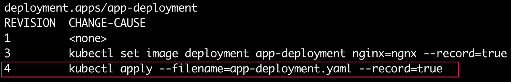

图 7.12:回滚后部署的部署历史

在这个输出中，我们可以看到创建了一个新的修订版，它应用了之前的修订版 2。我们可以看到修订版 2 不再出现在修订版列表中。这是因为推广总是以向前滚动的方式进行的。这意味着每当我们更新一个版本时，就会创建一个更高版本号的新版本。同样，在回滚到修订版 2 的情况下，修订版 2 变成了修订版 4。

在本练习中，我们探索了许多与更新部署相关的不同操作，包括向前滚动一些更改、跟踪部署的历史记录、撤消一些更改以及回滚到以前的版本。

# 状态集

StatefulSets 用于管理有状态副本。与部署类似，状态集从相同的 Pod 模板创建和管理指定数量的 Pod 副本。但是，状态集与部署的不同之处在于，它们为每个 Pods 维护唯一的标识。因此，即使所有的吊舱规格相同，它们也是不可互换的。每个 Pod 都有一个粘性标识，应用程序代码可以使用它来管理特定 Pod 上应用程序的状态。对于具有 *n 个*副本的状态集，每个 Pod 都被分配一个介于 *0* 和*n–1*之间的唯一整数序数。Pods 的名称反映了分配给它们的整数标识。创建状态集时，所有 Pods 都是按照整数序数的顺序创建的。

即使 Pod 重新启动，由 StatefulSet 管理的每个 Pod 都将保持其粘性标识(整数序数)。例如，如果某个特定的 Pod 崩溃或被删除，将创建一个新的 Pod，并为其分配与旧 Pod 相同的粘性标识。

## 状态集配置

StatefulSet 的配置也非常类似于 ReplicaSet 的配置。下面是 StatefulSet 配置的一个示例:

```
apiVersion: apps/v1
kind: StatefulSet
metadata:
  name: example-statefulset
spec:
  replicas: 3
  selector:
    matchLabels:
      environment: production
  template:
    metadata:
      labels:
        environment: production
    spec:
      containers:
      - name: name-container
        image: image_name
```

正如我们在前面的配置中所看到的，状态集的`apiVersion`是`apps/v1`，而`kind`是`StatefulSet`。其余字段的使用方式与复制集相同。

注意

您将在*第 14 章*、*在 Kubernetes* 中学习如何在多节点集群上实现状态集。

### 状态集合的用例

*   如果需要持久存储，状态集非常有用。使用状态集，您可以对数据进行分区，并将其存储在不同的 Pods 中。在这种情况下，一个 Pod 也有可能关闭，而一个新的 Pod 会获得相同的标识，并拥有旧 Pod 先前存储的相同数据分区。
*   如果您需要有序更新或扩展，也可以使用状态集。例如，如果您想按照分配给 Pods 的身份顺序创建或更新 Pods，使用 StatefulSet 是一个好主意。

# daemmonsets

DaemonSets 用于管理集群中所有节点或选定节点集上特定 Pod 的创建。如果我们配置一个 DaemonSet 在所有节点上创建 pods，那么如果新节点被添加到集群中，将创建新的 Pods 在这些新节点上运行。同样，如果从集群中删除一些节点，在这些节点上运行的 Pods 将被销毁。

## 数据集的用例

*   日志记录:DaemonSet 最常见的用例之一是管理在所有节点上运行日志收集 Pod。这些 Pods 可用于从所有节点收集日志，然后在日志处理管道中处理它们。
*   本地数据缓存:DaemonSet 也可以用来管理所有节点上的缓存 Pods。其他应用程序 Pods 可以使用这些 Pods 来临时存储缓存的数据。
*   监控:DaemonSet 的另一个用例是管理所有节点上运行的监控 Pods。这可用于收集在特定节点上运行的 Pods 的系统级或应用程序级指标。

## daemmonset 配置

DaemonSet 的配置也非常类似于复制集或部署的配置。下面是 DaemonSet 配置的一个示例:

```
apiVersion: apps/v1
kind: DaemonSet
metadata:
  name: daemonset-example
  labels:
    app: daemonset-example
spec:
  selector:
    matchLabels:
      app: daemonset-example
  template:
    metadata:
      labels:
        app: daemonset-example
    spec:
      containers:
      - name: busybox-container
        image: busybox
        args:
        - /bin/sh
        - -c
        - sleep 10000
```

正如我们在前面的配置中看到的，DaemonSet 的`apiVersion`被设置为`apps/v1`，`kind`被设置为`DaemonSet`。其余字段的使用方式与复制集相同。

为了限制本书的范围，我们将不讨论实现 DaemonSets 的细节。

到目前为止，在本章中，您已经了解了复制集，它帮助我们管理运行应用程序的 Pods 的几个副本，以及部署如何充当复制集的包装器，以添加一些功能来控制更新的推出和更新历史的维护，如果需要，还可以选择回滚。然后，我们了解了 StatefulSets，如果我们需要将每个副本视为一个唯一的实体，那么 StatefulSets 非常方便。我们还学习了 DaemonSets 如何允许我们在每个节点上安排一个 Pod。

所有这些控制器都有一个共同的特点——它们对于需要连续运行的应用程序或工作负载非常有用。然而，一些工作负载有一个优雅的结论，没有必要在任务完成后保持 Pods 运行。为此，Kubernetes 有一个名为 Job 的控制器。让我们在下一节中看看这个。

# 工作

Job 是 Kubernetes 中的主管，可以用来管理 Pods，Pods 应该运行一个确定的任务，然后优雅地终止。作业会创建指定数量的 Pods，并确保它们成功完成工作负载或任务。创建作业时，它会创建并跟踪在其配置中指定的 Pods。当指定数量的 Pods 成功完成时，作业被视为完成。如果一个 Pod 由于底层节点故障而失败，作业将创建一个新的 Pod 来替换它。这也意味着在 Pod 上运行的应用程序或代码应该能够优雅地处理在流程运行时出现新 Pod 的情况。

作业完成后，不会删除作业创建的 Pods。吊舱运行至完成，并以`Completed`状态停留在集群中。

作业可以有几种不同的使用方式:

*   最简单的用例是创建一个只运行一个 Pod 直到完成的作业。如果运行的 pod 失败，作业将仅创建额外的新 pod。例如，作业可以用于一次性或重复性的数据分析工作，或者用于机器学习模型的训练。
*   作业也可以用于并行处理。我们可以指定多个成功完成的 Pod，以确保只有当一定数量的 Pod 成功终止时，作业才会完成。

## 作业配置

作业的配置遵循与复制集或部署相似的模式。以下是作业配置的示例:

```
apiVersion: batch/v1
kind: Job
metadata:
  name: one-time-job
spec:
  template:
    spec:
      containers:
      - name: busybox-container
        image: busybox
        args:
        - /bin/sh
        - -c
        - date
      restartPolicy: OnFailure
```

作业对象的`apiVersion`字段设置为`batch/v1`。`batch`应用编程接口组包含与批处理作业相关的对象。`kind`字段设置为`Job`。

### 机器学习中作业的用例

作业非常适合批处理，即在退出前运行一定时间的进程。这使得乔布斯非常适合许多类型的生产机器学习任务，如特征工程、交叉验证、模型训练和批量推理。例如，您可以创建一个 Kubernetes 作业来训练机器学习模型，并将模型和训练元数据保存到外部存储中。然后，您可以创建另一个作业来执行批处理推理。该作业将创建一个 Pod，从存储中获取预先训练好的模型，将模型和数据加载到内存中，执行推理，并存储预测。

## 练习 7.07:创建一个在有限时间内完成的简单作业

在本练习中，我们将创建第一个作业，该作业将运行一个容器，该容器只需等待 10 秒钟就可以完成。

要成功完成本练习，请执行以下步骤:

1.  创建一个名为`one-time-job.yaml`的文件，内容如下:

    ```
    apiVersion: batch/v1
    kind: Job
    metadata:
      name: one-time-job
    spec:
      template:
        spec:
          containers:
          - name: busybox-container
            image: busybox
            args:
            - /bin/sh
            - -c
            - date; sleep 20; echo "Bye"
          restartPolicy: OnFailure
    ```

2.  Run the following command to create the Deployment using the `kubectl apply` command:

    ```
    kubectl apply -f one-time-job.yaml
    ```

    您应该会看到以下响应:

    ```
    job.batch/one-time-job created
    ```

3.  Run the following command to check the status of the Job:

    ```
    kubectl get jobs
    ```

    您应该会看到类似这样的响应:

    ```
    NAME           COMPLETIONS    DURATION    AGE
    one-time-job   0/1            3s          3s
    ```

    我们可以看到这项工作需要完成一次，但尚未完成。

4.  Run the following command to check the Pod running the Job:

    ```
    kubectl get pods
    ```

    请注意，您应该在作业完成之前运行此命令，以查看此处显示的响应:

    ```
    NAME                READY    STATUS    RESTARTS    AGE
    one-time-job-bzz8l  1/1      Running   0           7s
    ```

    我们可以看到作业已经创建了一个名为`one-time-job-bzz8l`的 Pod 来运行作业模板中指定的任务。

5.  Next, run the following command to check the logs for the Pod created by the Job:

    ```
    kubectl logs -f <pod_name>
    ```

    您应该会看到类似以下内容的日志:

    ```
    Sun   Nov 10 15:20:19 UTC 2019
    Bye
    ```

    我们可以看到 Pod 打印了日期，等待了 20 秒，然后在终端打印`Bye`。

6.  Let's check the status of the Job again by using the following command:

    ```
    kubectl get job one-time-job
    ```

    您应该会看到类似这样的响应:

    ```
    NAME           COMPLETIONS     DURATION    AGE
    one-time-job   1/1             24s         14m
    ```

    我们可以看到这项工作现在已经完成了。

7.  Run the following command to verify that the Pod has run to completion:

    ```
    kubectl get pods
    ```

    您应该会看到类似这样的响应:

    ```
    NAME                 READY    STATUS     RESTARTS    AGE
    one-time-job-whw79   0/1      Completed  0           32m
    ```

    我们可以看到豆荚有`Completed`状态。

8.  Run the following command to delete the job (as well as the Pod it created) for cleanup:

    ```
    kubectl delete job one-time-job
    ```

    您应该会看到以下响应:

    ```
    job.batch "one-time-job" deleted
    ```

在本练习中，我们创建了一个一次性作业，并验证了该作业创建的 Pod 一直运行到完成。为并行任务实现 Jobs 有点复杂，为了简洁起见，我们将把它排除在本研讨会之外。

接下来，让我们用一个活动来结束这一章，在这个活动中，我们将创建一个部署，并将这一章中学到的几个想法集合在一起。

## 活动 7.01:创建运行应用程序的部署

考虑这样一个场景，您正在合作的产品/应用程序团队现在已经准备好将他们的应用程序投入生产，他们需要您的帮助来以复制和可靠的方式部署它。对于本练习的范围，请考虑应用程序的以下要求:

*   默认副本数量应为 6。
*   为了简单起见，您可以将`nginx`图像用于在 Pod 中运行的容器。
*   确保所有的 Pods 都有以下两个标签和相应的值:

    ```
    chapter=controllers
    activity=1
    ```

*   部署的更新策略应该是`RollingUpdate`。在最坏的情况下，不超过一半的吊舱可以关闭，同样，在任何时候都不应该有超过 150%的期望的吊舱数量。

创建部署后，您应该能够执行以下任务:

*   将副本数量扩大到 10 个。
*   Scale down the number of replicas to 5.

    注意

    理想情况下，您可能希望将此部署创建在不同的名称空间中，以使其与您在前面的练习中创建的其他内容分开。因此，请随意创建一个名称空间，并在该名称空间中创建部署。

以下是执行本活动的高级步骤:

1.  为此活动创建命名空间。
2.  编写部署配置。确保它符合所有规定的要求。
3.  使用上一步的配置创建部署。
4.  验证部署创建了六个吊舱。
5.  执行前面提到的两个任务，并在执行每个步骤后验证 Pods 的数量。

您应该能够获取 Pods 列表，以检查是否可以扩大 Pods 的数量，如下图所示:


图 7.13:检查 Pods 的数量是否增加

同样，您还应该能够缩减和检查 Pods 的数量，如下所示:

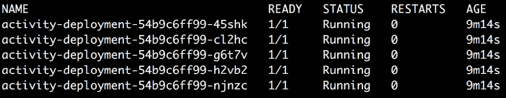

图 7.14:检查 Pods 的数量是否减少

注意

该活动的解决方案可在以下地址找到:[https://packt.live/304PEoD](https://packt.live/304PEoD)。

# 总结

Kubernetes 将 Pod 视为短暂的实体，理想情况下，您不会在单个 Pod 中部署任何应用程序或微服务。Kubernetes 提供了各种控制器来利用各种优势，包括自动复制、运行状况监控和自动扩展。

在本章中，我们介绍了不同种类的控制器，并了解了何时使用它们。我们创建了复制集，并观察了它们如何管理 Pods。我们学习了何时使用 DaemonSets 和 StatefulSets。我们还创建了一个部署，并了解了如何增加和减少副本数量，以及如何回滚到早期版本的部署。最后，我们学习了如何为一次性任务创建作业。当您想要部署生产就绪的应用程序或工作负载时，所有这些控制器都会发挥作用，您将在后面的章节中看到这一点。

在下一章中，我们将了解如何发现和访问由部署或复制集管理的 Pods 或复制集。