# 八、服务发现

概观

在本章中，我们将了解如何在我们在前几章中创建的各种对象之间路由流量，并使它们可以在集群内外被发现。本章还介绍了 Kubernetes 服务的概念，并解释了如何使用它们来公开使用部署等控制器部署的应用。到本章结束时，您将能够让外部世界访问您的应用。您还将了解不同类型的服务，并能够使用它们使不同组的POD相互作用。

# 简介

在过去的几章中，我们学习了 Pods 和 Deployments，它们帮助我们运行容器化的应用。现在我们已经准备好部署我们的应用，在本章中，我们将看一下一些帮助我们进行网络设置的应用编程接口对象，以确保我们的用户可以访问我们的应用，并且我们的应用的不同组件以及不同的应用可以一起工作。

正如我们在前面几章中看到的，每个 Kubernetes Pod 都有自己的 IP 地址。然而，建立网络和连接一切并不像在 Pod IP 地址中编码那么简单。我们不能依靠单一的 Pod 来可靠地运行我们的应用。因此，我们使用部署来确保在任何给定的时刻，我们将有固定数量的特定种类的 Pods 在集群中运行。然而，这意味着在我们的应用运行期间，我们可以容忍一定数量的 pods 失败，因为会自动创建新的 Pods 来替换它们。因此，这些 Pods 的 IP 地址不会保持不变。例如，如果我们有一组运行前端应用的 Pods 需要与另一组运行后端应用的 Pods 在我们的集群内进行对话，我们需要找到一种方法来使 Pods 可被发现。

为了解决这个问题，我们使用 Kubernetes 服务。服务允许我们使一组逻辑单元(例如，由一个部署管理的所有单元)可被运行在同一集群内部或外部世界的其他单元发现和访问。

# 服务

服务定义策略，通过这些策略可以访问一组逻辑单元。Kubernetes 服务支持我们应用的不同组件之间以及不同应用之间的通信。服务帮助我们将应用与其他应用或用户连接起来。例如，假设我们有一组运行应用前端的 Pods，一组运行后端的 Pods，以及另一组连接数据源的 Pods。前端是用户需要直接交互的部分。然后，前端需要连接到后端，而后端又需要与外部数据源通信。

假设您正在制作一个调查应用，该应用还允许用户根据他们的调查结果进行可视化。稍微简化一下，我们可以想象三个部署——一个运行表单前端来收集数据，另一个验证并存储数据，第三个运行数据可视化应用。下图应该有助于您直观地了解服务在路由流量和公开不同组件方面的情况:

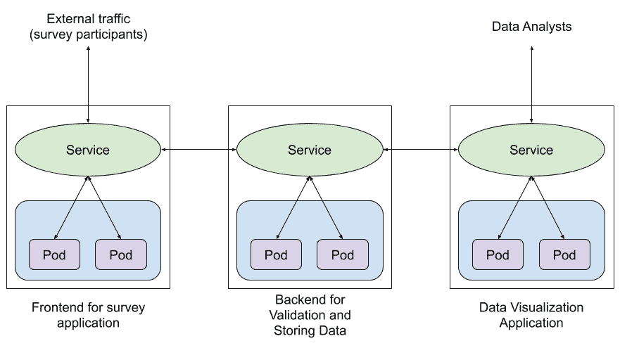

图 8.1:使用服务将流量路由到集群中和集群内

因此，服务的抽象有助于保持应用不同部分的分离，并支持它们之间的通信。在旧式(非 Kubernetes)环境中，您可能期望不同的组件通过运行不同资源的不同虚拟机或裸机的 IP 地址链接在一起。在使用 Kubernetes 时，将不同资源链接在一起的主要方式是使用标签和标签选择器，这允许部署轻松替换失败的 Pods 或根据需要扩展部署数量。因此，您可以将服务视为 IP 地址和基于标签选择器的链接不同资源的机制之间的转换层。因此，您只需要指向一个服务，它就会负责将流量路由到适当的应用，而不管有多少复制 Pods 与该应用相关联，或者这些 Pods 运行在哪些节点上。

## 服务配置

类似于 Pods、ReplicaSets 和 Deployments 的配置，服务的配置还包含四个高级字段；即`apiVersion`、`kind`、`metadata`和`spec`。

下面是一个服务清单示例:

```
apiVersion: v1
kind: Service
metadata:
  name: sample-service
spec:
  ports:
    - port: 80
      targetPort: 80
  selector:
      key: value
```

对于一项服务来说，`apiVersion`是`v1`，`kind`永远是`Service`。在`metadata`字段，我们将指定服务的名称。除了名字，我们还可以在`metadata`字段中添加`labels`和`annotations`。

`spec`字段的内容取决于我们要创建的服务类型。在下一节中，我们将浏览不同类型的服务，并了解`spec`字段中与配置相关的各个部分。

## 服务类型

有四种不同类型的服务:

*   **节点端口**:这种类型的服务使内部 Pod 可以在运行 Pod 的节点上的端口上访问。
*   **集群 IP** :这种类型的服务在集群内部的某个 IP 上公开服务。这是服务的默认类型。
*   **负载平衡器**:这种类型的服务使用云提供商提供的负载平衡器对外公开应用。
*   **外部名称**:这种类型的服务指向一个域名系统，而不是一组域名系统。其他类型的服务使用标签选择器来选择要公开的 Pods。这是一种特殊类型的服务，默认情况下不使用任何选择器。

我们将在以下几节中详细了解所有这些服务。

## 节点端口服务

节点端口服务在集群中所有节点的同一个端口上公开应用。Pods 可能跨集群中的所有或部分节点运行。

在群集中只有一个节点的简化情况下，服务会公开服务中配置的端口上的所有选定 Pods。但是，在一个更实际的情况下，Pods 可能在多个节点上运行，服务跨越所有节点，并在所有节点的特定端口上公开 Pods。这样，可以使用以下 IP/端口组合从 Kubernetes 集群外部访问应用:`<NodeIP>:<NodePort>`。

示例服务的`config`文件如下所示:

```
apiVersion: v1
kind: Service
metadata:
  name: nginx-service
spec:
 type: NodePort
 ports:
 - targetPort: 80
 port: 80
nodePort: 32023
  selector:
      app: nginx
      environment: production
```

如我们所见，一个`NodePort`服务的定义涉及三个端口。让我们看看这些:

*   `targetPort`:该字段表示 Pods 上运行的应用暴露的端口。这是服务将请求转发到的端口。默认情况下，`targetPort`被设置为与`port`字段相同的值。
*   `port`:该字段代表服务本身的端口。
*   `nodePort`:这个字段代表节点上的端口，我们可以用它来访问服务本身。

除了端口，在服务`spec`部分还有另一个名为`selector`的字段。此部分用于指定 Pod 需要具有的标签，以便由服务选择。一旦该服务被创建，它将识别所有具有`app: nginx`和`environment: production`标签的 Pods，并为所有这样的 Pods 添加端点。在下面的练习中，我们将更详细地了解端点。

## 练习 8.01:使用 Nginx 容器创建简单的节点端口服务

在本练习中，我们将使用 Nginx 容器创建一个简单的节点端口服务。默认情况下，Nginx 容器在 Pod 上公开端口`80`，并带有一个 HTML 页面，上面写着`Welcome to nginx!`。我们将确保可以从本地机器上的浏览器访问该页面。

要成功完成本练习，请执行以下步骤:

1.  创建一个名为`nginx-deployment.yaml`的文件，内容如下:

    ```
    apiVersion: apps/v1
    kind: Deployment
    metadata:
      name: nginx-deployment
      labels:
        app: nginx
    spec:
      replicas: 3
      strategy:
        type: Recreate
      selector:
        matchLabels:
          app: nginx
          environment: production
      template:
        metadata:
          labels:
            app: nginx
            environment: production
        spec:
          containers:
          - name: nginx-container
            image: nginx
    ```

2.  Run the following command to create the Deployment using the `kubectl apply` command:

    ```
    kubectl apply -f nginx-deployment.yaml
    ```

    您应该会得到以下输出:

    ```
    deployment.apps/nginx-deployment created
    ```

    我们可以看到，`nginx-deployment`已经被创造出来了。

3.  Run the following command to verify that the Deployment has created three replicas:

    ```
    kubectl get pods
    ```

    您应该会看到类似以下内容的响应:

    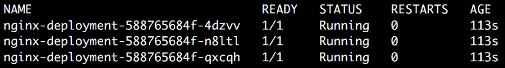

    图 8.2:获取所有 Pods

4.  创建一个名为`nginx-service-nodeport.yaml`的文件，内容如下:

    ```
    apiVersion: v1
    kind: Service
    metadata:
      name: nginx-service-nodeport
    spec:
      type: NodePort
      ports:
        - port: 80
          targetPort: 80
          nodePort: 32023
      selector:
          app: nginx
          environment: production
    ```

5.  Run the following command to create the Service:

    ```
    kubectl create -f nginx-service-nodeport.yaml
    ```

    您应该会看到以下输出:

    ```
    service/nginx-service-nodeport created
    ```

    或者，我们可以使用`kubectl expose`命令来公开一个使用 Kubernetes 服务的部署或 Pod。以下命令还将创建名为`nginx-service-nodeport`的节点端口服务，其中`port`和`targetPort`设置为`80`。唯一不同的是这个命令不允许我们自定义`nodePort`字段。当我们使用`kubectl expose`命令创建服务时，会自动分配`nodePort`:

    ```
    kubectl expose deployment nginx-deployment --name=nginx-service-nodeport --port=80 --target-port=80 --type=NodePort
    ```

    如果我们使用这个命令来创建服务，我们将能够在下面的步骤中计算出`nodePort`自动分配给服务的是什么。

6.  Run the following command to verify that the Service was created:

    ```
    kubectl get service
    ```

    这应该给出类似于以下内容的响应:

    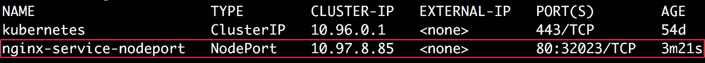

    图 8.3:获取节点端口服务

    您可以忽略名为`kubernetes`的附加服务，它在我们创建服务之前就已经存在了。该服务用于在内部公开集群的Kubernetes应用编程接口。

7.  Run the following command to verify that the Service was created with the correct configuration:

    ```
    kubectl describe service nginx-service-nodeport
    ```

    这将为我们提供以下输出:

    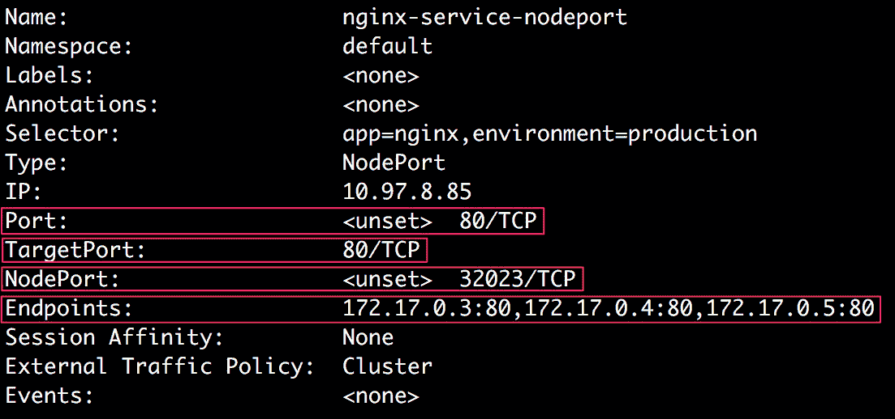

    图 8.4:描述节点端口服务

    在输出的突出显示部分，我们可以确认服务是使用正确的`Port`、`TargetPort`和`NodePort`字段创建的。

    还有另一个领域叫做`Endpoints`。我们可以看到这个字段的值是一个 IP 地址列表；即`172.17.0.3:80`、`172.17.0.4:80`和`172.17.0.5:80`。这些 IP 地址中的每一个都指向分配给由`nginx-deployment`创建的三个POD的 IP 地址，以及所有这些POD暴露的目标端口。我们可以使用`custom-columns`输出格式和`kubectl get pods`命令来获取所有三个豆荚的 IP 地址。我们可以使用`status.podIP`字段创建一个自定义的列输出，该字段包含一个正在运行的 Pod 的 IP 地址。

8.  Run the following command to see the IP addresses of all three Pods:

    ```
    kubectl get pods -o custom-columns=IP:status.podIP
    ```

    您应该会看到以下输出:

    ```
    IP
    172.17.0.4
    172.17.0.3
    172.17.0.5
    ```

    因此，我们可以看到服务的`Endpoints`字段实际上指向我们三个豆荚的 IP 地址。

    我们知道，在节点端口服务的情况下，我们可以使用节点的 IP 地址和服务在节点上公开的端口来访问 Pod 的应用。为此，我们需要找出 Kubernetes 集群中节点的 IP 地址。

9.  Run the following command to get the IP address of the Kubernetes cluster running locally:

    ```
    minikube ip
    ```

    您应该会看到以下响应:

    ```
    192.168.99.100
    ```

10.  Run the following command to send a request to the IP address we obtained from the previous step at port `32023` using `curl`:

    ```
    curl 192.168.99.100:32023
    ```

    您应该会从 Nginx 得到这样的回复:

    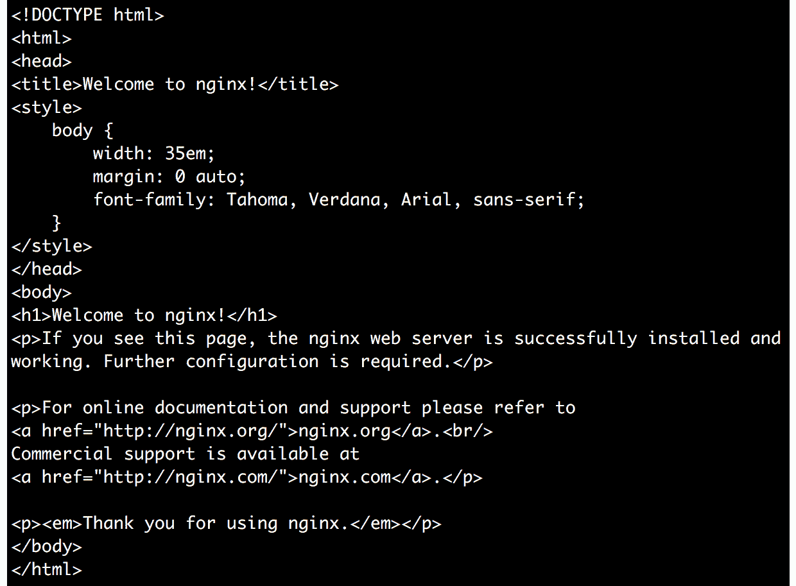

    图 8.5:发送 curl 请求来检查节点端口服务

11.  Finally, open your browser and enter `192.168.99.100:32023` to make sure we can get to the following page:

    

    图 8.6:在浏览器中访问应用

    注意

    理想情况下，您会希望在不同的名称空间中为每个练习和活动创建对象，以使它们与其他对象分开。因此，请随意创建一个名称空间，并在该名称空间中创建部署。或者，您可以确保清除以下命令中显示的任何对象，以便没有干扰。

12.  Delete both the Deployment and the Service to ensure you're working on the clean ground for the rest of the exercises in this chapter:

    ```
    kubectl delete deployment nginx-deployment
    ```

    您应该会看到以下响应:

    ```
    deployment.apps "nginx-deployment" deleted
    ```

    现在，使用以下命令删除该服务:

    ```
    kubectl delete service nginx-service-nodeport
    ```

    您应该会看到以下回应:

    ```
    service "nginx-service-nodeport" deleted
    ```

在本练习中，我们使用 Nginx 容器的三个副本创建了一个部署(这可以用容器中运行的任何真实应用来替换)，并使用节点端口服务公开了该应用。

## 集群 IP 服务

正如我们前面提到的，集群 IP 服务在一个只能从集群内部访问的 IP 地址上公开了在 Pods 上运行的应用。这使得集群 IP 服务成为一种很好的服务类型，可用于同一集群内不同类型的 Pods 之间的通信。

例如，让我们考虑一个简单调查应用的早期示例。假设我们有一个调查应用，它为前端服务，向用户显示表单，用户可以在其中填写调查。它运行在`survey-frontend`部署管理的一组 Pods 上。我们还有另一个应用，负责验证和存储用户填写的数据。它运行在由`survey-backend`部署管理的一组POD上。该后端应用需要由调查前端应用在内部访问。我们可以使用集群 IP 服务来公开后端应用，以便前端 Pods 可以使用该集群 IP 服务的单个 IP 地址轻松访问后端应用。

### 服务配置

以下是集群 IP 服务的配置示例:

```
apiVersion: v1
kind: Service
metadata:
  name: nginx-service
spec:
 type: ClusterIP
 ports:
 - targetPort: 80
 port: 80
  selector:
      app: nginx
      environment: production
```

服务的`type`设置为`ClusterIP`。这种服务只需要两个端口:`targetPort`和`port`。它们分别代表应用在 Pod 上公开的端口和服务在给定集群 IP 上创建的端口。

与节点端口服务类似，集群 IP 服务的配置也需要一个`selector`部分，用于决定服务选择哪些 Pods。在本例中，本服务将选择所有同时具有`app: nginx`和`environment: production`标签的豆荚。在下面的练习中，我们将基于一个类似的例子创建一个简单的集群 IP 服务。

## 练习 8.02:使用 Nginx 容器创建简单的集群 IP 服务

在本练习中，我们将使用 Nginx 容器创建一个简单的集群 IP 服务。默认情况下，Nginx 容器在 Pod 上公开端口`80`，并带有一个 HTML 页面，上面写着`Welcome to nginx!`。我们将确保可以使用`curl`命令从 Kubernetes 集群内部访问该页面。让我们开始吧:

1.  创建一个名为`nginx-deployment.yaml`的文件，内容如下:

    ```
    apiVersion: apps/v1
    kind: Deployment
    metadata:
      name: nginx-deployment
      labels:
        app: nginx
    spec:
      replicas: 3
      strategy:
        type: Recreate
      selector:
        matchLabels:
          app: nginx
          environment: production
      template:
        metadata:
          labels:
            app: nginx
            environment: production
        spec:
          containers:
          - name: nginx-container
            image: nginx
    ```

2.  Run the following command to create the Deployment using the `kubectl apply` command:

    ```
    kubectl create -f nginx-deployment.yaml
    ```

    您应该会看到以下响应:

    ```
    deployment.apps/nginx-deployment created
    ```

3.  Run the following command to verify that the Deployment has created three replicas:

    ```
    kubectl get pods
    ```

    您应该会看到类似如下的输出:

    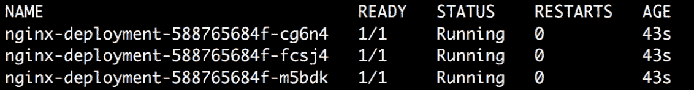

    图 8.7:获取所有豆荚

4.  创建一个名为`nginx-service-clusterip.yaml`的文件，内容如下:

    ```
    apiVersion: v1
    kind: Service
    metadata:
      name: nginx-service-clusterip
    spec:
      type: ClusterIP
      ports:
        - port: 80
          targetPort: 80
      selector:
          app: nginx
          environment: production
    ```

5.  Run the following command to create the Service:

    ```
    kubectl create -f nginx-service-clusterip.yaml
    ```

    您应该会看到以下响应:

    ```
    service/nginx-service-clusterip created
    ```

6.  Run the following command to verify that the Service was created:

    ```
    kubectl get service
    ```

    您应该会看到以下响应:

    

    图 8.8:获取集群 IP 服务

7.  Run the following command to verify that the Service has been created with the correct configuration:

    ```
    kubectl describe service nginx-service-clusterip
    ```

    您应该会看到以下响应:

    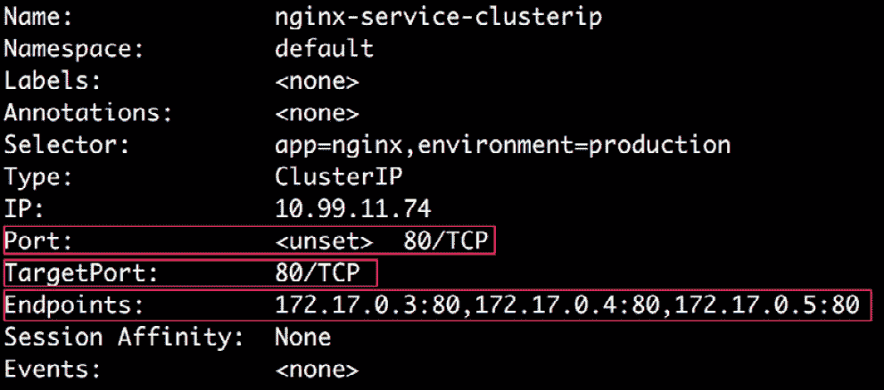

    图 8.9:描述集群 IP 服务

    我们可以看到服务已经用正确的`Port`和`TargetPort`字段创建。在`Endpoints`字段，我们可以看到POD的 IP 地址，以及这些POD上的目标端口。

8.  Run the following command to see the IP addresses of all three Pods:

    ```
    kubectl get pods -o custom-columns=IP:status.podIP
    ```

    您应该会看到以下响应:

    ```
    IP
    172.17.0.5
    172.17.0.3
    172.17.0.4
    ```

    因此，我们可以看到服务的`Endpoints`字段实际上指向我们三个豆荚的 IP 地址。

9.  Run the following command to get the cluster IP of the Service:

    ```
    kubectl get service nginx-service-clusterip
    ```

    这将产生以下输出:

    

    图 8.10:从服务获取集群 IP

    我们可以看到，该服务的集群 IP 为`10.99.11.74`。

    我们知道，在集群 IP 服务的情况下，我们可以从集群内部访问运行在其端点上的应用。因此，我们需要进入集群内部来检查这是否真的有效。

10.  Run the following command to access the `minikube` node via SSH:

    ```
    minikube ssh
    ```

    您将看到以下响应:

    

    图 8.11:进入 minikube 节点

11.  Now that we are inside the cluster, we can try to access the cluster IP address of the Service and see whether we can access the Pods running Nginx:

    ```
    curl 10.99.11.74
    ```

    您应该会看到 Nginx 的以下响应:

    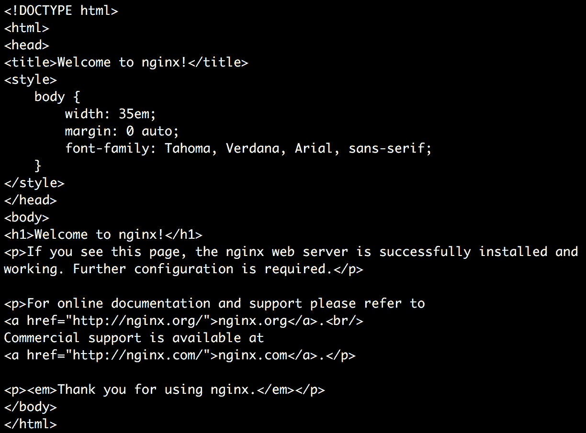

    图 8.12:从集群内部向服务发送 curl 请求

    在这里，我们可以看到`curl`返回默认 Nginx 登陆页面的 HTML 代码。因此，我们可以成功访问我们的 Nginx Pods。接下来，我们将删除 Pods 和服务。

12.  运行以下命令退出 minikube 内的 SSH 会话:

    ```
    exit
    ```

13.  Delete the Deployment and the Service to ensure you're working on the clean ground for the following exercises in this chapter:

    ```
    kubectl delete deployment nginx-deployment
    ```

    您应该会看到以下响应:

    ```
    deployment.apps "nginx-deployment" deleted
    ```

    使用以下命令删除服务:

    ```
    kubectl delete service nginx-service-clusterip
    ```

    您应该会看到以下响应:

    ```
    service "nginx-service-clusterip" deleted
    ```

在本练习中，我们能够展示在单个 IP 地址上的多个 Pods 上运行的应用。运行在同一个集群中的所有其他 Pods 都可以访问它。

### 选择服务的自定义 IP 地址

在前面的练习中，我们看到该服务是使用 Kubernetes 集群中的随机可用 IP 地址创建的。如果我们愿意，也可以指定一个 IP 地址。如果我们已经有了特定地址的域名系统条目，并且希望在我们的服务中重用它，这可能会特别有用。

我们可以通过将`spec.clusterIP`字段设置为我们希望服务使用的 IP 地址值来实现这一点。此字段中指定的 IP 地址应该是有效的 IPv4 或 IPv6 地址。如果使用无效的 IP 地址来创建服务，应用编程接口服务器将返回一个错误。

## 练习 8.03:使用自定义 IP 创建集群 IP 服务

在本练习中，我们将创建一个带有自定义 IP 地址的集群 IP 服务。我们将尝试一个随机的 IP 地址。与前面的练习一样，我们将确保可以通过使用`curl`命令设置 IP 地址，从 Kubernetes 集群内部访问默认的 Nginx 页面。让我们开始吧:

1.  创建一个名为`nginx-deployment.yaml`的文件，其内容与我们在本章前面的练习中使用的内容相同。
2.  Run the following command to create the Deployment:

    ```
    kubectl create -f nginx-deployment.yaml
    ```

    您应该会看到以下响应:

    ```
    deployment.apps/nginx-deployment created
    ```

3.  Create a file named `nginx-service-custom-clusterip.yaml` with the following content:

    ```
    apiVersion: v1
    kind: Service
    metadata:
      name: nginx-service-custom-clusterip
    spec:
      type: ClusterIP
      ports:
        - port: 80
          targetPort: 80
     clusterIP: 10.90.10.70
      selector:
          app: nginx
          environment: production
    ```

    这会使用一个随机的集群 IP 值。

4.  Run the following command to create a Service with the preceding configuration:

    ```
    kubectl create -f nginx-service-custom-clusterip.yaml
    ```

    您应该会看到以下响应:

    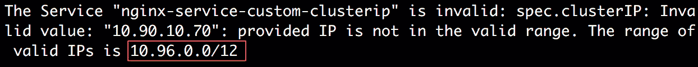

    图 8.13:由于不正确的 IP 地址导致的服务创建失败

    如我们所见，该命令给出了一个错误，因为我们使用的 IP 地址(`10.90.10.70`)不在有效的 IP 范围内。如前一输出中突出显示的，有效的 IP 范围是`10.96.0.0/12`。

    在使用`kubectl cluster-info dump`命令创建服务之前，我们实际上可以找到这个有效的 IP 地址范围。它提供了大量可用于集群调试和诊断的信息。我们可以过滤命令输出中的`service-cluster-ip-range`字符串，找出我们可以在集群中使用的有效 IP 地址范围。以下命令将输出有效的 IP 范围:

    ```
    kubectl cluster-info dump | grep -m 1 service-cluster-ip-range
    ```

    您应该会看到以下输出:

    ```
    "--service-cluster-ip-range=10.96.0.0/12",
    ```

    然后，我们可以为我们的服务使用`clusterIP`的适当的 IP 地址。

5.  通过将`clusterIP`的值更改为`10.96.0.5`来修改`nginx-service-custom-clusterip.yaml`文件，因为这是有效值之一:

    ```
    apiVersion: v1
    kind: Service
    metadata:
      name: nginx-service-custom-clusterip
    spec:
      type: ClusterIP
      ports:
        - port: 80
          targetPort: 80
     clusterIP: 10.96.0.5
      selector:
          app: nginx
          environment: production
    ```

6.  Run the following command to create the Service again:

    ```
    kubectl create -f nginx-service-custom-clusterip.yaml
    ```

    您应该会看到以下输出:

    ```
    service/nginx-service-custom-clusterip created
    ```

    我们可以看到服务已经成功创建。

7.  Run the following command to ensure that the Service was created with the custom ClusterIP we specified in the configuration:

    ```
    kubectl get service nginx-service-custom-clusterip
    ```

    您应该会看到以下输出:

    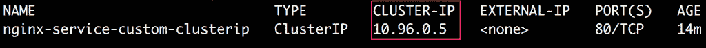

    图 8.14:从服务获取集群 IP

    在这里，我们可以确认服务确实是用配置中提到的 IP 地址创建的；也就是`10.96.0.5`。

8.  Next, let's confirm that we can access the Service using the custom IP address from inside the cluster:

    ```
    minikube ssh
    ```

    您应该会看到以下响应:

    

    图 8.15:进入 minikube 节点

9.  Now, run the following command to send a request to `10.96.0.5:80` using `curl`:

    ```
    curl 10.96.0.5
    ```

    我们有意跳过了`curl`请求中的端口号(`80`，因为默认情况下，curl 假定端口号为`80`。如果服务使用不同的端口号，我们必须在 curl 请求中明确指定。您应该会看到以下输出:

    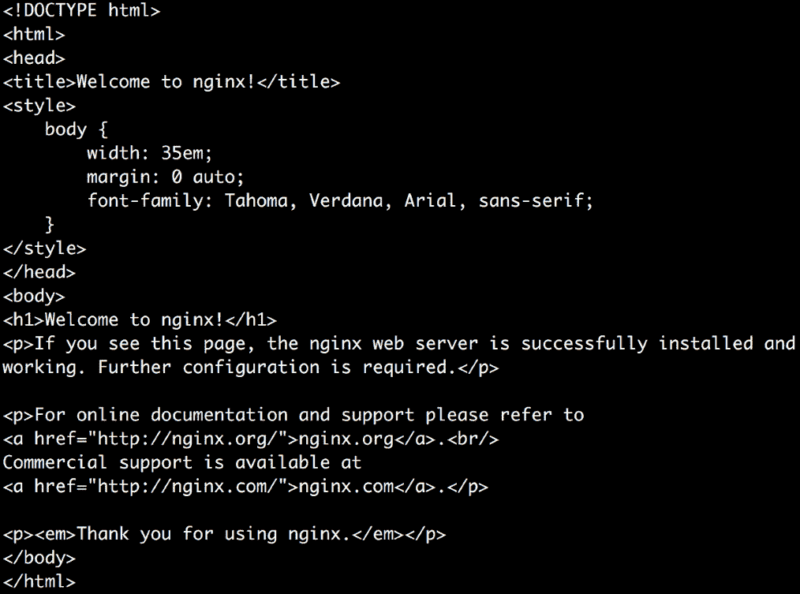

图 8.16:从 minikube 节点向服务发送 curl 请求

因此，我们可以看到，我们能够从集群内部访问我们的服务，并且可以在我们为`clusterIP`定义的 IP 地址访问该服务。

## 负载平衡器服务

负载平衡器服务使用云提供商提供的负载平衡器在外部公开应用。这种类型的服务没有默认的本地实现，只能使用云提供商进行部署。当创建`LoadBalancer`类型的服务时，云提供商提供负载平衡器。

因此，负载平衡器服务基本上是节点端口服务的超集。负载平衡器服务使用云提供商提供的实现，并为该服务分配一个外部 IP 地址。

`LoadBalancer`服务的配置取决于云提供商。每个云提供商都要求您以注释的形式添加一组特定的元数据。以下是`LoadBalancer`服务配置的简化示例:

```
apiVersion: v1
kind: Service
metadata:
  name: loadbalancer-service
spec:
  type: LoadBalancer
  clusterIP: 10.90.10.0
  ports:
    - targetPort: 8080
      port: 80
  selector:
    app: nginx
    environment: production
```

## 外部名称服务

外部名称服务将服务映射到域名。在外部名称服务的情况下，没有代理或转发。相反，重定向请求发生在 DNS 级别。当请求服务时，将返回一个 CNAME 记录，其中包含在服务配置中设置的域名值。

外部名称服务的配置不包含任何选择器。它看起来如下:

```
apiVersion: v1
kind: Service
metadata:
  name: externalname-service
spec:
  type: ExternalName
  externalName: my.example.domain.com
```

前面的服务模板将`externalname-service`映射到一个域名；例如，`my.example.domain.com`。

假设您正在将生产应用迁移到一个新的 Kubernetes 集群。一个好的方法是从无状态部分开始，首先将它们移动到 Kubernetes 集群。在迁移过程中，您需要确保 Kubernetes 集群中的无状态部分仍然可以访问其他生产服务，例如数据库存储或其他后端服务/应用编程接口。在这种情况下，我们可以简单地创建一个外部名称服务，这样我们来自新集群的 Pods 仍然可以访问旧集群的资源，这些资源在新集群的边界之外。因此，ExternalName 提供了 Kubernetes 应用和运行在 Kubernetes 集群之外的外部服务之间的通信。

# 进入

入口是一个对象，它定义了用于管理对 Kubernetes 集群中服务的外部访问的规则。通常，入口充当互联网和运行在集群内的服务之间的中间人:

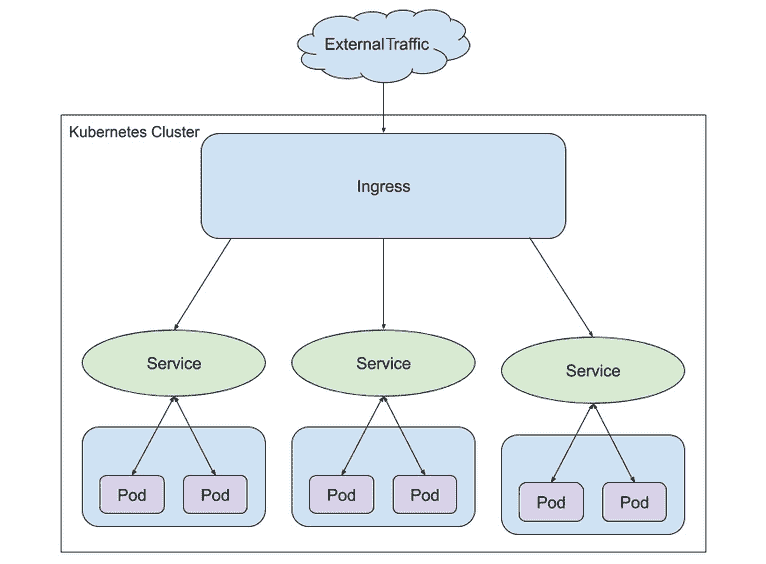

图 8.17:入口

您将在*第 12 章*、*您的应用和 HA* 中了解更多关于入口和使用它的主要动机。因此，我们在这里不讨论入口的实现。

现在我们已经了解了 Kubernetes 中不同类型的服务，我们将实现所有这些服务，以了解它们在现实场景中如何协同工作。

## 活动 8.01:创建一个服务来展示在 Pod 上运行的应用

考虑这样一个场景:您正在合作的产品团队创建了一个调查应用，它有两个独立且解耦的组件——前端和后端。调查应用的前端组件呈现调查表单，需要向外部用户公开。它还需要与负责验证和存储调查响应的后端组件进行通信。

对于本活动的范围，请考虑以下任务:

1.  为了避免这项活动过于复杂，您可以部署 Apache 服务器([https://hub.docker.com/_/httpd](https://hub.docker.com/_/httpd))作为前端，我们可以将其默认占位符主页视为调查申请者应该可见的组件。公开前端应用，以便可以在端口`31000`的主机节点上访问。
2.  For the backend application, deploy an Nginx server. We will treat the default home page of Nginx as the page that you should be able to see from the backend. Expose the backend application so that it's accessible for the frontend application Pods in the same cluster.

    默认情况下，Apache 和 Nginx 都暴露在 Pods 的端口`80`上。

    注意

    我们在这里使用 Apache 和 Nginx 来保持活动的简单。在现实场景中，这两者将被您的调查应用的前端调查站点和后端数据分析组件以及用于存储所有调查数据的数据库组件所取代。

3.  To make sure frontend applications are aware of the backend application Service, add an environment variable to the frontend application Pods that contain the IP and the port address of the backend Service. This will ensure that the frontend applications know where to send a request to backend applications.

    要向 Pod 添加环境变量，我们可以在 Pod 配置的`spec`部分添加一个名为`env`的字段，该字段包含我们要添加的所有环境变量的名称和值对列表。下面是一个如何添加名为`APPLICATION_TYPE`的环境变量的例子，其值为`Frontend`:

    ```
    apiVersion: v1
    kind: Pod
    metadata:
      name: environment-variables-example
      labels:
        application: frontend
    spec:
      containers:
      - name: apache-httpd
        image: httpd
     env:
     - name: APPLICATION_TYPE
     value: "Frontend"
    ```

    注意

    我们在这里使用了一个叫做`ConfigMap`的东西来添加一个环境变量。我们将在*第 10 章*、*配置地图和秘密*中了解更多。

4.  让我们假设，基于应用的负载测试，您已经估计您最初需要五个前端应用副本和四个后端应用副本。

为了完成本活动，您需要执行以下高级步骤:

1.  为此活动创建命名空间。
2.  为后端应用编写适当的部署配置，并创建部署。
3.  使用适当的服务类型为后端应用编写适当的服务配置，并创建服务。
4.  确保后端应用如预期的那样是可访问的。
5.  为前端应用编写适当的部署配置。确保它为后端应用服务的 IP 地址和端口地址设置了环境变量。
6.  为前端应用创建部署。
7.  使用适当的服务类型为前端应用编写适当的服务配置，并创建服务。
8.  确保前端应用可以在主机节点的端口`31000`上按预期访问。

**预期输出:**

在练习结束时，您应该能够使用端口`31000`的主机 IP 地址在浏览器中访问前端应用。您应该会在浏览器中看到以下输出:


图 8.18:活动 8.01 的预期产出

注意

该活动的解决方案可在以下地址找到:[https://packt.live/304PEoD](https://packt.live/304PEoD)。

# 总结

在本章中，我们介绍了在 Pods 上运行应用的不同方式。我们已经看到了如何使用集群 IP 服务来公开集群中的应用。我们还看到了如何使用节点端口服务来公开集群外部的应用。我们还简要介绍了负载平衡器和外部名称服务。

现在我们已经创建了一个部署，并了解了如何从外部世界访问它，在下一章中，我们将重点讨论存储方面。在这里，我们将介绍在磁盘上、在 Pods 中和跨 Pods 读取和存储数据。