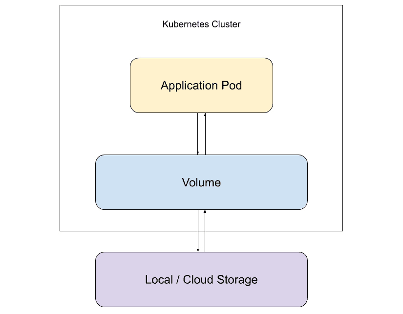
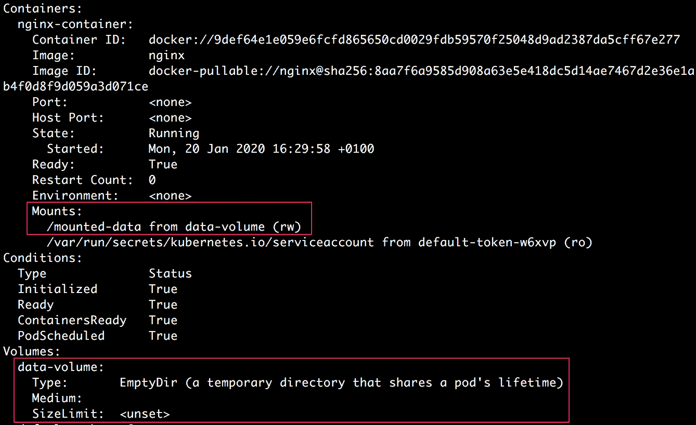
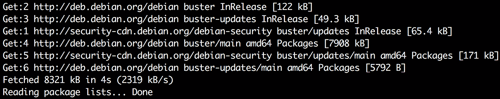
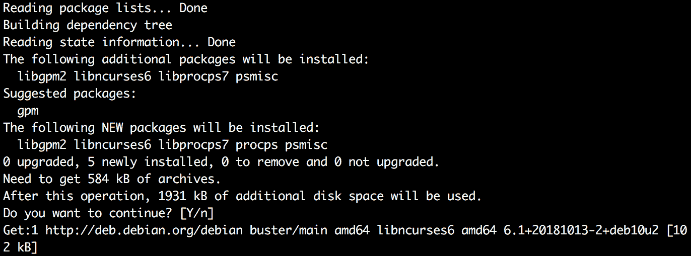
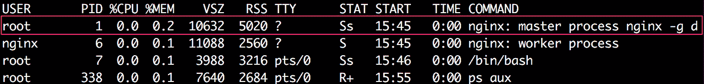
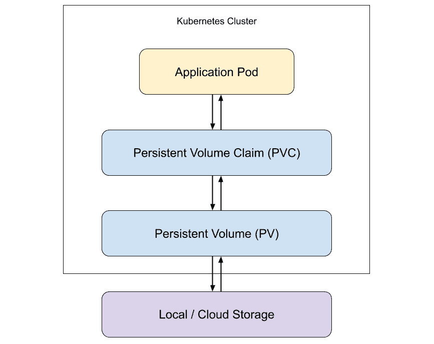

# 9。在磁盘上存储和读取数据

概观

本章介绍了使用卷来存储或读取容器中运行的数据的概念。到本章结束时，您将能够创建卷，以在独立于容器生命周期的容器中临时存储数据，并在同一容器内的不同容器之间共享数据。您还将学习如何使用**PersistentVolumes**(**PVs**)在集群上存储数据，而不依赖于 pod 的生命周期。我们还将介绍如何创建**持久卷声明** ( **PVCs** )来动态调配卷并在 pod 中使用它们。

# 简介

在前几章中，我们创建了部署来创建应用的多个副本，并使用服务公开了我们的应用。然而，我们还没有正确探索 Kubernetes 如何促进应用存储和读取数据，这是本章的主题。

实际上，大多数应用都以某种方式与数据交互。我们可能有一个需要从文件中读取数据的应用。同样，我们的应用可能需要在本地写入一些数据，以便应用的其他部分或不同的应用读取这些数据。例如，如果我们有一个容器运行我们的主应用，在本地生成一些日志，我们将希望有一个 sidecar 容器(它是在 pod 内部与主应用容器一起运行的第二个容器)，可以在同一个 pod 内部运行，以读取和处理主应用生成的本地日志。然而，为了实现这一点，我们需要找到一种方法，在同一个容器中的不同容器之间共享存储。

假设我们正在一个吊舱中训练一个机器学习模型。在模型训练的中间阶段，我们需要将一些数据本地存储在磁盘上。类似地，最终结果——训练好的模型——需要存储在磁盘上，以便以后即使吊舱终止也能检索到。对于这个用例，我们需要一些方法来为 pod 分配一些存储空间，这样写入该存储空间的数据甚至会存在于 pod 的生命周期之外。

同样，我们可能有一些数据需要由同一个应用的多个副本写入或读取。当一些这样的 pod 副本崩溃和/或重启时，这些数据也应该持续存在。例如，如果我们有一个电子商务网站，我们可能希望将用户数据以及库存记录存储在数据库中。这些数据需要在 pod 重启以及部署更新或回滚期间保持不变。

为了达到这些目的，Kubernetes 提供了一个称为 Volume 的抽象。A **持续音量** ( **PV** )是你会遇到的最常见的音量类型。在本章中，我们将介绍这一点，以及许多其他类型的卷。我们将学习如何使用它们并按需提供它们。

# 卷

假设我们有一个 pod，在磁盘上本地存储一些数据。现在，如果存储数据的容器崩溃并重新启动，数据将会丢失。新容器将以分配的空磁盘空间开始。因此，我们不能依赖容器本身来临时存储数据。

我们可能还会遇到这样的情况:一个容器中的一个容器存储了一些数据，这些数据也需要由同一容器中的其他容器访问。

Kubernetes 卷抽象解决了这两个问题。下图显示了卷及其与物理存储和应用的交互:



图 9.1:卷作为应用的存储抽象

从该图中可以看出，卷作为一个抽象呈现给应用，最终将数据存储在您可能使用的任何类型的物理存储上。

Kubernetes体积的寿命与使用它的豆荚的寿命相同。换句话说，即使容器内的容器重新启动，新容器也将使用相同的卷。因此，数据不会在容器重启时丢失。但是，一旦 pod 终止或重新启动，卷将不复存在，数据也将丢失。为了解决这个问题，我们可以使用 PVs，这将在本章后面介绍。

## 如何使用卷

在容器规格中定义了一个体积。以下是带有卷的 pod 配置示例:

```
apiVersion: v1
kind: Pod
metadata:
  name: pod-with-emptydir-volume
spec:
  restartPolicy: Never
  containers:
  - image: ubuntu
    name: ubuntu-container
 volumeMounts:
 - mountPath: /data
 name: data-volume
 volumes:
 - name: data-volume
 emptyDir: {}
```

正如我们在前面的配置中看到的，要定义一个卷，pod 配置需要设置两个字段:

*   `.spec.volumes`字段定义了该窗格计划使用的卷。
*   `.spec.containers.volumeMounts`定义了在各个容器中安装这些卷的位置。这将为所有容器单独定义。

## 定义体积

在前面的示例中，`.spec.volumes`字段有两个字段定义了卷的配置:

*   `name`:这是卷的名称，当它将被装载时，它将在容器的`volumeMounts`字段中被引用。它必须是有效的域名。卷的名称在单个窗格中必须是唯一的。
*   `emptyDir`:这取决于所使用的卷的类型(在前面的例子中是`emptyDir`)。这定义了卷的实际配置。在下一节中，我们将通过一些示例来介绍卷的类型。

## 安装卷

每个容器需要单独指定`volumeMounts`来挂载体积。在上例中，您可以看到`.spec.containers[*].volumeMounts`配置有以下字段:

*   `name`:这是需要为此容器装载的卷的名称。
*   `mountPath`:这是容器内部应该安装卷的路径。每个容器可以在不同的路径上装载相同的卷。

除此之外，我们还可以设置另外两个值得注意的领域:

*   `subPath`:这是一个可选字段，包含需要装载到容器上的卷的路径。默认情况下，卷从其根目录装载。此字段可用于仅装载卷中的子目录，而不是整个卷。例如，如果您为多个用户使用同一个卷，在容器上挂载子路径会很有用，而不是在卷的根目录上。
*   `readonly`:这是一个可选标志，用于确定装入的卷是否为只读卷。默认情况下，卷以读写访问权限装载。

## 卷的类型

如前所述，Kubernetes 支持几种类型的卷，其中大多数卷的可用性取决于您使用的云提供商。AWS、Azure 和谷歌云都支持不同类型的卷。

让我们详细了解一些常见的卷类型。

### emptyDir

`emptyDir`卷是指当一个 pod 被分配给一个节点时创建的一个空目录。它只在豆荚存在的时候存在。pod 中运行的所有容器都能够从这个目录中读写文件。相同的`emptyDir`卷可以安装在不同容器的不同路径上。

这里有一个使用`emptyDir`卷的吊舱配置示例:

```
apiVersion: v1
kind: Pod
metadata:
  name: pod-with-emptydir-volume
spec:
  restartPolicy: Never
  containers:
  - image: ubuntu
    name: ubuntu-container
 volumeMounts:
 - mountPath: /data
 name: data-volume
volumes:
 - name: data-volume
 emptyDir: {}
```

在本例中，`{}`表示`emptyDir`体积将以默认方式定义。默认情况下，`emptyDir`卷存储在磁盘或固态硬盘上，具体取决于环境。我们可以通过将`.emptyDir.medium`字段设置为`Memory`来将其改为使用内存。

因此，我们可以修改前面 pod 配置的`volumes`部分，以使用由内存支持的`emptyDir`卷，如下所示:

```
 volumes:
 - name: data-volume
 emptyDir:
 medium: Memory
```

这通知 Kubernetes 使用基于内存的文件系统(tmpfs)来存储卷。尽管 tmpfs 与磁盘上的数据相比速度非常快，但使用内存中卷也有一些缺点。首先，在运行 pod 的节点的系统重新启动时，tmpfs 存储被清除。其次，存储在基于内存的卷中的数据会计入容器的内存限制。因此，我们在使用基于内存的卷时需要小心。

我们也可以通过设置`.volumes.emptyDir.sizeLimit`字段来指定要在`emptyDir`卷中使用的存储器的大小限制。该大小限制适用于基于磁盘和基于内存的`emptyDir`卷。在基于内存的卷的情况下，允许的最大使用量将是`sizeLimit`字段值或容器中所有容器的内存限制总和，以较低者为准。

**用例**

`emptyDir`卷的一些用例如下:

*   临时暂存空间，用于需要大量空间的计算，如磁盘上的合并排序
*   存储长时间计算的检查点所需的存储空间，例如训练机器学习模型，其中需要保存进度以从崩溃中恢复

### 主机路径

`hostPath`卷用于将文件或目录从主机节点的文件系统装载到 pod。

这里有一个使用`hostPath`卷的吊舱配置示例:

```
apiVersion: v1
kind: Pod
metadata:
  name: pod-with-hostpath-volume
spec:
  restartPolicy: Never
  containers:
  - image: ubuntu
    name: ubuntu-container
 volumeMounts:
 - mountPath: /data
 name: data-volume
 volumes:
 - name: data-volume
 hostPath:
 path: /tmp
 type: Directory
```

在本例中，来自主机节点的`/home/user/data`目录将被装载到容器的`/data`路径上。我们来看看`hostPath`下面的两个字段:

*   `path`:这是将要装载到装载该卷的容器上的目录或文件的路径。根据`type`字段，它也可以是目录或文件的符号链接(symlink)、UNIX 套接字的地址或字符或块设备。
*   `type`:这是一个可选字段，允许我们指定卷的类型。如果指定了该字段，将在安装`hostPath`卷之前执行某些检查。

`type`字段支持以下值:

*   `""`(空字符串):这是默认值，表示在安装`hostPath`卷之前不会执行任何检查。如果节点上不存在指定的路径，则仍会创建 pod，而无需验证路径的存在。因此，由于这个错误，吊舱将无限期地崩溃。
*   `DirectoryOrCreate`:这意味着指定的目录路径可能已经存在，也可能不存在于主机节点上。如果它不存在，将创建一个空目录。
*   `Directory`:这意味着目录必须存在于指定路径的主机节点上。如果目录不存在于指定的路径，在创建 pod 时将出现`FailedMount`错误，表明`hostPath`类型检查失败。
*   `FileOrCreate`:这意味着指定的文件路径可能已经存在，也可能不存在于主机节点上。如果它不存在，则会创建一个空文件。
*   `File`:这意味着文件必须存在于指定路径的主机节点上。
*   `Socket`:这意味着 UNIX 套接字必须存在于指定的路径上。
*   `CharDevice`:这意味着字符设备必须存在于指定的路径上。
*   `BlockDevice`:这意味着块设备必须存在于指定的路径上。

**用例**

在大多数情况下，您的应用不需要`hostPath`卷。然而，有一些特殊的用例`hostPath`卷可能特别有用。`hostPath`卷的一些用例如下:

*   仅当运行 pod 之前主机节点上存在特定的主机路径时，才允许创建 pod。例如，pod 可能要求主机上的文件中存在一些机密或凭据，然后才能运行。
*   Running a container that needs access to Docker internals. We can do that by setting `hostPath` to `/var/lib/docker`.

    注意

    除了这里介绍的两种类型的卷之外，Kubernetes 还支持更多的卷，其中一些卷特定于特定的云平台。你可以在[https://kubernetes . io/docs/concepts/storage/volumes/# volumes-type](https://kubernetes.io/docs/concepts/storage/volumes/#types-of-volumes)找到更多关于它们的信息。

在前几节中，我们了解了卷以及如何使用它们的不同类型。在接下来的练习中，我们将把这些概念付诸行动，并将 Volumes 与 pods 结合使用。

## 练习 9.01:创建带有空方向体积的容器

在本练习中，我们将创建一个具有`emptyDir`体积的基本吊舱。我们还将模拟手动写入数据，然后确保存储在卷中的数据在容器重新启动时保持不变:

1.  Create a file called `pod-with-emptydir-volume.yaml` with the following content:

    ```
    apiVersion: v1
    kind: Pod
    metadata:
      name: pod-with-emptydir-volume
    spec:
      containers:
      - image: nginx
        name: nginx-container
        volumeMounts: 
     - mountPath: /mounted-data
          name: data-volume
      volumes:
      - name: data-volume
    emptyDir: {}
    ```

    在这个 pod 配置中，我们使用了安装在`/mounted-data`目录中的`emptyDir`卷。

2.  Run the following command to create the pod using the preceding configuration:

    ```
    kubectl create -f pod-with-emptydir-volume.yaml
    ```

    您应该会看到以下响应:

    ```
    pod/pod-with-emptydir-volume created
    ```

3.  Run the following command to confirm that the pod was created and is ready:

    ```
    kubectl get pod pod-with-emptydir-volume
    ```

    您应该会看到以下响应:

    ```
    NAME                       READY   STATUS   RESTARTS   AGE
    pod-with-emptydir-volume   1/1     Running  0          20s
    ```

4.  Run the following command to describe the pod so that we can verify that the correct Volume was mounted on this pod:

    ```
    kubectl describe pod pod-with-emptydir-volume
    ```

    这将给出长输出。在终端输出中查找以下部分:

    

    图 9.2:描述装载了 emptyDir 卷的容器

    如上图所示，名为`data-volume`的`emptyDir`卷已创建，并安装在`/mounted-data`路径的`nginx-container`上。我们可以看到卷已经安装在`rw`模式，代表读写。

    现在，我们已经验证了 pod 是使用正确配置的卷创建的，我们将手动向该路径写入一些数据。实际上，这种编写将由您的应用代码来完成。

5.  Now, we will use the `kubectl exec` command to run the Bash shell inside the pod:

    ```
    kubectl exec pod-with-emptydir-volume -it /bin/bash
    ```

    您应该会在终端屏幕上看到以下内容:

    ```
    root@pod-with-emptydir-volume:/#
    ```

    这将允许您通过 SSH 连接在`nginx-container`中运行的 Bash shell 上运行命令。请注意，我们是以 root 用户身份运行的。

    注意

    如果您有一个边车容器在容器中运行(或者一个容器中有任意数量的多个容器)，那么您可以通过添加`-c`参数来指定容器来控制`kubectl exec`命令的执行位置，您将在下一个练习中看到这一点。

6.  Run the following command to check the content of the root directory of the pod:

    ```
    ls
    ```

    您应该会看到类似如下的输出:

    ```
    bin   dev  home  lib64  mnt          opt   root  sbin   sys   usr
    boot  etc  lib   media  mounted-data proc  run   srv    tmp   var
    ```

    注意有一个目录叫做`mounted-data`。

7.  Run the following commands to go to the `mounted-data` directory and check its content:

    ```
    cd mounted-data
    ls
    ```

    您应该会看到一个空白输出，如下所示:

    ```
    root@pod-with-emptydir-volume:/mounted-data#
    ```

    这个输出表明`mounted-data`目录如预期的那样是空的，因为我们没有任何代码在 pod 内运行来写入这个路径。

8.  运行以下命令，在`mounted-data`目录下创建一个简单的文本文件:

    ```
    echo "Manually stored data" > manual-data.txt
    ```

9.  Now, run the `ls` command again to check the content of the directory:

    ```
    ls
    ```

    您应该会看到以下输出:

    ```
    manual-data.txt
    ```

    因此，我们在装入的卷目录中创建了一个包含一些内容的新文件。现在，我们的目标是验证如果容器重新启动，这些数据是否仍然存在。

10.  In order to restart the container, we will kill the `nginx` process, which will trigger a restart. Run the following commands to install the procps package so that we can use the `ps` command to find out the process ID (PID) of the process that we want to kill. First, update the package lists:

    ```
    sudo apt-get update
    ```

    您应该会看到类似如下的输出:

    

    图 9.3:一个容易获得的更新

    我们的软件包列表是最新的，我们现在准备安装 procps。

11.  Use the following command to install procps:

    ```
    sudo apt-get install procps
    ```

    当提示确认安装时，输入 *Y* ，安装将继续，输出如下:

    

    图 9.4:使用 apt-get 安装 procps

12.  Now, run the following command to check the list of processes running on the container:

    ```
    ps aux
    ```

    您应该会看到以下输出:

    

    图 9.5:正在运行的进程列表

    在输出中，我们可以看到在其他几个进程中，`nginx`主进程运行的是`1`的`PID`。

13.  Run the following command to kill the `nginx` master process:

    ```
    kill 1
    ```

    您应该会看到以下响应:

    

    图 9.6:杀死容器

    输出显示终端退出了 pod 上的 Bash 会话。这是因为容器被杀了。`137`退出代码表示会话被人工干预终止。

14.  Run the following command to get the status of the pod:

    ```
    kubectl describe pod pod-with-emptydir-volume
    ```

    请注意您获得的输出中的以下部分:

    

    图 9.7:描述吊舱

    您会看到现在有一个值为`1`的`nginx-container`的`Restart Count`字段。这意味着容器在我们杀死它后被重启了。请注意，重新启动容器不会触发容器的重新启动。因此，我们应该期望存储在卷中的数据仍然存在。让我们在下一步验证这一点。

15.  Let's run Bash inside the pod again and go to the `/mounted-data` directory:

    ```
    kubectl exec pod-with-emptydir-volume -it /bin/bash
    cd mounted-data
    ```

    您将看到以下输出:

    ```
    root@pod-with-emptydir-volume:/# cd mounted data/
    ```

16.  Run the following command to check the contents of `/mounted-data` directory:

    ```
    ls
    ```

    您将看到以下输出:

    ```
    manual-data.txt
    ```

    该输出表明我们在杀死容器之前创建的文件仍然存在于卷中。

17.  Run the following command to verify the contents of the file we created in the Volume:

    ```
    cat manual-data.txt
    ```

    您将看到以下输出:

    ```
    Manually stored data
    ```

    该输出表明，即使容器重新启动，我们存储在卷中的数据也保持不变。

18.  Run the following command to delete the pod:

    ```
    kubectl delete pod pod-with-emptydir-volume
    ```

    您将看到以下输出，确认 pod 已被删除:

    ```
    pod "pod-with-emptydir-volume" deleted
    ```

在本练习中，我们使用`emptyDir`卷创建了一个容器，检查该容器是否创建了一个装载在容器内部正确路径上的空目录，并验证了我们可以在该目录中写入数据，并且只要容器仍在运行，数据在容器重新启动时保持不变。

现在，让我们进入一个场景，让我们观察卷的更多用途。让我们考虑一个场景，其中我们有一个运行总共三个容器的应用容器。我们可以假设三个容器中的两个为流量服务，它们将日志转储到一个共享文件中。第三个容器充当边车监控容器，从文件中读取日志，并将它们转储到外部日志存储系统中，在那里可以保存日志以供进一步分析和警报。让我们在下一个练习中考虑这个场景，并了解我们如何利用一个吊舱的三个容器之间共享的`emptyDir`体积。

## 练习 9.02:创建一个由三个容器共享空目录卷的容器

在本练习中，我们将展示`emptyDir`体积的更多用途，并在同一个容器中的三个容器之间共享它。每个容器将在不同的本地路径上装载相同的卷:

1.  Create a file called `shared-emptydir-volume.yaml` with the following content:

    ```
    apiVersion: v1
    kind: Pod
    metadata:
      name: shared-emptydir-volume
    spec:
      containers:
      - image: ubuntu
        name: container-1
        command: ['/bin/bash', '-ec', 'sleep 3600']
     volumeMounts:
     - mountPath: /mounted-data-1
     name: data-volume
      - image: ubuntu
        name: container-2
        command: ['/bin/bash', '-ec', 'sleep 3600']
     volumeMounts:
     - mountPath: /mounted-data-2
     name: data-volume
      - image: ubuntu
        name: container-3
        command: ['/bin/bash', '-ec', 'sleep 3600']
     volumeMounts:
     - mountPath: /mounted-data-3
     name: data-volume
      volumes:
      - name: data-volume
     emptyDir: {}
    ```

    在这个配置中，我们定义了一个名为`data-volume`的`emptyDir`卷，它被安装在三个不同路径的容器上。

    请注意，每个容器都被配置为在启动时运行一个命令，使它们休眠 1 小时。这是为了保持`ubuntu`容器运行，以便我们可以对容器执行以下操作。默认情况下，`ubuntu`容器被配置为运行指定的任何命令，并在完成后退出。

2.  Run the following command to create the pod with the preceding configuration:

    ```
    kubectl create -f shared-emptydir-volume.yaml
    ```

    您将看到以下输出:

    ```
    pod/shared-emptydir-volume created
    ```

3.  Run the following command to check the status of the pod:

    ```
    kubectl get pod shared-emptydir-volume
    ```

    您将看到以下输出:

    ```
    NAME                     READY   STATUS    RESTARTS   AGE
    shared-emptydir-volume   3/3     Running   0          13s
    ```

    这个输出表明这个容器中的三个容器都在运行。

4.  Next, we will run the following command to run Bash in the first container:

    ```
    kubectl exec shared-emptydir-volume -c container-1 -it -- /bin/bash
    ```

    这里，`-c`标志用于指定我们想要在其中运行 Bash 的容器。您将在终端中看到以下内容:

    ```
    root@shared-emptydir-volume:/#
    ```

5.  Run the following command to check the content of the root directory on the container:

    ```
    ls
    ```

    您将看到以下输出:

    

    图 9.8:列出容器内根目录的内容

    我们可以看到容器上已经创建了`mounted-data-1`目录。此外，除了我们创建的`mounted-data-1`目录之外，您还可以看到典型 Ubuntu 根目录中的目录列表。

6.  现在，我们将进入`mounted-data-1`目录，创建一个简单的文本文件，其中包含一些文本:

    ```
    cd mounted-data-1
    echo 'Data written on container-1' > data-1.txt
    ```

7.  Run the following command to verify that the file has been stored:

    ```
    ls
    ```

    您将看到以下输出:

    ```
    data-1.txt
    ```

8.  运行以下命令退出`container-1`并返回您的主机终端:

    ```
    exit
    ```

9.  Now, let's run Bash inside the second container, which is named `container-2`:

    ```
    kubectl exec shared-emptydir-volume -c container-2 -it -- /bin/bash
    ```

    您将在终端中看到以下内容:

    ```
    root@shared-emptydir-volume:/#
    ```

10.  Run the following command to locate the mounted directory in the root directory on the container:

    ```
    ls
    ```

    您将看到以下输出:

    

    图 9.9:列出容器内根目录的内容

    请注意名为`mounted-data-2`的目录，它是我们在`container-2`中的卷的挂载点。

11.  Run the following command to check the content of the `mounted-data-2` directory:

    ```
    cd mounted-data-2
    ls
    ```

    您将看到以下输出:

    ```
    data-1.txt
    ```

    这个输出表明已经有一个名为`data-1.txt`的文件，我们之前在`container-1`中创建了这个文件。

12.  Let's verify that it's the same file that we created in earlier steps. Run the following command to check the content of this file:

    ```
    cat data-1.txt
    ```

    您将看到以下输出:

    ```
    Data written on container-1
    ```

    该输出验证了这是我们在本练习前面步骤中创建的同一个文件。

13.  运行以下命令将名为`data-2.txt`的新文件写入该目录:

    ```
    echo 'Data written on container-2' > data-2.txt
    ```

14.  Now, let's confirm that the file has been created:

    ```
    ls
    ```

    您应该会看到以下输出:

    ```
    data-1.txt   data-2.txt
    ```

    正如你在这个截图中看到的，新文件已经创建，现在挂载的目录中有两个文件–`data-1.txt`和`data-2.txt`。

15.  运行以下命令退出该容器上的 Bash 会话:

    ```
    exit
    ```

16.  Now, let's run Bash inside `container-3`:

    ```
    kubectl exec shared-emptydir-volume -c container-3 -it -- /bin/bash
    ```

    您将在终端中看到以下内容:

    ```
    root@shared-empty-dir-volume:/#
    ```

17.  Go to the `/mounted-data-3` directory and check its content:

    ```
    cd mounted-data-3
    ls
    ```

    您将看到以下输出:

    ```
    data-1.txt   data-2.txt
    ```

    这个输出显示这个容器可以看到两个文件–`data-1.txt`和`data-2.txt`,这两个文件是我们在前面的步骤中分别从`container-1`和`container-2`创建的。

18.  Run the following command to verify the content of the first file, `data-1.txt`:

    ```
    cat data-1.txt
    ```

    您应该会看到以下输出:

    ```
    Data written on container-1
    ```

19.  Run the following commands to verify the content of the second file, `data-2.txt`:

    ```
    cat data-2.txt
    ```

    您应该会看到以下输出:

    ```
    Data written on container-2
    ```

    最后两个命令的输出证明了装载卷上的任何容器写入的数据都可以被其他容器读取。接下来，我们将验证其他容器对特定容器写入的数据具有写访问权限。

20.  运行以下命令覆盖`data-2.txt`文件的内容:

    ```
    echo 'Data updated on container 3' > data-2.txt
    ```

21.  接下来，让我们退出`container-3` :

    ```
    exit
    ```

22.  Run the following command to run Bash inside `container-1` again:

    ```
    kubectl exec shared-emptydir-volume -c container-1 -it -- /bin/bash
    ```

    您应该会在终端中看到以下内容:

    ```
    root@shared-emptydir-volume:/#
    ```

23.  Run the following command to check the content of the `data-2.txt` file:

    ```
    cat mounted-data-1/data-2.txt
    ```

    您应该会看到以下输出:

    ```
    Data updated on container 3
    ```

    该输出表明被`container-3`覆盖的数据变得可供其他容器读取。

24.  运行以下命令从`container-3`内的 SSH 会话中出来:

    ```
    exit
    ```

25.  Run the following command to delete the pod:

    ```
    kubectl delete pod shared-emptydir-volume
    ```

    您应该会看到以下输出，表明 pod 已被删除:

    ```
    pod "shared-emptydir-volume" deleted
    ```

在本练习中，我们学习了如何使用卷，并验证了同一卷可以安装在不同容器中的不同路径上。我们还看到，使用同一个卷的容器可以读取或写入(或覆盖)该卷的内容。

# 持续卷

到目前为止，我们看到的卷有一个限制，即它们的生命周期取决于豆荚的生命周期。当使用 emptyDir 或 hostPath 的 pod 被删除或重新启动时，这些卷会被删除。例如，如果我们使用 Volumes 为我们的电子商务网站存储用户数据和库存记录，当应用窗格重新启动时，这些数据将被删除。因此，卷不适合存储您想要保存的数据。

为了解决这个问题，Kubernetes 以**持久卷** ( **PV** )的形式支持持久存储。PV 是一个 Kubernetes 对象，代表集群中的一个存储块。它可以由群集管理员预先调配，也可以动态调配。PV 可以像节点一样被视为集群资源，因此，它的范围不局限于单个命名空间。这些卷的工作方式类似于我们在前面章节中看到的卷。光伏的生命周期不依赖于任何使用光伏的吊舱的生命周期。然而，从吊舱的角度来看，使用正常体积和光伏没有区别。

为了使用 PV，需要创建一个**PersistentVolumeClaim**(**PVC**)。聚氯乙烯是一个用户或吊舱的存储请求。聚氯乙烯可以请求特定的存储大小和特定的访问模式。聚氯乙烯实际上是用户访问各种存储资源的一种抽象方式。PVC 由名称空间限定范围，因此 pods 只能访问在同一名称空间内创建的 PVC。

注意

在任何时候，一个光伏只能绑定到一个聚氯乙烯。

下图显示了应用如何与光伏和聚氯乙烯交互:



图 9.10:光伏和聚氯乙烯如何协同工作，为您的应用提供存储

如图所示，Kubernetes 使用光伏和聚氯乙烯的组合来为您的应用提供存储。聚氯乙烯基本上是要求提供符合特定标准的光伏。

这与我们在前面的练习中看到的明显不同，在前面的练习中，我们直接在 pod 定义中创建了 Volumes。请求(PVC)和实际存储抽象(PV)的这种分离允许应用开发人员不必担心集群上存在的所有不同 PVs 的细节和状态；他们可以简单地根据应用需求创建一个 PVC，然后在 pod 中使用它。这种松散的绑定还允许整个系统具有弹性，并在 pod 重启的情况下保持稳定。

与 Volumes 类似，Kubernetes 支持几种类型的 PVs。其中一些可能特定于您的云平台。您可以在此链接找到不同支持类型的列表:[https://kubernetes . io/docs/concepts/storage/persistent-volumes/# type-of-persistent-volumes](https://kubernetes.io/docs/concepts/storage/persistent-volumes/#types-of-persistent-volumes )

## 持续卷配置

这里有一个光伏配置的例子:

```
apiVersion: v1
kind: PersistentVolume
metadata:
  name: example-persistent-volume
spec: 
  storageClassName: standard
  capacity:
    storage: 10Gi
  volumeMode: Filesystem
  accessModes:
    - ReadWriteMany
  persistentVolumeReclaimPolicy: Retain
  nfs:
    server: 172.10.1.1
    path: /tmp/pv
```

和往常一样，PV 对象也有我们已经看到的三个字段:`apiVersion`、`kind`和`metadata`。由于这是一个`nfs`类型的光伏，我们在配置中有`nfs`部分。让我们逐一浏览 PV `spec`部分的一些重要字段。

### storageClassName

每个 PV 属于某个存储类别。我们使用`storageClassName`字段定义与 PV 相关联的存储类的名称。存储类是一个 Kubernetes 对象，它为管理员提供了一种描述他们支持的不同类型或配置文件的方式。在上例中，`standard`只是存储类的一个例子。

不同的存储类别允许您根据应用的特定需求，根据性能和容量将不同类型的存储分配给不同的应用。每个群集管理员都可以配置自己的存储类。每个存储类都可以有自己的资源调配器、备份策略或由管理员确定的回收策略。置备程序是一个确定如何置备特定类型的 PV 的系统。Kubernetes 支持一组用户可以实现的内部和外部置备程序。然而，关于如何使用或创建置备程序的细节超出了本书的范围。

属于某个存储类的 PV 只能绑定到请求该特定类的 PVC。请注意，这是一个可选字段。没有存储类别字段的任何 PV 将仅适用于不请求特定存储类别的 PV。

### 容量

该字段指示光伏的存储容量。我们可以用类似于在 pod 规范中定义内存和 CPU 限制字段所使用的约束的方式来设置这个字段。在前面的示例规格中，我们将容量设置为 10 GiB。

### 卷模式

`volumeMode`字段表示我们希望如何使用存储。它可以有两个可能的值:`Filesystem`(默认)和`Block`。我们可以将`volumeMode`字段设置为`Block`，以便将原始数据块设备用作存储，或者将`Filesystem`设置为在永久卷上使用传统文件系统。

### 接入模式

PV 的访问模式代表装载卷允许的功能。一次只能使用一种受支持的访问模式来装载卷。有三种可能的访问模式:

*   `ReadWriteOnce` ( `RWO`):仅由单个节点以读写方式装载
*   `ReadOnlyMany` ( `ROX`):被许多节点装载为只读
*   `ReadWriteMany` ( `RWX`):由多个节点以读写方式挂载

请注意，并非所有类型的卷都支持所有访问模式。请查看参考资料，了解您正在使用的特定类型卷的允许访问模式。

### persistentvolumerecovery policy

一旦用户使用完一个卷，他们就可以删除他们的聚氯乙烯，这样就可以回收光伏资源。回收策略字段表示在光伏产品发布后允许对其进行索赔的策略。被*释放的 PV*意味着该 PV 不再与聚氯乙烯相关联，因为该聚氯乙烯已被删除。然后，光伏可供任何其他光伏电池使用，或者换句话说，*回收*。光伏是否可以重复使用取决于回收策略。该字段有三种可能的值:

*   `Retain`:该回收策略表示存储在 PV 中的数据即使在 PV 已经被释放后仍被保存在存储器中。管理员需要手动删除存储中的数据。在该政策中，光伏标记为`Released`而不是`Available`。因此，`Released` PV 不一定是空的。
*   `Recycle`:使用此回收策略意味着一旦 PV 被释放，卷上的数据将使用基本的`rm -rf`命令被删除。这将 PV 标记为`Available`，因此准备再次被认领。使用动态资源调配是使用此回收策略的更好选择。我们将在下一节讨论动态资源调配。
*   `Delete`: Using this reclaim policy means that once the PV is released, both the PV as well as the data stored in the underlying storage will be deleted.

    注意

    不同的云环境对回收策略有不同的默认值。因此，请确保检查您正在使用的云环境的回收策略的默认值，以避免意外删除 PVs 中的数据。

## 光伏状态

在其生命周期的任何时刻，光伏都可能具有以下状态之一:

*   `Available`:这表示 PV 可供认领。
*   `Bound`:表示光伏已经绑定到聚氯乙烯上。
*   `Released`:表示绑定到该资源的 PVC 已被删除；然而，它还没有被其他一些聚氯乙烯回收。
*   `Failed`:表示回收时出现故障。

现在我们已经了解了光伏的各个方面，让我们来看看聚氯乙烯。

## 持久卷声明配置

下面是聚氯乙烯配置的一个例子:

```
apiVersion: v1
kind: PersistentVolumeClaim
metadata:
  name: example-persistent-volume-claim
spec:
  storageClassName: standard
  resources:
    requests:
      storage: 500Mi
  volumeMode: Filesystem
  accessModes:
    - ReadWriteMany
  selector:
    matchLabels:
      environment: "prod"
```

同样，像往常一样，PVC 对象也有我们已经看到的三个字段:`apiVersion`、`kind`和`metadata`。让我们一个一个的来看 PVC `spec`部分的一些重要字段。

### storageClassName

聚氯乙烯可以通过指定`storageClassName`字段来请求特定的存储类别。只有指定存储类的物理卷才能绑定到这样的物理卷。

如果`storageClassName`字段设置为空字符串(`""`)，这些 PVC 将只绑定到没有设置存储类的 PVs。

另一方面，如果没有设置聚氯乙烯中的`storageClassName`字段，则取决于管理员是否启用了`DefaultStorageClass`。如果为群集设置了默认存储类，则未设置`storageClassName`字段的 PVC 将绑定到具有该默认存储类的 PVs。否则，没有设置`storageClassName`字段的 PVC 只会绑定到没有设置存储类的 PVs。

### 资源

正如我们了解到 pods 可以进行特定的资源请求一样，PVCs 也可以通过指定`requests`和`limits`字段以类似的方式请求资源，这两个字段是可选的。只有满足资源请求的聚氯乙烯才能绑定到聚氯乙烯。

### 卷模式

PVC 遵循与 PVs 相同的惯例，以指示将存储用作文件系统或原始数据块设备。聚氯乙烯只能绑定到与聚氯乙烯配置中指定的卷模式相同的光伏。

### 接入模式

聚氯乙烯应指定其所需的访问模式，并根据基于该访问模式的可用性分配光伏。

### 选择器

类似于服务中的 pod 选择器，PVC 可以使用`matchLabels`和/或`matchExpressions`字段来指定能够满足特定要求的卷标准。只有标签满足`selectors`字段中规定的条件的 PVs 才被视为索赔。当这两个字段一起用作选择器时，由这两个字段指定的条件使用“与”运算进行组合。

## 如何使用持久卷

为了使用 PV，我们有以下三个步骤:配置卷，将其绑定到声明(PVC)，以及将声明用作 pod 上的卷。让我们详细介绍一下这些步骤。

### 步骤 1–配置卷

卷可以通过两种方式进行资源调配—静态和动态:

*   **静态**:在静态配置中，集群管理员必须预先配置几个物理卷，只有这样，这些物理卷才能作为可用资源。
*   **Dynamic**: If you are using dynamic provisioning, the administrator doesn't need to provision all the PVs beforehand. In this kind of provisioning, the cluster will dynamically provision the PV for the PVC based on the storage class requested. Thus, as the applications or microservices demand more storage, Kubernetes can automatically take care of it and expand the cloud infrastructure as needed.

    我们将在后面的章节中详细介绍动态资源调配。

### 步骤 2–将卷绑定到索赔

在此步骤中，将使用请求的存储限制、特定的访问模式和特定的存储类别来创建聚氯乙烯。每当一个新的聚氯乙烯被创建，Kubernetes控制器将搜索一个光伏匹配其标准。如果找到符合所有聚氯乙烯标准的产品组合，它会将索赔与产品组合绑定。每个光伏电池一次只能绑定一个聚氯乙烯。

### 步骤 3–使用索赔

一旦光伏组件被配置并绑定到聚氯乙烯，该光伏组件就可以作为卷使用。接下来，当一个吊舱使用一个聚氯乙烯作为体积，Kubernetes将采取光伏绑定到该聚氯乙烯，并安装该光伏为吊舱。

以下是使用聚氯乙烯作为卷的容器配置示例:

```
apiVersion: v1
kind: Pod
metadata:
  name: pod-pvc-as-volume
spec:
  containers:
  - image: nginx
    name: nginx-application
    volumeMounts:
    - mountPath: /data/application
      name: example-storage
 volumes:
 - name: example-storage
 persistentVolumeClaim:
 claimName: example-claim
```

在这个例子中，我们假设我们有一个名为`example-claim`的 PVC，它已经绑定到`PersistentVolume`了。pod 配置指定`persistentVolumeClaim`作为卷的类型，并指定要使用的声明的名称。然后，Kubernetes 将找到绑定到该声明的实际 PV，并将其安装在容器内的`/data/application`上。

注意

pod 和 PVC 必须在同一个名称空间中才能工作。这是因为 Kubernetes 将只在 pod 的名称空间内寻找声明，如果找不到 PVC，pod 将不会被调度。在这种情况下，吊舱将停留在`Pending`状态，直到被删除。

现在，让我们通过在下面的练习中创建一个使用光伏的吊舱来将这些概念付诸行动。

## 练习 9.03:创建一个将持久卷用于存储的 Pod

在本练习中，我们将首先假设集群管理员提前配置了 PV。接下来，假设开发人员的角色，我们将创建一个绑定到 PV 的 PVC。之后，我们将创建一个容器，将此声明用作安装在其中一个容器上的卷:

1.  First of all, we will access the host node via SSH. In the case of Minikube, we can do so by using the following command:

    ```
    minikube ssh
    ```

    您应该会看到类似如下的输出:

    

    图 9.11:到 minikube 节点的 SSH

2.  运行以下命令，在`/mnt`目录下创建一个名为`data`的目录:

    ```
    sudo mkdir /mnt/data
    ```

3.  Run the following command to create a file called `data.txt` inside the `/mnt/data` directory:

    ```
    sudo bash -ec 'echo "Data written on host node" > /mnt/data/data.txt'
    ```

    该命令应该创建一个文件`data.txt`，内容为`Data written on host node`。我们将使用此文件的内容在稍后阶段验证我们是否可以使用 PV 和 PVC 在容器上成功装载此目录。

4.  Run the following command to exit the host node:

    ```
    exit
    ```

    这将把我们带回本地机器终端，在那里我们可以运行`kubectl`命令。

5.  Create a file called `pv-hostpath.yaml` with the following content:

    ```
    apiVersion: v1
    kind: PersistentVolume
    metadata:
      name: pv-hostpath
    spec:
      storageClassName: local-pv
      capacity:
        storage: 500Mi
      accessModes:
        - ReadWriteOnce
      hostPath:
        path: /mnt/data
    ```

    在这个光伏配置中，我们使用了`local-pv`存储等级。该卷将托管在主机节点上的`/mnt/data`路径上。音量大小为`500Mi`，进入模式为`ReadWriteOnce`。

6.  Run the following command to create the PV using the preceding configuration:

    ```
    kubectl create -f pv-hostpath.yaml
    ```

    您应该会看到以下输出:

    ```
    persistentvolume/pv-hostpath created
    ```

7.  Run the following command to check the status of the PV we just created:

    ```
    kubectl get pv pv-hostpath
    ```

    如您在该命令中所见，`pv`是`PersistentVolume`的公认简称。您应该会看到以下输出:

    

    图 9.12:检查光伏的状态

    在前面的输出中，我们可以看到卷是用所需的配置创建的，其状态为`Available`。

8.  Create a file called `pvc-local.yaml` with the following content:

    ```
    apiVersion: v1
    kind: PersistentVolumeClaim
    metadata:
      name: pvc-local
    spec:
      storageClassName: local-pv
      accessModes:
        - ReadWriteOnce
      resources:
        requests:
          storage: 100Mi
    ```

    在这个配置中，我们有一个请求具有`local-pv`存储类、`ReadWriteOnce`访问模式和`100Mi`存储大小的卷的声明。

9.  Run the following command to create this PVC:

    ```
    kubectl create -f pvc-local.yaml
    ```

    您应该会看到以下输出:

    ```
    persistentvolumeclaim/pvc-local created
    ```

    一旦我们创建了这个聚氯乙烯，Kubernetes 将寻找一个匹配的光伏来满足这一要求。

10.  Run the following command to check the status of this PVC:

    ```
    kubectl get pvc pvc-local
    ```

    您应该会看到以下输出:

    

    图 9.13:检查索赔的状态

    正如我们在这个输出中所看到的，已经用所需的配置创建了 PVC，并且已经立即绑定到我们在本练习的前面步骤中创建的名为`pv-hostpath`的现有 PV。

11.  Next, we can create a pod that will use this PVC as a Volume. Create a file called `pod-local-pvc.yaml` with the following content:

    ```
    apiVersion: v1
    kind: Pod
    metadata:
      name: pod-local-pvc
    spec:
      restartPolicy: Never
      containers:
      - image: ubuntu
        name: ubuntu-container
        command: ['/bin/bash', '-ec', 'cat /data/application/data.txt']
     volumeMounts:
     - mountPath: /data/application
     name: local-volume
     volumes:
     - name: local-volume
     persistentVolumeClaim:
    claimName: pvc-local
    ```

    吊舱将使用名为`pvc-local`的聚氯乙烯作为卷，并将其安装在容器中的`/data/application`路径上。此外，我们还有一个容器，可以在启动时运行`cat /data/application/data.txt`命令。这只是一个简化的示例，我们将展示我们最初在主机节点上的 PV 目录中写入的数据现在可用于此 pod。

12.  Run the following command to create this pod:

    ```
    kubectl create -f pod-local-pvc.yaml
    ```

    您应该会看到以下输出:

    ```
    pod/pod-local-pvc created
    ```

    此输出表明 pod 已成功创建。

13.  Run the following command to check the status of the pod we just created:

    ```
    kubectl get pod pod-local-pvc
    ```

    您应该会看到以下输出:

    ```
    NAME             READY     STATUS      RESTARTS    AGE
    pod-local-pvc    0/1       Completed   1           7s
    ```

    在这个输出中，我们可以看到 pod 已经运行到完成，因为我们这次没有添加任何睡眠命令。

14.  Run the following command to check the logs. We expect to see the output of the `cat /data/application/data.txt` command in the logs:

    ```
    kubectl logs pod-local-pvc
    ```

    您应该会看到以下输出:

    ```
    Data written on host node
    ```

    这个输出清楚地表明这个 pod 可以访问我们在`/mnt/data/data.txt`创建的文件。该文件是安装在容器中`/data/application`的目录的一部分。

15.  Now, let's clean up the resources created in this exercise. Use the following command to delete the pod:

    ```
    kubectl delete pod pod-local-pvc
    ```

    您应该会看到以下输出，表明 pod 已被删除:

    ```
    pod "pod-local-pvc" deleted
    ```

16.  Use this command to delete the PVC:

    ```
    kubectl delete pvc pvc-local
    ```

    您应该会看到以下输出，表明聚氯乙烯已被删除:

    ```
    persistentvolumeclaim "pvc-local" deleted
    ```

    请注意，如果我们试图在删除聚氯乙烯之前删除光伏，光伏将卡在`Terminating`阶段，并等待它被聚氯乙烯释放。因此，我们需要先删除绑定到 PV 的 PVC，然后才能删除 PV。

17.  Now that our PVC has been deleted, we can safely delete the PV by running the following command:

    ```
    kubectl delete pv pv-hostpath
    ```

    您应该会看到以下输出，表明 PV 已被删除:

    ```
    persistentvolume "pv-hostpath" deleted
    ```

在本练习中，我们学习了如何调配物理卷，创建使用这些卷的声明，然后将这些物理卷用作 pods 中的卷。

# 动态供应

在本章的前几节中，我们看到集群管理员需要为我们调配 PVs，然后我们才能将它们用作应用的存储。为了解决这个问题，Kubernetes 也支持动态卷供应。动态卷资源调配支持按需创建存储卷。这消除了管理员在创建任何物理卷之前创建卷的需要。仅当有请求时，才会调配卷。

为了启用动态资源调配，管理员需要创建一个或多个存储类，用户可以在声明中使用这些存储类来利用动态资源调配。这些`StorageClass`对象需要指定将使用什么置备程序及其参数。置备程序取决于环境。每个云提供商都支持不同的资源调配者，因此，如果您碰巧在集群中创建了此类存储类，请务必咨询云提供商。

以下是在 AWS 平台上创建新`StorageClass`的配置示例:

```
apiVersion: storage.k8s.io/v1
kind: StorageClass
metadata:
  name: example-storage-class
provisioner: kubernetes.io/aws-ebs
parameters:
  type: io1
  iopsPerGB: "10"
  fsType: ext4
```

在此配置中，使用`kubernetes.io/aws-ebs`置备程序–EBS 代表弹性块存储，仅在 AWS 上可用。该置备程序采用各种参数，包括`type`，我们可以使用它来指定我们要为此存储类使用哪种磁盘。请查看 AWS 文档，了解更多关于我们可以使用的各种参数及其可能值的信息。置备程序和所需参数将根据您使用的云提供商而变化。

一旦集群管理员创建了一个存储类，用户就可以创建一个 PVC，使用在`storageClassName`字段中设置的存储类名请求存储。然后，Kubernetes 将自动调配存储卷，创建一个存储类满足声明的 PV 对象，并将其绑定到声明:

下面是一个使用我们之前定义的存储类的聚氯乙烯配置示例:

```
apiVersion: v1
kind: PersistentVolumeClaim
metadata:
  name: example-pvc
spec:
  storageClassName: example-storage-class
  accessModes:
    - ReadWriteOnce
  resources:
    requests:
      storage: 1Gi
```

如我们所见，聚氯乙烯的配置保持不变，只是现在我们必须使用群集管理员已经为我们创建的存储类。

一旦声明被绑定到自动创建的卷，我们就可以使用该 PVC 作为卷来创建容器，正如我们在上一节中看到的那样。一旦索赔被删除，卷将被自动删除。

## 活动 9.01:创建一个使用动态配置的持久卷的 Pod

首先，假设您是一名集群管理员，需要创建一个自定义存储类，使使用您的集群的开发人员能够动态配置 PVs。要在 minikube 集群上创建存储类，您可以使用`k8s.io/minikube-hostpath`置备程序而无需任何额外参数，类似于我们在*动态置备*部分的`StorageClass`示例中所示。

接下来，作为开发人员或集群用户，申请一个存储请求为 100 兆字节的 PV，并将其安装在使用以下规范创建的容器中:

1.  吊舱应该有两个容器。
2.  两个容器应在本地安装相同的光伏组件。
3.  第一个容器应该向 PV 中写入一些数据，第二个容器应该读取并打印出第一个容器写入的数据。

为了简单起见，考虑从第一个容器向 PV 中的文件写入一个简单的字符串。对于第二个容器，添加一点等待时间，以便第二个容器在完全写入之前不会开始读取数据。然后，后一个容器应该读取并打印出第一个容器写入的文件内容。

注意

理想情况下，您可能希望将此部署创建在不同的名称空间中，以使其与您在这些练习中创建的其他内容分开。因此，请随意创建一个名称空间，并在该名称空间中创建本活动中的所有对象。

执行此活动的高级步骤如下:

1.  为此活动创建命名空间。
2.  使用给定的信息为存储类编写适当的配置，并创建`StorageClass`对象。
3.  使用上一步中创建的存储类为聚氯乙烯编写适当的配置。使用此配置创建聚氯乙烯。
4.  验证索赔是否绑定到我们在*步骤 2* 中创建的相同存储类的自动创建的 PV。
5.  使用给定的信息和上一步中的聚氯乙烯作为卷，为容器编写适当的配置。使用此配置创建 pod。
6.  验证其中一个容器可以读取另一个容器写入 PV 的文件内容。

您应该能够检查第二个容器的日志，并验证 PV 中第一个容器写入的数据可以被第二个容器读取，如以下输出所示:

```
Data written by container-1
```

注意

该活动的解决方案可在以下地址找到:[https://packt.live/304PEoD](https://packt.live/304PEoD)。

# 总结

正如我们在介绍中提到的，大多数应用需要存储或检索数据有很多不同的原因。在本章中，我们看到 Kubernetes 不仅为存储应用的状态，还为数据的长期存储提供了多种存储资源调配方式。

我们已经介绍了在 pods 中运行的应用使用存储的方法。我们看到了如何使用不同类型的卷在同一窗格中运行的容器之间共享临时数据。我们还学习了如何跨 pod 重启保存数据。我们学习了如何手动配置卷来创建绑定到这些卷的卷，以及如何创建可以将这些声明用作容器上装载的卷的容器。接下来，我们学习了如何仅使用具有预创建存储类的 PVC 动态请求存储。我们还了解了这些体积相对于豆荚的生命周期。

在下一章中，我们将进一步扩展这些概念，并学习如何存储应用配置和秘密。