# 十一、构建自己的高可用性集群

概述

在本章中，我们将了解 Kubernetes 如何使我们能够以非凡的弹性部署基础架构，以及如何在 AWS 云中设置高可用性 Kubernetes 集群。本章将帮助您了解是什么使 Kubernetes 能够用于高可用性部署，进而使您能够在为您的用例设计生产环境时做出正确的选择。本章结束时，您将能够在 AWS 上设置合适的集群基础架构，以支持您的**高可用性** ( **HA** ) Kubernetes 集群。您还将能够在生产环境中部署应用。

# 简介

在前面的章节中，您学习了应用容器化、Kubernetes 的工作原理，以及 Kubernetes 中的一些“专有名词”或“对象”，它们允许您创建一个声明式的应用架构，Kubernetes 将代表您执行该架构。

软件和硬件不稳定是所有环境中的现实。随着应用需要越来越高的可用性，基础架构中的缺点变得更加明显。Kubernetes 是专门为帮助解决容器化应用的这一挑战而构建的。但是Kubernetes本身呢？作为集群运营商，我们是否从像老鹰一样关注单个服务器，转向关注我们单一的 Kubernetes 控制基础设施？

事实证明，这方面是 Kubernetes 的设计考虑之一。Kubernetes 的设计目标之一是能够承受自身基础设施的不稳定性。这意味着，如果设置得当，Kubernetes控制飞机可以承受相当多的灾难，包括:

*   网络分割/分区
*   控制平面(主)服务器故障
*   etcd 中的数据损坏
*   影响可用性事件的许多其他不太严重的事件

Kubernetes 不仅可以帮助您的应用容忍故障，而且您可以在晚上高枕无忧，因为您知道 Kubernetes 也可以容忍自己的控制基础架构中的故障。在本章中，我们将构建一个自己的集群，并确保它是高度可用的。高可用性意味着系统非常可靠，并且几乎总是可用的。这并不意味着它里面的一切总是完美的工作；它只是意味着每当用户或客户端想要什么东西的时候，架构规定 API 服务器应该是**可用的**来做这项工作。这意味着我们必须为我们的应用设计一个系统，以自动响应任何故障并采取纠正措施。

在本章中，我们将了解 Kubernetes 如何集成这些措施来容忍其自身控制架构中的故障。然后，您将有机会通过设计应用来利用这种水平可扩展的容错体系结构，从而进一步扩展这一概念。但是首先，让我们看看机器中的不同齿轮如何一起转动，以使其高度可用。

# Kubernetes 的组件如何协同工作以实现高可用性

您已经在*第 2 章**中学习了 Kubernetes 的概述*，Kubernetes 的各个部分如何协同工作来为您的应用容器提供运行时。但是我们需要更深入地研究这些组件如何协同工作来实现高可用性。为此，我们将从 Kubernetes 的内存库开始，也称为 etcd。

## etcd

正如您在前面几章中了解到的，etcd 是存储所有 Kubernetes 配置的地方。这使得它可以说是集群中最重要的组件，因为 etcd 中的变化会影响所有事物的状态。更具体地说，对 etcd 中键值对的任何更改都会导致 Kubernetes 的其他组件对这种更改做出反应，这可能意味着应用的中断。为了实现 Kubernetes 的高可用性，拥有多个 etcd 节点是明智的。

但是，当您向最终一致的数据存储(如 etcd)添加多个节点时，会出现更多挑战。您是否必须写入每个节点才能保持状态变化？复制是如何工作的？我们是从一个节点读取还是从尽可能多的节点读取？它如何处理网络故障和分区？谁是集群的主人，领导者选举是如何进行的？简单的答案是，通过设计，etcd 使这些挑战要么不存在，要么易于应对。etcd 使用一种称为 **Raft** 的共识算法来实现与上述许多问题相关的复制和容错。因此，如果我们正在构建一个 Kubernetes HA 集群，我们需要确保我们正确地设置了 etcd 集群的多个节点(最好是一个奇数，以使领导者选举更容易分出胜负)，并且我们可以从那里依赖于此。

注意

etcd 中的领导者选举是一个过程，在这个过程中，数据库软件的多个实例共同投票决定哪个主机是处理在达成数据库共识时出现的任何问题的权威。更多详情请参考此链接:[https://raft.github.io/](https://raft.github.io/)

## 网络和域名系统

在 Kubernetes 上运行的许多应用需要某种形式的网络才能发挥作用。因此，在为集群设计拓扑时，网络是一个重要的考虑因素。例如，您的网络应该能够支持您的应用使用的所有协议，包括针对 Kubernetes 的协议。Kubernetes 本身使用 TCP 进行主机、节点和 etcd 之间的所有通信，它使用 UDP 进行内部域名解析，也就是所谓的服务发现。您的网络还应该配置为至少具有与您计划在集群中拥有的节点数量一样多的 IP 地址。例如，如果您计划在集群中拥有超过 256 台机器(节点)，您可能不应该使用/24 或更高的 IP CIDR 地址空间，因为它只有 255 个或更少的可用 IP 地址。

在本研讨会的后面，我们将讨论作为集群操作员您需要做出的安全决策。但是，在本节中，我们将不讨论它们，因为它们与 Kubernetes 实现高可用性的能力没有直接关系。我们将在*第 13 章*、*中讨论 Kubernetes 的安全，以及 Kubernetes* 中的运行时和网络安全。

关于主节点和工作节点运行的网络，最后要考虑的一点是，每个主节点都应该能够与每个工作节点通信。这一点很重要的原因是，每个主节点都与工作节点上运行的 Kubelet 进程进行通信，以便确定整个集群的状态。

## 节点和主服务器的位置和资源

因为 etcd 的 Raft 算法的设计，它允许分布式共识发生在 Kubernetes 的键值存储中，我们能够运行多个主节点，每个主节点都能够控制整个集群，而不用担心它们彼此独立(换句话说，变得流氓)。提醒一下为什么主节点不同步是 Kubernetes 中的一个问题，考虑一下您的应用的运行时是由 Kubernetes 代表您发出的命令控制的。如果这些命令由于主节点之间的状态同步问题而相互冲突，那么您的应用运行时将会因此受到影响。通过引入多个主节点，我们再次提供了对可能牺牲集群可用性的故障和网络分区的抵抗力。

Kubernetes 实际上能够以“无头”模式运行。这意味着，无论工作节点最后从主节点接收到什么指令，都将继续执行，直到可以重新建立与主节点的通信。理论上，这意味着部署在 Kubernetes 上的应用可以无限期运行，即使整个控制平面(所有主节点)都关闭，并且运行该应用的 Pods 所调度的工作节点上没有其他变化。显然，这是集群可用性的最坏情况，但令人欣慰的是，即使在最坏的情况下，应用也不一定会宕机。

当您计划 Kubernetes 的高可用性部署的设计和容量时，了解一些关于网络设计的信息是很重要的，我们之前已经讨论过了。例如，如果您在一个流行的云提供商中运行一个集群，他们可能有一个“可用性区域”的概念。数据中心环境的类似概念是物理隔离的数据中心。如果可能，每个可用性区域应该至少有一个主节点和多个工作节点。这一点很重要，因为在可用性区域(数据中心)中断的情况下，您的群集仍然能够在剩余的可用性区域内运行。下图说明了这一点:

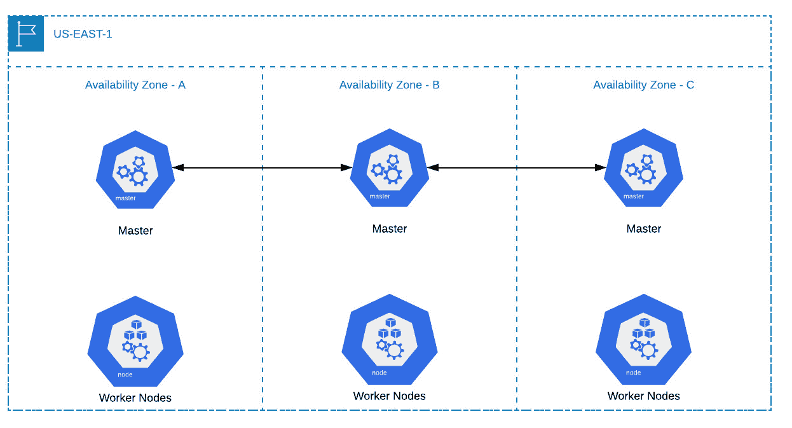

图 11.1:可用性区域中断前的集群

让我们假设可用性区域 C 完全中断，或者至少我们不再能够与其中运行的任何服务器通信。以下是集群现在的行为方式:

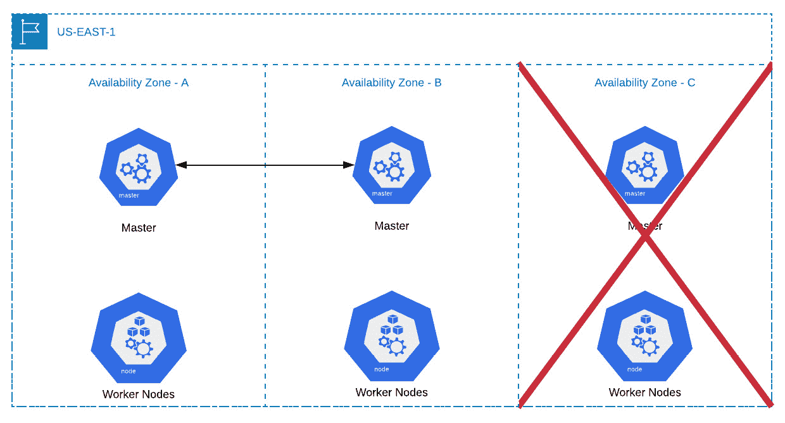

图 11.2:可用性区域中断后的集群

如图所示，Kubernetes 仍然可以执行。此外，如果在可用性区域 C 中运行的节点的丢失导致应用不再处于其期望的状态，这是由应用的 Kubernetes 清单决定的，则剩余的主节点将在剩余的工作节点上调度中断的工作负载。

注意

根据 Kubernetes 集群中工作节点的数量，您可能需要计划额外的资源限制，因为运行连接到多个工作节点的主节点需要大量的 CPU 功率。您可以使用此链接处的图表来确定您应该为控制集群而部署的主节点的资源需求:[https://kubernetes . io/docs/setup/best-practices/cluster-large/](https://kubernetes.io/docs/setup/best-practices/cluster-large/)

## 内部网络接口和集群域名系统

关于集群，您需要做出的下一个决定是容器本身如何跨每个节点进行通信。Kubernetes 本身有一个名为 **kubenet** 的容器网络接口，我们将在本章中用到。

对于较小的部署和简单的操作，从**容器网络接口** ( **CNI** )的角度来看，kubenet 远远超过了这些集群的需求。但是，它并不适用于所有工作负载和网络拓扑。因此，Kubernetes 为几种不同的中枢神经系统提供支持。当从高可用性的角度考虑容器网络接口时，您会想要尽可能高性能和稳定的选项。详细讨论 CNI 的每一个产品已经超出了介绍Kubernetes的范围。

注意

如果您计划使用托管的 Kubernetes 服务提供商，或者计划使用更复杂的网络拓扑结构，例如在一个 VPC 内部有多个子网，那么 Kubernetes 就不适合您。在这种情况下，您必须选择一个更高级的选项。有关为您的环境选择合适的 CNI 的更多信息，请点击这里:[https://chrislovecnm . com/kubernetes/CNI/choking-a-CNI-provider/](https://chrislovecnm.com/kubernetes/cni/choosing-a-cni-provider/)

## 容器运行时接口

您必须做出的最终决定之一是容器将如何在工作节点上运行。Kubernetes 的缺省值是 Docker 容器运行时接口，Kubernetes 最初是为了与 Docker 一起工作而构建的。然而，从那时起，已经开发了开放标准，并且其他容器运行时接口现在与 Kubernetes API 兼容。通常，集群操作员倾向于坚持使用 Docker，因为它已经非常成熟。即使您想探索替代方案，在设计能够为您的工作负载和 Kubernetes 保持高可用性的拓扑时，也要记住，您可能希望使用 Docker 等更成熟、更稳定的选项。

注意

您可以在此页面找到与 Kubernetes 兼容的其他一些容器运行时接口:[https://Kubernetes . io/docs/setup/production-environment/container-runtime/](https://kubernetes.io/docs/setup/production-environment/container-runtimes/)

## 容器存储接口

Kubernetes 的最新版本引入了与数据中心和云提供商(如存储阵列和 blob 存储)中可用的持久性工具进行交互的改进方法。最重要的改进是在 Kubernetes 中引入并标准化了用于管理`StorageClass`、`PersistentVolume`和`PersistentVolumeClaim`的容器存储接口。在存储方面，您需要考虑的高可用性集群对于每个应用来说更加具体。例如，如果您的应用使用必须位于可用性区域内的 Amazon EBS 卷，那么您必须确保您的工作节点中有适当的冗余，以便在发生中断时可以重新安排依赖于该卷的 Pod。更多关于 CSI 驱动和实现的信息可以在这里找到:[https://kubernetes-csi.github.io/docs/](https://kubernetes-csi.github.io/docs/)

# 构建以高可用性为重点的 Kubernetes 集群

希望通过阅读前面的部分，你开始意识到 Kubernetes 并没有你第一次接触这个话题时看起来那么神奇。它本身是一个非常强大的工具，但是当我们充分利用它在高可用性配置中运行的能力时，Kubernetes 确实会发光。因此，现在我们将看到如何实现它，并使用集群生命周期管理工具实际构建集群。但是在此之前，我们需要知道部署和管理 Kubernetes 集群的不同方法。

## 自我管理与供应商管理的 Kubernetes 解决方案

亚马逊网络服务、谷歌云平台、微软 Azure 和几乎所有其他主要的云服务提供商都有托管的 Kubernetes 产品。因此，当您决定如何构建和运行集群时，您应该考虑一些不同的托管提供商及其战略产品，看看它们是否符合您的业务需求和目标。例如，如果您使用亚马逊网络服务，那么亚马逊 EKS 可能是一个可行的解决方案。

选择托管服务提供商与选择开源和自我管理的解决方案之间存在权衡。例如，集群组装的大量艰苦工作是为您完成的，但是您丧失了对该过程的大量控制。因此，您需要决定您对能够控制 Kubernetes 主平面的重视程度，以及您是否希望能够选择您的容器网络接口或容器运行时接口。出于本教程的目的，我们将使用开源解决方案，因为它可以部署在任何地方，它还帮助我们了解 Kubernetes 是如何工作的，以及它应该如何配置。

注意

请确保您有一个 AWS 帐户，并且能够使用 AWS 命令行界面访问该帐户:[https://aws.amazon.com/cli](https://aws.amazon.com/cli)。

如果您无法访问它，请按照前面链接中的说明操作。

假设现在我们想要对集群有更多的控制，并且可以自己管理它，那么让我们来看看一些可以用来建立集群的开源工具。

## 肺

我们将使用一种更流行的开源安装工具来实现这一点，称为 **kops** ，代表 **Kubernetes Operations** 。它是一个完整的集群生命周期管理工具，并且有一个非常容易理解的应用编程接口。作为集群创建/更新过程的一部分，kops 可以生成 Terraform 配置文件，这样您就可以将基础架构升级过程作为自己管道的一部分来运行。它还有很好的工具来支持 Kubernetes 版本之间的升级路径。

注意

Terraform 是一个基础设施生命周期管理工具，我们将在下一章简要了解它。

kops 的一些缺点是，它往往落后于 Kubernetes 的大约两个版本，它并不总是能够像其他工具一样快速地响应漏洞公告，并且它目前仅限于在 AWS、GCP 和 OpenStack 中创建集群。

在本章中，我们决定使用 kop 进行集群生命周期管理的原因有四个:

*   我们想选择一个工具，在我们让您轻松进入集群管理时，它将抽象出 Kubernetes 设置中一些更令人困惑的部分。
*   它支持的云平台不仅仅是 AWS，所以如果你选择不被锁定，你也不必被锁定在亚马逊。
*   它支持对 Kubernetes 基础架构的广泛定制，例如选择 CNI 提供商、决定 VPC 网络拓扑和节点实例组定制。
*   它对零停机集群版本升级提供一流的支持，并自动处理升级过程。

## 其他常用工具

除了 kops，还有其他几个工具可以用来建立 Kubernetes 集群。你可以在这个链接找到完整的名单:[https://kubernetes.io/docs/setup/#production-environment](https://kubernetes.io/docs/setup/#production-environment)。

我们将在这里提到其中的几个，这样您就可以了解现有的产品:

*   **kubeadm**: This is generated from the Kubernetes source code and is the tool that will allow the greatest level of control over each component of Kubernetes. It can be deployed in any environment.

    使用 kubeadm 需要专家级别的 Kubernetes 知识才能有用。它让集群管理员几乎没有出错的空间，而且使用 kubeadm 升级集群也很复杂。

*   **Kubespray**: This uses Ansible/Vagrant-style configuration management, which is familiar to many IT professionals. It is better for environments where the infrastructure is more static rather than dynamic (such as the cloud). Kubespray is very composable and configurable from a tooling perspective. It also allows the deployment of a cluster on bare-metal servers. The key to watch out for here is coordinating software upgrades of cluster components and hardware and operating systems. Since you are providing much of the functionality a cloud provider does, you have to make sure your upgrade processes won't break the applications running on top of the cluster.

    因为 Kubespray 使用 Ansible 进行资源调配，所以您会受到 Ansible 在资源调配大型集群并保持其符合规范方面的潜在限制的限制。目前，Kubespray 仅限于以下环境:AWS、GCP、Azure、OpenStack、vSphere、Packet、Oracle 云基础架构或您自己的裸机安装。

## Kubernetes 中的认证和身份

Kubernetes 使用两个概念进行身份验证:ServiceAccounts 用于标识 Pods 内部运行的进程，User Accounts 用于标识人类用户。我们将在本章后面的主题中研究 ServiceAccounts，但是首先，让我们了解一下用户帐户。

从一开始，Kubernetes 就试图对用户帐户的任何形式的身份验证和身份保持不可思议的不可知论，因为大多数公司都有一种非常具体的用户身份验证方式。有些使用微软活动目录和 Kerberos，有些可能使用 Unix 密码和 UGW 权限集，有些可能使用云提供商或软件作为基于服务的 IAM 解决方案。此外，组织可以使用多种不同的身份验证策略。

因此，Kubernetes 没有内置的身份管理，也没有验证这些身份所需的单一方式。相反，它有一个身份验证“策略”的概念策略本质上是 Kubernetes 将身份验证委托给另一个系统或方法的一种方式。

在本章中，我们将使用 x509 基于证书的身份验证。X509 证书身份验证本质上利用了 Kubernetes 证书颁发机构和通用名称/组织名称。由于 Kubernetes RBAC 规则使用`usernames`和`group names`将认证身份映射到权限集，x509 `common names`成为 Kubernetes 的`usernames`，而`organization names`成为 Kubernetes 的`group names`。kops 会自动为您提供基于 x509 的身份验证证书，因此几乎不用担心；但是当涉及到添加您自己的用户时，您会希望意识到这一点。

注意

Kubernetes RBAC 代表基于角色的访问控制，它允许我们根据用户的角色允许或拒绝他们的某些访问。这将在*第 13 章*、*Kubernetes的运行时和网络安全*中进行更深入的介绍。

kops 的一个有趣特性是，您可以像使用 kubectl 管理集群资源一样，使用它来管理集群资源。kops 处理节点的方式类似于 Kubernetes 处理 Pod 的方式。正如 Kubernetes 有一个名为“Deployment”的资源来管理一堆 Pods 一样，kops 也有一个名为 **InstanceGroup** (也可以用它的简称`ig`)的资源来管理一堆节点。在 AWS 的情况下，kops 实例组有效地创建了 AWS EC2 自动缩放组。

扩展这个比较，`kops get instancegroups`或`kops get ig`类似于`kubectl get deployments`，`kops edit`的工作方式类似于`kubectl edit`。我们将在本章后面的活动中利用这一功能，但是首先，让我们在下面的练习中启动并运行基本的高可用性集群基础架构。

注意

在本章中，已经使用 Zsh shell 运行了这些命令。然而，它们与 Bash 完全兼容。

## 练习 11.01:设置我们的 Kubernetes 集群

注意

这项工作将超过通常在头 12 个月给予新账户持有人的免费 AWS 等级。EC2 的定价信息可以在这里找到:[https://aws.amazon.com/ec2/pricing/](https://aws.amazon.com/ec2/pricing/)

此外，您应该记住删除本章末尾的实例，以停止为您消耗的 AWS 资源计费。

在本练习中，我们将为在 AWS 上运行 Kubernetes 集群准备基础架构。AWS 的选择没有什么特别的；Kubernetes 是与平台无关的，尽管它已经拥有允许它代表集群运营商与本地 AWS 服务(EBS、EC2 和 IAM)集成的代码。Azure、GCP、IBM Cloud 和许多其他云平台也是如此。

我们将按照以下规格建立一个集群:

*   三个主节点
*   三个 etcd 节点(为了简单起见，我们将在主节点上运行这些节点)
*   两个工作节点
*   至少两个可用性区域

一旦我们设置好集群，我们将在下一个练习中在其上部署应用。现在按照以下步骤完成本练习:

1.  Ensure that you have installed kops as per the instructions in the *Preface*. Verify that kops is properly installed and configured using the following command:

    ```
    kops version
    ```

    您应该会看到以下响应:

    ```
    Version 1.15.0 (git-9992b4055)
    ```

    现在，在我们继续下面的步骤之前，我们需要在 AWS 中进行一些设置。以下大多数设置都是可配置的，但为了方便起见，我们将为您做一些决定。

2.  First, we will set up an AWS IAM user that kops will use to provision your infrastructure. Run the following commands one after the other in your terminal:

    ```
    aws iam create-group --group-name kops
    aws iam attach-group-policy --policy-arn arn:aws:iam::aws:policy/AmazonEC2FullAccess --group-name kops
    aws iam attach-group-policy --policy-arn arn:aws:iam::aws:policy/AmazonRoute53FullAccess --group-name kops
    aws iam attach-group-policy --policy-arn arn:aws:iam::aws:policy/AmazonS3FullAccess --group-name kops
    aws iam attach-group-policy --policy-arn arn:aws:iam::aws:policy/IAMFullAccess --group-name kops
    aws iam attach-group-policy --policy-arn arn:aws:iam::aws:policy/AmazonVPCFullAccess --group-name kops
    aws iam create-user --user-name kops
    aws iam add-user-to-group --user-name kops --group-name kops
    aws iam create-access-key --user-name kops
    ```

    您应该会看到类似如下的输出:

    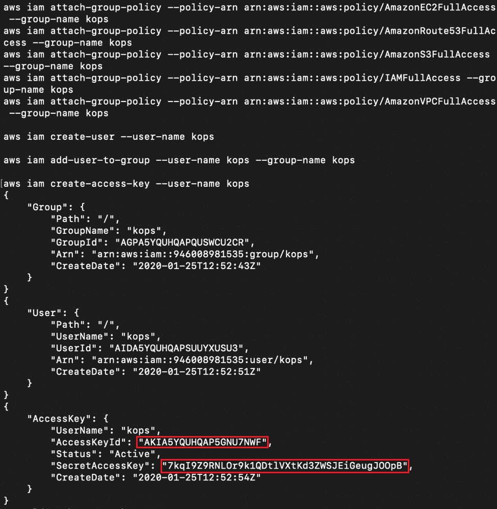

    图 11.3:为 kops 设置 IAM 用户

    请注意您将在输出中收到的高亮显示的`AccessKeyID`和`SecretAccessKey`字段。这是敏感信息，前面截图中的密钥当然会被作者作废。我们下一步需要突出显示的信息。

3.  接下来，我们需要导出为 kop 创建的凭据，作为终端会话的环境变量。使用上一步截图中突出显示的信息:

    ```
    export AWS_ACCESS_KEY_ID=<AccessKeyId>
    export AWS_SECRET_ACCESS_KEY=<SecretAccessKey>
    ```

4.  Next, we need to create an S3 bucket for kops to store its state. To create a random bucket name, run the following command:

    ```
    export BUCKET_NAME="kops-$(LC_ALL=C tr -dc 'a-z0-9' </dev/urandom | head -c 13 ; echo)" && echo $BUCKET_NAME
    ```

    第二个命令输出创建的 S3 存储桶的名称，您应该会看到类似如下的响应:

    ```
    kops-aptjv0e9o2wet
    ```

5.  Run the following command to create the required bucket using the AWS CLI:

    ```
    aws s3 mb s3://$BUCKET_NAME --region us-west-2
    ```

    这里，我们使用的是`us-west-2`区域。如果你愿意，你可以使用离你更近的区域。对于成功的存储桶创建，您应该会看到以下响应:

    ```
    make_bucket: kops-aptjv0e9o2wet
    ```

    现在我们有了 S3 桶，我们可以开始设置集群了。我们可以选择很多选项，但现在我们将使用默认值。

6.  导出集群的名称和 kops 用来存储其状态的 S3 桶:

    ```
    export NAME=myfirstcluster.k8s.local
    export KOPS_STATE_STORE=s3://$BUCKET_NAME
    ```

7.  Generate all the config and store it in the S3 bucket from earlier to create a Kubernetes cluster using the following command:

    ```
    kops create cluster --zones us-west-2a,us-west-2b,us-west-2c --master-count=3 --kubernetes-version=1.15.0 --name $NAME
    ```

    通过传递`--zones`参数，我们指定了希望集群跨越的可用性区域，通过指定`master-count=3`参数，我们实际上是在说我们希望使用高可用性的 Kubernetes 集群。默认情况下，kop 将创建两个工作节点。

    请注意，这实际上并没有创建集群，但它创建了一组飞行前检查，因此我们可以立即创建一个集群。它告诉我们，为了访问我们的 AWS 实例，我们需要提供一个公钥——默认的搜索位置是`~/.ssh/id_rsa.pub`。

8.  Now, we need to create an SSH key to be added to all of the master and worker nodes so we can log in to them with SSH. Use the following command:

    ```
    kops create secret --name myfirstcluster.k8s.local sshpublickey admin -i ~/.ssh/id_rsa.pub
    ```

    秘密的类型(`sshpublickey`)是为该操作保留给 kops 的特殊关键字。更多信息可在以下链接中找到:[https://github . com/kubernetes/kops/blob/master/docs/CLI/kops _ create _ secret _ sspublikey . MD](https://github.com/kubernetes/kops/blob/master/docs/cli/kops_create_secret_sshpublickey.md)。

    注意

    这里在`~/.ssh/id_rsa.pub`指定的密钥将是 kops 将要分发给所有主节点和工作节点的密钥，并且可以用于从本地计算机到运行服务器的 SSH，用于诊断或维护目的。

    您可以使用以下命令使用密钥以管理员帐户登录:

    ```
    ssh -i ~/.ssh/id_rsa admin@<public_ip_of_instance>
    ```

    虽然本练习不要求这样做，但您会发现这对后面的章节很有用。

9.  To view our configuration, let's run the following command:

    ```
    kops edit cluster $NAME
    ```

    这将打开您的文本编辑器，其中包含我们集群的定义，如下所示:

    

    图 11.4:检查我们集群的定义

    为了简洁起见，我们截取了这个截图。此时，您可以进行任何编辑，但是，对于本练习，我们将继续进行，不做任何更改。为了简洁起见，我们将把这个规范的描述排除在这个研讨会的范围之外。如果你想了解 kops`clusterSpec`中各种元素的更多细节，可以在这里找到更多细节:[https://github . com/kubernetes/kops/blob/master/docs/cluster _ spec . MD](https://github.com/kubernetes/kops/blob/master/docs/cluster_spec.md)。

10.  Now, take the configuration we generated and stored in S3 and actually run commands to reconcile the AWS infrastructure with what we said we wanted it to be in our config files:

    ```
    kops update cluster $NAME --yes
    ```

    注意

    默认情况下，kops 中的所有命令都是模拟运行的(除了一些验证步骤之外，实际上不会发生任何事情)，除非您指定`--yes`标志。这是一种保护措施，因此您不会在生产中意外做一些对集群有害的事情。

    这将需要很长时间，但完成后，我们将有一个工作正常的 Kubernetes HA 集群。您应该会看到以下响应:

    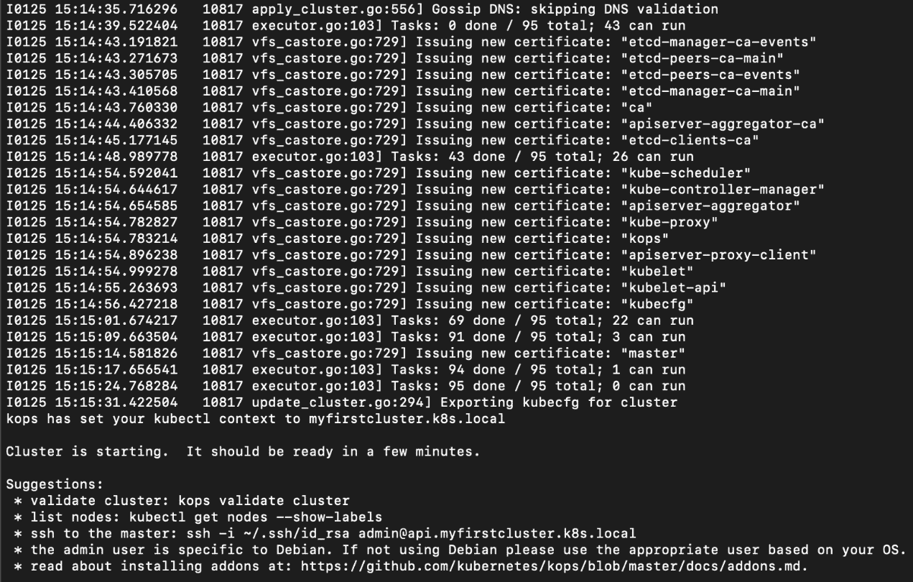

    图 11.5:更新集群以匹配生成的定义

11.  To validate that our cluster is running, let's run the following command. This may take up to 5-10 minutes to fully work:

    ```
    kops validate cluster
    ```

    您应该会看到以下响应:

    

图 11.6:验证我们的集群

从这个截图中，我们可以看到我们有三个 Kubernetes 主节点在独立的可用性区域中运行，两个工作节点分布在三个可用性区域中的两个区域中(使这成为一个高可用性集群)。此外，所有节点和集群看起来都是健康的。

注意

请记住，您的群集资源仍在运行。如果您计划在相当长的时间后继续下一个练习，您可能希望删除此群集以停止对 AWS 资源的计费。要删除此群集，您可以使用以下命令:

`kops delete cluster --name ${NAME} --yes`

## 不变服务账户

正如我们之前了解到的，一个 Kubernetes ServiceAccount 对象充当了 Pod 内部进程的标识标记。虽然 Kubernetes 不管理和验证人类用户的身份，但它管理和验证 ServiceAccount 对象。然后，类似于用户，您可以允许基于角色访问 ServiceAccount 的 Kubernetes 资源。

ServiceAccount 是一种使用 **JSON Web Token** ( **JWT** )风格的基于头部的身份验证向集群进行身份验证的方式。每个服务帐户都与存储在一个秘密中的令牌配对，该秘密由 Kubernetes API 创建，然后装载到与该服务帐户关联的 Pod 中。每当 Pod 中的任何进程需要发出一个应用编程接口请求时，它都会将令牌连同它一起传递给应用编程接口服务器，而 Kubernetes 会将该请求映射到 ServiceAccount。基于这个身份，Kubernetes 可以确定一个进程应该被授予的对资源/对象的访问级别(授权)。通常，服务帐户会提供给集群内的 Pods，因为它们仅用于内部使用。ServiceAccount 是一个 Kubernetes 命名空间范围的对象。

服务帐户的示例规范如下所示:

```
apiVersion: v1
kind: ServiceAccount
metadata:
  name: admin-user
  namespace: kube-system
```

我们将在下一个练习中使用这个例子。您可以将此服务帐户附加到对象，方法是将此字段包含在对象的定义中，例如 Kubernetes 部署:

```
serviceAccountName: admin-user
```

如果创建 Kubernetes 对象时没有指定服务帐户，它将使用`default`服务帐户创建。Kubernetes 为每个名称空间创建一个`default`服务帐户。

在下面的练习中，我们将在集群上部署 Kubernetes 仪表板。Kubernetes 仪表板可以说是在任何 Kubernetes 集群中运行的最有用的工具之一。这对于调试在 Kubernetes 中配置工作负载的问题非常有用。

注意

你可以在这里找到更多关于它的信息:[https://kubernetes . io/docs/tasks/access-application-cluster/web-ui-dashboard/](https://kubernetes.io/docs/tasks/access-application-cluster/web-ui-dashboard/)。

## 练习 11.02:在我们的高可用性集群上部署应用

在本练习中，我们将使用上一练习中部署的相同集群，并部署 Kubernetes Dashboard。如果您已经删除了群集资源，请重新运行前面的练习。kops 将自动在您的本地 Kube 配置文件(在`~/.kube/config`找到)中添加连接到集群所需的信息，并将该集群设置为默认上下文。

由于 Kubernetes 仪表板是一个帮助我们执行管理任务的应用，因此`default` ServiceAccount 没有足够的权限。在本练习中，我们将创建一个具有丰富权限的新服务帐户:

1.  To begin with, we will apply the Kubernetes Dashboard manifest sourced directly from the official Kubernetes repository. This manifest defines all the objects that we will need for our application. Run the following command:

    ```
    kubectl apply -f https://raw.githubusercontent.com/kubernetes/dashboard/v2.0.0-beta1/aio/deploy/recommended.yaml
    ```

    您应该会看到以下响应:

    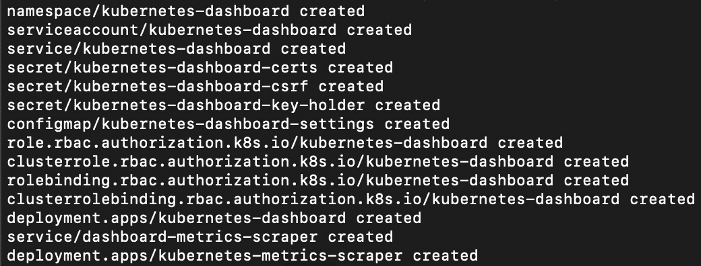

    图 11.7:为 Kubernetes 仪表板应用清单

2.  Next, we need to configure a ServiceAccount to access the dashboard. To do this, create a file called `sa.yaml` with the following content:

    ```
    apiVersion: v1
    kind: ServiceAccount
    metadata:
      name: admin-user
      namespace: kube-system
    ---
    apiVersion: rbac.authorization.k8s.io/v1
    kind: ClusterRoleBinding
    metadata:
      name: admin-user
    roleRef:
      apiGroup: rbac.authorization.k8s.io
      kind: ClusterRole
      name: cluster-admin
    subjects:
    - kind: ServiceAccount
      name: admin-user
      namespace: kube-system
    ```

    注意

    我们给予该用户非常自由的权限，因此请谨慎对待访问令牌。集群角色和集群角色绑定对象是 RBAC 策略的一部分，在*第 13 章*、*运行时和Kubernetes的网络安全*中有所涉及。

3.  Next, run the following command:

    ```
    kubectl apply -f sa.yaml
    ```

    您应该会看到以下回应:

    ```
    serviceaccount/admin-user created
    clusterrolebinding.rbac.authorization.k8s.io/admin-user created
    ```

4.  Now, let's confirm the ServiceAccount details by running the following command:

    ```
    kubectl describe serviceaccount -n kube-system admin-user
    ```

    您应该会看到以下响应:

    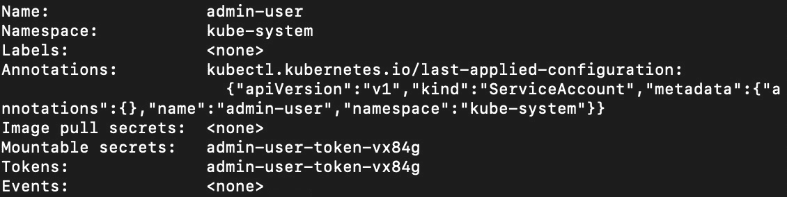

    图 11.8:检查我们的服务帐户

    当您在 Kubernetes 中创建一个 ServiceAccount 时，它还会在同一个名称空间中创建一个 Secret，其中包含对 API 服务器进行 API 调用所需的 JWT 的内容。从上一张截图中我们可以看到，这种情况下的秘密被命名为`admin-user-token-vx84g`。

5.  Let's examine the `secret` object:

    ```
    kubectl get secret -n kube-system -o yaml admin-user-token-vx84g
    ```

    您应该会看到以下输出:

    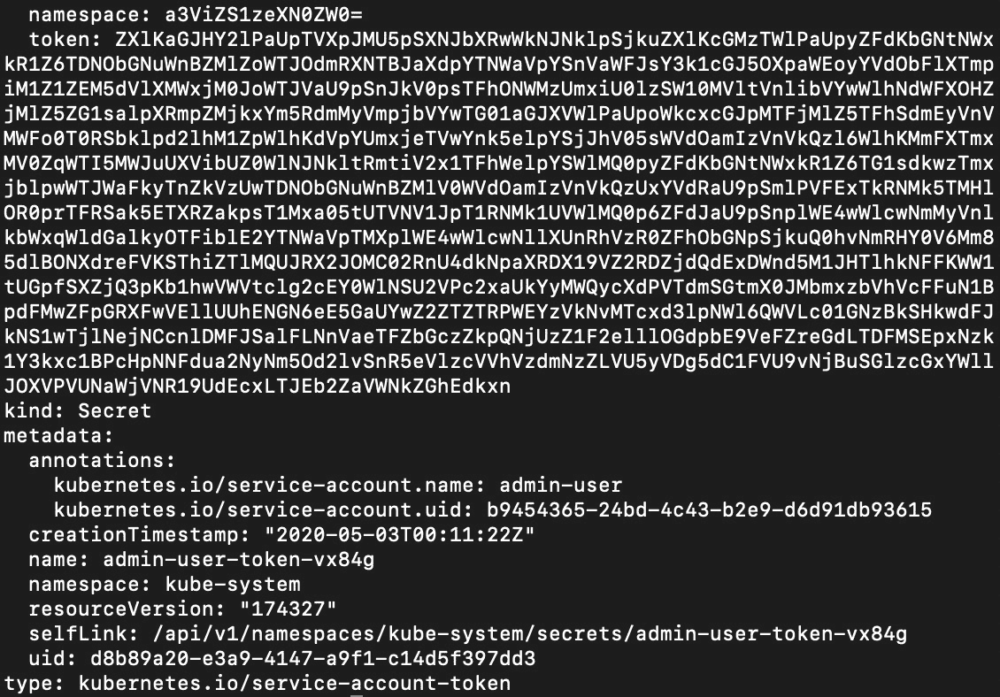

    图 11.9:检查我们服务帐户中的令牌

    这是输出的截屏。如我们所见，这个秘密里有一个记号。请注意，这是 Base64 编码的，我们将在下一步中解码。

6.  Now we need the content of the token for the account Kubernetes just created for us, so let's use this command:

    ```
    kubectl -n kube-system get secret $(kubectl -n kube-system get secret | grep admin-user | awk '{print $1}') -o jsonpath='{.data.token}' | base64 --decode
    ```

    让我们分解这个命令。这个命令得到了名为`admin-user`的秘密，因为我们用这个名字创建了一个 ServiceAccount。当在 Kubernetes 中创建一个 ServiceAccount 时，它会将一个名为相同的秘密与我们用来向集群进行身份验证的令牌放在一起。该命令的其余部分是语法糖，用于以一种有用的形式解码结果，以便复制并粘贴到仪表板中。您应该会得到如下截图所示的输出:

    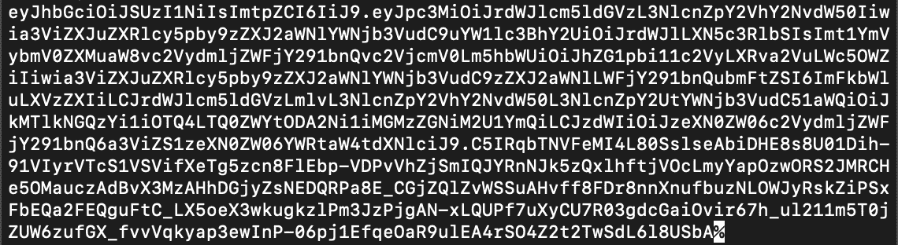

    图 11.10:获取与管理员用户服务帐户相关联的令牌内容

    复制您收到的输出，同时注意不要复制输出末尾的`$`或`%`符号(分别在 Bash 或 Zsh 中看到)。

7.  By default, Kubernetes Dashboard is not exposed to the public internet outside our cluster. So, in order to access it with our browser, we need a way to allow our browser to communicate with Pods inside the Kubernetes container network. One useful way is to use the proxy built into `kubectl`:

    ```
    kubectl proxy
    ```

    您应该会看到以下回应:

    ```
    Starting to serve on 127.0.0.1:8001
    ```

8.  Open your browser and navigate to the following URL:

    ```
    http://localhost:8001/api/v1/namespaces/kubernetes-dashboard/services/https:kubernetes-dashboard:/proxy/
    ```

    您应该会看到以下提示:

    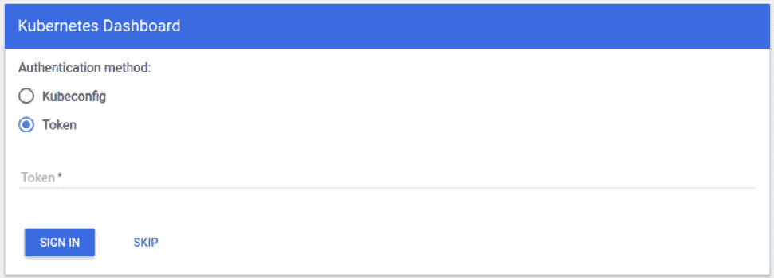

图 11.11:输入令牌以登录 Kubernetes 仪表板

粘贴从*步骤 4* 复制的令牌，然后点击`SIGN IN`按钮。

成功登录后，您应该会看到仪表板，如下图所示:

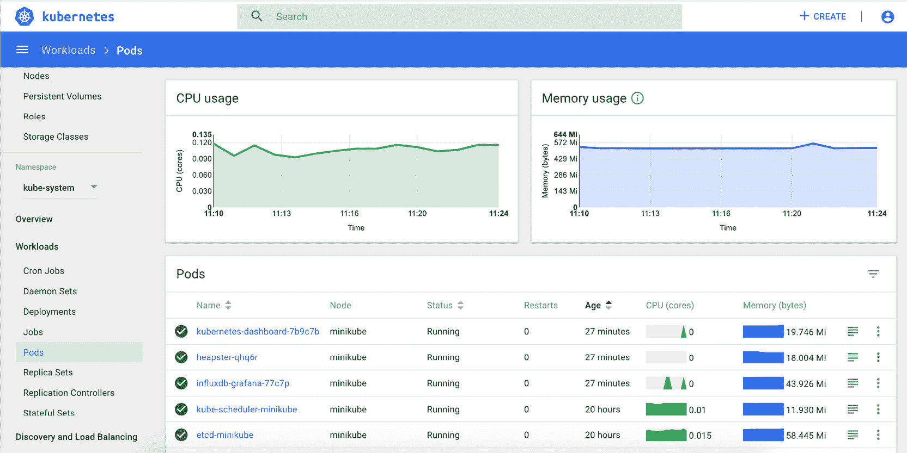

图 11.12:固定仪表板登录页

在本练习中，我们将 Kubernetes Dashboard 部署到集群中，以允许您从方便的图形用户界面管理应用。在部署这个应用的过程中，我们看到了如何为集群创建服务帐户。

在本章中，您已经学习了如何使用 kops 创建云基础架构，以形成高可用性的 Kubernetes 集群。然后，我们部署了 Kubernetes 仪表板，并在此过程中了解了 ServiceAccounts。现在，您已经看到了创建一个集群并在其上运行一个应用所需的步骤，我们将创建另一个集群，并在下面的活动中看到它的弹性。

## 活动 11。 01:测试高可用性集群的恢复能力

在本练习中，我们将测试我们自己创建的 Kubernetes 集群的弹性。以下是继续本活动的一些指导原则:

1.  Deploy Kubernetes Dashboard. But this time, set the replica count of the deployment running the application to something higher than `1`.

    Kubernetes Dashboard 应用运行在由名为`kubernetes-dashboard`的部署管理的 Pods 上，该部署运行在名为`kubernetes-dashboard`的命名空间中。这是您需要操作的部署。

2.  现在，开始从 AWS 控制台关闭各种节点以删除节点，删除 Pods，并尽可能使底层系统不稳定。
3.  After each attempt you make to take down the cluster, refresh the Kubernetes console if the console is still accessible. So long as you get any response from the application, this means that the cluster and our application (in this case, Kubernetes Dashboard) is still online. As long as the application is online, you should be able to access the Kubernetes Dashboard as shown in the following screenshot:

    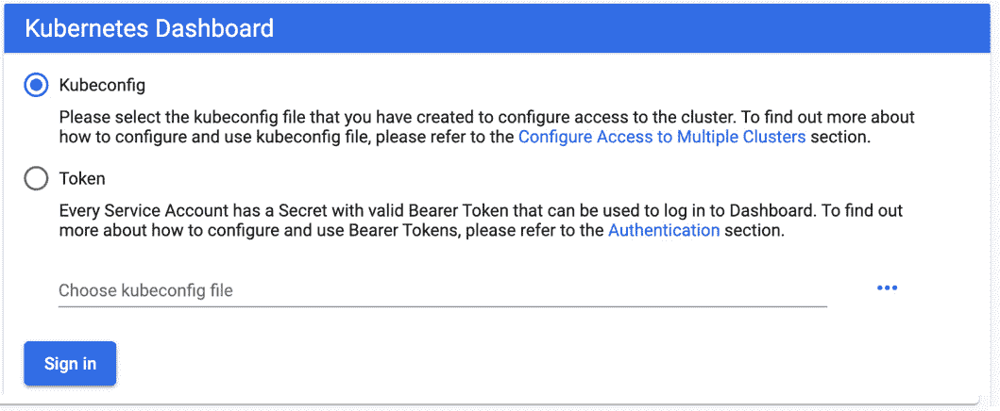

    图 11.13:输入令牌的 Kubernetes 仪表板提示

    此屏幕截图仅显示了您需要输入令牌的提示，但它足以表明我们的应用处于在线状态。如果您的请求超时，这意味着我们的集群不再运行。

4.  Join another node to this cluster.

    为此，您需要找到并编辑管理节点的实例组资源。规范包含`maxSize`和`minSize`字段，您可以操作它们来控制节点的数量。当您更新集群以匹配修改后的规范时，您应该能够看到三个节点，如下图所示:

    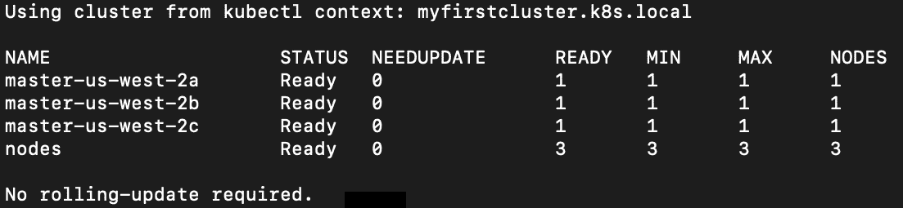

图 11.14:集群中主节点和工作节点的数量

注意

该活动的解决方案可在以下地址找到:[https://packt.live/304PEoD](https://packt.live/304PEoD)。完成活动后，请确保已删除集群。有关如何删除集群的更多详细信息，请参见下一节(*删除我们的集群*)。

## 删除我们的集群

完成本章中的所有练习和活动后，您应该运行以下命令来删除集群:

```
kops delete cluster --name ${NAME} --yes
```

您应该会看到以下回应:

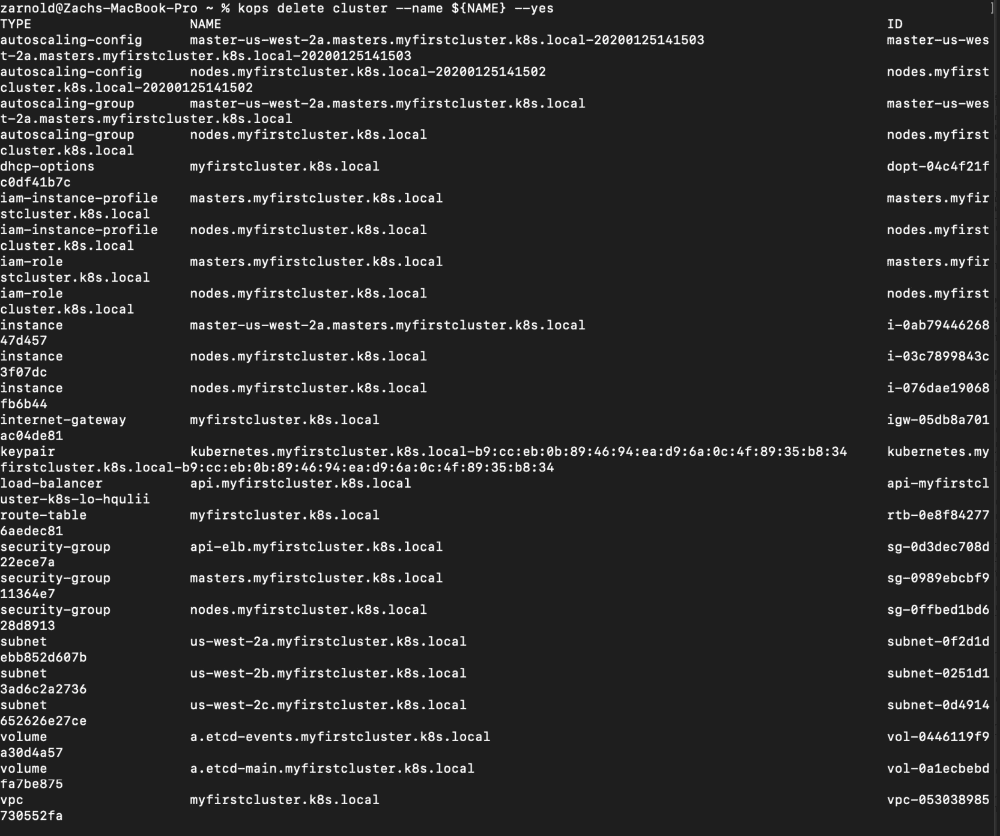

图 11.15:删除我们的集群

在这一点上，您不应该再从 AWS 收取您在本章中构建的 Kubernetes 基础设施的费用。

# 总结

高可用性基础架构是实现应用高可用性的关键组件之一。Kubernetes 是一个设计非常好的工具，具有许多内置的弹性功能，使其能够承受主要的网络和计算事件。它可以防止这些事件影响您的应用。在我们探索高可用性系统的过程中，我们研究了 Kubernetes 的一些组件，以及它们如何协同工作来实现高可用性。然后，我们在 AWS 上构建了一个自己的集群，该集群被设计为使用 kops 集群生命周期管理工具高度可用。

在下一章中，我们将了解如何通过利用 Kubernetes 原语来确保高可用性，从而使我们的应用更具弹性。