# 十二、您的应用和高可用性

概观

在本章中，我们将通过使用 Terraform 和 Amazon **弹性 Kubernetes 服务** ( **EKS** )来探索 Kubernetes 集群生命周期管理。我们还将部署一个应用，并学习一些原则，使应用更适合 Kubernetes 环境。

本章将引导您使用 Terraform 创建一个功能齐全、高度可用的 Kubernetes 环境。您将向集群部署一个应用，并修改其功能，使其适合高可用性环境。我们还将学习如何通过使用 Kubernetes 入口资源将流量从互联网传输到集群中运行的应用。

# 简介

在前一章中，我们在云环境中设置了第一个多节点 Kubernetes 集群。在本节中，我们将讨论如何为我们的应用操作 Kubernetes 集群——也就是说，我们将使用集群来运行一个容器化的应用，而不是仪表板。

由于 Kubernetes 的用途是集群操作符所能想象的，因此 Kubernetes 没有两个用例是相同的。因此，我们将对我们要为其操作集群的应用类型做一些假设。我们将优化工作流，以部署一个无状态 web 应用，该应用具有有状态后端，在基于云的环境中具有高可用性要求。这样做，我们有望覆盖人们通常使用 Kubernetes 集群的大部分内容。

Kubernetes 几乎可以用于任何事情。即使我们介绍的内容与您的 Kubernetes 用例不完全匹配，也值得研究，因为这一点很重要。我们在本章中要做的仅仅是运行一个示例工作流，在云中的 Kubernetes 上运行一个 web 应用。一旦您学习了我们将在本章中用于运行示例工作流的原则，您就可以在互联网上查找许多其他资源，这些资源可以帮助您发现使用 Kubernetes 优化工作流的其他方法，如果这不适合您的用例的话。

但是，在我们继续确保将在集群上运行的应用的高可用性之前，让我们后退一步，考虑一下您的云基础架构的高可用性要求。为了在应用级别保持高可用性，我们在管理基础架构时也必须牢记同样的目标。这就引出了关于基础设施生命周期管理的讨论。

# 基础设施生命周期管理概述

简而言之，基础架构生命周期管理是指我们如何在服务器使用寿命的每个阶段对其进行管理。这包括配置、维护和停用物理硬件或云资源。由于我们正在利用云基础架构，我们应该利用基础架构生命周期管理工具以编程方式调配和取消调配资源。为了理解为什么这很重要，让我们考虑下面的例子。

想象一下，您是一名系统管理员、DevOps 工程师、站点可靠性工程师，或者是任何其他需要您为一家数字新闻行业公司处理服务器基础架构的角色。这意味着为这家公司工作的人的主要输出是他们在网站上发布的信息。现在，假设整个网站运行在贵公司服务器机房的一台服务器上。服务器上运行的应用是一个带有 MySQL 后端的 PHP 博客站点。有一天，一篇文章在网上疯传，突然间你处理的流量比前一天要高出一个指数级。你是做什么的？网站不断崩溃(如果加载的话)，当你试图找出解决方案时，你的公司正在亏损。

您的解决方案是开始分离关注点并隔离单点故障。你要做的第一件事是购买更多的硬件，并开始配置它，希望能横向扩展网站。这样做之后，您将运行五个服务器，其中一个运行 HAProxy，这是对运行在三个服务器和一个数据库服务器上的 PHP 应用的连接进行负载平衡。好了，现在你认为你已经控制住了。然而，并不是所有的服务器硬件都是相同的——它们运行不同的 Linux 发行版，每台机器的资源要求不同，并且单独修补、升级和维护每台服务器变得困难。好吧，幸运的是，另一篇文章在网上疯传，突然你遇到了比当前硬件能处理的请求多五倍的请求。你现在做什么？继续横向扩展？但是，您只是一个人，因此您在配置下一组服务器时肯定会出错。由于这个错误，你以新的令人兴奋的方式破坏了网站，没有一个管理层对此感到高兴。你读这篇文章和我写这篇文章时一样有压力吗？

正是因为错误的配置，工程师们开始利用用源代码编写的工具和配置来定义他们的拓扑。这样，如果需要基础结构状态中的一个突变，它可以被跟踪、控制，并以一种使代码负责解决您声明的基础结构状态和它在现实中观察到的差异的方式推出。

基础设施只和围绕它的生命周期管理工具以及运行在它上面的应用一样好。这意味着，如果您的集群构建良好，但是没有工具可以在该集群上成功更新您的应用，那么它就不能很好地为您服务。在本章中，我们将从应用的角度来看如何利用持续集成构建管道，以零停机、云原生的方式向我们的应用推出新的更新。

在本章中，我们将提供一个测试应用供您管理。我们还将使用名为 **Terraform** 的基础设施生命周期管理工具，以便更有效地管理 Kubernetes 云基础设施的部署。本章将帮助您开发一个有效的技能集，使您能够在 Kubernetes 的自己的环境中非常快速地开始创建自己的应用交付管道。

# 地形

在最后一章中，我们使用 **kops** 从头开始创建一个 Kubernetes 集群。然而，这个过程可能被视为繁琐且难以复制，这很可能会造成错误配置，从而导致应用运行时出现意外事件。幸运的是，对于运行在**亚马逊网络服务** ( **AWS** )以及其他几个云平台，如 Azure、**谷歌云平台** ( **GCP** )上的 Kubernetes 集群，有一个非常强大的社区支持工具可以很好地解决这个问题。

Terraform 是一个通用的基础设施生命周期管理工具；也就是说，Terraform 可以管理通过代码定义的基础设施的状态。Terraform 最初创建时的目标是创建一种语言( **HashiCorp 配置语言** ( **HCL** ))和运行时，它们可以以可重复的方式创建基础架构，并以我们控制应用源代码更改的相同方式控制对该基础架构的更改——通过拉取请求、审查和版本控制。Terraform 已经有了很大的发展，现在它是一个通用的配置管理工具。在本章中，我们将使用其最经典意义上的基础设施生命周期管理的原始功能。

Terraform 文件是用一种叫做 HCL 的语言编写的。HCL 看起来很像 YAML 和 JSON，但有一些不同。例如，HCL 支持在其文件中插入对其他资源的引用，并且能够确定需要创建资源的顺序，以确保依赖于创建其他资源的资源不会以错误的顺序创建。地形文件有`.tf`文件扩展名。

您可以将 Terraform 文件视为以类似的方式指定整个基础架构的所需状态，例如，Kubernetes YAML 文件将指定部署的所需状态。这允许对整个基础设施进行声明式管理。因此，我们得出了将**基础设施管理为代码** ( **IaC** )的想法。

地形分两个阶段进行——**计划**和**应用**。这是为了确保您有机会在进行基础架构更改之前对其进行审查。Terraform 假设它独自负责基础设施的所有状态变化。因此，如果您使用 Terraform 来管理您的基础架构，那么通过任何其他方式(例如，通过 AWS 控制台添加资源)来更改基础架构都是不可取的。这是因为如果您进行了更改，并且没有确保它在 Terraform 文件中得到更新，那么下次应用 Terraform 文件时，它将删除您的一次性更改。这次它不是一个 bug，而是一个特性。这样做的原因是，当您将基础架构作为代码来跟踪时，可以使用自动化工具(如 CI/CD 管道)来跟踪、审查和管理每一个变更。因此，如果你的系统状态偏离了写下的内容，那么 Terraform 将负责协调你观察到的基础设施和你写下的内容。

在本章中，我们将向您介绍 Terraform，因为它在行业中非常常用，是一种以代码形式管理基础架构的便捷方式。然而，我们不会为了让我们的讨论集中在 Kubernetes 上而深入到用 Terraform 创建每一个 AWS 资源。我们将进行快速演示，以确保您了解一些基本原则。

注意

您可以在本书中了解更多关于将 Terraform 用于 AWS 的信息:[https://www . packtpub . com/networking-and-servers/入门-Terraform-第二版](https://www.packtpub.com/networking-and-servers/getting-started-terraform-second-edition )

## 练习 12.01:使用地形创建 S3 水桶

在本练习中，我们将实现一些您在使用 Terraform 时将使用的常见命令，并向您介绍一个 Terraform 文件，该文件将作为代码定义我们的基础架构

注意

Terraform 将代表我们在 AWS 中创建资源，这将花费您的金钱。

1.  首先，让我们创建一个目录，我们将在其中进行地形更改，然后我们将导航到该目录:

    ```
    mkdir -p ~/Desktop/eks_terraform_demo
    cd Desktop/eks_terraform_demo/
    ```

2.  Now, we're going to make our first Terraform file. Terraform files have a `.tf` file extension. Create a file named `main.tf` (there is no significance to the word `main`, unlike some other languages) with the following content:

    ```
    resource "aws_s3_bucket" "my_bucket" {
      bucket = "<<NAME>>-test-bucket"
      acl    = "private"
    }
    ```

    该块有一个名为`aws_s3_bucket`的定义，这意味着它将创建一个名为`bucket`字段中指定的名称的亚马逊 S3 桶。`acl="private"`线表示我们不允许公众进入这个桶。一定要用自己独特的名字替换`<<NAME>>`。

3.  To get started with Terraform, we need to initialize it. So, let's do that with the following command:

    ```
    terraform init
    ```

    您应该会看到以下响应:

    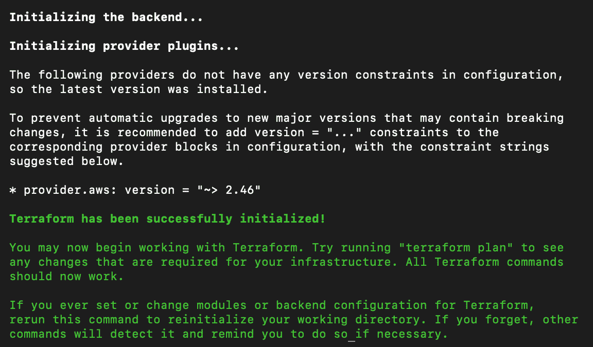

    图 12.1:初始化地形

4.  Run the following command to have Terraform determine a plan to create resources defined by the `main.tf` file that we created earlier:

    ```
    terraform plan
    ```

    系统将提示您输入自动气象站区域。用离你最近的那个。在下面的截图中，我们使用的是`us-west-2`:

    

    图 12.2:计算创建 S3 存储桶所需的集群资源更改

    因此，我们可以看到 Terraform 已经使用我们在前一章的*练习 11.01，设置我们的 Kubernetes 集群*中设置的访问键访问了我们的 AWS 帐户，并计算了它需要做什么才能使我们的 AWS 环境看起来像我们在 Terraform 文件中定义的那样。正如我们在截图中看到的，它计划为我们添加一个 S3 桶，这正是我们想要的。

    注意

    Terraform 将尝试应用当前工作目录中所有扩展名为`.tf`的文件。

    在前面的截图中，我们可以看到`terraform`命令表示我们没有指定一个`-out`参数，所以它不能保证应用精确的计算计划。这是因为您的 AWS 基础架构中的某些东西可能已经从计划时改变为应用时。假设你今天计算了一个计划。然后，稍后，您添加或删除一些资源。因此，实现给定状态所需的修改会有所不同。因此，除非您指定`-out`参数，否则 Terraform 将在应用之前重新计算其计划。

5.  Run the following command to apply the configuration and create the resources specified in our Terraform file:

    ```
    terraform apply
    ```

    Terraform 将再给我们一次机会，让我们在为我们更改 AWS 资源之前审查计划并决定我们想要做什么:

    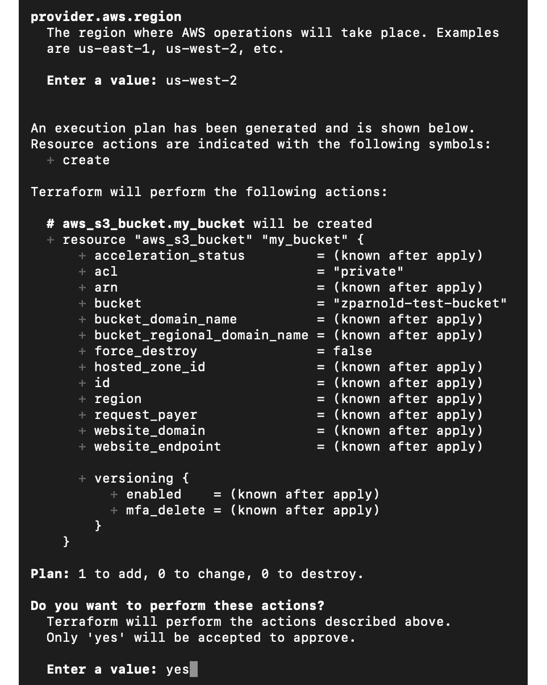

    图 12.3:创建 S3 桶的更改计算和确认提示

    如前所述，即使我们使用`apply`命令，Terraform 也会计算所需的更改。确认地形显示的动作，然后进入`yes`继续显示的计划。现在，Terraform 为我们制作了一个 S3 水桶:

    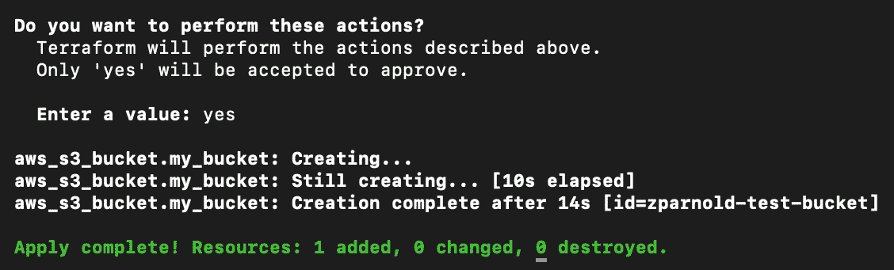

    图 12.4:确认后创建 S3 桶

6.  Now, we're going to destroy all the resources that we created to clean up before we move on to the next exercise. To destroy them, run the following command:

    ```
    terraform destroy
    ```

    同样，要确认此操作，您必须明确允许 Terraform 在出现提示时通过输入`yes`来销毁您的资源，如下图所示:

    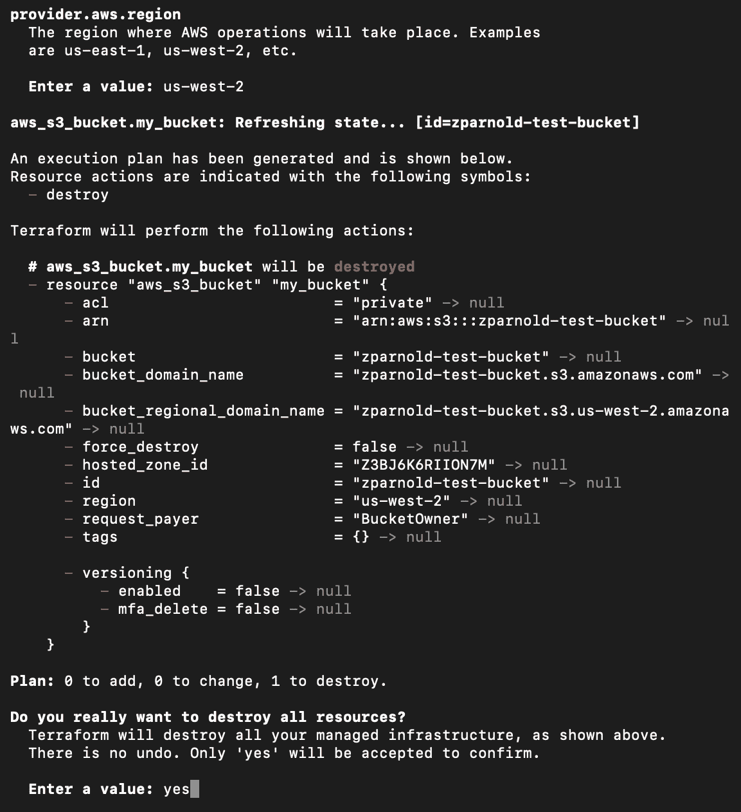

图 12.5:破坏使用地形创建的资源

在本练习中，我们演示了如何使用 Terraform 创建单个资源(S3 桶)，以及如何销毁桶。这应该让您熟悉 Terraform 的简单工具，我们现在将进一步扩展这些概念。

现在，让我们用 Terraform 创建一个 Kubernetes 集群。上次，我们构建并管理了自己的集群控制平面。由于几乎每个云提供商都向其客户提供这项服务，我们将利用亚马逊**弹性 Kubernetes 服务** ( **EKS** )，这是一项由 AWS 为 Kubernetes 提供的**托管服务**。

当我们使用托管 Kubernetes 服务时，云服务供应商会处理以下问题:

*   管理和保护 etcd
*   管理和保护用户身份验证
*   管理控制平面组件，如控制器管理器、调度器和应用编程接口服务器
*   在网络中的 Pods 之间配置运行的 CNI

控制平面通过绑定到 VPC 的弹性网络接口暴露给节点。您仍然需要管理工作节点，它们在您的帐户中作为 EC2 实例运行。因此，使用托管服务可以让您专注于使用 Kubernetes 完成的工作，但缺点是不能对控制平面进行非常精细的控制。

注意

由于 AWS 为集群处理用户身份验证，我们将不得不使用 AWS IAM 凭据来访问我们的 Kubernetes 集群。我们可以利用机器上的 AWS IAM 验证器二进制来实现这一点。在接下来的章节中会有更多关于这方面的内容。

## 练习 12.02:使用地形创建 EKS 集群

在本练习中，我们将使用已经提供的`main.tf`文件来创建一个生产就绪、高可用性的 Kubernetes 集群。

注意

该 Terraform 文件改编自[https://github . com/Terra form-AWS-modules/Terra form-AWS-eks/tree/master/examples](https://github.com/terraform-aws-modules/terraform-aws-eks/tree/master/examples)上的示例。

这将使 Terraform 能够创建以下内容:

*   一个有 IP 地址空间的 VPC`10.0.0.0/16`。它将有三个公共子网，每个子网有相当于`255`的 IP 地址。
*   路由表和互联网网关使 VPC 正常工作。
*   控制平面的安全组，用于与节点通信，以及在允许和要求的端口上接收来自外部世界的流量。
*   EKS 控制平面(代表您执行创建服务的 **ELB** ( **弹性负载平衡器**)等任务)和节点(处理与 EC2 应用编程接口相关的问题)的 IAM 角色。
*   EKS 控制平面和所有必要的连接到你的 VPC 和节点的设置。
*   一个 **ASG** ( **自动缩放组**)让节点加入集群(它将提供两个 **m4.large** 实例)。
*   生成 kubeconfig 文件和 ConfigMap，这是节点加入集群和您与集群通信所必需的。

对于您来说，这是一种相对安全和稳定的方法来创建能够可靠地处理生产工作负载的 Kubernetes 集群。让我们从练习开始:

1.  Use the following command to fetch the `main.tf` file that we have provided:

    ```
    curl -O https://raw.githubusercontent.com/PacktWorkshops/Kubernetes-Workshop/master/Chapter12/Exercise12.02/main.tf
    ```

    这将替换现有的`main.tf`文件，如果您还有上一个练习中的文件的话。请注意，目录中不应有任何其他地形文件。

2.  Now, we need Terraform to apply the state defined in the `main.tf` file to your cloud infrastructure. To do that, use the following command:

    ```
    terraform apply
    ```

    注意

    您不应该使用我们在前一章中为 kops 生成的 AWS IAM 用户来执行这些命令，而是应该使用对您的 AWS 帐户具有管理访问权限的用户，这样就不会出现意外的权限问题。

    这可能需要大约 10 分钟才能完成。您应该会看到一个非常长的输出，如下所示:

    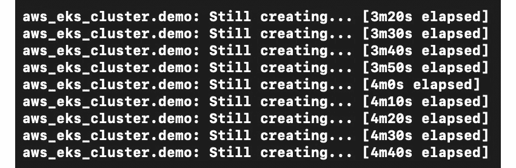

    图 12.6:为我们的 EKS 集群创建资源

    完成后，将有两个终端输出—一个用于节点的配置映射和一个用于访问集群的 kubeconfig 文件，如下图所示:

    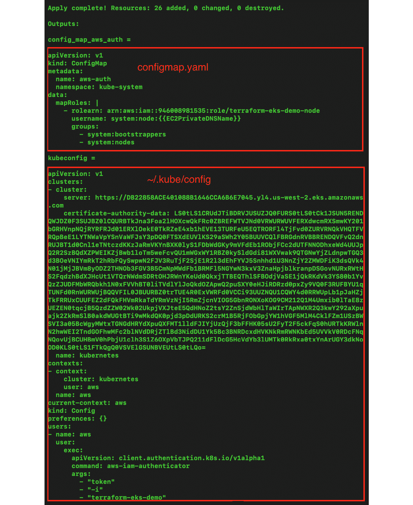

    图 12.7:获取访问我们的集群所需的信息

    将配置映射复制到一个文件并命名为`configmap.yaml`，然后复制 kubeconfig 文件并将其写入计算机上的`~/.kube/config`文件。

3.  Now, we need to apply the changes to allow our worker nodes to communicate with the control plane. This is a YAML-formatted file for joining the worker nodes to your EKS cluster; we already saved this as `configmap.yaml`. Run the following command:

    ```
    kubectl apply -f configmap.yaml
    ```

    注意

    要运行该命令，您需要在计算机上安装`aws-iam-authenticator`二进制文件。要做到这一点，请遵循这里的说明:[https://docs . AWS . Amazon . com/eks/latest/user guide/install-AWS-iam-authenticator . html](https://docs.aws.amazon.com/eks/latest/userguide/install-aws-iam-authenticator.html)。

    这将应用允许 Kubernetes 集群与节点通信的配置映射。您应该会看到以下响应:

    ```
    configmap/aws-auth created
    ```

4.  Now, let's verify that everything is running OK. Run the following command in the terminal:

    ```
    kubectl get node
    ```

    您应该会看到以下输出:

    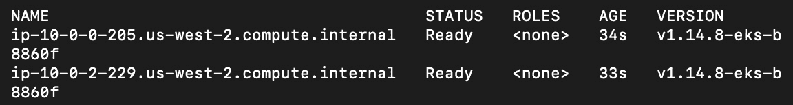

图 12.8:检查我们的节点是否可访问

在这个阶段，我们有一个使用 EKS 作为控制平面和两个工作节点的运行中的 Kubernetes 集群。

注意

请记住，您的集群资源将保持在线，直到您将其删除。如果您计划稍后再来看以下练习，您可能希望删除您的集群以最小化您的账单。为此，运行`terraform destroy`。要使集群重新联机，请再次运行本练习。

现在我们已经设置好了集群，在下一节中，让我们来看看一种高效灵活的方法，可以将流量带到要在集群上运行的任何应用。

# 久居收入

在 Kubernetes 项目的早期，Service 对象用于将集群外部的流量传输到正在运行的 Pods。只有两种方法可以从外部获取流量——使用节点端口服务或负载平衡器服务。后一种选择在公共云提供商环境中是首选的，因为集群将自动管理安全组/防火墙规则的设置，并将负载平衡器指向工作节点上的正确端口。然而，这种方法有一个小问题，尤其是对于那些刚刚开始使用 Kubernetes 或云预算紧张的人来说。问题是一个负载平衡器只能指向一个 Kubernetes 服务对象。

现在，假设你有 100 个微服务在 Kubernetes 中运行，所有这些都需要公开。在 AWS 中，一台 ELB(AWS 提供的负载平衡器)的平均成本约为每月 20 美元。因此，在这种情况下，您每月支付 2，000 美元，只是为了可以选择让流量进入您的集群，而我们仍然没有考虑到网络的额外成本。

让我们也理解 Kubernetes 服务对象和 AWS 负载平衡器之间一对一关系的另一个限制。假设对于您的项目，您需要从同一个负载平衡端点到内部 Kubernetes 服务的基于路径的映射。让我们假设您有一个在`api.example.io`运行的 web 服务，您希望`api.example.io/users`转到一个微服务，而`api.examples.io/weather`转到另一个完全独立的微服务。在入口到来之前，您需要设置自己的Kubernetes服务，并对您的应用进行内部路径解析。

由于 Kubernetes 入口资源的出现，这现在不再是一个问题。Kubernetes 入口资源旨在与入口控制器(运行在集群中的应用，监视 Kubernetes 应用编程接口服务器对入口资源的更改)协同工作。这两个组件一起允许您定义多个 Kubernetes 服务，这些服务不必暴露在外部就可以通过单个负载平衡端点进行路由。让我们检查下图，以便更好地理解这一点:


图 12.9:使用入口将流量路由到我们的服务

在本例中，所有请求都从互联网路由到`api.example.io`。一个请求去`api.example.io/a`，另一个去`api.example.io/b`，最后一个去`api.example.io/c`。这些请求将被发送到一个负载平衡器和一个 Kubernetes 服务，该服务由一个 Kubernetes 入口资源控制。该入口资源将流量从单个入口端点转发到它被配置为将流量转发到的服务。在接下来的部分中，我们将设置`ingress-nginx`入口控制器，这是 Kubernetes 社区中用于入口的常用开源工具。然后，我们将配置入口，允许流量进入我们的集群，以访问我们的高可用性应用。

# 在 Kubernetes 上运行的高可用性应用

现在，您已经有机会启动 EKS 集群并了解入口，让我们向您介绍我们的应用。我们已经提供了一个示例应用，它有一个缺陷，阻止了它成为云原生的，并且真正能够在 Kubernetes 中水平扩展。我们将在下面的练习中部署这个应用，并观察它的行为。然后，在下一节中，我们将部署这个应用的修改版本，并观察它如何更适合实现我们声明的高可用性目标。

## 练习 12.03:在 Kubernetes 部署多副本非高可用性应用

在本练习中，我们将部署一个不可横向扩展的应用版本。我们将尝试缩放它，并观察阻止它水平缩放的问题:

注意

我们已经在 GitHub 存储库中提供了这个应用的源代码供参考。但是，由于我们的重点是 Kubernetes，因此在本练习中，我们将使用命令直接从存储库中获取它。

1.  Use the following command to get the manifest for all of the objects required to run the application:

    ```
    curl https://raw.githubusercontent.com/PacktWorkshops/Kubernetes-Workshop/master/Chapter12/Exercise12.03/without_redis.yaml > without_redis.yaml
    ```

    这会将清单下载到您当前的目录中:

    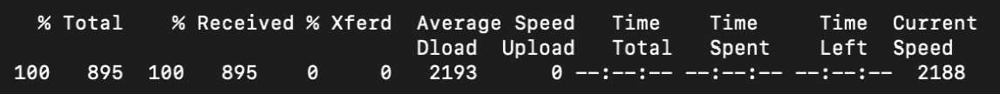

    图 12.10:下载应用清单

    如果您查看清单，它有一个运行单个 Pod 副本的部署和一个集群 IP 类型的服务来路由流量。

2.  Then, create a Kubernetes Deployment and Service object so that we can run our application:

    ```
    kubectl apply -f without_redis.yaml
    ```

    您应该会看到以下响应:

    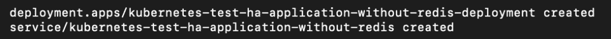

    图 12.11:为我们的应用创建资源

3.  Now, we need to add a Kubernetes Ingress resource to be able to access this website. To get started with Kubernetes Ingress, we need to run the following commands:

    ```
    kubectl apply -f https://raw.githubusercontent.com/kubernetes/ingress-nginx/nginx-0.30.0/deploy/static/mandatory.yaml 
    kubectl apply -f https://raw.githubusercontent.com/kubernetes/ingress-nginx/nginx-0.30.0/deploy/static/provider/aws/service-l4.yaml 
    kubectl apply -f https://raw.githubusercontent.com/kubernetes/ingress-nginx/nginx-0.30.0/deploy/static/provider/aws/patch-configmap-l4.yaml 
    ```

    这三个命令将为 EKS 部署 Nginx 入口控制器实现。您应该会看到以下响应:

    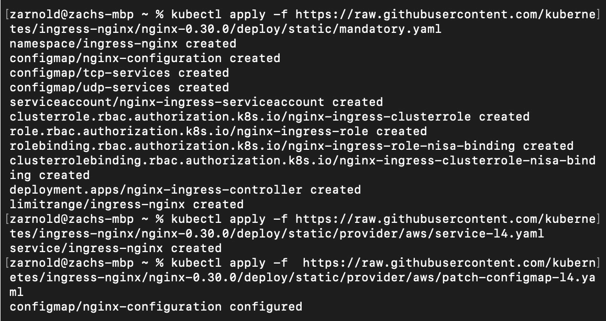

    图 12.12:实现入口控制器

    注意

    此命令仅适用于 AWS 云提供商。如果您在另一个平台上运行您的集群，您需要从[https://kubernetes.github.io/ingress-nginx/deploy/#aws](https://kubernetes.github.io/ingress-nginx/deploy/#aws)找到合适的链接。

4.  然后，我们需要为自己创建一个入口。在同一个文件夹中，我们创建一个名为`ingress.yaml`的文件，内容如下:

    ```
    apiVersion: networking.k8s.io/v1beta1
    kind: Ingress
    metadata:
      name: ingress
      annotations:
        nginx.ingress.kubernetes.io/rewrite-target: /
    spec:
      rules:
        - host: counter.com
          http:
            paths:
              - path: /
                backend:
                  serviceName: kubernetes-test-ha-application-                without-redis
                  servicePort: 80
    ```

5.  Now, run the Ingress using the following command:

    ```
    kubectl apply -f ingress.yaml
    ```

    您应该会看到以下响应:

    ```
    ingress.networking.k8s.io/ingress created
    ```

6.  Now, we will configure the Ingress controller such that when a request arrives at the load balancer that has a `Host:` header of `counter.com`, it should be forwarded to the `kubernetes-test-ha-application-without-redis` service on port `80`.

    首先，让我们找到我们需要访问的网址:

    ```
    kubectl describe svc -n ingress-nginx ingress-nginx
    ```

    您应该会看到类似如下的输出:

    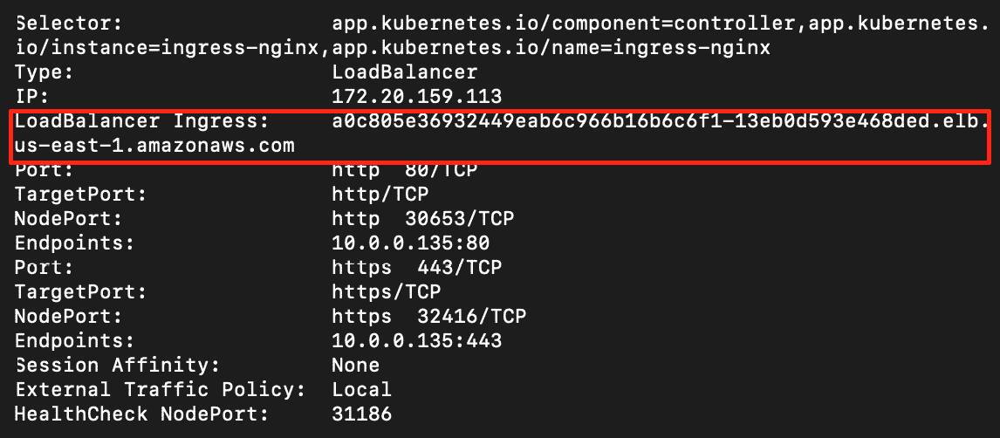

    图 12.13:检查访问入口负载平衡器端点的网址

    从前面的截图中，请注意 Kubernetes 在 AWS 中为我们创建的入口负载平衡器端点如下:

    ```
    a0c805e36932449eab6c966b16b6cf1-13eb0d593e468ded.elb.us-east-1.amazonaws.com
    ```

    您的值可能与前一个不同，您应该使用为您的设置获得的值。

7.  Now, let's access the endpoint using `curl`:

    ```
    curl -H 'Host: counter.com' a0c805e36932449eab6c966b16b6cf1-13eb0d593e468ded.elb.us-east-1.amazonaws.com/get-number
    ```

    您应该会得到类似以下内容的回复:

    ```
    {number: 1}%
    ```

    如果您多次运行它，您将看到数字每次增加 1:

    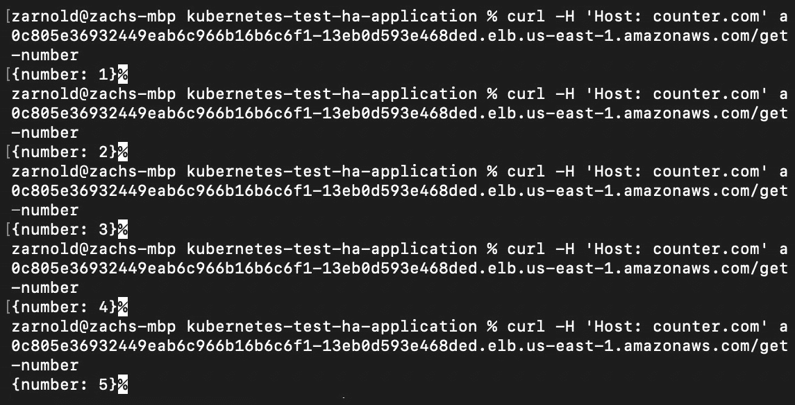

    图 12.14:重复访问我们的应用

8.  Now, let's discover the problem with the application. In order to make the application highly available, we need to have multiple replicas of it running simultaneously so that we can allow at least one replica to be unavailable. This, in turn, enables the app to tolerate failure. To scale the app, we're going to run the following command:

    ```
    kubectl scale deployment --replicas=3 kubernetes-test-ha-application-without-redis-deployment
    ```

    您应该会看到以下响应:

    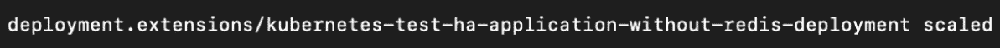

    图 12.15:扩展应用部署

9.  Now, try accessing the application again multiple times, as we did in *step 7*:

    ```
    curl -H 'Host: counter.com' a3960d10c980e40f99887ea068f41b7b-1447612395.us-east-1.elb.amazonaws.com/get-number
    ```

    您应该会看到类似以下内容的响应:

    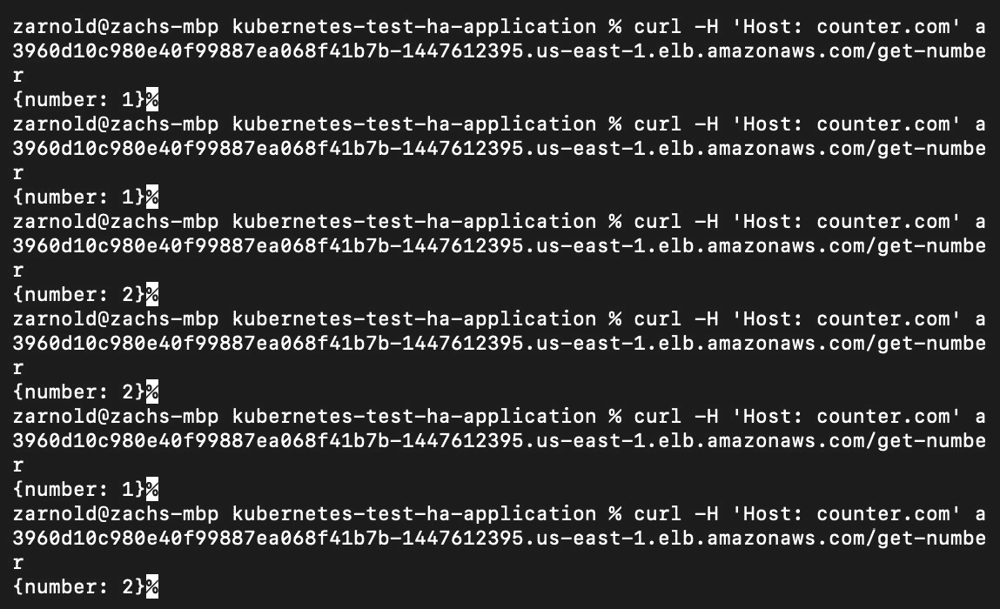

图 12.16:重复访问缩放的应用来观察行为

注意

这个输出对您来说可能不完全相同，但是如果您看到这个数字随着最初几次尝试而增加，请继续访问应用。尝试几次后，您将能够观察到问题行为。

这个输出突出了我们的应用的问题——这个数字并不总是在增加。为什么会这样？这是因为负载平衡器可以将请求传递给任何一个副本，而接收请求的副本会根据其本地状态返回响应。

# 使用有状态应用

前面的练习演示了在分布式环境中使用有状态应用的挑战。简单来说，无状态应用是一种应用，它不会保存一个会话中生成的客户端数据，以供与该客户端的下一个会话使用。这意味着，一般来说，无状态应用完全依赖输入来导出其输出。想象一下，一个服务器显示一个静态网页，它不需要因为任何原因而改变。在现实世界中，无状态应用通常需要与有状态应用相结合，以便为应用的客户端或消费者创造有用的体验。当然，这也有例外。

有状态应用的输出取决于多种因素，例如用户输入、来自其他应用的输入以及过去保存的事件。这些因素被称为应用的“状态”，它决定了应用的行为。创建具有多个副本的分布式应用的最重要部分之一是，用于生成输出的任何状态都需要在所有副本之间共享。如果您的应用的不同副本使用不同的状态，那么您的应用将根据您的请求被路由到哪个副本而表现出随机行为。这实际上违背了使用副本水平扩展应用的目的。

在上一个练习的用例中，为了让每个复制副本以正确的数字进行响应，我们需要将该数字的存储移到每个复制副本之外。为此，我们需要修改应用。让我们想一想如何做到这一点。我们可以使用另一个请求在副本之间传递数字吗？我们是否可以将每个副本分配为仅使用其分配数量的倍数进行响应？(如果我们有三个副本，一个只会用`1`、`4`、`7`……，而另一个会用`2`、`5`、`8`……，最后一个会用`3`、`6`、`9`……。)或者，我们可以在外部状态存储(如数据库)中共享该号码吗？不管我们选择什么，前进的道路都将涉及更新我们在 Kubernetes 中运行的应用。因此，我们需要简单谈谈实现这一目标的策略。

## CI/CD 管道

借助容器化技术和容器映像标签修订策略，我们可以以一种相当简单的方式向应用推送增量更新。就像使用源代码和基础设施作为代码一样，我们可以将执行构建步骤和部署管道的脚本和 Kubernetes 清单保存在工具中，例如 **git** 。这使我们能够非常清楚地了解并灵活地控制软件更新如何在集群中使用配置项和光盘等方法进行。

对于外行来说， **CI/CD** 代表**持续集成和持续部署/交付**。配置项方面使用工具，如 Jenkins 或 Concourse 配置项，在一个可重复的过程中集成对我们源代码的新更改，以测试我们的代码并将其组装成最终的工件进行部署。竞争情报的目标是多方面的，但这里有几个好处:

*   软件中的缺陷在过程的早期被发现(如果测试足够的话)。
*   当我们部署到环境中时，可重复的步骤会产生可重复的结果。
*   可见性的存在是为了与涉众交流特性的状态。
*   它鼓励频繁的软件更新，让开发人员相信他们的新代码不会破坏现有的功能。

另一部分，CD，是自动化机制的结合，不断地向最终用户交付小的更新，例如在 Kubernetes 中更新部署对象和跟踪部署状态。CI/CD 管道是当今流行的 DevOps 模式。

理想情况下，CI/CD 管道应该能够可靠地、可预测地从开发人员的机器中获取代码，并以尽可能少的手动干预将其带到生产环境中。理想情况下，配置项管道应该有用于编译(必要时)、测试和最终应用组装的组件(在 Kubernetes 集群的情况下，这是一个容器)。

光盘管道应该有某种方式来自动化它与基础设施的交互，以获取应用版本并部署它，以及任何相关的配置和一次性部署任务，以这样的方式，软件的期望版本通过某种策略成为软件的运行版本(例如在 Kubernetes 中使用部署对象)。它还应该包括遥测工具，以观察部署对周围环境的直接影响。

我们在应用的前一部分中观察到的问题是，每个副本都在其本地状态下工作，通过 HTTP 返回一个数字。为了解决这个问题，我们建议应该使用外部状态存储(数据库)来管理应用的每个副本之间共享的信息(数量)。我们有几个州立商店可供选择。我们选择 Redis 只是因为它很容易上手，也很容易理解。Redis 是一个高性能的键值数据库，很像 etcd。在我们的示例重构中，我们将通过设置一个名为`num`的键来共享副本之间的状态，该值是我们想要返回的递增整数值。在每个请求期间，该值将递增并存储回数据库，以便每个副本可以处理最新的信息。

每个公司和个人都有一个不同的过程来管理正在部署的新版本的代码。因此，我们将使用简单的命令来执行我们的步骤，这些步骤可以通过您选择的工具通过 Bash 自动执行。

## 练习 12.04:使用状态管理部署应用

在本练习中，我们将部署上一练习中部署的应用的修改版本。提醒一下，这个应用会计算它被访问的次数，并将该值以 JSON 格式返回给请求者。然而，在上一个练习结束时，我们在*图 12.16* 中观察到，当我们用多个副本水平扩展这个应用时，我们得到的数字并不总是增加的。

注意

我们已经在 GitHub 存储库中提供了这个应用的源代码，供您参考。但是，由于我们的重点是 Kubernetes，因此在本练习中，我们将使用命令直接从存储库中获取它。

在这个应用的修改版本中，我们重构了代码，增加了在 Redis 数据库中存储这个不断增加的计数的能力。这允许我们拥有应用的多个副本，但每次我们向端点发出请求时，总会增加计数:

注意

在我们的 Redis 实现中，我们没有使用事务来设置获取后的计数。因此，当我们更新数据库中的值集时，我们获得旧信息并根据旧信息采取行动的可能性非常小，这可能会导致意想不到的结果。

1.  Use the following command to get the manifest of all the objects required for this application:

    ```
    curl https://raw.githubusercontent.com/PacktWorkshops/Kubernetes-Workshop/master/Chapter12/Exercise12.04/with_redis.yaml > with_redis.yaml
    ```

    您应该会看到类似以下内容的响应:

    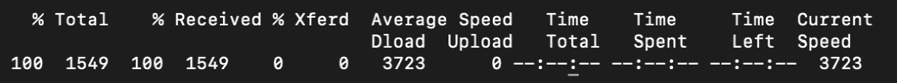

    图 12.17:下载修改后的应用的清单

    如果您打开这个清单，您将看到我们的应用有一个运行三个副本的部署:一个集群 IP 服务公开它，一个 Redis 部署运行一个副本，另一个集群 IP 服务公开 Redis。我们还修改了之前创建的入口对象，以指向新的服务。

2.  Now, it is time to deploy it on Kubernetes. We can run the following command:

    ```
    kubectl apply -f with_redis.yaml
    ```

    您应该会看到类似以下内容的响应:

    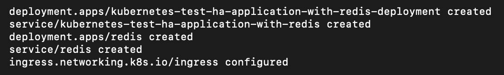

    图 12.18:创建集群所需的资源

3.  Now, let's see what this application gives us by using the following command:

    ```
    curl -H 'Host: counter.com' a3960d10c980e40f99887ea068f41b7b-1447612395.us-east-1.elb.amazonaws.com/get-number
    ```

    重复运行此命令。您应该能够看到越来越多的数字，如图所示:

    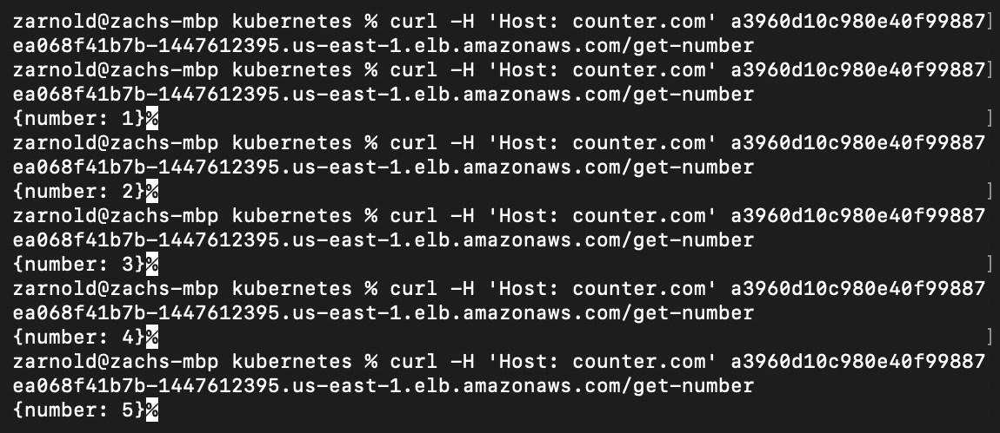

图 12.19:数字持续增加的可预测产出

正如您在前面的输出中看到的，程序现在按顺序输出数字，因为我们部署的所有副本现在共享一个负责管理应用状态的数据存储(Redis)。

如果你想创建一个真正高度可用、容错的软件系统，还有很多其他范式需要转换，详细探讨它们超出了本书的范围。但是，要了解更多信息，您可以通过以下链接查看 Packt 关于分布式系统的书籍:[https://www . Packtpub . com/virtual-and-cloud/hands-microservice-kubernetes。](https://www.packtpub.com/virtualization-and-cloud/hands-microservices-kubernetes )

注意

同样，请记住此时您的集群资源仍在运行。如果您希望稍后继续活动，请不要忘记使用`terraform destroy`拆除您的集群。

既然我们已经构建了能够在不同副本之间持久保存和共享其状态的应用，我们将在下面的活动中进一步扩展它。

## 活动 12.01:实验 和我们的应用的状态管理

现在，我们的应用可以利用运行在我们的 Kubernetes 集群中的共享 Redis 数据库来管理变量计数器，当获取变量计数器时，我们会将其返回给用户。

但是让我们假设一下，我们不相信 Kubernetes 能够可靠地管理 Redis 容器(因为它是一个易失性的内存数据存储)，相反，我们希望使用 AWS 弹性缓存来做到这一点。您在本活动中的目标是使用我们在本章中学到的工具来修改我们的应用，以便与 AWS 弹性缓存一起工作。

您可以使用以下指南来完成本活动:

1.  Use Terraform to provision ElastiCache.

    您可以在此链接找到设置弹性缓存所需的参数值:[https://www . terra form . io/docs/providers/AWS/r/elastic cache _ cluster . html # redis-instance](https://www.terraform.io/docs/providers/aws/r/elasticache_cluster.html#redis-instance)。

2.  更改应用以连接到 Redis。为此，您需要在 Kubernetes 部署中使用一个环境变量。当运行`terraform apply`命令时，您可以在`redis_address`字段中找到所需的信息。
3.  将弹性缓存端点添加到适当的 Kubernetes 清单环境变量中。
4.  使用您想要的任何工具在 Kubernetes 集群上推出新版本的代码。

最后，您应该能够观察到应用的响应类似于我们在前面的练习中看到的，但是这一次，它将使用弹性缓存进行状态管理:

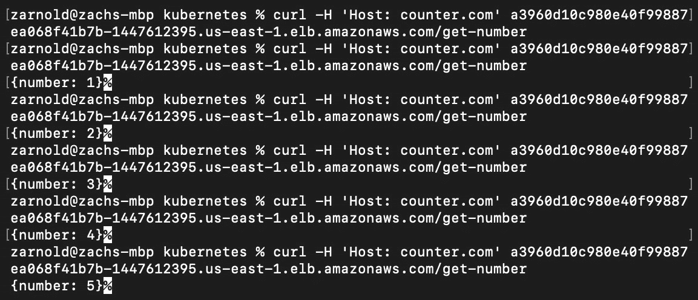

图 12.20:活动 12.01 的预期产出

注意

该活动的解决方案可在以下地址找到:[https://packt.live/304PEoD](https://packt.live/304PEoD)。请记住，您的集群资源将保持在线，直到您将其删除。要删除集群，需要运行`terraform destroy`。

# 总结

在本书的前一章中，我们探讨了 Kubernetes 如何与应用管理的声明性方法协同工作；也就是说，你定义你想要的状态，让 Kubernetes 来处理剩下的事情。在本章中，我们看了一些帮助我们以类似方式管理云基础架构的工具。我们引入了 Terraform 作为工具，可以帮助我们管理基础设施的状态，并引入了将您的基础设施视为代码的想法。

然后，我们在亚马逊 EKS 使用 Terraform 创建了一个基本安全的、生产就绪的 Kubernetes 集群。我们看了一下入口对象，了解了使用它的主要动机，以及它提供的各种优势。然后，我们在高可用性的 Kubernetes 集群上部署了两个版本的应用，并探索了一些允许我们在水平扩展有状态应用方面进行改进的概念。这让我们看到了运行有状态应用带来的挑战，我们将在*第 14 章*、*在 Kubernetes* 中运行有状态组件中探索更多应对这些挑战的方法。

在下一章中，我们将了解如何通过进一步保护集群来保持生产就绪状态。