# 十四、在 Kubernetes 中运行有状态组件

概观

在本章中，我们将扩展我们的技能，超越无状态应用，并学习如何处理有状态应用。我们将了解 Kubernetes 集群操作符可用的各种形式的状态保存机制，并推导出一个心智模型，在该模型中，可以调用某些选项来很好地运行应用。我们还将介绍 Helm，这是一个用各种 Kubernetes 对象部署复杂应用的有用工具。

到本章结束时，您将能够结合使用状态集和持久卷来运行需要在 pod 中断之间保留基于磁盘的状态的应用。您还将能够使用 Helm 图表部署应用。

# 简介

从你学到的所有东西来看，你知道豆荚和在豆荚中运行的容器被认为是短暂的。这意味着它们不依赖于稳定性，因为 Kubernetes 会干预并在集群中移动它们，以符合集群中各种清单指定的期望状态。但是这里面有一个问题——我们如何处理应用中依赖于状态从一个交互持续到下一个交互的部分？如果没有某些保证，例如 POD 的可预测命名和可靠的存储操作(我们将在本章后面部分了解)，如果 Kubernetes 重新启动相关 POD 或移动它们，这种有状态组件可能会失败。然而，在深入讨论上述主题的细节之前，让我们简单地谈谈有状态应用，以及为什么在容器化环境中运行它们很有挑战性。

# 有状态应用

我们在*第 12 章*、*你的应用和 HA 中简单介绍了状态性的概念。*应用的有状态组件是世界上几乎所有信息技术系统的必需品。它们对于保存账户详细信息、交易记录、HTTP 请求信息以及大量其他用途是必要的。在生产环境中运行这些应用的挑战性部分几乎总是与网络或持久性机制有关。无论是旋转的金属磁盘、闪存、块存储还是其他一些尚未发明的工具，众所周知，持久性很难以各种形式处理。这很困难的部分原因是因为所有这些形式都有非零的故障概率，一旦您需要在生产环境中拥有数百甚至数千个存储设备，这一点就变得非常重要。如今，许多云提供商将为客户提供帮助，并提供托管服务来解决这一困难。就 AWS 而言，我们有一些工具，如 S3、EBS、RDS、DynamoDB、Elasticache 以及许多其他工具，可以帮助开发人员和操作人员在没有太多繁重工作的情况下流畅地运行有状态的应用(前提是您可以接受供应商锁定)。)

一些公司在运行有状态应用及其所依赖的持久性机制时面临的另一个权衡是，要么培训和维护大量能够保持这些记录系统在线、健康和最新的员工，要么尝试为常见操作场景开发一套工具和以编程方式实施的流程。随着组织规模的扩大，这两种方法在人工维护工作量上有所不同。

例如，以人为中心的运营方法将允许事情在开始时快速发展，但所有运营成本会随着应用规模线性增长，最终，官僚主义会导致每个新员工的生产力回报不断减少。以软件为中心的方法是一种较高的前期投资，但是成本会随着应用的规模呈对数增长，并且在出现意外错误时发生级联故障的概率更高。

这些操作场景的一些示例包括资源调配和配置、正常操作、扩展输入/输出、备份和异常操作。异常操作的示例包括网络故障、硬盘故障、磁盘数据损坏、安全漏洞和特定应用的违规行为。特定于应用的不规则性的例子可以是处理特定于 MySQL 的排序问题、处理 S3 最终一致读取失败、etcd Raft 协议解析错误等等。

许多公司发现，与开发程序化的状态管理流程和软件相比，支付供应商支持费用、使用云管理产品或重新培训员工更容易。

支持 Kubernetes 的开发生命周期的好处之一是在工作负载定义方面。一家公司越努力严格定义计算的最小逻辑单元(pod 模板或 PersistentVolume 定义)，他们就越能为 Kubernetes 干预不规则操作和适当编排整个应用做好准备。这很大程度上是因为 Kubernetes 编排是一个经典的动态**约束满足问题** ( **CSP** )。CSP 求解器必须处理的约束形式的信息越多，工作负载编排将变得越可预测，因为可行的稳态解决方案的数量减少了。因此，使用可预测的工作负载编排的最终目标，是否有可能在 Kubernetes 中运行我们应用的状态承载组件？答案是明确的肯定。在 Kubernetes 中运行有状态工作负载时犹豫不决是很常见的。我们从本书开始就说过，POD 是短暂的，不应该依赖于稳定性，因为在节点故障的情况下，它们将被移动和重启。因此，在您决定在 Kubernetes 中运行数据库风险太大之前，请考虑一下这一点——世界上最大的搜索引擎公司使用与 Kubernetes 非常相似的工具来运行数据库。这告诉我们，这不仅是可能的，而且在现实中，最好能够很好地定义工作负载，使它们能够由一个编排者运行，因为它可能比人类更快地处理应用故障。

那么，我们如何实现这一点呢？这个问题的答案是使用两个 Kubernetes 对象的组合，您之前已经了解过–**persistent volumes**和**state full set**。这些在*第 7 章*和*第 9 章*中有介绍，所以我们在这里不赘述它们的用法，只是说我们将把所有的介绍性主题汇集成一个与*我们的应用*相关的例子。

有效的有状态工作负载编排的关键是模块化和抽象。这些是教授给工程师的基本软件概念，因此他们可以设计架构良好的软件系统，架构良好的基础设施系统也是如此。在 Kubernetes 中运行数据库时，让我们将下图视为模块化的一个示例:

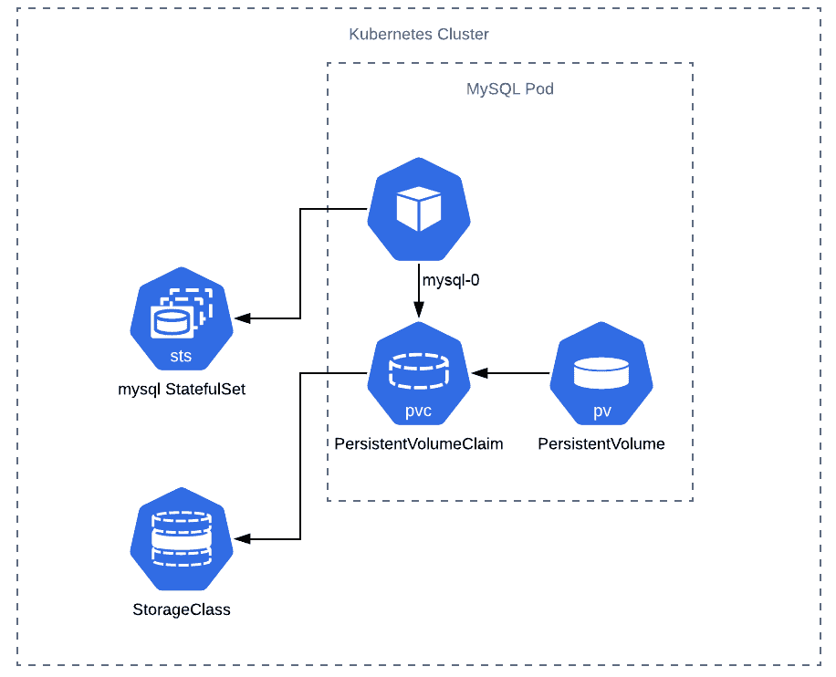

图 14.1:Kubernetes 中的模块化有状态组件

正如你在前面的图表中看到的，也正如你在本书中学到的，Kubernetes 是由模块化组件组成的。因此，通过利用 StatefulSet 资源，我们可以合成 PersistentVolumes、PersistentVolumeClaims、StorageClasses、pods 的用法，以及一些围绕其生命周期的特殊规则，这些规则为我们的应用的持久层所处的条件提供了更强有力的保证。

# 了解状态集

在*图 14.1* 中，我们可以看到调用了一个 StatefulSet 来管理 pod 的生命周期。StatefulSet(在旧版本的 Kubernetes 中，这被称为 PetSet)的操作与 Deployment 非常相似，因为我们提供了一个我们想要运行的 pod 模板，以及我们想要运行它的多少个实例。状态集和部署之间的区别如下:

*   **A clear naming scheme that can be depended upon by pods in DNS queries**:

    这意味着在上图中，当我们命名一个状态集合`mysql`时，该状态集合中的第一个 pod 将始终是`mysql-0`。这与传统部署不同，在传统部署中，pod IDs 是随机分配的。这也意味着，如果你有一个名为`mysql-2`的 POD，它坠毁了，它会以完全相同的名字在集群上复活。

*   **A clearly ordered way in which updates must proceed**:

    根据此状态集中的更新策略，每个 pod 都将按照非常特定的顺序被关闭。因此，如果您有一个众所周知的升级途径(例如在 MySQL 中的小的软件修订)，您应该能够利用 Kubernetes 提供的软件更新策略之一。

*   **Dependable storage operations**:

    由于存储是有状态解决方案中最关键的部分，因此由状态集合采取确定性的操作是必不可少的。默认情况下，为状态集提供的任何持久卷都将被保留，即使该状态集已被删除。虽然这种行为旨在防止意外删除数据，但它可能会导致云提供商在测试期间收取大量费用，因此您应该对此进行密切监控。

*   **A serviceName field that must be defined in the StatefulSet**:

    这个`serviceName`字段必须引用一个被称为“无头”服务的东西，它指向这组豆荚。这允许使用通用 Kubernetes 域名系统语法来单独寻址容器。例如，如果我的 StatefulSet 在默认命名空间中运行，并且名称为`zachstatefulset`，那么第一个 pod 将拥有域名系统条目`zachstatefulset-0.default.svc.cluster.local`。如果这一个失败，相同的 DNS 条目将被任何替换的 pod 使用。

    更多关于无头服务的信息可以在这个链接找到:[https://kubernetes . io/docs/concepts/services-networking/service/#无头-services](https://kubernetes.io/docs/concepts/services-networking/service/#headless-services) 。

## 部署与状态集

现在，您已经在稍微更精细的级别上了解了状态集合，那么您应该在状态集合和使用 PersistentVolumeClaim 的部署之间选择什么基础呢？答案取决于你想安排什么。

理论上，您可以使用两种类型的 Kubernetes 对象实现类似的行为。两者都创建了 pods，都有更新策略，都可以使用 PVCs 来创建和管理 PersistentVolume 对象。设计状态集的原因是为了提供前面要点中列出的保证。通常，在编排数据库、文件服务器和其他形式的敏感的持久性相关应用时，您会想要这些保证。

当我们理解了 StatefulSets 对于可预测地运行我们应用的有状态组件是多么有用时，让我们来看一个与我们相关的具体例子。正如您将从前面几章中回忆的那样，我们有一个小的计数器应用，我们正在重构它，以尽可能多地利用云原生原则。在本章中，我们将替换状态持久化机制，并测试一个新的引擎。

# 进一步重构我们的应用

现在，我们希望将我们的应用进一步深入到云原生原则中。让我们考虑一下，我们的计数器应用的产品经理说，我们得到了疯狂的负载量(您可以通过您的可观察性工具集来确认这一点)，有些人并不总是得到严格增加的数量；有时，他们会得到相同号码的副本。所以，你和你的同事商量后得出结论，为了保证不断增加的数据量，你需要保证数据在你的应用中是如何被访问和保存的。

具体来说，您需要保证针对该数据存储区的操作在原子上是唯一的，在操作之间是一致的，与其他操作是隔离的，并且对故障是持久的。也就是说，您正在寻找一个符合 ACID 的数据库。

注意

更多关于 ACID 合规性的信息，请点击此链接:[https://database.guide/what-is-acid-in-databases/](https://database.guide/what-is-acid-in-databases/)。

该团队希望能够使用数据库，但他们宁愿不为由 AWS 运行的数据库付费。如果他们后来在 GCP 或 Azure 上找到更好的交易，他们也宁愿不要被 AWS 套牢。

因此，在简单查看了谷歌的一些选项后，您的团队决定使用 MySQL。MySQL 是更受欢迎的开源 RDBMS 解决方案之一，因此在 Kubernetes 中作为数据库解决方案实现时，有大量的文档、支持和社区建议。

现在，工作开始改变您的代码，以支持使用 MySQL 支持的事务来增加计数器。因此，要做到这一点，我们需要改变一些事情:

*   更改我们的应用代码，使用 SQL 代替 Redis 来访问数据并增加计数器。
*   修改我们的 Kubernetes 集群来运行 MySQL 而不是 Redis。
*   确保数据库下存储的持久性，以防灾难性故障。

您可能会问自己，为什么集群操作员或管理员需要能够理解和重构代码。Kubernetes 的出现加速了软件行业利用 DevOps 工具、实践和文化开始更快、更可预测地向客户交付价值的趋势。这意味着开始使用软件而不是人来扩展我们的运营。我们需要强大的自动化来取代以人为中心的流程，以便能够保证功能和交付速度。因此，拥有系统级软件工程经验的基础设施设计人员或管理员能够帮助他们重构代码库，以利用更多的云原生实践，这对他们的职业生涯是一个巨大的好处，它可能很快会成为所有 DevOps 工程师的工作要求。因此，让我们看看如何使用 MySQL 为事务重构我们的应用。

注意

如果你还不习惯编程，或者你不熟悉作者选择的语言的语法(在这个例子中是 Golang)，你不必担心——所有的解决方案都已经制定出来，可以使用了。

首先，让我们检查一下*练习 12.04* 、*使用状态管理*部署应用的代码:

main.go

```
28 if r.Method == "GET" { 
29     val, err := client.Get("num").Result() 
30     if err == redis.Nil { 
31         fmt.Println("num does not exist") 
32         err := client.Set("num", "0", 0).Err() 
33         if err != nil { 
34             panic(err) 
35         } 
36     } else if err != nil { 
37         w.WriteHeader(500) 
38         panic(err) 
39     } else { 
40         fmt.Println("num", val) 
41         num, err := strconv.Atoi(val) 
42         if err != nil { 
43             w.WriteHeader(500) 
44             fmt.Println(err) 
45         } else { 
46             num++ 
47             err := client.Set("num", strconv.Itoa(num), 0).Err() 
48             if err != nil { 
49                 panic(err) 
50             } 
51             fmt.Fprintf(w, "{number: %d}", num) 
52         } 
53 } 
```

这一步的完整代码可以在[https://packt.live/3jSWTHB](https://packt.live/3jSWTHB)找到。

在前面的代码中突出显示了我们访问持久层的两个实例。正如您所看到的，我们不仅没有使用事务，而且还在操作代码中的值，因此无法保证这是一个严格递增的计数器。为此，我们必须改变策略。

注意

您可以在此链接找到使用 MySQL 容器所需的信息:[https://hub.docker.com/_/mysql?tab=description](https://hub.docker.com/_/mysql?tab=description)。

我们已经提供了使用 SQL 的重构应用。让我们看看重构后的应用的代码:

main.go

```
38 fmt.Println("Starting HTTP server") 
39 http.HandleFunc("/get-number", func(w http.ResponseWriter, r      *http.Request) { 
40     if r.Method == "GET" { 
41         tx, err := db.Begin() 
42             if err != nil { 
43         panic(err) 
44         } 
45         _, err = tx.Exec(t1) 
46         if err != nil { 
47             tx.Rollback() 
48             fmt.Println(err) 
49         } 
50         err = tx.Commit() 
51         if err != nil { 
52             fmt.Println(err) 
53         } 
54         row := db.QueryRow(t2, 1) 
55         switch err := row.Scan(&num); err { 
56         case sql.ErrNoRows: 
57             fmt.Println("No rows were returned!") 
58         case nil: 
59             fmt.Fprintf(w, "{number: %d}\n", num) 
60         default: 
61             panic(err) 
62         } 
63     } else { 
64         w.WriteHeader(400) 
65         fmt.Fprint(w, "{\"error\": \"Only GET HTTP method is                supported.\"}") 
66     } 
67 }
```

这一步的完整代码可以在[https://packt.live/35ck7nX](https://packt.live/35ck7nX)找到。

如您所见，它与 Redis 代码大致相同，只是现在我们的值是在事务中设置的。与 Redis 不同，MySQL 不是一个易失性的内存数据存储，因此针对数据库的操作必须持久化到磁盘上才能成功，理想情况下，它们持久化到一个磁盘上，当 pod 中断时，该磁盘不会消失。让我们在下面的练习中设置应用的其他必需组件。

## 练习 14.01: D 用 MySQL 后端部署一个计数器应用

在本练习中，我们将重新配置计数器应用，以使用 MySQL 后端而不是 Redis:

1.  To begin with, we will recreate your EKS cluster from the Terraform file in *Exercise 12.02*, *Creating a Cluster with EKS Using Terraform*. If you already have the `main.tf` file, you can work with it. Otherwise, you can run the following command to get it:

    ```
    curl -O https://raw.githubusercontent.com/PacktWorkshops/Kubernetes-Workshop/master/Chapter12/Exercise12.02/main.tf
    ```

    现在，依次使用以下两个命令来启动和运行集群资源:

    ```
    terraform init
    terraform apply
    ```

    注意

    执行任何练习后，如果您计划在相当长的时间后继续下面的练习，最好取消分配集群资源，以阻止 AWS 向您收费。您可以使用`terraform destroy`命令来完成。然后，当您准备好进行锻炼或活动时，您可以运行这一步来使所有内容再次在线。

    如果任何练习或活动依赖于在前面练习中创建的对象，您也需要重新创建这些对象。

2.  Run the following command to get the manifest file, `with_mysql.yaml`, which defines all the required objects:

    ```
    curl -O https://raw.githubusercontent.com/PacktWorkshops/Kubernetes-Workshop/master/Chapter14/Exercise14.01/with_mysql.yaml
    ```

    打开文件进行检查，这样我们就可以检查这个状态集:

    with_mysql.yaml

    ```
    44 apiVersion: apps/v1 
    45 kind: StatefulSet 
    46 metadata: 
    47   name: mysql 
    48 spec: 
    49   selector: 
    50    matchLabels: 
    51       app: mysql 
    52   serviceName: mysql 
    53   replicas: 1 
    54   template: 
    55     metadata: 
    56       labels: 
    57         app: mysql 
    58     spec: 
    ```

    这一步的完整代码可以在[https://packt.live/2R2WN3x](https://packt.live/2R2WN3x)找到。

    注意

    在这里，PersistentVolumeClaim 会在启动时自动将亚马逊电子商务系统中的一个 10 千兆字节的卷绑定到每个 pod。Kubernetes 将使用我们在 Terraform 文件中定义的 IAM 角色自动配置 EBS 卷。

    当 pod 因任何原因中断时，Kubernetes 会在重新启动时自动将适当的 PersistentVolume 重新绑定到 pod，即使它位于不同的工作节点上，只要它位于同一可用性区域。

3.  Let's apply this to our cluster by running the following command:

    ```
    kubectl apply -f with_mysql.yaml
    ```

    您应该会看到以下回应:

    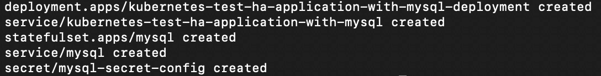

    图 14.2:部署使用 MySQL 后端的重构应用

4.  Now run `kubectl proxy` in this window and let's open up another terminal window:

    ```
    kubectl proxy
    ```

    您应该会看到以下回应:

    ```
    Starting to serve on 127.0.0.1:8001
    ```

5.  In the other window, run the following command to access our application:

    ```
    curl localhost:8001/api/v1/namespaces/default/services/kubernetes-test-ha-application-with-mysql:/proxy/get-number
    ```

    您应该会看到以下回应:

    ```
    {number: 1}
    ```

    正如我们在前面几章中看到的，您应该会看到应用按预期运行。就像这样，我们的应用使用 MySQL 有一个工作状态集，用于保存数据。

正如我们已经说过的，导致集群运营商不将状态集作为管理数据基础设施的一种方式的原因之一是，他们错误地认为持久卷中的信息就像他们绑定到的豆荚一样短暂。这不是真的。如果 pod 甚至 statefleset 被删除，由 statefleset 创建的 PersistentVolumeClaims 将不会被删除。这是为了不惜一切代价保护这些卷中包含的数据。因此，为了清理，我们需要单独删除 PersistentVolume。集群操作员还可以使用其他工具来防止这种情况发生，例如更改您正在创建的 PersistentVolumes(或从中创建该卷的存储类)的回收策略。

## 练习 14.02:测试持久卷中状态集数据的弹性

在本练习中，我们将从上一练习中停止的地方继续，通过删除资源并查看 Kubernetes 如何响应来测试应用中数据的弹性:

1.  Now for the fun part, let's try to test the resilience of our persistence mechanism by deleting the MySQL pod:

    ```
    kubectl delete pod mysql-0
    ```

    您应该会看到以下回应:

    ```
    pod "mysql-0" deleted
    ```

2.  The app may crash at this point, but if you keep trying the preceding `curl` command again after a few seconds, it should automatically continue counting from the number it had before we deleted the pod. We can verify this by trying to access the application again:

    ```
    curl localhost:8001/api/v1/namespaces/default/services/kubernetes-test-ha-application-with-mysql:/proxy/get-number
    ```

    您应该会看到类似以下内容的响应:

    ```
    {number: 2}
    ```

    如您所见，我们不仅从应用中获得了有效的响应，还获得了序列中的下一个数字(`2`)，这意味着当我们丢失了 MySQL pod 并且 Kubernetes 恢复了它时，没有数据丢失。

    创建这个状态集后，清理它并不像运行`kubectl delete -f with_mysql.yaml`那么简单。这是因为 Kubernetes 不会自动销毁由 StatefulSet 创建的 PersistentVolume。

    注意

    这也意味着，即使我们试图使用`terraform destroy`删除我们所有的 AWS 资源，我们仍然会无限期地为 AWS 中孤立的 EBS 卷付费(在这个例子中，我们不想这样)。

3.  So, to clean up, we need to find out what PersistentVolumes are bound to this StatefulSet. Let's list the PersistentVolumes in the default namespace of our cluster:

    ```
    kubectl get pv
    ```

    您应该会看到类似以下内容的响应:

    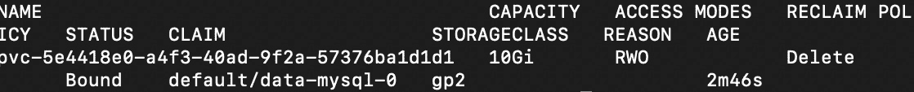

    图 14.3:获取持久卷列表

4.  It looks like we have a PersistentVolume named `data-mysql-0`, which is the one we want to delete. First, we need to remove the objects that created this. Thus, let's first delete our application and all of its components:

    ```
    kubectl delete -f with_mysql.yaml
    ```

    您应该会看到以下回应:

    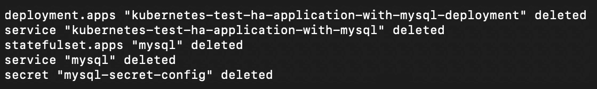

    图 14.4:删除与 MySQL 相关联的持久卷

5.  Let's check on the PersistentVolume that we were trying to remove:

    ```
    kubectl get pv
    ```

    您应该会看到类似这样的响应:

    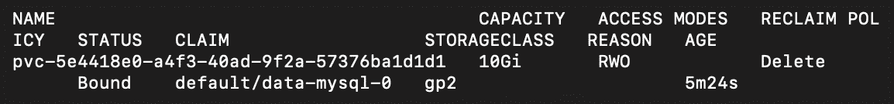

    图 14.5:获取持久卷列表

    从这张图片来看，我们的音量似乎还在。

6.  We need to remove both the PersistentVolume and the PersistentVolumeClaim that created it. To do this, let's run the following command:

    ```
    kubectl delete pvc data-mysql-0
    ```

    您应该会看到以下回应:

    ```
    persistentvolumeclaim "data-mysql-0" deleted
    ```

    一旦我们删除了 PersistentVolumeClaim，PersistentVolume 就变成了`unbound`并且受制于它的回收策略，我们可以在上一步的截图中看到。在这种情况下，策略是删除底层存储卷。

7.  To verify that the PV is deleted, let's run the following:

    ```
    kubectl get pv
    ```

    您应该会看到以下响应:

    ```
    No resources found in default namespace.
    ```

    从这个截图中可以明显看出，我们的 PersistentVolume 现在已经被删除了。

    注意

    如果您的案例的回收策略不是`Delete`，您还需要手动删除 PersistentVolume。

8.  Now that we have cleaned up our PersistentVolumes and PersistentVolumeClaims, we can continue to clean up as we would normally by running the following command:

    ```
    terraform destroy
    ```

    您应该会看到如下图所示的回应:

    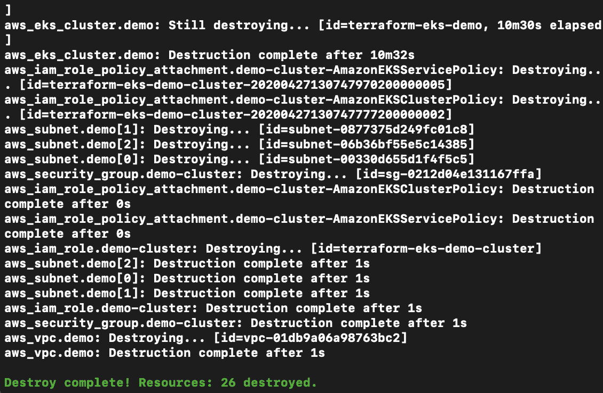

图 14.6:清理 Terraform 创建的资源

在本练习中，我们已经看到了 Kubernetes 如何在删除 StatefulSet 的情况下试图保留 PersistentVolumes。我们还看到了当我们真的想要移除 PersistentVolume 时如何继续。

既然我们已经看到了如何设置一个 StatefulSet 并运行一个连接到它的 MySQL 数据库，我们将在下面的活动中进一步扩展高可用性的原则。然而，在此之前，我们需要解决 Kubernetes 清单蔓延的问题，因为似乎需要越来越多的 YAML 清单来实现我们构建高可用性有状态应用的目标。在下一节中，我们将了解一种工具，它将帮助我们更好地组织和管理应用的清单。

# 头盔

在这一节中，我们将看一个在 Kubernetes 生态系统中非常有用的工具，叫做 Helm。Helm 是由微软创建的，因为很快发现，对于 Kubernetes 的任何大规模部署(例如，涉及 20 个或更多独立组件、可观察性工具、服务和其他对象的部署)，都有许多 YAML 清单需要跟踪。再加上许多公司除了生产之外还运行多个环境，这就需要彼此保持同步，于是你就开始面临一个棘手的问题。

Helm 允许您编写 Kubernetes 清单模板，您可以向这些模板提供覆盖任何默认值的参数，然后 Helm 为您创建适当的 Kubernetes 清单。因此，您可以使用 Helm 作为一种包管理器，其中您的整个应用可以使用 Helm 图表进行部署，并且您可以在安装之前调整一些小参数。使用 Helm 的另一种方法是作为模板引擎。它允许有经验的 Kubernetes 操作者只编写一次好的模板，然后不熟悉 Kubernetes 清单语法的人可以使用它来成功地创建 Kubernetes 资源。一个 Helm 图表可以用任意数量的由参数设置的字段来创建，一个基本模板可以用来部署一个软件或一个微服务的完全不同的实现，以适应不同的需求。

Helm 包被称为“图表”，它们有一个特定的文件夹结构。您可以使用 Git 中的共享 Helm 图表存储库、Artifactory 服务器或本地文件系统。在接下来的练习中，我们将查看一个 Helm 图表，并将其安装在我们的集群上。

在您学习 Kubernetes 的旅程中，这是向 Helm 介绍的一个很好的点，因为如果您一直关注，您已经编写了相当多的 YAML 并将其应用到您的集群中。此外，我们写的很多东西是我们以前见过的东西的重复。因此，利用 Helm 的模板功能将有助于打包类似的组件并使用 Kubernetes 交付它们。您不必利用 Helm 的模板组件来使用它，但是它很有帮助，这样您就可以为生成的 Kubernetes 对象的多个不同排列重用图表。

注意

我们将使用赫尔姆 3，它与它的前身赫尔姆 2 有很大的不同，并且是最近才发布的。如果您熟悉 Helm 2 并想了解不同之处，可以参考此链接的文档:[https://v3.helm.sh/docs/faq/#changes-since-helm-2](https://v3.helm.sh/docs/faq/#changes-since-helm-2)。

对 Helm 的详细介绍超出了本书的范围，但这里介绍的基础知识可以作为一个很好的起点，也可以让我们了解不同的工具和技术如何协同工作，以消除 Kubernetes 中复杂的应用编排的几个障碍。

让我们看看如何创建一个图表(这是一个包的 Helm 术语)并将其应用于集群。然后，我们将了解 Helm 如何从 Helm 图表生成 Kubernetes 清单文件。

让我们通过运行以下命令来创建一个新的 Helm 图表:

```
helm create chart-dev
```

您应该会看到以下响应:

```
Creating chart-dev
```

创建新图表时，默认情况下，Helm 会为 NGINX 生成一个图表作为占位符应用。这将创建一个新的文件夹和骨架图供我们检查。

注意

对于以下部分，请确保您已经按照*前言*中的说明安装了`tree`。

让我们使用 Linux `tree`命令，看看 Helm 为我们做了什么:

```
tree .
```

您应该会看到类似以下内容的响应:

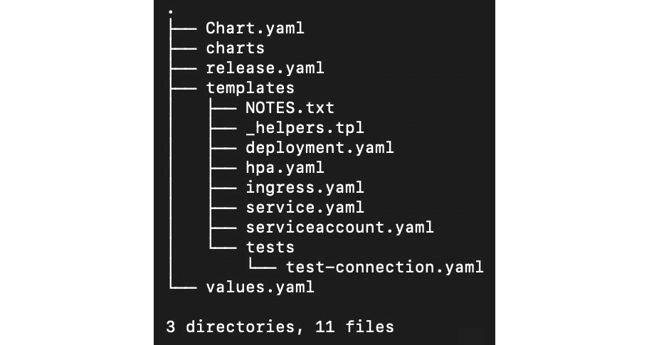

图 14.7:掌舵图的目录结构

注意`templates`文件夹和`values.yaml`文件。Helm 通过使用在`values.yaml`文件中找到的值来工作，并将这些值填充到`templates`文件夹中文件的相应占位符中。我们来看一下`values.yaml`文件的一部分:

values.yaml

```
1  # Default values for chart-dev.
2  # This is a YAML-formatted file.
3  # Declare variables to be passed into your templates.
4  
5  replicaCount: 1
6  
7  image:
8    repository: nginx
9    pullPolicy: IfNotPresent
10   # Overrides the image tag whose default is the chart appVersion.
11 tag: ""
12 
13 imagePullSecrets: []
14 nameOverride: ""
15 fullnameOverride: ""
```

这一步的完整代码可以在[https://packt.live/33ej2cO](https://packt.live/33ej2cO)找到。

正如我们在这里看到的，这不是 Kubernetes 清单，但它看起来有许多相同的领域。在前面的片段中，我们突出显示了整个`image`块。这有三个字段(`repository`、`pullPolicy`和`tag`，每个字段都有相应的值。

另一个值得注意的文件是`Chart.yaml`。该文件中的以下一行与我们的讨论相关:

```
appVersion: 1.16.0
```

注意

你可以在这个链接找到完整的文件:[https://packt.live/2FboR2a](https://packt.live/2FboR2a)。

文件中的注释很好地描述了这意味着什么:*“这是正在部署的应用的版本号。每次对应用进行更改时，该版本号都应该递增。版本不应该遵循语义版本化。它们应该反映应用正在使用的版本。”*

那么，Helm 如何将这些组装成我们所期望的传统 Kubernetes 清单格式呢？为了理解这一点，让我们检查一下`templates`文件夹中`deployment.yaml`文件的相应部分:

deployment.yaml

```
30  containers:
31    - name: {{ .Chart.Name }}
32      securityContext:
33        {{- toYaml .Values.securityContext | nindent 12 }}
34      image: "{{ .Values.image.repository }}:{{ .Values.image.tag |           default .Chart.AppVersion }}"
35      imagePullPolicy: {{ .Values.image.pullPolicy }}
```

这一步的完整代码可以在[https://packt.live/3k0OGRL](https://packt.live/3k0OGRL)找到。

这个文件看起来更像是一个 Kubernetes 清单，其中添加了一堆变量。将来自`deployment.yaml`的模板占位符与来自`values.yaml`和`Chart.yaml`的观察进行比较，我们可以推断出以下内容:

*   `{{ .Values.image.repository }}`将解释为`nginx`。
*   `{{ .Values.image.tag | default .Chart.AppVersion }}`将解释为`1.16.0`。

因此，我们得到部署规范的结果字段为`image: nginx:1.16.0`。

这是我们第一次看到 Helm 模板语言。对于熟悉模板引擎(如 Jinja、Go 模板或 Twig)的人来说，这个语法应该很熟悉。如前所述，我们不会深入讨论 Helm 的太多细节，但您可以在 Helm 文档的以下链接中找到更多信息:[https://helm.sh/docs/chart_template_guide/](https://helm.sh/docs/chart_template_guide/)。

现在，让我们安装我们生成的示例图表`chart-dev`。这个图表将部署一个示例 NGINX 应用到我们的 Kubernetes 集群。要安装 Helm 图表，命令如下所示:

```
helm install [NAME] [CHART] [flags]
```

我们可以 使用`--generate-name`获得一个随机名称。另外，由于我们已经在`chart-dev`目录中，我们可以从当前工作目录的根目录直接使用`values.yaml`:

```
helm install --generate-name -f values.yaml .
```

您应该会看到以下响应:

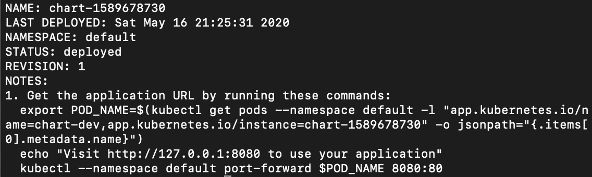

图 14.8:安装舵图

请注意，在输出中，给出了下一步操作的说明。这些是来自`templates/NOTES.txt`文件的可定制指令。当你制作自己的赫尔姆图表时，你可以用这些来指导使用图表的人。现在，让我们运行这些命令。

注意

此输出中的确切值是根据您的特定环境定制的，因此您应该从终端输出中复制命令。这适用于以下命令。

第一个命令将 POD 名称设置为名为`POD_NAME`的环境变量:

```
export POD_NAME=$(kubectl get pods --namespace default -l "app.kubernetes.io/name=chart-dev,app.kubernetes.io/instance=chart-1589678730" -o jsonpath="{.items[0].metadata.name}")
```

我们将跳过`echo`命令；它只是告诉你如何访问你的应用。这个`echo`命令存在的原因是为了在终端输出中显示下一个命令是什么。

现在，在我们访问我们的应用之前，我们需要做一些端口转发。下一个命令将主机上的端口`8080`映射到 pod 上的端口`80`:

```
kubectl --namespace default port-forward $POD_NAME 8080:80
```

您应该会看到以下回应:

```
Forwarding from 127.0.0.1:8080 ->80
Forwarding from [::1]:8080 -> 80
```

现在让我们尝试访问 NGINX。在浏览器中，转到`localhost:8080`。您应该能够看到默认的 NGINX 登录页面:

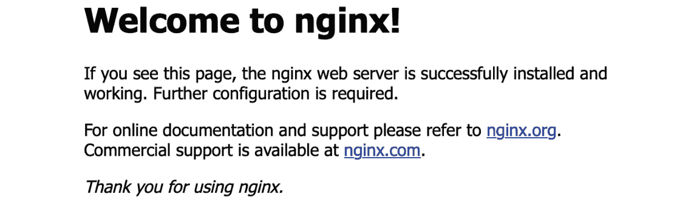

图 14.9:访问我们默认的 NGINX 测试应用

你可以通过删除我们的资源来解决这个问题。首先，让我们通过获取 Helm 在您的集群中安装的所有版本的列表来获取此版本的生成名称:

```
helm ls
```

您应该会看到类似这样的响应:

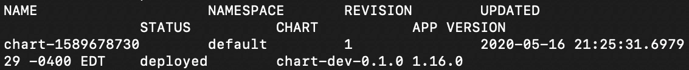

图 14.10:获取 Helm 安装的所有应用的列表

现在，我们可以按如下方式删除该版本:

```
helm uninstall chart-1589678730
```

使用上一个输出中的名称。您应该会看到以下回应:

```
release "chart-1589678730" uninstalled
```

就这样，我们写了第一张图表。因此，让我们继续下面的练习，在这里我们将确切地了解 Helm 如何使我们的工作变得更容易。

## 练习 14.03:图表化我们基于 Redis 的计数器应用

我们在前一节中创建了一个通用的 Helm 图表，但是如果我们想为我们的软件制作自己的图表呢？在本练习中，我们将创建一个 Helm 图表，使用 Helm 从*第 12 章*、*您的应用和 HA* 部署我们基于 HA Redis 的解决方案。

1.  如果您在`chart-dev`目录内，导航到父目录:

    ```
    cd ..
    ```

2.  Let's start by making a fresh Helm chart:

    ```
    helm create redis-based-counter && cd redis-based-counter
    ```

    您应该会看到以下回应:

    ```
    Creating redis-based-counter
    ```

3.  现在让我们从图表中删除不必要的文件:

    ```
    rm templates/NOTES.txt; \
    rm templates/*.yaml; \
    rm -r templates/tests/; \
    cd templates
    ```

4.  Now, we need to navigate into the `templates` folder of our chart and copy in the files from our repo for the Redis-based counter application:

    ```
    curl -O https://raw.githubusercontent.com/PacktWorkshops/Kubernetes-Workshop/master/Chapter14/Exercise14.03/templates/redis-deployment.yaml; \
    curl -O https://raw.githubusercontent.com/PacktWorkshops/Kubernetes-Workshop/master/Chapter14/Exercise14.03/templates/deployment.yaml;\
    curl -O https://raw.githubusercontent.com/PacktWorkshops/Kubernetes-Workshop/master/Chapter14/Exercise14.03/templates/redis-service.yaml; \
    curl -O https://raw.githubusercontent.com/PacktWorkshops/Kubernetes-Workshop/master/Chapter14/Exercise14.03/templates/service.yaml
    ```

    您可能还记得前几章，我们有多个 Kubernetes 清单共享一个文件，由`---` YAML 文件分隔符字符串分隔。现在我们有了管理 Kubernetes 清单的工具，最好将它们保存在单独的文件中，这样我们就可以独立管理它们。捆绑工作现在将由赫尔姆处理。

5.  There should be four files in the `templates` folder. Let's confirm that as follows:

    ```
    tree .
    ```

    您应该会看到以下响应:

    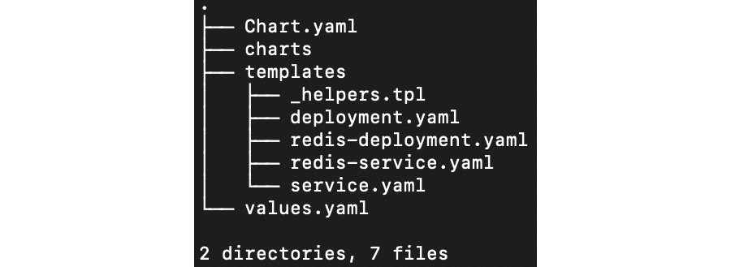

    图 14.11:我们应用的预期文件结构

6.  现在我们需要修改`values.yaml`文件。删除该文件中的所有内容，仅将以下内容复制到其中:

    ```
    deployment:
      replicas: 3
    redis:
      version: 3
    ```

7.  现在，要将它们连接在一起，我们需要编辑`deployment.yaml`和`redis-deployment.yaml`。我们首先要编辑的是`deployment.yaml`。我们应该用模板替换`replicas: 3`，如以下清单中突出显示的行所示:

    ```
    apiVersion: apps/v1
    kind: Deployment
    metadata:
      name: kubernetes-test-ha-application-with-redis-deployment
      labels:
        app: kubernetes-test-ha-application-with-redis
    spec:
     replicas: {{ .Values.deployment.replicas }}
      selector:
        matchLabels:
          app: kubernetes-test-ha-application-with-redis
      template:
        metadata:
          labels:
            app: kubernetes-test-ha-application-with-redis
        spec:
          containers:
            - name: kubernetes-test-ha-application-with-redis
              image: packtworkshops/the-kubernetes-workshop:demo-app-            with-redis
              imagePullPolicy: Always
              ports:
                - containerPort: 8080
              env:
                - name: REDIS_SVC_ADDR
                  value: "redis.default:6379"
    ```

8.  接下来，编辑`redis-deployment.yaml`文件，并添加一个类似的模板语言块，如以下清单中突出显示的行所示:

    ```
    apiVersion: apps/v1 # for versions before 1.9.0 use apps/v1beta2
    kind: Deployment
    metadata:
      name: redis
      labels:
        app: redis
    spec:
      selector:
        matchLabels:
          app: redis
      replicas: 1
      template:
        metadata:
          labels:
            app: redis
        spec:
          containers:
            - name: master
     image: redis:{{ .Values.redis.version }}
              resources:
                requests:
                  cpu: 100m
                  memory: 100Mi
              ports:
                - containerPort: 6379
    ```

9.  Now let's install our application using Helm:

    ```
    helm install --generate-name -f values.yaml .
    ```

    您应该会看到类似这样的响应:

    

    图 14.12:用自动生成的名称安装我们的 Helm 图表

10.  To check whether our application is online, we can get the list of deployments:

    ```
    kubectl get deployment
    ```

    您应该会看到以下输出:

    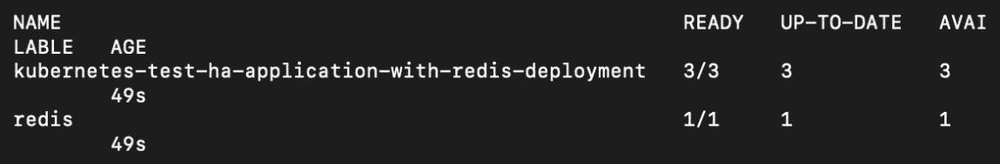

图 14.13:获取部署列表

如您所见，Helm 已经部署了我们的应用部署，以及它的 Redis 后端。有了这些技能，你很快就会成为赫尔姆的船长。

在接下来的活动中，我们将把我们在本章中学到的两件事结合起来——为有状态组件重构我们的应用，然后将其部署为 Helm 图表。

## 活动 14.01:图表-确定我们的状态集部署

现在你已经有了使用 MySQL、StatefulSets 和 Helm 进行资源管理的经验，你的活动就是把你在*练习 14.01* 、 *14.02* 和 *14.03* 中所学的知识结合起来。

在本练习中，我们将重构基于 Redis 的应用，使用 StatefulSets 将 MySQL 用作后端数据存储，然后使用 Helm 部署它。

遵循以下高级指南完成活动:

1.  按照*练习 14.01**的*步骤 1* 所示，设置所需的集群基础架构，使用 MySQL 后端*部署计数器应用。
2.  引入一个名为`counter-mysql`的新掌舵图。
3.  为我们的计数器应用创建一个使用 MySQL 作为后端的模板。
4.  为我们的 MySQL 状态集创建一个模板。
5.  在适当的地方，用 Kubernetes 服务对象将一切连接在一起。
6.  配置模板，使`values.yaml`文件能够更改 MySQL 的版本。
7.  Test the application. You should see a similar output to that which we've seen in previous exercises with our counter application:

    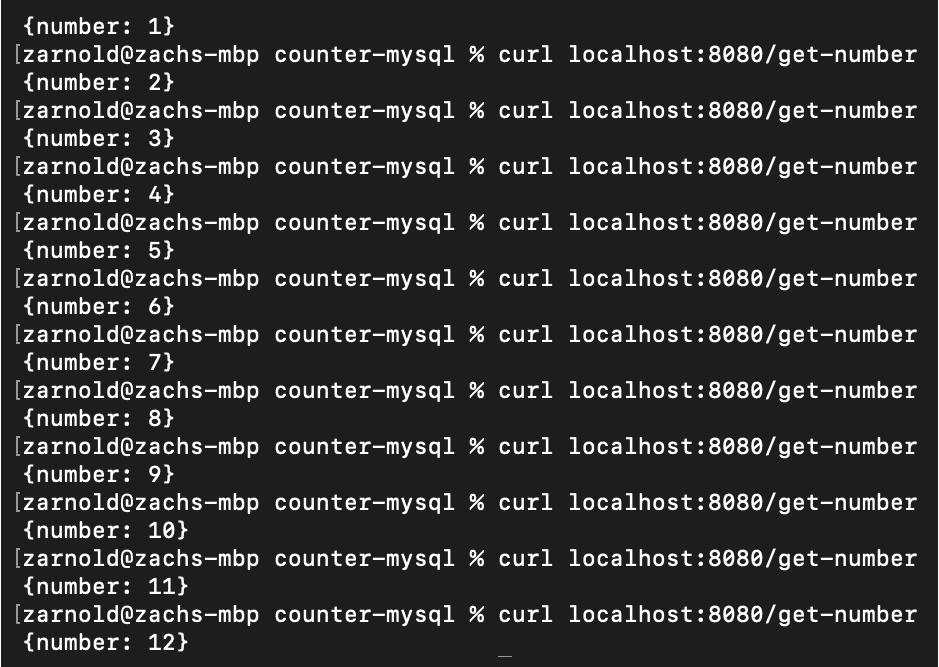

图 14.14:活动 14.01 的预期产出

注意

该活动的解决方案可在以下地址找到:[https://packt.live/304PEoD](https://packt.live/304PEoD)。

此外，在您完成活动后，不要忘记使用`terraform destroy`命令清理您的云资源，以阻止 AWS 向您收费。

# 总结

在本章的过程中，我们已经应用了我们的技能，以便能够在我们的示例应用中利用状态集。我们已经研究了如何考虑以编程方式运行软件的有状态部分，以及如何重构应用来利用状态持久性的变化。最后，我们学习了如何创建和运行 Kubernetes StatefulSets，它将允许我们在集群中运行有状态组件，并保证工作负载将如何运行。

具备管理 Kubernetes 集群上的有状态组件所需的技能是在您可能遇到的许多现实应用中有效运行的重要一步。

在下一章中，我们将更多地讨论使用度量服务器、HorizontalPodAutoscalers 和 ClusterAutoscaler 的数据驱动的应用编排。我们将了解这些对象如何帮助我们响应运行在 Kubernetes 集群上的应用的不同需求级别。