# 16。库柏入学控制器

概观

在本章中，我们将了解 Kubernetes 准入控制器，并使用它们来修改或验证传入的 API 请求。本章描述了 Kubernetes 接纳控制器的效用，以及它们如何扩展 Kubernetes 集群的功能。您将了解几个内置的准入控制器以及变异和验证控制器之间的区别。到本章结束时，您将能够创建自己的自定义准入控制器，并应用这些知识为您所需的场景构建控制器。

# 简介

在*第 4 章*、*如何与 Kubernetes (API Server)* 沟通中，我们学习了 Kubernetes 如何公开其**应用编程接口** ( **API** )与 Kubernetes 平台进行交互。您还学习了如何使用 kubectl 来创建和管理各种 Kubernetes 对象。kubectl 工具只是 Kubernetes API 服务器的一个客户端。Kubernetes 主节点托管 API 服务器，任何人都可以通过该服务器与集群通信。API 服务器不仅为外部参与者提供了一种与 Kubernetes 通信的方式，还为所有内部组件提供了一种通信方式，例如在工作节点上运行的 Kubernetes。

应用编程接口服务器是我们集群的中央接入点。如果我们想确保我们组织的默认最佳实践和策略得到实施，没有比在 API 服务器上检查和应用它们更好的地方了。Kubernetes 通过**准入控制器**提供了这种精确的能力。

让我们花一点时间来理解为什么准入控制是有用的。例如，假设我们在所有对象中都有一个标准标签集的策略，以帮助报告每个业务单位的对象组。这对于获取特定数据可能很重要，例如集成团队正在执行多少个 Pods。如果我们根据对象的标签来管理和监控对象，那么任何没有所需标签的对象都会妨碍我们的管理和监控实践。因此，我们希望实现一个策略，如果对象规范中没有定义这些标签，该策略将阻止创建对象。使用准入控制器可以轻松实现这一要求。

注意

开放策略代理是一个很好的例子，说明了如何使用网络钩子来构建一个可扩展的平台，以便在 Kubernetes 对象上应用标准。您可以在此链接找到更多详细信息:[https://www . open policy agent . org/docs/latest/kubernetes-入场-控制](https://www.openpolicyagent.org/docs/latest/kubernetes-admission-control)。

准入控制器是一组组件，它们拦截对 Kubernetes API 服务器的所有调用，并提供一种方法来确保任何请求都符合所需的标准。需要注意的是，控制器是在 API 调用被验证和授权之后，对象被操作并存储在 etcd 中之前调用的。这为实现控制和治理、应用标准以及接受或拒绝 API 请求提供了一个绝佳的机会，以保持集群处于所需的状态。让我们来看看接纳控制器在 Kubernetes 集群中是如何工作的。

# 入场控制员如何工作

Kubernetes 提供了一套超过 25 个入场控制器。默认情况下启用一组准入控制器，集群管理员可以向 API 服务器传递标志，以控制启用/禁用附加控制器(在生产级集群中配置 API 服务器不在本书的讨论范围之内)。这些可以大致分为两种类型:

*   **变异准入控制器**允许你在申请到库本内特平台之前修改申请。`LimitRanger`就是一个这样的例子，如果吊舱本身没有定义`defaultRequests`，它将把`defaultRequests`应用到吊舱。
*   **验证准入控制器**验证请求，不能更改请求对象。如果这个控制器拒绝了这个请求，Kubernetes 平台将不会执行它。这方面的一个例子是`NamespaceExists`控制器，如果请求中引用的名称空间不可用，它将拒绝该请求。

本质上，准入控制分两个阶段执行。在第一阶段，执行变异准入控制器，在第二阶段，执行验证准入控制器。

注意

根据具体情况，避免使用变异控制器可能是个好主意，因为它们会改变请求的状态，而调用者可能并不知道这些变化。相反，您可以使用验证控制器来拒绝无效的请求，并让调用者修复该请求。

下图显示了准入控制器的高级概述:

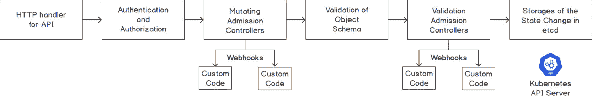

图 16.1:创建对象的应用编程接口请求的阶段

当 Kubernetes 应用编程接口服务器接收到一个应用编程接口调用(可以通过 kubectl 或运行在其他节点上的 kubelet 进行调用)时，它会通过以下几个阶段传递调用:

1.  执行呼叫的身份验证和授权，以确保呼叫者经过身份验证并且应用了 RBAC 策略。
2.  通过所有现有的变异控制器运行有效载荷。变异控制器是那些可以改变客户端发送的对象的控制器。
3.  检查对象是否符合定义的模式，以及所有字段是否有效。
4.  通过所有现有的验证控制器运行有效负载。这些控制器验证最终对象。
5.  将对象存储在 etcd 数据存储中。

从*图 16.1* 可以看到，有些入场控制员身上有一个叫**的网钩**。这可能不是所有的准入控制者都是如此。我们将在本章后面的章节中了解更多关于 webhooks 的内容。

请注意，一些控制器提供了变异和验证控制器的功能。事实上，一些 Kubernetes 函数被实现为准入控制器。例如，当 Kubernetes 命名空间进入终止状态时，`NamespaceLifecycle`准入控制器阻止在终止命名空间中创建新对象。

注意

为了简洁起见，我们将在本章中只介绍几个准入控制员。有关可用控制器的完整列表，请参考此链接:[https://kubernetes . io/docs/reference/access-authn-authz/入场控制器/#每个入场控制器做什么](https://kubernetes.io/docs/reference/access-authn-authz/admission-controllers/#what-does-each-admission-controller-do)。

让我们确认我们的 Minikube 设置配置为运行准入控制器。运行以下命令，在启用所有必需插件的情况下启动 Minikube:

```
minikube stop
minikube start --extra-config=apiserver.enable-admission-plugins="LimitRanger,NamespaceExists,NamespaceLifecycle,ResourceQuota,ServiceAccount,DefaultStorageClass,MutatingAdmissionWebhook,ValidatingAdmissionWebhook"
```

您应该会看到如下截图所示的响应:

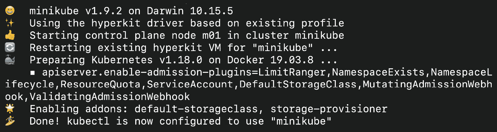

图 16.2:用运行准入控制器所需的所有插件启动 Minikube

现在我们已经对内置的准入控制器有了一个概述，让我们看看如何使用我们自己的定制逻辑来制作一个准入控制器。

# 使用自定义逻辑创建控制器

如前所述，Kubernetes 提供了一个具有预定义功能的控制器列表。这些控制器被烘焙成 Kubernetes 服务器二进制文件。然而，如果你需要有自己的政策或标准来检查，而没有一个准入控制符合你的要求，会发生什么？

为了满足这样的需求，Kubernetes 提供了一种叫做**入场网络钩子**的东西。有两种类型的入学网络挂钩，我们将在下面的章节中研究。

## 变异入学网钩

**变异准入网钩**是一种变异准入控制器，没有自己的逻辑。相反，它允许您定义一个将由 Kubernetes API 服务器调用的 URL。这个网址是我们网络钩子的地址。在功能上，网络钩子是一个 HTTPS 服务器，它接受请求，处理它们，然后做出响应。

如果定义了多个 URL，它们将在一个链中处理，也就是说，第一个 webhook 的输出将成为第二个 webhook 的输入。

Kubernetes 应用编程接口服务器将一个有效负载(AdmissionReview 对象)发送到正在处理请求的网络钩子网址。您可以根据自己的需求修改请求(例如，通过添加自定义注释)并发回修改后的请求。Kubernetes API 服务器将在创建资源的下一阶段使用修改后的对象。

执行流程如下:

1.  Kubernetes 应用编程接口接收创建对象的请求。例如，假设您想要创建一个定义如下的 Pod:

    ```
    apiVersion: v1
    kind: Pod
    metadata:
      name: configmap-env-pod
    spec:
      containers:
        - name: configmap-container
          image: k8s.gcr.io/busybox
          command: [ "/bin/sh", "-c", "sleep 5" ]
    ```

2.  Kubernetes 调用一个 webhook，定义为`MutatingAdmissionWebHook`，并将对象定义传递给它。在这种情况下，它是 Pod 规范。
3.  webhook(您编写的自定义代码)接收对象，并根据自定义规则对其进行修改。比方说，它添加了自定义注释`podModified="true"`。修改后的对象会是这样的:

    ```
    apiVersion: v1
    kind: Pod
    metadata:
      name: configmap-env-pod
      annotations:
     podModified: "true"
    spec:
      containers:
        - name: configmap-container
          image: k8s.gcr.io/busybox
          command: [ "/bin/sh", "-c", "sleep 5" ]
    ```

4.  webhook 返回修改后的对象。
5.  Kubernetes 会将修改后的对象视为原始请求，然后继续前进。

前面提到的流程可以可视化如下。请注意，流程已简化，因此您可以了解主要阶段:

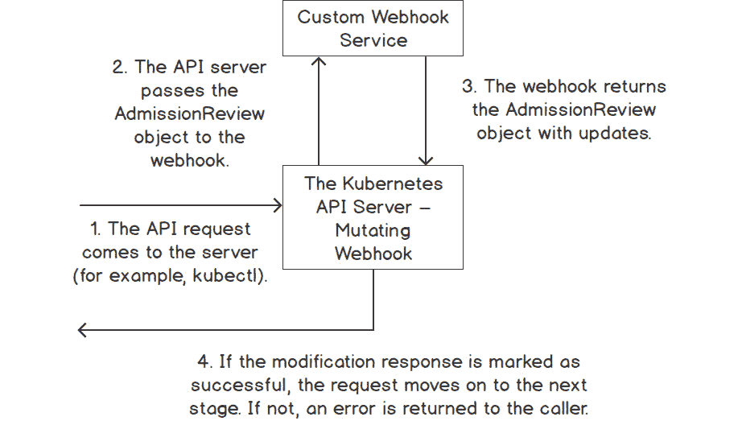

图 16.3:变异准入网络钩子的流程

## 验证准入网络挂钩

第二种类型的网络挂钩是验证准入网络挂钩。这个钩子，类似于一个变异的承认网络钩子，没有自己的逻辑。遵循同样的模式，它允许我们定义一个 URL，最终提供决定接受或拒绝这个调用的逻辑。

主要区别在于，验证 webhook 不能修改请求，只能允许或拒绝请求。如果这个 webhook 拒绝了请求，Kubernetes 将向调用者发送一个错误；否则，它将继续执行请求。

# 一个网钩是如何工作的

Webhooks 作为 Pods 部署在 Kubernetes 集群中，Kubernetes API 服务器使用 **AdmissionReview** 对象通过 SSL 调用它们。该对象定义了**授权请求**和**授权响应**对象。webhook 从 AdmissionRequest 对象中读取请求负载，并在 AdmissionResponse 对象中提供成功标志和可选的更改。

以下是 AdmissionReview 对象的顶级定义。请注意，AdmissionRequest 和 AdmissionResponse 都是 AdmissionReview 对象的一部分。以下是从 Kubernetes 源代码中的 AdmissionReview 对象的定义中摘录的内容:

```
// AdmissionReview describes an admission review request/response.
type AdmissionReview struct {
    metav1.TypeMeta `json:",inline"`
    // Request describes the attributes for the admission request.
    // +optional
    Request *AdmissionRequest `json:"request,omitempty"       protobuf:"bytes,1,opt,name=request"`
    // Response describes the attributes for the admission response.
    // +optional
    Response *AdmissionResponse `json:"response,omitempty" protobuf:"bytes,2,opt,name=response"`
}
```

注意

这个片段是从 Kubernetes 源代码中提取的。您可以在此链接查看 AdmissionReview 对象的更多详细信息:[https://github . com/kubernetes/API/blob/release-1.16/入场/v1 beta 1/type . go](https://github.com/kubernetes/api/blob/release-1.16/admission/v1beta1/types.go)。

相同的 AdmissionReview 对象用于变更和验证准入 webhooks。变异的 webhook 计算满足您在 webhook 中编码的自定义需求所需的更改。这些更改(定义为补丁)与 AdmissionResponse 对象中的`patchType`字段一起传递到`patch`字段。然后，应用编程接口服务器将该补丁应用于原始对象，并将结果对象保存在应用编程接口服务器中。为了验证 webhook，这两个字段保持为空。

一个有效的准入网络钩子将简单地设置一个标志来接受或拒绝一个请求，而一个变化的准入网络钩子将设置一个标志来确定该请求是否按照请求被成功修改。

首先，让我们仔细看看如何手动修补对象，这将有助于您构建一个可以修补对象的 webhook。

您可以使用`kubectl patch`命令手动修补对象。例如，假设您想在对象的`.metadata.annotation`部分添加一个字段。为此，命令如下所示:

```
kubectl patch configmap simple-configmap -n webhooks -p '{"metadata": {"annotations":  {"new":"annotation"}  } }'
```

请注意我们要添加的字段前后的双空格(在前面的命令中显示为`{"new":"annotation"}`)。让我们在一个练习中实现它，在这个练习中，我们还将学习如何将这个命令与 JSON 负载一起使用。

## 练习 16.01:通过面片修改配置映射对象

在本练习中，我们将使用 kubectl 修补 ConfigMap。我们将向 ConfigMap 对象添加一个注释。这个注释以后可以用来对对象进行分组，类似于我们在*简介*部分提到的用例。因此，如果多个团队正在使用一个集群，我们会想要跟踪哪些团队正在使用哪些资源。让我们开始练习:

1.  Create a namespace with the name `webhooks`:

    ```
    kubectl create ns webhooks
    ```

    您应该会看到以下响应:

    ```
    namespace/webhooks created
    ```

2.  Next, create a ConfigMap using the following command:

    ```
    kubectl create configmap simple-configmap --from-literal=url=google.com -n webhooks
    ```

    您将看到以下响应:

    ```
    configmap/simple-configmap created
    ```

3.  Check the contents of the ConfigMap using the following command:

    ```
    kubectl get configmap simple-configmap -o yaml -n webhooks
    ```

    您应该会看到以下响应:

    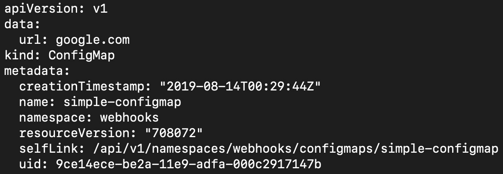

    图 16.4:以 YAML 格式获取配置图的内容

4.  Now, let's patch the ConfigMap with an annotation. The annotation we want to add is `teamname` with the value of `kubeteam`:

    ```
    kubectl patch configmap simple-configmap -n webhooks -p '{"metadata": {"annotations":  {"teamname":"kubeteam"}  } }'
    ```

    您将得到以下响应:

    ```
    configmap/simple-configmap patched
    ```

    在*第 6 章*、*标签和注释*中，我们了解到注释是作为键值对存储的。因此，一个键只能有一个值，如果该键已经存在一个值(在本例中为`teamname`)，则该值将被新值覆盖。因此，请确保您的 webhook 逻辑排除了已经具有所需配置的对象。

5.  Now, let's apply another patch using detailed patch instructions using JSON format to provide the required field:

    ```
    kubectl patch configmap simple-configmap -n webhooks --type='json' -p='[{"op": "add", "path": "/metadata/annotations/custompatched", "value": "true"}]'
    ```

    请注意，补丁有三个组成部分:`op`(用于`add`)、`path`(用于要补丁的字段的位置)和`value`(这是新值)。您应该会看到以下响应:

    ```
    configmap/simple-configmap patched
    ```

    这是应用补丁的另一种方式。您可以看到前面的命令，它指示 Kubernetes 添加一个新的注释，键为`custompatched`，值为`true`。

6.  Now, let's see whether the patch has been applied. Use the following command:

    ```
    kubectl get configmap simple-configmap -n webhooks -o yaml
    ```

    您应该会看到以下输出:

    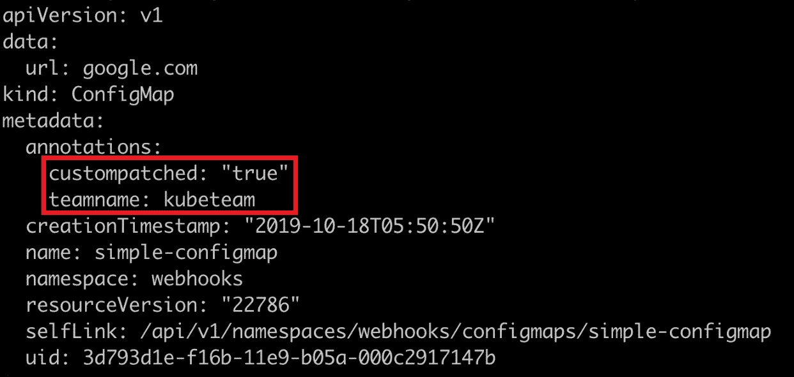

图 16.5:在我们的配置图上检查修改后的注释

如您在`metadata`下的`annotations`字段中所见，两个注释都已应用于我们的配置图。平台团队现在知道谁拥有这个配置映射对象。

## 构建变异入园网钩的指南

我们现在知道了一个有效的变异入学网络钩子的所有部分。请记住，webhook 只是一个简单的 HTTPS 服务器，您可以用自己选择的语言编写它。Webhooks 作为 Pods 部署在集群中。Kubernetes API 服务器将通过端口 443 上的 SSL 调用这些 Pods 来变异或验证对象。

构建 webhook Pod 的伪代码如下所示:

1.  一个简单的 HTTPS 服务器(网络挂钩)被设置在一个吊舱中，以接受开机自检呼叫。请注意，呼叫必须通过 SSL 进行。
2.  Kubernetes 将通过 HTTPS POST 调用将 AdmissionReview 对象发送到 webhook。
3.  webhook 代码将处理 AdmissionRequest 对象，以获取请求中对象的详细信息。
4.  webhook 代码可以选择修补对象，并设置响应标志来指示成功或失败。
5.  webhook 代码将使用更新的请求填充 AdmissionReview 对象中的 AdmissionResponse 部分。
6.  网络挂钩将使用 AdmissionReview 对象响应开机自检调用(在*步骤 2* 中接收到)。
7.  Kubernetes API 服务器将评估响应，并根据标志接受或拒绝客户端请求。

在 webhook 的代码中，我们将使用 JSON 指定路径和所需的修改。请记住，在前面的练习中，在打补丁时，我们的补丁对象定义将包含以下内容:

*   `op`指定`add``replace`等操作。
*   `path`指定我们试图修改的字段的位置。参考*图 16.5* 中命令的输出，注意不同的字段位于不同的地方。例如，名称在元数据字段中，因此其路径将是`/metadata/name`。
*   `value`指定字段的值。

在 Go 中编写的一个简单的变异网络钩子应该如下所示:

变异控制器，开始

```
20 func MutateCustomAnnotation(admissionRequest      *v1beta1.AdmissionRequest ) (*v1beta1.AdmissionResponse,      error){ 
21 
22   // Parse the Pod object. 
23   raw := admissionRequest.Object.Raw 
24   pod := corev1.Pod{} 
25   if _, _, err := deserializer.Decode(raw, nil, &pod); err !=        nil{ 
26         return nil, errors.New("unable to parse pod") 
27   } 
28 
29   //create annotation to add 
30   annotations := map[string]string{"podModified" : "true"} 
31 
32   //prepare the patch to be applied to the object 
33   var patch []patchOperation 
34   patch = append(patch, patchOperation{ 
35         Op:   "add", 
36         Path: "/metadata/annotations", 
37         Value: annotations, 
38   }) 
39 
40   //convert patch into bytes 
41   patchBytes, err := json.Marshal(patch) 
42   if err != nil { 
43         return nil, errors.New("unable to parse the patch") 
44   } 
45 
46   //create the response with patch bytes 
47   var admissionResponse *v1beta1.AdmissionResponse 
48   admissionResponse = &v1beta1.AdmissionResponse { 
49         Allowed: true, 
50         Patch:   patchBytes, 
51         PatchType: func() *v1beta1.PatchType { 
52              pt := v1beta1.PatchTypeJSONPatch 
53              return &pt 
54         }(), 
55   } 
56 
57   //return the response 
58   return admissionResponse, nil 
59 
60 } 
```

这个例子的完整代码可以在[https://packt.live/2GFRCot](https://packt.live/2GFRCot)找到。

正如您在前面的代码中看到的，三个主要部分是**许可请求**对象、**补丁**和带有补丁信息的**许可响应**对象。

到目前为止，在这一章中，我们已经了解了什么是准入 webhook，以及它如何与 Kubernetes API 服务器交互。我们还演示了一种更改请求对象的方法，即使用补丁。现在，让我们应用到目前为止所学的知识，并在我们的 Kubernetes 集群中部署一个 webhook。

请记住，应用编程接口服务器和网络钩子之间的所有通信都通过 SSL 进行。SSL 是一种用于网络安全通信的协议。为此，我们需要创建公钥和私钥，您将在下面的练习中看到这一点。

请注意，我们还没有构建进入 webhook 的代码。首先，让我们演示如何使用预构建的容器为网络挂钩部署 Pods(使用 Deployment)，然后我们将继续构建进入 Pods 的代码，以使网络挂钩启动并运行。

## 练习 16.02:部署网络钩子

在本练习中，我们将向 Kubernetes 部署一个简单的预构建 webhook 服务器。请记住，网络钩子只是一个 HTTPS 服务器，这正是我们要创建的。当 Kubernetes 必须通过 SSL 调用 webhook 端点时，我们需要为我们的调用创建一个证书。一旦我们为 SSL 通信创建了证书，我们将使用 Kubernetes 部署对象来部署我们的网络钩子:

1.  Create a **Certificate Authority** (**CA**) for a self-signed certificate. This CA will be later used to create trust between the Kubernetes and our webhook server for the HTTPS call:

    ```
    openssl req -nodes -new -x509 -keyout controller_ca.key -out controller_ca.crt -subj "/CN=Mutating Admission Controller Webhook CA"
    ```

    这会给你以下的回应:

    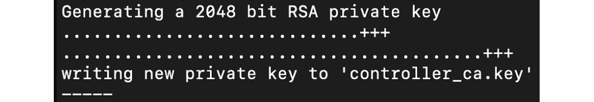

    图 16.6:生成自签名证书

    注意

    您可以在此链接了解更多关于自签名证书的信息:[https://aboutssl.org/what-is-self-sign-certificate/](https://aboutssl.org/what-is-self-sign-certificate/)。

2.  Create the private key for the SSL call:

    ```
    openssl genrsa -out tls.key 2048
    ```

    您应该会看到以下响应:

    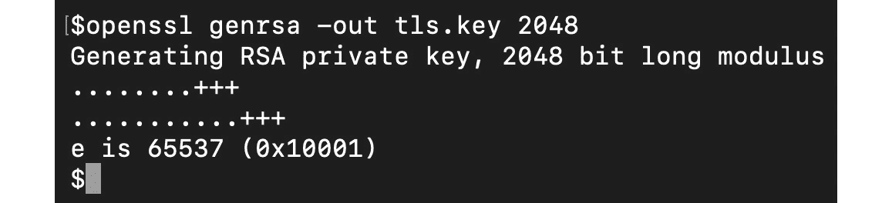

    图 16.7:为 SSL 调用创建私钥

3.  Now sign the server certificate with the CA:

    ```
    openssl req -new -key tls.key -subj "/CN=webhook-server.webhooks.svc" \
        | openssl x509 -req -CA controller_ca.crt -CAkey controller_ca.key -CAcreateserial -out tls.crt
    ```

    请注意，该命令中的服务名称是将在集群中公开我们的 webhook 的服务，以便 API 服务器可以访问它。我们将在*第 7 步*中重温这个名字。您应该会看到以下响应:

    ```
    Signature ok
    subject=/CN=webhook-server.webhooks.svc
    Getting CA Private Key
    ```

4.  Now we have created a certificate that our server can use. Next, we will just create a Kubernetes Secret to load the private key and certificate to our webhook server:

    ```
    kubectl -n webhooks create secret tls webhook-server-tls \
        --cert "tls.crt" \
        --key "tls.key"
    ```

    您应该会看到以下响应:

    ```
    secret/webhook-server-tls created
    ```

5.  Our webhook will run as a Pod, which we will create using a Deployment. To do that, first, create a file named `mutating-server.yaml` with the following content:

    ```
    apiVersion: apps/v1
    kind: Deployment
    metadata:
      name: webhook-server
      labels:
        app: webhook-server
    spec:
      replicas: 1
      selector:
        matchLabels:
          app: webhook-server
      template:
        metadata:
          labels:
            app: webhook-server
        spec:
          containers:
          - name: server
            image: packtworkshops/the-kubernetes-          workshop:mutating-webhook
            imagePullPolicy: Always
            ports:
            - containerPort: 8443
              name: webhook-api
            volumeMounts:
            - name: webhook-tls-certs
              mountPath: /etc/secrets/tls
              readOnly: true
          volumes:
          - name: webhook-tls-certs
            secret:
              secretName: webhook-server-tls
    ```

    请注意，我们正在链接到我们提供的服务器的预制映像。

6.  Create a Deployment using the YAML file that we created in the previous step:

    ```
    kubectl create -f mutating-server.yaml -n webhooks
    ```

    您应该会看到以下响应:

    ```
    deployment.apps/webhook-server created
    ```

7.  Once the server is created, we need to create a Kubernetes Service. Note that the Service is accessible through `webhook-server.webhooks.svc`. This string, which we used in *step 3* while creating the certificate, is based on the fields defined in the following specification, in the format of `<SERVICENAME>.<NAMESPACENAME>.svc`.

    创建一个名为`mutating-serversvc.yaml`的文件，以定义具有以下规范的服务:

    ```
    apiVersion: v1
    kind: Service
    metadata:
      labels:
        app: webhook-server
      name: webhook-server
      namespace: webhooks
    spec:
      ports:
      - port: 443
        protocol: TCP
        targetPort: 8443
      selector:
        app: webhook-server
      sessionAffinity: None
      type: ClusterIP
    ```

8.  Using the definition from the previous step, create the Service using the following command:

    ```
    kubectl create -f mutating-serversvc.yaml -n webhooks
    ```

    您应该会看到以下响应:

    ```
    service/webhook-server created
    ```

在本练习中，我们已经部署了一个预构建的网络钩子并配置了证书，这样我们的网络钩子就可以接受来自 Kubernetes API 服务器的调用。

## 将网络挂钩配置为与 Kubernetes 一起工作

在这个阶段，我们已经使用一个部署创建并部署了网络钩子。现在，我们需要向 Kubernetes 注册该 webhook，以便 Kubernetes 知道它。方法是创建一个`MutatingWebHookConfiguration`对象。

注意

你可以在[https://kubernetes . io/docs/reference/access-authn-authz/extendable-accession-controller/](https://kubernetes.io/docs/reference/access-authn-authz/extensible-admission-controllers/)找到更多关于 MutatingConfigurationWebhook 的详细信息。

下面的代码片段显示了`MutatingWebhookConfiguration`的配置对象的示例:

```
apiVersion: admissionregistration.k8s.io/v1beta1
kind: MutatingWebhookConfiguration
metadata:
  name: pod-annotation-webhook
webhooks:
- name: webhook-server.webhooks.svc
   clientConfig:
     service:
       name: webhook-server
       namespace: webhooks
       path: "/mutate"
     caBundle: "LS0…"    #The caBundle is truncated for brevity
   rules:
     - operations: [ "CREATE" ]
       apiGroups: [""]
       apiVersions: ["v1"]
       resources: ["pods"]
```

以下是前一个对象的几个值得注意的定义:

1.  `clientConfig.service`部分定义了变异网络钩子的位置(我们在*练习 16.02* 、*部署网络钩子*中部署了该位置)。
2.  `caBundle`部分包含将通过其建立 SSL 信任的证书。这是以 Base64 格式编码的证书。我们将在下一节解释如何对其进行编码。
3.  `rules`部分定义了需要拦截哪些操作。在这里，我们指示 Kubernetes 拦截任何创建新 Pod 的调用。

## 如何以 Base64 格式编码证书

如前所述，当 Kubernetes API 服务器调用 webhook 时，调用是通过 SSL 加密的，我们需要在 webhook 定义中提供 SSL 信任证书。这可以在上一节`MutatingWebhookConfiguration`定义中的`caBundle`字段中看到。该字段中的数据是 Base64 编码的，正如您在*第 10 章*、*配置地图和机密*中了解到的。以下命令可用于以 Base64 格式编码证书。

首先，使用以下命令将生成的文件转换为 Base64 格式:

```
openssl base64 -in controller_ca.crt -out controller_ca-base64.crt
```

由于我们需要将生成的 CA 包转换为 Base64 格式并将其放入 YAML 文件中(如前所述)，因此我们需要删除换行符(`\n`)。以下命令可用于此目的:

```
cat controller_ca-base64.crt | tr -d '\n' > onelinecert.pem
```

这两个命令在成功执行后不会在终端中显示任何响应。在这个阶段，您将在`onelinecert.pem`文件中拥有 CA 包，您可以复制它来创建您的 YAML 定义。

## 活动 16.01:创建一个向 Pod 添加注释的变异网络钩子

在本活动中，我们将使用在本章节和前面章节中获得的知识来创建一个突变的网络钩子，该钩子向 Pod 添加了一个自定义注释。这种网络钩子可以有很多用例。例如，您可能希望记录容器映像是否来自以前批准的存储库，以便将来报告。进一步扩展，您还可以在不同的节点上调度来自不同存储库的 Pods。

完成本活动的高级步骤如下:

1.  创建一个名为`webhooks`的新命名空间。如果它已经存在，请删除现有的命名空间，然后重新创建它。
2.  生成自签名证书颁发机构证书。
3.  为 SSL 生成一个私有/公共密钥对，并用 CA 证书对其进行签名。
4.  创建一个秘密，保存上一步生成的私钥/公钥对。
5.  编写 webhook 代码，在 Pod 中添加自定义注释。
6.  将 webhook 服务器代码打包为 Docker 容器。
7.  Push the Docker container to a public repository of your choice.

    注意

    如果您在构建自己的网络钩子时有任何困难，您可以使用以下链接中的代码作为参考:[https://packt.live/2R1vJlk](https://packt.live/2R1vJlk)。

    如果您想避免构建和打包一个 webhook，我们提供了一个预构建的容器，这样您就可以在您的部署中直接使用它。您可以从 Docker Hub: `packtworkshops/the-kubernetes-workshop:webhook`使用此图像。

    使用此图像，您可以跳过*步骤 5* 至*步骤 7* 。

8.  创建部署 webhook 服务器的部署。
9.  将 webhooks 部署公开为 Kubernetes 服务。
10.  创建 CA 证书的 Base64 编码版本。
11.  创建一个`MutatingWebHookConfiguration`对象，这样 Kubernetes 就可以拦截 API 调用并调用我们的 webhook。

在这个阶段，我们的网络钩子已经被创建。现在，为了测试我们的网络钩子是否工作，创建一个没有注释的简单 Pod。

一旦创建了 Pod，请确保通过描述它将注释添加到 Pod 中。这是预期输出的截断版本。请注意，这里的注释应该是由我们的 webhook 添加的:

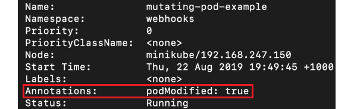

图 16.8:活动 16.01 的预期产出

注意

这个活动的解决方案可以在第 799 页找到。

# 验证网络挂钩

我们已经了解到，变异的网络钩子本质上允许修改 Kubernetes 对象。另一种网络钩子叫做验证网络钩子。顾名思义，这个 webhook 不允许对 Kubernetes 对象进行任何更改；相反，它是我们集群的看门人。它允许我们编写代码来验证任何被请求的 Kubernetes 对象，并根据我们指定的条件允许或拒绝请求。

让我们通过一个例子来理解这有什么帮助。假设我们的 Kubernetes 集群被许多团队使用，我们想知道哪些 Pods 与哪些团队相关联。一种解决方案是要求所有团队在他们的 Pod 上添加一个标签(例如，一个以键为`teamName`以团队名称为值的标签)。正如您所猜测的，强制执行一组标签并不是标准的 Kubernetes 特性。在这种情况下，我们需要创建自己的逻辑来禁止没有这些标签的 Pods。

实现这一点的一种方法是编写一个验证性的 webhook，在 Pods 的任何请求中查找该标签，如果该标签不存在，则拒绝创建请求的 Pods。在本章后面的*活动 16.02**中，您将完全按照这个步骤来创建一个验证网络钩子，用于检查 Pod* 中的标签。现在，让我们看看验证 webhook 的代码是什么样子的。

## 编写一个简单的验证网络钩子

让我们看一下一个简单的验证 webhook 的代码摘录:

```
func ValidateTeamAnnotation(admissionRequest   *v1beta1.AdmissionRequest ) (*v1beta1.AdmissionResponse, error){
      // Get the AdmissionReview Object
      raw := admissionRequest.Object.Raw
      pod := corev1.Pod{}

     // Parse the Pod object.
      if _, _, err := deserializer.Decode(raw, nil, &pod);         err != nil {
            return nil, errors.New("unable to parse pod")
      }
      //Get all the Labels of the Pod
      podLabels := pod.ObjectMeta.GetLabels()

      //Logic to check if label exists
      //check if the teamName label is available, if not         generate an error.
      if podLabels == nil || podLabels[teamNameLabel] == "" {
           return nil, errors.New("teamName label not found")
      }

      //Populate the Allowed flag
      //if the teamName label exists, return the response with 
      //Allowed flag set to true.
      var admissionResponse *v1beta1.AdmissionResponse
      admissionResponse = &v1beta1.AdmissionResponse {
           Allowed: true,
      }
      //Return the response with Allowed set to true
      return admissionResponse, nil
}
const (
      //This is the name of the label that is expected to be         part of the pods to allow them to be created.
      teamNameLabel = `teamName`
)
```

您可以在这个片段中观察到的三个主要部分是:AdmissionRequest 对象、检查标签是否存在的逻辑，以及创建带有 Allowed 标志的 AdmissionResponse 对象。

现在我们已经理解了验证 webhook 所需的所有不同组件，让我们在下面的活动中构建一个。

## 活动 16.02:创建一个验证网络钩子，用于检查容器中的标签

在本练习中，我们将使用在本章节和前面章节中获得的知识编写一个验证性的网络钩子，用于验证请求的 Pod 中是否存在标签。

所需步骤如下:

1.  创建一个名为`webhooks`的新命名空间。如果它已经存在，请删除现有的命名空间，然后重新创建它。
2.  生成自签名证书颁发机构证书。
3.  为 SSL 生成一个私有/公共密钥对，并用 CA 证书对其进行签名。
4.  Create a secret that holds the private/public key pair generated in the previous step.

    注意

    即使您拥有前一活动的证书和机密，我们也建议您丢弃它们并重新开始，以避免任何冲突。

5.  编写网钩代码，检查是否存在带`teamName`键的标签。如果不存在，则拒绝该请求。
6.  将 webhook 代码打包为 Docker 容器。
7.  Push the Docker container to a public repository of your choice (quay.io allows you to create a free public repository).

    注意

    如果您在构建自己的网络钩子时有任何困难，您可以使用以下链接中的代码作为参考:[https://packt.live/2FbL7Jv](https://packt.live/2FbL7Jv)。

    如果您想避免构建和打包一个 webhook，我们提供了一个预构建的容器，这样您就可以在您的部署中直接使用它。您可以从 Docker Hub: `packtworkshops/the-kubernetes-workshop:webhook`使用此图像。

    使用此图像，您可以跳过*步骤 5* 至*步骤 7* 。

8.  创建部署 webhook 服务器的部署。
9.  将 webhooks 部署公开为 Kubernetes 服务。
10.  创建 CA 证书的 Base64 编码版本。
11.  创建`ValidtingWebhookConfiguration`让 Kubernetes 可以拦截 API 调用，调用我们的 webhook。
12.  创建一个没有标签的简单 Pod，并验证它是否被拒绝。
13.  使用所需的标签创建一个简单的 Pod，并验证是否正在创建它。
14.  创建 Pod 后，确保标签是 Pod 规范的一部分。

您可以通过尝试创建一个没有`teamName`标签的 Pod 来测试您的验证 webhook。它将被拒绝，并显示以下消息:

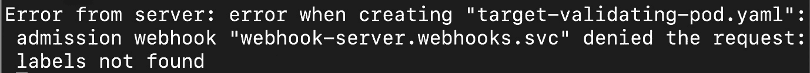

图 16.9:活动 16.02 的预期产出

注意

该活动的解决方案可在以下地址找到:[https://packt.live/304PEoD](https://packt.live/304PEoD)。

## 控制网络挂钩对选定名称空间的影响

当您定义任何网络钩子(变更或验证)时，您可以通过定义`namespaceSelector`参数来控制哪些名称空间将受到网络钩子的影响。请注意，这仅适用于命名空间范围的对象。对于集群范围的对象，如持久卷，此参数没有影响，将应用 webhook。

注意

并非所有的准入控制器(变异或验证)都可以限制在一个名称空间内。

就像许多 Kubernetes 对象一样，名称空间也可以有标签。我们将使用名称空间的这个属性在特定的名称空间上应用一个 webhook，您将在下面的练习中看到这一点。

## 练习 16.03:使用定义的名称空间选择器创建验证网络钩子

在本练习中，我们将定义一个验证 webhook，该 web hook 强制实施一个自定义规则，以应用于在`webhooks`命名空间中创建的 Pods。规则是 Pod 必须定义一个名为`teamName`的标签。由于该规则适用于在`webhooks-demo`命名空间中创建的 Pods，所有其他命名空间都可以创建没有定义标签的 Pods。

注意

在运行本练习之前，请确保您已经完成了*活动 16.02* ，*创建了一个验证网络钩子，该钩子在容器*中检查标签，因为我们正在重用在那里创建的对象。如果您在活动中遇到任何问题，可以参考*附录*中的解决方案。

1.  Verify that the validating webhook we created in *Activity 16.02*, *Creating a Validating Webhook that Checks for a Label in a Pod*, still exists:

    ```
    kubectl get ValidatingWebHookConfiguration -n webhooks
    ```

    您将看到以下响应:

    ```
    NAME                        CREATED AT
    pod-label-verify-webhook    201908-23T13:59:30Z
    ```

2.  Now, delete the preexisting validating webhook defined in *Activity 16.02*, *Creating a Validating Webhook that Checks for a Label in a Pod*:

    ```
    kubectl delete ValidatingWebHookConfiguration pod-label-verify-webhook -n webhooks
    ```

    注意

    `ValidatingWebHookConfiguration`是一个集群范围的对象，指定`-n`标志对于该命令是可选的。

    您将得到以下响应:

    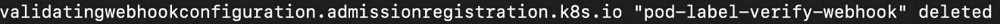

    图 16.10:删除现有的验证 webhook

3.  Delete the `webhooks` namespace:

    ```
    kubectl delete ns webhooks
    ```

    您将得到以下响应:

    ```
    namespace "webhooks" deleted
    ```

4.  Create the `webhooks` namespace:

    ```
    kubectl create ns webhooks
    ```

    您将得到以下响应:

    ```
    namespace/webhooks created
    ```

    现在我们应该有一个干净的石板来继续这个练习。

5.  Create a new CA bundle and a private/public key pair to be used in this webhook. Generate a self-signed certificate using this command:

    ```
    openssl req -nodes -new -x509 -keyout controller_ca.key -out controller_ca.crt -subj "/CN=Mutating Admission Controller Webhook CA"
    ```

    您将获得类似如下的输出:

    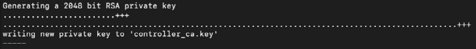

    图 16.11:生成自签名证书

    注意

    即使您已经在上一个活动中创建了证书颁发机构和密钥，您也需要重新创建它们才能使本练习正常进行。

6.  Generate a private/public key pair and sign it with the CA certificate using the following two commands, one after the other:

    ```
    openssl genrsa -out tls.key 2048
    openssl req -new -key tls.key -subj "/CN=webhook-server.webhooks.svc" \
        | openssl x509 -req -CA controller_ca.crt -Cakey controller_ca.key -Cacreateserial -out tls.crt
    ```

    您将获得类似于以下响应的输出:

    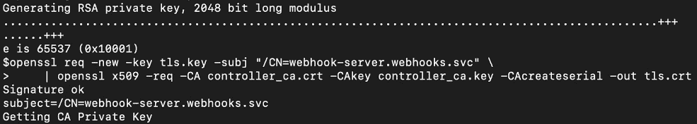

    图 16.12:用我们的证书签署私有/公共密钥对

7.  Create a secret that holds the private/public key pair:

    ```
    kubectl -n webhooks create secret tls webhook-server-tls \
    --cert "tls.crt" \
    --key "tls.key"
    ```

    您应该会得到以下响应:

    ```
    secret/webhook-server-tls created
    ```

8.  Next, we need to deploy the webhook in the `webhooks` namespace. Create a file named `validating-server.yaml` with the following content:

    ```
    apiVersion: apps/v1
    kind: Deployment
    metadata:
      name: webhook-server
      labels:
        app: webhook-server
    spec:
      replicas: 1
      selector:
        matchLabels:
          app: webhook-server
      template:
        metadata:
          labels:
            app: webhook-server
        spec:
          containers:
          - name: server
            image: packtworkshops/the-kubernetes-workshop:webhook
            imagePullPolicy: Always
            ports:
            - containerPort: 8443
              name: webhook-api
            volumeMounts:
            - name: webhook-tls-certs
              mountPath: /etc/secrets/tls
              readOnly: true
          volumes:
          - name: webhook-tls-certs
            secret:
              secretName: webhook-server-tls
    ```

    注意

    您可以使用在*活动 16.02* 、*中创建的相同的网络钩子图像，创建一个验证网络钩子来检查 Pod* 中的标签。在这个参考 YAML 中，我们使用了我们在存储库中提供的图像。

9.  Deploy the webhook server by using the definition from the previous step:

    ```
    kubectl create -f validating-server.yaml -n webhooks
    ```

    您应该会看到以下响应:

    ```
    deployment.apps/webhook-server created
    ```

10.  You might need to wait a bit and check whether the webhook Pods have been created. Keep checking the status of the Pods:

    ```
    kubectl get pods -n webhooks -w
    ```

    您应该会看到以下响应:

    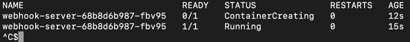

    图 16.13:检查我们的网络钩子是否在线

    请注意，`-w`标志持续观察 Pods。当所有的吊舱都准备好了，你可以结束手表。

11.  Now, we have to expose the deployed webhook server via the Kubernetes service. Create a file named `validating-serversvc.yaml` with the following content:

    ```
    apiVersion: v1
    kind: Service
    metadata:
      labels:
        app: webhook-server
      name: webhook-server
      namespace: webhooks
    spec:
      ports:
      - port: 443
        protocol: TCP
        targetPort: 8443
      selector:
        app: webhook-server
      sessionAffinity: None
      type: ClusterIP
    ```

    请注意，网络钩子服务必须在端口`443`上运行，因为这是 TLS 通信的标准。

12.  Use the definition from the previous step to create the service using the following command:

    ```
    kubectl create -f validating-serversvc.yaml -n webhooks
    ```

    您将看到以下输出:

    ```
    service/webhook-server created
    ```

13.  Create a Base64-encoded version of the CA certificate. Use the following commands, one after the other:

    ```
    openssl x509 -inform PEM -in controller_ca.crt > controller_ca.crt.pem
    openssl base64 -in controller_ca.crt.pem -out controller_ca-base64.crt.pem
    ```

    第一个命令是将证书转换为 PEM 格式。第二个是将 PEM 证书转换为 Base64。这些命令没有响应。您可以使用以下命令检查文件:

    ```
    cat controller_ca-base64.crt.pem
    ```

    文件内容应该是这样的:

    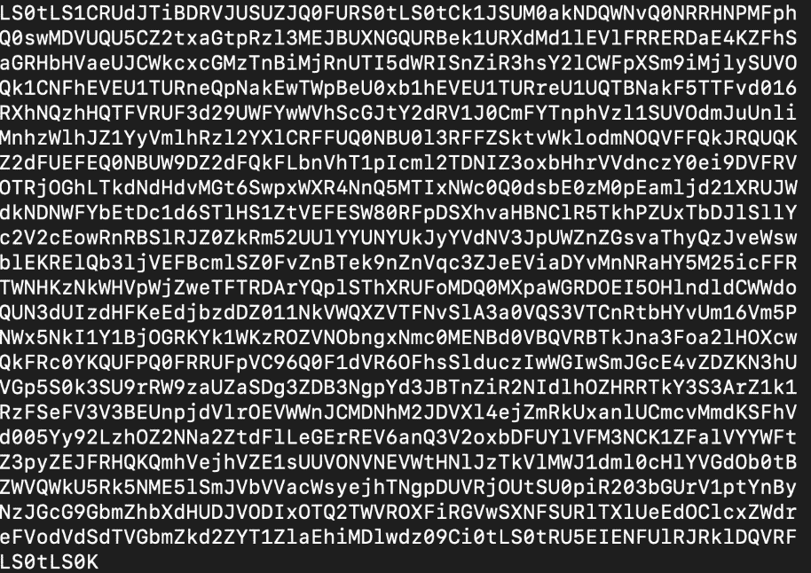

    图 16.14:Base64 编码证书的内容

    请注意，您生成的顶级域名证书看起来与此处显示的不完全一样。

14.  Use the following two commands to clean up the blank lines from our CA certificate and add the contents to a new file:

    ```
    cat controller_ca-base64.crt.pem | tr -d '\n' > onelinecert.pem
    cat onelinecert.pem
    ```

    第一个命令没有响应，第二个命令打印出`onlinecert.pem`的内容。您应该会看到以下响应:

    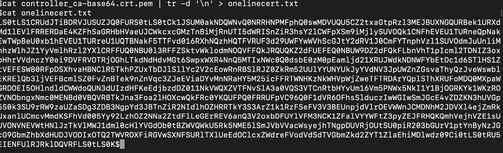

    图 16.15:删除了换行符的 Base64 编码证书

    现在我们有了 Base64 编码的证书，没有空行。对于下一步，我们将复制您在该输出中获得的值，注意不要复制值末尾的`$`(在 Zsh 的情况下将是`%`)。将该值粘贴到`validation-config-namespace-scoped.yaml`中的`CA_BASE64_PEM`(用于`caBundle`的占位符)位置，该位置将在下一步创建。

15.  Create a file, named `validation-config-namespace-scoped.yaml`, using the following `ValidatingWebHookConfiguration` specification to configure the Kubernetes API server to call our webhook:

    ```
    apiVersion: admissionregistration.k8s.io/v1beta1
    kind: ValidatingWebhookConfiguration
    metadata:
      name: pod-label-verify-webhook
    webhooks:
      - name: webhook-server.webhooks.svc
     namespaceSelector:
     matchExpressions:
     - key: applyValidation
     operator: In
     values: ["true","yes", "1"]

        clientConfig:
          service:
            name: webhook-server
            namespace: webhooks
            path: "/validate"
          caBundle: "CA_BASE64_PEM"    #Retain the quotes when you         copy the caBundle here. Please read the note below on         how to add specific values here.
        rules:
          - operations: [ "CREATE" ]
            apiGroups: [""]
            apiVersions: ["v1"]
            resources: ["pods"]
     scope: "Namespaced"
    ```

    注意

    `CA_BASE64_PEM`占位符将替换为上一步`onelinecert.pem`的内容。注意不要复制任何换行符。

16.  Create the webhook, as defined in the previous step. Make sure that you replace the `caBundle` field with the certificates created in the earlier steps:

    ```
    kubectl create -f validation-config-namespace-scoped.yaml
    ```

    您应该会看到以下响应:

    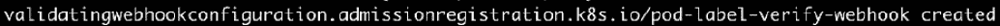

    图 16.16:创建 ValidatingWebhookConfiguration

17.  Create a new namespace, called `webhooks-demo`, as follows:

    ```
    kubectl create namespace webhooks-demo
    ```

    您应该会看到以下响应:

    ```
    namespace/webhooks-demo created
    ```

18.  Apply the `applyValidation=true` label to the `webhooks` namespace, as shown here:

    ```
    kubectl label namespace webhooks applyValidation=true
    ```

    您应该会看到以下响应:

    ```
    namespace/webhooks labeled
    ```

    这个标签将匹配在*步骤 14* 中定义的选择器，并确保我们的验证标准(由网络钩子强制执行)适用于这个名称空间。请注意，我们没有标记`webhooks-demo`名称空间，因此验证将*而不是*应用于该名称空间。

19.  现在定义一个没有`teamName`标签的 Pod。创建一个名为`target-validating-pod.yaml`的文件，内容如下:

    ```
    apiVersion: v1
    kind: Pod
    metadata:
      name: validating-pod-example
    spec:
      containers:
        - name: validating-pod-example-container
          image: k8s.gcr.io/busybox
          command: [ "/bin/sh", "-c", "while :; do echo '.'; sleep         5 ; done" ]
    ```

20.  Based on the definition from the previous step, create the Pod in the `webhooks` namespace:

    ```
    kubectl create -f target-validating-pod.yaml -n webhooks
    ```

    Pod 的创建应该被拒绝，如下所示:

    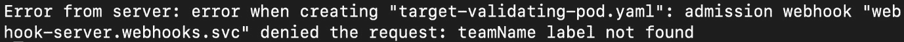

    图 16.17:由于缺少所需标签，Pod 被拒绝

    请记住，我们的网络钩子只是检查 Pod 中的`teamName`标签。根据*步骤 14* 定义中的名称空间选择器，Pod 创建被拒绝。

21.  Now, try creating the same Pod in the `webhooks-demo` namespace to see whether things go differently:

    ```
    kubectl create -f target-validating-pod.yaml -n webhooks-demo
    ```

    你应该得到这样的回应:

    ```
    pod/validating-pod-example created
    ```

    我们能够在`webhooks-demo`命名空间中成功地创建 Pod，但是在`webhooks`命名空间中却无法这样做。

22.  Let's describe the Pod to get more details:

    ```
    kubectl describe pod validating-pod-example -n webhooks-demo
    ```

    您应该会看到类似这样的响应:

    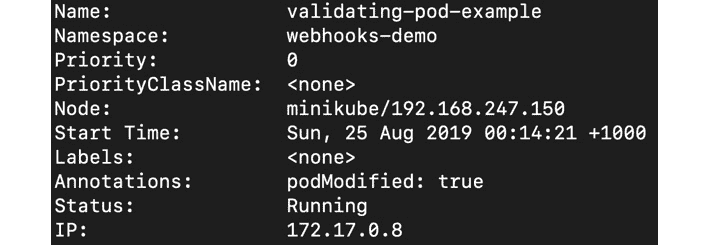

图 16.18:检查我们吊舱的规格

正如你所看到的，这个吊舱没有任何标签，但我们能够创建它。这是因为我们的验证 webhook 没有关注`webhooks-demo`名称空间。

在本练习中，您已经学习了如何配置 webhook 以在名称空间级别进行更改。这有助于测试功能，并为可能拥有不同名称空间的不同团队提供不同的功能。

# 总结

在本章中，我们了解到准入控制器提供了一种在创建、更新和删除操作过程中强制执行对象变异和验证的方法。这是一种扩展 Kubernetes 平台以遵守组织标准的简单方法。它们可用于将最佳实践和策略应用于 Kubernetes 集群。

接下来，我们学习了什么是变更和验证网络钩子，如何配置它们，以及如何在 Kubernetes 平台上部署它们。Webhooks 提供了一种简单的方法来扩展 Kubernetes，并帮助您适应特定企业的需求。

在前一系列章节中，从*第 11 章*、*构建自己的高可用性集群*，到*第 15 章*、*在 Kubernetes* 中的监控和自动缩放，您学习了如何在 AWS 上设置高可用性集群并运行无状态以及有状态的应用程序。在接下来的几章中，您将学习许多高级技能，这些技能将帮助您超越仅仅运行应用程序，并使您能够利用 Kubernetes 提供的许多强大的管理功能来维护集群的健康。

具体来说，在下一章中，您将了解 Kubernetes 调度程序。这是一个决定将在其上调度 Pod 的节点的组件。您还将学习如何配置调度程序以符合您的需求，以及如何控制 Pod 在节点上的放置。