# 17。库本内斯的高级调度

概观

本章重点介绍调度，这是 Kubernetes 选择运行 Pod 的节点的过程。在本章中，我们将更详细地了解这个过程和 Kubernetes Scheduler，它是负责这个过程的默认 Kubernetes 组件。

到本章结束时，您将能够使用不同的方法来控制 Kubernetes 调度程序的行为，以适应应用的要求。本章将使您能够选择适当的 Pod 调度方法，以根据您的业务需求控制您希望在哪些节点上运行您的 Pod。您将了解在 Kubernetes 集群上控制 Pods 调度的不同方法。

# 简介

我们已经看到，我们将应用打包为容器，并在 Kubernetes 中将它们作为 Pod 进行部署，Kubernetes 是部署的最小单元。借助 Kubernetes 提供的高级调度功能，我们可以针对硬件基础架构优化这些 Pods 的部署，以满足我们的需求并充分利用可用资源。

Kubernetes 集群通常有多个可以执行 Pod 的节点(或机器或主机)。假设您正在管理几台机器，并且您被指派在这些机器上执行一个应用。您会如何决定哪台机器最适合给定的应用？到目前为止，在本研讨会中，每当您想要在 Kubernetes 集群上运行 Pod 时，您是否提到过 Pod 应该在哪个(哪些)节点上运行？

没错——我们不需要；Kubernetes 附带了一个智能组件，可以找到运行 Pod 的最佳节点。这个组件就是 **Kubernetes 调度器**。在这一章中，我们将更深入地研究 Kubernetes Scheduler 是如何工作的，以及如何调整它来更好地控制我们的集群以适应不同的需求。

# 不可思议的调度程序

正如介绍中提到的，典型的集群有几个节点。创建 Pod 时，Kubernetes 必须选择一个节点并将 Pod 分配给它。这个过程被称为 **Pod 调度**。

负责决定 Pod 应该分配给哪个节点来执行的 Kubernetes 组件称为调度器。Kubernetes 附带了一个默认的调度程序，足以满足大多数用例。例如，默认的 Kubernetes 调度程序在集群中平均分配负载。

现在，考虑一个场景，其中两个不同的 Pods 被期望经常相互通信。作为系统架构师，您可能希望它们在同一个节点上，以减少延迟并释放一些内部网络带宽。调度程序不知道不同类型的 Pods 之间的关系，但是 Kubernetes 提供了一些方法来通知调度程序这种关系，并影响调度行为，以便这两个不同的 Pods 可以托管在同一个节点上。但是首先，让我们仔细看看 Pod **的调度过程**。

# POD调度过程

调度程序分三步工作:过滤、**评分**和**分配**。让我们看看在执行这些步骤的过程中会发生什么。下图描述了该过程的概述:

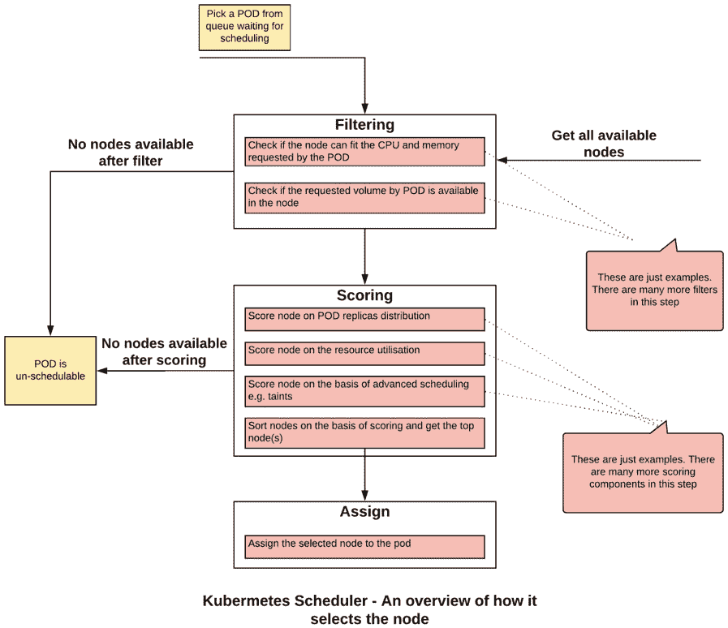

图 17.1:Kubernetes 调度程序如何选择合适节点的概述

## 过滤

过滤是一个过程，其中 **Kubernetes 调度器**运行一系列检查或过滤器，以查看哪些节点不适合运行目标 Pod。过滤器的一个示例是查看节点是否有足够的 CPU 和内存来托管 Pod，或者 Pod 请求的存储卷是否可以装载到主机上。如果集群没有适合于满足 Pod 要求的节点，那么 Pod 被认为是不可调度的，并且不能在集群上执行。

## 评分

一旦 **Kubernetes 调度器**有了可行节点的列表，第二步就是对节点进行评分，并找到托管目标 Pod 的最佳节点。该节点通过几个优先级函数并被分配一个优先级分数。每个函数分配一个 0 到 10 之间的分数，其中 0 是最低的，10 是最高的。

为了理解优先级函数，我们以`SelectorSpreadPriority`为例。该优先级函数使用标签选择器来查找关联在一起的 Pods。比方说，一堆 Pods 是由同一个部署创建的。正如名称 SpreadPriority 所暗示的，这个函数试图将 Pods 分布在不同的节点上，这样在节点出现故障的情况下，我们仍然会有副本在其他节点上运行。在此优先级功能下，Kubernetes 调度程序使用与请求的 Pod 相同的标签选择器选择运行 Pod 最少的节点。这些节点将被分配最高的分数，反之亦然。

优先级功能的另一个例子是`LeastRequestedPriority`。这试图将工作负载分散到具有最多可用资源的节点上。调度程序获取分配给现有 Pods 的内存和 CPU 数量最少的节点。这些节点被分配最高的分数。换句话说，这个优先级函数将为更大量的空闲资源分配更高的分数。

注意

在本章的有限范围内，有太多的优先功能无法涵盖。优先级功能的完整列表可以在以下链接找到:[https://kubernetes . io/docs/concepts/scheduling/kube-scheduler/#计分](https://kubernetes.io/docs/concepts/scheduling/kube-scheduler/#scoring)。

## 分配

最后，调度器通知应用编程接口服务器基于最高分数选择的节点。如果有多个节点得分相同，调度程序会选择一个随机节点，并有效地应用一个决胜局。

默认的 Kubernetes 调度程序在`kube-system`命名空间中作为 Pod 运行。通过列出`kube-system`命名空间中的所有 Pods，您可以看到它正在运行:

```
kubectl get pods -n kube-system
```

您应该会看到以下 Pods 列表:

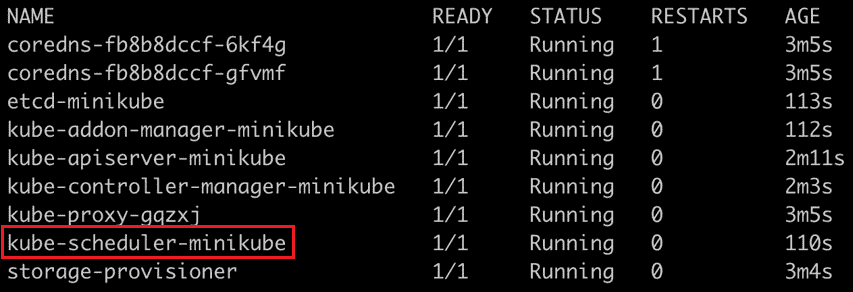

图 17.2:在 kube 系统命名空间中列出 Pods

在我们的 Minikube 环境中，Kubernetes 调度器POD被命名为`kube-scheduler-minikube`，正如你在这张截图中看到的。

## POD调度时间表

让我们挖掘一下 **Pod 调度**过程的时间线。当您请求创建一个 Pod 时，会调用不同的 Kubernetes 组件来将 Pod 分配给正确的节点。从请求 Pod 到分配节点，涉及三个步骤。下图给出了该过程的概述，我们将在图后详细说明该过程并将其分解为更详细的步骤:

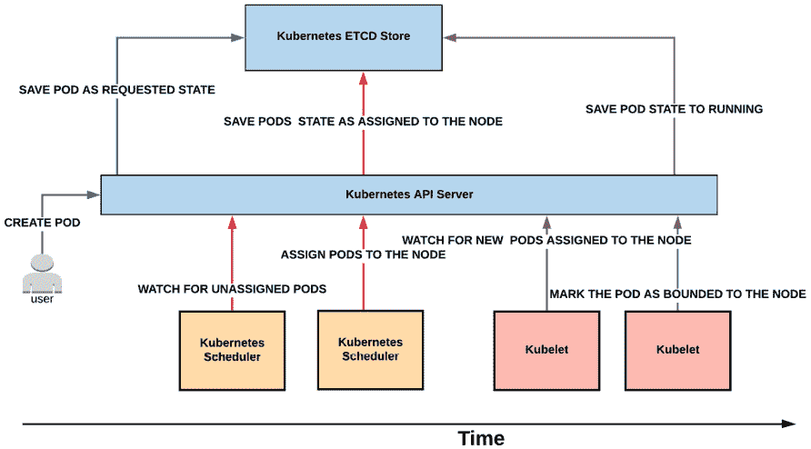

图 17.3:Pod 计划流程的时间表

**步骤 1** :当创建和运行 Pod 的请求被提出时，例如，通过 Kubernetes 命令或 Kubernetes 部署，应用编程接口服务器响应这个请求。它用一个待执行的 Pod 挂起条目更新 Kubernetes 内部数据库(etcd)。请注意，在这个阶段，不能保证 Pod 会被调度。

**第二步**:**Kubernetes调度器**通过 API 服务器不断的观察Kubernetes数据存储。一旦 Pod 创建请求可用(或者 Pod 处于挂起状态)，调度程序就会尝试对其进行调度。需要注意的是，调度程序不负责运行 Pod。它只需计算托管 Pod 的最佳节点，并通知 Kubernetes API 服务器，然后服务器将此信息存储在 etcd 中。在这一步中，Pod 被分配给最佳节点，关联存储在 etcd 中。

**第三步**:Kubernetes 代理(kubelet)通过 API 服务器不断的观察 Kubernetes 数据存储。一旦一个新的 Pod 被分配给一个节点，它就会尝试在该节点上执行该 Pod。当 Pod 成功启动并运行时，它通过 API 服务器被标记为在 etcd 中运行，现在该过程已经完成。

现在我们已经了解了调度过程，让我们看看如何在下面的主题中调整它来满足我们的需求。

# 管理 Kubernetes 调度程序

Kubernetes 提供了许多参数和对象，通过它们我们可以管理 **Kubernetes 调度器**的行为。我们将研究以下管理计划流程的方法:

*   节点亲和力和反亲和力
*   Pod 亲和力和反亲和力
*   Pod 优先级和抢占
*   污点和宽容

## 节点亲和力和反亲和力

使用节点关联性规则，Kubernetes 集群管理员可以控制 Pods 在特定节点集上的放置。节点相似性或反相似性允许您根据节点的标签来约束 Pod 可以在哪些节点上运行。

假设你是一家银行共享Kubernetes集群的管理员。多个团队在同一个集群上运行他们的应用。贵组织的安全组已经确定了可以运行数据敏感应用的节点，并希望您确保这些节点上没有其他应用运行。节点相似性或反相似性规则为这一要求提供了解决方案，即只将特定的 Pods 与一组节点相关联。

节点关联规则通过两个组件来定义。首先，为一组节点指定一个标签。第二部分是配置 Pods，使其仅与带有特定标签的节点相关联。考虑这一点的另一种方式是，Pod 定义了它应该放在哪里，调度器将这个定义中的标签与节点标签进行匹配。

有两种类型的节点关联性/反关联性规则:

*   **必备规则**是硬性规则。如果不符合这些规则，将无法在节点上调度 Pod。它被定义为 Pod 规范中的`requiredDuringSchedulingIgnoredDuringExecution`部分。请参见*练习 17.01* 、*运行具有节点相似性的 Pod*作为示例。
*   **首选规则**是软规则。只要有可能，调度程序就会尝试强制执行首选规则，但是当规则无法强制执行时，它会忽略这些规则，也就是说，如果严格遵循这些规则，Pod 将变得不可聚合。首选规则被定义为 Pod 规范中的`preferredDuringSchedulingIgnoredDuringExecution`部分。

首选规则具有与每个标准相关联的权重。调度程序将根据这些权重创建一个分数，以便在正确的节点调度 Pod。权重字段的值范围从 1 到 100。调度器计算所有合适节点的优先级分数，以找到最佳节点。请注意，分数可能会受到其他优先级功能的影响，如`LeastRequestedPriority`。

如果您定义的权重太低(与其他权重相比)，那么整体分数将受其他优先级函数的影响最大，我们的首选规则可能对调度过程影响不大。如果您定义了多个规则，那么您可以更改对您最重要的规则的权重。

相似性规则在 Pod 规范中定义。基于我们期望的/不期望的节点的标签，我们将在 Pod 规范中提供选择标准的第一部分。它由一组标签和可选的标签值组成。

标准的另一部分是提供我们想要匹配标签的方式。我们将这些匹配标准定义为亲缘关系定义中的**运算符**。该运算符可以有以下值:

*   `In`操作符指示调度器在匹配标签和指定值之一的节点上调度 Pods。
*   `NotIn`操作符指示调度程序不要在与标签和任何指定值不匹配的节点上调度 Pods。这是一个负运算符，表示反亲缘关系配置。
*   `Exists`操作者指示调度器在匹配标签的节点上调度 Pods。在这种情况下，标签的价值并不重要。因此，即使指定的标签存在并且标签的值不匹配，也满足该运算符。
*   `DoesNotExist`操作符指示调度程序不要在与标签不匹配的节点上调度 Pods。在这种情况下，标签的价值并不重要。这是一个负运算符，表示反亲缘关系配置。

请注意，关联性和反关联性规则是基于节点上的标签定义的。如果节点上的标签发生更改，则可能不再应用节点关联规则。在这种情况下，正在运行的 Pods 将继续在节点上运行。如果一个POD重新启动，或者如果它死亡，一个新的POD被创建，库本内斯认为这是一个新的POD。在这种情况下，如果节点标签已被修改，调度程序可能不会将 Pod 放在同一节点上。这是您在修改节点标签时需要注意的事情。让我们在下面的练习中为 Pod 实现这些规则。

## 练习 17.01:运行具有节点关联性的 Pod

在本练习中，我们将在 Minikube 环境中可用的节点上配置一个 Pod。我们还会看到，如果标签不匹配，Pod 将处于`Pending`状态。想象一下这样一种状态，在这种状态下，调度程序无法找到要分配给 Pod 的正确节点:

1.  Create a new namespace called `schedulerdemo` using the following command:

    ```
    kubectl create ns schedulerdemo
    ```

    您应该会看到以下响应:

    ```
    namespace/schedulerdemo created
    ```

2.  Now we need to create a Pod with node affinity defined. Create a file named `pod-with-node-affinity.yaml` with the following specification:

    ```
    apiVersion: v1
    kind: Pod
    metadata:
      name: pod-with-node-affinity
    spec:
     affinity:
     nodeAffinity: 
     requiredDuringSchedulingIgnoredDuringExecution: 
     nodeSelectorTerms:
     - matchExpressions:
     - key: data-center 
     operator: In 
     values:
     - sydney 
      containers:
        - name: pod-with-node-affinity-container
          image: k8s.gcr.io/busybox
          command: [ "/bin/sh", "-c", "while :; do echo '.'; sleep         5 ; done" ]
    ```

    注意，在 Pod 规范中，我们增加了新的`affinity`部分。该规则配置为`requiredDuringSchedulingIgnoredDuringExecution`。这意味着，如果具有匹配标签的节点不存在，该 Pod 将不会被调度。还要注意的是，根据`In`运算符，这里提到的表达式要与节点标签相匹配。在这个例子中，一个匹配的节点会有标签`data-center=sydney`。

3.  Try to create this Pod and see if it gets scheduled and executed:

    ```
    kubectl create -f pod-with-node-affinity.yaml -n schedulerdemo
    ```

    您应该会看到以下响应:

    ```
    pod/pod-with-node-affinity created
    ```

    请注意，您在这里看到的响应不一定意味着 Pod 已经在节点上成功执行。让我们在下面的步骤中检查一下。

4.  Check the status of the Pod using this command:

    ```
    kubectl get pods -n schedulerdemo
    ```

    您将看到以下响应:

    ```
    NAME                     READY    STATUS    RESTARTS   AGE
    pod-with-node-affinity   0/1      Pending   0          10s   
    ```

    从这个输出中，您可以看到 Pod 处于`Pending`状态，并且没有被执行。

5.  Check the `events` to see why the Pod is not being executed:

    ```
    kubectl get events -n schedulerdemo
    ```

    您将看到以下响应:

    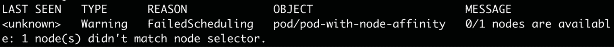

    图 17.4:获取事件列表

    您可以看到 Kubernetes 说没有节点与这个 Pod 的选择器匹配。

6.  Let's delete the Pod before proceeding further:

    ```
    kubectl delete pod pod-with-node-affinity -n schedulerdemo
    ```

    您应该会看到以下响应:

    ```
    pod "pod-with-node-affinity" deleted
    ```

7.  Now, let's see what nodes are available in our cluster:

    ```
    kubectl get nodes
    ```

    您将看到以下响应:

    ```
    NAME        STATUS    ROLES    AGE    VERSION
    minikube    Ready     master   105d   v1.14.3
    ```

    因为我们使用的是 Minikube，所以只有一个名为`minikube`的节点可用。

8.  Check the label for the `minikube` node. Use the `describe` command as shown here:

    ```
    kubectl describe node minikube
    ```

    您应该会看到以下响应:

    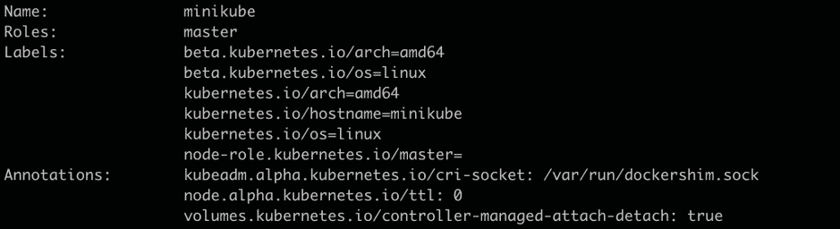

    图 17.5:描述 minikube 节点

    可以看到，我们想要的标签`data-center=sydney`，并不存在。

9.  Now, let's apply the desired label to our node using this command:

    ```
    kubectl label node minikube data-center=sydney
    ```

    您将看到以下响应，表明该节点已被标记:

    ```
    node/minikube labeled
    ```

10.  Verify whether the label is applied to the node using the `describe` command:

    ```
    kubectl describe node minikube
    ```

    您应该会看到以下响应:

    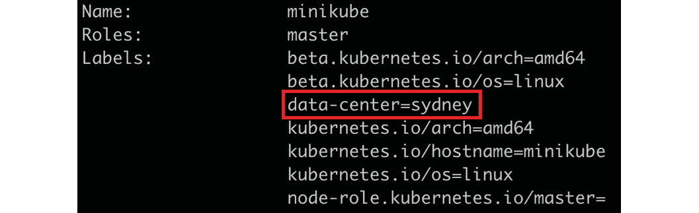

    图 17.6:检查 minikube 节点上的标签

    正如您在这张图片中看到的，我们的标签现在已经应用。

11.  Now try to run the Pod again and see if it can be executed:

    ```
    kubectl create -f pod-with-node-affinity.yaml -n schedulerdemo
    ```

    您应该会看到以下响应:

    ```
    pod/pod-with-node-affinity created
    ```

12.  Now, let's check whether the Pod is successfully running:

    ```
    kubectl get pods -n schedulerdemo
    ```

    您应该会看到以下响应:

    ```
    NAME                     READY    STATUS     RESTARTS   AGE
    pod-with-node-affinity   1/1      Running    0          5m22s
    ```

    因此，我们的POD成功运行。

13.  Let's check out how Pod scheduling is displayed in `events`:

    ```
    kubectl get events -n schedulerdemo
    ```

    您将得到以下响应:

    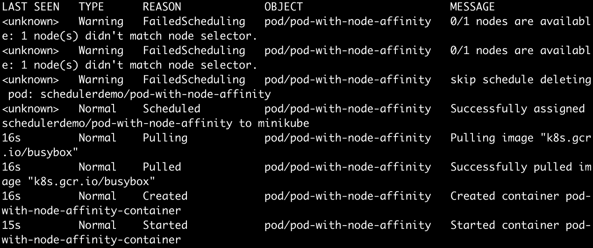

    图 17.7:检查调度事件

    正如您在前面的输出中看到的，Pod 已经成功地进行了调度。

14.  Now, let's do some housekeeping to avoid conflicts with further exercises and activities. Delete the Pod using this command:

    ```
    kubectl delete pod pod-with-node-affinity -n schedulerdemo
    ```

    您应该会看到以下响应:

    ```
    pod "pod-with-node-affinity" deleted
    ```

15.  Remove the label from the node using the following command:

    ```
    kubectl label node minikube data-center-
    ```

    请注意，从 Pod 中删除标签的语法在标签名称后有一个附加的连字符(`–`)。您应该会看到以下响应:

    ```
    node/minikube labeled
    ```

在本练习中，我们已经看到了节点关联性是如何工作的，方法是标记一个节点，然后在标记的节点上调度一个 Pod。我们还看到了如何使用 Kubernetes 事件来查看 Pod 调度的状态。

我们在本练习中使用的`data-center=sydney`标签也暗示了一个有趣的用例。我们可以使用节点关联性和反关联性规则，不仅针对特定的 Pod，还针对特定的服务器机架或数据中心。我们只需为特定服务器机架、数据中心、可用性区域等中的所有节点分配特定标签。然后，我们可以简单地为我们的 Pods 选择想要的目标。

# 荚果亲和性和抗亲和性

Pod 相似性和 Pod 反相似性允许您的 Pods 在给定节点上调度之前检查该节点上正在运行的其他 Pods。请注意，本文中的其他 Pod 并不意味着同一 Pod 的新副本，而是与不同工作负载相关的 Pod。

Pod 相似性允许您根据已经在该节点上运行的其他 Pod 的标签来控制您的 Pod 有资格在哪个节点上进行调度。这个想法是为了满足将两种不同类型的容器相对于彼此放置在同一位置或者将它们分开的需要。

假设您的应用有两个组件:前端部分(例如，图形用户界面)和后端部分(例如，应用编程接口)。让我们假设您希望在同一台主机上运行它们，因为如果它们托管在同一节点上，前端和后端 Pods 之间的通信会更快。默认情况下，在多节点集群(不是 Minikube)上，调度程序将在不同的节点上调度这样的 Pods。Pod 相似性提供了一种方法来控制 Pods 相对于彼此的调度，以便我们可以确保应用的最佳性能。

定义 Pod 关联性需要两个组件。第一个组件定义了调度程序如何将目标 Pod(在我们前面的例子中，是前端 Pod)与已经运行的 Pod(后端 Pod)相关联。这是通过 Pod 上的标签完成的。在 Pod 相似性规则中，我们提到应该使用其他 Pod 的哪些标签来关联新的 Pod。标签选择器具有类似的操作符，如节点相似性和反相似性部分所述，用于匹配 Pods 的标签。

第二个组件描述了您想要在哪里运行目标 Pods。正如我们在前面的练习中所看到的，我们可以使用 Pod 相似性规则将一个 Pod 安排在与另一个 Pod 相同的节点上(在我们的示例中，我们假设后端 Pod 是已经运行的另一个Pod)、与另一个 Pod 位于同一机架上的任何节点、与另一个 Pod 位于同一数据中心的任何节点，等等。该组件定义了可以分配 Pods 的节点集。为了实现这一点，我们给我们的节点组贴上标签，并在 Pod 规范中将这个标签定义为`topologyKey`。例如，如果我们使用主机名作为`topologyKey`的值，Pods 将被放置在同一个节点上。

如果我们用承载节点的机架名称来标记节点，并将机架名称定义为`topologyKey`，那么候选 Pods 将被调度给具有相同机架名称标签的节点之一。

与上一节中定义的节点相似性规则类似，也有硬 Pod 和软 Pod 相似性规则。硬规则用`requiredDuringSchedulingIgnoredDuringExecution`定义，软规则用`preferredDuringSchedulingIgnoredDuringExecution`定义。在 Pod 相似性配置中，可以有硬规则和软规则的多种组合。

## 练习 17.02:具有荚果亲和力的跑步荚果

在本练习中，我们将了解 Pod 关联性如何帮助调度程序查看不同 Pod 之间的关系，并将它们分配给合适的节点。我们将使用`preferred`选项放置豆荚。在本练习的稍后部分，我们将使用`required`选项配置 Pod 反关联性，并确保在满足所有标准之前不会调度该 Pod。我们将使用前面提到的前端和后端 Pods 的相同示例:

1.  We need to create and run the backend Pod first. Create a file named `pod-with-pod-affinity-first.yaml` with the following contents:

    ```
    apiVersion: v1
    kind: Pod
    metadata:
      name: pod-with-pod-affinity
      labels:
         application-name: banking-app
    spec:
      containers:
        - name: pod-with-node-pod-container
          image: k8s.gcr.io/busybox
          command: [ "/bin/sh", "-c", "while :; do echo 'this is         backend pod'; sleep 5 ; done" ]
    ```

    这个 Pod 是一个简单的 Pod，只有一个循环打印一条消息。请注意，我们已经为 pod 分配了一个标签，以便它可以与前端 Pod 相关联。

2.  Let's create the Pod defined in the previous step:

    ```
    kubectl create -f pod-with-pod-affinity-first.yaml -n schedulerdemo
    ```

    您应该会看到以下响应:

    ```
    pod/pod-with-pod-affinity created
    ```

3.  Now, let's see if the Pod has been successfully created:

    ```
    kubectl get pods -n schedulerdemo
    ```

    您应该会看到这样的响应:

    ```
    NAME                     READY    STATUS    RESTARTS   AGE
    pod-with-pod-affinity    1/1      Running   0          22s
    ```

4.  Now, let's check the labels on the `minikube` node:

    ```
    kubectl describe node minikube
    ```

    您应该会看到以下响应:

    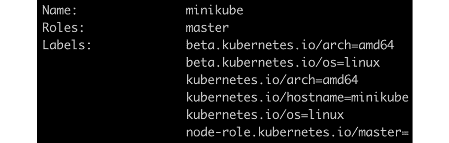

    图 17.8:描述 minikube 节点

    因为我们想在同一台主机上运行两个 Pods，所以我们可以使用节点的`kubernetes.io/hostname`标签。

5.  Now, let's define the second Pod. Create a file named `pod-with-pod-affinity-second.yaml` with the following contents:

    ```
    apiVersion: v1
    kind: Pod
    metadata:
      name: pod-with-pod-affinity-fe
      labels:
         application-name: banking-app
    spec:
      affinity:
       podAffinity: 
         preferredDuringSchedulingIgnoredDuringExecution: 
         - weight: 100
           podAffinityTerm:
             labelSelector:
               matchExpressions:
               - key: application-name
                 operator: In 
                 values:
                 - banking-app
             topologyKey: kubernetes.io/hostname
      containers:
        - name: pod-with-node-pod-container-fe
          image: k8s.gcr.io/busybox
          command: [ "/bin/sh", "-c", "while :; do echo 'this is         frontend pod'; sleep 5 ; done" ]
    ```

    将此 Pod 视为前端应用。请注意，我们已经在`podAffinity`部分定义了一个`preferredDuringSchedulingIgnoredDuringExecution`规则。我们还为豆荚和节点定义了`labels`和`topologyKey`。

6.  Let's create the Pod defined in the previous step:

    ```
    kubectl create -f pod-with-pod-affinity-second.yaml -n schedulerdemo
    ```

    您应该会看到以下响应:

    ```
    pod/pod-with-pod-affinity-fe created
    ```

7.  Verify the status of the Pods using the `get` command:

    ```
    kubectl get pods -n schedulerdemo
    ```

    您应该会看到以下响应:

    ```
    NAME                      READY    STATUS    RESTARTS   AGE
    pod-with-pod-affinity     1/1      Running   0          7m33s
    pod-with-pod-affinity-fe  1/1      Running   0          21s
    ```

    如您所见，`pod-with-pod-affinity-fe`POD正在运行。这与正常的 Pod 放置没有太大区别。这是因为我们在 Minikube 环境中只有一个节点，并且我们已经使用`preferredDuringSchedulingIgnoredDuringExecution`定义了 Pod 亲缘关系，这是匹配标准的软变体。

    本练习的下一步将使用`requiredDuringSchedulingIgnoredDuringExecution`或匹配标准的硬变异来谈论反亲和力，您将看到 Pod 没有达到`Running`状态。

8.  First, let's delete the `pod-with-pod-affinity-fe` Pod:

    ```
    kubectl delete pod pod-with-pod-affinity-fe -n schedulerdemo
    ```

    您应该会看到以下响应:

    ```
    pod "pod-with-pod-affinity-fe" deleted
    ```

9.  Confirm that the Pod has been deleted by listing all the Pods:

    ```
    kubectl get pods -n schedulerdemo
    ```

    您应该会看到以下响应:

    ```
    NAME                     READY    STATUS    RESTARTS   AGE
    pod-with-pod-affinity    1/1      Running   0          10m
    ```

10.  Now create another Pod definition with the following contents and save it as `pod-with-pod-anti-affinity-second.yaml`:

    ```
    apiVersion: v1
    kind: Pod
    metadata:
      name: pod-with-pod-anti-affinity-fe
      labels:
         application-name: backing-app
    spec:
      affinity:
       podAntiAffinity: 
         requiredDuringSchedulingIgnoredDuringExecution: 
         - labelSelector:
             matchExpressions:
             - key: application-name
               operator: In 
               values:
               - banking-app
           topologyKey: kubernetes.io/hostname   
      containers:
        - name: pod-with-node-pod-anti-container-fe
          image: k8s.gcr.io/busybox
          command: [ "/bin/sh", "-c", "while :; do echo 'this is         frontend pod'; sleep 5 ; done" ]
    ```

    可以看到，配置是针对`podAntiAffinity`的，使用的是`requiredDuringSchedulingIgnoredDuringExecution`选项，是 Pod 亲和规则的硬变型。在这里，如果条件不满足，调度程序将不调度任何 Pod。我们使用的是`In`操作符，这样我们的 Pod 就不会像配置的`labelSelector`组件中定义的任何 Pod 一样在同一台主机上运行。

11.  Try creating the Pod with the preceding specification:

    ```
    kubectl create -f pod-with-pod-anti-affinity-second.yaml -n schedulerdemo
    ```

    您应该会看到以下响应:

    ```
    pod/pod-with-pod-anti-affinity-fe created
    ```

12.  Now, check the status of this Pod:

    ```
    kubectl get pods -n schedulerdemo
    ```

    您应该会看到以下响应:

    ```
    NAME                           READY  STATUS    RESTARTS   AGE
    pod-with-pod-affinity          1/1    Running   0          14m
    pod-with-pod-anti-affinity-fe  1/1    Pending   0          3s
    ```

    从这个输出中，您可以看到 Pod 处于`Pending`状态。

13.  You can verify that the Pod is not being scheduled because of Pod anti-affinity by checking events:

    ```
    kubectl get events -n schedulerdemo
    ```

    您应该会看到以下响应:

    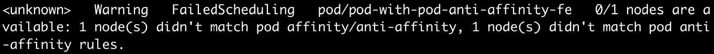

图 17.9:检查调度失败的事件

在本练习中，我们已经了解了 Pod 亲缘关系如何帮助将两个不同的 Pod 放置在同一个节点上。我们还看到了 Pod 反关联性选项如何帮助我们在不同的主机集上安排 Pod。

# POD优先级

Kubernetes 允许您将优先级与 Pod 相关联。如果存在资源限制，如果请求调度具有高优先级的新 Pod，Kubernetes 调度器可以驱逐具有较低优先级的 Pod，以便为新的高优先级 Pod 腾出空间。

考虑一个例子，您是一个集群管理员，您在集群中运行关键和非关键工作负载。一个例子是银行的 Kubernetes 集群。在这种情况下，您将拥有支付服务以及银行网站。你可能会认为处理支付比运行网站更重要。通过配置 Pod 优先级，您可以防止优先级较低的工作负载影响集群中的关键工作负载，尤其是在集群开始达到其资源容量的情况下。这种驱逐优先级较低的 Pods 以调度更关键的 Pods 的技术可能比添加额外的节点更快，并且将帮助您更好地管理集群上的流量峰值。

我们将优先级与 Pod 相关联的方法是定义一个名为`PriorityClass`的对象。该对象拥有优先级，优先级定义为 1 到 10 亿之间的数字。数字越高，优先级越高。一旦我们定义了优先级类别，我们就通过将`PriorityClass`与 Pod 相关联来为 Pod 分配优先级。默认情况下，如果没有与 Pod 相关联的优先级，Pod 要么被分配默认优先级(如果可用)，要么被分配优先级值 0。

您可以获得类似于任何其他对象的优先级列表:

```
kubectl get priorityclasses
```

您应该会看到这样的响应:

```
NAME                     VALUE         GLOBAL-DEFAULT   AGE
system-cluster-critical  2000000000    false            9d
system-node-critical     2000001000    false            9d
```

请注意，在 Minikube 中，有两个在环境中预定义的优先级。让我们了解更多关于`system-cluster-critical`课的知识。发出以下命令以获取有关它的详细信息:

```
kubectl get pc system-cluster-critical -o yaml
```

您应该会看到以下响应:

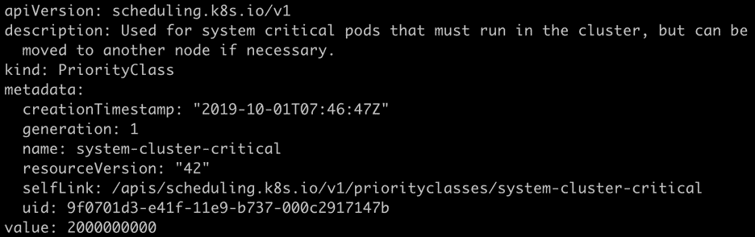

图 17.10:描述系统集群关键优先级类

这里的输出提到这个类是为对集群绝对重要的 Pods 保留的。etcd 就是这样一个 Pod。让我们看看这个优先级是否与之相关联。

发出以下命令，获取运行在 Minikube 中的 etcd Pod 的详细信息:

```
kubectl get pod etcd-minikube -n kube-system -o yaml
```

您应该会看到以下响应:

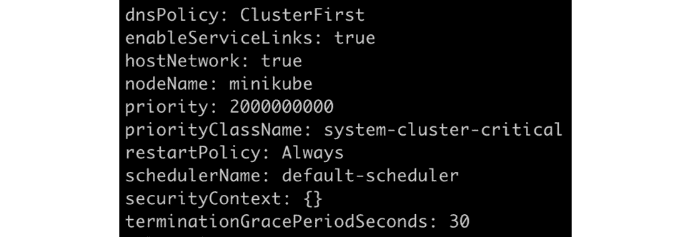

图 17.11:获取关于 etcd-minikube POD的信息

从该输出可以看出，Pod 已经与`system-cluster-critical`优先级相关联。

在下面的练习中，我们将添加一个默认优先级类和一个更高优先级的类，以更好地理解 Kubernetes 调度程序的行为。

理解 Pod 优先级与其他规则(如 Pod 亲缘关系)的协调工作非常重要。如果调度程序确定即使驱逐了较低优先级的 Pod，也无法调度高优先级的 Pod，它将不会驱逐较低优先级的 Pod。

类似地，如果高优先级和低优先级 Pods 正在等待调度，并且调度器确定高优先级 Pods 由于相似性或反相似性规则而不能被调度，则调度器将调度合适的低优先级 Pods。

## 练习 17.03:POD优先级和抢占

在本练习中，我们将定义两个优先级:默认(低优先级)和高优先级。然后，我们将创建 10 个具有默认优先级的 Pod，并为每个 Pod 分配一些 CPU 和内存。之后，我们将检查本地集群中使用了多少容量。然后，我们将创建另外 10 个具有高优先级的 Pods，并为它们分配资源。我们将看到具有默认优先级的 Pods 将被终止，而优先级较高的 Pods 将被安排在集群上。然后，我们将把高优先级 Pods 的数量从 10 个减少到 5 个，然后看到一些低优先级 Pods 被再次调度。这是因为减少高优先级 Pods 的数量应该会释放一些资源:

1.  First, let's create the definition for the default priority class. Create a file named `priority-class-default.yaml` with the following contents:

    ```
    apiVersion: scheduling.k8s.io/v1
    kind: PriorityClass
    metadata:
      name: default-priority
    value: 1
    globalDefault: true
    description: "Default Priority class."
    ```

    请注意，我们已经通过将`globalDefault`的值设置为`true`将该优先级标记为默认。还有，`1`的优先级很低。

2.  Create this priority class using the following command:

    ```
    kubectl create -f priority-class-default.yaml
    ```

    您应该会看到以下响应:

    ```
    priorityclass.scheduling.k8s.io/default-priority
    ```

    请注意，我们没有提到名称空间，因为该对象不是名称空间级别的对象。优先级类是 Kubernetes 中的一个集群范围对象。

3.  Let's check whether our priority class has been created:

    ```
    kubectl get priorityclasses
    ```

    您应该会看到以下列表:

    ```
    NAME                     VALUE         GLOBAL-DEFAULT   AGE
    default-priority         1             true             5m46s
    system-cluster-critical  2000000000    false            105d
    system-node-critical     2000001000    false            105d
    ```

    在这个输出中，您可以看到我们刚刚创建的名为`default-priority`的优先级类，它是全局默认的，如您在`GLOBAL-DEFAULT`列中所见。现在创建另一个优先级更高的优先级类。

4.  Create a file named `priority-class-highest.yaml` with the following contents:

    ```
    apiVersion: scheduling.k8s.io/v1
    kind: PriorityClass
    metadata:
      name: highest-priority
    value: 100000
    globalDefault: false
    description: "This priority class should be used for pods with   the highest of priority."
    ```

    请注意该对象中`value`字段的非常高的值。

5.  Use the definition from the previous step to create a Pod priority class using the following command:

    ```
    kubectl create -f priority-class-highest.yaml
    ```

    您应该会看到以下响应:

    ```
    priorityclass.scheduling.k8s.io/highest-priority created
    ```

6.  现在让我们用`10` Pods 和默认优先级为部署创建一个定义。使用以下内容创建名为`pod-with-default-priority.yaml`的文件来定义我们的部署:

    ```
    apiVersion: apps/v1
    kind: Deployment
    metadata:
      name: pod-default-priority-deployment
    spec:
      replicas: 10
      selector:
        matchLabels:
          app: priority-test

      template:
        metadata:
          labels:
            app: priority-test
        spec:
          containers:
          - name: pod-default-priority-deployment-container
            image: k8s.gcr.io/busybox
            command: [ "/bin/sh", "-c", "while :; do echo 'this is           backend pod'; sleep 5 ; done" ]
          priorityClassName: default-priority
    ```

7.  Let's create the Deployment that we defined in the previous step:

    ```
    kubectl create -f pod-with-default-priority.yaml -n schedulerdemo
    ```

    您应该会看到以下回应:

    ```
    deployment.apps/pod-default-priority-deployment created
    ```

8.  Now, increase the memory and CPU allocated to each of them to 128 MiB and 1/10 of the CPU by using the following commands:

    ```
    kubectl set resources deployment/pod-default-priority-deployment --limits=cpu=100m,memory=128Mi -n schedulerdemo
    ```

    您应该会看到以下响应:

    ```
    deployment.extensions/pod-default-priority-deployment resource requirements updated
    ```

    注意

    您可能需要根据计算机上的可用资源来调整此资源分配。可以从 1/10 CPU 开始，按照*第 10 步*所述验证资源。

9.  Verify that the Pods are running using the following command:

    ```
    kubectl get pods -n schedulerdemo
    ```

    您应该会看到以下 Pods 列表:

    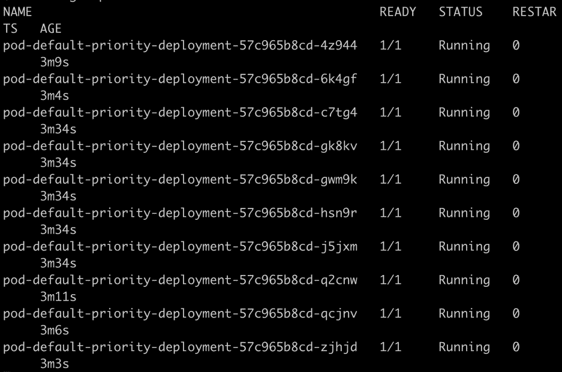

    图 17.12:获取 Pods 列表

10.  Check the resource usage in our cluster. Note that we have only one node, and thus we can easily see the values by issuing the `describe` command:

    ```
    kubectl describe node minikube
    ```

    为了更好地展示，下面的截图被截断了。在输出中找到`Allocated resources`部分:

    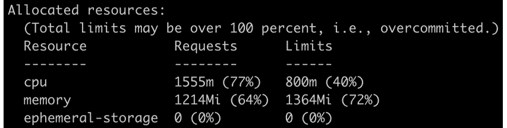

    图 17.13:检查 minikube 节点上的资源利用率

    注意`minikube`主机的 CPU 使用率为 77%，内存使用率为 64%。请注意，资源利用率取决于您计算机的硬件和分配给 Minikube 的资源。如果您的中央处理器太强大，或者您有大量的内存(或者即使您有一个较慢的中央处理器和较少的内存)，您可能会看到资源利用率值与我们在这里看到的大相径庭。请按照*步骤 8* 中所述调整 CPU 和内存资源，以便我们获得与此处类似的资源利用率。这将使您看到与我们在本练习的以下步骤中演示的结果相似的结果。

11.  Now let's schedule Pods with high priority. Create 10 Pods using the Kubernetes Deployment object. For this, create a file named `pod-with-high-priority.yaml` with the following contents:

    ```
    apiVersion: apps/v1
    kind: Deployment
    metadata:
      name: pod-highest-priority-deployment
    spec:
      replicas: 10
      selector:
        matchLabels:
          app: priority-test

      template:
        metadata:
          labels:
            app: priority-test
        spec:
          containers:
          - name: pod-highest-priority-deployment-container
            image: k8s.gcr.io/busybox
            command: [ "/bin/sh", "-c", "while :; do echo 'this is           backend pod'; sleep 5 ; done" ]
     priorityClassName: highest-priority
    ```

    注意在前面的规范中`priorityClassName`已经被设置为`highest-priority`等级。

12.  Now create the Deployment that we created in the previous step:

    ```
    kubectl create -f pod-with-high-priority.yaml -n schedulerdemo
    ```

    您应该会得到以下输出:

    ```
    deployment.apps/pod-with-highest-priority-deployment created
    ```

13.  Allocate a similar amount of CPU and memory to these Pods as you did for the Pods with default priority:

    ```
    kubectl set resources deployment/pod-highest-priority-deployment --limits=cpu=100m,memory=128Mi -n schedulerdemo
    ```

    您应该会看到以下响应:

    ```
    deployment.apps/pod-highest-priority-deployment resource requirements updated
    ```

14.  After a minute or so, run the following command to see which Pods are running:

    ```
    kubectl get pods -n schedulerdemo
    ```

    您应该会看到类似这样的响应:

    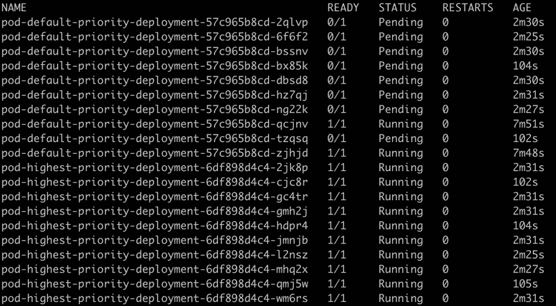

    图 17.14:获取 Pods 列表

    你可以看到我们大部分的高优先级 Pods 都处于`Running`状态，而低优先级 Pods 的 Pods 都移动到了`Pending`状态。这告诉我们，Kubernetes 调度程序实际上已经终止了优先级较低的 Pods，现在它正在等待资源可用，以便再次调度它们。

15.  Try changing the number of high-priority Pods from 10 to 5 and see if additional low-priority Pods can be scheduled. Change the number of replicas using this command:

    ```
    kubectl scale deployment/pod-highest-priority-deployment --replicas=5 -n schedulerdemo
    ```

    您应该会看到以下响应:

    ```
    deployment.extensions/pod-highest-priority-deployment scaled
    ```

16.  Verify that high-priority Pods are reduced from 10 to 5 using the following command:

    ```
    kubectl get pods -n schedulerdemo
    ```

    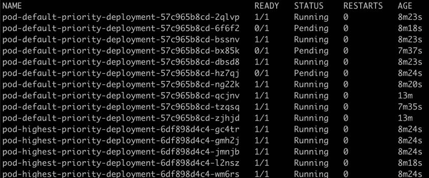

图 17.15:获取 Pods 列表

正如你在这张截图中看到的，一些更低优先级的 Pods 从`Pending`状态变成了`Running`状态。因此，我们可以看到调度程序正在根据工作负载的优先级来优化可用资源的使用。

在本练习中，我们使用了 Pod 优先级规则，并了解了如果有更高优先级的 Pod 请求需要满足，Kubernetes 调度程序如何选择终止优先级较低的 Pod。

# 污染和耐受性

之前，我们已经看到了如何配置 Pods 来控制它们在哪个节点上运行。现在我们将看到节点如何使用污点和容忍来控制哪些 Pods 可以在它们上面运行。

污点会阻止对 pod 的调度，除非该 Pod 对该 Pod 具有匹配的容忍性。把污点看作一个节点的属性，宽容是一个 Pod 的属性。只有当 Pod 的容忍度与节点的污点匹配时，它才会在节点上被调度。节点上的污点告诉调度程序检查哪些 Pods 容忍污点，并且只运行那些容忍节点污点的 Pods。

污点定义包含关键字、值和效果。该键和值将与 Pod 规范中的 Pod 容忍定义相匹配，同时该效果指示调度程序，一旦节点的污点与 Pod 的容忍相匹配，应该做什么。

下图概述了基于污点和容忍控制调度的过程是如何工作的。请注意，可以在没有污点的节点上调度具有容错能力的 Pod。

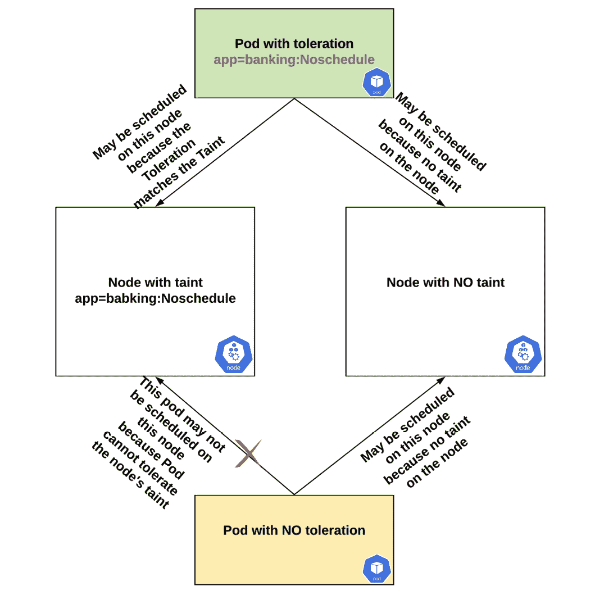

图 17.16:污点和容忍如何影响调度的概述

当我们定义污点时，我们也需要指定污点的行为。这可以通过以下值来指定:

*   `NoSchedule`提供拒绝节点上新 Pods 调度的能力。在定义污点之前计划的现有 Pods 将继续在节点上运行。
*   `NoExecute`污点提供了抵抗新豆荚的能力，新豆荚没有与污点匹配的耐受性。它会进一步检查节点上运行的所有现有 Pods 是否与此污点匹配，并移除不匹配的 Pods。
*   `PreferNoSchedule`指示调度程序避免调度不能容忍节点污染的 Pods。这是一个软规则，其中调度器将尝试找到正确的节点，但是如果它找不到任何其他符合定义的污点和容忍规则的节点，它仍将在该节点上调度 Pods。

为了将污点应用于节点，我们可以使用`kubectl taint`命令，如下所示:

```
kubectl taint nodes <NODE_NAME> <TAINT>:<TAINT_TYPE>
```

您希望某些 Pods(应用)不在特定节点上运行的原因有很多。一个示例用例可能是对专用硬件的需求，例如机器学习应用的图形处理器。另一种情况是，当 Pod 上软件的许可证限制规定它需要在特定节点上运行时。例如，在集群中的 10 个工作节点中，只有 2 个节点被允许运行特定的软件。使用污点和容忍组合，您可以帮助调度程序在正确的节点上调度 Pods。

## 练习 17.04:污染和耐受性

在这个练习中，我们将看到污点和容忍如何允许我们在我们想要的节点上安排 Pods。我们将定义一个污点，并尝试在节点上安排一个 Pod。然后我们展示`NoExecute`功能，其中如果节点上的污点改变，Pod 可以从节点中移除:

1.  Get the list of nodes using the following command:

    ```
    kubectl get nodes
    ```

    您应该会看到以下节点列表:

    ```
    NAME       STATUS    ROLES    AGE    VERSION
    minikube   Ready     master   44h    v1.14.3
    ```

    回想一下，在我们的 Minikube 环境中，我们只有一个节点。

2.  Create a taint for the `minikube` node using the following command:

    ```
    kubectl taint nodes minikube app=banking:NoSchedule
    ```

    您应该会看到以下响应:

    ```
    node/minikube tainted
    ```

3.  Verify that the node has been tainted correctly. You can use the `describe` command to see what taints are applied to the node:

    ```
    kubectl describe node minikube
    ```

    您应该会看到以下响应:

    

    图 17.17:检查 minikube 节点上的污点

4.  Now we need to create a Pod with toleration defined as per the taint. Create a file named `pod-toleration-noschedule.yaml` with the following contents:

    ```
    apiVersion: v1
    kind: Pod
    metadata:
      name: pod-with-node-toleration-noschedule
    spec:
     tolerations:
     - key: "app"
        operator: "Equal"
        value: "banking"
     effect: "NoSchedule"
      containers:
        - name: pod-with-node-toleration-noschedule-container
          image: k8s.gcr.io/busybox
          command: [ "/bin/sh", "-c", "while :; do echo '.'; sleep         5 ; done" ]
    ```

    请注意，容许值与*步骤 1* 中定义的污点相同，即`app=banking`。`effect`属性控制容忍行为的类型。在这里，我们将`effect`定义为`NoSchedule`。

5.  Let's create the Pod as per the preceding specification:

    ```
    kubectl create -f pod-toleration-noschedule.yaml -n schedulerdemo
    ```

    这应给出以下响应:

    ```
    pod/pod-with-node-toleration-noschedule created
    ```

6.  Verify that the Pod is running using the following command:

    ```
    kubectl get pods -n schedulerdemo
    ```

    您应该会看到以下响应:

    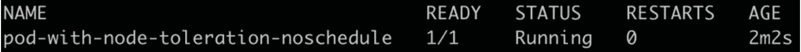

    图 17.18:获取 Pods 列表

7.  Now let's define a different Pod with a toleration that does not match the taint on the node. Create a file named `pod-toleration-noschedule2.yaml` with the following contents:

    ```
    apiVersion: v1
    kind: Pod
    metadata:
      name: pod-with-node-toleration-noschedule2
    spec:
      tolerations:
     - key: "app"
        operator: "Equal"
     value: "hr"
        effect: "NoSchedule"
      containers:
        - name: pod-with-node-toleration-noschedule-container2
          image: k8s.gcr.io/busybox
          command: [ "/bin/sh", "-c", "while :; do echo '.'; sleep         5 ; done" ]
    ```

    请注意，这里我们将容忍设置为`app=hr`。我们需要一个带有相同污点的豆荚来匹配这种宽容。因为我们已经用`app=banking`污染了我们的节点，这个 Pod 不应该被调度器调度。让我们在下面的步骤中尝试一下。

8.  Create the Pod using the definition from the previous step:

    ```
    kubectl create -f pod-toleration-noschedule2.yaml -n schedulerdemo
    ```

    这应给出以下响应:

    ```
    pod/pod-with-node-toleration-noschedule2 created
    ```

9.  Check the status of the Pod using the following command:

    ```
    kubectl get pods -n schedulerdemo
    ```

    您应该会看到以下回应:

    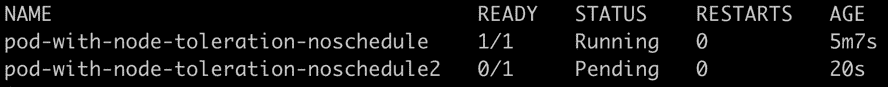

    图 17.19:获取 Pods 列表

    可以看到 Pod 处于`Pending`状态，而不是`Running`状态。

10.  In the remaining part of this exercise, we shall see how the `NoExecute` effect instructs the scheduler to even remove Pods after they have been scheduled to the node. Before that, we need to do some cleanup. Delete both Pods using the following command:

    ```
    kubectl delete pod pod-with-node-toleration-noschedule pod-with-node-toleration-noschedule2 -n schedulerdemo
    ```

    您应该会看到以下响应:

    ```
    pod "pod-with-node-toleration-noschedule" deleted
    pod "pod-with-node-toleration-noschedule2" deleted
    ```

11.  Let's remove the taint from the node using the following command:

    ```
    kubectl taint nodes minikube app:NoSchedule-
    ```

    注意命令末尾的连字符(`-`)，它告诉 Kubernetes 删除这个标签。您应该会看到以下响应:

    ```
    node/minikube untainted
    ```

    我们的节点处于没有定义污点的状态。现在，我们想首先运行一个具有作为`app=banking`的宽容的 Pod，并分配该 Pod。一旦 Pod 处于`Running`状态，我们将从节点中移除污点，并查看 Pod 是否已被移除。

12.  Now, taint the node again with the `NoExecute` type as follows:

    ```
    kubectl taint nodes minikube app=banking:NoExecute
    ```

    您应该会看到以下响应:

    ```
    node/minikube tainted
    ```

13.  Now, we need to define a Pod with matching toleration. Create a file called `pod-toleration-noexecute.yaml` with the following contents:

    ```
    apiVersion: v1
    kind: Pod
    metadata:
      name: pod-with-node-toleration-noexecute
    spec:
      tolerations:
     - key: "app"
        operator: "Equal"
     value: "banking"
     effect: "NoExecute"
      containers:
        - name: pod-with-node-toleration-noexecute-container
          image: k8s.gcr.io/busybox
          command: [ "/bin/sh", "-c", "while :; do echo '.'; sleep         5 ; done" ]
    ```

    注意`tolerations`部分将标签定义为`app=banking`，将`effect`定义为`NoExecute`。

14.  Create the Pod that we defined in the previous step using the following command:

    ```
    kubectl create -f pod-toleration-noexecute.yaml -n schedulerdemo
    ```

    您应该会看到以下响应:

    ```
    pod/pod-with-node-toleration-noexecute created
    ```

15.  Verify that the Pod is in the `Running` state using the following command:

    ```
    kubectl get pods -n schedulerdemo
    ```

    您应该会看到以下响应:

    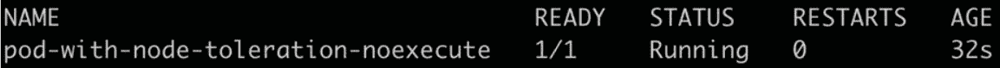

    图 17.20:获取 Pods 列表

16.  Now remove the taint from the node using this command:

    ```
    kubectl taint nodes minikube app:NoExecute-
    ```

    注意这个命令末尾的连字符(`-`)，它告诉 Kubernetes 移除污点。您将看到以下响应:

    ```
    node/minikube untainted
    ```

    如前所述，具有容错能力的 Pods 可以连接到没有污点的节点。移除污点后，Pod 仍然会被执行。请注意，我们没有删除 Pod，它仍然在运行。

17.  Now, if we add a new taint with `NoExecute` to the node, the Pod should be removed from it. To see this in action, add a new taint that is different than the Pod toleration:

    ```
    kubectl taint nodes minikube app=hr:NoExecute
    ```

    如你所见，我们已经在豆荚中添加了`app=hr`污点。您应该会看到以下响应:

    ```
    node/minikube tainted
    ```

18.  Now, let's check the status of the Pod:

    ```
    kubectl get pods -n schedulerdemo
    ```

    您将看到以下响应:

    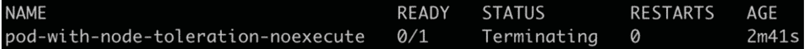

图 17.21:检查我们POD的状态

POD将被移除或进入`Terminating`(标记为移除)状态。几秒钟后，库本内斯将移除豆荚。

在本练习中，您已经看到了我们如何在节点上配置污点，以便它们只接受特定的 Pods。您还配置了污点来影响正在运行的 Pods。

# 使用自定义 Kubernetes 调度程序

构建自己的全功能调度程序不在本研讨会的讨论范围之内。但是，重要的是要理解，如果您的用例需要，Kubernetes 平台允许您编写自己的调度程序，尽管不建议使用自定义调度程序，除非您有非常专门的用例。

自定义调度程序作为普通 Pod 运行。您可以在运行应用的 Pod 的定义中指定使用自定义调度程序。您可以在 Pod 规范中添加一个名为自定义调度程序的`schedulerName`字段，如下例定义所示:

```
apiVersion: v1
kind: Pod
metadata:
  name: pod-with-custom-scheduler
spec:
  containers:
    - name: mutating-pod-example-container
      image: k8s.gcr.io/busybox
      command: [ "/bin/sh", "-c", "while :; do echo '.'; sleep 5 ;         done" ]
 schedulerName: "custom-scheduler"
```

为了使这种配置发挥作用，假设集群中有一个名为`custom-scheduler`的定制调度程序。

## 活动 17.01:配置 Kubernetes 调度程序来调度 Pods

假设您是 Kubernetes 集群的管理员，并且您有以下场景:

1.  有一个提供当前货币兑换率的 API Pod。
2.  网站上有一个显示转化率的图形用户界面。
3.  有一个 Pod，它为证券交易所提供获取实时货币兑换率的服务。

您的任务是确保应用编程接口和图形用户界面在同一个节点上运行。如果流量激增，您还被要求给予实时货币转换器 Pod 更高的优先级。在本活动中，您将控制 Kubernetes 调度程序的行为来完成活动。

本练习中的每个 Pods 都应该分配有 0.1 个 CPU 和 100 MiB 的内存。请注意，我们已经命名了 Pods API、GUI 和实时，以使事情变得更容易。本活动中的 Pods 预计只是在控制台上打印表达式。您可以将`k8s.gcr.io/busybox`映像用于所有这些。

注意

在开始本练习之前，请确保这些节点没有受到之前练习的影响。要查看如何移除污点，请参见本章*练习 17.01* 、*运行具有节点相似性的 Pod*的*步骤 15* 。

以下是该活动的一些指导原则:

1.  创建一个名为`scheduleractivity`的命名空间。
2.  为应用编程接口组件创建组件优先级。
3.  部署并确保应用编程接口和图形用户界面荚使用荚相似性在同一节点上。图形用户界面窗格应该将相似性定义为与应用编程接口窗格位于同一节点上。
4.  将应用编程接口和图形用户界面窗格的副本分别扩展到两个。
5.  为实时货币转换器 Pod 创建 Pod 优先级。确保前面定义的 API Pod 优先级小于实时 Pod，但大于 0。
6.  使用一个副本部署并运行实时货币转换器 Pod。
7.  确保所有POD都处于`Running`状态。
8.  现在，将实时货币转换器 Pod 的副本数量从 1 增加到 10。
9.  查看实时货币转换器 Pods 是否正在启动，以及 GUI Pods 是否正在被驱逐。如果没有，继续将实时 Pods 增加 5 倍。
10.  根据您的资源和 Pods 的数量，调度程序可能会开始驱逐 API Pods。
11.  将实时窗格的副本数量从 10 个减少到 1 个，并确保将应用编程接口和图形用户界面窗格调度回集群。

一旦您完成了活动，应用编程接口和图形用户界面的两个窗格预计将处于`Running`状态，还有一个实时窗格，如下图所示:

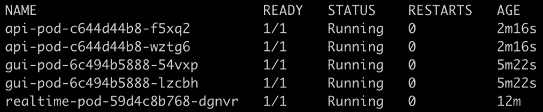

图 17.22:活动 17.01 的预期产出

请注意，您的输出将根据您的系统资源而变化，因此，您可能看不到您在此屏幕截图中看到的内容。

注意

该活动的解决方案可在以下地址找到:[https://packt.live/304PEoD](https://packt.live/304PEoD)。

# 总结

Kubernetes 调度程序是一个功能强大的软件，它抽象了为集群上的 Pod 选择适当节点的工作。调度程序会监视未调度的 Pods，并尝试为它们找到合适的节点。一旦它找到一个合适的 Pod 节点，它就会更新 etcd(通过应用编程接口服务器)Pod 已经绑定到该节点。

随着 Kubernetes 的每一次发布，调度器都变得成熟了。调度程序的默认行为对于各种工作负载来说已经足够了，尽管您也已经看到了许多自定义调度程序将资源与 Pods 相关联的方式的方法。您已经了解了节点关联性如何帮助您在所需的节点上调度 Pods。Pod 相似性可以帮助您相对于另一个 Pod 安排一个 Pod，对于多个模块被定位成彼此相邻放置的应用来说，这是一个很好的工具。污点和容忍还可以帮助您将特定的工作负载分配给特定的节点。您还看到，Pod 优先级可以帮助您根据集群中可用的总资源来安排工作负载。

在下一章中，我们将升级一个 Kubernetes 集群，而不会停机。如果您已经使用本章中显示的任何技术在集群中配置了自定义调度，则可能需要相应地规划升级。由于升级将一次关闭一个工作节点，因此您的一些 Pods 可能会因为您的配置而变得不可调度，这可能不是一个可接受的解决方案。