# 18。无停机升级您的集群

概观

在本章中，我们将讨论如何在不停机的情况下升级集群。我们将首先了解让您的 Kubernetes 集群保持最新的必要性。然后，我们将了解有助于 Kubernetes 集群零停机升级的基本应用部署策略。然后，我们将通过在 Kubernetes 集群上执行升级来实施这些策略，而不会让您的应用停机。

# 简介

我们在*第 11 章*、*搭建自己的 HA 集群*中学习了如何使用 kops 在 AWS 上搭建多节点 Kubernetes 平台。在本章中，您将了解如何将 Kubernetes 平台升级到新版本。我们将向您介绍升级 Kubernetes 平台所需步骤的实践示例。这些练习还将使你具备维护库本内斯集群所需的技能。

不同的组织以不同的方式建立和维护其 Kubernetes 集群。您在*第 12 章*、*您的应用和 HA* 中看到，设置集群的方法很多。我们将展示一种简单的技术来升级您的集群，根据您正在处理的集群，您需要采取的升级的确切技术和步骤可能会有所不同，尽管无论您如何升级集群，我们将在此提到的基本原则和注意事项都将适用。

# 升级 Kubernetes 集群的需求

构建您的业务应用并将其发布到世界上只是游戏的一半。让客户以安全、可扩展和一致的方式使用您的应用是另一半，也是您必须继续努力的另一半。为了能够很好地执行另一半，你需要一个坚如磐石的平台。

在当今竞争激烈的环境中，及时向客户交付最新功能对于让您的企业获得优势非常重要。该平台不仅要可靠，还要提供新的和更新的功能，以满足运行现代应用的需求。Kubernetes 是一个快速移动的平台，非常适合这样一个动态的环境。官方 Kubernetes GitHub 存储库中的提交数量证明了 Kubernetes 的开发和进步速度。让我们看看下面的截图:


图 18.1:2019 年 8 月 25 日至 31 日期间对 Kubernetes 项目的每日承诺

橙色条形图表示每周的提交次数，正如您所看到的，它们平均每周超过 100 次。下面的绿色线图显示了 8 月 25 日至 8 月 31 日这一周的提交情况。仅仅在一个星期二，就有 50 多项承诺。

到目前为止，很明显 Kubernetes 正在快速发展，但是您可能仍然不确定是否需要更新集群上的 Kubernetes 版本。以下是保持平台最新很重要的一些原因:

*   **新功能**:Kubernetes 社区不断增加新功能，以满足现代应用的需求。您的软件团队可能会提出一个新的软件组件，该组件可能依赖于较新的 Kubernetes 特性。因此，坚持使用旧版本的 Kubernetes 会阻碍*你的*软件的开发。
*   **Security patches**: There are many moving parts in the Kubernetes platform. It has not only the Kubernetes binaries that need to be patched but also lots of Linux features, such as iptables and cgroups. If there are vulnerabilities in any of the components used by Kubernetes, you may need to patch the underlying component, such as the OS itself. Having a consistent way to upgrade is extremely important in keeping the Kubernetes ecosystem as secure as possible.

    例如，Kubernetes API 服务器的 1.0–1.12 版本中存在一个漏洞，导致 API 服务器可能由于无效的 YAML 或 JSON 有效负载而消耗大量资源。您可以在以下链接找到关于此漏洞的更多详细信息:[https://cve.mitre.org/cgi-bin/cvename.cgi?名称=CVE-2019-11253](https://cve.mitre.org/cgi-bin/cvename.cgi?name=CVE-2019-11253)

*   **更好地处理现有功能**:Kubernetes 团队不仅增加了新功能，还不断提升现有功能的稳定性和性能。这些改进可能对您现有的应用或自动化脚本有用。所以，从这个角度来看，保持你的平台更新也是一个好主意。

# kubernets 组件–复习

到目前为止，您已经了解了 Kubernetes 平台的基本组件。作为复习，让我们重温一下主要组件:

*   API 服务器负责公开 RESTful Kubernetes APIs，是无状态的。集群中的所有用户、Kubernetes 主组件、kubectl 客户端、工作节点，甚至您的应用都需要与 API 服务器交互。
*   键值存储(etcd 服务器)存储对象，并为 API 服务器提供持久的后端。
*   调度器和控制器管理器用来获得集群和存储在 etcd 中的对象的状态。
*   kubelet 是一个在每个工作节点上运行的程序，它的行为就像一个代理，按照 Kubernetes 主组件的指示执行工作。

当我们更新平台时，正如您将在后面的章节中看到的，我们将利用这些组件并将它们作为单独的模块进行升级。

## 告诫

Kubernetes 版本标记为`A.B.C`，遵循语义版本化概念。`A`是大版本，`B`是小版本，`C`是补丁发布。根据 Kubernetes 文档，*在* [*高可用性(HA)集群*](https://kubernetes.io/docs/setup/production-environment/tools/kubeadm/high-availability/) *中，最新和最早的 kube-apiserver 实例必须在一个次要版本中。*'

规划升级时，以下是最安全的方法:

*   请务必首先升级到当前次要版本的最新修补版本。例如，如果你在`1.14.X`上，首先升级到`1.14.X`发布列车的最新可用版本。这将确保平台具有适用于您的集群版本的所有可用修复程序。最新的补丁可能会有错误修复，这可能会为你提供一条更顺畅的路径，通往下一个次要版本，在我们的例子中，将是`1.15.X`。
*   升级到下一个次要版本。避免跳过多个次要版本，即使这是可能的，因为一般来说，应用编程接口兼容性在一个次要版本中。在升级过程中，Kubernetes 平台将运行两个不同版本的 API，因为我们一次升级一个节点。比如从`1.14`去`1.15`比较好，不去`1.16`。

另一个需要考虑的重要问题是，看看新版本是否需要底层 Linux 操作系统的一些更新库。尽管一般来说，补丁发布不需要任何底层组件升级，但保持底层操作系统的最新也应该是您的首要任务，以便为 Kubernetes 平台提供安全一致的环境。

# 升级过程

在本节中，您将看到升级 Kubernetes 平台所需的步骤。请注意，此处不包括升级底层操作系统。为了满足零停机升级的要求，您必须有一个至少有三个主服务器和 etcd 服务器的高可用性 Kubernetes 集群，这可以实现无摩擦升级。该过程将从三个节点中取出一个节点并对其进行升级。升级后的组件将重新加入集群，然后我们获取第二个节点，并对其应用升级过程。由于在任何给定时间，至少有两台服务器保持可用，因此在升级过程中群集将保持可用。

## 【kops 的一些注意事项

我们已经在*第 11 章**中指导您创建了一个高可用性Kubernetes集群*。因此，在本章中，我们将指导您升级同一个集群。

正如在那一章中提到的，有多种方法可以部署和管理 Kubernetes 集群。我们选择了 kops，它有升级 Kubernetes 组件的内置工具。我们将在本章中利用它们。

kop 的版本设置类似于它实现的 Kubernetes 的次要版本。比如 kops 版本`1.14.x`实现 Kubernetes 版本`1.14.x`。更多详情请参考此链接:[https://kops.sigs.k8s.io/welcome/releases/](https://kops.sigs.k8s.io/welcome/releases/)。

注意

在我们在*第 11 章*、*创建的高可用性集群*中，我们部署了三个主节点，它们托管所有 Kubernetes 主平面组件，包括 etcd。

## 升级过程概述

整个升级过程可以概括如下:

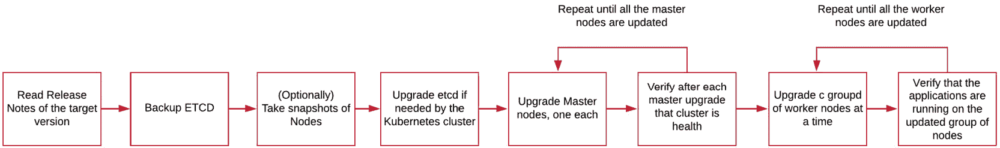

图 18.2:推荐的升级过程

在继续实施之前，让我们快速了解一下每一步:

1.  **Read the release notes**

    这些将表明升级过程中可能需要的任何特殊注意事项。各版本的发行说明可在 GitHub 上通过以下链接获得:[https://GitHub . com/kubernetes/kubernetes/tree/master/CHANGELOG](https://github.com/kubernetes/kubernetes/tree/master/CHANGELOG)。

2.  **Back up the etcd datastore**

    正如您之前所了解的，etcd 存储集群的整个状态。如果需要，etcd 的备份将允许您恢复数据存储的状态。

3.  **Back up the nodes as an optional failsafe**

    如果升级过程没有按计划进行，并且您想恢复到以前的状态，这可能会派上用场。云供应商(如 AWS、GCP、Azure 等)使您能够拍摄主机的快照。如果您在私有数据中心运行，并且为您的机器使用虚拟机管理程序，您的虚拟机管理程序提供商(例如，VMware)可能会提供工具来拍摄节点的快照。拍摄快照超出了本书的范围，但是，在开始升级 Kubernetes 平台之前，这是一个有用的步骤。

4.  **Upgrade the etcd if required**

    用于部署和管理 Kubernetes 集群的工具的较新版本(例如我们案例中的 kops)通常会自动处理这个问题。即使如此，这也是一个重要的考虑因素，尤其是如果您没有使用任何工具，如 kop。

    检查并验证新版本的 Kubernetes 是否需要不同版本的 etcd 存储。这并不总是必要的，但根据您的版本可能是必需的。例如，Kubernetes 版本`1.13`需要 etcd v3，而之前的版本使用 etcd v2。

    您将从阅读发行说明中知道是否需要升级 etcd(*第 1 步*)。例如，当早期版本的 etcd 在 1.13 版本中逐步淘汰时，在发行说明中明确提到:[https://github . com/kubernetes/kubernetes/blob/master/CHANGELOG/CHANGELOG-1.13 . MD #急-升级-说明](https://github.com/kubernetes/kubernetes/blob/master/CHANGELOG/CHANGELOG-1.13.md#urgent-upgrade-notes)。

5.  **Upgrade the master components**

    登录堡垒主机，根据所需的 Kubernetes 版本升级 kops 版本。这个兼容性矩阵应该是一个有用的指南:[https://kops . sigs . k8s . io/welcome/releases/#兼容性矩阵](https://kops.sigs.k8s.io/welcome/releases/#compatibility-matrix)。

    在第一个主节点上运行升级，验证是否正确更新，然后对所有其他主节点重复相同的步骤。

6.  **Upgrade the worker node groups**

    正如您在*第 11 章*、*构建自己的高可用性集群*中所看到的，在 AWS 的情况下，kops 允许您使用实例组来管理节点，实例组与自动缩放组相关联。在工作节点的第一个实例组上运行升级。要验证节点是否成功升级，您需要检查节点是否升级到所需的 Kubernetes 版本，以及是否在升级的节点上安排了 pods。对工作节点的所有其他实例组重复相同的步骤。

7.  **Verify that the upgrade process succeeded**

    检查是否所有节点都已升级，并且所有应用都按预期运行。

## 自动化的重要性

正如您从本概述中看到的，升级集群需要几个步骤。考虑到发行版和补丁的数量，您可能需要经常这样做。由于该过程有很好的文档记录，强烈建议您考虑使用自动化工具，如 Ansible 或 Puppet，来自动化整个过程。所有前面的步骤都可以完全自动化，并且您有一个可重复的方法来升级您的集群。然而，自动化不会在本章中涉及，因为这超出了本书的范围。

## 巴正在清理 etcd 数据存储区

etcd 存储整个集群的状态。因此，拍摄 etcd 的快照允许我们将整个群集恢复到拍摄快照时的状态。如果您想将群集恢复到以前的状态，这可能会很有用。

注意

在开始任何练习之前，请确保按照*第 11 章*、*构建自己的高可用性集群*中的说明设置集群并使其可用，并且您可以通过 SSH 从计算机访问节点。还建议您在开始升级过程之前拍摄节点的快照。这尤其有益，因为在本章中，您将升级集群两次，一次在练习中，一次在活动中。

现在，在我们进行第一个练习之前，我们需要更多地了解 etcd。它的工作方式是作为一个 pod 在您的集群中的`kube-system`命名空间中运行(正如您在*第 2 章*、*Kubernetes 的概述*中所看到的)，并公开一个用于向其写入数据的 API。每当 Kubernetes API 服务器想要将任何数据保存到 etcd 时，它都会使用 etcd 的 API 来访问它。

为了备份 etcd，我们还需要访问它的 API，并使用内置函数来保存快照。为此，我们将使用名为`etcdctl`的命令行客户端，它已经存在于 etcd 窗格中。对这个工具和 etcd API 的详细介绍对于我们的目的来说不是必需的，所以我们不把它包括在这本书里。你可以通过这个链接了解更多:https://github.com/etcd-io/etcd/tree/master/etcdctl。

现在，让我们看看如何在下面的练习中使用 etcdctl 来备份 etcd。

## 例【18.01:拍摄 etcd 数据存储区的快照

在本练习中，我们将了解如何拍摄 etcd 商店的快照。如前一节所述，根据您的升级路径，可能不需要手动升级 etcd。然而，备份 etcd 是必不可少的。为此，以及以下所有练习和活动，请使用您用于执行*练习 11.01* 、*设置我们的 Kubernetes 集群*的同一台机器(您的笔记本电脑或台式机):

1.  We have used kops to install the cluster. Kops uses two different etcd clusters – one for events generated by Kubernetes components, and the second one for everything else. You can see these pods by issuing the following command:

    ```
    kubectl get pods -n kube-system | grep etcd-manager
    ```

    这应该能得到 etcd 吊舱的细节。您应该会看到类似如下的输出:

    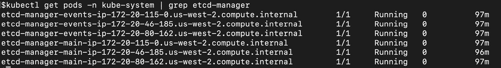

    图 18.3:获取 etcd 管理器的列表

2.  By default, kops' `etcd-manager` function creates backups every 15 minutes. The location of the backups is the same S3 storage used by the kops tool. In *Exercise 11.01*, you configured the S3 bucket to store kops' state. Let's query the bucket to see whether a backup is available there:

    ```
    aws s3api list-objects --bucket $BUCKET_NAME | grep backups/etcd/main
    ```

    您应该会看到类似这样的响应:

    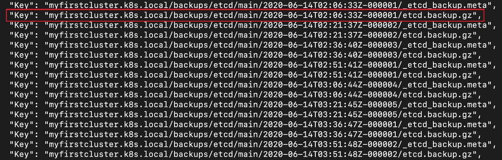

    图 18.4:获取可用备份列表

    您可以看到，备份每 15 分钟自动进行一次，并且标记了备份的时间戳。我们将在下一步中使用上一张截图中突出显示的最新备份的`Key`。

3.  The next step is to get the backup from the S3 bucket. We can use AWS CLI commands to get the backup that we need:

    ```
    aws s3api get-object --bucket $BUCKET_NAME --key "myfirstcluster.k8s.local/backups/etcd/main/2020-06-14T02:06:33Z-000001/etcd.backup.gz'  etcd-backup-$(date +%Y-%m-%d_%H:%M:%S_%Z).db
    ```

    请注意，该命令包含存储桶的名称、上一步文件的`Key`，以及我们保存文件时要使用的文件名。使用上一步输出中为实例获得的`Key`。您应该会看到类似这样的响应:

    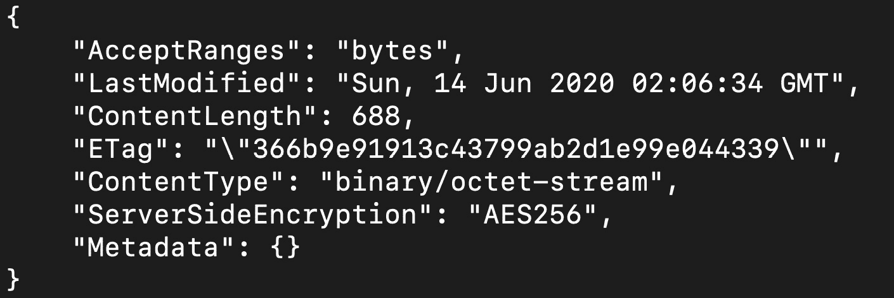

    图 18.5:从我们的 S3 桶中保存 etcd 备份

    请注意，我们使用了`date`命令来生成文件名。这是系统管理员用来确保任何文件都不会被覆盖的一种非常常见的技术。

    注意

    如果您想使用此备份恢复您的 etcd 实例，您可以在此链接找到恢复说明:[https://kops . sigs . k8s . io/operations/etcd _ backup _ restore _ encryption/](https://kops.sigs.k8s.io/operations/etcd_backup_restore_encryption/)。

4.  Verify that the backup file is created:

    ```
    ls -lrt 
    ```

    您应该会看到以下响应:

    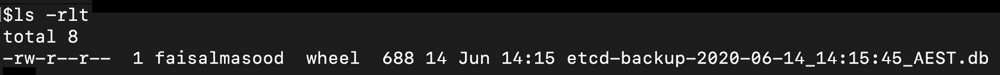

图 18.6:确认保存的 etcd 备份

您应该能够看到我们在响应中创建的快照。

在本练习中，您已经看到了如何生成 etcd 数据存储区的备份。这种备份是 Kubernetes 的状态，不仅在您的升级遇到任何问题时有用，而且还可以出于任何其他原因恢复集群，例如**灾难恢复** ( **灾难恢复**)场景。

## 清空节点并使其不可调度

在我们开始升级任何节点(主节点或工作节点)之前，我们需要确保该节点上没有运行任何 pods(包括主组件的 pods)。这是准备任何要升级的节点的重要步骤。此外，该节点需要标记为不可割集。不可调度节点是调度程序不在该节点中调度任何 pods 的标志。

我们可以使用`drain`命令将节点标记为不可调度，并驱逐所有豆荚。`drain`命令不会删除任何 DaemonSet 吊舱，除非我们告诉标志这样做。出现这种行为的原因之一是，无法在任何其他节点上调度 DaemonSet pods。

请注意，`drain`命令等待吊舱的正常终止，强烈建议在生产环境中等待所有吊舱正常终止。让我们在下面的练习中看到这一点。

## 练习 se 18.02:从节点中排出所有豆荚

在本练习中，我们将移除节点上运行的所有 pod。一旦移除所有单元，我们将把节点改回可调度状态，这样它就可以接受新的工作负载。此时，节点已升级并准备好接受新的 pod:

1.  Get a list of all the nodes:

    ```
    kubectl get nodes
    ```

    您应该会看到类似这样的响应:

    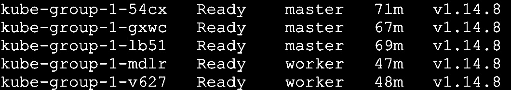

    图 18.7:获取节点列表

    在这个例子中，我们有两个工作节点和三个主节点。

2.  Create a new namespace called `upgrade-demo`:

    ```
    kubectl create ns upgrade-demo
    ```

    您应该会看到以下响应:

    ```
    namespace/upgrade-demo created
    ```

3.  Run a bunch of pods to simulate a workload. Create a file named `multiple-pods.yaml` with the following content:

    ```
    apiVersion: apps/v1
    kind: Deployment
    metadata:
      name: sleep
    spec:
    replicas: 4
      selector:
        matchLabels:
          app.kubernetes.io/name: sleep
      template:
        metadata:
          labels:
            app.kubernetes.io/name: sleep
        spec:
          containers:
          - name: sleep
            image: k8s.gcr.io/busybox
            command: [ "/bin/sh', "-c', "while :; do echo 'this is           backend pod'; sleep 5 ; done' ]
            imagePullPolicy: IfNotPresent
    ```

    部署将创建四个吊舱副本。

4.  Now, use the config to create the deployment:

    ```
    kubectl create -f multiple-pod.yaml -n upgrade-demo
    ```

    您应该会看到以下回应:

    ```
    deployment.apps/sleep created
    ```

5.  Verify that they are running on the worker pods:

    ```
    kubectl get pods -n upgrade-demo -o wide
    ```

    您的输出应该如下所示:

    

    图 18.8:验证工作单元是否在工作节点上运行

    请注意，按照默认的调度程序行为，pods 分布在两个工作节点中。

6.  Use the `drain` command to evict all the pods from any of the nodes. This command will also mark the node as unschedulable:

    ```
    kubectl drain kube-group-1-mdlr --ignore-daemonsets
    ```

    使用从上一步的输出中获得的节点名称。请注意，我们已经传递了一个忽略守护程序集的标志。您应该会看到以下响应:

    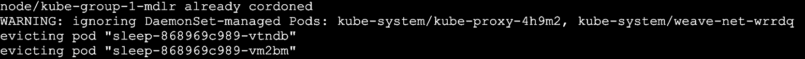

    图 18.9:清空节点

    如果我们不设置`--ignore-daemonsets`标志，并且节点上有一些 DaemonSet pods，`drain`没有这个标志将不会继续。我们建议使用此标志，因为您的集群可能正在运行一些基本的 pod 作为 DaemonSet，例如，Fluentd pod 从节点上的所有其他 pod 收集日志并将其发送到中央日志服务器。您可能希望此日志收集窗格在最后一刻才可用。

7.  Verify that all the pods are drained from this node. To do that, get a list of the pods:

    ```
    kubectl get pods -n upgrade-demo -o wide
    ```

    您应该会看到以下响应:

    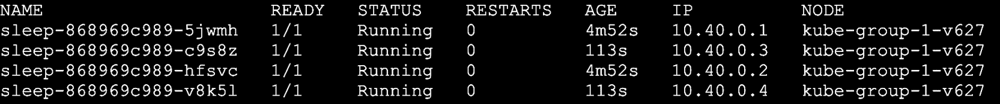

    图 18.10:检查吊舱是否已从排水节点移开

    在前面的截图中，您可以看到所有的 pods 都在另一个节点上运行。我们的集群中只有两个工作节点，因此所有的 pods 都被调度在唯一的可调度节点上。如果我们有几个可用的工作节点，那么调度器会在它们之间分配这些单元。

8.  Let's describe our drained node and make a few important observations:

    ```
    kubectl describe node kube-group-1-mdlr
    ```

    使用您在*步骤 6* 中排出的节点的名称。这将给出相当长的输出，但有两个部分值得观察:

    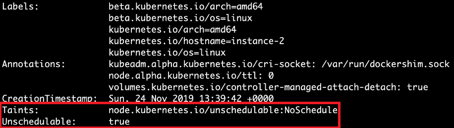

    图 18.11:检查污点和耗尽节点的不可修复状态

    前面的截图显示我们的节点被标记为不可割集。接下来，在输出中找到如下部分:

    

    图 18.12:检查排水节点上的非端接豆荚

    这表明，在我们的系统上运行的唯一未终止的吊舱的名称以`kube-proxy`和`weave-net`开头。第一个 pod 实现`kube-proxy`，它是管理 pod 和服务节点上的网络规则的组件。第二个 pod 是`weave-net`，它为我们的集群实现虚拟网络(请注意，您的网络提供商取决于您选择的网络类型)。由于我们在*第 6 步*中添加了一个排除 DaemonSet 的标志，这些由 DaemonSet 管理的吊舱仍在运行。

9.  Once you drain the pod in *step 6*, you will be able to upgrade the node. Even though upgrading is not part of this exercise, we just want to make the node schedulable again. For that, use the following command:

    ```
    kubectl uncordon kube-group-1-mdlr
    ```

    您应该会看到类似这样的响应:

    ```
    node/kube-group-1-mdlr uncordoned
    ```

10.  Verify that the node is schedulable again. Check the `Taints` section in the following output:

    ```
    kubectl describe node kube-group-1-mdlr
    ```

    您应该会看到类似以下内容的响应:

    

图 18.13:检查我们的非合作节点的污点和不可合作状态

前面的截图显示该节点现在是可调度的，并且我们在*步骤 8* 中观察到的污点已经被移除。

在本练习中，您已经看到了如何从节点中移除所有荚并将节点标记为不可剖分。这将确保不会在此节点中安排新的 pod，并且我们可以升级此节点。我们还学习了如何使节点再次可调度，以便我们可以在完成升级后继续使用它。

# 升级 Kub 欧内斯特主组件

当您以对组织重要的任何身份运行 Kubernetes 时，您将在高可用性配置中运行该平台。为此，典型的配置是在三个不同的节点上运行至少三个主组件的副本。这允许您一个接一个地将单个节点从一个次要版本升级到下一个次要版本，同时在升级的节点重新加入集群时仍然保持 API 兼容性，因为 Kubernetes 提供了跨一个次要版本的兼容性。这意味着当您一次升级每个节点时，主组件可以在不同的版本上。下表提供了版本的逻辑流程。假设您正在从 1.14 版升级到 1.15 版:

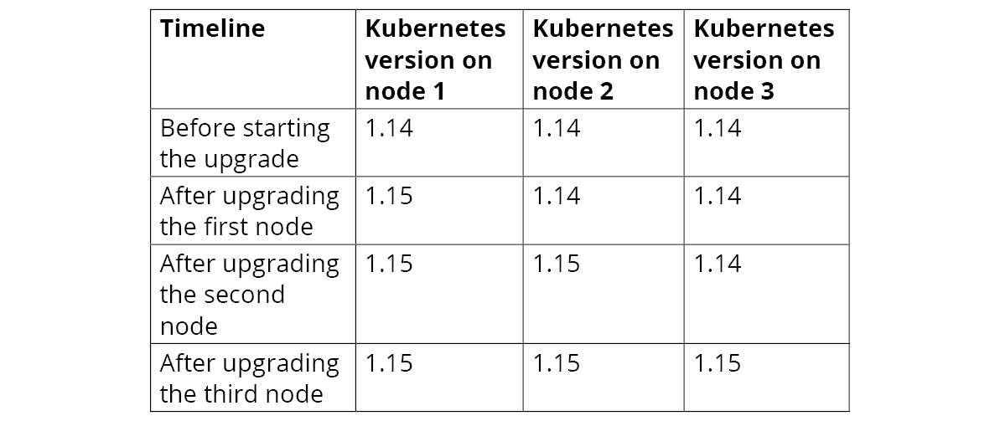

图 18.14:三个主节点的升级计划

在下面的练习中，我们将继续升级 Kubernetes 主组件。

## 练习 18.03 :升级 Kubernetes 主组件

在本练习中，您将升级 Kubernetes 主节点上的所有主组件。本练习假设您仍然登录到集群的堡垒主机。

在本练习中，为了简单起见，我们在较少数量的节点上演示了该过程，但是升级大量节点的过程是相同的。但是，为了实现无缝升级，至少需要三个主节点，您的应用应该是高可用性的，并且至少在两个工作节点上运行:

1.  Run the kops validator to validate the existing cluster:

    ```
    kops validate cluster 
    ```

    您应该会看到类似以下内容的响应:

    

    图 18.15:验证我们的 kops 集群

    这是输出的截断版本。它显示了集群的主要基础设施组件。

2.  List all the nodes in your cluster:

    ```
    kubectl get nodes
    ```

    您应该会看到类似这样的响应:

    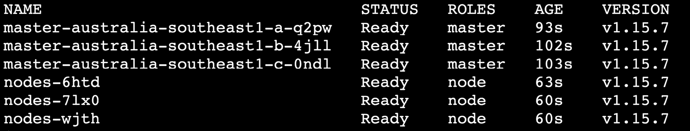

    图 18.16:获取节点列表

    请注意，我们有三个主节点，它们都在版本 1.15.7 上。

    注意

    在本练习中，我们展示了从 Kubernetes 版本 1.15.7 到 1.15.10 的升级。在执行本练习时，您可以应用相同的步骤升级到 kops 支持的 Kubernetes 版本。只要记住我们之前的建议，先升级到最新的补丁版本(这就是我们在这里做的)。

3.  Use the `kops upgrade cluster` command to see what update is available:

    ```
    kops upgrade cluster ${NAME}
    ```

    请注意，该命令不会直接运行更新，但会尽可能为您提供最新的更新版本。`NAME`环境变量保存集群的名称。您应该会看到类似如下的输出:

    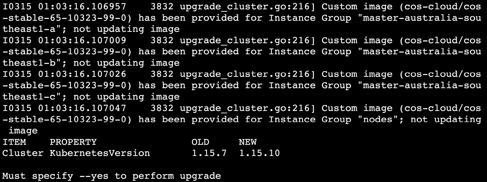

    图 18.17:检查可用的集群版本

    从前面的截图可以看到`OLD`版本是`1.15.7`，这是我们目前的版本，而`1.15.10`的`NEW`版本也有更新，这是我们的目标版本。

4.  Once you verify the changes from the command in *step 4*, run the same command with a `--yes` flag. This will mark the desired state of the cluster in the kops state store:

    ```
    kops upgrade cluster --yes
    ```

    您应该会看到类似如下的输出:

    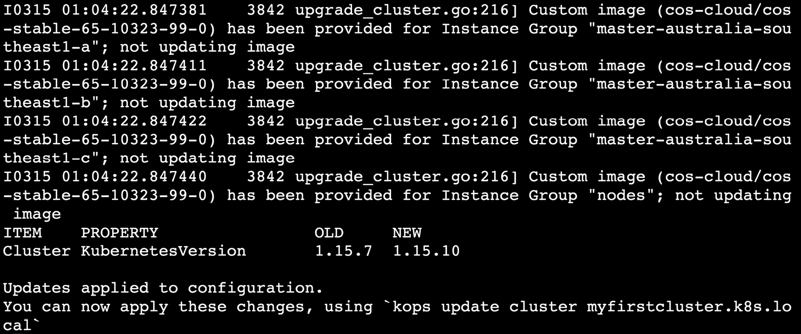

    图 18.18:升级 kops 集群配置

    该输出表明在更新的 kops 配置中记录了所需版本的 Kubernetes 集群。在下一步中，我们将要求 kops 更新云或集群资源以匹配新的规范——即 Kubernetes 版本`1.15.10`。

5.  Now, let's run the following command so that kops updates the cluster to match the updated kops configuration:

    ```
    kops update cluster ${NAME} --yes
    ```

    这将给出一个长输出，其结尾类似于下面的截图:

    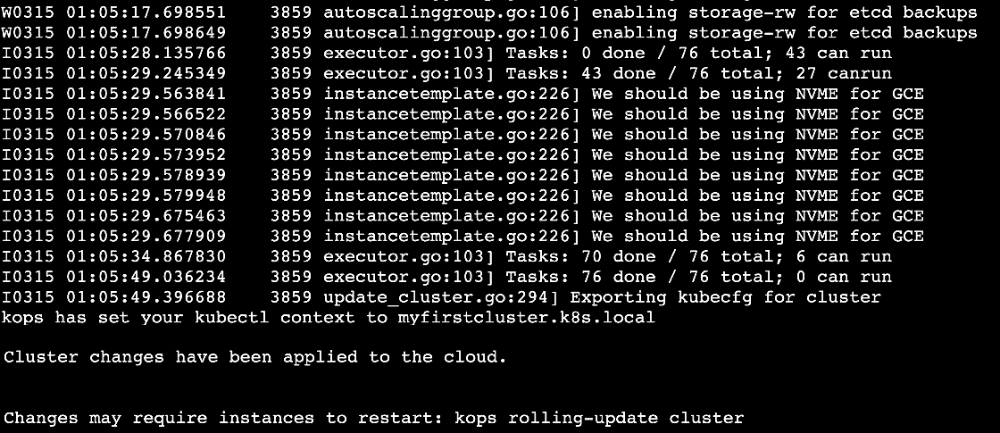

    图 18.19:根据集群升级的要求更新集群基础设施

    这已经更新了群集基础架构，以匹配更新的 kops 配置。接下来，我们需要对运行在这个基础设施上的 Kubernetes 主组件进行升级。

6.  If you are running several instances of your master/worker nodes on different instance groups, then you can control which instance group is receiving the updates. For that, let's get the name of our instance group first. Use the following command to get the names:

    ```
    kops get instancegroups
    ```

    您应该会看到如下响应:

    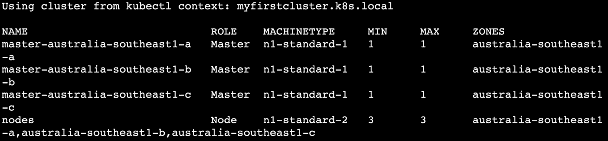

    图 18.20:获取实例组列表

7.  In this step, kops will update the Kubernetes cluster to match the kops specifications. Let's upgrade the first master node to the new version using a rolling update:

    ```
    kops rolling-update cluster ${NAME} --instance-group master-australia-southeast1-a --yes
    ```

    请注意，只有当您指定`--yes`标志时，此命令才会应用更改。根据您的节点配置，此命令可能需要一些时间。耐心等待，查看日志，看看是否有错误。一段时间后，您应该会看到类似于下面截图中的成功消息:

    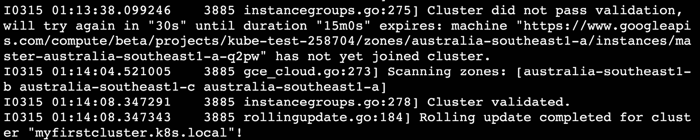

    图 18.21:对我们的第一个实例组应用滚动更新

8.  Verify that the node is upgraded to the target version, which is `1.15.10`, in our case:

    ```
    kubectl get nodes
    ```

    这应该给出类似于以下内容的响应:

    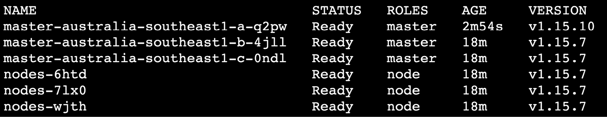

    图 18.22:检查节点上的主组件是否已经升级

    可以看到第一个主节点在`1.15.10`版本上。

9.  Verify that the pods are running on the newly upgraded node:

    ```
    kubectl describe node master-australia-southeast1-a-q2pw
    ```

    使用您在前面步骤中升级的节点的名称。这将给出长输出。查找`Non-terminated Pod`部分，如下图截图所示:

    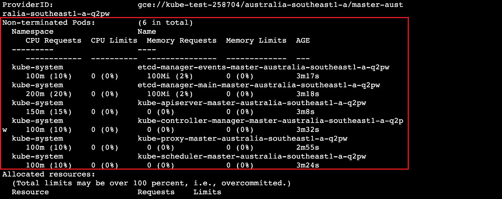

    图 18.23:检查我们升级的节点是否正在运行 pods

    注意

    在更新和验证时，使用相应实例组的适当名称，对所有附加主节点重复*步骤 7* 至 *9* 。

10.  Verify that kops has successfully updated the master nodes:

    ```
    kops rolling-update cluster ${NAME}
    ```

    您应该会看到以下输出:

    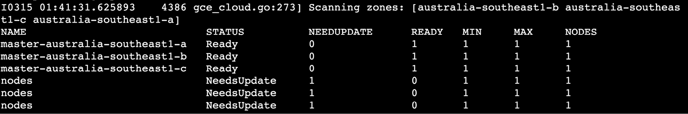

    图 18.24:检查是否所有主节点都已升级

    如前所述，这是一次试运行，输出显示了哪些节点需要更新。既然都显示`STATUS`为`Ready`，我们知道已经更新了。相比之下，您可以看到`nodes`(工作节点)返回`NeedsUpdate`，因为我们还没有更新它们。

11.  Verify that all the master nodes have been upgraded to the desired version:

    ```
    kubectl get nodes
    ```

    您应该会看到类似以下内容的响应:

    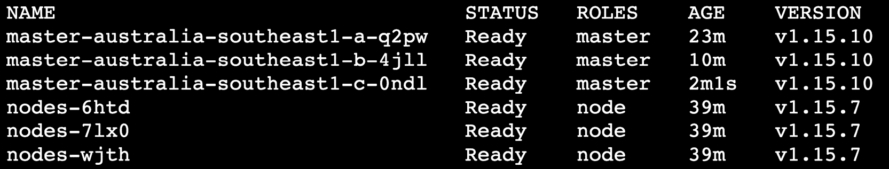

图 18.25:检查所有主节点上的 Kubernetes 版本

可以看到，所有的主节点都在运行版本`1.15.10`，也就是想要的版本。

在本练习中，您已经看到了如何升级 Kubernetes 集群的主节点，而不会让用户停机。一次更新一个节点将确保有足够的主服务器可用(至少需要三个主服务器才能工作)，并且用户和集群在更新过程中不会受到影响。

注意

当您对实例组应用滚动更新时，kops 将通过实例组内的节点一次仅使一个节点脱机来滚动更新。除此之外，在本练习中，我们一次只对一个实例组应用滚动更新。最终，您应该实现的是集群中一次只有一个节点离线的情况。如果您选择自动化此过程，请记住这一点。

# 升级 Kubernetes 工作 er 节点

尽管 Kubernetes 在一个次要版本中支持主节点(API 服务器)和工作节点(kubelet)之间的兼容性，但强烈建议您一次性升级主节点和工作节点。使用 kops，升级工作节点类似于升级主节点。由于一个次要版本中的向后兼容性，如果主节点与工作节点的版本不匹配，工作节点可能仍然可以工作，但是强烈建议不要在工作节点和主节点上运行不同版本的 Kubernetes，因为这可能会给集群带来问题。

但是，如果您想在升级过程中保持应用在线，以下注意事项非常重要:

*   确保您的应用配置为高可用性。这意味着，对于每个应用，您应该至少有两个豆荚，每个豆荚位于不同的节点上。如果不是这种情况，一旦您从节点中逐出豆荚，您的应用可能会遇到停机。
*   If you are running stateful components, make sure that the state of these components is backed up, or that your applications are designed to be able to withstand partial unavailability of the stateful components.

    例如，假设您正在运行一个具有单个主节点和多个读副本的数据库。一旦运行数据库主副本的节点退出数据库窗格，如果您的应用没有正确配置来处理这种情况，它们将会停机。这与 Kubernetes 集群的升级无关，但是了解应用在升级过程中的行为并确保它们被正确配置为容错是很重要的。

现在我们已经了解了确保应用正常运行的要求，让我们看看如何在下面的练习中升级工作节点。

## 练习 18.04:升级工作节点

在本练习中，我们将升级 Kubernetes 集群的所有工作节点。工作节点是应用的宿主:

1.  Get the list of instance groups for your worker nodes:

    ```
    kops get instancegroups
    ```

    您应该会看到类似以下内容的响应:

    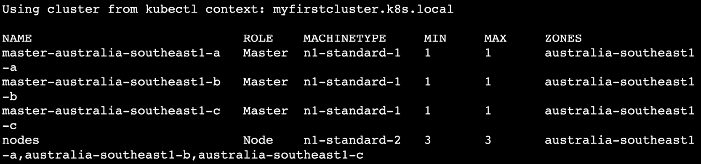

    图 18.26:获取实例组列表

    从这张图片中，我们可以看到我们的工作节点的实例组的名称是`nodes`。

2.  Verify that the nodes are ready:

    ```
    kubectl get nodes
    ```

    您应该会看到类似这样的响应:

    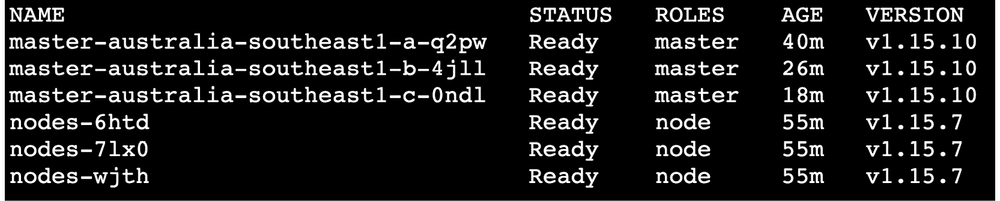

    图 18.27:检查节点状态

    如果我们有多个实例组，我们将逐个升级每个实例组。然而，我们在这里的任务很简单，因为我们只有一个任务——即`nodes`。

3.  Run the kops rolling update for the `nodes` instance group **without** the `--yes` flag. This will provide you with a summary of what will be updated with the `kops rolling-update` command:

    ```
    kops rolling-update cluster ${NAME} --node-interval 3m --instance-group nodes --post-drain-delay 3m --logtostderr --v 9
    ```

    请注意，我们已经更改了前面命令中的详细度值，以获得更详细的日志。

    让我们分解这个命令:

    –标志`node-interval`设置不同节点重启之间的最小延迟。

    –标志`instance-group`表示滚动更新应该应用到哪个实例组。

    –标志`post-drain-delay`设置节点排空后的延迟时间，然后才能重新启动。请记住，在本章前面，排水操作将等待吊舱的优雅终止。这种延迟将在之后应用。

    `node-interval`和`post-drain-delay`标志提供了一个选项来控制集群中的变化率。这些选项的值部分取决于您正在运行的应用的类型。例如，如果您在节点上运行日志代理 DaemonSet，您可能希望给 pod 足够的时间将内容刷新到中央日志服务器。

    注意

    在前一种情况下，我们在执行滚动更新时没有使用这些延迟，因为在这种情况下，每个实例组中只有一个节点。这里，我们在这个实例组中有三个节点。

    –标记`logtosterr`将所有日志输出到**标准错误**流，这样我们就可以在终端输出中看到它们。

    –标志`v`设置我们将看到的日志的详细程度。

    该命令将显示以下输出:

    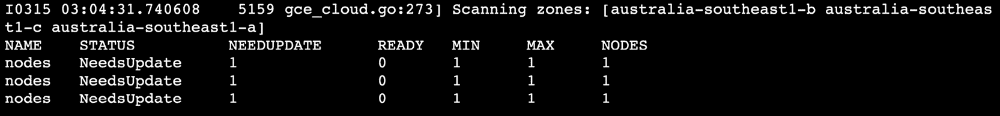

    图 18.28:执行滚动更新的试运行

4.  Now, run the upgrade. Use the same command as the previous step with the addition of the `--yes` flag. This tells kops to perform the upgrade:

    ```
    kops rolling-update cluster ${NAME} --node-interval 3m --instance-group nodes --post-drain-delay 3m --logtostderr --v 9 --yes
    ```

    Kops 将耗尽一个节点，等待耗尽后的延迟时间，然后升级并重新启动该节点。这将对每个节点逐一重复。您将在终端中看到一个很长的日志，这个过程可能需要长达半个小时才能完成。在您的终端中，您应该开始查看日志，如下所示:

    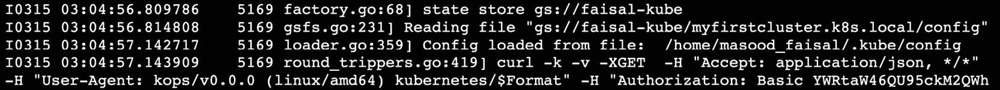

    图 18.29:开始滚动更新过程

    过一会儿，您将看到集群升级完成，并显示一条成功消息，如下所示:

    

    图 18.30:滚动更新完成消息

    敏锐的读者会注意到，在*图 18.29* 中，在作者的日志中，集群升级在 3:05 左右开始，在 3:25 左右结束，在*图 18.29* 中可以看到。三个节点的总时间约为 20 分钟。我们在停止后为每个节点设置了 3 分钟的延迟，在清空所有豆荚后为每个节点设置了 3 分钟的延迟。因此，每个节点的等待时间加起来是 6 分钟。实例组中有三个节点，总等待时间为 6 × 3 = 18 分钟。

5.  Verify that the worker nodes are updated to the target version – that is, `1.15.10`:

    ```
    kubectl get nodes 
    ```

    您应该会看到以下响应:

    

    图 18.31:检查工作节点上的 Kubernetes 版本

6.  Verify that the pods are in a running state:

    ```
    kubectl get pods -n upgrade-demo
    ```

    你应该会看到所有`STATUS`设置为`Running`的豆荚，如这个截图所示:

    

图 18.32:检查我们吊舱的状态

在本练习中，您已经看到了通过 kop 升级工作节点是多么容易。但是，我们不建议为生产集群一次性升级所有工作节点，强烈建议为工作节点创建实例组。以下是可用于生产级集群的一些策略:

*   不要将所有工作节点都放在一个实例组中。为不同的工作节点集创建多个实例组。默认情况下，kops 仅创建一个实例组，但您可以更改此行为，为工作节点创建多个实例组。我们建议基础架构组件(如监控和日志记录)、入口、关键应用、非关键应用和静态应用使用不同的工作实例组。这将帮助您首先将升级应用到集群中不太重要的部分。这种策略将有助于限制升级过程中的任何问题，将它们保持在最低限度，同时将受影响的节点与集群的其他节点隔离开来。
*   If you are running the cluster in the cloud, you can provision new nodes on demand. Thus, it may be a good idea to create a sister instance group for upgrades. This new instance group should be running the upgraded version of Kubernetes. Now, cordon and drain all the pods from the old instance group. The Kubernetes scheduler will see that the new nodes are available and will automatically move all your pods to the new nodes. Once this is complete, you can just delete the old instance group and your upgrade is complete.

    这种策略需要一些规划，尤其是当您在集群上运行有状态的应用时。此策略还假设您能够按需调配新节点，因为创建姐妹实例组可能需要额外的临时硬件，这对内部数据中心来说可能是一个挑战。

请注意，这些都是高级策略，超出了本书的范围。但是，您可以在[https://kops . sigs . k8s . io/tutorial/work-with-instance groups/](https://kops.sigs.k8s.io/tutorial/working-with-instancegroups/)找到关于它的更多信息。

现在，您已经看到了升级集群所需的所有步骤，您可以在下面的活动中将所有步骤结合起来。

## 活动 18.01:将 Ku bernetes 平台从版本 1.15.7 升级到版本 1.15.10

在本活动中，您将把 Kubernetes 平台从版本`1.15.7`升级到版本`1.15.10`。在这里，我们将把我们在这一章中学到的一切都集中起来。这些指导方针应该有助于您完成活动:

注意

在本活动中，我们将展示从 Kubernetes 版本`1.15.7`到`1.15.10`的升级。在执行本活动时，您可以应用相同的步骤升级到 kops 支持的 Kubernetes 版本。

1.  使用*练习 11.01* 、*设置我们的库本内斯集群*，设置一个运行库本内斯版本`1.15.7`的新集群。如果您使用云来加速机器，您可以在升级之前拍摄机器的快照(云供应商可能会为此向您收费)，以便快速再次运行升级。
2.  将 kop 升级到您想要在主节点或堡垒节点上升级的版本。对于这个活动，我们需要有版本`1.15`。
3.  将其中一个主节点升级到 Kubernetes 版本`1.15.10`。
4.  验证主节点恢复服务并处于`Ready`状态。
5.  同样，升级所有其他主节点。
6.  Verify that all the master nodes are upgraded to the desired version, as in the following screenshot:

    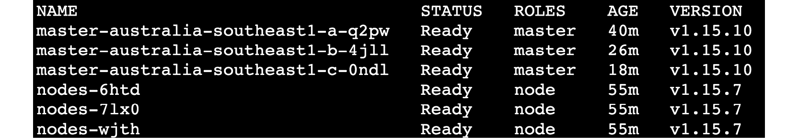

    图 18.33:主节点上 Kubernetes 的升级版本

7.  现在，升级工作节点。
8.  Verify that the pods are running successfully on the newly upgraded nodes. Finally, you should be able to verify that your pods are running on the new node, as follows:

    

图 18.34:在升级的工作节点上运行的 Pods

注意

该活动的解决方案可在以下地址找到:[https://packt.live/304PEoD](https://packt.live/304PEoD)。

# 总结

在本章中，您已经了解到，在为运行应用提供安全可靠的基础时，保持 Kubernetes 平台的最新非常重要。在这个快速发展的数字世界中，许多企业依赖关键应用并保持它们可用，尽管升级底层平台很重要。

您已经看到，如果一开始就将集群设置为高可用性配置，平台的无停机升级是可能的。但是，除非您已经以容错方式设计和部署了应用，否则平台不能保证应用的可用性。一个因素是确保您的应用有多个实例在运行，并且该应用被设计为优雅地处理这些实例的终止。

考虑到这一点，我们看到了以平台本身不会导致应用宕机的方式升级集群的重要考虑事项。我们分别查看了主节点和工作节点的升级过程。本章的主要内容是在不同情况下强调的原则，这些原则可以应用于由不同工具管理的不同类型的 Kubernetes 集群。

正如本章开头提到的，保持您的平台最新对于跟上 DevOps 的最新发展并使您的应用开发团队能够继续向您的最终客户交付新功能非常重要。通过本章所学的技能，您应该能够在不中断客户的情况下处理平台升级。

在下一章中，我们将讨论如何用定制资源扩展您的 Kubernetes 平台。自定义资源允许您为自己的项目提供 Kubernetes 原生 API 体验。