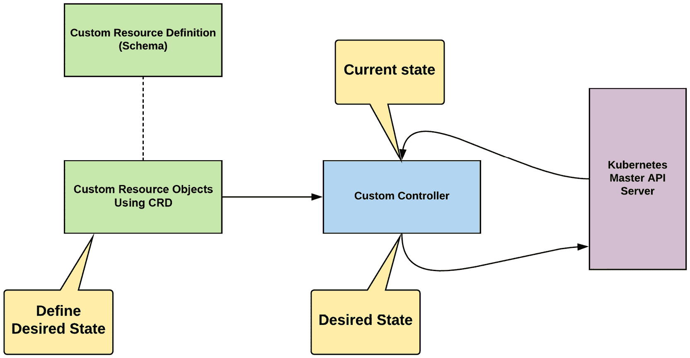
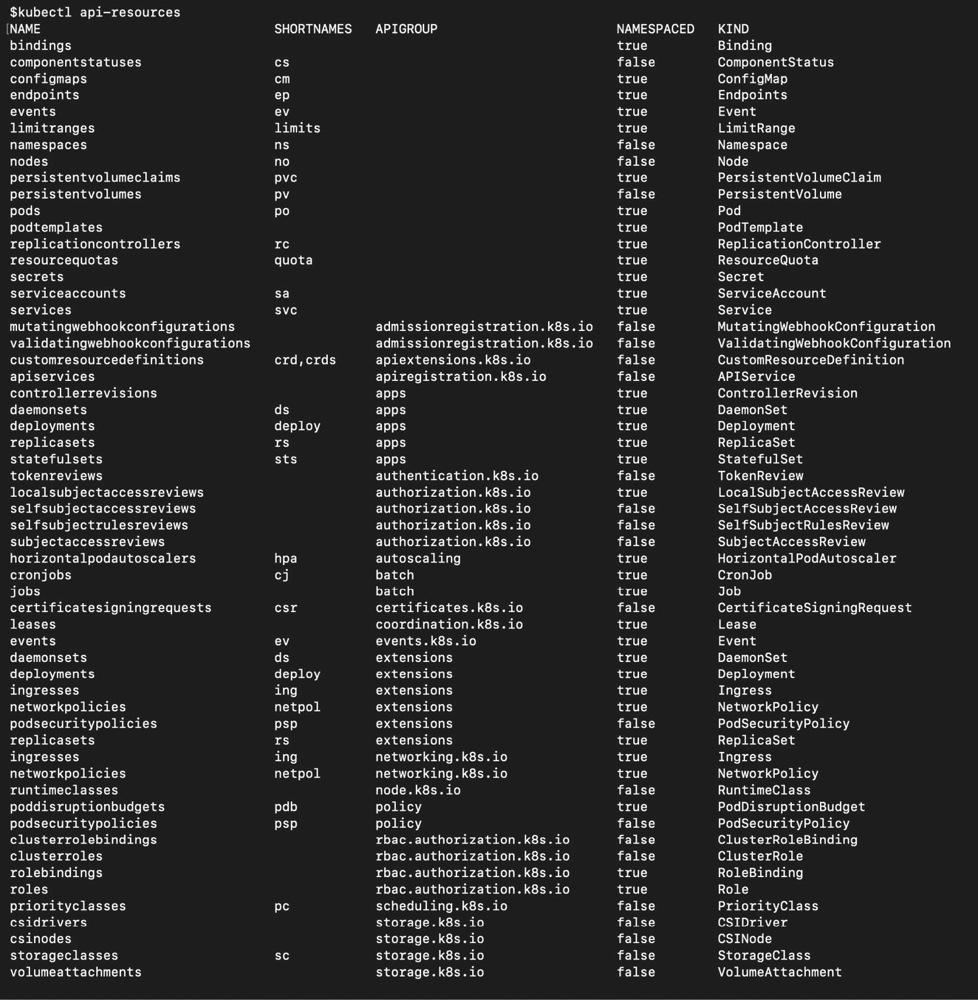
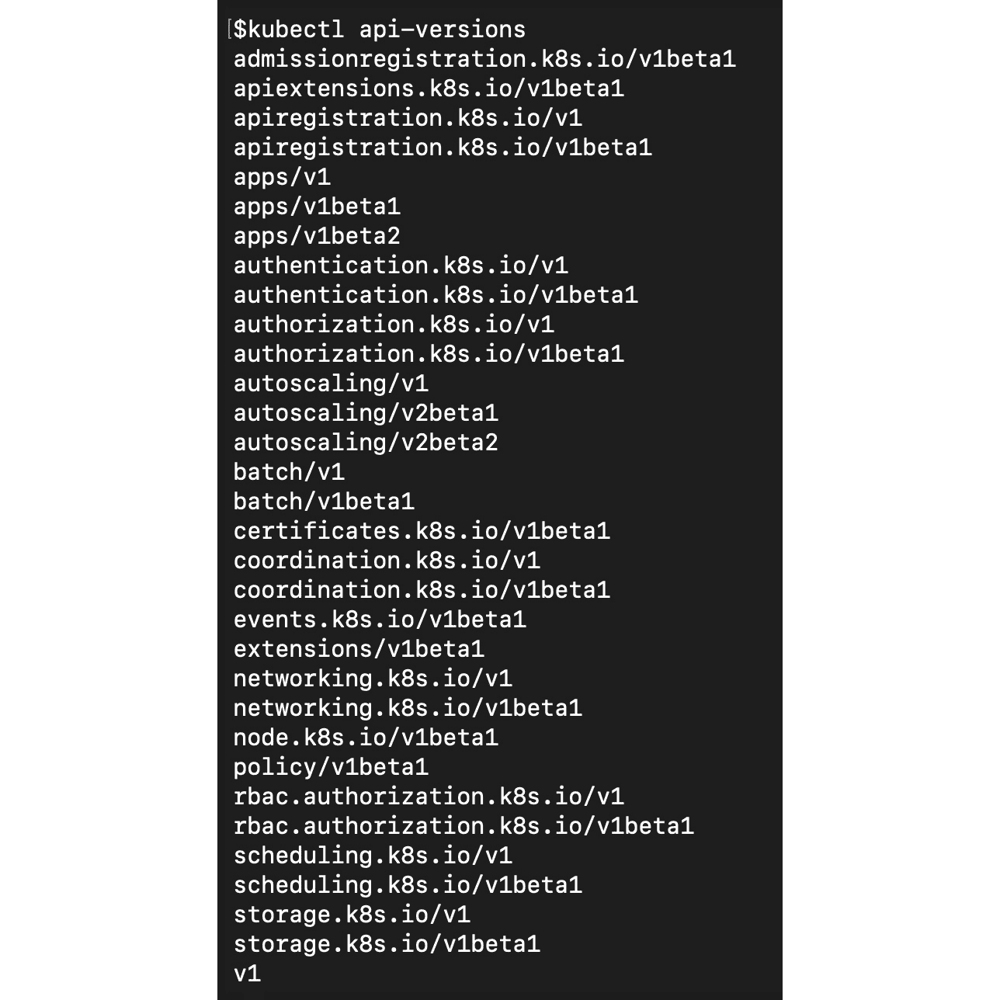
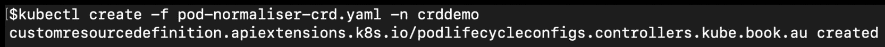
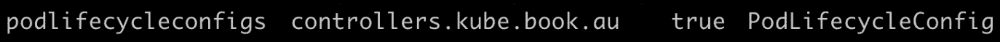
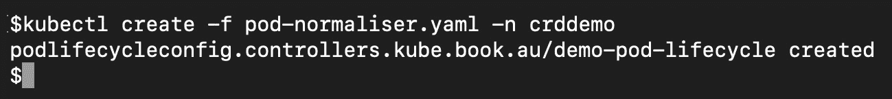
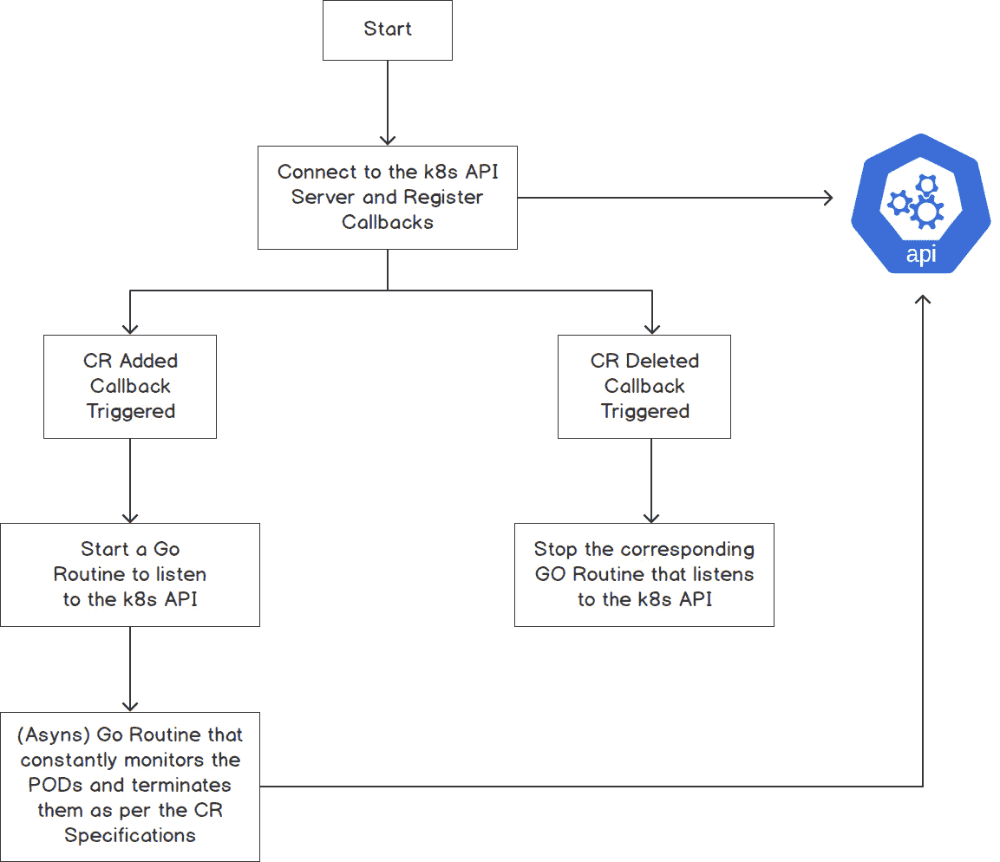
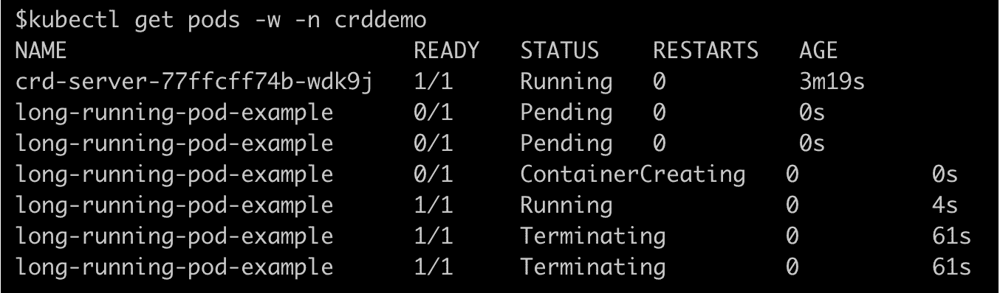
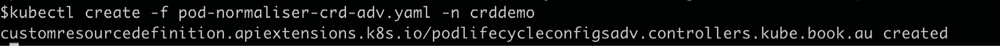
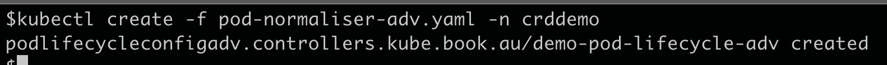

# 19。Kubernetes 中的自定义资源定义

概观

在本章中，我们将展示如何使用**自定义资源定义** ( **CRDs** )来扩展 Kubernetes 并为 Kubernetes 集群添加新功能。您还将学习如何定义、配置和实现完整的 CRD。我们还将描述 CRD 非常有用的各种示例场景。本章结束时，您将能够定义和配置一个 CRD 和一个**自定义资源** ( **CR** )。您还将学习如何部署基本的自定义控制器，以在集群中实现 CR 所需的功能。

# 简介

在前几章中，我们了解了不同的 Kubernetes 对象，如 Pods、Deployments 和 ConfigMaps。这些对象由 Kubernetes API 定义和管理(也就是说，对于这些对象，API 服务器管理它们的创建和销毁，以及其他操作)。但是，您可能希望扩展 Kubernetes 提供的功能，以提供标准 Kubernetes 没有提供的功能，并且 Kubernetes 提供的内置对象无法启用该功能。

为了在 Kubernetes 之上构建这些功能，我们使用**定制资源** ( **CRs** )。**自定义资源定义** ( **CRDs** )允许我们添加一项功能，通过该功能，用户可以向 Kubernetes 服务器添加自定义对象，并像使用任何其他本机 Kubernetes 对象一样使用这些 CRs。一个 CRD 帮助我们把我们的定制对象介绍给库本内特系统。一旦我们的 CRD 被创建，它就可以像 Kubernetes 服务器中的任何其他对象一样被使用。不仅如此，我们还可以为我们介绍的 CRs 使用 Kubernetes API、**基于角色的访问控制** ( **RBAC** )策略以及其他 Kubernetes 特性。

当您定义一个 CRD 时，它存储在 Kubernetes 配置数据库(etcd)中。将 CRDs 视为自定义对象结构的定义。一旦一个 CRD 被定义，库本内斯创建的对象符合 CRD 的定义。我们称这些物体为 CRs。如果我们把它比作编程语言的类比，CRD 是类，而 CR 是类的实例。简而言之，CRD 定义了一个自定义对象的模式，而 CR 定义了一个您想要实现的对象的期望状态。

客户关系管理通过定制控制器实现。在本章的第一个主题中，我们将仔细研究定制控制器。

# 什么是自定义控制器？

CRD 和 CRs 帮助您定义 CRs 的期望状态。需要一个组件来确保库本内特系统的状态与 CR 定义的期望状态相匹配。正如您在前面几章中所看到的，执行此操作的 Kubernetes 组件称为控制器。Kubernetes 提出了许多这样的控制器，它们的工作是确保所需的状态(例如，部署中定义的 Pods 副本的数量)等于部署对象中定义的值。总之，控制器是一个组件，它通过 Kubernetes API 服务器监视资源的状态，并试图将当前状态与所需状态相匹配。

Kubernetes 标准设置中包含的内置控制器旨在与部署等内置对象一起工作。对于我们的 CRD 和它们的 CRs，我们需要编写自己的定制控制器。

## CRD、华润和控制者之间的关系

CRD 提供了一种定义 CR 的方法，定制控制器提供了对 CR 对象进行操作的逻辑。下图总结了 CRD、华润和控制器:



图 19.1:CRD、华润和控制器是如何联系在一起的

如前图所示，我们有一个 CRD，一个自定义控制器，以及按照 CRD 定义所需状态的 CR 对象。这里有三件事需要注意:

*   The CRD is the schema that defines how the object will look. Every resource has a defined schema that tells the Kubernetes engine what to expect in a definition. Core objects such as `PodSpec` have schemas that are baked into the Kubernetes project.

    注意

    你可以在这个链接找到 PodSpec 的源代码:[https://github . com/kubernetes/kubernetes/blob/master/pkg/API/core/types . go # l 2627](https://github.com/kubernetes/kubernetes/blob/master/pkg/apis/core/types.go#L2627 )

*   基于模式(CRD)创建的 CR 对象定义了所需的资源状态。
*   自定义控制器是提供将当前状态带入所需状态的功能的应用程序。

请记住，CRD 是一种方式，通过它 Kubernetes 允许我们为我们的 CRs 声明性地定义模式或定义。一旦我们的 CRD(模式)在库本内斯服务器上注册，一个 CR(对象)就按照我们的 CRD 来定义。

# 标准库柏 API 资源

让我们列出 Kubernetes 集群中所有可用的资源和 API。回想一下，我们使用的所有东西都被定义为一个应用编程接口资源，应用编程接口是一个网关，我们通过它与库本内斯服务器通信以使用该资源。

使用以下命令获取所有当前 Kubernetes 资源的列表:

```
kubectl api-resources
```

您应该会看到以下响应:



图 19.2:标准库本内斯应用编程接口资源

在前面的截图中，可以看到 Kubernetes 中定义的资源有一个`APIGroup`属性，它定义了什么内部 API 负责管理这个资源。`Kind`列列出了资源的名称。正如我们在本主题前面所看到的，对于标准的 Kubernetes 对象(如 Pods)，Pods 对象的模式或定义被构建到 Kubernetes 中。当您定义一个 Pod 规范来运行一个 Pod 时，这可以说类似于一个 CR。

对于每个资源，都有一些代码可以对资源采取行动。这被定义为一组 API(`APIGroup`)。注意，可以存在多个 API 组；例如，稳定版本和实验版本。发出以下命令，查看您的 Kubernetes 集群中有哪些 API 版本可用:

```
kubectl api-versions
```

您应该会看到以下响应:



图 19.3:各种应用编程接口组及其版本

在前面的截图中，请注意`apps` API 组有多个可用版本。这些版本中的每一个都可能有一组不同的功能，这些功能在其他组中不可用。

# 为什么我们需要定制资源？

如前所述，CRs 提供了一种方法，通过这种方法，我们可以扩展 Kubernetes 平台，以提供特定于某些用例的功能。这里有几个你会遇到 CRs 使用的用例。

## 示例用例 1

考虑一个用例，其中您希望自动将业务应用程序或数据库自动配置到 Kubernetes 集群上。抽象出技术细节，例如配置和部署应用程序，允许团队在不深入了解 Kubernetes 的情况下管理它们。例如，您可以创建一个 CR 来抽象数据库的创建。因此，用户只需在 CRD 定义数据库的名称和大小，就可以创建一个数据库 Pod，控制器将提供其余的内容。

## 示例用例 2

考虑一个场景，其中你有自我服务的团队。您的 Kubernetes 平台由多个团队使用，您希望这些团队自行调配名称空间和其他资源。在这种情况下，您希望团队定义工作负载所需的总 CPU 和内存，以及 Pod 的默认限制。您可以创建一个 CRD，团队可以使用名称空间名称和其他参数创建一个 CR。您的定制控制器将创建他们需要的资源，并为每个团队关联正确的 RBAC 策略。您还可以添加其他功能，例如一个团队被限制在三个环境中。控制器还可以生成审计事件并记录所有活动。

## 示例用例 3

假设您是一个开发 Kubernetes 集群的管理员，开发人员来这里测试他们的应用程序。你面临的问题是，开发人员让 Pods 继续运行，并转向新的项目。这可能会为您的群集造成资源问题。

在本章中，我们将围绕这个场景构建一个 CRD 和一个定制控制器。我们可以实现的一个解决方案是在 Pod 创建后经过一定时间后删除它们。这次就叫`podLiveForThisMinutes`吧。另一个需求是为每个名称空间定义`podLiveForThisMinutes`的可配置方式，因为不同的团队可能有不同的优先级和需求。

我们可以为每个名称空间定义一个时间限制，这将提供在不同名称空间上应用控件的灵活性。为了实现这个示例用例中定义的需求，我们将定义一个允许两个字段的 CRD——一个名称空间名称和允许 Pods 运行的时间量(`podLiveForThisMinutes`)。在本章的其余部分，我们将构建一个 CRD 和一个控制器，使我们能够实现这里提到的功能。

注意

还有其他(更好的)方法来实现前面的场景。在现实世界中，如果 Pod 是使用`Deployment`资源创建的，Kubernetes `Deployment`对象会重新创建 Pod。我们选择这个场景是为了让这个例子简单且易于实现。

# 我们的定制资源是如何定义的

为了解决上一节中的*用例 3* 的问题，我们决定我们的 CRD 将定义两个字段，如前一个例子中所述。为此，我们的 CR 对象将如下所示。

```
apiVersion: "controllers.kube.book.au/v1"
kind: PodLifecycleConfig
metadata:
  name: demo-pod-lifecycle
spec:
  namespaceName: crddemo
  podLiveForThisMinutes: 1
```

前面的规范定义了我们的目标对象。如您所见，它看起来就像普通的 Kubernetes 对象，但是规格(第`spec`部分)是根据我们的要求定义的。让我们更深入地了解一下细节。

## apiVersion

这是 Kubernetes 对对象进行分组所需的字段。注意，我们把版本(`v1`)作为组合键的一部分。这种分组技术帮助我们保存对象的多个版本。考虑是否要在不影响现有用户的情况下添加新属性。您只需使用`v2`创建一个新组，两个版本的对象定义— `v1`和`v2`就可以同时存在。因为它们是分开的，所以它允许不同群体的不同版本以不同的速度进化。

如果我们想测试新特性，这种方法也有帮助。假设我们想给同一个对象添加一个新字段。然后，我们可以更改 API 版本并添加新字段。因此，我们可以将稳定版本与新的实验版本分开。

## 种

该字段提及由`apiVersion`定义的组中的特定类型的对象。把`kind`想象成 CR 对象的名字，比如`Pod`。

注意

不要将其与您使用该规范创建的对象名称混淆，该名称在`metadata`部分中定义。

通过这种方式，我们可以在一个 API 组下拥有多个对象。想象一下，您将要创建一个非常棒的功能，需要创建多种不同类型的对象。在同一应用编程接口组下，您可以使用`Kind`字段拥有多个对象。

## 规格

此字段定义定义对象规格所需的信息。规范包含定义我们资源的期望状态的信息。描述我们资源特征的所有字段都在`spec`部分。对于我们的用例，`spec`部分包含了我们的 CR–`podLiveForThisMinutes`和`namespaceName`所需的两个字段。

## namespaceName 和 podliveforthisminutes

这些是我们想要定义的自定义字段。`namespaceName`将包含目标命名空间的名称，`podLiveForThisMinutes`将包含我们希望 Pod 处于活动状态的时间(以分钟为单位)。

## CRD 的定义

在前一节中，我们展示了 CR 的不同组件。然而，在我们定义 CR 之前，我们需要定义一个模式，该模式控制 CR 的定义方式。在下面的练习中，您将为*如何定义我们的定制资源*部分中提到的资源定义模式或 CRD。

考虑这个例子 CRD，我们将在下面的练习中使用它。让我们通过观察以下定义来理解 CRD 的重要部分:

pod 正常化-crd.yaml

```
1  apiVersion: apiextensions.k8s.io/v1beta1
2  kind: CustomResourceDefinition
3  metadata:
4    name: podlifecycleconfigs.controllers.kube.book.au
5  spec:
6    group: controllers.kube.book.au
7    version: v1
8    scope: Namespaced
9    names:
10     kind: PodLifecycleConfig
11     plural: podlifecycleconfigs
12     singular: podlifecycleconfig
13  #1.15 preserveUnknownFields: false
14   validation:
15     openAPIV3Schema:
16       type: object
17       properties:
18         spec:
19           type: object
20           properties:
21             namespaceName:
22               type: string
23             podLiveForThisMinutes:
24               type: integer
```

现在，让我们看看这个 CRD 的各个组成部分:

*   `apiVersion`和`kind`:这些是 CRD 本身的 API 和资源，由库本内特公司为 CRD 定义提供。
*   `group`和`version`:把一个 API 组想象成一组逻辑上相互关联的对象。这两个字段定义了 API 组和我们的 CR 版本，然后将被翻译成我们的 CR 的`apiVersion`字段，在前面的部分中已经定义了。
*   `kind`:该字段定义了我们 CR 的`kind`，在前面的*如何定义我们的定制资源*部分中进行了定义。
*   `metadata/name`:名称必须与`spec`字段匹配，格式为两个字段的组合——即`<plural>.<group>`。
*   `scope`:该字段定义 CR 是命名空间范围还是集群范围。默认情况下，CR 是集群范围的。我们在这里将其定义为命名空间范围的。
*   `plurals`:这些是 Kubernetes API 服务器 URL 中使用的复数名称。
*   `openAPIV3Schema`:这是基于 OpenAPI v3 标准定义的模式。它指的是我们 CR 的实际字段/模式。模式定义了我们的 CR 中哪些字段可用，字段的名称，以及它们的数据类型。它基本上定义了我们 CR 中`spec`字段的结构。我们已经在我们的 CR 中使用了`namespaceName`和`podLiveForMinutes`字段。您可以在以下练习的*第 2 步*中看到这一点。

有趣的是，服务于 CRs 的 API 服务器的组件被称为`apiextensions-apiserver`。当 kubectl 请求到达 API 服务器时，它首先检查资源是否是标准的 Kubernetes 资源，例如 Pod 或 Deployment。如果资源不是标准资源，则调用`apiextensions-apiserver`。

## 练习 19.01:定义 CRD

在本练习中，我们将定义一个 CRD，在下一个练习中，我们将为定义的 CRD 创建一个 CR。CRD 的定义存储在 Kubernetes etcd 服务器中。请记住，CRD 和 CR 只是定义，在您部署与您的 CRs 相关联的控制器之前，CRD/CR 不附带任何功能。通过定义一个 CRD，您将向 Kubernetes 集群注册一个新类型的对象。在您定义了 CRD 之后，它将可以通过普通的 Kubernetes API 访问，并且您可以通过 Kubernetes:

1.  Create a new namespace called `crddemo`:

    ```
    kubectl create ns crddemo
    ```

    这应给出以下响应:

    ```
    namespace/crddemo created
    ```

2.  现在，我们需要定义一个 CRD。使用以下内容创建名为`pod-normaliser-crd.yaml`的文件:

    ```
    apiVersion: apiextensions.k8s.io/v1beta1
    kind: CustomResourceDefinition
    metadata:
      name: podlifecycleconfigs.controllers.kube.book.au
    spec:
      group: controllers.kube.book.au
      version: v1
      scope: Namespaced
      names:
        kind: PodLifecycleConfig
        plural: podlifecycleconfigs
        singular: podlifecycleconfig
      #1.15 preserveUnknownFields: false
      validation:
        openAPIV3Schema:
          type: object
          properties:
            spec:
              type: object
              properties:
                namespaceName:
                  type: string
                podLiveForThisMinutes:
                  type: integer
    ```

3.  Using the definition from the previous step, create the CRD using the following command:

    ```
    kubectl create -f pod-normaliser-crd.yaml -n crddemo
    ```

    您应该会看到以下响应:

    

    图 19.4:创建我们的 CRD

4.  Verify that the CR is registered with Kubernetes using the following command:

    ```
    kubectl api-resources | grep podlifecycleconfig
    ```

    您应该会看到以下资源列表:

    

    图 19.5:验证 CR 是否已在 Kubernetes 注册

5.  Verify that the API is available in the Kubernetes API server by using the following command:

    ```
    kubectl api-versions | grep controller
    ```

    您应该会看到以下响应:

    ```
    controllers.kube.book.au/v1
    ```

在本练习中，我们已经定义了一个 CRD，现在，Kubernetes 将能够知道我们的 CR 应该是什么样子。

现在，在下面的练习中，让我们按照我们定义的 CRD 创建一个资源对象。本练习将是上一练习的延伸。然而，我们之所以把它们分开，是因为 CRD 物体可以独立存在；你不必让 CR 和 CRD 配对。这可能是因为 CRD 是由某个第三方软件供应商提供的，而您只需要创建 CR。例如，供应商提供的数据库控制器可能已经有了 CRD 和控制器。要使用该功能，您只需要定义 CR。

在下面的练习中，让我们继续从我们的 CRD 中制作一个 CR。

## ise 19.02:使用 CRD 定义 CR

在本练习中，我们将根据上一练习中定义的 CRD 创建 CR。CR 将作为普通的 Kubernetes 对象存储在 etcd 数据存储中，并由 Kubernetes API 服务器提供服务——也就是说，当您尝试通过 Kubernetes 访问它时，它将由 Kubernetes API 服务器处理:

注意

只有在成功完成本章中的上一个练习后，您才能执行本练习。

1.  First, make sure that there is no CR for the `podlifecycleconfigs` type. Use the following command to check:

    ```
    kubectl get podlifecycleconfigs -n crddemo
    ```

    如果没有 CR，您应该会看到以下响应:

    ```
    No resources found.
    ```

    如果定义了资源，可以使用以下命令将其删除:

    ```
    kubectl delete podlifecycleconfig <RESOURCE_NAME> -n crddemo
    ```

2.  现在，我们必须创建一个 CR。使用以下内容创建名为`pod-normaliser.yaml`的文件:

    ```
    apiVersion: "controllers.kube.book.au/v1"
    kind: PodLifecycleConfig
    metadata:
      name: demo-pod-lifecycle
      # namespace: "crddemo"
    spec:
      namespaceName: crddemo
      podLiveForThisMinutes: 1
    ```

3.  Issue the following command to create the resource from the file created in the previous step:

    ```
    kubectl create -f pod-normaliser.yaml -n crddemo
    ```

    您应该会看到以下响应:

    

    图 19.6:创建我们的 CR

4.  Verify that it is registered by Kubernetes by using the following command:

    ```
    kubectl get podlifecycleconfigs -n crddemo
    ```

    您应该会看到以下响应:

    ```
    NAME                  AGE
    demo-pod-lifecycle    48s
    ```

请注意，我们现在使用的是普通的 kubectl 命令。这是扩展 Kubernetes 平台的一个非常棒的方法。

我们已经定义了我们自己的 CRD，并创建了一个反对它的 CR。下一步是为我们的 CR 添加所需的功能。

## 编写自定义控制器

现在我们的集群中有了 CR，我们将继续编写一些代码*对其进行操作*，以实现我们在*为什么需要定制资源*一节中阐述的场景的目的。

注意

我们不会教为我们的控制器编写 Go 代码的实际编程，因为这超出了本书的范围。但是，我们将为您提供*示例用例 3* 所需的编程逻辑。

让我们假设我们的自定义控制器代码作为一个 Pod 运行。它需要做什么来响应 CR？

1.  首先，控制器必须知道已经在集群中定义/移除了新的 CR，以获得期望的状态。
2.  第二，代码需要一种与 Kubernetes API 服务器交互的方式来请求当前状态，然后请求想要的状态。在我们的例子中，我们的控制器必须知道名称空间中的所有 pods 以及 Pods 被创建的时间。代码然后可以要求库本内特斯删除豆荚，如果允许的时间到了，根据 CRD。请参考*示例用例 3* 部分来刷新您对我们的控制器将要做什么的记忆。

我们代码的逻辑可以用下图可视化:



图 19.7:描述自定义控制器逻辑的流程图

如果我们将逻辑描述为简单的伪代码，它将如下:

1.  从库本内特斯应用编程接口服务器获取为我们的定制 CRD 创建的所有新的客户关系管理系统。
2.  注册回调，以防添加或删除 CRs。每次在我们的 Kubernetes 集群中添加或删除新的 CR 时，回调都会被触发。
3.  如果 CR 被添加到集群中，回调将创建一个子例程，持续获取 CR 定义的命名空间中的 Pods 列表。如果 Pod 已经运行超过指定的时间，它将被终止。否则，它会休眠几秒钟。
4.  如果删除了 CR，回调将停止子程序。

### 自定义控制器的组件

如前所述，详细解释定制控制器是如何构建的超出了本书的范围，我们已经提供了一个完全工作的定制控制器来满足*示例用例 3* 的需求。我们的重点是确保您可以构建和执行控制器，以了解其行为，并确保您对涉及的所有组件都感到满意。

自定义控制器是针对 CR 提供功能的组件。为了提供这一点，定制控制器需要理解 CR 的含义及其不同的参数，或者*结构模式*。为了让我们的控制器知道模式，我们通过一个代码文件向控制器提供模式的细节。

以下是我们提供的控制器代码摘录:

类型。开始

```
12 type PodLifecycleConfig struct {
13
14     // TypeMeta is the metadata for the resource, like kind and           apiversion
15     meta_v1.TypeMeta `json:",inline"`
16
17     // ObjectMeta contains the metadata for the particular           object like labels
18     meta_v1.ObjectMeta `json:"metadata,omitempty"`
19
20     Spec PodLifecycleConfigSpec `json:"spec"`
21 }
22
23 type PodLifecycleConfigSpec struct{
24     NamespaceName   string `json:"namespaceName"`
25     PodLiveForMinutes int `json:"podLiveForThisMinutes"`
26 }
...
32 type PodLifecycleConfigList struct {
33     meta_v1.TypeMeta `json:",inline"`
34     meta_v1.ListMeta `json:"metadata"`
35
36     Items []PodLifecycleConfig `json:"items"`
37 }
```

你可以在这个链接找到完整的代码:[https://packt.live/3jXky9G](https://packt.live/3jXky9G)。

如您所见，我们已经根据我们在*如何定义我们的定制资源*部分中提供的 CR 示例定义了`PodLifecycleConfig`结构。为便于参考，此处重复:

```
apiVersion: "controllers.kube.book.au/v1"
kind: PodLifecycleConfig
metadata:
  name: demo-pod-lifecycle
  # namespace: "crddemo"
spec:
 namespaceName: crddemo
 podLiveForThisMinutes: 1
```

请注意，在`types.go`中，我们已经定义了可以保存该示例规范的完整定义的对象。另外，注意`types.go`中`namespaceName`定义为`string`，`podLiveForThisMinuets`定义为`int`。这是因为我们在这些字段中使用了字符串和整数，正如您在 CR 中看到的。

控制器的下一个重要功能是收听来自库本内特系统的与 CR 相关的事件。我们正在使用 **Kubernetes Go** 客户端库连接到 Kubernetes API 服务器。该库使连接到 Kubernetes API 服务器(例如，用于身份验证)变得更加容易，并且具有预定义的请求和响应类型来与 Kubernetes API 服务器通信。

注意

您可以通过以下链接找到关于 Kubernetes Go 客户端库的更多详细信息:[https://github.com/kubernetes/client-go](https://github.com/kubernetes/client-go)。

但是，您可以自由使用任何其他库或任何其他编程语言与 HTTPS 的 API 服务器进行通信。

您可以通过查看以下链接的代码来了解我们是如何实现的:[https://packt.live/3ieFtVm](https://packt.live/3ieFtVm)。首先，我们需要连接到 Kubernetes 集群。这段代码在集群中的一个 Pod 内运行，它需要连接到 Kubernetes API 服务器。我们需要给我们的 Pod 足够的权限来连接到主服务器，这将在本章后面的活动中介绍。我们将利用 RBAC 政策来实现这一目标。请参考*第 13 章*、*库本内斯的运行时和网络安全*，了解库本内斯如何实现 RBAC 功能。

连接后，我们使用`SharedInformerFactory`对象来监听控制器的 Kubernetes 事件。将该事件视为一种方式，以便我们在创建或删除新的 CR 时得到 Kubernetes 的通知。`SharedInformerFactory`是 Kubernetes Go 客户端库提供的一种方式，用于监听 Kubernetes API 服务器生成的事件。`SharedInformerFactory`的详细解释超出了本书的范围。

以下片段是我们创建`SharedInformerFactory`的 Go 代码的摘录:

main.go

```
40 // create the kubernetes client configuration
41     config, err := clientcmd.BuildConfigFromFlags("", "")
42     if err != nil {
43         log.Fatal(err)
44     }
45
46     // create the kubernetes client
47     podlifecyelconfgiclient, err := clientset.NewForConfig(config)
48
49
50     // create the shared informer factory and use the client           to connect to kubernetes
51     podlifecycleconfigfactory :=          informers.NewSharedInformerFactoryWithOptions            (podlifecyelconfgiclient, Second*30,
52     informers.WithNamespace(os.Getenv(NAMESPACE_TO_WATCH)))
```

你可以在这个链接找到完整的代码:[https://packt.live/3lXe3FM](https://packt.live/3lXe3FM)。

一旦我们连接到 Kubernetes API 服务器，我们需要注册以获得我们的 CR 是否已创建或删除的通知。以下代码执行此操作:

main.go

```
62 // fetch the informer for the PodLifecycleConfig
63 podlifecycleconfiginformer :=      podlifecycleconfigfactory.Controllers().V1().     PodLifecycleConfigs().Informer()
64
65 // register with the informer for the events
66 podlifecycleconfiginformer.AddEventHandler(
...
69 //define what to do in case if a new custom resource is created
70         AddFunc: func(obj interface{}) {
...
83 // start the subroutine to check and kill the pods for this namespace
84             go checkAndRemovePodsPeriodically(signal, podclientset, x)
85         },
86
87 //define what to do in case if a  custom resource is removed
88         DeleteFunc: func(obj interface{}) {
```

你可以在这个链接找到完整的代码:[https://packt.live/2ZjtQoy](https://packt.live/2ZjtQoy)。

请注意，前面的代码是完整代码的摘录，为了在本书中更好地展示，这里的代码片段做了一些修改。这段代码正在向 Kubernetes 服务器注册回调。注意我们已经注册了`AddFunc`和`DeleteFunc`。一旦创建或删除了 CR，这些就会被调用，我们可以根据它编写自定义逻辑。你可以看到`AddFunc`正在调用一个 Go 子程序。对于每一个新的 CR，我们都有一个单独的子例程来监视在命名空间中创建的 Pods。另外，注意`AddFunc`会将`A Custom Resource has been Added`打印到日志中。你可能也注意到了，在`DeleteFunc`中，我们已经关闭了`signal`通道，这将标志着 Go 子程序自行停止。

## 活动 19.01: CRD 和定制控制器开始工作

在本练习中，我们将构建和部署自定义控制器、CRs 和 CRD。请注意，构建自定义控制器所需的编码超出了本书的范围，代码存储库中提供了现成的代码来促进工作控制器的部署。

我们将创建一个新的 CRD，它可以包含两个字段——一个`podLiveForThisMinutes`字段，它定义了 Pod 在被杀死之前被允许运行的时间(以分钟为单位),另一个`namespaceName`字段，它定义了这些规则将应用于哪个命名空间。

我们将根据 CRD 创建一个新的华润。此外，我们将创建一个新的 Kubernetes 角色，允许从 Kubernetes API 服务器查询这个新的 CRD。然后，我们将向您展示如何将新创建的角色与名为`default`的服务帐户相关联，这是 Pod 在名为`default`的命名空间中运行时将使用的默认服务帐户。

一般来说，我们构建一个定制的控制器，为我们创建的 CRD 提供逻辑。我们将只使用打包为容器的代码，并将其部署为 Pod。控制器将作为普通吊舱部署。

在活动结束时，为了测试我们的控制器，您将创建一个简单的 Pod，并验证我们的自定义控制器是否可以删除该 Pod。

**活动指南:**

1.  删除现有的`crddemo`命名空间，新建一个同名的命名空间。
2.  使用以下命令获取用于创建控制器的代码和`Dockerfile`:

    ```
    git clone  https://github.com/PacktWorkshops/Kubernetes-Workshop.git 
    cd Chapter19/Activity19.01/controller
    ```

3.  Create a CRD with the following fields.

    元数据应包含以下内容:

    ```
    name: podlifecycleconfigs.controllers.kube.book.au
    ```

    `OpenAPIV3Schema`部分应包含以下`properties`设置:

    ```
    openAPIV3Schema:
      type: object
      properties:
        spec:
          type: object
          properties:
            namespaceName:
              type: string
            podLiveForThisMinutes:
              type: integer
    ```

4.  创建一个 CR，允许 Pods 在`crddemo`命名空间中存活 1 分钟。
5.  为指定的应用编程接口资源创建一个允许以下权限的角色:

    ```
    rules:
    - apiGroups: ["controllers.kube.book.au"]
      resources: ["podlifecycleconfigs"]
      verbs: ["get", "list", "watch"]
    - apiGroups: [""] 
      resources: ["pods"]
      verbs: ["get", "watch", "list", "delete"]
    ```

6.  使用角色绑定对象，将新角色与`crddemo`命名空间中的`default`服务帐户相关联。
7.  使用*步骤 2* 中提供的`Dockerfile`构建和部署控制器吊舱。
8.  Create a Pod that runs for a long time using the `k8s.gcr.io/busybox` image in the `crddemo` namespace.

    观察上一步创建的 Pod，观察它是否被我们的控制器终止。预期的结果是应该创建 Pod，然后它应该在大约一分钟后自动终止，如下图所示:

    

图 19.8:活动 19.01 的预期产出

注意

该活动的解决方案可在以下地址找到:[https://packt.live/304PEoD](https://packt.live/304PEoD)。

## 向我们的定制资源添加数据

在上一个活动中，您创建了一个 CRD 和 CR。我们前面提到，一旦我们定义了 CR，我们就可以使用标准的 kubectl 命令来查询它们。例如，如果您想查看已经定义了多少个`PodLifecycleConfig`类型的 CRs，您可以使用以下命令:

```
kubectl get PodLifecycleConfig -n crddemo
```

您将看到以下响应

```
NAME                AGE
demo-pod-lifecycle  8h
```

请注意，它只显示对象的名称和年龄。但是，如果您为本机 Kubernetes 对象发出命令，您将看到更多的列。让我们为部署尝试一下:

```
kubectl get deployment -n crddemo
```

您应该会看到类似这样的响应:

```
NAME          READY    UP-TO-DATE   AVAILABLE   AGE
crd-server    1/1      1            1           166m
```

请注意 Kubernetes 添加的其他列，这些列提供了关于对象的更多信息。

如果我们想要添加更多的列，以便前面命令的输出显示我们的 CRs 的更多细节，会怎么样？你很幸运，因为 Kubernetes 提供了一种为 CRs 添加额外信息列的方法。这对于显示每种自定义对象的临界值非常有用。这可以使用 CRD 定义的附加数据来完成。让我们看看如何在下面的练习中做到这一点。

## 练习 19.03:向 CR 列表命令添加自定义信息

在本练习中，您将学习如何将自定义信息添加到通过`kubectl get`命令获得的 CR 列表中:

注意

只有在成功完成*活动 19.01* 、 *CRD 和正在运行的自定义控制器*后，您才能执行本练习。

1.  Let's define another CRD with additional columns. Create a file named `pod-normaliser-crd-adv.yaml` with the following content:

    ```
    apiVersion: apiextensions.k8s.io/v1beta1
    kind: CustomResourceDefinition
    metadata:
      name: podlifecycleconfigsadv.controllers.kube.book.au
    spec:
      group: controllers.kube.book.au
      version: v1
      scope: Namespaced
      names:
        kind: PodLifecycleConfigAdv
        plural: podlifecycleconfigsadv
        singular: podlifecycleconfigadv
      #1.15 preserveUnknownFields: false
      validation:
        openAPIV3Schema:
          type: object
          properties:
            spec:
              type: object
              properties:
                namespaceName:
                  type: string
                podLiveForThisMinutes:
                  type: integer    
     additionalPrinterColumns:
     - name: NamespaceName
     type: string
     description: The name of the namespace this CRD is applied       to.
     JSONPath: .spec.namespaceName
     - name: PodLiveForMinutes
     type: integer
     description: Allowed number of minutes for the Pod to       survive
     JSONPath: .spec.podLiveForThisMinutes
     - name: Age
     type: date
     JSONPath: .metadata.creationTimestamp
    ```

    注意我们如何有一个新的部分命名为`additionalPrinterColumns`。顾名思义，这为您的资源定义了附加信息。`additionalPrinterColumns`部分的两个重要字段如下:

    –`name`:这定义了要打印的列的名称。

    –`JSONPath`:这定义了字段的位置。通过这个路径，信息从资源中获取，并显示在相应的列中。

2.  Now, let's create this new CRD using the following command:

    ```
    kubectl create -f pod-normaliser-crd-adv.yaml -n crddemo
    ```

    您将看到以下输出:

    

    图 19.9:创建我们修改后的 CRD

3.  Once we have created the CRD, let's create the object for the CRD. Create a file named `pod-normaliser-adv.yaml` with the following content:

    ```
    apiVersion: "controllers.kube.book.au/v1"
    kind: PodLifecycleConfigAdv
    metadata:
      name: demo-pod-lifecycle-adv
      # namespace: "crddemo"
    spec:
     namespaceName: crddemo
     podLiveForThisMinutes: 20
    ```

    现在，`spec`部分中的字段在通过`kubectl get`命令获得的列表中应该是可见的，类似于本地的 Kubernetes 对象。

4.  Let's create the CR defined in the previous step using the following command:

    ```
    kubectl create -f pod-normaliser-adv.yaml -n crddemo
    ```

    这应给出以下响应:

    

    图 19.10:创建我们的 CR

5.  Now, let's issue the `kubectl get` command to see whether additional fields are displayed:

    ```
    kubectl get PodLifecycleConfigAdv -n crddemo
    ```

    您应该会看到为我们的对象显示的以下信息:

    ```
    NAME                    NAMESPACENAME  PODLIVEFORMINUTES  AGE
    demo-pod-lifecycle-adv  crddemo        20                 27m
    ```

    您可以看到显示了额外的字段，我们现在有了更多关于我们的 CRs 的信息。

在本练习中，您已经看到，我们可以在通过 Kubernetes API 服务器查询 CR 的同时，为 CR 关联附加数据。我们可以为字段定义字段名称和数据路径。当您有许多相同类型的资源时，这些特定于资源的信息就变得很重要，这对运营团队更好地理解所定义的资源也很有用。

# 总结

在本章中，您学习了自定义控制器。根据 Kubernetes 术语表，控制器实现了一个控制循环，通过 API 服务器监视集群的状态，并进行更改，试图将当前状态移向所需状态。

控制器不仅可以监视和管理用户定义的 CRs，还可以对部署或服务等资源进行操作，这些资源通常是 Kubernetes 控制器管理器的一部分。控制器提供了一种编写自己的代码以满足业务需求的方法。

CRDs 是 Kubernetes 系统中用于扩展其功能的核心机制。CRDs 为满足您的业务需求的 Kubernetes API 服务器提供了一种实现定制逻辑的本地方式。

您已经了解了 CRDs 和控制器如何帮助为 Kubernetes 平台提供扩展机制。您还看到了在 Kubernetes 平台上配置和部署定制控制器的过程。

当我们到达旅程的终点时，让我们反思我们已经取得的成就。我们从 Kubernetes 的基本概念开始，它是如何构建的，以及如何与之交互。我们被介绍到了 Kubernetes 交互的命令行工具 Kubernetes，后来我们看到了 Kubernetes API 服务器是如何工作的，以及如何使用`curl`命令与之通信。

前两章奠定了集装箱化和库本内特的基础。此后，我们学习了 kubectl 的基础知识 Kubernetes 指挥中心。在*第 04 章如何与 Kubernetes (API Server)* 中，我们看了 Kubernetes 和其他 HTTP 客户端如何与 Kubernetes API server 进行通信。我们通过在本章末尾创建一个部署来巩固我们的学习。

从*第 5 章*、 *Pods* ，到*第 10 章*、*配置地图和秘密*，我们深入了解了对于理解平台和开始设计在 Kubernetes 上运行的应用程序至关重要的概念。Pods、部署、服务和 PersistentVolumes 等概念使我们能够使用该平台编写容错应用程序。

在接下来的一系列章节中，从*第 11 章*、*构建自己的 HA 集群*，到*第 15 章*、*Kubernetes 中的监控和自动缩放*，我们了解了如何在云平台上安装和运行 Kubernetes。这包括在高可用性(HA)配置中安装 Kubernetes 平台，以及如何管理平台中的网络安全。在本书的这一部分中，您还研究了有状态组件以及应用程序如何使用平台的这些特性。最后，本节讨论监控集群和设置自动缩放。

最后，在这最后一部分，从*第 16 章*、 *Kubernetes 接纳控制器*开始，我们开始学习高级概念，例如如何使用接纳控制器应用自定义策略。还向您介绍了 Kubernetes 调度程序，这是一个决定应用程序在集群中运行位置的组件。您学习了如何更改调度程序的默认行为。您还看到了 CRDs 如何提供扩展 Kubernetes 的方法，这不仅有助于构建自定义增强功能，也是第三方提供商向 Kubernetes 添加功能的一种方式。

这本书是开始使用 Kubernetes 的好跳板。您现在可以在 Kubernetes 的基础上设计和构建系统，为您的组织带来云原生体验。虽然这是本书的结尾，但这只是你作为库本内特斯专业人士旅程的开始。