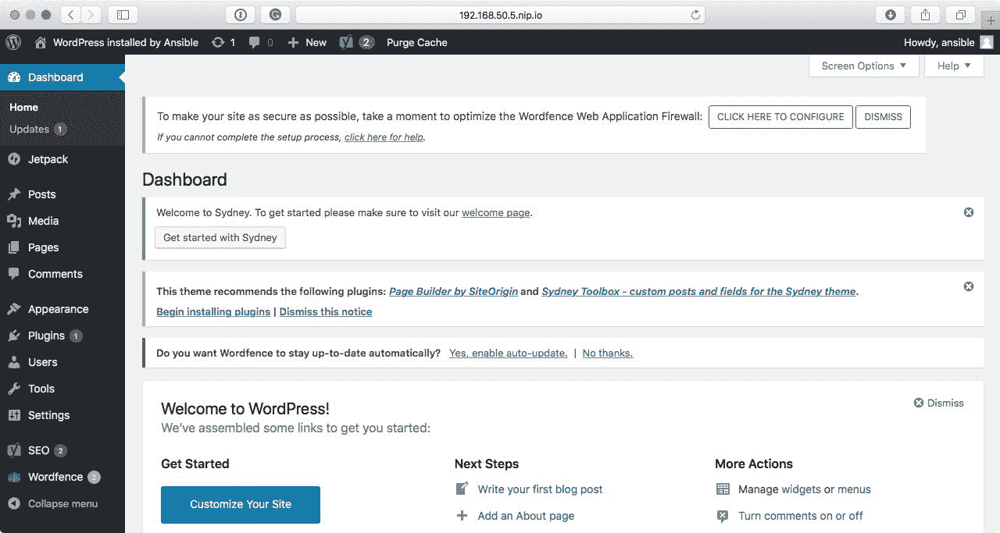

# 五、部署 WordPress

在前一章中，我们致力于构建一个剧本，安装和配置一个基本的 LAMP 栈。在这一章中，我们将建立在我们在那里使用的技术之上，以便创建一个安装 LEMP 栈和 WordPress 的剧本。

我们将涵盖以下主题:

*   准备我们的初始行动手册
*   下载并安装 WordPress 命令行界面
*   安装和配置 WordPress
*   登录到您的 WordPress 安装

在开始之前，我们应该快速介绍一下 WordPress 是什么。很可能在过去 48 小时的某个时候，你访问了一个由 WordPress 提供动力的网站。它是一个开源的**内容管理系统** ( **CMS** )，由 PHP 和 MySQL 提供动力，根据 BuiltWith 提供的 CMS 使用统计，大约有 19，545，516 个网站在使用它。

# 技术要求

同样，将使用我们在前面章节中推出的 CentOS 7 游民箱的新副本。这确实意味着需要重新下载软件包，以及 WordPress。你可以在[https://github . com/packt publishing/Learn-ansi ble/tree/master/chapter 05/LEMP](https://github.com/PacktPublishing/Learn-Ansible/tree/master/Chapter05/lemp)找到完整的剧本。

# 预安装任务

如前一章所述，LEMP 栈由以下元素组成:

*   **Linux** :在我们的情况下，这又将是 CentOS 7
*   **NGINX** :如果你还记得的话，发音为 *engine-x* ，在我们的栈中取代了 Apache
*   **马里亚数据库**:正如我们所看到的，这将是数据库组件
*   **PHP** :我们将为此再次使用 PHP 7.2

在安装 WordPress 之前，我们需要安装和配置这些组件。此外，由于本行动手册最终将针对公共可用的云服务器执行，我们需要考虑一些关于 NGINX 配置的最佳实践。

让我们从设置剧本的初始结构开始:

```
$ mkdir lemp lemp/group_vars
$ touch lemp/group_vars/common.yml lemp/production lemp/site.yml lemp/Vagrantfile lemp/.gitignore
$ cd lemp
```

既然已经有了基本的布局，就需要在`Vagrantfile`和`.gitignore`文件中放一些内容。`Vagrantfile`包含以下内容，类似于前几章:

```
# -*- mode: ruby -*-
# vi: set ft=ruby :

API_VERSION = "2"
BOX_NAME    = "centos/7"
BOX_IP      = "192.168.50.5"
DOMAIN      = "nip.io"
PRIVATE_KEY = "~/.ssh/id_rsa"
PUBLIC_KEY  = '~/.ssh/id_rsa.pub'

Vagrant.configure(API_VERSION) do |config|
  config.vm.box = BOX_NAME
  config.vm.network "private_network", ip: BOX_IP
  config.vm.host_name = BOX_IP + '.' + DOMAIN
  config.ssh.insert_key = false
  config.ssh.private_key_path = [PRIVATE_KEY,
  "~/.vagrant.d/insecure_private_key"]
  config.vm.provision "file", source: PUBLIC_KEY, destination:
  "~/.ssh/authorized_keys"

  config.vm.provider "virtualbox" do |v|
    v.memory = "2024"
    v.cpus = "2"
  end

  config.vm.provider "vmware_fusion" do |v|
    v.vmx["memsize"] = "2024"
    v.vmx["numvcpus"] = "2"
  end

end
```

正如你可能已经发现的，我们正在为这个流浪盒使用一个不同的 IP 地址；`.gitignore`文件应该包含一行:

```
.vagrant
```

现在我们已经配置了基础，我们可以开始编写剧本来部署和配置我们的初始软件栈。

# 栈安装命令

我们将首先使用`ansible-galaxy init`创建一个名为`stack-install` 的角色:

```
$ ansible-galaxy init roles/stack-install
```

这将安装我们的初始软件栈。一旦安装完毕，我们将移交给第二个角色，然后第二个角色将在第三个角色开始 WordPress 安装之前配置软件栈。

那么我们需要什么包裹呢？WordPress 有以下要求:

*   PHP 7.2 或更高版本
*   MariaDB 10.0 或更高版本，或者 MySQL 5.6 或更高版本
*   带`mod_rewrite`模块的 NGINX 或 Apache
*   HTTPS 支持

从上一章我们知道，IUS 存储库可以提供 PHP 7.2 和 MariaDB 10.1，所以我们将使用它们作为这些包的来源，但是 NGINX 呢？EPEL 存储库中有 NGINX 包。然而，我们将使用主要的 NGINX 存储库，这样我们就可以获得最新最棒的版本。

# 启用存储库

让我们从启用我们安装软件栈所需的三个存储库开始我们的剧本，然后，一旦这些存储库被启用，我们应该做一个`yum update`来确保基本操作系统是最新的。

`roles/stack-install/defaults/main.yml`文件需要以下内容来实现这一点。首先，我们有支持 EPEL 和 IUS 的 RPM 软件包的位置:

```
repo_packages:
  - "epel-release"
  - "https://centos7.iuscommunity.org/ius-release.rpm"
```

之后，我们有以下嵌套变量，它包含了我们使用`yum_repository`模块为 NGINX 存储库创建`.repo`文件所需的所有信息:

```
nginx_repo:
  name: "nginx"
  description: "The mainline NGINX repo"
  baseurl: "http://nginx.org/packages/mainline/centos/7/$basearch/"
  gpgcheck: "no"
  enabled: "yes"
```

现在我们已经有了默认值，我们可以将任务添加到`roles/stack-install/tasks/main.yml`文件中；这些如下，第一个任务已经很熟悉了，它所做的就是安装我们的两个包:

```
- name: install the repo packages
  yum:
    name: "{{ item }}"
    state: "installed"
  with_items: "{{ repo_packages }}"
```

下一个任务在`/etc/yum.repos.d/`中创建一个名为`nginx.repo`的存储库文件:

```
- name: add the NGINX mainline repo
  yum_repository:
    name: "{{ nginx_repo.name }}"
    description: "{{ nginx_repo.description }}"
    baseurl: "{{ nginx_repo.baseurl }}"
    gpgcheck: "{{ nginx_repo.gpgcheck }}"
    enabled: "{{ nginx_repo.enabled }}"
```

从下面的终端输出中可以看到，文件的内容指向 NGINX 存储库，我们可以通过运行以下命令获得关于 NGINX 包的更多信息:

```
$ yum info nginx
```

下面的屏幕截图显示了前面命令的输出:


以下任务看起来应该也很熟悉，因为我们在上一章中使用它来更新已安装的软件包:

```
- name: update all of the installed packages
  yum:
    name: "*"
    state: "latest"
    update_cache: "yes"
```

现在我们已经设置了我们的源存储库，并且已经安装的软件包已经更新，我们可以继续安装其余的软件包了。

# 安装软件包

我们将创建四个包列表；这些都在`roles/stack-install/defaults/main.yml`文件中。根据前一章，我们首先需要卸载一个预安装的 MariaDB 包，因此我们的第一个列表包括要删除的包:

```
packages_remove:
  - "mariadb-libs.x86_64"
```

接下来，我们有必要的包来允许 Ansible 与诸如 SELinux 和 MariaDB 之类的服务交互，以及安装 Postfix 包，我们从上次就知道，该包被删除了:

```
system_packages:
  - "postfix"
  - "MySQL-python"
  - "policycoreutils-python"
```

然后，我们拥有构成核心软件栈的所有软件包:

```
stack_packages:
  - "nginx"
  - "mariadb101u"
  - "mariadb101u-server"
  - "mariadb101u-config"
  - "mariadb101u-common"
  - "mariadb101u-libs"
  - "php72u"
  - "php72u-bcmath"
  - "php72u-cli"
  - "php72u-common"
  - "php72u-dba"
  - "php72u-fpm"
  - "php72u-fpm-nginx"
  - "php72u-gd"
  - "php72u-intl"
  - "php72u-json"
  - "php72u-mbstring"
  - "php72u-mysqlnd"
  - "php72u-process"
  - "php72u-snmp"
  - "php72u-soap"
  - "php72u-xml"
  - "php72u-xmlrpc"
```

最后，我们有几个不错的选择:

```
extra_packages:
  - "vim-enhanced"
  - "git"
  - "unzip"
```

移除软件包然后安装它们的任务应该放在`roles/stack-install/tasks/main.yml`文件中，从移除软件包的任务开始:

```
- name: remove the packages so that they can be replaced
  yum:
    name: "{{ item }}"
    state: "absent"
  with_items: "{{ packages_remove }}"
```

然后，我们可以使用以下任务一次性安装所有软件包:

```
- name: install the stack packages
  yum:
    name: "{{ item }}"
    state: "installed"
  with_items: "{{ system_packages + stack_packages + extra_packages }}"
```

请注意，我们是如何将剩余的三个包列表合并到一个变量中的。我们正在这样做，所以我们不必重复`yum`任务。它还允许我们覆盖，比如说，剧本中其他地方的`extra_packages`，而不必重复栈其他部分所需的整个软件包列表。

# 栈配置角色

下一个角色将配置我们刚刚安装的软件栈，因此让我们创建这个角色:

```
$ ansible-galaxy init roles/stack-config
```

既然我们已经有了角色所需的文件，我们就可以开始计划我们需要配置什么了。我们需要做以下工作:

*   为我们的 WordPress 创建一个运行的用户
*   根据 WordPress Codex 上的最佳实践配置 NGINX
*   配置 PHP-FPM 作为 WordPress 用户运行
*   对 SELinux 进行初始配置

让我们从创建 WordPress 用户开始。

# WordPress 系统用户

WordPress 系统用户的默认值应该放在`roles/stack-config/defaults/main.yml`中，如下所示:

```
wordpress_system:
  user: "wordpress"
  group: "php-fpm"
  comment: "wordpress system user"
  home: "/var/www/wordpress"
  state: "present"
```

我们称之为系统用户，因为我们将在本章后面的 WordPress 中创建一个用户。该用户的详细信息也将在 Ansible 中定义，因此我们不想混淆这两个不同的用户。

在`roles/stack-config/tasks/main.yml`中找到的使用这些变量的任务应该如下所示:

```
- name: add the wordpress user
  user: 
    name: "{{ wordpress_system.user }}"
    group: "{{ wordpress_system.group }}"
    comment: "{{ wordpress_system.comment }}"
    home: "{{ wordpress_system.home }}"
    state: "{{ wordpress_system.state }}"
```

如您所见，我们这次没有向用户添加密钥，因为我们不想登录用户帐户来开始操作文件和其他操作。这些都应该在 WordPress 内部或者通过使用 Ansible 来完成。

# nginx 配置

我们将为 NGINX 配置使用几个模板文件。第一个模板叫做`roles/stack-config/templates/nginx-nginx.conf.j2`，它将代替包安装部署的主 NGINX 配置:

```
# {{ ansible_managed }}
user nginx;
worker_processes {{ ansible_processor_count }};
error_log /var/log/nginx/error.log warn;
pid /var/run/nginx.pid;

events {
    worker_connections 1024;
}

http {
    include /etc/nginx/mime.types;
    default_type application/octet-stream;
    log_format main '$remote_addr - $remote_user [$time_local] "$request" '
                      '$status $body_bytes_sent "$http_referer" '
                      '"$http_user_agent" "$http_x_forwarded_for"';
    access_log /var/log/nginx/access.log main;
    sendfile on;
    keepalive_timeout 65;
    client_max_body_size 20m;
    include /etc/nginx/conf.d/*.conf;
}
```

文件本身的内容与初始文件基本相同，只是我们正在更新`worker_processes`，以便它使用`setup`模块运行时 Ansible 检测到的处理器数量，而不是硬编码值。

部署配置文件的任务如您所料，应该放在`roles/stack-config/tasks/main.yml`中:

```
- name: copy the nginx.conf to /etc/nginx/
  template:
    src: "nginx-nginx.conf.j2"
    dest: "/etc/nginx/nginx.conf"
  notify: "restart nginx"
```

如您所见，我们正在通知`restart nginx`处理程序，它存储在以下`roles/stack-config/handlers/main.yml`文件中:

```
- name: "restart nginx"
  service:
    name: "nginx"
    state: "restarted"
    enabled: "yes"
```

接下来，我们有默认的网站模板，`roles/stack-config/templates/nginx-confd-default.conf.j2`:

```
# {{ ansible_managed }}

upstream {{ php.upstream }} {
        server {{ php.ip }}:{{ php.port }};
}

server {
    listen 80;
  server_name {{ ansible_nodename }};
  root {{ wordpress_system.home }};
  index index.php index.html index.htm;

    include global/restrictions.conf;
    include global/wordpress_shared.conf;

}
```

为了帮助识别模板文件在目标主机上的位置，我将它们命名为完整路径在文件名中。在这种情况下，文件名为`nginx-confd-default.conf.j2`，将部署到`/etc/nginx/conf.d/..`。

我们正在部署的下两个模板将进入一个不存在的文件夹。因此，我们首先需要创建目标文件夹。为此，我们需要在`roles/stack-config/tasks/main.yml`中添加以下内容:

```
- name: create the global directory in /etc/nginx/
  file:
    dest: "/etc/nginx/global/"
    state: "directory"
    mode: "0644"
```

然后，以下命令将文件复制到`global`文件夹:

```
- name: copy the restrictions.conf to /etc/nginx/global/
  copy:
    src: "nginx-global-restrictions.conf"
    dest: "/etc/nginx/global/restrictions.conf"
  notify: "restart nginx"

- name: copy the wordpress_shared.conf to /etc/nginx/global/
  template:
    src: "nginx-global-wordpress_shared.conf.j2"
    dest: "/etc/nginx/global/wordpress_shared.conf"
  notify: "restart nginx"
```

由于我们没有在`nginx-global-restrictions.conf`文件中进行任何替换，我们在这里使用的是`copy`模块而不是`template`；文件存储在`roles/stack-config/files/`中，内容如下:

```
   # Do not log robots.txt
        location = /robots.txt {
            log_not_found off;
            access_log off;
        }

    # If no favicon exists return a 204 (no content error)
        location ~* /favicon\.ico$ {
            try_files $uri =204;
            expires max;
            log_not_found off;
            access_log off;
        }

  # Deny access to htaccess files
        location ~ /\. {
            deny all;
        }

  # Deny access to some bits wordpress leaves hanging around 
        location ~* /(wp-config.php|readme.html|license.txt|nginx.conf) {
            deny all;
        }

    # Deny access to .php files in the /wp-content/ directory (including sub-folders)
        location ~* ^/wp-content/.*.(php|phps)$ {
            deny all;
        }

    # Allow only internal access to .php files inside wp-includes directory
        location ~* ^/wp-includes/.*\.(php|phps)$ {
            internal;
        }

    # Deny access to specific files in the /wp-content/ directory (including sub-folders)
        location ~* ^/wp-content/.*.(txt|md|exe)$ {
            deny all;
        }

    # hide content of sensitive files
        location ~* \\.(conf|engine|inc|info|install|make|module|profile|test|po|sh|.*sql|theme|tpl(\\.php)?|xtmpl)\$|^(\\..*|Entries.*|Repository|Root|Tag|Template)\$|\\.php_ {
            deny all;
        }

    # don't allow other executable file types
        location ~* \\.(pl|cgi|py|sh|lua)\$ {
            deny all;
        }

    # hide the wordfence firewall
        location ~ ^/\.user\.ini {
            deny all;
        }
```

当我们将`php.upstream`设置为变量时，我们使用`template`模块来确保我们的配置包含正确的值，文件`roles/stack-config/templates/nginx-global-wordpress_shared.conf.j2`包含以下内容:

```
    # http://wiki.nginx.org/WordPress
    # This is cool because no php is touched for static content. 
    # Include the "?$args" part so non-default permalinks doesn't break when using query string
        location / {
            try_files $uri $uri/ /index.php?$args;
        }

        # Set the X-Frame-Options
        add_header X-Frame-Options "SAMEORIGIN" always;
        add_header X-Xss-Protection "1; mode=block" always;
        add_header X-Content-Type-Options "nosniff" always;

    # Do not log + cache images, css, js, etc
        location ~* \.(ico|css|js|gif|jpeg|jpg|png|woff|ttf|otf|svg|woff2|eot)$ {
            expires max;
            log_not_found off;
            access_log off;
         # Send the all shebang in one fell swoop
            tcp_nodelay off;
        # Set the OS file cache
            open_file_cache max=1000 inactive=120s;
            open_file_cache_valid 45s;
            open_file_cache_min_uses 2;
            open_file_cache_errors off;
        }

    # Handle .php files
        location ~ \.php$ {
            try_files $uri =404;
            fastcgi_split_path_info ^(.+\.php)(/.+)$;
            include /etc/nginx/fastcgi_params;
            fastcgi_connect_timeout 180s;
            fastcgi_send_timeout 180s;
            fastcgi_read_timeout 180s;
            fastcgi_intercept_errors on;
            fastcgi_max_temp_file_size 0;
            fastcgi_pass {{ php.upstream }};
            fastcgi_param SCRIPT_FILENAME $document_root$fastcgi_script_name;
            fastcgi_index index.php;
        }

    # Rewrite rules for WordPress SEO by Yoast
        rewrite ^/sitemap_index\.xml$ /index.php?sitemap=1 last;
        rewrite ^/([^/]+?)-sitemap([0-9]+)?\.xml$ /index.php?sitemap=$1&sitemap_n=$2 last;

    # Add trailing slash to */wp-admin requests
        rewrite /wp-admin$ $scheme://$host$uri/ permanent;
```

NGINX 配置的最后一部分是复制 WordPress 站点的主要配置。`roles/stack-config/tasks/main.yml`中的任务如下:

```
- name: copy the default.conf to /etc/nginx/conf.d/
  template:
    src: "nginx-confd-default.conf.j2"
    dest: "/etc/nginx/conf.d/default.conf"
  notify: "restart nginx"
```

由于我们设置了一些变量，如路径和域名，我们有以下模板文件:

```
# {{ ansible_managed }}

upstream php {
        server {{ php.ip }}:{{ php.port }};
}

server {
    listen 80;
  server_name {{ ansible_nodename }};
  root {{ wordpress_system.home }};
  index index.php;
  include global/restrictions.conf;
  include global/wordpress_shared.conf;
}
```

如您所见，我们使用了一些尚未定义的变量，`php.ip`和`php.port`。接下来，我们将看看如何配置 PHP-FPM。

# PHP 和 PHP-FPM 配置

正如我们在上一节看到的，在`roles/stack-config/defaults/main.yml`中为 PHP 定义了几个变量，它们是:

```
php:
  ip: "127.0.0.1"
  port: "9000"
  upstream: "php"
  ini:
    - { regexp: '^;date.timezone =', replace: 'date.timezone = Europe/London' }
    - { regexp: '^expose_php = On', replace: 'expose_php = Off' }
    - { regexp: '^upload_max_filesize = 2M', replace: 'upload_max_filesize = 20M' }
```

第一个配置任务是部署 PHP-FPM 配置；模板是这样的:

```
; {{ ansible_managed }}

[{{ wordpress_system.user }}]
user = {{ wordpress_system.user }}
group = {{ wordpress_system.group }}
listen = {{ php.ip }}:{{ php.port }}
listen.allowed_clients = {{ php.ip }}
pm = dynamic
pm.max_children = 50
pm.start_servers = 5
pm.min_spare_servers = 5
pm.max_spare_servers = 35
php_admin_value[error_log] = /var/log/php-fpm/{{ wordpress_system.user }}-error.log
php_admin_flag[log_errors] = on
php_value[session.save_handler] = files
php_value[session.save_path] = /var/lib/php/fpm/session
php_value[soap.wsdl_cache_dir] = /var/lib/php/fpm/wsdlcache
```

如您所见，我们在这个文件中有一些替换。从方括号之间的顶部开始，我们定义 PHP-FPM 池名称；我们正在为此使用`wordpress_system.user`的内容。接下来，我们有了希望池运行的用户和组；这里，我们使用`wordpress_system.user`和`wordpress_system.group`。最后，我们通过使用`php.ip`和`php.port`变量来设置我们希望 PHP-FPM 池监听的 IP 地址和端口。

`roles/stack-config/tasks/main.yml`中部署模板的任务如下:

```
- name: copy the www.conf to /etc/php-fpm.d/
  template:
    src: "php-fpmd-www.conf.j2"
    dest: "/etc/php-fpm.d/www.conf"
  notify: "restart php-fpm"
```

**`roles/stack-config/handlers/main.yml`** 中重启 PHP-FPM 的处理程序只是:

```
- name: "restart php-fpm"
  service:
    name: "php-fpm"
    state: "restarted"
    enabled: "yes"
```

`roles/stack-config/tasks/main.yml`中的下一个任务使用`lineinfile`模块:

```
- name: configure php.ini
  lineinfile: 
    dest: "/etc/php.ini"
    regexp: "{{ item.regexp }}"
    line: "{{ item.replace }}"
    backup: "yes"
    backrefs: "yes"
  with_items: "{{ php.ini }}"
  notify: "restart php-fpm"
```

我们在这里所做的是获取`php.ini`的内容，并通过寻找`regexp`键定义的值来遍历它。一旦我们找到了价值，我们就用`replace`键的内容来代替它。如果文件有变化，我们先做一个`backup`，以防万一。另外，我们使用`backrefs`来确保如果文件中没有匹配的正则表达式，那么它将保持不变；如果我们不使用它们，每次运行剧本时都会调用`restart php-fpm`处理程序，如果没有理由，我们不希望 PHP-FPM 重启。

# 开始 NGINX 和 PHP-FPM

现在我们已经安装并配置了栈，我们需要启动这两项服务，而不是等到行动手册运行结束。如果我们现在不这样做，我们即将安装 WordPress 的角色将会失败。`roles/stack-config/tasks/main.yml`中的两个任务是:

```
- name: start php-fpm
  service:
    name: "php-fpm"
    state: "started"

- name: start nginx
  service:
    name: "nginx"
    state: "started"
```

# 马里亚数据库配置

马里亚数据库的配置将与上一章的配置非常相似，只不过少了一些步骤，所以我不打算讲太多细节。

`roles/stack-config/defaults/main.yml`中这部分角色的默认变量是:

```
mariadb:
  bind: "127.0.0.1"
  server_config: "/etc/my.cnf.d/mariadb-server.cnf"
  username: "root"
  password: "Pa55W0rd123"
  hosts:
    - "127.0.0.1"
    - "::1"
    - "{{ ansible_nodename }}"
    - "localhost"
```

如您所见，我们现在使用一个嵌套变量，并且我们已经删除了主机通配符`%`上的根访问，因为`roles/stack-config/tasks/main.yml`中任务的第一部分将 MariaDB 绑定到本地主机:

```
- name: configure the mariadb bind address
  lineinfile: 
    dest: "{{ mariadb.server_config }}"
    regexp: "#bind-address=0.0.0.0"
    line: "bind-address={{ mariadb.bind }}"
    backup: "yes"
    backrefs: "yes"
```

从那里，我们接着启动 MariaDB，设置根密码，配置`~/.my.cnf`文件，然后删除匿名用户和测试数据库:

```
- name: start mariadb
  service:
    name: "mariadb"
    state: "started"
    enabled: "yes"

- name: change mysql root password
  mysql_user:
    name: "{{ mariadb.username }}" 
    host: "{{ item }}" 
    password: "{{ mariadb.password }}"
    check_implicit_admin: "yes"
    priv: "*.*:ALL,GRANT"
  with_items: "{{ mariadb.hosts }}"

- name: set up .my.cnf file
  template:
    src: "my.cnf.j2"
    dest: "~/.my.cnf"

- name: delete anonymous MySQL user
  mysql_user:
    user: ""
    host: "{{ item }}"
    state: "absent"
  with_items: "{{ mariadb.hosts }}"

- name: remove the MySQL test database
  mysql_db:
    db: "test" 
    state: "absent"
```

用于`.my.cnf`文件的模板可以在`roles/stack-config/templates/my.cnf.j2`中找到，现在看起来如下:

```
# {{ ansible_managed }}
[client]
password='{{ mariadb.password }}'
```

这意味着我们不需要在复制`.my.cnf`文件的每个数据库相关任务中传递根用户名和密码。

# SELinux 配置

该角色的最终任务是将 SELinux 中的 HTTP 设置为许可的；为此，我们在`roles/stack-config/defaults/main.yml`中有以下变量:

```
selinux:
  http_permissive: true
```

`roles/stack-config/tasks/main.yml`中的任务有一个条件，当`selinux.http_permissive`等于`true`时运行:

```
- name: set the selinux allowing httpd_t to be permissive is required
  selinux_permissive:
    name: httpd_t
    permissive: true
  when: selinux.http_permissive == true
```

我们将在后面的章节中更多地关注 SELinux 目前，我们只是允许所有 HTTP 请求。

# WordPress 安装任务

现在我们已经完成了准备我们的目标游民盒子的角色，我们可以继续实际的 WordPress 安装；这将被分成几个不同的部分，从下载`wp_cli`和建立数据库开始。

在我们前进之前，我们应该创建角色:

```
$ ansible-galaxy init roles/wordpress
```

# 命令行界面安装

**WordPress CLI**(**WP-CLI**)是一个命令行工具，用于管理您的 WordPress 安装；我们将在整个角色中使用它，所以我们的角色应该做的第一件事是下载它。为此，我们需要在`roles/wordpress/defaults/main.yml`中下载以下变量:

```
wp_cli:
  download: "https://raw.githubusercontent.com/wp-cli/builds/gh-pages/phar/wp-cli.phar"
  path: "/usr/local/bin/wp"
```

正如您可能已经从这两个变量中收集到的，我们将从`wp_cli.download`下载文件并将其复制到`wp_cli.path`。`roles/wordpress/tasks/main.yml`中的任务如下:

```
- name: download wp-cli
  get_url:
    url: "{{ wp_cli.download }}"
    dest: "{{ wp_cli.path }}"

- name: update permissions of wp-cli to allow anyone to execute it
  file:
    path: "{{ wp_cli.path }}"
    mode: "0755"
```

如您所见，我们正在下载`.phar`文件，移动它，然后设置权限，以便登录到服务器的任何人都可以执行它——这很重要，因为我们将作为`wordpress`用户运行许多安装命令。

# 创建 WordPress 数据库

角色的下一部分创建我们的 WordPress 安装将使用的数据库；与本章中的其他任务一样，它使用嵌套变量，可在`roles/wordpress/defaults/main.yml`中找到:

```
wp_database:
  name: "wordpress"
  username: "wordpress"
  password: "W04DPr3S5"
```

`roles/wordpress/tasks/main.yml`中创建数据库和用户的任务如下:

```
- name: create the wordpress database
  mysql_db:
    db: "{{ wp_database.name }}" 
    state: "present"

- name: create the user for the wordpress database
  mysql_user:
    name: "{{ wp_database.username }}"
    password: "{{ wp_database.password }}"
    priv: "{{ wp_database.name }}.*:ALL"
    state: "present"
  with_items: "{{ mariadb.hosts }}"
```

注意我们是如何使用前一个角色中的`mariadb.hosts`变量的。现在我们已经创建了数据库，我们可以开始下载和安装 WordPress 了。

# 下载、配置和安装 WordPress

现在我们已经准备好安装 WordPress 了，我们可以开始了，首先在`roles/wordpress/defaults/main.yml`中设置一些默认变量:

```
wordpress:
  domain: "http://{{ ansible_nodename }}/"
  title: "WordPress installed by Ansible"
  username: "ansible"
  password: "password"
  email: "test@example.com"
  theme: "sydney"
  plugins:
    - "jetpack"
    - "wp-super-cache"
    - "wordpress-seo"
    - "wordfence"
    - "nginx-helper"
```

现在我们有了变量，如果需要，我们可以开始下载:

```
- name: are the wordpress files already there?
  stat:
    path: "{{ wordpress_system.home }}/index.php"
  register: wp_installed

- name: download wordpresss
  shell: "{{ wp_cli.path }} core download"
  args:
    chdir: "{{ wordpress_system.home }}"
  become_user: "{{ wordpress_system.user }}"
  become: true
  when: wp_installed.stat.exists == False
```

如您所见，第一个任务使用`stat`模块来检查我们系统用户的主目录(也是 webroot)中是否存在`index.php`。第二个任务使用`shell`模块发出`wp core download`命令。

在进行下一项任务之前，我们应该先解决一些争论。这些是:

*   `args`和`chdir`:您可以使用`args`向`shell`模块传递附加参数。这里，我们正在传递`chdir`，它指示 Ansible 在运行我们提供的`shell`命令之前，更改到我们指定的目录。
*   `become_user`:我们要作为其运行命令的用户。如果我们不使用它，该命令将作为根用户运行。
*   `become`:这指示 Ansible 以定义的用户身份执行任务。

行动手册中的下一个任务是设置用户主目录的正确权限:

```
- name: set the correct permissions on the homedir
  file:
    path: "{{ wordpress_system.home }}"
    mode: "0755"
  when: wp_installed.stat.exists == False
```

现在 WordPress 已经下载，我们可以开始安装了。首先，我们需要检查这是否已经完成:

```
- name: is wordpress already configured?
  stat:
    path: "{{ wordpress_system.home }}/wp-config.php"
  register: wp_configured
```

如果没有`wp-config.php`文件，则执行以下任务:

```
- name: configure wordpress
  shell: "{{ wp_cli.path }} core config --dbhost={{ mariadb.bind }} --dbname={{ wp_database.name }} --dbuser={{ wp_database.username }} --dbpass={{ wp_database.password }}"
  args:
    chdir: "{{ wordpress_system.home }}"
  become_user: "{{ wordpress_system.user }}"
  become: true
  when: wp_configured.stat.exists == False
```

现在我们已经创建了我们的`wp-config.php`文件，有了数据库凭证，我们可以安装 WordPress 了。首先，我们需要检查是否已经安装了 WordPress:

```
- name: do we need to install wordpress?
  shell: "{{ wp_cli.path }} core is-installed"
  args:
    chdir: "{{ wordpress_system.home }}"
  become_user: "{{ wordpress_system.user }}"
  become: true
  ignore_errors: yes
  register: wp_installed
```

从`ignore_errors`选项的出现可以看出，如果没有安装 WordPress，这个命令会给我们一个错误。注册结果时，我们会利用这一点，您可以从以下任务中看到:

```
- name: install wordpress if needed
  shell: "{{ wp_cli.path }} core install --url='{{ wordpress.domain }}' --title='{{ wordpress.title }}' --admin_user={{ wordpress.username }} --admin_password={{ wordpress.password }} --admin_email={{ wordpress.email }}"
  args:
    chdir: "{{ wordpress_system.home }}"
  become_user: "{{ wordpress_system.user }}"
  become: true
  when: wp_installed.rc == 1
```

现在我们已经安装了一个基本的 WordPress 站点，我们可以继续安装插件和主题文件。

# WordPress 插件和主题安装

WordPress 安装的最后一部分是下载并安装我们在`wordpress.plugins`和`wordpress.theme`变量中定义的插件和主题文件。

让我们从安装插件的任务开始，这样我们就不会重新运行安装插件的任务。当我们需要的时候，我们会在任务中建立一点逻辑。首先，我们运行一个任务来查看是否已经安装了所有插件:

```
- name: do we need to install the plugins?
  shell: "{{ wp_cli.path }} plugin is-installed {{ item }}"
  args:
    chdir: "{{ wordpress_system.home }}"
  become_user: "{{ wordpress_system.user }}"
  become: true
  with_items: "{{ wordpress.plugins }}"
  ignore_errors: yes
  register: wp_plugin_installed
```

如果没有安装插件，那么这个任务应该会失败，这就是为什么我们有`ignore_errors`在里面。如您所见，我们正在注册整个任务的结果，因为如果您记得我们正在安装几个插件，如`wp_plugin_installed`。接下来的两个任务采用`wp_plugin_installed`的结果，并使用`setfact`模块设置一个事实:

```
- name: set a fact if we don't need to install the plugins
  set_fact:
    wp_plugin_installed_skip: true
  when: wp_plugin_installed.failed is undefined

- name: set a fact if we need to install the plugins
  set_fact:
    wp_plugin_installed_skip: false
  when: wp_plugin_installed.failed is defined
```

如您所见，我们正在将`wp_theme_installed_skip`设置为`true`或`false`:如果事实设置为`false`，那么下一个任务将循环安装插件:

```
- name: install the plugins if we need to or ignore if not
  shell: "{{ wp_cli.path }} plugin install {{ item }} --activate"
  args:
    chdir: "{{ wordpress_system.home }}"
  become_user: "{{ wordpress_system.user }}"
  become: true
  with_items: "{{ wordpress.plugins }}"
  when: wp_plugin_installed_skip == false
```

如果我们在列表中添加另一个插件，但将其他插件留在原处，它将显示一个错误，导致插件被安装。我们将使用相同的逻辑来确定是否需要安装我们定义为`wordpress.theme`的主题文件:

```
- name: do we need to install the theme?
  shell: "{{ wp_cli.path }} theme is-installed {{ wordpress.theme }}"
  args:
    chdir: "{{ wordpress_system.home }}"
  become_user: "{{ wordpress_system.user }}"
  become: true
  ignore_errors: yes
  register: wp_theme_installed

- name: set a fact if we don't need to install the theme
  set_fact:
    wp_theme_installed_skip: true
  when: wp_theme_installed.failed == false

- name: set a fact if we need to install the theme
  set_fact:
    wp_theme_installed_skip: false
  when: wp_theme_installed.failed == true

- name: install the theme if we need to or ignore if not
  shell: "{{ wp_cli.path }} theme install {{ wordpress.theme }} --activate"
  args:
    chdir: "{{ wordpress_system.home }}"
  become_user: "{{ wordpress_system.user }}"
  become: true
  when: wp_theme_installed_skip == false
```

现在我们已经安装了插件和主题，我们可以开始运行我们的剧本了。

# 运行 WordPress 剧本

要运行剧本并安装 WordPress，我们需要一些东西，从名为`production`的清单文件开始:

```
box1 ansible_host=192.168.50.5.nip.io

[wordpress]
box1

[wordpress:vars]
ansible_connection=ssh
ansible_user=vagrant
ansible_private_key_file=~/.ssh/id_rsa
host_key_checking=False
```

如您所见，它考虑了我们在本章开头定义的游民箱的更新后的 IP 地址。还有，我们需要剧本本身；`site.yml`应如下图所示:

```
---

- hosts: wordpress
  gather_facts: true
  become: yes
  become_method: sudo

  vars_files:
    - group_vars/common.yml

  roles:
    - roles/stack-install
    - roles/stack-config
    - roles/wordpress
```

现在，通过运行以下两个命令之一来启动游民箱:

```
$ vagrant up
$ vagrant up --provider=vmware_fusion
```

一旦您的游民箱启动并运行，我们可以使用以下命令启动行动手册运行:

```
$ ansible-playbook -i production site.yml
```

首次执行行动手册时，您应该会看到如下结果:

```
PLAY [wordpress] ***********************************************************************************

TASK [Gathering Facts] *****************************************************************************
ok: [box1]

TASK [roles/stack-install : install the repo packages] *********************************************
changed: [box1] => (item=[u'epel-release', u'https://centos7.iuscommunity.org/ius-release.rpm'])

TASK [roles/stack-install : add the NGINX mainline repo] *******************************************
changed: [box1]

TASK [roles/stack-install : update all of the installed packages] **********************************
changed: [box1]

TASK [roles/stack-install : remove the packages so that they can be replaced] **********************
changed: [box1] => (item=[u'mariadb-libs.x86_64'])

TASK [roles/stack-install : install the stack packages] ********************************************
changed: [box1] => (item=[u'postfix', u'MySQL-python', u'policycoreutils-python', u'nginx', u'mariadb101u', u'mariadb101u-server', u'mariadb101u-config', u'mariadb101u-common', u'mariadb101u-libs', u'php72u', u'php72u-bcmath', u'php72u-cli', u'php72u-common', u'php72u-dba', u'php72u-fpm', u'php72u-fpm-nginx', u'php72u-gd', u'php72u-intl', u'php72u-json', u'php72u-mbstring', u'php72u-mysqlnd', u'php72u-process', u'php72u-snmp', u'php72u-soap', u'php72u-xml', u'php72u-xmlrpc', u'vim-enhanced', u'git', u'unzip'])

TASK [roles/stack-config : add the wordpress user] *************************************************
changed: [box1]

TASK [roles/stack-config : copy the nginx.conf to /etc/nginx/] *************************************
changed: [box1]

TASK [roles/stack-config : create the global directory in /etc/nginx/] *****************************
changed: [box1]

TASK [roles/stack-config : copy the restrictions.conf to /etc/nginx/global/] ***********************
changed: [box1]

TASK [roles/stack-config : copy the wordpress_shared.conf to /etc/nginx/global/] *******************
changed: [box1]

TASK [roles/stack-config : copy the default.conf to /etc/nginx/conf.d/] ****************************
changed: [box1]

TASK [roles/stack-config : copy the www.conf to /etc/php-fpm.d/] ***********************************
changed: [box1]

TASK [roles/stack-config : configure php.ini] ******************************************************
changed: [box1] => (item={u'regexp': u'^;date.timezone =', u'replace': u'date.timezone = Europe/London'})
changed: [box1] => (item={u'regexp': u'^expose_php = On', u'replace': u'expose_php = Off'})
changed: [box1] => (item={u'regexp': u'^upload_max_filesize = 2M', u'replace': u'upload_max_filesize = 20M'})

TASK [roles/stack-config : start php-fpm] **********************************************************
changed: [box1]

TASK [roles/stack-config : start nginx] ************************************************************
changed: [box1]

TASK [roles/stack-config : configure the mariadb bind address] *************************************
changed: [box1]

TASK [roles/stack-config : start mariadb] **********************************************************
changed: [box1]

TASK [roles/stack-config : change mysql root password] *********************************************
changed: [box1] => (item=127.0.0.1)
changed: [box1] => (item=::1)
changed: [box1] => (item=192.168.50.5.nip.io)
changed: [box1] => (item=localhost)

TASK [roles/stack-config : set up .my.cnf file] ****************************************************
changed: [box1]

TASK [roles/stack-config : delete anonymous MySQL user] ********************************************
ok: [box1] => (item=127.0.0.1)
ok: [box1] => (item=::1)
changed: [box1] => (item=192.168.50.5.nip.io)
changed: [box1] => (item=localhost)

TASK [roles/stack-config : remove the MySQL test database] *****************************************
changed: [box1]

TASK [roles/stack-config : set the selinux allowing httpd_t to be permissive is required] **********
changed: [box1]

TASK [roles/wordpress : download wp-cli] ***********************************************************
changed: [box1]

TASK [roles/wordpress : update permissions of wp-cli to allow anyone to execute it] ****************
changed: [box1]

TASK [roles/wordpress : create the wordpress database] *********************************************
changed: [box1]

TASK [roles/wordpress : create the user for the wordpress database] ********************************
changed: [box1] => (item=127.0.0.1)
ok: [box1] => (item=::1)
ok: [box1] => (item=192.168.50.5.nip.io)
ok: [box1] => (item=localhost)

TASK [roles/wordpress : are the wordpress files already there?] ************************************
ok: [box1]

TASK [roles/wordpress : download wordpresss] *******************************************************
changed: [box1]

TASK [roles/wordpress : set the correct permissions on the homedir] ********************************
changed: [box1]

TASK [roles/wordpress : is wordpress already configured?] ******************************************
ok: [box1]

TASK [roles/wordpress : configure wordpress] *******************************************************
changed: [box1]

TASK [roles/wordpress : do we need to install wordpress?] ******************************************
fatal: [box1]: FAILED! => {"changed": true, "cmd": "/usr/local/bin/wp core is-installed", "delta": "0:00:00.364987", "end": "2018-03-04 20:22:16.659411", "msg": "non-zero return code", "rc": 1, "start": "2018-03-04 20:22:16.294424", "stderr": "", "stderr_lines": [], "stdout": "", "stdout_lines": []}
...ignoring

TASK [roles/wordpress : install wordpress if needed] ***********************************************
changed: [box1]

TASK [roles/wordpress : do we need to install the plugins?] ****************************************
failed: [box1] (item=jetpack) => {"changed": true, "cmd": "/usr/local/bin/wp plugin is-installed jetpack", "delta": "0:00:01.366121", "end": "2018-03-04 20:22:20.175418", "item": "jetpack", "msg": "non-zero return code", "rc": 1, "start": "2018-03-04 20:22:18.809297", "stderr": "", "stderr_lines": [], "stdout": "", "stdout_lines": []}
failed: [box1] (item=wp-super-cache) => {"changed": true, "cmd": "/usr/local/bin/wp plugin is-installed wp-super-cache", "delta": "0:00:00.380384", "end": "2018-03-04 20:22:21.035274", "item": "wp-super-cache", "msg": "non-zero return code", "rc": 1, "start": "2018-03-04 20:22:20.654890", "stderr": "", "stderr_lines": [], "stdout": "", "stdout_lines": []}
failed: [box1] (item=wordpress-seo) => {"changed": true, "cmd": "/usr/local/bin/wp plugin is-installed wordpress-seo", "delta": "0:00:00.354021", "end": "2018-03-04 20:22:21.852955", "item": "wordpress-seo", "msg": "non-zero return code", "rc": 1, "start": "2018-03-04 20:22:21.498934", "stderr": "", "stderr_lines": [], "stdout": "", "stdout_lines": []}
failed: [box1] (item=wordfence) => {"changed": true, "cmd": "/usr/local/bin/wp plugin is-installed wordfence", "delta": "0:00:00.357012", "end": "2018-03-04 20:22:22.673549", "item": "wordfence", "msg": "non-zero return code", "rc": 1, "start": "2018-03-04 20:22:22.316537", "stderr": "", "stderr_lines": [], "stdout": "", "stdout_lines": []}
failed: [box1] (item=nginx-helper) => {"changed": true, "cmd": "/usr/local/bin/wp plugin is-installed nginx-helper", "delta": "0:00:00.346194", "end": "2018-03-04 20:22:23.389176", "item": "nginx-helper", "msg": "non-zero return code", "rc": 1, "start": "2018-03-04 20:22:23.042982", "stderr": "", "stderr_lines": [], "stdout": "", "stdout_lines": []}
...ignoring

TASK [roles/wordpress : set a fact if we don't need to install the plugins] ************************
skipping: [box1]

TASK [roles/wordpress : set a fact if we need to install the plugins] ******************************
ok: [box1]

TASK [roles/wordpress : install the plugins if we need to or ignore if not] ************************
changed: [box1] => (item=jetpack)
changed: [box1] => (item=wp-super-cache)
changed: [box1] => (item=wordpress-seo)
changed: [box1] => (item=wordfence)
changed: [box1] => (item=nginx-helper)

TASK [roles/wordpress : do we need to install the theme?] ******************************************
fatal: [box1]: FAILED! => {"changed": true, "cmd": "/usr/local/bin/wp theme is-installed sydney", "delta": "0:00:01.451018", "end": "2018-03-04 20:23:02.227557", "msg": "non-zero return code", "rc": 1, "start": "2018-03-04 20:23:00.776539", "stderr": "", "stderr_lines": [], "stdout": "", "stdout_lines": []}
...ignoring

TASK [roles/wordpress : set a fact if we don't need to install the theme] **************************
skipping: [box1]

TASK [roles/wordpress : set a fact if we need to install the theme] ********************************
ok: [box1]

TASK [roles/wordpress : install the theme if we need to or ignore if not] **************************
changed: [box1]

RUNNING HANDLER [roles/stack-config : restart nginx] ***********************************************
changed: [box1]

RUNNING HANDLER [roles/stack-config : restart php-fpm] *********************************************
changed: [box1]

PLAY RECAP *****************************************************************************************
box1 : ok=42 changed=37 unreachable=0 failed=0
```

正如您在剧本中看到的，我们在检查是否需要安装 WordPress 时，以及在插件和主题检查时，都有致命的错误，因为我们在剧本按预期运行并安装了软件栈、WordPress、插件和主题的任务中说明了这些错误。

重新运行行动手册会为我们之前出错的部分提供以下结果:

```
TASK [roles/wordpress : do we need to install wordpress?] ******************************************
changed: [box1]

TASK [roles/wordpress : install wordpress if needed] ***********************************************
skipping: [box1]

TASK [roles/wordpress : do we need to install the plugins?] ****************************************
changed: [box1] => (item=jetpack)
changed: [box1] => (item=wp-super-cache)
changed: [box1] => (item=wordpress-seo)
changed: [box1] => (item=wordfence)
changed: [box1] => (item=nginx-helper)

TASK [roles/wordpress : set a fact if we don't need to install the plugins] ************************
ok: [box1]

TASK [roles/wordpress : set a fact if we need to install the plugins] ******************************
skipping: [box1]

TASK [roles/wordpress : install the plugins if we need to or ignore if not] ************************
skipping: [box1] => (item=jetpack)
skipping: [box1] => (item=wp-super-cache)
skipping: [box1] => (item=wordpress-seo)
skipping: [box1] => (item=wordfence)
skipping: [box1] => (item=nginx-helper)

TASK [roles/wordpress : do we need to install the theme?] ******************************************
changed: [box1]

TASK [roles/wordpress : set a fact if we don't need to install the theme] **************************
ok: [box1]

TASK [roles/wordpress : set a fact if we need to install the theme] ********************************
skipping: [box1]

TASK [roles/wordpress : install the theme if we need to or ignore if not] **************************
skipping: [box1]

PLAY RECAP *****************************************************************************************
box1 : ok=34 changed=3 unreachable=0 failed=0
```

现在安装了 WordPress，我们应该可以通过`http://192.168.50.5.nip.io/`在浏览器中访问。正如您在这里看到的，我们定义的主题是运行，而不是 WordPress 默认主题:


此外，如果您转到`http://192.168.50.5.nip.io/wp-admin/`，您应该能够使用我们定义的用户名和密码登录 WordPress:

*   用户名:`ansible`
*   密码:`password`

登录后，您应该会看到一些关于我们在剧本运行期间安装的插件需要配置的消息:



随意玩一玩 WordPress 安装；此外，您可以通过运行以下命令来删除“游民”框:

```
$ vagrant destroy
```

然后调出一个新副本，并使用本节开头的命令重新部署它。

# 摘要

在本章中，我们重复使用了许多与前一章相同的原则，并继续部署完整的应用。这样做的好处是这个过程是可重复的，并且只有一个命令。

到目前为止，我们的目标是一个 CentOS 7 流浪盒。如果我们对一个 Ubuntu 游民盒子运行我们的剧本，剧本会给出一个错误。在下一章中，我们将了解如何使用相同的剧本瞄准多个操作系统。

# 问题

1.  在`setup`模块执行期间收集的哪个事实可以用来告诉我们的行动手册我们的目标主机有多少个处理器？
2.  真或假:使用`lineinfile`模块中的`backref`确保如果正则表达式不匹配，则不会应用任何更改。
3.  解释为什么我们想要在剧本中构建逻辑来检查是否已经安装了 WordPress。
4.  我们使用哪个模块来定义变量作为剧本运行的一部分？
5.  我们将哪个参数传递给`shell`模块，以使我们想要运行的命令在我们选择的目录中执行？
6.  对或错:将 MariaDB 设置为绑定到`127.0.0.1`将允许我们从外部访问它。
7.  将您的 WordPress 网站的主题更改为您选择的主题；一些选项见[https://wordpress.org/themes/](https://wordpress.org/themes/)。

# 进一步阅读

您可以在以下链接中找到有关我们在本章中介绍的技术的更多信息:

*   **engine**:[http://engine . org/](http://nginx.org/)
*   **WordPress**:[https://wordpress.org/](https://wordpress.org/)
*   **WP-CLI**:[http://WP-CLI . org](http://wp-cli.org)
*   **大厦 CMS 统计**:[https://trends.builtwith.com/cms](https://trends.builtwith.com/cms)
*   **WordPress engine code**:[https://codex . WordPress . org/engine](https://codex.wordpress.org/Nginx)
*   **悉尼 WordPress 主题**:[https://en-gb.wordpress.org/themes/sydney/](https://en-gb.wordpress.org/themes/sydney/)

我们安装的插件的项目页面可以在以下位置找到:

*   **jetpack**:[https://en-GB . WordPress . org/plugins/jetpack/](https://en-gb.wordpress.org/plugins/jetpack/)
*   **WP super cache**:[https://en-GB . WordPress . org/plugins/WP super cache/](https://en-gb.wordpress.org/plugins/wp-super-cache/)
*   **yoast SEO**:[https://en-GB . WordPress . org/plugins/WordPress-SEO/](https://en-gb.wordpress.org/plugins/wordpress-seo/)
*   **文字围栏**:[https://en-gb.wordpress.org/plugins/wordfence/](https://en-gb.wordpress.org/plugins/wordfence/)
*   **engine helper**:[https://WordPress . org/plugins/engine helper/](https://wordpress.org/plugins/nginx-helper/)