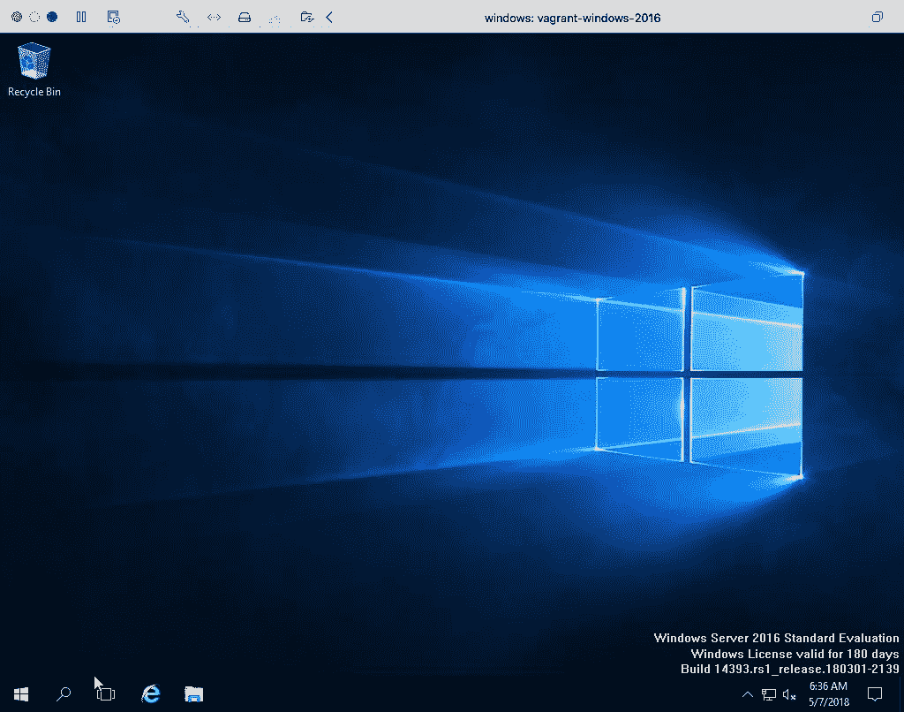
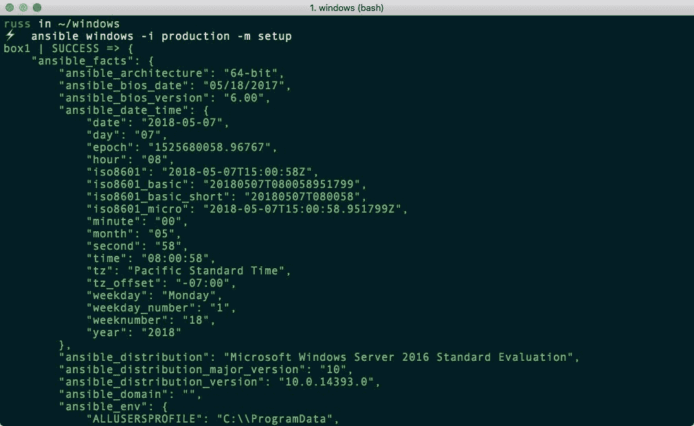
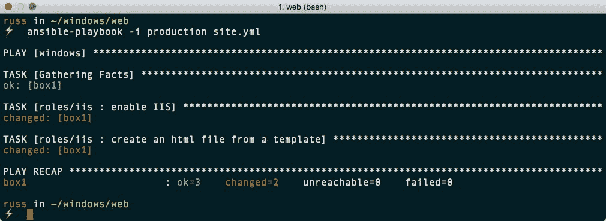
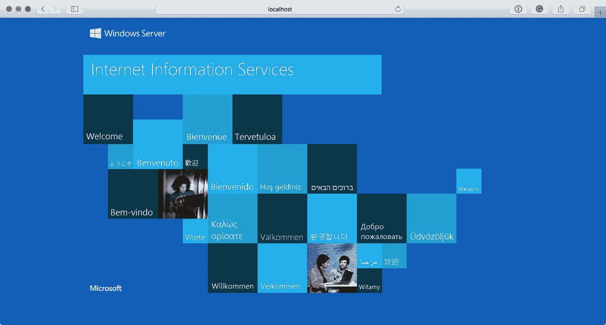
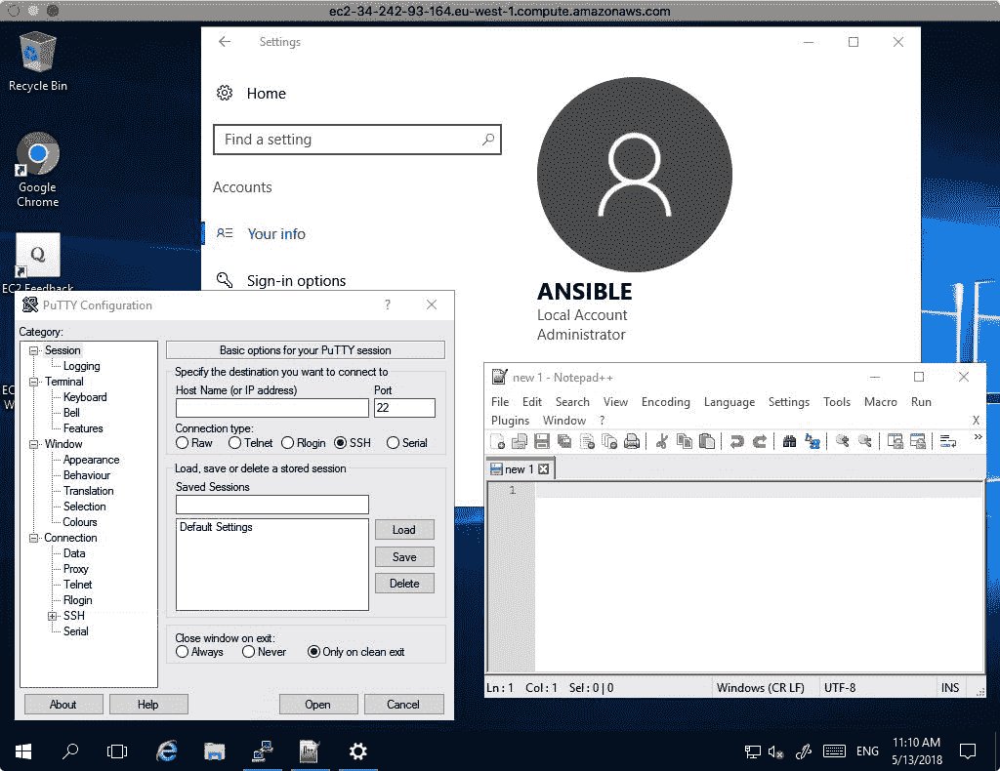

# 十二、Ansible 的 Windows 模块

到目前为止，我们一直以 Linux 服务器为目标。在本章中，我们将了解支持基于 Windows 的服务器并与之交互的核心 Ansible 模块的不断增长的集合。就个人而言，来自几乎完全是 macOS 和 Linux 的背景，使用一个 Windows 本身不支持的工具来管理 Windows，感觉有点奇怪。

但是，我相信在本章结束时您会同意，它的开发人员已经使将 Windows 工作负载引入您的行动手册的过程尽可能无缝和熟悉。

在本章中，我们将学习如何使用游民在本地构建我们的 Windows 服务器，然后将我们的行动手册带到公共云中。我们将涵盖:

*   在窗口中启用功能
*   在 AWS 中启动窗口实例
*   创建用户
*   使用巧克力安装第三方软件包

# 技术要求

和前一章一样，我们将使用游民和 AWS。我们将使用的游民箱包含 Windows 2016 的评估版。我们将在 AWS 中推出的窗口 EC2 实例将获得完全许可，因此除了 EC2 资源成本之外，还会有额外的成本。一如既往，您可以在随附的资源库中找到完整的行动手册副本，网址为[https://github . com/packt publishing/Learn-ansi ble/tree/master/chapter 12](https://github.com/PacktPublishing/Learn-Ansible/tree/master/Chapter12)。

# 启动并运行

在这一部分，我们将使用游民来启动一个 Windows 2016 服务器，就像我们最初在[第 2 章](02.html#SJGS0-0fda9dda24fc45e094341803448da041)、*安装和运行 Ansible* 中所做的那样。让我们首先看看我们将用来启动我们的主机的游民文件。

# 流浪文件

这个`Vagrantfile`看起来和我们用来启动 Linux 主机的没有太大区别:

```
# -*- mode: ruby -*-
# vi: set ft=ruby :

API_VERSION  = "2"
BOX_NAME     = "StefanScherer/windows_2016"
COMMUNICATOR = "winrm"
USERNAME     = "vagrant"
PASSWORD     = "vagrant"

Vagrant.configure(API_VERSION) do |config|
  config.vm.define "vagrant-windows-2016"
  config.vm.box = BOX_NAME
  config.vm.synced_folder ".", "/vagrant", disabled: true
  config.vm.network "forwarded_port", guest: 80, host: 8080
  config.vm.communicator = COMMUNICATOR
  config.winrm.username = USERNAME
  config.winrm.password = PASSWORD

  config.vm.provider "virtualbox" do |v|
    v.memory = "4048"
    v.cpus = "4"
    v.gui = true
  end

  config.vm.provider "vmware_fusion" do |v|
    v.vmx["memsize"] = "4048"
    v.vmx["numvcpus"] = "4"
  end

end
```

如您所见，我们正在替换对 SSH 游民的引用。我们将使用**Windows 远程管理** ( **WinRM** )协议以及 Ansible 与虚拟机进行交互。默认情况下`config.vm.communicator`是 SSH，所以用`winrm`覆盖这意味着我们必须提供`config.winrm.username`和`config.winrm.password`。

此外，我们指示游民不要尝试在虚拟机上挂载我们的本地文件系统，也不要添加任何额外的 IP 地址或网络接口；相反，它应该只是将端口从本地主机转发到主机。

最后，我们将本地机器上的端口`8080`映射到 Windows 主机上的端口`80`；本章后面会有更多的内容。

我们可以使用以下命令之一启动主机:

```
$ vagrant up
```

这将使用 VirtualBox，或者我们可以通过运行以下命令来使用 VMWare:

```
$ vagrant up --provider=vmware_fusion
```

我们使用的游民箱有几千兆字节大小，所以下载需要一点时间，但是一旦下载，您应该会看到如下输出:


机器启动后，您会发现您的虚拟机打开了一个窗口，并且可以访问 Windows 桌面，如下所示:



现在只要最小化这个窗口，因为我们不会直接与窗口交互。关闭窗口可能会暂停并关闭虚拟机。

现在我们已经启动并运行了我们的 Windows 主机，我们需要安装一些支持 Python 的模块，以允许 Ansible 与之交互。

# 易溶制剂

如前所述，Ansible 将使用 WinRM 与我们的窗口主机进行交互。

WinRM provides access to a SOAP-like protocol called WS-Management. Unlike SSH, which provides the user with an interactive shell to manage the host, WinRM accepts scripts that are executed and then the results are passed back to you.

为了能够使用 WinRM，Ansible 要求我们安装几个不同的 Python 模块，Linux 用户可以使用下面的命令来安装它们:

```
$ sudo pip install pywinrm[credssp]
```

如果 macOS 用户获得无法更新的关于`pyOpenSSL`的错误，可能需要执行以下命令，因为它是核心操作系统的一部分:

```
$ sudo pip install pywinrm[credssp] --ignore-installed pyOpenSSL
```

安装后，一旦我们配置了主机清单文件，我们现在应该能够与我们的 Windows 主机进行交互。这个名为`production`的文件如下所示:

```
box1 ansible_host=localhost

[windows]
box1

[windows:vars]
ansible_connection=winrm
ansible_user=vagrant
ansible_password=vagrant
ansible_port=55985
ansible_winrm_scheme=http
ansible_winrm_server_cert_validation=ignore
```

如您所见，我们已经删除了对 SSH 的所有引用，并将其替换为 WinRM ( `ansible_connection`)。同样，我们必须提供用户名(`ansible_user`)和密码(`ansible_password`)。由于我们使用的游民箱的构建方式，我们没有使用默认的 HTTPS 方案，而是使用 HTTP 方案(`ansible_winrm_scheme`)。这意味着我们必须使用端口`55985` ( `ansible_port`)而不是端口`99586`。这两个端口都从我们的 Ansible 控制器映射到 Windows 主机上的端口`9585`和`5986`。

现在我们已经启动并运行了 Windows，并且配置了 Ansible，我们可以开始与它交互了。

# ping 模块

并非所有的 Ansible 模块都与 Windows 主机一起工作，ping 就是其中之一。为 Windows 提供了一个名为`win_ping`的模块，我们将在这里使用它。

我们需要运行的命令如下:如您所见，除了模块名之外，它与我们在 Linux 主机上执行它的方式完全相同:

```
$ ansible windows -i production -m win_ping
```

如果你是一个 macOS 用户，你收到这样的错误，那么不要担心；有一种解决方法:


该错误是 Ansible 团队正在解决的已知问题。同时，运行以下命令，或将其添加到您的`~/.bash_profile`文件中:

```
$ export OBJC_DISABLE_INITIALIZE_FORK_SAFETY=YES
```

运行该命令后，您应该会看到以下结果:


我们将要运行的下一个模块被设计为与 Windows 或 Linux 主机一起工作。

# 设置模块

正如我们在[第 2 章](02.html#SJGS0-0fda9dda24fc45e094341803448da041)、*安装和运行 Ansible* 中所发现的，设置模块收集目标主机上的事实；如果我们直接使用`ansible`命令调用模块，事实会直接打印在屏幕上。要调用该模块，我们需要运行以下命令:

```
$ ansible windows -i production -m setup
```

从下面的屏幕中可以看到，显示的信息与我们在 Linux 主机上运行该模块时非常相似:



我们可以使用[第 2 章](02.html#SJGS0-0fda9dda24fc45e094341803448da041)、*安装和运行 Ansible* 中的一个剧本来看这个。在`playbook01.yml`中，我们使用 Ansible 首次连接到主机时收集的事实来显示消息。让我们更新剧本，与我们的 Windows 主机进行交互:

```
---

- hosts: windows
  gather_facts: true

  tasks:
    - debug:
        msg: "I am connecting to {{ ansible_nodename }} which is running {{ ansible_distribution }} {{ ansible_distribution_version }}"
```

如您所见，我们已经更新了主机组以使用`windows`而不是`boxes`，并且我们还删除了`become`和`become_method`选项，因为我们将与之连接的用户有足够的权限运行我们需要的任务。

我们可以使用以下命令运行行动手册:

```
$ ansible-playbook -i production playbook01.yml
```

以下屏幕给出了预期输出:


现在我们已经快速地学习了基础知识，我们可以考虑做一些有用的事情并安装一些不同的软件包。

# 安装 web 服务器

当我们的 Linux 主机启动并运行时，我们做的第一件事就是安装一个网络服务器，所以让我们看看通过在我们的 Windows 主机上安装并启用**互联网信息服务** ( **IIS** )来重复这个过程。

IIS is the default web server that ships with Windows Server, and it supports the following protocols: HTTP, HTTPS, and HTTP/2, as well as FTP, FTPS, SMTP, and NNTP. It was first released 22 years ago as part of Windows NT.

像我们到目前为止所学的所有剧本一样，让我们通过运行以下命令来创建基本框架:

```
$ mkdir web web/group_vars web/roles
$ touch web/production web/site.yml web/group_vars/common.yml
```

现在我们可以开始写剧本了。

# IIS 角色

我们要看的第一个角色是安装和配置 IIS，然后像我们之前的剧本一样，上传一个由 Ansible 使用模板生成的 HTML 文件。首先，切换到`web`文件夹，通过运行创建角色:

```
$ cd web
$ ansible-galaxy init roles/iis
```

从`roles/iis/defaults/main.yml`中的默认变量开始，我们可以看到我们的角色将与我们在设置 LAMP 栈时创建的 Apache 角色非常相似:

```
---
# defaults file for web/roles/iis

document_root: 'C:\inetpub\wwwroot\'
html_file: ansible.html

html_heading: "Success !!!"
html_body: |
  This HTML page has been deployed using Ansible to a <b>{{ ansible_distribution }}</b> host.<br><br>
  The weboot is <b>{{ document_root }}</b> this file is called <b>{{ html_file }}</b>.<br>
```

如您所见，我们提供了文档根目录的路径、我们的 HTML 文件的名称，以及我们的 HTML 文件的一些内容，模板可以在`roles/iis/templates/index.html.j2`找到:

```
<!--{{ ansible_managed }}-->
<!doctype html>
<title>{{ html_heading }}</title>
<style>
  body { text-align: center; padding: 150px; }
  h1 { font-size: 50px; }
  body { font: 20px Helvetica, sans-serif; color: #333; }
  article { display: block; text-align: left; width: 650px; margin: 0 auto; }
</style>
<article>
    <h1>{{ html_heading }}</h1>
    <div>
        <p>{{ html_body }}</p>
    </div>
</article>
```

这正是我们之前在 Apache 角色中使用的模板。部署 IIS 相当简单，我们只需要`roles/iis/tasks/main.yml`中的两个任务就可以完成。我们的第一个任务可以在这里找到:

```
- name: enable IIS
  win_feature:
    name: 
      - "Web-Server"
      - "Web-Common-Http"
    state: "present"
```

这使用`win_feature`模块来启用和启动`Web-Server`和`Web-Common-Http`功能。下一个也是最后一个任务是使用`win_template`模块部署我们的 HTML 页面:

```
- name: create an html file from a template
  win_template:
    src: "index.html.j2"
    dest: "{{ document_root }}{{ html_file }}"
```

如您所见，语法与标准`template`模块基本相同。现在我们已经完成了我们的角色，我们可以运行行动手册，将我们在上一节中使用的主机清单文件的内容复制到`production`文件中，并更新`site.yml`，使其包含以下内容:

```
---

- hosts: windows
  gather_facts: true

  vars_files:
    - group_vars/common.yml

  roles:
    - roles/iis
```

然后，您可以使用以下命令运行行动手册:

```
$ ansible-playbook -i production site.yml
```

剧本运行的输出应该类似于以下终端输出:



完成后，您应该能够在本地机器上打开网络浏览器并进入`http://localhost:8080/`，它将显示默认的 IIS 页面:



打开`http://localhost:8080/ansible.html`会显示我们上传的页面:


# ASP.NET 角色

现在我们已经启动并运行了 IIS，让我们看看如何启用 ASP.NET 支持。同样，让我们从创建角色开始:

```
$ ansible-galaxy init roles/asp
```

从`roles/asp/defaults/main.yml`中的变量开始，您可以看到它们看起来类似于 HTML 中的变量，只是我们给它们加上了前缀`.aspx`，这样它们就不会与`iis`角色中的变量冲突:

```
aspx_document_root: 'C:\inetpub\wwwroot\ansible\'
aspx_file: default.aspx

aspx_heading: "Success !!!"
aspx_body: |
  This HTML page has been deployed using Ansible to a <b>{{ ansible_distribution }}</b> host.<br><br>
  The weboot is <b>{{ aspx_document_root }}</b> this file is called <b>{{ aspx_file }}</b>.<br><br>
  The output below is from ASP.NET<br><br>
  Hello from <%= Environment.MachineName %> at <%= DateTime.UtcNow %><br><br>
```

正如你在页面底部看到的，我们包含了一个打印机器名称的函数，在我们的例子中应该是游民，还有日期和时间。

接下来，我们有`roles/asp/templates/default.aspx.j2`中的模板。除了更新的变量和文件名，内容与`iis`角色中使用的内容大致相同:

```
<!--{{ ansible_managed }}-->
<!doctype html>
<title>{{ html_heading }}</title>
<style>
  body { text-align: center; padding: 150px; }
  h1 { font-size: 50px; }
  body { font: 20px Helvetica, sans-serif; color: #333; }
  article { display: block; text-align: left; width: 650px; margin: 0 auto; }
</style>
<article>
    <h1>{{ aspx_heading }}</h1>
    <div>
        <p>{{ aspx_body }}</p>
    </div>
</article>
```

接下来，我们有应该放在`roles/asp/tasks/main.yml`的任务。首先，我们使用`win_feature`模块来启用启动和运行基本页面所需的组件:

```
- name: enable .net
  win_feature:
    name: 
      - "Net-Framework-Features"
      - "Web-Asp-Net45"
      - "Web-Net-Ext45"
    state: "present"
  notify: restart iis
```

接下来，我们需要创建一个文件夹来提供我们的页面，并复制呈现的模板:

```
- name: create the folder for our asp.net app
  win_file:
    path: "{{ aspx_document_root }}"
    state: "directory"

- name: create an aspx file from a template
  win_template:
    src: "default.aspx.j2"
    dest: "{{ aspx_document_root }}{{ aspx_file }}"
```

如您所见，我们再次使用`win_template`模块。除了使用`win_file`模块，文件模块的语法与我们在其他章节中使用的`file`模块非常相似。最后一项任务是检查站点在 IIS 中的配置是否正确:

```
- name: ensure the default web application exists
  win_iis_webapplication:
    name: "Default"
    state: "present"
    physical_path: "{{ aspx_document_root }}"
    application_pool: "DefaultAppPool"
    site: "Default Web Site"
```

`win_iis_webapplication`模块，顾名思义，用于在 IIS 中配置网络应用。对于我们的例子来说，这并不是严格要求的，但是它让你知道什么是可能的。

您可能已经注意到，当我们启用附加功能时，我们发送了重新启动 IIS 的通知。这意味着我们必须向`roles/asp/handlers/main.yml`文件添加一个任务。该任务使用`win_service`模块重新启动网络服务器:

```
- name: restart iis
  win_service:
    name: w3svc
    state: restarted
```

现在，我们已经完成了我们的角色，我们可以再次运行剧本了。首先，我们需要将新角色添加到`site.yml`文件中:

```
---

- hosts: windows
  gather_facts: true

  vars_files:
    - group_vars/common.yml

  roles:
    - roles/iis
    - roles/asp
```

然后，我们可以使用以下命令运行剧本:

```
$ ansible-playbook -i production site.yml
```

这应该会给你一些类似以下输出的东西:


打开你的浏览器，进入`http://localhost:8080/ansible/`应该会给你呈现一个类似以下网页的东西:


让我们移除我们的游民盒子，再看几个模块。要移除该框，请运行:

```
$ vagrant destroy
```

我们现在可以考虑使用 Ansible 创建一个用户，并在 AWS 的服务器主机上使用 Chocolatey 安装几个桌面应用。

# 与 AWS 窗口实例交互

当我们与我们本地的窗口流浪盒交互时，它没有使用安全连接；让我们看看在 AWS 实例中启动一个 Windows EC2 实例，然后与它进行交互，就像我们在[第 10 章](10.html#62HIO0-0fda9dda24fc45e094341803448da041)*高可用性云部署*中对 CentOS 7 实例所做的那样。

首先，我们需要为我们的新剧本创建文件夹结构:

```
$ mkdir cloud cloud/group_vars cloud/roles
$ touch cloud/production cloud/site.yml cloud/group_vars/common.yml
```

一旦我们有了结构，我们需要创建四个角色，从 AWS 角色开始。

# AWS 角色

我们的第一个角色将创建 VPC 并启动 EC2 实例。要引导角色更改，请转到云文件夹并运行:

```
$ cd cloud
$ ansible-galaxy init roles/aws
```

先从`roles/aws/defaults/main.yml`的内容说起:

```
vpc_cidr_block: "10.0.0.0/16"
the_subnets:
  - { use: 'ec2', az: 'a', subnet: '10.0.10.0/24' }

ec2:
  instance_type: "t2.large"
  wait_port: "5986"

image:
  base: Windows_Server-2016-English-Full-Base-*
  owner: amazon
  architecture: x86_64
  root_device: ebs

win_initial_password: "{{ lookup('password', 'group_vars/generated_administrator chars=ascii_letters,digits length=30') }}"
```

如您所见，我们将只使用一个子网，并且我们将在行动手册运行期间寻找一个 Windows Server 2016 AMI。最后，我们正在设置一个名为`win_initial_password`的变量，该变量将用于在剧本运行的后期设置我们的管理员密码。

`roles/aws/tasks/main.yml`中的大部分任务都如你所料。首先，我们设置 VPC，创建子网，并找出您当前用于安全组的 IP 地址:

```
- name: ensure that the VPC is present
  ec2_vpc_net:
    region: "{{ ec2_region }}"
    name: "{{ environment_name }}"
    state: present
    cidr_block: "{{ vpc_cidr_block }}"
    resource_tags: { "Name" : "{{ environment_name }}", "Environment" : "{{ environment_name }}" }
  register: vpc_info

- name: ensure that the subnets are present
  ec2_vpc_subnet:
    region: "{{ ec2_region }}"
    state: present
    vpc_id: "{{ vpc_info.vpc.id }}"
    cidr: "{{ item.subnet }}"
    az: "{{ ec2_region }}{{ item.az }}"
    resource_tags: 
      "Name" : "{{ environment_name }}_{{ item.use }}_{{ ec2_region }}{{ item.az }}"
      "Environment" : "{{ environment_name }}"
      "Use" : "{{ item.use }}"
  with_items: "{{ the_subnets }}"

- name: gather information about the ec2 subnets
  ec2_vpc_subnet_facts:
    region: "{{ ec2_region }}"
    filters:
      "tag:Use": "ec2"
      "tag:Environment": "{{ environment_name }}"
  register: subnets_ec2

- name: register just the IDs for each of the subnets
  set_fact:
    subnet_ec2_ids: "{{ subnets_ec2.subnets | map(attribute='id') | list }}"

- name: find out your current public IP address using https://ipify.org/
  ipify_facts:
  register: public_ip

- name: set your public ip as a fact
  set_fact:
    your_public_ip: "{{ public_ip.ansible_facts.ipify_public_ip }}/32"
```

安全组已更新，因此，我们正在为远程桌面(端口`3389`)和 WinRM(端口`5985`和`5986`)打开端口，而不是端口 22:

```
- name: provision ec2 security group
  ec2_group:
    region: "{{ ec2_region }}"
    vpc_id: "{{ vpc_info.vpc.id }}"
    name: "{{ environment_name }}-ec2"
    description: "Opens the RDP and WinRM ports to a trusted IP"
    tags:
      "Name": "{{ environment_name }}-ec2"
      "Environment": "{{ environment_name }}"
    rules:
      - proto: "tcp"
        from_port: "3389"
        to_port: "3389"
        cidr_ip: "{{ your_public_ip }}"
        rule_desc: "allow {{ your_public_ip }} access to port RDP"
      - proto: "tcp"
        from_port: "5985"
        to_port: "5985"
        cidr_ip: "{{ your_public_ip }}"
        rule_desc: "allow {{ your_public_ip }} access to WinRM"
      - proto: "tcp"
        from_port: "5986"
        to_port: "5986"
        cidr_ip: "{{ your_public_ip }}"
        rule_desc: "allow {{ your_public_ip }} access to WinRM"
  register: sg_ec2
```

然后，在找到合适的 AMI ID 之前，我们继续通过添加互联网网关和路由来构建我们的网络:

```
- name: ensure that there is an internet gateway
  ec2_vpc_igw:
    region: "{{ ec2_region }}"
    vpc_id: "{{ vpc_info.vpc.id }}"
    state: present
    tags:
      "Name": "{{ environment_name }}_internet_gateway"
      "Environment": "{{ environment_name }}"
      "Use": "gateway"
  register: igw_info

- name: check that we can route through internet gateway
  ec2_vpc_route_table:
    region: "{{ ec2_region }}"
    vpc_id: "{{ vpc_info.vpc.id }}"
    subnets: "{{ subnet_ec2_ids }}"
    routes:
      - dest: 0.0.0.0/0
        gateway_id: "{{ igw_info.gateway_id }}"
    resource_tags:
      "Name": "{{ environment_name }}_outbound"
      "Environment": "{{ environment_name }}"

- name: search for all of the AMIs in the defined region which match our selection
  ec2_ami_facts:
    region: "{{ ec2_region }}"
    owners: "{{ image.owner }}"
    filters:
      name: "{{ image.base }}"
      architecture: "{{ image.architecture }}"
      root-device-type: "{{ image.root_device }}" 
  register: amiFind

- name: filter the list of AMIs to find the latest one with an EBS backed volume
  set_fact:
    amiSortFilter: "{{ amiFind.images | sort(attribute='creation_date') | last }}"

- name: finally grab AMI ID of the most recent result which matches our base image which is backed by an EBS volume
  set_fact:
    our_ami_id: "{{ amiSortFilter.image_id }}"
```

现在是时候启动 EC2 实例了；您可能已经注意到，我们不必上传密钥或任何凭据。这是因为我们将实际注入一个 PowerShell 脚本，该脚本在实例首次启动时执行。该脚本将设置管理员密码并配置实例，以便可以对其运行 Ansible:

```
- name: launch an instance
  ec2_instance:
    region: "{{ ec2_region }}"
    state: "present"
    instance_type: "{{ ec2.instance_type }}"
    image_id: "{{ our_ami_id }}"
    wait: yes
    security_groups: [ "{{ sg_ec2.group_id }}" ]
    network: 
      assign_public_ip: true
    filters:
      instance-state-name: "running"
      "tag:Name": "{{ environment_name }}"
      "tag:environment": "{{ environment_name }}"
    vpc_subnet_id: "{{ subnet_ec2_ids[0] }}"
    user_data: "{{ lookup('template', 'userdata.j2') }}"
    tags:
      Name: "{{ environment_name }}"
      environment: "{{ environment_name }}"
```

该脚本是一个名为`userdata.j2`的模板，在启动时使用`user_data`键将其注入实例。我们一会儿就来看看模板；这个角色剩下的就是将实例添加到主机组，然后等待 WinRM 可以访问:

```
- name: gather facts on the instance we just launched using the AWS API
  ec2_instance_facts:
    region: "{{ ec2_region }}"
    filters:
      instance-state-name: "running"
      "tag:Name": "{{ environment_name }}"
      "tag:environment": "{{ environment_name }}"
  register: singleinstance

- name: add our temporary instance to a host group for use in the next step
  add_host:
    name: "{{ item.public_dns_name }}"
    ansible_ssh_host: "{{ item.public_dns_name }}"
    groups: "ec2_instance"
  with_items: "{{ singleinstance.instances }}"

- name: wait until WinRM is available before moving onto the next step
  wait_for:
    host: "{{ item.public_dns_name }}"
    port: "{{ ec2.wait_port }}"
    delay: 2
    timeout: 320
    state: "started"
  with_items: "{{ singleinstance.instances }}"
```

`roles/aws/templates/`中的`userdata.j2`模板如下所示:

```
<powershell>
$admin = [adsi]("WinNT://./administrator, user")
$admin.PSBase.Invoke("SetPassword", "{{ win_initial_password }}")
Invoke-Expression ((New-Object System.Net.Webclient).DownloadString('https://raw.githubusercontent.com/ansible/ansible/devel/examples/scripts/ConfigureRemotingForAnsible.ps1'))
</powershell>
```

脚本第一部分为管理员用户设置密码(`win_initial_password`)；然后，该脚本直接从 Ansible 的 GitHub 存储库中下载并执行一个 PowerShell 脚本。该脚本针对目标实例上的当前 WinRM 配置运行检查，然后进行必要的更改，以便 Ansible 能够安全连接。该脚本还将 WinRM 中的所有操作配置为记录到实例事件日志中。

# 用户角色

接下来，我们有了用户角色，可以运行以下命令来创建:

```
$ ansible-galaxy init roles/user
```

这个角色为我们创建了一个用户来连接到我们的实例。在`roles/user/defaults/main.yml`中可以找到的默认值如下:

```
ansible:
  username: "ansible"
  password: "{{ lookup('password', 'group_vars/generated_ansible chars=ascii_letters,digits length=30') }}"
  groups:
    - "Users"
    - "Administrators"
```

如您所见，这里我们定义了一个名为`ansible`的用户，该用户有一个 30 个字符的随机密码。`ansible`用户将是`Users`和`Administrators`组的成员。使用`win_user`模块在`roles/user/tasks/main.yml`中有一个任务，看起来像:

```
- name: ensure that the ansible created users are present
  win_user:
    name: "{{ ansible.username }}"
    fullname: "{{ ansible.username | capitalize }}"
    password: "{{ ansible.password }}"
    state: "present"
    groups: "{{ ansible.groups }}"
```

像所有的 Windows 模块一样，语法类似于 Linux 的对等模块，所以你应该很清楚每个键的意思。从上一个任务中可以看到，我们正在使用 Jinja2 转换来大写`ansible.username`变量的第一个字母。

# 巧克力角色

下一个角色使用巧克力在机器上安装一些软件。

Chocolatey is a package manager for Windows, similar in principle and functionality to Homebrew, which we used in earlier chapters to install the software we needed on macOS with a single command. Chocolatey simplifies the installation of packages on the command line by wrapping the installation process for most common Windows installers into a common set of PowerShell commands—perfect for an orchestration tool such as Ansible.

要添加角色所需的文件，请运行以下命令:

```
$ ansible-galaxy init roles/choc
```

在`roles/choc/defaults/main.yml`中，我们有一个要安装的软件包列表:

```
apps:
  - "notepadplusplus.install"
  - "putty.install"
  - "googlechrome"
```

如您所见，我们希望安装记事本++、PuTTY 和谷歌 Chrome。需要添加到`roles/choc/tasks/main.yml`的任务本身看起来如下:

```
- name: install software using chocolatey
  win_chocolatey:
    name: "{{ item }}"
    state: "present"
  with_items: "{{ apps }}"
```

同样，`win_chocolatey`模块在针对基于 Linux 的主机时，采用了与我们在前面章节中使用的包管理器模块类似的输入。

# 信息角色

我们正在创建的最后一个角色叫做`info`，它的唯一目的是输出我们新启动和配置的 Windows Server 2016 EC2 实例的信息。您可能已经猜到，我们需要运行以下命令:

```
$ ansible-galaxy init roles/info
```

一旦我们有了文件，添加以下任务到`roles/info/tasks/main.yml`:

```
- name: print out information on the host
  debug:
    msg: "You can connect to '{{ inventory_hostname }}' using the username of '{{ ansible.username }}' with a password of '{{ ansible.password }}'."
```

如您所见，这将为我们提供要连接的主机以及用户名和密码。

# 运行剧本

在运行行动手册之前，我们需要在`group_vars/common.yml`中添加以下内容:

```
environment_name: "windows_example"
ec2_region: "eu-west-1"
```

名为`production`的主机清单文件应包含以下内容:

```
[ec2_instance]

[ec2_instance:vars]
ansible_connection=winrm
ansible_user="Administrator"
ansible_password="{{ lookup('password', 'group_vars/generated_administrator chars=ascii_letters,digits length=30') }}"
ansible_winrm_server_cert_validation=ignore
```

如您所见，我们正在使用 WinRM 连接器连接到我们的窗口实例，使用的是管理员用户名和密码，这是我们在启动实例时运行用户数据脚本时设置的。`site.yml`文件应包含以下内容:

```
---

- name: Create the AWS environment and launch an EC2 instance
  hosts: localhost
  connection: local
  gather_facts: True

  vars_files:
    - group_vars/common.yml

  roles:
    - roles/aws

- name: Bootstrap the EC2 instance
  hosts: ec2_instance
  gather_facts: true

  vars_files:
    - group_vars/common.yml

  roles:
    - roles/user
    - roles/choc
    - roles/info 
```

首先导出我们的 AWS 凭据后，我们可以使用以下命令运行行动手册:

```
$ export AWS_ACCESS_KEY=AKIAI5KECPOTNTTVM3EDA
$ export AWS_SECRET_KEY=Y4B7FFiSWl0Am3VIFc07lgnc/TAtK5+RpxzIGTr
$ ansible-playbook -i production site.yml
```

剧本运行的一个稍加编辑的输出如下:

```
[WARNING]: provided hosts list is empty, only localhost is available. Note that the implicit
localhost does not match 'all'

PLAY [Create the AWS environment and launch an EC2 instance] ************************************

TASK [Gathering Facts] **************************************************************************
ok: [localhost]

TASK [roles/aws : ensure that the VPC is present] ***********************************************
changed: [localhost]

TASK [roles/aws : ensure that the subnets are present] ******************************************
changed: [localhost] => (item={u'subnet': u'10.0.10.0/24', u'use': u'ec2', u'az': u'a'})

TASK [roles/aws : gather information about the ec2 subnets] *************************************
ok: [localhost]

TASK [roles/aws : register just the IDs for each of the subnets] ********************************
ok: [localhost]

TASK [roles/aws : find out your current public IP address using https://ipify.org/] *************
ok: [localhost]

TASK [roles/aws : set your public ip as a fact] *************************************************
ok: [localhost]

TASK [roles/aws : provision ec2 security group] *************************************************
changed: [localhost]

TASK [roles/aws : ensure that there is an internet gateway] *************************************
changed: [localhost]

TASK [roles/aws : check that we can route through internet gateway] *****************************
changed: [localhost]

TASK [roles/aws : search for all of the AMIs in the defined region which match our selection] ***
ok: [localhost]

TASK [roles/aws : filter the list of AMIs to find the latest one with an EBS backed volume] *****
ok: [localhost]

TASK [roles/aws : finally grab AMI ID of the most recent result which matches our base image which is backed by an EBS volume] ***************************************************************
ok: [localhost]

TASK [roles/aws : launch an instance] ***********************************************************
changed: [localhost]

TASK [roles/aws : gather facts on the instance we just launched using the AWS API] **************
ok: [localhost]

TASK [roles/aws : add our temporary instance to a host group for use in the next step] **********
changed: [localhost] => 

TASK [roles/aws : wait until WinRM is available before moving onto the next step] ***************
ok: [localhost] => 

PLAY [Bootstrap the EC2 instance] ***************************************************************

TASK [Gathering Facts] **************************************************************************
ok: [ec2-34-245-2-119.eu-west-1.compute.amazonaws.com]

TASK [roles/user : ensure that the ansible created users are present] **************************
changed: [ec2-34-245-2-119.eu-west-1.compute.amazonaws.com]

TASK [roles/choc : install software using chocolatey] *******************************************
changed: [ec2-34-245-2-119.eu-west-1.compute.amazonaws.com] => (item=notepadplusplus.install)
changed: [ec2-34-245-2-119.eu-west-1.compute.amazonaws.com] => (item=putty.install)
changed: [ec2-34-245-2-119.eu-west-1.compute.amazonaws.com] => (item=googlechrome)
 [WARNING]: Chocolatey was missing from this system, so it was installed during this task run.

TASK [roles/info : print out informaton on the host] ********************************************
ok: [ec2-34-245-2-119.eu-west-1.compute.amazonaws.com] => {
 "msg": "You can connect to 'ec2-34-245-2-119.eu-west-1.compute.amazonaws.com' using the username of 'ansible' with a password of 'Qb9LVPkUeZFRx5HLFgVllFrkqK7HHN'."
}

PLAY RECAP **************************************************************************************
ec2-34-245-2-119.eu-west-1.compute.amazonaws.com : ok=4 changed=2 unreachable=0 failed=0
localhost : ok=17 changed=7 unreachable=0 failed=0
```

从输出中可以看到，我的 EC2 实例的主机名为`ec2-34-245-2-119.eu-west-1.compute.amazonaws.com`，`ansible`用户的密码为`Qb9LVPkUeZFRx5HLFgVllFrkqK7HHN`。我可以使用微软 RDP 连接到实例，并提供这些详细信息(请记住，它被锁定到您的 IP 地址)。从下面的截图可以看到，我是以 Ansible 用户的身份连接的，并且已经打开了 PuTTY 和 Notepad ++了；你也可以在桌面上找到谷歌浏览器的快捷方式:



你可能注意到的另一件事是，我们从来不需要安装巧克力。如剧本运行期间所述，如果`win_chocolatey`在目标机器上没有找到巧克力安装，它将自动安装和配置它。

GitHub 存储库中的`Chapter12/cloud`文件夹中有一个行动手册，它删除了我们在这里创建的资源。要运行此程序，请使用以下命令:

```
$ ansible-playbook -i production remove.yml
```

确保你仔细检查了所有的东西都按照预期被移除了，以确保你不会收到任何意外的账单。

# 摘要

正如本章开头提到的，在 Windows 上使用传统的 Linux 工具，比如 Ansible，总感觉有些奇怪。然而，我相信你会同意这种体验尽可能像 Linux。当我第一次开始试验 Windows 模块时，我很惊讶我成功地启动了一个 EC2 Windows 服务器实例，并成功地部署了一个简单的网络应用，而不必远程桌面到目标实例中。

随着每个新版本的发布，Ansible 获得了越来越多对基于 Windows 的主机的支持，这使得从您的行动手册中管理混合工作负载变得更加容易。

在下一章中，我们将回到更熟悉的领域，至少对我来说，并看看我们如何加强我们的 Linux 安装。

# 问题

1.  以下两个模块中的哪一个可以在 Windows 和 Linux 主机、安装程序或文件上使用？
2.  对或错:您可以使用 SSH 来访问您的 Windows 目标。
3.  解释 WinRM 使用的接口类型。
4.  需要安装哪个 Python 模块才能在 macOS 和 Linux 上与 WinRM 交互？
5.  对或错:在使用`win_chocolatey`模块之前，您可以有一个单独的任务来安装巧克力。
6.  更新行动手册以安装其他软件包。

# 进一步阅读

你可以在[http://chocolatey.org/](http://chocolatey.org/)找到更多关于优秀巧克力的信息。