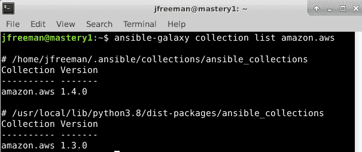

# 二、从早期版本移植过来

随着这些年来 Ansible 的发展，开发和管理 Ansible 代码库的团队遇到了一些令人头疼的问题。从许多方面来说，这些令人头疼的问题是 Ansible 自身发展和成功的代价，并导致需要稍微改变一下代码的结构。事实上，任何对 2.10 之前版本的 Ansible 稍有经验的人都会注意到，我们在本书中展示的示例代码看起来有些不同，还有一个新术语， **Collections** 。

在本章中，我们将详细解释这些变化，以及它们是如何发生的。然后，我们将带您通过一些实际的例子，以便您可以看到这些变化在现实世界中是如何工作的，最后教您如何将任何现有的或遗留的行动手册迁移到 Ansible 4.3 及更高版本。

具体而言，在本章中，我们将涵盖以下主题:

*   Ansible 4.3 中的更改
*   从早期 Ansible 安装升级
*   从头开始安装 Ansible
*   什么是 Ansible 的集合？
*   用`ansible-galaxy`安装附加模块
*   如何将旧剧本移植到 Ansible 4.3(入门版)

# 技术要求

按照本章中给出的示例，您将需要一台运行 **Ansible 4.3** 或更新版本的 Linux 机器。几乎任何味道的 Linux 都应该可以。对于那些对细节感兴趣的人，除非另有说明，本章中给出的所有代码都在 **Ubuntu Server 20.04 LTS** 和 **Ansible 4.3** 上进行了测试。本章附带的示例代码可从 GitHub 下载，网址为:[https://GitHub . com/PacktPublishing/Mastering-Ansible-第四版/tree/main/Chapter02](https://github.com/PacktPublishing/Mastering-Ansible-Fourth-Edition/tree/main/Chapter02) 。我们将利用我们在 [*第 10 章*](10.html#_idTextAnchor183)*扩展 Ansible* 中开发的一个模块，向您展示如何构建自己的收藏，因此值得确保您拥有本书的随附代码副本。

查看以下视频，查看《行动守则》:[https://bit.ly/3DYi0Co](https://bit.ly/3DYi0Co)

# ansi ble 4.3 中的更改

虽然我们在 [*第 1 章*](01.html#_idTextAnchor015)**ansi ble*的系统架构和设计中谈到了这个话题，但我们必须更深入地研究这些变化，以帮助您充分理解 Ansible 4.3 与之前版本的不同之处。这将极大地帮助您编写优秀的行动手册，维护和升级您的 Ansible 基础架构–这是掌握 Ansible 4.3 的重要一步！*

 *首先，一点历史。正如我们在前一章中所讨论的，Ansible 在设计上拥有许多优势，这些优势导致了它的快速增长和发展。其中许多优势，如其无代理设计和易于阅读的 YAML 代码，保持不变。事实上，如果您阅读自 2.9 以来 Ansible 版本的变更日志，您会发现自该版本以来，核心 Ansible 功能几乎没有什么值得注意的变更，相反，所有的开发工作都进入了另一个领域。

Ansible 的模块无疑是其最大的优势之一，事实上，从个人贡献者到硬件供应商和云供应商，任何人都可以提交自己的模块，这意味着到 2.9 版本发布时，Ansible 包含了数千个模块，用于各种可能的目的。

这本身就成了项目管理人员头疼的事情。假设一个模块中有一个需要修复的 bug，或者有人在一个可能会流行的现有模块中添加了一个伟大的新特性。Ansible 版本本身包含了所有的模块——简而言之，它们与 Ansible 版本本身紧密耦合。这意味着为了发布一个新的模块，必须向社区发布一个全新版本的 Ansible。

再加上来自数百个模块开发人员的问题和请求，那些管理核心 Ansible 代码库的人真的很头疼。很明显，虽然这些模块是 Ansible 成功的重要部分，但它们也是导致发布周期和代码库管理问题的原因。我们需要的是一种将模块(或至少大部分模块)从 Ansible 引擎的发布中分离出来的方法，Ansible 引擎是我们在本书的第 1 章[](01.html#_idTextAnchor015)***ansi ble*的系统架构和设计中运行的核心 Ansible 运行时。**

 **于是，**Ansible 内容集**(简称集)诞生了。

## Ansible 的内容集合

虽然我们将很快更深入地研究这些，但值得注意的重要概念是，Collections 是 Ansible 内容的包格式，为了便于讨论，它意味着所有成千上万的模块。通过使用 Collections 分发模块，特别是那些由第三方编码和维护的模块，Ansible 团队已经有效地消除了核心 Ansible 产品的发布版本和模块之间的耦合，这些模块使得它对许多人来说如此有价值。

这当然导致了另一个细微差别—当你安装，比如说 **Ansible 2.9.1** 时，你正在安装 Ansible 二进制文件和其他核心代码的给定版本，以及当时提交并批准包含的所有模块。

现在，当我们谈论安装 Ansible 4.3 时，我们实际上的意思是:

Ansible 4.3.0 现在是一个包，包含(在撰写本文时)85 个模块、插件和其他重要功能的集合，在需要安装更多集合之前，将让尽可能多的人开始他们的 Ansible 之旅。简而言之，这是一套入门系列。

这里重要的是，Ansible 4.3.0 不包含任何实际的自动化运行时。如果您要单独安装 Ansible 4.3.0，您实际上将无法运行 Ansible！幸运的是，这样做是不可能的，并且 Ansible 4.3.0 依赖于目前名为 **ansible-core** 的软件包。这个包包含了 Ansible 语言的运行时，以及少量的核心插件和模块，比如我们在 [*第 1 章*](01.html#_idTextAnchor015)**ansi ble*的系统架构和设计中经常用到的`ansible.builtin.debug`。*

 *Ansible 包的每个版本都依赖于 ansible-core 的特定版本，因此它总是与正确的自动化引擎配对。例如，Ansible 4.3.0 取决于 Ansible 核心> = 2.11 和< 2.12。

从 3.0.0 版本开始，Ansible 已经为 Ansible 包本身切换到语义版本化。对于还没有遇到语义版本化的人来说，可以很简单地解释如下:

*   Ansible 4.3.0:这是新 Ansible 包的第一个语义版本化版本。
*   Ansible 4.0.1:这个版本(以及所有最右边数字发生变化的版本)将只包含向后兼容的错误修复。
*   Ansible 4.1.0:这个版本(以及中间数字发生变化的所有版本)将包含向后兼容的新特性，可能还包括错误修复。
*   Ansible 5.0.0:这将包含打破向后兼容性的更改，被称为主要版本。

ansible-core 包没有采用语义版本化，因此预计 Ansible 5.0.0 将对 ansible-core > = 2.12 产生依赖。请注意，ansible-core 的这个版本，不在语义版本控制之下，可能包含打破向后兼容性的更改，因此在我们的掌握之旅中，了解 ansible 现在版本控制的这些细微差别是很重要的。

重要说明

最后，请注意，在 2.11 版本中，ansible-core 包是从 ansible-base 重新命名的，所以如果您看到 ansible-base 的引用，请知道它只是 ansible-core 包的旧名称。

所有这些变化都是在很长一段时间内计划和实施的。虽然它们的实现旨在使现有 Ansible 用户的旅程尽可能顺利，但仍有一些问题需要解决，从如何实际安装和升级 Ansible 开始，我们将在下一节中详细介绍。

# 从早期 Ansible 安装升级

将 Ansible 分成两个包，其中一个依赖于另一个，这给包维护人员带来了一些麻烦。虽然 CentOS 和 RHEL 的软件包很容易获得，但目前还没有 Ansible 4.3.0 或 ansible-core 2.11.1 的软件包。快速浏览一下 CentOS/RHEL 8 的 EPEL 软件包目录就会发现，Ansible 的最新 RPM 版本是 2.9.18。官方的 Ansible 安装指南更进一步:

*由于 RHEL 的 Ansible 2.10 此时不可用，继续使用 Ansible 2.9* 。

这将在适当的时候发生变化因为包维护人员会计算出各种升级路径和打包技术的优缺点，但是在撰写本文时，如果您想现在就开始使用 Ansible 4.3.0，那么对您的升级路径有一个非常明确的期望，而获得这个最新的、最伟大的版本的最简单的方法是使用 Python 打包技术 **pip** 来安装它。然而，与其说是升级，不如说是卸载后的重新安装。

## 卸载 Ansible 3.0 或更高版本

Ansible 包结构的根本变化意味着，如果您的控制节点上安装了 Ansible 3.0 或更早版本(包括任何 2.x 版本)，那么可悲的是，您不能只升级您的 Ansible 安装。相反，您需要在安装更高版本之前删除现有的 Ansible 安装。

小费

与删除任何软件一样，您应该确保备份您的重要文件，尤其是中央 Ansible 配置文件和清单，以防它们在删除过程中被删除。

删除软件包的方法将取决于您的安装。例如，如果您通过 RPM 在 CentOS 8 上安装了 Ansible 2.9.18，则可以使用以下命令将其删除:

```
sudo dnf remove ansible
```

同样，在 Ubuntu 上，您可以运行以下命令:

```
sudo apt remove ansible
```

如果您之前使用`pip`安装了 Ansible，您可以使用以下命令将其删除:

```
pip uninstall ansible
```

简而言之，如何在控制节点上安装 Ansible 3.0(或更早版本)并不重要。即使你用`pip`安装了，并且你要用 pip 安装新版本，你也必须先卸载旧版本，然后再做其他事情。

当更新的 Ansible 版本可用时，建议查看文档以了解升级过程中是否仍需要卸载。例如，在安装 Ansible 4.3 之前，有必要卸载 Ansible 3.0，部分原因是将 Ansible 基础包重命名为 ansible-core。

一旦您删除了早期版本的 Ansible，现在就可以在您的控制节点上安装新版本了，我们将在下一节介绍这一点。

# 从头开始安装 Ansible

如前所述，Ansible 4.3 主要是使用名为 **pip** 的 Python 包管理器进行打包和分发的。这可能会在适当的时候发生变化，但是在编写本文时，您需要使用的关键安装方法是通过 pip 安装。现在，公平地说，大多数现代 Linux 发行版已经预装了 Python 和 pip。如果因为任何原因你卡住了，需要来安装，这个过程在这里的官方网站上有很好的记录:[https://pip.pypa.io/en/stable/installing/](https://pip.pypa.io/en/stable/installing/)。

一旦您安装了 pip，安装 Ansible 的过程就像运行这个命令一样简单，而美妙之处在于，该命令在所有操作系统上都是相同的(尽管请注意，在某些操作系统上，您的`pip`命令可能会被称为`pip3`，以区分可能共存的 Python 2.7 和 Python 3 版本):

```
sudo pip install ansible
```

当然，这个命令有一些变化。例如，我们给出的命令将为系统上的所有用户安装最新版本的 Ansible。

如果您想要测试或坚持特定版本(可能是为了测试或鉴定目的)，您可以使用以下命令强制 pip 安装特定版本:

```
sudo pip install ansible==4.3.0
```

第二个命令将确保为您系统上的所有用户安装 Ansible 4.3.0，无论哪个是最新版本。我们也可以走得更远；要只为您的用户帐户安装 Ansible，您可以运行以下命令:

```
pip install --user ansible
```

一个特别方便的技巧是，当您开始使用 pip 时，您可以使用 Python 虚拟环境来沙箱化特定版本的 Python 模块。例如，您可以为 Ansible 2.9 创建一个虚拟环境，如下所示:

1.  Create the virtual environment in a suitable directory using the following command:

    ```
    virtualenv ansible-2.9
    ```

    这将在运行命令的目录中创建新的虚拟环境，环境(以及包含它的目录)被称为`ansible-2.9`。

2.  激活虚拟环境如下:

    ```
    source ansible-2.9/bin/activate
    ```

3.  现在您已经准备好安装 Ansible 2.9 了。要安装最新版本的 Ansible 2.9，我们需要告诉`pip`安装一个大于(或等于)2.9 但小于 2.10 的版本，否则只会简单的安装 Ansible 4.3:

    ```
    pip install 'ansible>=2.9,<2.10'
    ```

4.  现在，如果你查看你的 Ansible 版本，你应该会发现你运行的是 2.9 的最新小版本:

    ```
    ansible --version
    ```

使用虚拟环境的缺点是，每次登录到 Ansible 控制机器时，需要记住从*步骤 2* 运行`source`命令。但是，好处是您可以在单独的虚拟环境中使用 Ansible 4.3 重复前面的过程，如下所示:

```
virtualenv ansible-4.3
source ansible-4.3/bin/activate
pip install 'ansible>=4.3,<4.4'
ansible --version
```

最棒的是，您现在可以在 Ansible 的两个版本之间随意切换，只需为适当的环境发出适当的源命令，然后以通常的方式运行 Ansible。如果您正在将代码从 Ansible 2.9 迁移到 4.3，或者有一些旧代码还不能工作，并且在您有时间进行所需的更改之前仍然需要它，这可能特别有用。

最后，如果你想升级你新安装的 Ansible，你只需要根据你的安装方法发出适当的`pip`命令。例如，如果您为所有用户安装了 Ansible，您将发出以下命令:

```
sudo pip install -U ansible
```

如果您只为您的用户帐户安装了它，命令将类似:

```
pip install -U ansible
```

现在，如果您在虚拟环境中工作，您必须记住首先激活环境。完成后，您可以按照与之前相同的方式进行升级:

```
source ansible-2.9/bin/activate
pip install -U ansible
```

请注意，前面的示例将把 Ansible 2.9 环境中安装的任何东西升级到最新版本，即现在的 4.0。此外，需要注意的一点是，如前一节所述，*从早期的 Ansible 安装*升级，这将中断安装。要升级到最新的次要版本，请记住，您可以指定版本标准，就像我们在此环境中安装 Ansible 时所做的那样:

```
pip install -U 'ansible>=2.9,<2.10'
```

当然，您也可以将版本约束应用于任何其他示例。它们的使用不以任何方式局限于虚拟环境。

希望到目前为止，你应该对如何安装 Ansible 4.3 有了一个很好的想法，要么从头开始，要么从早期的安装升级。完成这些后，是时候我们来看看**易购系列**了，因为它们是所有这些变化背后的驱动力。

# 什么是 Ansible 的集合？

Ansible Collections 代表了对 Ansible 版本的传统整体方法的重大改变，在这种方法中，有超过 3600 个模块与 Ansible 可执行文件一起发布。可以想象，这使得 Ansible 版本变得难以管理，也意味着最终用户必须等待 Ansible 的全新版本才能接收到对单个模块的功能更新或错误修复，这显然是一种非常低效的方法。

因此，Ansible Collections 诞生了，它们的前提非常简单:它们是构建、分发和消费多种不同类型 Ansible 内容的机制。当您第一次从 Ansible 2.9 或更早版本迁移时，您对 Ansible Collections 的体验将以模块的形式出现。正如我们在本章前面所讨论的，我们所说的 Ansible 4.3 实际上是一个包含大约 85 个集合的包……它根本不包含 Ansible 可执行文件！这些集合中的每一个都包含许多不同的模块，有些由社区维护，有些由特定的供应商维护。Ansible 4.3 依赖于 ansible-core 2.11.x，该包仅包含 Ansible 可执行文件和核心`ansible.builtin`模块(如`debug`、`file`和`copy`)。

让我们更详细地看看一个系列的解剖结构，这样我们就可以更全面地了解它们是如何工作的。每个集合都有一个由两部分组成的名称:命名空间和集合名称。

例如，`ansible.builtin`集合的命名空间为`ansible`，集合名称为`builtin`。同样的，在 [*第一章*](01.html#_idTextAnchor015)**ansi ble*的系统架构与设计中，我们安装了一个名为`amazon.aws`的集合。这里，`amazon`是命名空间，`aws`是集合名称。所有名称空间必须是唯一的，但是集合名称在一个名称空间中可以是相同的(因此理论上可以有`ansible.builtin`和`amazon.builtin`)。*

 *虽然您可以通过多种方式处理集合，包括简单地从您自己的机器或直接从 Git 存储库中本地构建和安装它们，但是集合的中心主页是 **Ansible Galaxy** ，在这里您可以找到 Ansible 4.3 包中包含的所有集合以及更多集合。Ansible Galaxy 网站在[https://galaxy.ansible.com](https://galaxy.ansible.com)可以访问，有一个命令行工具(我们在 [*第 1 章*](01.html#_idTextAnchor015)**ansi ble*的系统架构和设计)叫做`ansible-galaxy`，可以用来和这个网站进行交互(比如安装收藏)。在本章的剩余部分，我们将广泛使用这个工具，因此您将有机会更好地了解它。*

 *您可以通过使用 GitHub 凭据登录，在 Ansible Galaxy 上自由创建自己的帐户，当您这样做时，您的命名空间会自动创建为与 GitHub 用户名相同。你可以在这里了解更多关于 Ansible Galaxy 命名空间的信息。

现在，您已经了解了 Ansible 集合名称是如何创建的，让我们更深入地了解集合是如何组合在一起的，以及它们是如何工作的。

## Ansible 集合的解剖

要理解一个收藏在引擎盖下是如何运作的，最简单的方法是为我们自己建立一个简单的，所以让我们开始吧。就像 Ansible 的所有方面一样，开发人员已经在集合中生成了一个功能强大但易于使用的系统，如果您已经有过使用 Ansible 角色的经验，您会发现集合也以类似的方式工作。如果你还没有，不要担心；我们会教你所有你需要知道的。

一个集合由一系列目录组成，每个目录都有一个特殊的名称，每个目录都用于保存特定类型的内容。这些目录中的任何一个都可以为空；您不必在集合中包含所有类型的内容。事实上，一个集合中只有一个强制文件！Ansible 甚至提供了一个工具来帮助你建立一个空的集合来开始。现在让我们通过运行以下命令来创建一个新的空集合来学习:

```
ansible-galaxy collection init masterybook.demo 
```

当您运行它时，您应该看到它创建了一个目录树，如下所示:

```
masterybook/
|-- demo
    |-- README.md
    |-- docs
    |-- galaxy.yml
    |-- plugins
        |-- README.md
    |-- roles
```

从前面的目录树中可以看到，这个命令使用我们的`masterybook`命名空间创建了一个顶级目录，然后是一个名为`demo`的子目录。然后它创建了两个文件和三个目录。

其目的如下:

*   `README.md`:这是集合的 README 文件，应该会给第一次看模块代码的人提供有用的信息。
*   `docs`:该目录用于存储集合的一般文档。所有文档都应该是 Markdown 格式，不应该放在任何子文件夹中。模块和插件仍然应该使用 Python 文档字符串嵌入它们的文档，我们将在 [*第 10 章*](10.html#_idTextAnchor183)*扩展 Ansible* 中详细了解。
*   `galaxy.yml`:这是集合结构中唯一的强制文件，包含构建集合所需的所有信息，包括版本信息、作者详细信息、许可信息等等。由之前运行的命令创建的文件是一个完整的模板，带有解释每个参数的注释，因此您应该会发现按照您的要求完成它很容易。
*   `plugins`:这个目录应该包含你开发的所有 Ansible 插件。模块也应该包含在单独的模块/子目录中，这将需要在插件文件夹下创建。我们将在 [*第 10 章*](10.html#_idTextAnchor183)*扩展 Ansible* 中学习为 Ansible 创建插件和模块。
*   `roles`:在 Ansible 3.0 之前，Ansible Galaxy 的存在只是为了分配角色:可重用的 Ansible 代码集，这些代码集可以很容易地在其他地方分发和使用，以解决常见的自动化挑战。我们将在 [*第八章*](08.html#_idTextAnchor156)*中学习角色，用角色*编写可重用的 Ansible 内容，所以如果你还没有遇到他们，现在不要担心。角色仍然可以使用 Ansible Galaxy 进行分配，但也可以包含在集合中，这很可能会成为常态。

除此之外，集合还可以包含以下内容:

*   `tests`:该目录用于存储发布前测试 Ansible Collections 相关的文件，要包含在顶级 Ansible 包中，Collections 必须通过 Ansible 测试流程。您不需要这样做来在内部使用您自己的集合，但是如果您希望它包含在主 Ansible 包中，您将必须完成开发过程的这一部分。更多详情请点击这里:[https://docs . ansi ble . com/ansi ble/latest/dev _ guide/developing _ collections . html # testing-collections](https://docs.ansible.com/ansible/latest/dev_guide/developing_collections.html#testing-collections)。
*   `meta/runtime.yml`:该文件和目录用于指定关于集合的重要元数据，例如所需 ansible-core 包的版本，以及各种命名空间路由和重定向小节，以帮助从 Ansible 2.9 及更早版本(没有命名空间)迁移到 Ansible 4.3 及更高版本。
*   `playbooks`:该目录将在 Ansible 的未来版本中得到支持，以将行动手册包含在该集合中，尽管在撰写本文时，关于该目录的官方文档尚不完整。

现在您已经创建并理解了集合目录结构，让我们向其中添加自己的模块。完成后，我们将对其进行打包，然后将其安装到我们的系统上，并在行动手册中使用:对集合如何工作进行完整的端到端测试。我们将从 [*第 10 章*](10.html#_idTextAnchor183)*扩展 Ansible* 中借用该模块的代码，因此不要担心在这个阶段深入理解该代码，因为它在那里得到了充分的解释。完整的代码清单有几页长，所以我们不会在书中重复。下载本书附带的代码或参考 [*第 10 章*](10.html#_idTextAnchor183)*扩展 Ansible* 中的代码列表，获取`remote_copy.py`模块代码。它包含在本书附带的示例代码的`Chapter10/example08/library`目录中。

在`plugins/`目录下创建`modules/`子目录，并在那里添加`remote_copy.py`代码。

当你查看完`galaxy.yml`中的信息后，随意在里面添加自己的名字和其他详细信息，就大功告成了！这就是创建您的第一个收藏的全部内容。它真的非常简单，一组有序目录结构的文件。

小费

Ansible Collections 应该遵循语义版本控制，正如本章前面所讨论的，所以在创建和构建自己的模块时一定要采用这一点。

您完成的模块目录结构应该如下所示:

```
masterybook/
|-- demo
    |-- README.md
    |-- docs
    |-- galaxy.yml
    |-- plugins
        |-- modules
            |-- remote_copy.py
        |-- README.md
    |-- roles
```

当所有的文件都准备好了，是时候建立你的收藏了。这非常简单，只需切换到相同的集合顶层目录(即`galaxy.yml`所在的目录)并运行以下命令即可:

```
cd masterybook/demo
ansible-galaxy collection build
```

这会创建一个包含你的收藏文件的 tarball，现在你可以随心所欲地使用它了！您可以直接将它发布到 Ansible Galaxy，但是首先，让我们在本地测试它，看看它是否有效。

默认情况下，Ansible 会将收藏本地存储在您的主目录中的`~/.ansible/collections`下。然而，当我们测试我们刚刚构建的集合时，让我们稍微改变 Ansible 的行为，并将其安装在本地目录中。

为了尝试这一点，为一个简单的测试剧本创建一个新的空目录，然后创建一个名为`collections`的目录，让我们将新创建的集合安装在:

```
mkdir collection-test
cd collection-test
mkdir collections
```

默认情况下，Ansible 不知道在这个目录中查找集合，所以我们必须覆盖它的默认配置，让它在这里查找。在您的目录中，创建一个新的`ansible.cfg`文件(如果该文件存在，则总是被读取，并覆盖任何中央配置文件中的设置，例如`/etc/ansible/ansible.cfg`)。该文件应包含以下内容:

```
[defaults]
collections_paths=./collections:~/.ansible/collections:/usr/share/ansible/collections
```

这个配置指令告诉 Ansible 在检查系统上的默认位置之前，先查看我们当前目录中的 collections 子目录。

现在，您已经准备好安装我们之前构建的集合了。假设你在你的主目录中建立了这个，执行这个操作的命令如下:

```
ansible-galaxy collection install ~/masterybook/demo/masterybook-demo-1.0.0.tar.gz -p ./collections
```

如果您浏览您的本地`collections`目录，您会发现它现在包含您之前创建的集合，以及在构建过程中创建的几个额外文件。

最后，让我们创建一个简单的剧本来利用我们的模块。作为 [*第 10 章*](10.html#_idTextAnchor183)*扩展 Ansible* 的搅局者，这个模块在 Ansible 正在控制的系统上执行一个简单的文件复制，所以让我们在一个公开可写的目录中创建一个测试文件，比如`/tmp`，并让我们的模块开始创建一个副本。请考虑以下行动手册代码:

```
---
- name: test remote_copy module
  hosts: localhost
  gather_facts: false
  tasks:
  - name: ensure foo
    ansible.builtin.file:
      path: /tmp/rcfoo
      state: touch
  - name: do a remote copy
    masterybook.demo.remote_copy:
      source: /tmp/rcfoo
      dest: /tmp/rcbar
```

我们的行动手册中有两个任务。一个是使用`ansible.builtin`集合中的文件模块创建一个空文件，供我们的模块复制。第二个任务使用我们的新模块，用完全限定的集合名称引用它来复制文件。

您可以以正常方式运行该剧本代码。例如，要在本地计算机上运行它，请运行以下命令:

```
ansible-playbook -i localhost, -c local collection_test.yml
```

注意`localhost`库存项目后的逗号。这告诉 Ansible，我们在命令行列出清单主机，而不是必须创建一个本地清单文件——这是测试代码时一个方便的小快捷方式！如果一切按计划进行，您的行动手册运行应该如图 2.1*图 2.1* 所示:


图 2.1–对照我们的演示集运行示例剧本的输出

祝贺您，您刚刚创建、构建并运行了您的第一个 Ansible 收藏！当然，集合通常比这更复杂，可能包含许多模块、插件，甚至角色和其他工件，如前所述。然而，要开始，这是所有你需要知道的。

当你对自己的收藏感到满意时，你的最后一步很可能是将其发布到 Ansible Galaxy。假设你已经登录了 Ansible Galaxy 并创建了你的名字空间，你只需要导航到你的个人资料首选项页面，点击**显示 API Key** 按钮，如图*图 2.2* :


图 2.2–从 Ansible Galaxy 获取您的应用编程接口密钥

然后，您可以将此应用编程接口键输入`ansible-galaxy`命令行工具，以发布您的收藏。例如，要发布本章中的集合，您可以运行以下命令:

```
ansible-galaxy collection publish ~/masterybook/demo/masterybook-demo-1.0.0.tar.gz --token=<API key goes here>
```

以上就是我们对收藏品及其制作和使用方式的看法。正如我们提到的，有几种方法可以安装集合，事实上，Ansible 模块现在分布在各种集合中。在下一节中，我们将了解如何找到您需要的模块，以及如何在您的自动化代码中安装和引用集合。

# 使用可扩展银河安装附加模块

大多数时候，当您处理集合时，您不会自己构建它们。在撰写本文时，Ansible Galaxy 上已经有 780 个可用版本，到您阅读本书时，可能还会有更多。尽管如此，这是作者个人的信念当我们可以弄脏我们的手时，我们都学得更好，因此，开发我们自己的，虽然简单的，收藏是一个很好的方式，让我们看到它们是如何被放在一起的，以及它们是如何被引用的。

然而，让我们现在专注于在 Ansible 上找到并使用预先存在的收藏，因为这可能是你大部分时间的焦点。正如我们已经提到的，Ansible 4.3 包包括一组集合，供您开始自动化之旅，以及 Ansible 核心包中包含的`ansible.builtin`集合。

如果您想查看在系统上安装 Ansible 4.3 时安装了哪些集合，只需运行以下命令:

```
ansible-galaxy collection list
```

这将以`<namespace>.<collection>`的格式返回所有已安装集合的列表，以及它们的版本号。请记住，集合现在独立于您安装的 Ansible 版本，因此您可以在不升级整个 Ansible 安装的情况下升级它们。我们将很快看到这一点。作为 Ansible 的一部分安装的集合的完整列表也可以在这里找到:[https://docs . Ansible . com/Ansible/latest/collections/index . html](https://docs.ansible.com/ansible/latest/collections/index.html)。

当你需要一个特定用途的模块时，值得注意的是，集合的命名通常是为了给你关于它们包含什么的线索。例如，假设您想在亚马逊网络服务中使用 Ansible 执行一些云资源调配；快速浏览收藏索引会发现两个可能的候选:第一个是`amazon.aws`收藏，第二个是`community.aws`收藏。同样，如果你想自动化思科 IOS 交换机的功能，`cisco.ios`系列看起来是一个不错的起点。您可以在 Ansible 文档网站上浏览每个集合中的模块，或者使用`ansible-doc`命令浏览集合中的模块。例如，要列出包含在`cisco.ios`集合中的所有模块，您可以运行以下命令:

```
ansible-doc -l cisco.ios
```

`community.*`包旨在提供与 Ansible 2.9 中相同的功能，当然是更新版本的模块和插件，从而帮助您从早期的 Ansible 版本移植剧本，而不会有太大的麻烦。

当然，如果你在 Ansible 4.3 包中找不到你需要的东西，你可以直接去 Ansible Galaxy 网站找到更多。

一旦您确定了您的行动手册开发需要哪些集合，就该安装它们了。我们在上一节已经看到，我们可以直接从磁盘上的本地文件安装一个集合。在 [*第 1 章*](01.html#_idTextAnchor015)**ansi ble*的系统架构和设计中，我们运行了以下命令:*

```
ansible-galaxy collection install amazon.aws
```

这直接从 Ansible Galaxy 安装了最新版本的`amazon.aws`系列。你们当中眼尖的人可能会想，“等等，`amazon.aws`已经作为 Ansible 4.3 包的一部分了。”的确如此。然而，Ansible 及其系列的解耦特性意味着我们可以自由安装和升级系列版本，而无需升级 Ansible。事实上，当我们运行前面的命令时，它在用户本地集合路径(`~/.ansible/collections`)中安装了最新版本的`amazon.aws`，因为这个是默认的。请注意，这与我们在本章前面测试自己的集合时观察到的行为不同，因为我们专门创建了一个指定不同集合路径的 Ansible 配置文件。

我们通过使用`ansible-galaxy`命令运行另一个集合列表来找出发生了什么，只是这次我们将只过滤`amazon.aws`集合:

```
ansible-galaxy collection list amazon.aws
```

输出如下所示:



图 2.3–列出已安装集合的多个版本

在这里，我们可以看到这个集合的`1.3.0`版本安装在我们的 Ansible 安装本身的旁边，但是后面的`1.4.0`版本安装在我的主目录的`.ansible/collections`文件夹中，当剧本引用它并且从我的用户帐户运行时，后者优先。请注意，从该系统上的其他用户帐户运行的行动手册将只看到版本`1.3.0`集合，因为这是在系统范围内安装的，并且它们通常不会引用我的主目录中的文件夹。

如您所料，您可以在安装集合时指定所需的版本。如果我想让安装`amazon.aws`集合的最新开发版本，我可以使用以下命令在本地安装它:

```
ansible-galaxy collection install amazon.aws:==1.4.2-dev9 --force
```

需要`--force`选项，因为`ansible-galaxy`不会用开发版本覆盖集合的发布版本，除非您强制这样做——这是一个明智的安全预防措施！

除了从本地文件和 Ansible Galaxy 安装集合之外，您还可以直接从 Git 存储库中安装它们。例如，要在假设的 GitHub 存储库的`stable`分支上安装最新的提交，您可以运行以下命令:

```
ansible-galaxy collection install git+https://github.com/jamesfreeman959/repo_name.git,stable
```

这里有许多可能的排列，包括访问私有的 Git 存储库，甚至本地存储库。

所有这些都是安装集合的完全有效的方法。但是，假设您需要十个不同的集合才能成功运行您的行动手册。你最不想做的事情就是每次在新的地方部署自动化代码时都必须运行十个不同的`ansible-galaxy`命令！此外，这很容易失控，不同主机上有不同的收集版本。

谢天谢地，Ansible 也支持您，并且`requirements.yml`文件(在 Ansible 的早期版本中存在，在集合成为现实之前用于安装 Ansible Galaxy 的角色)可以用来指定要安装的集合集。

例如，考虑以下`requirements.yml`文件:

```
---
collections:
- name: geerlingguy.k8s
- name: geerlingguy.php_roles
  version: 1.0.0
```

该文件描述了对两个集合的要求。两者的命名空间都是`geerlingguy`，集合被称为`k8s`和`php_roles`。`k8s`系列将安装最新的稳定版本，而无论最新的发布版本如何，都将只安装`php_roles`系列的`1.0.0`版本。

要安装`requirements.yml`中指定的所有要求，只需运行以下命令:

```
ansible-galaxy install -r requirements.yml
```

命令的输出应该类似于*图 2.4* :


图 2.4–使用 requirements.yml 文件安装集合

从这个输出可以看出，我们在`requirements.yml`文件中指定的两个集合都已经安装在适当的版本中。这是一种非常简单而强大的方法，可以捕获您的行动手册的收集要求，并一次完成所有安装，同时在需要的地方保留正确的版本。

在这个阶段，你应该对 Ansible 4.3 中的大变化有一个健壮的理解，尤其是集合，如何为你的自动化需求找到合适的的，以及如何安装它们(如果需要，甚至如何创建你自己的！).在本章的最后部分，我们将简要介绍如何将您的行动手册从 2.9 版及更早版本移植到 Ansible 4.3。

# 如何将旧剧本移植到 Ansible 4.3(入门版)

没有两个 Ansible 的剧本(或角色或模板)是相似的，它们的复杂性从简单的到复杂的和复杂的都有所不同。然而，它们对它们的作者和用户来说都很重要，而且从 Ansible 2.9 到 4.0 的过渡过程中做了许多重大的改变，如果没有一本关于如何将代码移植到较新的 Ansible 版本的入门书，这本书将是不完整的。

在我们深入这个主题之前，让我们看一个例子。在这本书的第一个版本中，写于 2015 年关于 Ansible 1.9 版本，出现了一个使用一个小 ansi ble 剧本渲染 **Jinja2** 模板的例子。我们仍然会在本书的 [*第 6 章*](06.html#_idTextAnchor123)*解锁 Jinja2 模板*的力量中了解到这个代码的更新版本，但是现在让我们看看原始代码。这个名为`demo.j2`的模板是这样的:

```
setting = {{ setting }} 
 
feature = True 
 
feature = False 
 
another_setting = {{ another_setting }}
```

呈现此模板的行动手册如下所示:

```
--- 
- name: demo the template 
  hosts: localhost 
  gather_facts: false  
  vars: 
    setting: a_val 
    feature: 
      enabled: true
    another_setting: b_val  
  tasks: 
    - name: pause with render 
      pause: 
        prompt: "{{ lookup('template', 'demo.j2') }}"
```

这与本书第一版中出现的代码完全相同，并且由于它是为 Ansible 1.9 编写的，因此在过渡到 4.3 的过程中发生了很大的变化，可以原谅您认为这段代码永远不会在 Ansible 4.3 上运行。然而，让我们完全做到这一点。我们将使用以下命令运行这段代码:

```
ansible-playbook -i localhost, -c local template-demo.yaml
```

这个命令的输出，在带有可变形核心 2.11.1 的可变形 4.3 上运行，看起来像*图 2.5* :


图 2.5–在 Ansible 4.3 上运行本书第一版的示例剧本

你这么问是可以原谅的。为什么会这样，为什么第一次为 Ansible 1.9 编写的代码在 4.3 版中不加修改仍能正常工作时，关于集合的所有细节？Ansible 4.3 是专门为用户提供最少痛苦的路径而编写的，甚至在 Ansible 2.10 的移植指南中也有说明:

*你的行动手册应该继续工作，没有任何变化*。

只要模块名称保持唯一，这就成立。然而，再也没有什么能阻止模块名冲突了——它们现在只需要在自己的集合中是唯一的。因此，例如，我们使用了前面剧本中的`pause`模块，该模块在 Ansible 4.3 中具有`ansible.builtin.pause`的**完全限定的集合名称** ( **FQCN** )。前面的代码是有效的，因为在我们的集合中没有其他叫做`pause`的模块。然而，考虑一下我们在本章前面创建的`masterybook.demo`集合。没有什么能阻止我们在这里创建我们自己的模块`pause`，做一些完全不同的事情。Ansible 如何知道选择哪个模块？

答案来自内部 Ansible 本身，它已经被编码为搜索构成 Ansible 4.3 包一部分的所有集合；因此，对`pause`的引用解析为`ansible.builtin.pause`。它永远不会解决`masterybook.demo.pause`(假设我们创建了那个模块)，所以如果我们想在任务中使用我们假设的模块，我们需要使用 FQCN。

Ansible 关于这个主题的建议是，在代码中始终使用 FQCNs，以确保您永远不会从模块名称冲突中收到意外的结果。然而，如果你想避免在一组任务中输入大量内容，该怎么办？比如打`masterybook.demo.remote_copy`如果要反复打，那就是大量的打字。

答案以新的`collections:`键的形式出现，该键在您的行动手册中的游戏级别定义。当我们在本章前面测试我们新构建的集合时，我们使用了 FCQN 来引用它。然而，同样的剧本可以写成如下:

```
---
- name: test remote_copy module
  hosts: localhost
  gather_facts: false
  collections:
    - masterybook.demo
  tasks:
  - name: ensure foo
    ansible.builtin.file:
      path: /tmp/rcfoo
      state: touch
  - name: do a remote copy
    remote_copy:
      source: /tmp/rcfoo
      dest: /tmp/rcbar
```

请注意在播放级别出现的`collections:`键。这实质上为 FQCNs 未指定的引用创建了有序的*搜索路径*。因此，我们已经指示我们的玩家在搜索包含的名称空间之前搜索`masterybook.demo`名称空间中的模块、角色和插件，例如`ansible.builtin`。事实上，你可以将`ensure foo`任务上的模块参考从`ansible.builtin.file`更改为`file`，游戏仍将按预期运行。collections 指令不会覆盖这些内部命名空间搜索路径，它只是在前面加上命名空间。

不过，值得注意的是，当您开始使用角色时(我们将在本书的后面介绍)，剧中指定的集合搜索路径不会被角色继承，因此它们都需要手动定义。您可以通过在角色中创建一个`meta/main.yml`文件来定义角色的集合搜索路径，例如，该文件可以包含以下内容:

```
collections:
  - masterybook.demo
```

此外，值得一提的是，这些集合搜索路径不会影响集合中可能包含的查找、筛选或测试等项目。例如，如果我们在集合中包含了一个查找，那么无论`collections`键出现在剧中还是角色中，都需要使用 FQCN 来引用它。最后，请注意，您必须始终按照本章前面的演示安装您的集合。在代码中包含`collections`关键字不会导致 Ansible 自动安装或下载集合；这只是他们的一条搜索路径。

总的来说，您可能会发现在整个代码中使用 FQCNs 更容易，但这一部分的重要教训是，虽然在整个代码中使用 FQCNs 是最佳实践，但这绝不是强制性的，如果您正在升级到 Ansible 4.3，您不必浏览您曾经编写的每一个剧本，也不必更新对模块、插件等的所有引用。随着时间的推移，你可以这样做，但最好这样做。

当然，如果我们回顾一下，即使是本书第三版所基于的 2.7 版本以来，Ansible 发生的所有变化，也有很多。但是，它们只会影响某些剧本，因为它们与某些剧本方面的特定行为相关，或者与某些模块的工作方式相关。事实上，随着 Ansible 新版本的产生和新版本的增加，一些模块被弃用和删除。

每当您想要升级您的 Ansible 安装时，建议查看 Ansible 自 2.0 以来为每个版本制作的移植指南。它们可以在这里找到:https://docs . ansi ble . com/ansi ble/develop/porting _ guides/porting _ guides . html。

对于本章开头的例子，您可能会发现您的代码根本不需要修改。然而，计划您的升级总是最好的，而不是简单地抱最好的希望，结果只是遇到一些意想不到的行为，破坏了您的自动化代码。

希望关于剧本移植的这一部分已经向您展示了如何处理剧本中的系列介绍，并为您提供了一些在升级 Ansible 时从哪里寻找指导的建议。

# 总结

自从这本书的上一个版本以来，Ansible 发生了很多变化，但最值得注意的(预计会影响阅读这本书的每个人)是引入集合来管理模块、角色、插件等，并将它们与 Ansible 的核心版本分离。Ansible 代码最引人注目的变化可能是引入了 FQCNs，如果集合不是 Ansible 4.3 包的一部分，则需要安装集合。

在本章中，您了解了在 Ansible 中引入集合的原因，以及它们如何影响从您的行动手册代码到您安装、维护和升级 Ansible 本身的方式的一切。在为您的行动手册寻找安装和管理集合的方法之前，您已经了解到集合很容易从头构建，甚至如何构建自己的集合。最后，您学习了从早期版本移植 Ansible 代码的基础知识。

在下一章中，您将学习如何在使用 Ansible 时保护机密数据。

# 问题

1.  Collections can contain:

    角色

    模块

    c .插件

    所有上述内容

2.  Collections mean that Ansible Module versioning is independent of the version of the Ansible engine.

    真的

    假的

3.  The Ansible 4.3 package:

    a)包括 Ansible 自动化引擎。

    b)依赖于 Ansible 自动化引擎。

    c)与 Ansible 自动化引擎无关。

4.  It is possible to upgrade directly from Ansible 2.9 to Ansible 4.3.

    真的

    假的

5.  In Ansible 4.3, module names are guaranteed to be unique between different namespaces.

    真的

    假的

6.  To ensure that you always access the correct module you intend, you should start using which of the following now in your tasks?

    a)完全合格的域名

    b)简写模块名称

    c)完全限定的集合名称

    以上都不是

7.  Which file can be used to list all the required Collections from Ansible Galaxy, ensuring they can easily be installed when needed?

    a) `site.yml`

    b) `ansible.cfg`

    c) `collections.yml`

    d) `requirements.yml`

8.  When you create an account on Ansible Galaxy for the purposes of contributing your own Collections, your namespace is:

    a)随机生成。

    b)由你选择。

    c)基于您的 GitHub 用户 ID 自动生成。

9.  Collections are stored in which common file format?

    a) `.tar.gz`

    b) `.zip`

    c) `.rar`

    d) `.rpm`

10.  How could you list all the Collections installed with your Ansible package?

    a) `ansible --list-collections`

    b) `ansible-doc -l`

    c) `ansible-galaxy --list-collections`

    d) `ansible-galaxy collections list`*******