# 七、控制任务条件

Ansible 是一个系统，用于在一台或多台主机上运行任务，并确保操作员了解是否发生了变化(实际上是否遇到了任何问题)。因此，可执行任务产生四种可能状态之一:`ok`、`changed`、`failed`或`skipped`。这些状态执行许多重要的功能。

从运行 Ansible 行动手册的操作员的角度来看，他们提供了已完成的 Ansible 运行的概述—是否有任何更改，是否有任何需要解决的故障。此外，它们决定了行动手册的流程——例如，如果一个任务导致了`changed`状态，我们可能想要执行服务的重新启动，但是要不然就让它继续运行。Ansible 拥有实现这一点的所有必要功能。

同样，如果任务导致`failed`状态，Ansible 的默认行为是不尝试在该主机上执行任何进一步的任务。任务还可以利用检查先前任务状态的条件来控制操作。因此，这些状态或任务条件几乎是 Ansible 所做的所有事情的核心，了解如何使用它们并因此控制行动手册的流程以满足例如可能发生故障的情况非常重要。我们将在这一章中研究如何处理这样的事情。

在本章中，我们将详细探讨这一点，特别关注以下主题:

*   控制失败的定义
*   从失败中优雅地恢复
*   控制什么定义了变化
*   使用循环迭代一组任务

# 技术要求

按照本章中给出的示例，您将需要一台运行 **Ansible 4.3** 或更新版本的 Linux 机器。几乎任何风格的 Linux 都可以——对于那些对细节感兴趣的人来说，本章中给出的所有代码都在 **Ubuntu Server 20.04 LTS** 上进行了测试，除非另有说明，并且在 Ansible 4.3 上进行了测试。本章附带的示例代码可从 GitHub 下载，网址为:[https://GitHub . com/packktpublishing/Mastering-Ansible-第四版/tree/main/Chapter07](https://github.com/PacktPublishing/Mastering-Ansible-Fourth-Edition/tree/main/Chapter07) 。

查看以下视频，了解《行动守则》:[https://bit.ly/3AVXxME](https://bit.ly/3AVXxME)。

# 定义失败

Ansible 附带的大多数模块对于什么构成错误有不同的标准。错误条件高度依赖于模块和模块试图完成的任务。当模块返回错误时，主机将从可用主机集中删除，从而阻止在该主机上执行任何进一步的任务或处理程序。此外，`ansible-playbook`和`ansible`可执行文件将以非零退出代码退出，以指示失败。然而，我们不受模块对什么是错误的看法的限制。我们可以忽略错误或重新定义错误条件。

## 忽略错误

名为`ignore_errors`的任务条件用于忽略错误。这个条件是一个布尔值，意思是这个值应该是 Ansible 理解为`true`的东西，比如`yes`、`on`、`true`或者`1`(字符串或者整数)。

为了演示如何使用`ignore_errors`，让我们创建一个剧本，尝试查询一个不存在的网络服务器。通常，这将是一个错误，如果我们不定义`ignore_errors`，我们会得到默认行为；也就是说，主机将被标记为失败，并且不会在该主机上尝试进一步的任务。创建一个名为`error.yaml`的新剧本，如下所示，进一步研究这种行为:

```
---
- name: error handling
  hosts: localhost
  gather_facts: false
  tasks:
  - name: broken website 
    ansible.builtin.uri: 
      url: http://notahost.nodomain 
```

使用以下命令运行本行动手册:

```
ansible-playbook -i mastery-hosts error.yaml
```

本行动手册中的单一任务应该会导致类似于*图 7.1* 所示的错误:

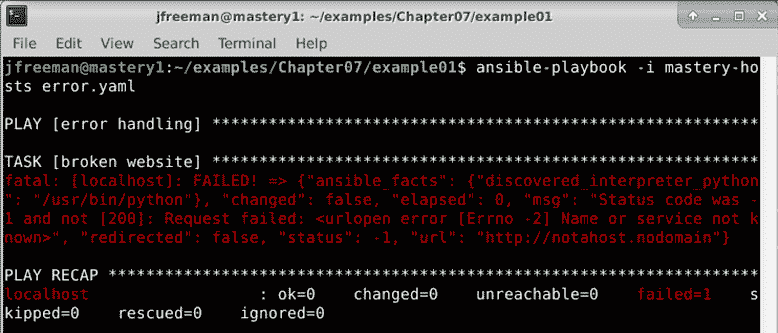

图 7.1–运行故意导致任务错误的剧本

现在，让我们想象一下，我们不想让 Ansible 停在这里，而是希望它继续下去。我们可以将`ignore_errors`条件添加到我们的任务中，如下所示:

```
  - name: broken website 
    ansible.builtin.uri: 
      url: http://notahost.nodomain 
    ignore_errors: true 
```

这一次，当我们使用与之前相同的命令运行剧本时，我们的错误将被忽略，如图*图 7.2* :

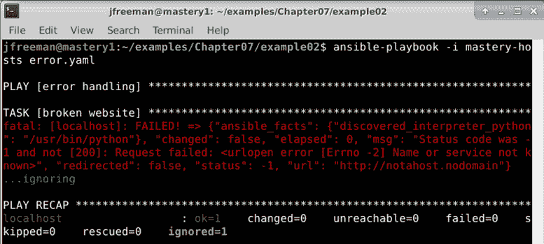

图 7.2–运行相同的剧本，但添加了忽略错误任务条件

该主机的任何进一步任务仍会尝试，并且行动手册不会注册任何失败的主机。

## 定义错误条件

`ignore_errors`条件有点生硬。任务使用的模块产生的任何错误都将被忽略。此外，乍看之下，输出仍然像一个错误，可能会让试图发现真正故障的操作员感到困惑。一个更微妙的工具是`failed_when`条件。这种情况更像是一把精细的手术刀，让剧本作者可以非常明确地知道什么构成了任务的错误。这个条件执行一个测试来产生一个布尔结果，很像`when`条件。如果条件导致布尔`true`值，任务将被视为失败。否则，任务将被视为成功。

当与`command`或`shell`模块结合使用并记录执行结果时，`failed_when`条件非常有用。许多被执行的程序可能有详细的非零退出代码，这意味着不同的事情。然而，这些 Ansible 模块都认为除`0`之外的任何东西的退出代码都是失败的。让我们看看`iscsiadm`的效用。这个实用程序可以用于许多与 iSCSI 相关的事情。为了演示，我们将替换`error.yaml`中的`uri`模块，并尝试发现任何活动的`iscsi`会话:

```
  - name: query sessions
    ansible.builtin.command: /sbin/iscsiadm -m session
    register: sessions
```

使用与之前相同的命令运行本剧本；除非您碰巧在具有活动 iSCSI 会话的系统上，否则您将会在*图 7.3* 中看到非常类似的输出:

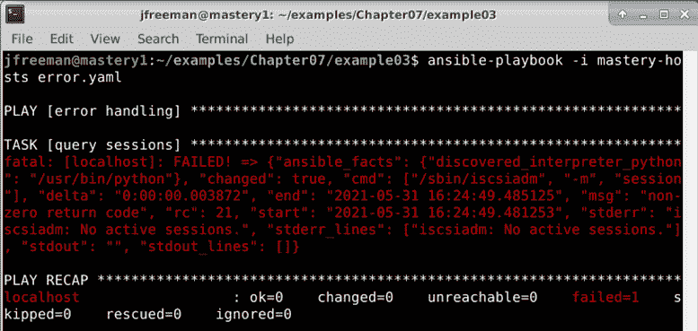

图 7.3–运行行动手册来发现活动的 iSCSI 会话，无需任何故障处理

重要说明

默认情况下`iscsiadm`工具可能不会安装，在这种情况下，您会得到与前一个不同的错误。在我们的 Ubuntu Server 20.04 测试机上，它是使用以下命令安装的:`sudo apt install open-iscsi`。

我们可以只使用`ignore_errors`条件，但这将掩盖`iscsi`的其他问题，因此我们要指示 Ansible】的退出代码是可接受的。为此，我们可以使用注册的变量来访问`rc`变量，该变量保存返回代码。我们将在`failed_when`声明中利用这一点:

```
  - name: query sessions
    command: /sbin/iscsiadm -m session
    register: sessions
    failed_when: sessions.rc not in (0, 21) 
```

我们只是说除了`0`或`21`之外的任何退出代码都应被视为失败。再次运行剧本，但这次增加了详细程度，在您的命令上使用`-v`标志，如下所示:

```
ansible-playbook -i mastery-hosts error.yaml -v
```

再次假设您没有活动的 iSCSI 会话，输出将类似于*图 7.4* 所示。使用`-v`标志当然不是强制性的，但是在这种情况下是有帮助的，因为它向我们显示了`iscsiadm`实用程序的退出代码:


图 7.4–运行相同的剧本，但根据命令退出代码处理故障

现在的输出没有显示错误，事实上，我们在结果中看到了一个新的数据键— `failed_when_result`。这说明我们的`failed_when`语句渲染的是`true`还是`false`；在这种情况下是`false`。

许多命令行工具没有详细的退出代码。事实上，大多数通常使用`0`表示成功，另一个非零代码表示所有失败类型。谢天谢地，`failed_when`语句不仅仅局限于应用的退出代码；它是一个自由形式的布尔语句，可以访问任何类型的所需数据。让我们看一个不同的问题，一个涉及`Git`的问题。我们将想象一个场景，我们希望确保某个特定的分支不存在于`Git`结账处。此任务假设在`/srv/app`目录中签出了一个`Git`存储库。删除`Git`分支的命令是`git branch -D`。让我们看看下面的代码片段:

```
  - name: delete branch bad
    ansible.builtin.command: git branch -D badfeature
    args:
      chdir: /srv/app
```

要使这段代码生效，您需要将一个`Git`存储库签出到前面的目录中。如果你没有一个可以测试的，你可以使用下面的命令很容易地创建一个(只要确保你在`/srv/app`中没有任何重要的东西会被覆盖！):

```
sudo mkdir -p /srv/app
sudo chown $USER /srv/app
cd /srv/app
git init
git commit --allow-empty -m "initial commit"
```

一旦您完成了，您就可以运行我们之前详述的更新后的行动手册任务了。像以前一样，我们将在输出中添加详细信息，以便更好地理解我们剧本的行为。

重要说明

`ansible.builtin.command`和`ansible.builtin.shell`模块使用不同的格式来提供模块参数。`ansible.buitin.command`本身以自由形式提供，而模块参数进入`args`散列。

运行所描述的剧本会产生一个错误，因为`git`会产生一个`1`的退出代码，因为分支不存在，如图*图 7.5* 所示:


图 7.5–在无错误处理的 Ansible 剧本中运行 git 命令

如你所见，错误没有被优雅地处理，并且`localhost`的播放已经被中止。

重要说明

尽管存在`ansible.builtin.git`模块，我们还是使用`ansible.builtin.command`模块轻松演示我们的主题。当处理 Git 存储库时，应该使用`ansible.builtin.git`模块。

如果没有`failed_when`和`changed_when`条件，我们将不得不创建一个两步任务组合来保护自己免受错误的影响:

```
  - name: check if branch badfeature exists
    ansible.builtin.command: git branch
    args:
      chdir: /srv/app
    register: branches
  - name: delete branch bad
    ansible.builtin.command: git branch -D badfeature
    args:
      chdir: /srv/app
    when: branches.stdout is search('badfeature')
```

在分支不存在的场景中，运行这些任务应该如图 7.6 所示:

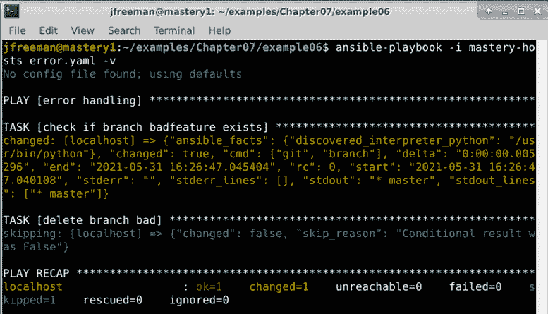

图 7.6–使用 Ansible 行动手册中的两个任务处理错误

虽然双任务集是功能性的，但效率不高。让我们对此进行改进，并利用`failed_when`功能将两项任务简化为一项:

```
  - name: delete branch bad
    ansible.builtin.command: git branch -D badfeature
    args:
      chdir: /srv/app
    register: gitout
    failed_when:
      - gitout.rc != 0
      - not gitout.stderr is search('branch.*not found')
```

重要说明

通常与`and`连接的多个条件可以表示为列表元素。这可以使行动手册更容易阅读，逻辑问题更容易找到。

我们检查命令返回代码中除`0`以外的任何内容，然后使用`search`过滤器搜索带有`branch.*not found`正则表达式的`stderr`值。我们使用 Jinja2 逻辑来组合这两个条件，它将评估为一个包含的`true`或`false`选项，如图 7.7 所示:

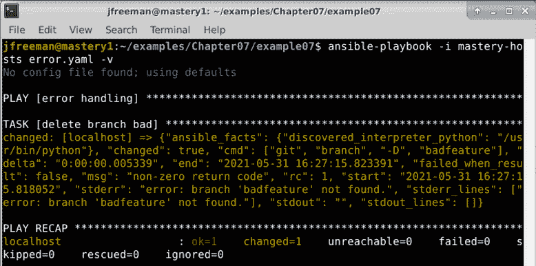

图 7.7–在 Ansible 行动手册中有效处理单个任务中的错误

这展示了我们如何在 Ansible 剧本中重新定义失败，并优雅地处理可能破坏剧本的情况。我们也可以重新定义 Ansible 认为的变化，接下来我们将看看这个。

# 定义变更

与定义任务失败类似，也可以定义什么构成了已更改的任务结果。这种能力对于`ansible.builtin.command`系列模块(`command`、`shell`、`raw`和`script`)尤其有用。与大多数其他模块不同，这个系列的模块并没有一个固有的想法，即什么是变化。事实上，除非另有指示，否则这些模块只会产生`failed`、`changed`或`skipped`。对于这些模块来说，根本没有办法假设一个变化的和不变的条件，因为不能期望它们理解或解释您可能使用它们执行的每一个可能的 shell 命令。

`changed_when`条件允许剧本作者指导模块如何解释变更。就像`failed_when`一样，`changed_when`执行一个测试来生成一个布尔结果。通常，与`changed_when`一起使用的任务是将非零退出以指示不需要做任何工作的命令；因此，通常情况下，作者会结合`changed_when`和`failed_when`来微调任务结果评估。

在我们前面的例子中，`failed_when`条件捕捉到了没有工作要做但任务仍然显示出变化的情况。我们想在退出代码`0`上注册一个变更，但不是在任何其他退出代码上。让我们扩展示例任务来实现这一点:

```
  - name: delete branch bad
    ansible.builtin.command: git branch -D badfeature
    args:
      chdir: /srv/app
    register: gitout
    failed_when:
      - gitout.rc != 0
      - not gitout.stderr is search('branch.*not found')
    changed_when: gitout.rc == 0
```

现在，如果我们在分支仍然不存在时运行我们的任务(再次向输出添加详细信息以帮助我们看到引擎盖下发生了什么)，我们将看到类似于*图 7.8* 所示的输出:


图 7.8–用一个变更时任务条件扩展我们的 Git 行动手册

注意`changed`键现在是如何具有值`false`的。

为了完整起见，我们将更改场景，以便分支确实存在并再次运行它。要创建分支，只需从`/srv/app`目录运行`git branch badfeature`。现在，我们可以再次执行我们的剧本来查看输出，现在应该类似于*图 7.9* 所示:


图 7.9–当坏特性分支存在于我们的测试存储库中时，测试相同的剧本

这次，我们的输出不一样了；它正在注册变更，`stdout`数据显示该分支正在被删除。

## 命令族的特殊处理

命令系列模块(`ansible.builtin.command`、`ansible.builtin.shell`和`ansible.builtin.script`)的一个子集有一对特殊的参数，它们将影响任务工作是否已经完成，从而影响任务是否会导致变化。选项有`creates`和`removes`。这两个参数需要一个文件路径作为值。当 Ansible 试图执行带有`creates`或`removes`参数的任务时，它将首先检查引用的文件路径是否存在。

如果路径存在并且使用了`creates`参数，Ansible 将认为工作已经完成并将返回`ok`。相反，如果路径不存在并且使用了`removes`参数，那么 Ansible 将再次认为工作已经完成，并且它将返回`ok`。任何其他组合都会导致工作实际发生。期望任务正在做的任何工作都会导致被引用文件的创建或删除。

`creates`和`removes`的便利性使开发人员不必做两个任务的组合。让我们创建一个场景，我们希望从项目根目录的`files/`子目录中运行`frobitz`脚本。在我们的场景中，我们知道`frobitz`脚本将创建一个路径，`/srv/whiskey/tango`。其实`frobitz`的来源如下:

```
#!/bin/bash 
rm -rf /srv/whiskey/tango 
mkdir -p /srv/whiskey/tango 
```

我们不希望这个脚本运行两次，因为它会破坏任何现有的数据。替换我们的`error.yaml`行动手册中的现有任务，双任务组合将如下所示:

```
  - name: discover tango directory
    ansible.builtin.stat: path=/srv/whiskey/tango
    register: tango
  - name: run frobitz
    ansible.builtin.script: files/frobitz --initialize /srv/whiskey/tango
    when: not tango.stat.exists
```

像我们到目前为止在本章中所做的那样，更加详细地运行剧本。如果`/srv/whiskey/tango`路径已经存在，输出如图*图 7.10* :

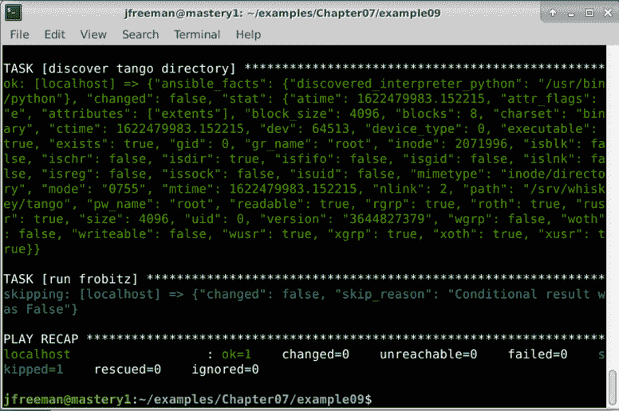

图 7.10–一个双任务游戏，仅在必要时有条件地运行破坏性脚本

如果`/srv/whiskey/tango`路径不存在，`ansible.builtin.stat`模块返回的数据会少得多，`exists`键的值为`false`。这样，我们的`frobitz`剧本就可以运行了。

现在，我们将使用`creates`将其简化为单个任务:

```
  - name: run frobitz 
    ansible.builtin.script: files/frobitz 
    args:
      creates: /srv/whiskey/tango 
```

重要说明

`ansible.builtin.script`模块实际上是一个`action_plugin`，将在 [*第十章*](10.html#_idTextAnchor183)*扩展*中讨论。

这次我们的输出会略有不同，如图*图 7.11* 所示:

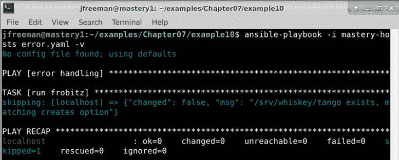

图 7.11–通过将所有任务条件合并到一个任务中，使我们之前的行动手册更加高效

在这种情况下，我们干脆跳过运行脚本，因为目录在剧本运行之前就已经存在了。这可以节省剧本执行期间的时间，还可以防止运行脚本时可能发生的任何潜在破坏性操作。

重要说明

善用`creates`和`removes`会让你的剧本保持简洁高效。

## 抑制变化

有时，完全抑制变化可能是可取的。这通常在执行命令以收集数据时使用。命令的执行实际上并没有改变什么；相反，它只是收集信息，就像`ansible.builtin.setup`模块一样。抑制此类任务的变化有助于快速确定行动手册的运行是否导致了车队的任何实际变化。

要抑制更改，只需使用`false`作为`changed_when`任务键的参数。让我们扩展之前的一个示例，以发现抑制更改的活动`iscsi`会话:

```
  - name: discover iscsi sessions
    ansible.builtin.command: /sbin/iscsiadm -m session
    register: sessions
    failed_when:
      - sessions.rc != 0
      - not sessions.stderr is
        search('No active sessions')
    changed_when: false
```

现在，无论返回数据中出现什么，Ansible 都会将任务视为`ok`而不是更改，如图*图 7.12* 所示:


图 7.12–抑制 Ansible 行动手册中的更改

因此，现在这个任务只有两种可能的状态——`failed`和`ok`。我们实际上已经否定了`changed`任务结果的可能性。当然，运行代码时的失败是生活的一部分，重要的是我们能够在行动手册中优雅地处理这些失败。在下一节中，我们将看看这是如何在 Ansible 中实现的。

# 错误恢复

虽然错误条件可以被狭义地定义，但也会有真正错误发生的时候。Ansible 提供了一种对真正的错误做出反应的方法，这种方法允许在错误发生时运行额外的任务，定义特定的任务，即使有错误也总是执行，甚至两者都执行。这个方法就是**区块**功能。

Ansible 版引入的 blocks 特性为相关的播放任务集提供了一些额外的结构。块可以将任务组合成一个逻辑单元，该逻辑单元可以将任务控制作为一个整体应用于单元(或块)。此外，一个任务块可以有可选的`rescue`和`always`部分，它们分别在出现错误的情况下执行，与错误状态无关。我们将在接下来的两个部分探讨这些是如何工作的。

## 使用救援段

块的`rescue`部分定义了任务的逻辑单元，如果在块中遇到实际故障，将执行该任务。由于 Ansible 在一个块内执行任务，像通常一样从上到下执行，当遇到实际故障时，执行将跳转到块的`rescue`部分的第一个任务(如果存在；该部分是可选的)。然后，从上到下执行任务，直到到达`rescue`部分的末尾或遇到另一个错误。

在`rescue`部分完成后，任务执行将继续执行块后的任何内容，就好像没有错误一样。这提供了一种优雅地处理错误的方法，允许定义`cleanup`任务，以便系统不会处于完全崩溃的状态，并且游戏的其余部分可以继续。这比基于错误状态的一组复杂的任务注册结果和任务条件要干净得多。

为了演示这一点，让我们在一个块内创建一个新的任务集。该任务集中有一个未处理的错误，将导致执行切换到`rescue`部分，我们将从这里执行`cleanup`任务。

我们还将在块之后提供一个任务，以确保继续执行。我们将重复使用`error.yaml`剧本:

```
---
- name: error handling
  hosts: localhost
  gather_facts: false
  tasks:
  - block:
      - name: delete branch bad
        ansible.builtin.command: git branch -D badfeature
        args:
          chdir: /srv/app
      - name: this task is lost
        ansible.builtin.debug:
          msg: "I do not get seen"
```

在`block`部分列出的两个任务按照它们列出的顺序执行。如果其中一个产生`failed`结果，将执行`rescue`块中显示的以下代码:

```
    rescue:
      - name: cleanup task
        ansible.builtin.debug:
          msg: "I am cleaning up"
      - name: cleanup task 2
        ansible.builtin.debug:
          msg: "I am also cleaning up"
```

最后，不管前面的任务是什么，都会执行这个任务。请注意，较低的缩进级别意味着它与块在同一级别运行，而不是作为`block`结构的一部分运行:

```
  - name: task after block
    ansible.builtin.debug:
      msg: "Execution goes on" 
```

尝试执行此剧本以观察其行为；像我们在本章中所做的那样，在输出中添加详细信息，以帮助您理解正在发生的事情。这部剧执行的时候，第一个任务会出错，第二个任务会被忽略。继续执行`cleanup`任务，如图 7.13 所示:


图 7.13–执行包含带有救援部分的区块的行动手册

不仅段被执行了`rescue`段，其余的戏也完成了，整个`ansible-playbook`执行被认为是成功的，尽管前面的任务在街区内失败了。让我们在下一节中通过查看一个块的`always`部分来构建这个示例。

## 使用始终部分

除了`rescue`之外，我们还可以使用另一个版块，命名为`always`。不管是否有错误，块的这一部分将总是被执行。这个特性对于确保系统的状态始终保持正常是很方便的，不管一组任务是否成功。由于一个块的某些任务可能由于错误而被跳过，并且`rescue`部分仅在出现错误时被执行，`always`部分在每个实例中提供任务执行的保证。

让我们扩展前面的示例，并在我们的块中添加一个`always`部分:

```
    always:
      - name: most important task
        ansible.builtin.debug:
          msg: "Never going to let you down"
```

像上一节一样重新运行我们的行动手册，我们会看到显示的附加任务，如*图 7.14* 所示:

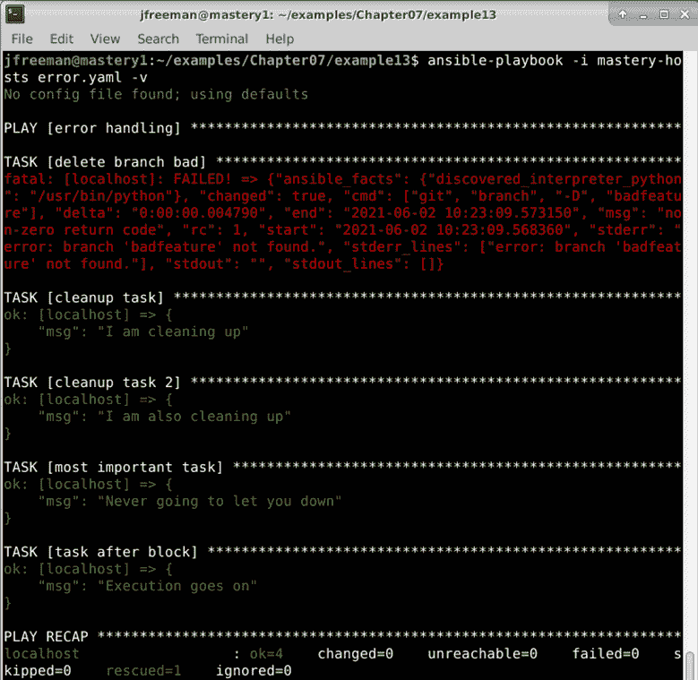

图 7.14–运行包含包含救援和始终部分的区块的 Ansible 行动手册

为了验证`always`部分确实总是执行，我们可以改变玩法，以便使用我们在前面部分*中开发的任务条件定义错误条件*来认为 Git 任务是成功的。下面的代码片段显示了修改后剧本的第一部分，供您参考:

```
---
- name: error handling
  hosts: localhost
  gather_facts: false
  tasks:
  - block:
      - name: delete branch bad
        ansible.builtin.command: git branch -D badfeature
        args:
          chdir: /srv/app
        register: gitout
        failed_when:
          - gitout.rc != 0
          - not gitout.stderr is search('branch.*not found')
```

注意改变了`failed_when`条件，这将使`git`命令运行而不被视为失败。剧本的其余部分(到目前为止，应该已经在前面的例子中构建好了)保持不变。

这一次，当我们执行剧本时，我们的`rescue`部分被跳过，我们先前被错误掩盖的任务被执行，我们的`always`块仍然被执行，如图 7.15 所示:

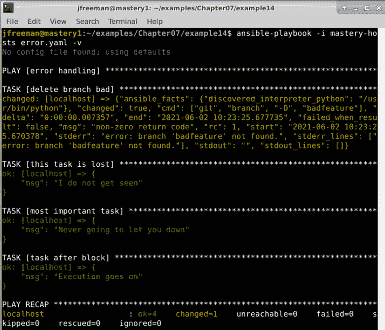

图 7.15–执行包含带有救援和始终部分但没有任务错误的区块的行动手册

还要注意我们之前丢失的任务现在被执行了，因为`delete branch bad`任务的失败条件被改变了，所以它在这次游戏中不再失败。以类似的方式，我们的`rescue`部分不再需要，所有其他任务(包括`always`部分)按预期完成。在 Ansible 中错误恢复的最后一部分，我们将看到如何处理不可靠环境导致的错误。

## 处理不可靠的环境

到目前为止，在这一章中，我们已经关注了优雅地处理错误，以及改变 Ansible 关于改变和失败的默认行为。这对于任务来说都很好，但是如果你在一个不可靠的环境中运行 Ansible 呢？例如，较差或短暂的连接可能被用来连接到受管理的主机，或者主机可能由于某种原因而定期停机。后一个示例可能是一个动态扩展的环境，它可以在高负载时进行扩展，在需求较低时进行缩减以节省资源，因此您无法保证所有主机始终可用。

幸运的是，playbook 关键字`ignore_unreachable`正好处理这些情况，并确保在我们的清单上尝试所有任务，即使是在任务执行期间被标记为不可访问的主机。这与默认行为形成对比，在默认行为中，一旦出现第一个错误，Ansible 将停止处理给定主机的任务。因为在很多情况下，这最好通过一个例子来解释，所以让我们重复使用`error.yaml`剧本来创建这样一个案例:

```
---
- name: error handling
  hosts: all
  gather_facts: false
  tasks:
  - name: delete branch bad
    ansible.builtin.command: git branch -D badfeature
    args:
      chdir: /srv/app
  - name: important task
    ansible.builtin.debug:
      msg: It is important we attempt this task!
```

我们将尝试从清单中定义的两个远程主机上的 Git 存储库中删除`badfeature`分支。这个清单看起来与我们在本书中使用的其他清单略有不同，因为我们将故意创建两个不可访问的虚拟主机。您实际上称这些主机为什么，或者您定义了什么样的 IP 地址并不重要，但是为了使示例如本节所述那样工作，主机必须是不可到达的。我的库存文件如下所示:

```
[demo]
mastery.example.com ansible_host=192.168.10.25
backend.example.com ansible_host=192.168.10.26
```

由于我们已经故意创建了一个不存在的主机清单，我们知道一旦尝试第一个任务，它们就会被标记为`unreachable`。尽管如此，还有第二个任务，如果可能的话，绝对必须尝试。让我们照原样运行剧本，看看会发生什么；输出应该类似于*图 7.16* 所示:

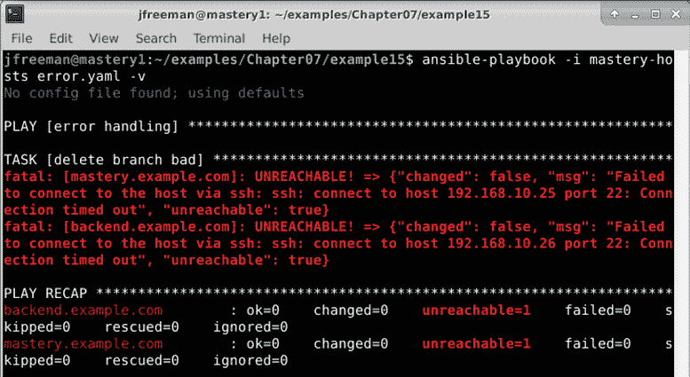

图 7.16–尝试在主机不可达的清单上进行两个任务的游戏

从输出中可以看到，名为`important task`的任务从未尝试过——由于主机不可访问，播放在第一个任务后中止。但是，让我们使用我们新发现的标志来改变这种行为。更改代码，使其看起来像下面的代码:

```
---
- name: error handling
  hosts: all
  gather_facts: false
  tasks:
  - name: delete branch bad
    ansible.builtin.command: git branch -D badfeature
    args:
      chdir: /srv/app
    ignore_unreachable: true
  - name: important task
    ansible.builtin.debug:
      msg: It is important we attempt this task!
```

这一次，请注意，即使第一次尝试无法访问主机，我们的第二个任务仍然会执行，如图 7.17 所示:


图 7.17–在不可到达的主机上尝试同样的双任务游戏，但这次忽略了可达性

如果像`debug`命令一样，它可能在本地运行，或者它是至关重要的，即使第一次尝试时连接中断，也应该尝试连接，那么就很有用。到目前为止，在本章中，您已经了解了 Ansible 提供的工具，可以轻松处理各种错误情况。接下来，我们将继续研究使用循环来控制任务流——这是一个特别重要的工具，可以使代码简洁并防止重复。

# 循环迭代任务

循环值得在本章中特别提及。到目前为止，我们专注于以自上而下的方式控制剧本的流程——我们改变了剧本运行时可能评估的各种条件，我们还专注于创建简洁、高效的代码。然而，如果您有一个单一的任务，但是需要针对一个数据列表运行它，会发生什么；例如，创建几个用户帐户、目录或更复杂的东西？

在 Ansible 2.5 中，循环发生了变化——在此之前，循环通常是用诸如`with_items`这样的关键字创建的，您可能仍然会在遗留代码中看到这一点。虽然仍有一些向后兼容性，但建议转到更新的`loop`关键字。

让我们举一个简单的例子——我们需要创建两个目录。如下创建`loop.yaml`:

```
---
- name: looping demo
  hosts: localhost
  gather_facts: false
  become: true
  tasks:
  - name: create a directory
    ansible.builtin.file:
      path: /srv/whiskey/alpha
      state: directory
  - name: create another directory
    ansible.builtin.file:
      path: /srv/whiskey/beta
      state: directory
```

当我们运行这个时，正如预期的那样，我们的两个目录被创建，如图 7.18 所示:

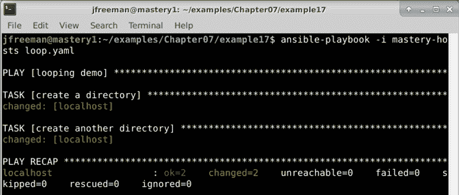

图 7.18–运行一个简单的剧本来创建两个目录

但是，你可以看到这段代码是重复的、低效的。相反，我们可以把它改成这样:

```
---
- name: looping demo
  hosts: localhost
  gather_facts: false
  become: true
  tasks:
  - name: create a directory
    ansible.builtin.file:
      path: "{{ item }}"
      state: directory
    loop:
      - /srv/whiskey/alpha
      - /srv/whiskey/beta
```

请注意特殊`item`变量的使用，该变量现在用于定义从任务底部处的`loop`项开始的路径。现在，当我们运行这个代码时，输出看起来有些不同，如*图 7.19* 所示:

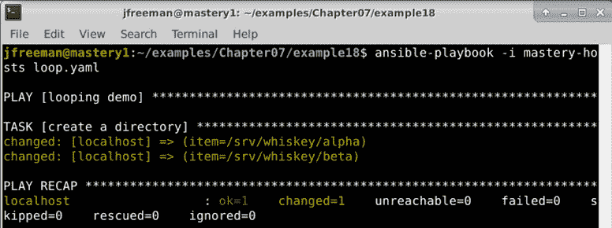

图 7.19–创建相同的两个目录的行动手册，但这次使用循环来提高代码效率

这两个目录仍然像以前一样创建，但这次是在一个任务中。这使得我们的行动手册更加简洁高效。Ansible 提供了许多更强大的循环选项，包括嵌套循环和创建循环的能力，这些循环将持续到满足给定的标准(在其他语言中通常称为`do until`循环)，而不是特定的有限数据集。

`do until`循环在等待满足某个条件时非常有用。例如，如果我们想等到一个标志文件被写入文件系统，我们可以使用`ansible.builtin.stat`模块来查询文件，将模块运行的结果注册到一个变量中，然后循环运行，直到满足文件存在的条件。下面的代码片段完全显示了这一点——它将循环(`retries`)五次，每次重试之间有 10 秒钟的延迟:

```
    - name: Wait until /tmp/flag exists
      ansible.builtin.stat:
        path: /tmp/flag
      register: statresult
      until: statresult.stat.exists
      retries: 5
      delay: 10
```

嵌套循环可以用两种方法之一来创建——要么通过迭代嵌套列表，要么通过迭代包含的任务文件。例如，让我们假设我们想要创建两个新文件，每个文件位于两个路径中(由 Ansible 中的两个列表定义)。我们的代码可能如下所示:

```
---
- name: Nested loop example
  hosts: all
  gather_facts: no
  vars:
    paths:
      - /tmp
      - /var/tmp
    files:
      - test1
      - test2
  tasks:
    - name: Create files with nested loop
      ansible.builtin.file:
        path: "{{ item[0] }}/{{ item[1] }}"
        state: touch
      loop: "{{ paths | product(files) | list }}"
```

这里，我们让使用`product` Jinja2 过滤器从两个变量列表中创建一个嵌套列表，然后`loop`忠实地为我们迭代。运行该剧本应产生类似于*图 7.20* 中的输出:


图 7.20–使用产品 Jinja2 过滤器构建的嵌套循环运行剧本

您也可以通过在外部循环中包含外部任务文件，然后在任务文件中放置内部循环来创建嵌套循环。现在，如果您不做任何进一步的事情就这样做，两个循环都将使用`item`循环变量，这当然会发生冲突。为了防止这成为问题，有必要使用一个特殊的`loop_control`参数来更改外部循环的循环变量名。因此，使用与之前相同的头代码和变量，我们可以将原始任务更改为以下内容:

```
    - name: Create files with nested loop
      ansible.builtin.include_tasks: createfile.yml
      loop: "{{ paths }}"
      loop_control:
        loop_var: pathname
```

包含的任务文件将如下所示:

```
---
- name: Create a file
  ansible.builtin.file:
    path: "{{ pathname }}/{{ item }}"
    state: touch
  loop: "{{ files }}"
```

这段代码执行的功能与第一个嵌套的循环示例完全相同，但是有点麻烦，因为它需要一个外部任务文件。另外，从*图 7.21* 的截图中你会看到它的操作方式有些不同。当您构建嵌套循环时，这一点很重要，因为这可能(也可能不是)您想要的:


图 7.21–使用 loop_control 变量，通过包含的任务文件在 Ansible 中构建嵌套循环

可以说，虽然阅读这种格式更容易，但最终由你来决定你更喜欢哪一种来满足你的需求，事实上，一种是否比另一种更适合你。循环创建技术和参数的完整细节可在此处的 Ansible 文档中获得:[https://docs . ansi ble . com/ansi ble/latest/user _ guide/playbooks _ loops . html](https://docs.ansible.com/ansible/latest/user_guide/playbooks_loops.html)。

# 总结

在本章中，您学习了如何定义特定任务运行时 Ansible 如何感知失败或变化，如何使用块来优雅地处理错误和执行清理，以及如何使用循环编写紧凑、高效的代码。

因此，您现在应该能够更改任何给定的任务，以提供特定的条件，在这些条件下，Ansible 将失败或认为更改成功。正如我们在本章中所展示的，这在运行 shell 命令时非常有价值，在为现有模块定义专门的用例时也是如此。现在，您还应该能够将 Ansible 任务组织成块，确保如果出现故障，可以采取不需要运行的恢复操作。最后，您现在应该能够使用循环编写紧凑、高效的 Ansible 行动手册，消除对重复代码和冗长、低效行动手册的需求。

在下一章中，我们将探讨如何使用角色来组织任务、文件、变量和其他内容。

# 问题

1.  By default, Ansible will stop processing further tasks for a given host after the first failure occurs:

    真的

    假的

2.  The `ansible.builtin.command` and `ansible.builtin.shell` modules' default behavior is to only ever give a task status of `changed` or `failed`:

    真的

    假的

3.  You can store the results from a task using which Ansible keyword?

    a) `store:`

    b) `variable:`

    c) `register:`

    d) `save:`

4.  Which of the following directives can be used to change the failure condition of a task?

    a) `error_if:`

    b) `failed_if:`

    c) `error_when:`

    d) `failed_when:`

5.  You can combine multiple conditional statements in Ansible using which of the following?

    a) `and`

    b) `or`

    c)YAML 列表格式(与逻辑`AND`相同)

    所有上述内容

6.  Changes can be suppressed with which of the following?

    a) `suppress_changed: true`

    b) `changed_when: false`

    c) `changed: false`

    d) `failed_when: false`

7.  In a `block` section, all tasks are executed in order on all hosts:

    a)直到第一个错误发生

    不管任何错误情况

8.  Which optional section of a block gets run only if an error occurs in the block tasks?

    a) `recover`

    b) `rescue`

    c) `always`

    d) `on_error`

9.  Tasks in the `always` section of a block are run:

    a)无论区块任务或`rescue`部分发生了什么

    b)仅当`rescue`部分未运行时

    只有在没有遇到错误的情况下

    d)当用户手动调用时

10.  The default name of the variable referencing the current element of a loop is:

    a) `loopvar`

    b) `loopitem`

    c) `item`

    d) `val`