# 八、使用角色组合可重用的 Ansible 内容

对于许多项目来说，一个简单、单一的**Ansible 的**剧本可能就足够了。随着时间的推移和项目的增长，会添加额外的行动手册和可变文件，并且任务文件可能会被拆分。组织内的其他项目可能希望重用一些内容，要么将项目添加到目录树中，要么将所需内容复制到多个项目中。随着场景的复杂性和规模的增长，除了松散组织的几本剧本、任务文件和可变文件之外，还需要更多的东西。创建这样的层次结构可能会令人望而生畏，这可能解释了为什么许多 Ansible 实现从简单开始，只有当分散的文件变得难以维护和维护时才变得更有组织性。进行迁移可能很困难，可能需要重写行动手册的重要部分，这可能会进一步延迟重组工作。

在本章中，我们将介绍 Ansible 中可组合、可重用和组织良好的内容的最佳实践。本章中所学到的经验教训将帮助开发人员设计出随项目一起成长的 Ansible 内容，从而避免以后进行困难的重新设计工作。以下是我们将要介绍的内容的概要:

*   任务、处理程序、变量和剧本包含概念
*   角色(结构、默认值和依赖关系)
*   设计顶层行动手册以利用角色
*   跨项目共享角色(通过 Galaxy 的依赖关系；类似 Git 的存储库)

# 技术要求

按照本章中给出的示例，您将需要一台运行 **Ansible 4.3** 或更新版本的 Linux 机器。几乎任何风格的 Linux 都可以——对于那些对细节感兴趣的人来说，除非另有说明，本章中给出的所有代码都在 **Ubuntu Server 20.04 长期支持** ( **LTS** )和 Ansible 4.3 上进行了测试。

本章附带的示例代码可通过以下链接从 GitHub 下载:[https://GitHub . com/packt publishing/Mastering-Ansible-第四版/tree/main/Chapter08](https://github.com/PacktPublishing/Mastering-Ansible-Fourth-Edition/tree/main/Chapter08) 。

查看以下视频，了解《行动守则》:[https://bit.ly/3E0mmIX](https://bit.ly/3E0mmIX)。

# 任务、处理程序、变量和剧本包含概念

第一步了解如何有效地组织一个 Ansible 的项目结构是掌握包含文件的概念。包含文件的行为允许在特定于主题的文件中定义内容，该文件可以在项目中一次或多次包含在其他文件中。这个包含特性支持**不重复自己** ( **DRY** )的概念。

## 包括任务

任务文件是定义一个或多个任务的 **YAML 非标记语言** ( **YAML** )文件。这些任务与任何特定的剧本或剧本没有直接联系；它们纯粹作为任务列表而存在。这些文件可以通过`include`操作符被**行动手册**或其他任务文件引用。现在，您可能期望`include`运算符本身就是 Ansible 的关键字——然而，事实并非如此；它实际上是一个类似于`ansible.builtin.debug`的模块。为了简明起见，我们在本章中将其称为`include`运算符，但是在我们这样说的时候，您的代码实际上会包含**完全限定的集合名称**(**FQCN**—参见 [*第 2 章*](02.html#_idTextAnchor047) 、*从早期 Ansible 版本*迁移而来)，这就是`ansible.builtin.include`。你很快就会看到这一点，所以不要担心——这一切很快就会有意义！这个操作符取一个任务文件的路径，我们在 [*第一章*](01.html#_idTextAnchor015)*ansi ble*的系统架构与设计中了解到，路径可以是相对于引用它的文件的。

为了演示如何使用`include`操作符来包含任务，让我们创建一个简单的游戏，其中包含一个任务文件，其中包含一些调试任务。首先，让我们编写我们的剧本文件，我们称之为`includer.yaml`，如下所示:

```
--- 
- name: task inclusion 
  hosts: localhost 
  gather_facts: false 

  tasks: 
  - name: non-included task
    ansible.builtin.debug:
      msg: "I am not included"
  - ansible.builtin.include: more-tasks.yaml
```

接下来，我们将创建一个`more-tasks.yaml`文件，您可以在`include`语句中看到它的引用。这应该在保存`includer.yaml`的同一个目录中创建。代码为，如下图所示:

```
--- 
- name: included task 1 
  ansible.builtin.debug: 
    msg: "I am the first included task" 

- name: included task 2 
  ansible.builtin.debug: 
    msg: "I am the second included task" 
```

现在，我们可以使用以下命令执行我们的行动手册来观察输出:

```
ansible-playbook -i mastery-hosts includer.yaml
```

如果一切顺利，您应该会看到类似如下的输出:


图 8.1–执行包含单独任务文件的可执行行动手册

从`include`文件执行中我们可以清楚的看到我们的任务。因为在该剧的`tasks`部分使用了`include`操作符，所以包含的任务在该剧中执行。事实上，如果我们在`include`操作符之后添加一个任务，如下面的代码片段所示，我们会看到执行顺序如下，就好像包含文件中的所有任务都存在于使用`include`操作符的位置:

```
  tasks:
  - name: non-included task
    ansible.builtin.debug:
      msg: "I am not included"
  - ansible.builtin.include: more-tasks.yaml
  - name: after-included tasks
    ansible.builtin.debug:
      msg: "I run last"
```

如果我们使用与之前相同的命令运行修改后的剧本，我们将看到我们期望的任务顺序，如下图所示:


图 8.2–演示使用 include 运算符的行动手册中的任务执行顺序

通过将这些任务分解到它们自己的文件中，我们可以多次将它们包含在多个行动手册中。如果我们需要修改其中一个任务，我们只需要修改一个文件，不管这个文件被引用了多少地方都不需要。

### 将变量值传递给包含的任务

有时，我们想要分割出一组任务，但根据可变数据，这些任务的行为略有不同。`include`运算符允许我们在包含时定义和覆盖变量数据。定义的范围仅在包含的任务文件(以及文件本身可能包含的任何其他文件)内。

为了说明这种能力，让我们创建一个新的场景，其中我们需要接触几个文件，每个文件都在它们自己的目录路径中。我们不是为每个文件编写两个文件任务(一个创建目录，另一个接触文件)，而是为每个任务创建一个任务文件，在任务中使用变量名。然后，我们将包含任务文件两次，每次传入不同的数据。首先，我们将使用`files.yaml`任务文件进行操作，如下所示:

```
---
- name: create leading path
  ansible.builtin.file:
    path: "{{ path }}"
    state: directory
- name: touch the file
  ansible.builtin.file:
    path: "{{ path + '/' + file }}"
    state: touch
```

接下来，我们将修改我们的`includer.yaml`行动手册，以包括我们刚刚创建的任务文件，传递`path`和`file`变量的变量数据，如下所示:

```
---
- name: touch files
  hosts: localhost
  gather_facts: false
  tasks:
  - ansible.builtin.include: files.yaml
    vars:
      path: /tmp/foo
      file: herp
  - ansible.builtin.include: files.yaml
    vars:
      path: /tmp/foo
      file: derp
```

重要说明

包含文件时提供的变量定义可以是`key=value`的内嵌格式，也可以是`vars`哈希中的`key: value`的图示 YAML 格式。

当我们运行这个剧本时，我们将看到四个任务被执行:两次来自包含的`files.yaml`文件中的两个任务。第二个集合应该只导致一次更改，因为两个集合的路径是相同的，并且应该在第一次执行任务时创建。通过使用以下命令，以更详细的方式运行行动手册，以便我们可以看到更多关于幕后发生的事情:

```
ansible-playbook -i mastery-hosts includer.yaml -v
```

运行此剧本的输出应该如下所示:

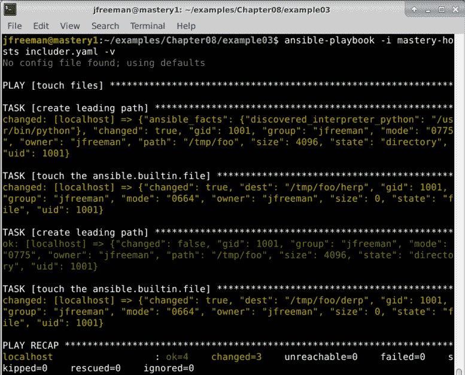

图 8.3–运行一个剧本，其中一个任务文件包含两次不同的变量数据

从这里可以看到，创建一个前导路径和一个文件的代码正在被重用，只是每次使用不同的值，这使得我们的代码维护起来非常高效。

### 将复杂数据传递给包含的任务

当希望将复杂的数据传递给包含的任务，例如列表或散列时，可以在包含文件时使用替代语法。让我们重复前面的场景，只是这一次我们不再包含任务文件两次，而是包含一次并传递路径和文件的散列。首先，我们将重新创建`files.yaml`文件，如下所示:

```
--- 
- name: create leading path 
  ansible.builtin.file: 
    path: "{{ item.value.path }}" 
    state: directory 
  loop: "{{ files | dict2items }}" 

- name: touch the file 
  ansible.builtin.file: 
    path: "{{ item.value.path + '/' + item.key }}" 
    state: touch 
  loop: "{{ files | dict2items }}" 
```

现在，我们将修改我们的`includer.yaml`剧本，在单个`ansible.builtin.include`语句中提供文件的散列，如下所示:

```
---
- name: touch files
  hosts: localhost
  gather_facts: false
  tasks:
  - ansible.builtin.include: files.yaml
    vars:
      files:
        herp:
          path: /tmp/foo
        derp:
          path: /tmp/foo
```

如果我们像以前一样运行这个新的剧本和任务文件，我们应该会看到一个类似但略有不同的输出，其最终结果是`/tmp/foo`目录已经就位，并且两个`herp`和`derp`文件被创建为内部的空文件(被触摸)，如下图所示:

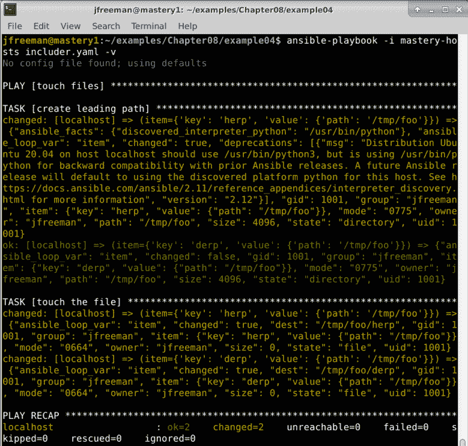

图 8.4–将复杂数据传递到 Ansible 游戏中包含的任务文件

使用这种传递散列数据的方式允许一组创建的事物的增长，而不必增加主剧本中`include`语句的数量。

### 条件任务包括

类似于将数据传递到包含文件中，条件也可以传递到包含文件中。这是通过向`include`操作员附加一条`when`语句来实现的。该条件不会导致 Ansible 评估测试以确定是否应该包含该文件；相反，它指示 Ansible 将条件添加到包含的文件(以及所述文件可能包含的任何其他文件)中的每个任务。

重要说明

不可能有条件地包含文件。文件将始终包含在内；但是，任务条件可以应用于中的每个任务。

让我们通过修改包含简单调试语句的第一个示例来演示这一点。我们将添加一个条件，并传递一些数据供条件使用。首先修改`includer.yaml`剧本，如下:

```
---
- name: task inclusion
  hosts: localhost
  gather_facts: false
  tasks:
  - ansible.builtin.include: more-tasks.yaml
    when: item | bool
    vars:
      a_list:
        - true
        - false
```

接下来，让我们修改`more-tasks.yaml`来循环每个任务中的`a_list`变量，如下所示:

```
---
- name: included task 1
  ansible.builtin.debug:
    msg: "I am the first included task"
  loop: "{{ a_list }}"
- name: include task 2
  ansible.builtin.debug:
    msg: "I am the second included task"
  loop: "{{ a_list }}"
```

现在，让我们使用与之前相同的命令运行剧本，并查看我们的新输出，它应该如下所示:


图 8.5–将条件应用于包含文件中的所有任务

我们可以看到每个任务都有一个跳过的迭代，迭代中`item`被评估为`false`布尔值。请务必记住，所有主机都将评估所有包含的任务。没有办法影响 Ansible 不包含主机子集的文件。最多可以将一个条件应用于`include`层次结构中的每个任务，以便可以跳过包含的任务。包含基于主机事实的任务的一种方法是利用`ansible.builtin.group_by`动作插件基于主机事实创建动态组。然后，你可以给小组自己的剧本，包括具体的任务。这是留给你的练习。

### 标记包含的任务

当包含任务文件时，可以标记文件中的所有任务。`tags`键用于定义一个或多个标签，以应用于`include`层次结构中的所有任务。在`include`时间进行标记的能力可以保持任务文件本身不受关于任务应该如何标记的限制，并且可以允许一组任务被包括多次，但是传递不同的数据和标记。

重要说明

标签可以在`include`语句中定义，也可以在游戏本身中定义，以涵盖给定游戏中的所有内容(和其他任务)。

让我们创建一个简单的演示来说明如何使用标签。我们将从编辑我们的`includer.yaml`文件开始，创建一个包含两个任务文件的剧本，每个文件都有不同的标签名和不同的变量数据。代码如以下片段所示:

```
---
- name: task inclusion
  hosts: localhost
  gather_facts: false
  tasks:
  - ansible.builtin.include: more-tasks.yaml
    vars:
      data: first
    tags: first
  - ansible.builtin.include: more-tasks.yaml
    vars:
      data: second
    tags: second
```

现在，我们将更新`more-tasks.yaml`来处理所提供的数据，如下所示:

```
---
- name: included task
  ansible.builtin.debug:
    msg: "My data is {{ data }}"
```

如果我们在没有选择标签的情况下运行这个剧本，我们会看到这个任务运行两次，如下图截图所示:

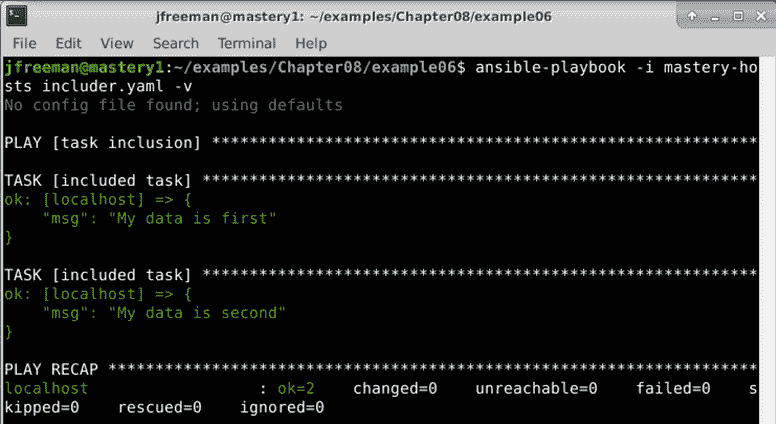

图 8.6–运行带有标记包含任务的行动手册，但未启用任何基于标记的过滤

现在，我们可以通过改变我们的`ansible-playbook`参数来选择运行哪个标签——比如说第二个标签，如下所示:

```
ansible-playbook -i mastery-hosts includer.yaml -v --tags second
```

在这种情况下，我们应该只看到正在运行的包含任务的出现，如下图所示:

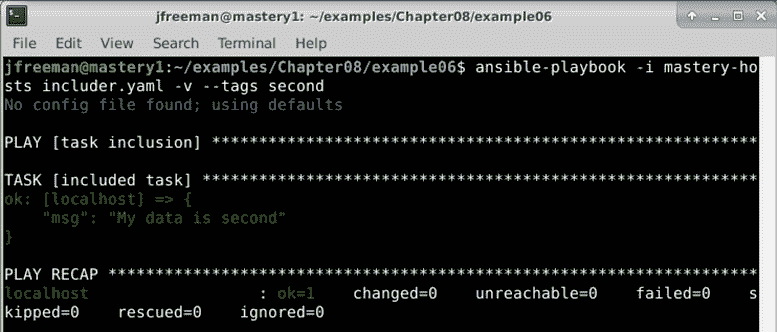

图 8.7–运行标记有包含任务的行动手册，仅运行标记为“秒”的任务

我们的示例使用`--tags`命令行参数来指示要运行的标记任务。另一个不同的论点`--skip-tags`，允许表达相反的意思——或者换句话说，标记任务不运行。

## 带有循环的任务包含

任务包含也可以和循环结合。当添加一个`loop`实例到一个任务包含(或者一个`with_`循环，如果使用比 2.5 更早的 Ansible 版本)，文件中的任务将使用`item`变量执行，该变量保存当前循环的值。整个`include`文件将重复执行，直到循环耗尽所有项目。让我们更新我们的示例来演示这一点，如下所示:

```
---
- name: task inclusion
  hosts: localhost
  gather_facts: false
  tasks:
  - ansible.builtin.include: more-tasks.yaml
    loop:
      - one
      - two
```

我们还需要更新我们的`more-tasks.yaml`文件来使用循环`item`变量，如下所示:

```
--- 
- name: included task 1 
  ansible.builtin.debug: 
    msg: "I am the first included task with {{ item }}"
- name: included task 2 
  ansible.builtin.debug: 
    msg: "I am the second included task with {{ item }}" 
```

当以更高的详细度执行时，我们可以看出对于循环中的每个`item`变量，任务`1`和`2`被执行一次，如下图所示:


图 8.8–循环运行包含的任务文件

在**夹杂物**上循环是一个强大的概念，但它确实引入了一个问题。如果包含的文件中有一些任务有自己的循环呢？`item`变量会发生碰撞，产生意想不到的结果。因此，在 2.1 版本中`loop_control`功能被添加到 Ansible 中。除此之外，这个特性提供了一个方法来命名用于循环的变量，而不是默认的`item`。利用这一点，我们可以区分包含之外的`item`实例和`include`语句中使用的任何`item`变量。为了演示这一点，我们将在外部`include`语句中添加一个`loop_var`循环控制，如下所示:

```
---
- name: task inclusion
  hosts: localhost
  gather_facts: false
  tasks:
    - ansible.builtin.include: more-tasks.yaml
      loop:
        - one
        - two
      loop_control:
        loop_var: include_item
```

在`more-tasks.yaml`内部，我们将有一个带有自己循环的任务，利用`include_item`和本地`item`变量，如下所示:

```
--- 
- name: included task 1 
  ansible.builtin.debug: 
    msg: "I combine {{ item }} and {{ include_item }}" 
  loop: 
    - a 
    - b 
```

执行时，我们看到每个包含循环执行两次`task 1`，并且使用了两个`loop`变量，如下图所示:

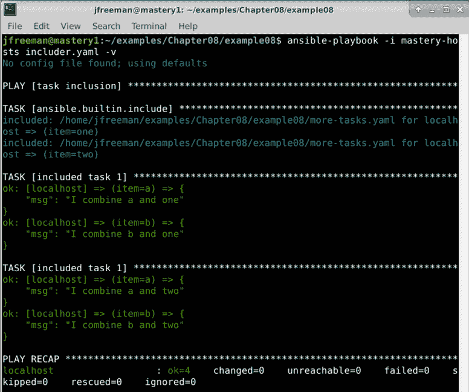

图 8.9–在包含的任务文件中运行嵌套循环，避免循环变量名冲突

其他循环控制也存在，例如`label`，它将为`item`值定义任务输出中屏幕上显示的内容(用于防止大数据结构扰乱屏幕)，以及`pause`，它提供了在每个循环之间暂停定义的秒数的能力。

## 包括经手人

**处理者**本质上是的任务。它们是由其他任务的通知触发的一组潜在任务。因此，可以像常规任务一样包含处理程序任务。`include`操作员在`handlers`区块内是合法的。

与任务包含不同，当包含`handler`任务时，变量数据不能传递。但是，可以给`handler`包含附加一个条件，将该条件应用于文件中的每个`handler`任务。

让我们创建一个示例来演示这一点。首先，我们将创建一个剧本，其中有一个总是会改变的任务，包括一个`handler`任务文件，并在其中附加一个条件。下面的代码片段演示了该代码:

```
--- 
- name: touch files 
  hosts: localhost 
  gather_facts: false 

  tasks:
  - name: a task
    ansible.builtin.debug:
      msg: "I am a changing task"
    changed_when: true
    notify: a handler
  handlers:
  - ansible.builtin.include: handlers.yaml
    when: foo | default('true') | bool
```

重要说明

评估可能在剧本之外定义的变量时，最好使用`bool`过滤器，以确保字符串被正确转换为其布尔含义。

接下来，我们将创建一个`handlers.yaml`文件来定义我们的`handler`任务，如下所示:

```
---
- name: a handler
  ansible.builtin.debug:
    msg: "handling a thing"
```

如果我们在不提供任何进一步数据的情况下执行这个剧本，我们应该会看到我们的`handler`任务触发器，如下图所示:


图 8.10–使用 include 运算符从任务文件中运行处理程序

现在，让我们再次运行剧本；这一次，我们将把`foo`定义为`extra-var`(覆盖它的所有其他实例)，并在我们的`ansible-playbook`执行参数中将其设置为`false`，如下所示:

```
ansible-playbook -i mastery-hosts includer.yaml -v -e foo=false
```

这一次，输出会有些不同，如下图所示:


图 8.11–运行相同的游戏，但这次强制 foo 条件变量为 false

当`foo`将评估为`false`时，我们包含的处理程序在这一轮剧本中被跳过了。

## 包括变量

**变量**数据也可以分离成可加载的文件。这允许跨多个剧本或剧本共享变量，或者包含项目目录之外的变量数据(例如机密数据)。变量文件是简单的 **YAML 格式的**文件，提供键和值。与任务包含文件不同，变量包含文件不能包含更多文件。

变量可以通过三种不同的方式包含:通过`vars_files`、通过`include_vars`或通过`--extra-vars` ( `-e`)。

### vars _ files

`vars_files`键是一个的玩法指令。它定义了一个文件列表，可以从中读取变量数据。这些文件在剧本本身被解析时被读取和解析。就像包含任务和处理程序一样，路径是相对于引用文件的文件的。

下面是一个从文件中加载变量的示例播放:

```
--- 
- name: vars 
  hosts: localhost 
  gather_facts: false 

  vars_files:
  - variables.yaml
  tasks:
  - name: a task
    ansible.builtin.debug:
      msg: "I am a {{ varname }}" 
```

现在，我们需要在与我们的行动手册相同的目录中创建一个`variables.yaml`文件，如下所示:

```
---
varname: derp 
```

用我们通常的命令运行剧本会显示`varname`变量值来自`variables.yaml`文件，如下图所示:

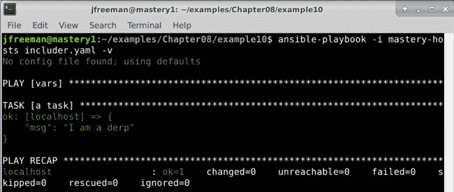

图 8.12–使用 vars_files 指令在游戏中包含变量

这当然是一个非常简单的例子，但是它清楚地展示了从一个单独的文件中导入变量的容易程度。

### 动态 vars _ files 包含

在某些场景中，可能需要参数化要加载的变量文件。这可以通过使用一个变量作为文件名的一部分来实现；但是，变量必须具有解析 playbook 时定义的值，就像在任务名称中使用变量一样。让我们更新我们的示例，根据执行时提供的数据加载一个变量文件，如下所示:

```
--- 
- name: vars 
  hosts: localhost 
  gather_facts: false 

  vars_files:
  - "{{ varfile }}"
  tasks:
  - name: a task
    ansible.builtin.debug:
      msg: "I am a {{ varname }}"
```

现在，当我们执行剧本时，我们将使用如下命令为`-e`参数提供`varfile`的值:

```
ansible-playbook -i mastery-hosts includer.yaml -v -e varfile=variables.yaml
```

输出应该是这样的:


图 8.13–在 playbook 运行时动态加载变量. yaml 文件

除了需要在执行时定义的变量值，要加载的文件在执行时也必须存在。即使文件是由 Ansible 剧本本身生成的，此规则也适用。让我们假设一个 Ansible 剧本由四个剧本组成。第一个游戏生成一个 YAML 变量文件。然后，再往下，第四次播放在`vars_file`指令中引用该文件。虽然最初看起来这是可行的，但是文件在执行时(即第一次运行`ansible-playbook`时)并不存在，因此会报告一个错误。

### 包含 _vars

第二种方法包括来自文件的可变数据是通过`include_vars`模块。该模块将加载变量作为`task`动作，并将为每台主机完成。与大多数模块不同，该模块在 Ansible 主机上本地执行；因此，所有路径仍然相对于播放文件本身。因为变量加载是作为一个任务完成的，所以文件名中变量的计算是在任务执行时进行的。文件名中的变量数据可以是特定于主机的，并在前面的任务中定义。此外，文件本身在执行时不必存在；它也可以由前面的任务生成。这是一个非常强大和灵活的概念，如果使用得当，可以产生非常动态的行动手册。

在抢先一步之前，让我们通过修改我们现有的玩法来演示`include_vars`的简单用法，将变量文件作为任务加载，如下所示:

```
--- 
- name: vars 
  hosts: localhost 
  gather_facts: false 

  tasks: 
    - name: load variables 
      ansible.builtin.include_vars: "{{ varfile }}" 

    - name: a task 
      ansible.builtin.debug: 
        msg: "I am a {{ varname }}" 
```

剧本的执行与前面的例子相同，我们将`varfile`变量的值指定为一个额外的变量。我们的输出与之前的迭代仅略有不同，如下图所示:


图 8.14–使用 include_vars 语句运行行动手册

就像其他任务一样，循环可以在一个任务中加载多个文件。当使用特殊的`with_first_found`循环遍历越来越通用的文件名列表直到找到要加载的文件时，这尤其有效。

让我们通过改变我们的玩法来演示这一点，使用收集的主机事实来尝试加载一个特定于分发、特定于分发系列的变量文件，或者最后加载一个默认文件，如下所示:

```
---
- name: vars
  hosts: localhost
  gather_facts: true
  tasks:
  - name: load variables
    ansible.builtin.include_vars: "{{ item }}"
    with_first_found:
      - "{{ ansible_distribution }}.yaml"
      - "{{ ansible_os_family }}.yaml"
      - variables.yaml
  - name: a task
    ansible.builtin.debug:
      msg: "I am a {{ varname }}"
```

执行应该看起来与之前的运行非常相似，只是这次我们将看到一个事实收集任务，并且我们不会在执行中传递额外的变量数据。输出应该如下所示:


图 8.15–动态地包括在 Ansible 播放中找到的第一个有效变量文件

我们还可以从输出中看到找到要加载的文件。在这种情况下，加载了`variables.yaml`，因为其他两个文件不存在。这种做法通常用于加载特定于相关主机操作系统的变量。各种操作系统的变量可以写出到适当命名的文件中。通过利用由事实收集填充的`ansible_distribution`变量，可以通过`with_first_found`参数加载使用`ansible_distribution`值作为其名称一部分的变量文件。可以在不使用任何变量数据作为故障保护的文件中提供一组默认变量，就像我们在`variables.yaml`文件中所做的那样。

### 额外的

从文件中加载变量数据的最后一种方法是用`--extra-vars`(或`-e`)参数引用文件路径到`ansible-playbook`。通常情况下，这个参数需要一组`key=value`数据；但是，如果提供了文件路径并以`@`符号作为前缀，Ansible 将读取整个文件来加载变量数据。让我们修改一下前面的一个例子，我们使用了`-e`，我们将包括已经写出的变量文件，而不是直接在命令行上定义变量，如下所示:

```
--- 
- name: vars 
  hosts: localhost 
  gather_facts: false 

  tasks:
  - name: a task
    ansible.builtin.debug:
      msg: "I am a {{ varname }}" 
```

当我们在`@`符号后提供一个路径时，这个路径是相对于当前工作目录的，不管剧本本身在哪里。让我们执行我们的行动手册，并提供一条通往`variables.yaml`的路径，如下所示:

```
ansible-playbook -i mastery-hosts includer.yaml -v -e @variables.yaml
```

输出应该如下所示:


图 8.16–通过额外的变量命令行参数包含一个 variables.yaml 文件

在这里，我们可以看到我们的`variables.yaml`文件再次被成功包含，但是，正如您可以从前面的代码中看到的，它甚至没有在剧本本身中被提及——我们能够通过`-e`标志完整地加载它。

重要说明

当包含带有`--extra-vars`参数的变量文件时，该文件必须在`ansible-playbook`执行时存在。

变量包含在 Ansible 中非常强大，但是剧本本身呢？在这里，事情有点不同，随着章节的进展，我们将看看如何有效地使用可重用的任务和剧本代码，从而鼓励使用 Ansible 进行良好的编程实践。

## 包括剧本

剧本文件可以包含其他整部剧本文件。这种结构有助于将一些独立的行动手册整合成一个更大、更全面的行动手册。剧本包含比任务包含更原始一点。包含剧本时不能执行变量替换，不能应用条件，也不能应用标记。要包含的行动手册文件也必须在执行时存在。

在 Ansible 2.4 之前，剧本包含是使用`include`关键字实现的——然而，这在 Ansible 2.8 中被删除了，因此不应该使用。相反，您现在应该使用`ansible.builtin.import_playbook`。这是一个游戏级别的指令，不能用作任务。但是，它非常容易使用。让我们定义一个简单的例子来演示这一点。首先，让我们创建一个剧本，叫做`includeme.yaml`。下面是这样做的代码:

```
---
- name: include playbook
  hosts: localhost
  gather_facts: false
  tasks:
  - name: an included playbook task
    ansible.builtin.debug:
      msg: "I am in the included playbook"
```

毫无疑问，您现在已经认识到，这是一个完整的独立剧本，我们可以使用以下命令单独运行:

```
ansible-playbook -i mastery-hosts includeme.yaml
```

成功的运行将产生如下所示的输出:

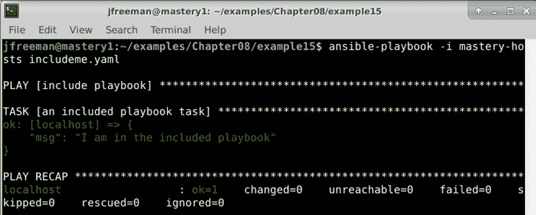

图 8.17–运行我们的行动手册，首先将其作为独立的行动手册

但是，我们也可以将其导入到另一个剧本中。修改原`includer.yaml`剧本，使其看起来像这样:

```
---
- name: include playbook
  hosts: localhost
  gather_facts: false
  tasks:
  - name: a task
    ansible.builtin.debug:
      msg: "I am in the main playbook"
- name: include a playbook
  ansible.builtin.import_playbook: includeme.yaml
```

然后，我们使用以下命令运行它:

```
ansible-playbook -i mastery-hosts includer.yaml
```

我们可以看到两个调试消息都显示了，并且导入的剧本在初始任务之后运行，这是我们在原始剧本中定义的序列。下面的截图显示了这一点:

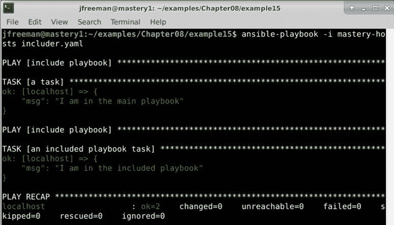

图 8.18–运行包含第二个剧本的剧本

这样，很容易重用整个剧本，而不需要将它们重组为角色、任务文件或其他格式。但是，请注意，该功能在 Ansible 中受到积极开发的影响，因此建议您始终参考文档，以确保您能够获得您想要的结果。

# 角色(结构、默认值和依赖关系)

通过对变量、任务、处理程序和行动手册的功能性理解，我们可以进入更高级的主题**角色**。角色将 Ansible 代码创建的这些不同方面结合在一起，提供了一个完全独立的变量、任务、文件、模板和模块的集合，可以在不同的行动手册中重复使用。尽管不受设计的限制，但通常每个角色都被限制在特定的目的或期望的最终结果上，所有必要的步骤要么在角色本身内部实现，要么通过依赖关系实现(换句话说，进一步的角色本身被指定为角色的依赖关系)。需要注意的是，角色不是剧本，没有办法直接执行角色。角色没有该角色将应用到的主机的设置。顶级行动手册是将您清单中的主机与应该应用于这些主机的角色绑定在一起的粘合剂。正如我们在 [*第 2 章*](02.html#_idTextAnchor047)*中看到的，从早期的 Ansible 版本*迁移而来，角色也可以是 Ansible 集合的一部分。正如我们在前面章节中已经看到的集合结构，在这一节中，我们将在中更深入地关注如何构建角色本身。

## 角色结构

**角色**在**文件系统**上有一个结构化布局。这种结构的存在是为了提供自动化，包括任务、处理程序、变量、模块和角色依赖。该结构还允许从角色内的任何位置轻松引用文件和模板。

在 [*第 2 章*](02.html#_idTextAnchor047)*中，从早期的 Ansible 版本*中迁移，我们来看看如何从集合中引用角色。但是，它们不一定要作为集合的一部分使用，并且假设您使用的是该上下文之外的角色，它们都位于`roles/`目录下的行动手册目录结构的子目录中。当然，这可以通过`roles_path`通用配置键进行配置，但我们还是保持默认值。每个角色本身就是一个目录树。角色名是`roles/`内的目录名。每个角色可以有许多具有特殊含义的子目录，当一个角色应用于一组主机时，会对这些子目录进行处理。

一个角色可能包含所有这些元素，或者只包含其中的一个元素。缺少的元素会被忽略。有些角色的存在只是为了在整个项目中提供通用的处理程序。其他角色作为一个依赖点存在，而这个依赖点又依赖于许多其他角色。

### 任务

任务文件是一个角色的核心部分，如果`roles/<role_name>/tasks/main.yaml`存在，那么这个文件中的所有任务(以及它包含的任何其他文件)都会在剧中被加载并执行。

### 经理人

与任务类似，如果文件存在，处理程序会从`roles/<role_name>/handlers/main.yaml`自动加载。这些处理程序可以被角色中的任何任务引用，或者被将此角色作为依赖项列出的任何其他角色中的任何任务引用。

### 变量

一个角色可以定义两种类型的变量。有角色变量，从`roles/<role_name>/vars/main.yaml`加载，有角色默认值，从`roles/<role_name>/defaults/main.yaml`加载。`vars`和`defaults`的区别与优先顺序有关。订单的详细说明请参考 [*第 1 章*](01.html#_idTextAnchor015)*ansi ble 的系统架构和设计*。**角色默认值**是的最低阶变量。字面上，变量的任何其他定义都将优先于角色默认值。角色默认值可以被认为是实际数据的占位符，开发人员可能有兴趣使用特定于站点的值来定义这些变量的引用。**角色变量**则优先级更高。角色变量可以被覆盖，但它们通常在同一数据集在角色中被多次引用时使用。如果数据集要用站点本地值重新定义，那么变量应该列在角色默认值中，而不是角色变量中。

### 模块和插件

角色可以包括自定义模块和插件。虽然我们正处于向 Ansible 4.0 及更高版本过渡的阶段，但这仍然受到支持，但您无疑已经注意到，集合还可以包括定制**模块**和**插件**。目前，您放置模块和插件的位置将取决于您为其编写角色的 Ansible 的目标版本。如果您希望保持与 2.x 版本的向后兼容性，那么您应该将模块和插件放入您的角色目录结构中，如下所述。如果您只想与 Ansible 及更高版本兼容，可以考虑将它们放在一个集合中。然而，请注意，随着向集合的转移，你的插件和模块不太可能被`ansible-core`包接受，除非它们提供被认为是核心的功能。

模块(如果存在于角色中)从`roles/<role_name>/library/`开始加载，并且可以被角色中的任何任务使用，或者实际上被剧中的任何后续角色使用。需要注意的是，此路径中提供的模块将覆盖相同模块名称的任何其他副本，同样重要的是尽可能使用 FQCNs 引用模块，以避免任何意外结果。

如果在以下子目录之一的角色中找到插件，将自动加载:

*   `action_plugins`
*   `lookup_plugins`
*   `callback_plugins`
*   `connection_plugins`
*   `filter_plugins`
*   `strategy_plugins`
*   `cache_plugins`
*   `test_plugins`
*   `shell_plugins`

### 属国

角色可以表达对另一个角色的**依赖**。角色集合依赖于任务、处理程序、模块等的公共角色是一种常见的做法。这些角色可能只需要定义一次。当 Ansible 处理一组主机的角色时，它首先寻找在`roles/<role_name>/meta/main.yaml`中列出的依赖关系。如果定义了任何角色，那么这些角色将被立即处理，并且包含在这些角色中的任务将被执行(在检查它们中列出的任何依赖关系之后)。这个过程一直持续到所有依赖项都被建立和加载(以及任务在存在的情况下被执行)之后，Ansible 才开始执行初始角色任务。请记住—依赖关系总是在角色本身之前执行。我们将在本章后面更深入地描述角色依赖关系。

### 文件和模板

任务和处理程序模块只能使用`roles/<role_name>/files/`内的相对路径来引用文件。文件名可以不带任何前缀(尽管如果您愿意，这是允许的)，并且来源于`roles/<role_name>/files/<relative_directory>/<file_name>`。像`ansible.builtin.template`、`ansible.builtin.copy`和`ansible.builtin.script`这样的模块是三个典型的模块，您将会看到许多利用这个有用特性的例子。

同样的，`ansible.builtin.template`模块使用的模板也可以在`roles/<role_name>/templates/`内相对引用。以下代码示例使用相对路径从完整的`roles/<role_name>/templates/herp/derp.j2`路径加载`derp.j2`模板:

```
- name: configure herp 
  ansible.builtin.template: 
    src: herp/derp.j2 
    dest: /etc/herp/derp.j2 
```

这样，在标准角色目录结构中组织文件很容易，并且仍然可以从角色中轻松地访问它们，而不必键入长而复杂的路径。在本章的后面，我们将向您介绍`ansible-galaxy role init`命令，该命令将帮助您更轻松地为新角色构建框架目录结构—有关更多详细信息，请参见*角色共享*部分。

### 把它们放在一起

为了说明完整的角色结构可能是什么样子，这里有一个名为`demo`的角色示例:

```
roles/demo 
├── defaults 
|   |--- main.yaml 
|---- files 
|   |--- foo 
|---- handlers 
|   |--- main.yaml 
|---- library 
|   |--- samplemod.py 
|---- meta 
|   |--- main.yaml 
|---- tasks 
|   |--- main.yaml 
|---- templates 
|   |--- bar.j2 
|--- vars 
    |--- main.yaml 
```

创建角色时，并非每个目录或文件都是必需的。只会处理现有的文件。因此，我们的角色示例不需要或使用处理程序；树的整个`handlers`部分可以简单地被省去。

## 角色依赖关系

如前所述角色可以依赖其他角色。这些关系被称为依赖关系，它们被描述在角色的`meta/main.yaml`文件中。该文件需要一个关键字为`dependencies`的顶级数据哈希；其中的数据是角色列表。您可以在下面的代码片段中看到这方面的说明:

```
--- 
dependencies: 
  - role: common 
  - role: apache 
```

在本例中，Ansible 将首先完全处理`common`角色(以及它可能表达的任何依赖关系)，然后继续处理`apache`角色，最后开始该角色的任务。

如果依赖项存在于相同的目录结构中或存在于已配置的`roles_path`配置密钥中，则可以通过名称引用依赖项，而无需任何前缀。否则，可以使用完整路径来定位角色，如下所示:

```
role: /opt/ansible/site-roles/apache 
```

当表示依赖关系时，可以将数据传递给依赖关系。数据可以是变量、标签，甚至是条件。

### 角色依赖变量

当列出依赖关系时传递的变量将覆盖`defaults/main.yaml`或`vars/main.yaml`中定义的匹配变量的值。这对于使用公共角色(如`apache`角色)作为依赖项很有用，同时提供特定于站点的数据，如在防火墙中打开哪些端口或启用哪些`apache`模块。变量表示为角色列表的附加键。因此，继续我们假设的例子，考虑我们需要将一些变量传递给我们讨论的`common`和`apache`角色依赖，如下所示:

```
--- 
dependencies: 
  - role: common 
    simple_var_a: True 
    simple_var_b: False 
  - role: apache 
    complex_var: 
      key1: value1 
      key2: value2 
    short_list: 
      - 8080 
      - 8081 
```

提供依赖变量数据时，保留两个名称，不应作为角色变量:`tags`和`when`。前者用于将标签数据传递到角色中，后者用于将条件传递到角色中。

### 标签

标签可以应用于依赖角色中的所有任务。这与标签应用于包含的任务文件的方式非常相似，如本章前面所述。语法很简单:`tags`键可以是一个单项，也可以是一个列表。为了演示，让我们通过添加一些标签来进一步扩展我们的理论示例，如下所示:

```
--- 
dependencies: 
  - role: common 
    simple_var_a: True 
    simple_var_b: False 
    tags: common_demo 
  - role: apache 
    complex_var: 
      key1: value1 
      key2: value2 
    short_list: 
      - 8080 
      - 8081 
    tags: 
      - apache_demo 
      - 8080 
      - 8181 
```

与向包含的任务文件添加标签一样，在依赖关系中找到的所有任务(以及该层次结构中的任何依赖关系)都将获得提供的标签。

### 角色依赖条件

虽然不可能通过条件来阻止对依赖角色的处理，但是可以通过对依赖应用条件来跳过依赖角色层次结构中的所有任务。这也反映了条件句包含任务的功能。`when`键用于表示条件。我们将再次通过添加一个依赖项来演示语法来扩展我们的示例，如下所示:

```
--- 
dependencies: 
  - role: common 
    simple_var_a: True 
    simple_var_b: False 
    tags: common_demo 
  - role: apache 
    complex_var: 
      key1: value1 
      key2: value2 
    short_list: 
      - 8080 
      - 8081 
    tags: 
      - apache_demo 
      - 8080 
      - 8181 
    when: backend_server == 'apache' 
```

在本例中，`apache`角色将始终被处理，但是当`backend_server`变量包含`apache`字符串时，角色内的任务将仅运行。

## 角色应用

角色是不是剧本。对于角色任务应该在哪个主机上运行、使用哪种连接方法、是否串行操作，或者在 [*第 1 章*](01.html#_idTextAnchor015)*ansi ble*的系统架构和设计中描述的任何其他游戏行为，他们没有任何意见。角色必须应用在剧本中，所有这些观点都可以在剧本中表达。

要在剧中扮演一个角色，使用`roles`操作符。这位操作员希望剧中的主持人能扮演一系列角色。很像描述角色依赖，当描述要应用的角色时，数据可以被传递，比如变量、标签和条件。语法完全相同。

为了演示在一部戏中应用角色，让我们创建一个简单的角色，并将其应用到一个简单的剧本中。首先，让我们构建一个名为`simple`的角色，它将在`roles/simple/tasks/main.yaml`中有一个单独的`debug`任务，该任务打印在`roles/simple/defaults/main.yaml`中定义的角色默认变量的值。首先，我们创建一个任务文件(在`tasks/`子目录中)，如下所示:

```
--- 
- name: print a variable 
  ansible.builtin.debug: 
    var: derp 
```

接下来，我们将使用单个变量`derp`编写我们的默认文件，如下所示:

```
--- 
derp: herp 
```

为了扮演这个角色，我们将编写一个剧本，用一个剧本来扮演这个角色。我们将我们的剧本称为`roleplay.yaml`，它将与`roles/`目录处于同一目录级别。代码如以下代码片段所示:

```
--- 
- hosts: localhost 
  gather_facts: false 

  roles: 
  - role: simple 
```

重要说明

如果角色没有提供数据，可以使用仅列出要应用的角色的替代语法，而不是哈希。然而，为了一致性，我觉得最好在一个项目中始终使用相同的语法。

我们将重用前面章节中的`mastery-hosts`清单，并通过运行以下命令以正常方式执行剧本(这里不需要任何额外的赘述):

```
ansible-playbook -i mastery-hosts roleplay.yaml
```

输出应该如下所示:


图 8.19–使用默认角色变量数据从剧本中运行我们的简单角色

由于角色的魔力，`derp`变量值是从角色默认值中自动加载的。当然，我们可以在应用角色时覆盖默认值。让我们修改的剧本，为`derp`提供新的价值，如下所示:

```
--- 
- hosts: localhost 
  gather_facts: false 

  roles: 
  - role: simple 
    derp: newval 
```

这一次，当我们执行时(使用与之前相同的命令)，我们将看到`newval`作为`derp`的值，如下图所示:

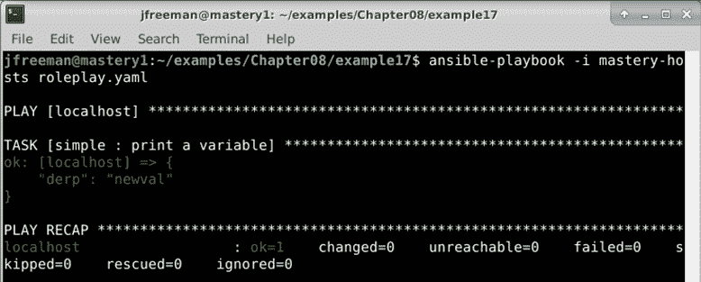

图 8.20–运行相同的角色，但这次在游戏级别覆盖默认变量数据

在一部剧中可以扮演多个角色。`roles:`键需要一个列表值。只需添加更多角色以应用更多角色，如下所示(下一个示例是理论性的，留给您练习):

```
--- 
- hosts: localhost 
  gather_facts: false 

  roles: 
  - role: simple 
    derp: newval 
  - role: second_role 
    othervar: value 
  - role: third_role 
  - role: another_role 
```

本行动手册将加载总共四个角色— `simple`、`second_role`、`third_role`和`another_role`—以及，每个角色都将按照其列出的顺序执行。

### 混合角色和任务

使用角色的剧不仅限于角色。这些游戏可以有自己的任务，也可以有另外两个任务块:`pre_tasks`和`post_tasks`块。在我们在本书中看到的任务执行顺序的中断中，这些任务的执行顺序并不取决于这些部分在剧本中的排列顺序；相反，有一个严格的命令来阻止一部剧的执行。行动手册操作顺序详见 [*第 1 章*](01.html#_idTextAnchor015)*ansi ble 的系统架构和设计*。

**一场比赛的处理程序**在多个点被刷新。如果有`pre_tasks`块，在所有`pre_tasks`块执行后，处理程序被刷新。然后，执行角色和任务块(首先是角色，然后是任务，不管它们在行动手册中的写入顺序如何)，之后将再次刷新处理程序。最后，如果存在一个`post_tasks`块，在所有`post_tasks`块执行后，处理程序将被再次刷新。当然，可以随时通过`meta: flush_handlers`呼叫来刷新处理程序。让我们扩展我们的`roleplay.yaml`文件来演示可以触发处理程序的所有不同时间，如下所示:

```
---
- hosts: localhost
  gather_facts: false
  pre_tasks:
  - name: pretask
    ansible.builtin.debug:
      msg: "a pre task"
    changed_when: true
    notify: say hi
  roles:
  - role: simple
    derp: newval
  tasks:
  - name: task
    ansible.builtin.debug:
      msg: "a task"
    changed_when: true
    notify: say hi

  post_tasks:
  - name: posttask
    ansible.builtin.debug:
      msg: "a post task"
    changed_when: true
    notify: say hi
  handlers:
  - name: say hi
    ansible.builtin.debug:
      msg: "hi"
```

我们也将和修改我们简单角色的任务来通知`say hi`处理者，如下所示:

```
--- 
- name: print a variable 
  ansible.builtin.debug:     
    var: derp 
  changed_when: true 
  notify: say hi 
```

重要说明

这仅仅是因为`say hi`处理程序已经在调用`simple`角色的游戏中定义。如果没有定义处理程序，将会出现错误。最佳做法是仅通知存在于同一角色或任何标记为依赖关系的角色中的处理程序。

使用与前面示例中相同的命令再次运行我们的行动手册应该会导致`say hi`处理程序总共被调用三次:一次用于`pre_tasks`块，一次用于角色和任务，一次用于`post_tasks`块，如下图所示:

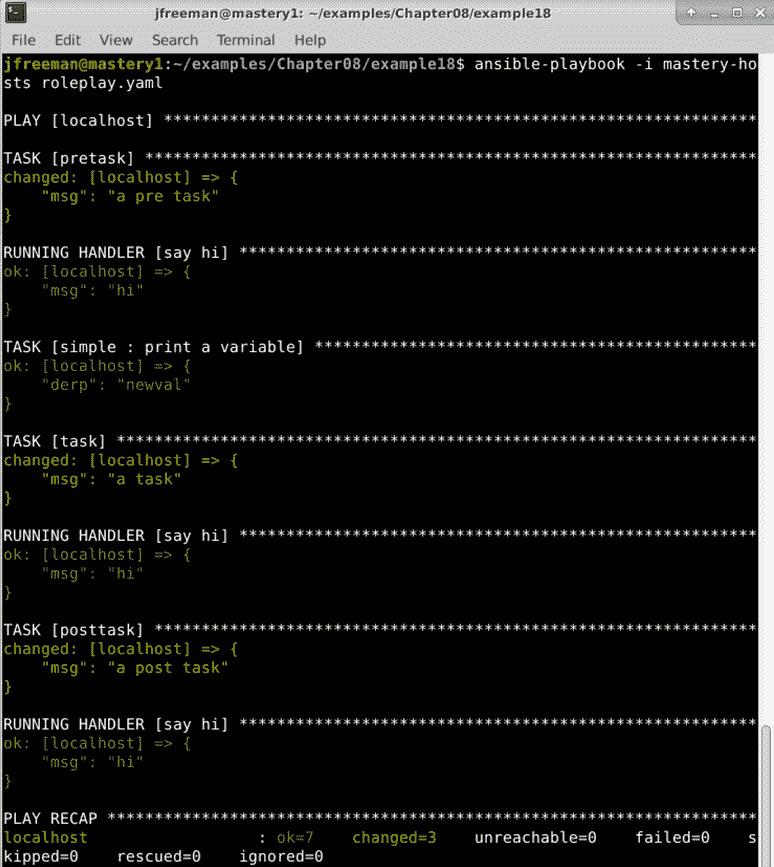

图 8.21–运行剧本来演示角色和任务的混合以及处理程序的执行

虽然`pre_tasks`、`roles`、`tasks`和`post_tasks`块写入到一个游戏中的顺序不会影响这些部分的执行顺序，但最好的做法是按照它们的执行顺序写入。这是对的视觉提示，帮助记住顺序，避免以后阅读剧本时混淆。

### 角色包括和导入

随着 Ansible2.2 版本的发布，一个新的`ansible.builtin.include_role`动作插件作为技术预览版提供。然后，在**ansi ble 2.4 版本**中，这个概念通过添加`ansible.builtin.import_role`插件得到了进一步的发展。为了简明起见，我们将参考这些没有 FQCNs 的插件。

这些插件在任务中使用，直接从任务中包含并执行整个角色。两者之间的区别很微妙，但很重要——插件`include_role`被认为是动态的，这意味着当遇到引用它的任务时，代码会在运行时被处理。

另一方面，`import_role`插件被认为是静态的，这意味着所有的导入都是在剧本最初被解析时被预处理的。这对它们在剧本中的使用有各种影响——例如，`import_role`不能在循环中使用，而`include_role`可以。

重要说明

导入和包含之间权衡的完整细节可以在此处的官方 Ansible 文档中找到:[https://docs . ansi ble . com/ansi ble/latest/user _ guide/playbooks _ reuse . html](https://docs.ansible.com/ansible/latest/user_guide/playbooks_reuse.html)。

在本书的上一版中，这些插件被认为是技术预览版——然而，它们现在是`ansible.builtin`集合的一部分，因此现在可以被认为是稳定的，并在您认为合适的时候用于您的代码。

## 角色分享

使用角色的优势之一是能够跨剧本、剧本、整个项目空间甚至跨组织共享角色。角色被设计为独立的(或明确引用从属角色)，以便它们可以存在于应用角色的行动手册所在的项目空间之外。角色可以安装在 Ansible 主机上的共享路径中，也可以通过源代码管理进行分发。

### `ansible-galaxy`

**Ansible Galaxy**([https://galaxy.ansible.com/](https://galaxy.ansible.com/))正如我们在 [*第 2 章*](02.html#_idTextAnchor047)*中讨论的那样，从早期 Ansible 版本*迁移而来，是一个用于查找和共享 ansi ble 角色和集合的社区中心。任何人都可以访问网站浏览这些和评论；此外，创建登录的用户可以提供他们测试过的角色的评论。可以使用 Ansible 提供的`ansible-galaxy`实用程序从 Galaxy 下载角色。

`ansible-galaxy`实用程序可以从 Ansible Galaxy 网站连接并安装角色。该实用程序默认将角色安装到`/etc/ansible/roles`中。如果配置了`roles_path`或者提供了带有`--roles-path`(或`-p`)选项的运行时路径，角色将被安装在那里。如果`roles_path`选项或提供的路径中安装了任何角色，`ansible-galaxy`可以列出这些角色并显示这些角色的信息。为了演示`ansible-galaxy`的用法，让我们使用它来安装一个角色，用于从 Ansible Galaxy 安装和管理 Ubuntu 上的 Docker 到我们一直在使用的`roles`目录中。从 Ansible Galaxy 安装角色需要`username.rolename`，因为多个用户可能已经上传了同名的角色。通过一个例子，我们将使用`angstwad`用户的`docker_ubuntu`角色，如下图所示:

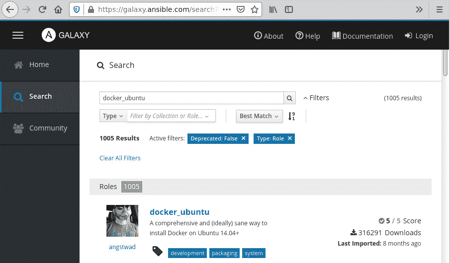

图 8.22–在 Ansible Galaxy 上查找社区贡献的角色示例

我们现在可以通过在一部剧或另一个角色的依赖块中引用`angstwad.docker_ubuntu`来使用这个角色。但是，让我们从演示如何在当前工作目录中安装开始。我们将首先创建一个`roles/`目录，然后使用以下命令将上述角色安装到该目录中:

```
mkdir roles/
ansible-galaxy role install -p roles/ angstwad.docker_ubuntu
```

一旦我们安装了示例角色，我们就可以使用以下命令查询它(以及可能存在于`roles/`目录中的任何其他角色):

```
ansible-galaxy role list -p roles/
```

您还可以使用以下命令在本地查询有关角色的信息，如描述、创建者、版本等:

```
ansible-galaxy role info -p roles/ angstwad.docker_ubuntu
```

下面的截图给出了前面两个命令的输出类型:

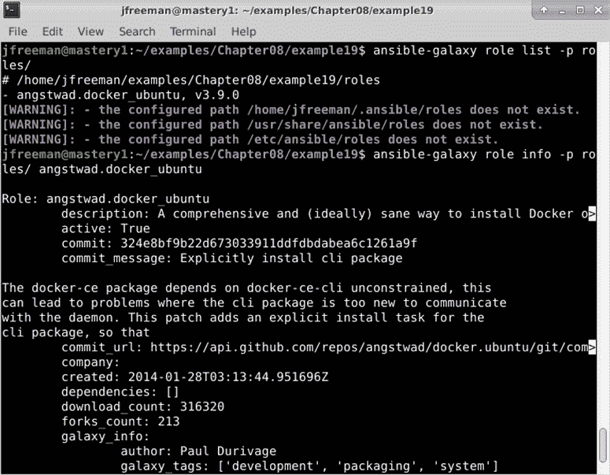

图 8.23–使用 ansible-galaxy 命令查询已安装的角色

输出已被截断，以节省书中的空间，如果您滚动输出，会有更多有用的信息。由`info`命令显示的一些数据存在于角色本身的`meta/main.yml`文件中。以前，我们只在这个文件中看到依赖信息，给目录`meta`命名可能没有多大意义，但现在我们看到其他元数据也存在于这个文件中，如下图所示:

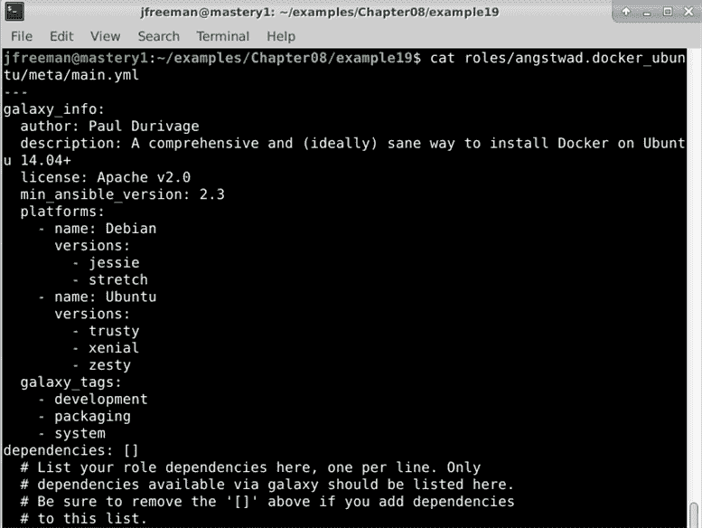

图 8.24–可以放在角色的 meta/main.yml 文件中的元数据示例

`ansible-galaxy`工具也可以帮助创建新角色。`role init`方法将为角色创建一个框架目录树，并用与银河相关的数据的占位符填充`meta/main.yml`文件。

让我们通过在名为`autogen`的工作目录中创建一个新角色来演示这种能力，使用以下命令:

```
ansible-galaxy role init --init-path roles/ autogen
```

如果检查此命令创建的目录结构，您将看到创建全新角色所需的所有目录和占位符文件，如下图所示:

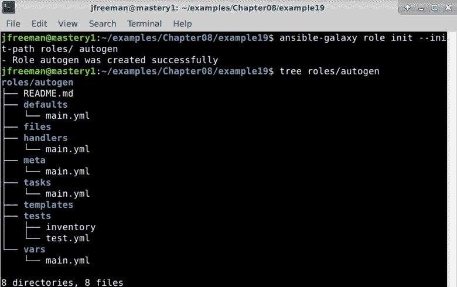

图 8.25–使用 ansible-galaxy 工具创建骨架空角色

请注意，在过去我们使用开关指定本地`roles/`目录的地方，我们必须使用`--init-path`开关代替`init`命令。对于不适合 Ansible Galaxy 的角色，比如处理内部系统的角色，`ansible-galaxy`可以直接从 Git **统一资源定位符** ( **URL** )安装。不仅仅是为`install`方法提供一个角色名，还可以提供一个带有可选版本的完整 Git URL。例如，如果我们想从内部 Git 服务器安装`foowhiz`角色，我们可以简单地运行以下命令:

```
ansible-galaxy role install -p /opt/ansible/roles git+git@git.internal.site:ansible-roles/foowhiz
```

没有版本信息，将使用`master`分支。如果没有名称数据，名称将由网址本身决定。要提供版本，请附加一个逗号和 Git 可以理解的版本字符串，例如标记或分支名称，例如`v1`，如下图所示:

```
ansible-galaxy role install -p /opt/ansible/roles git+git@git.internal.site:ansible-roles/foowhiz,v1
```

角色的名称可以添加另一个逗号，后跟`name`字符串，如下面的代码片段所示。如果您需要提供名称，但不希望提供版本，则该版本仍需要一个空插槽:

```
ansible-galaxy role install -p /opt/ansible/roles git+git@git.internal.site:ansible-roles/foowhiz,,foo-whiz-common
```

角色也可以直接从 tarballs 安装，通过提供 tarball 的网址来代替完整的 Git 网址或从 Ansible Galaxy 获取的角色名。

当您需要为一个项目安装多个角色时，可以定义多个角色来下载并安装在以`.yaml`(或`.yml`)结尾的 YAML 格式文件中。此文件的格式允许您从多个来源指定多个角色，并保留指定版本和角色名称的能力。另外可以列出源码控制方式(目前只支持`git`和`hg`)。您可以在下面的代码片段中看到一个这样的例子:

```
--- 
- src: <name or url> 
  version: <optional version> 
  name: <optional name override> 
  scm: <optional defined source control mechanism, defaults to git>
```

要安装一个文件中的所有角色，使用`role install`方法的`--roles-file` ( `-r`)选项，如下所示:

```
ansible-galaxy role install -r foowhiz-reqs.yaml
```

通过这种方式，在运行行动手册之前，收集您的所有角色依赖关系非常容易，无论您需要的角色是在 Ansible Galaxy 上公开提供还是保存在您自己的内部源代码管理系统中，这一简单的步骤都可以大大加快行动手册的部署，同时支持代码重用。

# 总结

Ansible 提供了将内容从逻辑上划分为独立文件的能力。这种能力有助于项目开发人员不要一遍又一遍地重复相同的代码。Ansible 中的角色将这一功能向前推进了一步，并为内容路径增添了一些魔力。角色是可调的、可重用的、Ansible 的和可共享的功能块。Ansible Galaxy 作为一个社区中心而存在，供开发人员查找、评价和共享角色和集合。`ansible-galaxy`命令行工具提供了一种与 Ansible Galaxy 站点或其他角色共享机制进行交互的方法。这些功能和工具有助于组织和利用公共代码。

在本章中，您学习了与任务、处理程序、变量甚至整个行动手册相关的所有包含概念。然后，您通过学习角色(角色的结构、设置默认变量值和处理角色依赖关系)扩展了这方面的知识。然后，您继续学习如何设计行动手册以有效利用角色，并应用角色缺少的选项，如标签。最后，您学习了如何使用 Git 和 Ansible Galaxy 等存储库在项目之间共享角色。

在下一章中，我们将介绍有用且有效的故障排除技术，以便在您的 Ansible 部署遇到问题时为您提供帮助。

# 问题

1.  Which Ansible module can be used to run tasks from a separate external task file when a playbook is run?

    a) `ansible.builtin.import`

    b) `ansible.builtin.include`

    c) `ansible.builtin.tasks_file`

    d) `ansible.builtin.with_tasks`

2.  Variable data can be passed to an external task file when it is called:

    真的

    假的

3.  The default name of the variable containing the current loop value is:

    a) `i`

    b) `loop_var`

    c) `loop_value`

    d) `item`

4.  When looping over external task files, it is important to consider setting which special variable to prevent loop variable name collisions?

    a) `loop_name`

    b) `loop_item`

    c) `loop_var`

    d) `item`

5.  Handlers are generally run:

    一次，在戏剧的结尾

    b)在该剧的`pre_tasks`、`roles/tasks`和`post_tasks`部分结束时各一次

    c)每场一次，在戏剧的`pre_tasks`、`roles/tasks`和`post_tasks`部分结束时，并且仅在接到通知时

    d)各一次，在该剧的`pre_tasks`、`roles/tasks`和`post_tasks`部分结束时，且仅在导入时

6.  Ansible can load variables from the following external sources:

    a)静态`vars_files`夹杂物

    b)动态`vars_files`夹杂物

    c)通过`include_vars`语句

    d)通过`extra-vars`命令行参数

    所有上述内容

7.  Roles obtain their name from the role directory name (for example, `roles/testrole1` has the name `testrole1`):

    真的

    假的

8.  If a role is missing the `tasks/main.yml` file, Ansible will:

    a)因出错而中止播放

    b)完全跳过角色

    c)仍然引用角色的任何其他有效部分，包括元数据、默认变量和处理程序

    显示警告

9.  Roles can have dependencies on other roles:

    真的

    假的

10.  When you specify a tag for a role, Ansible's behavior is to:

    a)将标签应用于整个角色

    b)将标签应用于角色中的每个任务

    c)完全跳过角色

    d)仅执行来自具有相同标签的角色的任务