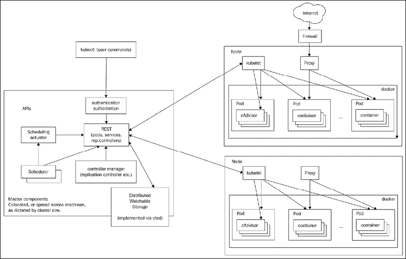
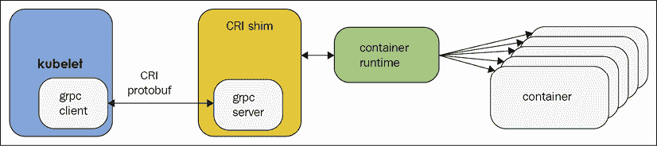
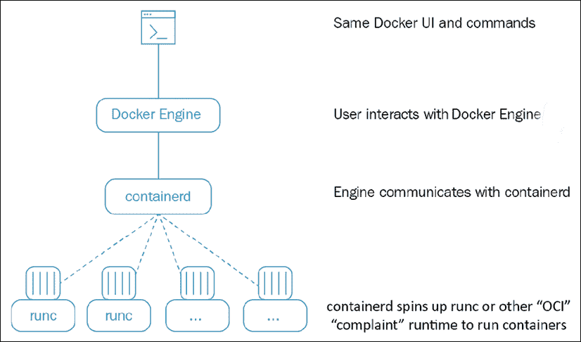
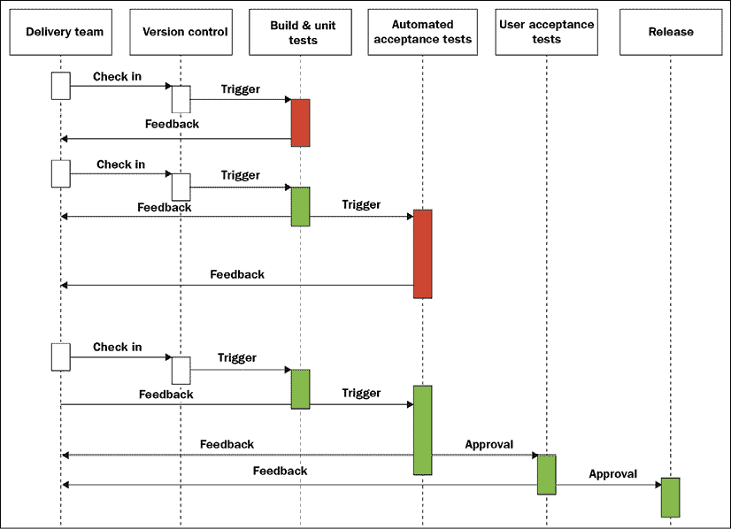

# one

# 理解库本内斯建筑

简而言之，Kubernetes 是一个协调基于容器的应用程序的部署、扩展和管理的平台。你可能读过关于 Kubernetes 的文章，甚至可能会在一个辅助项目中或者甚至在工作中使用它。但是要理解 Kubernetes 是关于什么的，如何有效地使用它，以及最佳实践是什么，还需要更多。

Kubernetes 是一个大型开源项目和生态系统，有很多代码和功能。Kubernetes 从谷歌出来，但加入了**云原生计算基金会** ( **CNCF** )，成为基于容器的应用领域的明确领导者。

在这一章中，我们将建立必要的基础来充分利用库本内特斯的潜力。我们将首先了解什么是 Kubernetes，什么不是 Kubernetes，以及容器编排的确切含义。然后，我们将涵盖重要的库本内特概念，这些概念将形成我们将在整本书中使用的词汇。之后，我们将深入到 Kubernetes 本身的架构中，看看它是如何为用户提供所有功能的。然后，我们将讨论 Kubernetes 支持的各种运行时和容器引擎(Docker 只是一个选项)，最后，我们将讨论 Kubernetes 在完整的持续集成和部署管道中的作用。

在本章的最后，您将对容器编排、Kubernetes 解决的问题、Kubernetes 设计和架构的基本原理以及它支持的不同运行时有一个坚实的了解。您还将熟悉开源存储库的整体结构，并准备好跳进去寻找任何问题的答案。

# 什么是 Kubernetes？

Kubernetes 是一个包含大量不断增长的服务和功能的平台。核心功能是在整个基础架构中调度容器中的工作负载，但这并不止于此。以下是 Kubernetes 带来的一些其他功能:

*   安装存储系统
*   散布秘密
*   检查应用程序运行状况和就绪情况
*   复制应用程序实例
*   使用水平吊舱自动缩放器
*   使用集群自动缩放
*   命名和服务发现
*   平衡负载
*   滚动更新
*   监控资源
*   访问和投资日志
*   调试应用程序
*   提供身份验证和授权

我们将在整本书中详细介绍所有这些功能。在这一点上，只要吸收和欣赏 Kubernetes 能为你的系统增加多少价值。

Kubernetes 有令人印象深刻的范围，但是理解 Kubernetes 没有明确提供什么也很重要。

## Kubernetes 不是什么

kubernetes不是**平台即服务** ( **PaaS** )。它没有规定许多重要的方面留给你或者其他建立在 Kubernetes 之上的系统，比如 Deis、OpenShift 和 Eldarion 例如:

*   Kubernetes 不需要特定的应用程序类型或框架
*   Kubernetes 不需要特定的编程语言
*   Kubernetes 不提供数据库或消息队列
*   Kubernetes 不区分应用和服务
*   Kubernetes 没有点击部署服务市场
*   Kubernetes 不提供内置功能作为服务解决方案
*   Kubernetes 没有强制要求日志记录、监控和警报系统

既然我们对 Kubernetes 的边界有了一个清晰的概念，让我们来深入了解它的主要职责——容器编排。

## 理解容器编排

Kubernetes 的主要职责是容器编排。这意味着确保执行各种工作负载的所有容器都计划在物理或虚拟机上运行。容器必须按照部署环境和集群配置的约束进行高效打包。此外，Kubernetes 必须密切关注所有正在运行的容器，并更换失效、无响应或不健康的容器。Kubernetes 提供了更多的功能，您将在后面的章节中了解这些功能。在本节中，重点是容器及其编排。

### 物理机、虚拟机和容器

一切以硬件开始和结束。为了运行您的工作负载，您需要配置一些真正的硬件。这包括具有特定计算能力(CPU 或内核)、内存和一些本地持久存储(旋转磁盘或固态硬盘)的实际物理机器。此外，您将需要一些共享的持久存储，并使用网络连接所有这些机器，以便它们可以找到并相互交谈。此时，您可以在物理机上运行多个虚拟机，也可以保持裸机级别(仅限真实硬件，没有虚拟机)。Kubernetes 可以部署在裸机集群或虚拟机集群上。反过来，Kubernetes 可以在裸机或虚拟机上编排它直接管理的容器。理论上，Kubernetes 集群可以由裸机和虚拟机混合组成，但这并不常见。

### 集装箱的好处

容器代表了大型复杂软件系统开发和操作的真正范式转变。以下是与更传统的车型相比的一些优势:

*   敏捷应用程序的创建和部署
*   持续开发、集成和部署
*   开发和运营关注点分离
*   跨开发、测试、试运行和生产的环境一致性
*   云和操作系统分发可移植性
*   以应用程序为中心的管理(依赖项与应用程序打包在一起)
*   资源隔离(可以限制容器 CPU 和内存)
*   资源利用率(可以在同一个节点上部署多个容器)

基于容器的开发和部署的好处在许多情况下都很显著，但是如果您将系统部署到云中，这种好处就尤为显著。

### 云中的容器

容器是打包微服务的理想选择，因为虽然它们为微服务提供了隔离，但它们非常轻量级，并且在部署许多微服务时不会像部署虚拟机那样产生大量开销。这使得容器成为云部署的理想之选，在云部署中，为每个微服务分配一个完整的虚拟机成本高昂。

目前所有主要的云提供商，如**亚马逊网络服务**(**AWS**)**谷歌云平台**(**GCP**)微软的 Azure，都提供容器托管服务。许多其他公司也加入了 Kubernetes 的行列，提供托管式 Kubernetes 服务，包括:

*   ibm iks
*   阿里巴巴云
*   数字海洋 DKS
*   oracle oks
*   OVH 管理的 kubernetes
*   机架空间奶酪

**谷歌 Kubernetes 引擎** ( **GKE** )一直基于 Kubernetes。除了专有的 AWS ECS 编排解决方案之外，亚马逊的**弹性库本内斯服务** ( **EKS** )也被添加到中。微软 Azure 的容器服务以前是基于 Apache Mesos 的，后来用**Azure Kubernetes Service**(**AKS**)切换到 Kubernetes。您可以始终在所有云平台上部署 Kubernetes，但它没有与其他服务深度集成。然而，在 2017 年底，所有云提供商都宣布直接支持 Kubernetes。微软推出了 AKS，AWS 发布了 EKS，阿里巴巴云开始着手于 Kubernetes 控制器管理器，以无缝集成 Kubernetes。

### 牛与宠物

在过去系统很小的时候，每个服务器都有一个名字。开发人员和用户确切地知道每台机器上运行的是什么软件。我记得，在我工作过的许多公司中，我们进行了多天的讨论来决定我们服务器的命名主题。例如，作曲家和希腊神话人物是受欢迎的选择。一切都很舒适。你把你的服务器当成心爱的宠物。当服务器死亡时，这是一个重大危机。每个人都争先恐后地试图弄清楚从哪里获得另一台服务器，甚至什么在死服务器上运行，以及如何让它在新服务器上工作。如果服务器存储了一些重要的数据，那么希望你有一个最新的备份，也许你甚至能够恢复它。

显然，这种方法无法扩展。当你有几十台或几百台服务器时，你必须开始像对待牛一样对待它们。你考虑的是集体而不是个人。你可能还有一些宠物喜欢你的 CI/CD 机(虽然托管 CI/CD 解决方案变得越来越普遍)，但你的网络服务器和后端服务只是牛。

Kubernetes 将牛的方法发挥到了极致，并承担了将容器分配给特定机器的全部责任。您不需要大部分时间与单个机器(节点)交互。这最适合无状态工作负载。对于有状态的应用程序，情况有点不同，但是 Kubernetes 提供了一个名为 StatefulSet 的解决方案，我们将很快讨论它。

在本节中，我们介绍了容器编排的概念，讨论了主机(物理或虚拟)和容器之间的关系，以及在云中运行容器的好处，最后讨论了牛和宠物。在下一节中，我们将了解 Kubernetes 的世界，并学习它的概念和术语。

# 不可思议的概念

在这一节中，我将简要介绍许多重要的 Kubernetes 概念，并为您提供一些上下文，说明为什么需要它们以及它们如何与其他概念交互。目标是熟悉这些术语和概念。稍后，我们将看到这些概念是如何被编织在一起并组织成应用编程接口组和资源类别来实现令人敬畏的。您可以将其中许多概念视为构建块。一些概念，如节点和主节点，是作为一组 Kubernetes 组件实现的。这些组件处于不同的抽象级别，我将在本章后面的专门章节中详细讨论它们–*库本内斯组件*。

以下是著名的库本内特斯建筑示意图:



图 1.1:无缝体系结构图

## 簇

集群是提供计算、内存、存储和网络资源的主机(节点)的集合。Kubernetes 使用这些资源来运行构成系统的各种工作负载。请注意，您的整个系统可能由多个集群组成。我们将在*第 11 章*、*中详细讨论在多个云和集群联邦上运行 Kubernetes 的这个高级联邦用例。*

## 节点

一个节点就是一台主机。它可能是物理机或虚拟机。它的工作是运行吊舱。每个 Kubernetes 节点运行几个 Kubernetes 组件，例如 kubelet、容器运行时和 kube 代理。节点由 Kubernetes 主节点管理。节点是库本内斯的工蜂，承担着所有的重担。在过去，他们被称为**爪牙**。如果你读了一些旧的文档或文章，不要感到困惑。爪牙只是节点。

## 大师

大师是库本内斯的控制平面。它由几个组件组成，如应用编程接口服务器、调度程序和控制器管理器。主节点负责集群的全局状态、吊舱的集群级调度以及事件的处理。通常，所有主组件都设置在一台主机上。当考虑高可用性场景或非常大的集群时，您将希望拥有主冗余。我们将在*第 4 章*、*中详细讨论高可用性集群保护库本内斯*。

## 分离舱

一个豆荚是在库本内特斯工作的单位。每个容器包含一个或多个容器。吊舱中的容器总是被安排在一起(总是在同一台机器上运行)。一个 pod 中的所有容器都有相同的 IP 地址和端口空间；它们可以使用 localhost 或标准进程间通信进行通信。此外，pod 中的所有容器都可以访问承载 pod 的节点上的共享本地存储。默认情况下，容器无法访问本地存储或任何其他存储。存储容量必须明确地安装到容器内的每个容器中。豆荚是库本内特的一个重要特征。通过将 supervisord 之类的东西作为运行多个进程的主 Docker 进程，可以在单个 Docker 容器中运行多个应用程序，但这种做法通常不被认可，原因如下:

*   **透明性**:使 pod 内的容器对基础设施可见，使基础设施能够向这些容器提供服务，例如过程管理和资源监控。这为用户提供了许多便利。
*   **解耦软件依赖关系**:各个容器可以独立地进行版本控制、重建和重新部署。Kubernetes 甚至有一天可能会支持单个容器的实时更新。
*   **易用性**:用户不需要运行自己的流程管理器，不用担心信号和退出代码传播等等。
*   **效率**:因为基础设施承担了更多的责任，容器可以更加轻量化。

Pods 提供了一个很好的解决方案，用于管理一组组紧密相关的容器，这些容器相互依赖，需要在同一台主机上合作才能实现它们的目的。重要的是要记住，豆荚被认为是短暂的、一次性的实体，可以随意丢弃和替换。任何豆荚储藏都被它的豆荚毁掉了。每个吊舱都有一个**唯一标识** ( **UID** )，因此如果需要，您仍然可以区分它们。

## 标签

标签是键值对，用于将对象集合组合在一起——通常是荚。这对于其他几个概念很重要，例如复制控制器、副本集、部署和在动态对象组上运行并需要识别组成员的服务。对象和标签之间存在 *N × N* 关系。每个对象可以有多个标签，每个标签可以应用于不同的对象。标签有一定的设计限制。对象上的每个标签都必须有唯一的键。标签密钥必须遵循严格的语法。它有两个部分:前缀和名称。前缀是可选的。如果它存在，则用正斜杠(`/`)将它与名称分开，并且它必须是有效的 DNS 子域。前缀长度不得超过 253 个字符。该名称为必填项，长度不得超过 63 个字符。名称必须以字母数字字符(a-z、A-Z、0-9)开头和结尾，并且只包含字母数字字符、点、破折号和下划线。值遵循与名称相同的限制。请注意，标签专用于标识对象，而不是将任意元数据附加到对象。这就是注释的作用。

## 释文

注释使您可以将任意的元数据与库本内特对象相关联。Kubernetes 只是存储注释，并使它们的元数据可用。注释和标签一样，是键值对，其中键可以有一个可选前缀，并通过正斜杠(`/`)与键名分开。名称和前缀(如果提供)必须遵循严格的规则。详情请查看[https://kubernetes . io/docs/concepts/overview/使用对象/注释/#语法和字符集](https://kubernetes.io/docs/concepts/overview/working-with-objects/annotations/#syntax-and-character-set)。

根据我的经验，复杂的系统总是需要这样的元数据，很高兴 Kubernetes 认识到了这一点，并提供了现成的元数据，这样就不必为它们的元数据想出自己单独的元数据存储和映射对象。虽然注释很有用，但是当试图以通用的方式处理注释时，它们缺乏结构会带来一些问题。自定义资源定义经常被吹捧为一种替代方案。我们稍后会在*第 15 章**扩展库本内斯*中介绍这些。

## 标签选择器

标签选择器用于根据标签选择对象。基于等式的选择器指定一个键名和值。有两个运算符，`=`(或`==`)和`!=`，用于基于值的相等或不相等；例如:

```
role = webserver 
```

这将选择所有具有该标签键和值的对象。

标签选择器可以有多个用逗号分隔的需求；例如:

```
role = webserver, application != foo 
```

基于集合的选择器扩展了功能，并允许基于多个值进行选择:

```
role in (webserver, backend) 
```

## 服务

服务是用来向用户或其他服务公开的一些功能。它们通常包含一组豆荚，通常由一个标签来标识——你猜对了。您可以拥有提供对外部资源的访问的服务，或者直接在虚拟 IP 级别控制的 pod。本机 Kubernetes 服务通过方便的端点公开。请注意，服务运行在第 3 层(TCP/UDP)。Kubernetes 1.2 增加了入口对象，提供对 HTTP 对象的访问。稍后会有更多。服务通过两种机制之一发布或发现:域名系统或环境变量。服务可以通过 Kubernetes 进行负载平衡。但是，在服务使用外部资源或需要特殊处理的情况下，开发人员可以选择自行管理负载平衡。

有许多与 IP 地址、虚拟 IP 地址和端口空间相关的血淋淋的细节。我们将在*第 10 章*、*探索高级网络*中深入讨论。

## 卷

豆荚上的本地存储是短暂的，会随着豆荚一起消失。有时，如果目标只是在节点的容器之间交换数据，这就是你所需要的，但是有时数据比容器更长是很重要的，或者在容器之间共享数据是必要的。体积概念支持这种需求。请注意，虽然 Docker 也有音量概念，但它非常有限(尽管功能越来越强大)。Kubernetes 使用自己单独的卷。Kubernetes 还支持额外的容器运行时，因此即使在原则上，它也不能依赖 Docker 卷。

有许多卷类型。Kubernetes 目前直接支持多种卷类型，但是扩展 Kubernetes 使其具有更多卷类型的现代方法是通过**容器存储接口** ( **CSI** ，我们将在后面详细讨论。内置卷类型将逐步淘汰，取而代之的是通过 CSI 提供的树外插件。

## 复制控制器和副本集

复制控制器和副本集都管理由标签选择器识别的一组豆荚，并确保一定数量的豆荚始终处于运行状态。它们之间的主要区别在于，复制控制器通过名称相等来测试成员资格，而副本集可以使用基于集的选择。副本集是未来的发展方向，因为它们是复制控制器的超集。我预计复制控制器在某个时候会被弃用。Kubernetes 保证您将始终运行与您在复制控制器或副本集中指定的相同数量的 pods。每当由于托管节点或 pod 本身的问题导致数量下降时，Kubernetes 就会启动新的实例。请注意，如果您手动启动 pods 并超过指定的数量，副本集控制器将杀死一些额外的 pods。

复制控制器曾经是许多工作流的中心，例如滚动更新和运行一次性作业。随着 Kubernetes 的发展，它引入了对其中许多工作流的直接支持，并有专门的对象，如部署、作业、克隆作业和 DaemonSet。我们以后会和他们见面的。

## StatefulSet

Pods 来来去去，如果你关心他们的数据，那么你可以使用持久存储。这都很好。但是有时您希望 Kubernetes 管理分布式数据存储，如 Cassandra 或 MySQL Galera。这些集群存储将数据分布在唯一标识的节点上。你不能用常规的吊舱和服务来模拟。输入 StatefulSet。如果你还记得的话，之前我们讨论过宠物和牛，以及牛的思维方式是怎样的。

好吧，StatefulSet 位于中间的某个地方。StatefulSet 确保(类似于复制集)给定数量的具有唯一标识的实例在任何给定时间运行。状态集合成员具有以下属性:

*   一个稳定的主机名，在域名系统中可用
*   序数索引
*   链接到序号和主机名的稳定存储

StatefulSet 可以帮助对等体发现以及安全地添加或删除成员。

## 秘密

秘密是小物件，包含凭证和令牌等敏感信息。默认情况下，它们以明文形式存储在 etcd 中，可由 Kubernetes API 服务器访问，并且可以作为文件装载在需要访问它们的 pods 中(使用搭载在常规数据卷上的专用秘密卷)。同样的秘密可以安装在多个吊舱中。Kubernetes 本身为它的组件创造秘密，你可以创造你自己的秘密。另一种方法是使用秘密作为环境变量。请注意，为了更好的安全性，pod 中的机密总是存储在内存中(在挂载机密的情况下是 tmpfs)。

## 名称

Kubernetes 中的每个对象都由一个 UID 和一个名称来标识。该名称用于在 API 调用中引用对象。名称最长应为 253 个字符，并使用小写字母数字字符、破折号(-)和点号()。).如果删除一个对象，可以创建另一个与被删除对象同名的对象，但是 uid 在集群的整个生命周期内必须是唯一的。uid 是由 Kubernetes 生成的，所以您不必担心它。

## 命名空间

命名空间是一种虚拟集群。您可以拥有一个物理集群，其中包含多个由命名空间分隔的虚拟集群。默认情况下，一个命名空间中的 pods 可以访问其他命名空间中的 pods 和服务。在完全隔离名称空间非常重要的多租户场景中，您可以通过适当的网络策略来实现。请注意，节点对象和持久卷不在一个命名空间中。Kubernetes 可能会调度不同名称空间的 pods 在同一个节点上运行。同样，来自不同名称空间的 pods 可以使用相同的持久存储。

使用名称空间时，您必须考虑网络策略和资源配额，以确保物理集群资源的正确访问和分配。

我们已经讨论了库本内特的大部分基本概念；还有几个我简单提到过。在下一节中，我们将通过研究 Kubernetes 架构的设计动机、内部结构和实现来继续我们的旅程，我们甚至会挑选源代码。

# 深入探究库本内斯建筑

Kubernetes 有非常远大的目标。它旨在管理和简化跨各种环境和云提供商的分布式系统的编排、部署和管理。它提供了许多功能和服务，这些功能和服务应该在所有这些多样性中工作，同时不断发展，并保持足够简单以供普通人使用。这是一项艰巨的任务。Kubernetes 通过遵循一个清晰的、高层次的设计和经过深思熟虑的架构来实现这一点，该架构提高了可扩展性和可插拔性。Kubernetes 的许多部分仍然是硬编码的或环境感知的，但趋势是将它们重构为插件，并保持核心的小型、通用和抽象。在这一节中，我们将像剥洋葱一样剥 Kubernetes，从各种分布式系统设计模式以及 Kubernetes 如何支持它们开始，然后浏览 Kubernetes 的表面，这是它的一组 API，然后看一下构成 Kubernetes 的实际组件。最后，我们将快速浏览源代码树，以便更好地了解 Kubernetes 本身的结构。

在本节的最后，您将对 Kubernetes 的架构和实现有一个坚实的理解，以及为什么会做出某些设计决策。

## 分布式系统设计模式

所有快乐(工作)分布式系统都是相似的，套用托尔斯泰在《安娜·卡列尼娜》中的话。这意味着为了正常运行，所有设计良好的分布式系统都必须遵循一些最佳实践和原则。Kubernetes 不想只是一个管理系统；它希望支持和启用这些最佳实践，并向开发人员和管理员提供高级服务。让我们来看看那些被描述为设计模式的最佳实践。

### 边车图案

侧车模式是除了主应用程序容器之外，将另一个容器放在一个容器中。应用程序容器不知道 sidecar 容器，只是继续它的业务。一个很好的例子是中央日志代理。您的主容器只能登录到 stdout，但是 sidecar 容器会将所有日志发送到一个中央日志服务，在那里它们将与整个系统的日志聚合在一起。使用 sidecar 容器相对于在主应用程序容器中添加中央日志记录的好处是巨大的。首先，应用程序不再有中央日志的负担，这可能是一个麻烦。如果您想要升级或更改您的中央日志策略，或者切换到一个全新的提供者，您只需要更新 sidecar 容器并部署它。您的应用程序容器没有任何变化，因此您不能意外地破坏它们。Istio 服务网格使用 sidecar 模式将其代理注入每个 pod。

### 大使模式

大使模式是关于代表一个远程服务，就像它是本地的一样，并且可能会执行一些策略。大使模式的一个很好的例子是，如果您有一个 Redis 集群，其中一个主集群用于写入，多个副本集群用于读取。本地大使容器可以充当代理，并将 Redis 公开给本地主机上的主应用程序容器。主应用程序容器简单地连接到`localhost:6379` (Redis 默认端口)上的 Redis，但它连接到运行在同一个 pod 中的大使，后者过滤请求，并将写请求发送到真正的 Redis 主机，并将读请求随机发送到其中一个读副本。就像 sidecar 模式一样，主应用程序不知道发生了什么。这在测试真实的本地 Redis 时会有很大帮助。还有，如果 Redis 集群配置发生变化，只需要修改大使；主要应用程序仍然幸福地不知道。

### 适配器模式

适配器模式是关于标准化主应用程序容器的输出。考虑正在逐步推出的服务的情况:它可能会以不符合以前版本的格式生成报告。使用该输出的其他服务和应用程序尚未升级。适配器容器可以与新的应用程序容器部署在同一个容器中，并调整输出以匹配旧版本，直到所有消费者都升级完毕。适配器容器与主应用程序容器共享文件系统，因此它可以监视本地文件系统，并且每当新应用程序写入内容时，它会立即对其进行适配。

### 多节点模式

单节点模式都是库本内特通过豆荚直接支持的。不直接支持多节点模式，如领导者选举、工作队列和分散-聚集，但是使用标准接口来组合 pods 来完成它们是一种可行的 Kubernetes 方法。

许多与 Kubernetes 深度集成的工具、框架和附加组件都利用了这些设计模式。这些模式的美妙之处在于，它们都是松散耦合的，不需要修改 Kubernetes，甚至不需要知道这些集成的存在。Kubernetes 周围充满活力的生态系统是其建筑的直接结果。让我们再深入一层，熟悉一下 Kubernetes APIs。

## 不灭的 API

如果你想了解一个系统的能力以及它提供了什么，你必须非常注意它的 API。该应用编程接口提供了一个全面的视图，让您可以作为用户对系统做些什么。Kubernetes 通过 API 组为不同的目的和受众公开了几组 REST APIs。有些应用编程接口主要由工具使用，有些可以由开发人员直接使用。API 的一个重要方面是它们正在不断开发中。Kubernetes 开发人员通过尝试扩展(向现有对象添加新对象和新字段)并避免重命名或删除现有对象和字段来保持可管理性。此外，所有的应用编程接口端点都是版本化的，通常也有一个阿尔法或贝塔符号；例如:

```
/api/v1
/api/v2alpha1 
```

您可以通过 kubectl 命令行界面、客户端库或直接通过 REST 应用编程接口调用来访问该应用编程接口。我们将在后面的章节中探讨详细的身份验证和授权机制。如果您有适当的权限，您可以列出、查看、创建、更新和删除各种 Kubernetes 对象。现在，让我们来看一下 API 的表面积。探索应用编程接口的最佳方式是通过应用编程接口组。默认情况下，某些应用编程接口组是启用的。可以通过标志启用/禁用其他组。例如，要禁用批处理 V1 组并启用批处理 V2 阿尔法组，您可以在运行应用编程接口服务器时设置`--runtime-config`标志，如下所示:

```
--runtime-config=batch/v1=false,batch/v2alpha=true 
```

除核心资源外，默认情况下还启用以下资源:

*   daemmonsets
*   部署
*   水平自动缩放器
*   进入
*   乔布斯
*   复制集

除了应用编程接口组，可用应用编程接口的另一个有用的分类是按功能。输入资源类别...

### 资源类别

库本内特斯应用编程接口非常庞大，当你试图找到出路时，把它分成几个类别会有很大帮助。Kubernetes 定义了以下资源类别:

*   **工作负载**:用于管理和运行集群中容器的对象
*   **发现和负载平衡**:您用来将工作负载作为外部可访问的负载平衡服务展示给外界的对象
*   **配置和存储**:用于初始化和配置应用程序以及保存容器外部数据的对象
*   **集群**:定义集群自身如何配置的对象；这些通常仅由集群操作员使用
*   **元数据**:用于配置集群内其他资源行为的对象，例如用于扩展工作负载的`HorizontalPodAutoscaler`

在下面的小节中，我将按照以下格式列出属于每个组的资源及其所属的 API 组:<resource name="">:<api group="">；例如**容器:核心**，其中资源为**容器**，API 组为**核心**。我不会在这里指定版本，因为 API 从 alpha 到 beta 再到 GA(通用)，从 V1 到 V2，等等。</api></resource>

#### 工作负载应用编程接口

工作负载应用编程接口包含许多资源。以下是所有资源及其所属的应用编程接口组的列表:

*   `Container: core`
*   `CronJob: batch`
*   `DaemonSet: apps`
*   `Deployment: apps`
*   `Job: batch`
*   `Pod: core`
*   `ReplicaSet: apps`
*   `ReplicationController: core`
*   `StatefulSet: apps`

容器是由控制器通过吊舱创建的。Pods 运行容器并提供环境依赖性，例如共享或持久存储卷以及注入容器的配置或秘密数据。

下面是一个最常见的操作的详细文档的例子——获取所有吊舱的列表作为 REST API:

```
GET /api/v1/pods 
```

它接受各种查询参数(全部可选):

*   `pretty`:如果是真的，输出很漂亮
*   `labelSelector`:限制结果的选择器表达式
*   `watch`:如果为真，观察变化并返回事件流
*   `resourceVersion`:用`watch`，只返回那个版本之后发生的事件
*   `timeoutSeconds`:运行`list`或`watch`超时

下一类资源涉及高层网络。

#### 发现和负载平衡

这个类别也被称为服务 API。默认情况下，工作负载只能在集群内访问，并且必须使用`LoadBalancer`或`NodePort`服务对外公开。

对于开发来说，内部可访问的工作负载可以使用`kubectl proxy`命令通过应用编程接口主机通过代理来访问:

*   `Endpoints: core`
*   `Ingress: networking.k8s.io`
*   `Service: core`

资源的下一个类别涉及存储和内部状态管理。

#### 配置和存储

没有重新部署的动态配置是 Kubernetes 和在 Kubernetes 集群上运行复杂的分布式应用程序的基石。存储数据是任何非平凡系统的另一个首要关注点。配置和存储类别提供了多种资源来解决这些问题:

*   `ConfigMap: core`
*   `CSIDriver: storage.k8s.io`
*   `CSINode: storage.k8s.io`
*   `Secret: core`
*   `PersistentVolumeClaim: core`
*   `StorageClass: storage.k8s.io`
*   `Volume: storage.k8s.io`
*   `VolumeAttachment: storage.k8s.io`

下一类资源处理助手资源，这些资源通常是其他高级资源的一部分。

#### [计]元数据

元数据资源通常显示为配置资源的子资源。例如，极限范围将是吊舱配置的一部分。大多数情况下，您不会直接与这些对象交互。有许多元数据资源——列出所有这些资源没有多大意义。您可以在这里找到完整的列表:[https://kubernetes . io/docs/reference/generated/kubernetes-API/v 1.16/#-strong-metadata-API-strong-](https://kubernetes.io/docs/reference/generated/kubernetes-api/v1.16/#-strong-metadata-apis-strong-)。

#### 簇

集群类别中的资源是为集群运营商而不是开发者设计的。这个类别中也有许多资源。以下是一些最重要的资源:

*   `Namespace: core`
*   `Node: core`
*   `PersistentVolume: core`
*   `ResourceQuota: core`
*   `Role: rbac.authorization.k8s.io`
*   `RoleBinding: rbac.authorization.k8s.io`
*   `ClusterRole: rbac.authorization.k8s.io`
*   `ClusterRoleBinding: rbac.authorization.k8s.io`
*   `NetworkPolicy: networking.k8s.io`

现在我们已经了解了 Kubernetes 是如何通过 API 组和资源类别组织和公开其功能的，让我们看看它是如何管理物理基础设施并使其跟上集群的状态的。

## 库比特组件

Kubernetes 集群有几个用于控制集群的主组件，以及在每个工作节点上运行的节点组件。让我们了解所有这些组件以及它们是如何协同工作的。

### 主组件

主组件都可以在一个节点上运行，但是在高可用性设置或非常大的集群中，它们可能分布在多个节点上。

#### 应用编程接口服务器

Kubernetes API 服务器公开了 Kubernetes REST API。它可以很容易地水平扩展，因为它是无状态的，并将所有数据存储在 etcd 集群中。API 服务器是 Kubernetes 控制平面的体现。

#### 和 cd

Etcd 是一个高度可靠的分布式数据存储。Kubernetes 用它来存储整个集群状态。在一个小型的临时集群中，etcd 的单个实例可以与所有其他主组件运行在同一个节点上。但是对于更大规模的集群，通常采用三节点甚至五节点的 etcd 集群来实现冗余和高可用性。

#### 库贝控制器管理器

库贝控制器管理器是各种管理器的集合，汇总成一个二进制。它包含复制控制器、pod 控制器、服务控制器、端点控制器等。所有这些管理人员都通过应用编程接口监视集群的状态，他们的工作是将集群引导到所需的状态。

#### 云控制器管理器

在云中运行时，Kubernetes 允许云提供商集成其平台，以管理节点、路由、服务和卷。云提供商代码与 Kubernetes 代码交互。它取代了 Kube 控制器管理器的一些功能。使用云控制器管理器运行 Kubernetes 时，必须将 Kube 控制器管理器标志`--cloud-provider`设置为“外部”。这将禁用云控制器管理器接管的控制环路。云控制器管理器是在 Kubernetes 1.6 中引入的，并且已经被多个云提供商使用，例如:

*   GCP
*   自动警报系统
*   蔚蓝的
*   百度云
*   数字海洋
*   神谕
*   利诺德

关于 Go 的一个快速注释可以帮助您解析代码:首先是方法名，然后是括号中的方法参数。每个参数都是一对，由名称和类型组成。最后，指定返回值。Go 允许多种返回类型。除了实际结果之外，返回错误对象是非常常见的。如果一切正常，错误对象将为零。

这里是`cloudprovider`包的主界面:

```
package cloudprovider
import (
    "errors"
    "fmt"
    "strings"
    "k8s.io/api/core/v1"
    "k8s.io/apimachinery/pkg/types"
    "k8s.io/client-go/informers"
    "k8s.io/kubernetes/pkg/controller"
)
// Interface is an abstract, pluggable interface for cloud providers.
type Interface interface {
    Initialize(clientBuilder controller.ControllerClientBuilder)
    LoadBalancer() (LoadBalancer, bool)
    Instances() (Instances, bool)
    Zones() (Zones, bool)
    Clusters() (Clusters, bool)
    Routes() (Routes, bool)
    ProviderName() string
    HasClusterID() bool
} 
```

大多数方法用自己的方法返回其他接口。例如这里是`LoadBalancer`界面:

```
type LoadBalancer interface {
GetLoadBalancer(clusterName string,
    service \*v1.Service) (status \*v1.LoadBalancerStatus,
    exists bool,
    err error)
EnsureLoadBalancer(clusterName string,
    service \*v1.Service,
    nodes []\*v1.Node) (\*v1.LoadBalancerStatus, error)
UpdateLoadBalancer(clusterName string, service \*v1.Service, nodes []\*v1.Node) error
EnsureLoadBalancerDeleted(clusterName string, service \*v1.Service) error
} 
```

云控制器管理器有助于将 Kubernetes 带到所有主要的云提供商，但 Kubernetes 的核心和灵魂是调度器。

#### 多维数据集调度程序

kube-scheduler负责将 pods 调度到节点中。这是一项非常复杂的任务，因为它需要考虑多个相互作用的因素，例如:

*   所需资源
*   服务要求
*   硬件/软件策略限制
*   节点关联性和反关联性规范
*   Pod 相似性和反相似性规范
*   污点和宽容
*   数据局部性
*   最后期限

如果你需要一些默认 kube-scheduler 没有涵盖的特殊调度逻辑，你可以用自己定制的调度器来代替。您还可以与默认调度程序一起运行您的自定义调度程序，并让您的自定义调度程序只调度一部分 pods。

#### 域名服务器(Domain Name Server)

从 Kubernetes 1.3 开始， DNS 服务是标准 Kubernetes 集群的一部分。它被安排为常规吊舱。每个服务(无头服务除外)都接收一个域名。Pods 也可以接收域名。这对自动发现非常有用。

### 节点组件

集群中的节点需要几个组件来与集群主组件交互，接收要执行的工作负载，并更新关于其状态的 Kubernetes API 服务器。

#### 代理

Kube-proxy 在每个节点上进行低级别的网络内务处理。它在本地反映了 Kubernetes 服务，可以执行 TCP 和 UDP 转发。它通过环境变量或域名系统找到集群 IP。

#### 忽必烈忽必烈忽必烈忽必烈忽必烈忽必烈忽必烈忽必烈忽必烈忽必烈忽必烈忽必烈忽必烈忽必烈忽必烈忽必烈

kubelet 是节点上的 Kubernetes 代表。它监督与主组件的通信，并管理运行的吊舱。这包括以下内容:

*   接收吊舱规格
*   从应用编程接口服务器下载吊舱机密
*   安装卷
*   运行 pod 的容器(通过配置的运行时)
*   报告节点和每个 pod 的状态
*   运行容器启动、活动和就绪探测器

在这一节中，我们挖掘了 Kubernetes 的内部，并通过其 API 和用于控制和管理集群的组件，从非常高的视角和支持的设计模式来探索其架构。在下一节中，我们将快速查看 Kubernetes 支持的各种运行时。

# 忽必烈的《天桥》

Kubernetes 最初只支持 Docker 作为容器运行时引擎。但现在已经不是这样了。Kubernetes 现在支持几种不同的运行时:

*   码头(希姆街)
*   rkt(直接集成将被 Rktlet 取代)
*   把他养大
*   Frakti(虚拟机管理程序上的 Kubernetes，以前是 Hypernetes)
*   rkt let(rkt 的 CRI 实现)
*   CRI 容器 d

主要的设计策略是 Kubernetes 本身应该与特定的运行时完全分离。**容器运行时界面** ( **CRI** )将其启用。

在本节中，您将更深入地了解 CRI，并了解各个运行时引擎。在这一节的最后，您将能够就哪个运行时引擎适合您的用例以及在什么情况下您可以在同一个系统中切换甚至组合多个运行时做出明智的决定。

## 容器运行时接口

CRI 是 gRPC API、规范/需求和容器运行时库的集合，用于与节点上的 kubelet 集成。在 Kubernetes 1.7 中，Kubernetes 中的内部 Docker 集成被基于 CRI 的集成所取代。这是一件大事。它打开了多种实现的大门，可以利用容器领域的进步。kubelet 不需要直接与多个运行时接口。相反，它可以与任何符合 CRI 的容器运行时进行对话。下图说明了流程:



图 1.2:容器运行时接口流程图

有两个 gRPC 服务接口，`ImageService`和`RuntimeService`，CRI 容器运行时(或垫片)必须实现。`ImageService`负责管理形象。这里是`gRPC/protobuf`界面(这是谷歌的 Protobuf 规范语言而不是 Go):

```
service ImageService {
    rpc ListImages(ListImagesRequest) returns (ListImagesResponse) {}
    rpc ImageStatus(ImageStatusRequest) returns (ImageStatusResponse) {}
    rpc PullImage(PullImageRequest) returns (PullImageResponse) {}
    rpc RemoveImage(RemoveImageRequest) returns (RemoveImageResponse) {}
    rpc ImageFsInfo(ImageFsInfoRequest) returns (ImageFsInfoResponse) {}
} 
```

`RuntimeService`是负责管理豆荚和集装箱。这里是`gRPC/protobuf`界面:

```
service RuntimeService {
    rpc Version(VersionRequest) returns (VersionResponse) {}
    rpc RunPodSandbox(RunPodSandboxRequest) returns (RunPodSandboxResponse) {}
    rpc StopPodSandbox(StopPodSandboxRequest) returns (StopPodSandboxResponse) {}
    rpc RemovePodSandbox(RemovePodSandboxRequest) returns (RemovePodSandboxResponse) {}
    rpc PodSandboxStatus(PodSandboxStatusRequest) returns (PodSandboxStatusResponse) {}
    rpc ListPodSandbox(ListPodSandboxRequest) returns (ListPodSandboxResponse) {}
    rpc CreateContainer(CreateContainerRequest) returns (CreateContainerResponse) {}
    rpc StartContainer(StartContainerRequest) returns (StartContainerResponse) {}
    rpc StopContainer(StopContainerRequest) returns (StopContainerResponse) {}
    rpc RemoveContainer(RemoveContainerRequest) returns (RemoveContainerResponse) {}
    rpc ListContainers(ListContainersRequest) returns (ListContainersResponse) {}
    rpc ContainerStatus(ContainerStatusRequest) returns (ContainerStatusResponse) {}
    rpc UpdateContainerResources(UpdateContainerResourcesRequest) returns (UpdateContainerResourcesResponse) {}
    rpc ExecSync(ExecSyncRequest) returns (ExecSyncResponse) {}
    rpc Exec(ExecRequest) returns (ExecResponse) {}
    rpc Attach(AttachRequest) returns (AttachResponse) {}
    rpc PortForward(PortForwardRequest) returns (PortForwardResponse) {}
    rpc ContainerStats(ContainerStatsRequest) returns (ContainerStatsResponse) {}
    rpc ListContainerStats(ListContainerStatsRequest) returns (ListContainerStatsResponse) {}
    rpc UpdateRuntimeConfig(UpdateRuntimeConfigRequest) returns (UpdateRuntimeConfigResponse) {}
    rpc Status(StatusRequest) returns (StatusResponse) {}
} 
```

用作参数和返回类型的数据类型称为消息，也定义为 API 的一部分。这是其中之一:

```
message CreateContainerRequest {
    string pod\_sandbox\_id = 1;    ContainerConfig config = 2;    PodSandboxConfig sandbox\_config = 3;
} 
```

可以看到，消息可以相互嵌入。`CreateContainerRequest`消息有一个字符串字段和另外两个字段，它们本身就是消息:`ContainerConfig`和`PodSandboxConfig`。

现在，您已经在代码级别熟悉了 Kubernetes 认为的运行时引擎，让我们简单地看一下各个运行时引擎。

## 码头工人

当然，码头工人是 800 磅重的集装箱大猩猩。Kubernetes 最初被设计成只管理 Docker 容器。多运行时功能首先在 Kubernetes 1.3 中引入，CRI 在 Kubernetes 1.5 中引入。在此之前，Kubernetes 只能管理 Docker 容器。

我想你非常熟悉 Docker，如果你正在读这本书，它会给你带来什么。Docker 享有巨大的人气和增长，但也有很多批评。批评者经常提到以下问题:

*   安全
*   设置多容器应用程序(尤其是网络)有困难
*   开发、监控和记录
*   Docker 容器运行一个命令的局限性
*   发布半生不熟的功能太快

Docker 意识到了这些批评，并解决了其中一些问题。特别是，Docker 投资了其 Docker Swarm 产品。Docker Swarm 是一个与 Kubernetes 竞争的 Docker 原生编排解决方案。它比 Kubernetes 使用起来更简单，但功能不够强大，也不够成熟。

从 Docker 1.12 开始，swarm 模式被原生包含在 Docker 守护进程中，这让一些人因为膨胀和范围蔓延而感到不安。因此，更多的人转向 CoreOS rkt 作为替代解决方案。

从 2016 年 4 月发布的 Docker 1.11 开始，Docker 改变了运行容器的方式。运行时现在使用**集装箱**和**集装箱**在集装箱中运行**开放式集装箱倡议** ( **OCI** )图像:



图 1.3:在 runC 和容器上构建 Docker 1.11 后的架构

## rkt

rkt 是来自CoreOS(CoreOS Linux 发行版、etcd、法兰绒等的开发者)的容器管理器。它是不再开发了，因为 CoreOS 被红帽收购了，红帽后来被 IBM 收购了。然而，rkt 的遗产是 Docker 之外的多个容器运行时的激增，并将 Docker 推向标准化的 OCI 工作。

rkt 运行时以其简单性和对安全性和隔离性的高度重视而自豪。它没有像 Docker Engine 这样的守护程序，而是依赖 OS init 系统(如 systemd)来启动 rkt 可执行文件。rkt 可以下载图像(App Container ( **appc** )图像和 OCI 图像)，验证它们，并在容器中运行它们。它的架构简单多了。

### 应用程序容器

CoreOS 在 2014 年 12 月开始了一项名为 appc 的标准化工作。这包括标准图像格式(**ACI**–**应用程序容器图像**)、运行时、签名和发现。几个月后，Docker 与 OCI 开始了自己的标准化工作。在这一点上，似乎这些努力将会汇合。这是一件好事，因为工具、图像和运行时将能够自由地进行互操作。我们还没到那里。

## 把他养大

CRI-O 是一个 Kubernetes 孵化器项目。它旨在提供 Kubernetes 和像 Docker 这样的符合 OCI 的容器运行时之间的集成路径。CRI-O 提供以下功能:

*   支持多种图像格式，包括现有的 Docker 图像格式
*   支持多种方式下载图像，包括信任和图像验证
*   容器映像管理(管理映像层、覆盖文件系统等)
*   容器流程生命周期管理
*   满足 CRI 所需的监控和记录
*   国际广播电台要求的资源隔离

它现在支持 runc 和 Kata 容器，但是任何符合 OCI 的容器运行时都可以插入并与 Kubernetes 集成。

## 超级容器

超级容器是另一个选项。Hyper 容器有一个轻量级 VM(它自己的客户内核)，它可以在裸机上运行。它不依赖于 Linux cgroups 进行隔离，而是依赖于虚拟机管理程序。与难以设置的标准裸机集群和在重量级虚拟机上部署容器的公共云相比，这种方法提供了一种有趣的组合。

### 弗拉克德

Frakti 允许 Kubernetes 通过符合 OCI 标准的 runV 项目使用管理程序来运行其吊舱和容器。与传统的基于 Linux 命名空间的方法相比，这是一种轻量级、可移植和安全的方法，它通过自己的内核提供了强大的隔离，但不如成熟的虚拟机那么重要。

### 星立方

Stackube(以前称为 Hypernetes)是一个多租户发行版，使用 Hyper 容器以及一些 OpenStack 组件进行身份验证、持久存储和联网。由于容器不共享主机内核，因此在同一台物理主机上运行不同租户的容器是安全的。当然，Stackube 使用 Frakti 作为它的容器运行时。

在本节中，我们已经介绍了 Kubernetes 支持的各种运行时引擎，以及标准化、融合和核心 Kubernetes 外部化运行时支持的趋势。在下一节中，我们将后退一步，看看大局，以及 Kubernetes 如何适应 CI/CD 管道。

# 持续集成和部署

Kubernetes 是一个运行基于微服务的应用程序的很好的平台。但是，说到底，这是一个实现细节。用户，通常是大多数开发人员，可能不知道该系统部署在 Kubernetes 上。但是库本内特可以改变游戏，让以前太难的事情变得可能。

在本节中，我们将探讨 CI/CD 管道以及 Kubernetes 带来了什么。在本节结束时，您将能够设计 CI/CD 管道，利用 Kubernetes 的特性，如易于扩展和开发-生产对等，来提高日常开发和部署的生产率和健壮性。

## 什么是 CI/CD 管道？

CI/CD 管道是一组工具和步骤，由开发人员或操作人员进行一组更改，修改代码、数据或系统配置，测试它们，并将其部署到生产环境(可能还有其他环境)。有些管道是全自动的，有些是半自动的，有人工检查。在大型组织中，可能会有自动部署变更的测试和试运行环境，但是发布到生产环境需要手动干预。下图描述了一个典型的管道:



图 1.4:表示配置项/内容分发管道的图表

值得一提的是，开发人员可以与生产基础设施完全隔离。他们的界面只是一个 Git 工作流，其中一个很好的例子是 Deis Workflow(Kubernetes 上的 PaaS，类似于 Heroku)。

## 为 Kubernetes 设计 CI/CD 管道

当你的部署目标是一个 Kubernetes 集群时，你应该重新思考一些传统的做法。首先，包装是不同的。你需要为你的容器烘焙图像。通过使用智能标记，恢复代码更改非常简单和即时。它给了你很大的信心，如果一个坏的变化以某种方式通过测试网，你将能够立即恢复到以前的版本。但是你要小心。模式更改和数据迁移无法自动回滚。

Kubernetes 的另一个独特功能是开发人员可以在本地运行整个集群。当您设计集群时，这需要一些工作，但是由于组成系统的微服务在容器中运行，并且这些容器通过 API 进行交互，所以这是可行的。像往常一样，如果您的系统是非常数据驱动的，您将需要适应这一点，并提供您的开发人员可以使用的数据快照和合成数据。

有很多商用 CI/CD 解决方案支持 Kubernetes，但也有几种 Kubernetes 原生的解决方案，比如 Tekton、Argo CD、Jenkins X。

Kubernetes-native CI/CD 解决方案在集群内部运行，使用 Kubernetes CRDs 进行指定，并使用容器来执行这些步骤。通过使用 Kubernetes-native CI/CD 解决方案，您可以从 Kubernetes 管理和轻松扩展您的 CI/CD 管道中受益，否则这通常是一项不平凡的任务。

# 摘要

在这一章中，我们涵盖了很多内容，您可以了解 Kubernetes 的设计和架构。Kubernetes 是一个编排平台，用于以容器形式运行的基于微服务的应用程序。Kubernetes 集群有主节点和工作节点。集装箱在集装箱内运行。每个 pod 运行在一台物理或虚拟机上。Kubernetes 直接支持许多概念，例如服务、标签和持久存储。您可以在 Kubernetes 上实现各种分布式系统设计模式。容器运行时只需要实现 CRI。支持 Docker、rkt、hyper containers 等。

在*第 2 章**创建 Kubernetes 集群*中，我们将探讨创建 Kubernetes 集群的各种方式，讨论何时使用不同的选项，并构建多节点集群。