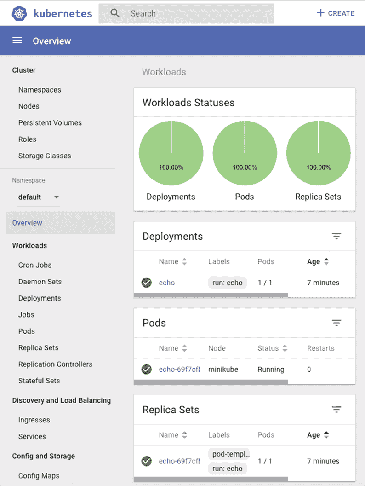

# Two

# 创建库本内特集群

# 概观

在前一章中，我们了解了 Kubernetes 的全部内容，它是如何设计的，它支持哪些概念，它的运行时引擎，以及它如何适合 CI/CD 管道。

从头开始创建 Kubernetes 集群是一项不平凡的任务。有许多选项和工具可供选择。有很多因素需要考虑。在本章中，我们将卷起袖子，使用 Minikube、KinD 和 K3d 为我们构建一些 Kubernetes 集群。我们将讨论和评估其他工具，如 Kubeadm、Kubespray、KRIB、RKE 和 bootkube。我们还将研究部署环境，如本地、云和裸机。我们将讨论的主题如下:

*   使用 Minikube 创建单节点集群
*   使用 KinD 创建多节点集群
*   使用 k3d 创建多节点群集
*   在云中创建集群
*   从头开始创建裸机集群
*   查看创建 Kubernetes 集群的其他选项

在本章的最后，您将对创建 Kubernetes 集群的各种选项有一个坚实的了解，并了解支持创建 Kubernetes 集群的最佳工具。您还将构建几个单节点和多节点集群。

# 使用 Minikube 创建单节点集群

在本节中，我们将使用 Minikube 创建本地单节点集群。本地集群对于希望在提交更改之前在机器上进行快速编辑-测试-部署-调试循环的开发人员来说是最有用的。本地集群对于希望在本地与 Kubernetes 一起玩的 DevOps 和运营商非常有用，无需担心破坏共享环境。虽然 Kubernetes 通常在生产中部署在 Linux 上，但许多开发人员在 Windows 电脑或 Macs 上工作。也就是说，如果您确实想在 Linux 上安装 Minikube，没有太多区别:


图 2.1:minikube 标志

## 测量 kubectl

在我们开始创建集群之前，让我们来谈谈 kubectl。它是官方的 Kubernetes 命令行界面，通过它的 API 与你的 Kubernetes 集群的 API 服务器进行交互。默认情况下，使用`~/.kube/config` 文件进行配置，该文件是一个 YAML 文件，包含一个或多个集群的元数据、连接信息以及身份验证令牌或证书。Kubectl 提供了一些命令，如果它包含多个集群，您可以使用这些命令来查看您的配置并在集群之间切换。您也可以通过设置`KUBECONFIG`环境变量将 kubectl 指向不同的配置文件。我更喜欢第三种方法，即为每个集群保留单独的配置文件，并将活动集群的配置文件复制到`~/.kube/config`(符号链接不起作用)。

我们将一起发现 kubectl 在这个过程中能做什么。这里的目的只是为了避免在使用不同的集群和配置文件时出现混乱。

## Minikube 快速入门

Minikube 是最成熟的本地 Kubernetes 集群。它运行最新稳定的 Kubernetes 版本，并支持 Windows、macOS 和 Linux。它支持:

*   `LoadBalancer`通过 Minikube 隧道的服务类型
*   `NodePort`通过 Minikube 服务的服务类型
*   多个集群
*   文件系统挂载
*   支持机器学习的图形处理器
*   RBAC
*   持久卷
*   进入
*   通过 Minikube 仪表板的仪表板
*   通过`start --container-runtime`标志定制容器运行时间
*   通过命令行标志配置应用编程接口服务器和 kubelet 选项
*   附加组件

## 准备好

在创建集群本身之前，有一些先决条件需要安装。其中包括 VirtualBox，Kubernetes 的 kubectl 命令行界面，当然还有 Minikube 本身。以下是写作时的最新版本列表:

*   VirtualBox:[https://www.virtualbox.org/wiki/Downloads](https://www.virtualbox.org/wiki/Downloads)
*   忽必烈:[https://忽必烈. io/docs/tasks/tools/install-忽必烈/](https://kubernetes.io/docs/tasks/tools/install-kubectl/)
*   mini kube:t0]https://kubrites . io/docs/tasks/tools/install-mini kube/

## 在窗口上

安装 VirtualBox 并确保 kubectl 和 Minikube 在您的路径上。我个人只是把我用的所有命令行程序都扔进`c:`。你可能更喜欢另一种方法。我使用优秀的 ConEMU 来管理多个控制台、终端和 SSH 会话。它与命令提示符、PowerShell、PuTTY、Cygwin、msys 和 Git-Bash 一起工作。它不会比 Windows 上的好太多。

使用 Windows 10 Pro，您可以选择使用 Hyper-V 虚拟机管理程序。这在技术上是比 VirtualBox 更好的解决方案，但它需要 Windows 的 Pro 版本，并且完全是 Windows 特有的。通过使用 VirtualBox，这些指令是通用的，并且很容易适应其他版本的窗口，或者其他操作系统。如果启用了 Hyper-V，则必须将其禁用，因为 VirtualBox 不能与 Hyper-V 共存。

我推荐在管理员模式下使用 PowerShell。您可以将以下别名和功能添加到您的 PowerShell 配置文件中:

```
Set-Alias -Name k -Value kubectl
function mk
{
  minikube-windows-amd64 `
  --show-libmachine-logs `
  --alsologtostderr      `
  @args
} 
```

## 在苹果电脑上

在 macOS 上，您可以选择使用 HyperKit 而不是使用 VirtualBox:

```
$ curl -LO https://storage.googleapis.com/minikube/releases/latest/docker-machine-driver-hyperkit \
  && chmod +x docker-machine-driver-hyperkit \
  && sudo mv docker-machine-driver-hyperkit /usr/local/bin/ \
  && sudo chown root:wheel /usr/local/bin/docker-machine-driver-hyperkit \
  && sudo chmod u+s /usr/local/bin/docker-machine-driver-hyperkit 
```

您可以在您的`.bashrc`文件中添加别名(类似于 Windows 上的 PowerShell 别名和功能):

```
alias k='kubectl'
alias mk='/usr/local/bin/minikube' 
```

如果选择 HyperKit 而不是 VirtualBox，则需要在启动集群时添加标志`--vm-driver=hyperkit`。

使用 HyperKit 时禁用任何 VPN 也很重要。

现在可以用`k`和`mk`，少打。`mk`功能中的 Minikube 标志提供了更好的日志记录，并且除了文件(类似于`tee`)之外，还将其指向控制台。

键入`mk` `version`验证 Minikube 是否正确安装和运行:

```
$ mk version
minikube version: v1.10.1 
```

键入`k` `version`以验证 kubectl 是否正确安装和运行:

```
$ k version
Client Version: version.Info{Major:"1", Minor:"18", GitVersion:"v1.18.3", GitCommit:"641856db18352033a0d96dbc99153fa3b27298e5", GitTreeState:"clean", BuildDate:"2020-05-20T12:52:00Z", GoVersion:"go1.13.9", Compiler:"gc", Platform:"darwin/amd64"}
The connection to the server localhost:8080 was refused — did you specify the right host or port?
Unable to connect to the server: dial tcp 192.168.99.100:8443: getsockopt: operation timed out 
```

不要担心最后一行的错误。没有正在运行的集群，因此 kubectl 无法连接到任何东西。这是意料之中的。

您可以探索 Minikube 和 kubectl 的可用命令和标志。我不会仔细检查每个命令，只会检查我使用的命令。

## 创建集群

Minikube 工具支持多个版本的 Kubernetes。在撰写本文时，最新版本是 1.18.0，这也是默认版本:

```
$ mk start
  minikube v1.10.1 on darwin (amd64)
  Creating virtualbox VM (CPUs=2, Memory=2048MB, Disk=20000MB) ...
  Configuring environment for Kubernetes v1.18.0 on Docker 19.03.8
  Pulling images ...
  Launching Kubernetes ...
  Verifying: apiserver proxy etcd scheduler controller dns
  Done! kubectl is now configured to use "minikube" 
```

当您重新启动现有的已停止集群时，您将看到以下输出:

```
$ mk start
  minikube v1.10.1 on darwin (amd64)
  Tip: Use 'minikube start -p <name>' to create a new cluster, or 'minikube delete' to delete this one.
  Restarting existing virtualbox VM for "minikube" ...
  Waiting for SSH access ...
  Configuring environment for Kubernetes v1.18.0 on Docker 19.03.8
  Relaunching Kubernetes v1.18.0 using kubeadm ...
  Verifying: apiserver proxy etcd scheduler controller dns
  Done! kubectl is now configured to use "minikube" 
```

让我们回顾一下【Minikube 在幕后为你做了什么。从头开始创建集群时，您需要做大量工作:

1.  启动 VirtualBox 虚拟机
2.  为本地计算机和虚拟机创建证书
3.  下载图像
4.  在本地机器和虚拟机之间建立网络
5.  在虚拟机上运行本地 Kubernetes 集群
6.  配置集群
7.  启动所有库本内特控制平面组件
8.  配置 kubectl 与集群对话

## 解决纷争

如果在此过程中出现问题，请尝试遵循错误信息。您可以添加`--alsologtostderr`标志，以获得控制台的详细错误信息。Minikube 所做的一切都被整齐地组织在`~/.minikube`下。以下是目录结构:

```
$ tree ~/.minikube -L 2 
/Users/gigi.sayfan/.minikube 
├── addons 
├── apiserver.crt 
├── apiserver.key 
├── ca.crt 
├── ca.key 
├── ca.pem 
├── cache 
│   ├── images 
│   ├── iso 
│   └── v1.15.0 
├── cert.pem 
├── certs 
│   ├── ca-key.pem 
│   ├── ca.pem 
│   ├── cert.pem 
│   └── key.pem 
├── client.crt 
├── client.key 
├── config 
├── files 
├── key.pem 
├── logs 
├── machines 
│   ├── minikube 
│   ├── server-key.pem 
│   └── server.pem 
├── profiles 
│   └── minikube 
├── proxy-client-ca.crt 
├── proxy-client-ca.key 
├── proxy-client.crt 
└── proxy-client.key
 13 directories, 19 files 
```

## 正在检查群集

现在我们已经有一个集群开始运行，让我们看看里面。

首先，让我们`ssh`进入 VM:

```
$ mk ssh
                         _             _             
            _         _ ( )           ( )            
  ___ ___  (_)  ___  (_)| |/')  _   _ | |_      __   
/' _ ` _ `\| |/' _ `\| || , <  ( ) ( )| '_`\  /'__`\ 
| ( ) ( ) || || ( ) || || |\`\ | (_) || |_) )(  ___/ 
(_) (_) (_)(_)(_) (_)(_)(_) (_)`\___/'(_,__/'`\____) 
$ uname -a
Linux minikube 4.19.107 #1 SMP Mon May 11 14:51:04 PDT 2020 x86_64 GNU/Linux 
$ 
```

太好了。很管用。奇怪的标记符号是“minikube”的 ASCII 艺术现在，让我们开始使用 kubectl，因为它是 Kubernetes 的瑞士军刀，将对所有集群(包括联邦集群)有用。

通过 *Ctrl* + *D* 或键入以下命令断开与虚拟机的连接:

```
$ logout 
```

我们将在整个旅程中讲述许多 kubectl 命令。首先，让我们使用`cluster-info`检查集群状态:

```
$ k cluster-info
Kubernetes master is running at https://192.168.99.103:8443
KubeDNS is running at https://192.168.99.103:8443/api/v1/namespaces/kube-system/services/kube-dns:dns/proxy
To further debug and diagnose cluster problems, use kubectl cluster-info dump. 
```

你可以看到主机运行正常。要以 JSON 的形式查看集群中所有对象的更详细视图，请键入`k cluster-info dump`。输出可能有点令人生畏，所以让我们使用更具体的命令来探索集群。

让我们使用`get nodes`检查集群中的节点:

```
$ k get nodes
NAME       STATUS   ROLES    AGE   VERSION
minikube   Ready    master   28m   v1.16.3 
```

因此，我们有一个名为`minikube.`的节点，要获得更多关于它的信息，请键入`k describe node minikube`。

输出冗长；我会让你自己试试。

## 工作

我们有一个很好的空集群运行(嗯，不完全是空的，因为域名系统服务和仪表板在`kube-system`名称空间中作为吊舱运行)。是时候部署一些吊舱了:

```
$ k create deployment echo --image=gcr.io/google_containers/echoserver:1.8
deployment.apps/echo created 
```

让我们来看看创建的 pod:

```
$ k get pods
NAME                   READY   STATUS    RESTARTS   AGE
echo-855975f9c-r6kj8   1/1     Running   0          2m11s 
```

要将我们的 pod 公开为服务，请键入以下内容:

```
$ k expose deployment echo --type=NodePort --port=8080
service/echo exposed 
```

将服务公开为类型`NodePort`意味着它在某个端口上公开给主机。但它不是我们运行吊舱的 8080 端口。端口在集群中映射。要访问该服务，我们需要群集 IP 和公开端口:

```
$ mk ip
192.168.99.103
$ k get service echo --output="jsonpath='{.spec.ports[0].nodePort}'"
31800 
```

现在，我们可以访问回声服务，该服务返回大量信息。

用前面命令的结果替换 IP 地址和端口:

```
$ curl http://192.168.99.103:31800/hi
    Hostname: echo-855975f9c-r6kj8

   Pod Information:
        -no pod information available-

   Server values:
        server_version=nginx: 1.13.3 - lua: 10008

   Request Information:
        client_address=172.17.0.1
        method=GET
        real path=/hi
        query=
        request_version=1.1
        request_uri=http://192.168.99.103:8080/hi

   Request Headers:
        accept=*/*
        host=192.168.99.103:31800
        user-agent=curl/7.64.0

   Request Body:
        -no body in request- 
```

恭喜你！您刚刚创建了一个本地 Kubernetes 集群，部署了一个服务，并向世界公开了它。

## 使用仪表板检查集群

Kubernetes 有一个非常好的网络界面，当然，它是作为一个服务部署在 pod 中的。仪表板设计良好，提供了集群的高级概述。它还允许您深入查看单个资源、查看日志、编辑资源文件等。当你想手动检查你的集群时，它是完美的武器。要启动它，请键入:

```
$ mk dashboard
  Enabling dashboard ...
  Verifying dashboard health ...
  Launching proxy ...
  Verifying proxy health ...
  Opening http://127.0.0.1:56853/api/v1/namespaces/kube-system/services/http:kubernetes-dashboard:/proxy/ in your default browser... 
```

Minikube 将打开一个带有仪表板用户界面的浏览器窗口。请注意，在 Windows 上，Microsoft Edge 无法显示仪表板。我不得不自己在不同的浏览器上运行它。

这是工作负载视图，其中显示了部署、复制集、复制控制器和 pods:



图 2.2:无间隙仪表板 UI

它还可以显示守护程序集、有状态集和作业，但是我们在这个集群中没有。

在本节中，我们在 Windows 上创建了一个本地单节点 Kubernetes 集群，使用 kubectl 对其进行了一些探索，部署了一个服务，并使用 web UI 进行了游戏。在下一节中，我们将继续讨论多节点集群。

# 使用 KinD 创建多节点集群

在本节中，我们将使用 KinD 创建一个多节点集群。我们还将重复我们在 Minikube 上部署的 echo 服务器的部署，并观察差异。剧透警报–一切都将变得更快更容易！

## KinD 快速入门

KinD 在 Docker 中代表 Kubernetes。这是一个用于创建短暂集群(无持久存储)的工具。它主要是为运行 Kubernetes 一致性测试而构建的。它支持 Kubernetes 1.11+。在封面下，它使用`kubeadm`引导 Docker 容器作为集群中的节点。KinD 是库和命令行界面的组合。您可以将代码中的库用于测试或其他目的。KinD 可以创建具有多个主节点的高可用性集群。最后，KinD 是一个符合 CNCF 的 Kubernetes 安装程序。如果它用于 Kubernetes 本身的一致性测试，那就更好了。

KinD 启动速度超级快，但它也有一些限制:没有持久存储，也不支持替代运行时，只有 Docker。

让我们安装 KinD 并开始吧。

## 正在安装 KinD

您必须将 Docker 安装为 KinD，就像 Docker 容器一样运行。如果您安装了 Go 1.11+，您可以通过以下方式安装 KinD 命令行界面:

```
$ GO111MODULE="on" go get sigs.k8s.io/kind@v0.8.1 
```

否则，在 macOS 上，键入:

```
$ curl -Lo ./kind-darwin-amd64 https://github.com/kubernetes-sigs/kind/releases/download/v0.8.1/kind-darwin-amd64
$ chmod +x ./kind-darwin-amd64
$ mv ./kind-darwin-amd64 /usr/local/bin/kind 
```

在 Windows 上，键入(在 PowerShell 中):

```
c:\> curl.exe -Lo kind-windows-amd64.exe https://github.com/kubernetes-sigs/kind/releases/download/v0.8.1/kind-windows-amd64
c:\> Move-Item .\kind-windows-amd64.exe c:\windows\kind.exe 
```

## 用 KinD 创建集群

创建一个集群是超级容易的:

```
$ kind create cluster
Creating cluster "kind" ...
  Ensuring node image (kindest/node:v1.16.3) 
  Preparing nodes 
  Creating kubeadm config 
  Starting control-plane 
Cluster creation complete. You can now use the cluster with:
export KUBECONFIG="$(kind get kubeconfig-path --name="kind")"
kubectl cluster-info 
```

KinD 建议您导出 KUBECONFIG，但是正如我前面提到的，我更喜欢将配置文件复制到`~/.kube/config`中，这样如果我想从另一个终端窗口访问集群，就不必再次导出:

```
$ cp $(kind get kubeconfig-path --name="kind") ~/.kube/config 
```

现在，我们可以使用 kubectl 访问集群:

```
$ k cluster-info
Kubernetes master is running at https://localhost:58560
KubeDNS is running at https://localhost:58560/api/v1/namespaces/kube-system/services/kube-dns:dns/proxy
To further debug and diagnose cluster problems, use 'kubectl cluster-info dump.' 
```

但是，这会创建单节点群集:

```
$ k get nodes
NAME                 STATUS   ROLES    AGE   VERSION
kind-control-plane   Ready    master   11m   v1.16.3 
```

让我们删除它并创建一个多节点集群:

```
$ kind delete cluster
Deleting cluster "kind" ... 
```

要创建一个多节点集群，我们需要提供一个配置文件，其中包含节点的规范。下面是一个配置文件，它将创建一个具有一个`control-plane`节点和两个`worker`节点的集群:

```
kind: Cluster
apiVersion: kind.sigs.k8s.io/v1alpha3
nodes:
- role: control-plane
- role: worker
- role: worker 
```

让我们将配置文件保存为`kind-multi-node-config.yaml`并创建集群:

```
$ kind create cluster --config kind-multi-node-config.yaml
Creating cluster "kind" ...
  Ensuring node image (kindest/node:v1.16.3) 
  Preparing nodes   
  Creating kubeadm config 
  Starting control-plane 
  Joining worker nodes 
Cluster creation complete. You can now use the cluster with:
export KUBECONFIG="$(kind get kubeconfig-path --name="kind")"
kubectl cluster-info 
```

是啊，成功了！我们现在有一个本地三节点集群:

```
$ k get nodes
NAME                  STATUS     ROLES    AGE   VERSION
kind-control-plane    Ready      master   12m   v1.16.3
kind-worker           NotReady   <none>   11m   v1.16.3
kind-worker2          NotReady   <none>   11m   v1.16.3 
```

KinD 也是 kind 足够(看我在那里做了什么)让我们创建**高可用** ( **HA** )集群带有多个控制平面节点用于冗余。让我们试一试，看看它有两个 `control-plane`节点和两个`worker`节点是什么样子的:

```
kind: Cluster
apiVersion: kind.sigs.k8s.io/v1alpha3
nodes:
- role: control-plane
- role: control-plane
- role: worker
- role: worker 
```

让我们将配置文件保存为`kind-ha-multi-node-config.yaml`，删除当前集群，创建一个新的高可用性集群:

```
$ kind delete cluster
Deleting cluster "kind" ...
$ kind create cluster --config kind-ha-multi-node-config.yaml
Creating cluster "kind" ...
  Ensuring node image (kindest/node:v1.16.3) 
  Preparing nodes      
  Starting the external load balancer 
  Creating kubeadm config 
  Starting control-plane 
  Joining more control-plane nodes 
  Joining worker nodes 
Cluster creation complete. You can now use the cluster with:
export KUBECONFIG="$(kind get kubeconfig-path --name="kind")"
kubectl cluster-info 
```

嗯...这里有新的东西。现在，KinD 创建了一个外部负载平衡器，并在加入工作节点之前加入更多的控制平面节点。负载平衡器对于在所有控制平面节点上分发请求是必要的。

请注意，外部负载平衡器不会显示为使用 kubectl 的节点:

```
$ k get nodes
NAME                  STATUS   ROLES    AGE     VERSION
kind-control-plane    Ready    master   8m31s   v1.16.3
kind-control-plane2   Ready    master   8m14s   v1.16.3
kind-worker           Ready    <none>   7m35s   v1.16.3
kind-worker2          Ready    <none>   7m35s   v1.16.3 
```

然而，KinD 有自己的get nodes 命令，在这里可以看到负载平衡器:

```
$ kind get nodes
kind-control-plane2
kind-worker
kind-control-plane
kind-worker2
kind-external-load-balancer 
```

## 和 KinD 一起工作

让我们在 KinD 集群上部署我们的回声服务。开始是一样的:

```
$ k create deployment echo --image=gcr.io/google_containers/echoserver:1.8 deployment.apps/echo created
$ k expose deployment echo --type=NodePort --port=8080
service/echo exposed 
```

检查我们的服务，我们可以看到回声服务前端和中心:

```
$  k get svc echo
NAME   TYPE       CLUSTER-IP     EXTERNAL-IP   PORT(S)          AGE
echo   NodePort   10.105.48.21   <none>        8080:31550/TCP   3m5s 
```

但是，该服务没有外部 IP。有了 Minikube，我们通过`$(minikube ip)`得到了 Minikube 节点本身的 IP，我们可以结合节点端口使用它来访问服务。这不是 KinD 集群的选项。让我们看看如何使用代理来访问 echo 服务。

## 通过代理在本地访问 Kubernetes 服务

在本节中，我们将详细介绍网络、服务以及如何在集群外公开它们。

在这里，我只是展示如何完成它，让你暂时保持悬念。首先，我们需要运行 kubectl `proxy`命令，该命令公开了 localhost 上的 API 服务器、pods 和服务:

```
$ k proxy &
[1] 10653
Starting to serve on 127.0.0.1:8001 
```

然后，我们可以通过包含公开端口(8080)而不是节点端口的特制代理 URL 来访问 echo 服务。

我这里用 **Httpie** 。你也可以使用**卷曲**。要安装 Httpie，请按照这里的说明:[https://httpie.org/doc#installation](https://httpie.org/doc#installation):

```
$ http http://localhost:8001/api/v1/namespaces/default/services/echo:8080/proxy/
HTTP/1.1 200 OK
Content-Length: 534
Content-Type: text/plain
Date: Thu, 28 May 2020 21:27:56 GMT
Server: echoserver
Hostname: echo-74545d499-wqkn9
Pod Information:
    -no pod information available-
Server values:
    server_version=nginx: 1.13.3 - lua: 10008
Request Information:
    client_address=10.40.0.0
    method=GET
    real path=/
    query=
    request_version=1.1
    request_uri=http://localhost:8080/
Request Headers:
    accept=*/*
    accept-encoding=gzip, deflate
    host=localhost:8001
    user-agent=HTTPie/0.9.9
    x-forwarded-for=127.0.0.1, 172.17.0.1
    x-forwarded-uri=/api/v1/namespaces/default/services/echo:8080/proxy/
Request Body:
    -no body in request- 
```

我们将在未来的章节(第 12 章、【第 3 章】库本内斯的无服务器计算)中深入探究到底发生了什么。让我们来看看我最喜欢的本地集群解决方案:k3d。

# 使用 k3d 创建多节点集群

在本节中，我们将使用 Rancher 的 k3d 创建一个多节点集群。我们将不重复回声服务器的部署，因为它与 KinD 集群相同，包括通过代理访问它。剧透提醒–它比 KinD 更快，更方便用户！

## k3s 和 k3d 简介

牧场主创造了 k3s，这是一个轻量级的 Kubernetes 发行版。牧场主说 k3s 比 k8s 少五个，如果这有任何意义的话。基本思想是删除大多数人不需要的特性和功能，例如:

*   非默认功能
*   传统功能
*   阿尔法特征
*   树内存储驱动程序
*   树内云提供商

然而，最大的问题是 k3s 删除了 Docker，而是使用了 containerd。如果你依赖 Docker，你仍然可以把它带回来。

另一个主要变化是 k3s 将其状态存储在 SQLite DB 中，而不是 etcd 中。

对于联网和 DNS，k3s 使用法兰绒和 CoreDNS。

k3s 还增加了一个简化安装程序，负责 SSL 和证书供应。

最终结果令人惊讶——一个二进制文件(小于 40 MB)只需要 512 MB 的内存。

与 Minikube 和 KinD 不同，k3s 实际上是为生产而设计的。主要用例是边缘计算、物联网和竞争情报系统。它针对 ARM 设备进行了优化。

好的。那是 k3s，但 k3d 是什么？k3d 吸收了 k3s 的所有优点，将其打包在 Docker 中(类似于 KinD)，并添加了一个友好的 CLI 来管理它。

## 安装 k3d

安装 k3d 就像一样简单:

```
$ curl -s https://raw.githubusercontent.com/rancher/k3d/master/install.sh | bash 
```

通常的免责声明是有效的-确保在下载安装脚本并将其传送到 bash 之前阅读它。

## 用 k3d 创建集群

你准备好惊讶了吗？用 k3d 创建单节点集群用时不到 2 秒！

```
$ time k3d create --workers 1
2020/05/28 17:07:36 Created cluster network with ID f09fde83314b059d1a442ec1d01fcd62e522e5f1d838121528c5a1ae582e3cbf
2020/05/28 17:07:36 Creating cluster [k3s-default]
2020/05/28 17:07:36 Creating server using docker.io/rancher/k3s:v1.17.3-k3s1...
2020/05/28 17:07:36 Booting 1 workers for cluster k3s-default
2020/05/28 17:07:37 Created worker with ID 8a6bd47f7a5abfbac5c396c45f13db04c7e18749ff4d2e054e737fe7f7843010
2020/05/28 17:07:37 SUCCESS: created cluster [k3s-default]
2020/05/28 17:07:37 You can now use the cluster with:
export KUBECONFIG="$(k3d get-kubeconfig --name='k3s-default')"
kubectl cluster-info
real    0m1.896s
user    0m0.009s
sys 0m0.011s 
```

多节点集群怎么样？我们看到 KinD 要慢得多，尤其是在创建一个具有多个控制平面节点和一个外部负载平衡器的高可用性集群时。

让我们先删除单节点集群:

```
$ k3d delete
2020/05/28 17:08:42 Removing cluster [k3s-default]
2020/05/28 17:08:42 ...Removing 1 workers
2020/05/28 17:08:43 ...Removing server
2020/05/28 17:08:45 SUCCESS: removed cluster [k3s-default] 
```

现在，让我们创建一个具有三个工作节点的集群。这需要 5 秒多一点的时间:

```
$ time k3d create --workers 3
2020/05/28 17:09:16 Created cluster network with ID 5cd1e01434edb1facdab28e563b78b605af416e2ad062dc121400c3f8a5d166c
2020/05/28 17:09:16 Creating cluster [k3s-default]
2020/05/28 17:09:16 Creating server using docker.io/rancher/k3s:v1.17.3-k3s1...
2020/05/28 17:09:17 Booting 3 workers for cluster k3s-default
2020/05/28 17:09:19 Created worker with ID 4b442116f8df7debecc9d70cee8ae8fb8f16783c0a8f111268be531f71dd54fa
2020/05/28 17:09:20 Created worker with ID 369879f1a38d60935908705f56b34a95caf6a44970beeb509c0cfb2047cd503a
2020/05/28 17:09:20 Created worker with ID d531937996fd25490276e32150b69aa2356c90cfcd1b480ab77ec3d2be08a2f6
2020/05/28 17:09:20 SUCCESS: created cluster [k3s-default]
2020/05/28 17:09:20 You can now use the cluster with:
export KUBECONFIG="$(k3d get-kubeconfig --name='k3s-default')"
kubectl cluster-info
real    0m5.164s
user    0m0.011s
sys 0m0.019s 
```

让我们验证集群是否按预期工作:

```
$ export KUBECONFIG="$(k3d get-kubeconfig --name='k3s-default')"
$ kubectl cluster-info
Kubernetes master is running at https://localhost:6443
CoreDNS is running at https://localhost:6443/api/v1/namespaces/kube-system/services/kube-dns:dns/proxy
To further debug and diagnose cluster problems, use 'kubectl cluster-info dump'. 
```

这里是节点。注意，只有一个大师叫做`k3d-k3s-default-server`:

```
$ k get nodes
NAME                       STATUS   ROLES    AGE   VERSION
k3d-k3s-default-server     Ready    <none>   14h   v1.17.3-k3s1
k3d-k3s-default-worker-0   Ready    <none>   14h   v1.17.3-k3s1
k3d-k3s-default-worker-1   Ready    <none>   14h   v1.17.3-k3s1
k3d-k3s-default-worker-2   Ready    <none>   14h   v1.17.3-k3s1 
```

您可以使用 k3d 命令行界面停止和启动集群，创建多个集群，并列出现有集群。这是所有的命令。请随意进一步探索:

```
$ k3d
NAME:
   k3d - Run k3s in Docker!
USAGE:
   k3d [global options] command [command options] [arguments...]
VERSION:
   v1.7.0
AUTHORS:
   Thorsten Klein iwilltry42@gmail.com
   Rishabh Gupta r.g.gupta@outlook.com
   Darren Shepherd
COMMANDS:
     check-tools, ct  Check if docker is running
     shell            Start a subshell for a cluster
     create, c        Create a single- or multi-node k3s cluster in docker containers
     delete, d, del   Delete cluster
     stop             Stop cluster
     start            Start a stopped cluster
     list, ls, l      List all clusters
     get-kubeconfig   Get kubeconfig location for cluster
     help, h          Shows a list of commands or help for one command
GLOBAL OPTIONS:
   --verbose      Enable verbose output
   --help, -h     show help
   --version, -v  print the version 
```

您可以自己重复部署、公开和访问 echo 服务的步骤。它就像 KinD 一样工作。

好的。我们使用 Minikube、KinD 和 k3d 创建了集群。让我们比较一下，这样你就能决定哪一个适合你。

# 比较 Minikube、KinD 和 k3d

Minikube 是官方的本地 Kubernetes 发布。它是库本内特的一部分；非常成熟，功能非常全。也就是说，它需要一个虚拟机，并且安装和启动都很慢。它也可能在任意时间遇到网络问题，有时唯一的解决办法是删除集群并重新启动。此外，Minikube 仅支持单个节点。我建议只有当 Minikube 支持某些你需要的功能，而这些功能在 KinD 或 k3d 中都不可用时，才使用 Minikube。

KinD 比 Minikube 快得多，用于 Kubernetes 一致性测试，因此根据定义，它是一个一致的 Kubernetes 分布。它是唯一一个为高可用性集群提供多个控制平面节点的本地集群解决方案。它也被设计成一个库，我不认为这是一个很大的吸引力，因为从代码中自动化 CLIs 非常容易。KinD 对当地发展的主要不利之处是它是短暂的。如果你对 Kubernetes 本身有贡献，并且想测试它，我建议使用 KinD。

k3d 显然是我的赢家。它速度极快，支持多个集群，并且每个集群支持多个工作节点。在不丢失状态的情况下停止和启动集群也很容易。

好吧。让我们来看看云。

# 在云中创建集群(GCP、AWS、Azure)

在本地创建集群很有趣。在开发过程中以及试图在本地解决问题时，这也很重要。但是，最终，Kubernetes 是为云原生应用程序(在云中运行的应用程序)设计的。Kubernetes 不想了解单个云环境，因为这无法扩展。相反，Kubernetes 有云提供商接口的概念。每个云提供商都可以实现这个接口，然后托管 Kubernetes。请注意，从 1.5 版本开始，Kubernetes 仍然在其树中维护许多云提供商的实现，但是在未来，它们将被重构。

## 云提供商界面

云提供商接口是围棋数据类型和接口的集合。它被定义在一个名为`cloud.go`的文件中，可在[https://github . com/kubernetes/cloud-provider/blob/master/cloud . go](https://github.com/kubernetes/cloud-provider/blob/master/cloud.go)上获得。

这里是主界面:

```
type Interface interface {
     Initialize(clientBuilder controller.ControllerClientBuilder)
  LoadBalancer() (LoadBalancer, bool)
    Instances() (Instances, bool)
     Zones() (Zones, bool)
     Clusters() (Clusters, bool)
   Routes() (Routes, bool)
     ProviderName() string
     HasClusterID() bool
} 
```

这一点非常清楚。Kubernetes 根据实例、区域、集群和路由进行操作，并且还需要访问负载平衡器和提供者名称。主界面主要是一个网关。大多数方法还返回其他接口。

比如`Clusters`界面就很简单:

```
type Clusters interface {
  ListClusters() ([]string, error)
  Master(clusterName string) (string, error)
} 
```

`ListClusters()`方法返回集群名称。`Master()`方法返回主节点的 IP 地址或 DNS 名称。

其他接口也没有复杂多少。整个文件有 214 行长(在撰写本文时)，包括大量注释。要点是，如果您的云利用这些基本概念，那么实现 Kubernetes 提供商并不太复杂。

## GCP

**谷歌云平台** ( **GCP** )支持库本内斯开箱即用。所谓的**谷歌 Kubernetes 引擎** ( **GKE** )就是基于 Kubernetes 构建的容器管理解决方案。您不需要在 GCP 安装 Kubernetes，您可以使用谷歌云应用编程接口来创建 Kubernetes 集群并提供它们。事实上，Kubernetes 是 GCP 的一个内置部分，这意味着它将始终得到很好的集成和测试，您不必担心底层平台的变化会破坏云提供商的界面。

总而言之，如果你计划将你的系统建立在 Kubernetes 的基础上，并且你在其他云平台上没有任何现有的代码，那么 GCP 是一个可靠的选择。它在成熟性、完善性和与 GCP 服务的深度集成方面处于领先地位，并且通常是第一个更新到较新版本的 Kubernetes 的。

## 自动警报系统

AWS 有自己的容器管理服务，名为**弹性容器服务** ( **ECS** )，它不是基于 Kubernetes 的。它还有一个由管理的库本内斯服务叫做**弹性库本内斯服务** ( **EKS** )。但是，您可以自己在 AWS EC2 实例上运行 Kubernetes。

事实上，世界上大多数生产 Kubernetes 部署都运行在 AWS EC2 上。我们先来谈谈如何推出自己的 Kubernetes，然后再来讨论 EKS。

### EC2 上的立方结构

AWS 从一开始就是一个受支持的云提供商。有很多关于如何设置它的文档。虽然您可以自己调配一些 EC2 实例，并使用 kubeadm 来创建集群，但我建议使用 Kops (Kubernetes Operations)项目。Kops 是 GitHub 上的一个 Kubernetes 项目:[https://github.com/kubernetes/kops/blob/master/docs/aws.md](https://github.com/kubernetes/kops/blob/master/docs/aws.md)。它不是核心 Kubernetes 存储库的一部分，但它是由 Kubernetes 开发人员开发和维护的。

它支持以下功能:

*   云的自动化库本内特集群 CRUD(AWS)。
*   高度可用的 Kubernetes 集群。
*   使用状态同步模型进行模拟运行和自动幂等。
*   对 kubectl 加载项的自定义支持。
*   Kops 可以生成 Terraform 配置。
*   基于目录树中定义的简单元模型。
*   简单的命令行语法。
*   社区支持。

要创建集群，您需要通过 route53 进行一些最小的 DNS 配置，设置一个 S3 桶来存储集群配置，然后运行一个命令:

```
kops create cluster --cloud=aws --zones=us-east-1c ${NAME} 
```

完整的说明可以在这里找到:[https://github . com/kubernetes/kops/blob/master/docs/get _ starting/AWS . MD](https://github.com/kubernetes/kops/blob/master/docs/getting_started/aws.md)。

2017 年底，AWS 加入 CNCF，并发布了两个关于 Kubernetes 的重大公告:其自己的基于 Kubernetes 的容器编排解决方案(EKS)和容器按需解决方案(Fargate)。

### 前情提要

**AWS EKS** 是一个全面管理的和高可用性的 Kubernetes 解决方案。它有三个主人运行在三个 az。EKS 还负责升级和修补。EKS 的伟大之处在于它经营着一只库伯内斯股票。这意味着你可以使用社区开发的所有标准插件和工具。它还为与其他云提供商和/或您自己的内部 Kubernetes 集群的便捷集群联合打开了大门。

EKS 提供了与 AWS 基础设施的深度集成，比如 IAM 身份验证如何与 Kubernetes **基于角色的访问控制** ( **RBAC** )集成。

如果你想直接从你自己的**亚马逊虚拟私有云** ( **亚马逊 VPC** )访问你的库本内特大师，你也可以使用 **AWS PrivateLink** 。有了 PrivateLink，你的 Kubernetes masters 和亚马逊 EKS 服务端点就像一个弹性的网络接口，在你的亚马逊 VPC 有私有的 IP 地址。

这个难题的另一个重要部分是一个特殊的 CNI 插件，它可以让你的 Kubernetes 组件使用 AWS 网络相互通信。

EKS 一直在变得更好，亚马逊证明了它致力于更新和改进它。如果你是一个 AWS 商店，并进入 Kubernetes，我建议从 EKS 开始，而不是建立自己的集群。

eksctl 工具是创建和管理 EKS 集群和节点组的绝佳 CLI。我使用 eksctl 成功地在 AWS 上创建、删除和添加了几个 Kubernetes 集群的节点。查看[https://eksctl.io/](https://eksctl.io/)。

### 法盖特

**AWS Fargate** 让您可以直接运行容器，而无需担心硬件供应。它消除了很大一部分操作复杂性，但代价是失去了一些控制。使用 Fargate 时，您将应用程序打包到一个容器中，指定 CPU 和内存需求，定义网络和 IAM 策略，然后开始比赛。法盖特目前可以跑在欧洲冠军之上，未来可以跑在 EKS 之上。它是无服务器阵营中非常有趣的成员，尽管它与 Kubernetes 没有直接关系。

## 蔚蓝的

**Azure** 曾经有自己的容器管理服务。您可以使用基于 Mesos 的 DC/操作系统或 Docker Swarm 来管理它们。但是你当然也可以使用 Kubernetes。您还可以自己调配集群(例如，使用 Azure 所需的状态配置)，然后使用 Kubernetes 创建 kubeadm 集群。Azure 没有等同的 Kops，但是 Kubespray 项目是一个很好的选择。

然而，在 2017 年下半年，Azure 也加入了 Kubernetes 的行列，推出了 **Azure Kubernetes 服务** ( **AKS** )。它类似于亚马逊 EKS，尽管在实现上稍微领先一点。

AKS 提供了一个 REST API 和一个 CLI 来管理你的 Kubernetes 集群。但是，您可以直接使用 kubectl 和任何其他 Kubernetes 工具。

以下是使用 AKS 的一些好处:

*   自动化 Kubernetes 版本升级和修补
*   轻松扩展集群
*   自修复托管控制平面(主控)
*   成本节约–仅支付运行代理池节点的费用

AKS 还提供与 **Azure 容器实例** ( **ACI** )的集成，类似于 AWS Fargate。这意味着不仅要管理 Kubernetes 集群的控制平面，还要管理工作节点。

AKS 的另一个有趣的特点是 AKS-Engine:[https://github.com/Azure/aks-engine](https://github.com/Azure/aks-engine)。AKS-Engine 是一个开放的源码项目，是 AKS 的核心。使用托管服务的一个缺点是，您必须接受云提供商的选择。如果您有特殊要求，那么另一种选择是创建自己的集群，这是一项大事业。有了 AKS Engine，你可以接受 AKS 团队所做的工作，只定制对你来说重要的部分。

## 其他云提供商

GCP、AWS 和 Azure 是领先的，但也有相当多的其他公司提供托管 Kubernetes 服务。一般来说，如果您已经有了重要的业务联系或集成，我建议使用这些提供商。

### 从前在中国

如果你在中国运营，有其特殊的约束和限制，你可能应该使用中国的云平台。有三大巨头:阿里巴巴、腾讯、华为。

中国**阿里巴巴云**是云平台场景中的后起之秀。它非常接近 AWS，尽管它的英文文档还有很多地方需要改进。我在阿里巴巴云上部署了一些生产应用，但不是 Kubernetes 集群。阿里巴巴云通过其**阿里巴巴针对库本内特的容器服务** ( **ACK** )以多种方式支持库本内特:

*   运行您自己的专用 Kubernetes 集群(您必须创建三个主节点并升级和维护它们)
*   使用托管的 Kubernetes 集群(您只负责工作节点)
*   通过**弹性容器实例** ( **ECIs** )使用无服务器 Kubernetes 集群，类似于 Fargate 和 ACI

ACK 是 CNCF 认证的 Kubernetes 发行版。如果你需要在中国部署云原生应用，那么 ACK 看起来是个不错的选择。

腾讯是另一家拥有自己云平台和 Kubernetes 支持的中国大公司。**腾讯 Kubernetes 引擎** ( **TKE** )似乎没有 ACK 成熟。

最后，华为云平台提供了**云容器引擎** ( **CCE** ，它是建立在 Kubernetes 之上的。它支持虚拟机、裸机和 GPU 加速实例。

### IBM kuble 服务

国际商用机器公司正在大量投资库本内特公司。它在 2018 年底收购了红帽。当然，红帽是 Kubernetes 世界的主要玩家，它建立了基于 OpenShift Kubernetes 的平台，并将 RBAC 贡献给了 Kubernetes。IBM 有自己的云平台，并提供托管的 Kubernetes 集群。你可以用 200 美元的点数免费试用。

IBM 也参与了 Istio 和 Knative 的开发，因此 IKS 很可能会与这些新兴技术进行深度集成。

### 甲骨文容器服务

甲骨文也有一个云平台，当然，也提供托管的 Kubernetes 服务，具有高可用性、裸机实例和多 AZ 支持。

在本节中，我们介绍了云提供商界面，并查看了在各种云提供商上创建 Kubernetes 集群的推荐方法。场景还很年轻，工具发展很快。我相信融合很快就会发生。像 Kargo 和 Kubernetes-anywhere 这样的工具和项目已经被弃用或合并到其他项目中。Kubeadm 已经成熟，并且是许多其他工具的基础，这些工具可以引导和创建云内外的 Kubernetes 集群。现在，让我们考虑一下创建裸机集群需要什么，在裸机集群中，您还必须调配硬件和低级网络。

# 从头开始创建裸机集群

在前一节中，我们研究了在云提供商上运行 Kubernetes。这是 Kubernetes 的主要部署故事。但是在裸机上运行 Kubernetes 有很强的用例。我不会在这里重点讨论托管和内部。这是另一个维度。如果您已经在内部管理了许多服务器，那么您是最有资格做出决定的。

## 裸机使用案例

裸机集群是一只熊，尤其是如果你自己管理它们的话。有一些公司为裸机 Kubernetes 集群提供商业支持，比如 Platform 9，但是产品还不成熟。一个可靠的开源选项是 Kubespray，它可以在裸机、AWS、GCE、Azure 和 OpenStack 上部署工业级的 Kubernetes 集群。

以下是一些有意义的用例:

*   **价格**:如果你已经管理了大规模的裸集群，那么在你的物理基础设施上运行 Kubernetes 集群可能会便宜很多。
*   **低网络延迟**:如果您的节点之间必须有低延迟，那么虚拟机开销可能会太大。
*   **监管要求**:如果必须遵守规定，可能不允许使用云提供商。
*   **你想要完全控制硬件**:云提供商给你很多选择，但你可能有特殊需求。

## 您应该何时考虑创建裸机集群？

从头开始创建集群的复杂性非常大。库本内斯星团不是一只微不足道的野兽。网络上有很多关于如何建立裸机集群的文档，但是随着整个生态系统的发展，这些指南中的许多很快就会过时。

如果您有能力在堆栈的每一层调试问题，您应该考虑走这条路。大多数问题可能都与网络有关，但是文件系统和存储驱动程序也可能会困扰您，还有一些组件之间的一般不兼容性和版本不匹配，如 Kubernetes 本身、Docker(或其他运行时，如果您使用它们)、映像、您的操作系统、您的操作系统内核以及您使用的各种插件和工具。如果您选择在裸机上使用虚拟机，那么您又增加了一层复杂性。

## 了解流程

有很多事情要做。这里列出了一些你必须解决的问题:

*   实现您自己的云提供商界面或避开它
*   选择一个网络模型和如何实现它(CNI 插件，直接编译)
*   是否使用网络策略
*   为系统组件选择图像
*   安全模型和 SSL 证书
*   管理员凭据
*   组件模板，如应用编程接口服务器、复制控制器和调度程序
*   集群服务:域名系统、日志记录、监控和图形用户界面

我推荐 Kubernetes 网站的以下指南，以更深入地了解使用 Kubernetes:[https://Kubernetes . io/docs/setup/production-environment/tools/kuberatm/high-availability/](https://kubernetes.io/docs/setup/production-environment/tools/kubeadm/high-availability/)从头开始创建 HA 集群需要什么。

## 使用虚拟私有云基础架构

如果您的用例属于裸机用例，但您没有必要的熟练人力或倾向于处理裸机的基础架构挑战，您可以选择使用私有云，如带有 Stackube 的 OpenStack:[https://github.com/openstack/stackube](https://github.com/openstack/stackube)。如果你想在抽象阶梯上更高一点，那么 Mirantis 提供了一个建立在 OpenStack 和 Kubernetes 之上的云平台。

让我们回顾一下在裸机上构建 Kubernetes 集群的更多工具。其中一些工具也支持 OpenStack。

## 使用 Kubespray 构建您自己的集群

Kubespray 是一个部署生产就绪的高可用性 Kubernetes 集群的项目。它使用 Ansible，可以在大量目标上部署 Kubernetes，例如:

*   自动警报系统
*   普通教育证书
*   蔚蓝的
*   OpenStack
*   vssphere
*   包装(裸机)
*   甲骨文云基础设施(实验性)

也适用于普通裸机。

它是高度可定制的，支持节点的多个操作系统、网络的多个 CNI 插件和多个容器运行时。

如果你想在本地测试它，它也可以部署到一个多节点的游民设置中。如果你是 Ansible 的粉丝，Kubespray 可能是你的一个很好的选择。

## 使用 KRIB 构建集群

KRIB 是一个 Kubernetes 安装程序，用于使用**数字钢筋供应** ( **DRP** )供应的裸机集群。DRP 是一个单一的 Golang 可执行文件，它在裸机配置(PXE/iPXE)和工作流自动化方面处理了很多像 DHCP 这样的繁重工作。KRIB 驱动kube dam，以确保它以有效的 Kubernetes 集群结束。该流程包括:

*   服务器发现
*   克里布内容和证书插件的安装
*   开始群集部署
*   监控部署
*   访问群集

详见https://kubernetes . io/docs/setup/production-environment/tools/krib/。

## 与 RKE 建立集群

**牧场主 Kubernetes Engine**(**RKE**)是一款友好的 Kubernetes 安装程序，可以在裸机和虚拟化服务器上安装 Kubernetes。RKE 旨在解决安装 Kubernetes 的复杂性。它是开源的，有很好的文档。在这里查看:[http://rancher.com/docs/rke/v0.1.x/en/](http://rancher.com/docs/rke/v0.1.x/en/)。

## 布特库贝

**Bootkube** 也很有意思。它可以启动自我托管的 Kubernetes 集群。自托管意味着大多数集群组件作为常规的 pods 运行，并且可以使用您用于容器化应用程序的相同工具和过程来管理、监控和升级。这种方法有显著的好处，可以简化 Kubernetes 集群的开发和操作。

这是一个 Kubernetes 孵化器项目，但看起来不太活跃。在这里查看:[https://github.com/kubernetes-incubator/bootkube](https://github.com/kubernetes-incubator/bootkube)。

在本节中，我们考虑了构建裸机集群 Kubernetes 集群的选项。我们研究了需要它的用例，并强调了挑战和困难。

# 摘要

在这一章中，我们进行了一些实际的集群创建。我们使用 Minikube 创建了一个单节点集群，并使用 KinD 和 k3d 创建了一个多节点集群。然后，我们查看了在云提供商上创建 Kubernetes 集群的许多选项。最后，我们谈到了在裸机上创建 Kubernetes 集群的复杂性。当前的事态非常动态。基本组件变化很快，工具越来越好，每个环境都有不同的选项。Kubeadm 现在是大多数安装选项的基石，这对于一致性和整合工作非常有用。

独自建立一个 Kubernetes 集群仍然不是完全微不足道的，但是通过一些努力和对细节的关注，你可以很快完成它。

在下一章中，我们将探讨可伸缩性和高可用性的重要主题。一旦集群启动并运行，即使请求量增加，您也需要确保它保持这种状态。这需要持续的关注和建立从故障中恢复的能力，以及适应流量的变化。

# 参考

*   [https://github . com/kubrines/minikube](https://github.com/kubernetes/minikube)
*   [https://kind.sigs.k8s.io/](https://kind.sigs.k8s.io/)
*   [https://k3s.io/](https://k3s.io/)
*   [https://github.com/rancher/k3d](https://github.com/rancher/k3d)
*   [https://kubi Samy . io/#/](https://kubespray.io/#/)
*   [https://www . Alibaba cloud . com/product/kublets](https://www.alibabacloud.com/product/kubernetes)
*   [https://www.ibm.com/cloud/container-service](https://www.ibm.com/cloud/container-service)