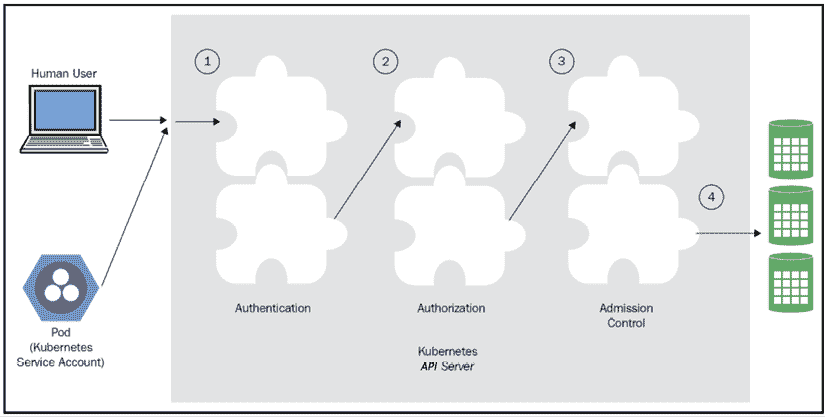

# four

# 干燥Kubernetes

在*第 3 章*、*高可用性和可靠性*中，我们研究了可靠且高可用性的 Kubernetes 集群、基本概念、最佳实践、如何进行实时更新以及关于性能和成本的许多设计权衡。

在这一章中，我们将探讨安全这个重要话题。Kubernetes 集群是由多层相互作用的组件组成的复杂系统。运行关键应用时，不同层的隔离和划分非常重要。为了保护系统并确保对资源、功能和数据的正确访问，我们必须首先了解 Kubernetes 作为运行未知工作负载的通用编排平台所面临的独特挑战。然后，我们可以利用各种安全、隔离和访问控制机制来确保集群、其上运行的应用和数据都是安全的。我们将讨论各种最佳实践，以及何时适合使用每种机制。

在本章的最后，您将对 Kubernetes 的安全挑战有一个很好的了解。您将获得如何增强 Kubernetes 抵御各种潜在攻击、建立深度防御的实用知识，甚至能够安全地运行多租户集群，同时为不同用户提供完全隔离以及对他们所在集群的完全控制。

# 了解 Kubernetes 的安全挑战

Kubernetes 是一个非常灵活的系统，它以通用的方式管理非常低级的资源。Kubernetes 本身可以部署在许多操作系统和硬件或虚拟机解决方案上，内部部署或云中部署。Kubernetes 运行由运行时实现的工作负载，它通过一个定义良好的运行时接口与运行时交互，但不了解它们是如何实现的。Kubernetes 代表其一无所知的应用或为其服务，操纵网络、域名系统和资源分配等关键资源。这意味着 Kubernetes 面临着一项艰巨的任务，即以应用开发人员和集群管理员可以利用的方式提供良好的安全机制和功能，同时保护自己、开发人员和管理员免受常见错误的影响。

在本节中，我们将讨论 Kubernetes 集群的几个层或组件中的安全挑战:节点、网络、映像、POD和容器。深度防御是一个重要的安全概念，要求系统在每个级别保护自己，既要减轻穿透其他层的攻击，又要限制违规的范围和损害。认识到每一层的挑战是深入防御的第一步。

## 节点挑战

节点是运行时引擎的主机。如果攻击者能够访问一个节点，这将是一个严重的威胁。它至少可以控制主机本身和主机上运行的所有工作负载。但情况变得更糟。该节点运行一个 kubelet，与应用编程接口服务器对话。一个复杂的攻击者可以用修改后的版本替换 kubelet，并通过与 Kubernetes API 服务器正常通信，但运行自己的工作负载而不是计划的工作负载，收集整个集群的信息，并通过发送恶意消息来中断 API 服务器和集群的其他部分，从而有效地逃避检测。该节点将可以访问共享资源和秘密，这可能会让它渗透得更深。节点破坏非常严重，这既是因为可能的损坏，也是因为事后很难检测到。

节点也可能在物理层面受到损害。这与裸机更相关，在裸机中，您可以知道哪些硬件分配给了 Kubernetes 集群。

另一个攻击媒介是资源消耗。想象一下，你的节点变成了一个机器人网络的一部分，这个网络与你的 Kubernetes 集群无关，只是运行自己的工作负载，比如加密货币挖掘，消耗 CPU 和内存。这里的危险是，您的集群将会阻塞并耗尽运行工作负载的资源，或者您的基础架构可能会自动扩展并分配更多资源。

另一个问题是安装调试和故障排除工具，或者在自动化部署之外修改配置。这些通常是未经测试的，如果留下来并处于活动状态，至少会导致性能下降，但也会导致更严重的问题。至少，它增加了攻击面。

就安全而言，这是一场数字游戏。你想了解系统的攻击面和你容易受到攻击的地方。让我们列出所有节点挑战:

*   攻击者控制了主机
*   攻击者替换了库布雷
*   攻击者控制运行主组件的节点(如应用编程接口服务器、调度程序或控制器管理器)
*   攻击者获得对节点的物理访问
*   攻击者消耗与 Kubernetes 集群无关的资源
*   通过安装调试和故障排除工具或更改配置，会造成自我伤害

## 网络挑战

任何重要的 Kubernetes 集群都至少跨越一个网络。有许多与网络相关的挑战。您需要了解您的系统组件是如何在非常精细的层次上连接的。哪些组件应该相互通信？他们使用什么网络协议？什么港口？他们交换什么数据？您的集群是如何与外部世界连接的？

公开端口和功能或服务有一个复杂的链:

*   容器到主机
*   内部网络中的主机到主机
*   世界的主人

使用覆盖网络(将在*第 10 章*、*探索高级网络*中详细讨论)有助于深度防御，即使攻击者获得对容器的访问权限，它们也是沙箱化的，无法逃到底层网络的基础设施。

发现组件也是一个巨大的挑战。这里有几个选项，如域名系统、专用发现服务和负载平衡器。每一个都有一套利弊，需要仔细的计划和洞察力来适应你的情况。

确保两个容器可以找到对方并交换信息并不容易。

您需要决定哪些资源和端点应该是公共可访问的。然后，您需要想出一个正确的方法来验证用户、服务，并授权他们对资源进行操作。通常，您可能也想要控制内部服务之间的访问。

敏感数据在进出群集的过程中必须加密，有时在静止状态下也是如此。这意味着密钥管理和安全的密钥交换，这是安全中最难解决的问题之一。

如果您的集群与其他 Kubernetes 集群或非 Kubernetes 进程共享网络基础设施，那么您必须注意隔离和分离。

成分是网络策略、防火墙规则和**软件定义的网络** ( **SDN** )。食谱通常是定制的。这对于内部和裸机集群来说尤其具有挑战性。让我们回顾一下:

*   想出一个连接计划
*   选择组件、协议和端口
*   找出动态发现
*   公共访问与私有访问
*   身份验证和授权(包括内部服务之间)
*   设计防火墙规则
*   决定网络策略
*   密钥管理和交换

在让容器、用户和服务在网络级别轻松查找和相互对话与锁定访问和防止通过网络的攻击或对网络本身的攻击之间存在持续的紧张关系。

这些挑战中有许多不是Kubernetes特有的。然而，Kubernetes 是一个管理关键基础设施和处理低级网络的通用平台，这一事实使得有必要考虑能够将系统特定需求集成到 Kubernetes 中的动态灵活的解决方案。

## 形象挑战

Kubernetes 运行符合其运行时引擎之一的容器。它不知道这些容器在做什么(除了收集度量)。您可以通过配额对容器进行某些限制。您也可以通过网络策略限制他们对网络其他部分的访问。但是，最终，容器确实需要访问主机资源、网络中的其他主机、分布式存储和外部服务。映像决定了容器的行为。映像有两类问题:

*   恶意映像
*   脆弱的映像

恶意映像是包含代码或配置的映像，攻击者设计这些代码或配置是为了造成某种伤害、收集信息或只是利用您的基础架构达到其目的(例如，加密挖掘)。恶意代码可能会被注入到您的映像准备管道中，包括您使用的任何映像存储库。或者，您可能会安装第三方映像，这些映像本身已被破坏，现在包含恶意代码。

易受攻击的映像是您设计的映像(或您安装的第三方映像)，这些映像恰好包含一些漏洞，使得攻击者能够控制正在运行的容器或造成一些其他伤害，包括稍后注入他们自己的代码。

很难说哪个类别更差。在极端情况下，它们是等价的，因为它们允许完全控制容器。其他到位的防御(还记得纵深防御吗？)而你对容器施加的限制将决定它能造成多大的损害。将坏映像的危险降到最低是非常具有挑战性的。利用微服务的快速发展的公司每天可能会生成许多映像。验证映像也不是一件容易的事情。例如，考虑 Docker 映像是如何由层组成的。

每当发现新漏洞时，包含操作系统的基本映像都可能变得易受攻击。此外，如果您依赖由其他人准备的基本映像(非常常见)，那么恶意代码可能会进入这些基本映像，您无法控制这些基本映像，并且您隐式信任这些映像。

当发现第三方依赖关系中的漏洞时，理想情况下已经有一个固定版本，您应该尽快修补它。

我们可以将开发人员可能面临的映像挑战总结如下:

*   Kubernetes 不知道映像在做什么
*   Kubernetes 必须为指定的功能提供对敏感资源的访问
*   很难保护映像准备和交付管道(包括映像存储库)
*   新映像的开发和部署速度与对变更的仔细审查相冲突
*   包含操作系统或其他常见依赖项的基础映像很容易过时并变得脆弱
*   基本映像通常不在您的控制之下，可能更容易被恶意代码注入

将像 CoreOS Clair 或 Anchore 引擎这样的静态映像分析器集成到您的 CI/CD 管道中会有很大帮助。此外，通过将容器的资源访问限制在它们执行工作所需的范围内来最小化爆炸半径，可以减少容器受损时对系统的影响。您还必须努力修补已知的漏洞。

## 配置和部署挑战

Kubernetes 集群是远程管理的。各种清单和策略决定了集群在每个时间点的状态。如果攻击者获得对集群具有管理控制的机器，他们可以造成严重破坏，例如收集信息、注入不良映像、削弱安全性和篡改日志。和往常一样，bug 和错误可能同样有害；由于忽略了重要的安全措施，集群就容易受到攻击。如今，拥有集群管理权限的员工在家中或咖啡店远程工作并随身携带笔记本电脑是非常常见的，在这里，您只需一个 kubectl 命令就可以打开闸门。

让我们重申挑战:

*   Kubernetes 是远程管理的
*   具有远程管理访问权限的攻击者可以完全控制群集
*   配置和部署通常比代码更难测试
*   远程或不在办公室的员工面临长期暴露的风险，使得攻击者能够通过管理访问来访问他们的笔记本电脑或电话

有一些最佳实践可以最大限度地降低这种风险，例如跳转框形式的间接层，需要 VPN 连接，以及使用多因素身份验证和一次性密码。

## Pod 和容器挑战

在 Kubernetes 中，豆荚是工作单位，包含一个或多个容器。POD是一个分组和部署构造。但通常，部署在同一个容器中的容器通过直接机制进行交互。这些容器都共享同一个本地主机网络，并且通常共享从主机装载的卷。同一个容器中的容器之间的这种简单集成会导致主机的一部分暴露给所有容器。这可能允许一个坏容器(恶意的或易受攻击的)为 pod 中其他容器的升级攻击打开通道，随后接管节点本身和整个集群。主附加组件通常与主组件放在一起，存在这种危险，尤其是因为其中许多是实验性的。在每个节点上运行 pods 的守护程序集也是如此。边车容器的实践非常流行，其中额外的容器与您的应用容器一起部署在一个容器中，尤其是服务网格。这增加了风险，因为边车容器通常不在您的控制范围之内，如果泄露，可以提供对您的基础设施的访问。

多容器POD挑战包括以下内容:

*   相同的 pod 容器共享本地主机网络
*   相同的 pod 容器有时共享主机文件系统上的一个装载卷
*   坏的容器可能会毒害容器中的其他容器
*   如果与访问关键节点资源的另一个容器放在一起，坏容器更容易攻击节点
*   与主组件放在一起的实验性附加组件可能是实验性的，不太安全
*   服务网格引入了可能成为攻击媒介的边车容器

仔细考虑在同一个容器中运行的容器之间的交互。您应该意识到，一个坏的容器可能会在第一次攻击时试图危害同一个容器中的兄弟容器。

## 组织、文化和流程挑战

安全性通常与生产力形成对比。这是正常的权衡，没什么好担心的。传统上，当开发人员和运营分离时，这种冲突在组织层面进行管理。开发人员追求更高的生产率，并将安全性要求视为做生意的成本。运营部门控制生产环境，并负责访问和安全程序。DevOps 运动打破了开发人员和运营人员之间的隔阂。现在，发展速度往往排在前列。像连续部署这样一天部署多次而无需人工干预的概念在大多数组织中都是闻所未闻的。Kubernetes 是为这个云原生应用的新世界而设计的。但是，它是基于谷歌的经验开发的。谷歌有很多时间和熟练的专家来开发适当的流程和工具，以平衡快速部署和安全性。对于规模较小的组织来说，这种平衡行为可能非常具有挑战性，过度关注生产力可能会削弱安全性。

采用 Kubernetes 的组织面临的挑战如下:

*   控制 Kubernetes 操作的开发人员可能不太注重安全性
*   发展速度可能被认为比安全更重要
*   持续部署可能会使某些安全问题难以在投入生产之前检测出来
*   较小的组织可能不具备在 Kubernetes 集群中正确管理安全性的知识和专业技能

这里没有简单的答案。你应该谨慎地在安全性和敏捷性之间取得适当的平衡。我建议有一个专门的安全团队(或至少一个专注于安全的人)参与所有计划会议，并倡导安全。重要的是从一开始就将安全性纳入您的系统。

在本节中，我们回顾了您在尝试构建安全的 Kubernetes 集群时面临的许多挑战。这些挑战中的大多数并不是 Kubernetes 特有的，但是使用 Kubernetes 意味着您的系统中有很大一部分是通用的，并且不知道系统在做什么。

这可能会在试图锁定系统时造成问题。挑战分布在不同的层面:

*   节点挑战
*   网络挑战
*   形象挑战
*   配置和部署挑战
*   Pod 和容器挑战
*   组织和流程挑战

在下一节中，我们将看看 Kubernetes 为解决其中一些挑战而提供的设施。许多挑战需要更大系统范围的解决方案。重要的是要认识到仅仅利用 Kubernetes 的所有安全特性是不够的。

# 强化 Kubernetes

上一节对部署和维护 Kubernetes 集群的开发人员和管理员面临的各种安全挑战进行了分类和列出。在本节中，我们将深入研究 Kubernetes 提供的设计方面、机制和特性，以应对一些挑战。通过明智地使用服务帐户、网络策略、身份验证、授权、准入控制、设备和机密等功能，您可以获得相当好的安全状态。

请记住，Kubernetes 集群是包含其他软件系统、人员和流程的更大系统的一部分。Kubernetes 不能解决所有问题。您应该始终牢记一般安全原则，例如深度防御、需要知道的基础和最小特权原则。此外，记录您认为在发生攻击时可能有用的一切，并在系统偏离其状态时发出警报，以便及早发现。可能只是 bug，也可能是攻击。无论哪种方式，你都想知道并做出回应。

## 了解 Kubernetes 中的服务帐户

Kubernetes 有在集群外管理的常规用户，用于连接到集群的人(例如，通过`kubectl`命令)，并且它有服务帐户。

常规用户帐户是全局的，可以访问群集中的多个命名空间。服务帐户被限制在一个命名空间中。这很重要。它确保了名称空间隔离，因为每当 API 服务器接收到来自 pod 的请求时，它的凭据将只应用于它自己的名称空间。

Kubernetes 代表 pods 管理服务帐户。每当 Kubernetes 实例化一个 pod 时，它都会为该 pod 分配一个服务帐户。当所有 pod 进程与 API 服务器交互时，服务帐户会识别它们。每个服务帐户都有一组安装在机密卷中的凭据。每个命名空间都有一个名为 default 的默认服务帐户。创建 pod 时，会自动为其分配默认服务帐户，除非您指定不同的服务帐户。

您可以创建其他服务帐户。创建一个名为`custom-service-account.yaml`的文件，内容如下:

```
apiVersion: v1
kind: ServiceAccount
metadata:
  name: custom-service-account 
```

现在键入以下内容:

```
$ kubectl create -f custom-service-account.yaml
serviceaccount/custom-service-account created 
```

以下是默认服务帐户旁边列出的服务帐户:

```
$ kubectl get serviceAccounts
NAME                                    SECRETS   AGE
custom-service-account                  1         39s
default                                 1         18d 
```

请注意，已为您的新服务帐户自动创建了一个密码。

要获取更多详细信息，请键入以下内容:

```
$ kubectl get serviceAccounts/custom-service-account -o yaml
apiVersion: v1
kind: ServiceAccount
metadata:
  creationTimestamp: "2020-06-01T01:24:24Z"
  name: custom-service-account
  namespace: default
  resourceVersion: "654316"
  selfLink: /api/v1/namespaces/default/serviceaccounts/custom-service-account
  uid: 69393e47-c3b2-11e9-bb43-0242ac130002
secrets:
- name: custom-service-account-token-kdwhs 
```

通过键入以下内容，您可以看到秘密本身，它包括一个`ca.crt`文件和一个令牌:

```
$ kubectl get secret custom-service-account-token-kdwhs -o yaml 
```

### Kubernetes 如何管理服务账户？

API 服务器有一个专用组件，叫做服务账户准入控制器。它负责在 pod 创建时检查 API 服务器是否有自定义服务帐户，如果有，则检查自定义服务帐户是否存在。如果没有指定服务帐户，则它会分配默认服务帐户。

它还确保 pod 具有`ImagePullSecrets`，当需要从远程映像注册表中提取映像时，这是必要的。如果 pod 规范没有任何秘密，则使用服务帐户的`ImagePullSecrets`。

最后，它添加了一个带有用于 API 访问的 API 令牌的卷和一个安装在`/var/run/secrets/kubernetes.io/serviceaccount`上的`volumeSource`。

每当创建服务帐户时，由另一个名为**令牌控制器**的组件创建应用编程接口令牌并将其添加到密码中。令牌控制器还监控机密，并在服务帐户中添加或删除机密时添加或删除令牌。

服务帐户控制器确保每个名称空间都存在默认服务帐户。

## 访问应用编程接口服务器

访问应用编程接口服务器需要一系列步骤，包括身份验证、授权和准入控制。在每个阶段，请求都可能被拒绝。每个阶段由多个链接在一起的插件组成。

下图说明了这一点:



图 4.1:访问应用编程接口服务器

### 验证用户

当您第一次创建集群时，会创建一些密钥和证书供您针对集群进行认证。Kubectl 通过 TLS(一种加密的 HTTPS 连接)使用它们向 API 服务器认证自己，反之亦然。您可以使用以下命令查看您的配置:

```
$ kubectl config view
apiVersion: v1
clusters:
- cluster:
    certificate-authority-data: DATA+OMITTED
    server: https://localhost:6443
  name: default
contexts:
- context:
    cluster: default
    user: default
  name: default
current-context: default
kind: Config
preferences: {}
users:
- name: default
  user:
    password: DATA+OMITTED
    username: admin 
```

这是 k3d 群集的配置。对于其他类型的集群，它可能会有所不同。

请注意，如果多个用户需要访问群集，创建者应该以安全的方式向其他用户提供必要的客户端证书和密钥。

这只是与 Kubernetes API 服务器本身建立基本信任。你还没有通过认证。各种身份验证模块可以查看请求，并检查各种附加的客户端证书、密码、承载令牌和 JWT 令牌(针对服务帐户)。大多数请求需要经过身份验证的用户(普通用户或服务帐户)，尽管也有一些匿名请求。如果请求未能通过所有授权码的身份验证，它将被拒绝，并显示一个 401 HTTP 状态代码(未经授权，这有点用词不当)。

群集管理员通过向应用编程接口服务器提供各种命令行参数来确定要使用的身份验证策略:

*   `--client-ca-file=`(对于文件中指定的 x509 客户端证书)
*   `--token-auth-file=`(对于文件中指定的持有人令牌)
*   `--basic-auth-file=`(对于文件中指定的用户/密码对)
*   `--enable-bootstrap-token-auth`(对于 kubeadm 使用的引导令牌)

服务账户使用自动加载的认证插件。管理员可以提供两个可选标志:

*   `--service-account-key-file=`(用于签署承载令牌的 PEM 编码密钥。如果未指定，将使用应用编程接口服务器的顶级域名私钥。)
*   `--service-account-lookup`(如果启用，从 API 中删除的令牌将被撤销。)

还有其他几种方法，如 OpenID Connect、webhooks、Keystone(开放堆栈身份服务)和身份验证代理。主题是认证阶段是可扩展的，可以支持任何认证机制。

各种身份验证插件将检查请求，并根据提供的凭据关联以下属性:

*   **用户名**(用户友好名称)
*   **uid** (唯一标识符，比用户名更一致)
*   **组**(用户所属的一组组名)
*   **额外字段**(这些将字符串键映射到字符串值)

在 Kubernetes 1.11 中，kubectl 获得了使用凭据插件从提供者(如组织 LDAP 服务器)接收不透明令牌的能力。这些凭证由 kubectl 发送到 API 服务器，该服务器通常使用一个 webhook 令牌验证器来验证凭证并接受请求。

授权码完全不知道特定用户被允许做什么。他们只是将一组凭据映射到一组身份。授权码以未指定的顺序运行；接受传递的凭证的第一个验证者将身份与传入的请求相关联，并且验证被认为是成功的。如果所有授权码都拒绝凭据，则身份验证失败。

#### 扮演

用户有可能冒充不同的用户(有适当的授权)。例如，管理员可能希望以具有较少权限的不同用户的身份解决某些问题。这需要将模拟头传递给应用编程接口请求。标题如下:

*   **模拟用户**:要充当的用户名。
*   **模拟-组**:要充当的组名。可以多次提供来设置多个组。可选。要求`Impersonate-User`。
*   **模拟-额外** -( **额外名称**):用于将额外字段与用户相关联的动态标题。可选。要求`Impersonate-User`。

使用 kubectl，您可以传递`--as`和`--as-group`参数。

### 授权请求

一旦用户被认证，授权就开始了。Kubernetes 具有通用授权语义。一组授权模块接收请求，其中包括信息，如认证的用户名和请求的动词(列表、获取、观察、创建等)。与身份验证不同，所有授权插件都可以在任何请求下获得机会。如果一个授权插件拒绝了请求，或者没有插件有意见，那么它将被拒绝，并带有一个 403 HTTP 状态代码(禁止)。只有当至少有一个插件接受请求并且没有其他插件拒绝它时，请求才会继续。

集群管理员通过指定`--authorization-mode`命令行标志来确定使用什么授权插件，该标志是一个以逗号分隔的插件名称列表。

支持以下模式:

*   `--authorization-mode=AlwaysDeny`拒绝所有请求。如果不需要授权，请使用。
*   `--authorization-mode=AlwaysAllow`允许所有请求。如果不需要授权，请使用。这在测试期间很有用。
*   `--authorization-mode=ABAC`允许简单的、基于本地文件的、用户配置的授权策略。ABAC 代表基于属性的访问控制。
*   `--authorization-mode=RBAC`是一种基于角色的机制，其中授权策略由 Kubernetes API 存储和驱动。RBAC 代表基于角色的访问控制。
*   `--authorization-mode=Node`是一种特殊模式，旨在授权 kubelets 发出的 API 请求。
*   `--authorization-mode=Webhook`允许授权由使用 REST 的远程服务驱动。

您可以通过实现以下简单的转到界面来添加自己的自定义授权插件:

```
type Authorizer interface {
  Authorize(a Attributes) (authorized bool, reason string, err error)
} 
```

`Attributes`输入参数也是一个接口，提供您需要的所有信息来做出授权决定:

```
type Attributes interface {
  GetUser() user.Info
  GetVerb() string
  IsReadOnly() bool
  GetNamespace() string
  GetResource() string
  GetSubresource() string
  GetName() string
  GetAPIGroup() string
  GetAPIVersion() string
  IsResourceRequest() bool
  GetPath() string
} 
```

可以在[https://github . com/kubernetes/API server/blob/master/pkg/authorizator/interfaces . go](https://github.com/kubernetes/apiserver/blob/master/pkg/authorization/authorizer/interfaces.go)找到源代码。

使用`kubectl can-i`命令，您可以检查可以执行哪些操作，甚至模拟其他用户:

```
$ kubectl auth can-i create deployments
Yes
$ kubectl auth can-i create deployments --as jack
no 
```

### 使用准入控制插件

好的。请求已经过身份验证和授权，但是在执行之前还有一个步骤。该请求必须通过`admission-control`插件的挑战。类似于授权者，如果一个准入控制者拒绝一个请求，它就会被拒绝。

入场控制器是一个简洁的概念。这种想法是，可能存在全球集群问题，这可能是拒绝请求的理由。如果没有准入控制者，所有授权者都必须意识到这些问题并拒绝请求。但是，使用准入控制器，这个逻辑可以执行一次。此外，准入控制器可以修改请求。准入控制器以验证模式或变异模式运行。通常，集群管理员通过提供名为`admission-control`的命令行参数来决定运行哪些准入控制插件。该值是一个逗号分隔的有序插件列表。以下是Kubernetes推荐的插件列表> = 1.9(顺序很重要):

```
--admission-control=NamespaceLifecycle,LimitRanger,ServiceAccount,PersistentVolumeLabel,DefaultStorageClass,MutatingAdmissionWebhook,ValidatingAdmissionWebhook,ResourceQuota,DefaultTolerationSeconds 
```

让我们看看一些可用的插件(更多的插件一直在增加):

*   `DefaultStorageClass`:为创建不指定存储类的`PersistentVolumeClaim`的请求添加默认存储类。
*   `DefaultTolerationSeconds`:设置豆荚对污染的默认耐受性(如果尚未设置):`notready:NoExecute`和`notreachable:NoExecute`。
*   `EventRateLimit`:限制事件对 API 服务器的淹没(在 Kubernetes 1.9 中是新的)。
*   `ExtendedResourceToleration`:将具有特殊资源的节点上的污点，如图形处理器和**现场可编程门阵列** ( **现场可编程门阵列**)与请求这些资源的POD上的容忍相结合。最终结果是，具有额外资源的节点将专用于具有适当容忍度的 pods。
*   `ImagePolicyWebhook`:这个复杂的插件连接到一个外部后端，根据映像决定是否应该拒绝一个请求。
*   `LimitPodHardAntiAffinity`:除了`requiredDuringSchedulingRequiredDuringExecution`中的`kubernetes.io/hostname`之外，拒绝任何定义`AntiAffinity`拓扑键的 pod。
*   `LimitRanger`:拒绝违反资源限制的请求。
*   `MutatingAdmissionWebhook`:注册了能够修改其目标对象的变异网络钩子的调用。请注意，由于其他变异的 webhooks 的潜在变化，不能保证更改会有效。
*   `NamespaceAutoProvision`:在请求中创建名称空间，如果它还不存在的话。
*   `NamespaceLifecycle`:拒绝名称空间中正在被终止或不存在的对象创建请求。
*   `PodSecurityPolicy`:如果请求安全上下文不符合 pod 安全策略，则拒绝请求。
*   `ResourceQuota`:拒绝违反命名空间资源配额的请求。
*   `ServiceAccount`:服务账户自动化。
*   `ValidatingAdmissionWebhook`:这个准入控制器调用任何匹配请求的验证网络钩子。并行调用匹配的 webhooks 如果他们中的任何一个拒绝了请求，请求就会失败。

如您所见，准入控制插件具有非常多样的功能。它们支持命名空间范围的策略，并主要从资源管理和安全的角度实施请求的有效性。这释放了授权插件来关注有效的操作。`ImagePolicyWebHook`是验证映像的入口，这是一个很大的挑战。`MutatingAdmissionWebhook`和`ValidatingAdmissionWebhook`是动态准入控制的网关，在这里你可以部署自己的准入控制器，而无需将其编译成 Kubernetes。动态准入控制适用于资源的语义验证等任务(所有的 pods 都有标准的标签集吗？).

通过身份验证、授权和许可的不同阶段验证传入请求的责任划分，每个阶段都有自己的插件，这使得复杂的过程更易于理解和使用。

变异的准入控制器提供了很大的灵活性，并且能够自动执行某些策略，而不会给用户带来负担(例如，如果名称空间不存在，则自动创建一个名称空间)。

## 固定POD

POD安全是一个主要的关注点，因为Kubernetes安排POD并让它们运行。有几种独立的机制来固定POD和容器。这些机制共同支持纵深防御，即使攻击者(或错误)绕过一个机制，也会被另一个机制阻止。

### 使用私有映像存储库

这种方法让你有很大的信心，你的集群将只拉你以前审查过的映像，你可以更好地管理升级。您可以在每个节点上配置您的`HOME/.docker/config.json`。但是，在许多云提供商上，您不能这样做，因为节点是自动为您调配的。

### 秘密映像扫描

这种方法被推荐给云提供商上的集群。这个想法是注册表的凭证将由 pod 提供，所以它计划在哪个节点上运行并不重要。这就在节点级别规避了`.dockercfg`的问题。

首先，您需要为凭据创建一个秘密对象:

```
$ kubectl create secret the-registry-secret
  --docker-server=<docker registry server>
  --docker-username=<username>
  --docker-password=<password>
  --docker-email=<email>
secret 'docker-registry-secret' created. 
```

如果需要，您可以为多个注册表(或同一注册表的多个用户)创建机密。库贝莱将合并所有`ImagePullSecrets`。

但是，由于 pod 只能在自己的名称空间中访问秘密，所以您必须在希望 pod 运行的每个名称空间上创建一个秘密。

一旦定义了秘密，您就可以将其添加到 pod 规范中，并在集群上运行一些 pod。pod 将使用机密中的凭据从目标映像注册表中提取映像:

```
apiVersion: v1
kind: Pod
metadata:
  name: cool-pod
  namespace: the-namespace
spec:
  containers:
    - name: cool-container
      image: cool/app:v1
  imagePullSecrets:
    - name: the-registry-secret 
```

### 指定安全上下文

安全上下文是一组操作系统级别的安全设置，如 UID、gid、功能和 SELinux 角色。这些设置作为容器安全上下文应用于容器级别。您可以指定将应用于容器中所有容器的容器安全上下文。pod 安全上下文还可以将其安全设置(特别是`fsGroup`和`seLinuxOptions`)应用于卷。

以下是 pod 安全上下文示例:

```
apiVersion: v1
kind: Pod
metadata:
  name: hello-world
spec:
  containers:
    ...
  securityContext:
    fsGroup: 1234
    supplementalGroups: [5678]
    seLinuxOptions:
      level: 's0:c123,c456' 
```

容器安全上下文应用于每个容器，并覆盖 pod 安全上下文。它嵌入在 pod 清单的容器部分。容器上下文设置不能应用于卷，卷仍处于 pod 级别。

下面是一个示例容器安全上下文:

```
apiVersion: v1
kind: Pod
metadata:
  name: hello-world
spec:
  containers:
    - name: hello-world-container
      # The container definition
      # ...
      securityContext:
        privileged: true
        seLinuxOptions:
          level: 's0:c123,c456' 
```

### 用 AppArmor 保护您的集群

`AppArmor`是一个 Linux 内核安全模块。借助`AppArmor`，您可以将运行在容器中的进程限制在有限的资源集内，例如网络访问、Linux 功能和文件权限。您可以通过配置文件配置`AppArmor`。

#### 要求

的外观支持在Kubernetes 1.4 中被添加为测试版。并非每个操作系统都可以使用它，因此您必须选择受支持的操作系统发行版才能利用它。Ubuntu 和 SUSE Linux 支持`AppArmor`并默认启用。其他发行版有可选支持。要检查`AppArmor`是否启用，请键入以下内容:

```
cat /sys/module/apparmor/parameters/enabled
Y 
```

如果结果为`Y`，则启用。

概要文件必须加载到内核中。检查以下文件:

```
/sys/kernel/security/apparmor/profiles 
```

另外，此时只有 Docker 运行时支持`AppArmor`。

#### 用装置固定POD

由于`AppArmor`在测试版中仍然是，所以您将元数据指定为注释，而不是真正的字段。当它退出测试版时，这将会改变。

要将配置文件应用于容器，请添加以下注释:

```
container.apparmor.security.beta.kubernetes.io/: 
```

配置文件引用可以是默认配置文件、运行时/默认配置文件，也可以是主机/本地主机上的配置文件。

下面是一个防止写入文件的示例配置文件:

```
#include <tunables/global>
profile k8s-apparmor-example-deny-write flags=(attach\_disconnected) {
  #include <abstractions/base>
  file,
  # Deny all file writes.
  deny /\*\* w,
} 
```

`AppArmor`不是一个 Kubernetes 资源，所以格式不是你熟悉的 YAML 或者 JSON。

要验证配置文件是否正确附加，请检查流程 1 的属性:

```
kubectl exec <pod-name> cat /proc/1/attr/current 
```

默认情况下，可以在集群中的任何节点上调度 Pods。这意味着配置文件应该加载到每个节点中。这是 DaemonSet 的一个经典用例。

#### 写作服装简介

手写个人资料对于服装来说不是小事。有一些工具可以帮助:`aa-genprof`和`aa-logprof`可以为您生成一个配置文件，并通过在抱怨模式下使用`AppArmor`运行您的应用来帮助对其进行微调。这些工具跟踪应用的活动和`AppArmor`警告，并创建相应的配置文件。这种方法很有效，但感觉很笨重。

我最喜欢的工具是贝恩([https://github.com/jessfraz/bane](https://github.com/jessfraz/bane))，它基于 TOML 语法从更简单的概要语言生成`AppArmor`概要文件。贝恩简介可读性很强，容易掌握。以下是贝恩个人资料的一个片段:

```
Name = 'nginx-sample'
[Filesystem]
# read only paths for the container
ReadOnlyPaths = [
  '/bin/\*\*',
  '/boot/\*\*',
  '/dev/\*\*',
]
# paths where you want to log on write
LogOnWritePaths = [
  '/\*\*'
]
# allowed capabilities
[Capabilities]
Allow = [
  'chown',
  'setuid',
]
[Network]
Raw = false
Packet = false
Protocols = [
  'tcp',
  'udp',
  'icmp'
] 
```

生成的`AppArmor`轮廓相当粗糙。

### Pod 安全策略

**Pod 安全策略**(**PSP**)自 Kubernetes 1.4 起作为测试版提供给。必须启用它，您还必须启用 PSP 准入控制才能使用它们。PSP 是在集群级别定义的，它定义了 pods 的安全上下文。使用 PSP 和直接在 pod 清单中指定安全上下文有一些不同，正如我们之前所做的:

*   将相同的策略应用于多个容器
*   让管理员控制 pod 的创建，这样用户就不会使用不适当的安全上下文来创建 pod
*   通过准入控制器为 pod 动态生成不同的安全上下文

PSP 真正扩展了安全上下文的概念。通常，与 pod(或者更确切地说，pod 模板)的数量相比，安全策略的数量相对较少。这意味着许多 pod 模板和容器将具有相同的安全策略。没有 PSP，你必须为每个POD清单单独管理它。

下面是一个 PSP 示例，它允许一切:

```
kind: PodSecurityPolicy
apiVersion: extensions/v1beta1policy/v1beta1
metadata:
  name: permissive
spec:
  seLinux:
    rule: RunAsAny
  supplementalGroups:
    rule: RunAsAny
  runAsUser:
    rule: RunAsAny
  fsGroup:
    rule: RunAsAny
  volumes:
  - "\*" 
```

正如你所看到的比`AppArmor`更具可读性，并且在每个操作系统和运行时都可用。

### 通过 RBAC 授权 pod 安全策略

这是推荐的启用策略的方法。让我们创建一个`ClusterRole` ( `Role`也有效)来授予使用目标策略的权限。它应该如下所示:

```
kind: ClusterRole
apiVersion: rbac.authorization.k8s.io/v1
metadata:
  name: <role name>
rules:
- apiGroups: ['extensionspolicy']
  resources: ['podsecuritypolicies']
  verbs:   ['use']
  resourceNames:
  - <list of policies to authorize> 
```

然后，我们需要将集群角色绑定到授权用户:

```
kind: ClusterRoleBinding
apiVersion: rbac.authorization.k8s.io/v1
metadata:
  name: <binding name>
roleRef:
  kind: ClusterRole
  name: <role name>
  apiGroup: rbac.authorization.k8s.io
subjects:
 - < list of authorized service accounts > 
```

以下是一个特定的服务帐户:

```
- kind: ServiceAccount
  name: <authorized service account name>
  namespace: <authorized pod namespace> 
```

您也可以授权特定用户，但不建议这样做:

```
- kind: User
  apiGroup: rbac.authorization.k8s.io
  name: <authorized user name> 
```

如果使用角色绑定而不是集群角色绑定，那么它将只应用于与绑定在同一名称空间中的 pods。这可以与系统组配对，以授予对命名空间中运行的所有 pods 的访问权限:

```
- kind: Group
  apiGroup: rbac.authorization.k8s.io
  name: system:serviceaccounts 
```

或者等效地，向命名空间中所有经过身份验证的用户授予访问权限的操作如下:

```
- kind: Group
  apiGroup: rbac.authorization.k8s.io
  name: system:authenticated 
```

## 管理网络策略

节点、pod 和容器安全性势在必行，但这还不够。网络分段对于设计允许多租户的安全 Kubernetes 集群至关重要，对于将安全漏洞的影响降至最低也至关重要。深度防御要求您划分系统中不需要相互通信的部分，同时还要仔细管理流量的方向、协议和端口。

网络策略允许对集群进行细粒度控制和适当的网络分段。网络策略的核心是一组防火墙规则，应用于由标签选择的一组名称空间和 pods。这非常灵活，因为标签可以定义虚拟网段，并作为 Kubernetes 资源进行管理。

与使用传统方法(如 IP 地址范围和子网掩码)对网络进行分段相比，这是一个巨大的进步，在传统方法中，您经常会用完 IP 地址或分配过多地址以防万一。

### 选择受支持的网络解决方案

一些网络后端(网络插件)不支持网络策略。例如，流行的法兰绒不能用于应用策略。这很关键。您将能够定义网络策略，即使您的网络插件不支持它们。你的政策只会毫无效果，给你一种虚假的安全感。

以下是支持网络策略(入口和出口)的网络插件列表:

*   白棉布
*   WeaveNet
*   运河
*   希利斯
*   库贝路由器 -
*   罗曼娜
*   Contiv

如果您在托管的 Kubernetes 服务上运行集群，那么已经为您做出了选择。

我们将在*第 10 章*、*探索高级联网*中探究网络插件的来龙去脉。这里我们重点关注网络策略。

### 定义网络策略

您使用标准 YAML 清单定义网络策略。

下面是一个示例策略:

```
apiVersion: networking.k8s.io/v1
kind: NetworkPolicy
metadata:
 name: the-network-policy
 namespace: default
spec:
  podSelector:
    matchLabels:
      role: db
  ingress:
   - from:
     - namespaceSelector:
         matchLabels:
           project: cool-project
     - podSelector:
          matchLabels:
            role: frontend
    ports:
     - protocol: tcp
       port: 6379 
```

`spec`部分有两个重要部分，`podSelector`和`ingress`。`podSelector`控制该网络策略适用于哪些豆荚。`ingress`控制哪些名称空间和端口可以访问这些端口，以及它们可以使用哪些协议和端口。

在前面的示例网络策略中，pod 选择器将网络策略的目标指定为标记为`role: db`的所有 pod。`ingress`部分有一个带有名称空间选择器和容器选择器的`from`子部分。群集中标记为`project: cool-project`的所有名称空间，在这些名称空间中，标记为`role: frontend`的所有POD都可以访问标记为`role: db`的目标POD。`ports`部分定义了进一步限制允许哪些协议和端口的对(协议和端口)列表。在这种情况下，协议是 tcp，端口是 6379(标准的 Redis 端口)。

请注意，网络策略是集群范围的，因此集群中多个命名空间的 pods 可以访问目标命名空间。当前的命名空间总是包含在内的，所以即使它没有`project:cool`标签，带有`role:frontend`的 pods 仍然可以访问。

认识到网络策略以白名单的方式运行是很重要的。默认情况下，禁止所有访问，网络策略可以向与标签匹配的特定 pod 打开特定协议和端口。但是，网络策略的白名单性质仅适用于为至少一个网络策略选择的 pods。如果未选择 pod，它将允许所有访问。始终确保您的所有豆荚都被网络策略覆盖。

白名单性质的另一个含义是，如果存在多个网络策略，那么所有规则的统一效果都适用。如果一个策略允许访问端口 1234，而另一个策略允许访问同一组 pod 的端口 5678，则可以通过 1234 或 5678 访问 pod。

要负责任地使用网络策略，请考虑从拒绝所有网络策略开始:

```
apiVersion: networking.k8s.io/v1
kind: NetworkPolicy
metadata:
  name: deny-all
spec:
  podSelector: {}
  policyTypes:
  - Ingress
  - Egress 
```

然后，开始添加网络策略，明确允许进入特定的POD。请注意，您必须对每个命名空间应用全部拒绝策略:

```
$ kubectl -n <namespace> create -f deny-all-network-policy.yaml 
```

### 限制到外部网络的出口

Kubernetes 1.8 增加了出口网络策略支持，因此您也可以控制出站流量。这里是一个阻止访问外部 IP 1.2.3.4 的例子。`order: 999`确保该策略先于其他策略应用:

```
apiVersion: v1
kind: policy
metadata:
  name: default-deny-egress
spec:
  order: 999
  egress:
  - action: deny
    destination:
      net: 1.2.3.4
    source: {} 
```

### 跨名称空间策略

如果您将集群划分为多个名称空间，如果 pods 可以跨名称空间通信，它有时会派上用场。您可以在网络策略中指定`ingress.namespaceSelector`字段，以允许从多个名称空间进行访问。例如，如果您有生产和暂存命名空间，并且您定期用生产数据的快照填充暂存环境，这将非常有用。

## 使用秘密

秘密在安全系统中至关重要。它们可以是凭据，如用户名和密码、访问令牌、应用编程接口密钥、证书或加密密钥。秘密通常很小。如果你有大量你想要保护的数据，你应该对其进行加密，并将加密/解密密钥作为机密保存。

### 在Kubernetes心中隐藏秘密

默认情况下，Kubernetes 将秘密以明文形式存储在 etcd 中。这意味着对 etcd 的直接访问应该受到限制并小心防范。从 Kubernetes 1.7 开始，您现在可以在休息时加密您的秘密(当它们由 etcd 存储时)。

秘密是在名称空间级别管理的。Pods 可以通过秘密卷将秘密装载为文件或环境变量。从安全角度来看，这意味着任何可以在命名空间中创建 pod 的用户或服务都可以访问为该命名空间管理的任何机密。如果您想限制对某个秘密的访问，请将其放在有限的用户或服务可以访问的命名空间中。

当秘密被装入容器时，它永远不会被写入磁盘。存储在`tmpfs`中。当 kubelet 与 API 服务器通信时，它通常使用 TLS，因此秘密在传输中受到保护。

### 静态配置加密

启动应用编程接口服务器时，需要 cto 传递此参数:

```
--encryption-provider-config 
```

下面是一个加密配置示例:

```
apiVersion: apiserver.config.k8s.io/v1
kind: EncryptionConfiguration
resources:
  - resources:
    - secrets
    providers:
    - identity: {}
    - aesgcm:
        keys:
        - name: key1
          secret: c2VjcmV0IGlzIHNlY3VyZQ==
        - name: key2
          secret: dGhpcyBpcyBwYXNzd29yZA==
    - aescbc:
        keys:
        - name: key1
          secret: c2VjcmV0IGlzIHNlY3VyZQ==
        - name: key2
          secret: dGhpcyBpcyBwYXNzd29yZA==
    - secretbox:
        keys:
        - name: key1
          secret: YWJjZGVmZ2hpamtsbW5vcHFyc3R1dnd4eXoxMjM0NTY= 
```

### 创造秘密

在你试图创造一个需要秘密的豆荚之前，必须创造秘密。秘密必须存在；否则，pod 创建将会失败。

您可以使用以下命令创建秘密:`kubectl create secret`。

在这里，我创建了一个名为“保密”的通用秘密，它包含两个密钥，一个用户名和密码:

```
$ kubectl create secret generic hush-hush --from-literal=username=tobias --from-literal=password=cutoffs
secret/hush-hush created 
```

由此产生的秘密是不透明的:

```
$ kubectl describe secrets/hush-hush
Name:         hush-hush
Namespace:    default
Labels:       <none>
Annotations:  <none>
Type:  Opaque
Data
====
password:  7 bytes
username:  6 bytes 
```

您可以使用`--from-file`而不是`--from-literal`从文件中创建机密，如果您将机密值编码为 base64，也可以手动创建机密。

机密中的密钥名称必须遵循 DNS 子域的规则(不带前导点)。

### 破解秘密

要获取秘密的内容，您可以使用`kubectl get secret`:

```
$ kubectl get secrets/hush-hush -o yaml
apiVersion: v1
data:
  password: Y3V0b2Zmcw==
  username: dG9iaWFz
kind: Secret
metadata:
  creationTimestamp: "2020-06-01T06:57:07Z"
  name: hush-hush
  namespace: default
  resourceVersion: "56655"
  selfLink: /api/v1/namespaces/default/secrets/hush-hush
  uid: 8d50c767-c705-11e9-ae89-0242ac120002
type: Opaque 
```

这些值是 base64 编码的。你需要自己解码:

```
$ echo 'Y3V0b2Zmcw==' | base64 --decode
cutoffs 
```

### 在容器中使用秘密

容器可以通过从容器装入卷来访问机密文件。另一种方法是将秘密作为环境变量进行访问。最后，一个容器(假设它的服务帐户有权限)可以直接访问 Kubernetes API 或者使用`kubectl get secret`。

要使用作为卷装载的机密，pod 清单应声明该卷，并将其装载到容器的规范中:

```
apiVersion: v1
kind: Pod
metadata:
  name: pod-with-secret
spec:
  containers:
  - name: container-with-secret
    image: g1g1/py-kube:0.2
    command: ["/bin/bash", "-c", "while true ; do sleep 10 ; done"]
    volumeMounts:
    - name: secret-volume
      mountPath: "/mnt/hush-hush"
      readOnly: true
  volumes:
  - name: secret-volume
    secret:
      secretName: hush-hush 
```

卷名(秘密卷)将 pod 卷绑定到容器中的装载点。多个容器可以安装相同的体积。当此 pod 运行时，用户名和密码作为文件在`/etc/hush-hush`下可用:

```
$ kubectl create -f pod-with-secret.yaml
$ kubectl exec pod-with-secret -- cat /mnt/hush-hush/username
tobias
$ kubectl exec pod-with-secret -- cat /mnt/hush-hush/password
cutoffs 
```

# 运行多用户集群

在本节中，我们将简要介绍使用单个集群托管多个用户或多个用户社区的系统的选项(也称为多租户)。这个想法是，这些用户是完全孤立的，甚至可能不知道他们与其他用户共享集群。每个用户社区都有自己的资源，它们之间不会有通信(除了可能通过公共端点)。Kubernetes 命名空间概念是这一思想的最终表达。

## 多用户集群的情况

为什么要为多个独立用户或部署运行单个集群？只是为每个用户都有一个专用的集群不是更简单吗？主要有两个原因:成本和运营复杂性。如果您有许多相对较小的部署，并且希望为每个部署创建一个专用集群，那么您将有一个单独的主节点，并且可能为每个部署创建一个三节点 etcd 集群。那可以加起来。操作复杂性也非常重要。管理几十个、几百个或几千个独立集群绝非易事。每个升级和每个补丁都需要应用到每个集群。操作可能会失败，您将不得不管理一群集群，其中一些集群的状态与其他集群略有不同。跨所有集群的元操作可能更加困难。您必须聚合并编写工具来执行操作并从所有集群中收集数据。

让我们来看看多个孤立社区或部署的一些用例和需求:

*   软件即服务的平台或服务提供商
*   管理独立的测试、试运行和生产环境
*   将责任委托给社区/部署管理员
*   对每个社区强制实施资源配额和限制
*   用户只能看到他们社区中的资源

## 使用命名空间实现安全的多租户

Kubernetes 名称空间是安全多租户集群的完美答案。这并不奇怪，因为这是名称空间的设计目标之一。

除了内置的`kube-system`和`default`之外，还可以轻松创建名称空间。这是一个 YAML 文件，它将创建一个名为`custom-namespace`的新名称空间。它只有一个名为`name`的元数据项。没有比这更简单的了:

```
apiVersion: v1
kind: Namespace
metadata:
  name: custom-namespace 
```

让我们创建名称空间:

```
$ kubectl create -f custom-namespace.yaml
namespace/custom-namespace created
$ kubectl get namespaces
NAME               STATUS   AGE
custom-namespace   Active   36s
default            Active   26h
kube-node-lease    Active   26h
kube-public        Active   26h
kube-system        Active   26h 
```

我们可以看到默认的命名空间，我们新的`custom-namespace`，以及一些前缀为`kube-`的系统命名空间。

状态字段可以是`Active`或`Terminating`。当你删除一个名字空间时，它将进入`Terminating`状态。当命名空间处于此状态时，您将无法在此命名空间中创建新资源。这简化了命名空间资源的清理，并确保命名空间被真正删除。如果没有它，复制控制器可能会在删除现有 pod 时创建新的 pod。

要使用名称空间，需要向 kubectl 命令添加`--namespace`(简称为`-n`)参数。以下是如何在`custom-namespace`命名空间中以交互模式运行 pod:

```
$ kubectl run trouble -it -n custom-namespace --image=g1g1/py-kube:0.2 --generator=run-pod/v1 bash
If you don't see a command prompt, try pressing enter.
root@trouble:/# 
```

在自定义名称空间中列出 pod 只返回我们刚刚启动的 pod:

```
$ kubectl get pods --namespace=custom-namespace
NAME      READY   STATUS    RESTARTS   AGE
trouble   1/1     Running   0          113s 
```

列出不带命名空间的 pods 会返回默认命名空间中的 pods:

```
$ kubectl get pods
NAME              READY   STATUS    RESTARTS   AGE
pod-with-secret   1/1     Running   0          11h 
```

## 避免命名空间陷阱

名称空间很棒，但是它们会增加一些摩擦。当您只使用默认命名空间时，您可以简单地省略命名空间。使用多个名称空间时，必须用名称空间限定所有内容。这可能会增加一些负担，但不会带来任何危险。

但是，如果一些用户(例如，集群管理员)可以访问多个名称空间，那么您很容易意外修改或查询错误的名称空间。避免这种情况的最好方法是密封命名空间，并为每个命名空间要求不同的用户和凭据，就像您应该在您的机器或远程机器上使用用户帐户进行大多数操作，并且只有在您也拥有时才通过`sudo`使用`root`。

此外，您应该使用有助于明确您正在操作的命名空间的工具(例如，如果从命令行工作，则使用 shell 提示符，或者在 web 界面中突出显示命名空间)。最受欢迎的工具之一是 kubens(与 kubectx 一起提供)，可在[https://github.com/ahmetb/kubectx](https://github.com/ahmetb/kubectx)获得。

确保可以在专用命名空间上操作的用户不能访问默认的命名空间。否则，每次他们忘记指定一个名称空间时，他们就会悄悄地对`default`名称空间进行操作。

# 摘要

在本章中，我们讲述了开发人员和管理员在 Kubernetes 集群上构建系统和部署应用时面临的许多安全挑战。但是我们也探索了许多安全特性和灵活的基于插件的安全模型，它提供了许多限制、控制和管理容器、容器和节点的方法。Kubernetes 已经为大多数安全挑战提供了通用的解决方案，并且随着 AppArmor 和各种插件等功能从 alpha/beta 状态转移到通用状态，它只会变得更好。最后，我们考虑了如何使用名称空间来支持同一 Kubernetes 集群中的多用户社区或部署。

在下一章中，我们将详细研究许多 Kubernetes 资源和概念，以及如何有效地使用和组合它们。Kubernetes 对象模型建立在少量通用概念(如资源、清单和元数据)的坚实基础之上。这使得一个可扩展但令人惊讶的一致的对象模型能够为开发人员和管理员提供非常多样的功能。

# 参考

*   [https://www . stack rox . com/post/2019/04/setting-kubernetes-network-policies-a-detailed-guide/](https://www.stackrox.com/post/2019/04/setting-up-kubernetes-network-policies-a-detailed-guide/)
*   [https://github.com/ahmetb/kubernetes-network-policy-recipes](https://github.com/ahmetb/kubernetes-network-policy-recipes)
*   [https://jeremivalee . com/2018/05/28/kubriones-RBAC 命名空间-user.html](https://jeremievallee.com/2018/05/28/kubernetes-rbac-namespace-user.html)