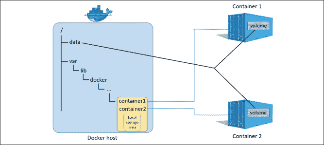
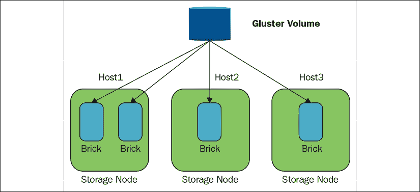
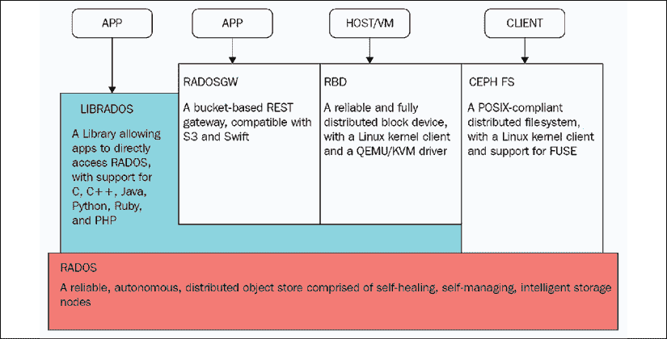
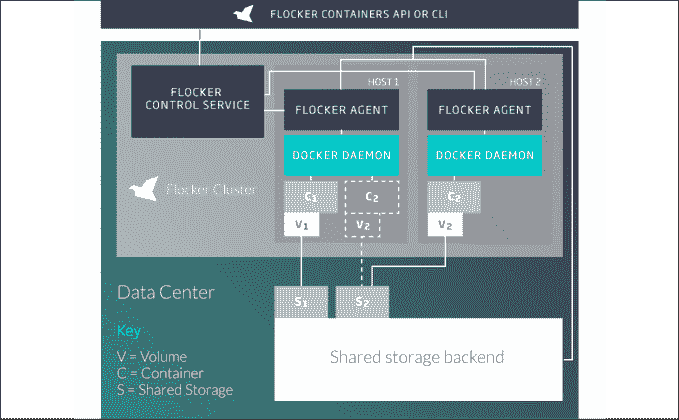
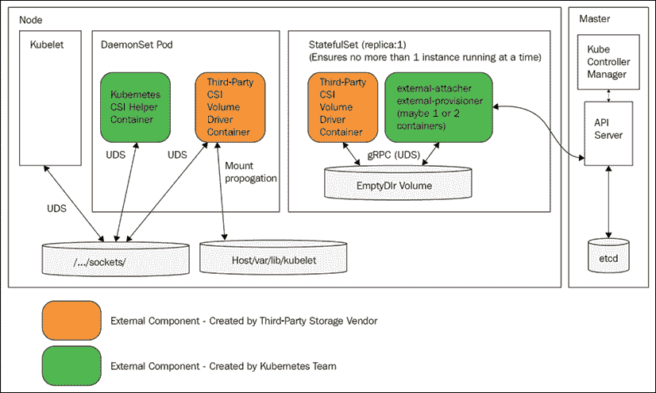

# 六、管理存储

在本章中，我们将了解 Kubernetes 如何管理存储。存储与计算有很大不同，但从更高的层面来说，它们都是资源。Kubernetes 作为一个通用平台，采用了在编程模型和一组存储提供者插件后面抽象存储的方法。首先，我们将详细介绍概念存储模型，以及如何为集群中的容器提供存储。然后，我们将介绍常见的云平台存储提供商，如**亚马逊网络服务(AWS)** 、**谷歌计算引擎(GCE)** 和 Azure。然后我们将看看一个著名的开源存储提供商，来自红帽的 GlusterFS，它提供了一个分布式文件系统。我们还将研究另一种解决方案——Flocker，它作为 Kubernetes 集群的一部分，在容器中管理您的数据。最后，我们将看到 Kubernetes 如何支持现有企业存储解决方案的集成。

在本章的最后，您将对存储在 Kubernetes 中的表现方式、每个部署环境中的各种存储选项(本地测试、公共云和企业)以及如何为您的用例选择最佳选项有一个坚实的了解。

您应该在 minikube 或其他充分支持存储的集群上尝试本章中的代码示例。KinD 集群存在一些与标记节点相关的问题，这对于一些存储解决方案是必要的。

# 持久卷漫游

在本节中，我们将了解 Kubernetes 存储概念模型，并了解如何将持久存储映射到容器中，以便它们可以读写。让我们从理解存储问题开始。容器和豆荚是短暂的。

当容器死亡时，容器写入其自己文件系统的任何内容都会被清除。容器还可以从其主机节点装载目录，并对其进行读写。这些将在容器重启后继续存在，但是节点本身并不是不朽的。此外，如果 pod 本身被重新调度到不同的节点，容器将无法访问旧节点主机的文件系统。

还有其他问题，例如容器死亡时装载的托管目录的所有权。想象一下，一堆容器将重要的数据写到它们主机上的各种数据目录中，然后离开，将所有的数据都留在节点上，没有直接的方法告诉哪个容器写了什么数据。你可以试着记录这些信息，但是你会把它记录在哪里呢？很明显，对于大规模系统，您需要可从任何节点访问的持久存储来可靠地管理数据。

## 卷

基本的 Kubernetes 存储抽象是卷。容器装载绑定到它们的 pod 的卷，并且它们访问存储，就好像它在它们的本地文件系统中一样。这并不是什么新鲜事，而且非常棒，因为作为一个编写需要访问数据的应用的开发人员，您不必担心数据存储在哪里以及如何存储。

### 使用 emptyDir 进行POD内部通信

使用共享卷在同一个容器中的容器之间共享数据非常简单。容器 1 和容器 2 只需安装相同的体积，通过读写共享空间就可以进行通信。最基本的卷是`emptyDir`。`emptyDir`卷是主机上的一个空目录。注意它不是持久的，因为当 pod 从节点移除时，内容被擦除。如果一个容器刚刚崩溃，POD会停留在周围，你可以稍后访问它。另一个非常有趣的选择是使用内存磁盘，通过指定介质为`Memory`。现在，您的容器通过共享内存进行通信，这要快得多，但当然更不稳定。如果节点重新启动，`emptyDir`的卷内容会丢失。

这里有一个 pod 配置文件，它有两个安装相同卷的容器，称为`shared-volume`。容器安装在不同的路径上，但是当`hue-global-listener`容器向`/notifications`写入文件时，`hue-job-scheduler`会在`/incoming`下看到该文件:

```
apiVersion: v1
kind: Pod
metadata:
  name: hue-scheduler
spec:
  containers:
  - image: g1g1/hue-global-listener:1.0
    name: hue-global-listener
    volumeMounts:
    - mountPath: /notifications
      name: shared-volume
  - image: g1g1/hue-job-scheduler:1,0
    name: hue-job-scheduler
    volumeMounts:
    - mountPath: /incoming
      name: shared-volume
  volumes:
  - name: shared-volume
    emptyDir: {} 
```

要使用共享内存选项，我们只需将`medium: Memory`添加到`emptyDir`部分:

```
 volumes:
  - name: shared-volume
    emptyDir:
     medium: Memory 
```

为了验证是否有效，让我们创建 pod 和，然后使用一个容器编写一个文件，并使用另一个容器读取它:

```
$ kubectl create -f hue-scheduler.yaml
pod/hue-scheduler created 
```

请注意，该容器有两个容器:

```
$ kubectl get pod hue-scheduler -o json | jq .spec.containers
[
  {
    "image": "g1g1/hue-global-listener:1.0",
    "name": "hue-global-listener",
    "volumeMounts": [
      {
        "mountPath": "/notifications",
        "name": "shared-volume"
      },
      ...
    ]
    ...
  },
  {
    "image": "g1g1/hue-job-scheduler:1.0",
    "name": "hue-job-scheduler",
    "volumeMounts": [
      {
        "mountPath": "/incoming",
        "name": "shared-volume"
      },
      ...  
    ]
    ...
  }
] 
```

现在，我们可以在`hue-global-listener`容器的目录中创建一个文件，并将其列在`hue-job-scheduler`容器的`/incoming`目录中:

```
$ kubectl exec -it hue-scheduler -c hue-global-listener -- touch /notifications/1.txt
$ kubectl exec -it hue-scheduler -c hue-job-scheduler -- ls /incoming
1.txt 
```

### 使用主机路径进行节点内通信

有时，您希望您的 pods 能够访问一些主机信息(例如 Docker 守护程序)，或者希望同一节点上的 pods 能够相互通信。如果豆荚知道它们在同一个主机上，这很有用。由于Kubernetes基于可用资源来调度豆荚，豆荚通常不知道它们共享节点的其他豆荚是什么。有几种情况下，一个 pod 可以依赖于在同一节点上与其一起调度的其他 pod:

*   在单节点集群中，所有的 pods 显然共享同一个节点
*   DaemonSet pods 总是与匹配其选择器的任何其他 pod 共享一个节点
*   由于节点或荚的相似性，荚总是被安排在一起

例如，在*第 5 章*、*在实践中使用 Kubernetes 资源*中，我们讨论了一个 DaemonSet pod，它充当其他 pod 的聚合代理。实现这种行为的另一种方法是，pod 只需将数据写入绑定到主机目录的装载卷，DaemonSet pod 就可以直接读取数据并对其进行操作。

在决定使用`HostPath`音量之前，请确保您了解限制:

*   如果相同配置的 pods 是数据驱动的，并且其主机上的文件不同，那么它们的行为可能会有所不同
*   它可以违反基于资源的调度(即将来到 Kubernetes)，因为 Kubernetes 不能监控`HostPath`资源
*   访问主机目录的容器必须具有特权设置为 true 的安全上下文，或者在主机端，您需要更改权限以允许写入

这里有一个配置文件，它将`/coupons`目录装入`hue-coupon-hunter`容器，该容器将映射到主机的`/etc/hue/data/coupons`目录:

```
apiVersion: v1
kind: Pod
metadata:
  name: hue-coupon-hunter
spec:
  containers:
  - image: busybox    name: hue-coupon-hunter
    volumeMounts:
    - mountPath: /coupons
      name: coupons-volume
  volumes:
  - name: coupons-volume
    host-path:
        path: /etc/hue/data/coupons 
```

由于 pod 没有特权安全上下文，它将无法写入主机目录。让我们更改容器规范，通过添加安全上下文来启用它:

```
 - image: the\_g1g1/hue-coupon-hunter
    name: hue-coupon-hunter
    volumeMounts:
    - mountPath: /coupons
      name: coupons-volume
    securityContext:
      privileged: true 
```

在下面的图中，您可以看到每个容器都有其自己的本地存储区域，其他容器或豆荚无法访问，并且主机的`/data`目录作为卷安装到容器 1 和容器 2 中:



图 6.1:容器目录

### 将本地卷用于持久节点存储

本地卷与`HostPath`相似，但它们在 pod 重启和节点重启期间保持不变。从这个意义上说，它们是认为持久的卷。它们是在 Kubernetes 1.7 中添加的。从 Kubernetes 1.14 开始，它们被认为是稳定的。本地卷的目的是支持状态集，其中需要在包含特定存储卷的节点上调度特定的单元。本地卷具有节点相似性注释，简化了 pods 到它们需要访问的存储的绑定。

我们需要为使用本地卷定义一个存储类。我们将在本章后面深入讨论存储类。用一句话来说，存储类使用置备程序将存储分配给豆荚。让我们在名为`local-storage-class.yaml`的文件中定义存储类并创建它:

```
apiVersion: storage.k8s.io/v1
kind: StorageClass
metadata:
  name: local-storage
provisioner: kubernetes.io/no-provisioner
volumeBindingMode: WaitForFirstConsumer 
```

```
$ kubectl create -f local-storage-class.yaml
storageclass.storage.k8s.io/local-storage created 
```

现在，我们可以使用存储类创建一个持久卷，即使在使用它的 pod 终止后，该持久卷也将保持不变:

```
apiVersion: v1
kind: PersistentVolume
metadata:
  name: local-pv
  labels:
    release: stable
    capacity: 100Gi
spec:
  capacity:
    storage: 100Gi
  volumeMode: Filesystem
  accessModes:
  - ReadWriteOnce
  persistentVolumeReclaimPolicy: Delete
  storageClassName: local-storage
  local:
    path: /mnt/disks/disk-1
  nodeAffinity:
    required:
      nodeSelectorTerms:
      - matchExpressions:
        - key: kubernetes.io/hostname
          operator: In
          values:
          - minikube 
```

### 设置永久卷

虽然`emptyDir`卷可以由容器装载和使用，但它们不是持久的，也不需要任何特殊的资源调配，因为它们使用节点上的现有存储。`HostPath`卷保留在原始节点上，但是如果 pod 在另一个节点上重新启动，它将无法从其前一个节点访问`HostPath`卷。本地卷是真正的持久卷，使用由管理员提前调配的存储或通过存储类动态调配的存储。它们在节点上持续存在，并且能够经受得住 pod 重启和重新调度，甚至节点重启。一些永久卷使用由管理员提前调配的外部存储(不是物理连接到节点的磁盘)。

在云环境中，资源调配可能非常精简，但仍然是必需的，作为 Kubernetes 集群管理员，您必须至少确保您的存储配额足够，并根据您的配额仔细监控使用情况。

请记住，持久卷是 Kubernetes 集群正在使用的资源，类似于节点。因此，它们不是由 Kubernetes API 服务器管理的。

您可以静态或动态地调配资源。

#### 静态配置永久卷

静态配置很简单。集群管理员提前创建由一些存储介质备份的持久卷，这些持久卷可以由容器来声明。

#### 动态配置永久卷

当永久卷声明与任何静态调配的永久卷不匹配时，可能会发生动态调配。如果声明指定了一个存储类，并且管理员将该类配置为动态资源调配，则可以动态地调配一个持久卷。我们将在后面讨论持久卷声明和存储类时看到示例。

## 从外部调配持久卷

最近的趋势之一是将存储提供者从 Kubernetes 核心转移到卷插件(也称为*树外*)。外部资源调配器的工作方式与树内动态资源调配器类似，但可以独立部署和更新。越来越多的树内存储资源调配者迁移到树外。查看这个Kubernetes孵化器项目:

[https://github.com/kubernetes-incubator/external-storage](https://github.com/kubernetes-incubator/external-storage)

## 创建永久卷

以下是 NFS 持久卷的配置文件:

```
apiVersion: v1
kind: PersistentVolume
metadata:
  name: pv-777
spec:
  capacity:
    storage: 100Gi
  volumeMode: Filesystem
  accessModes:
    - ReadWriteMany
    - ReadOnlyMany
  persistentVolumeReclaimPolicy: Recycle
  storageClassName: slow
  mountOptions:
    - hard
    - nfsvers=4.1
  nfs:
    path: /tmp
    server: 172.17.0.2 
```

持久卷具有可能包括存储类名的规范和元数据。让我们把重点放在这里的规格。共有六个部分:容量、卷模式、访问模式、回收策略、存储类和卷类型(示例中为`nfs`)。

### 容量

每个卷都有指定的存储量。存储声明可以通过至少具有该存储量的持久卷来满足。在本例中，持久卷的容量为 100 千兆字节(单个**千兆字节** ( **千兆字节**)是 2 到30 字节的幂)。在分配静态持久卷时，了解存储请求模式非常重要。例如，如果您调配 20 个容量为 100 GiB 的持久卷，而一个容器声称一个容量为 150 GiB 的持久卷，那么即使集群中总容量足够，该声明也不会得到满足:

```
capacity:
    storage: 100Gi 
```

### 音量模式

在 Kubernetes 1.9 中添加了可选的卷模式，作为静态配置的 alpha 功能(在 Kubernetes 1.13 中移到 beta)。它允许您指定是想要文件系统(`"Filesystem"`)还是原始存储(`"Block"`)。如果不指定音量模式，那么默认为`"Filesystem"`，就像 1.9 之前一样。

### 访问模式

有三种接入方式:

*   `ReadOnlyMany`:可由多个节点以只读方式挂载
*   `ReadWriteOnce`:可由单个节点以读写方式装载
*   `ReadWriteMany`:可由多个节点读写挂载

存储装载到节点上，因此即使使用`ReadWriteOnce`，同一节点上的多个容器也可以装载卷并向其写入。如果这导致了一个问题，您需要通过一些其他机制来处理它(例如，只在您知道每个节点只有一个的 DaemonSet pods 中声明卷)。

不同的存储提供商支持这些模式的某个子集。调配持久卷时，您可以指定它将支持哪些模式。例如，NFS 支持所有模式，但在该示例中，仅启用了以下模式:

```
accessModes:
    - ReadWriteMany
    - ReadOnlyMany 
```

### 回收策略

回收策略确定删除永久卷声明时会发生什么。有三种不同的政策:

*   **保留**:卷需要手动回收
*   **删除**:删除关联的存储资产，如 AWS EBS、GCE PD、Azure 磁盘或 OpenStack child 卷
*   **回收**:只删除内容(`rm -rf /volume/*`)

保留和删除策略意味着永久卷不再可用于将来的索赔。回收策略允许再次声明卷。

目前只有 NFS 和`HostPath`支持回收。AWS EBS、GCE PD、Azure 磁盘和 child 卷支持删除。动态调配的卷始终会被删除。

### 存储类

您可以使用规范的可选`storageClassName`字段指定存储类别。如果有，那么只有指定相同存储类的持久卷声明才能绑定到持久卷。如果未指定存储类，则只有未指定存储类的永久卷声明才能绑定到它:

```
 storageClassName: slow 
```

### 音量类型

体积类型由规范中的名称指定。没有`volumeType`段。在前面的示例中，NFS 是音量类型:

```
nfs:
    path: /tmp
    server: 172.17.0.8 
```

每种卷类型都可能有自己的一组参数。在这种情况下，它是一个路径和服务器。

稍后我们将讨论各种音量类型。

### 装载选项

一些持久的卷类型有您可以指定的附加挂载选项。装载选项未经验证。如果您提供了无效的装载选项，卷资源调配将失败。例如，NFS 支持其他装载选项:

```
 mountOptions:
    - hard
    - nfsvers=4.1 
```

## 持续进行批量索赔

当容器想要访问一些持久存储时，它们会进行声明(或者更确切地说，开发人员和集群管理员协调必要的存储资源来声明)。声明将匹配一些存储(如卷)。

让我们创建一个本地卷。首先，我们需要创建一个后备目录:

```
$ mk ssh "sudo mkdir -p /mnt/disks/disk-1" 
```

现在，我们可以创建一个由`/mnt/disks/disk1`目录支持的本地卷:

```
apiVersion: v1
kind: PersistentVolume
metadata:
  name: local-pv
  labels:
    release: stable
    capacity: 100Gi
spec:
  capacity:
    storage: 100Gi
  volumeMode: Filesystem
  accessModes:
  - ReadWriteOnce
  persistentVolumeReclaimPolicy: Delete
  storageClassName: local-storage
  local:
    path: /mnt/disks/disk-1
  nodeAffinity:
    required:
      nodeSelectorTerms:
      - matchExpressions:
        - key: kubernetes.io/hostname
          operator: In
          values:
          - minikube 
```

```
$ kubectl create -f local-volume.yaml
persistentvolume/local-pv created 
```

下面是一个与我们刚刚创建的持久卷相匹配的示例声明:

```
kind: PersistentVolumeClaim
apiVersion: v1
metadata:
  name: local-storage-claim
spec:
  accessModes:
    - ReadWriteOnce
  resources:
    requests:
      storage: 80Gi
  storageClassName: local-storage
  selector:
    matchLabels:
      release: "stable"
    matchExpressions:
      - {key: capacity, operator: In, values: [80Gi, 100Gi]} 
```

让我们创建声明，然后解释不同部分的作用:

```
$ kubectl create -f local-persistent-volume-claim.yaml
persistentvolumeclaim/local-storage-claim created 
```

将索赔装入容器时，名称`storage-claim`将很重要。

规范中的访问模式为`ReadWriteOnce`，这意味着如果满足索赔，则不能满足其他具有`ReadWriteOnce`访问模式的索赔，但是对于`ReadOnlyMany`的索赔仍然可以满足。

资源科要求 80 GiB。这可以通过我们的持久卷来满足，它的容量为 100 Gi。但是，这有点浪费，因为 20 Gi 按照定义是不会被使用的。

存储类名为`normal`。如前所述，它必须与持久卷的类名匹配。但是，对于 PVC，空类名(`""`)和没有类名是有区别的。前者(空类名)匹配没有存储类名的持久卷。后者(没有类名)只有在`DefaultStorageClass`许可插件关闭或打开并使用默认存储类时才能绑定到持久卷。

`selector`部分允许您进一步过滤可用卷。例如，这里的音量必须与标签`release:stable`匹配，并且还必须有一个带有`capacity:80Gi`或`capacity:100Gi`的标签。假设我们有几个容量分别为 200 吉和 500 吉的其他卷。当我们只需要 80 吉时，我们不想要求 500 吉的体积。

Kubernetes 总是试图匹配能够满足要求的最小卷，但是如果没有 80 Gi 或 100 Gi 卷，则标签将阻止分配 200 Gi 或 500 Gi 卷，而是使用动态配置。

重要的是要意识到声明并没有提到卷名。你不能要求特定的数量。Kubernetes 根据存储类别、容量和标签进行匹配。

最后，持久卷声明属于一个命名空间。将持久卷绑定到声明是排他的。这意味着持久卷将绑定到一个命名空间。即使访问模式是`ReadOnlyMany`或`ReadWriteMany`，所有装载持久卷声明的容器都必须来自该声明的名称空间。

## 以卷的形式提交索赔

好的。我们提供了一个卷并申请了它。是时候使用容器中声称的存储了。这很简单。首先，持久卷声明必须用作容器中的一个卷，然后容器中的容器可以安装它，就像任何其他卷一样。下面是一个 pod 配置文件，它指定了我们之前创建的持久卷声明(绑定到我们提供的本地持久卷):

```
kind: Pod
apiVersion: v1
metadata:
  name: the-pod
spec:
  containers:
    - name: the-container
      image: g1g1/py-kube:0.2
      volumeMounts:
      - mountPath: "/mnt/data"
        name: persistent-volume
  volumes:
    - name: persistent-volume
      persistentVolumeClaim:
        claimName: local-storage-claim 
```

钥匙在`volumes`下的`persistentVolumeClaim`部分。声明名称(此处为`storage-claim`)唯一标识了当前命名空间中的特定声明，并使其作为名为`persistent-volume`的卷可用。然后，容器可以通过它的名字来引用它，并将其安装到`/mnt/data`上。

在我们创建 pod 之前，重要的是要注意持久卷声明实际上并没有声明任何存储，也没有绑定到我们的本地卷。在某个容器实际尝试使用声明装入卷之前，声明处于待定状态:

```
$ kubectl get pvc
NAME                  STATUS    VOLUME   CAPACITY   ACCESS MODES   STORAGECLASS    AGE
local-storage-claim   Pending                                      local-storage   12s 
```

现在，创建 pod 时将绑定声明:

```
$ kubectl create -f pod-with-local-claim.yaml
pod/the-pod created
$ kubectl get pvc
NAME                  STATUS   VOLUME     CAPACITY   ACCESS MODES   STORAGECLASS    AGE
local-storage-claim   Bound    local-pv   100Gi      RWO            local-storage   20m 
```

## 原始块卷

Kubernetes 1.9 增加了这一功能作为 alpha 特性。从 Kubernetes 1.16 开始，它处于测试阶段。

原始数据块卷提供对底层存储的直接访问，这不是通过文件系统抽象来实现的。这对于需要高存储性能的应用非常有用，例如数据库，或者当需要一致的输入/输出性能和低延迟时。**光纤通道** ( **光纤通道**)、iSCSI 和一个本地固态硬盘都适合用作原始数据块存储。从 Kubernetes 1.16 开始，以下存储提供商支持原始数据块卷:

*   美国陆军弹性块商店
*   AzureDisk
*   足球俱乐部
*   GCEPersistentDisk
*   iSCSI
*   本地卷
*   RBD (Ceph 闭塞装置)
*   v 球面体积(α)

以下是如何使用光纤通道提供程序定义原始数据块卷:

```
apiVersion: v1
kind: PersistentVolume
metadata:
  name: block-pv
spec:
  capacity:
    storage: 10Gi
  accessModes:
    - ReadWriteOnce
  volumeMode: Block
  persistentVolumeReclaimPolicy: Retain
  fc:
    targetWWNs: ["50060e801049cfd1"]
    lun: 0
    readOnly: false 
```

匹配的**持久体积索赔** ( **聚氯乙烯** ) *也必须*指定`volumeMode: Block`。这里是它的样子:

```
apiVersion: v1
kind: PersistentVolumeClaim
metadata:
  name: block-pvc
spec:
  accessModes:
    - ReadWriteOnce
  volumeMode: Block
  resources:
    requests:
      storage: 10Gi 
```

Pods 使用原始数据块卷作为`/dev`和*下的设备，而不是*作为装载的文件系统。容器随后可以访问该设备并对其进行读/写操作。实际上，这意味着对数据块存储的 I/O 请求会直接进入底层数据块存储，而不会通过文件系统驱动程序。这在理论上更快，但在实践中，如果您的应用受益于文件系统缓冲，它实际上会降低性能。

这是一个带有容器的容器，将`block-pvc`与原始块存储绑定为一个名为`/dev/xdva`的设备:

```
apiVersion: v1
kind: Pod
metadata:
  name: pod-with-block-volume
spec:
  containers:
    - name: fc-container
      image: fedora:26
      command: ["/bin/sh", "-c"]
      args: ["tail -f /dev/null"]
      volumeDevices:
        - name: data
          devicePath: /dev/xvda
  volumes:
    - name: data
      persistentVolumeClaim:
        claimName: block-pvc 
```

## 存储类

存储类允许管理员为您的集群配置自定义持久存储(只要有合适的插件支持)。存储类在元数据中有名称(必须在要声明的注释中指定)、置备程序和参数。

我们之前为本地存储声明了一个存储类。下面是一个使用 AWS EBS 作为资源调配器的示例存储类(因此，它仅适用于 AWS):

```
apiVersion: storage.k8s.io/v1
kind: StorageClass
metadata:
  name: slow
provisioner: kubernetes.io/aws-ebs
parameters:
  type: io1
  iopsPerGB: "10"
  fsType: ext4 
```

您可以为具有不同参数的同一置备程序创建多个存储类。每个置备程序都有自己的参数。

当前支持的置备程序如下:

*   美国陆军弹性块商店
*   AzureFile
*   AzureDisk
*   西夫斯
*   煤渣
*   足球俱乐部
*   弹性卷
*   弗勒加
*   GcePersistentDisk
*   格鲁斯特
*   iSCSI
*   quo 字节
*   网络文件系统
*   RBD
*   虚拟卷
*   Portworx 卷
*   ScaleIO
*   储存；储备
*   当地的

此列表不包含其他卷类型的置备程序，如 gitRepo 或 secret，它们不受典型网络存储的支持。这些卷类型不需要存储类。智能地利用卷类型是构建和管理集群的主要部分。

### 默认存储类别

集群管理员也可以指定默认存储类别。当分配了默认存储类并且`DefaultStorageClass`准入插件打开时，则没有存储类的声明将使用默认存储类进行动态调配。如果未定义默认存储类或未打开准入插件，则没有存储类的声明只能匹配没有存储类的卷。

## 演示端到端的持久卷存储

为了说明的所有概念，让我们做一个迷你演示，在这里我们创建一个`HostPath`卷，声明它，安装它，并让容器向它写入。

让我们从使用`dir`存储类创建一个`hostPath`卷开始。在`dir-persistent-volume.yaml`中保存以下内容:

```
kind: PersistentVolume
apiVersion: v1
metadata:
  name: dir-pv
spec:
  storageClassName: dir
  capacity:
    storage: 1Gi
  accessModes:
    - ReadWriteMany
  hostPath:
    path: "/tmp/data" 
```

然后，让我们创建它:

```
$ kubectl create -f dir-persistent-volume.yaml
persistentvolume/dir-pv created 
```

要检查可用卷，您可以使用资源类型`persistentvolumes`或`pv`(简称:

```
$ kubectl get pv
NAME     CAPACITY   ACCESS MODES   RECLAIM POLICY   STATUS      CLAIM   STORAGECLASS 
dir-pv   1Gi        RWX            Retain           Available           dir 
```

根据要求，容量为 1 GiB。回收策略是`Retain`，因为主机路径卷被保留(而不是销毁)。状态为`Available`，因为音量尚未被认领。接入方式指定为`RWX`，即表示`ReadWriteMany`。所有访问模式都有一个简写版本:

*   **RWO** : ReadWriteOnce
*   **紫色**:readonlymny
*   **RWX** ： 读写多

我们有一个持久的卷。让我们创建一个声明。将以下内容保存到`dir-persistent-volume-claim.yaml`:

```
kind: PersistentVolumeClaim
apiVersion: v1
metadata:
  name: dir-pvc
spec:
 storageClassName: dir  accessModes:
    - ReadWriteOnce
  resources:
    requests:
      storage: 1Gi 
```

然后，运行以下命令:

```
$ kubectl create -f  dir-persistent-volume-claim.yaml
persistentvolumeclaim/dir-pvc created 
```

让我们检查索赔和数量:

```
$ kubectl get pvc
NAME      STATUS   VOLUME   CAPACITY   ACCESS MODES   STORAGECLASS
dir-pvc   Bound    dir-pv   1Gi        RWX            dir
$ kubectl get pv
NAME     CAPACITY   ACCESS MODES   RECLAIM POLICY   STATUS   CLAIM             STORAGECLASS
dir-pv   1Gi        RWX            Retain           Bound    default/dir-pvc   dir 
```

如你所见，权利要求和数量是相互联系和相互参照的。绑定工作的原因是卷和声明使用了相同的存储类。但是，如果它们不匹配会发生什么？让我们从持久卷声明中删除存储类，看看会发生什么。将以下持久卷声明保存到`some-persistent-volume-claim.yaml`:

```
kind: PersistentVolumeClaim
apiVersion: v1
metadata:
  name: some-pvc
spec:
  accessModes:
  - ReadWriteMany
  resources:
    requests:
      storage: 1Gi 
```

然后，创建它:

```
$ kubectl create -f some-persistent-volume-claim.yaml
persistentvolumeclaim/some-pvc created 
```

好的。它被创造了。让我们来看看:

```
$ kubectl get pvc
NAME       STATUS   VOLUME                                     CAPACITY   ACCESS MODES   STORAGECLASS  
dir-pvc    Bound    dir-pv                                     1Gi        RWX            dir           
some-pvc   Bound    pvc-276fdd9d-b787-4c3e-a94b-e886edaa1039   1Gi        RWX            standard 
```

非常有趣。`some-pvc`声明被绑定到使用标准存储类的新卷。这是动态资源调配的一个示例，其中动态创建了一个新的持久卷，以满足与任何现有卷都不匹配的`some-pvc`声明。

这里是动态卷。也是在`/tmp/hostpath-provisioner`下创建的`HostPath`卷:

```
$ kubectl get pv pvc-276fdd9d-b787-4c3e-a94b-e886edaa1039 -o yaml
apiVersion: v1
kind: PersistentVolume
metadata:
  annotations:
    hostPathProvisionerIdentity: 7f22c7da-dc16-11e9-a3e9-080027a42754
    pv.kubernetes.io/provisioned-by: k8s.io/minikube-hostpath
  creationTimestamp: "2020-06-08T23:11:36Z"
  finalizers:
  - kubernetes.io/pv-protection
  name: pvc-276fdd9d-b787-4c3e-a94b-e886edaa1039
  resourceVersion: "193570"
  selfLink: /api/v1/persistentvolumes/pvc-276fdd9d-b787-4c3e-a94b-e886edaa1039
  uid: e1f6579f-8ddb-401f-be44-f52742c91cfa
spec:
  accessModes:
  - ReadWriteMany
  capacity:
    storage: 1Gi
  claimRef:
    apiVersion: v1
    kind: PersistentVolumeClaim
    name: some-pvc
    namespace: default
    resourceVersion: "193563"
    uid: 276fdd9d-b787-4c3e-a94b-e886edaa1039
  hostPath:
    path: /tmp/hostpath-provisioner/pvc-276fdd9d-b787-4c3e-a94b-e886edaa1039
    type: ""
  persistentVolumeReclaimPolicy: Delete
  storageClassName: standard
  volumeMode: Filesystem
status:
  phase: Bound 
```

最后一步是创建一个 pod，并将声明指定为一个卷。将以下内容保存到`shell-pod.yaml`:

```
kind: Pod
apiVersion: v1
metadata:
  name: just-a-shell
  labels:
    name: just-a-shell
spec:
  containers:
    - name: a-shell
      image: g1g1/py-kube:0.2
      command: ["/bin/bash", "-c", "while true ; do sleep 1 ; done"]
      volumeMounts:
      - mountPath: "/data"
        name: pv
    - name: another-shell
      image: g1g1/py-kube:0.2
      command: ["/bin/bash", "-c", "while true ; do sleep 1 ; done"]
      volumeMounts:
      - mountPath: "/another-data"
        name: pv
  volumes:
    - name: pv
      persistentVolumeClaim:
       claimName:  dir-pvc 
```

这个容器有两个使用`g1g1/py-kube:0.2`映像的容器，两个容器都运行一个 shell 命令，这个命令在一个无限循环中休眠。这个想法是容器将继续运行，所以我们可以稍后连接到它们并检查它们的文件系统。pod 用卷名`pv`装载我们的持久卷声明。请注意，卷规范只在 pod 级别完成一次，多个容器可以将其装入不同的目录。

让我们创建容器，并验证两个容器都在运行:

```
$ kubectl create -f shell-pod.yaml
pod/just-a-shell created
$ kubectl get pods
NAME           READY   STATUS    RESTARTS   AGE
just-a-shell   2/2     Running   0          3m41s 
```

然后，SSH 到该节点。这是主机，其`/tmp/data`是POD的体积，作为`/data`和`/another-data`安装到每个运行的容器中:

```
$ minikube ssh
                         _             _
            _         _ ( )           ( )
  ___ ___  (_)  ___  (_)| |/')  _   _ | |_      __
/' _ ' _ '\| |/' _ '\| || , <  ( ) ( )| '_'\  /'__'\
| ( ) ( ) || || ( ) || || |\'\ | (_) || |_) )(  ___/
(_) (_) (_)(_)(_) (_)(_)(_) (_)'\___/'(_,__/''\____)
$ 
```

在节点内部，我们可以使用 Docker 命令与容器通信。让我们看看最后两个运行的容器:

```
$ docker ps -n 2 --format '{{.ID}}\t{{.Image}}\t{{.Command}}'
341f7ab2b4cc    1c757b9abf75    "/bin/bash -c 'while…"
189b2fc840e2    1c757b9abf75    "/bin/bash -c 'while…" 
```

然后，让我们在主机上的`/tmp/data`目录中创建一个文件。通过安装的卷，两个容器都应该可以看到:

```
$ sudo su
$ echo "yeah, it works!" > /tmp/data/cool.txt 
```

让我们检查一下`cool.txt`文件是否确实可用:

```
$ docker exec -it 189b2fc840e2 cat /data/cool.txt
yeah, it works!
$ docker exec -it 341f7ab2b4cc cat /another-data/cool.txt
yeah, it works! 
```

我们甚至可以在其中一个容器中创建一个新文件`yo.txt`，并查看它对另一个容器或节点本身是否可用:

```
$ docker exec -it 341f7ab2b4cc bash
root@just-a-shell:/# echo yo > /another-data/yo.txt
root@just-a-shell:/# 
```

让我们直接从 kubectl 验证对两个容器都可用:

```
$ kubectl exec -it just-a-shell -c a-shell -- cat /data/yo.txt
yo
$ kubectl exec -it just-a-shell -c another-shell -- cat /another-data/yo.txt
yo 
```

是的。一切都按预期运行，两个容器共享相同的存储。

# 公共云存储卷类型–GCE、AWS 和 Azure

在本节中，我们将了解领先的公共云平台中可用的一些常见卷类型。与节点类似，大规模管理存储是一项困难的任务，最终会涉及物理资源。如果您选择在公共云平台上运行 Kubernetes 集群，您可以让云提供商应对所有这些挑战，并专注于您的系统。但是，了解每种卷类型的各种选项、约束和限制非常重要。

我们将讨论的许多卷类型都是由树内插件(核心 Kubernetes 的一部分)处理的，但是正在迁移到树外 CSI 插件。我们稍后会报道犯罪现场调查。

## 亚马逊 EBS

AWS 提供**弹性块存储** ( **EBS** )作为 EC2 实例的持久存储。AWS Kubernetes 集群可以使用 AWS EBS 作为持久存储，但有以下限制:

*   POD必须作为节点在 AWS EC2 实例上运行
*   Pods 只能访问在其可用性区域中调配的 EBS 卷
*   一个 EBS 卷可以装载在单个 EC2 实例上。

这些都是严重的限制。对单个可用性区域的限制虽然对性能有好处，但消除了在没有自定义复制和同步的情况下大规模或跨地理分布的系统共享存储的能力。单个 EBS 卷对单个 EC2 实例的限制意味着，即使在同一个可用性区域内，pods 也不能共享存储(即使用于读取)，除非您确保它们在同一节点上运行。

抛开所有免责声明，让我们看看如何挂载 EBS 卷:

```
apiVersion: v1
kind: Pod
metadata:
  name: some-pod
spec:
  containers:
  - image: some-container
    name: some-container
    volumeMounts:
    - mountPath: /ebs
      name: some-volume
  volumes:
  - name: some-volume
    awsElasticBlockStore:
      volumeID: <volume-id>
      fsType: ext4 
```

您必须在 AWS 中创建 EBS 卷，然后将它安装到 pod 中。不需要声明或存储类，因为您直接通过标识装载卷。`awsElasticBlockStore`体积类型是Kubernetes已知的。

## 亚马逊 EFS

AWS 最近发布了一项名为**弹性文件系统** ( **EFS** )的新服务。这是真正有管理的 NFS 服务。它使用的是 NFS 4.1 协议，它比 EBS 有很多好处:

*   多个 EC2 实例可以跨多个可用性区域(但在同一区域内)访问相同的文件
*   容量会根据实际使用情况自动增减
*   你只为你使用的东西付费
*   您可以通过虚拟专用网络将内部服务器连接到 EFS
*   EFS 采用固态硬盘，可跨可用性区域自动复制

也就是说，即使考虑到自动复制到多个可用性区域(假设您充分利用了您的 EBS 卷)，EFS 也比 EBS 更具扩展性。它使用作为外部资源调配器，部署起来并不简单。请按照此处的说明操作:

[https://github . com/kubernetes-孵化器/外部存储/树/主/aws/efs](https://github.com/kubernetes-incubator/external-storage/tree/master/aws/efs )

从Kubernetes的角度来看，AWS EFS 只是一个 NFS 卷。您可以这样配置它:

```
apiVersion: v1
kind: PersistentVolume
metadata:
  name: efs-share
spec:
  capacity:
    storage: 200Gi
  accessModes:
    - ReadWriteMany
  nfs:
    server: eu-west-1b.fs-64HJku4i.efs.eu-west-1.amazonaws.com
    path: / 
```

一旦一切都设置好了，您已经定义了您的存储类，并且持久卷存在，您就可以创建一个声明，并在`ReadWriteMany`模式下将其装载到您喜欢的任意多个容器中。这里有一个持续的说法:

```
kind: PersistentVolumeClaim
apiVersion: v1
metadata:
  name: efs
  annotations:
    volume.beta.kubernetes.io/storage-class: "aws-efs"
spec:
  accessModes:
    - ReadWriteMany
  resources:
    requests:
      storage: 1Mi 
```

这是一个消耗它的豆荚:

```
kind: Pod
apiVersion: v1
metadata:
  name: test-pod
spec:
  containers:
  - name: test-pod
    image: gcr.io/google\_containers/busybox:1.24
    command:
      - "/bin/sh"
    args:
      - "-c"
      - "touch /mnt/SUCCESS &amp;&amp; exit 0 || exit 1"
    volumeMounts:
      - name: efs-pvc
        mountPath: "/mnt"
  restartPolicy: "Never"
  volumes:
    - name: efs-pvc
      persistentVolumeClaim:
        claimName: efs 
```

## GCE 持久磁盘

`gcePersistentDisk`音量类型与`awsElasticBlockStore`非常相似。您必须提前配置磁盘。它只能由同一项目和区域中的 GCE 实例使用。但是同一卷可以在多个实例上用作只读卷。这意味着它支持`ReadWriteOnce`和`ReadOnlyMany`。您可以使用 GCE 永久磁盘在同一区域的多个POD之间以只读方式共享数据。

在`ReadWriteOnce`模式下使用永久磁盘的 pod 必须由复制控制器、副本集或副本计数为 0 或 1 的部署来控制。尝试扩展到 1 以上会失败，原因显而易见:

```
apiVersion: v1
kind: Pod
metadata:
  name: some-pod
spec:
  containers:
  - image: some-image
    name: some-container
    volumeMounts:
    - mountPath: /pd
      name: some-volume
  volumes:
  - name: some-volume
    gcePersistentDisk:
      pdName: <persistent disk name>
      fsType: ext4 
```

自 Kubernetes 1.10(测试版)以来，GCE 持久磁盘支持区域磁盘选项。区域永久磁盘在两个区域之间自动同步。在 Kubernetes 中使用它们的关键是为故障域指定一个特殊的标签，该标签指定了两个区域:

```
apiVersion: v1
kind: PersistentVolume
metadata:
  name: test-volume
  labels:
    failure-domain.beta.kubernetes.io/zone: us-central1-a__us-central1-b
spec:
  capacity:
    storage: 400Gi
  accessModes:
  - ReadWriteOnce
  gcePersistentDisk:
    pdName: data-disk
    fsType: ext4 
```

## Azure 数据磁盘

Azure 数据盘是存储在 Azure Storage 中的虚拟硬盘。它在功能上与 AWS EBS 类似。下面是一个 pod 配置文件示例:

```
apiVersion: v1
kind: Pod
metadata:
 name: some-pod
spec:
 containers:
  - image: some-container
    name: some-container
    volumeMounts:
      - name: some-volume
        mountPath: /azure
 volumes:
      - name: some-volume
        azureDisk:
          diskName: test.vhd
          diskURI: https://someaccount.blob.microsoft.net/vhds/test.vhd 
```

除了的强制`diskName`和`diskURI`参数外，它还有几个可选参数:

*   `kind`:或者`Shared`(每个存储帐户多个磁盘)、`Dedicated`(每个存储帐户一个 blob 磁盘)或者`Managed`(Azure 管理的数据磁盘)。默认为`Shared`。
*   `cachingMode`:磁盘缓存模式。这必须是`None`、`ReadOnly`或`ReadWrite`。默认为`None`。
*   `fsType`:设置为挂载的文件系统类型。默认为`ext4`。
*   `readOnly`:设置文件系统是否作为`readOnly`使用。默认为`false`。

Azure 数据磁盘限制为 1，023 GB。每个 Azure 虚拟机最多可以有 16 个数据磁盘。您可以将一个 Azure 数据磁盘连接到单个 Azure 虚拟机。

## 蔚蓝文件

除了数据磁盘，Azure 还有一个类似于 AWS EFS 的共享文件系统。但是，Azure 文件使用 SMB/CIFS 协议(它支持 SMB 2.1 和 SMB 3.0)。它基于 Azure 存储平台，具有与 Azure Blob、Table 或 Queue 存储相同的可用性、持久性、可扩展性和地理冗余能力。

为了使用 Azure 文件，您需要在每个客户端虚拟机上安装`cifs-utils`包。您还需要创建一个秘密，这是一个必需的参数:

```
apiVersion: v1
kind: Secret
metadata:
  name: azure-file-secret
type: Opaque
data:
  azurestorageaccountname: <base64 encoded account name>
  azurestorageaccountkey: <base64 encoded account key> 
```

这里是一个使用 Azure 文件的 pod:

```
apiVersion: v1
kind: Pod
metadata:
 name: some-pod
spec:
 containers:
  - image: some-container
    name: some-container
    volumeMounts:
      - name: some-volume
        mountPath: /azure
 volumes:
      - name: some-volume
        azureFile:
          secretName: azure-file-secret
         shareName: azure-share
          readOnly: false 
```

Azure 文件支持在同一区域内共享以及连接内部客户端。

# Kubernetes的葡萄汁和洋葱汁

和 Ceph 是两个分布式持久存储系统。GlusterFS 的核心是一个网络文件系统。Ceph 的核心是一个对象存储。两者都公开块、对象和文件系统接口。两者都使用罩下的`xfs`文件系统将数据和元数据存储为`xattr`属性。您可能希望在 Kubernetes 集群中使用 GlusterFs 或 Ceph 作为持久卷的原因有几个:

*   您可能有很多数据和应用可以访问 GlusterFS 或 Ceph 中的数据
*   你有管理 GlusterFS 或 Ceph 的运营经验
*   您在云中运行，但是云平台持久存储的局限性是行不通的

## 使用 GlusterFS

GlusterFS 是有意简单的，暴露底层目录的本来面目，并将其留给客户端(或中间件)来处理高可用性、复制和分发。Gluster 将数据组织成逻辑卷，这些逻辑卷包含多个节点(机器)，这些节点包含存储文件的砖块。文件根据**分布式哈希表** ( **分布式哈希表**)分配给砖块。如果文件被重命名，或者 GlusterFS 集群被扩展或重新平衡，文件可能会在块之间移动。下图显示了 GlusterFS 构建块:



图 6.2: Gluster FS 构建模块

要使用 GlusterFS 集群作为 Kubernetes 的持久存储(假设您有一个正在运行的 GlusterFS 集群)，您需要遵循几个步骤。特别是，GlusterFS 节点是由插件作为 Kubernetes 服务来管理的(尽管作为应用开发人员，它与您无关)。

### 创建端点

下面是一个端点资源的例子，您可以使用 Kubernetes create 创建一个普通的 Kubernetes 资源:

```
{
  "kind": "Endpoints",
  "apiVersion": "v1",
  "metadata": {
    "name": "glusterfs-cluster"
  },
  "subsets": [
    {
      "addresses": [
        {
          "ip": "10.240.106.152"
        }
      ],
      "ports": [
        {
          "port": 1
        }
      ]
    },
    {
      "addresses": [
        {
          "ip": "10.240.79.157"
        }
      ],
      "ports": [
        {
          "port": 1
        }
      ]
    }

]
} 
```

### 添加 GlusterFS Kubernetes 服务

要使端点持久化，您可以使用不带选择器的 Kubernetes 服务来指示端点是手动管理的:

```
{
  "kind": "Service",
  "apiVersion": "v1",
  "metadata": {
    "name": "glusterfs-cluster"
  },
  "spec": {
    "ports": [
      {"port": 1}
    ]
  }
} 
```

### 创建豆荚

最后，在POD规格的`volumes`部分，提供以下信息:

```
"volumes": [
            {
                "name": "glusterfsvol",
                "glusterfs": {
                    "endpoints": "glusterfs-cluster",
                    "path": "kube\_vol",
                    "readOnly": true
                }
            }
        ] 
```

然后容器可以通过名称安装`glusterfsvol`。

端点告诉 GlusterFS 卷插件如何找到 GlusterFS 集群的存储节点。

## 使用 Ceph

Ceph 的对象存储可以使用多个接口访问。Kubernetes 支持 **Rados 块设备(RBD)** (块)和 **CEPHFS** (文件系统)接口。与 GlusterFS 不同，Ceph 会自动完成大量工作。它独立完成分发、复制和自我修复。下图显示了如何在多天内访问底层对象存储:



图 6.3:访问 RADOS 的方法

Kubernetes 通过 Rados 阻塞设备(RBD)接口支持 Ceph。

### 使用 RBD 连接到 Ceph

您必须在 Kubernetes 集群的每个节点上安装`ceph-common`。一旦您启动并运行了 Ceph 集群，您需要在 pod 配置文件中提供Ceph RBD 卷插件所需的一些信息:

*   `monitors`:Ceph 监控。
*   `pool`:RADOS 池的名称。如果未提供，则使用默认的 RBD 池。
*   `image`:RBD 创造的形象名称。
*   `user`:RADOS 用户名。如果未提供，则使用默认管理员。
*   `keyring`:钥匙圈文件的路径。如果未提供，则使用默认的`/etc/ceph/keyring`。
*   `secretName`:认证秘密的名称。如果提供，`secretName`优先于`keyring`。有关如何创建机密的更多信息，请参见以下段落。
*   `fsType`:在设备上格式化的文件系统类型(ext4、xfs 等)。
*   `readOnly`:文件系统是否作为`readOnly`使用。

如果使用 Ceph 认证秘密，您需要创建一个秘密对象:

```
apiVersion: v1
kind: Secret
metadata:
  name: ceph-secret
type: "kubernetes.io/rbd"
data:
  key: QVFCMTZWMVZvRjVtRXhBQTVrQ1FzN2JCajhWVUxSdzI2Qzg0SEE9PQ== 
```

秘密类型是`kubernetes.io/rbd`。

这是一个使用 Ceph 穿越 RBD 的样本舱，里面有一个秘密:

```
apiVersion: v1
kind: Pod
metadata:
  name: rbd2
spec:
  containers:
    - image: kubernetes/pause
      name: rbd-rw
      volumeMounts:
      - name: rbdpd
        mountPath: /mnt/rbd
  volumes:
    - name: rbdpd
      rbd:
        monitors:
        - '10.16.154.78:6789'
        - '10.16.154.82:6789'
        - '10.16.154.83:6789'
        pool: kube
        image: foo
        fsType: ext4
        readOnly: true
        user: admin
        secretRef:
          name: ceph-secret 
```

Ceph RBD 支持`ReadWriteOnce`和`ReadOnlyMany`接入模式。

### 使用 CephFS 连接到 Ceph

如果你的 Ceph 集群已经配置了 CephFS，那么你可以很容易地将其分配给 pods。此外，CephFS 支持`ReadWriteMany`访问模式。

该配置类似于 Ceph RBD，只是您没有池、映像或文件系统类型。该秘密可以是对 Kubernetes 秘密对象(首选)或秘密文件的引用:

```
apiVersion: v1
kind: Pod
metadata:
  name: cephfs2
spec:
  containers:
  - name: cephfs-rw
    image: kubernetes/pause
    volumeMounts:
    - mountPath: "/mnt/cephfs"
      name: cephfs
  volumes:
  - name: cephfs
    cephfs:
      monitors:
      - 10.16.154.78:6789
      - 10.16.154.82:6789
      - 10.16.154.83:6789
      user: admin
      secretRef:
        name: ceph-secret
      readOnly: true 
```

您也可以在 CephFS 系统中提供路径作为参数。默认为`/`。

树内 RBD 资源提供者现在在外部存储Kubernetes孵化器项目中有一个树外副本。

# Flocker 作为集群容器数据卷管理器

到目前为止，我们已经讨论了将数据存储在 Kubernetes 集群之外的存储解决方案(除了`emptyDir`和`HostPath`，它们不是持久的)。弗洛克有点不同。它是知道码头工人的。它被设计成当容器在节点之间移动时，让 Docker 数据卷随容器一起传输。如果要将使用不同编排平台(如 Docker Compose 或 Mesos)的基于 Docker 的系统迁移到 Kubernetes，并使用 Flocker 来编排存储，则可能需要使用 Flocker 卷插件。就我个人而言，我觉得在 Flocker 和 Kubernetes 对抽象存储所做的事情之间有很多重复。

Flocker 在每个节点上都有控制服务和代理。它的架构非常类似于 Kubernetes，其 API 服务器和 kubelet 运行在每个节点上。Flocker 控制服务公开了一个 REST 应用编程接口，并管理整个集群的状态配置。代理负责确保其节点的状态与当前配置相匹配。例如，如果数据集需要在节点 X 上，那么节点 X 上的 Flocker 代理将创建它。

下图展示了弗洛克架构:



图 6.4:弗洛克架构

为了在 Kubernetes 中使用 Flocker 作为持久卷，首先必须有一个正确配置的 Flocker 集群。Flocker 可以与许多后备存储一起工作(同样，与 Kubernetes 持久卷非常相似)。

然后，您需要创建弗洛克数据集，在这一点上，您已经准备好将其连接为一个持久卷。经过您的努力，这部分很容易，您只需指定 Flocker 数据集名称:

```
apiVersion: v1
kind: Pod
metadata:
  name: flocker-web
spec:
  containers:
    - name: web
      image: nginx
      ports:
        - name: web
          containerPort: 80
      volumeMounts:
          # name must match the volume name below
          - name: www-root
            mountPath: "/usr/share/nginx/html"
  volumes:
    - name: www-root
      flocker:
        datasetName: my-flocker-vol 
```

# 将企业存储集成到 Kubernetes 中

如果您有一个通过 iSCSI 接口暴露的现有存储区域网络 T2，Kubernetes有一个卷插件。它遵循与我们之前看到的其他共享持久存储插件相同的模型。它支持以下功能:

*   连接到一个门户
*   直接或通过多面体安装设备
*   格式化和分区任何新设备
*   通过 CHAP 进行身份验证

您必须配置 iSCSI 启动器，但不必提供任何启动器信息。您只需要提供以下内容:

*   iSCSI 目标和端口的 IP 地址(如果不是默认的 3260)
*   目标的`iqn`(一个 iSCSI 限定名)——通常是反向域名
*   逻辑单元号
*   文件系统类型
*   只读布尔标志

iSCSI 插件支持`ReadWriteOnce`和`ReadonlyMany`。请注意，此时不能对设备进行分区。这是体积规格:

```
volumes:
  - name: iscsi-volume
    iscsi:
      targetPortal: 10.0.2.34:3260
      iqn: iqn.2001-04.com.example:storage.kube.sys1.xyz
      lun: 0
      fsType: ext4
      readOnly: true 
```

## 卢克——新来的孩子

Rook 是一个开源云原生存储编排者。这是目前正在酝酿的 CNCF 项目。它在多种存储解决方案之上提供了一致的体验，包括 Ceph、EdgeFS、Cassandra、Minio、NFS、CockroachDB 和 YugabyteDB(尽管只有 Ceph 和 edgeFS 支持被认为是稳定的)。以下是 Rook 提供的功能:

*   行程安排
*   生命周期管理
*   资源管理
*   监视

Rook 利用了现代 Kubernetes 的最佳实践，如 CRDs 和运营商。一旦安装了 Rook 操作符，就可以使用 Rook CRD 创建 Ceph 集群，如下所示:

```
apiVersion: ceph.rook.io/v1
kind: CephCluster
metadata:
  name: rook-ceph
  namespace: rook-ceph
spec:
  cephVersion:
    # For the latest ceph images, see https://hub.docker.com/r/ceph/ceph/tags
    image: ceph/ceph:v14.2.4-20190917
  dataDirHostPath: /var/lib/rook
  mon:
    count: 3
  dashboard:
    enabled: true
  storage:
    useAllNodes: true
    useAllDevices: false
    # Important: Directories should only be used in pre-production environments
    directories:
    - path: /var/lib/rook 
```

注意Rook 框架本身还是被认为是 alpha 软件。这绝对是一个值得观看的项目，即使你决定不马上使用它。

# 投影体积

可以将多个卷投影到一个目录中，因此它们显示为一个卷。支持的卷类型是Kubernetes管理的:`secret`、`downwardAPI`和`configMap`。如果您想将多个配置源装入一个 pod 中，这非常有用。不必为每个源创建单独的卷，您可以将所有源捆绑到一个单独的投影卷中。这里有一个例子:

```
apiVersion: v1
kind: Pod
metadata:
  name: the-pod
spec:
  containers:
  - name: the-container
    image: busybox
    volumeMounts:
    - name: all-in-one
      mountPath: "/projected-volume"
      readOnly: true
  volumes:
  - name: all-in-one
    projected:
      sources:
      - secret:
          name: the-secret
          items:
            - key: username
              path: the-group/the-user
      - downwardAPI:
          items:
            - path: "labels"
              fieldRef:
                fieldPath: metadata.labels
            - path: "cpu\_limit"
              resourceFieldRef:
                containerName: the-container
                resource: limits.cpu
      - configMap:
          name: the-configmap
          items:
            - key: config
              path: the-group/the-config 
```

# 使用带 FlexVolume 的树外卷插件

FlexVolume 在 Kubernetes 1.8 中变得普遍可用。它允许您通过统一的应用编程接口使用树外存储。存储提供商编写一个驱动程序，您可以在所有节点上安装。FlexVolume 插件可以动态发现现有的驱动程序。以下是使用弹性卷绑定到外部 NFS 卷的示例:

```
apiVersion: v1
kind: Pod
metadata:
  name: nginx-nfs
  namespace: default
spec:
  containers:
  - name: nginx-nfs
    image: nginx
    volumeMounts:
    - name: test
      mountPath: /data
    ports:
    - containerPort: 80
  volumes:
  - name: test
    flexVolume:
      driver: "k8s/nfs"
      fsType: "nfs"
      options:
        server: "172.16.0.25"
        share: "dws\_nas\_scratch" 
```

然而，在这一点上，我强烈建议你避免使用 FlexVolume 插件，而是使用 CSI 插件。

# 容器存储接口

**容器存储接口** ( **容器安全倡议**)是一个标准化容器指挥者和存储提供商之间交互的倡议。它由 Kubernetes、Docker、Mesos 和 Cloud Foundry 驱动。想法是存储提供者只实现一个 CSI 驱动程序，容器编排者只需要支持 CSI。这相当于 CNI 的储物空间。与灵活卷方法相比，有几个优势:

*   CSI 是一个全行业标准
*   新功能仅适用于 CSI 插件(如卷快照和卷克隆)
*   FlexVolume 插件需要访问节点和主根文件系统来部署驱动程序
*   FlexVolume 的存储驱动程序通常需要许多外部依赖项
*   FlexVolume 的执行风格界面很笨重

在 Kubernetes 1.9 中添加了一个 CSI 卷插件，作为一个 alpha 特性，从 Kubernetes 1.13 开始就可以使用了。FlexVolume 将保持向后兼容，至少在一段时间内。

下面是一个图表，展示了 CSI 如何在 Kubernetes 中工作:



图 6.5:库内 CSI

目前有一个主要的迁移工作，将所有树内插件移植到树外 CSI 驱动程序。

详情见[https://kubrines-CSI . github . I](https://kubernetes-csi.github.io)。

## 卷快照和克隆

这些功能仅适用于 CSI 司机。它们代表了统一存储模型的优势，该模型允许使用统一的界面在所有存储提供商之间添加可选的高级功能。

### 卷快照

从 Kubernetes 1.12 开始，卷快照处于 alpha 状态。它们就像它们听起来的那样:某个时间点的卷快照。您可以从快照创建和稍后恢复卷。有趣的是，与快照相关联的 API 对象是 CRDs，而不是核心 Kubernetes API 的一部分。这些对象是:

*   `VolumeSnapshotClass`
*   `VolumeSnapshotContents`
*   `VolumeSnapshot`

卷快照使用 Kubernetes 团队开发的`external-prosnapshotter`边车容器工作。它监视要创建的快照 CRD，并与快照控制器交互，后者可以调用实现快照支持的 CSI 驱动程序的`CreateSnapshot`和`DeleteSnapshot`操作。

您还可以从快照调配卷。

以下是绑定到快照的持久卷声明:

```
apiVersion: v1
kind: PersistentVolumeClaim
metadata:
  name: restore-pvc
spec:
  storageClassName: csi-hostpath-sc
  dataSource:
    name: new-snapshot-test
    kind: VolumeSnapshot
    apiGroup: snapshot.storage.k8s.io
  accessModes:
    - ReadWriteOnce
  resources:
    requests:
      storage: 10Gi 
```

### 卷克隆

从 Kubernetes 1.16 开始，卷克隆处于测试状态。卷克隆是用现有卷的内容填充的新卷。卷克隆完成后，原始卷和克隆卷之间就没有关系了。随着时间的推移，他们的背景会有所不同。您可以通过创建快照，然后从快照创建新卷来执行克隆。但是批量克隆更加精简和高效。

卷克隆必须启用功能门:`--feature-gates=VolumePVCDataSource=true`

它仅适用于动态资源调配，并且还将源卷的存储类别用于克隆。您可以通过指定现有的持久卷声明作为新的持久卷声明的数据源来启动卷克隆。这将触发动态供应新卷，克隆源声明的卷:

```
apiVersion: v1
kind: PersistentVolumeClaim
metadata:
    name: clone-of-pvc-1
    namespace: myns
spec:
  accessModes:
  - ReadWriteOnce
  storageClassName: cloning
  resources:
    requests:
      storage: 5Gi
  dataSource:
    kind: PersistentVolumeClaim
    name: pvc-1 
```

# 摘要

在本章中，我们深入研究了 Kubernetes 中的存储。我们已经研究了基于卷、声明和存储类的通用概念模型，以及卷插件的实现。Kubernetes 最终将所有存储系统映射到原始数据块存储的容器或设备中装载的文件系统。这种简单的模式允许管理员配置和连接从本地主机目录通过基于云的共享存储一直到企业存储系统的任何存储系统。存储资源调配者从树内驱动程序过渡到基于 CSI 的树外驱动程序，这对存储生态系统来说是个好兆头。现在，您应该清楚地了解了存储是如何在 Kubernetes 中建模和实施的，并且能够就如何在 Kubernetes 集群中实施存储做出明智的选择。

在*第 7 章*、*使用 Kubernetes* 运行有状态应用中，我们将看到 Kubernetes 如何提高抽象级别，以及在存储之上，它如何使用有状态集等概念帮助开发、部署和操作有状态应用。