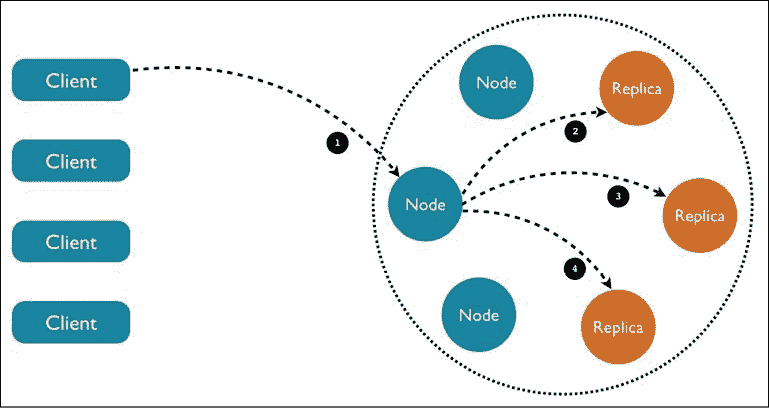

# seven

# 使用 Kubernetes 运行有状态应用

在本章中，我们将学习如何在 Kubernetes 上运行有状态应用。Kubernetes 根据复杂的需求和配置(如名称空间、限制和配额)，根据需要自动启动和重新启动集群节点上的 pods，这让我们不用做很多工作。但是当 pod 运行存储感知软件时，例如数据库和队列，重新定位 pod 会导致系统崩溃。首先，我们将探索有状态豆荚的本质，以及为什么在 Kubernetes 中管理它们要复杂得多。我们将研究一些管理复杂性的方法，例如共享环境变量和 DNS 记录。在某些情况下，冗余内存状态、DaemonSet 或持久存储声明可以达到目的。Kubernetes 为状态感知豆荚推出的主要解决方案是 StatefulSet(以前称为 PetSet)资源，它允许我们管理具有稳定属性的豆荚的索引集合。最后，我们将深入探讨在 Kubernetes 之上运行 Cassandra 集群的完整示例。

## Kubernetes 中有状态和无状态应用的对比

无状态 Kubernetes 应用是一个不管理其在 Kubernetes 集群中的状态的应用。所有状态都存储在集群之外，集群容器以某种方式访问它。在本节中，我们将学习为什么状态管理对于分布式系统的设计至关重要，以及在 Kubernetes 集群中管理状态的好处。

### 了解分布式数据密集型应用的本质

让我们从最基本的开始。分布式应用是运行在多台机器上的进程的集合，处理输入，操作数据，公开应用接口，并可能有其他副作用。每个进程都是它的程序、它的运行时环境以及它的输入和输出的组合。你在学校编写的程序以命令行参数的形式获得输入，也许它们会读取一个文件或访问一个数据库，然后将结果写入屏幕、文件或数据库。有些程序将状态保存在内存中，可以通过网络为请求提供服务。简单的程序在一台机器上运行，可以将所有状态保存在内存中或从文件中读取。他们的运行环境就是他们的操作系统。如果它们崩溃，用户必须手动重启它们。他们被绑在机器上。分布式应用是不同的动物。一台机器不足以处理所有数据或足够快地满足所有请求。一台机器不能保存所有的数据。需要处理的数据非常大，无法经济高效地下载到每台处理机中。机器可能出现故障，需要更换。需要对所有加工机器进行升级。用户可能分布在全球各地。

考虑到所有这些问题，很明显传统的方法行不通。限制因素变成了数据。用户/客户端必须只接收摘要或处理过的数据。所有的海量数据处理都必须在靠近数据本身的地方进行，因为传输数据的速度非常慢，成本也非常高。相反，大部分处理代码必须在相同的数据中心和数据网络环境中运行。

### 为什么要在库本内斯管理国家？

与单独的集群相比，在 Kubernetes 中管理状态的主要原因是，监控、扩展、分配、保护和操作存储集群所需的大量基础架构已经由 Kubernetes 提供。运行并行存储集群会导致大量重复工作。

### 为什么要管理Kubernetes以外的州？

我们不要排除其他选择。在某些情况下，在单独的非 Kubernetes 集群中管理状态可能更好，只要它共享同一个内部网络(数据邻近性胜过一切)。

一些合理的理由如下:

*   您已经有了一个单独的存储集群，不想节外生枝
*   其他非 Kubernetes 应用正在使用您的存储集群
*   Kubernetes 对您的存储集群的支持不够稳定或成熟
*   您可能希望以增量方式在 Kubernetes 中处理有状态的应用，从一个单独的存储集群开始，稍后与 Kubernetes 更紧密地集成

## 用于发现的共享环境变量与 DNS 记录

Kubernetes 提供了跨集群全局发现的几种机制。如果您的存储集群不是由 Kubernetes 管理的，您仍然需要告诉 Kubernetes pods 如何找到并访问它。有两种常见的方法:

*   域名服务器(Domain Name Server)
*   环境变量

在某些情况下，您可能希望两者都使用，因为环境变量可以覆盖域名系统。

### 通过域名系统访问外部数据存储

DNS 方法简单明了。假设您的外部存储集群是负载平衡的并且可以提供一个稳定的端点，那么 pods 可以直接命中该端点并连接到外部集群。

### 通过环境变量访问外部数据存储

另一种简单的方法是使用环境变量将连接信息传递给外部存储集群。Kubernetes 提供了`ConfigMap`资源，作为将配置与容器映像分开的一种方式。配置是一组键值对。配置信息可以作为容器和卷内的环境变量公开。您可能更喜欢将机密用于敏感的连接信息。

#### 创建配置映射

以下文件是保存地址列表的`ConfigMap`:

```
apiVersion: v1
kind: ConfigMap 
metadata:
  name: db-config 
data:
  db-ip-addresses: 1.2.3.4,5.6.7.8 
```

保存为`db-config-map.yaml`运行:

```
$ kubectl create -f db-config-map.yaml
configmap/db-config created 
```

`data`部分包含所有的键值对(在这种情况下，只是一个键名为`db-ip-addresses`的键对)。这在以后食用豆荚中的`ConfigMap`时很重要。您可以查看内容以确保它是正确的:

```
$ kubectl get configmap db-config -o yaml
apiVersion: v1
data:
  db-ip-addresses: 1.2.3.4,5.6.7.8
kind: ConfigMap
metadata:
  creationTimestamp: "2020-06-08T14:25:39Z"
  name: db-config
  namespace: default
  resourceVersion: "366427"
  selfLink: /api/v1/namespaces/default/configmaps/db-config
  uid: 2d0a357a-e38e-11e9-90a4-0242ac120002 
```

还有其他方法来创建`ConfigMap`。您可以使用`--from-value`或`--from-file`命令行参数直接创建它们。

### 将配置映射作为环境变量使用

当您正在创建一个 pod 时，您可以指定一个`ConfigMap`并以几种方式使用它的值。以下是如何使用我们的配置图作为环境变量:

```
apiVersion: v1
kind: Pod
metadata:
  name: some-pod
spec:
  containers:
  - name: some-container
    image: busybox
    command: ["/bin/sh", "-c", "env"]
    env:
    - name: DB_IP_ADDRESSES
      valueFrom:
        configMapKeyRef:
          name: db-config
          key: db-ip-addresses
  restartPolicy: Never 
```

该 pod 运行`busybox`最小容器，执行`env` bash 命令并立即退出。来自`db-configmap`的`db-ip-addresses`键被映射到`DB_IP_ADDRESSES`环境变量，并反映在输出中:

```
$ kubectl create -f pod-with-db.yaml
pod/some-pod created
$ kubectl logs some-pod | grep DB_IP
DB_IP_ADDRESSES=1.2.3.4,5.6.7.8 
```

### 使用冗余内存状态

在某些情况下，您可能希望在内存中保留一个瞬态。分布式缓存是一种常见的情况。时间敏感信息是另一个问题。对于这些用例，不需要持久存储，通过一个服务访问多个 pods 可能正是合适的解决方案。我们可以使用标准的 Kubernetes 技术，例如标记，来识别属于分布式缓存的 pods，存储相同状态的冗余副本，并通过服务公开它们。如果一个豆荚死了，Kubernetes会创造一个新的豆荚，在它赶上之前，其他豆荚会为国家服务。我们甚至可以使用 pod 的反关联性功能来确保维护相同状态的冗余副本的 pod 不会被调度到同一个节点。

当然，您也可以使用像 Memcached 或 Redis 这样的东西。

### 将 DaemonSet 用于冗余持久存储

一些有状态的应用，如分布式数据库或队列，冗余地管理它们的状态并自动同步它们的节点(我们稍后将深入研究 Cassandra)。在这些情况下，重要的是吊舱被调度来分离节点。同样重要的是，pods 被调度到具有特定硬件配置的节点，或者甚至专用于有状态应用。DaemonSet 特性非常适合这个用例。我们可以标记一组节点，并确保有状态的 pods 被逐个调度到选定的节点组。

### 应用持续批量索赔

如果有状态的应用可以有效地使用共享的持久存储，那么在每个 pod 中使用持久卷声明是可行的方法，正如我们在*第 6 章*、*管理存储*中所展示的那样。有状态应用将呈现一个看起来像本地文件系统的装载卷。

### 利用状态集

StatefulSets 特别设计用于支持分布式有状态应用，在这些应用中，成员的身份很重要，如果 pod 重新启动，它必须在集合中保留其身份。它提供有序的部署和扩展。不同于常规的荚，StatefulSet 的荚与持久存储相关联。

#### 何时使用状态集

状态集非常适合需要以下一项或多项的应用:

*   稳定、唯一的网络标识符
*   稳定、持久的存储
*   有序、优雅的部署和扩展
*   有序、优雅的删除和终止

#### 状态集合的组成部分

为了有一个工作状态集合，有几个部分需要正确配置:

*   一种无头服务，负责管理 StatefulSet pods 的网络标识
*   状态集本身有许多副本
*   动态或由管理员调配的永久存储

下面是一个名为`nginx`的无头服务的例子，它将用于一个 StatefulSet:

```
apiVersion: v1
kind: Service 
metadata:
    name: nginx 
    labels:
        app: nginx 
spec:
ports:
    - port: 80 
      name: web
clusterIP: None 
selector:
    app: nginx 
```

现在，statefleset配置文件将引用该服务:

```
apiVersion: apps/v1 
kind: StatefulSet 
metadata:
     name: nginx
     labels:
         app: nginx
spec:
    serviceName: "nginx" 
    replicas: 3
   selector:
        matchLabels:
            app: nginx
    template: 
        metadata:
            labels:
                app: nginx 
```

下一部分是 pod 模板，它包括一个名为`www`的挂载卷:

```
 spec:
  terminationGracePeriodSeconds: 1800
  containers:
  - name: nginx
    image: gcr.io/google_containers/nginx-slim:0.8
    imagePullPolicy: Always
    ports:
    - containerPort: 80
      name: web
    volumeMounts:
    - name: www
      mountPath: /usr/share/nginx/html 
```

最后但并非最不重要的是，`volumeClaimTemplates`使用名为`www`的声明来匹配装入的卷。该权利要求要求 1 千兆字节的存储空间，可访问`ReadWriteOnce`:

```
volumeClaimTemplates:
    - metadata:
      name: www 
      spec:
        accessModes: ["ReadWriteOnce"] 
        resources:
            requests: 
                storage: 1Gi 
```

## 在库本内斯运行卡珊德拉集群

在本节中，我们将详细探讨一个非常大的例子，将 Cassandra 集群配置为在 Kubernetes 集群上运行。完整的示例可在此访问:

[https://kubernetes . io/docs/教程/有状态-应用/cassandra/](https://kubernetes.io/docs/tutorials/stateful-application/cassandra/)

首先，我们将稍微了解一下卡珊德拉及其特性，然后按照一步一步的过程，使用我们在上一节中介绍的几种技术和策略来运行它。

### 卡珊德拉简介

Cassandra 是一个分布式柱状数据存储。它是为大数据而设计的。Cassandra 快速、健壮(无单点故障)、高度可用且可线性扩展。它还有多数据中心支持。它通过激光聚焦和精心制作它所支持的功能——同样重要的是——它不支持的功能来实现这一切。在之前的一家公司中，我运行了一个 Kubernetes 集群，该集群使用 Cassandra 作为传感器数据(约 100 TB)的主要数据存储。卡珊德拉基于**分布式哈希表** ( **分布式哈希表**)算法将数据分配给一组节点(节点环)。集群节点通过八卦协议相互交谈，并快速了解集群的整体状态(哪些节点加入，哪些节点剩余或不可用)。Cassandra 不断压缩数据并平衡集群。为了冗余、稳健和高可用性，数据通常会被复制多次。从开发人员的角度来看，Cassandra 非常适合时间序列数据，并提供了一个灵活的模型，您可以在其中指定每个查询的一致性级别。它也是幂等的(对于分布式数据库来说，这是一个非常重要的特性)，这意味着允许重复插入或更新。

下面是一个图表，显示了 Cassandra 集群是如何组织的，客户端如何访问任何节点，以及请求将如何自动转发到具有所请求数据的节点:



图 7.1:与卡珊德拉集群交互的请求

### 卡珊德拉·多克形象

在 Kubernetes 上部署 Cassandra，而不是独立的 Cassandra 集群部署需要一个特殊的 Docker 映像。这是重要的一步，因为这意味着我们可以使用 Kubernetes 来跟踪我们的 Cassandra 豆荚。此处提供了该映像:

[https://github . com/kubrines/examples/blob/master/Cassandra/img/docerfile](https://github.com/kubernetes/examples/blob/master/cassandra/img/Dockerfile )

文件就要到了。基础映像是专为在容器中使用而设计的 Debian 风格(参见[https://github . com/kubernetes/kubernetes/tree/master/build/Debian-base](https://github.com/kubernetes/kubernetes/tree/master/build/debian-base))。

Cassandra Dockerfile 定义了一些在构建映像时必须设置的构建参数，创建了一堆标签，定义了许多环境变量，将所有文件添加到容器内部的根目录，运行`build.sh`脚本，声明 Cassandra 数据卷(数据存储的地方)，公开了一堆端口，最后使用`dumb-init`执行`run.sh`脚本:

```
FROM k8s.gcr.io/debian-base-amd64:0.3
ARG BUILD_DATE
ARG VCS_REF
ARG CASSANDRA_VERSION
ARG DEV_CONTAINER
LABEL \
    org.label-schema.build-date=$BUILD_DATE \
    org.label-schema.docker.dockerfile="/Dockerfile" \
    org.label-schema.license="Apache License 2.0" \
    org.label-schema.name="k8s-for-greeks/docker-cassandra-k8s" \
    org.label-schema.url="https://github.com/k8s-for-greeks/" \
    org.label-schema.vcs-ref=$VCS_REF \
    org.label-schema.vcs-type="Git" \
    org.label-schema.vcs-url="https://github.com/k8s-for-greeks/docker-cassandra-k8s"
ENV CASSANDRA_HOME=/usr/local/apache-cassandra-${CASSANDRA_VERSION} \
    CASSANDRA_CONF=/etc/cassandra \
    CASSANDRA_DATA=/cassandra_data \
    CASSANDRA_LOGS=/var/log/cassandra \
    JAVA_HOME=/usr/lib/jvm/java-8-openjdk-amd64 \
    PATH=${PATH}:/usr/lib/jvm/java-8-openjdk-amd64/bin:/usr/local/apache-cassandra-${CASSANDRA_VERSION}/bin
ADD files /
RUN clean-install bash \
    && /build.sh \
    && rm /build.sh
VOLUME ["/$CASSANDRA_DATA"]
# 7000: intra-node communication
# 7001: TLS intra-node communication
# 7199: JMX
# 9042: CQL
# 9160: thrift service
EXPOSE 7000 7001 7199 9042 9160
CMD ["/usr/bin/dumb-init", "/bin/bash", "/run.sh"] 
```

以下是 Dockerfile 使用的所有文件:

*   `build.sh`
*   `cassandra-seed.h`
*   `cassandra.yaml`
*   `jvm.options`
*   `kubernetes-cassandra.jar`
*   `logback.xml`
*   `ready-probe.sh`
*   `run.sh`

我们不会涵盖所有这些问题；我们将关注`build.sh`和`run.sh`脚本。

#### 探索 build.sh 脚本

卡珊德拉是一个 Java 程序。构建脚本安装了 Java 运行时环境和一些必要的库和工具。然后，它会设置一些稍后将使用的变量，如`CASSANDRA_PATH`。

它从 Apache 组织下载正确版本的 Cassandra(Cassandra 是一个 Apache 开源项目)，创建`/cassandra_data/data`目录，Cassandra 将在其中存储其表和`/etc/cassandra`配置目录，将文件复制到配置目录中，添加一个 Cassandra 用户，设置就绪探测器，安装 Python，将 Cassandra `jar`文件和种子共享库移动到它们的目标位置，然后清理在此过程中生成的所有中间文件:

```
apt-get update && apt-get dist-upgrade -y
clean-install \
    openjdk-8-jre-headless \
    libjemalloc1 \
    localepurge \
    dumb-init \
    wget
CASSANDRA_PATH="cassandra/${CASSANDRA_VERSION}/apache-cassandra-${CASSANDRA_VERSION}-bin.tar.gz"
CASSANDRA_DOWNLOAD=http://www.apache.org/dyn/closer.cgi?path=/${CASSANDRA_PATH}&as_json=1
CASSANDRA_MIRROR='wget -q -O - ${CASSANDRA_DOWNLOAD} | grep -oP "(?<=\"preferred\": \")[^\"]+"'
echo "Downloading Apache Cassandra from $CASSANDRA_MIRROR$CASSANDRA_PATH..."
wget -q -O - $CASSANDRA_MIRROR$CASSANDRA_PATH \
    | tar -xzf - -C /usr/local
mkdir -p /cassandra_data/data
mkdir -p /etc/Cassandra
mv /logback.xml /cassandra.yaml /jvm.options /etc/cassandra/
mv /usr/local/apache-cassandra-${CASSANDRA_VERSION}/conf/cassandra-env.sh /etc/cassandra/
adduser --disabled-password --no-create-home --gecos '' --disabled-login cassandra
chmod +x /ready-probe.sh
chown cassandra: /ready-probe.sh
DEV_IMAGE=${DEV_CONTAINER:-}
if [ ! -z "$DEV_IMAGE" ]; then
    clean-install python;
else
    rm -rf  $CASSANDRA_HOME/pylib;
fi
mv /kubernetes-cassandra.jar /usr/local/apache-cassandra-${CASSANDRA_VERSION}/lib
mv /cassandra-seed.so /etc/cassandra/
mv /cassandra-seed.h /usr/local/lib/include
apt-get -y purge localepurge
apt-get -y autoremove
apt-get clean
rm <many files and directories> 
```

#### 探索 run.sh 脚本

`run.sh`脚本需要卡珊德拉的一些外壳技能和知识才能理解，但是值得努力。

首先，在`/etc/cassandra/cassandra.yaml`为卡珊德拉配置文件设置一些本地变量。`CASSANDRA_CFG`变量将用于脚本的其余部分:

```
set -e
CASSANDRA_CONF_DIR=/etc/Cassandra
CASSANDRA_CFG=$CASSANDRA_CONF_DIR/cassandra.yaml 
```

如果没有指定`CASSANDRA_SEEDS`，则设置`HOSTNAME`，稍后由状态集使用:

```
# we are doing StatefulSet or just setting our seeds
if [ -z "$CASSANDRA_SEEDS" ]; then
  HOSTNAME=$(hostname -f)
  CASSANDRA_SEEDS=$(hostname -f)
fi 
```

然后是一长串带有默认值的环境变量。语法`${VAR_NAME:-}`使用`VAR_NAME`环境变量(如果定义的话)或默认值。

类似的语法`${VAR_NAME:=}`也做了同样的事情，但是如果没有定义环境变量，也会为其分配默认值。这是一个微妙但重要的区别。

这里使用了两种变体:

```
# The following vars relate to their counter parts in $CASSANDRA_CFG
# for instance rpc_address
CASSANDRA_RPC_ADDRESS="${CASSANDRA_RPC_ADDRESS:-0.0.0.0}"
CASSANDRA_NUM_TOKENS="${CASSANDRA_NUM_TOKENS:-32}"
CASSANDRA_CLUSTER_NAME="${CASSANDRA_CLUSTER_NAME:='Test Cluster'}"
CASSANDRA_LISTEN_ADDRESS=${POD_IP:-$HOSTNAME}
CASSANDRA_BROADCAST_ADDRESS=${POD_IP:-$HOSTNAME}
CASSANDRA_BROADCAST_RPC_ADDRESS=${POD_IP:-$HOSTNAME}
CASSANDRA_DISK_OPTIMIZATION_STRATEGY="${CASSANDRA_DISK_OPTIMIZATION_TRATEGY:-ssd}"
CASSANDRA_MIGRATION_WAIT="${CASSANDRA_MIGRATION_WAIT:-1}"
CASSANDRA_ENDPOINT_SNITCH="${CASSANDRA_ENDPOINT_SNITCH:-SimpleSnitch}"
CASSANDRA_DC="${CASSANDRA_DC}"
CASSANDRA_RACK="${CASSANDRA_RACK}"
CASSANDRA_RING_DELAY="${CASSANDRA_RING_DELAY:-30000}"
CASSANDRA_AUTO_BOOTSTRAP="${CASSANDRA_AUTO_BOOTSTRAP:-true}"
CASSANDRA_SEEDS="${CASSANDRA_SEEDS:false}"
CASSANDRA_SEED_PROVIDER="${CASSANDRA_SEED_PROVIDER:-org.apache.cassandra.locator.SimpleSeedProvider}"
CASSANDRA_AUTO_BOOTSTRAP="${CASSANDRA_AUTO_BOOTSTRAP:false}" 
```

顺便说一下，我通过打开一个拉请求来修复这里的一个小错别字，从而为 Kubernetes 贡献了我的一份力量。参见[https://github.com/kubernetes/examples/pull/348](https://github.com/kubernetes/examples/pull/348)。

下一个部分配置监控 **Java 管理异常(JMX)** 并控制垃圾收集输出:

```
# Turn off JMX auth
CASSANDRA_OPEN_JMX="${CASSANDRA_OPEN_JMX:-false}"
# send GC to STDOUT
CASSANDRA_GC_STDOUT="${CASSANDRA_GC_STDOUT:-false}" 
```

然后是一个部分，所有的变量都被打印到屏幕上。让我们跳过大部分内容:

```
echo Starting Cassandra on ${CASSANDRA_LISTEN_ADDRESS}
echo CASSANDRA_CONF_DIR ${CASSANDRA_CONF_DIR}
echo CASSANDRA_CFG ${CASSANDRA_CFG}
echo CASSANDRA_AUTO_BOOTSTRAP ${CASSANDRA_AUTO_BOOTSTRAP}
... 
```

下一节很重要。默认情况下，卡珊德拉使用一个简单的告密者，它不知道机架和数据中心。当群集跨越多个数据中心和机架时，这不是最佳选择。

Cassandra 支持机架感知和数据中心感知，可以优化冗余和高可用性，同时适当限制数据中心之间的通信:

```
# if DC and RACK are set, use GossipingPropertyFileSnitch
if [[ $CASSANDRA_DC && $CASSANDRA_RACK ]]; then
  echo "dc=$CASSANDRA_DC" > $CASSANDRA_CONF_DIR/cassandra-rackdc.properties
  echo "rack=$CASSANDRA_RACK" >> $CASSANDRA_CONF_DIR/cassandra-rackdc.properties
  CASSANDRA_ENDPOINT_SNITCH="GossipingPropertyFileSnitch"
fi 
```

内存管理也很重要，您可以控制最大堆大小，以确保 Cassandra 不会开始颠簸和交换到磁盘:

```
if [ -n "$CASSANDRA_MAX_HEAP" ]; then
  sed -ri "s/^(#)?-Xmx[0-9]+.*/-Xmx$CASSANDRA_MAX_HEAP/" "$CASSANDRA_CONF_DIR/jvm.options"
  sed -ri "s/^(#)?-Xms[0-9]+.*/-Xms$CASSANDRA_MAX_HEAP/" "$CASSANDRA_CONF_DIR/jvm.options"
fi
if [ -n "$CASSANDRA_REPLACE_NODE" ]; then
   echo "-Dcassandra.replace_address=$CASSANDRA_REPLACE_NODE/" >> "$CASSANDRA_CONF_DIR/jvm.options"
fi 
```

机架和数据中心信息存储在一个简单的 Java `properties`文件中:

```
for rackdc in dc rack; do
  var="CASSANDRA_${rackdc^^}"
  val="${!var}"
  if [ "$val" ]; then
    sed -ri 's/^('"$rackdc"'=).*/\1 '"$val"'/' "$CASSANDRA_CONF_DIR/cassandra-rackdc.properties"
  fi
done 
```

下一节循环前面定义的所有变量，在`Cassandra.yaml`配置文件中找到相应的键，并覆盖它们。这确保了每个配置文件在启动 Cassandra 之前都是动态定制的:

```
for yaml in \
  broadcast_address \
  broadcast_rpc_address \
  cluster_name \
  disk_optimization_strategy \
  endpoint_snitch \
  listen_address \
  num_tokens \
  rpc_address \
  start_rpc \
  key_cache_size_in_mb \
  concurrent_reads \
  concurrent_writes \
  memtable_cleanup_threshold \
  memtable_allocation_type \
  memtable_flush_writers \
  concurrent_compactors \
  compaction_throughput_mb_per_sec \
  counter_cache_size_in_mb \
  internode_compression \
  endpoint_snitch \
  gc_warn_threshold_in_ms \
  listen_interface \
  rpc_interface \
  ; do
  var="CASSANDRA_${yaml^^}"
  val="${!var}"
  if [ "$val" ]; then
    sed -ri 's/^(# )?('"$yaml"':).*/\2 '"$val"'/' "$CASSANDRA_CFG"
  fi
done
echo "auto_bootstrap: ${CASSANDRA_AUTO_BOOTSTRAP}" >> $CASSANDRA_CFG 
```

下一个部分是关于根据部署解决方案设置种子或种子提供者(状态设置与否)。第一个豆荚有一个小技巧来引导自己的种子:

```
# set the seed to itself.  This is only for the first pod, otherwise
# it will be able to get seeds from the seed provider
if [[ $CASSANDRA_SEEDS == 'false' ]]; then
  sed -ri 's/- seeds:.*/- seeds: "'"$POD_IP"'"/' $CASSANDRA_CFG
else # if we have seeds set them.  Probably StatefulSet
  sed -ri 's/- seeds:.*/- seeds: "'"$CASSANDRA_SEEDS"'"/' $CASSANDRA_CFG
fi
sed -ri 's/- class_name: SEED_PROVIDER/- class_name: '"$CASSANDRA_SEED_PROVIDER"'/' $CASSANDRA_CFG 
```

以下部分设置了远程管理和 JMX 监控的各种选项。在复杂的分布式系统中，拥有合适的管理工具至关重要。

卡珊德拉对无处不在的 JMX 标准有着深刻的支持:

```
# send gc to stdout
if [[ $CASSANDRA_GC_STDOUT == 'true' ]]; then
  sed -ri 's/ -Xloggc:\/var\/log\/cassandra\/gc\.log//' $CASSANDRA_CONF_DIR/cassandra-env.sh
fi
# enable RMI and JMX to work on one port
echo "JVM_OPTS=\"\$JVM_OPTS -Djava.rmi.server.hostname=$POD_IP\"" >> $CASSANDRA_CONF_DIR/cassandra-env.sh
# getting WARNING messages with Migration Service
echo "-Dcassandra.migration_task_wait_in_seconds=${CASSANDRA_MIGRATION_WAIT}" >> $CASSANDRA_CONF_DIR/jvm.options
echo "-Dcassandra.ring_delay_ms=${CASSANDRA_RING_DELAY}" >> $CASSANDRA_CONF_DIR/jvm.options
if [[ $CASSANDRA_OPEN_JMX == 'true' ]]; then
  export LOCAL_JMX=no
  sed -ri 's/ -Dcom\.sun\.management\.jmxremote\.authenticate=true/ -Dcom\.sun\.management\.jmxremote\.authenticate=false/' $CASSANDRA_CONF_DIR/cassandra-env.sh
  sed -ri 's/ -Dcom\.sun\.management\.jmxremote\.password\.file=\/etc\/cassandra\/jmxremote\.password//' $CASSANDRA_CONF_DIR/cassandra-env.sh
fi 
```

最后，它保护`data`目录，使得只有卡珊德拉用户可以访问它，`CLASSPATH`被设置为卡珊德拉`jar`文件，并且它作为卡珊德拉用户在前台(未后台化)启动卡珊德拉:

```
chmod 700 "${CASSANDRA_DATA}"
chown -c -R cassandra "${CASSANDRA_DATA}" "${CASSANDRA_CONF_DIR}"
export CLASSPATH=/kubernetes-cassandra.jar
su cassandra -c "$CASSANDRA_HOME/bin/cassandra -f" 
```

### 勾搭库本内斯和卡珊德拉

连接 Kubernetes 和 Cassandra 需要一些工作，因为 Cassandra 被设计为非常自给自足，但是我们希望让它在正确的时间挂钩到 Kubernetes 中，以提供自动重启故障节点、监控、分配 Cassandra pods 以及提供与其他 pods 并排的 Cassandra pods 的统一视图等功能。

卡珊德拉是一个复杂的野兽，有许多旋钮来控制它。它自带`Cassandra.yaml`配置文件，可以用环境变量覆盖所有选项。

#### 深入卡珊德拉配置文件

有两个设置特别相关:种子提供者和告密者。种子提供者负责发布集群中节点的 IP 地址(种子)列表。每个开始运行的节点都连接到种子(通常至少有三个)，如果它成功到达其中一个，它们会立即交换集群中所有节点的信息。随着节点之间的相互交流，每个节点的信息会不断更新。

在`Cassandra.yaml`中配置的默认种子提供者只是一个静态的 IP 地址列表，在本例中只是环回接口:

```
# any class that implements the SeedProvider interface and has a
# constructor that takes a Map<String, String> of parameters will do.
seed_provider:
    # Addresses of hosts that are deemed contact points.
    # Cassandra nodes use this list of hosts to find each other and learn
    # the topology of the ring.  You must change this if you are running
    # multiple nodes!
    #- class_name: io.k8s.cassandra.KubernetesSeedProvider
    - class_name: SEED_PROVIDER
      parameters:
          # seeds is actually a comma-delimited list of addresses.
          # Ex: "<ip1>,<ip2>,<ip3>"
          - seeds: "127.0.0.1" 
```

另一个重要的场景是告密者。它有两个作用:它让 Cassandra 充分了解您的网络拓扑，以有效地路由请求，并允许 Cassandra 在您的集群中传播副本，以避免相关故障。它通过将机器分组到数据中心和机架中来实现这一点。Cassandra 将尽最大努力不要在同一个机架上有多个副本(实际上可能不是物理位置)。

卡珊德拉预装了几个金色飞贼类，但是没有一个是库本内斯感知的。默认为`SimpleSnitch`，但可以覆盖:

```
# You can use a custom Snitch by setting this to the full class
# name of the snitch, which will be assumed to be on your classpath. 
endpoint_snitch: SimpleSnitch 
```

其他告密者有:

*   `GossipingPropertyFileSnitch`
*   `PropertyFileSnitch`
*   `Ec2Snitch`
*   `Ec2MultiRegionSnitch`
*   `RackInferringSnitch`

#### 自定义种子提供程序

在 Kubernetes 中运行 Cassandra 节点作为豆荚时，Kubernetes 可能会四处移动豆荚，包括种子。为了适应这一点，卡珊德拉种子提供者需要与Kubernetes应用编程接口服务器进行交互。

下面是实现卡珊德拉应用编程接口的自定义 Java 类的一个简短片段:

```
public class KubernetesSeedProvider implements SeedProvider {
...
  /**
   * Call Kubernetes API to collect a list of seed providers
   *
   * @return list of seed providers
   */
  public List<InetAddress> getSeeds() {
    GoInterface go = (GoInterface) Native.loadLibrary("cassandra-seed.so", GoInterface.class);
    String service = getEnvOrDefault("CASSANDRA_SERVICE", "cassandra");
    String namespace = getEnvOrDefault("POD_NAMESPACE", "default");
    String initialSeeds = getEnvOrDefault("CASSANDRA_SEEDS", "");
    if ("".equals(initialSeeds)) {
        initialSeeds = getEnvOrDefault("POD_IP", "");
    }
    String seedSizeVar = getEnvOrDefault("CASSANDRA_SERVICE_NUM_SEEDS", "8");
    Integer seedSize = Integer.valueOf(seedSizeVar);
    String data = go.GetEndpoints(namespace, service, initialSeeds);
    ObjectMapper mapper = new ObjectMapper();
    try {
        Endpoints = mapper.readValue(data, Endpoints.class);
        logger.info("cassandra seeds: {}", endpoints.ips.toString());
        return Collections.unmodifiableList(endpoints.ips);
    } catch (IOException e) {
        // This should not happen
        logger.error("unexpected error building cassandra seeds: {}" , e.getMessage());
        return Collections.emptyList();
    }
} 
```

### 创建 Cassandra 无头服务

无头服务的作用是允许 Kubernetes 集群中的客户端通过标准的 Kubernetes 服务连接到 Cassandra 集群，而不是跟踪节点的网络身份或在所有节点前放置专用的负载平衡器。Kubernetes 通过其服务提供开箱即用的一切。

以下是配置文件:

```
apiVersion:  v1  
kind: Service 
metadata:
  labels:
    app: cassandra 
    name: Cassandra
spec:
  clusterIP: None 
  ports:
    - port: 9042 
  selector:
    app: Cassandra 
```

`app: Cassandra`标签会将所有参与服务的豆荚分组。Kubernetes 将创建端点记录，DNS 将返回一个记录进行发现。`clusterIP`设置为`None`，这意味着服务是无头的，Kubernetes 不会进行任何负载平衡或代理。这很重要，因为 Cassandra 节点直接进行自己的通信。

卡珊德拉使用`9042`端口来满足 CQL 的请求。这些可以是查询、插入/更新(通常是 Cassandra 的追加)或删除。

### 使用状态集创建卡珊德拉集群

声明一个状态集合并不简单。它可以说是最复杂的 Kubernetes 资源。它有很多可移动的部分:标准元数据、StatefulSet 规范、pod 模板(它本身通常非常复杂)和批量索赔模板。

#### 剖析州政府的 YAML 文件

让我们有条不紊地浏览这个声明三节点 Cassandra 集群的示例 statefleset YAML 文件。

下面是基本的元数据。注意`apiVersion`字符串是`apps/v1`(statefleset 在 Kubernetes 1.9 中变得普遍可用):

```
apiVersion: "apps/v1"
kind: StatefulSet
metadata:
  name: Cassandra
  labels:
     app: cassandra 
```

statefleset 规范定义了无头服务名称、标签选择器(`app: cassandra`)、statefleset 中有多少个 pod 以及 pod 模板(稍后解释)。`replicas`字段指定状态集中有多少个吊舱:

```
spec:
  serviceName: Cassandra
  replicas: 3
  selector:
    matchLabels:
      app: Cassandra
  template:      
      ... 
```

术语豆荚的复制品是一个不幸的选择，因为豆荚不是彼此的复制品。它们共享同一个 pod 模板，但是它们有一个唯一的身份，它们通常负责不同的状态子集。这在 Cassandra 的情况下更令人困惑，它使用相同的术语“副本”来指代冗余地复制状态的某个子集的节点组(但并不相同，因为每个节点也可以管理额外的状态)。我在 Kubernetes 项目中打开了一个 GitHub 问题，将术语从副本改为成员:

[https://github . com/kubrines/kubrines . github . io/issues/2103](https://github.com/kubernetes/kubernetes.github.io/issues/2103 )

pod 模板包含一个基于自定义 Cassandra 映像的容器。它还将终止宽限期设置为 30 分钟。这意味着当 Kubernetes 需要终止 pod 时，它将向容器发送一个 SIGTERM 信号，通知它们应该退出，并给它们一个优雅地退出的机会。任何在宽限期后仍在运行的容器都将通过 SIGKILL 被杀死。

下面是带有`app: cassandra`标签的 pod 模板:

```
 template:
    metadata:
      labels:
        app: Cassandra
    spec:
      terminationGracePeriodSeconds: 1800
      containers:
      ... 
```

`containers`部分有多个重要部分。它以一个名字和我们之前看到的映像开始:

```
 containers:
      - name: Cassandra
        image: gcr.io/google-samples/cassandra:v14
        imagePullPolicy: Always 
```

然后，它定义了 Cassandra 节点进行外部和内部通信所需的多个容器端口:

```
 ports:
        - containerPort: 7000
          name: intra-node
        - containerPort: 7001
          name: tls-intra-node
        - containerPort: 7199
          name: jmx
        - containerPort: 9042
          name: cql 
```

`resources`部分指定容器所需的 CPU 和内存。这一点至关重要，因为存储管理层永远不会因为 CPU 或内存而成为性能瓶颈。请注意，它遵循相同请求和限制的最佳实践，以确保资源在分配后始终可用:

```
 resources:
          limits:
            cpu: "500m"
            memory: 1Gi
          requests:
           cpu: "500m"
           memory: 1Gi 
```

Cassandra 需要访问**进程间通信(IPC)** ，容器通过安全上下文的功能请求该通信:

```
 securityContext:
          capabilities:
            add:
              - IPC_LOCK 
```

`lifecycle`部分运行 Cassandra `nodetool drain`命令，以确保当容器需要关闭时，节点上的数据被传输到 Cassandra 集群中的其他节点。这就是需要 30 分钟宽限期的原因。节点清空涉及移动大量数据:

```
 lifecycle:
          preStop:
            exec:
              command:
              - /bin/sh
              - -c
              - nodetool drain 
```

`env`部分指定了容器内可用的环境变量。以下是必要变量的部分列表。`CASSANDRA_SEEDS`变量被设置为无头服务，因此卡珊德拉节点可以在启动时与种子节点对话，并发现整个集群。请注意，在这个配置中，我们不使用特殊的 Kubernetes 种子提供程序。`POD_IP`很有趣，因为它利用向下 API 通过对`status.podIP`的字段引用来填充其值:

```
 env:
          - name: MAX_HEAP_SIZE
            value: 512M
          - name: HEAP_NEWSIZE
            value: 100M
          - name: CASSANDRA_SEEDS
            value: "cassandra-0.cassandra.default.svc.cluster.local"
          - name: CASSANDRA_CLUSTER_NAME
            value: "K8Demo"
          - name: CASSANDRA_DC
            value: "DC1-K8Demo"
          - name: CASSANDRA_RACK
            value: "Rack1-K8Demo"
          - name: CASSANDRA_SEED_PROVIDER
            value: io.k8s.cassandra.KubernetesSeedProvider
          - name: POD_IP
            valueFrom:
              fieldRef:
                fieldPath: status.podIP 
```

就绪探测器确保请求不会被发送到节点，直到它真正准备好服务它们。`ready-probe.sh`脚本利用了卡珊德拉的`nodetool status`命令:

```
 readinessProbe:
          exec:
            command:
            - /bin/bash
            - -c
            - /ready-probe.sh
          initialDelaySeconds: 15
          timeoutSeconds: 5 
```

容器规范的最后一部分是卷装载，它必须与持久卷声明相匹配:

```
 volumeMounts:
        - name: cassandra-data
          mountPath: /var/lib/cassandra 
```

容器规格到此为止。最后一部分是批量索赔模板。在这种情况下，使用动态配置。强烈建议将固态硬盘用于卡珊德拉存储，尤其是其日志。本例中请求的存储空间为 1 GiB。我通过实验发现，1-2 TB 是单个 Cassandra 节点的理想选择。原因是卡珊德拉在幕后做了大量的数据洗牌，压缩和重新平衡数据。如果一个节点离开集群或一个新节点加入集群，您必须等待直到数据被正确地重新平衡，然后来自剩余节点的数据才被正确地重新分配或填充新节点。请注意，卡珊德拉需要大量的磁盘空间来完成所有这些洗牌。建议有 50%的可用磁盘空间。当您考虑到还需要复制(通常为 3 倍)时，所需的存储空间可以是数据大小的 6 倍。如果你喜欢冒险，你可以有 30%的可用空间，也可以根据你的使用情况使用 2 倍的复制。但是不要获得低于 10%的可用磁盘空间，即使是在单个节点上。我很难理解，如果没有极端的措施，卡珊德拉只会陷入困境，无法压缩和重新平衡这些节点。

在这种情况下，必须定义一个名为`fast`的存储类。通常，对于 Cassandra，您需要一个特殊的存储类，并且不能使用 Kubernetes 集群默认存储类。

接入方式当然是`ReadWriteOnce`:

```
 volumeClaimTemplates:
  - metadata:
      name: cassandra-data
    spec:
      storageClassName: fast
      accessModes: [ "ReadWriteOnce" ]
      resources:
        requests:
          storage: 1Gi 
```

部署 StatefulSet 时，Kubernetes 根据 pod 的索引号按顺序创建 pod。当放大或缩小时，它也会按顺序进行。对于 Cassandra 来说，这并不重要，因为它可以处理以任何顺序加入或离开集群的节点。当一个卡珊德拉吊舱被破坏(不恰当地)时，持久卷仍然存在。如果稍后创建了具有相同索引的 pod，原始持久卷将装载到其中。特定吊舱与其存储之间的这种稳定连接使卡珊德拉能够正确管理状态。

## 摘要

在本章中，我们讨论了有状态应用以及如何将它们与 Kubernetes 集成的主题。我们发现有状态应用很复杂，并考虑了几种发现机制，如域名系统和环境变量。我们还讨论了几种状态管理解决方案，例如内存冗余存储和持久存储。这一章的大部分内容都围绕着使用 StatefulSet 在 Kubernetes 集群中部署 Cassandra 集群。我们深入研究了底层细节，以便了解将第三方复杂分布式系统(如 Cassandra)集成到 Kubernetes 中真正需要什么。此时，您应该对有状态应用以及如何在基于 Kubernetes 的系统中应用它们有了透彻的了解。您已经为各种用例准备了多种方法，也许您甚至已经了解了一点关于 Cassandra 的知识。

在下一章中，我们将继续我们的旅程，并探索可扩展性的重要主题，特别是自动可扩展性，以及如何随着集群的动态增长部署和进行实时升级和更新。这些问题非常复杂，尤其是当集群上运行有状态的应用时。