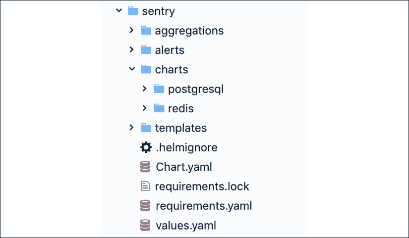

# nine

# 包装应用

在这一章中，我们将看一下 Kubernetes 包管理器 Helm。每一个成功的、不平凡的平台都必须有一个好的包装系统。Helm 由 Deis 开发(2017 年 4 月被微软收购)，后来直接为 Kubernetes 项目做出了贡献。它于 2018 年成为 CNCF 的一个项目。我们将从了解 Helm 的动机、架构和组件开始。然后，我们将亲自动手，演示如何在 Kubernetes 中使用 Helm 及其图表。这包括查找、安装、定制、删除和管理图表。最后但同样重要的是，我们将介绍如何创建您自己的图表以及如何处理版本控制、依赖性和模板化。

我们将讨论的主题如下:

*   理解赫尔姆
*   使用头盔
*   创建您自己的图表

# 理解赫尔姆

Kubernetes 提供了许多在运行时组织和编排容器的方法，但是它缺少一个更高级的组织来将映像集合组合在一起。这就是赫尔姆进来的地方。在本节中，我们将讨论 Helm 的动机、架构和组件，并讨论从 Helm 2 到 Helm 3 的过渡过程中发生了哪些变化。

## 赫尔姆的动机

Helm 为几个重要的用例提供支持:

*   管理复杂性
*   轻松升级
*   简单分享
*   安全回滚

图表甚至可以描述最复杂的应用，提供可重复的应用安装，并作为单一的权威点。就地升级和自定义挂钩允许轻松更新。共享可以在公共或私有服务器上进行版本控制和托管的图表很简单。当您需要回滚最近的升级时，Helm 提供了一个命令，允许您回滚对基础架构的一组有凝聚力的更改。

## 赫尔姆 2 架构

helm旨在执行以下操作:

*   从头开始创建新图表
*   将图表打包到图表档案(TGZ)文件中
*   与存储图表的图表存储库交互
*   将图表安装和卸载到现有的 Kubernetes 集群中
*   管理已安装 Helm 的图表的发布周期

Helm 使用客户端-服务器架构来实现这些目标。

## Helm 2 组件

Helm 有一个在 Kubernetes 集群上运行的服务器组件和一个可以在本地机器上运行的客户端组件。

### 蒂勒服务器

该服务器负责管理发布。它与 Helm 客户端以及 Kubernetes API 服务器进行交互。其主要功能如下:

*   监听来自 Helm 客户端的传入请求
*   结合图表和配置来构建版本
*   将图表安装到 Kubernetes
*   跟踪后续版本
*   通过与 Kubernetes 交互升级和卸载图表

### 赫尔姆客户

你在你的机器上安装Helm 客户端。它负责以下工作:

*   本地图表开发
*   管理存储库
*   与 Tiller 服务器交互
*   发送要安装的图表
*   询问发布信息
*   请求升级或卸载现有版本

## 掌舵 3

Helm 2 很棒，在 Kubernetes 生态系统中扮演着非常重要的角色。然而，有很多关于 Tiller 的批评——它的服务器端组件。Helm 2 是在 RBAC 成为官方访问控制方法之前设计和实现的。出于可用性的考虑，默认情况下，Tiller 是用一组非常开放的权限安装的。为了生产使用而锁定它并不容易。这在多租户集群中尤其具有挑战性。

赫尔姆团队听取了批评意见，并提出了赫尔姆 3 的设计。Helm 3 不是集群内的 Tiller 组件，而是通过 CRDs 利用 Kubernetes API 服务器本身来管理版本的状态。底线是 Helm 3 是一个客户端专用程序。它仍然可以管理发行版并执行与 Helm 2 相同的任务，但不需要安装服务器端组件。

这种方法更像是 Kubernetes 本地的，不太复杂，而且安全问题也没有了。赫尔姆用户只能在他们的库贝配置允许的范围内通过赫尔姆进行操作。

# 使用头盔

Helm 是一个丰富的包管理系统，允许您执行所有必要的步骤来管理安装在集群上的应用。让我们卷起袖子出发吧。我们将考虑安装 Helm 2 和 Helm 3，但是我们将使用 Helm 3 进行所有的实验和演示。

## 安装舵

安装 Helm 需要安装客户端和服务器。Helm 在 Go 中实现。Helm 2 可执行文件既可以作为客户端，也可以作为服务器。如前所述，Helm 3 是一个客户端专用程序。

### 安装 Helm 客户端

您必须正确配置 Kubernetes 来与您的 Kubernetes 集群对话，因为 Helm 客户端使用 Kubernetes 配置来与 Helm 服务器(Tiller)对话。

Helm 在此为所有平台提供二进制版本:

[https://github.com/helm/helm/releases](https://github.com/helm/helm/releases)

对于 Windows 来说，`chocolatey`包管理器是最好的选择(通常是最新的):

```
choco install kubernetes-helm 
```

对于 macOS 和 Linux，您可以通过脚本安装客户端:

```
$ curl https://raw.githubusercontent.com/helm/helm/master/scripts/get > get_helm.sh
$ chmod 700 get_helm.sh
$ ./get_helm.sh 
```

在苹果电脑上，你也可以使用自制软件:

```
$ brew install kubernetes-helm
$ helm version
version.BuildInfo{Version:"v3.0.0", GitCommit:"e29ce2a54e96cd02ccfce88bee4f58bb6e2a28b6", GitTreeState:"clean", GoVersion:"go1.13.4"} 
```

### 为 Helm 2 安装 Tiller 服务器

如果你出于某种原因运行 Helm 2，那么你需要安装 Tiller——服务器端组件——这对于 Helm 3 来说是不必要的。蒂勒通常在集群内运行。对于开发来说，有时在本地运行 Tiller 更容易。

#### 安装组合仪表中的舵柄

安装 Tiller 最简单的方法是从安装 Helm 2 客户端的机器上安装。运行以下命令:`helm init`。

这将初始化远程 Kubernetes 集群上的客户端和 Tiller 服务器。安装完成后，集群的`kube-system`命名空间中会有一个正在运行的 Tiller pod:

```
$ kubectl get po --namespace=kube-system -l name=tiller
NAME                            READY  STATUS   RESTARTS   AGE
tiller-deploy-3210613906-2j5sh  1/1    Running  0          1m 
```

您也可以运行`helm version`来检查客户端版本和服务器版本:

```
$ helm version
Client: &version.Version{SemVer:"2.16.8", GitCommit:"1402a4d6ec9fb349e17b912e32fe259ca21181e3", GitTreeState:"clean"}
Server: &version.Version{SemVer:"2.16.8", GitCommit:"1402a4d6ec9fb349e17b912e32fe259ca21181e3", GitTreeState:"clean"} 
```

## 查找图表

为了用 Helm 安装有用的应用和软件，你需要先找到它们的图表。Helm 是设计用于多个图表存储库。默认情况下，Helm 2 被配置为搜索稳定的存储库，但是您可以添加其他存储库。Helm 3 没有默认值，但是您可以搜索`Helm Hub`(https://hub.helm.sh/)或特定的存储库。Helm Hub 于 2018 年 12 月推出，它旨在让您更容易发现托管在稳定或孵化器存储库之外的图表和存储库。

这就是`helm search`命令的作用。Helm 可以搜索 Helm Hub 或特定的存储库。

该中心目前包含 1300 张图表:

```
$ helm search hub | wc -l
     1300 
```

我们可以在中枢搜索特定的关键词，如`mariadb`:

```
$ helm search hub mariadb
URL                                                 CHART VERSION   APP VERSION DESCRIPTION
https://hub.helm.sh/charts/ibm-charts/ibm-galer...   1.1.0                      Galera Cluster is a multi-master solution for M...
https://hub.helm.sh/charts/ibm-charts/ibm-maria...   1.1.2                      MariaDB is developed as open source software an...
https://hub.helm.sh/charts/bitnami/mariadb           7.5.1          10.3.23    Fast, reliable, scalable, and easy to use open-...
https://hub.helm.sh/charts/bitnami/phpmyadmin        6.2.0          5.0.2      phpMyAdmin is an mysql administration frontend    
https://hub.helm.sh/charts/bitnami/mariadb-cluster   1.0.1          10.2.14    Chart to create a Highly available MariaDB cluster
https://hub.helm.sh/charts/bitnami/mariadb-galera    3.1.3          10.4.13     MariaDB Galera is a multi-master database clust... 
```

如你所见，有几个图表匹配关键字`MariaDB`。您可以进一步调查它们，并找到最适合您的用例的一个。

### 添加存储库

默认情况下，Helm 3 自带，没有设置存储库，所以只能搜索中枢。让我们添加`bitnami`存储库，这样我们就可以将搜索限制在该存储库:

```
$ helm repo add bitnami https://charts.bitnami.com/bitnami
"bitnami" has been added to your repositories 
```

现在，我们可以搜索`bitnami repo`:

```
$ helm search repo mariadb
NAME                CHART VERSION   APP VERSION DESCRIPTION
bitnami/mariadb           7.5.1     10.3.23     Fast, reliable, scalable, and easy to use open-...
bitnami/mariadb-cluster   1.0.1     10.2.14     Chart to create a Highly available MariaDB cluster
bitnami/mariadb-galera    3.1.3     10.4.13     MariaDB Galera is a multi-master database clust...
stable/mariadb            7.3.14    10.3.22     DEPRECATED Fast, reliable, scalable, and easy t...
bitnami/phpmyadmin        6.2.0     5.0.2        phpMyAdmin is an mysql administration frontend
stable/phpmyadmin        4.3.5         5.0.1         DEPRECATED phpMyAdmin is an mysql administratio... 
```

结果是从中枢返回的结果的子集。

官方存储库拥有丰富的图表库，这些图表代表了所有现代开源数据库、监控系统、Kubernetes 特定的助手以及一系列其他产品，例如《我的世界》服务器。搜索 Helm 图表是找到有趣项目和工具的好方法。我经常搜索 kube 关键字:

```
$ helm search repo kube
NAME                            CHART VERSION   APP VERSION     DESCRIPTION
bitnami/kube-state-metrics      0.3.2           1.9.7            kube-state-metrics is a simple service that lis...
bitnami/kubeapps                3.7.1           v1.10.1       Kubeapps is a dashboard for your Kubernetes clu...
bitnami/kubewatch               1.0.14          0.0.4        Kubewatch notifies your slack rooms when change...
kubefed-charts/kubefed          0.3.0                     KubeFed helm chart                                
kubefed-charts/federation-v2 0.0.10                         Kubernetes Federation V2 helm chart               
bitnami/external-dns            3.2.0           0.7.2      ExternalDNS is a Kubernetes addon that configur...
bitnami/metallb                 0.1.14          0.9.3              The Metal LB for Kubernetes                       
bitnami/metrics-server          4.2.0           0.3.7          Metrics Server is a cluster-wide aggregator of ...
bitnami/prometheus-operator     0.20.0          0.39.0             The Prometheus Operator for Kubernetes provides... 
```

要获得特定图表的更多信息，我们可以使用`show`命令(您也可以使用`inspectalias`命令)。我们来看看`bitnami/mariadb`:

```
$ helm show chart bitnami/mariadb
Error: failed to download "bitnami/mariadb" (hint: running 'helm repo update' may help) 
```

哈哈。Helm 要求存储库是最新的。让我们更新我们的存储库:

```
$ helm repo update
Hang tight while we grab the latest from your chart repositories...
...Successfully got an update from the "bitnami" chart repository
Update Complete.  Happy Helming! 
```

现在，它起作用了:

```
$ helm show chart bitnami/mariadb
apiVersion: v1
appVersion: 10.3.22
description: Fast, reliable, scalable, and easy to use open-source relational database
  system. MariaDB Server is intended for mission-critical, heavy-load production systems
  as well as for embedding into mass-deployed software. Highly available MariaDB cluster.
home: https://mariadb.org
icon: https://bitnami.com/img/stacks/mariadb/img/mariadb-stack-220x234.png
keywords:
- mariadb
- mysql
- database
- sql
- prometheus
maintainers:
- email: containers@bitnami.com
  name: Bitnami
name: mariadb
sources:
- https://github.com/bitnami/bitnami-docker-mariadb
- https://github.com/prometheus/mysqld_exporter
version: 7.5.1 
```

您也可以要求 Helm 向您显示`README`文件、值或与图表相关的所有信息。这有时会让人难以承受。

## 安装软件包

好的。你找到了你梦想的包裹。现在，您可能想将其安装在您的 Kubernetes 集群上。当你安装一个软件包时，Helm 会创建一个版本，你可以用它来跟踪安装的进度。让我们使用`helm install`命令安装 MariaDB。让我们详细检查一下输出。

输出的第一部分列出了我们提供的 mariadb 版本的名称、部署时间、名称空间和版本:

```
$ helm install mariadb bitnami/mariadb
NAME: mariadb
LAST DEPLOYED: Mon Jun 8 12:26:34 2020
NAMESPACE: ns
STATUS: deployed
REVISION: 1 
```

下一部分包括自定义注释，可能会很冗长。这里有很多关于验证、获取凭据、连接到数据库以及在必要时升级图表的有用信息:

```
NOTES:
Please be patient while the chart is being deployed
Tip:
  Watch the deployment status using the command: kubectl get pods -w --namespace default -l release=mariadb
Services:
  echo Master: mariadb.ns.svc.cluster.local:3306
  echo Slave:  mariadb-slave.ns.svc.cluster.local:3306
Administrator credentials:
  Username: root
  Password : $(kubectl get secret --namespace default mariadb -o jsonpath="{.data.mariadb-root-password}" | base64 --decode)
To connect to your database:
  1\. Run a pod that you can use as a client:
      kubectl run mariadb-client --rm --tty -i --restart='Never' --image  docker.io/bitnami/mariadb:10.3.18-debian-9-r36 --namespace default --command – bash
  2\. To connect to master service (read/write):
      mysql -h mariadb.ns.svc.cluster.local -uroot -p my_database
  3\. To connect to slave service (read-only):
      mysql -h mariadb-slave.ns.svc.cluster.local -uroot -p my_database
To upgrade this helm chart:
  1\. Obtain the password as described on the 'Administrator credentials' section and set the 'rootUser.password' parameter as shown below:
      ROOT_PASSWORD=$(kubectl get secret --namespace default mariadb -o jsonpath="{.data.mariadb-root-password}" | base64 --decode)
      helm upgrade mariadb bitnami/mariadb --set rootUser.password=$ROOT_PASSWORD 
```

### 检查安装状态

Helm 不会等待安装完成，因为这可能需要一段时间。`helm status`命令以与初始`helm install`命令输出相同的格式显示版本的最新信息。在`install`命令的输出中，您可以看到持久卷声明处于待定状态。我们现在来看看:

```
$ kubectl get pods -w -l release=mariadb
NAME               READY   STATUS    RESTARTS   AGE
mariadb-master-0   0/1     Pending   0          4m21s
mariadb-slave-0    0/1     Pending   0          4m21s 
```

哦，不。POD待定。快速调查显示，MariaDB 声明了持久的卷声明；但是，由于群集中没有默认存储类，因此无法提供所需的存储:

```
$ kubectl describe pvc data-mariadb-master-0
Name:          data-mariadb-master-0
Namespace:     default
StorageClass:
Status:        Pending
Volume:
Labels:        app=mariadb
               component=master
               heritage=Helm
               release=mariadb
Annotations:   <none>
Finalizers:    [kubernetes.io/pvc-protection]
Capacity:
Access Modes:
VolumeMode:    Filesystem
Events:
  Type       Reason         Age                  From                         Message
  ----       ------         ----                 ----                         -------
  Normal     FailedBinding  3m3s (x42 over 13m)  persistentvolume-controller  no persistent volumes available for this claim and no storage class is set Mounted By:  mariadb-master-0 
```

没关系。我们可以使用动态资源调配器创建默认存储类。首先，让我们使用 Helm 安装一个动态主机路径提供程序。详见[https://github.com/rimusz/hostpath-provisioner](https://github.com/rimusz/hostpath-provisioner)。我们添加一个新的 Helm 回购，更新我们的回购列表，然后安装适当的图表:

```
$ helm repo add rimusz https://charts.rimusz.net
"rimusz" has been added to your repositories
$ helm repo update
Hang tight while we grab the latest from your chart repositories...
...Successfully got an update from the "rimusz" chart repository
...Successfully got an update from the "bitnami" chart repository
Update Complete.  Happy Helming!
$ helm upgrade --install hostpath-provisioner --namespace kube-system rimusz/hostpath-provisioner
Release "hostpath-provisioner" does not exist. Installing it now.
NAME: hostpath-provisioner
LAST DEPLOYED: Mon Jun 8 17:52:56 2020
NAMESPACE: kube-system
STATUS: deployed
REVISION: 1
TEST SUITE: None
NOTES:
The Hostpath Provisioner service has now been installed.
A storage class named 'hostpath' has now been created
and is available to provision dynamic volumes.
You can use this storageclass by creating a 'PersistentVolumeClaim' with the
correct storageClassName attribute. For example:
    ---
    kind: PersistentVolumeClaim
    apiVersion: v1
    metadata:
      name: test-dynamic-volume-claim
    spec:
      storageClassName: "hostpath"
      accessModes:
        - ReadWriteOnce
      resources:
        requests:
          storage: 100Mi 
```

因为我们不控制 MariaDB 图表正在创建的持久卷声明，所以我们不能指定新的“hostpath”存储类。但是，我们可以确保它是默认的存储类！

```
$ kubectl get sc
NAME                 PROVISIONER   AGE
hostpath (default)   hostpath      6m26s 
```

如果您将另一个存储类设置为默认值，您可以将其设为非默认值，如下所示:

```
kubectl patch storageclass <your-class-name> -p '{"metadata": {"annotations":{"storageclass.kubernetes.io/is-default-class":"false"}}}' 
```

我们必须再执行一个非常规步骤。因为我们在节点是虚拟的 k3d + k3s 上运行测试，所以主机路径提供程序的主机目录实际上是在对应于该节点的 Docker 容器中分配的。出于某种原因，这些目录的权限只允许根目录创建目录。这可以通过在对应于 k3s 节点的每个 Docker 容器上运行以下命令来解决:

```
$ docker exec -it <container name> chmod -R 0777 /mnt/hostpath 
```

现在，我们可以再试一次。这次一切正常。耶！

以下是由 MariaDB 版本创建的荚、卷、持久卷声明和状态集:

```
$ kubectl get po
NAME               READY   STATUS    RESTARTS   AGE
mariadb-master-0   1/1     Running   0          24m
mariadb-slave-0    1/1     Running   9          24m
$ kubectl get pv
NAME                                       CAPACITY   ACCESS MODES   RECLAIM POLICY   STATUS   CLAIM                           STORAGECLASS   REASON   AGE
pvc-b51aeb37-4a43-4f97-ad52-40e6b6eda4f4   8Gi        RWO            Delete           Bound    default/data-mariadb-master-0   hostpath                30m
pvc-58c7e42e-a01b-4544-8691-3e56de4676eb   8Gi        RWO            Delete           Bound    default/data-mariadb-slave-0    hostpath                30m
$ kubectl get pvc
NAME                    STATUS   VOLUME                                     CAPACITY   ACCESS MODES   STORAGECLASS   AGE
data-mariadb-master-0   Bound    pvc-b51aeb37-4a43-4f97-ad52-40e6b6eda4f4   8Gi        RWO            hostpath       30m
data-mariadb-slave-0    Bound    pvc-58c7e42e-a01b-4544-8691-3e56de4676eb   8Gi        RWO            hostpath       30m
$ kubectl get sts
NAME             READY   AGE
mariadb-master   1/1     30m
mariadb-slave    1/1     30m 
```

让我们尝试连接并验证 MariaDB 确实是可访问的。让我们稍微修改一下注释中建议的命令，以便进行连接。我们可以直接在容器上运行`mysql`命令，而不是先运行`bash`再运行`mysql`。首先，让我们获取根密码并将其复制到剪贴板(在 macOS 上):

```
$ kubectl get secret -o yaml mariadb -o jsonpath="{.data.mariadb-root-password}" | base64 --decode | pbcopy 
```

然后我们可以使用`mariadb-client`连接，看到`If you don't see a command prompt, try pressing enter.`的时候粘贴密码:

```
$ kubectl run --generator=run-pod/v1 mariadb-client --rm -it --image bitnami/mariadb --command -- mysql -h mariadb.default.svc.cluster.local -uroot -p
If you don't see a command prompt, try pressing enter.
Welcome to the MariaDB monitor.  Commands end with ; or \g.
Your MariaDB connection id is 1364
Server version: 10.3.18-MariaDB-log Source distribution
Copyright (c) 2000, 2018, Oracle, MariaDB Corporation Ab and others.
Type 'help;' or '\h' for help. Type '\c' to clear the current input statement.
MariaDB [(none)]> 
```

然后，我们可以开始玩我们的马里亚数据库:

```
MariaDB [(none)]> show databases;
+--------------------+
| Database           |
+--------------------+
| information_schema |
| my_database        |
| mysql              |
| performance_schema |
| test               |
+--------------------+
5 rows in set (0.001 sec) 
```

### 自定义图表

通常，作为用户，您会希望自定义或配置您安装的图表。Helm 完全支持通过配置文件进行定制。要了解可能的自定义，可以再次使用`helm show`命令；不过，这一次，把重点放在价值观上。以下是部分输出:

```
$ helm show values bitnami/mariadb
db:
  forcePassword: false
  name: my_database
  password: null
  user: null
image:
  debug: false
  pullPolicy: IfNotPresent
  registry: docker.io
  repository: bitnami/mariadb
  tag: 10.3.18-debian-9-r36
master:
  affinity: {}
  antiAffinity: soft
  config: |-
    [mysqld]
    skip-name-resolve
    explicit_defaults_for_timestamp
    basedir=/opt/bitnami/mariadb
    port=3306
    socket=/opt/bitnami/mariadb/tmp/mysql.sock
    tmpdir=/opt/bitnami/mariadb/tmp
    max_allowed_packet=16M
    bind-address=0.0.0.0
    pid-file=/opt/bitnami/mariadb/tmp/mysqld.pid
    log-error=/opt/bitnami/mariadb/logs/mysqld.log
    character-set-server=UTF8
    collation-server=utf8_general_ci
    [client]
    port=3306
    socket=/opt/bitnami/mariadb/tmp/mysql.sock
    default-character-set=UTF8
...
rbac:
  create: false
replication:
  enabled: true
  forcePassword: false
  password: null
  user: replicator
rootUser:
  forcePassword: false
  password: null 
```

例如，如果您希望在安装 MariaDB 时设置根密码并创建数据库，您可以创建以下 YAML 文件并将其保存为`mariadb-config.yaml`:

```
mariadbRootPassword: supersecret
mariadbDatabase: awesome_stuff 
```

首先卸载现有的`mariadb`版本:

```
$ helm uninstall mariadb 
```

然后，运行 Helm 并将 YAML 文件传递给它:

```
$ helm install -f mariadb-config.yaml mariadb bitnami/mariadb 
```

您也可以使用`--set`在命令行上设置单个值。如果`--f`和`--set`都试图设置相同的值，那么`--set`优先。

例如，在这种情况下，根密码将是`evenbettersecret`:

```
$ helm install -f mariadb-config.yaml --set mariadbRootPassword=evenbettersecret bitnami/mariadb 
```

您可以使用逗号分隔列表指定多个值:`--set a=1`、`b=2`。

### 附加安装选项

`helm install` 命令可以从几个来源安装:

*   图表存储库(正如我们所看到的)
*   本地图表档案(`helm install` `foo-0.1.1.tgz`)
*   打开的`chart`文件夹(`helm install` `path/to/foo`)
*   完整网址(`helm install` https://example.com/charts/foo-1.2.3.tgz)

### 升级和回滚版本

您可能希望将已安装的软件包升级到最新、最好的版本。掌舵人提供`upgrade`命令，智能操作，只更新已经改变的东西。例如，让我们检查一下`mariadb`安装的当前值:

```
$ helm get values mariadb
USER-SUPPLIED VALUES:
mariadbDatabase: awesome_stuff
mariadbRootPassword: evenbettersecret 
```

现在，让我们运行、升级并更改数据库的名称:

```
$ helm upgrade mariadb --set mariadbDatabase=awesome_sauce bitnami/mariadb
$ helm get values mariadb
USER-SUPPLIED VALUES:
mariadbDatabase: awesome_sauce 
```

请注意，我们丢失了根密码。升级时，所有现有值都将被替换。好吧，让我们倒回去。`helm history`命令向我们显示了我们可以回滚到的所有可用修订:

```
$ helm history mariadb
REVISION    UPDATED                     STATUS      CHART           APP VERSION DESCRIPTION
1           Mon Jun 8 09:14:10 2020    superseded  mariadb-7.3.14  10.3.22     Install complete
2           Mon Jun 8 09:22:22 2020    superseded  mariadb-7.3.14  10.3.22     Upgrade complete
3           Mon Jun 8 09:23:47 2020    superseded  mariadb-7.3.14  10.3.22     Upgrade complete
4           Mon Jun 8 09:24:17 2020    deployed    mariadb-7.3.14  10.3.22     Upgrade complete 
```

让我们回到修订版 3:

```
$ helm rollback mariadb 3
Rollback was a success! Happy Helming!
$ helm history mariadb
REVISION    UPDATED                     STATUS      CHART           APP VERSION DESCRIPTION
1           Mon Jun 8 09:14:10 2020    superseded  mariadb-7.3.14  10.3.22     Install complete
2           Mon Jun 8 09:22:22 2020    superseded  mariadb-7.3.14  10.3.22     Upgrade complete
3           Mon Jun 8 09:23:47 2020    superseded  mariadb-7.3.14  10.3.22     Upgrade complete
4           Mon Jun 8 09:24:17 2019    superseded  mariadb-7.3.14  10.3.22     Upgrade complete
5           Mon Jun 8 09:26:04 2019    deployed    mariadb-7.3.14  10.3.22     Rollback to 3 
```

正如你看到的，回滚创建了一个新的修订号 5。修订版 4 还在，以防我们想回去。

让我们验证我们的更改已回滚:

```
$ helm get values mariadb
USER-SUPPLIED VALUES:
mariadbDatabase: awesome_stuff
mariadbRootPassword: evenbettersecret 
```

没错。数据库名被回滚到`awesome_stuff`，我们得到了根密码。

### 删除版本

当然，您也可以使用`helm uninstall`命令卸载一个版本。

首先，让我们检查发布列表。我们只有`mariadb`版本:

```
$ helm list
NAME    NAMESPACE   REVISION    UPDATED                                 STATUS      CHART           APP VERSION
mariadb default     5           2020-06-08 09:26:04.766743 -0700 PDT    deployed    mariadb-7.3.14  10.3.22 
```

现在，让我们卸载它:

```
$ helm uninstall mariadb
release "mariadb" uninstalled 
```

所以，不再发布:

```
$ helm list
NAME    NAMESPACE   REVISION    UPDATED STATUS  CHART   APP VERSION 
```

Helm 也可以跟踪卸载的版本。如果您在卸载时提供`--keep-history`，那么您将能够使用带有`helm` `list`的`--all`或`--uninstalled`标志来查看任何已卸载的版本:

```
$ helm list --all
NAME    NAMESPACE   REVISION    UPDATED                                 STATUS      CHART           APP VERSION
mariadb default     1           2020-06-08 09:35:47.641033 -0700 PDT    uninstalled mariadb-7.3.14  10.3.22 
```

## 使用存储库

Helm 将图表存储在简单的 HTTP 服务器存储库中。任何标准的 HTTP 服务器都可以托管一个 Helm 存储库。在云中，赫尔姆团队验证了 AWS S3 和谷歌云存储都可以作为网络模式下的赫尔姆存储库。

请注意，Helm 不提供将图表上传到远程存储库的工具，因为这需要远程服务器了解 Helm，知道图表放在哪里，以及知道如何更新`index.yaml`文件。

在客户端，`helm repo`命令允许您列出、添加、删除、索引和更新:

```
$ helm repo 
```

该命令由多个子命令组成，用于与图表存储库进行交互。

它可用于添加、删除、列出和索引图表存储库。示例用法:

```
$ helm repo add [NAME] [REPO_URL]
Usage:
  helm repo [command]
Available Commands:
  add         add a chart repository
  index       generate an index file given a directory containing packaged charts
  list        list chart repositories
  remove      remove a chart repository
  update      update information of available charts locally from chart repositories 
```

我们已经在前面使用了命令。让我们看看如何创建我们自己的图表并管理它们。

## 用 Helm 管理图表

Helm 提供了几个管理图表的命令。

它可以为您创建一个新图表:

```
$ helm create cool-chart
Creating cool-chart 
```

Helm 将在`cool-chart`下创建以下文件和目录:

```
$ tree cool-chart
cool-chart
├── Chart.yaml
├── charts
├── templates
│   ├── NOTES.txt
│   ├── _helpers.tpl
│   ├── deployment.yaml
│   ├── ingress.yaml
│   ├── service.yaml
│   ├── serviceaccount.yaml
│   └── tests
│       └── test-connection.yaml
└── values.yaml 
```

编辑完图表后，您可以将其打包到 tar gzipped 存档中:

```
$ helm package cool-chart
Successfully packaged chart and saved it to: cool-chart-0.1.0.tgz 
```

Helm 将创建一个名为`cool-chart-0.1.0.tgz`的档案，并将其存储在本地目录中。

您也可以使用`helm lint`来帮助您查找图表格式或信息的问题:

```
$ helm lint cool-chart
==> Linting cool-chart
[INFO] Chart.yaml: icon is recommended
1 chart(s) linted, 0 chart(s) failed 
```

### 利用初学者工具包

helm create 命令带有一个可选的`--starter`标志，允许您指定起始图表。

启动器只是位于`$HELM_HOME/starters`的常规图表。作为一名图表开发人员，您可能会创作专门设计用作起点的图表。此类图表的设计应考虑以下因素:

*   YAML 将被发电机覆盖
*   用户将期望能够修改这样一个图表的内容，所以文档应该指出用户如何能够这样做

目前，没有办法安装图表；将图表添加到`$HELM_HOME/starters`的唯一方法是在那里手动复制。如果您开发初学者工具包图表，请确保在图表文档中提到这一点。

# 创建您自己的图表

图表是描述一组相关的 Kubernetes 资源的文件集合。单个图表可以用来部署一些简单的东西，比如 Memcached pod，或者一些复杂的东西，比如包含 HTTP 服务器、数据库、缓存、队列等的完整 web 应用堆栈。

图表是以文件的形式创建在一个特定的目录树中。然后，可以将它们打包到版本化的归档中进行部署。关键文件是`Chart.yaml`。

## 图表文件

`Chart.yaml`文件是 Helm 图表的主文件。它需要名称和版本字段:

*   `name`:图表名称(与目录名称相同)
*   `version`:永远 2 版

它还可能包含各种可选字段:

*   `kubeVersion`:永远范围的兼容立方版本
*   `description`:描述这个项目的一句话
*   `keywords`:关于这个项目的关键词列表
*   `home`:这个项目首页的 URL
*   `sources`:本项目源代码的网址列表
*   `dependencies`:每个依赖项的(名称、版本、存储库)列表(存储库是 URL)
*   `maintainers`:每个维护者的(姓名、电子邮件、网址)列表(需要姓名)
*   `icon`:要用作图标的 SVG 或 PNG 映像的 URL
*   `appVersion`:这个包含的应用的版本
*   `deprecated`:此图表是否弃用(布尔值)

### 版本控制图表

`Chart.yaml`内部的版本字段被很多 Helm 工具使用。当生成包时，`helm package`命令将在构造包名时使用它在`Chart.yaml`中找到的版本。系统假设图表包名称中的版本号与`Chart.yaml`中的版本号匹配。违反这个假设会导致错误。

### appVersion 字段

`appVersion`字段与版本字段无关。Helm 不使用它，它作为元数据或文档，供想要了解他们正在部署的内容的用户使用。赫尔姆无视它。

### 贬低图表

有时，你可能会想要放弃图表。通过将`Chart.yaml`中可选的`deprecated`字段设置为`true`，可以将图表标记为不推荐使用的。这足以贬低图表的最新版本。您可以稍后重新使用图表名称，并发布一个不被否决的较新版本。贬低图表的工作流程是:

*   更新图表的`Chart.yaml`文件，将图表标记为不推荐使用，并提高版本
*   将新版本发布到图表存储库中
*   从源存储库中移除图表(例如，Git)

## 图表元数据文件

图表可能包含各种元数据文件，如描述图表的安装、配置、使用和许可的`README.md`、`LICENSE`和`NOTES.txt`。`README.md`文件应该格式化为 Markdown。它应提供以下信息:

1.  图表提供的应用或服务的描述
2.  运行图表的任何先决条件或要求
3.  YAML 选项和默认值的描述
4.  可能与图表安装或配置相关的任何其他信息

如果图表包含`templates/NOTES.txt`文件，则在安装后或查看发布状态时显示。注释应简明扼要，避免混乱，并指向`README.md`文件进行详细解释。在这个`NOTES.txt`文件中放置使用说明和任何后续步骤是很常见的。请记住，文件是作为模板评估的。当您运行`helm install`和`helm status`时，笔记会打印到屏幕上。

## 管理图表相关性

在 Helm 中，一个图表可能依赖于其他图表。这些依赖关系通过将它们列在`requirements.yaml`文件中或者通过在安装过程中将依赖关系图复制到`charts`子文件夹中来明确表达。这为从他人的知识和工作中获益和重用提供了一个很好的方法。依赖项可以是图表档案(`foo-1.2.3.tgz`)或未打包的`chart`文件夹。但是它的名称不能以 _ 或开头..图表加载器会忽略这些文件。

### 管理与需求的依赖关系

与其在`charts`子文件夹中手动放置图表，不如在图表中使用`requirements.yaml`文件来声明依赖关系。以下只是一个说明。图表是虚构的。

`requirements.yaml`文件是一个简单的文件，用于列出图表依赖关系:

```
dependencies:
  - name: foo
    version: 1.2.3
    repository: http://example.com/charts
  - name: bar
    version: 43.52.6
    repository: http://another.example.com/charts 
```

`name`字段是您想要的图表名称。

`version`字段是您想要的图表版本。

`repository`字段是图表库的完整网址。

请注意，如果存储库尚未添加，您还必须使用`helm repo add`在本地添加存储库。

一旦你有了依赖文件，你就可以运行 Helm 依赖更新，它会用你的依赖文件为你下载所有指定的图表到`charts`子文件夹:

```
$ helm dep up cool-chart
Hang tight while we grab the latest from your chart repositories...
...Successfully got an update from the "local" chart repository
...Successfully got an update from the "bitnami" chart repository
...Successfully got an update from the "example" chart repository
...Successfully got an update from the "another" chart repository
Update Complete. Happy Helming!
Saving 2 charts
Downloading Foo from repo http://example.com/charts
Downloading Bar from repo http://another.example.com/charts 
```

Helm 将依赖关系图作为档案存储在`charts`文件夹中。在我们的示例中，`charts`子文件夹将包含以下文件:

```
charts/
  foo-1.2.3.tgz
  bar-43.52.61.tgz 
```

使用`requirements.yaml`管理图表及其依赖关系是明确记录依赖关系、跨团队共享和支持自动化管道的最佳实践。

### 在需求中使用特殊字段

`requirements.yaml`文件中的每个条目也可能包含可选字段`tags`和`condition`。

这些字段可用于动态控制图表的加载(默认情况下，加载所有图表)。如果存在`tags`或`condition`字段，Helm 将对其进行评估，并确定是否应加载目标图表:

*   **条件**:`condition`字段包含一个或多个逗号分隔的 YAML 路径。如果顶部父项的值中存在路径并解析为布尔值，图表将根据该布尔值启用或禁用。仅计算列表中找到的第一个有效路径，如果不存在路径，则条件无效，图表将被加载。
*   **标签**:`tags`字段是与此图表关联的标签的 YAML 列表。在顶部父项的值中，可以通过指定标签和布尔值来启用或禁用所有带有标签的图表。

下面是示例`requirements.yaml`和`values.yaml`文件，它们很好地利用条件和标签来启用和禁用依赖项的安装。`requirements.yaml`文件基于全局`enabled`字段的值和特定子部分的`enabled`字段定义了安装其依赖项的两个条件:

```
# parent/requirements.yaml
dependencies:
  - name: subchart1
    repository: http://localhost:10191
    version: 0.1.0
    condition: subchart1.enabled, global.subchart1.enabled
    tags:
      - front-end
      - subchart1
  - name: subchart2
    repository: http://localhost:10191
    version: 0.1.0
    condition: subchart2.enabled,global.subchart2.enabled
    tags:
      - back-end
      - subchart2 
```

`values.yaml`文件为一些条件变量赋值。`subchart2`标签没有取值，认为是自动启用:

```
# parent/values.yaml
subchart1:
  enabled: true
tags:
  front-end: false
  back-end: true 
```

安装图表时也可以从命令行设置标签和条件值，它们将优先于`values.yaml`文件:

```
$ helm install --set subchart2.enabled=false 
```

标签和条件的解析如下:

*   在值中设置的条件会覆盖标记。每个图表中存在的第一个条件路径生效，而其他条件被忽略。
*   如果图表的任何标记为真，则图表被启用。
*   标签和条件值必须在顶部父项的值中设置。
*   标签的键入值必须是顶级键。当前不支持全局和嵌套标记表。

## 使用模板和值

任何不平凡的应用都需要您配置和适应特定的用例。掌舵图是使用 Go 模板语言填充占位符的模板。Helm 支持 Sprig 库中的附加功能和一些其他专门功能。模板文件存储在图表的`templates/`子文件夹中。Helm 将使用模板引擎来渲染这个文件夹中的所有文件，并应用提供的值文件。

### 编写模板文件

模板文件只是遵循 Go 模板语言规则的文本文件。他们可以生成 Kubernetes 配置文件以及任何其他文件。下面是 GitLab CE 图表的服务模板文件:

```
apiVersion: v1
kind: Service
metadata:
  name: {{ template "gitlab-ce.fullname" . }}
  labels:
    app: {{ template "gitlab-ce.fullname" . }}
    chart: "{{ .Chart.Name }}-{{ .Chart.Version }}"
    release: "{{ .Release.Name }}"
    heritage: "{{ .Release.Service }}"
spec:
  type: {{ .Values.serviceType }}
  ports:
  - name: ssh
    port: {{ .Values.sshPort | int }}
    targetPort: ssh
  - name: http
    port: {{ .Values.httpPort | int }}
    targetPort: http
  - name: https
    port: {{ .Values.httpsPort | int }}
    targetPort: https
  selector:
    app: {{ template "gitlab-ce.fullname" . }} 
```

这里有:[https://github . com/helm/charts/tree/master/stable/git lab-ce/templates/SVC . YAML](https://github.com/helm/charts/tree/master/stable/gitlab-ce/templates/svc.yaml)。

如果看起来很混乱，不要担心。基本思想是，您有一个简单的文本文件，其中包含可以稍后以各种方式填充的值的占位符，以及可以应用于这些值的一些函数和管道。

#### 使用管道和函数

Helm 允许通过内置的 Go 模板函数、sprig 函数和管道在模板文件中使用丰富的和复杂的语法。下面是一个利用这些功能的示例模板。它使用`repeat``quote``upper`功能作为`food`和`drink`键，并使用管道将多个功能链接在一起:

```
apiVersion: v1
kind: ConfigMap
metadata:
  name: {{ .Release.Name }}-configmap
data:
  greeting: "Hello World"
  drink: {{ .Values.favorite.drink | repeat 3 | quote }}
  food: {{ .Values.favorite.food | upper }} 
```

让我们添加一个`values.yaml`文件:

```
favorite:
  drink: coffee
  food: pizza 
```

### 测试和排除图表故障

现在，我们可以用`helm template`来看结果:

```
$ helm template food food-chart
---
# Source: food-chart/templates/config-map.yaml
apiVersion: v1
kind: ConfigMap
metadata:
  name: food-configmap
data:
  greeting: "Hello World"
  drink: "coffeecoffeecoffee"
  food: PIZZA 
```

如你所见，我们的模板起作用了。饮料`coffee`重复 3 次并引用。食物`pizza`变成了大写的`PIZZA`(未加引号)。

另一种调试的好方法是用`--dry-run`标志运行安装。它提供了附加信息:

```
$ helm install food food-chart --dry-run
NAME: food
LAST DEPLOYED:  Mon Jun 8 09:46:19 2020
NAMESPACE: default
STATUS: pending-install
REVISION: 1
TEST SUITE: None
USER-SUPPLIED VALUES:
{}
COMPUTED VALUES:
favorite:
  drink: coffee
  food: pizza
HOOKS:
MANIFEST:
---
# Source: food-chart/templates/config-map.yaml
apiVersion: v1
kind: ConfigMap
metadata:
  name: food-configmap
data:
  greeting: "Hello World"
  drink: "coffeecoffeecoffee"
  food: PIZZA 
```

您也可以覆盖命令行上的值:

```
$ helm template food food-chart --set favorite.drink=water
---
# Source: food-chart/templates/config-map.yaml
apiVersion: v1
kind: ConfigMap
metadata:
  name: food-configmap
data:
  greeting: "Hello World"
  drink: "waterwaterwater"
  food: PIZZA 
```

当然，最终的测试是在集群中安装图表。不需要将图表上传到图表库中进行测试；只需在本地运行`helm install`:

```
$ helm install food food-chart
NAME: food
LAST DEPLOYED: Mon Jun  8 08:22:36 2020
NAMESPACE: default
STATUS: deployed
REVISION: 1
TEST SUITE: None 
```

现在有一个名为`food`的 Helm 版本:

```
$ helm list
NAME    NAMESPACE   REVISION    UPDATED                                 STATUS      CHART               APP VERSION
food    default     1           2020-06-08 08:22:36.217166 -0700 PDT    deployed    food-chart-0.1.0    1.16.0 
```

更重要的是，`food`配置图是用正确的数据创建的:

```
$ kubectl get cm -o yaml
apiVersion: v1
items:
- apiVersion: v1
  data:
    drink: coffeecoffeecoffee
    food: PIZZA
    greeting: Hello World
  kind: ConfigMap
  metadata:
    creationTimestamp: "2020-06-08T15:22:36Z"
    name: food-configmap
    namespace: default
    resourceVersion: "313012"
    selfLink: /api/v1/namespaces/default/configmaps/food-configmap
    uid: a3c02518-4fe2-4a72-bdd0-99a268c7033f
kind: List
metadata:
  resourceVersion: ""
  selfLink: "" 
```

### 嵌入内置对象

Helm 提供了一些你可以在模板中使用的内置对象。在 GitLab 图表模板中，`Release.Name`、`Release.Service`、`Chart.Name`和`Chart.Version`是 Helm 预定义值的示例。其他对象有:

*   `Values`
*   `Chart`
*   `Template`
*   `Files`
*   `Capabilities`

`Values`对象包含值文件或命令行中定义的所有值。`Chart`的对象是`Chart.yaml`的内容。`Template`对象包含当前模板的信息。`Files`和`Capabilities`对象是类似地图的对象，允许通过各种功能访问非专用文件和任何关于Kubernetes集群的一般信息。

注意`Chart.yaml`中的未知字段被模板引擎忽略，不能用于将任意结构化的数据传递给模板。

### 从文件馈送值

这里是 GitLab CE 默认`values`文件的部分。该文件中的值用于填充多个模板。这些值代表默认设置，您可以通过复制文件并根据需要进行修改来覆盖这些默认设置。请注意解释每个值的用途和各种选项的有用注释:

```
## GitLab CE image
## ref: https://hub.docker.com/r/gitlab/gitlab-ce/tags/
##
image: gitlab/gitlab-ce:9.4.1-ce.0
## For minikube, set this to NodePort, elsewhere use LoadBalancer
## ref: http://kubernetes.io/docs/user-guide/services/#publishing-services---service-types
##
serviceType: LoadBalancer
## Ingress configuration options
##
ingress:
  annotations:
      # kubernetes.io/ingress.class: nginx
      # kubernetes.io/tls-acme: "true"
  enabled: false
  tls:
      # - secretName: gitlab.cluster.local
      #   hosts:
      #     - gitlab.cluster.local
  url: gitlab.cluster.local
## Configure external service ports
## ref: http://kubernetes.io/docs/user-guide/services/
sshPort: 22
httpPort: 80
httpsPort: 443 
```

以下是如何在`install`命令期间提供自己的 YAML `values`文件来覆盖默认值:

```
$ helm install --values=custom-values.yaml gitlab-ce 
```

### 范围、依赖项和值

`value`文件可以声明顶级图表的值，以及包含在该图表的`charts`文件夹中的任何图表的值。以为例，我们来看看[中的哨兵图。](https://github.com/sapcc/helm-charts/blob/master/system/sentry)

该图表有两个图表依赖项:`postgresql`和`redis`:



图 9.1:哨兵图

`postgressql`和`redis`图表都有自己的`values.yaml`文件，默认为。但是，顶级`values.yaml`文件包含其依赖关系图的一些默认值，`postgresql`和`redis`:

```
postgresql:
  postgresDatabase: sentry
  persistence:
    enabled: true
    accessMode: ReadWriteMany
    size: 50Gi
  resources:
    requests:
      memory: 10Gi
      cpu: 4
redis:
  # redisPassword:
  persistence:
    enabled: true
    accessMode: ReadWriteMany
    size: 10Gi
  resources:
    requests:
      memory: 10Gi
      cpu: 2 
```

顶层图表可以访问其相关图表的值，但不能访问的值，反之亦然。还有一个全局值，所有图表都可以访问。例如，你可以添加如下内容:

```
global:
  app: cool-app 
```

当存在全局值时，它将被复制到每个相关图表的值中，如下所示:

```
global:
  app: cool-app
postgresql:
  global:
    app: cool-app
  ...
 redis:
   global:
     app: cool-app
   ... 
```

# 摘要

在这一章中，我们看了 Kubernetes 包管理器 Helm。Helm 使 Kubernetes 能够管理复杂的软件，这些软件由许多相互依赖的 Kubernetes 资源组成。它的作用与操作系统包管理器相同。它组织软件包，让您搜索图表，安装和升级图表，并与合作者共享图表。您可以开发自己的图表，并将它们存储在存储库中。Helm 3 是一个仅客户端的解决方案，它使用 CRDs 来管理版本的状态，而不是 Helm 2 的 Tiller 服务器端组件，后者的默认配置带来了很多安全问题。

此时，您应该能够理解 Helm 在 Kubernetes 生态系统和社区中所扮演的重要角色。你应该能够有效地使用它，甚至开发和分享你自己的图表。

在下一章中，我们将看看 Kubernetes 是如何在一个相当低的水平上进行联网的。