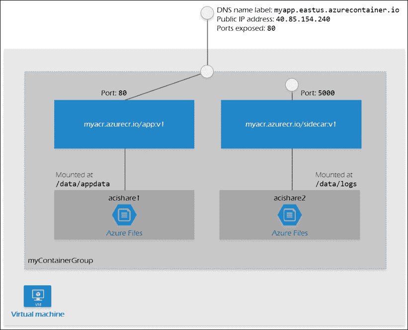
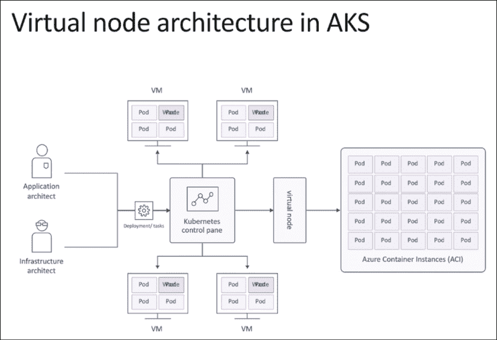
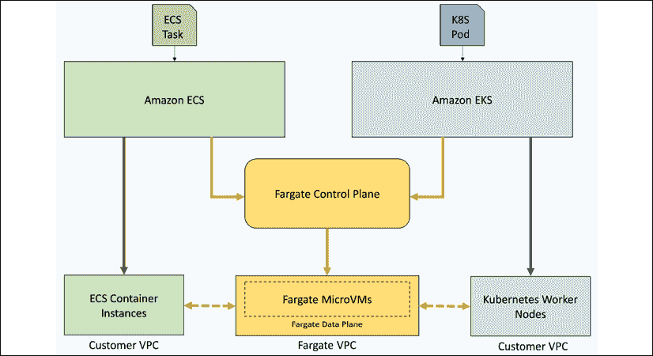
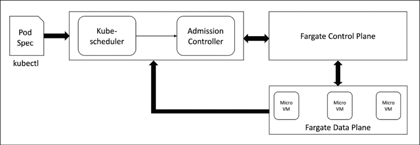
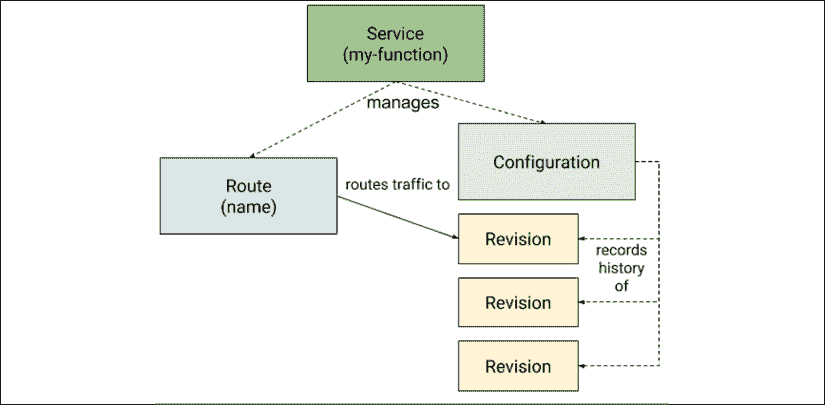
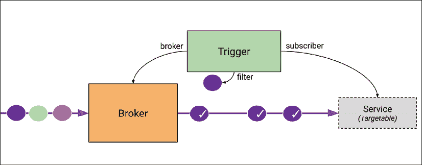
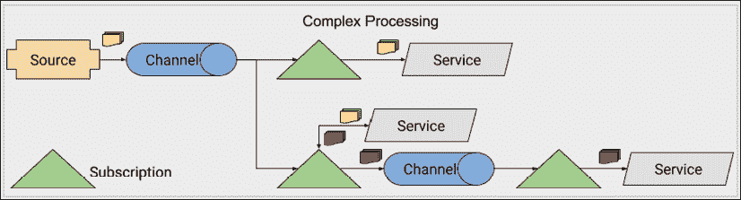
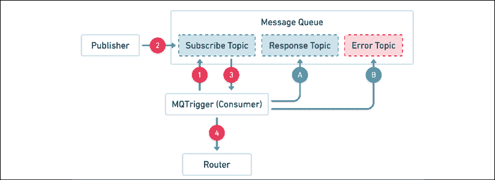
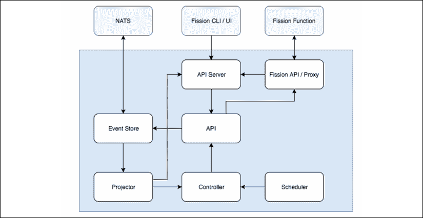
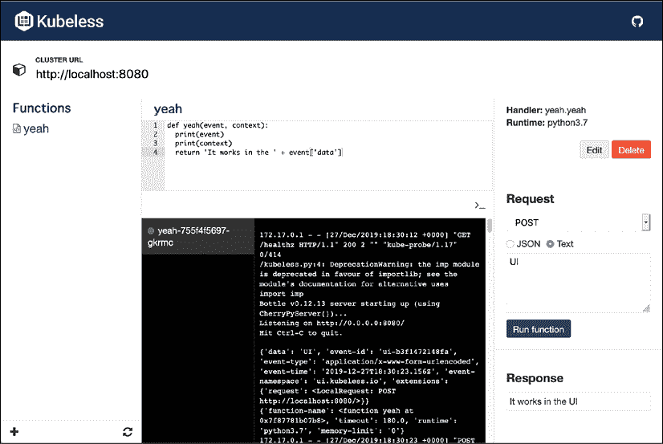

# 十二、Kubernetes 上的无服务器计算

在这一章中，我们将探索云中无服务器计算的迷人世界。“无服务器”这个术语正受到很多关注，但它是一个用于描述两种不同范式的误称。真正的无服务器应用在用户的浏览器或移动应用中作为 web 应用运行，并且只与外部服务交互。我们在 Kubernetes 上构建的无服务器系统的类型是不同的。我们将解释无服务器在 Kubernetes 上的确切含义，以及它与其他无服务器解决方案的关系。我们将介绍无服务器云解决方案，介绍 knavative-Kubernetes 功能即服务基金会-并深入探讨 Kubernetes **功能即服务** ( **FaaS** )框架。

让我们从澄清无服务器是怎么回事开始。

# 了解无服务器计算

好的。让我们把它弄开。服务器还在。术语“无服务器”意味着您不必自己调配、配置和管理服务器。公共云平台消除了处理物理硬件、数据中心和网络的需求，是一个真正的范式转变。但是，即使在云上，创建和配置机器映像、配置实例、配置它们、升级和修补操作系统、定义网络策略以及管理证书和访问控制也需要大量的工作和知识。有了无服务器计算，大部分重要但乏味的工作就没有了。

无服务器的吸引力是多方面的:

*   与供应相关的一系列问题都消失了
*   容量规划不是问题
*   你只为你使用的东西付费

你失去了一些控制，因为你不得不接受云提供商做出的选择。但是，对于系统的关键部分，您可以利用大量定制。当然，在需要完全控制的地方，您仍然可以管理自己的基础架构。

底线是无服务器方法不仅仅是炒作，而是提供了真正的好处。让我们来看看无服务器的两种风格。

## 在“无服务器”基础架构上运行长期服务

长期运行的服务是基于微服务的分布式系统的基础。这些服务必须始终可用并等待服务请求，并且可以上下缩放以匹配音量。在传统云中，您必须调配足够的容量来处理峰值和不断变化的卷，当请求等待调配不足的服务时，这通常会导致过度调配或处理延迟增加。

无服务器服务解决了这个问题，开发人员不费吹灰之力，运营商也没费多少力气。其思想是，您只需将服务标记为在无服务器基础架构上运行，并使用一些参数(如预期的 CPU、内存和任何扩展限制)对其进行配置。对于其他服务和客户端来说，该服务就像您在自己调配的基础架构上部署的传统服务一样。

属于这一类别的服务具有以下特征:

*   他们总是在运行(他们从来没有缩小到零)
*   它们公开多个端点(例如 HTTP 和 gRPC)
*   它们要求您自己实现请求处理和路由
*   他们可以替代或除了公开端点之外，还可以监听事件
*   服务实例可以维护内存缓存、长期连接和会话
*   在 Kubernetes 中，微服务由服务资源直接表示

现在，让我们看看 FaaS。

## 在“无服务器”基础架构上运行 FaaS

即使在最大的分布式系统中，我们也不会让每个工作负载每秒处理多个请求。总是有任务需要运行以响应相对不频繁的事件，无论是按计划运行还是以临时方式调用。有可能有一个长期运行的服务只是坐在那里摆弄它的虚拟拇指，并不时处理一个请求。但那是浪费。您可以尝试将这样的任务绑定到其他长时间运行的服务，但是这会产生非常不理想的耦合，这违背了微服务的理念。

一个更好的方法是分别处理这些任务，并提供不同的抽象和工具来解决它们。Kubernetes 有作业和 CronJob 对象的概念。它们解决了 FaaS 处理的一些问题，但并不完全。

与传统服务相比，FaaS 解决方案的启动和运行通常要简单得多。开发人员可能只需要为函数编写代码。FaaS 解决方案将解决其余问题:

*   架构和包装
*   作为端点公开
*   基于事件的触发器
*   自动配置和扩展
*   监控并提供日志和指标

以下是 FaaS 解决方案的一些特征:

*   按需运行(也就是说，它可以缩小到零)
*   公开单个端点(通常是 HTTP)
*   可以由事件触发或获得自动端点
*   通常对资源使用和最大运行时间有严重限制
*   有时，它可能会冷启动(也就是说，从零开始向上扩展)

# 云中无服务器的 Kubernetes

所有主要的云提供商现在都支持 Kubernetes 的无服务器长期运行服务。令人惊讶的是，微软 Azure 率先提供了这一功能。Kubernetes 通过 kubelet 与节点交互。无服务器基础架构的基本思想是，以某种方式创建虚拟节点，而不是调配实际节点(无论是物理节点还是虚拟机(虚拟机))。不同的云提供商使用不同的解决方案来实现这一目标。

## 不要忘记集群自动缩放器

在跳转到特定于云提供商的解决方案之前，请确保查看集群自动缩放器的 Kubernetes-native 选项。集群自动缩放器可以缩放集群中的节点，并且不会受到其他一些解决方案的限制。所有的 Kubernetes 调度和控制机制都可以通过集群自动缩放器开箱即用地工作，因为它可以自动在集群中添加和删除常规节点。不使用外来的或特定于提供商的功能。

但是，您可能有很好的理由喜欢更集成的提供商解决方案。例如，Fargate 在`Firecracker`内部运行，这是一个轻量级的 VM，具有很强的安全边界(顺便说一下，Lambda 函数也在 bucket 上运行)。同样，谷歌云运行在 gVisor 中运行。

## Azure AKS 和 Azure 容器实例

Azure已经支持 Azure 容器实例(ACI)很久了。ACI 不是Kubernetes特有的。它允许在托管环境中的 Azure 上运行按需容器。它在某些方面与Kubernetes相似，但却是蓝色的。它甚至有容器组的概念，类似于 pod。容器组中的所有容器将被安排在同一台主机上运行:



图 12.1: ACI 容器组

与 Kubernetes/AKS 的集成被建模为从 AKS 到 ACI 的爆发。这里的指导原则是，对于已知的工作负载，您应该调配自己的节点，但是如果出现峰值，那么额外的负载将动态爆发到 ACI。这种方法被认为更经济，因为在 ACI 上运行比配置自己的节点更经济。AKS 使用虚拟的 kubernete([https://virtual-kubelet.io/](https://virtual-kubelet.io/))CNCF 项目，将你的 Kubernetes 集群与 ACI 的无限容量进行整合。它的工作原理是将一个虚拟节点添加到由 ACI 支持的集群中，该节点在 Kubernetes 端显示为具有无限资源的单个节点:



图 12.2:AKS 中的虚拟节点架构

让我们看看 AWS 如何处理 EKS 和法盖特。

## EKS 和法盖特

AWS 在 2018 年发布了**Fargate**([https://aws.amazon.com/fargate/](https://aws.amazon.com/fargate/))，类似于 Azure ACI ，让你在托管环境中运行容器。最初，您可以在 EC2 或 ECS (AWS 专有容器编排)上使用 Fargate。在大型 AWS 会议上， *re:Invent 2019* 、Fargate 也在 EKS 普遍上市。这意味着您现在有了一个完全受管的 Kubernetes 解决方案，是真正的无服务器解决方案。

EKS 负责控制平面，法盖特为您负责工作节点:



图 12.3: EKS 和法盖特在实践中

与 AKS 和 ACI 不同，使用 EKS 和法盖特模型模拟你的Kubernetes集群和法盖特之间的相互作用。而在 AKS 上，单个无限虚拟节点代表 ACI 的全部容量，在 EKS，每个 pod 都有自己的虚拟节点。但当然，那些节点不是真正的节点。Fargate 有自己的控制平面和数据平面，支持 EC2 和 ECS，以及 EKS。EKS-法盖特的集成是通过一组定制的Kubernetes控制器来完成的，这些控制器监视需要部署到特定命名空间或具有特定标签的POD，并将这些POD转发给法盖特安排的 T2。下图说明了 EKS 和法盖特的整合:



图 12.4:EKS 和法盖特的整合

使用 Fargate 时，您应该注意几个限制:

*   每盒最多 4 个虚拟内存单元和 30 GB 内存
*   不支持需要持久卷或文件系统的有状态工作负载
*   没有使用`HostNetwork`或`HostPort`的 DaemonSets、特权POD或POD
*   您只能使用应用负载平衡器

如果这些限制对您来说太严重，您可以尝试一种更直接的方法，并利用虚拟 kubelet 项目将 Fargate 集成到您的集群中。

Kubernetes之父谷歌呢？

## 谷歌云运行

这可能会让人感到惊讶，但谷歌是无服务器Kubernetes公司的新成员。云运行是谷歌的无服务器产品。它基于 Knative，我们将在下一节深入剖析。基本前提是云跑有两种口味。普通云运行类似于 ACI 和法盖特。它让你在一个完全由谷歌管理的环境中运行容器。Anthos 云支持 GKE 和 On-Prem，让您可以在 GKE 集群中运行容器化工作负载。

antos 的云是目前唯一允许在自定义机器类型(包括 GPU)上运行的无服务器平台。Anthos 云运行服务参与 Istio 服务网格，并提供简化的 Kubernetes 本地体验。

请注意，虽然托管云运行实例使用 gVisor 隔离，但 Anthos 云运行使用标准的 Kubernetes 隔离(基于容器)。

是时候了解更多关于 Knative 的知识了。

# 当地的

Kubernetes 没有内置的对 FaaS 的支持。因此，社区为生态系统开发了许多解决方案。Knative 的目标是提供多个 FaaS 解决方案可以利用的构建模块，而无需重新发明轮子。

但这还不是全部！Knative 还提供了将长期运行的服务一直扩展到零的独特能力。这是一件大事。在许多用例中，您可能更希望有一个长期运行的服务，能够处理大量快速连续的请求。在这些情况下，每个请求触发一个新的函数实例并不是最好的方法。但是，当没有流量进入时，最好将服务扩展到零实例，不付费，并为当时可能需要更多资源的其他服务留下更多容量。Knative 支持其他重要的用例，包括基于百分比的负载平衡、基于度量的负载平衡、蓝绿色部署、canary 部署和高级路由。它甚至可以选择性地进行自动 TLS 证书以及 HTTP 监控。最后，Knative 可以同时使用 HTTP 和 gRPC。

目前有两个节段:**节段服务**和**节段活动**。这里曾经也是一个 knavative build组件，但是它被分解，形成了**Tekton**([https://github.com/tektoncd/pipeline](https://github.com/tektoncd/pipeline))，一个 Kubernetes 本地的 CD 项目。

让我们从美味服务开始。

## 美味的服务

知识服务的领域是在 Kubernetes 上运行服务版本，并将流量路由到这些服务。这超出了标准的 Kubernetes 服务。一个认知服务定义了几个 CRD 来建模其域:**服务**、**路由**、**配置**和**修订版**。该服务管理一条**路线**和一个**配置**。一个**配置**可以有多个**版本**。

**路由**可以将服务流量路由到特定版本。下面是一个图表，说明了不同对象之间的关系:



图 12.5:知识对象之间的关系

### 知识服务对象

**知识服务**对象将Kubernetes部署和服务合并为一个对象。这很有意义，因为除了无头服务的特例([https://kubernetes . io/docs/concepts/services-networking/service/#无头-services](https://kubernetes.io/docs/concepts/services-networking/service/#headless-services) )之外，每个服务背后总有一个部署。

该服务自动管理其工作负载的整个生命周期。每当服务更新时，它负责创建路由和配置以及新版本。这非常方便，因为用户只需要处理服务对象。

以下是`helloworld-go`活动服务的元数据:

```
$ kubectl get ksvc helloworld-go -o json | jq .metadata
{
  "annotations": {
    "serving.knative.dev/creator": "minikube-user",
    "serving.knative.dev/lastModifier": "minikube-user"
  },
  "creationTimestamp": "2019-12-25T18:44:34Z",
  "generation": 1,
  "name": "helloworld-go",
  "namespace": "default",
  "resourceVersion": "43258",
  "selfLink": "/apis/serving.knative.dev/v1/namespaces/default/services/helloworld-go",
  "uid": "d1979430-464e-49d6-bf68-bb384d1ef0b3"
} 
```

这是规格:

```
$ kubectl get ksvc helloworld-go -o json | jq .spec
{
  "template": {
    "metadata": {
      "creationTimestamp": null
    },
    "spec": {
      "containerConcurrency": 0,
      "containers": [
        {
          "env": [
            {
              "name": "TARGET",
              "value": "Yeah, it works!!!"
            }
          ],
          "image": "gcr.io/knative-samples/helloworld-go",
          "name": "user-container",
          "readinessProbe": {
            "successThreshold": 1,
            "tcpSocket": {
              "port": 0
            }
          },
          "resources": {}
        }
      ],
      "timeoutSeconds": 300
    }
  },
  "traffic": [
    {
      "latestRevision": true,
      "percent": 100
    }
  ]
} 
```

请注意的`traffic`部分，该规范将 100%的请求导向最新版本。这决定了 CRD 路线。

### 知识路线对象

**活动路由**对象允许将一定百分比的传入请求导向特定的修订。默认为 100%最新版本，但您可以更改它。这允许高级部署场景，例如蓝绿色部署以及金丝雀部署。

例如，这是部署新版本时如何从蓝色切换到绿色。首先 100%进入当前版本，0%进入新版本(标记为`v2`):

```
apiVersion: serving.knative.dev/v1
kind: Route
metadata:
  name: blue-green-demo # Route name is unchanged, since we're updating an existing Route
  namespace: default
spec:
  traffic:
    - revisionName: blue-green-demo-lcfrd
      percent: 100 # All traffic still going to the first revision
    - revisionName: blue-green-demo-m9548
      percent: 0 # 0% of traffic routed to the second revision
      tag: v2 # A named route 
```

然后，要将所有流量切换到新版本，请对路线进行以下更改:

```
apiVersion: serving.knative.dev/v1
kind: Route
metadata:
  name: blue-green-demo # Updating our existing route
  namespace: default
spec:
  traffic:
    - revisionName: blue-green-demo-lcfrd
      percent: 0
      tag: v1 # Adding a new named route for v1
    - revisionName: blue-green-demo-m9548
      percent: 100
      # Named route for v2 has been removed, since we don't need it anymore 
```

如果你想要更渐进的负荷转移，你可以做不同的百分比，只要它们加起来是 100%。

### 活动配置对象

配置 CRD 包含服务的最新版本和世代数量。例如，如果我们将服务更新到版本 2:

```
apiVersion: serving.knative.dev/v1 # Current version of Knative
kind: Service
metadata:
  name: helloworld-go # The name of the app
  namespace: default # The namespace the app will use
spec:
  template:
    spec:
      containers:
        - image: gcr.io/knative-samples/helloworld-go # The URL to the image of the app
          env:
            - name: TARGET # The environment variable printed out by the sample app
              value: "Yeah, it still works - version 2 !!!" 
```

那么配置将包含这个新版本，但是标记为代`2`:

```
$ kubectl get configurations helloworld-go -o yaml
apiVersion: serving.knative.dev/v1
kind: Configuration
metadata:
  annotations:
    serving.knative.dev/creator: minikube-user
    serving.knative.dev/lastModifier: minikube-user
  creationTimestamp: "2019-12-25T18:44:34Z"
  generation: 2
  labels:
    serving.knative.dev/route: helloworld-go
    serving.knative.dev/service: helloworld-go
  name: helloworld-go
  namespace: default
  ownerReferences:
  - apiVersion: serving.knative.dev/v1alpha1
    blockOwnerDeletion: true
    controller: true
    kind: Service
    name: helloworld-go
    uid: d1979430-464e-49d6-bf68-bb384d1ef0b3
  resourceVersion: "75459"
  selfLink: /apis/serving.knative.dev/v1/namespaces/default/configurations/helloworld-go
  uid: c1ce42e0-e6ec-412f-9e07-4c41370e024c
spec:
  template:
    metadata:
      creationTimestamp: null
    spec:
      containerConcurrency: 0
      containers:
      - env:
        - name: TARGET
          value: Yeah, it still works - version 2 !!!
        image: gcr.io/knative-samples/helloworld-go
        name: user-container
        readinessProbe:
          successThreshold: 1
          tcpSocket:
            port: 0
        resources: {}
      timeoutSeconds: 300
status:
  conditions:
  - lastTransitionTime: "2019-12-26T03:21:45Z"
    status: "True"
    type: Ready
  latestCreatedRevisionName: helloworld-go-l58sn
  latestReadyRevisionName: helloworld-go-l58sn
  observedGeneration: 2 
```

但是注意路线仍然会指向版本`1`:

```
$ kubectl get route helloworld-go -o yaml
apiVersion: serving.knative.dev/v1
kind: Route
metadata:
  annotations:
    serving.knative.dev/creator: minikube-user
    serving.knative.dev/lastModifier: minikube-user
  creationTimestamp: "2019-12-25T18:44:35Z"
  generation: 1
  labels:
    serving.knative.dev/service: helloworld-go
  name: helloworld-go
  namespace: default
  ownerReferences:
  - apiVersion: serving.knative.dev/v1alpha1
    blockOwnerDeletion: true
    controller: true
    kind: Service
    name: helloworld-go
    uid: d1979430-464e-49d6-bf68-bb384d1ef0b3
  resourceVersion: "75500"
  selfLink: /apis/serving.knative.dev/v1/namespaces/default/routes/helloworld-go
  uid: 5a22217f-7090-46d2-b009-61ca0d3b6561
spec:
  traffic:
  - configurationName: helloworld-go
    latestRevision: true
    percent: 100
status:
  address:
    url: http://helloworld-go.default.svc.cluster.local
  conditions:
  - lastTransitionTime: "2019-12-25T18:45:25Z"
    status: "True"
    type: AllTrafficAssigned
  - lastTransitionTime: "2019-12-26T03:21:51Z"
    status: "True"
    type: IngressReady
  - lastTransitionTime: "2019-12-26T03:21:51Z"
    status: "True"
    type: Ready
  observedGeneration: 1
  traffic:
  - latestRevision: true
    percent: 100
    revisionName: helloworld-go-l58sn
  url: http://helloworld-go.default.example.com 
```

### 知识修订对象

然而，当前版本和新版本都将作为单独的修订版捕获:

```
$ kubectl get revisions
NAME                  CONFIG NAME     K8S SERVICE NAME      GENERATION   READY   REASON
helloworld-go-fltxb   helloworld-go   helloworld-go-fltxb   1            True
helloworld-go-l58sn   helloworld-go   helloworld-go-l58sn   2          True 
```

正如您所看到的，两代都存在，这允许路由到其中一个，或者使用路由在它们之间划分流量，正如我们前面看到的。

综上所述，Knative Serving 为 Kubernetes 提供了更好的部署和组网，以实现长期运行的服务和功能。让我们看看 Knative Eventing 会带来什么。

## 知识事件

Kubernetes 或其他系统上的传统服务公开了 API 端点，消费者可以点击这些端点(通常通过 HTTP)来发送处理请求。这种请求-响应模式非常有用，因此很受欢迎。然而，这不是调用服务或功能的唯一模式。大多数分布式系统都有某种形式的松散耦合的交互，其中发布了事件。当事件发生时，最好调用一些代码。

在 Knative 之前，您必须自己构建这种能力，或者使用一些将事件绑定到代码的第三方库。Knative Eventing 旨在提供一种标准的方法来完成这项任务。它与 CNCF 的 CloudEvents 规范([https://github . com/cloud events/spec/blob/master/spec . MD # design-goals](https://github.com/cloudevents/spec/blob/master/spec.md#design-goals))兼容。

### 熟悉活动事件术语

在进入架构之前，让我们定义一些稍后会用到的术语和概念。

#### 事件消费者

有两种类型的事件消费者:可寻址的和可调用的。可寻址消费者可以通过他们的`status.address.url`字段通过 HTTP 接收事件。Kubernetes 服务对象没有这样的字段，但它也被认为是可寻址消费者的一个特例。

可调用消费者接收通过 HTTP 传递的事件，并可能在响应中返回另一个事件，该事件将像外部事件一样被消费。可调用消费者提供了一种转换事件的有效方法。

#### 事件源

这是一个事件的始作俑者。Knative 支持许多常见的源，你也可以编写自己的自定义事件源。以下是支持的事件源列表(其中许多仍处于早期开发阶段):

*   AWS 平方
*   阿帕奇骆驼
*   Apache CouchDB
*   阿帕奇卡夫卡
*   比特桶
*   Cron 作业
*   GCP 酒店/酒店
*   开源代码库
*   GitLab
*   谷歌云调度器
*   Kubernetes(Kubernetes事件)

还有几个元控制器协助实现事件来源，如以下:

*   `ContainerSource`:[https://github . com/knative/eventing/blob/master/pkg/API/sources/v1al PHA 1/containers source _ types . go](https://github.com/knative/eventing/blob/master/pkg/apis/sources/v1alpha1/containersource_types.go)
*   `AutoContainerSource`:[https://github . com/harwayne/auto-container source](https://github.com/Harwayne/auto-container-source)
*   相同来源:[https://github.com/grantr/sample-source](https://github.com/grantr/sample-source)

#### 经纪人和触发器

代理通过特定的属性来协调事件，并通过触发器将事件与消费者进行匹配。触发器包括事件属性过滤器和可寻址消费者。当事件到达代理时，它会将其转发给具有触发器的使用者，这些触发器具有与事件属性相匹配的过滤器。下图说明了此工作流程:



图 12.6:代理和触发工作流

#### 事件类型和事件注册表

事件可以有一个类型，建模为事件类型 CRD。事件注册表存储所有事件类型。触发器可以使用事件类型作为其筛选条件之一。

#### 渠道和订阅

通道是可选的持久层。不同的事件类型可能会被路由到不同的渠道和不同的后备商店。一些频道可能会在内存中存储事件，而其他频道可能会通过 NATS 流、卡夫卡或类似的方式保存到磁盘。订户(消费者)最终接收并处理事件。

### 活动事件的架构

当前的架构支持两种事件交付模式:

*   简单交货
*   扇出传送

简单的发货对消费者来说只是 1:1 的货源。消费者可以是核心的 Kubernetes 服务，也可以是 Knative 服务。如果消费者是不可到达的，那么源负责处理事件不能被传递的事实。源可以重试、记录错误或采取任何其他适当的操作。

下图说明了这个简单的概念:


图 12.7:简单交付

扇出交付支持任意复杂的处理，多个消费者在一个频道上订阅同一个事件。一旦通道接收到事件，源就不再对该事件负责。这允许消费者更动态的订阅，因为源甚至不知道消费者是谁。

下图说明了使用渠道时可能出现的复杂处理和订阅模式:



图 12.8:带渠道和订阅的交付

在这一点上，您应该对 Knative 的范围以及它如何为 Kubernetes 建立坚实的无服务器基础有一个相当好的理解。让我们和 Knative 一起玩一会儿，看看它是什么感觉。

## 带克纳特去兜风

Knative 是一个不是一个小软件。它有许多活动部件，支持多种操作模式，并且可以与许多系统集成。我们将使用 Minikube 集群来探索其中的一小部分。

我们将执行以下操作:

*   创建兼容的 Minikube 集群
*   使用 Gloo 作为入口网关安装 Knative
*   部署知识服务
*   调用知识服务
*   验证它可以缩放到零

我们开始吧...

### 安装按钮

安装 Knative 的方法有多种。参见[https://knative.dev/docs/install](https://knative.dev/docs/install)。我们将使用 minikube 安装。首先，让我们用 Knative 推荐的特定参数创建一个 minikube 集群:

```
$ minikube start --memory=8192 --cpus=4 \
                 --vm-driver=hyperkit   \
                 --disk-size=30g        \
                 --extra-config=apiserver.enable-admission-plugins="LimitRanger,NamespaceExists,NamespaceLifecycle,ResourceQuota,ServiceAccount,DefaultStorageClass,MutatingAdmissionWebhook"
  minikube v1.10.1 on Darwin 10.15.5
  Selecting 'hyperkit' driver from user configuration (alternates: [])
  Downloading driver docker-machine-driver-hyperkit:
    > docker-machine-driver-hyperkit.sha256: 65 B / 65 B [---] 100.00% ? p/s 0s
    > docker-machine-driver-hyperkit: 10.81 MiB / 10.81 MiB  100.00% 8.84 MiB p
  The 'hyperkit' driver requires elevated permissions. The following commands will be executed:
    $ sudo chown root:wheel /Users/gigi.sayfan/.minikube/bin/docker-machine-driver-hyperkit
    $ sudo chmod u+s /Users/gigi.sayfan/.minikube/bin/docker-machine-driver-hyperkit
Password:
  Downloading VM boot image ...
    > minikube-v1.10.1.iso.sha256: 65 B / 65 B [--------------] 100.00% ? p/s 0s
    > minikube-v1.10.1.iso: 150.93 MiB / 150.93 MiB [] 100.00% 10.27 MiB p/s 14s
  Creating hyperkit VM (CPUs=4, Memory=8192MB, Disk=30000MB) ...
  Preparing Kubernetes v1.18.2 on Docker '19.03.8' ...
    ▪ apiserver.enable-admission-plugins=LimitRanger,NamespaceExists,NamespaceLifecycle,ResourceQuota,ServiceAccount,DefaultStorageClass,MutatingAdmissionWebhook
  Downloading kubeadm v1.18.0
  Downloading kubelet v1.18.0
  Pulling images ...
  Launching Kubernetes ...
  Waiting for cluster to come online ...
  Done! kubectl is now configured to use "minikube" 
```

Knative 需要一个入口网关。目前的选择是伊斯蒂奥、大使和格洛。让我们使用 Gloo，因为它非常轻量级:

```
$ curl -sL https://run.solo.io/gloo/install | sh
Attempting to download glooctl version v1.3.29
Downloading glooctl-darwin-amd64...
Download complete!, validating checksum...
Checksum valid.
Gloo was successfully installed 
Add the gloo CLI to your path with:
  export PATH=$HOME/.gloo/bin:$PATH
Now run:
  glooctl install gateway     # install gloo's function gateway functionality into the 'gloo-system' namespace
  glooctl install ingress     # install very basic Kubernetes Ingress support with Gloo into namespace gloo-system
  glooctl install knative     # install Knative serving with Gloo configured as the default cluster ingress
Please see visit the Gloo Installation guides for more:  https://gloo.solo.io/installation/ 
```

确保`glooctl`在您的路径上(我将`$HOME/.gloo/bin/glooctl`复制到了`/usr/local/bin`)，然后运行以下命令来安装 Gloo 和 Knative:

```
$ glooctl install knative -g --install-knative-version="0.15.0"
installing Knative CRDs...
installing Knative...
Knative successfully installed!
$ glooctl install knative --install-knative=false
Creating namespace gloo-system... Done.
Starting Gloo installation...
Gloo was successfully installed! 
```

### 部署知识服务

此时，我们可以部署 Knative 服务。这里有一个简单的 hello-world 应用，它会返回一个“hello 耶，它起作用了！！!"消息。将以下 YAML 保存到`service.yaml`:

```
apiVersion: serving.knative.dev/v1 # Current version of Knative
kind: Service
metadata:
  name: helloworld-go # The name of the app
  namespace: default # The namespace the app will use
spec:
  template:
    spec:
      containers:
        - image: gcr.io/knative-samples/helloworld-go # The URL to the image of the app
          env:
            - name: TARGET # The environment variable printed out by the sample app
              value: "Yeah, it works!!!" 
```

然后部署它:

```
$ kubectl create -f service.yaml
service.serving.knative.dev/helloworld-go created 
```

### 调用知识服务

您可以通过获取`kservice`(或`ksvc` ) CRD 来查看已部署的知识服务:

```
$ kubectl get kservice
NAME            URL                                        LATESTCREATED         LATESTREADY           READY   REASON
helloworld-go   http://helloworld-go.default.example.com   helloworld-go-fltxb   helloworld-go-fltxb   True 
```

`LATESTCREATED`和`LATESTREADY`列对应于类型为`ClusterIP`的标准 Kubernetes 服务，Knative 服务将实际工作委托给该服务:

```
$ kubectl get svc helloworld-go-fltxb
NAME                  TYPE        CLUSTER-IP     EXTERNAL-IP   PORT(S)   AGE
helloworld-go-fltxb   ClusterIP   10.96.124.21   <none>        80/TCP    67m 
```

通常，Gloo 外部代理`LoadBalancer`服务接收传入的请求，将它们路由到 Knative 服务。但是 minikube `LoadBalancer`服务没有外部 IP:

```
$ kubectl get svc knative-external-proxy -n gloo-system
NAME                     TYPE           CLUSTER-IP    EXTERNAL-IP   PORT(S)                      AGE
knative-external-proxy   LoadBalancer   10.96.72.13   <pending>     80:30150/TCP,443:30146/TCP   4h53m 
```

为了解决这个问题，我们需要使用`glooctl proxy url --name knative-external-proxy`获取代理的网址，并使用该网址访问服务，同时将原始网址作为`Host`头传递:

```
$ curl -H "Host: helloworld-go.default.example.com" $(glooctl proxy url --name knative-external-proxy)
Hello Yeah, it works!!!! 
```

### 检查可耐特中的缩放至零选项

默认情况下，Knative 配置为缩放至零，宽限期为 30 秒。这意味着在 30 秒的不活动(没有请求进入)后，所有的POD将被终止，直到新的请求进入。为了验证这一点，我们可以等待 30 秒，检查默认命名空间中的 pods:

```
$ kubectl get po
No resources found in default namespace. 
```

然后，我们可以调用服务并立即检查 pod:

```
$ curl -H "Host: helloworld-go.default.example.com" $(glooctl proxy url --name knative-external-proxy)
Hello Yeah, it works!!!!
$ kubectl get po
NAME                                              READY   STATUS    RESTARTS   AGE
helloworld-go-fltxb-deployment-74b5dc8665-2j7hw   2/2     Running   0          6s 
```

让我们通过使用`-w`标志来观察豆荚何时消失。显然，豆荚在一分钟后开始终止:

```
$ kubectl get po -w
NAME                                              READY   STATUS    RESTARTS   AGE
helloworld-go-fltxb-deployment-74b5dc8665-2j7hw   2/2     Running   0          49s
helloworld-go-fltxb-deployment-74b5dc8665-2j7hw   2/2     Terminating   0          62s
helloworld-go-fltxb-deployment-74b5dc8665-2j7hw   1/2     Terminating   0          83s
helloworld-go-fltxb-deployment-74b5dc8665-2j7hw   0/2     Terminating   0          84s
helloworld-go-fltxb-deployment-74b5dc8665-2j7hw   0/2     Terminating   0          96s
helloworld-go-fltxb-deployment-74b5dc8665-2j7hw   0/2     Terminating   0          96s 
```

在这一点上，我们已经与 Knative 有了一点乐趣，现在可以继续讨论 Kubernetes 上的 FaaS 解决方案。

# Kubernetes的 FaaS 框架

让我们感谢房间里的大象——FaaS。Kubernetes 作业和 CronJob 非常棒，让集群自动扩展和云提供商管理基础设施非常棒。Knative 具有缩放到零和流量路由功能，非常酷。但是真正的 FaaS 呢？别担心——Kubernetes在这里有很多选择。可能选择太多了。Kubernetes 有十多个 FaaS 框架:

*   分裂
*   无内胎的
*   法斯
*   OpenWhisk
*   Riff(建在 Knative 顶部)
*   核子
*   function-函数
*   BlueNimble
*   【数学】函数
*   完全形态
*   雷恩邦德
*   IronFunctions

我们将研究一些更受欢迎的选择。

## 分裂

**裂变**([https://fission.io/](https://fission.io/))是一个成熟且有据可查的框架。它将 FaaS 世界建模为环境、功能和触发器。需要环境来为特定的语言构建和运行您的函数代码。每种语言环境都包含一个 HTTP 服务器，通常还有一个动态加载器(用于动态语言)。函数是表示无服务器函数的对象，触发器决定了如何调用部署在集群中的函数。有四种触发器:

*   **HTTP 触发器**:通过 HTTP 端点调用函数
*   **定时器触发器**:在某个时间调用某个功能
*   **消息队列触发器**:从消息队列中拉出事件时调用函数(支持卡夫卡、NATS 和 Azure 队列)
*   **Kubernetes 观察触发器**:调用函数来响应集群中的 Kubernetes 事件

有意思的是，消息队列触发器不仅仅是*火了就忘了*。它们支持可选的响应和错误队列。下面是一个流程图:



图 12.9:消息队列触发流

裂变以其 100 毫秒的冷启动为荣。它通过用小型动态装载机保持一池“温暖”的容器来实现这一点。当第一次调用一个函数时，有一个正在运行的容器准备好了，代码被发送到这个容器中执行。从某种意义上说，裂变作弊是因为它从来不会开始变冷。底线是裂变不会缩小到零，但对于首次通话来说非常快。

### 裂变工作流

裂变还有另一个名声——裂变工作流。该功能允许您构建由裂变函数链组成的复杂工作流。下面是描述裂变工作流体系结构的图表:



图 12.10:裂变工作流架构

您在 YAML 定义工作流，该工作流指定任务(通常是裂变功能)、输入、输出、条件和延迟:

```
apiVersion: 1
description: Send a message to a slack channel when the temperature exceeds a certain threshold
output: CreateResult
# Input: 'San Fransisco, CA'
tasks:
  # Fetch weather for input
  FetchWeather:
    run: wunderground-conditions
    inputs:
      default:
        apiKey: <API_KEY>
        state: "{$.Invocation.Inputs.default.substring($.Invocation.Inputs.default.indexOf(',') + 1).trim()}"
        city: "{$.Invocation.Inputs.default.substring(0, $.Invocation.Inputs.default.indexOf(',')).trim()}"
  ToCelsius:
    run: tempconv
    inputs:
      default:
        temperature: "{$.Tasks.FetchWeather.Output.current_observation.temp_f}"
        format: F
        target: C
    requires:
    - FetchWeather
  # Send a slack message if the temperature threshold has been exceeded
  CheckTemperatureThreshold:
    run: if
    inputs:
      if: "{$.Tasks.ToCelsius.Output.temperature > 25}"
      then:
        run: slack-post-message
        inputs:
          default:
            message: "{'It is ' + $.Tasks.ToCelsius.Output.temperature + 'C in ' + $.Invocation.Inputs.default + ' :fire:'}"
            path: <HOOK_URL>
    requires:
    - ToCelsius
    # Besides the potential Slack message, compose the response of this workflow {location, celsius, fahrenheit}
  CreateResult:
    run: compose
    inputs:
      celsius: "{$.Tasks.ToCelsius.Output.temperature}"
      fahrenheit: "{$.Tasks.FetchWeather.Output.current_observation.temp_f}"
      location: "{$.Invocation.Inputs.default}"
      sentSlackMsg: "{$.Tasks.CheckTemperatureThreshold.Output}"
    requires:
    - ToCelsius
    - CheckTemperatureThreshold 
```

让我们来试试裂变。

### 裂变实验

首先让我们使用 Helm (Helm 3)安装裂变:

```
$ kubectl create ns fission
$ helm install fission --namespace fission \
    --set serviceType=NodePort,routerServiceType=NodePort \
    https://github.com/fission/fission/releases/download/1.9.0/fission-all-1.9.0.tgz 
```

以下是它创建的所有 CRD:

```
$ kubectl get crd -o name | grep fission
customresourcedefinition.apiextensions.k8s.io/canaryconfigs.fission.io
customresourcedefinition.apiextensions.k8s.io/environments.fission.io
customresourcedefinition.apiextensions.k8s.io/functions.fission.io
customresourcedefinition.apiextensions.k8s.io/httptriggers.fission.io
customresourcedefinition.apiextensions.k8s.io/kuberneteswatchtriggers.fission.io
customresourcedefinition.apiextensions.k8s.io/messagequeuetriggers.fission.io
customresourcedefinition.apiextensions.k8s.io/packages.fission.io
customresourcedefinition.apiextensions.k8s.io/timetriggers.fission.io 
```

裂变命令行界面也会派上用场:

```
$ curl -Lo fission https://github.com/fission/fission/releases/download/1.9.0/fission-cli-osx && chmod +x fission && sudo mv fission /usr/local/bin/ 
```

我们需要创造一个环境来建立我们的功能。让我们使用 Python 环境:

```
$ fission environment create --name python --image fission/python-env
environment 'python' created 
```

有了 Python 环境，我们可以创建一个无服务器函数。首先，将该代码保存到`yeah.py`:

```
def main():
    return 'Yeah, it works!!!' 
```

然后，我们创建名为`yeah`的裂变函数:

```
$ fission function create --name yeah --env python --code yeah.py
Package 'yeah-b9d5d944-9c6e-4e67-81fb-96e047625b74' created
function 'yeah' created 
```

我们可以通过裂变命令行界面测试该功能:

```
$ fission function test --name yeah
Yeah, it works!!! 
```

真正的交易是通过一个 HTTP 端点调用它。我们需要为此创建一条路线:

```
$ fission route create --method GET --url /yeah --function yeah 
```

路线确定后，我们仍然需要导出`FISSION_ROUTER`环境变量:

```
$ export FISSION_ROUTER=$(minikube ip):$(kubectl -n fission get svc router -o jsonpath='{...nodePort}') 
```

抛开所有的准备工作，让我们通过 httpie 调用我们的函数:

```
$ http http://${FISSION_ROUTER}/yeah
HTTP/1.1 200 OK
Content-Length: 17
Content-Type: text/html; charset=utf-8
Date: Wed, 10 Jun 2020 01:16:51 GMT
Yeah, it works!!! 
```

## 无内胎的

Kubernetes 是另一个成功的 Kubernetes FaaS 框架。它使用 Kubernetes 进行自动缩放、路由、监控等。它的名气带来了最Kubernetes本土的 FaaS 框架，以及它的伟大的用户界面。无库用类似裂变的概念来模拟世界。让我们探索它的架构。

### 无管架构

Kubernetes】为每个功能维护一个 Kubernetes 部署和服务。它不会缩放到零，但结果是具有非常快的响应时间。它基于三个支柱:运行时、函数和触发器。让我们检查一下。

#### 无管道运行时

无库运行时基本上是每个支持的语言的一个映像，当一个新的函数被创建时，无库控制器管理器启动。控制器正在监视 CRD 函数，如果它发生变化，它会动态地重新加载代码。

Kubeless 可以准确地告诉我们支持的运行时是什么:

```
$ kubeless get-server-config
INFO[0000] Current Server Config:
INFO[0000] Supported Runtimes are: ballerina0.981.0, dotnetcore2.0, dotnetcore2.1, go1.10, go1.11, go1.12, java1.8, java11, nodejs6, nodejs8, nodejs10, nodejs12, php7.2, php7.3, python2.7, python3.4, python3.6, python3.7, ruby2.3, ruby2.4, ruby2.5, ruby2.6, jvm1.8, nodejs_distroless8, nodejsCE8, vertx1.8 
```

#### 无管功能

库布尼斯函数 CRD 实际上包含了动态语言的源代码。当无库控制器管理器检测到新功能已经创建时，它将为该功能创建一个部署和服务。如果功能发生变化，它还会更新部署。然后可以通过 HTTP 或事件触发该功能。

也可以预先构建功能映像。这在多次重新部署相同的功能时提供了一些性能优势。

#### 无内胎触发器

无库函数可以通过多种方式触发(调用)。你可以在开发的时候直接从CLI 或者 UI 调用它们，很不错。但真正的交易是触发生产中的功能。类似于其他框架，可以通过 HTTP 端点调用函数(毕竟是作为 Kubernetes 服务部署的)。不过，你需要自己向外界展示这项服务。

Kubeless 还支持基于事件源的触发。当前事件来源包括卡夫卡、NATS 和 AWS 驱动。

是时候和库布斯动手了。

### 玩无内胎的

我们先通过`brew`安装命令行界面:

```
$ brew install kubeless 
```

无库比什的掌舵图目前被打破了。当你读到这个的时候，它可能已经被修复了。我们将直接安装它:

```
$ export RELEASE=$(curl -s https://api.github.com/repos/kubeless/kubeless/releases/latest | grep tag_name | cut -d '"' -f 4)
$ kubectl create ns kubeless
$ kubectl create -f https://github.com/kubeless/kubeless/releases/download/$RELEASE/kubeless-$RELEASE.yaml
configmap/kubeless-config created
deployment.apps/kubeless-controller-manager created
serviceaccount/controller-acct created
clusterrole.rbac.authorization.k8s.io/kubeless-controller-deployer created
clusterrolebinding.rbac.authorization.k8s.io/kubeless-controller-deployer created
customresourcedefinition.apiextensions.k8s.io/functions.kubeless.io created
customresourcedefinition.apiextensions.k8s.io/httptriggers.kubeless.io created
customresourcedefinition.apiextensions.k8s.io/cronjobtriggers.kubeless.io created 
```

我们可以通过检查`kubeless-controller-manager`(应该准备好了)来验证 Kubeless 是否安装正确:

```
$ kubectl get deploy kubeless-controller-manager -n kubeless
NAME                          READY   UP-TO-DATE   AVAILABLE   AGE
kubeless-controller-manager   1/1     1            1           11h 
```

好吧，让我们创建一个函数。这是我们的测试 Python 函数。请注意包含事件对象和上下文对象的签名。请求体总是在事件对象的`data`字段中，不管函数是如何被调用的，也不管使用了哪种编程语言。在 Python 中，`event['data']`的类型是`bytes`，而不是`string`。当我试图将弦`'Yeah, '`和`event['data']`连在一起时，我很难学会。我将其更改为字节类型`b'Yeah, '`，一切正常:

```
def yeah(event, context):
  print(event)
  print(context)
  return b'Yeah, ' + event['data'] 
```

我们可以使用`kubeless function deploy`命令将其部署到集群中:

```
$ kubeless function deploy yeah --runtime python3.7   \
                                --from-file yeah.py   \
                                --handler yeah.yeah
INFO[0000] Deploying function...
INFO[0000] Function yeah submitted for deployment
INFO[0000] Check the deployment status executing 'kubeless function ls yeah' 
```

过一会儿，功能就准备好了:

```
$ kubeless function ls
NAME    NAMESPACE   HANDLER     RUNTIME     DEPENDENCIES    STATUS
yeah    default     yeah.yeah   python3.7                   1/1 READY 
```

现在，我们可以从无库命令行界面调用它:

```
$ kubeless function call yeah --data 'it works!!!'
Yeah, it works!!! 
```

我们也可以检查日志，查看我们在函数中打印的整个事件和上下文:

```
$ kubeless function logs yeah
{'data': it works!!!', 'event-id': 'cUoOtQDb5bt5V88', 'event-type': 'application/x-www-form-urlencoded', 'event-time': '2019-12-27T17:05:16Z', 'event-namespace': 'cli.kubeless.io', 'extensions': {'request': <LocalRequest: POST http://192.168.64.3:8443/>}}{'function-name': <function yeah at 0x7f07b3a5a7b8>, 'timeout': 180.0, 'runtime': 'python3.7', 'memory-limit': '0'} 
```

### 使用无管用户界面

让我们来看看著名的无库网页界面:

```
$ kubectl create -f https://raw.githubusercontent.com/kubeless/kubeless-ui/master/k8s.yaml
serviceaccount/ui-acct created
clusterrole.rbac.authorization.k8s.io/kubeless-ui created
clusterrolebinding.rbac.authorization.k8s.io/kubeless-ui created
deployment.apps/ui created
service/ui created 
```

该服务部署在`kubeless`命名空间中。我们可以用`port-forward`来曝光一下:

```
$ kubectl get svc -n kubeless
NAME   TYPE       CLUSTER-IP     EXTERNAL-IP   PORT(S)          AGE
ui     NodePort   10.96.248.15   <none>        3000:32079/TCP   93s
$ k port-forward -n kubeless svc/ui 3000
Forwarding from 127.0.0.1:3000 -> 3000
Forwarding from [::1]:3000 -> 3000 
```

确实是一个非常用户友好方便的 UI:



图 12.11:无库网络用户界面

您可以看到所有的函数，用不同的参数运行它们，并看到响应和日志。您甚至可以编辑和保存您的更改，所有这些都来自舒适的网络用户界面。我发现，当通过事件 UI 传递事件数据时，必须使用 POST，而不是默认的 GET，而且数据以字符串而不是字节的形式到达，就像通过 CLI 调用函数时一样。这是不一致的，令人讨厌的。这意味着函数不能假设事件数据的类型，必须处理这两种情况。然而，总的来说，无库用户界面绝对对得起它的声誉。

### 无服务器框架下的无管

您也可以使用无服务器框架与 Kubeless 一起工作。更多详情，请查看[指南。](https://serverless.com/framework/docs/providers/kubeless/guide/intro/)

## 节奏和重复

Riff 是 Pivotal 的一个开源项目，用于在 Kubernetes 上运行函数。它的递归名称代表“riff 代表函数”。Riff 建立在 Knative 之上，享受的所有好处。它增加了一个命令行界面，并能够通过另一个开源项目为您构建函数容器，该项目来自 Heroku 和 Pivotal Cloud-nativeBuildpacks([https://buildpacks.io/](https://buildpacks.io/))。

Riff 用于为 PKS-Pivotal 的企业 Kubernetes 产品提供动力。这应该会给你很大的信心，它是强大的和战斗测试。

### 理解 riff 运行时

Riff 支持不同的运行时。riff 运行时不同于无库运行时或裂变环境。它更多的是关于 riff 用来实现其 FaaS 能力的底层实现。有三种不同的运行时:

*   核心
*   当地的
*   流动

核心运行时使用普通的 Kubernetes 对象来创建一个部署和一个服务。不提供入口或自动缩放。它没有提供多少价值，真的。

Knative 运行时使用 Knative(很明显)，它也依赖于 Istio(所以，如果你使用 riff，没有 Knative 和 GLO)。

### 安装带舵 2 的 riff

此刻riff Helm 图与 Helm 3 不兼容。我们用 Helm 2 安装 riff。首先，我们将把项目重复图表添加到我们的报告列表中:

```
$ helm2 repo add projectriff https://projectriff.storage.googleapis.com/charts/releases
$ helm2 repo update 
```

接下来，我们将安装 Istio(具体来说，是一个由项目 riff 自己提供的版本，以确保兼容性):

```
$ helm2 install projectriff/istio --name istio -n istio-system --set gateways.istio-ingressgateway.type=NodePort --wait --devel 
```

最后，让我们安装 riff 本身(确保首先删除`knative-serving`命名空间，如果它存在的话):

```
$ helm2 install projectriff/riff --name riff \
       --set tags.core-runtime=true         \
       --set tags.knative-runtime=true      \
       --set tags.streaming-runtime=false   \
       --wait --devel 
```

现在 riff 已经安装在我们的集群中，我们可以安装 riff CLI 了。在 macOS 上，我们可以使用自制软件:

```
$ brew install riff 
```

您可以在[https://github . com/project riff/CLI/#最新版本的安装](https://github.com/projectriff/cli/#installation-of-the-latest-release)上找到其他操作系统的说明。

我们可以使用`riff doctor`命令来验证 riff 安装的状态:

```
$ riff doctor
NAMESPACE     STATUS
riff-system   ok
RESOURCE                              READ      WRITE
configmaps                            allowed   allowed
secrets                               allowed   allowed
pods                                  allowed   n/a
pods/log                              allowed   n/a
applications.build.projectriff.io     allowed   allowed
containers.build.projectriff.io       allowed   allowed
functions.build.projectriff.io        allowed   allowed
deployers.core.projectriff.io         allowed   allowed
processors.streaming.projectriff.io   missing   missing
streams.streaming.projectriff.io      missing   missing
adapters.knative.projectriff.io       allowed   allowed
deployers.knative.projectriff.io      allowed   allowed 
```

状态是 OK，所有组件都安装好了，除了我们不是故意安装的两个流组件(因为它们需要 Kafka)。

功能将被打包为映像并存储在容器注册表中。因此，我们需要给出 riff 凭证:

```
$ export DOCKER_ID=g1g1
$ riff credential apply dockerhub-creds --docker-hub $DOCKER_ID --set-default-image-prefix 
```

一定要用自己的 DockerHub ID(显然不是我的)。Riff 会问你要密码。

继续，是时候创建函数了。Riff 比其他 FaaS 框架需要更多的仪式。函数代码必须在 Git 存储库中。让我们使用 riff 项目中的一个简单的 Node.js square 函数:

```
module.exports = x => {
    const xx = x ** 2;
    console.log('the square of ${x} is ${xx}');
    return xx;
} 
```

以下是如何使用 riff 创建函数:

```
$ riff function create square                                     \
   --git-repo https://github.com/projectriff-samples/node-square  \
   --artifact square.js                                           \
Created function "square" 
```

下一步是创建部署者:

```
$ riff knative deployer create knative-square --function-ref square –tail
Created deployer "knative-square" 
```

要调用该函数，我们需要从 Minikube 获取 Istio 入口网关的正确的 IP 地址和节点端口。在支持公共 IP 地址的集群中，它将通过适当的 DNS 名称可用:

```
MINIKUBE_IP=$(minikube ip)
INGRESS_PORT=$(kubectl get svc istio-ingressgateway --namespace istio-system --output 'jsonpath={.spec.ports[?(@.port==80)].nodePort}') 
```

现在我们可以调用函数:

```
$ curl http://$MINIKUBE_IP:$INGRESS_PORT/ -w '\n' \
-H 'Host: knative-square.default.example.com' \
-H 'Content-Type: application/json' \
-d 12
144 
```

最下面的线是那段子感觉有点粗糙。它提供了一个命令行界面和一种从代码构建映像的方法，但是您仍然需要配置很多东西，并且需要通过 GitHub repo 和容器注册表。感觉不是很敏捷，肯定没有 UI。对于基于事件的触发，您需要单独安装流式运行时，并且它只支持 Kafka，这不是每个人都喜欢的。

# 摘要

在这一章中，我们讨论了无服务器计算的热门话题。我们解释了无服务器的两个含义—消除管理服务器的需要，以及部署和运行 FaaS。我们深入探讨了云中无服务器基础架构的各个方面，尤其是在 Kubernetes 的环境中。我们将内置集群自动缩放器作为 Kubernetes 原生无服务器解决方案与云提供商(如 AWS EKS+Fargate、Azure AKS+ACI 和 Google Cloud Run)的产品进行了比较。我们转换了话题，投身于令人兴奋且充满希望的 Knative 项目，该项目具有规模到零的能力和先进的部署选项。然后，我们搬到了Kubernetes岛上的 FaaS 野生世界。我们提到了现有的大量解决方案，并通过动手实验详细研究了现有的一些突出解决方案:裂变、无库和重复。归根结底，就运营和成本管理而言，两种类型的无服务器计算都带来了真正的好处。观看这些技术在云和 Kubernetes 中的演变和整合将会非常有趣。

在下一章，我们的重点将是监控和可观察性。复杂的系统，如大型 Kubernetes 集群，有许多不同的工作负载和连续的交付管道和配置变化，必须有出色的监控到位，以保持所有的球在空中。Kubernetes 有一些很好的选择，我们应该加以利用。