# Fourteen

# 利用服务网格

在前一章中，我们研究了监控和可观测性。全面监控故事的障碍之一是，它需要对代码进行大量与业务逻辑正交的更改。

在这一章中，我们将学习服务网格，它允许您将应用程序代码中的许多交叉问题具体化。服务网格是您在 Kubernetes 上设计、发展和操作分布式系统的一个真正的范式转变。我喜欢把它看作云原生分布式系统的面向方面编程。我们将讨论的主题是:

*   什么是服务网格？
*   选择服务网格
*   将 Istio 合并到您的 Kubernetes 集群中

让我们跳进来吧。

# 什么是服务网格？

服务网格是由许多微服务组成的大规模云本地应用程序的架构模式。当您的应用程序被构造为微服务的集合时，在您的 Kubernetes 集群内部，微服务之间的边界会发生很多变化。

这与传统单片应用不同，传统单片应用的大部分处理都在同一个过程中进行。

以下是与每个微服务或微服务之间的交互相关的一些问题:

*   高级负载平衡
*   服务发现
*   支持金丝雀部署
*   贮藏
*   跨多个微服务跟踪请求
*   服务之间的身份验证
*   限制服务在给定时间处理的请求数量
*   自动重试失败的请求
*   当一个组件持续出现故障时，故障切换到另一个组件
*   收集指标

所有这些关注点都与服务的领域逻辑完全正交，但它们都非常重要。一种天真的方法是直接在每个微服务中编写所有这些关注点的代码。这显然不符合比例。因此，一种典型的方法是将所有这些功能打包到一个大型库或一组库中，并在每个服务中使用这些库:

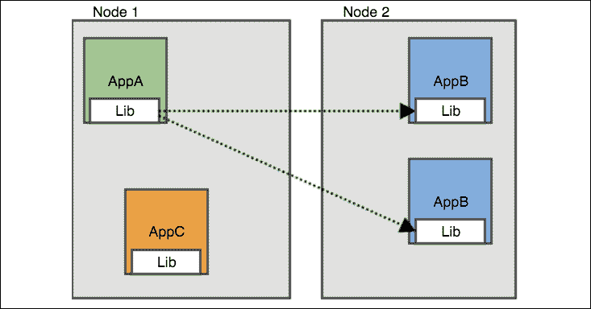

图 14.1:大型库方法

大图书馆方法有几个问题:

*   您需要一个支持您使用的所有编程语言的库
*   如果你想更新你的图书馆，你需要取消你所有的服务
*   很难同时升级所有服务

服务网格不接触您的应用程序。它将一个侧车代理容器注入每个吊舱和一个服务网格控制器。代理拦截吊舱之间的所有通信，并与网格控制器协作，处理所有交叉问题:

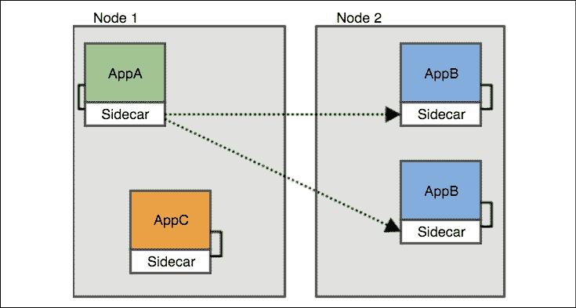

图 14.2:使用服务网格控制器

以下是代理注入方法的一些属性:

*   应用程序不知道服务网格
*   您可以打开或关闭每个窗格的网格，并独立更新网格
*   不需要在每个节点上部署代理
*   同一节点上的不同吊舱可以有不同的侧车(或版本)
*   每个 pod 都有自己的代理副本

在 Kubernetes 上，它看起来像:

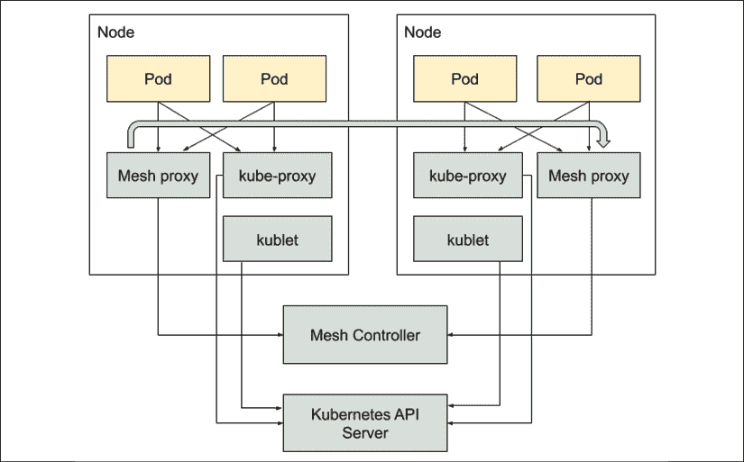

图 14.3:带有服务网格控制器的 Kubernetes

还有另一种方式将服务网格代理实现为节点代理，在这种情况下，它不会被注入到每个 pod 中。这种方法不太常见，但在某些情况下(尤其是在非 Kubernetes 环境中)，它很有用:

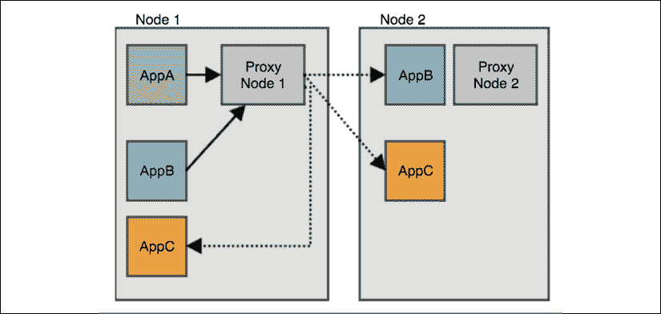

图 14.4:作为节点代理的服务网格代理

## 控制平面和数据平面

在服务网格世界中，有一个控制平面，它通常是 Kubernetes 上的一组控制器，还有一个数据平面，它包含连接网格中所有服务的代理。数据平面由拦截网格中服务之间所有通信的所有 sidecar 容器(或节点代理)组成。当服务或服务与外部世界之间的任何流量被拦截时，控制平面负责实际发生的事情。

现在我们已经很好地了解了什么是服务网格，它是如何工作的，以及为什么如此有用，让我们回顾一下一些服务网格。

# 选择服务网格

服务网格的概念相对较新，但已经有很多选择。以下是对当前服务网格群组的简要回顾。

## 使者

**特使**([https://www.envoyproxy.io/](https://www.envoyproxy.io/))又是一个 CNCF 毕业的项目。这是一个非常通用的和高性能的 L7 代理。它提供了许多服务网格功能，但是它被认为是非常低级和难以配置的。它也不是库本内特特有的。一些 Kubernetes 服务网格使用特使作为底层数据平面，并提供一个 Kubernetes 本地控制平面来配置和交互。如果您想在 Kubernetes 上直接使用特使，那么建议使用另一个开源项目，如大使或 Gloo 作为入口控制器和/或应用编程接口网关。

## 左 2 号

**Linkerd 2**([https://linkerd.io/](https://linkerd.io/))是 Kubernetes 专属服务，也是CNCF 孵化项目。由**浮力**([https://buoyant.io/](https://buoyant.io/))开发。浮力创造了服务网格这个术语，并在几年前将其介绍给了世界。他们首先为包括 Kubernetes 在内的多个平台开发了基于 Scala 的服务网格，名为 **Linkerd** 。然而，他们决定开发一个更好、更高性能的服务网格，只针对 Kubernetes。这就是 Linkerd 2 的用武之地。他们在 Rust 中实现了数据平面(代理层)，在 Go 中实现了控制平面。

## 库马

**库马**([https://kuma.io/](https://kuma.io/))是一个由特使供电的服务网。它适用于 Kubernetes，也适用于其他环境。它是由孔开发的。它的名气在于它超级容易配置。

## 自动气象站应用网格

当然，AWS 有自己的专有服务网格-**AWS 应用网格**([https://aws.amazon.com/app-mesh/](https://aws.amazon.com/app-mesh/))。App Mesh 也使用特使作为其数据平面。它可以在 EC2、法盖特、ECS 和 EKS 以及普通的 Kubernetes 上运行。App Mesh 对于服务 Mesh 场景来说有点晚了，所以没有其他一些服务 Mesh成熟。然而，它是基于坚实的特使，所以如果你是一个 AWS 商店，它可能是最好的选择，因为它与 AWS 服务紧密集成。

## 湿地

**梅什**([https://containo.us/maesh/](https://containo.us/maesh/))是**特拉菲克**([https://containo.us/traefik/](https://containo.us/traefik/)的制造商开发的。这很有趣，因为它使用了节点代理方法，而不是 sidecar 容器。为了实现服务网格功能，它在很大程度上基于 Traefik 中间件。您可以通过在服务上使用注释来配置它。如果您在集群的边缘使用 Traefik，这可能是尝试服务网格的一种有趣且轻量级的方法。

## 伊斯汀

最后，但并非最不重要的一点，伊斯特奥([https://istio.io/](https://istio.io/))是库本内特斯最著名的服务网格。它建立在特使之上，允许你通过 YAML 清单以库本内斯本地方式配置它。Istio 由谷歌、IBM 和 Lyft(特使开发者)发起。这是谷歌 GKE 上的一键安装，但在库本内特社区中被广泛使用。它也是 Knative 的默认入口/应用编程接口网关解决方案，这进一步促进了它的采用。

既然我们已经讨论了各种服务网格的选择，让我们带 Istio 去兜兜风。

# 将 Istio 合并到您的 Kubernetes 集群中

在本节中，我们将更好地了解 Istio a ，将其安装到一个新的集群中，并探索它提供的所有服务优势。

## 了解 Istio 架构

首先，让我们认识 Istio 的主要组成部分，了解它们是做什么的，以及它们是如何相互关联的。

Istio 是一个提供大量功能的大型框架，它有多个部分，这些部分可以相互交互，也可以与 Kubernetes 组件交互(大多是间接的，不引人注目的)。它分为控制平面和数据平面。数据平面是一组代理(每个 pod 一个)。他们的控制平面是一组负责配置代理和收集遥测数据的组件。

下图说明了 Istio 的不同部分，它们是如何相互关联的，以及它们之间交换了什么信息:

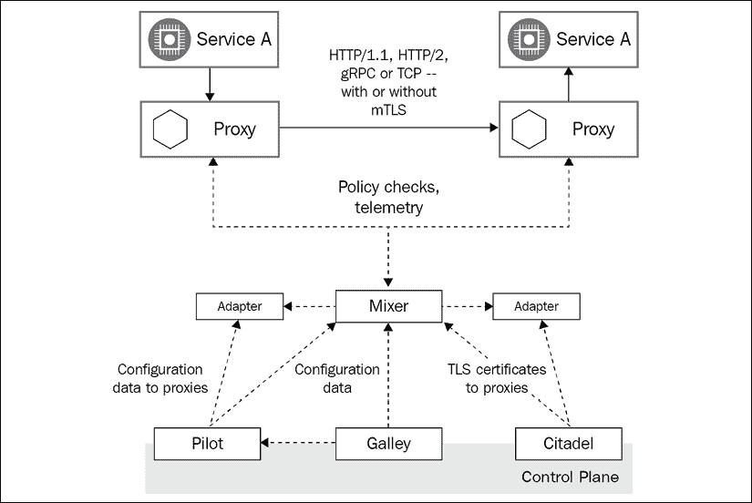

图 14.5: Istio 架构

让我们更深入地了解每个组件，从特使代理开始。

### 使者

当我们回顾库本内斯的服务网格时，我们简要讨论了特使。在这里，它作为 Istio 的数据平面。特使用 C++实现，是一个高性能代理。对于服务网格中的每个吊舱，Istio(自动或通过 istioctl CLI)注入一个特使侧容器，以完成所有繁重的提升工作，例如:

*   吊舱之间的代理 HTTP、HTTP/2 和 gRPC 流量
*   复杂的负载平衡
*   mTLS 终端
*   HTTP/2 和 gRPC 代理
*   提供健康服务
*   不健康服务的断路
*   基于百分比的流量整形
*   注入测试故障
*   详细指标

特使代理控制到其吊舱的所有传入和传出通信。到目前为止，它是 Istio 最重要的组成部分。特使的配置不是微不足道的，这是 Istio 控制平面处理的很大一部分。

下一个组件是 Pilot。

### 飞行员

Pilot 负责平台无关的服务发现、动态负载平衡和路由。它将高级路由规则转换为特使配置。这个抽象层允许 Istio 在多个编排平台上运行。Pilot 获取所有平台特定的信息，将其转换为特使数据平面配置格式，并通过特使数据平面 API 传播给每个特使代理。飞行员是无国籍的；在 Kubernetes 中，所有配置都存储为 etcd 中的**自定义资源定义** ( **CRDs** )。

让我们继续到混合器。

### 搅拌器

Mixer 负责抽象度量收集、策略和审计。这些方面通常是通过直接访问特定后端的应用编程接口在服务中实现的。这有利于减轻服务开发人员的负担，并将控制权交给配置 Istio 的运营商。它还可以在不改变代码的情况下轻松切换后端。下面是 Mixer 可以使用的一些后端类型:

*   记录
*   批准
*   配额
*   遥感勘测
*   演员表

特使代理和混合器之间的交互很简单——在每个请求之前，代理调用混合器进行前提条件检查，这可能会导致请求被拒绝。在每个请求之后，代理向混合器报告度量。Mixer 有一个适配器 API，便于对任意基础设施后端进行扩展。这是它设计的主要部分。

下一个组件是 Citadel。

### 城堡

Citadel 负责证书和密钥管理。这是 Istio 安全的关键部分。Citadel 将与各种平台整合在一起，并与它们的身份机制保持一致。例如，在 Kubernetes 中，它使用服务帐户；在 AWS 上，它使用 AWS IAM 在 GCP/GKE，它可以使用 GCP IAM。Istio 公钥基础设施基于 Citadel。它使用 SPIFEE 格式的 X.509 证书作为服务身份的载体。

以下是 Kubernetes 中的工作流程:

*   Citadel 为现有服务帐户创建证书和密钥对。
*   Citadel 监视 Kubernetes 应用编程接口服务器上的新服务帐户，为其提供证书和密钥对。
*   Citadel 将证书和密钥存储为 Kubernetes 机密。
*   Kubernetes 将秘密装载到与服务帐户相关联的每个新 pod 中(这是标准的 Kubernetes 实践)。
*   当证书过期时，城堡会自动轮换库本内特斯的秘密。
*   Pilot 生成安全的命名信息，将服务帐户与 Istio 服务相关联。然后，Pilot 将安全命名信息传递给特使代理。

我们将介绍的最后一个主要组件是厨房。

### 活版盘

厨房负责抽象不同平台上的用户配置。它向先导和混合器提供摄取的配置。这是一个非常简单的组件。

现在我们已经将 Istio 分解为主要组件，让我们准备好将 Istio 安装到 Kubernetes 集群中。

## 为 Istio 准备 minikube 集群

我们将使用迷你库集群来检查 Istio。在安装 Istio 之前，我们应该确保我们的集群有足够的容量来处理 Istio 及其演示应用程序 **Bookinfo** 。我们将用 16 MB 内存和四个 CPU 启动 minikube，这应该足够了:

```
$ minikube start --memory=16384 --cpus=4 
```

Minikube 可以为 Istio 提供负载平衡器。让我们在单独的终端中运行该命令，因为它将阻止:

```
$ minikube tunnel
Status:
    machine: minikube
    pid: 20463
    route: 10.96.0.0/12 -> 192.168.64.5
    minikube: Running
    services: []
    errors:
        minikube: no errors
        router: no errors
        loadbalancer emulator: no errors 
```

Minikube 有时不会清理隧道网络，因此建议在停止集群后运行以下命令:

```
$ minikube tunnel --cleanup 
```

## 安装 Istio

随着 minikube 的启动和运行，我们可以安装 Istio 本身。安装 Istio 有多种方法:

*   使用 Istioctl(Istio 命令行界面)定制安装
*   带 Helm 的定制安装
*   使用 Istio 运算符(实验性)
*   多集群安装

未来不支持 Helm 安装，所以我们将采用推荐的`istioctl`选项:

```
$ curl -L https://istio.io/downloadIstio | sh - 
```

`istioctl`工具位于`/istio-1.6.3/bin`(下载时版本可能有所不同)。确保它在你的`PATH`里。Kubernetes 安装清单在`/istio-1.6.3/install/kubernetes`中，示例在`/istio-1.6.3/samples`中。

我们将安装内置的演示配置文件，这对评估 Istio 非常有用:

```
$ istioctl manifest apply --set profile=demo
- Applying manifest for component Base...
 Finished applying manifest for component Base.
- Applying manifest for component Citadel...
- Applying manifest for component Tracing...
- Applying manifest for component IngressGateway...
- Applying manifest for component Galley...
- Applying manifest for component Kiali...
- Applying manifest for component EgressGateway...
- Applying manifest for component Prometheus...
- Applying manifest for component Pilot...
- Applying manifest for component Policy...
- Applying manifest for component Injector...
- Applying manifest for component Telemetry...
- Applying manifest for component Grafana...
 Finished applying manifest for component Citadel.
 Finished applying manifest for component Kiali.
 Finished applying manifest for component Galley.
 Finished applying manifest for component Prometheus.
 Finished applying manifest for component Injector.
 Finished applying manifest for component Tracing.
 Finished applying manifest for component Policy.
 Finished applying manifest for component Grafana.
 Finished applying manifest for component IngressGateway.
 Finished applying manifest for component Pilot.
 Finished applying manifest for component EgressGateway.
 Finished applying manifest for component Telemetry.
 Installation complete 
```

一些熟悉的名字如普罗米修斯和格拉夫纳已经出现。让我们回顾一下我们的集群，看看实际安装了什么。Istio 将自己安装到`istio-system`命名空间中，这非常方便，因为它安装了很多东西。让我们看看 Istio 安装了哪些服务:

```
$ kubectl get svc -n istio-system -o name
service/grafana
service/istio-citadel
service/istio-egressgateway
service/istio-galley
service/istio-ingressgateway
service/istio-pilot
service/istio-policy
service/istio-sidecar-injector
service/istio-telemetry
service/jaeger-agent
service/jaeger-collector
service/jaeger-query
service/kiali
service/Prometheus
service/tracing
service/zipkin 
```

有相当多的服务带有`istio-`前缀，然后是一堆其他服务:

*   普罗米修斯
*   格拉凡娜
*   贼鸥
*   拉链
*   描摹
*   琪丽亚

这意味着，如果我们在 Kubernetes 集群中使用 Istio，就不需要安装 Prometheus、Grafana 和 Jaeger。他们和 Istio 一起来的。此外，Istio 支持他们的事实给予了他们更多的持久力。

好的。我们已经成功安装了 Istio。让我们将 Bookinfo 应用程序安装到我们的集群中，这是 Istio 的示例应用程序。

## 安装 Bookinfo

Bookinfo 是一个简单的基于微服务的应用程序，顾名思义，它在一本书上显示信息，比如名字、描述、ISBN，甚至评论。Bookinfo 开发人员真正接受了多语种的生活方式，每个微服务都是用不同的编程语言实现的:

*   `ProductPage`Python 中的服务
*   用 Java 评论服务
*   Ruby 中的细节服务
*   JavaScript 中的评级服务

下图描述了 Bookinfo 服务之间的关系和信息流:

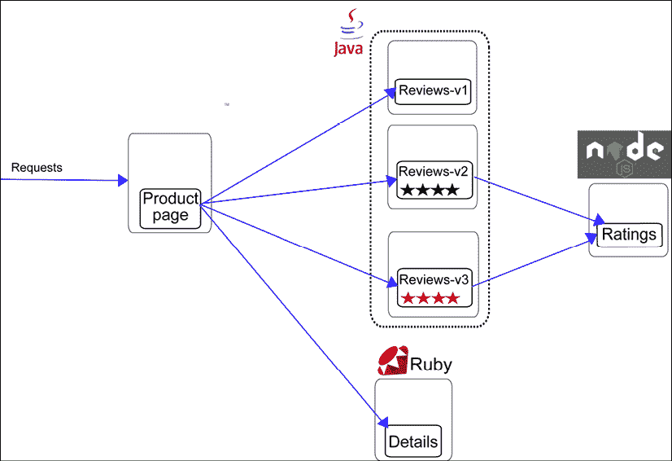

图 14.6: Bookinfo 服务关系

很方便的是，Bookinfo 附带了 Istio，所以我们已经在`samples`子目录中有了它，我们可以从那里安装它:

```
$ cd samples/bookinfo 
```

我们将把它安装到自己的`bookinfo`命名空间中。让我们创建名称空间，然后通过向名称空间添加一个标签来启用 sidecar 代理的 Istio 自动注入:

```
$ kubectl create ns bookinfo
namespace/bookinfo created
$ kubectl label namespace bookinfo istio-injection=enabled
namespace/bookinfo labeled 
```

安装应用程序本身很简单:

```
$ kubectl apply -f platform/kube/bookinfo.yaml -n bookinfo
service/details created
serviceaccount/bookinfo-details created
deployment.apps/details-v1 created
service/ratings created
serviceaccount/bookinfo-ratings created
deployment.apps/ratings-v1 created
service/reviews created
serviceaccount/bookinfo-reviews created
deployment.apps/reviews-v1 created
deployment.apps/reviews-v2 created
deployment.apps/reviews-v3 created
service/productpage created
serviceaccount/bookinfo-productpage created
deployment.apps/productpage-v1 created 
```

好了，应用程序已经成功部署，包括每个服务的独立服务帐户。如您所见，部署了三个版本的 reviews 服务。这将在稍后派上用场，当我们玩升级和高级路由和部署模式时。

在继续之前，我们仍然需要等待所有的吊舱初始化，然后 Istio 将注入它的 sidecar 代理容器。当尘埃落定，你应该看到这样的东西:

```
$ kubectl get po -n bookinfo
NAME                              READY   STATUS    RESTARTS   AGE
details-v1-78d78fbddf-sdssb       2/2     Running   0          101s
productpage-v1-596598f447-h9576   2/2     Running   0          100s
ratings-v1-6c9dbf6b45-bpqbl       2/2     Running   0          99s
reviews-v1-7bb8ffd9b6-7s6xh       2/2     Running   0          100s
reviews-v2-d7d75fff8-p5lh5        2/2     Running   0          100s
reviews-v3-68964bc4c8-4hqvr       2/2     Running   0          100s 
```

注意在`READY`栏下，每个豆荚显示`2/2`，表示每个豆荚有两个容器。一个是应用程序容器，另一个是注入的代理。

既然我们要在`bookinfo`命名空间中操作，让我们定义一个小别名，让我们的生活更简单:

```
$ alias kb='kubectl -n bookinfo' 
```

现在，有了我们的小`kb`别名，我们可以验证我们可以从评级服务获得产品页面:

```
$ kb exec -it $(kb get pod -l app=ratings -o jsonpath='{.items[0].metadata.name}') -c ratings -- curl productpage:9080/productpage | grep -o "<title>.*</title>"
<title>Simple Bookstore App</title> 
```

但是，该应用程序还不能被外部世界访问。这就是 Istio 网关的用武之地。让我们部署它:

```
$ kb apply -f networking/bookinfo-gateway.yaml
gateway.networking.istio.io/bookinfo-gateway created
virtualservice.networking.istio.io/bookinfo created 
```

在 minikube 上，网关的外部网址可以构造为:

```
export INGRESS_PORT=$(kubectl -n istio-system get service istio-ingressgateway -o jsonpath='{.spec.ports[?(@.name=="http2")].nodePort}')
$ export GATEWAY_URL=$(minikube ip):${INGRESS_PORT} 
```

现在，我们可以从外面试试:

```
$ http  http://${GATEWAY_URL}/productpage | grep -o "<title>.*</title>"
<title>Simple Bookstore App</title> 
```

你也可以在浏览器中打开网址，看到一些关于莎士比亚的*错误喜剧*的信息:

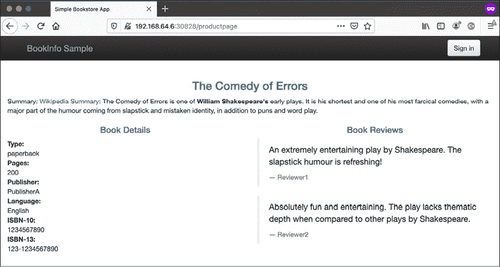

图 14.7:错误的喜剧

好吧。我们都准备好开始探索 Istio 带来的能力。让我们从交通管理开始。

## 交通管理

Istio 流量管理是根据您定义的目的地规则将流量路由到您的服务。Istio 为您的所有服务及其端点保留一个服务注册表。基本流量管理允许每对服务之间的流量，并在每个服务实例之间进行简单的循环负载平衡。

然而，Istio 可以做得更多。Istio 的流量管理应用编程接口由五个资源组成:

*   虚拟服务
*   目标规则
*   方法
*   服务条目
*   边车

让我们首先应用 Bookinfo 的默认目标规则:

```
$ kubectl apply -f networking/destination-rule-all.yaml
destinationrule.networking.istio.io/productpage created
destinationrule.networking.istio.io/reviews created
destinationrule.networking.istio.io/ratings created
destinationrule.networking.istio.io/details created 
```

然后，让我们创建代表网格中服务的 Istio 虚拟服务:

```
$ kubectl apply -f networking/virtual-service-all-v1.yaml
virtualservice.networking.istio.io/productpage created
virtualservice.networking.istio.io/reviews created
virtualservice.networking.istio.io/ratings created
virtualservice.networking.istio.io/details created 
```

我们需要稍微等待虚拟服务配置传播。接下来让我们看看产品页面虚拟服务:

```
$ kubectl get virtualservices productpage -o yaml
apiVersion: networking.istio.io/v1alpha3
kind: VirtualService
metadata:
  ...
  generation: 1
  name: productpage
  namespace: default
spec:
  hosts:
  - productpage
  http:
  - route:
    - destination:
        host: productpage
        subset: v1 
```

它非常简单，指定了 HTTP 路由和版本。v1 子集对于 review 服务很重要，它有多个版本。产品页面服务将达到其 v1 版本，因为这是已配置的子集。

让我们让它更有趣一点，并根据登录的用户进行路由。Istio 本身没有用户身份的概念，但它根据报头路由流量。Bookinfo 应用程序向所有请求添加一个最终用户头。

以下命令将更新路由规则:

```
$ kubectl apply -f networking/virtual-service-reviews-test-v2.yaml
virtualservice.networking.istio.io/reviews configured 
```

让我们来看看新规则:

```
$ kubectl get virtualservice reviews -o yaml
apiVersion: networking.istio.io/v1alpha3
kind: VirtualService
metadata:
  ...
spec:
  hosts:
  - reviews
  http:
  - match:
    - headers:
        end-user:
          exact: json
    route:
    - destination:
        host: reviews
        subset: v2
  - route:
    - destination:
        host: reviews
        subset: v1 
```

如您所见，如果 HTTP 头`end user`匹配“json”，那么请求将被路由到评论服务的子集 2；否则，返回到子集 1。评论服务的版本 2 在页面的评论部分添加了一个星级。

为了测试它，我们可以以用户“json”身份登录(任何密码都可以)，并获得以下页面:


图 14.8:登录后的审核

在交通管理领域，Istio 还可以做更多的事情:

*   用于测试目的的故障注入
*   HTTP 和 TCP 流量转移(逐渐将流量从一个版本转移到下一个版本)
*   请求超时
*   断路
*   反映

除了内部流量管理，Istio 还支持配置集群的入口和出口，包括使用 TLS 和相互 TLS 的安全选项。

## 安全

安全是 Istio 的核心。它提供身份管理、身份验证和授权、安全策略和加密。安全支持使用多种行业标准协议和最佳实践安全原则(如深度防御、默认安全和零信任)分布在多个层。

以下是 Istio 安全架构的全貌:

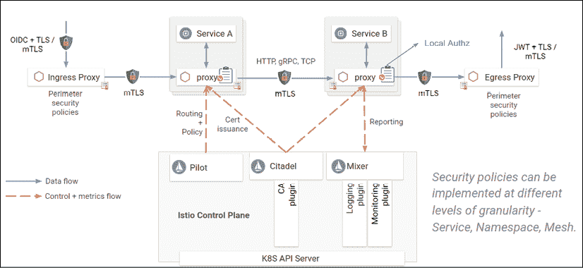

图 14.9:Istio 安全架构

所有这些组件协作以实现强大的安全态势:

*   citadel 管理器密钥和证书
*   Sidecar 和外围代理在客户端和服务器之间实现经过身份验证和授权的通信
*   Pilot 向代理分发安全策略和安全命名信息
*   混合器管理器审计

让我们一点一点地分解它。

### 微妙的身份

Istio 利用安全的命名，其中由服务发现机制(例如，DNS)定义的服务名称被映射到基于证书的服务器身份。客户端验证服务器身份。服务器可以被配置为验证客户端身份。所有的安全策略都适用于给定的身份。服务器根据客户端的身份决定客户端的访问权限。

Istio 身份模型可以利用其运行平台上的现有身份基础设施。当然，在 Kubernetes 上，它使用 Kubernetes 服务帐户。

Istio 支持**SPIFEE**([https://spiffe.io/](https://spiffe.io/))——安全身份框架的标准。这很方便，因为它允许 Istio 与任何符合 SPIFEE 的系统快速集成。具体来说，Kubernetes X.509 证书符合 SPIFEE 标准。

### 公钥基础设施消耗

Istio **公钥基础设施** ( **PKI** )是基于 Citadel 创建的 SPIFEE 证书。Kubernetes 上的流程包括以下几个阶段:

1.  Citadel 观察 Kubernetes API 服务器。对于每个服务帐户，它创建一个 SPIFFE 证书和一个密钥对，然后将其存储为标准的 Kubernetes 机密。
2.  现在，每当 Kubernetes 创建一个 pod 时，它会将证书和密钥对作为一个名为 **istio-certs** 的秘密卷安装到服务帐户中。
3.  Citadel 监视每个证书的生命周期，并通过重写 Kubernetes 秘密来自动轮换证书。
4.  Pilot 生成安全命名信息，该信息定义了哪些服务帐户可以运行某项服务。飞行员然后将安全的命名信息传递给边车特使。

### Istio 身份验证

安全的身份模型是 Istio 认证框架的基础。Istio 支持两种身份验证模式:传输身份验证和源身份验证。

#### 传输身份验证

传输认证是用于服务到的服务认证。它很酷的一点是，Istio 没有为它提供任何代码更改。它确保服务到服务的通信只在使用身份验证策略配置的服务之间进行。

以下是需要相互 TLS 的审查服务的身份验证策略:

```
apiVersion: "authentication.istio.io/v1alpha1"
kind: "Policy"
metadata:
  name: "reviews"
spec:
  targets:
  - name: reviews
  peers:
  - mtls: {} 
```

#### 原产地认证

产地认证用于终端用户认证。Istio 将验证提出请求的最终用户是否被允许提出该请求。该请求级认证利用 **JSON 网络令牌** ( **JWTs** )和支持许多 OpenID Connect 后端。

下面是一个原始身份验证策略的示例，该策略为使用谷歌颁发的 JWT 令牌的呼叫者排除了`/health`端点:

```
origins:
```

```
- jwt:
    issuer: https://accounts.google.com
    jwksUri: https://www.googleapis.com/oauth2/v3/certs
    trigger_rules:
    - excluded_paths:
      - exact: /health 
```

一旦建立了调用者的身份，认证框架就将其与其他声明一起传递给链中的下一个环节——授权框架。

### Istio 授权

Istio 可以在多个级别授权请求:

*   整个网格
*   整个命名空间
*   工作量水平

以下是 Istio 的授权架构:

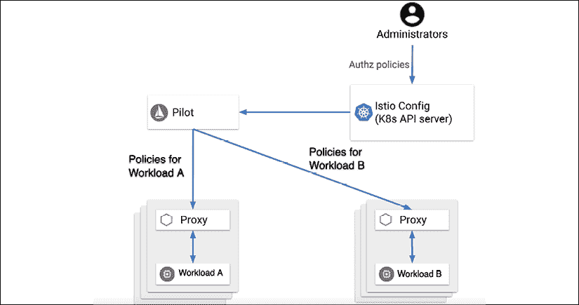

图 14.10: Istio 的授权架构

授权是基于授权策略的。每个策略都有一个选择器(它适用于哪些工作负载)和规则(允许谁在什么条件下访问资源)。

如果没有为工作负载定义策略，则允许所有请求。但是，如果为工作负载定义了策略，则只允许策略中规则允许的请求。没有办法定义排除规则。

这里有一个`AuthorizationPolicy`，当使用有效的 JWT 令牌发送请求时，它允许两个源(服务帐户`cluster.local/ns/default/sa/sleep`和命名空间`dev`)访问命名空间`foo`中标签为`app: httpbin`和`version: v1`的工作负载:

```
apiVersion: security.istio.io/v1beta1
kind: AuthorizationPolicy
metadata:
 name: httpbin
 namespace: foo
spec:
 selector:
   matchLabels:
     app: httpbin
     version: v1
 rules:
 - from:
   - source:
       principals: ["cluster.local/ns/default/sa/sleep"]
   - source:
       namespaces: ["dev"]
   to:
   - operation:
       methods: ["GET"]
   when:
   - key: request.auth.claims[iss]
     values: ["https://accounts.google.com"] 
```

粒度不一定要在工作负载级别。我们也可以限制对特定端点和方法的访问。除了精确匹配之外，我们还可以使用前缀匹配、后缀匹配或存在匹配来指定操作。例如，以下策略允许访问以`/test/`开始的所有路径和以`/info`结束的所有路径。允许的方法只有`GET`和`HEAD`:

```
apiVersion: security.istio.io/v1beta1
kind: AuthorizationPolicy
metadata:
  name: tester
  namespace: default
spec:
  selector:
    matchLabels:
      app: products
  rules:
  - to:
    - operation:
        paths: ["/test/*", "*/info"]
        methods: ["GET", "HEAD"] 
```

如果我们想让变得更加花哨，我们可以指定条件。例如，我们可以只允许带有特定头的请求。这里有一个策略需要一个值为`v1`或`v2`的版本头:

```
apiVersion: security.istio.io/v1beta1
kind: AuthorizationPolicy
metadata:
 name: httpbin
 namespace: foo
spec:
 selector:
   matchLabels:
     app: httpbin
     version: v1
 rules:
 - from:
   - source:
       principals: ["cluster.local/ns/default/sa/sleep"]
   to:
   - operation:
       methods: ["GET"]
   when:
   - key: request.headers[version]
     values: ["v1", "v2"] 
```

对于 TCP 服务，操作的`paths`和`methods`字段不适用。Istio 只会忽略它们。但是，我们可以为特定端口指定策略:

```
apiVersion: "security.istio.io/v1beta1"
kind: AuthorizationPolicy
metadata:
  name: mongodb-policy
  namespace: default
spec:
 selector:
   matchLabels:
     app: mongodb
 rules:
 - from:
   - source:
       principals: ["cluster.local/ns/default/sa/bookinfo-ratings-v2"]
   to:
   - operation:
       ports: ["27017"] 
```

通过扩展 Mixer 可以插入其他授权机制，但不被认可。最好坚持 Istio 授权，非常强大灵活。

让我们继续讨论定制策略的话题。

## 政策

Istio 非常灵活，允许我们启用和定义各种自定义策略来控制如何处理请求。以下是我们可以应用的一些策略:

*   动态限制服务流量
*   白名单、黑名单和拒绝服务访问
*   重写标题
*   重定向请求
*   自定义授权策略

策略由混合器适配器模型提供动力。混合器抽象出基础设施后端，例如遥测系统、访问控制系统、配额实施系统、计费系统等等。混合器适配器根据它从特使接收的一组通用属性进行操作。然后，它将它们提供给知道如何与基础设施后端交互的适配器。操作员(你和我)可以使用基于属性定义适配器行为的策略来配置混合器。下面是一个图表，说明了不同组件之间的相互作用:

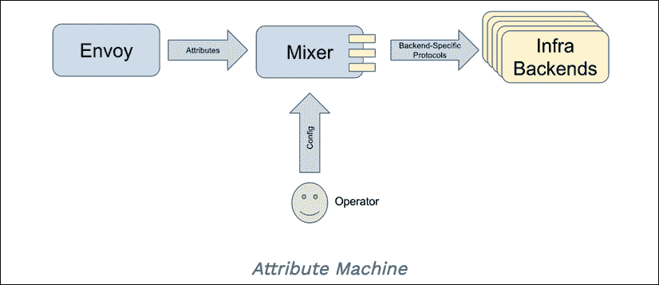

图 14.11:混合器组件之间的相互作用

定制策略不是微不足道的。你要了解涉及到的各种对象，以及如何正确配置。此外，默认情况下禁用策略实施。如果我们不启用它，Istio 将忽略我们的政策。

在`istio`配置图中配置。以下是如何验证:

```
$ kubectl -n istio-system get cm istio -o jsonpath="{@.data.mesh}" | grep
disablePolicyChecks
disablePolicyChecks: true 
```

以下是启用它的简单方法:

```
$ istioctl manifest apply --set values.global.disablePolicyChecks=false 
```

如果这不起作用，您可以直接编辑配置映射:

```
$ kubectl edit -n istio-system cm istio 
```

现在，我们可以应用一些政策。例如，以下是如何应用利率限制政策:

```
$ kubectl apply -f policy/mixer-rule-productpage-ratelimit.yaml
handler.config.istio.io/quotahandler created
instance.config.istio.io/requestcountquota created
quotaspec.config.istio.io/request-count created
quotaspecbinding.config.istio.io/request-count created
rule.config.istio.io/quota created 
```

这创建了几个对象:一个处理程序、一个实例、一个配额规范、一个配额规范绑定，最后是一个将它们联系在一起的规则。

让我们来看看这些对象，看看它们是如何协作实现速率限制的。该实例是配额模板的实例。它定义了维度，在本例中是源、目标和目标版本:

```
$ kubectl -n istio-system get instance requestcountquota -o yaml
apiVersion: config.istio.io/v1alpha2
kind: instance
metadata:
  generation: 1
  name: requestcountquota
spec:
  compiledTemplate: quota
  params:
    dimensions:
      destination: destination.labels["app"] | destination.service.name | "unknown"
      destinationVersion: destination.labels["version"] | "unknown"
      source: request.headers["x-forwarded-for"] | "unknown" 
```

这里的处理器是一个`memquota`适配器。对于生产系统，建议使用 Redis 适配器。

您可以使用以下命令检索规范:

```
$ kubectl -n istio-system get handler quotahandler -o yaml 
```

规范定义了多个配额方案。首先，默认配额为每秒 500 个请求:

```
spec:
  compiledAdapter: memquota
  params:
    quotas:
    - name: requestcountquota.instance.istio-system 
      maxAmount: 500
      validDuration: 1s 
```

然后，它为特定服务定义覆盖。例如，对于`reviews`服务，每 5 秒钟只允许一个请求:

```
 overrides:
      - dimensions:
          destination: reviews
        maxAmount: 1
        validDuration: 5s 
```

`productpage`服务每 5 秒钟允许两个请求:

```
 - dimensions:
          destination: productpage
        maxAmount: 2
        validDuration: 5s 
```

除非源有 IP 地址`10.28.11.20`，在这种情况下，每秒返回`500`请求:

```
 - dimensions:
          destination: productpage
          source: 10.28.11.20
        maxAmount: 500
        validDuration: 1s 
```

当请求因速率限制而被拒绝时，混合器将向特使返回`RESOURCE_EXHAUSTED`消息，特使将向呼叫者返回`HTTP 429`状态代码。

该规则只是将配额实例与处理程序联系在一起:

```
$ kubectl -n istio-system get rule quota -o yaml
apiVersion: config.istio.io/v1alpha2
kind: rule
metadata:
  generation: 1
  name: quota
  namespace: istio-system
spec:
  actions:
  - handler: quotahandler
    instances:
    - requestcountquota 
```

该策略可以限制应用于命名空间。当名称空间为`istio-system`时，适用于整个服务网格。

让我们看看 Istio 提供巨大价值的领域之一——遥测技术。

## 监测和可观察性

检测你的遥测申请是一项吃力不讨好的工作。您需要记录、收集指标并创建跟踪范围。这有几个缺点:

*   首先做这件事需要时间和努力
*   需要更多的时间和精力来确保集群中所有服务的一致性
*   您很容易错过一些重要的检测点或配置不正确
*   如果要更改日志提供程序或分布式跟踪解决方案，可能需要修改所有服务
*   它在你的代码中加入了很多模糊业务逻辑的东西
*   为了测试，您可能需要显式关闭它

如果所有这些都是自动处理的，并且不需要任何代码更改，会怎么样？这是服务网格遥测的承诺。当然，您可能需要做一些工作，尤其是如果您想要捕获自定义指标或进行一些特定的日志记录。如果您的系统沿着真正代表您的领域和工作流的边界被划分为连贯的微服务，那么 Istio 可以帮助您开箱即用地获得合适的工具。这个想法是，Istio 可以跟踪你的服务之间的缝隙中发生了什么。

### 日志

Istio 可以配置为日志收集，类似于我们定义策略的方式。以下命令将创建一个日志实例和一个日志处理程序:

```
$ kubectl apply -f telemetry/log-entry.yaml
instance.config.istio.io/newlog created
handler.config.istio.io/newloghandler created 
```

它使用`logentry`模板和`stdio`内置适配器。在 Kubernetes 上，日志作为混合器的容器日志收集。您可以通过以下命令找到它们:

```
$ kubectl -n istio-system logs -l istio-mixer-type=telemetry | rg newlog
{"level":"warn","time":"2020-06-14T19:27:11.752616Z","instance":"newlog.instance.istio-system","destination":"details","latency":"1.708946ms","responseCode":200,"responseSize":178,"source":"productpage","user":"unknown"}
{"level":"warn","time":"2020-06-14T19:27:11.912198Z","instance":"newlog.instance.istio-system","destination":"details","latency":"1.756211ms","responseCode":200,"responseSize":178,"source":"productpage","user":"unknown"}
{"level":"warn","time":"2020-06-14T19:27:11.918363Z","instance":"newlog.instance.istio-system","destination":"reviews","latency":"29.029062ms","responseCode":200,"responseSize":375,"source":"productpage","user":"unknown"}
{"level":"warn","time":"2020-06-14T19:27:11.758456Z","instance":"newlog.instance.istio-system","destination":"reviews","latency":"4.624288ms","responseCode":200,"responseSize":295,"source":"productpage","user":"unknown"}
{"level":"warn","time":"2020-06-14T19:27:11.918611Z","instance":"newlog.instance.istio-system","destination":"reviews","latency":"27.833674ms","responseCode":200,"responseSize":375,"source":"productpage","user":"unknown"}
istio-mixer-type=telemetry 
```

如您所见，每个日志条目都包含日志级别、时间戳、源、目标、响应代码和延迟。

如果有必要，也可以访问特使日志。请注意，默认情况下特使日志是禁用的。通过将`accessLogFile`设置为`/dev/output`，可以在 Istio 配置图中启用它们。

以下是`productpage`服务的特使日志:

```
$ kb logs -l app=productpage -c istio-proxy
[2020-06-14T19:27:11.565Z] "GET /reviews/0 HTTP/1.1" 200 - "-" "-" 0 375 19 19 "-" "Mozilla/5.0 (Macintosh; Intel Mac OS X 10_14_6) AppleWebKit/537.36 (KHTML, like Gecko) Chrome/79.0.3945.130 Safari/537.36" "f482f9a7-2033-945f-8885-fd55038fb3ce" "reviews:9080" "172.17.0.18:9080" outbound|9080||reviews.bookinfo.svc.cluster.local - 10.96.145.169:9080 172.17.0.24:54918 – default
[2020-06-14T19:27:11.547Z] "GET /productpage HTTP/1.1" 200 - "-" "-" 0 5282 40 40 "172.17.0.1" "Mozilla/5.0 (Macintosh; Intel Mac OS X 10_14_6) AppleWebKit/537.36 (KHTML, like Gecko) Chrome/79.0.3945.130 Safari/537.36" "f482f9a7-2033-945f-8885-fd55038fb3ce" "192.168.64.6:30828" "127.0.0.1:9080" inbound|9080|http|productpage.bookinfo.svc.cluster.local - 172.17.0.24:9080 172.17.0.1:0 – default
[2020-06-14T19:27:11.752Z] "GET /details/0 HTTP/1.1" 200 - "-" "-" 0 178 1 1 "-" "Mozilla/5.0 (Macintosh; Intel Mac OS X 10_14_6) AppleWebKit/537.36 (KHTML, like Gecko) Chrome/79.0.3945.130 Safari/537.36" "d3c13544-fc06-9e49-8aeb-077608d70316" "details:9080" "172.17.0.27:9080" outbound|9080||details.bookinfo.svc.cluster.local - 10.96.117.135:9080 172.17.0.24:56584 – default
[2020-06-14T19:27:11.758Z] "GET /reviews/0 HTTP/1.1" 200 - "-" "-" 0 295 5 5 "-" "Mozilla/5.0 (Macintosh; Intel Mac OS X 10_14_6) AppleWebKit/537.36 (KHTML, like Gecko) Chrome/79.0.3945.130 Safari/537.36" "d3c13544-fc06-9e49-8aeb-077608d70316" "reviews:9080" "172.17.0.21:9080" outbound|9080||reviews.bookinfo.svc.cluster.local - 10.96.145.169:9080 172.17.0.24:54928 – default
[2020-06-14T19:27:11.747Z] "GET /productpage HTTP/1.1" 200 - "-" "-" 0 4286 18 18 "172.17.0.1" "Mozilla/5.0 (Macintosh; Intel Mac OS X 10_14_6) AppleWebKit/537.36 (KHTML, like Gecko) Chrome/79.0.3945.130 Safari/537.36" "d3c13544-fc06-9e49-8aeb-077608d70316" "192.168.64.6:30828" "127.0.0.1:9080" inbound|9080|http|productpage.bookinfo.svc.cluster.local - 172.17.0.24:9080 172.17.0.1:0 – default
[2020-06-14T19:27:11.912Z] "GET /details/0 HTTP/1.1" 200 - "-" "-" 0 178 1 1 "-" "Mozilla/5.0 (Macintosh; Intel Mac OS X 10_14_6) AppleWebKit/537.36 (KHTML, like Gecko) Chrome/79.0.3945.130 Safari/537.36" "9f6f8d93-fb3f-98b7-9911-1b1e74aabfbf" "details:9080" "172.17.0.27:9080" outbound|9080||details.bookinfo.svc.cluster.local - 10.96.117.135:9080 172.17.0.24:56596 – default
[2020-06-14T19:27:11.918Z] "GET /reviews/0 HTTP/1.1" 200 - "-" "-" 0 375 29 28 "-" "Mozilla/5.0 (Macintosh; Intel Mac OS X 10_14_6) AppleWebKit/537.36 (KHTML, like Gecko) Chrome/79.0.3945.130 Safari/537.36" "9f6f8d93-fb3f-98b7-9911-1b1e74aabfbf" "reviews:9080" "172.17.0.18:9080" outbound|9080||reviews.bookinfo.svc.cluster.local - 10.96.145.169:9080 172.17.0.24:54940 – default
[2020-06-14T19:27:11.906Z] "GET /productpage HTTP/1.1" 200 - "-" "-" 0 5282 43 43 "172.17.0.1" "Mozilla/5.0 (Macintosh; Intel Mac OS X 10_14_6) AppleWebKit/537.36 (KHTML, like Gecko) Chrome/79.0.3945.130 Safari/537.36" "9f6f8d93-fb3f-98b7-9911-1b1e74aabfbf" "192.168.64.6:30828" "127.0.0.1:9080" inbound|9080|http|productpage.bookinfo.svc.cluster.local - 172.17.0.24:9080 172.17.0.1:0 – default
[Envoy (Epoch 0)] [2020-06-14 19:36:20.012][19][warning][config] [bazel-out/k8-opt/bin/external/envoy/source/common/config/_virtual_includes/grpc_stream_lib/common/config/grpc_stream.h:91] gRPC config stream closed: 13,
[Envoy (Epoch 0)] [2020-06-14 20:06:38.171][19][warning][config] [bazel-out/k8-opt/bin/external/envoy/source/common/config/_virtual_includes/grpc_stream_lib/common/config/grpc_stream.h:91] gRPC config stream closed: 13, 
```

特使日志的格式是文本，但是您可以通过在配置图中将`accessLogEncoding`设置为 JSON 来将其配置为 JSON。您甚至可以设置日志的格式。

在 Kubernetes 上，您可以使用 fluentd 将所有这些日志发送到一个集中的日志记录系统。

让我们部署一个完整的**弹性搜索、基巴纳和 fluent**(**EFK**)日志堆栈，看看它如何与 Istio 集成。我们将运行以下命令(文件在`code`文件夹中):

```
$ kubectl apply -f logging-stack.yaml
namespace/logging created
service/elasticsearch created
deployment.apps/elasticsearch created
service/fluentd-es created
deployment.apps/fluentd-es created
configmap/fluentd-es-config created
service/kibana created
deployment.apps/kibana created 
```

栈被部署在它自己的日志命名空间中。我们需要配置 Istio 通过 fluentd 发送它的日志。通常，这是通过遍历混合器并定义实例、处理程序和规则来完成的:

```
$ kubectl apply -f telemetry/fluentd-istio.yaml
instance.config.istio.io/newlog created
handler.config.istio.io/handler created
rule.config.istio.io/newlogtofluentd created 
```

一些豆荚可能需要几分钟才能准备好。下一步是让日志用户界面基巴纳变得可访问:

```
$ kubectl -n logging port-forward $(kubectl -n logging get pod -l app=kibana -o jsonpath='{.items[0].metadata.name}') 5601:5601 
```

现在，我们可以浏览到`http://localhost:5601`并开始玩基巴纳。这是它的样子:

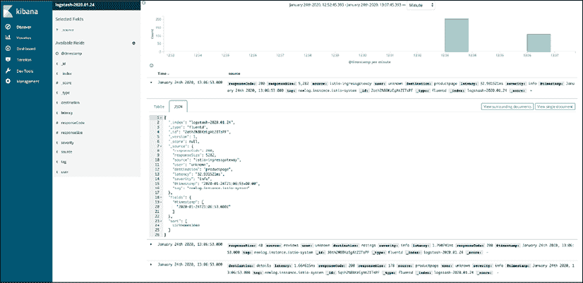

图 14.12:基巴纳用户界面

这很大程度上涵盖了 Istio 的伐木。让我们看看 Istio 能为指标提供什么。

### 韵律学

Istio 收集三种类型的指标:

*   代理指标
*   控制平面度量
*   服务指标

收集的指标涵盖了进出服务网格和服务网格内部的所有流量。作为运营商，我们需要配置 Istio。Istio 遵循四个黄金信号原则，记录延迟、流量、错误和饱和度。

Istio 安装了 Prometheus 和 Grafana 作为其度量收集和可视化后端。

要设置度量收集，让我们运行以下命令:

```
$ kubectl apply -f telemetry/metrics.yaml
instance.config.istio.io/doublerequestcount created
handler.config.istio.io/doublehandler created
rule.config.istio.io/doubleprom created 
```

以下是代理级指标的示例:

```
envoy_cluster_internal_upstream_rq{response_code_class="2xx",cluster_name="xds-grpc"} 7163
envoy_cluster_upstream_rq_completed{cluster_name="xds-grpc"} 7164
envoy_cluster_ssl_connection_error{cluster_name="xds-grpc"} 0
envoy_cluster_lb_subsets_removed{cluster_name="xds-grpc"} 0
envoy_cluster_internal_upstream_rq{response_code="503",cluster_name="xds-grpc"} 1 
```

下面是一个服务级别指标的示例:

```
istio_requests_total{
  connection_security_policy="mutual_tls",
  destination_app="details",
  destination_principal="cluster.local/ns/default/sa/default",
  destination_service="details.default.svc.cluster.local",
  destination_service_name="details",
  destination_service_namespace="default",
  destination_version="v1",
  destination_workload="details-v1",
  destination_workload_namespace="default",
  reporter="destination",
  request_protocol="http",
  response_code="200",
  response_flags="-",
  source_app="productpage",
  source_principal="cluster.local/ns/default/sa/default",
  source_version="v1",
  source_workload="productpage-v1",
  source_workload_namespace="default"
} 214 
```

我们还可以收集 TCP 服务的指标。让我们安装等级服务的 v2，它使用 MongoDB(一种 TCP 服务):

```
$ kb apply -f platform/kube/bookinfo-ratings-v2.yaml
serviceaccount/bookinfo-ratings-v2 created
deployment.apps/ratings-v2 created 
```

接下来，我们安装 MongoDB 本身:

```
$ kb apply -f platform/kube/bookinfo-db.yaml
service/mongodb created
deployment.apps/mongodb-v1 created 
```

最后，我们需要为评论和评级服务创建虚拟服务:

```
$ kb apply -f networking/virtual-service-ratings-db.yaml
virtualservice.networking.istio.io/reviews configured
virtualservice.networking.istio.io/ratings configured 
```

至此，我们可以揭露普罗米修斯:

```
kubectl -n istio-system port-forward \ 
$(kubectl -n istio-system get pod -l app=prometheus \
-o jsonpath='{.items[0].metadata.name}') 9090:9090 & 
```

我们可以从 Istio 服务、Istio 控制平面，尤其是特使中查看大量可用的新指标。以下是可用指标的一小部分:

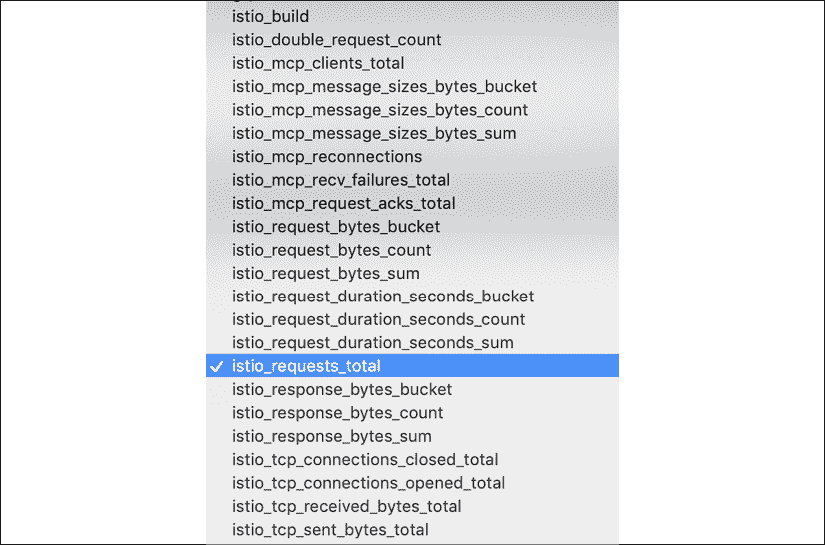

图 14.13:一些可用的指标

可观测性的最后一个支柱是分布式追踪。

### 分布式跟踪

Istio 配置代理为相关服务生成跟踪跨度。服务本身负责转发请求上下文。Istio 可以处理多个跟踪后端，例如:

*   贼鸥
*   拉链
*   LightStep
*   数据狗

以下是服务应该传播的请求头(根据跟踪后端，每个请求可能只有一些):

```
 x-request-id
    x-b3-traceid
    x-b3-spanid
    x-b3-parentspanid
    x-b3-sampled
    x-b3-flags
    x-ot-span-context 
    x-cloud-trace-context
    traceparent
    grpc-trace-bin 
```

轨迹的采样率由飞行员的环境变量控制:`PILOT_TRACE_SAMPLING`:

```
$ kubectl -n istio-system get deploy istio-pilot -o yaml \
| grep "name: PILOT_TRACE_SAMPLING" -A 1
        - name: PILOT_TRACE_SAMPLING
          value: "100" 
```

Bookinfo 的演示配置文件对 100%的请求进行了采样。我们可以将其更改为粒度为 0.01 的较低速率。默认值为 1%。

现在，我们可以启动耶格用户界面并探索痕迹:

```
$ istioctl dashboard jaeger
http://localhost:52466
Handling connection for 9090 
```

您的浏览器将自动打开，您应该会看到熟悉的 Jaeger 仪表板，您可以在其中选择服务并搜索跟踪:

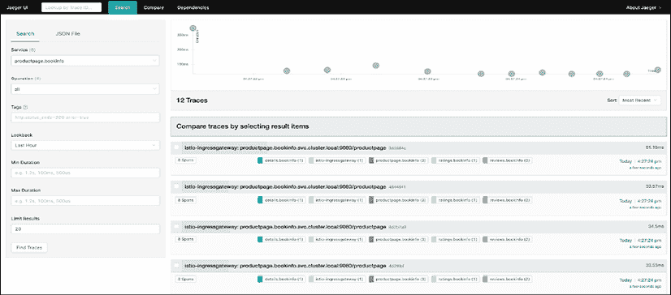

图 14.14:在 Jaeger 中选择服务

您可以单击 von a trace 来查看通过系统的请求流的详细视图:

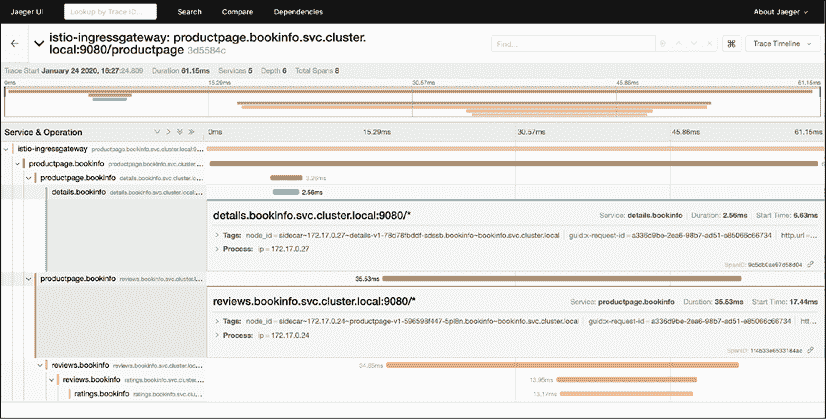

图 14.15:请求的详细流程

我们已经看到很多不同的工具都有自己的用户界面。让我们看看专用服务网格可视化。

### 将你的服务与凯力联系起来

Kiali 是一个开源项目，它将普罗米修斯、格拉夫纳和耶格联系在一起，为您的 Istio 服务网格提供一个可观察的控制台。它可以回答如下问题:

*   Istio 服务网格中有哪些微服务参与？
*   这些微服务是如何连接的？
*   这些微服务的表现如何？

它有各种视图，它真的允许您通过放大和缩小、过滤和选择各种属性来分割您的服务网格。它有几个视图可以切换。这是概述页面:

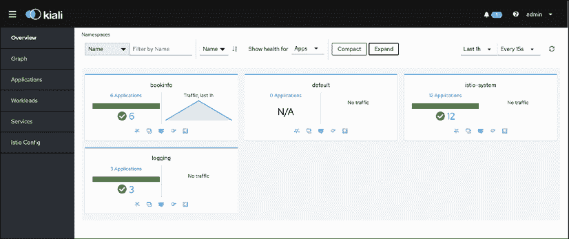

图 14.16: Kiali 的概述页面

然而，最有趣的视图是图形视图，它可以显示您的服务以及它们之间的关系。它完全了解版本和不同工作负载之间流动的请求，包括请求百分比和延迟。它可以同时显示 HTTP 和 TCP 服务，并且真正提供了服务网格行为的一幅很好的图片:

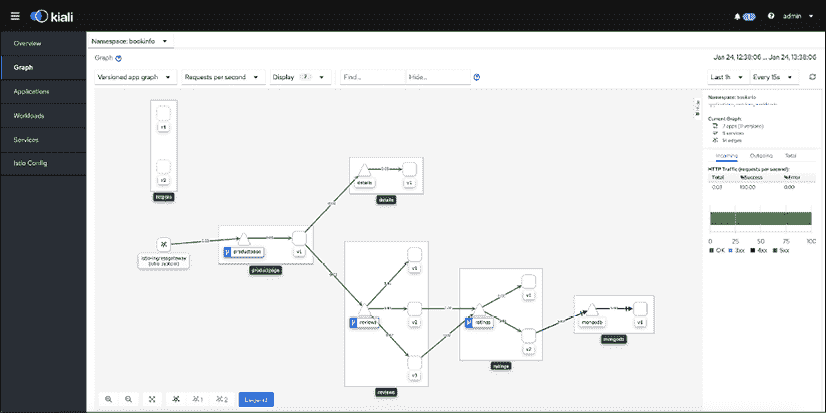

图 14.17:佳丽的图表视图

# 摘要

在本章中，我们对 Kubernetes 上的服务网格进行了非常全面的研究。服务网格会一直存在。它们只是操作复杂分布式系统的正确方法。将所有操作关注点分离到代理，并让服务网格来控制它们，这是一个范式转变。当然，Kubernetes 主要是为复杂的分布式系统设计的，所以服务网格的价值马上就变得清晰起来。看到 Kubernetes 上有许多服务网格选项也很棒。虽然大多数服务网格并不特定于 Kubernetes，但它是最重要的部署平台之一。此外，我们对 Istio 进行了彻底的审查——可以说是最具动力的服务网格——并对其进行了测试。我们展示了服务网格的许多好处，以及它们如何与各种其他系统集成。您应该能够评估服务网格对您的系统有多有用，以及您是否应该部署它并开始享受它的好处。

在下一章中，我们将研究我们可以扩展 Kubernetes 并利用其模块化和灵活设计的无数方法。这是 Kubernetes 的标志之一，也是为什么它这么快被这么多社区采用的原因。