# 九、使用 Ansible 部署和操作 GCP 网络资源

谷歌云是公共云的大玩家之一，它在其**谷歌云平台** ( **GCP** )云上提供了一套全面的服务和功能。在本章中，我们将探讨如何使用 Ansible 在 GCP 云上自动调配资源，以及如何使用各种 Ansible 模块在整个 GCP 云上协调虚拟网络的构建。

在本章中，我们将使用一个简单的网络设置来说明在 GCP 构建示例网络时使用不同的 Ansible 模块。下图概述了我们将构建的示例网络:

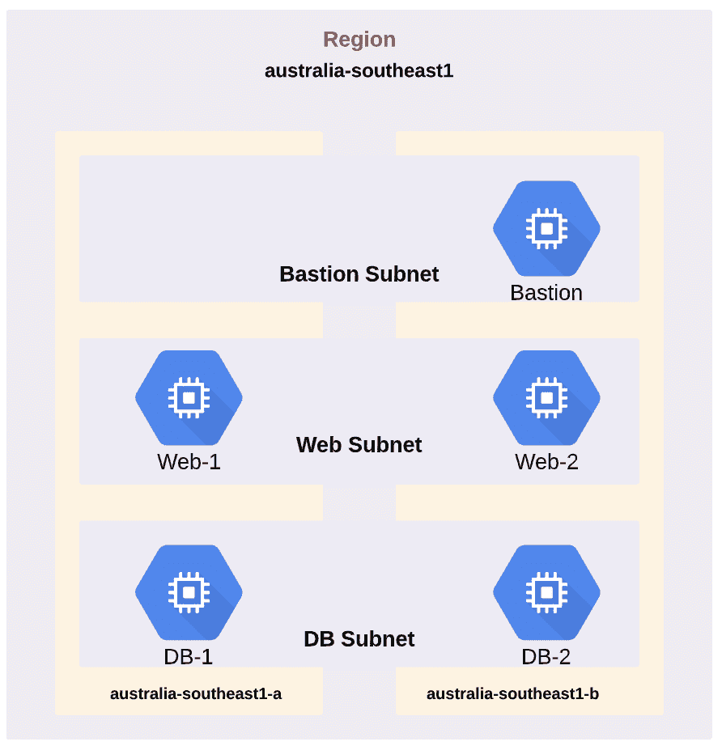

本章将涵盖以下食谱:

*   安装 GCP 软件开发工具包
*   建立 Ansible 库存
*   验证您的 GCP 帐户
*   创建 GCP·VPC 网络
*   创建子网
*   在 GCP 部署防火墙规则
*   在 GCP 部署虚拟机
*   调整 VPC 内的路由
*   使用 Ansible 验证 GCP 部署
*   使用 Ansible 使 GCP 资源退役

# 技术要求

为了开始与 GCP 合作，我们需要创建一个帐户。您可以在[https://cloud.google.com/free/](https://cloud.google.com/free/)设置一个免费的 GCP 账户。

本章使用的 GitHub 代码可以在[https://GitHub . com/packt publishing/Network-Automation-cook book/tree/master/ch9 _ GCP](https://github.com/PacktPublishing/Network-Automation-Cookbook/tree/master/ch9_gcp)找到。

以下是本章所基于的软件版本:

*   CentOS 7
*   Ansible 2.9
*   Python 3.6.8

查看以下视频，了解《行动守则》:
[https://bit.ly/3erVlSN](https://bit.ly/3erVlSN)

# 安装 GCP 软件开发工具包

在本食谱中，我们将概述如何安装开始使用 Ansible 与 GCP 编排系统交互所需的 Python 库。该步骤是强制性的，因为必须在 Ansible 控制机器上安装所需的 Python 库，以便所有 Ansible GCP 模块都可以工作。

# 准备好

为了安装 GCP Python 库，您需要在机器上拥有`sudo`访问权限。您还需要安装 Python 和 Python pip 包，我们将使用它们来安装 GCP 包。

# 怎么做...

1.  按照如下代码所示安装`requests`包:

```
$ sudo pip3 install requests
```

2.  安装谷歌认证包，如以下代码所示:

```
$ sudo pip3 install google-auth
```

3.  创建一个名为`ch9_gcp`的新文件夹来存放本章的所有代码:

```
$ mkdir ch9_gcp
```

# 它是如何工作的...

Ansible 的默认安装不包括执行 GCP 云模块所需的所有 Python 模块。在这个配方中，我们安装了两个所有 GCP 模块都需要的 Python 包。第一个包是`requests`包，主要用于调用 REST API 调用 Google 编排系统，另一个包是`google-auth`包，针对 API 进行认证。

# 请参见...

关于如何开始使用 Ansible 与 GCP 互动的更多信息，请参考[https://docs . ansi ble . com/ansi ble/latest/scenario _ guides/guide _ GCE . html](https://docs.ansible.com/ansible/latest/scenario_guides/guide_gce.html)。

# 建立 Ansible 库存

在本食谱中，我们将概述如何构建 Ansible 清单，以描述我们将在 GCP 公共云中构建的网络基础架构设置。这是我们需要采取的强制性步骤，以便定义我们将在其中部署基础架构的所有地区的所有 VPC 网络。

# 怎么做...

1.  使用以下数据在`ch9_gcp`目录中创建`hosts`文件:

```
$ cat hosts

[gcp_vpc]
demo_gcp_vpc
```

2.  创建包含以下内容的`ansible.cfg`文件:

```
$ cat ansible.cfg

[defaults]
inventory=hosts
retry_files_enabled=False
gathering=explicit
host_key_checking=False
action_warnings=False
```

3.  创建`group_vars`文件夹和`gcp_vpc.yml`，它将包含定义我们在 VPC 的基础设施的所有变量:

```
$ mkdir -p group_var/gcp_vpc.yml
```

4.  在我们的主文件夹(`ch9_gcp`)中创建`roles`目录。该文件夹将包括我们将用于创建 GCP 基础架构的所有角色:

```
$ mkdir -p roles
```

# 它是如何工作的...

我们创建了`hosts` Ansible 库存文件，并声明了我们将在 GCP 云中调配的所有 VPC。我们的示例设置中只有一个 VPC，因此我们创建了一个名为`gcp_vpc`的组，其中包括我们的 VPC ( `demo_gcp_vpc`)。

我们创建了`group_vars/gcp_vpc.yml`文件，它将包含所有变量，我们将声明这些变量来定义我们在这个 VPC 的基础设施。

此时，我们的目录布局如下:

```
$ tree ch9_gcp
 .
 ├── ansible.cfg
 ├── group_vars
 │ └── gcp_vpc.yml
 ├── hosts
 └── roles
```

# 验证您的 GCP 帐户

在本食谱中，我们将概述如何创建所需的凭据，以编程方式从 Ansible 向我们的 GCP 帐户进行身份验证。这是您需要采取的强制步骤，以便能够运行以下食谱中的任何 Ansible 模块。

# 准备好

Ansible 控制器必须能够访问互联网。此外，执行这些步骤的用户必须具有对 GCP 控制台的管理访问权限，以便创建所需的资源来实现与 GCP API 的编程交互。

# 怎么做...

1.  使用管理帐户登录 GCP 控制台。
2.  从主控制台中，选择 IAM & admin |管理资源。在 GCP 境内创建一个新项目，容纳我们将在 GCP 建设的所有基础设施:

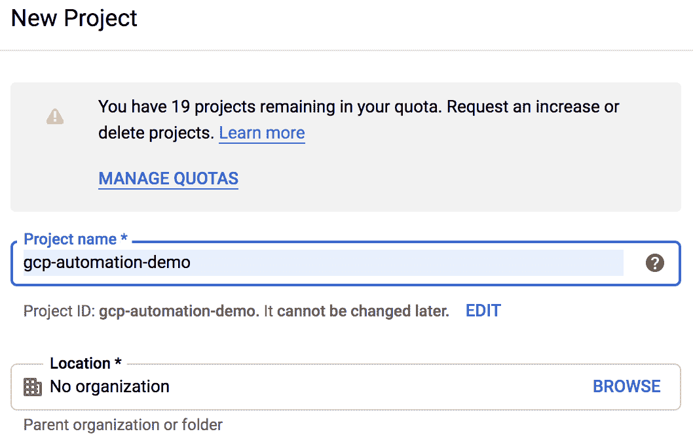

3.  从主控制台，转到 IAM & admin |服务帐户:

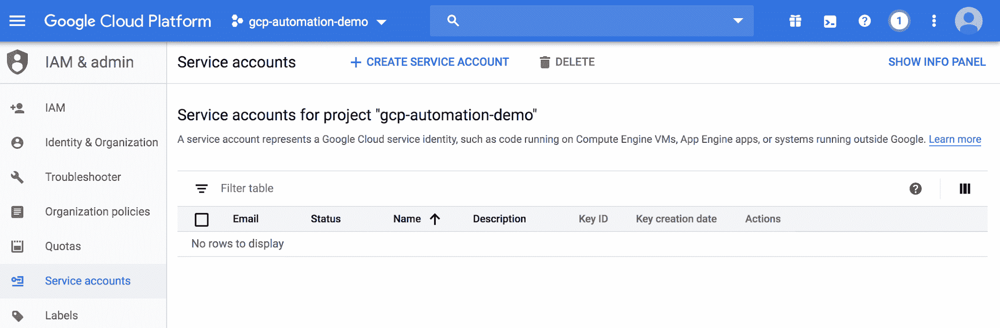

4.  为新用户创建新服务帐户:

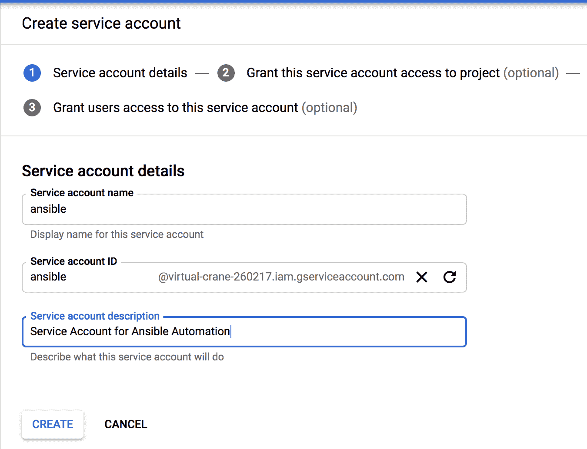

5.  为该新服务帐户分配适当的角色，以便您可以创建/编辑/删除该 GCP 项目中的资源:

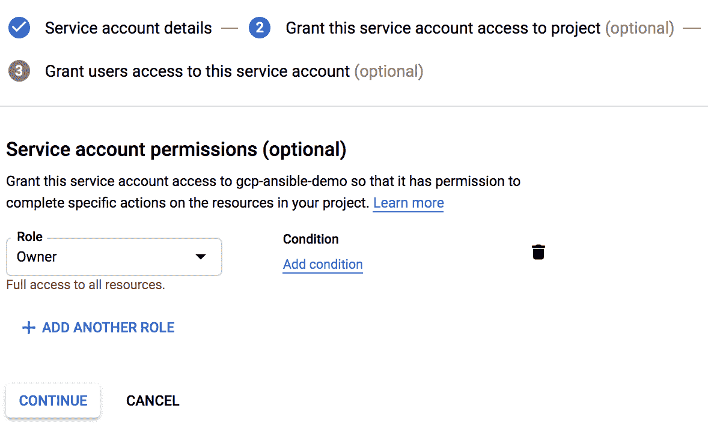

6.  创建并下载将用于验证此用户身份的私钥:

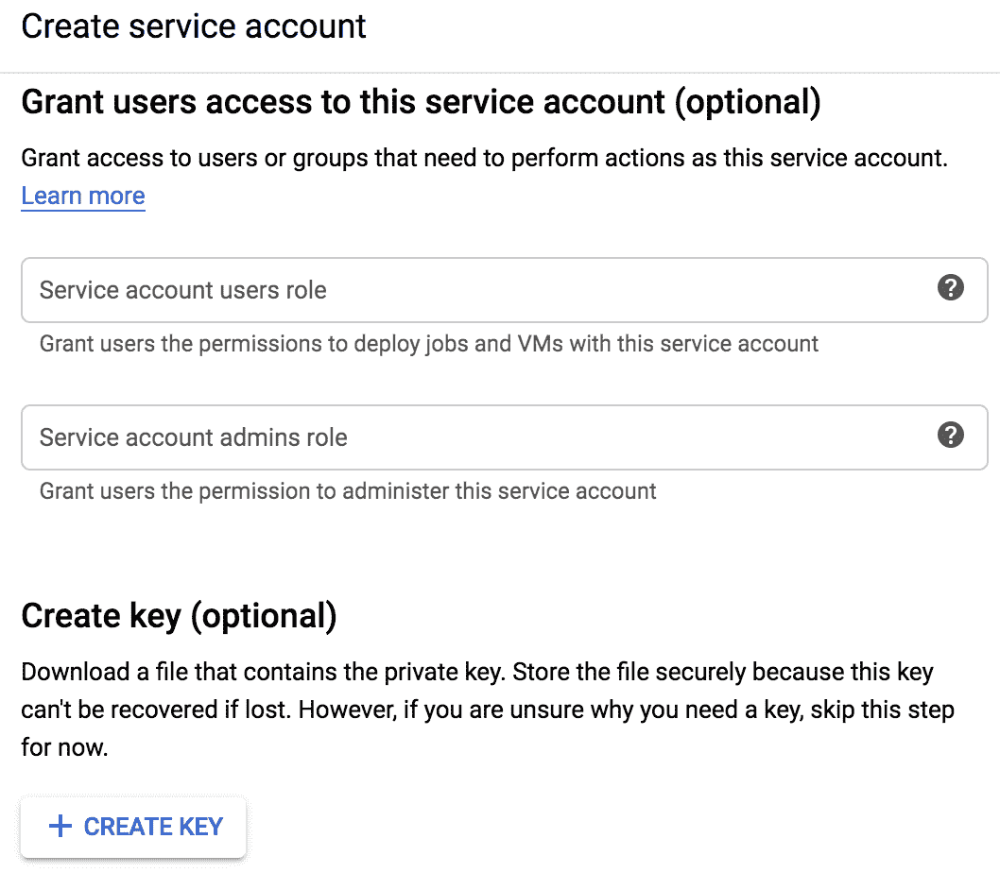

7.  将下载的 JSON 密钥文件复制到项目目录`ch9_gcp`中，重命名为`gcp_ansible_secret.json`。
8.  在 GCP 控制台上，选择应用编程接口和服务，并为当前项目启用谷歌计算引擎应用编程接口:

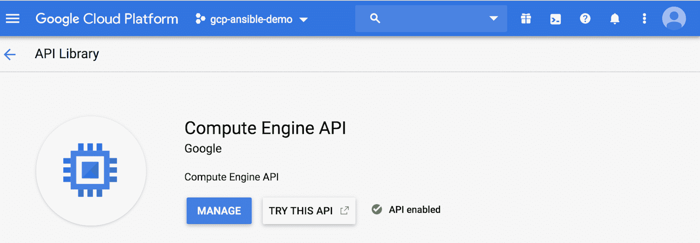

# 它是如何工作的...

为了能够以编程方式访问 GCP API(这是 Ansible 与 GCP 云通信以调配资源的方式)，我们需要在 GCP 项目中创建一个名为服务帐户的特殊帐户。这个服务帐户类似于一个用户，但是只有 API 访问 GCP 项目。我们创建了这个服务帐户，并将其称为 Ansible，我们为其提供了项目所有者角色，以便拥有在 GCP 项目中创建资源的完全权限(在生产中，应该为这个服务帐户分配一个更具限制性的角色)。

为了使用该服务帐户向 GCP API 进行身份验证，GCP 向我们提供了一个 JSON 文件，其中包含该帐户的标识信息。该 JSON 文件中包含的主要参数如下:

*   此服务帐户的专用 SSH 密钥
*   此帐户的类型
*   `Project_id`
*   `Client_id`
*   `client_email`

我们保存这个 JSON 文件并将其复制到我们的目录中，因为我们将在所有行动手册中引用它，以便在 GCP 云上提供资源。最后一步是在我们的 GCP 项目中启用 API 我们需要启用 GCP 计算引擎 API，以便开始与该 API 交互，因为默认情况下，在 GCP 项目中禁用了 API 访问。

# 还有更多...

保存所有身份信息以再次验证 GCP 应用编程接口的 JSON 文件是一个应该受到保护的关键文件，因此我们将使用 Ansible vault 来保护该文件。

我们创建了一个名为`vault_pass`的新文件，它保存了我们的 Ansible 保管库密码，我们更新了我们的`ansible.cfg`文件以指向它，如以下代码所示:

```
$ cat ansible.cfg

[defaults]
 vault_password_file=vault_pass
```

我们使用 Ansible vault 加密 JSON 文件，如以下代码所示:

```
$ ansible-vault encrypt gcp-ansible-secret.json
```

在这个阶段，我们的 JSON 文件是安全的，它的所有内容都使用`vault_pass`文件中声明的密码进行加密。

# 请参见...

有关如何在 GCP 创建新服务帐户的更多信息，请访问[https://cloud . Google . com/iam/docs/creating-management-service-accounts](https://cloud.google.com/iam/docs/creating-managing-service-accounts)。

# 创建 GCP·VPC 网络

在 GCP，虚拟专用网是主要的网络结构，用于将我们所有的资源分组。我们可以将它们视为云中的虚拟数据中心。我们需要定义我们的虚拟专用网络，以便为云环境托管我们的应用做好准备。在本食谱中，我们将概述如何定义和提供 GCP 的 VPC。

# 准备好

Ansible 控制机器必须连接到互联网，并且能够到达 GCP 公共 API 端点，并且 GCP 帐户应该按照前面的方法进行配置。

# 怎么做...

1.  创建一个名为`gcp_account_info.yml`的新 YAML 文件，并为我们的 GCP 登录参数包含以下数据:

```
$ cat gcp_account_info.yml
 ---
 service_account_file: gcp_credentials.json
 project: "gcp-ansible-demo"
 auth_kind: serviceaccount
```

2.  创建一个名为`gcp_net_build`的新 Ansible 角色，如下代码所示:

```
$ cd roles
$ ansible-galaxy init gcp_net_build
```

3.  使用以下任务更新`gcp_net_build/tasks/main.yml`文件以创建我们的 VPC:

```
- name: Create a New GCP VPC
 gcp_compute_network:
 name: "{{ vpc_name | regex_replace('_','-') }}"
 routing_config:
 routing_mode: "REGIONAL"
 auto_create_subnetworks: no
 state: present
 auth_kind: "{{ auth_kind }}"
 project: "{{ project }}"
 service_account_file: "{{ service_account_file }}"
 register: gcp_vpc
 tags: gcp_vpc
```

4.  创建`group_vars`文件夹，并使用 VPC 的以下数据创建`gcp_vpc.yml`文件:

```
$ cat group_vars/gcp_vpc.yml
 ---
 vpc_name: ansible-demo-vpc
```

5.  使用以下任务创建`pb_gcp_env_build.yml`剧本，以读取保险库加密的 JSON 文件:

```
---
- name: Build GCP Environment
 hosts: all
 connection: local
 gather_facts: no
 force_handlers: true
 vars_files:
 - gcp_account_info.yml
 tasks:
 - name: Read the Vault Encrypted JSON File
 copy:
 content: "{{ lookup('file','gcp-ansible-secret.json') }}"
 dest: "{{ service_account_file }}"
 notify: Clean tmp Decrypted Files
 tags: always
```

6.  使用以下任务更新`pb_gcp_env_build.yml`行动手册，以创建所需的虚拟专用网络:

```
 - name: Build GCP Network
 import_role:
 name: gcp_net_build
 tags: gcp_net_build
```

7.  使用以下处理程序更新行动手册，以删除临时 JSON 凭据文件，如以下代码所示:

```
 handlers:
 - name: Clean tmp Decrypted Files
 file:
 path: "{{ service_account_file }}"
 state: absent
```

# 它是如何工作的...

在这个配方中，我们在之前创建的项目中创建并部署了 GCP·VPC。我们使用了 Ansible 角色来构建 GCP 网络的所有组件，第一个任务是使用 Ansible 模块`gcp_compute_network`创建 VPC。

为了使用任何 Ansible GCP 模块，我们需要验证每个模块触发的每个 API 调用，并且我们需要提供以下信息来验证 API 调用:

*   `Auth_kind`:认证的类型——在我们的例子中为`serviceaccount`。
*   `Project`:这是我们创建的当前项目的项目名称。
*   `Service_account_file`:这是我们创建服务账号时下载的 JSON 文件。

由于我们使用 Ansible vault 来加密保存所有身份验证信息的 JSON 文件的所有内容，因此我们需要在播放手册执行期间解密该文件，以便使用该文件中的数据。此外，由于我们不是直接读取这个 JSON 文件的内容，而是在我们所有的 GCP Ansible 模块中使用`serivce_account_file`参数指向它，所以我们创建了一个任务来使用`lookup`模块读取这个 JSON 文件的内容，并将这些数据存储在一个临时文件中。通过这种方法，我们可以读取这个 JSON 文件中的加密数据，并用明文数据创建一个新的临时 JSON 文件。我们也可以使用这个临时的 JSON 文件作为`service_account_file`的输入。我们使用了一个处理器任务，以便在游戏结束时删除这个临时文件。在游戏层面，我们使用`force_handlers`来确保处理程序部分中所有任务的运行，即使我们游戏中的任何任务失败。这意味着我们确信保存我们凭证的明文 JSON 文件总是被删除。

我们将前面的所有参数分组并放入`gcp_account_info.yml`文件中，并将该文件包含在我们的行动手册中。我们使用`gcp_compute_network`模块创建了 VPC，并提供了以下信息来部署 VPC:

*   `Name`:我们新 VPC 的名字。
*   `Auto_create_subnetwork`:设置为`no`，因为我们要创建自定义的 VPC 网络，而不是自动模式的 VPC 网络。
*   `Routing_config`:设置为`Regional`，以停止不同区域子网之间的路由传播。

我们需要强调的一点是，GCP 境内的虚拟社区具有全球范围，这意味着它们不局限于某个特定区域，而是跨越 GCP 云中的所有区域。另一方面，子网是特定于区域的；但是，由于我们创建了一个定制的 VPC，默认情况下在任何地区都不会创建子网，我们完全可以控制在哪里定义子网。当我们将其与 AWS 和 GCP 的 VPC 范围进行比较时，这种逻辑是不同的。

When creating the VPC using the `gcp_compute_network` module, we must supply the VPC name. In this task, we used the `regex_replace` Ansible filter in order to make sure that the VPC name doesn’t contain the underscore character (`_`), since it is not a valid character in the VPC name. We use this filter to replace any occurrence of the underscore with the dash (`-`) in order to make sure that the VPC name is compliant with GCP VPC naming standards.

一旦我们用这个单一的任务运行我们的剧本，我们可以看到 VPC 被创建，正如在 GCP 控制台上看到的:


下面的代码片段概述了创建 VPC 后 Ansible 模块返回的参数:

```
ok: [demo_gcp_vpc] => {
 "gcp_vpc": {
 "autoCreateSubnetworks": false,
 "changed": true,
 "creationTimestamp": "2019-11-26T12:49:51.130-08:00",
 "failed": false,
 "id": "8661055357091590400",
 "kind": "compute#network",
 "name": "demo-gcp-vpc",
 "routingConfig": {
 "routingMode": "REGIONAL"
 },
 "selfLink": "https://www.googleapis.com/compute/v1/projects/gcp-ansible-demo/global/networks/demo-gcp-vpc"
 }
} 
```

这个信息很重要，我们将在后续的食谱中使用它来创建子网，这样我们就可以在`gcp_vpc`变量中注册这个任务的输出，以便能够在以后的任务中引用它。

# 还有更多...

默认情况下，当我们在 GCP 创建一个新项目时，会为这个名为`default`的项目创建一个自动模式的 VPC。建议我们删除此默认网络，因为我们将依赖自定义 VPC 来容纳所有计算工作负载。

在我们的项目中，我们可以看到这个默认的 VPC 是存在的，它在 GCP 云的每个区域都有子网，如下图所示:

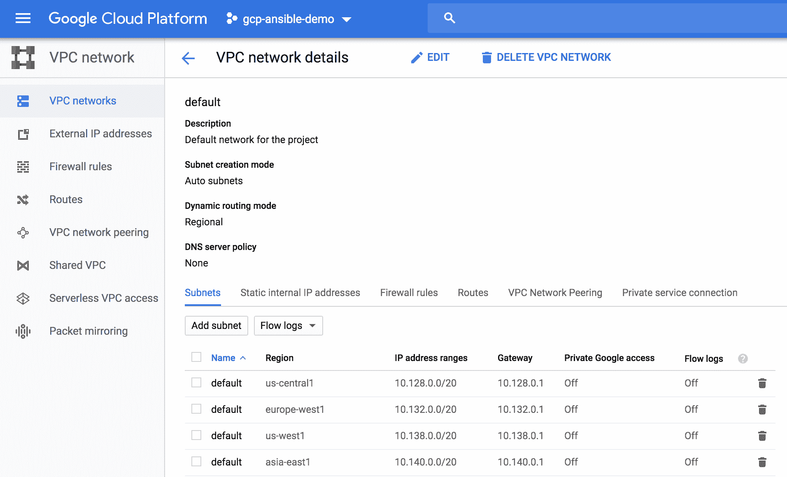

我创建了一个名为`pb_gcp_delete_default_vpc.yml`的剧本来删除这个默认的 VPC 和所有附加到它的默认防火墙规则。

# 请参见...

有关 Ansible 中的 GCP 虚拟私有云模块以及该模块支持的所有其他参数的更多信息，请访问[https://docs . ansi ble . com/ansi ble/latest/modules/GCP _ compute _ network _ module . html # GCP-compute-network-module](https://docs.ansible.com/ansible/latest/modules/gcp_compute_network_module.html#gcp-compute-network-module)。

# 创建子网

我们使用子网隔离我们的 GCP 虚拟专用网络，这是允许我们将计算工作负载放入特定区域的工具。此外，子网为我们提供了工具，将我们的虚拟网络分隔成我们可以控制的不同路由和安全域，以便在每个子网内提供不同的路由和安全行为。在本食谱中，我们将概述如何在 GCP 云中定义和配置子网。

# 准备好

Ansible 控制机器必须连接到互联网，能够到达 GCP 公共 API 端点，并且 GCP 帐户应按照前面的方法进行配置。此外，GCP VPC 需要按照前面的配方进行制作。

# 怎么做...

1.  用子网数据更新`group_vars/gcp_vpc.yml`文件，如下代码所示:

```
$ cat group_vars/gcp_vpc.yml

subnets:
 - name: anz-web
 cidr: 10.1.1.0/24
 region: australia-southeast1

 - name: anz-db
 cidr: 10.1.2.0/24
 region: australia-southeast1

 - name: anz-bastion
 cidr: 10.1.3.0/24
 region: australia-southeast1
```

2.  使用以下任务更新`gcp_net_build/tasks/main.yml`文件以创建我们的子网:

```
- name: Create Subnets
 gcp_compute_subnetwork:
 name: "{{ subnet.name }}"
 ip_cidr_range: "{{ subnet.cidr }}"
 network: "{{ gcp_vpc}}"
 region: "{{ subnet.region }}"
 state: present
 auth_kind: "{{ auth_kind }}"
 project: "{{ project }}"
 service_account_file: "{{ service_account_file }}"
 loop: "{{ subnets }}"
 loop_control:
 loop_var: subnet
 register: gcp_subnets
```

# 它是如何工作的...

在本食谱中，我们创建了将在部署中使用的子网。在子网定义中首先要注意的是，我们为每个子网定义了一个区域。这是强制性的，因为正如我们所讨论的，与具有全球范围的虚拟专用网络相比，GCP 的子网具有区域范围。我们为每个子网定义了 CIDR 范围及其名称。

我们使用`gcp_compute_subnet`模块来创建所有子网。我们使用了之前讨论过的相同参数进行身份验证。为了创建子网，我们指定了以下参数:

*   `Name`:我们子网的名称。
*   `Region`:将部署该子网的区域。
*   `Ip_cidr_range`:这个子网的 CIDR 区块。
*   `Network`:我们希望这个子网成为 VPC 的一部分。我们从创建 VPC 的输出中得到这个参数。我们提供`gcp_vpc`变量，这是我们的 VPC 创建任务中注册的变量。

运行行动手册后，我们可以看到所有子网都已创建，如下图所示:

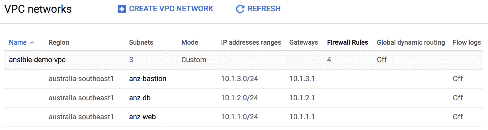

# 请参见...

有关 Ansible 中 GCP 子网模块以及该模块支持的所有其他参数的更多信息，请访问[https://docs . ansi ble . com/ansi ble/latest/modules/GCP _ compute _ subnet _ module . html](https://docs.ansible.com/ansible/latest/modules/gcp_compute_subnetwork_module.html)。

# 在 GCP 部署防火墙规则

为了在 GCP 云的客户环境中加强安全性，GCP 提供了许多工具。防火墙规则是 GCP 支持的最基本的安全工具之一，目的是为 VPC 的所有工作负载实施第一级防御。在本食谱中，我们将概述如何在 GCP 云上定义和设置防火墙规则。

# 准备好

Ansible 控制机器必须连接到互联网，并且能够到达 GCP 公共 API 端点，并且 GCP 帐户应该按照前面的方法进行配置。此外，VPC 和子网应该按照前面的方法进行配置。

# 怎么做...

1.  使用以下防火墙规则更新`group_vars/gcp_vpc.yml`，以保护 web 层和数据库层之间的流量。

```
$ cat group_vars/gcp_vpc.yml

fw_rules:
 - name: allow_sql_from_anz-web_to_anz-db
 type: allow
 direction: ingress
 priority: 10
 apply_to: anz-db
 src_tag: anz-web
 dest_tag:
 protocol: tcp
 port: 3389
 state: present
```

2.  使用以下防火墙规则更新`group_vars/gcp_vpc.yml`，以保护流向 web 层的流量:

```
 - name: allow_internet_to-anz-web
 type: allow
 direction: ingress
 priority: 10
 src: 0.0.0.0/0
 apply_to: anz-web
 protocol: tcp
 port: 80,443
 state: present
```

3.  使用以下防火墙规则更新`group_vars/gcp_vpc.yml`，以允许`ssh`仅访问堡垒主机:

```
 - name: allow_ssh_to_anz-bastion
 type: allow
 direction: ingress
 priority: 10
 src: 0.0.0.0/0
 apply_to: anz-bastion
 protocol: tcp
 port: 22
 state: present

 - name: allow_ssh_from_bastion_only
 type: allow
 direction: ingress
 priority: 10
 src_tag: anz-bastion
 apply_to: anz-web,anz-db
 protocol: tcp
 port: 22
 state: present
```

4.  使用以下任务更新`roles/gcp_net_build/tasks.main.yml`文件，以创建所有所需的防火墙规则:

```
- name: Create Allow Firewall Rules
 gcp_compute_firewall:
 name: "{{ rule.name | regex_replace('_','-') }}"
 network: {selfLink: "{{ gcp_vpc.selfLink }}"}
 priority: "{{ rule.priority | default(omit) }}"
 direction: "{{ rule.direction | upper | mandatory }}"
 allowed:
 - ip_protocol: "{{ rule.protocol }}"
 ports: "{{ (rule.port|string).split(',') }}"
 source_ranges: "{{ rule.src | default(omit) }}"
 source_tags: "{{ omit if rule.src_tag is not defined else rule.src_tag.split(',') }}"
 destination_ranges: "{{ rule.dest | default(omit) }}"
 target_tags: "{{ omit if rule.apply_to is not defined else rule.apply_to.split(',') }}"
 auth_kind: "{{ auth_kind }}"
 project: "{{ project }}"
 service_account_file: "{{ service_account_file }}"
 loop: "{{ fw_rules | selectattr('type','equalto','allow') | list }}"
 loop_control:
 loop_var: rule
 tags: gcp_fw_rules
```

# 它是如何工作的...

GCP 的防火墙规则是适用于 VPC 主机的状态防火墙规则。GCP 的防火墙规则可以应用于入口或出口方向，并且有一些默认的防火墙规则被定义并应用于 VPC 的所有主机，如下所示:

*   在入口方向，对于去往新定制 VPC 内任何主机的所有流量，都有一个默认`deny all`。

*   在出口方向，新的定制 VPC 内来自任何主机的所有流量都有默认的`allow all`。

使用上述默认规则，并且由于所有防火墙规则都是有状态的，因此允许从 VPC 内的任何主机发起到外部世界的任何通信；但是，任何从 VPC 以外发起的流量都将被拒绝。

GCP 防火墙规则可以根据以下标准匹配流量:

*   源/目标 IPv4 范围
*   IP 协议号
*   TCP/UDP 端口号
*   网络标签

除了网络标签，所有上述标准都非常明显。网络标签是特殊的元数据，可应用于 VPC 内的任何主机，以识别和分组这些主机。我们可以使用这些网络标签，以便将它们用作防火墙规则中的匹配标准，并将防火墙规则仅应用于 VPC 内的部分主机。

有了所有这些信息，我们希望在示例网络中的主机上实施以下安全策略:

*   所有的 HTTP/HTTPs 流量应该只允许进入我们所有的网络服务器。
*   从外部进行 SSH 访问应该仅限于我们的堡垒主机。
*   SSH 对我们的网络和数据库服务器的访问仅限于堡垒主机。
*   仅允许从网站到数据库服务器的 SQL 流量。

我们在一个新的数据结构`fw_rules`中定义了我们的防火墙规则，这是一个需要应用于我们的 VPC 的所有规则的列表。我们在所有策略中使用了网络标签，以便将正确的防火墙规则应用于应该实施该规则的主机。

我们使用了 Ansible 模块`gcp_compute_firewall`来迭代所有的防火墙策略并应用它们。在本模块中，我们可以将匹配标准定义为基于源/目标 IPv4 地址范围，或者基于源和目标网络标签。我们定义了我们的任务，因此如果在我们的防火墙规则中没有定义参数(例如，源 IPv4 范围)，我们应该从提供给模块的参数列表中删除该参数。我们使用`omit`滤波器来完成这个逻辑。

GCP 的所有防火墙规则都有优先级字段，该字段定义了规则相对于其他规则的优先级及其在处理方面的优先级。任何没有特定优先级的规则都会获得优先级值 1，000。GCP 应用于 VPC 的默认防火墙规则的优先级值为`65535`，因此我们定义的任何规则都将优先于它们。在我们所有的规则中，我们指定`10`的优先级值。

运行以下任务后，我们可以看到以下规则适用于我们的 VPC，如下图所示:

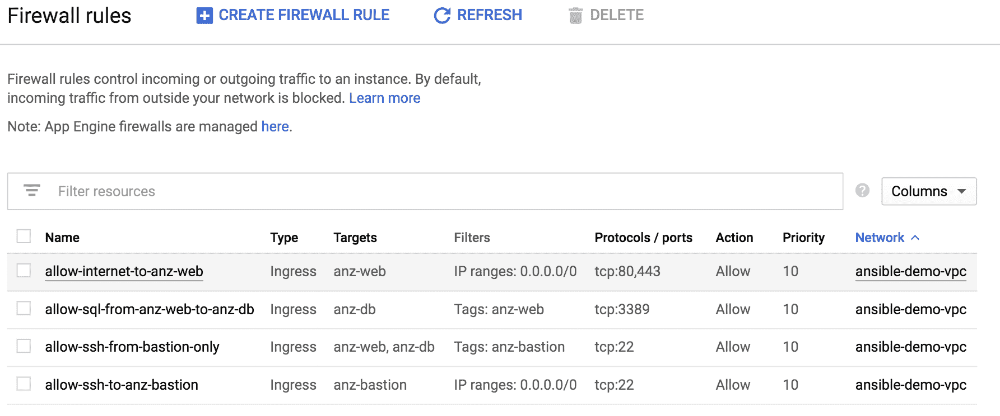

# 请参见...

有关 Ansible 中 GCP 防火墙模块以及该模块支持的所有其他参数的更多信息，请访问[https://docs . ansi ble . com/ansi ble/latest/modules/GCP _ compute _ firewall _ module . html](https://docs.ansible.com/ansible/latest/modules/gcp_compute_firewall_module.html)。

# 在 GCP 部署虚拟机

在本食谱中，我们将概述如何使用我们已经部署的正确子网，在我们的虚拟专用网络中部署 GCP 的虚拟机(使用谷歌计算引擎)。我们还将分配正确的网络标签，以便在这些机器上实施正确的安全策略。

# 准备好

Ansible 控制机器必须连接到互联网，并且能够到达 GCP 公共 API 端点，并且需要按照前面章节中概述的方式部署 VPCs、子网和防火墙规则。

# 怎么做...

1.  更新`group_vars/gcp_vpc.yml`文件，以包含描述我们将在所有虚拟机上使用的风格和操作系统所需的信息:

```
$ cat group_vars/gcp_vpc.yml

compute_node_flavor: f1-micro
compute_node_images: projects/centos-cloud/globimg/family/centos-7
compute_node_image_size: 10
```

2.  更新`group_vars/gcp_vpc.yml`文件，以包含描述我们的计算节点所需的信息:

```
$ cat group_vars/gcp_vpc.yml
compute_nodes:
 - name: web-server-1
 network: anz-web
 has_internet: yes
 zone: australia-southeast1-a

< -- Output Omitted for Brevity -- >

 - name: db-server-1
 network: anz-db
 has_internet: no
 zone: australia-southeast1-a

< -- Output Omitted for Brevity -- >

 - name: bastion-host
 network: anz-bastion
 ip: 10.1.3.253
 has_internet: yes
 ip_forwarding: yes
 zone: australia-southeast1-a
```

3.  创建一个新的可替代角色(`gcp_vm_build`)在 GCP 部署虚拟机工作负载:

```
$ cd roles
$ ansible-galaxy init gcp_vm_build
```

4.  使用以下任务更新`gcp_vm_build/tasks/main.yml`文件，为虚拟机创建磁盘:

```
- name: create a disk for {{ node.name }}
 gcp_compute_disk:
 name: "{{ node.name | regex_replace('_','-') }}-disk"
 size_gb: "{{compute_node_image_size }}"
 source_image: "{{ compute_node_images }}"
 zone: "{{ node.zone }}"
 auth_kind: "{{ auth_kind }}"
 project: "{{ project }}"
 service_account_file: "{{ service_account_file }}"
 state: present
 register: gcp_vm_disk

```

5.  使用以下任务更新`gcp_vm_build/tasks/main.yml`文件，以创建没有公共 IP 地址的虚拟机:

```
- name: create a {{ node.name }} instance with no Internet
 gcp_compute_instance:
 name: "{{ node.name | regex_replace('_','-') }}"
 machine_type: "{{ compute_node_flavor }}"
 disks:
 - source: "{{ gcp_vm_disk }}"
 boot: 'true'
 network_interfaces:
 - network: "{{ gcp_vpc }}"
 subnetwork: "{{ gcp_subnets.results |
 selectattr('name','equalto',node.network) |
 list | first }}"
 metadata:
 tier: "{{ node.name.split('-')[0] }}"
 tags:
 items: "{{ node.network }}"
 zone: "{{ node.zone }}"
 auth_kind: "{{ auth_kind }}"
 project: "{{ project }}"
 service_account_file: "{{ service_account_file }}"
 state: present
 when: not node.has_internet
```

6.  使用以下任务更新`gcp_vm_build/tasks/main.yml`文件，以创建具有公共 IP 地址的虚拟机:

```
- name: create an {{ node.name }} instance with Internet
 gcp_compute_instance:
 name: "{{ node.name | regex_replace('_','-') }}"
 machine_type: f1-micro
 can_ip_forward: "{{ node.ip_forwarding if node.ip_forwarding is defined else 'no' }}"
 disks:
 - source: "{{ gcp_vm_disk }}"
 boot: 'true'
 network_interfaces:
 - network: "{{ gcp_vpc }}"
 network_ip: "{{ node.ip if node.ip is defined else omit }}"
 subnetwork: "{{ gcp_subnets.results |
 selectattr('name','equalto',node.network) |
 list | first }}"
 access_configs:
 - name: External NAT
 type: ONE_TO_ONE_NAT
 metadata:
 tier: "{{ node.name.split('-')[0] }}"
 zone: "{{ node.zone }}"
 tags:
 items: "{{ node.network }}"
 auth_kind: "{{ auth_kind }}"
 project: "{{ project }}"
 service_account_file: "{{ service_account_file }}"
 state: present
 register: vm_data
 when: node.has_internet
```

7.  使用以下任务更新`pb_gcp_env_build.yml`行动手册，以创建我们定义的所有必需虚拟机:

```
 - name: Build VM Instances
 include_role:
 name: gcp_vm_build
 loop: "{{ compute_nodes }}"
 loop_control:
 loop_var: node
```

# 它是如何工作的...

根据我们的示例网络设计，我们将在两个不同的可用性区域部署两个 web 服务器和两个数据库服务器。然后我们将在单个 AZ 中构建一个堡垒主机，因为它仅用于管理。我们在`compute_nodes`变量中定义了所有需要的机器，并且为每台机器指定了以下参数，我们将在供应期间使用这些参数:

*   `Name`:机器的名称
*   `Network`:指定我们将在其中部署该机器的子网，并实施正确的网络标签
*   `Zone`:指定我们要在其中部署该机器的区域
*   `has_internet`:表示这台机器是否应该得到一个公共 IP 地址

我们创建了一个新角色来部署我们的计算工作负载，并定义了以下主要部分:

*   **为虚拟机创建磁盘**:最初的任务是为这些机器创建容纳操作系统的磁盘。我们使用`gcp_compute_disk` Ansible 模块来定义这些磁盘，并指定了以下参数:
    *   `Name`:这是这个盘的名字。
    *   `Image_source`:指定机器将要运行的操作系统——在我们的例子中，我们所有的机器都将运行 CentOS。
    *   `Zone`:指定将在其中创建该磁盘的可用性区域。
    *   `Size_gb`:指定将要部署的磁盘大小。

*   **创建虚拟机**:创建磁盘后，我们使用`gcp_compute_instance`模块创建虚拟机，该模块采用以下参数来调配虚拟机:
    *   `Name`:这个虚拟机的名称。
    *   `Machine_type`:指定我们用于这些机器的实例类型。
    *   `Disks`:一个字典，指定我们将在这台机器上使用的磁盘。我们提供了`gcp_vm_disk`变量，这是我们在上一个任务中调配磁盘时获得的。
    *   `Network_interfaces`:一个字典，指定我们需要在哪个子网和 VPC 部署这个实例。对于 VPC，我们提供`gcp_vpc`变量，这是我们在供应 VPC 时得到的值。
    *   `Zone`:指定我们将在哪个可用性区域部署虚拟机。
    *   `Tags`:指定我们将分配给这些虚拟机的网络标签。这些是我们在防火墙规则中使用的相同标签，以便引用我们的计算节点。

在前面参数的基础上，我们有`access_configs`参数(这是一个字典)，它用于指定计算节点是否将获得公共 IP 地址。如果虚拟机获得一个公共 IP 地址，我们将`access_configs`中的名称参数设置为外部 NAT，类型参数设置为`ONE_TO_ONE_NAT`。如果机器不需要公共 IP 地址，我们省略`access_configs`字典。

在我们的设置中，我们所有的网络服务器和堡垒主机应该获得一个公共的 IP 地址；然而，我们的数据库服务器不应该有直接的互联网连接，因此不应该为它们分配公共 IP 地址。我们使用计算节点定义中的`has_internet`参数对此进行了区分，并使用该参数来选择在虚拟机配置期间要使用的正确任务。

一旦我们使用新角色运行行动手册来创建虚拟机，我们将看到每个虚拟机的所有磁盘都已创建，如下图所示:


此外，所有虚拟机都是在正确的子网中创建的，如下图所示:


使用正确的网络标签创建虚拟机后，我们可以验证我们的防火墙规则仅适用于那些基于分配给这些虚拟机的网络标签的虚拟机。以下片段概述了防火墙规则`allow-internet-to-anz-web`及其如何仅应用于网络服务器:

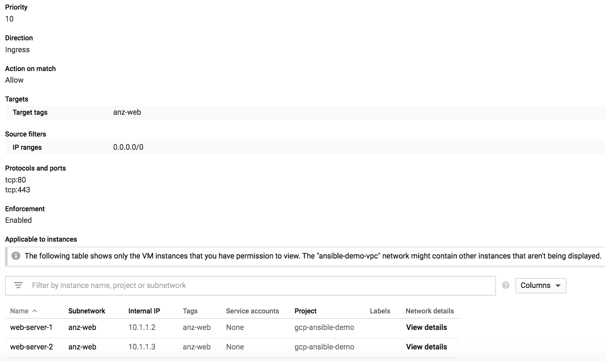

# 请参见...

有关 Ansible 中 GCP 实例和磁盘模块以及这些模块支持的所有其他参数的更多信息，请访问以下链接:

*   [https://docs . ansi ble . com/ansi ble/2.8/modules/GCP _ compute _ instance _ module . html # GCP-compute-instance-module](https://docs.ansible.com/ansible/2.8/modules/gcp_compute_instance_module.html#gcp-compute-instance-module)
*   [https://docs . ansi ble . com/ansi ble/latest/modules/GCP _ compute _ disk _ module . html # GCP-compute-disk-module](https://docs.ansible.com/ansible/latest/modules/gcp_compute_disk_module.html#gcp-compute-disk-module)

# 调整 VPC 内的路由

在本食谱中，我们将概述如何控制 GCP VPC 内的路由，以便为主机实施自定义路由决策。这使我们能够完全控制 VPC 内主机的路由。

# 准备好

Ansible 控制机器必须连接到互联网，能够到达 GCP 公共 API 端点，并且 GCP 帐户应按照前面的方法进行配置。此外，资源组、虚拟网络和子网应按照前面的方法进行配置。

# 怎么做...

1.  更新`group_vars/gcp_vpc.yml`文件以包含所需的路由数据，如下代码所示:

```
$ cat group_vars/gcp_vpc.yml
route_tables:
 - name: db_tier_rt
 subnet: db_tier
 routes:
 - name: Default Route
 prefix: 0.0.0.0/0
 nh: none
```

2.  使用以下任务更新`pb_gcp_env_build.yml`行动手册，以创建 GCP 的路线:

```
- name: Create the Route
 gcp_compute_route:
 name: "{{ route.name }}"
 dest_range: "{{ route.dest}}"
 network: {selfLink: "{{ gcp_vpc.selfLink }}"}
 next_hop_ip: "{{ route.nh }}"
 tags: "{{ route.apply_to.split(',') | default(omit) }}"
 state: present
 auth_kind: "{{ auth_kind }}"
 project: "{{ project }}"
 service_account_file: "{{ service_account_file }}"
 loop: "{{ cutom_routes }}"
 loop_control:
 loop_var: route
 tags: gcp_route
```

# 它是如何工作的..

在我们的示例设置中，使用当前的路由和防火墙规则，我们的数据库服务器没有互联网连接；然而，我们需要有能力从这些服务器访问互联网，以便安装软件或执行补丁。为了实现这个目标，我们将使用我们的堡垒主机作为 NAT 实例，为我们的数据库服务器提供互联网访问。为了实现这一点，我们需要调整 VPC 所有数据库服务器的路由。

在 GCP，我们有一条默认路由指向我们在 VPC 的互联网网关。此默认路由位于 VPC，适用于 VPC 的所有主机。以下是我们 VPC 的路由表:

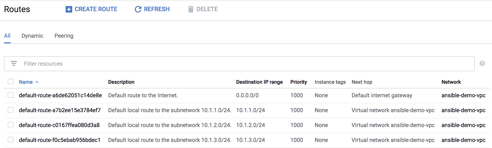

但是，由于防火墙规则到位，并且所有数据库服务器都没有外部公共 IP 地址，数据库服务器将无法访问互联网。我们需要调整数据库服务器的路由，以指向堡垒主机(正在执行 NAT)。我们还需要保留原来的默认路由，因为这是我们的网络和堡垒主机用来访问互联网的主要路径。

我们使用`custom_routes`列表数据结构定义了需要应用的自定义路由，并使用`gcp_compute_route` Ansible 模块循环遍历该数据结构来创建所有需要的路由。我们使用数据库主机上应用的网络标签，以便仅在具有该网络标签的主机上实施此路由。运行这个新任务后，VPC 的更新路由表如下图所示:


我们可以将路由的下一跳设置为 IP 地址或实例标识；但是，为了简单起见，我们使用了 IP 地址，在我们的 VM 定义中，我们为我们的堡垒主机选择了一个静态 IP 地址，以便在我们的路由设置中轻松引用该 IP 地址。

我们在主行动手册中创建了此路由任务，因为我们需要配置堡垒虚拟机，以便设置下一跳为其 IP 地址的路由。如果我们在调配虚拟机之前创建了路由，将会创建路由；但是，该任务将失败，并发出警告，指出我们路由的下一跳 IP 地址不存在。

# 请参见...

有关 Ansible 中 GCP 路由模块以及该模块支持的所有其他参数的更多信息，请访问[https://docs . ansi ble . com/ansi ble/latest/modules/GCP _ compute _ route _ module . html # GCP-compute-route-module](https://docs.ansible.com/ansible/latest/modules/gcp_compute_route_module.html#gcp-compute-route-module)。

# 使用 Ansible 验证 GCP 部署

Ansible 提供了多个模块来收集我们在 GCP 创建的不同资源的运行状态，我们可以使用这些模块来验证我们在 GCP 云中的网络资源的当前状态。这提供了一种用于验证部署的编程方法，而无需通过**图形用户界面** ( **图形用户界面**)登录到门户来检查在 GCP 提供的不同组件的状态。在本食谱中，我们将概述如何使用一些 Ansible 模块来验证我们已经部署的网络子网。

# 准备好

Ansible 控制机器必须连接到能够到达 GCP 公共 API 端点的互联网，并且 GCP 帐户应该按照前面的方法进行配置。

# 怎么做...

1.  创建新的`pb_gcp_net_validate.yml`行动手册，并添加以下任务来收集 VPC 子网信息:

```
$ cat pb_gcp_net_validate.yml

---
- name: Build GCP Environment
 hosts: all
 connection: local
 gather_facts: no
 force_handlers: True
 vars_files:
 - gcp_account_info.yml
 tasks:
 - name: Get Subnet Facts
 gcp_compute_subnetwork_facts:
 region: "{{ subnets | map(attribute='region') | list | first }}"
 auth_kind: "{{ auth_kind }}"
 project: "{{ project }}"
 service_account_file: "{{ service_account_file }}"
 register: gcp_vpc_subnets
```

2.  使用以下任务更新行动手册，以验证在所有部署的子网中配置的 IP 前缀:

```
 - name: Validate all Subnets are Deployed
 assert:
 that:
 - gcp_vpc_subnets['items'] | selectattr('name','equalto',item.name) |
 map(attribute='ipCidrRange') | list | first
 == item.cidr
 loop: "{{ subnets }}"
```

# 它是如何工作的...

我们创建了一个新的行动手册，用于验证我们在 GCP 项目中部署的所有子网。Ansible 提供了多个模块来收集 GCP 不同资源(子网、VPC、虚拟机等)的运行状态或事实。在本例中，我们使用`gcp_compute_subnetwork_facts`模块为我们的部署收集子网事实。我们将该模块返回的所有数据注册在一个新变量`gcp_vpc_subnets`中。最后，我们使用`assert`模块在所有子网定义中循环，以验证在所有这些子网中提供的 IP 前缀是否正确并与我们的设计保持一致。

我们可以使用其他事实收集模块来验证我们部署的其他方面，并使用相同的方法使用多个`assert`语句来确保部署的所有资源都与我们的设计保持一致。

# 请参见...

有关其他 GCP 事实收集模块的更多信息，请访问以下链接:

*   [https://docs . ansi ble . com/ansi ble/2.8/modules/GCP _ compute _ network _ facts _ module . html](https://docs.ansible.com/ansible/2.8/modules/gcp_compute_network_facts_module.html)
*   [https://docs . ansi ble . com/ansi ble/2.8/modules/GCP _ compute _ subnet _ facts _ module . html](https://docs.ansible.com/ansible/2.8/modules/gcp_compute_subnetwork_facts_module.html)

# 使用 Ansible 使 GCP 资源退役

类似于使用自动化大规模创建资源，一旦我们决定不需要这些资源，我们就可以销毁它们。我们使用与在 GCP 创建资源时相同的 Ansible 模块来销毁这些资源。

# 准备好

Ansible 控制机器必须连接到互联网，并且能够到达 GCP 公共 API 端点，并且 GCP 帐户应该按照前面的方法进行配置。

# 怎么做...

1.  创建新的`pb_gcp_env_destroy.yml`行动手册，并添加以下任务来读取保管库加密的 JSON 文件:

```
$ cat pb_gcp_env_destroy.yml

---
- name: Decommission GCP Resources
 hosts: all
 connection: local
 force_handlers: True
 environment:
 GCP_SERVICE_ACCOUNT_FILE: "{{ service_account_file }}"
 GCP_AUTH_KIND: 'serviceaccount'
 vars_files:
 - gcp_account_info.yml
 tasks:
 - name: Read the Vault Encrypted JSON File
 copy:
 content: "{{ lookup('file','gcp-ansible-secret.json') }}"
 dest: "{{ service_account_file }}"
 notify: Clean tmp Decrypted Files
 tags: always
```

2.  更新`pb_gcp_env_destroy.yml`行动手册，增加以下任务收集 VPC 信息:

```
 - name: Get VPC Facts
 gcp_compute_network_facts:
 project: "{{ project }}"
 register: gcp_vpc
```

3.  使用以下任务更新行动手册，以删除所有虚拟机:

```
 - name: Delete Instance {{ node.name }}
 gcp_compute_instance:
 name: "{{ node.name | regex_replace('_','-') }}"
 zone: "{{ node.zone }}"
 project: "{{ project }}"
 state: absent
 loop: "{{ compute_nodes }}"
 loop_control:
 loop_var: node
```

4.  使用以下任务更新行动手册，以删除我们为 VPC 的所有虚拟机创建的所有磁盘:

```
 - name: Delete disks for {{ node.name }}
 gcp_compute_disk:
 name: "{{ node.name | regex_replace('_','-') }}-disk"
 zone: "{{ node.zone }}"
 project: "{{ project }}"
 state: absent
 loop: "{{ compute_nodes }}"
 loop_control:
 loop_var: node
```

5.  使用以下任务更新行动手册，删除我们 VPC 的所有防火墙规则:

```
 - name: Delete All Firewall Rules
 gcp_compute_firewall:
 name: "{{ rule.name | regex_replace('_','-') }}"
 network: "{{ gcp_vpc }}"
 project: "{{ project }}"
 state: absent
 loop: "{{ fw_rules }}"
 loop_control:
 loop_var: rule
 tags: gcp_fw_rules
```

6.  使用以下任务更新行动手册，以删除我们 VPC 内的所有定制路线:

```
- name: Delete all Routes
 gcp_compute_route:
 name: "{{ route.name }}"
 dest_range: "{{ route.dest}}"
 network: "{{ gcp_vpc }}"
 project: "{{ project }}"
 state: absent
 loop: "{{ custom_routes }}"
 loop_control:
 loop_var: route
 when:
 - custom_routes is defined
```

7.  使用以下任务更新行动手册，以删除我们 VPC 内的所有子网:

```
 - name: Delete GCP Subnets
 gcp_compute_subnetwork:
 name: "{{ subnet.name }}"
 ip_cidr_range: "{{ subnet.cidr }}"
 network: "{{ gcp_vpc }}"
 region: "{{ subnet.region }}"
 project: "{{ project }}"
 state: absent
 loop: "{{ subnets }}"
 loop_control:
 loop_var: subnet
```

8.  使用以下任务更新行动手册，以删除所有虚拟专用网络:

```
 - name: Delete GCP VPC
 gcp_compute_network:
 name: "{{ vpc_name | regex_replace('_','-') }}"
 project: "{{ project }}"
 state: absent
```

# 它是如何工作的...

我们创建了一个新的行动手册，我们将使用它来销毁示例网络设计中的所有资源。我们使用了与在 GCP 云上调配资源时相同的模块；但是，我们使用了`state: absent`来删除所有这些资源。

停用资源时，我们唯一需要注意的是删除这些资源的顺序。如果有依赖于我们尝试删除的资源的相关资源仍处于活动状态，则我们无法删除任何资源。例如，如果不首先删除使用某个磁盘的虚拟机，我们就无法删除该磁盘。

运行行动手册后，我们可以看到所有虚拟机都已删除，如下图所示:


此外，我们所有的虚拟专用网络和子网也被删除，如下图所示:

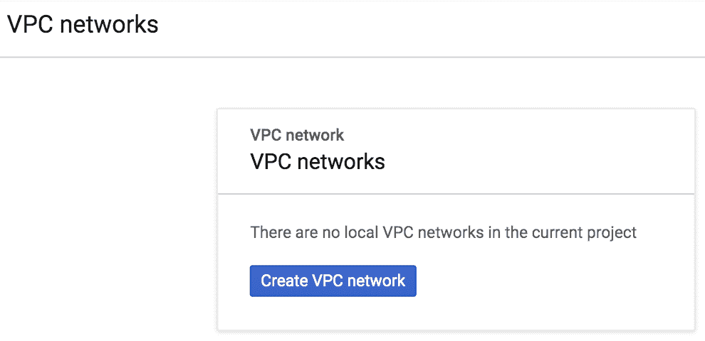

前面的截图显示，当前项目中没有本地 VPC 网络。