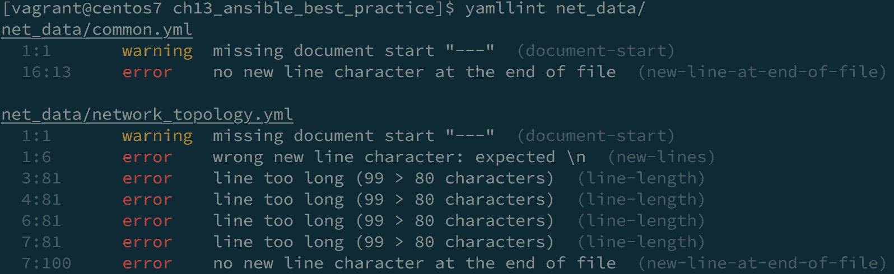
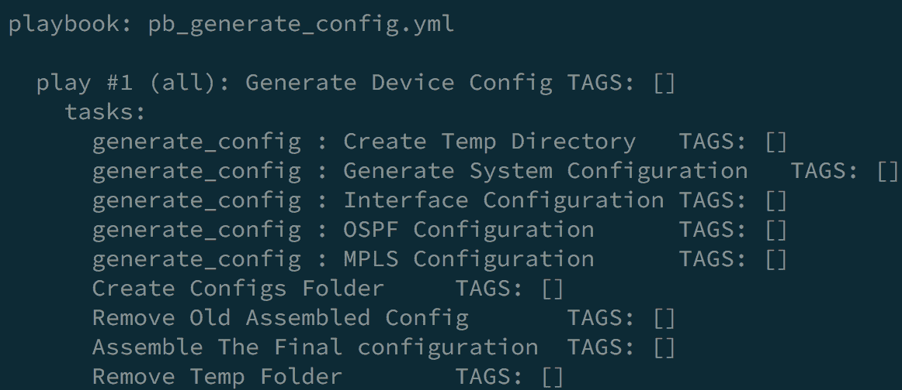
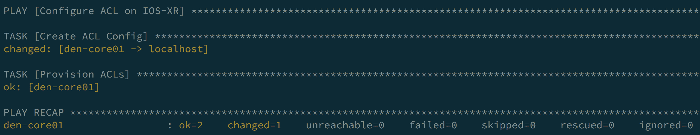
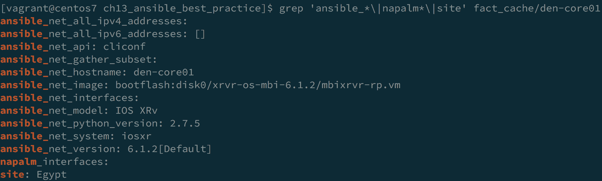
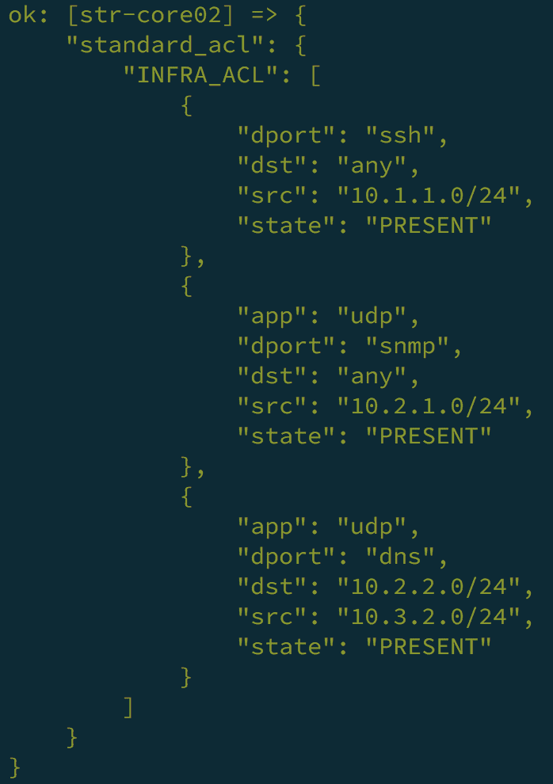
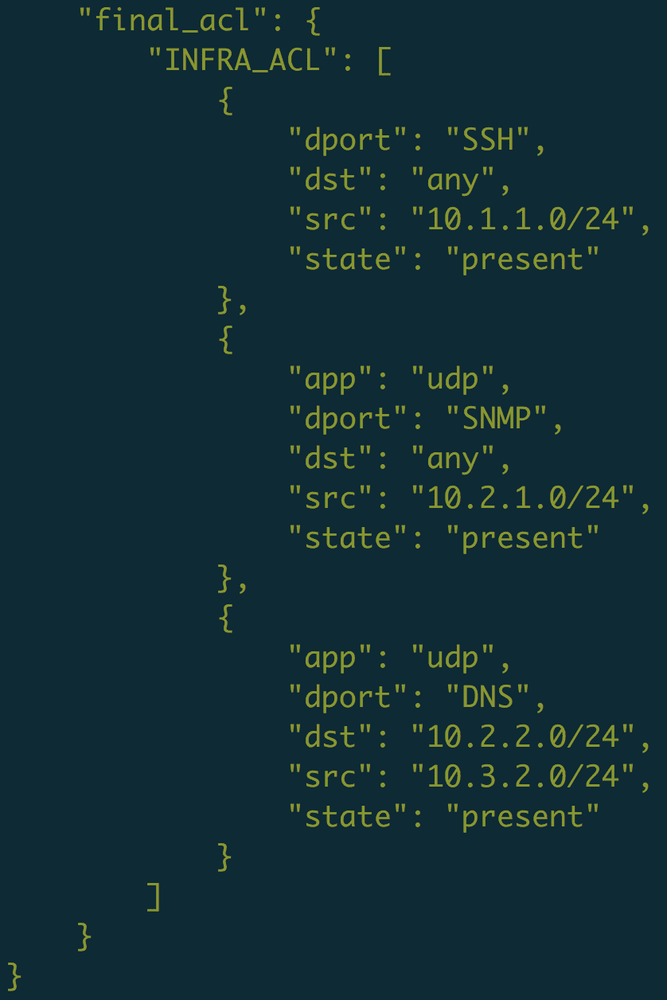

# 十三、Ansible 的先进技术和最佳实践

在本章中，我们将探索一些可以在 Ansible 中使用的高级功能和技术，以及一些最佳实践，以便为网络自动化构建更清晰、更强大的 Ansible 行动手册。所有这些技术都可以与前面章节中的所有代码一起使用。

本章涉及的配方如下:

*   在虚拟环境中安装 Ansible
*   验证 YAML 和 Ansible 行动手册
*   计算 Ansible 行动手册的执行时间
*   使用 Ansible 验证用户输入
*   在`check`模式下运行 Ansible
*   在 Ansible 中控制并行性和滚动更新
*   在 Ansible 中配置事实缓存
*   为 Ansible 创建自定义 Python 过滤器

# 技术要求

我们在本章中描述的所有代码都可以通过这个网址找到:[https://github . com/PacktPublishing/Network-Automation-cook book/tree/master/ch13 _ ansi ble _ best _ practice](https://github.com/PacktPublishing/Network-Automation-Cookbook/tree/master/ch13_ansible_best_practice)。

本章需要以下内容:

*   运行 CentOS 7 的 Ansible 机器
*   Ansible 2.9
*   Python 3.6.8

# 在虚拟环境中安装 Ansible

在本食谱中，我们将概述如何在 Python 虚拟环境中安装 Ansible，以便拥有一个独立且包含的环境来开发和运行我们的行动手册。

# 准备好

Python 3 必须已经安装在您的 Linux 机器上。

# 怎么做...

1.  新建一个名为`dev`的 Python 虚拟环境，激活如下:

```
$ python3 -m venv dev
$ source dev/bin/activate
```

2.  在这个新的虚拟环境中安装 Ansible，如下所示:

```
$ (dev) $ pip3 install ansible==2.9
```

# 它是如何工作的...

如本书第一章所述，我们可以使用以下两种方法之一安装 Ansible:

*   在我们的 Linux 机器上使用包管理器
*   使用 Python 画中画包管理器

在这两个选项中，我们都使用系统级 Python 运行 Ansible。这意味着当我们安装自动化所需的任何其他包或脚本时，例如**亚马逊网络服务** ( **AWS** )或 Azure 包，我们正在系统级别安装/升级这些包。在某些情况下，我们可能会安装一个与系统中现有包冲突的包，这可能会影响其他脚本。Python 虚拟环境主要是为这个用例构建的。虚拟环境提供了一个隔离的运行时环境，在这个环境中，我们安装 Python 包完全独立于系统级包。因此，我们可以以完全隔离和独立的方式运行同一个包的不同版本(例如 Ansible)。

在这个食谱中，我们概述了如何使用`venv` Python 模块创建一个新的 Python 虚拟环境。我们使用带有`-m`选项的`python`命令来调用`venv`模块，这允许我们创建一个新的虚拟环境。我们使用`venv` Python 模块创建一个名为`dev`的新虚拟环境，它将创建`dev`文件夹来存放我们的新虚拟环境。

为了开始使用这个新的虚拟环境，我们需要激活它。我们使用`source`命令运行位于`dev`文件夹(`~/dev/bin/activate`)中的激活脚本。该脚本将激活虚拟环境，并将我们置于这个新创建的环境中。我们可以验证我们当前的 Python 可执行文件位于这个新环境中，并且与系统级 Python 无关，如以下代码片段所示:

```
(dev)$ which python
~/dev/bin/python
 (dev)$ python --version
Python 3.6.8
```

一旦我们进入虚拟环境，我们就使用`python-pip`命令在虚拟环境中安装 Ansible。我们可以验证 Ansible 是否已安装并正在使用我们的新虚拟环境，如以下代码块所示:

```
(dev)$ ansible --version
ansible 2.9
 config file = None
 configured module search path = ['/home/vagrant/.ansible/plugins/modules', '/usr/share/ansible/plugins/modules']
 ansible python module location = /home/vagrant/dev/lib64/python3.6/site-packages/ansible
 *executable location = /home/vagrant/dev/bin/ansible*  python version = 3.6.8 (default, Aug  7 2019, 17:28:10) [GCC 4.8.5 20150623 (Red Hat 4.8.5-39)]
```

在这个阶段，我们已经在这个虚拟环境中安装了 Ansible。但是默认情况下，运行 Ansible 时，会尝试使用位于`/usr/bin/python`的系统级 Python。为了覆盖这种行为并强制 Ansible 使用我们的新虚拟环境，我们需要为所有主机设置一个变量来使用这个新虚拟环境，我们可以在清单文件中这样做，如以下代码片段所示:

```
$ cat hosts
[all:vars]
ansible_python_interpreter=~/dev/bin/python 
```

# 验证 YAML 和 Ansible 行动手册

在本食谱中，我们将概述如何使用`Yamllint`和`ansible-lint`工具验证 YAML 文件和 Ansible 行动手册，以确保我们的 YAML 文档使用正确的语法有效，并验证我们的 Ansible 行动手册。

# 准备好

Python 和 PIP 包管理器必须已经安装在您的 Linux 机器上，并且还必须安装 Ansible。

# 怎么做...

1.  安装`yamllint`，如下代码片段所示:

```
$ sudo pip3 install yamllint
```

2.  安装`ansible-lint`，如下代码片段所示:

```
$ sudo pip3 install ansible-lint
```

3.  更改您的 Ansible 项目的目录，如下所示:

```
$ cd ch13_ansible_best_practice
```

4.  运行`yamllint`，如下代码片段所示:

```
# run yamllint on all files in this folder
$ yamllint
```

5.  运行`ansible-lint`，如下代码片段所示:

```
# run ansible-lint on this specific ansible-playbook
$ ansible-lint pb_build_datamodel.yml
```

# 它是如何工作的...

我们使用 YAML 文档来声明我们的网络拓扑和我们运行行动手册或生成设备配置所需的不同参数。由于我们将定期编辑这些文件以更新网络拓扑和添加新服务，因此在我们在行动手册中导入/使用这些文件之前，我们需要确保对这些文件的所有更改都经过验证，并且这些文件的语法是正确的。验证 YAML 文件最常用的工具之一是`Yamllint`程序，该程序读取 YAML 文档并分析其语法错误和最佳实践格式，输出分析结果。我们使用画中画包管理器安装这个工具。

在我们的示例中，我们有一个典型的 Ansible 项目，其目录结构如下图所示:


我们通过运行`Yamllint`来分析该文件夹中的所有 YAML 文档，如前一节所述。以下截图概述了 Ansible 项目文件夹中`Yamllint`命令的输出:


前面的输出概述了`Yamllint`命令在该文件夹中的所有 YAML 文件中发现的问题，并且提供了关于每个文件中识别的问题的非常清晰的输出。这些问题可以被识别为错误或警告，这将影响`Yamllint`命令的返回代码。

因此，如果文件中的所有问题都被指定为`warning`，返回代码为`0`，这意味着 YAML 文件有效。但是，他们有一些小问题需要解决:

```
# no errors or only warning
$ echo $?
0
```

如果问题被识别为`error`，返回代码不是`0`，这意味着 YAML 文件有一个需要修复的重大问题:

```
# errors are present
$ echo $?
1
```

返回代码至关重要，因为它表示`Yamllint`命令是否成功，这对于构建**持续集成/持续部署** ( **CI/CD** )管道以自动配置基础架构至关重要。管道中的一个步骤是清理所有 YAML 文件，以确保文件是正确的，如果`Yamllint`命令成功，它将有一个返回代码`0`。

`Yamllint`命令捕获 YAML 文档中的所有语法错误。然而，`ansible-lint`特别对`ansible-playbook`代码进行了更全面的检查，并验证剧本符合良好的编码实践。运行它非常有用，因为它可以用来验证行动手册和 Ansible 角色的正确样式，并提示行动手册中的任何问题。

当我们为我们的剧本运行`ansible-lint`命令时，我们可以看到它捕捉到以下错误:


输出非常具有描述性，因为它概述了行动手册中第`7`行的任务没有名称，这不符合 Ansible 最佳实践。命令的返回代码是`2`，这表示命令失败。一旦我们纠正了这个问题，就不会显示错误，返回代码是`0`。

# 还有更多...

可以通过在项目目录结构中包含一个包含需要修改的规则的`yamllint`文件来定制`Yamllint`程序。因此，在我们的示例中，当我们运行`yamllint`命令时，我们可以看到所列出的问题之一是行长度为`> 80`字符，根据`yamllint`遵守的默认规则，这是一个错误:



我们可以修改我们的文件，尝试改变`yamllint`抱怨的行的长度，或者我们可以指定这应该不是问题，应该只触发一个`warning`。我们使用后一种方法，在目录中创建`.yamllint`文件，并添加以下规则:

```
---
extends: default
rules:
 line-length:
 level: warning
```

因此，当我们在我们的文件夹上再次运行`yamllint`命令时，我们可以看到之前所有的行长消息都变成了警告:


对于`ansible-lint`，我们可以使用以下命令检查`ansible-lint`为验证给定剧本或角色而参考的所有当前规则:

```
$ ansible-lint -L
$ ansible-lint -T
```

`-L`选项将输出所有规则和每个规则的简短描述。

`-T`选项将输出`ansible-lint`使用的所有规则/标签。

我们可以运行`ansible-lint`命令来忽略特定的规则/标签，如下面的代码片段所示:

```
$ ansible-lint -x task pb_build_datamodel.yml
```

这会导致`ansible-lint`忽略所有带有`task`标签的规则；这样，我们可以影响`ansible-lint`应用哪些规则来验证我们的行动手册。

# 请参见...

*   更多关于`yamllint`的信息，请使用以下网址:[https://yamllint.readthedocs.io/en/stable/](https://yamllint.readthedocs.io/en/stable/)。
*   关于`yamllint`使用的配置文件以及如何自定义的更多信息，请使用以下网址:[https://yamllint . read the docs . io/en/stable/configuration . html](https://yamllint.readthedocs.io/en/stable/configuration.html)。
*   更多关于`ansible-lint`的信息，请使用以下网址:[https://docs.ansible.com/ansible-lint/](https://docs.ansible.com/ansible-lint/)。

# 计算 Ansible 行动手册的执行时间

在本食谱中，我们将概述如何获得 Ansible 行动手册中的各种任务执行所需的时间。这可以帮助我们了解在行动手册运行过程中，哪个特定任务或角色占用的时间最大，并有助于我们优化行动手册。

# 怎么做...

1.  更新`ansible.cfg`文件，使其包含以下行:

```
[defaults]
 < --- Output Omitted for brevity ---->
callback_whitelist=timer, profile_tasks, profile_roles
```

2.  列出`ansible-playbook`代码中的所有任务，以供参考:

```
$ ansible-playbook pb_generate_config.yml --list-tasks
```

3.  运行 Ansible 行动手册:

```
$ ansible-playbook pb_generate_config.yml
```

# 它是如何工作的...

Ansible 提供了多个回调插件，我们可以使用它们在响应事件时给 Ansible 添加新的行为。最有用的回调插件之一是`timer`插件；它提供了在 Ansible 行动手册中测量任务和角色执行时间的能力。我们可以通过将这些插件列入`ansible.cfg`文件的白名单来启用该功能:

*   `Timer`:这个插件提供了剧本执行时间的总结。
*   `Profile_tasks`:这为我们提供了一份行动手册中每个任务的执行时间总结。
*   `Profile_roles`:这为我们提供了一份行动手册中每个角色花费时间的总结。

我们使用`--list-tasks`选项列出行动手册中的所有任务，以便验证将在我们的行动手册中执行的所有任务。以下是我们示例行动手册中的任务片段:



然后，我们运行行动手册并检查新添加的详细执行摘要，如下图所示:


摘要的第一部分使用`post_task`部分概述了角色(`generate_config`)的执行时间以及不同的模块(我们仅使用`post_task`部分中的`file`和`assemble`模块)。总结的下一部分概述了我们行动手册中每项任务的执行时间(包括角色内任务的细分)。最后，我们在一行中总结了整个行动手册的总体执行时间。

# 请参见...

有关回叫插件、`profile_tasks`和`profile_roles`插件以及`timer`的更多信息，请参考以下网址:

*   [https://docs . ansi ble . com/ansi ble/latest/plugins/callback/timer . html](https://docs.ansible.com/ansible/latest/plugins/callback/timer.html)
*   [https://docs . ansi ble . com/ansi ble/latest/plugins/callback/profile _ tasks . html](https://docs.ansible.com/ansible/latest/plugins/callback/profile_tasks.html)
*   [https://docs . ansi ble . com/ansi ble/latest/plugins/callback/profile _ roles . html](https://docs.ansible.com/ansible/latest/plugins/callback/profile_roles.html)

# 使用 Ansible 验证用户输入

在本食谱中，我们将概述如何使用 Ansible 验证输入数据。我们非常依赖从网络检索或在`host`或`group`变量中声明的信息，以便在 Ansible 中执行不同的任务，例如生成配置或供应设备。在我们开始使用这些信息之前，我们需要能够在进一步处理我们的行动手册之前验证这些数据的结构和有效性。

# 怎么做...

1.  在`ACLs.yml`中创建`ACLs`定义，如下代码块所示:

```
---
ACLs:
 INFRA_ACL:
 - src: 10.1.1.0/24
 dst: any
 dport: ssh
 state: present
 - src: 10.2.1.0/24
 dst: any
 app: udp
 dport: snmp
 state: present
```

2.  在`validate_acl.yml`文件中创建新的验证任务，如下代码块所示:

```
---
- include_vars: ACLs.yml
- name: Validate ACL is Defined
 assert:
 that:
 - ACLs is defined
 - "'INFRA_ACL' in ACLs.keys()"
 - ACLs.INFRA_ACL|length > 0
- name: Validate Rules are Valid
 assert:
 that:
 - item.src is defined
 - item.dst is defined
 - item.src | ipaddr
 loop: "{{ ACLs.INFRA_ACL }}"
```

3.  创建一个新的剧本来创建**访问控制列表** ( **访问控制列表**)和一键式网络设备，如以下代码块所示:

```
---
- name: Configure ACL on IOS-XR
 hosts: all
 tasks:
 - name: Validate Input Data
 import_tasks: validate_acls.yml
 run_once: yes
 delegate_to: localhost
 tags: validate
 - name: Create ACL Config
 template:
 src: acl.j2
 dest: acl_conf.cfg
 delegate_to: localhost
 run_once: yes
 - name: Provision ACLs
 iosxr_config:
 src: acl_conf.cfg
 match: line
```

# 它是如何工作的...

在本示例行动手册中，我们希望将 ACL 配置推向我们的基础架构。我们使用`template`模块生成配置，使用`iosxr_config`模块推送配置。我们所有的 ACL 定义都在`ACLs.yml`文件中声明。我们希望验证包含在`ACLs.yml`文件中的输入数据，因为这是我们生成配置所依赖的数据。

我们创建一个`validate_acl.yml` `tasks`文件，该文件有多个任务来验证我们将用来生成配置的数据的结构和内容。我们首先使用`include_vars`参数导入数据，然后定义两个主要任务来验证数据:

*   第一项任务是验证所需的数据结构是否存在，以及数据结构是否符合我们的预期格式。
*   第二个任务是验证每个防火墙规则的内容。

在所有这些验证任务中，我们使用`assert`模块来测试和验证我们的条件语句，并且我们可以对输入数据结构定义更全面的检查，以覆盖我们数据的所有可能性。

使用这种方法，我们可以验证输入数据的有效性，并确保我们的数据是健全的，以便由行动手册中的后续任务处理。

# 在检查模式下运行 Ansible

在本食谱中，我们将概述如何在试运行模式下运行我们的 Ansible 行动手册。该模式也称为`check`模式，在该模式下，Ansible 不会对远程管理的节点执行任何更改。如果我们在`check`模式下执行剧本，我们可以将此视为剧本的模拟运行，这将使我们了解 Ansible 将进行哪些更改。

# 怎么做...

1.  用新条目更新`ACLs.yml`文件中的 ACL 声明，如以下代码片段所示:

```
---
ACLs:
 INFRA_ACL:
< --- Output Omitted for brevity -- >
 - src: 10.3.2.0/24
 dst: 10.2.2.0/24
 dport: dns
 state: present
```

2.  使用`check`模式运行`pb_push_acl.yml`供应行动手册，如以下代码片段所示:

```
$ ansible-playbook pb_push_acl.yml -l den-core01  --check
```

# 它是如何工作的...

当我们使用`check`模式运行剧本时，远程系统上没有进行任何更改，我们可以看到剧本运行的输出，如下图所示:



该输出概述了我们为 ACL 生成的配置文件将被更改(将添加新规则)；但是，配置 ACLs 任务没有报告任何更改。这是因为自从我们在`check`模式下运行我们的剧本以来，配置文件没有改变，所以在这种情况下，这个任务仍然使用未修改的配置文件，所以不会实现任何改变。

我们还可以在运行剧本时使用`--diff`标志来检查将要发生的变化，如下面的代码片段所示:

```
$ ansible-playbook pb_push_acl.yml -l den-core01  --check --diff
```

当我们使用`--diff`标志时，我们获得了以下输出，它概述了将在我们的配置文件上发生的变化:


# 还有更多...

我们可以使用`check`模式作为运行或跳过任务的开关。因此，在某些情况下，当我们在`check`模式下运行时，我们不希望连接到设备并在设备上推送任何配置，因为什么都不会改变。使用`check`模式，我们可以构建我们的行动手册来跳过这些任务，如以下代码块所示:

```
- name: Configure ACL on IOS-XR
 hosts: all
 serial: 1
 tags: deploy
 tasks:
 - name: Backup Config
 iosxr_config:
 backup:
 *when: not ansible_check_mode*    - name: Deploy ACLs
 iosxr_config:
 src: acl_conf.cfg
 match: line
 *when: not ansible_check_mode*
```

在我们的`tasks`中，我们添加了`when`指令，并且我们正在检查`ansible_check_mode`参数的值。当我们在`check`模式下运行我们的剧本时，该参数被设置为`true`。因此，在每个任务上，我们都在检查是否设置了`check`模式，如果设置了，我们将在剧本运行期间跳过这些任务。如果播放手册在正常模式下运行(没有`check`模式)，这些任务将正常执行。

# 请参见...

有关在`check`模式下运行我们的行动手册的更多信息，请参考以下网址:[https://docs . ansi ble . com/ansi ble/latest/user _ guide/playbooks _ check mode . html](https://docs.ansible.com/ansible/latest/user_guide/playbooks_checkmode.html)。

# 在 Ansible 中控制并行性和滚动更新

默认情况下，Ansible 并行运行任务。在这个食谱中，我们将概述如何控制 Ansible 的并行执行，以及如何修改这个默认行为。我们还将探讨滚动更新的概念以及如何在 Ansible 中使用它们。

# 怎么做...

1.  更新`ansible.cfg`文件，控制并行执行，如下代码片段所示:

```
[defaults]
forks=2
```

2.  更新`pb_push_acl.yml`文件，为网络设备上的配置推送设置滚动更新，如以下代码块所示:

```
- name: Configure ACL on IOS-XR
 hosts: all
 serial: 1
  tags: deploy
 tasks:
 - name: Backup Config
 iosxr_config:
 backup:
 - name: Deploy ACLs
 iosxr_config:
 src: acl_conf.cfg
 match: line
```

# 它是如何工作的...

默认情况下，Ansible 通过在行动手册中标识的所有设备上并行执行每个任务来工作。默认情况下，对于每个任务，Ansible 将分叉五个并行线程(称为分叉)，并在清单中的五个节点上并行执行这些线程。一旦这些任务完成，它将以清单中的剩余设备为目标，每五个节点为一批。它对行动手册中执行的每个任务都执行此操作。使用`ansible.cfg`文件中的`forks`关键字，我们可以修改 Ansible 正在使用的默认`fork`值，并控制 Ansible 在每次任务执行期间瞄准的并行节点数量。这可以加快我们剧本的执行；但是，就 Ansible 控制节点上的内存和 CPU 功率而言，它需要更多资源。

当使用大量分叉时，请注意任何`local_action`步骤都可以在您的本地机器上分叉 Python 解释器，因此您可能希望限制`local_action`或`delegated`步骤的数量或在单独的游戏中使用。更多信息，请参见[https://www.ansible.com/blog/ansible-performance-tuning](https://www.ansible.com/blog/ansible-performance-tuning)。

我们可以修改以控制行动手册执行的另一个选项是，默认情况下，Ansible 在行动手册中标识的所有节点上运行每个任务，并且只有在所有节点都完成了上一个任务后，它才会从一个任务跳到另一个任务。我们可能希望在多种情况下修改此行为，例如将配置推送到网络设备或升级网络设备。我们可能希望在每个节点上以串行方式执行剧本——这意味着每个节点(或节点组)都被 Ansible 拾取，剧本在其上执行；一旦该批次完成，将选择另一批次，并再次运行行动手册。这种方法允许我们以滚动的方式部署我们的更改，如果我们的一个节点出现故障，我们可以停止行动手册的执行。使用行动手册中的`serial`关键字控制该配置。它指示 Ansible 以`serial`选项标识的主机数量开始播放，在该批次上执行全部任务，然后翻转并选择另一批次，并在该批次上执行完整的播放手册，以此类推。

# 请参见...

有关 Ansible 分叉和滚动更新的更多信息，请参考以下网址:[https://docs . ansi ble . com/ansi ble/latest/user _ guide/playbooks _ delegate . html](https://docs.ansible.com/ansible/latest/user_guide/playbooks_delegation.html)。

# 在 Ansible 中配置事实缓存

在本食谱中，我们将概述如何在 Ansible 中设置和配置事实缓存。当我们需要从基础架构中收集事实时，这是一项重要功能，可以帮助我们优化和加快行动手册的执行时间。

# 怎么做...

1.  更新`ansible.cfg`文件启用事实缓存，并设置存储缓存所需的文件夹:

```
[defaults]
< --- Output Omitted for brevity -->
fact_caching=yaml
fact_caching_connection=./fact_cache
```

2.  创建新的`pb_get_facts.yml`行动手册，使用不同的方法从网络中收集事实:

```
---
- name: Collect Network Facts
 hosts: all
 tasks:
 - name: Collect Facts Using Built-in Fact Modules
 iosxr_facts:
 gather_subset:
 - interfaces
 - name: Collect Using NAPALM Facts
 napalm_get_facts:
 hostname: "{{ ansible_host }}"
 username: "{{ ansible_user }}"
 password: "{{ ansible_ssh_pass }}"
 dev_os: "{{ ansible_network_os }}"
 filter:
 - interfaces
 - name: Set and Cache Custom Fact
 set_fact:
 site: Egypt
 cacheable: yes
```

3.  在我们的清单中的单个节点上运行新的 Ansible 行动手册:

```
$ ansible-playbook pb_validate_from_cache.yml -l den-core01
```

# 它是如何工作的...

Ansible 是收集基础架构运行状态信息的强大工具，我们可以在生成配置、构建报告以及验证基础架构状态时使用这些信息。在我们的基础架构状态高度稳定的情况下，我们可能不需要在每次行动手册运行期间从我们的设备收集网络事实。在这些情况下，我们可能会选择使用事实缓存来加快行动手册的执行速度。我们从 Ansible 控制节点上的存储位置读取设备的事实(网络状态)，而不是连接到设备并从实时网络中收集信息。

在`ansible.cfg`文件中启用了事实缓存，在这个文件中，我们还设置了将用于存储事实数据的后端类型。有多种选择，从 YAML 或 JSON 文件到将这些数据存储到`redis`或`Memcached`数据库。在我们的示例中，为了简单起见，我们将使用 YAML 文件来存储从设备收集的事实。我们还指定了存储这些信息的文件夹位置。

一旦我们执行了这些步骤，我们就可以运行我们的行动手册来收集网络事实。在本示例行动手册中，我们使用了不同的模块(方法)，如下所示:

*   `iosxr_facts`:这是 Ansible 组网模块内的内置模块，用于从 IOS-XR 设备收集事实(对于大多数组网设备，Ansible 支持的每个厂商都有一个事实收集模块)。
*   `napalm_get_facts`:这是**网络自动化和可编程抽象层的自定义模块，有多厂商支持** ( **NAPALM**)也需要安装收集事实；但是，它不是核心 Ansible 模块的一部分。
*   `set_fact`:我们使用`set_fact`模块在剧本运行期间设置一个自定义事实，并且我们使用`cacheable`选项指示模块将这个新的缓存变量写入我们的缓存。

运行行动手册后，我们可以检查新文件夹是否已创建，库存中每个节点的新 YAML 文件是否存储在此位置。这些模块收集的所有事实都保存在这些 YAML 文件中，如下图所示:



# 还有更多...

一旦我们配置了事实缓存，我们就可以开始在任何其他剧本中使用缓存中声明的 Ansible 变量，如下面的代码示例所示:

```
---
- name: Validate Cache Data
 vars:
 ansible_connection: local
 hosts: all
 tasks:
 - name: Validate all Interfaces
 assert:
 that:
 - item.value.operstatus == 'up'
 with_dict: "{{ ansible_net_interfaces }}"
 - name: Validate Custom Fact
 assert:
 that:
 - site == 'Egypt'
```

在前面的剧本中，我们利用从缓存中收集的变量(在本例中为`ansible_net_interfaces`)，并针对清单中的设备运行任务。我们需要考虑的是，默认情况下，缓存中的条目仅在特定时间内有效，由缓存的超时值控制，以确保缓存中的任何过期状态都不会被考虑。该值由`fact_caching_timeout`选项控制，可在`ansible.cfg`文件中设置。

# 请参见...

有关 Ansible 事实缓存的更多信息，请参考以下网址:

*   [https://docs.ansible.com/ansible/latest/plugins/cache.html](https://docs.ansible.com/ansible/latest/plugins/cache.html)
*   [https://docs . ansi ble . com/ansi ble/latest/plugins/cache/YAML . html](https://docs.ansible.com/ansible/latest/plugins/cache/yaml.html)

# 为 Ansible 创建自定义 Python 过滤器

Ansible 提供了来自 Jinja2 的一组丰富的过滤器，以及一些额外的内置过滤器来操作数据；但是，在某些情况下，您可能会发现没有可用的过滤器来满足您的要求。在本食谱中，我们将概述如何在 Python 中构建自定义过滤器，以扩展 Ansible 功能来操作数据。

# 怎么做...

1.  在项目目录(`ch13_ansible_best_practice`)中，新建一个文件夹，`filter_plugins`。

2.  在`filter_plugins`文件夹下新建一个名为`filter.py`的 Python 脚本，内容如下:

```
class FilterModule(object):
 def filters(self):
 return {
 'acl_state': self.acl_state
 }
 def acl_state(self,acl_def):
 for acl_name, acl_rules in acl_def.items():
 for rule in acl_rules:
 rule['state'] = rule['state'].upper()
 return acl_def
```

3.  创建新的 Ansible 行动手册`pb_test_custom_filter.yml`，内容如下:

```
---
 - name: Test Custom Filter
 hosts: all
 vars:
 ansible_connection: local
 tasks:
 - name: Read ACL data
 include_vars: ACLs.yml
 run_once: yes
 - name: Apply Our Custom Filter
 set_fact:
 standard_acl: "{{ ACLs | acl_state }}"
 run_once: yes
 - name: Display Output After Filter
 debug: var=standard_acl
```

# 它是如何工作的...

我们可以扩展 Ansible 提供的`filter`库，使用 Python 创建自定义过滤器。为了实现我们的自定义过滤器，我们在我们的项目目录下创建了一个名为`filter_plugins`的文件夹，并创建了一个任意名称的 Python 脚本(我们在示例中使用了`filter.py`)。

定制的 Python 过滤器必须放在名为`filter_plugins`的文件夹中，以便 Ansible 拾取这些过滤器并对其进行处理。

在这个 Python 脚本中，我们创建了一个名为`FilterModule`的 Python 类。在这个类中，我们声明了一个名为`filters`的函数，该函数返回我们定义的所有自定义过滤器的字典。然后，我们开始创建过滤器，方法是声明一个名为`acl_state`的函数，该函数接受`acl_def`变量(这是我们在剧本中传递的 ACL 定义)。在这个例子中，我们只是简单地将 ACL 状态的定义改为大写。然后，我们返回新修改的 ACL 定义。

我们像平常一样创建一个 Ansible 剧本，我们从`ACLs.yml`文件中读取我们的 ACL 定义。然后，我们使用`set_fact`模块创建一个新任务来设置一个自定义事实，并将我们的 ACL 的数据结构传递给我们创建的自定义过滤器(`acl_state`)。我们将自定义过滤器的返回值保存到一个名为`standard_acl`的新变量中，并在下一个任务中使用`debug`模块输出这个新变量的值。

下面的代码片段概述了 ACL 的新值，以及 ACL 定义中的状态参数是如何变成大写的:



# 还有更多...

在前面的示例中，我们概述了如何将变量定义传递给我们的自定义过滤器；但是，我们也可以将多个字段传递给我们的自定义过滤器，以便对过滤器的返回值有更多的控制。为了概括这一点，我们将创建另一个自定义筛选器，它将采用 ACL 定义和字段变量，并且基于该字段，我们将把 ACL 定义中该字段的值更改为大写。下面是修改后的`filter.py` Python 脚本:

```
class FilterModule(object):

< -- Output Omitted for brevity -- >
    def custom_acl(self,acl_def,field=None):
 for acl_name, acl_rules in acl_def.items():
 for rule in acl_rules:
 if field and field in rule.keys():
 rule[field] = rule[field].upper()
 return acl_def
 def filters(self):
 return {
 'acl_state': self.acl_state,
 'custom_acl': self.custom_acl
 }
```

以下是使用我们新的自定义过滤器在行动手册中修改任务的输出:

```
 - name: Apply Our Custom Filter
 set_fact:
 standard_acl: "{{ ACLs | acl_state }}"
 final_acl: "{{ ACLs | custom_acl('dports') }}"
 run_once: yes
 - name: Display Output After Filter
 debug: var=final_acl
```

以下是应用新的自定义过滤器后我们的`final_acl`文件的输出:



上面的截图显示了应用新的自定义过滤器后的输出。