# 一、无服务器简介

## 学习目标

本章结束时，您将能够:

*   确定无服务器体系结构的优势
*   在无服务器平台上创建和调用简单函数
*   创建云原生无服务器函数，并使用 Kubernetes 将其打包为容器
*   创建一个 Twitter Bot 后端应用，并将其打包到 Docker 容器中

在本章中，我们将解释无服务器架构，然后创建我们的第一个无服务器函数，并将其打包为一个容器。

## 无服务器简介

云技术目前正处于不断转型的状态，以创建可扩展、可靠和强健的环境。为了创造这样的环境，云技术的每一项改进都旨在提高最终用户体验和开发人员体验。最终用户需要从世界各地都能访问的快速、健壮的应用。同时，开发人员需要一个更好的开发环境来设计、部署和维护他们的应用。在过去十年中，云技术之旅始于云计算，在云计算中，服务器在云数据中心进行调配，应用部署在服务器上。向云数据中心的过渡降低了成本，并消除了对数据中心责任的需求。然而，随着数十亿人接入互联网并要求更多的服务，可扩展性已经成为一种必然。为了扩展应用，开发人员创建了可以相互独立扩展的小型微服务。微服务被打包到容器中，作为软件架构的构建块，以改善开发人员和最终用户的体验。微服务通过提供更好的可维护性来增强开发人员的体验，同时为最终用户提供高扩展性。然而，微服务的灵活性和可扩展性跟不上巨大的用户需求。例如，今天每天有数百万的银行交易发生，数百万的企业对企业的请求被发送到后端系统。

最后，无服务器开始因为创建了*面向未来的*和*特别可扩展的*应用而获得关注。无服务器设计侧重于创建比微服务更小的服务，并且它们被设计为在未来持续更长时间。这些*纳米服务*，或功能，帮助开发人员创建更灵活和更容易维护的应用。另一方面，无服务器设计是特别可扩展的，这意味着如果您采用无服务器设计，您的服务自然会随着用户请求而扩大或缩小。无服务器的这些特点使其成为行业最新的大趋势，现在正在塑造云技术格局。在本节中，将介绍无服务器技术，看看无服务器的发展、起源和用例。

在深入探讨无服务器设计之前，让我们先了解一下云技术的发展。过去，部署应用的预期过程始于硬件(即服务器)的采购和部署。随后，操作系统被安装在服务器上，然后应用包被部署。最后，应用包中的实际代码被执行来实现业务需求。这四个步骤见*图 1.1* :

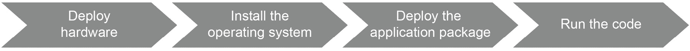

###### 图 1.1:传统软件开发

组织开始将其数据中心运营外包给云提供商，以提高服务器的可扩展性和利用率。例如，如果您正在开发一个在线购物应用，您首先需要购买一些服务器，等待它们的安装，每天操作它们，并处理它们的潜在问题，这些问题是由电力、网络和错误配置引起的。很难预测服务器的使用水平，在服务器上进行巨额投资来运行应用也是不可行的。因此，无论是初创企业还是大型企业都开始将数据中心运营外包给云提供商。这就清除了与第一步硬件部署相关的问题，如图*图 1.2* :


###### 图 1.2:云计算软件开发

随着云计算虚拟化的开始，操作系统被虚拟化，因此多个虚拟机可以在同一台裸机上运行。这一转变取消了第二步，服务提供商提供虚拟机，如*图 1.3* 所示。随着多个虚拟机在同一硬件上运行，运行服务器的成本降低，操作的灵活性增加。换句话说，软件开发人员的低级担忧已经消除，因为硬件和操作系统现在都是别人的问题:


###### 图 1.3:虚拟化软件开发

虚拟机支持在同一硬件上运行多个实例。但是，使用虚拟机需要为每个应用安装完整的操作系统。即使对于基本的前端应用，您也需要安装操作系统，这将导致操作系统管理的开销，从而导致有限的可扩展性。与创建和管理虚拟机相比，应用开发人员和现代应用的高级使用需要更快、更简单、隔离性更好的解决方案。容器化技术通过在同一操作系统上运行“容器化”应用的多个实例来解决这个问题。有了这个抽象层次，与操作系统相关的问题也被移除，容器作为应用包交付，如图*图 1.4* 所示。容器化技术支持微服务体系结构，其中软件被设计为相互交互的小型可扩展服务。

这种架构方法可以运行现代应用，如谷歌驱动程序中的协作电子表格、YouTube 上的体育赛事直播流、Skype 上的视频会议等:


###### 图 1.4:容器化的软件开发

下一个架构现象，无服务器，消除了管理容器的负担，并专注于运行实际代码本身。无服务器架构的本质特征是自组织的可伸缩性。无服务器体系结构中的应用是特别可扩展的，这意味着它们可以在需要时自动扩展或缩减。它们也可以缩小到零，这意味着没有硬件、网络或运营成本。在无服务器应用中，所有低层次的问题都被外包和管理，重点放在最后一步——运行代码—如图*图 1.5* 所示。对于无服务器设计，重点是传统软件开发的最后一步。在下一节中，我们将重点介绍无服务器的起源和宣言，以便进行更深入的介绍:


###### 图 1.5:无服务器软件开发

### 无服务器起源与宣言

**无服务器**是一个令人困惑的术语，因为在会议、书籍和博客中有各种各样的定义。虽然理论上意味着没有任何服务器，但实际上意味着将服务器的责任留给第三方组织。换句话说，这意味着不是摆脱服务器，而是服务器操作。当您运行无服务器时，其他人会处理您的服务器操作的采购、运输和安装。这降低了您的成本，因为您不需要操作服务器甚至数据中心；此外，它让您专注于实现核心业务功能的应用逻辑。

2010 年前后，无服务器的首次使用出现在与持续集成相关的文章中。最初讨论时，无服务器被认为是在云提供商的服务器上构建和打包应用。随着 2014 年**亚马逊网络服务** ( **AWS** ) **Lambda** 的发布，人气急剧上升。此外，2015 年，AWS 推出了用于管理和触发 Lambda 功能的**应用编程接口网关**，因为它是多个功能的单一入口点。因此，无服务器功能在 2014 年获得了牵引力，并在 2015 年通过使用 **AWS API Gateway** 创建无服务器架构应用成为可能。

然而，在 2016 年的 AWS 开发者大会上，对无服务器的最明确、最完整的解释是*无服务器计算宣言*。它由八条严格的规则组成，定义了无服务器架构背后的核心思想:

#### 注意

尽管在 2016 年 AWS 峰会的各种会谈中讨论过它，但无服务器计算宣言没有官方网站或文档。在蒂姆·瓦格纳博士的演讲中可以看到宣言细节的完整列表:https://www . slide share . net/Amazon WebSerVices/入门 aws-lambda 和无服务器云。

*   **作为构建模块的功能**:在无服务器架构中，开发、部署和扩展的构建模块应该是功能。每个功能都应该独立于其他功能进行部署和扩展。
*   **没有服务器、虚拟机或容器**:服务提供商应该为无服务器功能操作所有计算抽象，包括服务器、虚拟机和容器。无服务器架构的用户不需要任何关于底层基础设施的进一步信息。
*   **无存储**:无服务器应用应该设计为短暂的工作负载，每一个请求都有一个全新的环境。如果他们需要保存一些数据，他们应该使用远程服务，如**数据库即服务** ( **数据库管理员**)。
*   **隐式容错功能**:无服务器基础设施和部署的应用都应该是容错的，以便创建一个健壮、可扩展和可靠的应用环境。
*   **请求的可扩展性**:底层基础设施，包括计算和网络资源，应该支持高水平的可扩展性。换句话说，当请求增加时，无服务器环境无法扩展，这不是一个选项。
*   **空闲时间无成本**:无服务器提供商只应该在无服务器工作负载运行时产生成本。如果你的函数长时间没有收到 HTTP 请求，你不应该为闲置支付任何费用。
*   **自带代码** ( **BYOC** ):无服务器架构应该能够运行终端用户开发和打包的任何代码。如果你是一个节点。Js 应该一起出现，或者 Go developer，它应该可以让你在你喜欢的语言中把你的功能部署到无服务器的基础设施中。
*   **工具**:通过函数调用收集的函数和度量的日志应该对开发人员可用。这使得调试和解决与功能相关的问题成为可能。因为它们已经在远程服务器上运行，所以在分析潜在问题方面，检测不应该产生任何进一步的负担。

最初的宣言介绍了一些最佳实践和局限性；然而，随着云技术的发展，无服务器应用的世界也在发展。这种演变将使宣言中的一些规则过时，并将增加新的规则。在下一节中，将讨论无服务器应用的用例，以解释无服务器在行业中是如何被采用的。

### 无服务器用例

无服务器应用和设计似乎是前卫的技术；然而，它们在行业中被高度采用，用于可靠、健壮和可扩展的应用。如果您想要无服务器设计的好处，任何运行在虚拟机、Docker 容器或 Kubernetes 上的传统应用都可以设计为无服务器运行。这里列出了一些众所周知的无服务器体系结构用例:

*   **数据处理**:解释、分析、清理和格式化数据是大数据应用中必不可少的步骤。借助无服务器架构的可扩展性，您可以快速过滤数百万张照片并计算照片中的人数，而无需购买任何昂贵的服务器。根据一份案例报告(https://Azure . Microsoft . com/en-in/blog/a-fast-无服务器-大数据-管道-由单个 azure-function 提供动力/ )显示，使用 Azure Functions 可以创建一个无服务器应用来检测来自多个来源的欺诈性转换。为了处理 800 万个数据处理请求，无服务器平台将是合适的选择，因为它们具有特殊的可扩展性。
*   **Webhooks** : Webhooks 是对第三方服务的 HTTP API 调用，用来传递实时数据。不用为 webhook 后端启动和运行服务器，可以用更低的成本和更少的维护来利用无服务器基础架构。
*   **结账和支付**:可以将购物系统创建为无服务器应用，其中每个核心功能都被设计为独立的组件。例如，您可以将 Stripe API 集成为远程支付服务，并在无服务器后端使用 Shopify 服务进行购物车管理。
*   **实时聊天应用**:例如，集成到 Facebook Messenger、Telegram 或 Slack 中的实时聊天应用非常受欢迎，可用于处理客户操作、分发新闻、跟踪体育比赛结果，或者仅用于娱乐。可以创建短暂的无服务器函数来响应消息或根据消息内容采取行动。无服务器实时聊天的主要优势是，当许多人使用它时，它可以扩展。当没有人使用聊天应用时，它也可以缩放到零并且不花钱。

这些用例说明了无服务器架构可以用来设计任何现代应用。还可以移动单片应用的某些部分，并将其转换为无服务器功能。如果您当前的在线商店是一个打包成 JAR 文件的 Java web 应用，您可以分离它的业务功能，并将它们转换成无服务器组件。将巨型独石分解成小型无服务器功能有助于同时解决多个问题。首先，对于应用的无服务器组件来说，可伸缩性永远不是问题。例如，如果您不能在节假日处理大量支付，无服务器平台将自动根据使用水平扩展支付功能。其次，你不需要把自己局限在独石的编程语言中；你可以用任何编程语言开发你的函数。例如，如果您的数据库客户端用 Node.js 实现得更好，您可以在 Node.js 中对您的网店的数据库操作进行编码

最后，您可以重用在您的整体中实现的逻辑，因为现在它是一个共享的无服务器服务。例如，如果您将网上商店的支付操作分开，并创建无服务器支付功能，您可以在下一个项目中重用这些支付功能。所有这些好处都吸引了初创企业和大型企业采用无服务器架构。在下一节中，将更深入地讨论无服务器架构，特别关注一些实现。

可能的答案:

*   高延迟应用
*   当可观察性和度量对业务至关重要时
*   当供应商锁定和生态系统依赖性成为问题时

## 无服务器架构和功能即服务(FaaS)

**无服务器**是云计算设计，云提供商处理服务器的供应。在前一节中，我们讨论了运营问题是如何分层和移交的。在本节中，我们将重点介绍无服务器架构和使用无服务器架构的应用设计。

在传统的软件架构中，应用的所有组件都安装在服务器上。例如，让我们假设您正在用 Java 开发一个电子商务网站，并且您的产品信息存储在 **MySQL** 中。在这种情况下，前端、后端和数据库安装在同一台服务器上。最终用户需要使用服务器的 IP 地址到达购物网站，因此服务器上应该运行一个应用服务器，如 **Apache Tomcat** 。此外，用户信息和安全组件也包含在安装在服务器上的包中。一个单一的电子商务应用如图 1.6 所示，包括所有四个部分，即前端、后端、安全性和数据库:

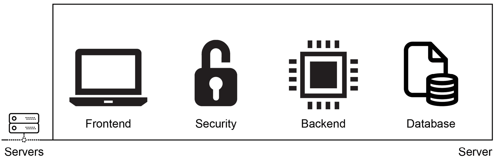

###### 图 1.6:传统软件架构

**微服务**架构专注于创建松散耦合且可独立部署的服务集合。对于同一个电子商务系统，您仍然会有前端、后端、数据库和安全组件，但是它们将是独立的单元。此外，这些组件将被打包为容器，并由容器编排者(如 Kubernetes)管理。这使得能够独立安装和扩展组件，因为它们分布在多个服务器上。在图 1.7 中，相同的四个组件安装在服务器上，并通过 Kubernetes 网络相互通信:

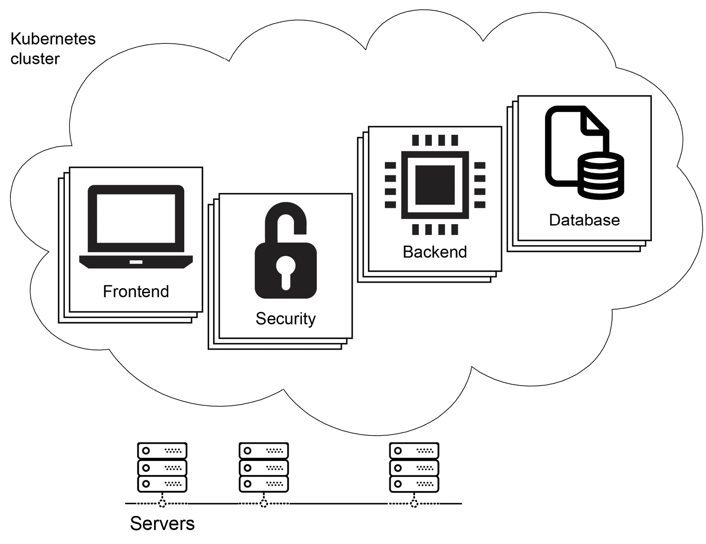

###### 图 1.7:微服务软件架构

微服务被部署到服务器上，这些服务器仍然由运营团队管理。使用无服务器架构，组件被转换成第三方服务或功能。例如，电子商务网站的安全性可以通过认证即服务来处理，例如**认证 0** 。 **AWS 关系数据库服务(RDS)** 可作为系统的数据库。后端逻辑的最佳选择是将其转换为功能，并将其部署到无服务器平台，如 **AWS Lambda** 或**谷歌云功能**。最后，前端可以由存储服务提供，如 **AWS 简单存储服务(S3)** 或**谷歌云存储**。

对于无服务器设计，只需要定义这些服务，就可以让可扩展、健壮且受管理的应用和谐运行，如图 1.8 所示:

#### 注意

**Auth0** 是一个为 web、移动和遗留应用提供身份验证和授权的平台。简而言之，它提供了**身份验证和授权即服务**，在这里您可以连接任何语言编写的任何应用。更多详情可在其官方网站:[https://auth0.com](https://auth0.com)。

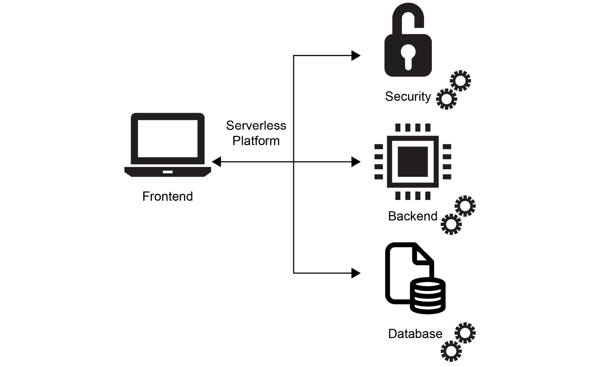

###### 图 1.8:无服务器软件架构

从整体架构开始，首先将其分解为微服务，然后是无服务器组件，这有多种好处:

*   **成本**:无服务器架构在两个关键方面有助于降低成本。第一，服务器的管理是外包的，第二，只有在使用无服务器应用时才需要花钱。
*   **可伸缩性**:如果一个应用预计会增长，目前最好的选择是将其设计为无服务器应用，因为这样可以消除与基础架构相关的可伸缩性限制。
*   **灵活性**:当可部署单元的范围缩小时，无服务器提供了更大的灵活性来进行创新，选择更好的编程语言，和更小的团队一起管理。

这些维度以及它们在软件架构之间的变化在*图 1.9* 中可见:

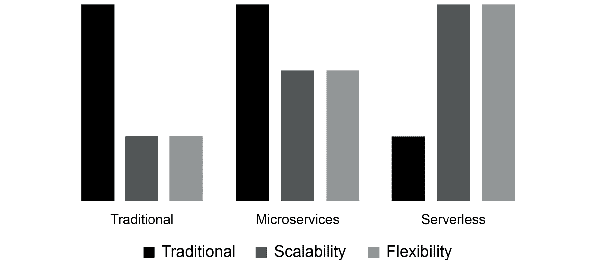

###### 图 1.9:从成本到无服务器过渡的好处

当您从传统的软件开发架构开始时，向微服务的过渡增加了可伸缩性和灵活性。然而，它并没有直接降低运行应用的成本，因为您仍然在处理服务器。进一步过渡到无服务器可以提高可扩展性和灵活性，同时降低成本。因此，了解并实现面向未来应用的无服务器架构至关重要。下一节将介绍无服务器架构的实现，即**功能即服务** ( **FaaS** )。

### 功能即服务(FaaS)

**FaaS** 是无服务器架构最流行和最广泛采用的实现。所有主要的云提供商都有 FaaS 产品，如 AWS Lambda、谷歌云功能和 Azure 功能。顾名思义，FaaS 的部署和管理单位就是职能部门。本文中的函数与任何其他编程语言中的任何其他函数没有什么不同。他们需要接受一些参数和返回值来实现业务需求。FaaS 平台处理服务器的管理，并使运行事件驱动的、可扩展的功能成为可能。FaaS 产品的基本属性如下:

*   **无状态**:函数被设计成无状态和短暂的操作，其中没有文件被保存到磁盘，也没有缓存被管理。每次调用一个函数时，它都会很快从一个新环境开始，完成后就会被移除。
*   **事件触发**:功能设计为直接触发，基于 **cron** 时间表达式、HTTP 请求、消息队列、数据库操作等事件。例如，当开始新的聊天时，可以通过 HTTP 请求调用**开始对话**功能。同样，当一个新用户被添加到数据库中时，可以启动**同步用户**功能。
*   **可扩展**:功能被设计为并行运行尽可能多的需求，以便每个传入的请求都得到响应，每个事件都被覆盖。
*   **托管**:功能由其平台管理，因此服务器和底层基础设施不是 FaaS 用户关心的问题。

这些功能属性被云提供商的产品所覆盖，如 **AWS Lambda** 、**谷歌云功能**、 **Azure 功能**；以及内部产品，如**kubless**、**Apache Open SHow**和**OpenFas**。FaaS 这个词非常受欢迎，它和无服务器这个词通常可以互换使用。在下面的练习中，我们将创建一个函数来处理 HTTP 请求，并说明应该如何开发无服务器函数。

### 练习 1:创建一个 HTTP 函数

在本练习中，我们将创建一个 HTTP 函数作为无服务器平台的一部分，然后通过 HTTP 请求调用它。为了执行练习的步骤，您将使用 Docker、文本编辑器和终端。

#### 注意

本章练习的代码文件可以在这里找到:[https://github . com/trainingypbackt/server less-architecture-with-Kubernetes/tree/master/lesson 01/练习 1](https://github.com/TrainingByPackt/Serverless-Architectures-with-Kubernetes/tree/master/Lesson01/Exercise1) 。

为了成功完成练习，我们需要确保执行以下步骤:

1.  Create a file named **function.go** with the following content in your favorite text editor:

    ```
    package main
    import (
        "fmt"
        "net/http"
    )
    func WelcomeServerless(w http.ResponseWriter, r *http.Request) {
    	fmt.Fprintf(w, "Hello Serverless World!")
    }
    ```

    在这个文件中，我们创建了一个实际的函数处理程序，当这个函数被调用时，它会做出响应。

2.  Create a file named **main.go** with the following content:

    ```
    package main
    import (
        "fmt"
        "net/http"
    )
    func main() {
        fmt.Println("Starting the serverless environment..")
        http.HandleFunc("/", WelcomeServerless)
        fmt.Println("Function handlers are registered.")
        http.ListenAndServe(":8080", nil)
    }
    ```

    在这个文件中，我们已经创建了服务于这个功能的环境。一般来说，这一部分预计将由无服务器平台处理。

3.  Start a Go development environment with the following command in your terminal:

    ```
    docker run -it --rm -p 8080:8080 -v "$(pwd)":/go/src --workdir=/go/src golang:1.12.5
    ```

    有了这个命令，一个 shell 提示符将在一个 Docker 容器中为 Go 版本 **1.12.5** 启动。另外，主机系统的端口 **8080** 映射到容器，当前工作目录映射到 **/go/src** 。您将能够在启动的 Docker 容器中运行命令:

    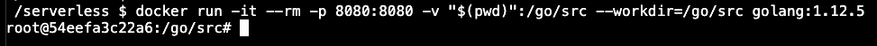

    ###### 图 1.10:容器内部的 Go 开发环境

4.  Start the function handlers with the following command in the shell prompt opened in *step 3*: **go run *.go**.

    随着应用的启动，您将看到以下几行:

    

    ###### 图 1.11:功能服务器的启动

    这些线表示 **main.go** 文件中的 **main** 功能运行如下

    意料之中。

5.  Open **http://localhost:8080** in your browser:

    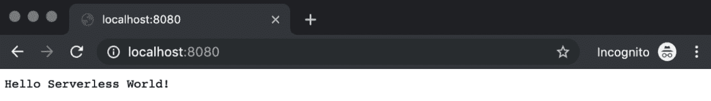

    ###### 图 1.12:welcome 无服务器输出

    网页上显示的消息显示 **WelcomeServerless** 功能通过 HTTP 请求成功调用，并检索到响应。

6.  Press *Ctrl + C* to exit the function handler and then write **exit** to stop the container:

    

###### 图 1.13:退出函数处理程序和容器

通过这个练习，我们演示了如何创建一个简单的函数。此外，介绍了无服务器环境，以展示如何服务和调用函数。在下一节中，将介绍 Kubernetes 和无服务器环境，以将这两种云计算现象联系起来。

## Kubernetes 和 Serverless

2014 年，无服务器和 Kubernetes 几乎同时出现在云计算领域。AWS 通过 **AWS Lambda** 支持无服务器，而 **Kubernetes** 则在 Google 的支持下，凭借其在容器管理方面悠久而成功的历史，成为了开源。组织开始为他们短暂的临时任务创建 AWS Lambda 功能，许多初创公司一直专注于在无服务器基础架构上运行的产品。另一方面，Kubernetes 在业内获得了引人注目的采用，并成为事实上的容器管理系统。它支持在容器中运行无状态应用(如 web 前端和数据分析工具)和有状态应用(如数据库)。应用和微服务架构的容器化已被证明对大型企业和初创企业都是有效的。

因此，运行微服务和容器化应用是成功、可扩展和可靠的云原生应用的关键因素。此外，以下两个基本元素加强了 Kubernetes 和无服务器架构之间的联系:

*   **供应商锁定** : Kubernetes 隔离了云提供商，并为运行无服务器工作负载创建了一个托管环境。换句话说，如果你想在明年转到一个新的提供商，在谷歌云功能中运行你的 AWS Lambda 功能并不简单。但是，如果您使用 Kubernetes 支持的无服务器平台，您将能够在云提供商甚至内部系统之间快速移动。
*   **服务的复用**:作为主流的容器管理系统，Kubernetes 的大部分工作负载都是在你的云环境中运行的。它提供了一个与现有服务并行部署无服务器功能的机会。它使无服务器和容器化应用的操作、安装、连接和管理变得更加容易。

云计算和部署策略总是在不断发展，以更低的成本创建对开发人员更友好的环境。Kubernetes 和容器化的采用已经赢得了市场和开发人员的喜爱，因此任何没有 Kubernetes 的云计算都不会在很长一段时间内出现。通过提供同样的好处，无服务器架构越来越受欢迎；然而，这并不会对 Kubernetes 构成威胁。相反，无服务器应用将使容器化更容易实现，因此，Kubernetes 将从中获利。因此，学习如何在 Kubernetes 上运行无服务器架构以创建面向未来、云原生、可扩展的应用至关重要。在下面的练习中，我们将组合函数和容器，并将我们的函数打包为容器。

可能的答案:

*   无服务器–数据准备
*   无服务器–短暂的应用编程接口操作
*   库比涅斯特数据库
*   kubernetes–与服务器相关的操作

### 练习 2:将 HTTP 函数打包为容器

在本练习中，我们将把*练习 1* 中的 HTTP 函数打包成一个容器，作为 Kubernetes 工作负载的一部分。此外，我们将运行容器并通过其容器触发函数。

#### 注意

本章练习的代码文件可以在这里找到:[https://github . com/trainingypbackt/server less-architecture-with-Kubernetes/tree/master/lesson 01/练习 2](https://github.com/TrainingByPackt/Serverless-Architectures-with-Kubernetes/tree/master/Lesson01/Exercise2) 。

为了成功完成练习，我们需要确保执行以下步骤:

1.  Create a file named **Dockerfile** in the same folder as the files from *Exercise 1*:

    ```
    FROM golang:1.12.5-alpine3.9 AS builder
    ADD . .
    RUN go build *.go
    FROM alpine:3.9
    COPY --from=builder /go/function ./function
    RUN chmod +x ./function
    ENTRYPOINT ["./function"]
    ```

    在这个多级 **Dockerfile** 中，功能内置于 **golang:1.12.5-alpine3.9** 容器中。然后，将二进制文件复制到 **alpine:3.9** 容器中作为最终的应用包。

2.  Build the Docker image with the following command in the terminal: **docker build . -t hello-serverless**.

    **Dockerfile** 的每一行按顺序执行，最后，最后一步，构建 Docker 映像并标记:**成功标记 hello-servernal:最新的**:

    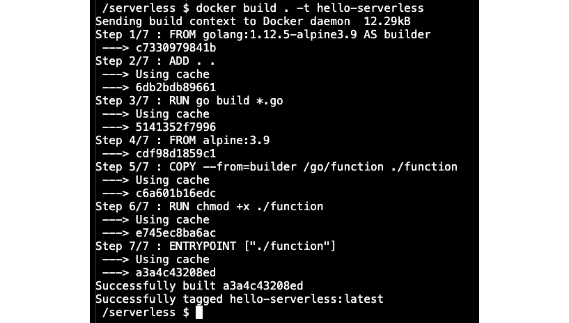

    ###### 图 1.14:Docker 容器的构建

3.  Start a Docker container from the **hello-serverless** image with the following command in your Terminal: **docker run -it --rm -p 8080:8080 hello-serverless**.

    使用该命令，Docker 映像的实例通过端口 **8080** 被实例化，该端口将主机系统映射到容器。此外， **- rm** 标志将在容器退出时将其移除。日志行表明函数的容器正在按预期运行:

    

    ###### 图 1.15:函数容器的开始

4.  Open **http://localhost:8080** in your browser:

    

    ###### 图 1.16:welcome 无服务器输出

    它揭示了在容器中运行的 **WelcomeServerless** 函数通过 HTTP 请求被成功调用，并且响应被检索。

5.  Press *Ctrl + C* to exit the container:

    

###### 图 1.17:退出容器

在本练习中，我们看到了如何将一个简单的函数打包成一个容器。此外，借助 Docker 的网络功能，启动了容器并触发了功能。在下面的练习中，我们将实现一个参数化函数，以展示如何将值传递给函数并返回不同的响应。

### 练习 3:参数化 HTTP 函数

在本练习中，我们将把*练习 2* 中的**无服务器**函数转换为参数化的 HTTP 函数。此外，我们将运行容器并通过其容器触发函数。

#### 注意

本章练习的代码文件可以在这里找到:[https://github . com/trainingypbackt/server less-architecture-with-Kubernetes/tree/master/lesson 01/练习 3](https://github.com/TrainingByPackt/Serverless-Architectures-with-Kubernetes/tree/master/Lesson01/Exercise3) 。

为了成功完成练习，我们需要确保执行以下步骤:

1.  Change the contents of **function.go** from *Exercise 2* to the following:

    ```
    package main
    import (
    	"fmt"
    	"net/http"
    )
    func WelcomeServerless(w http.ResponseWriter, r *http.Request) {
    	names, ok := r.URL.Query()["name"]

        if ok && len(names[0]) > 0 {
            fmt.Fprintf(w, names[0] + ", Hello Serverless World!")
    	} else {
    		fmt.Fprintf(w, "Hello Serverless World!")
    	}
    }
    ```

    在新版本的 **WelcomeServerless** 函数中，我们现在获取 URL 参数并相应地返回响应。

2.  Build the Docker image with the following command in your terminal: **docker build . -t hello-serverless**.

    **Dockerfile** 的每一行按顺序执行，最后一步，构建 Docker 映像并标记:**成功标记 hello-无服务器:最新的**:

    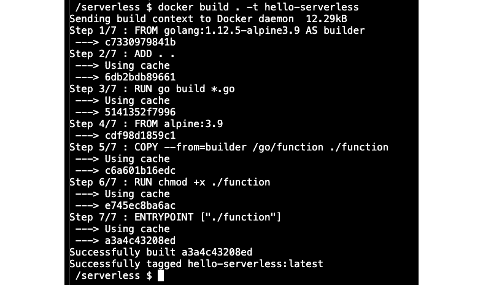

    ###### 图 1.18:Docker 容器的构建

3.  Start a Docker container from the **hello-serverless** image with the following command in the terminal: **docker run -it –rm -p 8080:8080 hello-serverless**.

    使用该命令，功能处理器将在主机系统的端口 **8080** 上启动:

    

    ###### 图 1.19:函数容器的开始

4.  Open **http://localhost:8080** in your browser:

    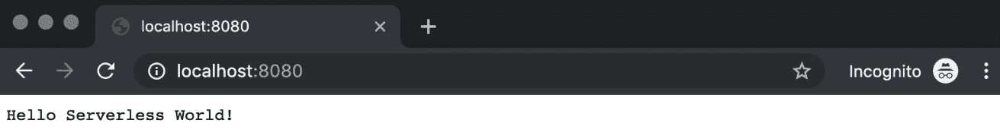

    ###### 图 1.20:welcome 无服务器输出

    它显示了与前面练习中相同的响应。如果我们提供 URL 参数，应该会得到个性化的 **Hello 无服务器世界**消息。

5.  Change the address to **http://localhost:8080?name=Ece** in your browser and reload the page. We are now expecting to see a personalized **Hello Serverless World** message with the name provided in URL parameters:

    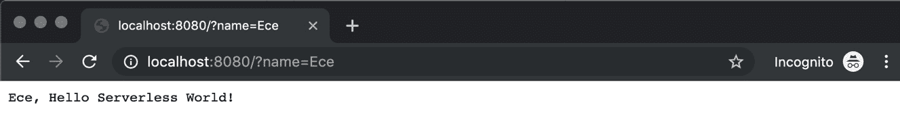

    ###### 图 1.21:个性化福利无服务器输出

6.  Press *Ctrl + C* to exit the container:

    

###### 图 1.22:退出容器

在本练习中，展示了如何使用不同参数的通用函数。基于输入值的个人消息由我们部署的单个函数返回。在下面的活动中，将创建一个更复杂的函数，并将其作为一个容器进行管理，以展示它们在现实生活中是如何实现的。

### 活动 1:伦敦自行车积分的推特机器人后端

这项活动的目的是为推特机器人后端创建一个真实的功能。推特机器人将用于搜索伦敦的可用自行车点和相应位置的可用自行车数量。机器人将以自然语言形式回答；因此，您的函数将接受街道名称或地标的输入，并输出一个完整的人类可读的句子。

伦敦的交通数据可通过**伦敦交通** ( **TFL** ) **统一 API**([https://api.tfl.gov.uk](https://api.tfl.gov.uk))公开获取。您需要使用 TFL 应用编程接口并在容器中运行您的函数。

完成后，您将有一个运行该函数的容器:


###### 图 1.23:容器内部的运行函数

当您通过 HTTP REST 应用编程接口进行查询时，当找到可用自行车的自行车点时，它应该返回类似于以下的句子:

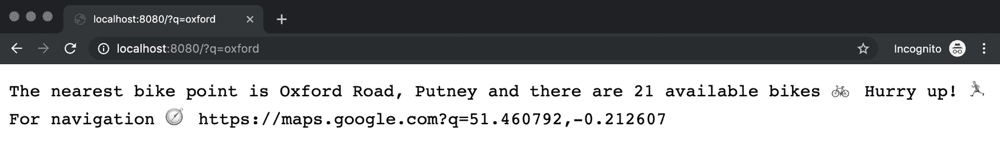

###### 图 1.24:自行车可用时的功能响应

当在这些位置找不到自行车点或没有自行车可用时，该功能将返回类似以下内容的响应:

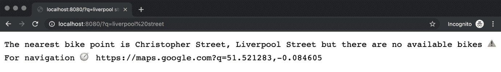

###### 图 1.25:当找到自行车点但没有找到自行车时的功能响应

该功能还可以提供以下响应:

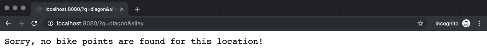

###### 图 1.26:未找到自行车点或自行车时的功能响应

执行以下步骤完成本活动:

1.  创建一个 **main.go** 文件来注册函数处理程序，如*练习 1* 中所述。
2.  为**找到自行车**功能创建一个**功能文件。**
3.  创建一个**文档**来构建和打包该功能，如*练习 2* 中所述。
4.  使用 Docker 命令构建容器映像。
5.  将容器映像作为 Docker 容器运行，并使主机系统中的端口可用。
6.  用不同的查询测试函数的 HTTP 端点。
7.  Exit the container.

    #### 注意

    文件 **main.go** 、 **function.go** 和 **Dockerfile** 可以在这里找到:[https://github . com/trainingypbackt/无服务器架构带-Kubernetes/tree/master/lesson 01/activity 1](https://github.com/TrainingByPackt/Serverless-Architectures-with-Kubernetes/tree/master/Lesson01/Activity1)。

    活动的解决方案可以在第 372 页找到。

在这个活动中，我们构建了一个推特机器人的后端。我们从定义**主**和**查找自行车**功能开始。然后，我们将这个无服务器后端构建并打包为一个 Docker 容器。最后，我们用各种输入对其进行测试，以找到最近的自行车站。通过这个真实的例子，说明了无服务器平台的后台操作以及如何编写无服务器函数。

## 总结

在这一章中，我们首先描述了从传统到无服务器软件开发的旅程。我们讨论了这些年来软件开发是如何改变的，以创建一个对开发人员更友好的环境。随后，我们介绍了无服务器技术的起源及其官方宣言。由于无服务器是行业中的一个流行术语，定义一些规则有助于设计更好的无服务器应用，以便轻松集成到各种平台中。然后，我们列出了无服务器技术的用例，以说明如何使用无服务器体系结构来创建任何现代应用。

在介绍了无服务器之后，探索了 FaaS 作为无服务器架构的实现。我们展示了如何在传统、微服务和无服务器设计中设计应用。此外，还详细讨论了向无服务器体系结构过渡的好处。

最后，讨论了 Kubernetes 和无服务器技术，以展示它们如何相互支持。作为主流的容器管理系统，Kubernetes 被提出，其中涉及到查看使用它运行无服务器平台的优势。容器化和微服务在行业中被高度采用，因此在容器被覆盖的情况下运行无服务器工作负载是有练习的。最后，探索了一个作为推特机器人后端功能的真实例子。在本活动中，功能被打包为容器，以展示基于微服务、容器化和 FaaS 支持的设计之间的关系。

在下一章中，我们将介绍云中的无服务架构，并与云服务合作。