# 七、使用 Kubeless 的 Kubernetes 无服务器

## 学习目标

本章结束时，您将能够:

*   使用 Minikube 创建 Kubernetes 集群
*   在 kubernetes 上安装无管框架
*   创建、更新、调用和删除无库班函数
*   列出、描述、调试和监控无库班函数
*   为无库函数创建 HTTP 和 PubSub 触发器

在本章中，我们将首先了解无库架构。然后，我们将创建第一个无库函数，部署它，并调用它。您还将学习如何在失败的情况下调试无库班函数。

## 无库班介绍

**Kubernetes**是一个开源的 Kubernetes 原生无服务器框架，运行在 Kubernetes 之上。这允许软件开发人员将代码部署到 Kubernetes 集群中，而不用担心底层基础设施。**kubless**是 Bitnami 的一个项目，该公司为任何平台提供打包应用。Bitnami 为超过 130 个应用提供软件安装程序，使您能够快速高效地将这些软件应用部署到任何平台。

**kubless**函数支持多种编程语言，包括 Python、PHP、Ruby、Node.js、Golang、Java、。NET、芭蕾舞演员和自定义运行时。这些函数可以通过 HTTP(S)调用来调用，也可以通过 Kafka 或 NATS 消息传递系统来调用事件触发器。Kubeless 还支持驱动触发器将功能与 AWS 驱动服务相关联，驱动服务是由 AWS 管理的数据流服务。无库函数甚至可以使用预定的触发器在指定的时间间隔调用。

Kubernetes 自带名为**Kubernetes**的命令行界面，类似于 Kubernetes 提供的**Kubernetes**命令行界面。我们可以使用这个**无库**命令行界面创建、部署、列出和删除无库函数。Kubeless 还有一个图形用户界面，这使得功能的管理更加容易。

在本章中，我们将使用 Kubernetes 在 Kubernetes 上创建我们的第一个无服务器函数。然后，我们将使用多种机制调用这个函数，包括 HTTP 和 PubSub 触发器。一旦我们熟悉了 Kubeless 的基础知识，我们将创建一个更高级的功能，可以向 Slack 发布消息。

### 无库架构

Kubernetes 框架是 Kubernetes 框架的扩展，利用了本地 Kubernetes 概念，如**自定义资源定义** ( **CRDs** )和自定义控制器。由于 Kubernetes 是建立在 Kubernetes 之上的，因此它可以利用 Kubernetes 中所有可用的优秀特性，例如自我修复、自动缩放、负载平衡和服务发现。

#### 注意

自定义资源是 Kubernetes API 的扩展。您可以在[https://Kubernetes . io/docs/concepts/extend-Kubernetes/API-extension/custom-resources/](https://kubernetes.io/docs/concepts/extend-kubernetes/api-extension/custom-resources/)的官方 Kubernetes 文档中找到更多关于 Kubernetes 的定制资源。

让我们来看看 Kubernetes 架构，以了解其背后的核心概念:

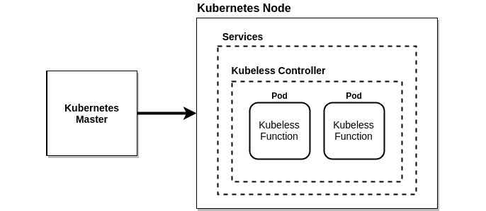

###### 图 7.1:无库架构图

上图类似于标准的 Kubernetes 架构，具有 Kubernetes 主节点和节点。集群中可以有一个或多个负责整体决策的 Kubernetes 主节点。Kubernetes 节点用于托管 Kubernetes 豆荚。这些 POD 包含软件开发人员编写的功能。控制器将使用**配置图**将功能的源代码注入 POD。

这些 POD 将由**无库控制器**管理。在无库框架安装过程中，它将启动一个集群内控制器，持续监视功能资源。当一个功能被部署时，这个控制器将使用提供的运行时创建相关的服务、部署和 pods。

无库框架有三个核心概念:

*   功能
*   扳机
*   运行时间

函数表示由无库框架执行的代码块。在安装过程中，将创建一个名为**functions . kumbless . io**的 CRD 来表示 Kubeless functions。

触发器代表函数的调用机制。每当接收到触发器时，将调用一个无库班函数。单个触发器可以与一个或多个功能相关联。在 Kubeless 上部署的功能可以使用五种可能的机制来触发:

*   HTTP 触发器:这是通过基于 HTTP 的调用来执行的，比如 HTTP GET 或 POST 请求。
*   CronJob 触发器:这是通过预定义的计划执行的。
*   卡夫卡触发器:当一条消息发布到卡夫卡主题时执行。
*   NATS 触发器:当消息发布到 NATS 主题时执行。
*   驱动触发器:当记录发布到 AWS 驱动数据流时执行。

运行时代表不同的编程语言，可以用来编写和执行无库班函数。一种编程语言将根据版本进一步分为多个运行时。例如，Python 2.7、Python 3.4、Python 3.6 和 Python 3.7 是支持 Python 编程语言的运行时。Kubeless 支持稳定和培育阶段的运行时。运行时一旦满足了 Kubeless 指定的某些技术要求，就被认为是稳定的。孵化器运行时被认为处于开发阶段。一旦满足了指定的技术要求，运行时维护人员就可以在 Kubeless GitHub 存储库中创建一个“拉”请求，将运行时从孵化器阶段移动到稳定阶段。在写这本书的时候，芭蕾舞女演员。NET、Golang、Java、Node.js、PHP 和 Python 运行时在稳定阶段可用，JVM 和 Vertx 运行时在孵化器阶段可用。

#### 注意

以下文档定义了稳定运行时的技术要求:[https://github . com/kub lesce/runtime/blob/master/DEVELOPER _ GUide . MD #运行时-映像-要求](https://github.com/kubeless/runtimes/blob/master/DEVELOPER_GUIDE.md#runtime-image-requirements)。

## 创建 Kubernetes 集群

为了安装 Kubernetes 框架，我们需要一个工作正常的 Kubernetes 集群。您可以使用 Minikube、Kubeadm 和 Kops 等工具创建自己的 Kubernetes 集群。您还可以使用公共云提供商提供的托管 Kubernetes 集群服务创建 Kubernetes 集群，如**谷歌 Kubernetes 引擎** ( **GKE** )、微软的 **Azure Kubernetes 服务** ( **AKS** )、**亚马逊弹性 Kubernetes 服务** ( **亚马逊 EKS** )。在接下来的部分中，我们将使用 **Minikube** 创建我们自己的 Kubernetes 集群。

### 用 Minikube 创建 Kubernetes 集群

首先，我们将使用 Minikube 创建我们的 Kubernetes 集群。Minikube 是一个可以在你的电脑上本地安装和运行 Kubernetes 的工具。这将在一个**虚拟机** ( **虚拟机**内创建一个单节点 Kubernetes 集群。Minikube 由希望在本地尝试 Kubernetes 的软件开发人员使用，但不建议用于运行生产级 Kubernetes 集群。我们将通过执行以下步骤开始创建 Kubernetes 集群:

1.  Install VirtualBox.

    由于 Minikube 作为虚拟机运行，我们需要安装虚拟机管理程序来支持虚拟机。我们将安装甲骨文虚拟盒子，这是一个由甲骨文公司开发的免费虚拟化软件。

    #### 注意

    通过在终端中执行以下命令，可以使用 APT 包管理器在 Ubuntu 18.04 上安装 VirtualBox:

    **$ sudo apt 安装 virtualbox -y**

2.  Execute the **virtualbox** command to start **Oracle VM VirtualBox Manager**, as shown in the following screenshot:

    ```
    $ virtualbox
    ```

    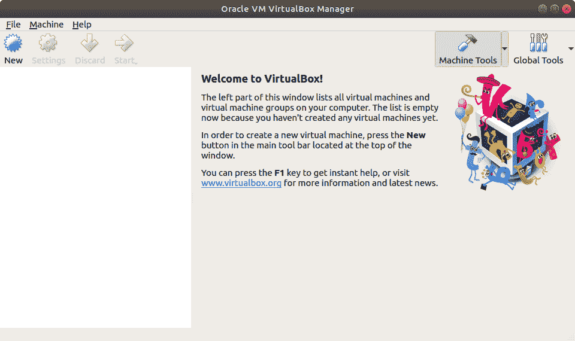

    ###### 图 7.2: Oracle 虚拟机 VirtualBox 管理器

3.  Install **minikube**.

    现在，我们要安装 **Minikube** 版本 1.2.0，这是撰写本书时可用的最新版本。首先，将 **minikube** 二进制文件下载到您的本地机器上:

    ```
    $ curl -Lo minikube https://storage.googleapis.com/minikube/releases/v1.2.0/minikube-linux-amd64
    ```

    输出如下:

    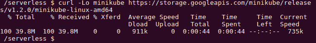

    ###### 图 7.3:下载 Minikube 二进制文件

4.  Then, add execution permission to the **minikube** binary:

    ```
    $ chmod +x minikube 
    ```

    输出如下:

    

    ###### 图 7.4:向 Minikube 二进制文件添加执行权限

5.  Finally, move the Minikube binary to the **/usr/local/bin/** path location:

    ```
    $ sudo mv minikube /usr/local/bin/
    ```

    结果如下图所示:

    

    ###### 图 7.5:将 Minikube 二进制文件移动到路径

6.  Verify the installation:

    ```
    $ minikube version
    ```

    结果如下图所示:

    

    ###### 图 7.6:验证 Minikube 版本

7.  Start the Minikube cluster with the **minikube start** command:

    ```
    $ minikube start
    ```

    这将在 VirtualBox 中为 Minikube 创建一个虚拟机，如下所示:

    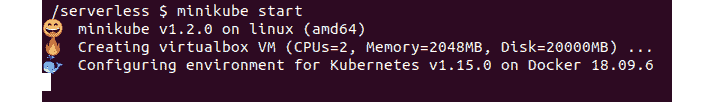

    ###### 图 7.7:启动 Minikube

    现在，在 **VirtualBox Manager** 窗口中，您可以看到一个名为 **minikube** 的虚拟机处于运行状态:

    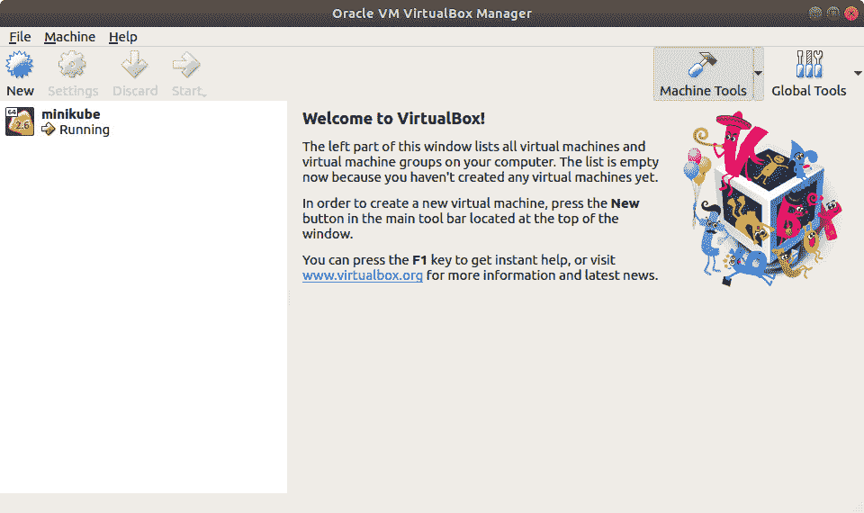

    ###### 图 7.8:带 Minikube 虚拟机的 Oracle VirtualBox

8.  Install **kubectl**.

    现在，我们要安装 **kubectl** 版本 1.15.0，这是撰写本书时可用的最新版本。首先，将 **kubectl** 二进制文件下载到您的本地机器上:

    ```
    $ curl -LO https://storage.googleapis.com/kubernetes-release/release/v1.15.0/bin/linux/amd64/kubectl
    ```

    这将显示以下输出:

    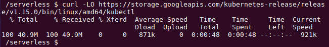

    ###### 图 7.9:下载 kubectl 二进制文件

9.  Then, add execution permissions to the Minikube binary:

    ```
    $ chmod +x kubectl
    ```

    下面的截图显示了结果:

    

    ###### 图 7.10:向 kubectl 二进制文件添加执行权限

10.  Finally, move the Minikube binary to the **/usr/local/bin/** path location:

    ```
    $ sudo mv kubectl /usr/local/bin/kubectl
    ```

    输出如下:

    

    ###### 图 7.11:将 kubectl 二进制文件移动到路径

11.  Verify the installation:

    ```
    $ kubectl version
    ```

    屏幕上将显示以下内容:

    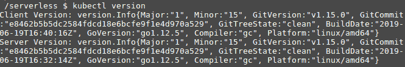

    ###### 图 7.12:验证 kubectl 版本

12.  Verify that the **kubectl** CLI is correctly pointed to the Minikube cluster:

    ```
    $ kubectl get pods
    ```

    您应该会看到以下输出:


###### 图 7.13:验证 kubectl 是否指向 Minikube 集群

## 安装无库

一旦 Minikube Kubernetes 环境准备就绪，我们就可以在 Kubernetes 集群的顶部安装 Kubeless。安装 Kubeless 包括安装三个组件:

*   无管框架
*   无内胎 cli
*   无管用户界面

Kubernetes 框架将在 Kubernetes 之上安装所有扩展，以支持 Kubernetes 特性。这包括 CRD、定制控制器和部署。无库命令行界面用于与无库框架进行交互，以执行部署函数、调用函数和创建触发器等任务。无库用户界面是一个用于无库框架的图形用户界面，它将帮助您查看、编辑和运行函数。

### 安装无库框架

我们将安装 kubless 1 . 0 . 3 版本，这是撰写本书时可用的最新版本。

首先，我们需要使用 **kubectl 创建命名空间**来创建**无库**命名空间。这是 Kubeless 用来存储其所有对象的默认命名空间:

```
$ kubectl create namespace kubeless
```

结果如下:


###### 图 7.14:创建无库命名空间

下一步，我们将安装 Kubeless 框架。我们将使用库布尼斯提供的 YAML 清单之一来安装框架。Kubeless 提供了多个 **yaml** 文件，我们必须根据 Kubernetes 环境选择正确的 **yaml** 文件(例如， **rbac** 、**非 rbac** 或 **openshift** ):

```
$ kubectl create -f https://github.com/kubeless/kubeless/releases/download/v1.0.3/kubeless-v1.0.3.yaml 
```

屏幕将显示以下内容:

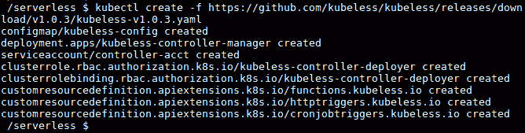

###### 图 7.15:安装无库框架

前面的步骤将在**无库**命名空间中创建多个 Kubernetes 对象。这将创建一个功能对象作为**自定义资源定义**，并创建一个无库控制器作为部署。您可以通过执行以下命令来验证这些对象是否启动并运行:

```
$ kubectl get pods -n kubeless
$ kubectl get deployment -n kubeless
$ kubectl get customresourcedefinition
```

您将在屏幕上看到以下内容:

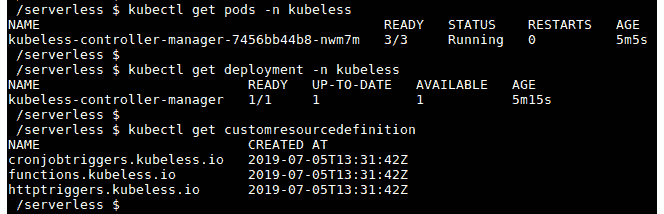

###### 图 7.16:验证无库安装

现在，我们已经成功地完成了 Kubeless 框架的安装。在下一节中，我们将安装 kumblesce CLI。

### 安装无库命令行界面

**无库命令行界面**是针对无库框架运行命令的命令行界面。**无库函数**是最常见的一个，因为它允许您执行任务，如部署、调用、更新或删除函数。此外，您可以列出并描述这些功能。通过**无库功能**命令也支持检查日志或度量。您还可以从无库命令行界面管理无库触发器、主题和自动缩放。

一旦您成功安装了 kubless 框架，下一步就是安装 Kubeless CLI。我们将使用 Kubeless CLI 版本 1.0.3，它与我们在上一节中安装的 kubless 框架版本相同。

首先，我们需要下载 kumblesce CLI zip 文件:

```
$ curl -OL https://github.com/kubeless/kubeless/releases/download/v1.0.3/kubeless_linux-amd64.zip 
```

结果如下:


###### 图 7.17:下载无库二进制文件

接下来，我们将提取 zip 文件:

```
$ unzip kubeless_linux-amd64.zip
```

为了更好地理解这一点，请参考以下输出:


###### 图 7.18:提取无库二进制文件

然后，将无库可执行文件移动到 **/usr/local/bin/** 路径位置:

```
$ sudo mv bundles/kubeless_linux-amd64/kubeless /usr/local/bin/
```

以下是您将在屏幕上看到的内容:


###### 图 7.19:将无库二进制文件移动到路径

现在，我们已经成功安装了 kumblesce CLI。我们可以通过运行以下命令来验证这一点:

```
$ kubeless version
```

参考以下截图:


###### 图 7.20:验证无库版本

### 无库用户界面

**无库用户界面**是无库的图形用户界面。它允许你用一个简单易用的用户界面创建、编辑、删除和执行无库函数。执行以下命令在 Kubernetes 集群中安装 Kubernetes 用户界面:

```
$ kubectl create -f https://raw.githubusercontent.com/kubeless/kubeless-ui/master/k8s.yaml
```

这将为您提供以下输出:

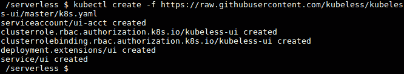

###### 图 7.21:安装无库用户界面

安装成功后，执行以下命令在浏览器窗口中打开无库用户界面。如果无库用户界面没有出现，您可以重新加载浏览器窗口，因为创建服务可能需要几分钟时间:

```
$ minikube service ui --namespace kubeless
```

如下所示:

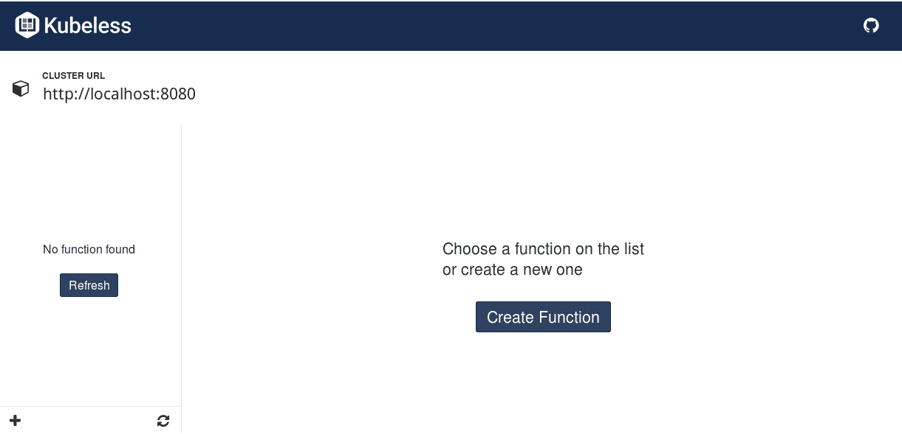

###### 图 7.22:无库图形用户界面

我们刚刚完成了无库用户界面的安装，它可以用来创建、编辑、删除和执行类似于无库命令行界面的无库功能。

## 无库函数

once kubless 成功安装后，您现在可以忘记底层基础架构，包括虚拟机和容器，只关注您的功能逻辑。无库函数是用支持的语言之一编写的代码片段。正如我们之前讨论的，Kubeless 支持多种编程语言和版本。您可以执行**无库获取服务器配置**命令来获取您的无库版本支持的语言运行时列表:

```
$ kubeless get-server-config 
```

结果如下图所示:

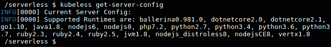

###### 图 7.23:Kubernetes 无服务器配置

在接下来的部分中，我们将创建、部署、列出、调用、更新和删除一个无库函数。

### 创建无库班函数

不管语言运行时如何，每个无库函数都有相同的格式。它接收两个参数作为输入，并返回一个字符串或对象作为响应。该函数的第一个参数是一个事件，它包括关于事件源的所有信息，如事件标识、事件时间和事件类型。**事件**对象内的**数据**字段包含功能请求的正文。该函数的第二个参数名为**上下文**，它包含关于该函数的一般信息，例如它的名称、超时、运行时和内存限制。

下面是一个示例 Python 函数，它返回文本**欢迎来到无库世界**作为响应:

```
def main(event, context):
    return "Welcome to Kubeless World"  
```

您可以将文件保存为 s **hello.py** 。

### 部署无库函数

一旦函数准备好了，就可以将其部署到 Kubeless 框架中。您可以使用**无库函数部署**命令向无库框架注册该函数。为了部署函数，您需要提供一些信息，包括函数名、函数的运行时、包含函数源代码的文件以及调用函数时要执行的方法名:

```
kubeless function deploy hello --runtime python3.7 \
                           --from-file hello.py \
                           --handler hello.main
```

输出如下:

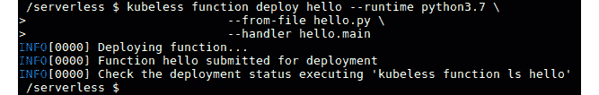

###### 图 7.24:部署一个无库函数

让我们将这个命令分成几部分，以便理解命令的每个部分是做什么的:

*   **kubless 函数部署 hello** :这告诉 kubless 注册一个名为 **hello** 的新函数。我们可以用这个名字来调用这个函数。
*   **-运行时 python3.7** :这告诉 Kubeless 使用 python3.7 运行时来运行这个函数。
*   **- from-file hello.py** :这告诉 Kubeless 使用 **hello.py** 文件中的可用代码来创建 **hello** 功能。如果执行命令时不在当前文件路径中，则需要指定完整的文件路径。
*   **- handler hello.main** :这指定了代码文件的名称和调用该函数时要执行的方法。这应该是**的格式<文件名>。<功能-名称>** 。在我们的例子中，文件名是**你好**，文件中的函数名是 **main** 。

通过执行**无库函数部署-帮助**命令，您可以找到部署函数时可用的其他选项。

### 列出无库乐趣动作

一旦您部署了该功能，您可以通过使用**无库功能列表**命令列出功能来验证该功能部署成功。您应该会看到所有注册功能的详细信息，如下所示:

```
$ kubeless function list
```

以下截图反映了结果:


###### 图 7.25:用无库命令行界面列出了无库函数

#### 注意

使用**无库班功能 ls** 命令也可以达到同样的效果。

如果您希望获得特定功能的更多详细信息，您可以使用**无库班功能描述**命令:

```
$ kubeless function describe hello
```

它产生以下输出:

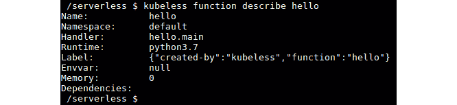

###### 图 7.26:描述一个无库班函数

由于 Kubernetes 函数是作为 Kubernetes 对象(即自定义资源)创建的，因此您也可以使用 Kubernetes 命令行界面来获取可用函数的信息。以下是 **kubectl get functions** 命令的输出:

```
$ kubectl get functions
```

您将获得以下输出:


###### 图 7.27:用 kubectl 命令行界面列出了 Kubeless 函数

### 调用无库函数离子

现在是时候调用我们的**你好**功能了。您可以使用**无库班函数调用**方法来调用无库班函数。**你好**功能将返回文本**欢迎来到无库世界**作为响应:

```
$ kubeless function call hello
```

输出如下:


###### 图 7.28:使用无库命令行界面调用无库函数

恭喜你！您已经成功地执行了您的第一个无库函数。

您也可以使用无库用户界面调用无库函数。一旦你打开了无库用户界面，你可以在左侧看到可用功能的列表。可以点击**你好**功能打开。然后，点击**运行**功能按钮执行该功能。你可以在**回应**部分看到**欢迎来到无库世界**的预期回应:

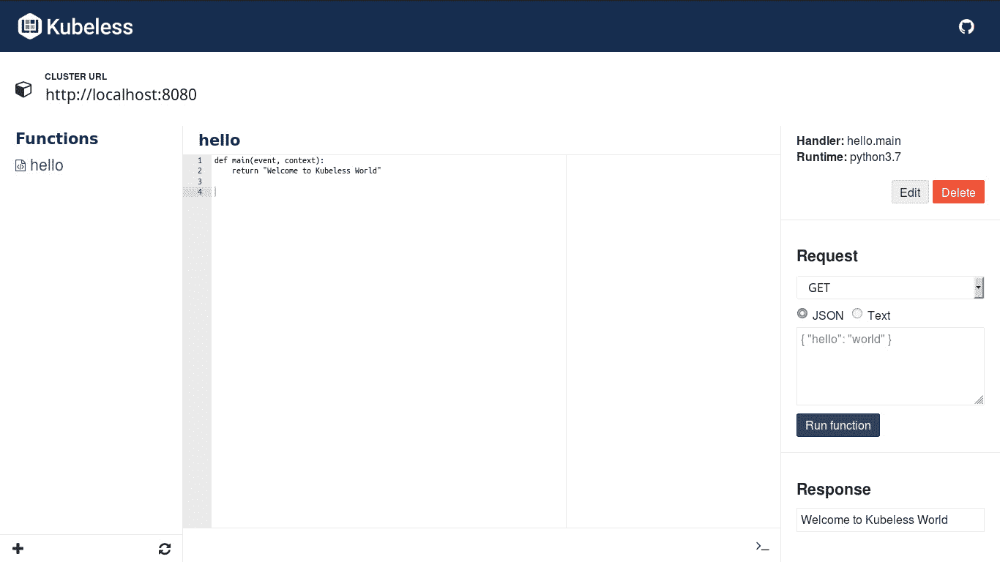

###### 图 7.29:使用无库用户界面调用无库函数

#### 注意

无库功能也可以使用无库用户界面更新或删除。

### 更新无库函数 n

在成功调用我们的**你好**功能之后，我们现在要更新它来对任何人说*你好*。您可以如下更新 **hello.py** 文件:

```
def main(event, context):
   name = event['data']['name']
   return "Hello " +  name
```

然后，您可以执行**无库函数更新**命令来更新我们之前创建的**你好**函数:

```
$ kubeless function update hello --from-file hello.py
```

这将产生以下输出:

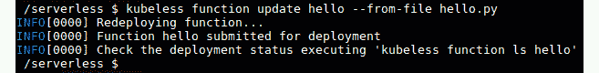

###### 图 7.30:用无库命令行界面更新无库函数

现在在调用 **hello** 函数时，您必须传递所需的数据:

```
$ kubeless function call hello --data '{"name":"Kubeless World!"}'
```

这是前面代码的输出:

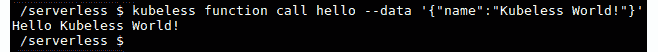

###### 图 7.31:调用更新的无库函数

你应该能看到**你好无库世界！**作为前面命令的输出。

### 删除无库函数

如果要删除功能，可以执行**无库功能删除**命令:

```
$ kubeless function delete hello
```

这将呈现以下内容:


###### 图 7.32:删除无库函数

删除该函数后，请尝试再次列出该函数。它应该会抛出一个错误，如下所示:

```
$ kubeless function list hello
```

我们会看到以下结果:

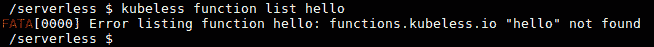

###### 图 7.33:验证无库函数的删除

前面的**无库函数删除**命令不仅会删除**无库**函数，而且在创建无库函数的同时，框架还会创建库对象，如 pods 和 deployment。当我们删除无库函数时，这些对象也将被删除。您可以使用以下命令验证这一点:

```
$ kubectl get pods -l function=hello
```

您可以看到如下结果:


###### 图 7.34:验证删除

现在，我们已经学习了如何创建、部署、列出、调用、更新和删除无库函数。让我们继续一个关于创建第一个无库班函数的练习。

### 练习 21:创建你的第一个无边界函数

在本练习中，我们将创建、部署、调用以及稍后删除一个无库班函数。执行以下步骤完成练习:

#### 注意

本练习的代码文件可在[https://github . com/trainingypbackt/server less-Architectures-with-Kubernetes/tree/master/lesson 07/练习 21](https://github.com/TrainingByPackt/Serverless-Architectures-with-Kubernetes/tree/master/Lesson07/Exercise21) 中找到。

1.  Create a file with a sample **hello** function:

    ```
    $ cat <<EOF >my-function.py
    def main(event, context):
        return "Welcome to Serverless Architectures with Kubernetes"
    EOF
    ```

    这将呈现以下输出:

    

    ###### 图 7.35:创建我的函数文件

2.  Create the **lesson-7** namespace and deploy the **my-function.py** file created previously:

    ```
    $ kubectl create namespace lesson-7
    $ kubeless function deploy my-function --runtime python3.7 \
                                      --from-file my-function.py \
                                      --handler my-function.main \
                                      --namespace lesson-7
    ```

    输出如下:

    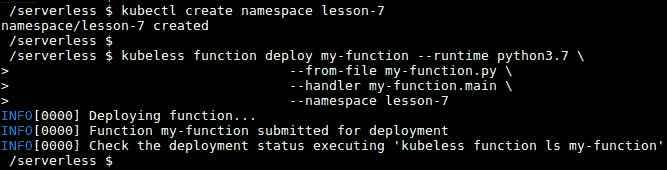

    ###### 图 7.36:部署我的功能

3.  Verify whether **my-function** has been deployed correctly:

    ```
    $ kubeless function list my-function --namespace lesson-7
    ```

    呈现的输出如下:

    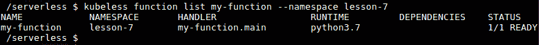

    ###### 图 7.37:验证我的功能已经成功部署

4.  Invoke **my-function** with the **kubeless** CLI:

    ```
    $ kubeless function call my-function --namespace lesson-7
    ```

    它看起来像这样:

    

    ###### 图 7.38:用库比兹命令行界面调用我的函数

5.  Delete **my-function** and the **lesson-7** namespace:

    ```
    $ kubeless function delete my-function --namespace lesson-7
    $ kubectl delete namespace lesson-7
    ```

    以下是我们得到的信息:

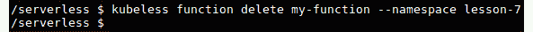

###### 图 7.39:用无库命令行界面删除我的函数

在本练习中，首先，我们创建了一个简单的 Python 函数，该函数以 Kubernetes 字符串作为输出返回**欢迎使用无服务器架构，并将其部署到 Kubeless。然后，我们列出了该函数，以确保它创建成功。然后，我们调用了 **my-function** 并成功返回了**欢迎使用 Kubernetes** 的无服务器架构的预期响应。最后，我们通过删除函数进行了清理。**

## 无库 HTTP 触发器

在前面几节中，我们讨论了如何使用 kumblesce CLI 调用 kumblesce 函数。在本节中，我们将演示如何通过创建 HTTP 触发器向每个人公开这些函数。

HTTP 触发器用于通过基于 HTTP 的调用(如 HTTP **GET** 或 **POST** 请求)来执行无库班函数。当一个功能被部署时，Kubernetes 将以**集群 IP** 作为服务类型，创建一个与该功能相关联的 Kubernetes 服务；然而，这些服务并不公开。为了使该函数公开可用，我们需要创建一个无库 HTTP 触发器。这将通过使用 Kubernetes 入口规则向每个人展示 Kubernetes 函数。

为了运行 HTTP 触发器，您的 Kubernetes 集群必须有一个正在运行的入口控制器。一旦入口控制器在 Kubernetes 集群中运行，您就可以使用**无库触发器 http create** 命令来创建 http 触发器:

```
$ kubeless trigger http create <trigger-name> --function-name <function-name>
```

**-函数名标志**用于指定将与 HTTP 触发器关联的函数的名称。

#### 注意

Kubernetes 有许多入口控制器插件，包括 NGINX、Kong、Traefik、F5、Contour 等。你可以在[https://kubernetes . io/docs/concepts/services-networking/ingress-controller/](https://kubernetes.io/docs/concepts/services-networking/ingress-controllers/)找到它们。

### 练习 22:创建一个 HTTP 触发器或一个无库函数

在本练习中，我们将首先为 Minikube 启用入口插件。然后，我们将创建一个用 HTTP 触发器执行的函数。最后，我们将创建一个 HTTP 触发器，并用 HTTP 触发器调用这个函数。

#### 注意

本练习的代码文件可在[https://github . com/trainingypbackt/server less-Architectures-with-Kubernetes/tree/master/lesson 07/练习 22](https://github.com/TrainingByPackt/Serverless-Architectures-with-Kubernetes/tree/master/Lesson07/Exercise22) 中找到。

执行以下步骤完成练习:

1.  First, we need to enable the **ingress** add-on in our Minikube cluster:

    ```
    $ minikube addons enable ingress
    ```

    这显示了以下输出:

    

    ###### 图 7.40:启用 Minikube 插件

2.  After a couple of minutes, you should be able to see that the **nginx-ingress-controller** container has been created in the **kube-system** namespace, which is the namespace for the object created by the Kubernetes system:

    ```
    $ kubectl get pod -n kube-system -l app.kubernetes.io/name=nginx-ingress-controller
    ```

    它显示了以下内容:

    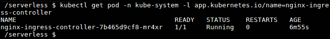

    ###### 图 7.41:列出 nginx 入口控制器盒

3.  一旦 **nginx 入口控制器**容器处于运行状态，我们将创建用 HTTP 触发器执行的函数。创建一个名为**hello . py**的 Python 文件，内容如下:

    ```
    import datetime as dt
    def main(event, context):
        currentHour = dt.datetime.now().hour
        greetingMessage = ''
        if currentHour < 12:
            greetingMessage = 'Hello, Good morning!'
        elif currentHour < 18:
            greetingMessage = 'Hello, Good afternoon!'
        else:
            greetingMessage = 'Hello, Good evening!'
        return greetingMessage
    ```

4.  Create the **lesson-7** namespace and deploy the **greetings.py** created earlier:

    ```
    $ kubectl create namespace lesson-7
    $ kubeless function deploy greetings --runtime python3.7 \
                                      --from-file greetings.py \
                                      --handler greetings.main \
                                      --namespace lesson-7
    ```

    请参考以下输出:

    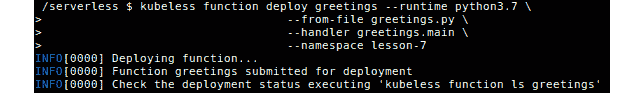

    ###### 图 7.42:使用 HTTP 触发器执行函数

5.  Invoke the function and verify that the function is providing the expected output:

    ```
    $ kubeless function call greetings --namespace lesson-7
    ```

    一旦调用，屏幕将显示以下内容:

    

    ###### 图 7.43:功能输出

6.  Now we can create the **http** trigger for the **hello** function:

    ```
    $ kubeless trigger http create greetings \
                           --function-name greetings \
                           --namespace lesson-7
    ```

    结果如下:

    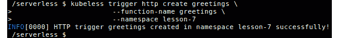

    ###### 图 7.44:创建 HTTP 触发器

7.  List the **http** triggers; you should be able to see the **http** trigger for the **hello** function:

    ```
    $ kubeless trigger http list --namespace lesson-7
    ```

    该列表将如下所示:

    

    ###### 图 7.45:列出 HTTP 触发器

8.  This will create an **ingress** object in the Kubernetes layer. We can list the **ingress** objects with the **kubectl** CLI:

    ```
    $ kubectl get ingress --namespace lesson-7
    ```

    这将返回以下内容:

    

    ###### 图 7.46:列出入口对象

9.  You can see the hostname with the **.nip.io** domain, which we can use to access the **greetings** function over HTTP.

    在这种情况下，主机名是**问候语。192.168.99.100.nip.io** 。在 web 浏览器中打开此主机名后，您应该能够在浏览器窗口中看到问候消息(请注意，根据您当地的时间，您的输出可能会有所不同):

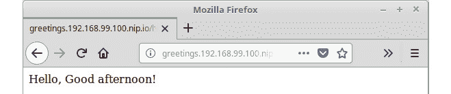

###### 图 7.47:用 HTTP GET 请求调用函数

## 无库公共触发器

通过向消息传递系统中的**主题**发送输入消息，可以调用无库函数。这种方法被称为 PubSub 机制。目前，Kubeless 支持两个消息传递系统，即卡夫卡和 NATS。

为了在 Kubeless 中创建 PubSub 触发器，我们需要有一个正在运行的 Kafka 集群或 NATS 集群。一旦卡夫卡或 NATS 集群准备好了，我们可以使用**无库触发器卡夫卡创建**来创建卡夫卡触发器，或者使用**无库触发器 nats 创建**来创建 NATS 触发器，并将我们的 PubSub 函数与新触发器相关联:

```
$ kubeless trigger <trigger-type> create <trigger-name> \
                             --function-selector <label-query> \
                             --trigger-topic <topic-name>
```

让我们讨论一下命令的每一部分是做什么的:

*   **无库触发器<触发器类型>创建<触发器名称>** :这告诉无库使用提供的名称和触发器类型创建一个 PubSub 触发器。有效的触发类型是**卡夫卡**和**纳特**。
*   **-功能选择器<标签-查询>** :这告诉我们哪个功能应该与这个触发器相关联。Kubernetes 标签用于定义这种关系(例如， **-函数选择器键 1 =值 1，键 2 =值 2** )。
*   **-触发-话题<话题-名称>** :卡夫卡经纪人会听这个话题，有消息发布给它就会触发功能。

主题是生产者的信息在哪里发布。无库命令行界面允许我们使用**无库主题**命令创建主题。这使我们能够轻松地创建、删除、列出主题以及向主题发布消息。

### 练习 23:为 Ku 无边界函数创建一个公共触发器

在本练习中，我们将首先在 Minikube 环境中创建一个 Kafka 和 Zookeeper 集群。一旦卡夫卡和动物园管理员集群准备好了，我们将创建一个用 PubSub 触发器执行的函数。接下来，我们将创建 PubSub 主题。将消息发布到创建的主题将执行无库函数。执行以下步骤完成练习。

让我们使用卡夫卡的 **PubSub** 机制调用一个无库班函数:

1.  First, we are going to deploy **Kafka** and **Zookeeper** to our Kubernetes cluster:

    ```
    $ kubectl create -f https://github.com/kubeless/kafka-trigger/releases/download/v1.0.2/kafka-zookeeper-v1.0.2.yaml
    ```

    输出如下所示:

    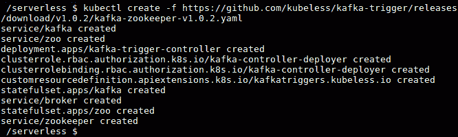

    ###### 图 7.48:安装卡夫卡和动物园管理员

2.  Verify that two **statefulset** named **kafka** and **zoo** are running in the **kubeless** namespace for Kafka and Zookeeper:

    ```
    $ kubectl get statefulset -n kubeless
    $ kubectl get services -n kubeless
    $ kubectl get deployment -n kubeless
    ```

    可以看到以下输出:

    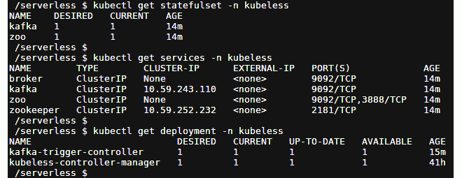

    ###### 图 7.49:验证卡夫卡和动物园管理员的安装

3.  一旦我们的卡夫卡和动物园管理员部署就绪，我们就可以创建和部署由 **PubSub** 触发器触发的功能。创建一个名为**的文件，并添加以下内容:

    ```
    def main(event, context): 
        return "Invoked with Kubeless PubSub Trigger"  
    ```** 
4.  Let's deploy our function now:

    ```
    $ kubeless function deploy pubsub --runtime python3.7 \
                               --from-file pubsub.py \
                               --handler pubsub.main
    ```

    部署将产生以下结果:

    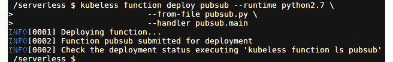

    ###### 图 7.50:部署 pubsub 函数

5.  Once the function is deployed, we can verify the function is successful by listing the function:

    ```
    $ kubeless function list pubsub 
    ```

    列出的功能如下:

    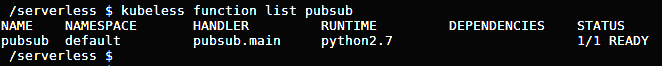

    ###### 图 7.51:验证 pubsub 函数

6.  Now, let's create the **kafka** trigger with the **kubeless trigger kafka create** command and associate our **pubsub** function with the new trigger:

    ```
    $ kubeless trigger kafka create my-trigger \
                                 --function-selector function=pubsub \
                                 --trigger-topic pubsub-topic
    ```

    它将如下所示:

    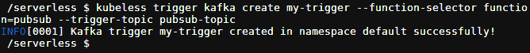

    ###### 图 7.52:为 pubsub 函数创建卡夫卡触发器

7.  现在我们需要一个无库主题来发布消息。让我们使用**无库主题创建**命令创建一个主题。我们需要确保主题名称与我们在上一步中创建**卡夫卡**触发器时提供的 **-触发器主题**相似:

    ```
    $ kubeless topic create pubsub-topic
    ```

8.  好吧。现在是时候通过向**发布子主题** :

    ```
    $ kubeless topic publish --topic pubsub-topic --data "My first message"
    ```

    发布事件来测试我们的**发布子**功能了
9.  Check the **logs** function to verify whether the **pubsub** function is successfully invoked:

    ```
    $ kubectl logs -l function=pubsub
    ```

    您应该在**输出**日志中看到发布的消息:

    ```
    ...
    My first message
    ...
    ```

    为了更好地理解这一点，请查看以下输出:

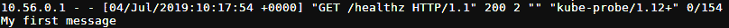

###### 图 7.53:pubsub 函数的日志

## 监控无库班函数

当我们成功地部署了我们的 Kubeless 函数时，我们需要监控我们的函数。这可以通过**无库功能顶部**命令来实现。该命令将为我们提供以下信息:

*   **名称**:无库函数的名称
*   **NAMESPACE** :函数的命名空间
*   **方法**:调用函数时的 HTTP 方法类型(例如 GET/POST)
*   **总调用数**:调用总数
*   **TOTAL_FAILURES** :功能失败的次数
*   **TOTAL_DURATION_SECONDS** :该功能执行的总秒数
*   **AVG_DURATION_SECONDS** :该功能执行的平均秒数
*   **消息**:还有其他消息吗

以下是**你好**功能的**无库功能顶部**输出:

```
$ kubeless function top hello
```

输出如下:

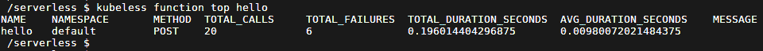

###### 图 7.54:查看 hello 函数的度量

既然我们已经监控了这个函数，现在是时候开始调试它了。

## 调试无库函数

由于多种原因，无库函数可能在函数生命周期的不同阶段(例如，从部署时间到函数执行时间)失败。在本节中，我们将调试一个函数来确定失败的原因。

为了演示多个错误场景，首先，我们将在 **debug.py** 文件中创建一个带有以下代码块的示例函数:

```
def main(event, context)
    name = event['data']['name']
    return "Hello " +  name
```

**错误场景 01**

现在，让我们尝试使用**无库函数部署**命令来部署该函数:

```
$ kubeless function deploy debug --runtime python \
                           --from-file debug.py \
                           --handler debug.main
```

这将导致**无效运行时错误**，并且 Kubeless 将显示支持的运行时。经过进一步检查，我们可以看到**无库功能部署**命令的 **-运行时**参数中有一个错别字。

结果输出如下所示:

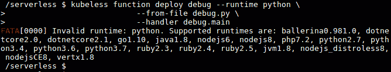

###### 图 7.55:部署调试功能-错误

让我们纠正这个错别字，用 **python3.7** 运行时重新运行**无库函数部署**命令:

```
$ kubeless function deploy debug --runtime python3.7 \
                           --from-file debug.py \
                           --handler debug.main
```

这一次，该功能将被成功部署到 Kubeless 环境中。它应该如下所示:

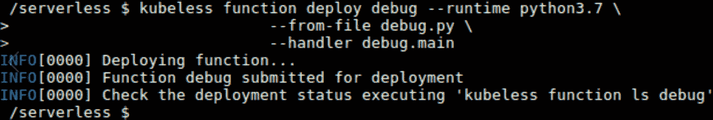

###### 图 7.56:部署调试功能-成功

**错误场景 02**

现在，让我们使用**无库班函数 ls** 命令检查函数的状态:

```
$ kubeless function ls debug
```

为了更好地理解这一点，请参考以下输出:

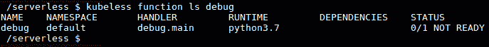

###### 图 7.57:列出调试函数

可以看到状态为 **0/1 未准备好**。现在，让我们使用 **kubectl get pods** 命令检查调试 pods 的状态:

```
$ kubectl get pods -l function=debug
```

现在，请参考下面的输出截图:

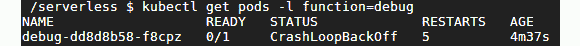

###### 图 7.58:列出调试功能盒

在这里，调试**POD**处于**故障回退**状态。这种错误通常是由于函数中的语法错误或我们指定的依赖关系造成的。

仔细观察，我们可以发现标记函数头结尾的冒号( **:** )丢失了。

让我们纠正这一点，并更新我们的功能。

打开 **debug.py** 文件，在函数头末尾加一个冒号:

```
def main(event, context):
    name = event['data']['name']
    return  "Hello " +  name
```

我们现在将执行**无库班函数更新**命令，用新的代码文件更新函数:

```
$ kubeless function update debug --from-file debug.py
```

输出如下:

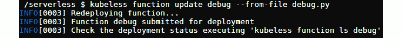

###### 图 7.59:更新调试功能

当您再次执行**无库班函数 ls** 调试时，您应该能够看到该函数现在已经准备好了 **1/1 就绪**状态:

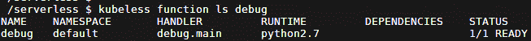

###### 图 7.60:列出调试功能

**错误场景 03**

让我们用 **hello** 函数创建一个示例错误场景。为此，您可以通过用**用户名**替换**数据**部分的键名来调用**您好**功能:

```
$ kubeless function call debug --data '{"username":"Kubeless"}'
```

现在，让我们看看它在屏幕上的样子:

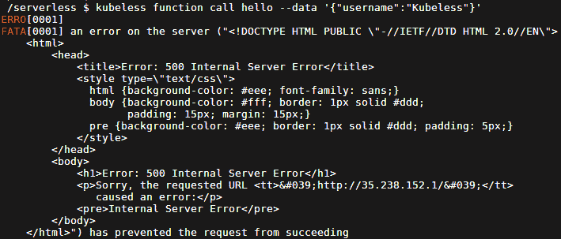

###### 图 7.61:调用调试功能-错误

为了找到此故障的可能原因，我们需要检查功能日志。您可以执行**无库功能日志**命令来查看**您好**功能的日志:

```
$ kubeless function logs debug 
```

输出如下所示:

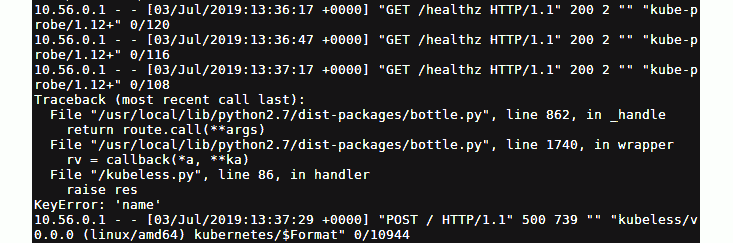

###### 图 7.62:检查调试功能日志

输出的前几行显示了类似于下面代码块的行，这些行是内部运行状况检查。根据日志，我们可以看到所有对**/healthy z**端点的调用都是成功的， **200** HTTP 成功响应代码:

```
10.56.0.1 - - [03/Jul/2019:13:36:17 +0000] "GET /healthz HTTP/1.1" 200 2 "" "kube-probe/1.12+" 0/120
```

接下来，您可以看到错误消息的堆栈跟踪，如下所示，可能的原因是**键错误:“name”**错误。该函数需要一个**【名称】**键，在函数执行过程中没有找到:

```
Traceback (most recent call last):
  File "/usr/local/lib/python3.7/dist-packages/bottle.py", line 862, in _handle
    return route.call(**args)
  File "/usr/local/lib/python3.7/dist-packages/bottle.py", line 1740, in wrapper
    rv = callback(*a, **ka)
  File "/kubeless.py", line 86, in handler
    raise res
KeyError: 'name'
```

错误消息的最后一行表示函数调用返回了 HTTP 错误 **500** :

```
10.56.0.1 - - [03/Jul/2019:13:37:29 +0000] "POST / HTTP/1.1" 500 739 "" "kubeless/v0.0.0 (linux/amd64) kubernetes/$Format" 0/10944
```

#### 注意

**HTTP 500** 是 HTTP 协议返回的错误代码，表示**内部服务器错误**。这意味着由于意外情况，服务器无法满足请求。

除了**无库函数日志**之外，还可以使用**库事件日志**命令，该命令将返回类似的输出。您需要传递 **-l** 参数，该参数表示一个标签，以便只获取特定功能的日志:

```
$ kubectl logs -l function=hello
```

输出如下:

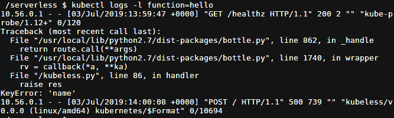

###### 图 7.63:检查调试功能日志

使用**kube CTL get functions-show-labels**命令查看与 Kubeless functions 关联的标签。

这将产生以下结果:


###### 图 7.64:列出函数标签

让我们纠正我们的错误，并将正确的参数传递给**调试**功能:

```
$ kubeless function call debug --data '{"name":"Kubeless"}'
```

现在我们的函数已经成功运行，并且已经生成**Hello kumbless**作为它的输出:

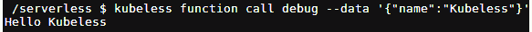

###### 图 7.65:调用调试功能-成功

## 无库无服务器插件

无服务器框架是一个通用框架，用于跨不同的无服务器提供商部署无服务器应用。无库的无服务器插件支持部署无库函数。除了无库插件之外，无服务器框架还支持无服务器应用，如 AWS Lambda、Azure 函数、谷歌云函数、Apache OpenWhisk 和无库。

在本节中，我们将安装无服务器框架，并使用无服务器框架提供的命令行界面创建一个无库函数。

在开始安装无服务器框架之前，我们需要安装 Node.js 版本 6.5.0 或更高版本作为先决条件。首先，让我们安装 Node.js:

```
$ curl -sL https://deb.nodesource.com/setup_12.x | sudo -E bash -
$ sudo apt-get install nodejs -y
```

输出如下:

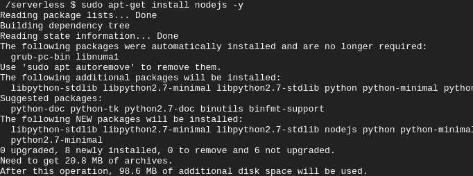

###### 图 7.66: Node.js 版本 6.5.0 安装

安装后，通过执行以下命令来验证 Node.js 版本:

```
$ nodejs -v
```

以下是输出:


###### 图 7.67: Node.js 版本验证

一旦 Node.js 安装成功，我们将通过执行以下命令来安装无服务器框架:

```
$ sudo npm install -g serverless
```

接下来，我们将验证无服务器版本:

```
$ serverless -v
```

检查输出，如下所示:


###### 图 7.68:无服务器版本验证

我们已成功完成无服务器框架的安装。我们现在可以开始用它创建函数了。

我们可以使用**无服务器创建**命令从模板创建一个基本服务。让我们创建一个名为**我的无库项目**的项目，如下所示:

```
$ serverless create --template kubeless-python --path my-kubeless-project
```

为了理解它，让我们将命令分成几部分:

*   **-模板无库-python** :目前有两个模板可供无库框架使用。**无库 python** 创建 python 函数，**无库 nodejs** 创建 Node.js 函数。
*   **-路径我的无库项目**:这定义了这个函数应该在**我的无库项目**目录下创建。看一看输出，以便更好地理解它:

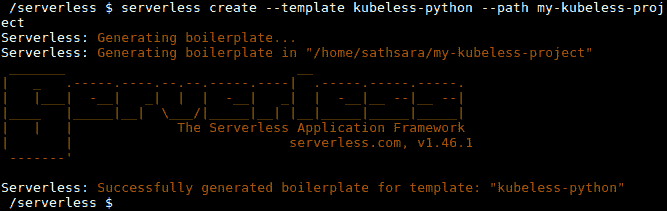

###### 图 7.69:创建我的无库项目

该命令将创建一个名为**my-kumbless-project**的目录以及该目录下的几个文件。首先，让我们通过执行以下命令移动到**我的无库项目**目录:

```
$ cd my-kubeless-project
```

以下文件位于**我的无库项目**目录中:

*   handler.py
*   无服务器. yml
*   package.json

**处理程序. py** 文件包含一个示例 Python 函数，如下所示。这是一个简单的函数，返回一个 JSON 对象和状态代码 200:

```
import json
def hello(event, context):
    body = {
        "message": "Go Serverless v1.0! Your function executed successfully!",
        "input": event['data']
    }
    response = {
        "statusCode": 200,
        "body": json.dumps(body)
    }
    return response
```

它还创建了一个**无服务器. yml** 文件，该文件告诉无服务器框架在 **handler.py** 文件中执行 **hello** 函数。在**提供程序**一节中，提到这是一个带有 **python2.7** 运行时的无库班函数。在**插件**部分，定义了需要的自定义插件，如**无服务器无库**插件:

```
# Welcome to Serverless!
#
# For full config options, check the kubeless plugin docs:
#    https://github.com/serverless/serverless-kubeless
#
# For documentation on kubeless itself:
#    http://kubeless.io
# Update the service name below with your own service name
service: my-kubeless-project
# Please ensure the serverless-kubeless provider plugin is installed globally.
# $ npm install -g serverless-kubeless
#
# ...before installing project dependencies to register this provider.
# $ npm install
provider:
  name: kubeless
  runtime: python2.7
plugins:
  - serverless-kubeless
functions:
  hello:
    handler: handler.hello
```

最后， **package.json** 文件包含 **npm** 打包信息，如**依赖项**:

```
{
  "name": "my-kubeless-project",
  "version": "1.0.0",
  "description": "Sample Kubeless Python serverless framework service.",
  "dependencies": {
    "serverless-kubeless": "^0.4.0"
  },
  "scripts": {
    "test": "echo \"Error: no test specified\" && exit 1"
  },
  "keywords": [
    "serverless",
    "kubeless"
  ],
  "author": "The Kubeless Authors",
  "license": "Apache-2.0"
}
```

您可以根据需要更新这些文件，以满足您的业务需求。在本例中，我们不会更改这些文件。

现在，我们将执行 **npm install** 命令，该命令将安装所有 **npm** 依赖项，例如**无库无服务器**插件:

```
$ npm install
```

输出如下:

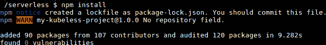

###### 图 7.70:安装 npm 依赖项

一旦依赖项准备就绪，让我们部署服务:

```
$ serverless deploy -v
```

部署服务为我们提供了以下输出:

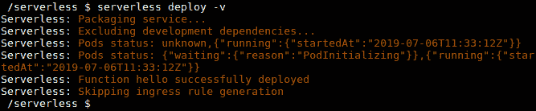

###### 图 7.71:部署服务

然后，我们可以使用以下命令部署该函数:

```
$ serverless deploy function -f hello
```

以下屏幕截图显示了输出:


###### 图 7.72:部署功能

当函数成功部署后，我们可以使用**无服务器调用**命令调用函数:

```
$ serverless invoke --function hello -l
```

调用函数会呈现以下输出:

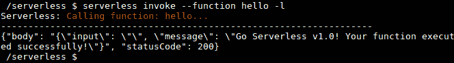

###### 图 7.73:调用函数

您也可以使用**无库班函数调用**命令来调用该函数:

```
$ kubeless function call hello
```

这样做将提供以下输出:


###### 图 7.74:使用无库函数调用来调用函数

完成该功能后，使用**无服务器删除**删除该功能:

```
$ serverless remove
```

下面是前面代码的输出:


###### 图 7.75:删除函数

#### 注意

如果在调用函数时遇到任何错误，执行**无服务器日志-f hello** 命令。

### 活动 7:用无库发布消息到 Slack

想象一下，你需要一个 Slackbot 来发布消息到你的 Slack 频道。这个 Slackbot 应该能够使用传入的 webhook 集成方法将消息发布到特定的 Slack 通道。如果将消息发布到 Slack 成功，此机器人将打印成功消息；否则，如果向 Slack 发送消息时出现任何错误，它将打印一条错误消息。在本练习中，我们将创建一个无库函数，该函数可以将消息发布到特定的 Slack 通道。

作为这项活动的先决条件，我们需要一个带有传入的 webhook 集成的 Slack 工作区。执行以下步骤创建一个松弛工作区并集成传入的网络钩子:

**解决方案-松弛设置**

1.  创建松弛工作区。
2.  访问[https://slack.com/create](https://slack.com/create)创建工作区。输入您的电子邮件地址，然后点击**创建**。
3.  您应该会收到一个六位数的确认码，确认您在上一页输入的电子邮件。在工作区输入收到的代码。
4.  为我们的工作区和 Slack 频道添加合适的名称。
5.  您将被要求为在同一项目中合作的其他人填写电子邮件标识。您可以跳过此部分或填写详细信息，然后继续。
6.  现在您的空闲频道已经准备好了，点击**在空闲**中查看您的频道。
7.  一旦点击，我们应该看到我们的频道。
8.  现在，我们将把**传入网络钩子**应用添加到我们的 Slack 中。从左侧菜单中，选择**应用**部分下的**添加应用**。
9.  在搜索栏中输入**入局勾**，然后点击**安装**入局勾**应用的**。
10.  点击**添加配置**。
11.  点击**添加入局网络钩子集成**。
12.  Save the webhook URL. We will need this when we are writing the Kubeless function.

    #### 注意

    第 422 页提供了创建带有传入 webhook 集成的 Slack 工作区的详细步骤，以及相应的截图。

    现在我们准备开始活动。执行以下步骤完成本活动:

**活动解决方案**

1.  创建一个可以向 Slack 发布消息的任何语言的函数(由 Kubeless 支持)。在本练习中，我们将编写一个执行以下步骤的 Python 函数。
2.  使用**请求**库作为依赖项。
3.  用输入消息向传入的网络钩子(在步骤 2 中创建)发送 **POST** 请求。
4.  打印发布请求的响应，
5.  将该函数部署到 Kubeless 框架中。
6.  调用函数。
7.  转到您的“可宽延时间”工作区，验证邮件是否已成功发布到“可宽延时间”频道。最终输出应该如下所示:

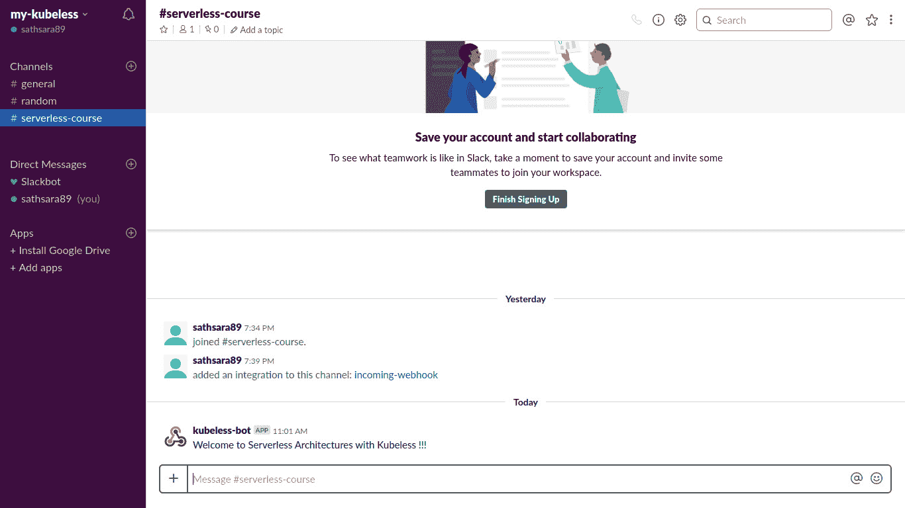

###### 图 7.76:验证消息是否成功发布

#### 注意

活动的解决方案可以在第 422 页找到。

## 总结

在本章中，我们学习了如何使用 Minikube 部署单节点 Kubernetes 集群。然后，我们在 Minikube 集群上安装了 kubless 框架、Kubeless CLI 和 Kubeless UI。一旦 Kubernetes 集群和 kubless 框架准备就绪，我们就用 Python 创建了我们的第一个 kubless 函数，并将其部署到 kubless。然后，我们讨论了调用无库函数的多种方法，即使用无库命令行界面、无库用户界面、HTTP 触发器、计划触发器和 PubSub 触发器。接下来，我们讨论了如何调试在部署 Kubeless 函数时遇到的常见错误场景。然后，我们讨论了如何使用无服务器框架来部署无库函数。最后，在活动中，我们学习了如何使用 Kubeless 函数向 Slack 通道发送消息。

在下一章中，我们将介绍 OpenWhisk，并介绍 OpenWhisk 动作和触发器。