# 八、ApacheOpenWhisk 简介

## 学习目标

本章结束时，您将能够:

*   使用 IBM 云功能运行 OpenWhisk
*   创建、列出、调用、更新和删除 OpenWhisk 操作
*   利用和调用 OpenWindow 网络动作和序列
*   使用提要、触发器和规则自动执行 openshover 操作调用

这一章涵盖了 Apache OpenWhisk 以及如何使用它的动作、触发器和包。

## OpenWhisk 简介

到目前为止，在本书中，我们已经了解了**无库**框架，这是一个开源的 Kubernetes-native 无服务器框架。我们讨论了**无库**架构，并创建和使用了**无库**函数和触发器。在这一章中，我们将学习**OpenWash**，这是另一个可以部署在 Kubernetes 之上的开源无服务器框架。

**OpenWhisk**是一个开源的无服务器框架，是 Apache 软件基金会的一部分。这最初是在 IBM 开发的，项目代码名为打蛋器，后来一旦源代码开源，就被打上了【open 打蛋器的烙印。**ApacheOpenWhisk**支持多种编程语言，包括 Ballerina、Go、Java、JavaScript、PHP、Python、Ruby、Swift 和。NET 核心。它允许我们调用用这些编程语言编写的函数来响应事件。OpenWhisk 支持许多部署选项，例如内部部署和云基础设施。

OpenWhisk 有四个核心组件:

*   **动作**:这些动作包含以支持的语言之一编写的应用逻辑，将响应事件而执行。
*   **序列**:这些将多个动作链接在一起，创建更复杂的处理流水线。
*   **触发器和规则**:这些通过将动作绑定到外部事件源来自动调用动作。
*   **包**:这些将相关动作组合在一起进行分发。

下图说明了这些组件如何相互作用:

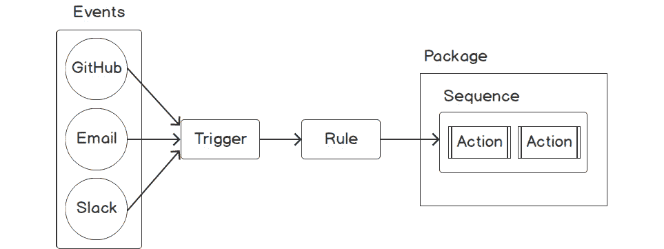

###### 图 8.1:OpenWhisk 核心组件

在下一节中，我们将学习如何使用 IBM 云函数运行 ApacheOpenWhisk。

## 运行带有 IBM 云功能的 OpenWhisk

OpenWhisk 是一个可以部署在内部或云基础设施中的框架。然而，OpenWhisk 项目的创建者 IBM 也提供了一个托管服务。 **IBM Cloud Functions** 是 IBM Cloud 基础设施上的托管 OpenWhisk 实现的名称。这本书将使用这个服务来部署我们的无服务器功能，因为 IBM 云功能是开始使用 OpenWhisk 最简单的方法。我们将首先设置一个 IBM 云帐户。

### 练习 24:建立一个 IBM 云帐户

在本练习中，我们将在 IBM Cloud 上设置一个帐户。

#### 注意

在 IBM Cloud 注册不需要信用卡。

以下步骤将帮助您完成练习:

1.  First, we need to register on IBM Cloud at [https://cloud.ibm.com/registration](https://cloud.ibm.com/registration). Then, fill in the required data and submit the form. It should look similar to the following screenshot:

    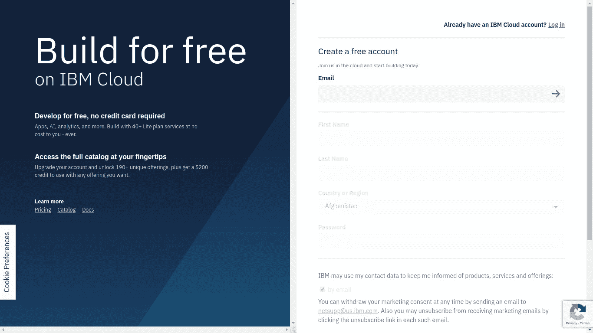

    ###### 图 8.2: IBM 云注册页面

    注册完成后，您应该会看到以下内容:

    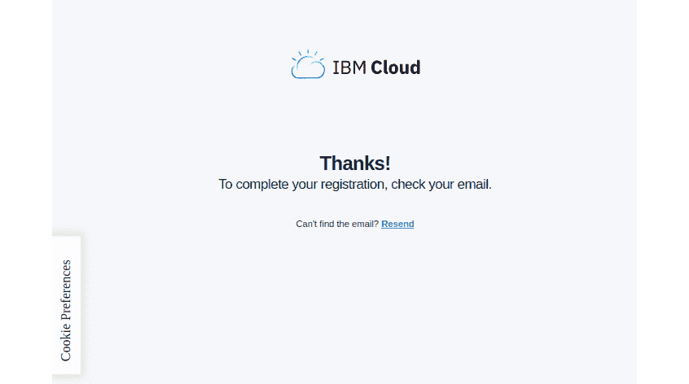

    ###### 图 8.3: IBM Cloud 注册完成页面

2.  At this point, we will receive an email with an activation link. Click on the **Confirm account** button to activate your account, as shown in the following figure:

    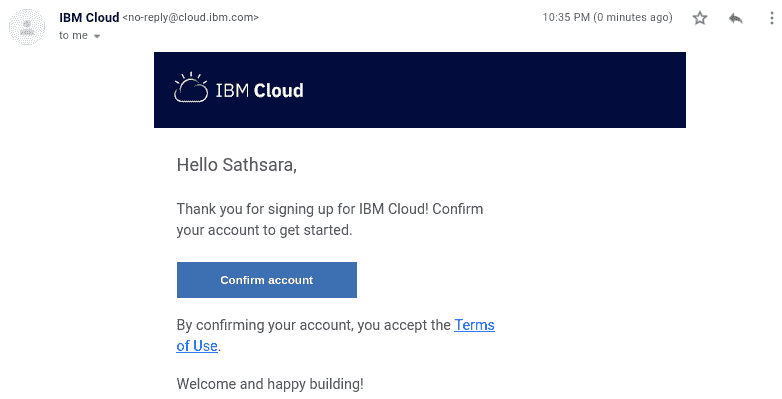

    ###### 图 8.4: IBM 云激活电子邮件

3.  When you click on the **Confirm account** button in the email, we will be taken to the IBM Cloud welcome screen. Click on the **Log in** button to log in with the credentials used to register with **IBM Cloud**, as shown in the following figure:

    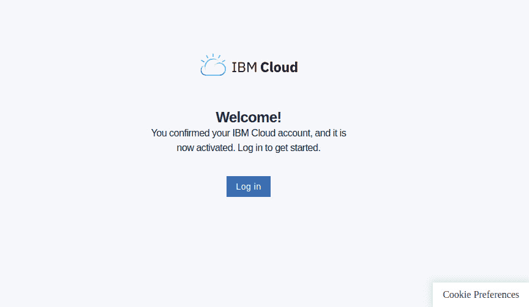

    ###### 图 8.5: IBM 云欢迎页面

4.  Acknowledge the privacy data by clicking on the **Proceed** button, as shown in the following figure:

    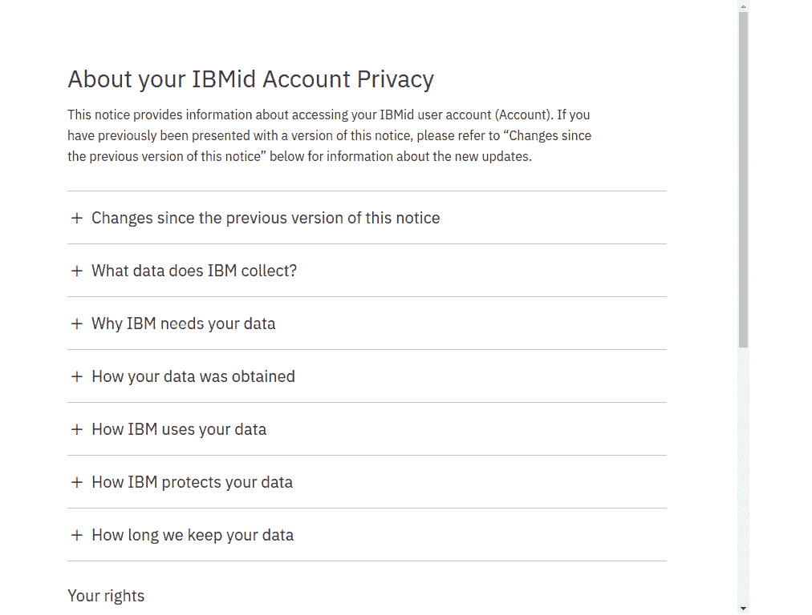

    ###### 图 8.6: IBM 云隐私政策

5.  You can skip the introduction video and proceed to the home page. Now you can click the **hamburger** icon () in the top-left corner of the screen and select **Functions** from the menu, as shown in the following figure:

    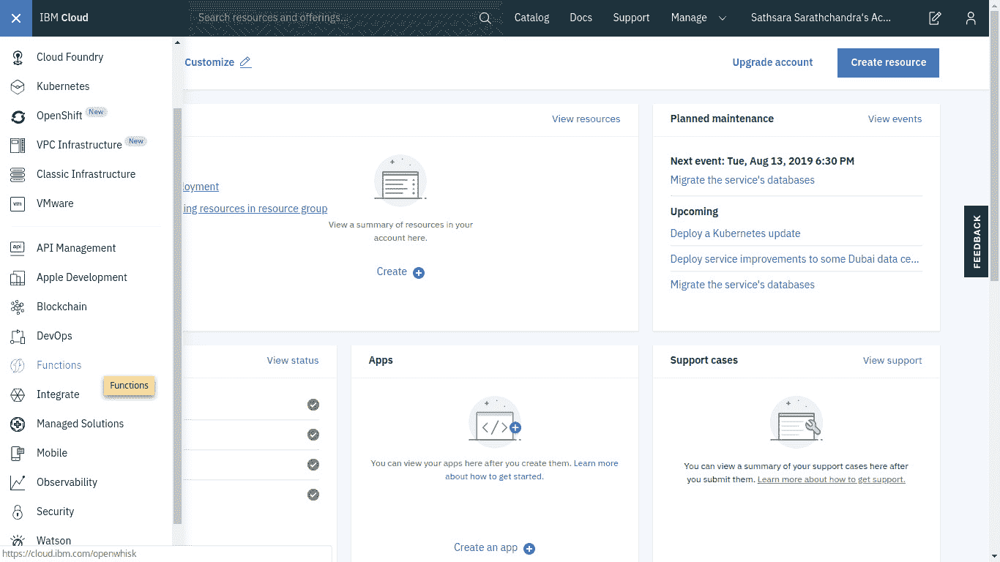

    ###### 图 8.7: IBM 云主页

6.  This will take you to the **IBM Cloud** functions page (https://cloud.ibm.com/functions/), as shown in the following figure:

    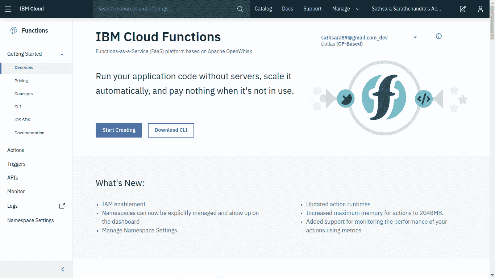

###### 图 8.8: IBM 云功能页面

OpenWhisk 提供了一个名为 **wsk** 的 CLI 来创建和管理 OpenWhisk 实体。接下来，我们将安装**OpenWhisk CLI** ，用于与 OpenWhisk 平台进行交互。

### 练习 25:安装 IBM 云命令行界面

在本练习中，我们将安装带有云功能插件的 IBM 云命令行界面，该插件支持 OpenWhisk:

1.  First, we need to download the compressed IBM Cloud CLI file. Use the **curl** command with the **-Lo** flag to download the CLI, as follows:

    ```
    $ curl -Lo ibm-cli.tar.gz  https://clis.cloud.ibm.com/download/bluemix-cli/0.18.0/linux64 
    ```

    输出应如下所示:

    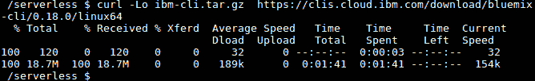

    ###### 图 8.9:下载 IBM 云命令行界面

2.  Next, we will extract the **tar.gz** file using the **tar** command as follows:

    ```
    $ tar zxvf ibm-cli.tar.gz
    ```

    输出应如下所示:

    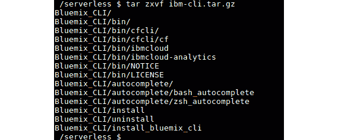

    ###### 图 8.10:提取 IBM 云命令行界面

3.  Then move the **ibmcloud** executable file to the **/usr/local/bin/** path, as shown in the following command:

    ```
    $ sudo mv Bluemix_CLI/bin/ibmcloud /usr/local/bin/ibmcloud
    ```

    输出应如下所示:

    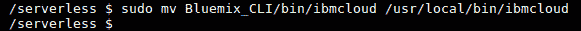

    ###### 图 8.11:将 ibmcloud 移动到/usr/local/bin

4.  Now we will log in to IBM Cloud using the IBM Cloud CLI. Execute the following command, replacing **<YOUR_EMAIL>** with the email address used when registering to IBM Cloud. Provide the email and password used during the registration phase when prompted and set the region number as **5** (**us-south**), as you can see in the following command:

    ```
    $ ibmcloud login -a cloud.ibm.com -o "<YOUR_EMAIL>" -s "dev"
    ```

    输出应如下所示:

    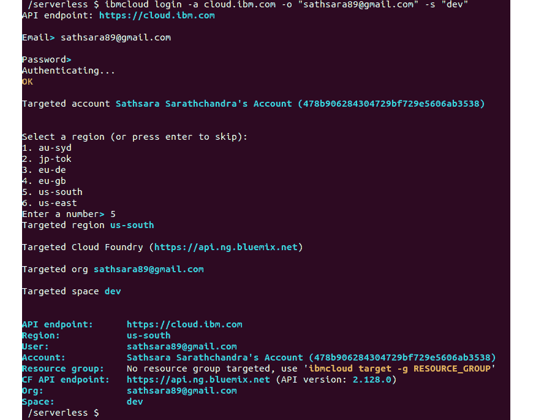

    ###### 图 8.12:登录 IBM 云

5.  Now we will install the Cloud Functions plugin using the **ibmcloud** CLI, as shown in the following command. This plugin will be used when we work with OpenWhisk entities:

    ```
    $ ibmcloud plugin install cloud-functions
    ```

    输出应如下所示:

    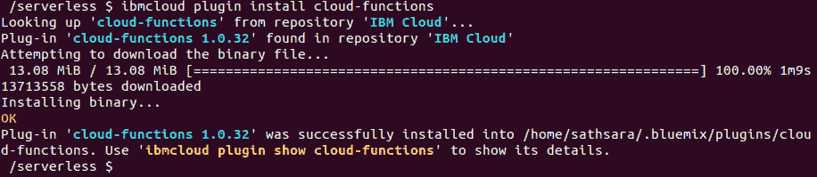

    ###### 图 8.13:安装云功能

6.  Next, we will provide the target organization (the organization name is your email address) and the space (which defaults to **dev**) using the following command:

    ```
    $ ibmcloud target -o <YOUR_EMAIL> -s dev
    ```

    输出应如下所示:

    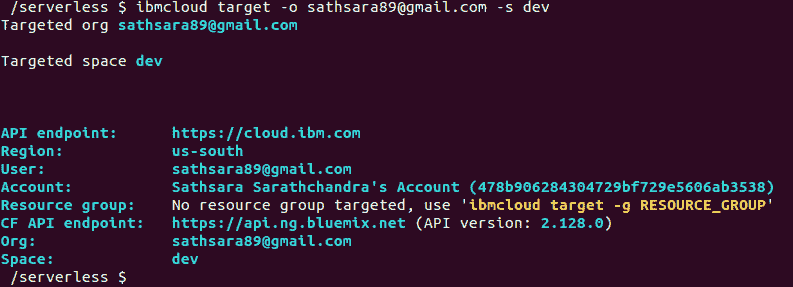

    ###### 图 8.14:设置目标组织和空间

7.  Now the configurations are done. We can use **ibmcloud wsk** to interact with OpenWhisk entities, as shown in the following command:

    ```
    $ ibmcloud wsk action list
    ```

    输出应如下所示:

    

    ###### 图 8.15:列出了 OpenWhisk 操作

    #### 注意

    在这本书里，我们将使用 **wsk** 命令来管理 OpenWhisk 实体，而不是 IBM Cloud Functions 提供的 **ibmcloud wsk** 命令。它们都提供相同的功能。唯一不同的是 **wsk** 是 OpenWhisk 的标准 CLI，而 **ibmcloud fn** 是来自 IBM 云功能插件。

8.  Let's create a Linux alias, **wsk="ibmcloud wsk"**. First, open the **~/.bashrc** file with your favorite text editor. In the following command, we will be using the **vim** text editor to open the file:

    ```
    vim ~/.bashrc
    ```

    在文件末尾添加以下一行:

    ```
    alias wsk="ibmcloud wsk"
    ```

9.  Source the **~/.bashrc** file to apply the changes, as shown in the following command:

    ```
    $ source ~/.bashrc
    ```

    输出应如下所示:

    

    ###### 图 8.16:获取 bashrc 文件

10.  Now we should be able to invoke OpenWhisk with the **wsk** command. Execute the following command to verify the installation:

    ```
    $ wsk --help
    ```

    这将打印 **wsk** 命令的帮助页面，如下图所示:

    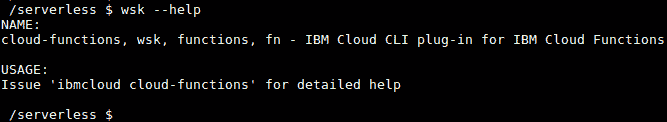

###### 图 8.17:wsk 命令的输出

现在，让我们继续下一节关于 OpenWhisk 操作的内容。

## 开启搅拌动作

在 OpenWhisk 中，动作是开发人员编写的代码片段，将响应事件而执行。这些动作可以用 OpenWhisk 支持的任何编程语言编写:

*   芭蕾舞女演员
*   去
*   Java 语言(一种计算机语言，尤用于创建网站)
*   Java Script 语言
*   服务器端编程语言（Professional Hypertext Preprocessor 的缩写）
*   计算机编程语言
*   红宝石
*   迅速发生的
*   。净核心

此外，如果我们的首选语言运行时还不被 OpenWhisk 支持，我们可以使用定制的 Docker 映像。这些动作将接收一个 JSON 对象作为输入，然后在动作中执行必要的处理，最后返回一个带有处理结果的 JSON 对象。在接下来的几节中，我们将重点介绍如何使用 **wsk** CLI 编写、创建、列出、调用、更新和删除 OpenWhisk 操作。

### 打开搅拌器的书写动作

当用您喜欢的语言编写 When OpenWhisk 动作时，几乎没有什么标准是您必须遵循的。它们如下:

*   每个动作都应该有一个名为 **main** 的函数，这是动作的入口点。源代码可以有额外的功能，但是**主**功能将在动作触发后执行。
*   The function must return a JSON object as the response.

    #### 注意

    在本章中，我们将主要使用 JavaScript 来创建函数代码。

让我们看一个例子，在这个例子中，我们创建了一个符合我们刚才提到的规则的 JavaScript 代码( **random-number.js** )。这是一个简单的函数，它生成一个 0 到 1 之间的随机数，并将生成的数字作为函数的响应返回:

```
function main() {
    var randomNumber = Math.random();
    return { number: randomNumber };
} 
```

下面是一个符合规则的 PHP 函数:

```
<?php
function main()
{
    $randomNumber = rand();
    return ["number" => $randomNumber];
}
```

### 在 OpenWhisk 框架中创建的动作

现在，是时候使用上一节中编写的动作代码在 OpenWhisk 框架上创建一个动作了。我们将使用 **wsk 动作创建**命令，其格式如下:

```
$ wsk action create <action-name> <action-file-name>
```

**<动作-名称>** 是动作的标识符。它应该是唯一的，以防止命名冲突。 **<动作-文件名>** 是包含动作源代码的文件。让我们执行下面的命令，使用**随机数. js** 文件中的动作源代码创建一个名为**随机数**的 OpenWhisk 动作:

```
$ wsk action create randomNumber random-number.js
```

我们从该命令接收到的输出如下所示:

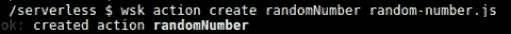

###### 图 8.18:创建随机数操作

正如我们在输出中看到的，每当成功创建一个操作时，CLI 提示符都会适当地通知读者该操作的状态。

OpenWindow 框架将根据源代码文件的扩展名来确定执行操作的运行时。在前面的场景中，将为所提供的**选择 Node.js **10** 运行时。js** 文件。如果您想要覆盖 OpenWhisk 框架选择的默认运行时，您可以使用 **- kind** 标志和 **wsk 动作创建**命令:

```
 $ wsk action create secondRandomNumber random-number.js --kind nodejs:8
```

输出应如下所示:

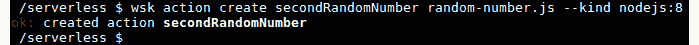

###### 图 8.19:用 nodejs:8 运行时创建一个 randomNumber 操作

前面的输出表明**秒随机数**已成功创建。在本节的最后，我们已经部署了两个 OpenWhisk 操作。

了解了如何在 OpenShaw 框架上创建动作之后，接下来我们将着手列出 OpenShaw 动作。

### 列表打开搅拌交流选项

在本节中，我们将使用以下命令，使用 **wsk** 命令行界面列出环境中的 OpenWhisk 操作:

```
$ wsk action list
```

输出应如下所示:

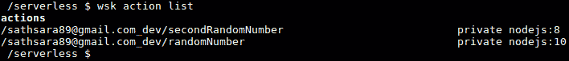

###### 图 8.20:列出所有动作

从前面的输出中，我们可以看到前面创建的两个动作，名称分别为**随机数**和**秒随机数**。 **wsk 动作列表**命令列出了动作以及这些动作的运行时间，例如 **nodejs:8** 或者 **nodejs:10** 。默认情况下，操作列表将根据上次更新时间进行排序，因此最近更新的操作将位于列表顶部。如果希望列表按字母顺序排序，可以使用 **-名称-排序**(或 **-n** )标志，如下命令所示:

```
$ wsk action list --name-sort
```

输出应如下所示:

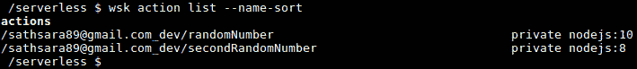

###### 图 8.21:按名称升序列出所有动作

### 调用开放搅拌法离子

现在我们的行动已经准备好了。使用 **wsk** 命令行界面，可以通过两种方式调用 openshover 操作:

*   请求-响应
*   先开火后忘记

**请求-响应**方法是同步的；动作调用将等待，直到结果可用。另一方面，**一发不可收拾**的方法是异步的。这将返回一个名为激活标识的标识，稍后可以使用它来获取结果。

以下是调用动作的 **wsk** 命令的标准格式:

```
$ wsk action invoke <action-name> 
```

**请求-响应调用方法**

在**请求-响应**方法中， **wsk 动作调用**命令与 **-阻塞**(或 **-b** 标志一起使用，要求 **wsk** CLI 等待调用结果:

```
$ wsk action invoke randomNumber --blocking 
```

前面的命令将在终端中返回以下输出，其中包含从方法返回的结果以及关于方法调用的其他元数据:

```
ok: invoked /_/randomNumber with id 002738b1acee4abba738b1aceedabb60
{
    "activationId": "002738b1acee4abba738b1aceedabb60",
    "annotations": [
        {
            "key": "path",
            "value": "your_email_address_dev/randomNumber"
        },
        {
            "key": "waitTime",
            "value": 79
        },
        {
            "key": "kind",
            "value": "nodejs:10"
        },
        {
            "key": "timeout",
            "value": false
        },
        {
            "key": "limits",
            "value": {
                "concurrency": 1,
                "logs": 10,
                "memory": 256,
                "timeout": 60000
            }
        },
        {
            "key": "initTime",
            "value": 39
        }
    ],
    "duration": 46,
    "end": 1564829766237,
    "logs": [],
    "name": "randomNumber",
    "namespace": "your_email_address_dev",
    "publish": false,
    "response": {
        "result": {
            "number": 0.6488215545330562
        },
        "status": "success",
        "success": true
    },
    "start": 1564829766191,
    "subject": "your_email_address",
    "version": "0.0.1"
}
```

我们可以在返回的 JSON 对象的**响应**部分看到主函数返回的输出(**“数字”:0.6488215545330562** )。这是我们之前写的 JavaScript 函数生成的随机数。返回的 JSON 对象包含一个激活 ID(**“activation ID”:“002738 b1acee4b ba 738 b1aceedabb 60”)**，我们以后可以用它来获取结果。该输出包括其他重要值，如动作调用状态(**“状态”:“成功”**)、开始时间(**“开始”:156482976619** )、结束时间(**“结束”:1564829766237** )以及该动作的执行时长(**“时长”:46** )。

#### 注意

我们将在**勿忘我调用方法**部分讨论如何使用**激活标识**获取激活结果。

如果我们需要在没有其他元数据的情况下获得动作的结果，我们可以使用 **- result** (或 **-r** )标志，如下代码所示:

```
$ wsk action invoke randomNumber --result 
```

输出应如下所示:

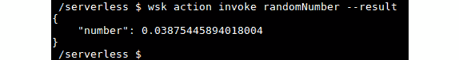

###### 图 8.22:使用请求和响应方法调用随机数操作

**一劳永逸的调用方法**

使用**一劳永逸**方法的动作调用不需要等待动作的结果。相反，它们返回一个激活标识，我们可以用它来获取操作的结果。该调用方法使用与请求-响应方法类似的命令，但没有 **-阻塞**(或 **-b** )标志:

```
$ wsk action invoke randomNumber 
```

输出应如下所示:

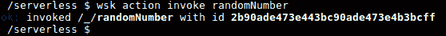

###### 图 8.23:使用一劳永逸的方法调用随机数操作

在前面的结果中，我们可以看到返回的**2b 90 ade 473 e 443 BC 90 ade 473 E4 B3 bcff**的激活 ID(请注意您的激活 ID 会有所不同)。

现在我们可以使用 **wsk 激活获取**命令来获取给定激活 ID 的结果:

```
$ wsk activation get "<activation_id>"
```

您需要用使用 **wsk 操作调用**命令调用函数时返回的值替换 **< activation_id >** :

```
$ wsk activation get 2b90ade473e443bc90ade473e4b3bcff
ok: got activation 2b90ade473e443bc90ade473e4b3bcff
{
    "namespace": "sathsara89@gmail.com_dev",
    "name": "randomNumber",
    "version": "0.0.2",
    "subject": "sathsara89@gmail.com",
    "activationId": "2b90ade473e443bc90ade473e4b3bcff",
    "start": 1564832684116,
    "end": 1564832684171,
    "duration": 55,
    "statusCode": 0,
    "response": {
        "status": "success",
        "statusCode": 0,
        "success": true,
        "result": {
            "number": 0.05105974715780626
        }
    },
    "logs": [],
    "annotations": [
        {
            "key": "path",
            "value": "sathsara89@gmail.com_dev/randomNumber"
        },
        {
            "key": "waitTime",
            "value": 126
        },
        {
            "key": "kind",
            "value": "nodejs:10"
        },
        {
            "key": "timeout",
            "value": false
        },
        {
            "key": "limits",
            "value": {
                "concurrency": 1,
                "logs": 10,
                "memory": 256,
                "timeout": 60000
            }
        },
        {
            "key": "initTime",
            "value": 41
        }
    ],
    "publish": false
}
```

如果您希望仅检索激活摘要，则应在 **wsk 激活获取**命令中提供 **-摘要**(或 **-s** )标志:

```
$ wsk activation get <activation-id> --summary
```

前面命令的输出将打印激活详细信息的摘要，如下图所示:

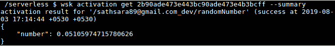

###### 图 8.24:激活摘要

**wsk 激活结果**命令只返回动作的结果，省略任何元数据:

```
$ wsk activation result <activation-id> 
```

输出应如下所示:

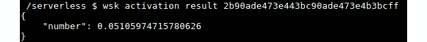

###### 图 8.25:激活结果

**wsk 激活列表**命令可用于列出所有激活:

```
$ wsk activation list 
```

输出应如下所示:

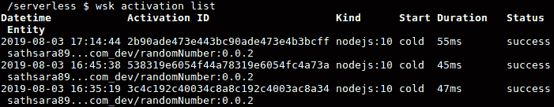

###### 图 8.26:列出激活

前面的命令返回一个激活列表，按照激活调用的**日期时间**排序。下表描述了每一列提供的信息:

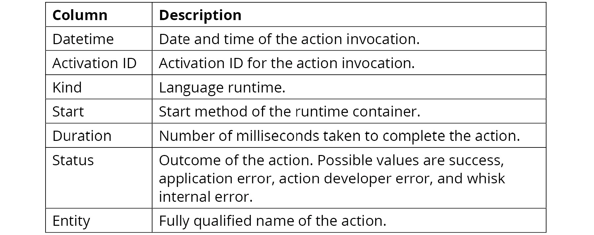

###### 图 8.27:栏目说明

### 更新打开搅拌动作

在这一节中，我们将学习如何在 OpenWindow 平台上创建动作后更新其源代码。出于几个原因，我们可能需要更新操作。代码中可能有错误，或者我们只是想增强代码。使用 **wsk** 命令行界面，可以使用 **wsk 动作更新**命令来更新一个 OpenWhisk 动作:

```
$ wsk action update <action-name> <action-file-name>
```

我们已经有一个打印随机数的动作，它是在**随机数. js** 函数中定义的。这个函数打印一个 0 到 1 之间的值，但是如果我们想打印一个 1 到 100 之间的随机数呢？现在可以使用以下代码来完成:

```
function main() {
    var randomNumber = Math.floor((Math.random() * 100) + 1);
    return { number: randomNumber };
} 
```

然后，我们可以执行 **wsk 动作更新**命令来更新**随机数**动作:

```
$ wsk action update randomNumber random-number.js
```

输出应如下所示:

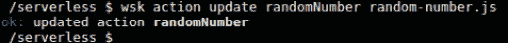

###### 图 8.28:更新随机数操作

现在，我们可以通过执行以下命令来验证更新操作的结果:

```
$ wsk action invoke randomNumber --result
```

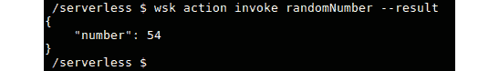

###### 图 8.29:调用随机数操作

我们可以看到，**随机数字**动作返回了一个 1 到 100 之间的数字。我们可以多次调用**随机数**函数来验证它返回的输出数是否在 1 到 100 之间。

### 打开搅拌动作

在这一节中，我们将讨论如何删除一个 OpenWhisk 动作。 **wsk 动作删除**命令用于删除 OpenWhisk 动作:

```
$ wsk action delete <action-name> 
```

让我们执行 **wsk 操作删除**命令，删除我们在前面几节中创建的**随机数**和**秒随机数**操作:

```
$ wsk action delete randomNumber 
$ wsk action delete secondRandomNumber 
```

输出应如下所示:

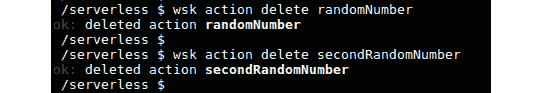

###### 图 8.30:删除随机数和第二随机数操作

现在，我们已经学习了如何编写、创建、列出、调用、更新和删除 OpenWhisk 动作。让我们继续进行一个练习，在这个练习中，您将创建您的第一个 OpenWhisk 动作。

### Exe rcise 26:创建您的第一个 OpenWhisk 动作

在本练习中，我们将首先创建一个 JavaScript 函数，该函数接收考试分数作为输入，并使用以下标准返回考试结果:

*   如果标记等于或大于 60，返回**通过**。
*   如果标记低于 60，返回**失败**。

接下来，我们将使用前面提到的 JavaScript 函数代码，在 OpenWhisk 框架中创建一个名为**example results**的动作。然后，我们将调用该操作来验证它是否按预期返回了结果。验证行动响应后，我们将更新行动，根据以下标准返回带有结果的考试成绩:

*   如果分数等于或高于 80 分，则返回**通过 A 级**。
*   如果分数等于或高于 70 分，则返回**通过 B 级**。
*   如果分数等于或高于 60，则返回**通过 C 级**。
*   如果标记低于 60，返回**失败**。

同样，我们将调用该操作来验证结果，并最终删除该操作。

#### 注意

本练习的代码文件可在[https://github . com/trainingypbackt/server less-Architectures-with-Kubernetes/tree/master/lesson 08/练习 26](https://github.com/TrainingByPackt/Serverless-Architectures-with-Kubernetes/tree/master/Lesson08/Exercise26) 中找到。

执行以下步骤完成练习:

1.  首先，让我们在**考试结果. js** 文件中创建一个 JavaScript 函数，它将根据提供的考试分数返回考试结果:

    ```
    function main(params) {
        var examResult = '';
        if (params.examMarks < 0 || params.examMarks > 100) {
            examResult = 'ERROR: invalid exam mark';
        } else if (params.examMarks >= 60) {
            examResult = 'Pass';
        } else {
          examResult = 'Fail';
        }

        return { result: examResult };
    }
    ```

2.  Now, let's create the OpenWhisk action named **examResult** from the **exam-result.js** file created in *step 1*:

    ```
    $ wsk action create examResult exam-result.js
    ```

    输出应如下所示:

    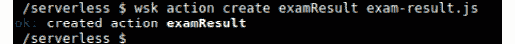

    ###### 图 8.31:创建检查结果动作

3.  Once the action creation is successful, we can invoke the **examResult** action by sending a value between 0 to 100 to the **examMarks** parameter:

    ```
    $ wsk action invoke examResult --param examMarks 72 –result
    ```

    输出应如下所示:

    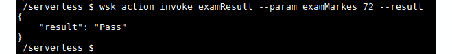

    ###### 图 8.32:调用检查结果操作

4.  在这一步，我们将在**考试-成绩-02.js** 中创建一个新的 JavaScript 函数，用**成绩**参数

    ```
    function main(params) {
        var examResult = '';
        if (params.examMarks < 0 || params.examMarks > 100) {
            examResult = 'ERROR: invalid exam mark';
        } else if (params.examMarks > 80) {
            examResult = 'Pass with grade A';
        } else if (params.examMarks > 70) {
            examResult = 'Pass with grade B';
        } else if (params.examMarks > 60) {
            examResult = 'Pass with grade C';
        } else {
            examResult = 'Fail';
        }

        return { result: examResult };
    }
    ```

    返回考试成绩
5.  Now, let's update the OpenWhisk action with the previously updated **exam-result-02.js** file:

    ```
    $ wsk action update examResult exam-result-02.js
    ```

    输出应如下所示:

    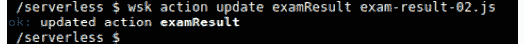

    ###### 图 8.33:更新检查结果操作

6.  Once the action is updated, we can invoke the action multiple times with different exam marks as parameters to verify the functionality:

    ```
    $ wsk action invoke examResult --param examMarks 150 --result
    $ wsk action invoke examResult --param examMarks 75 --result
    $ wsk action invoke examResult --param examMarks 42 –result
    ```

    输出应如下所示:

    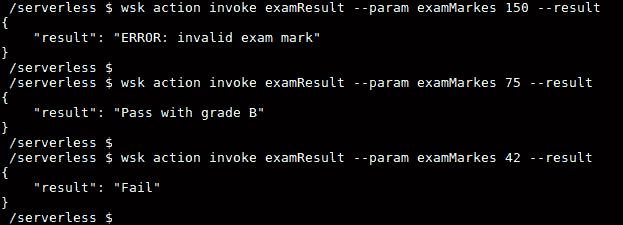

    ###### 图 8.34:用不同的参数值调用 examResult 操作

7.  最后，我们将删除**检查结果**动作:

```
$ wsk action delete examResult 
```

输出应如下所示:


###### 图 8.35:删除检查结果操作

在本练习中，我们学习了如何创建一个遵循 OpenWhisk 操作标准的 JavaScript 函数。然后我们创建了这个动作，并用 **wsk** CLI 调用它。之后，我们更改了函数代码的逻辑，并用最新的函数代码更新了动作。最后，我们通过删除操作来执行清理。

### 开放搅拌序列

在 OpenWindow 中，通常在编程中，函数(在 OpenWindow 中称为动作)被期望执行一个单一的集中任务。这将有助于通过重用相同的函数代码来减少代码重复。但是创建复杂的应用需要将多个动作连接在一起才能达到预期的结果。OpenWhisk 序列用于将多个 OpenWhisk 动作(可以在不同的编程语言运行时)链接在一起，并创建更复杂的处理流水线。

下图说明了如何通过链接多个动作来构建序列:

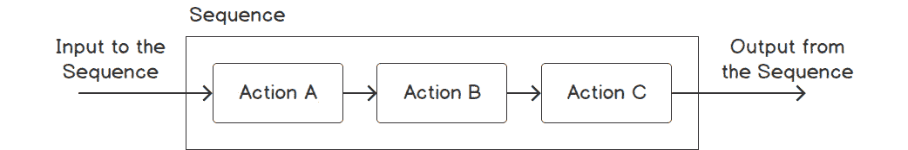

###### 图 8.36:OpenWash 序列

我们可以将参数(如果有的话)传递给序列，它将被用作第一个动作的输入。然后，每个动作的输出将作为下一个动作的输入，序列的最终动作将返回其结果作为序列的输出。用不同编程语言编写的动作也可以用序列链接在一起。

可以使用带有 **-序列**标志的 **wsk 动作创建**命令来创建序列，以提供逗号分隔的要调用的动作列表:

```
$ wsk action create <sequence-name> --sequence <action-01>,<action-02>
```

为了演示 OpenWhisk 序列的概念，我们将在下面的部分创建一个名为**登录**的序列，该序列由两个动作组成，名为**认证**和**授权**。当用户尝试登录应用时，将调用**登录**操作。如果用户在登录时提供了正确的凭据，他们就可以查看系统上的所有内容。但是，如果用户未能提供正确的登录凭据，他们只能查看系统的公共内容。

#### 注意

身份验证是验证用户的身份，授权是授予对系统的所需访问级别。

首先，我们创建 **authentication.js** 函数。该功能将接收两个参数，命名为**用户名**和**密码**。如果用户名和密码与 **admin** (对于**用户名**参数)和**open swash**(对于**密码**参数)的硬编码值匹配，则该功能将返回**认证结果**为**真**。否则**认证结果**为**假**:

```
function main(params) {
    var authenticationResult = '';
    if (params.username == 'admin' && params.password == 'openwhisk') {
        authenticationResult = 'true';
    } else {
        authenticationResult = 'false';
    }
    return { authenticationSuccess: authenticationResult };
}
```

下一个功能是 **authorization.js** ，它以 **authenticationSuccess** 值为输入，向用户显示合适的内容。如果用户成功通过认证(**认证成功=真**)，**‘认证成功！您可以查看将显示的所有内容'**消息。如果认证失败(**认证成功！=真**，**'认证失败！您只能查看公共内容'**消息将显示:

```
function main(params) {
    var contentMessage = '';
    if (params.authenticationSuccess == "true") {
        contentMessage = 'Authentication Success! You can view all content';
    } else {
        contentMessage = 'Authentication Failed! You can view only public content';
    }
    return { content: contentMessage };
}
```

现在，让我们使用 **wsk 动作创建**命令来部署这两个动作:

```
$ wsk action create authentication authentication.js 
$ wsk action create authorization authorization.js 
```

输出应如下所示:

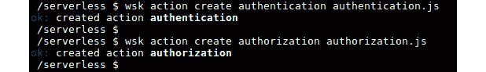

###### 图 8.37:创建身份验证和授权操作

现在身份验证和授权操作都准备好了。让我们通过组合**认证**和**授权**动作来创建一个名为**登录**的序列:

```
$ wsk action create login --sequence authentication,authorization
```

输出应如下所示:

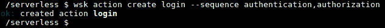

###### 图 8.38:创建登录序列

现在是测试登录序列的时候了。首先，我们将通过发送正确的凭据来调用登录序列(**用户名** = **管理员**和**密码**=**OpenWhisk**):

```
$ wsk action invoke login --param username admin --param password openwhisk –result
```

输出应如下所示:

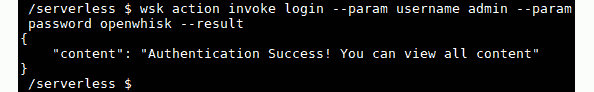

###### 图 8.39:用有效的凭证调用登录序列

前面的截图显示了成功登录的预期结果。现在，让我们通过发送不正确的凭据来调用登录序列(**用户名** = **黑客**和**密码** = **黑客**)。这一次，我们预计会收到一条身份验证失败消息:

```
$ wsk action invoke login --param username hacker --param password hacker –result
```

输出应如下所示:

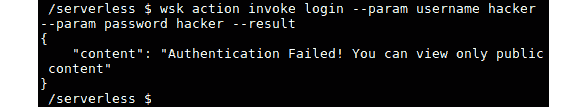

###### 图 8.40:使用无效凭证调用登录序列

在这一节中，我们学习了 OpenWhisk 序列。我们创建了多个动作，使用序列将它们链接在一起，并通过发送所需的参数来调用序列。

### 练习 27: 创建开放搅拌序列

在本练习中，我们将使用用不同语言编写的两个动作创建一个序列。第一个动作用 Python 编写，接收两次考试的分数，并返回平均分数。第二个动作用 JavaScript 编写，接收平均分数并返回通过或失败。

#### 注意

本练习的代码文件可在[https://github . com/trainingypbackt/server less-Architectures-with-Kubernetes/tree/master/lesson 08/练习 27](https://github.com/TrainingByPackt/Serverless-Architectures-with-Kubernetes/tree/master/Lesson08/Exercise27) 中找到。

以下步骤将帮助您完成练习:

1.  写第一个函数( **calculate-average.py** ，计算平均分数。该功能将接收两次考试的分数作为输入:

    ```
    def main(params):
        examOneMarks = params.get("examOneMarks")
        examTwoMarks = params.get("examTwoMarks")

        fullMarks = examOneMarks + examTwoMarks
        averageMarks =  fullMarks / 2

        return {"averageMarks": averageMarks}
    ```

2.  Create an OpenWhisk action named **calculateAverage** from **calculate-average.py**:

    ```
    $ wsk action create calculateAverage calculate-average.py
    ```

    输出应如下所示:

    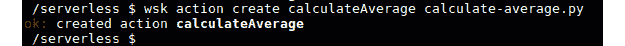

    ###### 图 8.41:创建计算平均操作

3.  通过调用**计算平均**动作来检查该动作是否如预期的那样工作:

    ```
    $ wsk action invoke calculateAverage --param examOneMarks 82 --param examTwoMarks 68 –result
    ```

4.  The output should be as follows:

    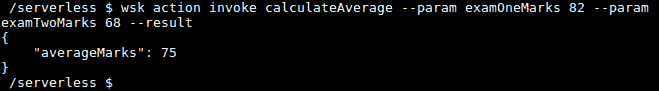

    ###### 图 8.42:调用计算平均操作

5.  Create the second function (**show-result.js**), which returns the exam result (**Pass** or **Fail**) based on the average marks. The exam results will be based on the logic as marks less than 0 or greater than 100 will return an **Error**; marks greater than or equal to 60 will return **Pass**; else it will return **Fail**.

    代码如下:

    ```
    function main(params) {
        var examResult = '';

        if (params.averageMarks < 0 || params.averageMarks > 100) {
            examResult = 'ERROR: invalid average exam mark';
        } else if (params.averageMarks >= 60) {
            examResult = 'Pass';
        } else {
            examResult = 'Fail';
        }

        return { result: examResult };
    }
    ```

6.  Create an OpenWhisk action named **showResult** from **show-result.js**:

    ```
    $ wsk action create showResult show-result.js
    ```

    输出应如下所示:

    

    ###### 图 8.43:创建显示结果操作

7.  Check that the **showResult** action is working as expected by invoking it:

    ```
    $ wsk action invoke showResult --param averageMarks 75 –result
    ```

    输出应如下所示:

    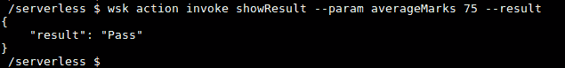

    ###### 图 8.44:调用显示结果操作

8.  Create the **getExamResults** sequence with the **calculateAverage** and **showResult** actions:

    ```
    $ wsk action create getExamResults --sequence calculateAverage,showResult
    ```

    输出应如下所示:

    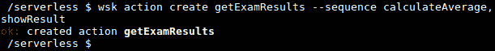

    ###### 图 8.45:创建 getExamResults 序列

9.  Invoke the **getExamResults** sequence and verify the result:

    ```
    $ wsk action invoke getExamResults --param examOneMarks 82 --param examTwoMarks 68 –result
    ```

    输出应如下所示:

    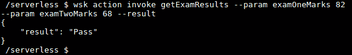

###### 图 8.46:调用 getExamResults 序列

### 打开网页动作

到目前为止，我们已经使用 **wsk 操作调用**命令通过 **wsk** 命令行界面调用了我们的 OpenWhisk 操作。尽管这种调用方法非常简单，并且在开发阶段非常适合我们，但是外部方(如外部应用或用户)不能使用 **wsk** CLI 来调用我们的操作。作为一个解决方案，我们可以使用 openshough web actions，它将允许通过具有公开可用 URL 的 HTTP 请求来调用操作。

when OpenWhisk 标准动作在调用动作时需要身份验证(这由 **wsk** CLI 内部处理)，并且必须返回一个 JSON 有效负载作为响应。相比之下，web 操作可以在没有身份验证的情况下调用，并且可以返回额外的信息，例如 HTTP 头和非 JSON 负载，例如 HTML 和二进制数据。

在使用 **wsk** CLI 创建( **wsk 动作创建**)或更新( **wsk 动作更新**)动作时，通过发送 **- web true** (或 **- web yes** )标志，可以将一个 OpenWhisk 标准动作转换为 web 动作。

让我们创建一个 JavaScript 函数( **web-action.js** )作为 web 操作来调用。如果我们没有为名称参数传递值，该函数将返回**你好，陌生人**，当我们为**名称**参数传递值时，该函数将返回带有名称的**你好**:

```
function main(params) {
    var helloMessage = ''
    if (params.name) {
        helloMessage = 'Hello, ' + params.name;
    } else {
        helloMessage = 'Hello, Stranger';
    }

    return { result: helloMessage };
}
```

现在，我们可以通过发送带有 **wsk 动作创建**命令的 **-网络真**标志来创建网络动作:

```
$ wsk action create myWebAction web-action.js --web true
```

输出应如下所示:


###### 图 8.47:将我的网络动作创建为网络动作

然后，我们可以使用 web 操作 URL 调用创建的 web 操作。网页动作网址的一般格式如下:

```
https://{APIHOST}/api/v1/web/{QUALIFIED_ACTION_NAME}.{EXT}
```

让我们讨论这个网址的每个组成部分:

*   **APIHOST**:IBM 云功能的 **APIHOST** 值为**openwhisk.ng.bluemix.net**。
*   **QUALIFIED _ ACTION _ NAME**:web 动作在 **<命名空间> / <包-名称> / <动作-名称>** 格式中的完全限定名。如果动作不在名为**的包**中，则使用**默认**作为 **<包-名为>** 的值。
*   **EXT** :表示 web 动作预期响应类型的扩展。

我们可以使用 **- url** 标志和 **wsk 动作获取**命令来检索网页动作的 url:

```
$ wsk action get myWebAction –url
```

输出应如下所示:

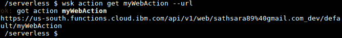

###### 图 8.48:检索我的网络行动的公共网址

我们需要追加**。json** 作为前面 URL 的扩展，因为我们的 web 动作是用 json 有效负载来响应的。现在我们可以在网络浏览器中打开这个网址，或者使用 **curl** 命令来检索输出。

让我们使用网络浏览器调用前面的网址:

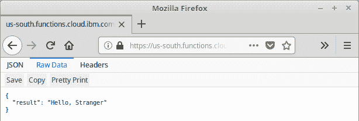

###### 图 8.49:从没有名称参数的网页浏览器调用我的网页动作

**你好，陌生人**是预期的响应，因为我们没有在查询中为**名称**参数传递值。

现在，让我们通过追加**来调用同一个 URL？名称= openshough**在网址的末尾:

[https://us-south . functions . cloud . IBM . com/API/v1/web/sathsara 89% 40 Gmail . com _ dev/default/mywebaction . JSON？名称= OpenWash](https://us-south.functions.cloud.ibm.com/api/v1/web/sathsara89%40gmail.com_dev/default/myWebAction.json?name=OpenWhisk)

输出应如下所示:

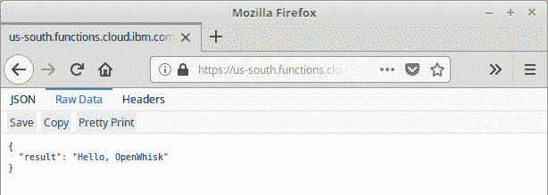

###### 图 8.50:使用 name 参数从 web 浏览器调用 myWebAction

我们可以使用以下命令调用与 **curl** 请求相同的网址:

```
$ curl https://us-south.functions.cloud.ibm.com/api/v1/web/sathsara89%40gmail.com_dev/default/myWebAction.json?name=OpenWhisk
```

输出应如下所示:

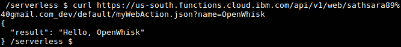

###### 图 8.51:调用 myWebAction 作为带有 name 参数的 curl 命令

该命令将产生与我们在 web 浏览器中看到的相同的输出。

正如我们之前所讨论的，one OpenWhisk web 操作可以被配置为使用 JSON 响应中的以下一个或多个字段返回附加信息，包括 HTTP 头、HTTP 状态代码和不同类型的正文内容:

*   **头**:该字段用于在响应中发送 HTTP 头。例如将**内容类型**作为**文本/html** 发送。
*   **状态代码**:这将发送一个有效的 HTTP 响应代码。除非明确指定，否则将发送 **200 OK** 的状态代码。
*   **正文**:包含响应内容，可以是纯文本、JSON 对象或数组，也可以是二进制数据的 base64 编码字符串。

现在我们将更新 **web-action.js** 函数，以我们之前讨论的格式发送响应:

```
function main(params) {
    var helloMessage = ''

    if (params.name) {
        username = params.name;
        httpResponseCode = 200;
    } else {
        username = 'Stranger';
        httpResponseCode = 400;
    }

    var htmlMessage = '<html><body><h3>' + 'Hello, ' + username + '</h3></body></html>';

    return {
        headers: {
            'Set-Cookie': 'Username=' + username + '; Max-Age=3600',
            'Content-Type': 'text/html'
        },
        statusCode: httpResponseCode,
        body: htmlMessage 
    };
}
```

然后，我们将使用最新的功能代码更新 **myWebAction** 动作:

```
$ wsk action update myWebAction web-action.js
```

输出应如下所示:


###### 图 8.52:更新我的网络行动

让我们用下面的**卷曲**命令来调用更新的动作。我们将在网址中提供**名称= OpenWhisk**作为查询参数。此外， **-v** 选项用于打印详细输出，这将帮助我们验证我们添加到响应中的字段:

```
$ curl https://us-south.functions.cloud.ibm.com/api/v1/web/sathsara89%40gmail.com_dev/default/myWebAction.http?name=OpenWhisk -v
```

以下是我们在前面的**卷曲**命令后收到的响应:

```
     *   Trying 104.17.9.194...
* Connected to us-south.functions.cloud.ibm.com (104.17.9.194) port 443 (#0)
* * * 
* * * 
> GET /api/v1/web/sathsara89%40gmail.com_dev/default/myWebAction.http?name=OpenWhisk HTTP/1.1
> Host: us-south.functions.cloud.ibm.com
> User-Agent: curl/7.47.0
> Accept: */*
> 
< HTTP/1.1 200 OK
< Date: Sun, 04 Aug 2019 16:32:56 GMT
< Content-Type: text/html; charset=UTF-8
< Transfer-Encoding: chunked
< Connection: keep-alive
< Set-Cookie: __cfduid=d1cb4dec494fb11bd8b60a225c218b3101564936375; expires=Mon, 03-Aug-20 16:32:55 GMT; path=/; domain=.functions.cloud.ibm.com; HttpOnly
< X-Request-ID: 7dbce6e92b0a90e313d47e0c2afe203b
< Access-Control-Allow-Origin: *
< Access-Control-Allow-Methods: OPTIONS, GET, DELETE, POST, PUT, HEAD, PATCH
< Access-Control-Allow-Headers: Authorization, Origin, X-Requested-With, Content-Type, Accept, User-Agent
< x-openwhisk-activation-id: f86aad67a9674aa1aaad67a9674aa12b
< Set-Cookie: Username=OpenWhisk; Max-Age=3600
< IBM_Cloud_Functions: OpenWhisk
< Expect-CT: max-age=604800, report-uri="https://report-uri.cloudflare.com/cdn-cgi/beacon/expect-ct"
< Server: cloudflare
< CF-RAY: 5011ee17db5d7f2f-CMB
< 
* Connection #0 to host us-south.functions.cloud.ibm.com left intact
<html><body><h3>Hello, OpenWhisk</h3></body></html>
```

不出所料，我们收到了 **HTTP/1.1 200 OK** 作为 HTTP 响应码，**内容-类型:文本/html** 作为头标，一个 cookie，**T6>html<正文>T10】H3>您好，openswash</H3></正文></html>T5】作为响应正文。**

现在，让我们调用相同的 **curl** 请求，而不使用**名称= openweave**查询参数。这一次，预期的响应代码是 **HTTP/1.1 400 错误请求**，因为我们没有为查询参数传递值。另外， **curl** 命令将以**<html><body><H3>你好，陌生人</H3></body></html>**作为 HTTP 响应的 body 代码:

```
$ curl https://us-south.functions.cloud.ibm.com/api/v1/web/sathsara89%40gmail.com_dev/default/myWebAction.http -v
```

以下是来自前面**卷曲**命令的响应:

```
*   Trying 104.17.9.194...
* Connected to us-south.functions.cloud.ibm.com (104.17.9.194) port 443 (#0)
* * * 
* * * 
* ALPN, server accepted to use http/1.1
> GET /api/v1/web/sathsara89%40gmail.com_dev/default/myWebAction.http HTTP/1.1
> Host: us-south.functions.cloud.ibm.com
> User-Agent: curl/7.47.0
> Accept: */*
> 
< HTTP/1.1 400 Bad Request
< Date: Sun, 04 Aug 2019 16:35:09 GMT
< Content-Type: text/html; charset=UTF-8
< Transfer-Encoding: chunked
< Connection: keep-alive
< Set-Cookie: __cfduid=dedba31160ddcdb6791a04ff4359764611564936508; expires=Mon, 03-Aug-20 16:35:08 GMT; path=/; domain=.functions.cloud.ibm.com; HttpOnly
< X-Request-ID: 8c2091fae68ab4b678d835a000a21cc2
< Access-Control-Allow-Origin: *
< Access-Control-Allow-Methods: OPTIONS, GET, DELETE, POST, PUT, HEAD, PATCH
< Access-Control-Allow-Headers: Authorization, Origin, X-Requested-With, Content-Type, Accept, User-Agent
< x-openwhisk-activation-id: 700916ace1d843e78916ace1d813e7c3
< Set-Cookie: Username=Stranger; Max-Age=3600
< IBM_Cloud_Functions: OpenWhisk
< Expect-CT: max-age=604800, report-uri="https://report-uri.cloudflare.com/cdn-cgi/beacon/expect-ct"
< Server: cloudflare
< CF-RAY: 5011f1577b7a7f35-CMB
< 
* Connection #0 to host us-south.functions.cloud.ibm.com left intact
<html><body><h3>Hello, Stranger</h3></body></html>
```

在这一节中，我们介绍了 OpenWhisk 网络动作，并讨论了标准动作和网络动作之间的区别。然后，我们使用 **wsk** CLI 创建了一个 web 动作。接下来，我们了解了由 web 操作公开的 URL 的格式。我们用网络浏览器和**卷曲**命令调用了网络动作。然后，我们讨论了可以通过 web 操作返回的附加信息。最后，我们更新了我们的 web 操作，在响应中包含标题、**状态代码**和正文，并使用 **curl** 命令调用 web 操作来验证响应。

## 打开搅拌源、触发器和规则

在前面几节中，我们学习了如何使用 **wsk** CLI 或使用 web 操作的 HTTP 请求来调用操作。在这一节中，我们将学习如何使用 OpenWhisk 提要、触发器和规则来自动化动作调用。下图说明了如何使用提要、触发器和规则调用来自外部事件源的事件的操作:

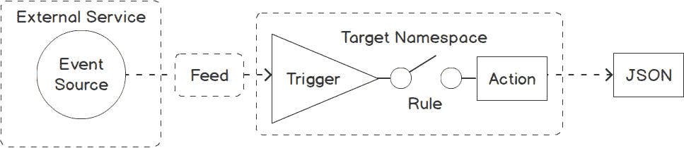

###### 图 8.53:OpenWhisk 馈送、触发器和规则

触发器是从事件源发送的不同类型的事件。这些触发器可以通过 **wsk** CLI 手动触发，也可以通过外部事件源中发生的事件自动触发。事件源的一些例子是 Git 存储库、电子邮件帐户或 Slack 通道。如上图所示，提要用于将触发器连接到外部事件源。提要示例如下:

*   向 Git 存储库提交。
*   传入特定帐户的电子邮件。
*   松弛通道接收的消息。

如图所示，规则是连接触发器和操作的组件。规则将一个触发器与一个操作联系起来。一旦创建了这个链接，触发器的每次调用都会执行相关的操作。通过创建一组适当的规则，以下情况也是可能的:

*   执行多个操作的单个触发器
*   响应多个触发器而执行的单个操作

让我们从创建一个用触发器和规则调用的简单操作开始。创建一个名为**的文件，并添加以下 JavaScript 函数:**

```
function main(params) {
    var helloMessage = 'Invoked with triggers and rules';
    return { result: helloMessage };
}
```

然后我们将创建操作:

```
$ wsk action create triggersAndRules triggers-rules.js
```

现在是时候创建我们的第一个触发器了。我们将使用 **wsk 触发器创建**命令，使用 **wsk** 命令行界面创建触发器:

```
$ wsk trigger create <trigger-name>
```

让我们创建一个名为 **myTrigger** 的触发器:

```
$ wsk trigger create myTrigger
```

输出应如下所示:


###### 图 8.54:创建我的触发器

我们可以列出可用的触发器，以确保 **myTrigger** 已成功创建:

```
$ wsk trigger list
```

输出应如下所示:

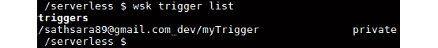

###### 图 8.55:列出所有触发器

触发器是无用的，除非我们通过规则将它们与动作联系起来。现在，我们将使用 **wsk 规则创建**命令创建一个 OpenWhisk 规则，其格式如下:

```
$ wsk rule create <rule-name> <trigger-name> <action-name>
```

让我们创建一个名为 **myRule** 的规则，将 **myTrigger** 和**trigger rules**动作连接在一起:

```
$ wsk rule create myRule myTrigger triggersAndRules
```

输出应如下所示:

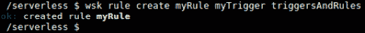

###### 图 8.56:创建我的规则来连接我的触发器和触发器和规则动作

我们可以获得关于 **myRule** 的详细信息，它显示了与规则相关联的触发器和动作:

```
$ wsk rule get myRule
```

该命令将打印关于 **myRule** 的详细输出，如下图截图所示，包括**命名空间**、**版本**、**状态**，以及关联的**触发**规则**的**和**动作**。

输出应如下所示:

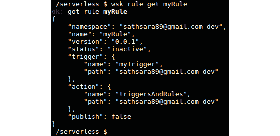

###### 图 8.57:获取 myRule 的详细信息

一旦**动作**、**触发**、**规则**准备好了，就该看到触发器在起作用了。让我们使用 **wsk 触发**命令触发触发器:

```
$ wsk trigger fire myTrigger
```

输出应如下所示:


###### 图 8.58:触发我的触发器

这将打印触发器的激活标识。

让我们执行以下命令来列出最后两次激活:

```
$ wsk activation list --limit 2
```

输出应如下所示:


###### 图 8.59:列出最后两次激活

在前面的截图中，我们可以看到 **myTrigger** 触发激活被记录，随后是 **triggersAndRules** 动作激活。

我们可以打印**触发器和规则**动作激活的结果，以确保该动作被触发器正确调用:

```
$ wsk activation get 85d9d7e50891468299d7e50891d68224 –summary
```

输出应如下所示:


###### 图 8.60:打印激活结果

在这一节中，我们讨论了如何使用提要、触发器和规则来自动化操作调用。我们创建了一个操作、一个触发器，然后创建了一个规则来连接它们。最后，我们通过触发触发器来调用操作。

### 打开搅拌克隆作业触发器

在前一节中，我们讨论了如何使用 **wsk trigger fire** 命令触发触发器。然而，在某些情况下，我们需要自动触发触发器。例如，执行定期任务，如运行系统备份、日志归档或数据库清除。OpenWhisk 提供了基于 cron 的触发器，用于以固定的时间间隔调用无服务器函数。由 OpenWhisk 提供的**/OpenWhisk.系统/报警**包可用于在预定的时间间隔触发触发器。

该软件包包括以下内容:


###### 图 8.61:报警包中可用的馈送

在下面的练习中，让我们学习如何创建基于 cron 作业的触发器。

### 练习 28:创建克隆作业触发器

在本练习中，我们将创建一个 OpenWhisk 操作，该操作将使用提要、触发器和规则每分钟调用一次。函数代码将打印当前日期和时间作为输出，这样我们就可以验证 cron 作业触发器是否正确调用了操作。

#### 注意

本练习的代码文件可在[https://github . com/trainingypbackt/server less-Architectures-with-Kubernetes/tree/master/lesson 08/练习 28](https://github.com/TrainingByPackt/Serverless-Architectures-with-Kubernetes/tree/master/Lesson08/Exercise28) 中找到。

以下步骤将帮助您完成练习:

1.  Let's start by creating the function code. This function will return the current date and time. Create a **date-time.js** file with the following code and create an action called **dateTimeAction**:

    ```
    function main() {
        var currentDateTime = new Date();
        return { currentDateTime: currentDateTime };
    }
    $ wsk action create dateTimeAction date-time.js
    ```

    输出应如下所示:

    

    ###### 图 8.62:创建日期时间动作

2.  The next step is to create a trigger with the **/whisk.system/alarms/alarm** feed. The cron value is provided as **"* * * * *"**, which aims to trigger this action every minute:

    ```
    $ wsk trigger create dateTimeCronTrigger \
                                --feed /whisk.system/alarms/alarm \
                                --param cron "* * * * *" 
    ```

    以下是对 **wsk 触发器创建**命令的响应。确保输出末尾有 **ok:已创建触发器 datetimecrontrole**，表示**datetimecrontrole**创建成功；

    ```
    ok: invoked /whisk.system/alarms/alarm with id 06f8535f9d364882b8535f9d368882cd
    {
        "activationId": "06f8535f9d364882b8535f9d368882cd",
        "annotations": [
            {
                "key": "path",
                "value": "whisk.system/alarms/alarm"
            },
            {
                "key": "waitTime",
                "value": 85
            },
            {
                "key": "kind",
                "value": "nodejs:10"
            },
            {
                "key": "timeout",
                "value": false
            },
            {
                "key": "limits",
                "value": {
                    "concurrency": 1,
                    "logs": 10,
                    "memory": 256,
                    "timeout": 60000
                }
            },
            {
                "key": "initTime",
                "value": 338
            }
        ],
        "duration": 594,
        "end": 1565083299218,
        "logs": [],
        "name": "alarm",
        "namespace": "sathsara89@gmail.com_dev",
        "publish": false,
        "response": {
            "result": {
                "status": "success"
            },
            "status": "success",
            "success": true
        },
        "start": 1565083298624,
        "subject": "sathsara89@gmail.com",
        "version": "0.0.152"
    }
    ok: created trigger dateTimeCronTrigger
    ```

3.  Create the rule (**dateTimeRule**) to connect the action (**dateTimeAction**) with the trigger (**dateTimeCronTrigger**):

    ```
    $ wsk rule create dateTimeRule dateTimeCronTrigger dateTimeAction
    ```

    输出应如下所示:

    

    ###### 图 8.63:创建日期时间规则来连接日期时间触发器和日期时间操作

4.  This action will now be triggered every minute. Allow the cron job trigger to run for around 5 minutes. We can list the last 6 activations with the following command:

    ```
    $ wsk activation list --limit 6
    ```

    输出应如下所示:

    

    ###### 图 8.64:列出了最后六次激活

5.  List the summary of the activations of **dateTimeAction** to make sure it has printed the current datetime every minute:

    ```
    $ wsk activation get 04012f4f3e6044ed812f4f3e6054edc4 --summary
    $ wsk activation get c4758e5fa4464d0cb58e5fa446cd0cf7 --summary
    $ wsk activation get cf78acfd78d044e8b8acfd78d044e89c –summary
    ```

    输出应如下所示:

    

###### 图 8.65:打印日期时间动作激活的摘要

检查为每次调用打印的 **currentDateTime** 字段的值，以验证该操作是否按计划每分钟调用一次。在前面的截图中，我们可以看到该动作在 **09:37:02** 被调用，然后在 **09:38:03** 再次被调用，最后在 **09:39:03** 被调用。

在本练习中，我们创建了一个打印当前日期和时间的简单函数。然后，我们创建了一个 cron 作业触发器来每分钟调用这个操作。

### 打开搅拌包

OpenWhisk 包允许我们通过将相关的动作捆绑在一起来组织我们的动作。举个例子，假设我们有多个动作，比如**创建订单**、**处理订单**、**调度订单**、**拒绝订单**。当应用用户分别创建订单、处理订单、分派订单和退款时，这些操作将执行相关的应用逻辑。在这种情况下，我们可以创建一个名为**订单**的包，将所有与订单相关的操作组合在一起。

正如我们之前了解到的，动作名称应该是唯一的。包有助于防止命名冲突，因为我们可以通过将它们放在不同的包中来创建多个同名的操作。例如，来自**订单**包的**检索信息**动作可以检索关于订单的信息，但是来自客户包的**检索信息**动作可以检索关于客户的信息。

到目前为止，我们已经创建了许多操作，而不用担心包。这怎么可能？这是因为，如果我们在动作创建过程中没有提到任何特定的包，openshover 会将动作放入默认包中。

OpenWindow 中有两种类型的包:

*   内置软件包(软件包附带 OpenWhisk)
*   用户定义的包(用户创建的其他包)

可以使用 **wsk 包列表<名称空间>** 命令检索名称空间中所有可用的包。

输出应如下所示:


###### 图 8.66:列出了/shout . system 命名空间中的包

可以使用 **wsk 包创建**命令创建包:

```
$ wsk package create <package-name>
```

在这一节中，我们介绍了包的概念，并讨论了 OpenWhisk 的内置包和用户定义包。在下一个练习中，我们将创建一个包，并将一个操作添加到新创建的包中。

### exrecise 29:创建 OpenWhisk 包

在本练习中，我们将创建一个名为**算术**的包，其中包含所有与算术相关的操作，如加、减、乘和除。我们将创建一个函数，接收两个数字作为输入，并通过将数字相加来返回结果。然后，我们将在**算术**包内创建此动作:

1.  Let's start by creating a package named **arithmetic**:

    ```
    $ wsk package create arithmetic
    ```

    输出应如下所示:

    

    ###### 图 8.67:创建算术包

2.  现在我们要创建一个动作，它将被添加到我们的**算术**包中。创建一个名为 **add.js** 的文件，内容如下:

    ```
    function main(params) {
        var result = params.firstNumber + params.secondNumber;
        return { result: result };
    }
    ```

3.  We can create the action and add it to the **arithmetic** package simultaneously with the **wsk action create** command. This will only require us to prefix the action name with the package name. Execute the following command:

    ```
    $ wsk action create arithmetic/add add.js
    ```

    在输出中，我们可以看到动作已经在**算术**包中成功创建。

    输出应如下所示:

    

    ###### 图 8.68:向算术包添加一个添加动作

4.  Now we can verify that our **add** action has been placed in the arithmetic package using the **wsk action list** command.

    ```
    $ wsk action list --limit 2
    ```

    输出应如下所示:

    

    ###### 图 8.69:列出操作

5.  The **wsk package get** command will return JSON output that describes the package:

    ```
    $ wsk package get arithmetic
    ```

    输出应如下所示:

    

    ###### 图 8.70:获取算术包的详细描述

6.  We can use the **--summary** flag if we want to see a summary of the package description, which lists the actions within the package:

    ```
    $ wsk package get arithmetic –summary
    ```

    输出应如下所示:

    

###### 图 8.71:获取算术包的概要描述

### 活动 8 :通过电子邮件接收每日天气更新

假设你在一个灾害管理中心工作，需要更新天气信息。您已经决定创建一个应用，可以通过电子邮件以指定的时间间隔向您发送天气更新。为了实现这一点，您决定部署一个应用，该应用可以检索特定城市的当前天气，并在上午 8:00 将包含当前天气信息的每日电子邮件发送到指定的电子邮件地址。在本活动中，我们将使用外部服务来检索天气信息( **OpenWeather** )和发送电子邮件( **SendGrid** )。

在开始本活动之前，我们需要具备以下条件:

*   一个**开放天气**账户(检索当前天气信息)
*   发送网格账户(发送电子邮件)
*   **npm** 已安装
*   **拉链**安装完毕

执行以下步骤创建一个 **OpenWeather** 帐户和一个 SendGrid 帐户:

1.  Create an **OpenWeather** ([https://openweathermap.org/](https://openweathermap.org/)) account to retrieve current weather information and save the API key. Create an **OpenWeather** account at [https://home.openweathermap.org/users/sign_up](https://home.openweathermap.org/users/sign_up).

    转到 **API 键**选项卡([https://home.openweathermap.org/api_keys](https://home.openweathermap.org/api_keys))并保存 API 键，因为从 OpenWeather API 获取数据需要该 API 键。

    在网络浏览器中使用**https://api.openweathermap.org/data/2.5/weather?q=London&appid =<YOUR-API-KEY>T1【测试 OpenWeather API。请注意，您需要从*步骤 1* 用您的应用编程接口密钥替换**T9 您的应用编程接口密钥>** 。**

2.  Create a SendGrid ([https://sendgrid.com](https://sendgrid.com)) account and save the API key. This is used to send emails. Create a SendGrid account at [https://signup.sendgrid.com/](https://signup.sendgrid.com/).

    转到**设置>应用编程接口键**，点击**创建应用编程接口键**按钮。

    在 **API 密钥名称**字段中提供一个名称，选择**完全访问**单选按钮，点击**创建&查看**按钮创建一个完全访问的 API 密钥。

    生成密钥后，复制应用编程接口密钥并将其保存在安全的地方，因为您只会看到该密钥一次。

    #### 注意

    在第 432 页的*附录*中提供了创建**开放天气**账户和发送网格账户的详细步骤。

    现在我们准备开始活动。执行以下步骤完成本活动:

3.  Create a function in any language that you are familiar with (and supported by the OpenWhisk framework) that will take the city name as a parameter and return a JSON object with weather information retrieved from the OpenWeather API.

    #### 注意

    对于这个解决方案，我们将使用用 JavaScript 编写的函数。但是，您可以使用任何您熟悉的语言来编写函数。

    下面是一个用 JavaScript 编写的示例函数:

    ```
    const request = require('request');
    function main(params) {
        const cityName = params.cityName
        const openWeatherApiKey = '<OPEN_WEATHER_API_KEY>';
        const openWeatherUrl = 'https://api.openweathermap.org/data/2.5/weather?q=' + cityName + '&mode=json&units=metric&appid=' + openWeatherApiKey ;
        return new Promise(function(resolve, reject) {
            request(openWeatherUrl, function(error, response, body) {   
                if (error) {
                    reject('Requesting weather data from provider failed ' 
                            + 'with status code ' 
                            + response.statusCode + '.\n' 
                            + 'Please check the provided cityName argument.');
                } else {
                    try {
                        var weatherData = JSON.parse(body);
                        resolve({weatherData:weatherData});
                    } catch (ex) {
                        reject('Error occurred while parsing weather data.');
                    }
                }
            });
        });
    }
    ```

4.  Create a second function (in any language that you are familiar with and is supported by the OpenWhisk framework) that will take a message as input and send the input message to a specified email address using the SendGrid service.

    下面是一个用 JavaScript 编写的示例函数:

    ```
    const sendGridMailer = require('@sendgrid/mail');
    function main(params) {
        const sendGridApiKey = '<SEND_GRID_API_KEY>';
        const toMail = '<TO_EMAIL>';
        const fromMail = '<FROM_EMAIL>';
        const mailSubject = 'Weather Information for Today';
        const mailContent = params.message;
        return new Promise(function(resolve, reject) {
            sendGridMailer.setApiKey(sendGridApiKey);
            const msg = {
                to: toMail,
                from: fromMail,
                subject: mailSubject,
                text: mailContent,
            };
            sendGridMailer.send(msg, (error, result) => {
                if (error) {
                    reject({msg: "Message sending failed."});
                } else {
                    resolve({msg: "Message sent!"});
                }
            });
        });
    }
    exports.main = main;
    ```

5.  Create a third function (in any language that you are familiar with and is supported by the OpenWhisk framework) that will take the JSON object with the weather data and format it as a string message to be sent as the email body.

    下面是一个用 JavaScript 编写的示例函数:

    ```
         function main(params) {
        return new Promise(function(resolve, reject) {
            if (!params.weatherData) {
                reject("Weather data not provided");
            }
            const weatherData = params.weatherData;
            const cityName = weatherData.name;
            const currentTemperature = weatherData.main.temp;
            weatherMessage = "It's " + currentTemperature
                                     + " degrees celsius in " + cityName;
            resolve({message: weatherMessage});
       });
    }
    ```

6.  接下来，创建一个连接所有三个动作的序列。
7.  Finally, create the trigger and rule to invoke the sequence daily at 8.00 AM.

    #### 注意

    活动的解决方案可以在第 432 页找到。

## 总结

在这一章中，我们首先了解了 ApacheOpenWhisk 的历史和核心概念。然后，我们学习了如何使用命令行界面设置 IBM 云功能来运行我们的无服务器功能。在那之后，one OpenWhisk 动作被引入，它们是用 one OpenWhisk 支持的语言之一编写的代码片段。我们讨论了如何使用 **wsk** 命令行界面编写、创建、列出、调用、更新和删除 OpenWhisk 操作。接下来，我们回顾了 over OpenWhisk 序列，它用于将多个动作组合在一起，以创建更复杂的处理流水线。接下来，我们学习了如何使用带有 web 动作的 URL 公开公开动作。我们讨论了 web 操作如何允许我们从操作中返回附加信息，例如 HTTP 头和非 JSON 有效负载，包括 HTML 和二进制数据。下一部分是关于使用来自外部事件源的事件自动调用动作的提要、触发器和规则。最后，讨论了 OpenWhisk 包，它们通过捆绑在一起来组织相关的动作。

在下一章，也是最后一章，我们将学习 OpenFaaS 并使用 OpenFaaS 函数。