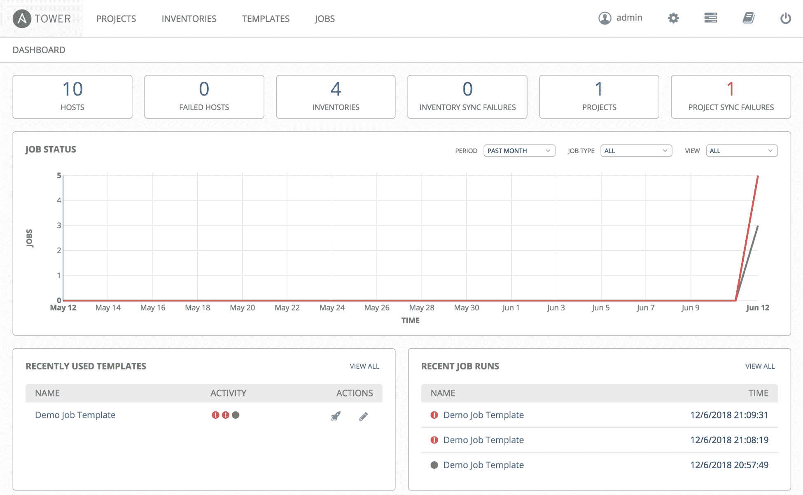

# 一、什么是 Ansible？

在第一次工业革命之后，自动化被引入，使得已经发展起来的高效机械更加高效。这导致了工业建筑、车辆转向和稳定、室内环境控制以及许多其他发展的引入。在这之后，信息革命开始了，开始了一个新的优化过程。这一阶段致力于减少人类对技术过程的干预，提高生产率。

如今，自动化已经成为所有领域的常态。它始于简单的管理员脚本，旨在简化和加快日常任务，并迅速发展成为成熟的配置管理工具。这种快速发展背后的原因是市场需求的增加、基础设施和应用的扩展以及新技术的出现，如持续集成、持续开发和机器配置，这些都需要更复杂的设置和配置。

从本质上来说，系统和网络管理员倾向于减少重复任务，简化复杂任务，并试图尽快进入下一个任务。起初，有一些简单的脚本，如 Bash 或 PowerShell，能够在标准环境中优化任务。之后，开发了更长、更复杂的脚本，涉及到高级编程语言，如 Python 或 Ruby。这些解决方案旨在解决跨多个平台或复杂环境中的任务，并使用自动化和流程编排工具管理基础架构，使企业能够在一夜之间凭借更苛刻和复杂的服务实现大幅增长。管理员的角色是管理这种增长，并相应地采取行动以确保无缝的用户体验。

本章将概述 Ansible。我们将展示 Ansible 现在是管理大中型基础架构的必备平台，而不是物理、部分虚拟或混合、私有和公共云。其他自动化工具在安装、使用、速度和灵活性方面提供了不同的优势，因此对于第一次使用的用户来说，为他们的环境选择最合适的自动化工具可能会很棘手。Ansible、Chef、Puppet 和 SaltStack 是市场上可用的主要配置管理工具。每种方法都遵循不同的部署、配置和管理机器的方法，降低了复杂性，提高了速度、可靠性和合规性。本章将涵盖以下主题:

*   自动化工具的市场研究
*   作为配置管理和任务编排工具的 Ansible 简介
*   探索 Ansible 跨操作系统、架构和云平台的功能
*   可平移项目和塔架概述

# 信息技术配置管理市场

目前市场上使用的主要配置管理工具有 Ansible、Chef、Puppet 和 SaltStack。每一个都有自己的优缺点，所以找到合适的可能有点挑战性，这取决于哪些特性是有价值的，或者哪种编程语言是首选的。在本节中，我们将简要介绍每一种工具，并解释为什么我们在本书中选择了 Ansible。

Chef 是一个开源的客户端-服务器配置管理工具。它提供了一个灵活的基础设施自动化框架，使用 Ruby 和特定于领域的语言 ( **DSL** )来管理主机。这涵盖了所有类型的主机，包括裸机、虚拟主机或云主机。由于 Chef 在大型云部署中的灵活性、稳定性和可靠性，它在代码开发人员中非常常见。然而，设置和学习它的功能可能很有挑战性，所以新用户可能需要一些时间才能正确掌握它。

Puppet 是一个基于 Ruby 的配置管理和编排工具。它遵循代理/主体系结构，其中要控制的主机需要一个 Puppet 代理来管理它们。Puppet 具有强大的自动化和报告能力，通过其用户界面，用于任务提交和主机实时报告。像大厨一样，Puppet 对于新用户来说，设置和配置可能很有挑战性。执行个性化和复杂的任务需要具备 Ruby 和 DSL 的相关知识。

Puppet and Chef are two of the oldest configuration management platforms. They both use Ruby and DSL to control their agents.

SaltStack 是一个 Python 编码的平台，旨在实现高速的主代理通信。其配置管理任务用**又一种降价语言** ( **YAML** )编码。主服务器(或多个主服务器)使用 SSH 协议来控制代理/从属服务器。SaltStack 的可伸缩性非常强，这意味着它可以很好地响应环境变化，易于使用，并且它有一个强大的社区。另一方面，对于新用户来说，它的安装可能很困难，它的用户界面开发得不太好，它专注于 Linux，平均覆盖了其他操作系统，它的文档缺乏良好的管理。

SaltStack is very similar to Ansible. They both employ easy-to-use coding languages, that is, Python and YAML. Also, both SaltStack and Ansible execute tasks very quickly because they rely on SSH to send comments to the hosts. 

与其他工具相比，Ansible 是一个相对较新的工具。它的构建是为了简化任务自动化和编排的复杂性。它建立在 Python 之上，并使用 YAML 编写其工作脚本，这是一种非常简单且接近英语的语言。这使得新用户可以很容易地理解它并自己编写它。Ansible 不要求在主机中安装代理。它支持通过 SSH 协议向其 Linux 节点发送命令的推和拉模型，以及向其 Windows 节点发送命令的 WinRM 协议。它支持虚拟机、应用和容器的无缝部署和资源调配，并可轻松扩展以适应环境的增长。安装和配置很简单，学习如何使用它和编写它的脚本也相当容易。Ansible 不需要安装代理，提高了通信速度。它在配置管理任务中主要是高级的，但它也可以充当基础架构编排工具。但是，它需要主节点的额外权限。用户很容易为多个任务编写多个脚本，这可能会令人困惑，并且与旧工具相比，它缺乏良好的图形用户界面和成熟的平台。

这些工具都是为特定的受众构建的。他们有许多完善的功能来满足用户的独特需求，以简化他们的日常任务、提高工作效率、加快主机配置或缩小混合环境中的差距。

我们已经选择在这本书里覆盖 Ansible，使它经得起未来的考验。我们都可以同意 Ansible 是一个新的平台，所以它不像许多其他工具那样设计良好和可定制，但是很容易看出 Ansible 的发展速度有多快。我们谈论的不仅仅是它支持的新技术的数量，它引入和增强的模块的数量，Ansible Galaxy 表单上提供的社区支持，或者 GitHub 项目分叉和星形存储库。我们也在关注它的受欢迎程度和市场需求。

Red Hat acquired Ansible in October 2015 with the strong belief that Ansible is the leader in IT automation and DevOps delivery, with the ability to simplify management for hybrid clouds, OpenStack environments, and container-based services. "Ansible is a clear leader in IT automation and DevOps, and helps Red Hat take a significant step forward in our goal of creating frictionless IT."  –  Joe Fitzgerald, Vice President, Management, Red Hat

Ansible 的使用频率比以往任何时候都高，如下图所示，该图显示了每年从 Debian 存储库中下载每个工具的主包的次数:

上图是 Debian 存储库中的 Ansible、Puppet、Chef 和 SaltStack 人气竞赛统计数据。它是使用以下链接[https://qa.debian.org/popcon-graph.php?生成的 packages = ansi ble % 2C+puppet master % 2C+salt-master % 2C+libchef-ruby&show _ installed = on&want _ legend = on&want _ ticks = on&from _ date = 2010&to _ date = 2018&hlight _ date =&date _ fmt = % 25Y-% 25m&been here = 1。](https://qa.debian.org/popcon-graph.php?packages=ansible%2C+puppetmaster%2C+salt-master%2C+libchef-ruby&show_installed=on&want_legend=on&want_ticks=on&from_date=2010&to_date=2018&hlght_date=&date_fmt=%25Y-%25m&beenhere=1)这个链接可以通过时间生成其他 Debian 包的时间图。

# 简单、轻便、强大

Ansible 是领先的编排平台，支持自动化、主机配置管理以及应用和虚拟机的部署。Ansible 可以自动化一系列 IT 基础架构功能，从简单、日常和重复的任务到机器配置或 DevOps 应用的持续集成和部署。它非常灵活，可以覆盖裸机、虚拟机和平台以及公共云或私有云环境。Ansible 还可以从交换机、路由器和防火墙管理网络设备。它还可以涵盖应用的设置、数据库管理系统、包管理器和简单用户应用的配置和行为:

Ansible logo If this is your first book about configuration management and you are looking for an easy and simple method to follow, you are in the right place.

一个命令就足以在 Linux 上使用发行库中的系统包管理器安装 Ansible。另一种方法是使用 Python 的 PyPI 包管理器来实现更快、更简单的安装。之后，它可以简单地以类似的方式用来执行任何命令。我们建议对更复杂或更大的环境进行额外的步骤，编辑 Ansible 配置文件，使其读取`/etc/ansible/ansible.conf`，填写清单，并添加一些组变量。Ansible 不需要在客户端安装代理，但是通过一些额外的步骤，连接可以变得更加安全。Ansible 使用了 Ansible 行动手册的简单配置管理语言 YAML，这是一种人类可读的编码语言，因此编写脚本没有太大困难。当发送特定任务的命令时，Ansible 服务器将 YAML 代码转换为实际的配置代码，并提供给客户端立即执行。

For most of the tutorials in this book, Debian-based systems will be used for the servers and Linux clients. The location and package names of the configuration files may vary between distributions.

为了正确运行引擎，Ansible 主机服务器是唯一需要满足推荐计算资源的机器。由于它是无代理的，客户端只接收命令形式的任务，这些任务直接在系统上执行。一些Ansible模块可能会通过将数据从一台机器发送到另一台机器来消耗大量的网络流量。这是执行任务所需的最低流量，因为 Ansible 只使用很小一部分流量向主机提交命令。

Ansible 的快速发展使其成为一个非常强大的工具。它现在被认为是市场上领先的自动化引擎。凭借其庞大的社区支持(Ansible Galaxy 和 GitHub 项目)和 Red Hat 专有的管理附加组件(Ansible Tower)，其用户有各种各样的角色、模块和附加组件可供选择，可以自动化每一项可以想象的 IT 任务。

Ansible 为用户提供以下功能:

*   系统配置管理
*   遵循最佳开发实践的敏捷应用部署
*   简化的流程编排和自动化
*   零停机，持续部署
*   支持云原生应用
*   简单优化的容器采用
*   自动化任务中的嵌入式安全和合规策略
*   简化的主机配置
*   支持多层部署
*   支持异构信息技术基础设施
*   支持多层计算机体系结构
*   支持**基础设施即服务** ( **IaaS** )部署
*   支持**平台即服务** ( **PaaS** )部署
*   支持快速增长环境的可扩展性
*   支持任务执行的推和拉模型
*   服务器之间的快速主机事实共享，以获得更好的冗余和性能
*   各种网络设备的配置
*   存储设备的管理和监控
*   数据库管理系统的控制

The Ansible module updates that come with each new release are a very good indication of the technologies and features that are officially supported. The modules allow the user to write simpler playbooks to perform more complex tasks.

# Ansible的编排和自动化

随着信息技术基础设施的快速增长和应用部署方式的转变，信息技术管理员的任务在规模和复杂性上都有所增加。Ansible 将编排和配置管理无缝地融合在一个非常方便的平台中，该平台允许 IT 管理员定义选定数量的节点、应用和网络设备，通过明确应该采取哪些措施来消除重复和降低复杂性，从而将其配置为所需的状态。Ansible 可以有多种使用方式，我们将在下一节中介绍。

# 管弦乐编曲

除了配置管理，Ansible 还提供高端编排。这使得组织和管理多个配置任务之间的交互结构良好。它简化和订购复杂和混乱的配置管理和管理任务。根据基础设施的状态，以及用户的需求、应用和数据版本化行为，Ansible 编排通常会通过 CM 工具将适当的服务和策略配置到故障组件中，使其正常工作，从而将基础设施恢复到所需的状态。

在处理 DevOps 类任务时，IT 编排可能会变得非常复杂，例如应用的**持续集成和部署** ( **CI** / **CD** )或作为代码的**基础架构** ( **IaC** )。Ansible 能够将这些任务转换为自动化的工作流，这些工作流在定义明确的结构中运行许多剧本，以各种 Ansible 预定义的模块、插件和 API 为特色，以从任意数量的主机、设备和服务进行通信、执行命令和报告事实。

# 自动化一切

Ansible 是实现更好的基础架构自动化、应用部署和资源调配的途径。它是实现自动化和现代化信息技术环境的开源方法。Ansible 是使信息技术管理员能够自动化日常任务的关键，它可以释放他们的时间，让他们专注于提供高质量的服务。这不仅会影响信息技术部门，还会影响整个业务。下图显示了 Ansible 的多种功能:

# 准备金提取

使用 Ansible 进行实例配置涵盖了裸机和服务器的配置和设置。它依靠预定义的 API 来创建和配置本地虚拟化基础架构。它还可以管理混合云、私有云和公共云实例、资源和应用。Ansible 可以自动安装和配置应用及其库。它使用操作系统引导和 kickstart 脚本，使用非常简单的行动手册和内置模块启动裸机配置。使用相同的简单行动手册和不同的模块，Ansible 还可以非常轻松地在公共云、私有云或混合云中调配实例、网络和虚拟机。

# 结构管理

利用行动手册和清单的强大功能，信息技术管理员可以使用 Ansible 在许多主机、网络设备和应用上执行更新、修补或配置修改。行动手册用简单的、人类可读的术语描述了基础设施，供其他人使用，并且机器可分析的代码可以在任何运行 Ansible 的机器上使用。Ansible 配置的执行是状态驱动的，这意味着它不需要检查系统或服务状态来知道如何适应以提高任务的可靠性。

# 应用部署

当我们谈论由 Ansible 管理的应用时，我们谈论的是全生命周期控制。任何能够访问 Ansible 服务器节点的用户，从 IT 管理员到应用开发人员和项目经理，都将能够管理应用的所有方面。Ansible 获取应用包，将其部署到所有生产服务器，设置它，并配置和启动它。它甚至可以测试包并报告其状态。此功能涵盖多层应用，允许零停机滚动以实现无缝应用更新。

# 持续交付和持续集成

Ansible 确保为开发人员和 IT 管理员提供稳定的环境，以持续交付和集成应用。尽可能自动化应用的周转意味着它对应用用户来说是快速且不引人注意的。Ansible的自动化和编排是多层和多步骤的，允许对操作和主机进行更精细的控制。我们可以编写行动手册来管理应用的持续集成和交付，同时确保各种组件的理想状态，例如负载平衡器和几个服务器节点。

# 可平移工程和可平移塔

被红帽收购后，Ansible 继续提供免费开源平台，目前被称为 Ansible 项目。红帽创建了专有的管理附加组件，提供了对基础架构的高级控制和集中化，称为 Ansible Tower。红帽运行 Ansible 自动化平台，该平台由 Ansible 引擎和 Ansible 塔组成。该产品作为其主导项目之一，得到了红帽的全力支持。

# 可实现的项目

Ansible 项目是来自原公司 AnsibleWorks 的功能的集合。这是一个社区构建的自动化引擎。它是免费的、开源的，任何人都可以使用包管理器、源代码编译或 Python PyPI 在任何 Linux 操作系统上下载或安装。它非常简单、强大且无代理。

要使用 Ansible 自动化引擎，用户不需要任何第三方应用或界面。他们可以简单地发送一个命令或写一个剧本，然后直接执行给引擎。这允许用户访问各种预定义的模块、插件和应用编程接口，作为管理各种信息技术任务和网络对象的构件。由于它是无代理的，所以 Ansible 依靠 SSH 来管理 Linux 主机，而 WinRM 管理 Windows 主机。SSH 协议也用于控制一些网络设备。一些更不支持的设备或云和虚拟化服务需要使用 Ansible 预定义的 API 来帮助管理或访问它们。

节点可以通过它们的 IP 地址或主机名来定义；对于后者，我们将不得不依赖于 DNS 服务器或本地 DNS 文件。API 用于与第三方服务通信，如公共云或私有云。模块构成了 Ansible 最大的预定义函数库，允许用户将长而复杂的任务简化为剧本中的几行。它们涵盖大量任务、系统、包、文件、数据存储、API 调用、网络设备配置等。最后，Ansible 插件用于改进 Ansible 的核心功能，例如快速主机缓存，以避免在网络上收集事实。

# 可折叠塔

Ansible Tower 是红帽专有层，位于 Ansible 项目引擎之上。它由许多附加组件和模块组成，由 REST APIs 和 web 服务组成，它们共同创建一个友好的 web 界面，该界面充当自动化中枢，It 管理员可以从中选择要在许多机器上执行的许多任务或行动手册。它仍然依赖 Ansible Engine 发送命令和收集报告。Ansible Tower 巧妙地收集任务的状态和主机返回的报告。所有这些数据都显示在 Ansible 控制面板中，显示主机、清单状态以及最近的作业、活动和快照:

Ansible Tower can only be installed on Red Hat 7, CentOS 7, and Ubuntu 14.04/16.04 LTS.

Ansible Tower 会随着环境的增长而扩展，并通过实时显示主机、任务和行动手册的所有状态来相应地采取行动。它突出显示了成功的行动手册作业，以及那些未能运行的作业，以便排除任何问题。在其多剧本工作流中，用户可以使用一个或多个用户的凭据，在个性化的时间尺度上，创建要在任何类型的清单上按顺序执行的剧本管道。在启用流水线的情况下，信息技术管理员可以通过使用流水线将复杂的操作(应用配置、使用容器的连续部署、运行测试工作流)分解成更小的任务，并根据输出(成功或失败)运行特定的游戏，从而实现自动化。

Ansible Tower 提供了一个智能清单平台，使您能够从任何来源提取主机清单，包括公共云、私有云或本地 CMDB。智能清单构建主机缓存，允许用户基于主机的事实运行行动手册，这些事实是与主机相关的信息和属性，由 Ansible 收集。它还允许您通过电子邮件、短信和第三方平台(如 Slack 或 Hipchat)上的推送通知，设置关于任务、工作流和行动手册状态的内置通知。Ansible Tower 还允许为例行更新、设备修补和自定义备份计划选项安排任务。下图显示了由红帽提供的完整Ansible引擎的各层:

Currently, Red Hat Ansible Tower offers a 30-day trial license for a hands-on exploration and test of its features. Any user can use it to decide if their environment will benefit from it.

在本书中，我们将主要关注开源 Ansible Engine，因为它是免费的，每个人都可以访问。我们认为，学习 Ansible 必须从基本的无用户界面版本开始，以更好地理解工具的内部机制。读者可以使用他们已经获得的引擎技能轻松迁移到 Ansible Tower。

There are a number of open source solutions that provide some of the functionalities of Ansible Tower. The most common of these is Ansible Semaphore, which is available at [https://github.com/ansible-semaphore/semaphore](https://github.com/ansible-semaphore/semaphore).

# 摘要

在这一章中，我们介绍了 Ansible，并列出了它的主要特性以及在适当使用时可以为用户提供的优势。我们还讨论了企业版的 Ansible Tower，它是由红帽开发和支持的。在[第二章](2.html)*Ansible设置和配置*中，我们将开始真正的学习。我们将从设置 Ansible 开始，并展示配置它进行试驾的最佳方式。

# 参考

本章的参考资料如下:

*   Ansible 网站:[https://www.ansible.com/](https://www.ansible.com/)
*   红帽网站:[https://www.redhat.com/en/technologies/management/ansible](https://www.redhat.com/en/technologies/management/ansible)
*   木偶网站:[https://puppet.com/](https://puppet.com/)
*   厨师网站:[https://www.chef.io/chef/](https://www.chef.io/chef/)
*   盐栈网站:[https://saltstack.com/](https://saltstack.com/)