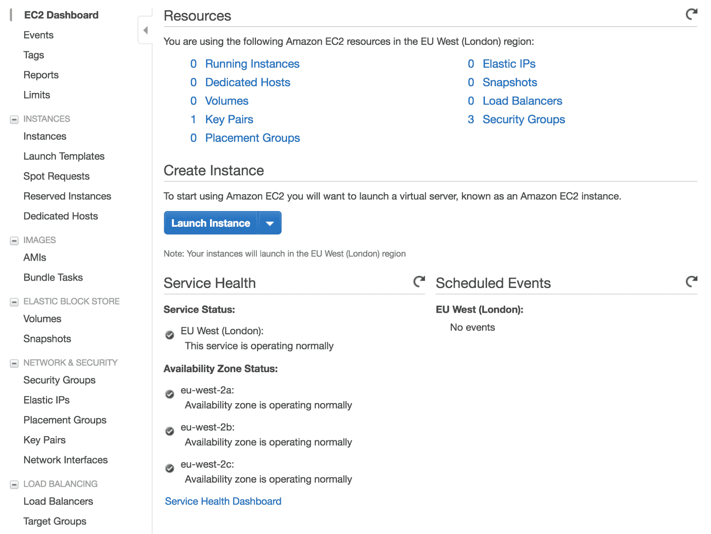
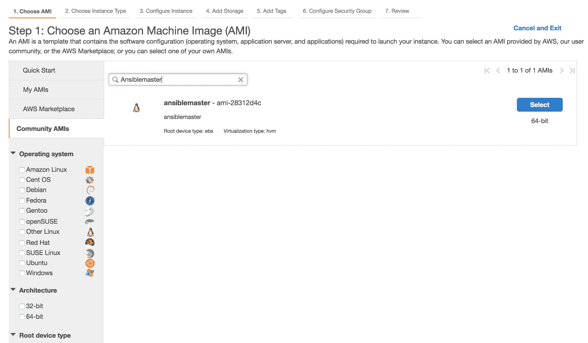
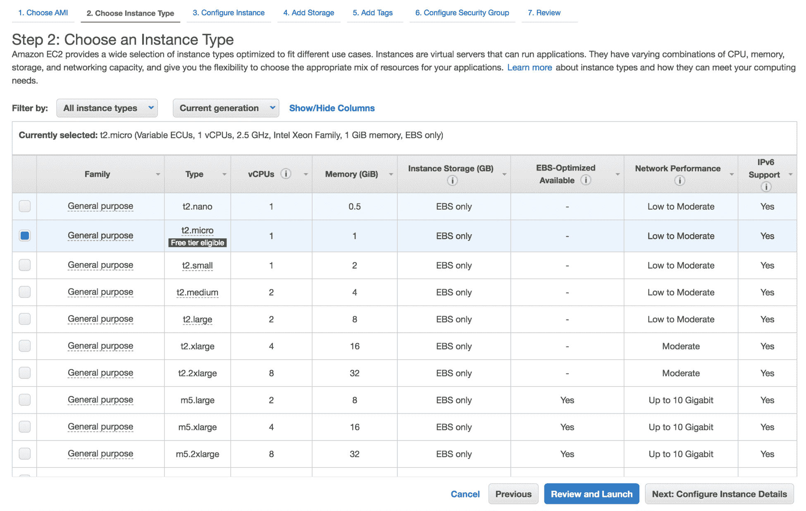
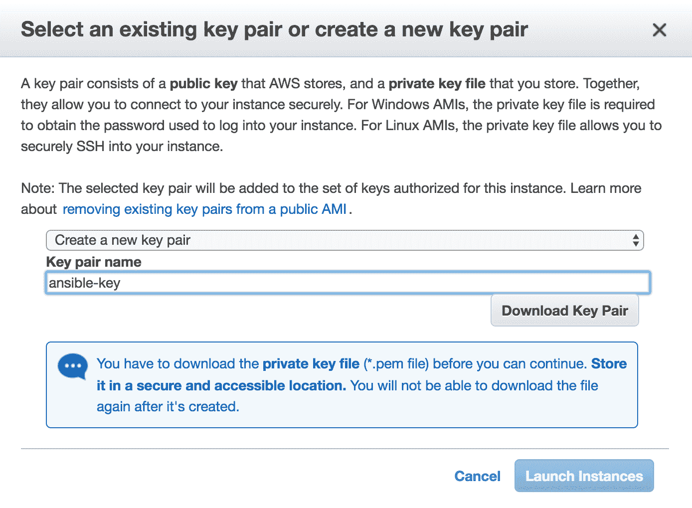
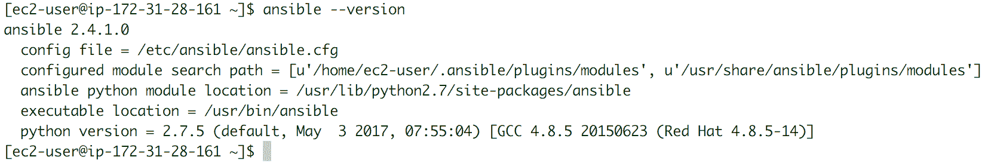

# 二、Ansible 的设置和配置

由于 Ansible 是无代理的，与其他配置管理平台不同，它只需要安装主节点。Ansible 也特别轻，因为它缺少守护程序、数据库依赖和持续运行服务。

在介绍了 Ansible 之后，我们现在将了解在您的环境中安装 Ansible 的不同方法，例如在云中安装裸机，以及使用 Docker 容器。我们还将研究如何在多个 Linux 操作系统上安装 Ansible，既可以从包管理器安装，也可以从源代码安装。最后，我们将了解如何准备和配置主机，使其可由 Ansible 控制。本章将包括以下内容:

*   Ansible 的主节点和基本的 Linux 安装
*   Ansible 容器设置
*   Ansible 源安装
*   Ansible AWS 实例设置
*   Ansible 配置
*   Linux 和 Windows 客户端上的 Ansible 配置

# Ansible 主节点安装

Ansible 使用**安全外壳** ( **SSH** )和 WinRM 来管理其主机客户端。所有安装都在管理节点或主节点上进行，或者在需要冗余时可能在多个节点上进行。我们将从源代码开始安装 Ansible，就像 Python PyPI 在两个主要的 Linux 家族上一样:Debian(包括 Debian、Linux Mint、Kali Linux、Ubuntu 和 Ubuntu Mate)和 Red Hat(包括 Red Hat、Fedora、CentOS 和 Scientific Linux)。我们还将研究 Mac OS X、Python PyPI 的 Ansible 安装过程，以及如何从源代码安装它。我们将涵盖云使用和容器化 Ansible。

如果可以选择，我们建议对红帽、CentOS、Debian、Ubuntu 和 Mac OS X 使用默认的包管理器，使用包管理器可以安装最新稳定版本的 Ansible。Python PyPI 也可以依赖于其提供最新稳定版本的 Ansible 的能力，尤其是在使用旧的 LTS 或稳定的 Linux 版本时。

为了在云环境中使用，Ansible 有许多社区实例。我们建议使用最流行的实例和适当的版本。

# 先决条件

在这方面，Ansible 很牛逼。对于 Linux 软件包安装，您只需要 Python 2(2.6 或更高版本)或 Python 3(3.5 或更高版本)。对于源码安装，我们可能需要开发套件，比如 Debian 家族的`build-essential`包，或者红帽家族的`Development Tools`组包。

Most package managers of Linux operating systems will automatically download the appropriate Python version and its dependencies when asked to install Ansible.

至于 Mac OS X，安装了家酿和 Xcode 应该就可以了。请记住，这些是安装 Ansible 包所需的要求。

Before using Ansible Mac OS X, you need to run a command as a root user to allow yourself to control more than 15 hosts. This has something to do with the limit of files to be handled simultaneously. The command is `sudo launchctl limit maxfiles unlimited`.

关于 Ansible 容器安装，我们需要一个容器引擎。在我们的情况下，我们将使用 Docker，或任何等效的平台，如奇点或移位器。对于云安装，我们只需要一个 SSH 客户端来连接到 AWS 实例。其他云提供商，如谷歌云平台或微软 Azure，也支持 Ansible 实例。

You can always create your own customized cloud instance on any platform. Our recommendations are for the vast majority of use cases where we believe that the AWS-supported and community instances are tested by many users, and they are as stable and reliable as they can be. Other requirements are not mentioned here because they are not strictly essential for the Ansible main functions and modules, but instead for very specific plugins and modules. We will cover these when we talk about those modules and plugins.

# 红帽、CentOS 和 Fedora 软件包安装

如果您使用的是黄狗更新程序，修改(Yum)，您将有一个额外的步骤，因为 Ansible 不在默认的 RHEL 存储库中。您可能在过去安装工具时体验过，在使用包管理器安装工具之前，通常需要安装**企业 Linux 额外包** ( **EPEL** )。这是一个非常简单的步骤。我们首先需要从 Fedora Project 网站下载`epel-release` `rpm`文件:[http://fedoraproject.org/wiki/EPE](http://fedoraproject.org/wiki/EPEL)[L](http://fedoraproject.org/wiki/EPEL)。然后我们需要使用`rpm`安装它，如下所示:

```
sudo rpm -i epel-release-latest-7.noarch.rpm
```

Tools downloaded from EPEL are not actually tested by Red Hat quality engineers, therefore extra care should be taken when downloading on production servers it as may disrupt support.

Ansible 引擎存储库(可在[https://access.redhat.com/articles/3174981](https://access.redhat.com/articles/3174981)获得)是从 Ansible 下载最新版本的另一个有效存储库。要仅使用红帽 Linux 访问它的包，我们首先需要启用它，如下所示:

```
sudo subsription-manager repos --enable rhel-7-server-ansible-2.5-rpms
```

之后，包管理器将需要更新它的缓存，包列表。我们使用百胜这样做，如下所示:

```
sudo yum update
```

就像使用 Yum 安装任何其他包一样，我们需要指定`ansible`作为`install`选项的输入:

```
sudo yum install ansible
```

大多数红帽系列操作系统应该接受这些命令来设置 Ansible。Fedora 18 及更高版本有了下一代包管理器**dandarized Yum**(**DNF**)。这是从 Fedora 22 开始的默认包管理器。使用 RPM 安装 EPEL 软件包后，我们需要运行以下命令来更新 DNF 软件包列表:

```
sudo dnf -y update
```

然后，我们使用以下命令安装 Ansible:

```
sudo dnf -y install ansible
```

使用红帽系列操作系统，可以通过获取适当的 RPM 文件并使用 RPM 安装来完成 Ansible 安装。首先，我们需要从 Ansible releases 链接下载适当的 RPM 文件:[https://releases.ansible.com/ansible/rpm/](https://releases.ansible.com/ansible/rpm/)T2。下载所需 Ansible 版本的 RPM 文件，并按如下方式安装:

```
sudo rpm -Uvh ansible-2.5.5-1.el7.ans.noarch.rpm
```

如果需要，RPM 文件也可以很容易地从一个来源构建和安装。我们建议使用官方的 GitHub Ansible 存储库。首先，我们需要使用 Git 获取项目文件夹。我们可能需要已经安装了 Git，以便能够轻松下载:

```
git clone https://github.com/ansible/ansible.git
cd ansible
```

然后，我们需要构建 Ansible `rpm`文件，并使用相同的命令进行安装:

```
make rpm
sudo rpm -Uvh rpm-build/ansible-*.noarch.rpm
```

# Debian 软件包安装

对于 Debian 用户来说，您可能已经知道，如果您想使用工具的最新版本，您需要运行 Debian OS 的最新稳定或测试版本。不建议使用测试版本，但有些人正在使用。因为 Debian 非常可靠，所以操作系统管理员倾向于设置一个 Debian 服务器，然后多年都不去想它，因为它继续做它应该做的事情，没有一个问题。通常，管理员倾向于运行许多旧的、稳定的 Debian 版本。如果你想拥有最新的 Ansible 版本，包括它的所有额外功能、模块和插件，我们不建议使用这些，除非你进行替代安装(使用 PyPI、源安装或通过容器)。

我们将使用 Debian 9 (Stretch)，因为它是最新的 Debian 稳定版本。Debian 9 允许您为 Ansible 使用许多 Ubuntu 包源。我们可以将 DEB 行添加到`source.list`文件中，也可以将**个人包档案** ( **PPA** )添加到列表中。首先，我们需要安装软件属性包:

```
sudo apt-get install -y software-properties-common
```

然后我们使用一个文本编辑器，将下面的 DEB 添加到`/etc/apt/source.list`:

```
deb http://ppa.launchpad.net/ansible/ansible/ubuntu trusty main
```

A faster way to add a DEB line at the end of the source file is as follows: `echo "deb http://ppa.launchpad.net/ansible/ansible/ubuntu trusty main" >> /etc/apt/source.list`

然后通过将其密钥添加到`apt`来验证链接:

```
sudo apt-key adv --keyserver keyserver.ubuntu.com --recv-keys 93C4A3FD7BB9C367
```

For the latest Debian release, the PPA repository can be used directly as well, by adding the link to the APT repository: `sudo apt-add-repository ppa:ansible/ansible`

通常，添加存储库需要您更新包管理器缓存:

```
sudo apt update
```

然后我们可以安装 Ansible:

```
sudo apt install -y ansible
```

Most of the tutorials in further chapters are carried out on Debian 8 (Jessie) with Ansible installed and updated using Python PyPI. This is just as stable, up to date, and reliable as any other standard way of installing Ansible on an operating system's latest release.

# Ubuntu 软件包安装

在最新版本中安装 Ansible 的最好方法是为 Ubuntu 添加 ansi ble PPA`ppa:ansible/ansible`(`launchpad.net/~ansible/+archive/ubuntu/ansible`)。这应该使用以下命令添加:

```
sudo apt-add-repository ppa:ansible/ansible
```

添加 PPA 存储库需要您确认关键服务器设置。按*进入*接受。

然后，我们需要更新包管理器缓存，也称为系统包索引，如下所示:

```
sudo apt update
```

最后，我们可以安装 Ansible:

```
sudo apt install ansible
```

# macOS X 软件包安装

在 MAC OS X 系统上安装 Ansible 可以使用两种工具中的一种来实现。第一种使用 Python PyPI，将在下一节中介绍。第二个使用 Mac OS X 开源包管理系统 Homebrew (brew.sh)。在这一节中，我们将描述如何使用自制程序安装 Ansible。

为了能够使用 Homebrew，我们首先需要确保它已安装，因为它不是默认的系统应用。您需要使用 Ruby 编译器将其构建到系统中。为此，您还需要安装 Xcode(在此找到:[developer.apple.com/xcode/](http://developer.apple.com/xcode/))并接受其用户许可。然后，我们在其终端上运行以下命令:

```
/usr/bin/ruby -e "$(curl -fsSL https://raw.githubusercontent.com/Homebrew/install/master/install)"
```

根据您的互联网访问和计算机速度，此命令可能需要一些时间。

然后我们可以使用自制程序安装 Ansible:

```
brew install ansible
```

# Python PyPI 安装

为了能够使用 PyPI 安装 Ansible，我们首先需要安装 PyPI。它可以很容易地使用大多数包管理器安装，其中一些将在下一节中概述。

红帽百胜的安装实现如下:

```
sudo yum install -y python-pip
```

Debian APT 安装使用以下命令:

```
sudo apt install -y python-pip
```

对于其他 Linux 系统，使用 Python:

```
sudo easy_install pip
```

Mac OS X 家酿安装如下:

```
brew install python-pip
```

从 PyPI 存储库中，通过安装 PyPI:

```
sudo pip install ansible
```

我们还可以使用 GitHub 源代码来获得最新的开发版本:

```
sudo pip install git+https://github.com/ansible/ansible.git@devel
```

To choose a specific version of Ansible using PyPI, we can use the following command: `sudo pip install ansible==2.4.0`. To upgrade the latest version, we can add the `--upgrade` option so the command looks as follows: `sudo pip install ansible --upgrade`.

# 源 GitHub 或 tarball 安装

能够从其来源构建 Ansible 对于不常见环境中的用户很有帮助，对于那些有一些特殊需求的用户也很有帮助，比如不需要包管理器就可以设置 Ansible，或者受限于 Ansible 的最新稳定版本。使用开发版本的 Ansible(或测试版)总是会让其用户面临模块和插件不稳定的风险，但也允许提前访问未来的模块。

要获取 Ansible 的源码包，我们可以使用两种不同的方法:下载`.tar`文件，或者克隆项目的 GitHub 资源库。Ansible 项目源文件位于其发布页面(`releases.ansible.com/ansible/`)，GitHub 源可以从官方 GitHub 项目(`github.com/ansible/ansible`)中克隆。

要下载 tarball 文件，请使用您最喜欢的文件提取工具(如 curl、wget 或 axel):

```
wget -c https://releases.ansible.com/ansible/ansible-2.6.0rc3.tar.gz
```

然后，我们需要取消 tarball 的存档:

```
tar -xzvf  ./ansible-2.6.0rc3.tar.gz
```

或者，我们可以使用 Git 在本地克隆 GitHub 项目。我们需要确保系统上安装了 Git，然后才能开始克隆。以下片段显示了许多系统的这一过程。

以下命令行显示了如何在红帽系列的 Linux 上安装`git`:

```
sudo yum install -y git
```

下面的命令行显示了如何在 Debian 家族的 Linux 上安装`git`:

```
sudo apt install -y git
```

以下命令行显示了如何在 Mac OS X 上安装`git`:

```
brew install git
```

在所有系统上，要克隆 Ansible 的 GitHub 项目:

```
git clone https://github.com/ansible/ansible.git --recursive
```

然后我们需要开始构建 Ansible，要么通过获取 tarball，要么从 GitHub 获取源代码:

```
cd ./ansible*
```

为了确保轻松满足构建 Ansible 的所有要求，我们将使用 Python PyPI。多个系统上的 PyPI 安装在前面的章节中有所介绍。对于这一部分，我们将使用`easy_install`，它只需要您在系统上安装一个 Python 版本:

```
sudo easy_install pip
```

我们现在安装 Python 需求:

```
sudo pip install -r ./requirements.txt
```

我们需要按如下方式设置环境，以便能够使用 Ansible:

```
source ./hacking/env-setup
```

使用 GitHub 项目时更新 Ansible 可能会更棘手。我们需要按如下方式拉动项目及其子模块:

```
git pull --rebase
git submodule update --init --recursive
```

每次执行这些命令时，我们都需要确保环境设置正确:

```
echo "export ANSIBLE_HOSTS=/etc/ansible/hosts" >> ~/.bashrc
echo "source ~/ansible/hacking/env-setup" >> ~/.bashrc
```

环境源的位置可以在任何时候改变。Ansible 清单(通常位于`/etc/ansible/hosts`)及其配置文件(通常位于`/etc/ansible/ansible.cfg`)也可以更改，以适应权限限制或为 Ansible 用户提供更容易的访问权限来启用修改或限制修改。这将在本章后面更详细地介绍。

# 可扩展坞站容器安装

在容器上使用 Ansible 需要运行容器引擎。使用哪个容器有多种选择，最著名的有 Docker、Kubernetes 和 Red Hat OpenShift。在这本书里，我们将只涉及 Docker。我们需要一个 Docker 引擎在将要托管 Ansible 容器的机器上运行。关于 Docker 安装的信息可在其官方文档中找到:https://docs.docker.com/install/。这涵盖了大量的操作系统。

在这里，我们将假设安装了 Docker 引擎，并且当前用户已经被添加到 Docker 组，以便他们可以管理机器上的本地 Docker 容器。您还可以通过选择您熟悉的任何源映像系统来选择构建自己的容器。确保安装了所有要求。以下是 Linux Alpine 上一个基本 Dockerfile 的示例，它是容器上使用的最轻的系统之一:

```
FROM alpine:3.7

RUN echo "#### Setting up the environment for the build dependencies ####" && \
set -x && apk --update add --virtual build-dependencies \
    gcc musl-dev libffi-dev openssl-dev python-dev

RUN echo "#### Update the OS package index and tools ####" && \
    apk update && apk upgrade

RUN echo "#### Setting up the build dependecies ####" && \
   apk add --no-cache bash curl tar openssh-client \
    sshpass git python py-boto py-dateutil py-httplib2 \
    py-jinja2 py-paramiko py-pip py-yaml ca-certificates 

RUN echo "#### Installing Python PyPI ####" && \
    pip install pip==9.0.3 && \
    pip install python-keyczar docker-py

RUN echo "#### Installing Ansible latest release and cleaning up ####" && \
    pip install ansible –upgrade \
    apk del build-dependencies && \
    rm -rf /var/cache/apk/*

RUN echo "#### Initializing Ansible inventory with the localhost ####" && \
    mkdir -p /etc/ansible/library /etc/ansible/roles /etc/ansible/lib /etc/ansible/ && \
    echo "localhost" >> /etc/ansible/hosts

ENV HOME                      /home/ansible
ENV PATH                      /etc/ansible/bin:$PATH
ENV PYTHONPATH                /etc/ansible/lib
ENV ANSIBLE_ROLES_PATH        /etc/ansible/roles
ENV ANSIBLE_LIBRARY           /etc/ansible/library
ENV ANSIBLE_SSH_PIPELINING                True
ENV ANSIBLE_GATHERING                     smart
ENV ANSIBLE_HOST_KEY_CHECKING             false
ENV ANSIBLE_RETRY_FILES_ENABLED           false 

RUN adduser -h $HOME ansible -D \
   && chown -R ansible:ansible $HOME

RUN echo "ansible ALL=(ALL) NOPASSWD: ALL" >> /etc/sudoers \
    && chmod 0440 /etc/sudoers

WORKDIR $HOME
USER ansible

ENTRYPOINT ["ansible"]       
```

然后，我们使用 Docker 上的`build`函数构建容器:

```
docker build -t dockerhub-user/ansible .
```

构建可能需要一些时间才能完成。然后，我们可以尝试以几种不同的方式运行我们的 Ansible 容器，这取决于我们将如何使用它。例如，我们可以在容器上验证 Ansible 版本:

```
docker run --rm -it -v ~:/home/ansible dockerhub-user/ansible --version
```

我们还可以运行 ping 任务:

```
docker run --rm -it -v ~:/home/ansible \
 -v ~/.ssh/id_rsa:/ansible/.ssh/id_rsa \
 -v ~/.ssh/id_rsa.pub:/ansible/.ssh/id_rsa.pub \
 dockerhub-user/ansible -m ping 192.168.1.10
```

通过将 Dockerfile 代码的`ENTRYPOINT`从`[ansible]`更改为`[ansible-playbook]`，我们可以创建一个脚本，该脚本可以使用我们的容器工作，就像安装了`docker-playbook`一样。这将在[第 3 章](3.html)、*附件清单和行动手册*中进一步解释。创建一个名为`ansible-playbook`的脚本，并使用以下代码将其添加到`PATH`环境变量中:

```
#!/bin/bash
 -v ~/.ssh/id_rsa:/ansible/.ssh/id_rsa \
 -v ~/.ssh/id_rsa.pub:/ansible/.ssh/id_rsa.pub \
 -v /var/log/ansible/ansible.log \
 dockerhub-user/ansible "$@"
```

Ensure that the script has execution permission by using the `chmod +x` command line. It can be copied or sym-linked to `/usr/local/bin/` to automatically add it to `PATH`.

该脚本可用于在位于`inventory`文件夹中的特定主机上执行剧本:

```
Ansibleplaybook play tasks.yml -i inventory/hosts
```

# AWS 上的可执行实例

有多个公共云提供商，如谷歌云平台或微软 Azure，提供与**亚马逊网络服务** ( **AWS** )相同的服务。在本节中，我们不打算介绍大部分安装过程，因为实例已经预安装和配置好了。

相反，本节将是在 AWS 上设置一个已经存在的 Ansible 实例的一个简单的分步指南。首先，我们需要访问我们的 AWS 帐户的 EC2 仪表板:



然后我们选择启动一个新的实例并寻找`Ansiblemaster`实例。请注意不要选择任何一个可平移的塔架实例:



然后，我们选择要提供给实例的计算机资源数量:



然后，我们添加实例要使用的磁盘空间，如下所示:


然后，我们确认并启动实例:


我们可以创建新的 SSH 访问密钥，也可以使用旧的:



在我们的本地终端上，我们在密钥文件中设置权限，并使用 SSH 访问实例:


我们可以查看 Ansible 的版本和配置。我们可以随时更新到必要或者最新的稳定版本。以下打印屏幕显示了如何使用实例操作系统包管理器从一个 Ansible 版本移动到另一个版本。首先，我们确定当前安装的版本:



然后，我们运行完整的系统软件更新:


最后，随着更新过程的完成，我们重新确定了 Ansible 版本:


最后，我们可以使用新安装的 Ansible 在我们的 AWS 环境中编排任务。

# 主节点基本配置

Ansible 配置主要存储在`ansible.cfg`配置文件中，在大多数系统包管理器和 Python PyPI 安装中通常位于`/etc/ansible/ansible.cfg`中。它也可以位于安装 Ansible 的用户的主目录中，或者`ANSIBLE_CONFIG`环境变量所指向的任何位置。在这一节中，我们将介绍最有用的配置，这些配置可以使用 Ansible 进行更改，使您的生活更加轻松。

使用您最喜欢的文本编辑器打开您的`ansible.cfg`文件，无论是在 CLI 模式下(使用 vi 或 nano)还是使用 GUI(使用 Gedit 或 Atom):

```
sudo nano /etc/ansible/ansible.cfg
```

There is no need to worry about which text editor you are using—there will always be someone who disagrees with you. Use whichever one you are most comfortable with.

许多人会同意 Ansible 的默认配置对于正常使用来说是可以的。Ansible 一经安装即可使用。

From Ansible version 2.4 onwards, there is a command line, `ansible-config`, that allows the users to list the enabled options and their values to check its configuration faster. The disabled configuration options are implemented either by using a hash sign, `#`, or a semicolon, `;`. The semicolon, `;`, is often used to introduce an enabled option.

您可以随时访问 Ansible 示例配置文件，查看这些选项的使用情况。示例可在以下链接找到:[raw . githubusercontent . com/ansi ble/ansi ble/develop/examples/ansi ble . CFG](http://raw.githubusercontent.com/ansible/ansible/devel/examples/ansible.cfg)。

Ansible 的配置文件分为几个部分。我们将集中讨论的主要部分是`[defaults]`一般部分。我们将从介绍本节中的基本参数开始。

*   `inventory` **:** 这是一个参数，用于指示托管 Ansible 库存的文件。在大多数系统上，它指向`/etc/ansible/hosts`，如下所示:

```
inventory = /etc/ansible/hosts
```

*   `roles_path`:这是一个参数，指示 Ansible 行动手册应该在哪里寻找系统默认的附加角色:

```
roles_path = /etc/ansible/roles
```

*   `log_path`:这是一个参数，用于指示 Ansible 应该将日志存储在哪里。请确保运行 Ansible 的用户有权在指定位置写入。一个例子如下:

```
log_path = /var/log/ansible.log
```

*   `retry_files_enabled`:这是一个启用重试功能的参数，允许 Ansible 在剧本失败时创建`.retry`文件。除非你真的需要，否则最好禁用它。这是因为它会创建多个文件，并用已经记录在 Ansible 日志和仪表板的行动手册执行状态部分中的旧失败任务阻塞您的行动手册文件夹。以下是禁用参数的示例:

```
retry_files_enabled = False
```

*   `host_keychecking`:这是一个根据环境改变推荐值的参数。通常，它用于不断变化的环境中，旧机器被删除，新机器取而代之。它更常用于云或虚拟化环境，其中虚拟机和部署实例采用旧机器的 IP 地址。Ansible 持有这些机器的密钥以防止安全问题。禁用该参数将使 Ansible 忽略与`known_hosts`键相关的错误信息:

```
host_key_checking = False
```

*   `forks`:这是一个参数，用于定义对客户端主机执行的并行任务数。默认数量为 5，以节省资源和网络带宽。如果有足够的资源和大带宽来服务许多主机，可以将其提升到最大主机数量，如下所示:

```
forks = 10
```

*   `sudo_user and ask_sudo_pass`:这都是遗留参数。目前版本的 Ansible 仍然可以使用它们，但它们并不可靠。建议在 Ansible 的清单中创建组时设置这些参数，这将在下一章中详细解释，但示例如下:

```
sudo_user = install
ask_sudo_pass = True
```

*   `remote_port`:这是一个参数，用于指示 SSH 将在客户端主机上使用哪个端口。这也是一个在库存组中更好设置的参数:

```
remote_port = 22
```

*   `nocolor`:这是可选参数。它允许您为 Ansible 任务和行动手册显示不同的颜色，以指示错误和成功:

```
nocolor = 0
```

以下参数与主机`[ssh_connection]`的 SSH 连接有关。

`pipelining`:此参数启用减少执行模块所需 SSH 操作数量的功能。这是通过在没有实际文件传输的情况下执行 Ansible 模块来实现的，可以大大提高 Ansible 的性能。它要求在所有受管主机上的`/etc/sudoers`中禁用 requiretty。其使用示例如下:

```
pipelining = True  
```

`scp_if_ssh`和`transfer_method`参数:这两个参数都负责主节点和客户端主机之间的文件传输。选择`smart`值允许 Ansible 在传输文件时在 SFTP 和 SCP 之间选择最合适的协议:

```
scp_if_ssh = smart
transfer_method = smart
```

以下两个例子与 SSH 连接的持久性有关。我们只涵盖连接超时和失败连接重试。SSH 超时可以通过如下编辑这两个参数的值来设置，首先:

```
connect_timeout = 30
```

其次:

```
connect_retry_timeout = 15
```

最后来看看`[colors]`颜色选择。当启用`[default]`部分的颜色功能时，该部分被激活。它允许您为不同的输出状态选择不同的颜色。当使用特殊显示器或帮助解决色盲时，这可能会有所帮助:

```
warn = bright purple
error = red
debug = dark gray
ok = green
changed = yellow
skip = cyan
```

另一方面，我们永远不要忘记 Ansible 依赖 SSH 与其客户端进行通信。应该在主节点上进行配置，以创建 SSH 密钥，然后将该密钥复制到所有客户端主机，以启用无密码远程访问。这有助于删除以纯文本形式保存的密码，并实现任务的完全自动化。创建 SSH 密钥可以很简单，也可以更复杂、更安全。我们将选择简单的选项:

```
ssh-keygen -t rsa
```

继续按 enter 键，同时接受密钥并保留密码为空:

```
ssh-copyid user@host1
```

这项任务可能有点枯燥，而且非常手工。在尝试整理 SSH 密钥和身份验证时，使用`expect`命令编写脚本会非常方便。首先，我们需要确保`expect`已经安装，因为默认情况下通常不会安装。以下示例显示了各种操作系统的此过程。

该命令行显示了如何在红帽系列的 Linux 上安装 Expect 工具:

```
sudo yum install -y expect-devel
```

该命令行显示了如何在 Debian 系列的 Linux 上安装 Expect 工具:

```
sudo apt install -y expect
```

该命令行显示了如何在 MAC OS X 安装 Expect 工具:

```
brew install expect
```

然后，我们可以使用以下内容创建一个脚本文件:

```
#!/usr/bin/expect -f
set login "install"
set addr [lindex $argv 0]
set pw [lindex $argv 1]
spawn ssh-copy-id $login@$addr
expect "*yes/no*" {
 send "yes\r"
 expect "*?assword*" { send "$pw\r" }
 } "*?asswor*" { send "$pw\r" }
interact
```

该脚本应该具有执行权限。然后，它可以与另一个循环脚本一起使用，在几台已知 IP 地址范围或主机名的机器上执行:

```
#!/bin/bash
password=`cat /root/installpassword.txt`
for j in 10 11 12 13 14 15 16 17 18 19 20
do
 ./expectscript 192.168.1.$j $password
done
```

或者，我们可以使用一个编排工具来完成同样的任务。让我们使用简单的`copy`和`shell`模块，使用 Ansible 来帮助进行客户端配置:

```
ansible all -m copy -a "src=~ /.ssh/id_rsa.pub dest=/tmp/id_rsa.pub" --ask-pass -c install
ansible all -m shell -a "cat /tmp/id_rsa.pub >> /home/install/.ssh/authorized_keys" --ask-pass -c install
```

The user `install` can be a special user created on all client hosts to allow easy SSH remote access using Ansible. More details about how to set up this user can be found in the following title.

# Linux 客户端节点配置

客户机上需要安装和运行的唯一重要工具是 OpenSSH-server。默认情况下，Linux 的所有新版本都使用 SSH 作为主要的远程访问方法。

为了确保一切就绪，SSH 服务应该始终运行，并且系统的防火墙应该允许 SSH 服务通过的端口。默认情况下，这是端口 22。但是，这是可以更改的，并且这种更改也应该在主机 Ansible 清单中注明。

对于 Linux 客户端来说，Ansible 管理的任何额外配置更多的是为了遵循最佳实践准则，而不是绝对必要的。额外的配置可以确保 Ansible 管理的远程客户端完全自动化、安全可访问，并且在运行自动化任务时不需要管理员干预。

The following configuration is optional—you can choose what suits you. Add the configurations that you think will be useful and ignore the others.

Ansible 可以在任何特权用户的凭证在手时，使用这些特权用户远程管理系统。但是，混合普通用户、具有远程访问权限的用户和管理用户可能会很麻烦。如果用户在 Ansible 发送任务的同时执行任务，那么回溯可能会很棘手。我们建议添加一个新的系统用户，该用户的唯一目的是被 Ansible 用来控制主机。我们赋予该用户超级用户权限，并使他们的访问密码不含密码，以进一步增强自动化。在要在清单组级别配置的某个清单组的所有主机上，该用户可以是相同的。

您还可以通过 NFS 和中小企业在主机和 Ansible 服务器之间创建共享文件夹，以减少向主机传输数据时的负载。此任务使主机承担从装载的共享文件夹复制数据的任务，而 Ansible 负责其他任务，尤其是当 forks 的值设置为较高的数字时。

# Windows 客户端节点配置

除了 Linux 主机，Ansible 还能够远程管理微软视窗主机。这包括 Windows 桌面 7、8 和 10，以及 Windows Server 2008、2008 R2、2012、2012 R2 和 2016。

Windows 客户端要求您安装以下应用的某些特定版本:

*   PowerShell 3.0 或更高版本
*   。NET 4.0

除了 Window 7 和 Windows server 2008 之外，大多数 Windows 版本都满足这两个要求。

有一个 Ansible 自制的 PowerShell 脚本，可以对缺失的需求进行自动安装，可以在以下链接找到:[https://github . com/packt publishing/ansi ble-quick start-Guide/blob/master/chapter 2/Upgrade _ PowerShell . PS1](https://github.com/PacktPublishing/Ansible-QuickStart-Guide/blob/master/Chapter2/Upgrade_Powershell.ps1)。

为了能够执行此脚本或任何其他第三方脚本，我们需要将执行策略从受限更改为无限制，运行我们的脚本，然后将策略变回受限。使用 Windows PowerShell，使用本地或域管理员凭据运行以下命令:

```
$link = "https://raw.githubusercontent.com/jborean93/ansible-windows/master/scripts/Upgrade-PowerShell.ps1"
$script = "$env:temp\Upgrade-PowerShell.ps1"
$username = "Admin"
$password = "secure_password"

(New-Object -TypeName System.Net.WebClient).DownloadFile($link, $script)
Set-ExecutionPolicy -ExecutionPolicy Unrestricted -Force

&$script -Version 5.1 -Username $username -Password $password -Verbose

Set-ExecutionPolicy -ExecutionPolicy Restricted -Force

$reg_winlogon_path = "HKLM:\Software\Microsoft\Windows NT\CurrentVersion\Winlogon"
Set-ItemProperty -Path $reg_winlogon_path -Name AutoAdminLogon -Value 0
Remove-ItemProperty -Path $reg_winlogon_path -Name DefaultUserName -ErrorAction SilentlyContinue
Remove-ItemProperty -Path $reg_winlogon_path -Name DefaultPassword -ErrorAction SilentlyContinue
```

然后，在所有的 Windows 系统上，第二个脚本对于将 WinRM 配置为活动的并监听 Ansible 命令是必不可少的。该脚本可从以下链接下载:[https://github . com/packt publishing/ansi ble-quick start-Guide/blob/master/chapter 2/configureremotingforensible . PS1](https://github.com/PacktPublishing/Ansible-QuickStart-Guide/blob/master/Chapter2/ConfigureRemotingForAnsible.ps1)。

同样，这个脚本也需要特权访问，并且执行策略应该是不受限制的。运行以下代码:

```
$link = "https://raw.githubusercontent.com/ansible/ansible/devel/examples/scripts/ConfigureRemotingForAnsible.ps1"
$script = "$env:temp\ConfigureRemotingForAnsible.ps1"

(New-Object -TypeName System.Net.WebClient).DownloadFile($link, $script)

powershell.exe -ExecutionPolicy ByPass -File $script
```

如果没有出现错误，Ansible 现在应该能够管理这些机器。

这同样适用于 Windows 主机。我们可能需要创建一个仅由 Ansible 使用的本地或域管理员来自由执行命令。也可以在主机清单组中配置其凭据。这可以使用 Ansible Vault 进行保护，以防止密码以纯文本形式写入。

# 摘要

在本章中，我们了解了如何为多个系统准备环境，以便能够安装 Ansible。我们还考虑了哪些配置选项在 Linux 或 Windows 中最有用。既然我们已经学习了如何设置和配置 Ansible，我们就准备开始学习它的功能特性了。在下一章中，我们将介绍 Ansible 行动手册和清单，以便更好地理解编排的工作原理。

# 参考

*   可获得的文件:[https://docs.ansible.com/](https://docs.ansible.com/)