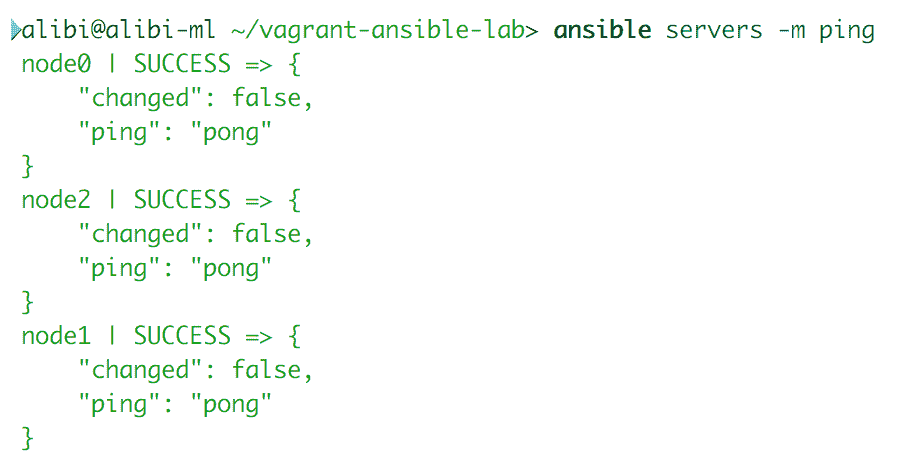
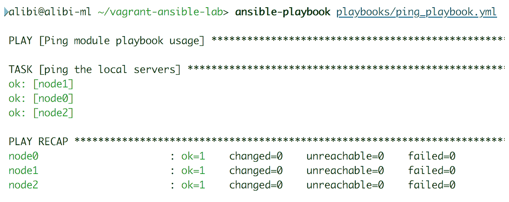
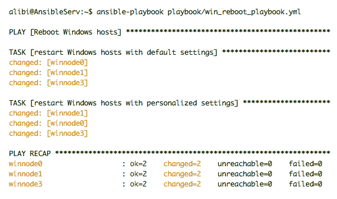
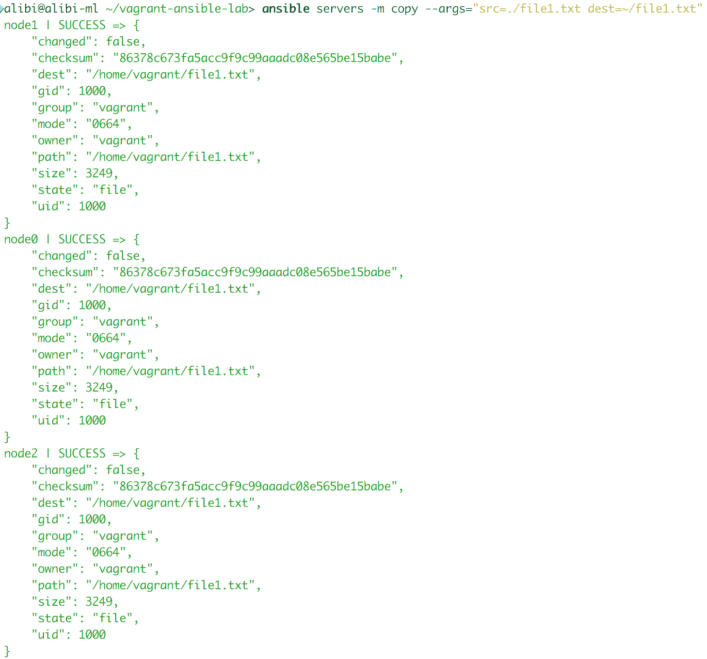
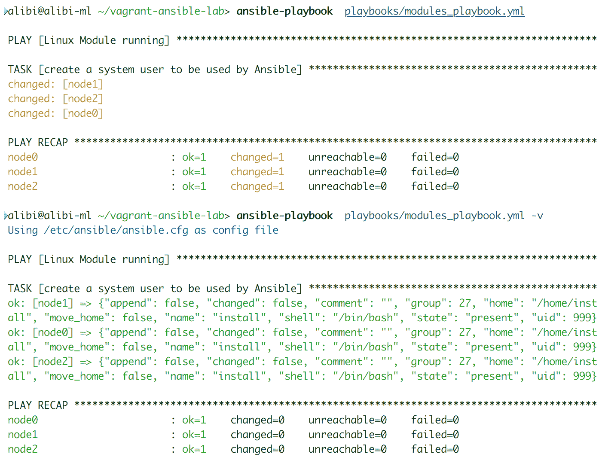
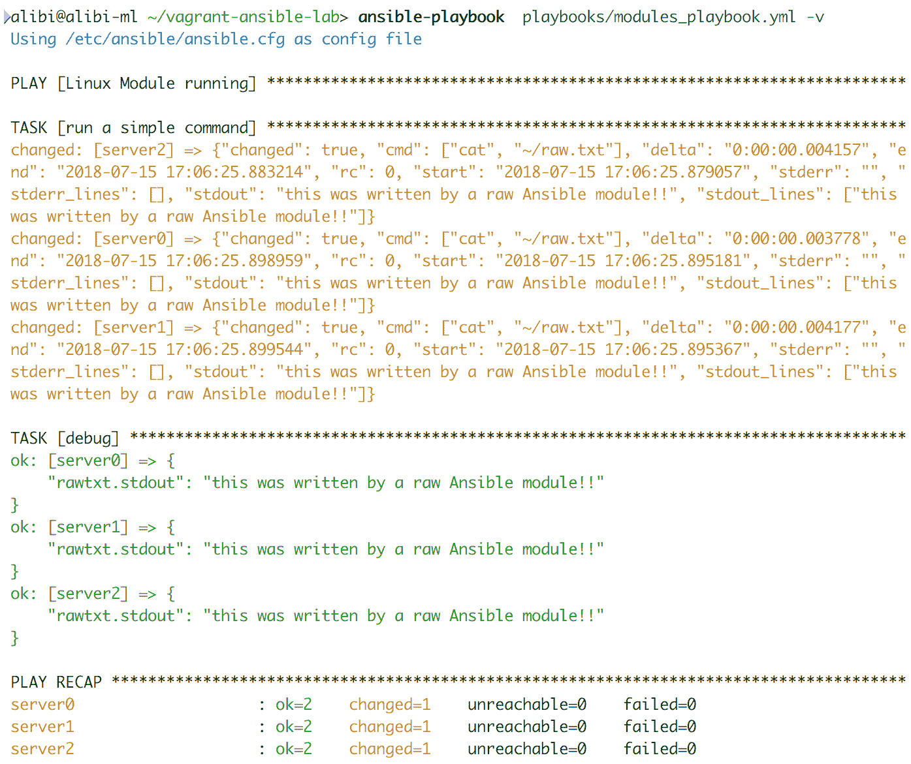

# 四、Ansible模块

为了掌握 Ansible 行动手册，我们需要了解模块及其有用程度。可扩展模块是定义每个行动手册所执行的操作的基本组件。每个模块都设置为能够执行任务。它们被设计为平稳运行，没有开销，因为它们的所有依赖性和需求都被涵盖。Ansible 模块使用户能够管理多个操作系统、服务、应用程序、数据库、包管理器、虚拟化基础架构数据存储和云环境。在本章中，我们将介绍以下内容:

*   Ansible 模块使用概述
*   Ansible的 Linux 模块及其变种
*   实现Ansible的窗口模块
*   一种通用构造器:Ansible网络模块
*   三大云提供商的Ansible云模块

# Ansible模块概述

安装 Ansible 时，用户还会收到一组非常方便的模块。这个集合被称为模块库。它是使用 Ansible 时要调用的预定义函数和操作的列表，可以通过临时命令或运行行动手册来调用。Ansible用户不限于预定义的Ansible模块；他们可以使用 Python 和 JSON 脚本轻松编写自己的代码。Ansible 安装时附带的模块可能被称为任务插件或库插件，但不要把它们误认为实际的 Ansible 插件，后者是允许 Ansible 与其他系统交互的脚本，这是另一章的主题。

Ansible 模块库自带机器库。使用后跟模块名称的`ansible-doc`命令，了解更多关于如何使用模块及其输出变量的信息:

```
ansible-doc apt
```

要列出所有可用模块，请使用`-l`选项:

```
ansible-doc -l
```

使用模块非常简单。您需要识别模块的名称，然后根据需要输入它的参数。并非所有模块都需要参数输入(例如 ping 模块不需要)，但大多数模块都需要。对于其他模块，输入参数是可选的，并且可能允许您个性化操作，例如在 Windows 重新启动模块的情况下。作为一个例子，让我们看看在即席模式和播放模式下执行模块。

# 即席与行动手册:ping 模块

如前所述，Ansible ad hoc 可用于快速检查，例如运行`ping`命令来检查主机是否启动并运行。该命令应该如下所示:

```
ansible servers -m ping
```

该命令的输出将类似于以下内容:



`ping`模块也可以作为更大脚本的一部分在剧本中使用，其中`ping`的结果可以通过管道传输，作为另一个动作的条件。行动手册代码如下:

```
---
- name: Ping module playbook usage
  hosts: servers
  gather_facts: false
  tasks:
    - name: ping the local servers
      ping:
```

这段代码的输出如下所示:



# 临时与行动手册:win_reboot 模块

ad hoc 命令可以简单地执行，如以下两个示例所示:

```
ansible winservers -m win_reboot

ansible win servers -m win_reboot –args="msg='Reboot initiated by remote admin' pre_reboot_delay=5"
```

任一命令的结果输出如下所示:


此行动手册文件包含使用同一模块重启主机的两种方法:

```
---
- name: Reboot Windows hosts
  hosts: winservers
  fast_gathering: false
  tasks:
    - name: restart Windows hosts with default settings
      win_reboot

    - name: restart Windows hosts with personalized 
      settings
      win_reboot:
        msg: "Reboot initiated by remote admin"
        pre_reboot_delay: 5
```

生成的行动手册输出如下所示:



# 临时与行动手册:复制模块

Ansible `copy`模块可以在特殊模式下使用，以快速运行拷贝作业:

```
ansible servers -m copy --args="src=./file1.txt dest=~/file1.txt"
```

该命令的输出应该如下所示:



或者，这可以用在具有各种个性化结果选项的行动手册中:

```
---
- name: copy a file to hosts
  hosts: servers
  become: true
  fast_gathering: false
  tasks:
    - name: copy a file to the home directory of a user
      copy:
         src: ./file1.txt
         dest: ~/file1.txt
         owner: setup
         mode: 0766
```

# Ansible模块返回值

返回值是监视和管理任务执行的关键特性。管理员可以确定每个操作的状态，并相应地运行其他任务，以修复、改进或跟进更大的工作。Ansible 模块配有各种返回值。每个模块都有共同的值和一些额外的特定值，用于该模块所扮演的角色。这些额外的返回值可以用于许多功能。在 Ansible 中，大多数返回值被用作剧本条件和循环的输入。该脚本允许操作和任务的流水线化，以实现自动化的配置管理。Ansible 基本上收集关于模块执行的操作的所有有用的输出数据，并将其排列成作为返回值呈现的变量。

There is no need to learn all the return values of these modules; you can easily get very good documentation about each module using the `ansible-doc` command. Alternatively, consult the official Ansible documentation using `module index`.

至于最常见的返回值，我们可以确定如下:

*   `stdout or stdout_lines`:这是包含使用执行模块执行的命令的标准输出的变量，例如`raw`、`command`、`shell`或`win_shell`。`stdout_lines`具有与`stdout`相同的值和字符串，但是它们具有更有条理的输出——分成行的人类可读文本。
*   `stderr`或`stderr_lines`:这与`stdout`有相同的输出源，但这是错误信息输出。如果执行的命令返回错误消息，它将存储在这个变量中。`stderr_lines`也有与`stderr`相同的输出字符串，但是更有组织性。
*   `changed`:如果任务对目标主机进行了更改，这是指示任务或操作状态的返回值。它将包含一个布尔值`True`或`False`。
*   `failed`:这是另一个状态更新返回值，表示任务或动作是否失败。它也是一个布尔值，可以是`True`或`False`。
*   `skipped`:这是另一个状态返回值，表示任务是否被跳过。当任务由行动手册条件触发且条件未得到满足时，就会发生这种情况。像其他状态返回值一样，它是一个布尔变量。
*   `rc`:代表**返回码。**它包含由命令执行模块执行的命令生成的返回代码。
*   `results`:这是一个不存在于任务中的值，除非它有一个循环。它应该包含用于循环的每个项目的正常模块`result`的列表。
*   `invocation`:这是一个值，包含详细说明模块是如何被调用的方法。
*   `backup_file`:这是当模块有特定的`backup=no|yes`选项时被填充的值。它说明了创建备份文件的位置。
*   `msg`:这是一个值，包含模块向 Ansible 用户生成的消息。

公共值在任务执行期间使用寄存器收集，然后由 playbook 条件函数调用或使用调试器打印:

```
---
- name: Restart Linux hosts if reboot is required after updates
  hosts: servers
  gather_facts: false
  tasks:
    - name: check for updates
      become: yes
      become_method: sudo
      apt: update_cache=yes

    - name: apply updates
      become: yes
      become_method: sudo
      apt: upgrade=yes 

    - name: check if reboot is required
      become: yes
      become_method: sudo
      shell: "[ -f /var/run/reboot-required ]"
      failed_when: False
      register: reboot_required
      changed_when: reboot_required.rc == 0
      notify: reboot

  handlers:
    - name: reboot
      command: shutdown -r now "Ansible triggered reboot after system updated"
      async: 0
      poll: 0
      ignore_errors: true
```

本行动手册将有以下输出:


使用调试器，我们可以轻松地指定要打印的一个或所有返回值。行动手册任务应该如下所示:

```
    - name: apply updates
      become: yes
      become_method: sudo
      apt: upgrade=yes
      register: output

    - name: print system update status return value
      debug:
           var: output.changed
```

Ansible 还收集了一些用于内部 Ansible 功能的额外值。这些值是`ansible_facts`、`exception`、`warning`和`deprecations`。它们可以由一些模块添加，稍后从寄存器变量中移除，并由 Ansible 收集。

# Ansible的 Linux 模块

我们将从探索 Linux 模块开始。这些是管理运行在 Linux 环境中的操作系统、包、应用程序和服务的最常用模块的选择。我们将覆盖两大 Linux 家族，Debian 和红帽。在本节中，我们将简要概述该模块及其有用的功能和特性。我们还将查看本模块有趣用途之一的行动手册示例。

We will not be covering all of the available modules that are supported in the Ansible releases. You can find full documentation for these either by running the ansible-doc command or on the official Ansible documentation in the modules index section. In this book, we will try to cover some of the community and galaxy modules that are needed to perform some tasks.

有些模块需要在远程主机上安装一些特定的技术。这些需求中的大多数通常是作为基本的系统实用程序预先安装的，而您可以通过使用另一个可以完成类似工作的工具来解决其他需求。例如，当您使用`apt`模块时，主机需要在远程 Debian 上安装`aptitude`。Ansible 将使用`apt-get`执行工作，并向用户发出警告信息，说明资质不可用。如果不符合要求，Ansible 将确保通知用户。

为了安全起见，在使用新模块之前，请务必仔细阅读其文档，并检查是否满足其所有要求。

# Linux 系统模块

以下是管理 Linux 系统最有用的 Ansible 模块列表。

# 用户管理模块

顾名思义，该模块用于 Linux 系统上的用户管理。作为一个例子，我们将制作一个剧本，创建一个名为`install`的系统用户，用于以后管理远程机器。剧本如下:

```
---
- name: Linux Module running
  hosts: servers
  become: yes
  gather_facts: false
  tasks:
    - name: create a system user to be used by Ansible
      user:
        name: install
        state: present
        shell: /bin/bash
        group: sudo
        system: yes
        hidden: yes
        ssh_key_file: .ssh/id_rsa
        expires: -1
```

运行剧本时，如果需要额外输出，可以随时添加`-v`或`-vvv`。以下截图显示了正常运行和带有`-v`选项的运行的输出:



同样的模块也可以用来移除用户，或者通过将他们的状态更改为缺席，或者通过将他们的外壳更改为`/bin/nologin`来禁用他们。对于某些集群环境，系统共享的某些用户必须具有相同的 UID，才能通过作业处理程序运行任务。`uid`选项允许特定用户在创建主机时选择特定的用户指南，尽管不建议这样做。

这些模块有许多特殊的返回值，可以收集这些返回值以便与其他模块进行流水线操作。最有用的模块如下:

*   `home`:显示用户的主目录
*   `ssh_public_key`:允许将按键打印放入一个文件中用于多种目的
*   `uid`:显示新创建用户的 UID

# 群组管理模块

组模块具有与用户模块相同的输入类型，但它会影响主机组。它是用于创建、修改和删除组的基本模块。组管理需要三个基本命令可用:`groupdadd`、`groupdell`和`groupmod`。

使用起来非常简单。剧本应该如下所示:

```
    - name: create a new group
      group:
        name: clustergroup
        state: present
        gid: 1040
```

# 主机名模块

这是另一个简单的模块，它完成了更改主机名的简单工作。为了使本模块更加精彩，我们将使用其中的一些行动手册功能。该模块接受一个输入，即新的主机名，并更改远程主机的主机名。我们可以使用剧本预定义的变量`{{ inventory_hostname }}`。该变量调用 Ansible 清单的主机名，并将其与行动手册一起使用。

首先，我们需要将清单文件更改如下:

```
[servers]
server0  ansible_host=192.168.10.10     
server1  ansible_host=192.168.10.11    
server2  ansible_host=192.168.10.12
```

然后，我们使用以下行动手册:

```
    - name: change hostname
      hostname:
        name: "{{ inventory_hostname }}"
```

执行行动手册后，您可以简单地使用特定的 Ansible 命令进行测试:

```
ansible -m shell -a hostname servers
```

结果应该如下所示:


# 系统控制模块

这是一个管理`sysctl`属性的模块。由于这个模块可以改变一些内核行为，让我们确保它的安全。我们将做一个配置，让 Linux 服务器充当网关。在本节中，我们不会深入讨论“IPtables”规则。我们将使用通用示例配置，并尝试通过`sysctl`模块应用它。

运行本模块的行动手册应包含以下内容:

```
    - name: enable IP forwarding on IP version 4
      sysctl:
         name: net.ipv4.ip_forward
         value: 1
        sysctrl_set: yes
        state: present
       reload: yes 
```

更改后，当任务需要运行`sysctl -p`时，需要重新加载选项。设置了正确的防火墙规则后，此任务将使此主机能够将数据包从一个网络接口路由到另一个网络接口。

# 服务管理模块

这将启用 Linux 系统服务管理:启动、停止、重新加载、重新启动，并启用其系统引导启动。例如，我们将确保所有主机都运行并启用了`ntp`(即**网络时间服务**:

```
    - name: start and enable ntp service
      service:
          name: ntp
          state: started
          enabled: yes
```

# 系统模块

对于更高级的服务管理，我们可以使用`systemd`作为服务的替代。`systemd`模块应该能够管理所有 Linux 操作系统上的服务，因为它有一个包含大量有用服务数据的状态特殊返回值的优势。此处显示了如何使用它的示例行动手册:

```
    - name: start and enable ntp service using systemd
      systemd:
        name: ntp
        state: started
        enabled: yes
        masked: no
        daemon_reload: yes
      register: systemd

    - debug:
        var: systemd.status.Description
```

行动手册输出应该如下所示:


# 内核黑名单管理模块

此模块允许您管理模块和驱动程序的内核黑名单，这些模块和驱动程序是在系统启动时从内核设备驱动程序初始化中排除的驱动程序和库。对于我们的示例剧本，我们将在使用英伟达图形处理器时执行最常见的黑名单操作之一——将`nouveau`驱动程序列入黑名单:

```
    - name: addling nouveau nvidia driver to the kernel    
      blaklist
      kernel_blacklist:
         name: nouveau
         state: present
```

# cron 作业编辑模块

`cron`模块是一个类似于`at`命令的工具，但是它为您提供了更多执行任务的定时选项，因为`cron`模块允许您管理`cron.d`和`crontab`。该模块允许创建和删除 crontab 条目以及创建环境变量。对于行动手册示例，我们将创建`cron job`来确保共享文件夹内容具有正确的权限:

```
    - name: setup a cron job
      cron:
         name: "shared folder permission enforcer"
         hour: 0
         minute: 0
         day: *
         job: "chmod -R 777 /media/shared"
         state: present
```

该模块在处理环境变量时也很方便，例如用于 crontab 条目的`PATH`或`HOME`:

```
- name: link the cron PATH variable with a new binaries location
  cron:
    name: PATH
    env: yes
    value: /usr/local/app/bin
```

# SSH 授权密钥管理模块

该模块管理 Linux 主机中特定用户帐户的 SSH 授权密钥。使用行动手册，我们将设置新的授权密钥:

```
    - name: add a new authorise SSH key to the user 
     install
      authorized_key:
          user: install
          state: present
          key: "{{ lookup('file', '/home/install
          /.ssh/id_rsa.pub') }}"
```

这个模块确实支持许多特殊的返回值。它们可以像其他工具一样用来收集主机的关键数据。

# Git 使用模块

该模块有助于从 Git 存储库中部署工具或配置文件。该模块需要将`git`工具安装在远程主机上才能正常工作。作为剧本，我们将复制 GitHub 上可用的 Ansible 的最新版本:

```
    - name: clone Ansible from github
      git:
        repo: https://github.com/ansible/ansible.git
        dest: /usr/local/ansible
        clone: yes
        update: yes 
```

本行动手册的执行应如下所示:


`git`模块确实支持一些特殊的返回值，帮助您监控项目的状态。

# SELinux 控制模块

在红帽环境中，在一台机器上管理 SELinux 可能会很麻烦，更不用说在一系列主机上了。该 Ansible 模块帮助用户配置 SELinux 模式和策略。

该模块以及其他一些模块在执行任务后可能需要重新启动。Ansible 总是会让用户知道是否是这种情况。一些高级模块可能具有集成选项，如果主机需要，该选项会自动启动重新启动。

作为快速行动手册示例，我们将要求 Ansible 允许 SELinux:

```
    - name: change SELinux to permissive
      selinux:
        policy: targeted
        state: permissive
```

该模块需要在远程主机上安装`libselinux-python`库才能正常工作。该模块也有自己的特殊返回值，可以用作处理程序或其他相关模块的输入。

# Linux 命令模块

在本节中，我们将讨论具有特别复杂的 Linux 命令的任务，或者我们不想搜索模块的地方，或者您想使用自己的技术的地方。Ansible 提供了一个命令执行模块列表，帮助您向远程主机发送命令。您希望管理环境的方式由您决定；Ansible 只是一个让你的工作更有效率的工具。

# 运行原始命令模块

与其他命令模块相比，该模块在命令行交付方面是最简单的。它基本上通过 SSH 在没有报头或选项的远程主机上发送命令。它不支持流水线操作或处理程序，但当向配置为由 Ansible 管理的 Windows 主机发送 PowerShell 命令时，它可以工作。

Fact gathering should be disabled when using the `raw` module to bootstrap Python onto the machine. In playbook syntax, the `become` option, to chose which user is going to run the task, does not work with the `raw` module, so we may need to add `sudo` in front of our commands when they require root permission.

使用本模块的简单行动手册如下:

```
    - name: run a simple command
      raw: echo "this was written by a raw Ansible 
      module!!" >> ~/raw.txt
```

# 命令执行模块

该模块与 raw 命令模块功能相同，但优化程度更高。它允许多个选项，并且能够将其返回值用于其他任务。作为剧本的一个例子，我们将运行一个命令，然后收集其输出供以后使用:

```
    - name: run a simple command
      command: cat ~/raw.txt
      register: rawtxt

    - debug: var=rawtxt.stdout
```

行动手册的输出如下所示:



该模块缺乏理解特殊环境变量的能力，如`$PATH`、Linux 流水线和重定向特殊字符。如果这对于您的特定用例是必要的，请使用列表中的下一个模块`shell`。

# 外壳命令模块

该模块是最便捷的命令模块之一。它不仅允许您运行命令，还可以运行 shell 脚本，并允许您指定工作目录的位置和您想要用来执行命令行的 bash。默认情况下，该模块在`/bin/sh`外壳上运行所有远程命令。以下剧本提供了一个很好的例子:

```
    - name: run a simple shell script
      shell: ./shell_script.sh >> ~/shell.txt
      args:
          chdir: /usr/local/
          creates: ~/shell.txt
          executable: /bin/csh
```

Shell 还有几个非常有用的返回值。

# 脚本执行模块

这是在远程节点上运行 shell 脚本的另一个模块。但是，首先，它会在执行脚本之前，将位于 Ansible 主机上的脚本传输到远程主机。该模块在远程主机的 shell 环境中运行脚本，就像它由主机上的本地用户运行一样。

该模块支持运行其他类型的脚本，如 Python、Perl 或 Ruby。看看下面的示例行动手册，它展示了如何使用它:

```
    - name: execute a script on a remote host
      script: ./shell_script.py –some-argumets "42"
      args:
          creates: ~/shell.txt
          executable: python
```

This module acts like the raw command module. It is also supported on Windows remote hosts as it is.

# 预期脚本模块

如果您熟悉 expect scripting，这是一个类似的模块，但更简单，规模更大。这是一种处理交互式命令的方式，例如密码更改和 SSH 问题。更改用户密码的行动手册示例如下:

```
    - name: change user1 password
      expect:
        command: passwd user1
        responses:
          (?i)password: "Ju5tAn07herP@55w0rd":
```

该模块要求在远程主机上安装`pexpect`和`python`。

# Linux 包模块

在本节中，我们将展示两种类型的包管理器:操作系统包管理器和编程语言包管理器。

# Apt 包管理器模块

这个模块管理 Debian 家族的包，包括 Debian、Ubuntu、LinuxMint、KaliLinux 等等。需要在远程主机上安装`aptitude`、`python-apt`、`python3-apt`才能工作。它有多个选项和功能来个性化软件包安装、删除、升级和索引更新。以下行动手册仅展示了其部分功能:

```
    - name: install some packages on a Debian OS
      apt:
          name: "{{ pkg }}"
          state: latest
          update_cache: yes
      vars:
          pkg:
          - aha
          - htop
```

这个模块有一些额外的补充模块来帮助处理额外的存储库和用于可信证书的密钥。它还有一些特殊的返回值。

# DNF 包管理器模块

该模块控制红帽系列的新包管理器，包括红帽、Fedora、CentOS 和科学 Linux。它有助于在本地索引中安装、升级、删除和搜索包。以下行动手册展示了如何使用它:

```
    - name: install a package using dnf
      dnf:
          name: htop
          state: latest
```

该模块需要在机器上安装`python`、`python-dnf`和`dnf`本身才能正常工作。

# Yum 包管理器模块

百胜是最初的红帽包经理，至今仍在使用。它也有自己的管理模块。就像`dnf`一样，它有助于管理包和组包。以下行动手册展示了如何使用本模块启用存储库，然后从中安装工具:

```
    - name: add epel repo using yum
      yum:
           name: https://dl.fedoraproject.org/pub/epel
           /epel-release-latest-7.noarch.rpm
          state: present  
        - name: install ansible using yum
          yum:
           name: ansible
           state: present
```

# 自制软件包管理器

Homebrew 是 macOS X 最著名的开源包管理器，这个模块是为了帮助远程管理 Homebrew 包而制作的。一个简单的行动手册可以用来删除 macOS X 上的软件包:

```
    - name: remove a package using homebrew
      homebrew:
         name: htop
         state: absent
         update_homebrew: yes
```

# PyPI Python 包管理器模块

这是我们的第一个语言包管理器，可能是最著名的。它管理 Python 包和库。它有多种选项，可以适应与 Python 库相关的各种不同需求。要运行这个模块，我们需要确保 PyPI 安装在远程主机上。以下示例行动手册将展示其中一些:

```
    - name: install a python library from the default 
   repo
      pip:
         name: numpy
         version: 0.3
    - name: install a python library from a github
      pip:
         name: https://github.com/jakubroztocil/httpie
         /archive/master.tar.gz 
```

# Cpanm Perl 包管理器模块

就像`pip`模块一样，这个模块管理 Perl 包管理器，**综合 Perl 存档网络** ( **CPAN** )。它以同样的方式使用；您可以从默认存储库中安装库或包，也可以从位于 web 或本地的归档文件中安装库或包。要运行该模块，我们需要确保`cpanminus`安装在远程主机上。这在示例行动手册中显示如下:

```
    - name: install a Perl library on a Linux host
      cpanm:
         name: IO
```

# Linux 文件模块

Linux 文件管理模块有一些可以在多个模块中找到的共享特性。您可以使用一个模块来执行由三个不同动作组成的任务。在本节中，我们将只讨论主要模块，并简要介绍那些也可以执行类似功能的模块。

# 文件和文件夹管理模块

文件模块基本上是管理与文件和文件夹组织有关的一切的工具，包括创建、删除、符号链接创建、权限和所有权。

我们已经将文件模块链接到**访问控制列表** ( **ACL** )模块，这是一个只处理 Linux 环境下文件和文件夹的权限和所有权的模块，以显示一些任务可以组合。这显示在以下行动手册中:

```
    - name: create a file with some specific acl
      file:
         path: /usr/local/script.py
         state: touch
         owner: user1
         group: developers
         mode: 0755

    - name: change acl of a file
      acl:
         path: /usr/local/script.py
         entity: user2
         permission: w
         state: present
```

# 数据分发模块(复制、取消归档和 get_url)

`copy`模块用于将文件从主机传输到远程主机或从远程主机内部本地传输。接下来是`unarchive`，它是一个档案提取器，然后将文件传输到选定的主机。`get_url`模块基本上是从一个网站下载一个文件作为 HTTP、HTTPS 或 FTP 文件。以下行动手册展示了如何使用每个模块来实现目标:

```
    - name: copy file from within a remote host
      copy:
         src: /usr/local/script.py
         dest: /home/user1/script.py
         remote_src: yes
         owner: user1
         group: developers
         mode: 0755

    - name: extract an archive into remote hosts
      unarchive:
         src: ~/archive.tar.gz
         dest: /usr/local/
         owner: user1
         group: developers
         mode: 0755

    - name: download an ansible archive to remote hosts
      get_url:
         url: https://github.com/ansible/ansible/archive
         /v2.6.1.tar.gz
         dest: /usr/local/ansible_v2.6.1.tar.gz
         mode: 0777
```

`copy`模块支持有备份选项，在复制配置文件时非常有用；如果有错误，用户总是可以恢复到原始状态。但是，取消归档需要在主机上安装`gtar`和`unzip`。所有这些模块都有显示任务状态信息的特殊返回值。

# 数据收集模块(提取)

这是反转先前模块功能的模块。该模块帮助从远程主机收集文件，并将它们存储在 Ansible 主机中。当收集应用程序和服务日志、用户配置或系统相关文件时，它会很方便。例如，我们将尝试从每个主机收集一些文件，并在主 Ansible 主机中组织它们:

```
    - name: Collect user files from remote hosts
      fetch:
         src: /home/user1/.profile
         dest: /home/alibi/user1-profile-{{ 
          inventory_hostname }}
         flat: yes 
```

管理远程 Windows 主机时也支持此模块。它有一个校验和验证过程，可以被停用，以加快传输速度，风险自担。

# 文件编辑模块(行填充、替换和块填充)

只有这三个模块，您才需要执行工具拥有的优秀配置文件管理技能，如`awk`或`sed`。`lineinfile`模块在文件中查找特定行，并用预定义的正则表达式替换它。`replace`模块替换文件中特定模式的所有实例，`blockinfile`插入、修改或删除文件中两个标记行之间的一行或多行文本。我们将这三个模块合并在一起，因为它们具有相似的基本功能，但是每一个模块都有自己的特色。以下行动手册示例将展示用于交付特定任务的每个模块:

```
     - name: change a sudo user to no longer need 
       password with config testing
      lineinfile:
         path: /etc/sudoers
         regexp: '^%sudo\s'
         line: '%sudo ALL=(ALL) NOPASSWD: ALL'
         state: present
         validate: '/usr/sbin/visudo -cf %s'

     - name: change all static ethernet config to use a 
       higher mtu
      replace:
         path: /etc/network/interfaces
         regexp: '^mtu 1400$'
         line: 'mtu 9000'
         backup: yes
         validate: 'systemd reload networking'

     - name: change a static ethernet configuration
      replace:
         path: /etc/network/interfaces
         block: |
             iface eth1 inet dhcp
                   dns-nameserver 8.8.8.8
                   dns-nameserver 8.8.4.4
                   mtu 9000
         backup: yes
         validate: 'systemd reload networking'
```

# Linux 网络模块

在本节中，我们将了解一些 Linux 系统网络管理模块。

# 网络接口管理模块

该模块是管理 Linux 主机中`/etc/network/interfaces`文件的一种方式。基本上，它允许您创建、修改和删除网络接口配置。此配置特定于每个识别的网络接口；它不改变非指定的。以下行动手册向您展示了如何对特定接口进行更改:

```
    - name: Change mtu to 1500 for eth1 interface
      Interfaces_file:
         dest: /etc/network/interfaces
         iface: eth1
         option: mtu
         value: 1500
         backup: yes
         state: present
```

如果这个任务注册了它的返回值，用户就可以很容易地识别关于接口变更后配置的所有信息。

For more advanced network management, check out the `nmcli` module. It can manage various connection and device types: Ethernet, teams, bonds, and VLANs.

# 防火墙 UFW 管理模块

这是 UFW Linux 防火墙的一个Ansible管理模块。它主要管理端口、协议和 IPS 防火墙权限。启用特定协议上的端口的示例手册可以编写如下:

```
    - name: add port 5000 for iperf testing on all hosts
      ufw:
         rule: allow
         port: 5000
         proto: tcp
```

该模块要求`ufw`作为命令行工具安装在远程主机上。

# 羟基磷灰石控制模块

这是一个管理 HAProxy 服务器的模块，命令它们使用套接字命令为后端服务器启用、禁用、清空和设置权重。以下是禁用某些 HAProxy 服务器的命令示例:

```
    - name: disable a haproxy backend host
      haproxy:
         state: disabled
         host: '{{ inventory_hostname }}'
         socket: /usr/loca/haproxy/haproxy.sock
         backend: www
         wait: yes
```

# 局域网唤醒触发模块

这是一个打开当前关闭的主机的模块。这项功能要求 Ansible 已经收集了有关主机的事实，并且正在存储有关其 MAC 地址的信息。以下是演示如何使用本模块的行动手册代码:

```
 - name: start powered off hosts
 wakeonlan:
 mac: "{{ hostvars[inventory_hostname].ansible_default_ipv4.macaddress }}"
 port: 8
 delegate_to: localhost
```

# Linux 存储模块

Ansible 确实提供了一些特定于 Linux 的存储设备和卷管理。

# 文件系统管理模块

本模块在处理虚拟化基础架构时最为方便，但也可用于裸机设置。远程主机中必须已经存在磁盘，该主机才能管理它。在虚拟环境中，Ansible 或其他管理工具允许您自动向主机添加磁盘，然后使用此模块进行管理。以下是使用本模块格式化磁盘的行动手册示例:

```
    - name: create a filesystem from a newly added disk
      filesystem:
         fstype: ext4
         dev: /dev/sdc1
```

Check out the `lvg` and `lvol` modules for LVM volume and group management. LVM can simplify disk management when using a virtualized environment, especially when dealing with systems that require the shrinking and expansion of disk space.

# 设备安装模块

这可以是文件系统的补充模块。它对于管理特定主机系统上的卷装载也非常有用。该模块管理`/etc/fstab`:

```
    - name: mount the recently added volume to the system
      mount:
         path: /media/disk1
         fstype: ext4
         boot: yes
         state: mounted
         src: /dev/sdc1
```

该模块还可以处理网络驱动器的安装。这可能需要您安装额外的工具，如 NFS 和中小企业客户端。

# 磁盘分区模块

这是一个控制分离工具的模块，这些工具帮助设备分区，收集它们的信息，或者将它们保存为返回值。以下示例行动手册显示了如何删除分区:

```
    - name: remove a no longer needed partition
      mount:
         device: /dev/sdc
         number: 1
         state: absent
```

# GlusterFS 控制模块

这是一个Ansible的模块，用于管理主机集群中的 GlusterFS 卷。它使用户能够按需添加、删除、启动、停止和调整卷。以下示例行动手册显示了如何创建新卷:

```
    - name: create a new GlusterFS volume
      gluster_volume:
         status: present
         name: gluster1
         bricks: /bridkes/brik1/g1
         rebalance: yes
         cluster:
            - 192.168.10.10
            - 192.168.10.11
            - 192.168.10.12
         run_once: true
```

# Ansible的视窗模块

从 Linux 模块开始，现在让我们来探索 Ansible 用来管理 Windows 桌面和服务器的模块。确保已经遵循了准备步骤，以确保 Windows 主机已准备好接受 Ansible 的控制。

# 视窗系统模块

让我们从介绍控制 Windows 系统并允许其用户管理其不同方面的模块开始。

# Windows 用户和组管理模块

这两个模块用于管理 Windows 主机本地机器的用户和组。以下行动手册示例显示了如何向 Windows 主机添加每种模式:

```
---
- name: Windows Module running
  hosts: winservers
  gather_facts: false
  tasks:
    - name: create a new group dev
      win_group:
         name: developers
         description: Development department group
         state: present

    - name: create a new user in the dev group
      win_user:
         name: winuser1
         password: Ju5t@n0th3rP@55w0rd
         state: present
         groups:
             - developers
```

# Windows 注册表编辑模块

Ansible 使用`win_regedit`模块对 Windows 主机注册表进行远程管理。这允许您创建、编辑和删除注册表项及其值。以下行动手册显示了如何通过注册表禁用 Windows 自动更新:

```
    - name: disable Windows auto-update
      win_regedit:
         path: HKLM:SOFTWARE\Policies\Microsoft\Windows
         \WindowsUpdate\AU
         name: NoAutoUpdate
         data: 1
         type: binary
```

# Windows 服务管理模块

该模块允许 Ansible 用户管理和查询 Windows 主机服务。以下 Ansible 行动手册展示了我们如何禁用 Windows 更新服务(不推荐，但知道起来很方便):

```
    - name: disable Windows update service
      win_service:
         name: wuauserv
         state: stopped
         start_mode: disabled
```

该模块具有给出服务状态信息的返回值。

# Windows 更新和功能管理模块(win_updates、win _ fix 和 win_feature)

Ansible 使用三个互补的模块来管理 Windows 更新、修补程序和功能:`win_updates`、`win_hotfix`和`win_feature`。这些模块使用系统默认服务和工具，命令它们应用在行动手册上配置的一组任务。以下示例行动手册有三个示例，说明如何使用每个模块来安装或启用 Microsoft 工具、修复程序或功能:

```
    - name: install updates for Windows related    
    applications and tools
      win_updates:
         category_names: 
             - Applications
             - Tools
         state: installed
         reboot: no
      become: yes
      become_user: SYSTEM

    - name: install a specific Windows Hotfix
      win_hotfix:
         hotfix_kb: KB4088786 
         source: C:\hotfixes\windows10.0-kb4088786-
       x64_7e3897394a48d5a915b7fbf59ed451be4b07077c.msu
         state: present

    - name: enable Hyper-V and Write Filter features
      win_feature:
         name: 
             - Hyper-V
             - Unified-Write-Filter
         state: present
```

这些模块的执行会生成特殊的返回值。这些是自动化 Windows 主机维护的关键功能。

These three modules need to be run with the credentials of a user who is part of a domain or local administrator group.

# Windows 局域网唤醒触发模块

就像 Linux 主机的局域网唤醒模块一样，这个模块将开始使用 Windows 主机的 MAC 地址关闭它们。行动手册示例如下:

```
    - name: start powered off Windows hosts
      win_wakeonlan:
         mac: "{{  
hostvars[inventory_hostname].ansible_default_ipv4.macaddress }}"
         port: 8
      delegate_to: remote_system
```

这个模块将发送一个局域网唤醒魔法包到特定的媒体访问控制地址。只有配置为接受数据包的主机才会响应。需要 BIOS 或操作系统配置来启用局域网唤醒。

# Windows 防火墙管理模块

该模块与 Windows 主机的本地防火墙交互，以配置其规则。下面的剧本展示了这一点，它支持 VNC 协议:

```
    - name: enable the VNC port on the host local 
      firewall
      win_firewall_rule:
         name: VNC
         localport: 5900
         protocol: udp
         direction: in
         action: allow
         state: present
         enabled: yes
```

该模块还需要由本地或域管理员执行。

# Windows 包模块

Windows 主机应用程序管理可能会变得复杂，相比之下，Linux 和所有的包管理器都是通过几个简单的命令来统一应用程序的安装。Ansible 使用其模块来规避这些挑战。

# 巧克力控制模块

Chocolatey 是 Windows 系统的第三方软件包管理器。它允许用户使用标准命令安装、删除和更新大量的 Windows 应用程序。Ansible 提供了一个模块，该模块确保系统上安装了巧克力，然后开始使用它从其软件包库中安装选定的工具([https://chocolatey.org/packages](https://chocolatey.org/packages))。以下是展示`win_chocolatey`模块多种用法的示例手册:

```
    - name: setup the latest version of firefox
      win_chocolatey:
         name: firefox
         state: latest

    - name: update all chocolatey installed tools
      win_chocolatey:
         name: all
         state: latest

    - name: remove 7zip
      win_chocolatey:
         name: 7zip
         state: absent
```

# Windows 包管理器

这是一个 Ansible 模块，用于安装和删除 MSI 或 EXE 文件包。它允许您在本地计算机、网络共享驱动器或网络上使用不同的软件包来源。以下示例行动手册向您展示了如何安装 Atom:

```
    - name: install atom editor on Windows hosts
      win_package:
         path: C:\app\atom.msi
         arguments: /install /norestart
         state: present
```

该模块取代了旧的、不稳定的模块，如`win_msi`。

# Windows 命令模块

就像 Linux 一样，当需要键入自己的命令，并且没有模块可以简化任务时，一个命令模块可以让它变得更容易。Ansible 提供了以下模块，允许您向远程 Windows 主机发送特定命令。

# Windows 命令模块(win_shell 和 win_command)

这两个Ansible模块是向 Windows 主机发送任何 PowerShell 或 bash 命令的最佳方式。`win_shell`模块更多用于运行脚本和长或多行命令，而命令更多用于运行可能需要额外参数的常规命令。以下行动手册显示了一个示例代码:

```
    - name: run a PowerShell script on a working 
     directory
      win_shell: C:\scripts\PSscript.ps1
         args:
            chdir: C:\Users\winuser1\Workspace

    - name: execute a PowerShell command on remote 
      Windows hosts
      win_command: (get-service wuauserv | select status 
       | Format-Wide | Out-String).trim()
      register: output

    - debug: var=output.stdout
```

# Windows 任务计划模块

Windows 主机可以通过使用此模块安排未来任务来进行时间管理。这是一种创建、编辑和删除 Windows 计划任务的方法。以下是行动手册上的任务计划示例:

```
    - name: schedule running a PowerShell script a 
     specific time
      win_scheduled_task: 
         name: PowerShellscript
         description: Run a script at a specific time
         actions:
         - path: C:\Windows\System32\WindowsPowerShell
           \v1.0\powershell.exe
           arguments: -ExecutionPolicy Unrestricted 
        -NonInteractive -File
         triggers:
         - type: logon
        state: present
        enabled: yes
```

# Windows 文件模块

使用 Ansible 时，管理 Windows 主机的文件和文件夹就像在 Linux 系统上一样简单。它提供了一套模块来满足所有的管理需求。

# Windows 文件和文件夹管理模块

这是一个在远程 Windows 主机上创建、更新和删除文件和文件夹的模块。本行动手册示例展示了如何在 Windows 系统上管理文件和文件夹:

```
    - name: add a new file
      win_file: 
          path: C:\scripts\PSscript2.ps1
          state: touch
    - name: remove a folder
      win_file: 
          path: C:\scripts\TestScripts
          state: absent
```

此模块不更改文件权限。为此，您需要使用`win_share`模块。

# Windows 数据共享模块

这是`win_file`的补充模块。此模块设置、修改和删除 Windows 文件和文件夹的共享权限。这是一份行动手册，显示了远程 Windows 主机上特定文件夹的示例配置:

```
 - name: add a new file
 win_share:
 name: devscript
 description: Developers scripts shared folder 
 path: C:\scripts
 list: yes
 full: developers
 read: devops
 deny: marketing
```

This module is only supported on Windows 8 and Windows 2012 onward.

# Windows 文件编辑模块

这是 Ansible 模块的 Windows 版本，`lineinfile`。如果一个文件是基于正则表达式的，它基本上做同样的工作来改变一个特定的行，但是它是专门为 Windows 主机设计的。以下是行动手册示例:

```
    - name: remove a folder
      win_lineinfile: 
          path: C:\scripts\PSscript.ps1
          regexp: '^service='
          line: 'service=wuauserv'
```

# Windows 数据发送模块(win_copy、win_robocopy 和 win_get_url)

这些模块负责将文件传输到 Windows 远程主机。每个人都有自己的方式将文件发送到目的地。`win_copy`模块将文件从本地机器或远程主机复制到远程主机中的特定位置。`win_robocopy`模块的工作方式类似于`rsync`，用于同步远程主机内两个文件夹的内容。作为备份解决方案，它非常方便。`win_get_url`模块获取一个网址作为输入，将文件下载到指定位置。

以下行动手册显示了一些示例案例:

```
    - name: copy a file from one location to other within 
      the Windows hosts
      win_copy: 
          src: C:\scripts\PSscript.ps1
          dest: C:\applications\PSscript.ps1
          remote_src: yes

    - name: backup scripts folder 
      win_copy: 
          src: C:\scripts\
          dest: D:\backup\scripts
          recurse: yes

    - name: backup scripts folder 
      win_get_url: 
          url: https://www.github.com/scripts
          /winscript2.ps1
          dest: C:\scripts\ winscript2.ps1
```

# 可扩展网络模块

网络设备管理从未像 Ansible 这样简单。有了行动手册，所有模块的统一语言使专有网络设备的管理变得非常简单，并且不需要您学习特定于供应商的工具和编码语言。网络管理现在是自动化配置管理策略的一部分。

这是 Ansible 目前支持的网络专有设备列表:Arista、Avi Networks、Cisco、Citrix NetScaler、Cumulus、戴尔 EMC、F5、华为、Infoblox、Juniper、诺基亚、Mellanox、联想、Palo Alto Networks 和 Pluribus。我们将无法涵盖控制这些的所有模块——这可能需要一本自己的书！

Being agentless, Ansible uses SSH and HTTPS to communicate with devices.

在本节中，我们将只介绍思科标准设备。我们需要为他们创建一个特殊的清单:

```
[ciscosw]
switch0            ansible_hosts=192.168.10.250
switch1            ansible_hosts=192.168.10.251
switch2            ansible_hosts=192.168.10.252

[ciscosw:vars]
ansible_connection=network_cli
ansible_user=admin
ansible_become=yes
ansible_become_method=enable
ansible_network_os=ios
ansible_user=user1
ansible_ssh_pass= "ju5t@n0th3rp@55"
```

还有其他方法可以隐藏 YAML 文件中的明文密码；我们将在 Ansible Vault 的后续章节中研究它们。

# 网络数据传输模块(网络获取和网络输出)

这两个模块允许在控制主机和多个网络设备之间更容易地传输配置文件。它们可以方便地进行备份或集中配置。这些模块依靠`scp`命令的功能来执行传输。以下行动手册中显示了一个示例:

```
---
- name: Network Module running
  hosts: ciscosw
  tasks:
    - name: backup a running configuration for a cisco 
     switch
      net_get:
          src: running_cfg_{{ inventory_hostname }}.txt
```

# 思科 IOS 命令模块

该模块帮助用户向运行 IOS 的思科设备发送命令，该设备可以是路由器、交换机、接入点或防火墙。该模块还可以选择让任务等待一个条件，然后超时返回。以下是在思科设备上执行命令的行动手册示例:

```
- name: check on the switch network interfaces status
  ios_command:
      commands: show interfaces brief
      wait_for: result[0] contains Loopback0
```

# 思科国际标准化组织系统配置模块

该模块允许用户修改思科设备的 IOS 运行配置。以下示例行动手册将展示我们如何更改思科交换机的一些配置:

```
- name: change switch hostname to match the one set in the inventory
  ios_config:
      ines: hostname {{ inventory_hostname }}

- name: change IP helper config for DHCP requests sent into the device
  ios_config:
      lines: ip helper-address 192.168.10.1
```

# 思科 IOS 接口管理模块

本模块管理思科网络交换机的接口配置。在下面的简单剧本中，我们将配置并启用一个接口:

```
- name: configure a gigabit interface and make ready to use
  ios_interface:
      name: GigabitEthernet0/1
      description: lab-network-link
      duplex: full
      speed: 1000
      mtu: 9000
      enabled: True
      state: up        
```

# 思科 IOS 静态路由控制模块

顾名思义，该模块管理思科网络设备上的静态路由配置。我们将在以下示例行动手册中设置静态路由交换机:

```
- name: setup a static route on CISCO switches
  ios_static_route:
      prefix: 192.168.11.0
      mask: 255.255.255.0
      next_hop: 192.168.10.1
      state: present
```

# 思科 IOS VLAN 管理模块

本模块允许在思科交换机上配置虚拟局域网。此示例行动手册展示了如何向 VLAN 添加一些网络接口:

```
- name: Add new lab VLAN
  ios_vlan:
      vlan_id: 45
      name: lab-vlan
      state: present

- name: Add network interface to the lab VLAN
  ios_vlan:
      vlan_id: 45
      nterfaces:
         - GigabitEthernet0/1
         - GigabitEthernet0/2
```

# Ansible的云模块

Ansible 使管理虚拟化和云基础架构变得非常容易。它有 300 多个模块，运行几个旨在覆盖各种云提供商的应用编程接口，如亚马逊网络服务、谷歌云平台、OpenStack、微软 Azure、数字海洋和 Linode。这些模块管理环境的多个方面，包括主机的操作系统、网络连接、计算资源和主机配置。

When using Ansible modules with a cloud or virtual environment, it is recommended that you use a dynamic inventory for better management.

# VMware 模块

Ansible 提供了支持 VMware 基础架构自动化管理的模块列表。

我们需要安装`pyVmomi` Python SDK:

```
pip install pyvmomi
```

这些模块旨在管理 VMware ESX、ESXi 和 vCenter 服务器。在本节中，我们将介绍管理 VMware 基础架构时涉及的一些最有用的模块。

需要一个清单文件来存放一些数据中心信息:

```
---
[vms:vars]
datacenter: "vcenter.lab.edu"
vcenter_hostname: "vcenter.lab.edu"
vcenter_username: "admin"
vcenter_password: "@dm1np@55w0rd"

[vms]
vm0
vm1
vm2

[esxi_hostname]
esxihost1         esxihost1.lab.edu
esxihost2         esxihost2.lab.edu
```

# VMware 来宾管理模块(vmware_guest 和 vsphere _ guest)

该模块允许创建、修改和删除虚拟机。它们还允许对指定的虚拟机进行状态和资源控制，包括电源状态修改，并且补充了定制功能。以下行动手册示例显示了如何基于模板创建虚拟机:

```
---
- name: VMware Module running
  hosts: vms
  tasks:
    - name: create a new virtual machine from a template
      vmware_guest:
          hostname: "{{ vcenter_hostname }}"
          username: "{{ vcenter_username }}"
          password: "{{ vcenter_password }}"
          validate_certs: False
          folder: /lab-folder
         name: "{{ inventory_hostname }}"
         state: poweredon
         template: debian8_temp
         disk:
         - size_gb: 15
           type: thin
           datastore: labdatastore1
         hardware:
            memory_mb: 1024
            num_cpus: 2
            num_cpu_cores_per_socket: 2
            scsi: paravirtual
            max_connections: 5
            hotadd_cpu: True
            hotremove_cpu: True
            hotadd_memory: True
            hotremove_memory: True
            version: 11
         cdrom:
             type: iso
            iso_path: "[ labdatastore1] /iso_folder/debian8.iso"
         networks:
         - name: Lab Network
         wait_for_ip_address: yes
     delegate_to: localhost
```

`vsphere_guest`模块的工作与`vmware_guest`相同，但它是一个不太稳定的遗留模块，不像`vmare_guest`那样支持那么多功能。

# VMware 来宾快照管理模块

该 Ansible 模块支持虚拟机的自动快照管理。以下行动手册示例显示了如何在虚拟机上拍摄快照:

```
    - name: create a virtual machine snapshot
      vmware_guest_snapshot:
          hostname: "{{ vcenter_hostname }}"
          username: "{{ vcenter_username }}"
          password: "{{ vcenter_password }}"
          datacentre: vcenter.lab.edu
          validate_certs: False
          folder: /lab-folder
          name: "{{ inventory_hostname }}"
          state: present
          snapshot_name: Post_Fixes
          description: Fixes_done_on_vm
      delegate_to: localhost
```

Case sensitivity is very important when dealing with VMware modules, especially when dealing with virtual machine snapshots. When calling the snapshot later, ensure that its name is exactly the same.

# VMware 虚拟机外壳执行模块

以下模块允许其用户通过使用 VMware 工具在虚拟机的操作系统上运行命令:

```
    - name: run a command on a running virtual machine
      vmware_guest_snapshot:
          hostname: "{{ vcenter_hostname }}"
          username: "{{ vcenter_username }}"
          password: "{{ vcenter_password }}"
          datacentre: vcenter.lab.edu
          validate_certs: False
          folder: /lab-folder
          vm_id: "{{ inventory_hostname }}"
          vm_username: setup
          vm_password: "@P@55w0rd"
          vm_shell: /bin/service
          vm_shell_args: networking restart
      delegate_to: localhost
```

# VMware 主机电源状态控制模块

本模块管理 VMware 基础架构的物理设备。ESX/ESXi 主机是存储计算机资源的地方。该模块管理主机的电源状态。在维护、更新或修复后安排重启时，它会非常方便。以下示例行动手册展示了如何使用本模块:

```
    - name: restart ESXi host
      vmware_guest_snapshot:
          hostname: "{{ vcenter_hostname }}"
          username: "{{ vcenter_username }}"
          password: "{{ vcenter_password }}"
          validate_certs: no
          esxi_hostname: esxihost1.lab.edu
          state: reboot-host
      delegate_to: localhost
```

# 码头工人模块

Ansible 的最新版本引入了几个专门用于 Docker 容器管理的模块。为了能够使用 Docker 的 Ansible 模块，管理主机应该安装以下 Python 包:

```
pip install 'docker-py>=1.7.0'

pip install 'docker-compose>=1.7.0'
```

使用 Docker 容器时，最好使用动态清单。

Ansible has recently introduced a new feature to enable building containers without the use of Dockerfiles. The `ansible-container` module builds containers and orchestrates the deployment via playbooks.

# 码头集装箱管理模块

该模块管理在本地计算机或其他主机上运行的 Docker 容器的生命周期。以下行动手册展示了本模块的工作原理:

```
---
- name: Docker Module running
  hosts: local
  tasks:
    - name: create a container
      docker_container:
          name: debianlinux
          image: debian:9
          pull: yes
          state: present

    - name: start a container
      docker_container:
          name: debianlinux
          state: started
          devices:
            - "/dev/sda:/dev/xvda:rwm"

    - name: stop a container
       docker_container:
          name: debianlinux
          state: stopped
```

# Docker 图像管理模块

该模块对容器开发人员很有用。它有助于将容器图像构建、加载、拉取和推送到存储库，或者将容器归档到 tar 文件中。以下行动手册示例显示了本模块可以执行的一些可能任务:

```
     - name: pull a container image
       docker_image:
          name: ubuntu:18.04
          pull: yes

     - name: push a container image to docker hub
       docker_image:
          name: labimages/ubuntu
          repository: labimages/ubuntu
          tag: lab18
          push: yes

     - name: remove a container image
       docker_image:
          name: labimages/ubuntu
          state: absent
          tag: lab16
```

# 坞站登录模块

该模块允许用户登录 DockerHub 或私有存储库。以下行动手册展示了如何做到这一点:

```
     - name: login to DockerHub
       docker_login:
          username: labuser1
          password: "L@bp@55w0rd"
          email: user1@lab.edu
```

# 亚马逊 AWS 模块

Ansible 允许自动化您的 AWS 云环境，通过大量专用于 AWS 服务的模块实现实例的动态配置和智能可扩展性。在本节中，我们将只关注亚马逊 AWS EC2。有一个大型模块库来管理其他 AWS 服务和其他云提供商的服务，可以在 Ansible 模块索引上找到。

作为先决条件，强烈建议您拥有动态库存。还建议您将访问和密钥存储在`vars_file`中，并可能使用 Ansible Vault 保护它们:

```
---
ec2_access_key: "a_key"
ec2_secret_key: "another_key"
```

您还需要在控制机器上安装`boto` Python 库，以便与 AWS 服务交互:

```
pip install boto
```

# AWS EC2 实例管理模块

该模块允许创建和终止 AWS EC2 实例。以下行动手册展示了如何创建新的 AWS EC2 实例:

```
---
- name: AWS Module running
  hosts: localhost
  gather_facts: False
  tasks:
    - name: create a new AWS EC2 instance
      ec2:
          key_name: ansible_key
          instance_type: t2.micro
          image: ami-6b3fd60c
          wait: yes
          group: labservers
          count: 2
          vpc_subnet_id: subnet-3ba41052
          assign_public_ip: yes
```

# AWS WC2 AMI 管理模块

该模块有助于注册新的 EC2 AMI 映像，用于以后的实例创建。它还允许您在不再需要旧映像时注销它们。以下示例行动手册显示了如何注册 EC2 AMI 映像:

```
    - name: register an AWS AMI image
      ec2_ami:
          instance_id: i-6b3fd61c
          wait: yes
          name: labami
          tags:
             Name: LabortoryImage
             Service: LabScripts
```

# AWS EC2 密钥管理模块

本模块帮助管理 EC2 密钥对。它有助于创建和删除密钥。以下示例行动手册向您展示了如何创建密钥:

```
    - name: create an EC@ key pair
      ec2_key:
          name: ansible2-key
          key_material: "{{ lookup('file', '/home/admin
          /.ssh/id_rsa') }}"
          state: present
```

# 摘要

在本章中，我们试图向您展示尽可能多的有用模块，包括可以进行的日常活动示例以及基于我们使用经验的个人评论。在官方 Ansible 文档中可以找到更多模块和更高级的功能。这里，我们只讨论了官方支持和维护的模块；不可能涵盖社区、Ansible Galaxy 平台或整个 GitHub 项目范围内的所有可用模块。如果你能想到一个我在本章中没有讨论过的任务，请放心，有人会有一个 bug 或修复来实现它。Ansible 拥有开源世界中最大的社区之一；请随意使用。

在下一章中，我们将使用其中的一些工具来实现一些真正的自动化。我们将混合和匹配行动手册中的各种模块，为日常任务执行复杂的行动手册。

# 参考

*   官方文件网站:[https://docs.ansible.com/](https://docs.ansible.com/)
*   Ansible 模块索引:[https://docs . ansi ble . com/ansi ble/latest/modules/list _ of _ all _ modules . html](https://docs.ansible.com/ansible/latest/modules/list_of_all_modules.html)
*   巧克力包装画廊:[https://chocolatey.org/packages](https://chocolatey.org/packages)