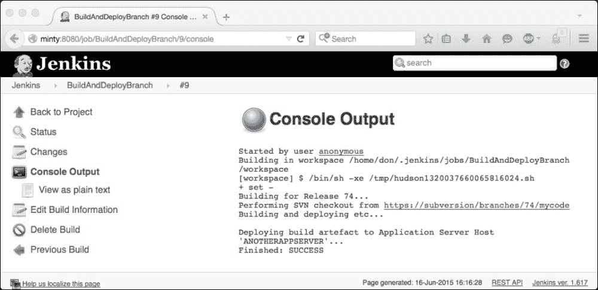

# 二、Jenkins用户界面自动化

在这一章中，我们将会看到一些不同的方法可以用来改变和增强Jenkins**用户界面** ( **用户界面**)。

与Jenkins作为一个整体一样，Jenkins用户界面是高度可定制的，并且从一开始就被明确设计为适应性和可扩展的，以便您可以定制和调整它来适应您的特定需求和环境。

您可以通过不同的方式定制用户界面，从纯粹的*外观和感觉*修饰到用户输入细化，再到自动创建Jenkins作业和设置动态从节点供应系统。

焦点和最合适的方法通常由Jenkins的使用方式决定；关注在特定情况下最重要的领域通常是获得最大利益的地方。

我们将在本章中研究四种最常见的用例场景，以及Jenkins用户界面的自动化和开发对每种情况都有帮助的不同方式。

# 用例场景 1–大量作业

一个Jenkins实例可以包含许多作业。实际限值变化很大，取决于多种因素，例如:

*   硬件资源，如内存、中央处理器、磁盘和网络性能
*   从属节点—有多少，如何设置，以及它们的性能
*   作业在主节点和从节点之间的分布情况如何
*   单个作业的设置；它们的大小、功能、历史和保留

Jenkins实例有超过 1000 个作业，或者大约 100 个从节点连接到一个主节点，这并不罕见。

管理由此导致的性能负载本身就是一项艰巨的任务，Jenkins 还需要管理这些作业的呈现和内务处理—您的用户不会希望为了搜索他们需要的作业而查看超过 1000 个作业，我们还需要确保旧作业得到清理或归档，并且新作业可以轻松而准确地创建。

如果您可以减少所需的作业数量，那么管理和资源开销将会减少，性能、可用性和可靠性也会提高，用户体验也会得到改善。

用户界面的一些规划和自动化通常可以帮助我们实现这一点——让我们看看一些场景和可能的解决方案。

如果最紧迫的问题或瓶颈是工作太多，那么首先了解对所有这些工作的需求来自哪里，然后看看我们能做些什么来缓解这种需求，将会有所帮助。

通常，开发团队在 Sprints 和/或 Releases 中工作。这通常意味着有一个主线开发流和一个或多个分支流。Jenkins通常也会遵循这个惯例——我们可能希望设置Jenkins作业来构建，然后将 Sprint 3 或 Release 49 代码部署到集成环境中，同时将我们的主线变更部署到 CI 和开发环境中。同时，可能有一个逻辑或业务需求来支持生产版本的*一切*，以防出现问题。

这可能意味着设置相应命名的作业，例如`Sprint 3`，并用伪代码将该值硬编码到配置中，类似于*的内容，获取 Sprint 3 war 文件并将其部署到 Sprint 3 服务器……*。

这些工作将有一个有限的(可能相当短的)生命，然后需要清理或更新为下一个 Sprint 或 Release 的新值。这种定期的手动维护很快成为一个令人头痛的问题，这进一步增加了人为错误导致错误的东西被部署到错误的地方的可能性。

这个常见场景的一个简单解决方案是使用Jenkins环境变量。如果您导航到**管理Jenkins** | **配置系统** | **全局属性**，您可以创建和定义自己的键值对，这些键值对可立即用于任何节点上的每个作业:


前面的截图显示了一些简单的键值对例子，这些键值对可以是你想要设置的——它们可以是你喜欢或者需要的任何东西。

使用这种方法意味着，您可以定义两到三个永久的作业集，这些作业集将从该位置获取键值对，并使用这些键值对来驱动它们的工作，而不是为每个版本或 Sprint 创建大量新的作业，并迎合多个即将过时的并发版本，然后我们的作业配置伪代码会发生变化。最初，这种形式如下:

*获取 Sprint 3 战报文件，部署到 Sprint 3 服务器……*

这就变成了一个更通用的东西:

*获取${SPRINT} war 文件并将其部署到${SPRINT}服务器……*

在某些情况下，这种对方法的简单修改可以让您通过在开发生命周期的要求点(例如，在发布、冲刺或迭代周期的末尾)简单地(集中地)将这些环境变量更新为新的属性，从而大大减少 Jenkins 作业的数量。

这一个中心配置的改变将立即更新所有的作业，以便可以使用这些新的值，并且这种方法可以扩展到包括关于构建、测试和部署过程的许多其他方面的信息，要签出和构建的分支位置，或者构建的工件应该部署到的环境或主机，等等。以下屏幕截图显示了反映更改的控制台输出页面:



如果您需要在每次迭代中创建新的作业，也可以通过自动化用户界面来简化这个过程——我们可以使用 Jenkins 来管理 Jenkins。

如果您查看文件系统上的 JENKINS 主目录(由 JENKINS_HOME 变量定义)，您将看到用于存储每个 Jenkins 作业设置的结构:每个作业由一个文件夹表示，该文件夹带有它所代表的作业的名称，每个文件夹包含一个名为`config.xml`的 XML 文件。每个`config.xml`文件包含该作业的设置和信息。

通常还有其他几个文件和文件夹，例如用于跟踪下一个版本号的文件(`nextBuildNumber`)和用于跟踪和存储历史记录以及之前版本创建的工件的文件夹。

Jenkins工作的最基本形式就是这样简单:

*   以作业命名的文件夹，例如`VeryBasicJob`
*   在这个文件夹中，有一个名为`config.xml`的文件
*   在这个文件中，一些 XML 大致如下:

    ```
    <?xml version='1.0' encoding='UTF-8'?>
    <project>
      <actions/>
      <description>A bare-bones Jenkins job</description>
      <keepDependencies>false</keepDependencies>
      <properties/>
      <scm class="hudson.scm.NullSCM"/>
      <canRoam>true</canRoam>
      <disabled>false</disabled>
      <blockBuildWhenDownstreamBuilding>false</blockBuildWhenDownstreamBuilding>
      <blockBuildWhenUpstreamBuilding>false</blockBuildWhenUpstreamBuilding>
      <triggers/>
      <concurrentBuild>false</concurrentBuild>
      <builders>
        <hudson.tasks.Shell>
          <command>echo &quot;A very simple shell-based job&quot;</command>
        </hudson.tasks.Shell>
      </builders>
      <publishers/>
      <buildWrappers/>
    </project>
    ```

正如您所看到的，这个最小的工作包含一些非常简单的 XML 标签和数据，详细描述了`<description>`和`<command>`标签，以及Jenkins使用的各种其他设置。

Jenkins用户界面将解释这个文件夹和 XML 文件，并显示如下的**配置**页面:


当源配置和前端用户界面并排显示时，正如您在前面的截图中看到的，很明显，更改 XML 文件应该会更改用户界面显示的作业，反之亦然。

因此，如果我们能够自动创建这些 XML 文件，并以某种方式将它们加载到 Jenkins 中，那么我们也应该能够对我们所有的 Jenkins 作业进行自动化和版本控制，并允许最终用户在运行时应用他们需要的任何定制，从而消除手动干预的需要。

从版本控制中获取文件夹结构和 XML 文件，用用户选择的值更新这些 XML 文件，并将生成的配置加载到我们的 Jenkins 实例中，这些都是 Jenkins 最理想的工具——我们可以设置 Jenkins 来设置 Jenkins！

简而言之，这个过程可以通过首先*模板化*您的 XML 文件来实现——用容易识别的东西替换所有对可变因素的引用(例如对**发布**、**冲刺**、**主机名**等的引用)。然后，创建Jenkins作业，使用户能够指定他们想要使用什么来代替这些占位符值。

下一步是执行一些字符串替换(使用您喜欢的工具— **Perl** 、 **Sed** 、 **Awk** 等等)用用户选择的值替换占位符值，然后您只需要在运行时将新配置加载到 Jenkins 中。

为了演示一种可能的方法，这里有一个基本的函数 shell 脚本，它通过注释来解释每一步发生了什么。这将使用`Jenkins-cli.jar`文件，您可以下载该文件，并通过转到您的 Jenkins 实例并将`/cli`添加到 URL 来了解更多信息，例如:`http://myjenkins.instance:8080/cli`。

在这里你还可以找到关于Jenkins提供的许多特性和能力的详细帮助和信息。

```
# set up the variables required for this to work:
export JAVA="/usr/bin/java"
# Location & port of your Jenkins server
export HOST=http://myjenkinshost:8080

# location of the Jenkins CLI jar file
export CLI_JAR="/tool/ jenkins-cli.jar"

# a simple counter to track the number of jobs created
export COUNTER=0
# the location of the customized config.xml files to load
export WORKDIR="/home/jenkins_user/jobstoload"
# a simple for loop to iterate through each job:
for JobName in `ls $WORKDIR`
do echo "About to create job number ${COUNTER} with name ${JobName}"
${JAVA} -jar ${CLI_JAR} -s ${HOST} create-job ${JobName} < $WORKDIR/${JobName}/config.xml
  echo "${JobName} created."
  let COUNTER++
  echo " "
done
```

这个简单的示例在 Jenkins 作业中设置时，可以通过从版本控制中提取模板并允许用户从一组预定义的有效选项中进行选择，使您的用户能够快速、轻松、可靠地创建(或清理)新的 Jenkins 作业。

# 用例场景 2–多台主机

Jenkins用户界面也可以定制，以帮助管理需要大量从属主机的安装。这可能需要通过将负载分配给其他系统来提高构建或测试运行的性能，或者在 Jenkins 用于执行跨多主机操作系统的功能的任何地方，Jenkins 可以通过内置的 JNLP 功能非常轻松地完成这些工作。

通常，测试需求要求运行不同操作系统和软件组合的各种不同节点是必不可少的——当您的应用需要在不同版本的 Internet Explorer 上进行测试时，这种情况很常见；每个版本都需要不同的 Windows 主机，因为每个主机一次只能支持一个版本的浏览器。

管理多个不同的从节点可能会有问题；但是，Jenkins UI 提供了几个有助于简化和自动化这一方面的功能。

管理具有多个从属节点的实例的最简单方法之一是使用从属标记方案和命名约定，该命名约定描述了单个节点执行的能力或功能。

为此，您首先需要标记从属节点—这可以在创建从属节点时完成，也可以返回到现有的从属节点并根据需要标记它们—请注意以下从属定义页面中指定的多个标签:


如你所见，这个简单的奴隶被赋予了多个标签`tomcat`、`java6`和`integration`的。

我们现在可以创建或修改一个作业，并选择**限制该项目可以运行的位置**选项，如下图所示:


如果我们输入的标签与一个或多个现有标签(在本例中为`integration`)匹配，那么该作业将在与该标签匹配的节点上运行。如果存在多个匹配项，作业将仅在其中一个节点上运行。

这个简单但极其强大的用户界面特性使您能够将负载分布在多个节点上。这些节点可能执行不同的功能，或者它们可能被设置为具有不同的能力——标签可以是任何有助于您决定什么最适合您的情况的东西。

您可以决定区分节点的物理特征，例如具有大量可用磁盘空间、更多内存或快速处理器的节点，或者具有所需级别的本地数据库或代码部署的节点，或者具有应用服务器或其他支持工具的节点。通过这种方式，您不仅可以分配负载，还可以最大限度地提高性能并缩短周转时间，方法是将正确的作业放在最适合它们的主机上，并集中您的资源来微调各种构建任务的响应时间—尽快完成紧急任务，并将不太紧急的作业留在专用服务器池中排队。

这个方法可以通过使用 Swarm 插件:[https://wiki.jenkins-ci.org/display/JENKINS/Swarm+Plugin](https://wiki.jenkins-ci.org/display/JENKINS/Swarm+Plugin)进一步实现。

该插件提供了额外的功能，使您能够通过发现新节点并将新节点连接到现有主节点的 UDP 广播自动调配和连接新的从节点，从而创建一个您可以定制以满足需求的临时集群。

您可以使用它来设置以便当构建队列达到预定义的阈值时，新的节点将被动态调配并添加到可用节点的池中。您需要在主节点上安装该功能，并在新的从节点上使用命令行客户端。

群节点也可以在创建时通过命令行界面中的`-labels`参数分配多个标签。这些值还可以由创建它们的脚本来设置；例如，该脚本可以检查是否存在本地 Oracle 安装或高百分比的可用磁盘空间，然后使用这些结果来决定将哪些标签应用于自身— `database`、`performance`、`java6`、`tomcat`等等。

另一个非常强大的动态主机配置和管理工具是 Docker，毫不奇怪，有一个 Jenkins 插件也可用于此:

[https://wiki . Jenkins-ci . org/display/Jenkins/dock+plugin](https://wiki.jenkins-ci.org/display/JENKINS/Docker+Plugin)

Docker 允许您快速轻松地创建和管理在 **Docker 容器**中运行的 **Docker 图像** 。这些虚拟机在实践中与虚拟机非常相似，但更小、重量更轻，因此比传统虚拟机更快、更容易调配。

Docker 映像也可以通过 **Docker 注册表**进行版本控制，该注册表的工作方式类似于 Git 或 Subversion 虚拟机存储库；您可以从 Docker Index 中提取一个现有的 Image，并对其进行更新以满足您的需求(就像您对虚拟机所做的那样——执行诸如部署 Tomcat、安装和配置 Apache、上传一些脚本、添加 Java 版本或安装 Jenkins 等任务)。自定义映像后，您可以选择将其推/发布回索引，其状态与您创建的状态完全相同，但使用了新的名称，从而创建了一个模板从属，您可以快速可靠地将其提供给运行 Docker 的任何平台。你甚至可以在虚拟机上运行 Docker 这种方法提供的可能性非常有趣，我们将在[第 9 章](9.html#1Q5IA2-497efea050ab4b7582c7e2ed4ba920ee "Chapter 9\. Putting Things Together") *把事情放在一起*中更详细地讨论这一点。

# 用例场景 3–通过用户界面自动化帮助您的用户

定制和自动化Jenkins用户界面可以帮助并授权您的Jenkins实例的用户自助。

通过确保只有您的用户才能输入有效数据，我们可以大大降低无效输入的风险和由此产生的问题，这也将改善用户体验。

最常见的方法是在运行时验证用户输入。例如，如果您的作业提示用户输入一周中的某一天或内部版本号，您可以将其分别分配给一个名为`$WEEKDAY`或`$MY_BUILD_NUM`的变量。

然后，我们可以设置我们的作业来确保所提供的用户数据有效——如果`$WEEKDAY`的值不是一周中有效的一天，或者用户提供的内部版本号是`Build Two`而不是我们可能一直希望的整数值，我们可以通过解释用户做错了什么以及如何纠正的错误消息来导致内部版本失败，而不是让我们的作业继续进行，让它尝试执行我们知道无效的功能或创建一些东西。

如果您能让您的用户知道您的期望，这也是一个很好的实践，通常对所有相关人员都有帮助，这很容易通过在输入框旁边设置如下描述来实现:


在运行时，该配置将向用户提供我们希望他们输入的内容的描述，并且通过设置默认值 0，我们可以给他们另一个提示。

Jenkins的这个工作可以检查`$MY_BUILD_NUM`的值(正如我们所希望和要求的)是一个大于零小于 101 的数值，然后我们可以合理地高兴事情可以继续。

采取下一个逻辑步骤并限制留给用户的选项通常要安全得多。这进一步降低了风险，也让用户的体验变得更好——他们可能只是偶尔做一些特定的工作，期望他们记住你想要的东西有时可能有点过分。这可以通过向他们提供有效选项列表并确保他们选择其中一个来实现:


前面的信息将在运行时像这样呈现给用户:


希望这种方法更加健壮——只要我们记得在尝试使用它之前检查${WEEKDAY}的值不等于**请选择……**！

通过从其他来源获取数据并动态构建用户在运行时可用的选项，可以进一步扩展这种方法。

另一个有用且更强大的例子是用从当前 Subversion Tags 派生的值填充选择列表的能力。

这可以通过参数化构建的**列表 Subversion 标签(以及更多)**选项来完成。这允许您向用户呈现一个可用标签的当前列表，以供选择—例如，这些标签可以由其他 Jenkins 作业创建，并且可能包含一个候选构建列表，用户可以从中进行选择，以将构建部署到环境中。

假设您有一个 Subversion 存储库，其结构如下:

`https://subversionrepo/mainproject/tags/Build_12.56`

`https://subversionrepo/mainproject/tags/Build_14.78`

`https://subversionrepo/mainproject/tags/Build_18.20`

在这种情况下，用户将看到一个下拉菜单，提供这三个构建中的一个选择。

用户选择的选项在运行时被分配给您创建的变量，比如说`$BUILD_TO_DEPLOY`，然后您的作业可以使用该选项签出请求的构建，并使用 SVN URL 结合用户的首选选项进行部署:

`https://subversionrepo/mainproject/tags/${BUILD_TO_DEPLOY}`

这个功能是作为 Subversion 插件的一部分提供的，现在是 Jenkins 核心构建的一部分。

您还可以使用许多其他插件和功能来构建和改善您的用户界面体验——内置的Jenkins**视图**功能允许您创建符合您标准的动态作业列表。这可以表示为一个简单的正则表达式，这样所有匹配的作业都将显示在一个视图中。当与合理的职务命名惯例相结合时，这尤其有效。

可以改善用户体验的其他方法包括建立管理作业执行和流程的管道。通过设置用户可以轻松启动的进程，然后这些进程将继续执行一系列其他任务，用户只需要触发几个动作中的第一个，比如打翻一排多米诺骨牌，而不是在检查前一个构建已经完成并检查其声明的输出后触发每个构建。

这可以通过简单地为每个作业使用**后期构建操作**下的内置**构建其他项目**选项来创建一个简单的序列来实现。使用各种触发器选项，我们可以稍微微调一些事情，以便某些作业在出现问题时会停止该过程，或者如果合适，可以将其设置为继续进行。

如果你想添加更多的选项，有很多插件随时可以帮助你。构建管道插件提供了一些有用的特性，连接插件非常有用。如果你想同时运行多个作业，那么在继续并触发下一个作业之前，等待它们完成——和以往一样，在大多数情况下都有一个Jenkins插件！

# 用例场景 4–用户界面调整

有时Jenkins是成立，然后离开运行在后台做它的事情；它是除非出了问题，否则很少被检查或查看，用户很高兴事情得到了解决。

在其他场合，Jenkins UI 同时被很多人大量使用，所有人都不可避免地会有自己的需求和优先级，然后 Jenkins 的观感就成为了重中之重。

有许多方法可以让用户得到他们想要的，包括设置许多视图，每个视图为不同的用户或组提供适合他们的(Jenkins)世界视图。


使用简单的`.*job.*`正则表达式确保标题中包含字符串`"job"`的所有作业(当前和未来)都将显示在该视图中。同样，这真的依赖于一个良好的命名约定，但是如果这样做了，它可以将这方面的维护需求减少到零——当一个新的匹配作业被创建时，它会自动添加到视图中。

在这方面提供进一步增强的插件包括个人视图插件；顾名思义，它使用户能够创建和管理自己的世界观，查看**作业过滤器**，并允许进一步调整。如果您有太多的视图，并且想在一个屏幕上轻松管理所有视图，那么**选择视图选项卡**栏会很有帮助！

# 总结

在这一章中，我们研究了如何改变用户界面来满足您的需求。我们研究了一些常见问题，并回顾了一些可以用来缓解这些问题的可能方法。

正如您所看到的，Jenkins 用户界面极其强大，这种强大很大程度上来自于它的灵活性和可扩展性。

调整 Jenkins 用户界面以解决适用于您的环境的任何用例，可以对 Jenkins 安装的成功产生巨大的影响。同时也让用户体验积极多了，可以引导你的用户与 Jenkins 进行互利的互动。当人们很容易找到他们想要的东西而很难出错时(例如，由于运行时验证、动态填充的表单和自动创建的作业套件)，您应该有更快乐的用户和更健壮、更高效的Jenkins。

Jenkins的内置功能通常可以提供足够的灵活性来解决您最紧迫的Jenkins用户界面问题；然而，丰富的可用插件允许你很容易地将事情做得更进一步。

在第 6 章和第 7 章中，当我们自己考虑扩展 Jenkins 用户界面时，我们将更详细地重新讨论这个主题。我们将看到您如何开发自己的定制图形用户界面项目并将其直接添加到Jenkins用户界面，允许您使用 Jelly、您自己的插件和提供的Jenkins扩展点进一步扩展。