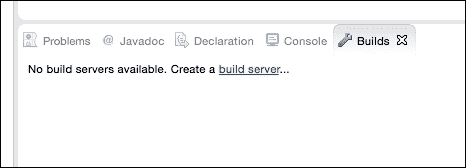
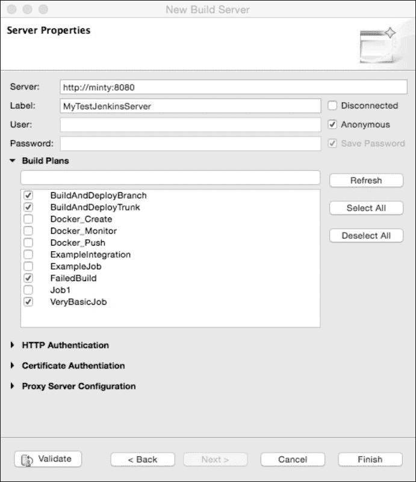
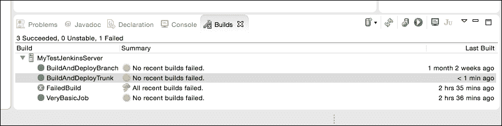
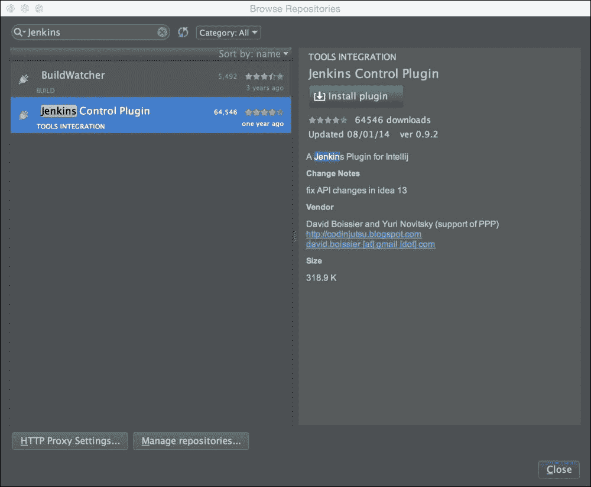
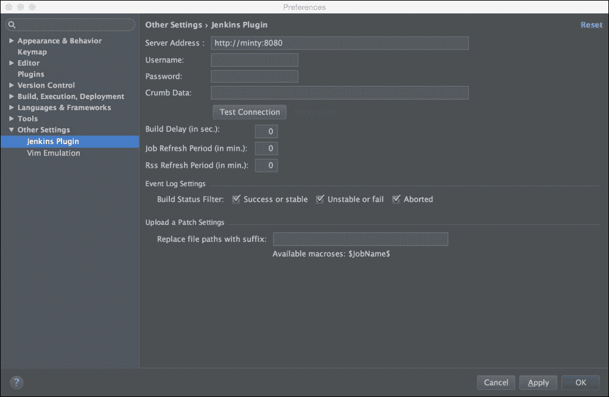
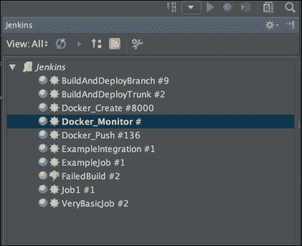
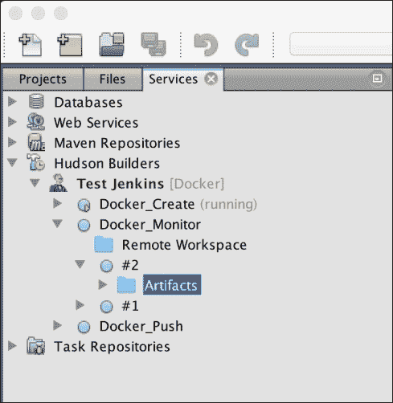

# 三、Jenkins 和集成开发环境

在[第 1 章](1.html#DB7S1-497efea050ab4b7582c7e2ed4ba920ee "Chapter 1. Preparatory Steps")、*预备步骤*中，我们对持续整合的基本原则和目标进行了高层次的审视。然后，我们通过一些相当典型的 Jenkins 用例场景来说明扩展 Jenkins 可以帮助我们实现这些目标的一些方式。

在本章中，我们将更详细地了解如何扩展 Jenkins 并实现持续集成的原则和目标。本章的重点是发现我们可以帮助软件开发人员简化工作的方法。管理团队和开发团队的支持和购买对于任何好的构建过程的成功都是至关重要的，开发人员显然是任何软件开发团队的基础部分。

我们将看一看您可以用来扩展和调整 Jenkins 以适应您的开发人员的特定需求和要求的一些方法，我们将演示如何调整 Jenkins 信息呈现给这些开发人员的方式，以自然地适应他们的工作方式。这里的意图是让人们拥有他们认为既有益又易于使用的工具，从而鼓励人们*做正确的事情*，而不是试图让他们按照我们的指示去做，使用度量、威胁、唠叨的电子邮件，并在每次构建失败时指责他人——这肯定会让许多心怀不满的开发人员低头！

理解动机是理解行为的关键，相当合理的是，开发人员通常高度关注开发代码变更。他们通常对执行额外的任务不太感兴趣，例如监视构建仪表板的更新，或者滚动一天的电子邮件来检查最近是否有人破坏了构建，然后再提交他们的更改。他们自然会专注于他们的角色、他们的优先级、编写代码和测试，并交付它们，以便他们可以继续下一个任务。任何偏离或分散这一目标的事情都可能被视为适得其反。因此，如果我们能够扩展 Jenkins，同时让开发人员更容易关注他们代码的质量，并鼓励他们从持续集成的角度*做正确的事情*，那么每个人都应该更快乐...不管怎样，这就是目标。

我通常用来实现这一点的方法可以用下面这段话来最好地描述:

|   | *“让错误的事情变得困难，让正确的事情变得容易。”* |   |
|   | -雷·亨特 |

这是一个简单但有效的咒语，我发现在这种情况下真的有效。雷·亨特是自然马术运动之父，他在训练马匹时非常成功地运用了这一哲学。而且，在你我之间，我在将它应用于开发人员时也取得了一些成功！

因此，这一章的重点是探索我们可以扩展 Jenkins 的方法，以一种自然且方便他们吸收的方式为我们辛勤工作的开发人员提供他们需要的信息，并使他们能够轻松地*做正确的事情*。如果我们可以直接在集成开发环境中展示我们的信息，而他们已经花费了大部分时间，希望我们可以实现这一点。

回到我们的持续集成目标，从以开发人员为中心的角度来看，我们试图在这里鼓励三种主要行为:

1.  **频繁提交**:我们可以通过使用一个合适的版本控制系统来使这变得容易，该系统允许从开发人员正在使用的集成开发环境中快速签入，并且不会分散他们检查构建任务和状态的注意力。
2.  **如果构建被破坏，将其修复为重中之重**:让当前状态非常明显将有助于实现这一点。
3.  **检查你的动作结果**:这样会大大提升它的功能性。

快速反馈并使其易于查看(而且很难错过！)在这里也会有帮助。如果我们能够在开发人员已经在使用的集成开发环境中很好地、清晰地呈现所有这些信息，我们应该会看到一些很大的改进。

虽然从我们的角度来看，我们即将尝试的技术解决方案应该会有所帮助，但我们不能指望它们本身就是一种神奇的疗法。如前所述，需要一个团队共同努力才能使这些事情发挥作用，因此建立和监控一套开发人员最佳实践、发布标准和指南以及提供用户教育和信息，都在建立高效专业的开发团队和高效的构建过程中发挥着重要作用 IDEs 和 Jenkins Build Connectors。

有不同的开发 ide，选择取决于很多因素，比如编程语言(Java、C++、。Net 等)、环境(Linux、Windows、Mac 等)以及企业和个人偏好(开源或闭源)。我们将看一看一些最流行的 IDEs 及其解决方案；然而，还有许多其他的方法可以满足不同的需求。

# 月食和 Mylyn

第一个和可能是到目前为止我们将看到的所有开发 ide 中最受欢迎的是 Eclipse 平台——这对于包括 Java、C/C++和 PHP 在内的许多不同项目来说都非常受欢迎，并且它拥有庞大的用户群和大量成熟且易于获得的插件。

为了实现我们向开发人员展示 Jenkins 信息的目标，Mylyn 是目前我们可以结合 Eclipse 使用的最流行的扩展。

更多关于 Mylyn 及其提供的许多功能的信息，请点击此链接:

[http://www.eclipse.org/mylyn/](http://www.eclipse.org/mylyn/)

该链接的文档还指出，Mylyn *减少了信息过载，使多任务处理变得容易*，这听起来正是我们要找的！

# 安装 Mylyn

Mylyn 附带的预装了最新版本的 Eclipse，所以您可能只需要通过导航到**窗口** | **显示视图** | **其他**来选择它，然后从 **Mylyn** 类别中选择**构建**组件，如下所示:

现在您只需要使用以下细节来配置 Mylyn:

如果您使用的 Eclipse 版本没有与 Mylyn 捆绑在一起，您可以通过选择**帮助** | **软件更新…** 使用标准的 Eclipse 安装过程下载并安装它，然后使用此 URL 添加一个新的更新站点:[http://download.eclipse.org/tools/mylyn/update/e3.4](http://download.eclipse.org/tools/mylyn/update/e3.4%20)(或更高版本，如果可用且首选)。

一旦完成，选择您刚刚创建的新更新站点，并添加您想要安装的 Mylyn 组件。

## Mylyn 和 Jenkins 配置

安装完成后，您可以从主工具栏菜单中选择**窗口**，然后选择**显示视图**、 **Mylyn** 和**构建**。

这将产生一个类似于下面的窗口，然后您可以从中选择突出显示的选项来创建新的构建服务器定义:

这将生成一个新向导:

选择 **Hudson** 选项并点击**下一步**后，将出现**服务器属性** 对话框，您可以在其中定义和配置**新构建服务器**的属性:

在这里，您可以指定网址和 Jenkins 服务器所需的凭据。快速刷新应该会显示与您的 Jenkins 实例的成功连接，并且还会返回一个作业定义列表供您选择。请注意，Mylyn 满足这里的许多其他连接和授权功能，如果需要，您可以配置这些功能。

使用**验证**按钮快速检查后，点击**完成**保存并关闭服务器配置。

这将导致一个新的**构建窗口，显示您从 Jenkins 服务器中选择的作业的实时信息，类似于以下内容:**

 **

浏览此窗口中的选项显示，您可以右键单击并选择要在选定作业上执行的许多功能:

您可以执行以下功能:

*   查看选定作业的历史记录
*   在 Eclipse 内部的浏览器中打开该作业
*   运行选定的作业
*   查看上次运行的控制台输出
*   在 JUnit 视图中显示 JUnit 结果

所有这些都可以直接在 Eclipse IDE 中完成，这使得开发人员可以非常容易地用很少的努力和最少的干扰来关注他们需要知道的事情。

# IntelliJ IDEA 和 Jenkins 构建连接器

由 JetBrains 开发的 IntelliJ IDEA 是另一个非常受欢迎的集成开发环境，与 Eclipse 类似，它也有大量的附加组件和插件可用于扩展其用途和功能。

在本节中，我们将快速查看为 IntelliJ IDEA 安装和配置**Jenkins 控制插件** ，我们将对其进行配置，以提供类似于 Eclipse 下 Mylyn 提供的功能。

在 IntelliJ 中安装插件非常简单——打开**偏好设置**菜单项，然后在左侧菜单中选择**插件**。Jenkins 控制插件目前没有与集成开发环境捆绑在一起，所以点击**浏览存储库…** 按钮，如下图所示:

这将打开一个新的子窗口，您可以在搜索对话框中输入`Jenkins`来查找两个(当前)可用的插件，如下所示:

点击绿色的 **安装插件**按钮——插件将被下载，系统将提示您重启 IntelliJ IDEA——安装完成。

重启 IDE 后，点击**查看**菜单，选择**工具窗口**，应该会看到一个新的**Jenkins**选项。选择此选项会产生一个名为 **Jenkins** 的新窗格，您可以通过单击扳手图标并填写必要的详细信息来配置与 Jenkins 服务器的连接:

我的示例 Jenkins 实例非常简单——您可能希望在真实的 Jenkins 实例上使用身份验证，因此需要填写相应的细节。您可能需要调整定时和日志记录设置以适合自己；但是，基本设置非常简单，也非常类似于前面的 Mylyn 示例。

完成后，点击**确定**按钮，您应该会在 IntelliJ 中看到您的 Jenkins 实例的视图:

和 Mylyn 一样，您可以使用这个插件执行几个有用的功能——监控构建的状态，触发新的构建，以及查看所选作业的结果和历史。

# NetBeans

NetBeans IDE 有一个内置功能，可以通过`HudsonInNetBeans`服务监控 Jenkins。

选择 NetBeans 中的**服务**选项卡将显示一个 Hudson Builders 项目，您可以在其中定义您的 Jenkins 实例，并根据 Jenkins 服务器上可用的视图定义配置您想要监控的项目:

一旦您注册了服务器，您将通过集成开发环境中的弹出窗口得到任何失败的通知。您可以在这里阅读更多关于该扩展的功能和配置的信息:[http://wiki . netbeans . org/hudssoninnetbeans # General _ setup _ and _ view](http://wiki.netbeans.org/HudsonInNetBeans#General_setup_and_view)。

此外，还可以添加构建监视器插件以包含状态栏通知—可以从插件主页下载:[http://plugins.netbeans.org/plugin/814/build-monitor](http://plugins.netbeans.org/plugin/814/build-monitor)。

然后，通过选择**下载**选项并导航到最近下载的扩展名为`.nbm`的文件，从**工具** | **插件**菜单项安装插件:

现在，只需选择**安装**，同意的条款，然后再次点击**安装**—一旦完成，点击**完成**。您现在应该有一个状态栏项目，可以配置它来监视一个或多个 Jenkins 作业的状态，从而提供另一个有用且不引人注目的机制来监视更重要的构建。

# 总结

在这一章中，我们研究了持续集成的主要目标，以及它们与开发人员的具体关系。我们已经回顾了我们希望在这一领域取得的成就，以及我们如何做到这一点，也就是说，让开发人员能够轻松地做正确的事情，让他们的生活和角色变得更容易。

有许多不同的选项可以让我们集成 Jenkins 和开发人员的环境，我们已经详细介绍了三种最流行的 ide 的一些流行示例——还有许多其他选项可供这些 ide 和其他 ide 使用。如果前面的选项不适合您的环境，希望一般的想法和方法会转化为适合您的东西。这些插件正在定期开发和增强，所以选择最适合你和你的环境的方法和组合。关键目标是让别人的生活变得轻松，鼓励他们也让你的生活变得轻松！

此外，除了集成开发环境之外，我们还有许多其他方式可以将 Jenkins 信息传达给其他人；有系统托盘通知器、信息辐射器、仪表板、定制网络应用、电子邮件提醒、即时消息通知，甚至还有自动熔岩灯和泡沫火箭发射器！

在下一章中，我们将看看我们可以与 Jenkins 互动的其他几种方式——这些方式更注重技术，不太关注最终用户，但它们之间的联系可能会给你一些替代想法，以开发你自己的定制解决方案。**