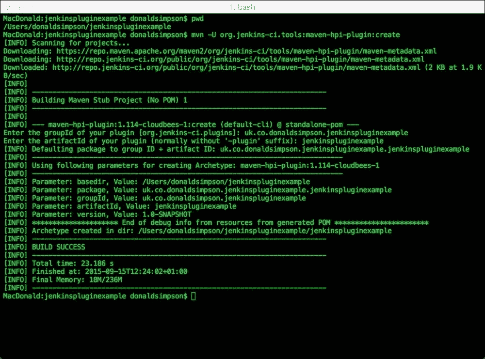
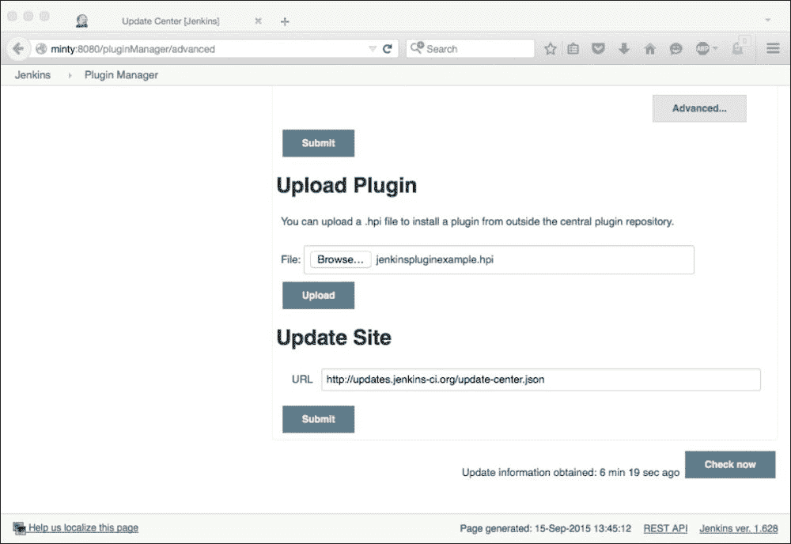
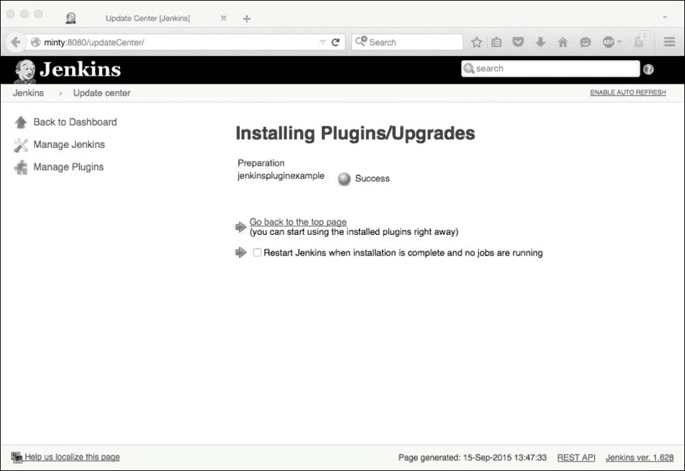
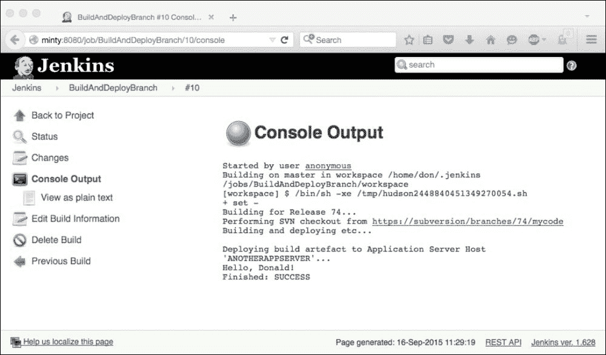
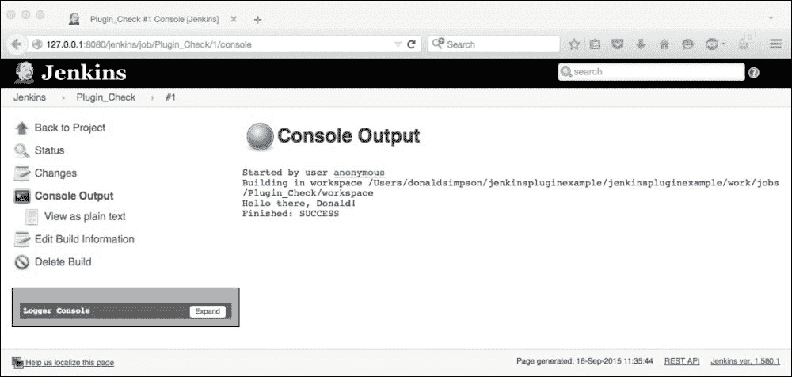

# 第六章。开发自己的詹金斯插件

在前一章中，我们集中讨论了 Jenkins 插件背后的高级概念。

在这一章中，我们将亲自动手完成设置开发环境的实际工作，熟悉我们需要了解的工具和约定，然后创建我们的第一个 Jenkins 插件。

到本章结束时，您应该熟悉以下内容:

*   使用 Maven 进行构建和依赖关系管理
*   用于插件项目的结构和布局
*   创建您自己的詹金斯插件项目
*   对插件源代码进行基本代码更改
*   编译、打包插件并将其部署到远程 Jenkins 实例中
*   使用集成开发环境进行更改并运行詹金斯
*   在集成开发环境中运行和调试詹金斯和插件代码的基础知识

我们将从建立我们的发展环境开始；然后，按照传统，我们将创建一个非常简单的`Hello World` Jenkins 插件项目来说明机制并让我们开始。

本章的大部分内容基于詹金斯插件教程指南中的主题:

[https://wiki.jenkins-ci.org/display/JENKINS/Plugin+tutorial](https://wiki.jenkins-ci.org/display/JENKINS/Plugin+tutorial)

### 注

这一页有许多有用的参考资料，如果你对本章的任何方面有任何困难，这应该是你的第一站。

我们将首先关注工具、约定和框架，并尽可能保持最简单的插件，以提供对开发插件的过程和工具的坚实理解。我们将在下一章研究扩展点和更复杂的代码变更。

我们还将运行插件开发的集成开发环境的设置，并介绍可以直接在 Eclipse 中完成的基本的 Jenkins 调试。

### 类型

首先，我们将重点放在使用 Java 和 Maven 上，因为它们是目前最常见的用于构建插件的工具集，但是我们也将在下一章中研究 Groovy 和 Gradle 等替代方法。

让我们从设置您的环境开始。

# 马文简介

我们将使用 Maven 来构建我们的插件。如果你不熟悉 Maven，不要担心——Maven 的主要观点是，你不一定需要对 Maven 了解很多才能使用它并从中获得很多！

对于一个非常不寻常的构建工具来说，您很可能已经预料到自己对配置文件和代码的深度。然而，由于其核心的核心理念，Maven 在没有这些的情况下也能很好地工作:它使用*约定而不是配置*。

Maven 的工作基于这样一个假设，即您和您的项目遵循一套标准的、合理的约定。这些没有什么太奇怪或繁重的，所以如果你沿着这条路走，那么 Maven 应该知道一切在哪里，你想实现什么，并将帮助你非常快速和容易地起床和跑步。

这些核心假设之一与您的项目结构有关；具体来说，如果您使用的是这样的目录布局:

<colgroup class="calibre21"><col class="calibre22"> <col class="calibre22"></colgroup> 
| 

项目

 | 

默认目录(相对于项目目录)

 |
| --- | --- |
| 源代码 | `src/main/java` |
| 资源 | `src/main/resources` |
| 试验 | `src/test` |
| 汇编代码 | `target` |
| 可分发的 JAR | `target/classes` |

给定一个遵循这个约定的项目，Maven 将自动知道如何构建您的代码，如何测试它，以及如何在不需要其他配置或干预的情况下为您很好地打包它，以非常小的成本提供了很多好处。

### 类型

这很好，只要你的项目坚持 Maven 期望的道路……如果你迷路了，事情会很快变得混乱！这使得 Maven 非常适合新的和结构良好的项目，但是在引入对位置和命名约定有自己想法的遗留项目时，需要做更多的工作。

# 安装 Maven

Maven 是 Java 工具，因此，我们需要安装 Java 才能使用它。如果您在本地运行 Jenkins，您的系统上应该已经有了 Java，但是如果没有，您可以通过以下链接为您的平台下载 JDK——需要 6.0 或更高版本:

[http://www . Oracle . com/tech network/Java/javase/downloads/index . html](http://www.oracle.com/technetwork/java/javase/downloads/index.html)

一旦您已经理清了 Java 的先决条件，请从 Apache 网站下载适用于您的平台的 Maven:

[https://maven.apache.org/download.cgi](https://maven.apache.org/download.cgi)

然后按照本页中操作系统的安装步骤进行操作:

[https://maven.apache.org/install.html](https://maven.apache.org/install.html)

在所有平台上，主要要求是确保你在`PATH`中有一个`JAVA_HOME`变量，`PATH`也包含你从下载中提取的 Maven `bin`目录。

一旦设置好了，运行`java –version`和`mvn –version`时，应该会得到与下面大致相当的结果——我也在这里显示了 Java 和 Maven 环境变量，供您参考:


我们现在需要告诉 T2·马文关于詹金斯的事情；它在哪里，如何建造。我们通过用前面提到的詹金斯插件教程页面的**设置环境**部分中提供的 XML 更新 m2 主目录中的`settings.xml`文件来做到这一点:

[https://wiki.jenkins-ci.org/display/JENKINS/Plugin+tutorial](https://wiki.jenkins-ci.org/display/JENKINS/Plugin+tutorial)

在这里为 Linux 或 Mac 找到你的`settings.xml`文件:`~/.m2/settings.xml`。

对于 Windows，文件位于:`%USERPROFILE%\.m2\`。

在`settings.xml`文件中添加以下文本:

```
<settings>
  <pluginGroups>
    <pluginGroup>org.jenkins-ci.tools</pluginGroup>
  </pluginGroups>

  <profiles>
    <!-- Give access to Jenkins plugins -->
    <profile>
      <id>jenkins</id>
      <activation>
        <activeByDefault>true</activeByDefault> 
          <!-- change this to false, if you don't like to have it on per default -->
      </activation>
      <repositories>
        <repository>
          <id>repo.jenkins-ci.org</id>
          <url>http://repo.jenkins-ci.org/public/</url>
        </repository>
      </repositories>
      <pluginRepositories>
        <pluginRepository>
          <id>repo.jenkins-ci.org</id>
          <url>http://repo.jenkins-ci.org/public/</url>
        </pluginRepository>
      </pluginRepositories>
    </profile>
  </profiles>
  <mirrors>
    <mirror>
      <id>repo.jenkins-ci.org</id>
      <url>http://repo.jenkins-ci.org/public/</url>
      <mirrorOf>m.g.o-public</mirrorOf>
    </mirror>
  </mirrors>
</settings>
```

为每个项目建立一个新目录是个好主意。这使事情保持干净和简单，而不是让多个项目共存于一个文件夹中。要为此项目创建目录，运行`mkdir`然后运行`cd`进入目录，如下所示:

```
mkdir jenkinspluginexample
cd jenkinspluginexample

```

之后，我们可以开始构建，这将为我们创建一个框架插件项目:

```
mvn -U org.jenkins-ci.tools:maven-hpi-plugin:create

```

### 注

如果此时有任何问题，请先检查这三个常见原因:

*   `mvn`在这个目录下工作吗？使用`mvn -version`检查
*   Java 在这个目录下工作吗？使用`java -version`检查
*   你有互联网连接吗？使用`ping www.google.com`检查

如果一切顺利，系统会提示你回答几个简单的问题；Maven 希望您指定插件的`groupId`和`artifactId`参数。

对于`groupId`，惯例是用你的域名反过来跟项目名，都是小写，用点隔开。给定`donaldsimpson.co.uk`域名和`jenkinspluginexample`项目名，我会用这个:`uk.co.donaldsimpson.jenkinspluginexample`。

`artifactId`的值应该是你的项目名称，也就是`jenkinspluginexample`。

如果您打算让几个组件或服务组成`jenkinspluginexample`项目，您应该在此处添加额外的服务名称，例如:

```
jenkinspluginexample-service
jenkinspluginexample-web
jenkinspluginexample-gui

```

这种方法背后的意图是确保当与组标识结合使用时，项目的每个部分都保持唯一且易于识别。



前面的截图是前面输入的结果，并声明已经使用框架插件创建了 1.0 版本的 Snapshot 构建，它已经生成了一个非常基本的插件，也是我们要检查的第一个插件。

现在看看新创建的子目录，它的名称应该与您的`artifactId`相匹配。

在探索这个目录时，我们现在应该有了创建最基本插件所需的所有东西的生成示例。其中包括以下内容:

*   `pom.xml`:我们项目的新 Maven POM 文件，包含 Maven 构建、打包和分发我们的示例插件所需的信息
*   `src/main`:这个目录包含一个 Java 目录和一个资源目录
*   `src/main/java`:这个目录包含`Hello World`构建器类，我们稍后会更新
*   `src/main/resources`:该文件夹包含配置和帮助文件

仔细查看我们刚刚生成并提到的这些新文件夹的内容，将有助于您熟悉 Maven 和 Jenkins 开发、构建和分发插件时使用的不同文件和结构。布局遵循 Maven 约定，也用于许多其他项目。

正如您之前看到的，我们的新项目目录有自己的`pom.xml`文件，因此我们应该能够将其构建为一个 Maven 项目——让我们来看看并尝试一下！

将目录更改为您的新`pom.xml`文件的位置，并查看它—您将在这里看到各种可用的目标，以及使用我们的项目所需的所有细节。

还有一份包装声明，如下所示:

```
<packaging>hpi</packaging>
```

这告诉 Maven，您希望将这个项目打包成一个 HPI 文件——这是 Jenkins 插件的标准文件格式。其他包装说明通常包括 ZIP、JAR、WAR 和 EAR。

Maven 还假设您希望在您的项目中执行一组标准的任务，这些任务通常包括功能或**阶段** ，如下所示:

*   `validate`:这个验证项目是正确的，所有必要的信息都是可用的。
*   `compile`:这个编译项目的源代码。
*   `test`:这使用合适的单元测试框架测试编译后的源代码。测试不应该要求打包或部署代码。
*   `package`:这个取编译后的代码，以可分发的格式打包，比如一个 JAR。
*   `integration-test`:如果有必要，这将处理并部署包到一个可以运行集成测试的环境中。
*   `verify`:这将运行检查，以验证包装是否有效并符合质量标准。
*   `install`:这个把包安装到本地的存储库中，作为本地其他项目的依赖项。
*   `deploy`:这是在集成或发布环境中完成的。该函数将最终的包复制到远程存储库中，以便与其他开发人员和项目共享该包。
*   `clean`:这个清理由先前构建创建的工件。
*   `site`:本生成本项目的现场文件。

本指南提供了更多关于 Maven 阶段和目标以及它们之间联系的信息:

[https://maven . Apache . org/guides/入门/maven-五分钟. html](https://maven.apache.org/guides/getting-started/maven-in-five-minutes.html)

如果我们现在运行`package`目标，Maven 应该运行所有的先决步骤，然后生成一个 HPI 文件，我们可以通过运行以下命令将其部署到 Jenkins:

```
mvn package

```

此阶段将使用 POM 文件中的信息下载所有必需的依赖项。然后，它将编译 Java 代码，并且还将运行测试(如果在期望的位置存在任何测试的话— `src/test`)。

根据您的互联网连接，这可能需要一些时间，因为 Maven 将对所有声明的依赖项(及其依赖项！)本地还没有。在后续的运行中，事情应该会更快，因为 Maven 会将下载的资源保留在`.m2/repository`缓存文件夹中，该文件夹位于我们之前更新的 settings.xml 旁边的主目录中。

完成后，您现在应该有一个可分发的`.hpi`文件了！


从上图中可以看到，在接近结尾时生成的控制台输出解释了代码已经被编译到一个 Java Archive ( `.jar`)文件中，资源(Jelly、配置和 HTML 文件)已经包含在内，并且在我的例子中，所有内容都被打包到一个名为`jenkinspluginexample.hpi`的结果归档中，该归档现在位于`target/`目录中。

我们还没有写一行代码，但我们刚刚生产了我们的第一个詹金斯插件！

现在让我们将其部署到一个标准的詹金斯实例中:

1.  打开詹金斯实例的主页。
2.  导航至詹金斯**主页** | **管理詹金斯**。
3.  选择**管理插件**，然后选择**高级**。
4.  向下滚动至**上传插件**部分，点击**浏览**。
5.  Navigate to the local folder where your new `.hpi` file is (in the target directory of your project):

    

单击 **提交**按钮后，您应该会看到您的插件已上传并安装在您的 Jenkins 实例上:



现在，您的已安装插件列表中将有一个`TODO`插件，以及快照版本号和您的作者姓名。

如果您现在点击任意自由式作业的**配置**，将会有一个新的选项来添加一个名为**打招呼世界**的构建步骤:


选择此选项将产生以下对话框，您可以在其中输入您的姓名:


不出所料，对于`Hello World`项目，这将在下次运行该作业时作为控制台输出中的附加构建步骤显示:



在詹金斯实例上安装并运行我们自己的插件看起来很酷，第一次这样做很有趣。然而，当你在开发一个插件的时候，每次你做一个小的改变都要经历这样的过程，这比你想要的要麻烦的多！

现在让我们来看看如何进行我们的第一次代码更改，以及一种更智能、更高效的方法来打包、部署和测试我们的代码。

首先，对您的`src/main/java`目录中的`HelloWorldBuilder.java`文件进行如下微小更改:

```
src/main/java/uk/co/donaldsimpson/jenkinspluginexample/jenkinspluginexample/HelloWorldBuilder.java
```


最初，这条线是这样的:

```
listener.getLogger().println("Hello, "+name+"!");
```

我只是把前面一行改成了下面一行:

```
listener.getLogger().println("Hello there, "+name+"!");
```

我们可以通过一个简单的 Maven 命令来执行所有这些步骤，而不是再一次通过前面的过程(通过 Jenkins 网页等进行编译、打包和部署)来检查这个小更新:

```
mvn hpi:run

```

这将编译代码(在获得我们的修改之后)，然后在您的机器上启动并运行 Jenkins 的一个本地实例，我们新更新的插件已经部署到它上面——这使得测试您的更改变得更加容易、快速和安全。

要在 Windows 上执行此操作，首先导出以下设置:

```
set MAVEN_OPTS=-Xdebug –Xrunjdwp:transport=dt_socket,server=y,address=8000,suspend=n

```

在 Unix 和 Mac 上，执行相同的操作，如下所示:

```
export MAVEN_OPTS="-Xdebug –Xrunjdwp:transport=dt_socket,server=y,address=8000,suspend=n"

```

然后，不考虑平台，调用`hpi:run`目标，如下图:

```
mvn hpi:run

```

在此之后，您将能够看到 Maven 下载依赖项，然后启动一个本地 Jetty 实例，运行 Jenkins，并在其上安装您的插件！

留意你的控制台输出，只要显示以下文字，你就会看到什么时候一切都完成了: **INFO: Jenkins 完全启动并运行**。

此时，您可以通过将浏览器指向以下位置来安全地连接到 Jenkins 实例:

`http://127.0.0.1:8080/jenkins/`

### 注

不要试图连接到您在`MAVEN_OPTS`中设置的`8000`端口——这是用于调试的，我们稍后会看到。使用端口`8080`，注意连接也需要附加的`/jenkins/`路径。

现在，我们可以创建和配置一个新的自由式作业，并通过选择使用我们的**hello world**作业并向其中添加我们的名字来添加与之前相同的构建步骤。

运行这个新作业应该会产生预期的输出，如下所示:



这证明了我们的代码更改已经开始，并展示了您可以多么快速和轻松地进行、测试、打包、部署和验证您的插件更改——一个小小的 Maven 命令就可以为您完成大部分工作！在初始设置和下载之后，这也是一个相当快的过程。

为了让生活变得更容易，我们可以建立一个 IDE 来帮助我们开发詹金斯插件。

### 注

官方的詹金斯插件教程页面在 https://wiki.jenkins-ci.org/display/JENKINS/Plugin+tutorial T2。本教程包含 NetBeans、IntelliJ IDEA 和 Eclipse 的步骤。前两个非常简单，所以我们将在这里更详细地介绍 Eclipse 设置。

插件指南目前建议使用这个命令来为插件开发生成一个新的 Eclipse 工作空间:

```
mvn –DdownloadSources=true –DdownloadJavadocs=true -DoutputDirectory=target/eclipse-classes –Declipse.workspace=/path/to/workspace eclipse:eclipse eclipse:add-maven-repo
```

您需要更新`/path/to/workspace`以指向系统上合适的工作空间位置——这可以是您喜欢的任何地方，但理想情况下，在您的其他 Eclipse 工作空间旁边。

### 注

我在运行建议的命令时遇到了问题，发现`eclipse:add-maven-repo`已被弃用，所以我将其更新为`eclipse:configure-workspace`。

对于我的项目来说，以下工作正常:

```
mvn –DdownloadSources=true –DdownloadJavadocs=true -DoutputDirectory=target/eclipse-classes -Declipse.workspace=/Users/donaldsimpson/Documents/JenkinsPluginEclipseWorkspace eclipse:eclipse eclipse:configure-workspace
```

请确保在创建`Hello World`插件时使用的目录中运行该命令，因为它需要`pom.xml`文件和其他资源。

完成后，这一步应该会成功地在您的新工作区中填充一个新的 Eclipse `.metadata`目录，并在您的项目目录中拥有所有需要的设置和资源。

接下来，打开 Eclipse 并切换到您选择的工作区，选择**导入**(在**文件**菜单下)，选择**常规**，然后选择**将现有项目导入工作区**，如下所示:


将此对话框指向您创建`Hello World`插件的目录(文件`pom.xml`所在)，Eclipse 将自动为您加载项目:


完成后，您应该有一个看起来像这样的 IDE:


现在，您可以在 Eclipse 中编辑 Java 类和插件资源。

### 类型

请记住，您还可以启用我们之前设置的 Mylyn 插件，以关注您最重要的 Jenkins 版本的运行情况！

您还可以管理项目的 POM 文件，并从这里运行 Maven 构建——右键单击`pom.xml`文件并选择**运行为**和 **Maven 构建**，Jenkins 现在应该直接在您的 Eclipse 控制台中启动，您的插件已经部署了最新版本的代码。

为了测试这个设置，尝试做另一个非常简单的改变——在前面的图片中，我更新了输出消息到**你好再次**，只是为了与众不同。保存`Hello World`构建器类，然后通过 Eclipse 运行 Maven 目标`hpi:run`会激发 Jenkins，你可以看到 Eclipse 中所做的修改。

您也可以在**调试**模式下运行 Jenkins，并通过在 Eclipse 中单击所需的代码行来设置断点，如下所示:


在这里，我们可以看到通过詹金斯运行构建时断点被激活。此时，焦点将自动从浏览器中的 Jenkins 切换到 Eclipse IDE，在这里我们可以在运行时检查现有变量的当前值。然后，我们可以通过实时调试值并在每一步监控控制台输出，一步一步地浏览代码。

这是一个非常方便的开发特性，以这种方式设置您的 Jenkins 插件开发环境可以让事情变得更有效率，并且让您的生活更加轻松！

# 总结

在本章中，我们已经构建、打包并部署了我们自己的“基本”詹金斯插件。

我们已经查看了用于开发 Jenkins 插件的工具和约定。我们已经在开发主机上安装了 Java、Maven 和 Eclipse，并学习了如何构建、打包、测试、部署，甚至调试我们自己的插件。

我们仍然缺少的主要是你决定放在中间的东西！这是我们将在下一章集中讨论的内容。