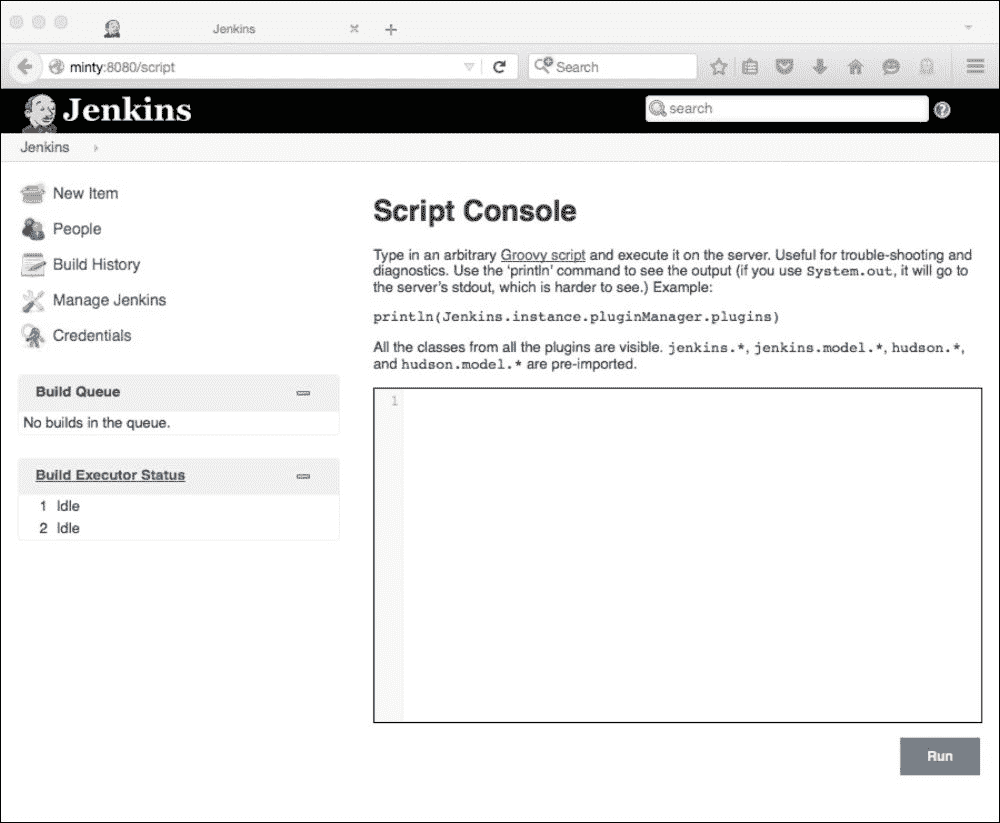
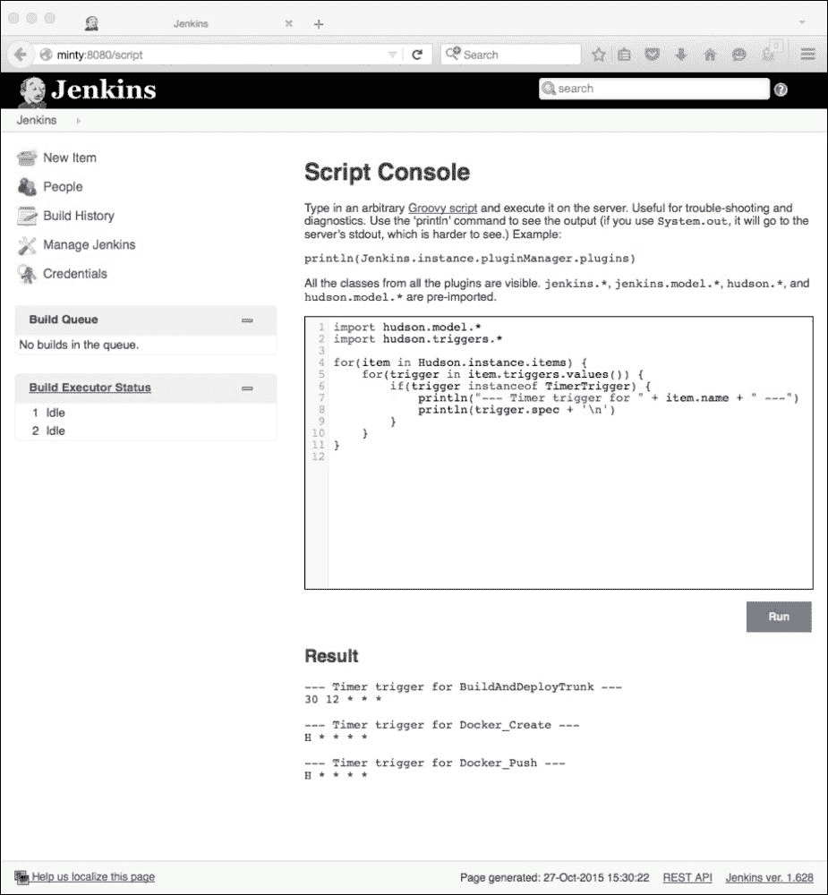
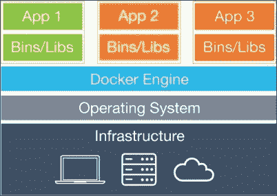

# 第九章。把东西放在一起

在这一章中，我们将看看詹金斯可以通过与其他语言、工具和软件相结合来扩展的一些方法。

在此过程中，我们将研究以下主题:

*   使用詹金斯脚本控制台
*   用 Groovy、Grails 和 Gradle 开发
*   詹金斯和码头工人——码头工人中的詹金斯和詹金斯中的码头工人
*   用詹金斯构建安卓应用程序
*   与詹金斯一起构建 iOS 应用程序

详细介绍所有这些主题超出了本书的范围，但是我们将介绍这些主题，解释基本设置，并提供进一步信息的链接。这应该提供了一个足够好的概述，并使您能够开始使用詹金斯与这些技术。此外，它可能会提供一些想法来扩展您的詹金斯设置，以纳入其他工具和技术。

# 詹金斯脚本控制台和 Groovy

内置的脚本控制台是一个非常有用和强大的詹金斯扩展，非常适合某些类型的任务。这个简单但强大的内置 web 控制台允许您直接在用户界面中在您的 Jenkins 实例(或其从属节点)上运行 Groovy 脚本，并且作为标准安装。

要访问控制台，请导航到**管理詹金斯**，然后选择**脚本控制台**，或者简单地将`/script`附加到您的詹金斯主机和端口，例如:

`http://jenkinshost:8080/script`

然后，您应该会看到一个类似于下面的页面。这包含一些介绍性信息和到网站[http://www.groovy-lang.org/](http://www.groovy-lang.org/)的链接，以获得关于 Groovy 的更多细节，这是脚本控制台使用的语言。



本链接来自詹金斯主页:

[https://wiki . JENKINS-ci . org/display/JENKINS/JENKINS+Script+Console](https://wiki.jenkins-ci.org/display/JENKINS/Jenkins+Script+Console)

它提供了一个有用的示例脚本集合，向您展示了这是如何工作的，以便让您开始。

这些示例脚本涵盖了广泛的功能，并且主要集中在一般的 Jenkins 管理和内务处理任务上，由于其易用性和灵活性，该工具非常适合这些任务。使用此界面，您可以快速轻松地在网页中插入和编辑代码，只需单击一个按钮即可运行代码，并立即看到结果。没有需要担心的编译步骤或外部依赖。

例如，复制这个 Groovy 代码:

```
import hudson.model.*
import hudson.triggers.*
for(item in Hudson.instance.items) {
  for(trigger in item.triggers.values()) {
    if(trigger instanceof TimerTrigger) {
      println("--- Timer trigger for " + item.name + " ---")
      println(trigger.spec + '\n')
    }
  }
}
```

在[https://wiki . jenkins-ci . org/Display/JENKINS/Display+timer+triggers](https://wiki.jenkins-ci.org/display/JENKINS/Display+timer+triggers)处输入示例脚本后，点击 **Run** 将返回预期结果—该 JENKINS 实例上所有计划作业的详细信息(假设您已经进行了一些设置):



从这个非常简单的例子和 Groovy 网站可以看出，Groovy 语言是面向 Java 开发人员的，并且具有非常平坦的学习曲线。它是一个非常强大的工具，非常适合某些任务。它经常被用于开发和管理你自己的插件超过你真正想要或需要的情况。对于这些任务来说，一个可以动态运行和修改的简单 Groovy 脚本通常是更好的选择。

您还可以创建执行系统 Groovy 脚本的作业。这些在 Jenkins JVM 中运行，因此可以访问 Jenkins 内部对象并与之交互。

本示例详细介绍了监控从属节点状态的 Groovy 作业的设置，更多详细信息，请参考[http://www . donaldsimpson . co . uk/2013/06/07/monitoring-Jenkins-slave-nodes-with-Groovy/](http://www.donaldsimpson.co.uk/2013/06/07/monitoring-jenkins-slave-nodes-with-groovy/)。

这种方法的关键是下面简单的 Groovy 代码:

```
int exitcode = 0
for (slave in hudson.model.Hudson.instance.slaves) {
  if (slave.getComputer().isOffline().toString() == "true"){
    println('Slave ' + slave.name + " is offline!");
    exitcode++;
  }
}
if (exitcode > 0){
  println("We have a Slave down, failing the build!");
  return 1;
}
```

当添加到 Jenkins 作业并通过计划任务运行时，每当您的一个或多个现有从机脱机时，Groovy 代码都应该以错误状态退出，输出大致如下:

```
Building on master in workspace /apps/jenkins/jobs/MonitorSlaves/workspace Slave <YOURSLAVENAME> is offline!
We have a Slave down, failing the build!
Script returned: 1
Build step 'Execute system Groovy script' marked build as failure Finished: FAILURE
```

这显然可以扩展到随后执行您想要的任何后续操作，例如，发送电子邮件警报，或执行一些其他功能(例如尝试重新启动从属设备或使替代从属设备联机)。

这个链接展示了一种自动重启离线从节点的方法——它也是用 Groovy 编写的:

[https://wiki . JENKINS-ci . org/display/JENKINS/Monitor+and+Restart+Offline+Slaves](https://wiki.jenkins-ci.org/display/JENKINS/Monitor+and+Restart+Offline+Slaves)

Jenkins 对 Groovy 的内置支持使您能够快速轻松地为自己的需求开发强大的自定义脚本。Jenkins 脚本控制台主页还详细介绍了如何远程运行 Groovy 脚本，并提供了使用和支持 Groovy 语言的可用 Jenkins 插件列表。这些可以设置为允许您运行 Groovy 脚本作为构建的一部分。

# Groovy 和 Gradle 作为备选方案

如果你对 Groovy 感兴趣，你也可以使用这种语言和其他工具的组合来创建你自己的插件——如果你不想的话，你不必坚持使用 Java 和 Maven。

本页解释了如何修改你的项目来使用一个`build.gradle`文件来代替我们之前使用的 Maven POM 文件:

[http://Jenkins-ci . org/content/grad le-fy-you-Jenkins-plugin-project](http://jenkins-ci.org/content/gradle-fy-your-jenkins-plugin-project)

然后可以执行`gradle jpi`、`gradle check`、`gradle install`等命令，在没有 Maven 的情况下构建和管理插件生命周期。

这个 CloudBees 演示说明了插件本身使用 Groovy 而不是 Java:

[https://www . cloud bees . com/event/topic/groovy-way-write-Jenkins-plugin](https://www.cloudbees.com/event/topic/groovy-way-write-jenkins-plugin)

由于 Groovy 的强大和简单性，这是一种越来越流行的方法。它还解释了如何用 Groovy 替换 Jelly 使用相同的语言(Gradle 是基于 Groovy 的，所以…都是 Groovy！)贯穿整个开发过程很有道理。

# 詹金斯和多克

Docker 是一个应用程序，它使您能够将一个应用程序及其所有的依赖项打包到一个单一的单元(Docker **容器**)中，该单元可以以一种简单和标准化的方式进行版本控制和部署。

Docker 主页解释了 Docker 如何工作以及如何安装和使用它:

[https://www.docker.com/what-docker](https://www.docker.com/what-docker)。

从概念上来说，Docker 容器类似于轻量级虚拟机，但它们有一些基本的体系结构差异，使它们更轻量级、更高效，如下面的 Docker 和虚拟机比较图所示。

下图显示了一个普通的虚拟机:


下图显示了一个 Docker 容器:



Docker 容器可以发布和管理，记录每一个变更。它们就像在版本控制系统下管理的高效虚拟机，提供类似于 Git 的功能。它们也是高度可配置的，并提供灵活且可扩展的部署流程。

除了审计和易用性之外，还保证了容器在任何能够运行 Docker 的环境中都是完全相同的(并且行为完全相同)。

这可以消除许多通常与现代软件开发相关的环境差异，消除旧的*嗯，它适用于我的机器*综合征，以及有时会导致严重且难以检测的问题的(假设相同的)环境之间的细微差异。

像詹金斯一样，Docker 非常灵活，功能强大，可扩展性强。毫不奇怪，他们在一起工作得非常好。

在中有很多方式可以组合和利用 Docker 和 Jenkins 的力量。这些方法通常意味着在詹金斯 中使用**码头工人，或者在码头工人**中使用 **詹金斯。**

## 詹金斯的码头工人

使用詹金斯([https://wiki.jenkins-ci.org/display/JENKINS/Docker+Plugin](https://wiki.jenkins-ci.org/display/JENKINS/Docker+Plugin))的 Docker 插件，您可以设置詹金斯作业，该作业每次都可以在新鲜且已知良好的 Docker 容器中执行保证的*干净构建*。

这可以通过为作业运行动态配置一个新的从节点来实现(从版本控制的 **Docker** **Hub** 中获取)。

构建或测试然后可以在这个环境中运行，结果可以被记录和存档。然后可以删除整个环境，并保证，如果您愿意，将 Docker 容器与部署代码的相同版本相结合，将在未来的任何日期和任何环境中重新创建完全相同的结果。

## 码头工人中的詹金斯

我们之前已经研究了几种不同的方法来设置和管理您的詹金斯服务器。我们还强调了将您的詹金斯配置存储在版本控制系统中的重要性，并确保您可以在不丢失数据的情况下从问题中恢复。

扩展 Jenkins 以利用 Docker，使您能够从已知良好的快照快速轻松地创建(或重新创建)自己的 Jenkins 环境。只需在 Docker 管理的容器中设置和维护您的 Jenkins 服务器，您就可以立即获得 Docker 提供的所有优势和能力。

这种方法的一个流行的现成的 Docker 容器是 CloudBees 这里的一个:

[https://github . com/jenkinci/docker](https://github.com/jenkinsci/docker)

一旦在您的环境中安装并设置了 Docker，您所需要做的就是运行以下命令:

```
docker run -p 8080:8080 -p 50000:50000 jenkins

```

下面 GitHub 页面上的`Dockerfile`详细说明了这个容器是如何构建的，以及您可以使用和调整的许多替代方法和选项中的一些:

[https://github . com/jenkinci/dock/blob/master/docerfile](https://github.com/jenkinsci/docker/blob/master/Dockerfile)

一旦你在 Docker 中运行了 Jenkins，你就可以进行任何你想要的修改，然后在 Docker Hub 上以你自己的账号发布你修改后版本的快照，有效地控制整个设置的版本。如果您愿意，您甚至可以创建和维护您自己的 Docker Hub 本地版本(当然是在 Docker 上运行)，并在那里发布/拉取您自己的图像。

一旦容器本身死亡，Docker 容器就不会保存它们的数据——您需要保存状态并发布它。正如在 GitHub 页面上提到的，您可以通过从本地文件系统(即运行 Docker 的主机上的指定文件夹)装载数据卷来设置持久存储。这些文件夹的内容(例如，可能包含配置信息、公钥或插件数据)也可以由版本控制提取和管理。或者，您可以创建自己的专用卷容器，允许您管理另一个 Docker 容器中的所有持久数据。这也可以进行版本控制，并在需要时附加到您的 Jenkins 容器上。

您也可以设置您的詹金斯从机在动态配置的 Docker 从机上运行。有许多 Jenkins 插件可以做到这一点，由于这是一项快速发展的技术，因此肯定会有更多的插件，例如这个插件:

https://wiki . Jenkins-ci . org/display/Jenkins/dock+slaves+plugin

这篇关于为动态供应创建詹金斯从属 Docker 映像的详细帖子可在以下网址获得:

[https://developer . JBoss . org/people/pgier/blog/2014/06/30/点播-Jenkins-奴隶-使用-docker](https://developer.jboss.org/people/pgier/blog/2014/06/30/on-demand-jenkins-slaves-using-docker)

这些只是(目前)最常见的组合詹金斯和多克的几种方式；还有许多其他的可能性，更多的可能性肯定会很快进化。例如，您可以在 Docker 容器中运行您的主 Jenkins 实例，并让它运行 Jenkins 作业，这些作业创建其他 Docker 容器来运行您的测试和构建，而这些容器又可以使用 Docker 容器！

在 Docker 项目中甚至有一个 **Docker，它允许你从 Docker 容器内部创建和管理 Docker 容器…很多有趣的可能性！**

# 詹金斯和安卓

詹金斯可以在软件开发工具包和一些插件的帮助下，实现安卓应用程序的自动构建、部署、测试和发布。要构建安卓应用，您需要安卓软件开发工具包，可从以下网站下载:

[http://developer.android.com/sdk/index.html](http://developer.android.com/sdk/index.html)

下载后，将归档文件提取到本地目录。然后编辑以下环境变量并将其添加到您的系统中:

```
export ANDROID_HOME="<location of extracted files>" export PATH="$ANDROID_HOME/tools:$ANDROID_HOME/platform-tools:$PATH"
```

完成后，更新 SDK，并验证您的 Jenkins 用户对 SDK 可执行文件具有读取和执行权限。

要运行安卓模拟器作为构建过程的一部分，请将此插件添加到您的 Jenkins 服务器:

[https://wiki . JENKINS-ci . org/display/JENKINS/Android+Emulator+Plugin](https://wiki.jenkins-ci.org/display/JENKINS/Android+Emulator+Plugin)

请注意，如果找不到安卓软件开发工具包，这将尝试为您安装一个。但是，根据您的要求，提前设置软件开发工具包通常更好。您可以通过**管理詹金斯**设置页面上的**需要时自动安装安卓组件**选项禁用自动安装尝试，并在此指定应使用哪个软件开发工具包:


正如安卓模拟器插件说明中所描述的，您应该能够创建一个新的詹金斯作业，在构建期间使用您想要使用的任何硬件和软件规范运行安卓模拟器。您可以指定内存、屏幕大小和分辨率、操作系统版本等，如下所示:


(来源:https://wiki . Jenkins-ci . org/download/attachments/43712988/Android _ job-custom . png？版本= 1 & modificationDate 日期=1270447137000)

然后，您的 Jenkins 作业可以使用 Android `adb`命令行工具继续安装您最近编译的应用程序，例如:

```
adb install my-app.apk

```

或者，您可以指定一个新的构建步骤，为您(重新)安装 APK，如下图所示:


(图片取自 https://wiki . Jenkins-ci . org/download/attachments/43712988/Android _ install-package . png？版本= 1 & modificationDate 日期=1299432099000)

部署应用程序后，您可以包含一个额外的测试步骤来运行安卓 Monkey Tester 工具。这将针对运行在安卓模拟器上的最新 APK 进行测试，该模拟器将模拟您选择的任何硬件和软件规格。设置多个作业来确保您的测试覆盖用户可能拥有的硬件和软件的所有组合和排列通常是有用的。

还有一个 Jenkins 插件，可以让你自动发布你的应用程序并将其发布到 Google Play 商店:

[https://wiki . JENKINS-ci . org/display/JENKINS/Google+Play+Android+Publisher+Plugin](https://wiki.jenkins-ci.org/display/JENKINS/Google+Play+Android+Publisher+Plugin)

有关使用 Jenkins 构建、部署和测试 Android 应用程序的更多详细信息，此链接是一个很好的起点:

[https://wiki . JENKINS-ci . org/display/JENKINS/Building+an+Android+app+和+test+项目](https://wiki.jenkins-ci.org/display/JENKINS/Building+an+Android+app+and+test+project)

# 詹金斯和 iOS

您的詹金斯设置和范围也可以扩展到构建 iOS 项目，方式与前面的安卓步骤非常相似。总体思路是一样的；安装和配置一个 SDK(用于 iOS 的 XCode)，添加所需的 Jenkins 插件，在模拟器上构建和部署应用程序，对其运行测试，并记录结果。

然而，iOS 构建的一个重要区别是，您需要一个 OS X 主机来运行它。该主机可以设置为 Jenkins 从节点，基于 iOS 的 Jenkins 作业只在该节点上运行。

主机需要本地安装 XCode，可在此处获得:

[https://developer.apple.com/xcode/download/](https://developer.apple.com/xcode/download/)

或者可以从苹果应用商店获得。

此 Jenkins 页面详细介绍了安装和设置过程:

[https://wiki.jenkins-ci.org/display/JENKINS/Xcode+Plugin](https://wiki.jenkins-ci.org/display/JENKINS/Xcode+Plugin)

以下是一些关于 iOS 和 Jenkins 的更多信息的附加链接:

*   [http://savvyapps . com/blog/continuous-integration-IOs-Jenkins](http://savvyapps.com/blog/continuous-integration-ios-jenkins)
*   [https://www . build . io/blog/2014/10/如何设置-定制-jenkins-for-ios/](https://www.built.io/blog/2014/10/how-to-set-up-customized-jenkins-for-ios/)
*   [http://blog.pivotal.io/labs/labs/ios-ci-jenkins](http://blog.pivotal.io/labs/labs/ios-ci-jenkins)
*   [http://youandthe gang . com/2015/continuous-integration-delivery-with-Jenkins/](http://youandthegang.com/2015/continuous-integration-delivery-with-jenkins/)

# 让你的詹金斯版本和插件保持最新

和所有现代软件一样，重要的是保持你的詹金斯版本和插件是最新的。

您可以在此通过 RSS 订阅插件发布通知:http://feeds.feedburner.com/JenkinsPluginReleases

否则，您可以在此订阅:[https://jenkins-ci.org/releases.rss](https://jenkins-ci.org/releases.rss)

您可以通过以下链接关注詹金斯在推特上发布的通知:[https://twitter.com/jenkins_release](https://twitter.com/jenkins_release)

# 总结

从本章的简短介绍和示例中，我们已经看到了 Jenkins 可以多么轻松地进行扩展和调整，以与其他语言和技术一起工作和集成，利用它们提供的功能，并允许您设置以您想要和需要的方式工作的流程。将 Jenkins 与其他工具相结合，使您能够为各种各样的项目和目的创建强大而灵活的构建过程。

Jenkins 与这些技术(以及许多其他技术)很好地集成在一起，这主要归功于其固有的灵活性和可扩展性、丰富的插件以及活跃的开发、支持和用户社区。

在这本书里，我们探索了许多不同的方法，可以调整和扩展 Jenkins 来执行您想要的任何功能，从利用 API、通过 IDEs 进行交互、调整用户界面到开发您自己的插件、创建和使用扩展点，再到拥抱和利用新兴技术。

希望这些主题和技能能鼓励和赋能你找到新的有趣的方法，为你自己的项目利用詹金斯的力量。