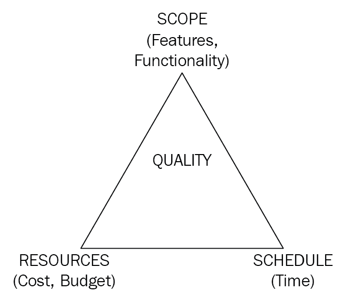
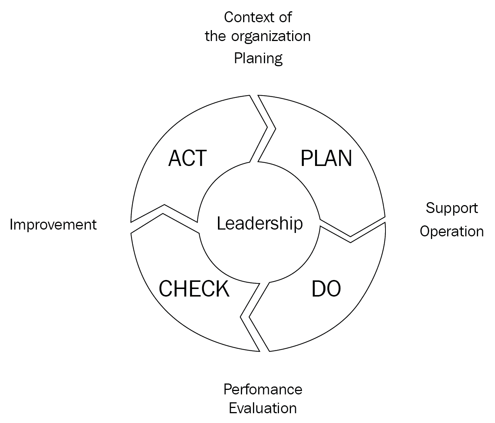

# 一、软件质量保证简介

作为人类，我们会犯错吗？答案是压倒性的*是*。有一些质量控制和决策失败的例子震惊了世界，给相关公司造成了巨大损失。例如，我们都记得挑战者号航天飞机发射时爆炸的悲惨事故。这是一个简单的疏忽，还是有可能对系统进行充分测试，以控制故障威胁并避免爆炸？

为了弄清此类事件的真相，我们需要向参与此类系统设计和生产的人学习。错误通常是不可避免的，并且可能发生在生产的任何阶段，这是由于需求薄弱或不明确、匆忙赶在截止日期前完成或对系统了解不足等原因。然而，我们能做的是遵循一个过程，这个过程可以帮助减少产生或引入任何新的错误，同时防止已知的错误被重复。这需要思想过程的改变和对标准实践的依赖，以便生产更成功的产品。让我们先了解质量意味着什么，然后再开始我们的旅程，为交付无缺陷软件创造可持续和可重复的最佳实践。

在本章中，我们将涵盖以下主题:

*   什么是质量？
*   我们如何保证质量？
*   软件测试思维过程
*   质量管理体系
*   软件开发生命周期与软件测试生命周期
*   测试类型
*   准备测试数据和管理测试工件

# 什么是质量？

质量，就像任何其他衡量标准一样，需要一个参考框架或标准，供我们与客户需求进行比较。这些标准可以帮助我们保持和促进开发产品的一致性，最大限度地减少所需的返工量，并生产出面向客户的产品。

质量可以用不同的方式来定义。根据**国际标准化组织** ( **ISO** ) 13628-2:2006，质量可以定义为符合规定的要求。

有七个主要的国际标准化组织原则(由 ISO 9000)围绕着制造一个高质量的产品:

*   客户导向
*   领导力
*   人们的参与
*   过程方法
*   改进
*   循证决策
*   关系管理

国际标准化组织(国际标准化组织/IEC 25010:2011)提出的质量模型有助于评估产品质量。采用这种模式可以指导组织如何提高软件质量。该模型描述了软件在发布给最终用户之前，为达到生产就绪状态所应具备的质量特征和子特征。让我们仔细看看这些特征和子特征。

产品质量模型涉及软件的静态特性和计算机系统的动态特性:

从上图中可以看出，有八个产品质量特征，我将向您解释:

*   **功能适用性** **:** 通过将其细分为三个不同的类别来表征软件的功能潜力和能力:
    *   **完整性**:为满足用户目标而实现和覆盖所有指定需求的一组功能的度量
    *   **正确性**:偏离规定要求的测量和最终结果生成精度的测量
    *   **适当性**:衡量能够促进实现特定任务和目标的适当和相关结果的产生
*   **性能效率**:考虑三个主要因素:
    *   **时间行为**:测量应用的响应时间、处理时间和吞吐量相对于指定负载的容差
    *   **资源利用率**:在执行指定任务时，对资源数量和类型利用率的度量
    *   **能力**:检查满足要求目标的最大公差和限制
*   **兼容性**:通过检查以下两个因素来检查系统在不同环境下是否能够高效工作:
    *   **共存:**通过与其他软件/硬件共享公共资源和环境，验证软件或产品能够有效地执行其任务
    *   **互操作性**:确保两个独立产品或组件之间的信息交换顺畅，不会对预期结果产生影响
*   **可用性:**通过考虑以下方面来检查软件的易用性:
    *   **适当性可识别性**:针对用户需求对产品或服务的验证
    *   **可学习性**:产品或服务在多大程度上有助于用户有效和高效地了解其使用情况
    *   **可操作性:**处理知道有效操作、控制和使用系统产品或服务有多容易
    *   **用户错误保护**:衡量系统能够防止用户出错的程度
    *   **用户界面美学**:检查系统的用户界面如何产生用户满意度和令人愉悦的体验
    *   **可访问性**:确保用户可以无障碍地使用系统，以便用户可以有效地使用它，而不会损害其执行一组特定目标或为系统或产品设定的目的的能力

*   **可靠性:**最终用户可以依赖系统或产品执行特定任务或活动的程度。它由四个子类别组成:
    *   **成熟度:**系统或其组件在正常运行时在可靠性方面满足客户需求的程度
    *   **可用性:**对软件或产品在用户需要时的可用性和可访问性的度量
    *   **容错:**尽管处于不理想的条件下，对预期结果偏差的测量
    *   **可恢复性:**检查系统从中断或故障中恢复而不丢失信息的速度
*   **安全性:**在使用软件产品或服务时，每个人都希望自己的数据安全。需要安全性来控制对数据的未授权使用。为了满足安全需求，它被细分为以下几类:
    *   **保密性**:保证数据的授权使用
    *   **完整性**:防止无效用户、产品或其他服务未经授权和非官方访问数据的能力，这些用户、产品或服务可能会通过修改数据造成伤害
    *   **不可否认性**:是指可以确定行为和/或事件已经发生的程度，从而不会引起争议或延迟否认
    *   **问责制**:确保系统中某个参与者执行的活动或动作可以唯一追溯到由同一参与者执行
    *   **真实性:**确保行为人或个人在系统中是唯一可识别的，这可以被证明与声称的身份相匹配
*   **可维护性:**处理软件产品或服务的维护，以满足客户需求并继续高效运行。它被细分为以下几类:
    *   **模块化**:衡量当一个部件发生变化时，对系统其他部件或组件的影响。高内聚、低耦合是我们努力实现的目标。因此，特定模块的代码应该在模块内紧密相关，但是每个模块应该独立于其他模块运行。
    *   **复用性**:指软件的特定部分或组件能够被复用的程度。
    *   **可分析性**:检查分析软件或产品的难易程度，以检测故障、缺陷和/或修改的影响。
    *   **可修改性**:衡量软件产品或服务在不影响其当前效率和功能的情况下可修改的程度。
    *   **可测试性**:定义确认软件产品或服务是否满足规定要求的测试基线。

*   **Ansible性** **:** 定义系统随着软件、硬件或环境的变化而高效运行的弹性。
    *   **适应性**:对软件系统或产品在不影响其效率的情况下被采用的程度的度量
    *   **可安装性**:对产品或软件在规定环境中安装或卸载的能力的测量
    *   **可替换性**:软件被其他软件替换，在同一环境下执行同一组任务的能力

**质量在用**模型适用于完整的人机交互，具有以下五个特点:

让我们详细看看这些特征:

*   **有效性:**对软件产品或服务的组件或功能产生的结果的准确性和完整性的度量。
*   **效率:**对产生完整准确结果所需的资源利用率的衡量。
*   **满意度**:这是测试用户对软件满意度的四种方式:
    *   **有用性:**确保软件满足客户需求并按预期运行
    *   **信任**:确保软件满足客户期望
    *   **愉悦度**:衡量软件产品或服务帮助客户满足需求的程度
    *   **舒适度**:用户对软件产品的满意程度和使用的舒适程度
*   **免于风险**:分析系统降低潜在风险的程度主要有三种方法，如下所示:
    *   **经济风险缓解**:分析系统能够在多大程度上缓解可能对财务、商业、声誉等各个层面产生严重影响并扰乱软件产品或服务效率的潜在风险
    *   **健康和安全风险缓解**:确定软件可以缓解最终用户潜在风险的程度
    *   **环境风险缓解**:确定软件能在多大程度上缓解对财产或环境的潜在风险
*   **上下文覆盖率:**系统满足指定上下文的程度可以通过以下方式来衡量:
    *   **上下文完整性**:验证软件满足指定的目标，并且可以在所有指定的使用上下文中无任何风险地高效使用
    *   **灵活性**:衡量软件超出规定要求的使用程度

这些特征可以帮助我们评估软件产品的质量。

# 为什么要在乎质量？

建立一个品牌需要大量的工作，继续建立品牌和保持对品牌的信任需要更多的工作。为了在当今竞争激烈的市场中生存并保持良好的声誉，组织在软件开发生命周期中纳入测试阶段并投入时间来测试和调试软件产品。打造高质量的产品可以降低风险，提高性能。一个设计良好的产品可以降低用户的不满和沮丧程度。它还提高了产品的可靠性，改善了最终用户的体验，从而获得了满意的客户。

# 谁对质量负责？

产品和服务对他们的客户群有直接的影响，因为它们发布到市场上是为了解决客户面临的问题。因此，提供此类服务或产品的组织在投放市场之前和之后都必须对其质量负责。组织需要考虑可能影响产品的内部和外部环境因素。这需要适当的计划和授权，将团队和资源投入到产品的每个方面。通常，团队由以下角色组成:

*   产品经理
*   项目经理
*   **质量保证** ( **质量保证**)经理
*   商业分析员
*   软件开发人员
*   质量保证工程师/测试员

这个团队一起朝着确定的目标努力，交付产品。我们还需要在其他重点领域进行一些基础工作，以帮助组织有效地管理高质量产品的交付，但是重点应该始终放在改进产品和服务上。了解客户是提高他们所接受的产品或服务的质量和标准的第一步。维持它们是产品成功的关键。在下一节中，我们将讨论开发可持续的高质量产品和服务的过程。

# 我们如何保证质量？

质量保证是任何企业成功的关键。软件开发过程经历了不同的阶段，确保每一步的质量是必须的。在前一节中，我们看到了交付高质量产品的重要性。在本节中，我们将学习如何交付高质量的产品。

在规定的时间内交付一个具有规定范围的项目，有一个设定的预算，并且有客户期望的一定的质量标准，是使项目成功的关键因素。然而，为了快速进入市场并保持竞争力，在这些因素之间达成合理的权衡是必要的。

例如，如果项目范围增加，而资源和时间保持不变，这将直接影响质量，因为团队将继续在规定的时间框架内交付更多。由于他们的工作时间没有变化，团队可能不得不缩短测试时间或减少测试覆盖率来按时交付。下图描绘了铁三角:

The Iron Triangle

三角的目标——也称为铁三角——帮助我们成功交付项目。为了保证质量，我们需要满足铁三角的目标。传统的项目管理三角包括以下内容:

| **范围** | 

*   Ensure that we have verified and confirmed the scope of the project with the customer, and excluded the contents outside the scope of the project.
*   Ensure that we have designed the requirements specification documents and all supporting documents required to complete the project.
*   Ensure that all test cases and scenario sets have been identified to verify the scope specified in the requirements document and test plan.

 |
| **时间** | 

*   Ensure that all activities and related activities are properly planned.
*   Ensure that activities also constitute meeting time, approved holidays, resource availability and buffer time as part of the contingency plan.
*   Ensure that every project is started on time.

 |
| **成本** | 

*   Ensure that all resources based on skill combination and budget have been identified for the project.
*   Ensure that all required tools, supplier products and purchase licenses have been obtained or updated to meet the specified budget.

 |
| **质量** | 

*   Ensure that the test manager and test leader have completed the demand gap analysis and prepared the test plan.
*   Ensure that the test plan lists all factors that may affect the quality of software products, such as resources, their skill level, required tools, things in scope, things out of scope, test strategies, test methods, compatibility and supported browser versions.

 |

铁三角有助于项目经理在迎合这些因素的同时分析和理解权衡。必须实现适当的平衡，以确保生产成功产品所需的质量水平。

# 软件测试思维过程

软件产品是一个多学科团队的结果，他们聚集在一起制造满足客户需求的具体产品。尽管团队由几个角色组成，如经理、分析师、开发人员和测试人员，但每个角色对于交付合适和健壮的产品都是必不可少的。这要求每个贡献者都成为质量过程的一部分。

如果每个角色都有保证质量的一部分，为什么我们需要一个单独的角色给测试人员？一个简单的原因是引入一组新鲜的眼睛。虽然开发人员可以测试他们自己的代码或软件，但需要不同的心态来确保质量。开发人员的心态是证明他们的软件可以工作，但是测试人员的心态是让产品无法工作。因此，测试人员的角色更多的是发现软件中的缺陷。

既然我们已经理解了软件测试所需的思维过程的不同，那么让我们来讨论一个有效的测试人员应该具备的关键技能:

*   **分析思维**:处理问题的方法有很多种，但是，基于数据分析的解决方案往往更加准确和最优。因此，测试人员应该首先分析复杂的问题，然后设计解决问题的步骤。它帮助测试人员计划和提出各种场景来与业务需求进行比较。
*   **可观察性**:在尝试识别缺陷时，良好的观察技巧和对细节的关注总是很重要的。这使得我们的工作变得简单，只需观察和识别什么不起作用。这有助于测试人员设计端到端的工作流，比较吞吐量，验证 UI 设计和功能，等等。
*   **逻辑思维**:模式分析是注意出了什么问题以及问题可能出在哪里的另一个方面——识别模式、连接点以及执行根本原因分析的能力是帮助测试人员在自动化事件中保持相关性的东西。
*   **推理**:深入了解一个应用总是更好，不仅仅是它的功能和用户界面，还有代码内置的逻辑。用人工制品或证据支持你的推理是必不可少的。工件，比如日志和截图，是测试人员可以提供缺陷的很好的证据来源。这不仅有助于重现缺陷，还可以帮助开发人员调试代码，并提供一个开始调试的地方。
*   **试破态度**:你要有一种一心想破应用的心态。为了做到这一点，您需要首先了解被测试的特定功能或应用是如何工作的。这导致为场景产生想法，有助于发现隐藏和潜在的缺陷。
*   **拓宽视角**:当涉及到验证一个产品时，领域知识增加了价值，因为，有时候，测试人员从更广阔的视角思考是至关重要的。测试不仅限于验证软件中已进行更改的部分或组件；它还处理测试没有变化的部分。验证开发的产品是否在不同的环境中工作，使用不同的软件，使用完全不同的参数集，使其更加可靠。
*   **理解最终用户的视角**:测试不总是为了突破；这也是为了确保软件按预期工作并满足预期目的。因此，当验证软件时，从最终用户的角度进行测试有助于测试人员看到不同的维度来有效地执行验证。

*   **良好的沟通技巧**:这在团队环境中起着关键作用——它帮助测试人员更好地协作，并建立团队的融洽关系。测试人员扮演着一个非常微妙的角色，那就是有效地发现开发人员代码中的缺陷。因此，对于他们来说，确保团队集中精力改进软件，而不是责怪开发人员是非常必要的。
*   **跳出框框思考**:跳出框框思考的结果是找到以前可能没有探索过的路径。这有助于测试人员发现隐藏的和不太明显的缺陷。
*   **学习态度**:随着技术的不断变化，测试人员必须跟上最新的技术。学习新技能对他们能够生存和适应至关重要。

# 质量管理体系

正如我们到目前为止所看到的，有各种各样的方法可以确保我们项目的质量，但是我们如何评估我们选择的质量体系是否有效？如果一个组织需要将其工作承包给另一个组织，并且需要知道承包商是否能够提供高质量的服务和产品，这就变得更加令人担忧。质量体系可审核的这一需求需要使用**质量管理体系** ( **质量管理体系**)。

质量管理体系是一套标准，定义了一个组织如何满足顾客和其他利益相关者的要求。质量标准是一套指导方针，而不是实际的标准，在软件行业中被广泛接受，有定义的过程和评估标准来帮助提高软件质量。选择标准的动机由企业和管理层决定。一旦获得认证，就必须根据所选择的认证制定质量计划。

所有质量标准都有相同的基本原则:

*   开发软件的明确流程
*   使人员与流程保持一致，以协同和促进对质量改进计划的承诺
*   强制要求为每个流程生成文档

因此，流程应该作为质量改进的促进因素，而不是阻碍因素。管理层有责任在组织内培养一种在明确的发展框架内工作的文化，同时促进激励措施，在发展过程的每一步提高质量。

主要的标准化和认证机构已经开发了几个软件工程标准。ISO 9000 和**能力成熟度模型集成** ( **CMMI** )是软件工程和产品开发组织中使用最广泛的国际标准。让我们详细了解它们，以了解实现标准如何帮助组织确保质量。

# ISO 9000 系列

ISO 9000 是由国际标准化组织定义的一套标准。如果一个组织需要认证，它将认证最新的标准，ISO 9001:2015，它取代了以前的版本，ISO 9001:2008。ISO 9001:2015 提供了推动组织持续改进的指导方针。

本次最新更新基于**高层结构**(**HLS**)—附件 SL，帮助组织将多个管理系统纳入核心业务流程，提高效率。

ISO 9001:2015 标准规定了 10 个条款，总结如下:

*   **第 1 条(范围)**:说明标准是为了什么，包含什么。范围条款包括以下方面:
    *   标准的目标和目的是理解认证组织的期望
    *   顾客要求的方法和参考
    *   监管或法定要求的方法和参考
    *   标准要求的适用性，因为它们适用于所有类型的组织，无论其类型、规模或所提供的产品和服务如何
*   **第 2 条(规范参考)**:包括应用 ISO 9001 标准所必需的术语、原则、基本概念和词汇。它还提供了其他文件的参考，以帮助符合 ISO 9001 标准的要求。
*   **第 3 条(术语和定义)**:规定了在 ISO 9000:2015 给出的适用于 ISO 9001 的术语和定义。该条款有助于澄清不熟悉的术语，并解决不必要的争议或冲突。
*   **第 4 条(组织的背景)**:建立质量管理体系的背景。该组织通过以下方式实现这一目标:
    *   识别可能影响交付产品质量的相关外部因素，如市场驱动、本地或全球环境和竞争，以及内部因素，如价值观、文化或组织绩效。
    *   确立所有利益相关者的要求和期望。
    *   确定质量管理体系的范围；无论是需要在组织范围内实现，还是针对相关业务职能实现。
    *   使用过程方法建立、维护和持续改进质量管理体系。
*   **第 5 条(领导能力)**:规定最高管理层为质量管理体系的成功所需的活动，如下所示:
    *   积极参与质量管理体系的运行，并确保其嵌入组织的过程中
    *   指导并建立与业务战略相一致的质量政策，以正式确定所有各方的目标和承诺
    *   确保为所有员工定义角色、职责和权限，并让所有相关人员都知道这些
*   **第 6 条(规划)**:重点制定行动计划，应对风险和机遇。它要求组织执行以下操作:
    *   按照第 4 条的要求，理解与组织范围相关的风险和机会
    *   通过行动计划建立清晰、可测量和记录的质量目标，以有效监控、控制和传达风险和机会
    *   创建变更管理计划，以系统的方式对系统进行变更
*   **第 7 条(支持)**:强调 HLS 带来合适的资源、合适的人员和合适的基础设施的基本条款如下:
    *   确保提供足够的资源，包括员工、设备和 IT 系统
    *   评估现有能力，并通过培训和文件填补能力差距
    *   所有人员都必须了解质量政策，因为还需要了解他们的角色的相关性和不符合的含义
    *   外部和内部的沟通是系统成功的关键；组织需要计划和实现有效的沟通过程
    *   记录信息，以任何适合组织的格式证明合规性，同时实现适当的信息安全访问控制
*   **第 8 条(运营)**:通过执行计划和流程，重点使组织能够满足客户要求，具体如下:
    *   为所有职能的持续改进建立适当的绩效监控
    *   通过有效的沟通了解客户对产品和服务的要求
    *   创建包括所有客户规格、预算、图纸等的设计计划
    *   要求组织选择、评估和重新评估所有采购流程、产品或服务的外部实体
    *   明确产品规格和评估，以监控外部实体提供的过程、产品或服务是否符合客户的要求
    *   需要对所有生产操作进行系统规划和执行，以确保质量控制，并展示持续交付以满足客户期望的能力
    *   监控和测量产品和/或服务，以验证是否符合客户要求，并在产品或服务发布给客户之前，由授权人员正式记录证据
    *   向客户发布不合格输出的控制，并建立处理不合格交付的行动过程
*   **第 9 条(绩效评估)**:详细说明衡量和评估质量管理体系以确保其有效性和可持续性的方法:
    *   利用简单的分析方法，如条形图或复杂的统计过程控制来分析收集的数据，以确定改进的机会并衡量管理系统的有效性
    *   建立清晰一致的内部审核计划，定期审核流程，以发现不符合项，并启动预防措施进行改进
    *   要求最高管理者参与质量管理体系的评审，以确保持续的适宜性、充分性和有效性
*   **第 10 条(改进)**:要求组织确定和识别以下情况下改进的含义:
    *   通过评审过程、产品或服务，并分析管理系统的结果，建立改进的方法
    *   开始采取纠正措施，通过使用根本原因分析、解决问题的方法和提供培训来提高能力，从而防止不符合的再次发生
    *   建立反馈机制，要求管理系统利用纠正措施、内部审核、管理评审和客户反馈等输入进行持续改进

这些条款可以按照**计划** - **执行** - **检查** - **行动** ( **PDCA** )进行分组，因为这是 ISO 9001 流程方法的操作原则，推动组织的持续改进。PDCA 原则结合了计划、实现、控制和改进质量管理体系的运作，如下图所示:

让我们看看 PDCA 循环的每个阶段:

| **计划** | 在计划阶段，最高管理层通过识别影响质量的因素、建立客户期望和定义质量管理体系的范围来参与理解组织的背景(第 4 条)。最高管理层随后承诺建立质量政策(第 5 条)和行动计划，以解决与范围相关的风险和机会。计划需要清晰和精确，以便于执行计划(第 6 条)。最后，确定并实现支持结构以执行计划(第 7 条)。 |
| **做** | 在执行阶段，组织执行计划和流程，开发和发布产品或服务以满足客户需求。这要求我们确定相关控制措施，明确我们对产品规格的理解，并监控产品的发布，以剔除任何不符合项(第 8 条)。 |
| **检查** | 在这一阶段，管理层通过使用内部审核和管理评审来监控、测量、分析和评估质量管理体系的绩效和有效性，从而评估计划执行的有效性。此外，我们使用简单的分析方法或复杂的统计过程控制来确定改进的机会(第 9 条)。 |
| **ACT** | 在此阶段，团队*采取行动*解决在检查阶段发现的问题，以提高计划的绩效。这一阶段需要应用标准第 5 条中讨论的领导和承诺原则，例如对质量管理体系的有效性负责，以及让人们参与、指导和支持质量管理体系的有效性。我们还确定改进的机会，评估不符合项，执行纠正措施，并建立持续改进的反馈回路(第 10 条)。 |

这里有一个 SQA 团队的 PDCA 循环的例子——如果团队想要将每个发布冲刺中检测到的缺陷数量增加 20%，团队将创建一个对流程进行更改的计划，然后对流程进行更改，并执行流程。执行后，检查结果显示缺陷检测率为 15%，然后对其进行操作以进行进一步的更改。然后在下一个计划阶段进行，计划缺陷检测，直到达到 20%的目标。

# CMMI

CMMI 是一套指导方针，使组织能够生产高质量的软件并提高其性能。开发 CMMI 主要是为了评估一个组织为美国国防部承担大型开发项目的能力。

CMMI 在 2018 年 3 月发布了该模型的第二版。这是 1.3 版的更新。CMMI 2.0 版分为 4 个类别和 10 项功能，共有 25 个实践领域。

现在让我们了解一下类别和练习领域:

*   **做**:这一类是设计开发符合客户需求的高质量产品，同时降低供应链风险。练习阶段包括四种能力和 10 个练习领域，如下所示:
    *   **保证质量** ( **ENQ** ):
        *   **开发和管理需求**:获取需求，确保利益相关者的相互理解，协调需求、计划和工作产品。
        *   **过程质量保证**:验证和实现所执行过程和最终产品质量的改进。
        *   **验证和确认**:本练习区的流程应做到以下几点:
            *   验证选定的解决方案和组件是否满足其要求
            *   验证选定的解决方案和组件是否满足其目标环境中的预期用途
        *   **同行评审**:利用**主题专家** ( **中小企业**)和同行对产品进行评审，找出并解决问题。
    *   **工程和开发产品** ( **电子数据处理**):
        *   **产品集成**:集成并交付满足所需功能的质量解决方案
        *   **技术解决方案**:设计和构建满足客户需求的解决方案
    *   **交付和管理服务** ( **DMS** ):
        *   **服务交付管理**:在符合**服务水平协议** ( **服务水平协议**)的情况下交付产品和服务
        *   **战略服务管理**:建立和维护关于组织能力和战略需求的数据，作为标准服务
    *   **选择和管理供应商** ( **短信**):
        *   **供应商来源选择**:通过评估供应商交付的解决方案是否符合预期要求来选择供应商
        *   **供应商协议管理**:与选定的供应商建立协议，并确保供应商和收购方都遵守条款

*   **管理**:这一类别涉及提高员工生产率，同时管理波特五力模型的中断，以实现快速上市。这一类别包括三种能力和七个实践领域，如下所示:
    *   **规划管理工作** ( **PMW** ):
        *   **估算**:预测生产优质产品或解决方案所需的铁三角因素。
        *   **计划**:基于组织的标准和约束制定描述交付过程的计划。这包括预算、进度和资源，以及利益相关者和开发团队。
        *   **监控**:跟踪项目的进度，如果项目偏离计划，则进行适当的控制。
    *   **管理业务弹性** ( **MBR** ):
        *   **风险管理和机会管理**:识别、记录和管理潜在的风险和机会
        *   **事件解决和预防**:分析不符合项，找出根本原因，制定计划，防止事件再次发生
        *   **连续性**:建立应急预案，在紧急情况下维持运行
    *   **管理劳动力** ( **MWF** ):
        *   **组织培训**:开发人员的技能和知识，使他们高效、有效地履行职责

*   **使能**:该类别涉及确保利益相关方的认可并确保产品的完整性。它包括一项能力和三个实践领域，如下所示:
    *   **支持实现** ( **SI** ):
        *   **原因分析和解决**:了解所有结果的根本原因，并采取措施防止不合格的再次发生和/或采取措施确保符合性
        *   **决策分析和解决方案**:使用分析备选方案的记录流程做出和记录决策
        *   **配置管理**:使用版本控制、变更控制和适当的审计机制来管理交付的完整性

*   **改进**:这一类别涉及确保绩效目标支持业务需求，同时建立可持续的效率。它包括两个功能和五个实践领域，如下所示:
    *   **提高绩效** ( **IMP** ):
        *   **流程管理**:管理和实现流程和基础设施的持续改进，以确定支持以可持续方式实现业务目标的最有益的流程改进
        *   **流程资产开发**:记录和维护用于执行工作的流程列表
        *   **管理绩效和测量**:使用测量和分析来管理绩效，以实现业务目标
    *   **保持习惯和坚持** ( **SHP** ):
        *   **治理**:就流程活动的赞助和治理向最高管理层提供咨询
        *   **实现基础设施**:确保对组织重要的过程得到持续使用和改进

To learn more and get updates about the new CMMI v2.0, please visit [https://www.cmmiinstitute.com/cmmi/model-viewer](https://www.cmmiinstitute.com/cmmi/model-viewer).

# 成熟度等级

前面提到的类别和流程领域基本上是提高组织业务绩效的因素。这些组织所处的等级，基于他们如何实现那些过程领域，被称为**成熟度等级**。

下图显示了软件过程成熟度的级别。基于软件过程成熟度，组织可以处于以下六个成熟度级别之一:

https://commons.wikimedia.org/wiki/File:Characteristics_of_Capability_Maturity_Model.svg

让我们详细看看这些成熟度级别:

*   **成熟度等级 0(不完全)**:该等级的组织没有任何定义的流程。这些组织通常致力于特定的程序，任何积极的结果都是偶然的结果。这些组织的工作可能会完成，也可能不会完成。
*   **成熟度等级 1(初始)**:这个等级的组织由于缺乏清晰性，在交付方面呈现出最后一刻的混乱。这些组织的工作完成了，但它的成功依赖于一个或几个非常有能力的人。在大多数情况下，工作经常被拖延和超出预算。
*   **成熟度等级 2(托管)**:这个等级的组织在项目级别遵循一个定义良好的过程。每个项目都是以系统的方式计划和执行的。每一项活动都被测量和控制，以便以后管理和改进。
*   **成熟度等级 3(已定义)**:这个级别的组织在整个组织中有一个定义良好的过程，项目级别的过程是从组织级别定义的过程中派生出来的。与第 2 级组织相比，这些组织对流程有更清晰的定义，并有在项目和组织两个层面实现绩效目标的目标。还努力测量和持续改进过程定义。
*   **成熟度等级 4(定量管理)**:该等级的组织建立在等级 3 实践的基础上，并使用统计和其他定量技术来理解过程性能和产品质量。利用科学的量化工具帮助组织识别和预测变化，这提供了提高和实现质量和绩效目标的灵活性。
*   **成熟度等级 5(优化)**:等级 5 的组织建立在等级 4 实践的基础上，并利用量化技术不断优化其流程和产品性能。这些组织是灵活的，能够旋转，因此提供了一个敏捷和创新的平台。

我希望对质量管理体系的介绍激发了你对了解和学习更多关于你当前组织中管理体系的兴趣。

To learn more about maturity levels and the adoption of the CMMI in your organization, make sure to check out [https://consulting.itgonline.com/cmmi-consulting/cmmi-v2/](https://consulting.itgonline.com/cmmi-consulting/cmmi-v2/).

在 CMMI 或 ISO 9001:2015 的实现中，有多种方法可以实现持续改进。您还可以集成业务改进流程，如六适马质量控制或**IT 软件质量联合体** ( **CISQ** )质量模型。对业务流程的清晰理解以及与公司目标和目的的一致是系统成功的必要条件。

# 软件开发生命周期与软件测试生命周期

**软件开发生命周期** ( **SDLC** )是一个开发和交付软件产品或服务的过程，详细说明了从设计、编码和测试到发布后维护产品的端到端阶段。**软件测试生命周期** ( **STLC** )是软件开发生命周期的子集。让我们详细探讨一下 SDLC 和 STLC。

# SDLC

软件开发生命周期是一个有计划、有组织的过程，它将软件开发任务划分为不同的阶段。这些阶段帮助团队构建符合范围、时间、成本和质量等因素的产品。它还帮助项目经理在每个阶段监控项目活动，并有效地执行风险分析。

任何传统的软件开发生命周期都包括以下基本但关键的阶段:

*   **需求分析:**一个软件产品的存在是为了给客户解决一个问题。因此，了解客户的需求对于构建一个解决方案至关重要。需求分析是实现这一目标的阶段。这是我们试图回答问题的阶段，*我们想要建造什么，为什么？*
    *   我们用客户需求、需求和愿望列表创建正式文档(例如**业务需求文档** ( **BRD** )。
    *   我们还确定了目标、目的、风险、资源、使用的技术及其局限性。
    *   我们需要指定哪些在为客户承诺的软件的选定迭代或版本的范围之内，哪些在范围之外。通常，由客户经理、业务分析师和项目经理组成的团队共同准备业务需求文档的最终版本。一旦它准备好并被批准，团队就进入设计阶段。
*   **设计:**根据需求文档进行设计。
    *   在这个阶段，团队准备高层次和低层次的设计文档，以进一步缩小广泛的需求
    *   这些文档有助于在应用的不同组件之间建立逻辑关系，并详细定义其架构，包括格式、外观和用户界面模型
    *   一旦一切准备就绪，它就转移到开发团队，开始实际的编码
*   **编码:**设计阶段的结束拉开了编码阶段的序幕，开发者开始构建实际的应用。
    *   在这个阶段，开发人员转换每一个组件，它们之间的逻辑关系，并构建高层和低层文档中提到的架构。这里的主要目标是生成一个实际可行的软件产品或服务，就像模型中设计的那样。
    *   开发人员确保满足需求文档中提到的客户需求。
    *   开发人员还执行单元测试，这是一种通过传递不同的输入参数来测试函数以获得所需结果的方法。
    *   一旦代码看起来很好，并准备好供测试人员验证，开发人员就将其部署在测试环境中，并使测试人员可以开始测试。
*   **测试:**这是测试人员验证应用以确认其符合客户要求的地方。主要目标是确定解决方案是否满足客户需求，没有任何问题或缺陷。
    *   作为测试过程的一部分，测试人员验证关键路径，验证所有必要的工作流，并执行快乐路径测试。然而，他们也试图通过以阴性测试的形式传递无效参数来破坏应用。
    *   使用不同的测试类型，他们确认产品或服务是否为用户所接受，并在验证每一个文本字段、复选框、链接和按钮时从最终用户的角度进行思考——简而言之，验证应用的每一个用户界面组件。
    *   在压力下测试应用，看看它在极端条件下如何反应，以及如何通过增加负载来执行，这些都是性能测试的一部分。一旦软件被彻底测试和确认，已知缺陷的数量，或者处于关闭状态，或者处于延期状态，它就被运送给最终用户。
*   **维护:**这是作为维护阶段的一部分，最终用户在实现产品或服务后报告错误或添加建议和/或增强的地方。它也可以是发布或升级软件或服务的当前版本的一部分。
    *   一个专门的团队在这个阶段工作，团队成员与他们的客户或最终用户互动，以获得反馈、问题或错误
    *   他们还提供文档来帮助客户学习如何高效地使用软件产品或服务

# stcc！stcc

STLC 是 SDLC 的一部分。这是一种确保软件产品或服务质量的系统方法。与 SDLC 一样，STLC 也由不同的阶段组成，如下所示:

*   **需求分析:**项目一旦启动，团队就积极开始收集客户需求。在这个阶段，测试人员、业务分析师和开发人员会仔细查看用户请求的每个规范。对于 STLC 中的需求分析，测试人员可以做以下事情:
    *   测试人员需要将更广泛、更复杂的需求分解成更小的部分，以了解可测试的需求、测试的范围和验证的关键点，并找出需求中的差距
    *   他们可以向开发人员和业务分析师澄清他们对技术或软件需求、限制和依赖性等的疑虑，并改进建议或突出需要添加到需求中的缺失信息
    *   测试人员也可以在进入测试计划阶段之前强调风险并开发风险缓解策略
*   **测试规划:**这是测试人员(通常是首席测试人员或经理)基于各种因素(如时间、范围和帮助他们跟踪项目进度的资源)来规划测试活动和里程碑的地方。让我们看看测试人员在测试计划期间执行的一些活动:
    *   在这个阶段，测试人员计划可以在后续测试阶段有效使用的测试活动和策略
    *   此外，需要确定测试范围，超出范围的部分也应标记出来
    *   他们还需要根据当前的产品需求，决定在测试执行阶段将要实现的测试技术和类型
    *   除此之外，了解工具的需求和所需的资源数量以及他们的技能水平可以帮助他们更好地计划任务

考虑到这些因素和所选项目的时间表，测试人员可以准备一个有效的测试计划，该计划将适合项目预算，并帮助团队创建高质量的产品。

*   **测试设计:**这是测试团队开始分解每个需求并将它们转换成测试场景的地方。这些测试场景涵盖了快乐路径、积极测试、需要验证的关键路径，以及需要用不同参数集验证的功能。它还包括否定场景、验收测试以及基于用户交互工作流和数据流的场景。
    *   基于需求分析中列出的应用类型和测试类型，阶段测试人员可以致力于创建自动化测试脚本，为压力和负载测试添加场景，性能测试可以帮助测试人员更好地测试应用并发现更多缺陷。
    *   一旦场景准备好并被评审，测试人员就继续准备测试用例或测试脚本(在自动化测试的情况下)，以便列出详细的步骤。
    *   一个场景可以有一个或多个测试用例，而一个需求可以链接到一个或多个场景。当创建一个**需求追溯矩阵** ( **RTM** )时，这个映射是有帮助的。
*   **环境设置:**建立单独的测试环境始终是一种良好的做法。保持测试代码与开发代码的区别可以帮助测试人员和开发人员在特定版本中调试代码，并更快地找到根本原因。此外，它还为开发人员提供了一个在代码和代码副本中进行错误修复的机会，并在将其发送给测试人员之前，在他们的环境中验证它以确认修复工作正常。它节省了记录缺陷和收集工件所需的时间和精力。
    *   在设置环境时，测试人员需要确保他们已经配置了所需版本的工具、软件、硬件和测试数据。
    *   他们还需要确保他们有权以测试应用、数据库和其他所需工具所需的角色访问环境。测试环境应该模拟最终用户的环境。这导致记录产品的已知行为，并有助于管理交付后的预期。
*   **测试执行:**一旦开发人员准备好代码并进行单元测试，就将其部署在测试环境中，以便测试人员可以启动测试执行阶段。
    *   测试人员执行的第一个测试是冒烟测试，以验证软件产品或服务是否满足基本需求
    *   软件通过冒烟测试后，测试人员可以继续验证过程，按照测试计划阶段计划的测试类型进行测试
    *   在执行阶段，测试人员将不希望的结果记录为缺陷。一旦缺陷被修复，作为回归测试的一部分，测试人员需要重新测试已经被改变的部分和应用没有被改变的部分
*   **测试报告:**对于测试人员、领导和经理来说，持续跟踪和监控项目的进度非常重要，这样就可以很容易地及早发现障碍或风险。它还有助于敏捷地提供解决方案和解决问题。
    *   报告测试有助于涉众了解每次迭代或测试周期后测试执行的状态。
    *   它还帮助缺陷管理人员识别依赖于缺陷的阻塞测试用例。
    *   因此，它的优先级或严重性可以被改变，以便它可以帮助测试执行的进度。
    *   在所有迭代结束时，会准备一份最终报告，其中包含在测试执行阶段发现的缺陷数量、关闭或标记为延迟的缺陷数量，以及通过或标记为不适用的测试用例数量。伴随着这份报告，所有工件都会得到验证，并确保在需要时随时添加。

*   **结束:**在结束阶段，测试经理或测试负责人确保所有测试按照时间表成功完成。
    *   团队领导或经理确保所有要求的可交付成果和结束文档都按照评估标准得到批准和接受，并作为结束阶段的一部分得到签署

在接下来的章节中，我们将学习更多关于 STLC 的每个阶段，以及它在JIRA的实际实现和插件的使用。

# 测试类型

为了确保产品的质量，我们需要了解我们的应用及其测试需求，以使其更加健壮和无 bug。根据客户需求和我们正在开发的产品类型，我们可以列出 STLC 测试计划阶段需要的测试类型列表。

在本节中，我们将学习在测试执行阶段可以使用的不同测试类型:

*   **黑盒测试:**通过传递一组已知的输入参数，而不是代码的内部结构，关注应用产生的外部行为、规范和期望的最终结果。这里的主要目标是以最终用户测试或使用软件的方式验证软件，而不需要知道被测系统的内部工作原理。黑盒测试帮助测试人员确定它是否满足所有陈述和未陈述的需求，并按照最终用户的观点来表现。有多种技术可用于这种测试类型:
    *   **需求规格分析**:确认软件是否按照需求规格文件的规定运行。它是可达的，可供最终用户使用，它的行为一致且准确。测试人员准备可追溯性矩阵，在这里他们确认他们的测试场景已经覆盖了所有声明的需求。我们将在接下来的章节中详细介绍需求可追溯性。
    *   **阳性检测和阴性检测**:阳性检测是指验证所有的阳性场景，简单来说就是快乐路径检测。它验证端到端工作流或部分工作流是否按预期运行。阴性测试与阳性测试相反，阳性测试的目的是显示应用的行为不符合预期。在这种情况下，测试人员必须提供一组输入参数，或者应用无法承受和破坏的条件。这是发现应用漏洞的非常有效的方法。
    *   **边界值分析**:当在边界水平或极限(边缘)进行测试时，称为边界值分析。这是一种非常有效的发现缺陷的技术。在这种情况下，应用功能的限制被识别出来，围绕这些限制添加测试会给出肯定或否定的结果。如果它在这些条件下工作，这意味着开发人员已经采取了预防措施，如果没有，测试人员将其记录为缺陷。

边界值的一个例子是创建一个密码字段，该字段接受字母(A-Z)和数字(0-9)，最小长度为 6，最大长度为 14(即验证条件，如果可变长度<=6 and > =14，则抛出错误)。在这种情况下，测试人员可以尝试通过使用以下内容创建密码来测试该字段:

*   5 个字符
*   6 个字符
*   7 个字符
*   13 个字符
*   14 个字符
*   15 个字符

它帮助测试人员识别它是否允许用户在指定的边界范围之下或之上创建密码。

*   **等价划分**:包括创建一小组输入值，这些值可以帮助生成一组不同的输出结果。这有助于测试覆盖率，并通过验证每个输入值来减少测试人员的工作。该分区可以由一组相同的值、不同的值或一组具有极端条件的值组成。

例如，一家保险公司根据用户的年龄提供三种订阅服务:18 岁以下的用户每月收费 100 美元，19-40 岁的用户每月收费 250 美元，41 岁以上的用户每月收费 150 美元。在这种情况下，输入值集可以由年龄在 0-18 岁、18-20 岁、19-39 岁、35-40 岁、40-42 岁和 41 岁以上的用户的测试数据组成。它也可以有一些无效的输入参数，其中年龄是 0，-1，一个集合字母(ABCD)，小数点值(33.45)，三位数或四位数的值(333 或 5，654)，等等。

*   **白盒测试**:这是在任何软件应用的代码级别完成的。它包括验证函数、循环、语句、其结构、数据流、基于一组指定输入值的预期输出结果，以及其内部设计。它的一部分在代码评审过程和单元测试中被覆盖，以确保代码覆盖符合指定的要求。语句覆盖、路径覆盖条件和函数覆盖都是代码覆盖的组成部分，有助于审查者审查代码的各个方面。借助白盒测试，我们可以识别以下内容:
    *   代码中不可到达的部分，大部分是使用`goto`语句创建的
    *   从未使用过或存储无效值的变量(局部或全局)
    *   已经处理了变量或指针的内存分配和释放的内存泄漏
    *   函数是否以正确的类型和预期的格式返回值
    *   所有必需的变量、指针、类和对象是否按预期初始化
    *   代码是否可读并遵循组织的编码惯例
    *   新添加的代码是否与代码的现有部分如预期一样运行
    *   数据流是否有序和准确
    *   它的效率和性能优化了代码
    *   资源利用
    *   是否已满足所有配置要求，并包括运行组件或整个应用的所有依赖关系
*   **集成测试:**任何一个软件都是由不同的模块或组件组成和/或与其他软件一起使用。为了确保两个或更多的个人和独立的单元或组件无缝地一起工作，测试人员执行集成测试。这证实了跨一个系统或两个独立系统的不同组件的数据流动顺畅。集成测试的一个例子是一个网上购物网站，在那里选择你想购买的物品，并使用互联网烘焙选项在线支付，在那里你使用你的银行凭证进行支付。
*   **性能测试:**应用的性能与其业务增长和价值成正比。客户通常会避免运行缓慢的应用，这就是为什么性能测试很重要。它侧重于影响应用、产品或服务性能的因素，例如执行任何事务甚至加载页面的响应时间、吞吐量以及多人同时访问时的可用性。另一方面，如果依赖于某个特定作业的其他作业变得缓慢或无响应，则会延迟所有依赖的作业，并使情况变得更糟。需求规格文档应该指定可接受的性能、限制和中断情况。性能测试可以进一步分为两个部分:
    *   **压力测试**:压力测试包括在压力下测试**被测系统** ( **SUT** )并达到其临界点。这有助于测试人员了解在什么情况下系统会崩溃并变得无响应。
    *   **负载测试**:负载测试包括在规定的重载下测试 SUT，以使其能够承受并按预期运行。一个例子是一个网站，如果有 1000 个用户同时访问它来上传高达 2 GB 的照片，该网站可以正常运行。如果有超过 1100 个用户访问网站并上传超过 2 GB 的数据，它就会崩溃。现在，在这种情况下，测试人员可以创建一组并发用户来同时访问网站并上传大于 2 GB 的数据，例如，使用 1110 个用户、1200 个用户等等。系统无响应并停止工作的那一分钟决定了它的崩溃点。直到它仍然可以响应和工作的点成为负载测试的一部分。
*   **回归测试:**回归测试的要点是验证新开发的代码或代码的更新版本对应用的现有和功能部分没有不利影响。有时，一个新设计的应用或特性的一部分工作得很好，但它破坏了现有的工作功能。这就是回归测试出现的地方。

回归测试大多在测试周期结束时进行，以确保整个应用——在由于错误修复或代码或数据库的任何组件的升级而多次进行代码更改之后——仍然能够给出期望的结果。大多数时候，测试人员使用自动化脚本在应用上重复执行回归测试。惠普-UFT、TestComplete、茄子或带有 JUnit 到 NUnit 的 Selenium 等工具对于这类测试非常有用。

*   **验收测试:**确认软件产品或服务是否可接受，是否按照最终用户的期望运行。大多数组织将**用户验收测试** ( **UAT** )作为测试的一个单独阶段，通常由一小部分最终用户或客户进行。目标是验证软件产品的功能和满足客户需求，使用安全，对最终用户没有不良影响。它给开发团队一个机会，在向更广泛的受众发布产品之前，整合任何缺失的特性或增强请求。在这个阶段，客户仍然可以拒绝产品或其功能。当测试在组织内进行，模仿真实环境设置时，它被称为**阿尔法测试**。当最终用户在他们自己的环境中进行验收测试时，这被称为**测试。**在这种类型的测试中，开发团队不涉及实际的最终用户。这是一个很好的测试，可以与相对较少的实际最终用户共享产品的测试版，以便他们可以验证产品、其功能和特性。

然而，当发布测试版时，列出硬件或软件需求是很重要的。除此之外，还应该有一个专门的支持主管团队来解决客户的疑问。此外，这个版本的软件可以在有限的时间内(通常是两周到一个月)免费提供，以鼓励更多的人参与实际测试。

# 准备测试数据和管理测试工件

在软件测试中，用有效或无效的参数以及不同的输入值集来验证测试场景对于确保它按照设计的测试运行是至关重要的。为了验证端到端场景和快乐路径工作流，我们需要创建测试数据。然而，有时，测试的一个要求是将系统带到测试可以开始的初始水平。所有这些都可以作为测试数据准备阶段的一部分来完成。

根据系统需求，测试人员可以创建不同角色的不同授权和非授权用户集，如管理员或客户支持主管，他们都有不同的权限集来访问应用。创建一组并发用户来访问应用也是测试数据准备的一部分。

测试人员可能还必须使用不同类型的文件，如`.doc`、`.docx`、`.txt`、`.pdf`、`.xls`、`.xlsx`、`.csv`、`.png`或`.jpeg`来导入数据，以确保其工作正常，或者不像测试用例中定义的那样工作。在这些文件中，他们可以添加有效或无效的用户，保留一些字段为空，或者添加不可接受的值，这会破坏应用或引发错误。

测试人员还使用这些文件作为自动化测试脚本的输入，而自动化测试脚本又通过插入从这些输入文件中读取的测试数据来完成测试验证工作。

# 管理测试工件

管理测试工件包括存储和管理作为测试执行阶段的一部分而生成的证据，或者它也可以是在 SDLC 的任何阶段之后生成的一组可交付成果。

如果管理得当，这些工件非常有用:

*   缺陷记录和重新测试期间生成的工件为开发人员和测试人员节省了时间，防止他们不得不调试代码的每个部分，使用指定的测试数据、构建版本和环境来重现测试。记录错误文件、屏幕截图、带有结果集的数据库查询、输入参数、测试期间使用的应用的 URL、环境、测试日期、内部版本号等等。
*   在软件开发生命周期的每个阶段执行后产生的可交付成果，如项目章程、brd、测试计划、RTM 和测试执行报告，通常作为后续阶段的输入，帮助团队专注于目标并跟踪项目进度。
*   其他类型的工件，如代码评审或检查报告、项目性能报告和经验教训报告，在整个组织中都是有用的，并且可以被其他团队成员用来改变他们当前的策略。这些文档可以是组织知识库的一部分。
*   培训文档、模板(用于项目管理计划、项目章程或需求规范)也是知识管理的一部分，服务于新员工的培训需求，以更好地了解组织、其产品以及他们遵循的标准。
*   最终用户手册或产品规格文档通常由组织与最终用户共享，以帮助他们有效地使用软件或服务。

测试人员的参与不仅仅限于准备测试数据，还包括准备和建立组织的知识库，并确保之前列出的文档中的所有信息都是最新的和准确的。

# 摘要

在本章中，我们详细讨论了软件质量保证。让我们总结一下要点——优质产品是指满足客户要求的产品。ISO/IEC 25010:2011 质量模型列举了 13 个特征，帮助我们评估产品质量。作为产品开发团队的一部分，生产优质产品需要互补技能和角色的结合。范围、时间、成本和质量是交织在一起的，因此在开发一个既能满足组织能力又能满足客户满意度的产品时，它们之间的平衡是必不可少的。测试人员要想在职业生涯中取得成功，必须有一种从测试到突破的态度。我们研究了测试人员为了精通这项工作而需要进行的思考过程。质量管理体系解决开发高质量产品应遵循的过程。我们详细讨论了 ISO 9001:2015 和 CMMI 2.0 版。我们查看了 SDLC 的五个阶段，并了解了 STLC 是如何适应这种情况的。我们讨论了测试人员在根据客户和产品需求计划测试时可以使用的七种测试类型。在最后一节中，我们学习了如何准备、管理、保留和共享测试数据和工件，以实现有效的测试管理。

在下一章中，我们将关注JIRA的项目组织，并探索泽法、测试管理和 synapseRT 插件，它们将用于在JIRA实现测试管理。