# 二、JIRA入门

项目的成功是开发团队在开发过程的每个阶段所采用的方法的结果。为了取得成功，开发团队需要有一个好的项目经理掌舵，他带来好的项目管理技能和经验，能够交付满足最终用户需求的产品。项目管理流程分为以下几个阶段:

*   开始
*   规划
*   执行
*   监控和控制
*   关闭

在本章中，我们将涵盖以下主题:

*   什么是JIRA以及如何将其用于项目管理
*   如何建立JIRA启动和规划一个项目
*   三个插件(synapseRT、泽法和测试管理)的功能和特性概述

# 什么是JIRA？

JIRA是一个软件工具，由澳大利亚一家名为 Atlassian 的公司开发，它提供了一种有效的方式来组织和管理你的项目。它还提供了满足敏捷项目管理需求的能力。

JIRA就像一个容器，由JIRA项目下不同类型的JIRA问题组成。使用JIRA，您可以设计、管理和自定义各种类型的任务、工作流和报告，并简化项目管理流程。它有助于简化创建和管理项目工件的过程，并为项目涉众监控项目进度提供了一个共享平台。

JIRA通过以下方式提高协作和生产力:

*   减少手动跟踪客户需求的工作量
*   连接团队活动
*   提供不同的属性，允许团队将需求划分为上下文视图，例如 epics、组件、问题类型、任务、子任务等
*   生成团队中不同用户角色所需的不同类型的报告
*   与不同插件的互操作性，以帮助JIRA更上一层楼，并根据他们的需求对其进行定制，例如用于自动化测试、手动测试管理、报告等的插件

# 与JIRA一起组织项目

现在我们已经了解了JIRA是什么，我们可以学习如何用它来组织项目。

JIRA可以用于企业层面，为不同的部门创建不同的项目。虽然没有创建项目的经验法则，但是决定某些参数可以通过分离项目而使组织受益，这有助于有效地制定工作策略。

# 使用JIRA的敏捷项目管理

组织正在从传统的瀑布式项目管理过程转向迭代、快速、平稳和系统化的敏捷项目管理过程。产品开发的敏捷方法在每个迭代或周期中选择最相关的需求，并在每个周期中生产最终产品的一部分。

迭代通常较短，因此计划的时间有限。它提供了在不影响正在开发的更大产品的情况下逆转任何新变化的灵活性。因此，它有助于降低故障风险并控制其影响。与传统的瀑布过程相比，每个开发阶段都是完整的，但是与前一个阶段相互依赖。

如果在后期引入任何变更，这将直接影响项目时间表。这种相互依赖和更长的计划周期会导致更高的失败风险，包括成本和资源以及超出预算，并可能导致产品不符合客户的要求。下图显示了瀑布流程与敏捷流程的比较:

https://commons.wikimedia.org/wiki/File:Agile_Project_Management_by_Planbox.png and https://commons.wikimedia.org/wiki/File:Waterfall_model_(1).svg

产品开发的敏捷方法提供了更大的灵活性，减少了依赖性。它有助于团队在路线图大纲上并行工作，同时能够根据团队的预算、技能和资源监控可交付成果的各个方面。

敏捷方法有多种类型，例如:

*   **自适应软件开发** ( **ASD** )
*   水晶法
*   **动态系统开发方法** ( **DSDM** )
*   特征驱动方法
*   精益和看板软件开发
*   **极限编程** ( **XP** )
*   混乱

JIRA为最广泛使用的敏捷方法提供了模板——Scrum 和看板。让我们探索 Scrum 和看板方法，并了解有助于使用JIRA实现项目的通用术语。

# 什么是 Scrum？

Scrum 是一个框架，借助于其自适应、迭代和系统的方法，帮助解决客户需求和复杂的产品需求。它帮助团队按照目标在不同的迭代中交付产品。作为产品开发工作的一部分，它提供了一个机会来定义涉众的角色并组织他们的任务，将复杂的项目范围分解成更小的、可理解的需求，并提供了一个更好的方法来集成范围变更。下图显示了敏捷 Scrum 方法中的阶段和参与者，我们接下来将详细介绍:

https://commons.wikimedia.org/wiki/File:Scrum_process.svg

# 详细理解 Scrum

可以在 Scrum 中使用产品积压和冲刺积压来组织项目需求:

*   **产品积压**:这是一个复杂的用户需求、愿望列表、需求和想要的列表。产品负责人负责根据客户的需求组织该列表并确定其优先级。这是一个涉众可以随时在列表中添加需求的地方，但是只有产品所有者负责对需求进行优先排序和删除。因此，产品积压总是处于增长阶段。

*   **Sprint Backlog** :一旦需求被分解成一个更小的项目列表，团队就准备并计划在唯一即将到来的 Sprint 中需要交付的任务列表。这样的项目被选中并添加到冲刺待办事项中。Sprint 计划会议帮助团队根据任务的复杂性、范围和优先级为这些选定的任务添加故事点。

这些工件帮助项目涉众跟踪什么被询问，什么被实现，什么被交付。

# scrum 会议

Scrum 相信协作，并要求涉众成为会议的一部分，让每个人都知道和了解范围内的项目、障碍、依赖关系、风险、资源可用性等，以便有效地计划和解决它们。

Scrum 中有五种至关重要的会议类型:

*   **积压细化会议**:也称产品积压梳理，是为了给产品负责人和团队一些时间准备、重新排序和组织积压的项目，然后再为下一次冲刺做承诺。通常，积压整理会议由 Scrum 大师、产品所有者和开发团队参加。

*   **冲刺规划** : 这是一个机会，让所有利益相关者致力于**产品积压项目** ( **PBI** )以及他们即将完成的相关任务，作为即将到来的冲刺的一部分。这些会议帮助团队识别用户故事，分配故事点，等等。

*   **Sprint 评审:**重要的是验证用户故事是否符合团队规定和同意的范围和接受标准，是否满足客户的需求。举行 Sprint 评审会议是为了向产品所有者展示开发和测试的产品。

*   **Sprint 回顾** : 既然 Scrum 是一个持续的自适应框架，那么就有必要了解哪些是对的，哪些是错的。Sprint 回顾会议为所有利益相关者提供了一个机会来确定改进的范围，并保留在当前 sprint 中运行良好的实践。这个会议一般在冲刺阶段结束时进行。

*   **每日 Scrum** : 为了及时应对障碍并跟踪项目进度，所有涉众共享他们正在处理的任何工作项目的当前状态非常重要。每天的 Scrum 会议都是为了解决这些问题，顾名思义，它们每天都在发生(平均 15 分钟)。

读者可以在这个链接找到更多关于 Scrum 的信息:[https://www.scrumalliance.org/](https://www.scrumalliance.org/)。

# 什么是看板？

看板是一个持续交付、精益调度的过程，专注于帮助人们更有效地作为一个团队一起工作。看板和 Scrum 的目标都是及时交付产品。然而，看板使用软件开发生命周期的各个阶段来跟踪工作项目的进度，从需求收集到产品或软件的交付。这些不同的泳道分别是待处理、待开发、进行中和已完成。

与 Scrum 不同，看板不遵循迭代方法，它有一个长的开发周期，本质上是增量的。由于没有迭代，工作项不需要在特定的时间开始或结束，而是取决于其他因素，如工作项的优先级、资源可用性、需求的复杂性等。

看板用于跟踪工作项目及其进度。它还帮助团队对他们想要添加到所选开发阶段的工作项目数量进行限制。这可以实现平稳、一致和连续的交付。通过启用限制，它减少了在多个项目之间管理或切换任务的开销。团队可以计划、评估、设计和移动每个工作项，只要它达到了要交付的工作项的优先级列表。

# 项目启动和管理

现在我们已经理解了 Scrum 和看板的基础，让我们来看看JIRA是如何帮助我们使用预定义的项目模板来创建和管理我们的敏捷项目的。我们将利用 Scrum 和看板的软件开发模板来计划我们的项目。

# 如何在JIRA启动项目

JIRA为团队提供了基于角色组织项目的灵活性。我们将在下一节讨论这些用户角色和权限。但是，管理员角色是我们可以根据需要创建和设置项目的角色。

建立一个JIRA项目是一个非常简单的过程。注册后，你会看到欢迎！页面，您可以从提供的模板创建项目，如 Scrum、看板等。

让我们点击创建新项目按钮。它为我们提供了在软件或商业领域创建项目的模板。在软件中，我们可以看到基本软件开发、Scrum 软件开发和看板软件开发项目的模板。这些显示在下面的截图中:

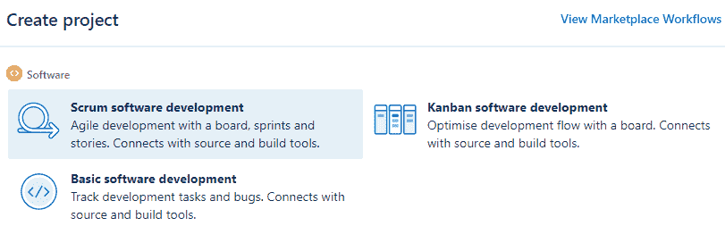

创建项目后，我们还需要处理一些事情，例如配置项目、项目仪表板、工作流、权限、问题类型、字段、组件等。

除此之外，您可能必须设置您的项目构建存储库(从 Fisheye 或 Bitbucket)，以及创建和配置构建计划。此外，JIRA提供了连接其他开发和团队协作工具的灵活性，例如合流和 HipChat。

# JIRA基于角色的权限

JIRA可以针对不同的用户角色进行设置和配置，以满足团队的需求。敏捷项目有各种各样的角色，比如 Scrum 大师、开发经理、产品经理、项目负责人、团队领导、开发人员、QA 工程师、设计师、技术作家等等。在管理员用户角色的帮助下，我们可以满足每个用户组的需求，并相应地自定义JIRA权限。

JIRA有三种主要的权限类型:

*   **全局权限**:这基本上是一个有管理员权限的用户。这是一个可以访问JIRA所有项目的用户。
*   **项目权限**:这是限制权限，仅限于选中的项目。此类用户无法访问他们无权访问的项目。但是，对于任何给定的项目，他们都可以创建、编辑和管理项目问题，并将它们来回分配给其他团队成员。
*   **发行安全权限**:这是发行类型级别的受限访问权限，仅提供有限受众的访问权限。JIRA是一个基于票证的系统，您可以创建不同类型的票证或问题，并使用“问题安全权限”限制其访问。例如，如果问题类型为“史诗”，则您只能在列表中添加经理，以便能够查看史诗问题类型票据。

但是，这些权限的每个级别都有管理员，如下所示:

*   **JIRA管理员**:这是一个用户可以自定义、管理和配置JIRA的角色
*   **项目管理员**:项目管理员可以控制冲刺相关的任务，如创建、开始、移动、编辑、结束、删除、完成、重命名冲刺
*   **板卡管理员**:板卡管理员可以通过创建板卡、修改工作流、添加/删除状态等方式控制仪表盘

Make sure you are aware of your project needs. Make sure you know well in advance what issue types your team might need, and the types of default or customized workflows, fields, or components that the team wants to use.

在下一节中，我们将使用JIRA管理员用户角色创建和管理项目。

# 使用JIRA的 Scrum

让我们从在JIRA创建一个 Scrum 项目开始:

1.  一旦您选择了 Scrum 软件开发选项，它将带您进入以下页面。列出的问题类型将作为具有指定默认工作流的项目的默认问题类型。请记住，您始终可以添加新的或修改现有的问题类型和工作流。这显示在下面的截图中:

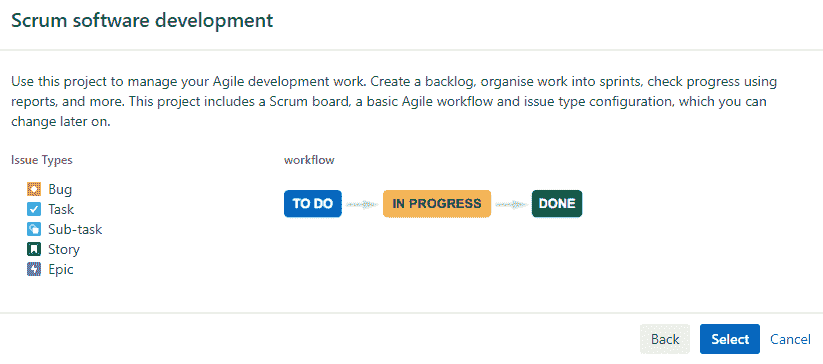

2.  为您的项目提供一个带有关键字的名称，并分配项目主管，如下图所示:

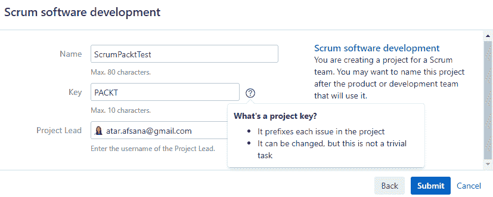

3.  单击提交，将创建项目，您将看到项目积压页面，如下图所示:

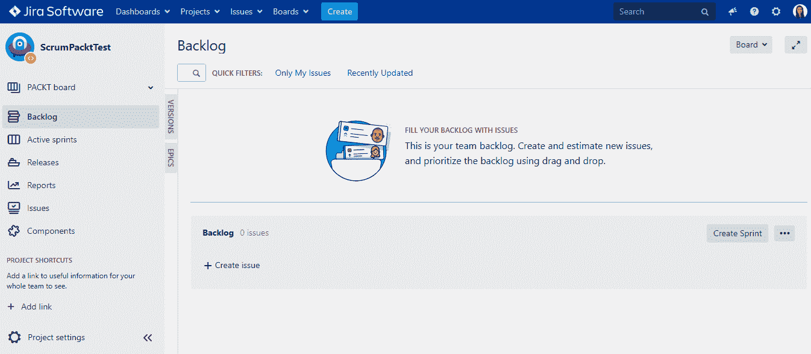

4.  现在，您已经准备好通过创建问题和计划来添加项目待定项，并通过创建冲刺和开始迭代来组织它们。下面的截图显示了示例 Sprint 2 的示例活动 Scrum 项目:

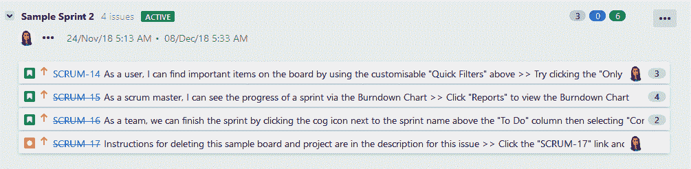

# 使用JIRA看板

现在让我们在JIRA创建一个看板项目:

1.  选择看板软件开发选项后，将进入以下页面:

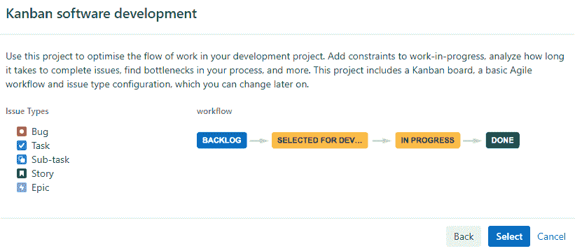

列出的问题类型将作为具有指定默认工作流的看板项目的默认问题类型。如前所述，您始终可以添加新的或修改现有的问题类型和工作流。

2.  通过指定名称和键并分配项目潜在顾客来创建看板项目。
3.  单击提交，将创建看板项目，您将看到看板板。

4.  现在，您可以通过在泳道中创建问题、规划和组织项目来添加项目项了。下面的屏幕截图显示了一个看板板，其中的需求通过不同的泳道，如积压、选择开发、进行中和完成:

现在我们已经准备好了我们的项目，让我们探索由JIRA支持的插件来理解它的测试管理方面。

# 探索JIRA的测试管理插件

测试管理过程有助于组织、跟踪和管理测试相关的项目需求。软件开发经历了不同的阶段，测试也有自己独立的一组阶段。每个阶段都有一组活动，通过这些活动我们可以跟踪项目的进度，例如创建测试计划和测试用例，将它们组织成测试套件，创建测试周期，管理执行，创建和重新测试缺陷，等等。STLC 及其与 SDLC 的集成包含在[第 1 章](01.html)、*软件质量保证概述*中。

在接下来的章节中，我们将详细了解不同的测试管理阶段，例如管理、计划、设计和执行，以及如何借助JIRA插件监控和控制测试用例。

在下一节中，我们将获得JIRA支持的每个插件的概述。那么，让我们开始吧。

# 突触支持

synapseRT 是一款JIRA应用，支持与JIRA的端到端测试和需求管理。它是一个插件，通过使测试人员、测试经理和项目经理能够在整个软件开发生命周期中计划、执行和跟踪项目进度，与JIRA环境顺利集成以扩展其功能。它将整个测试过程分为四个部分:

*   **测试用例**:这个部分是测试人员可以设计和维护测试用例的地方。它还提供了在需要时重用它们的灵活性。
*   **测试执行**:这是测试人员可以根据测试范围设计和规划当前版本所需的测试策略的阶段。
*   **测试自动化**:synapsertt 与其他第三方自动化或持续集成工具平滑集成，借助这些工具，测试专业人员可以执行自动化脚本并获得执行状态。
*   **需求**:在需求管理方面，团队跟踪项目进度是必不可少的，这样资源的分配和分配才容易。此外，这有助于在测试的早期阶段识别和减轻风险。synapseRT 生成的可追溯性报告对此非常有用。

在接下来的章节中，我们将详细介绍 synapseRT 的每一部分，并将探索它的使用以及最佳实践。在本节中，让我们在JIRA安装 synapseRT，并了解开始安装所需的基本配置设置。

JIRA可以根据用户需求定制，synapseRT 也可以。它提供了设计定制工作流和添加问题类型甚至字段的灵活性。你可以从亚特兰蒂斯市场安装 synapseRT。

只需登录JIRA，在附件部分搜索`synapseRT`。它的免费试用版可以在购买前进行探索。本书使用了 synapseRT 的当前版本(v9.3.1)。启用插件后，JIRA项目浏览器会添加需求、测试套件和测试计划选项。在下面的截图中，您将看到安装前后的屏幕:

为了查看问题类型(这是您的情况下的要求)的 synapseRT 字段，例如 Epic、Story、Task 等，您需要按如下方式进行配置:

Defect issue type is a new issue type that we will learn how to add in the upcoming chapters.

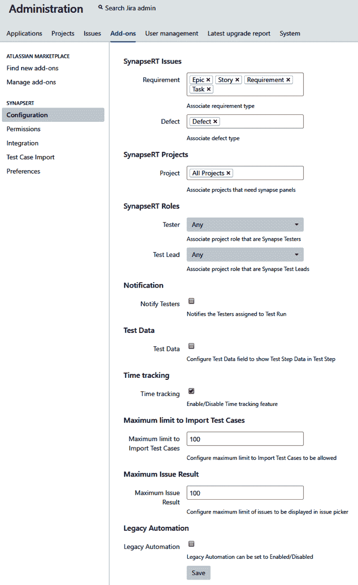

这里有一个链接可以让你了解支持JIRA的 synapsertt 版本:https://doc . go2 group . com/synapsertt/latest/en/synapsertt-ver-9-x/supported-jira-versions。

# 泽法

JIRA的泽法是JIRA支持的另一个测试管理工具。就像 synapseRT 一样，它可以用来设计和组织测试用例。它帮助测试人员计划测试执行，并在全局级别或项目级别管理定制字段。在敏捷测试板的帮助下，团队可以管理和报告工作进度。它还支持使用泽法查询语言的高级搜索选项。它可以很容易地与其他自动化工具集成，也可以与 ZAPI 的持续集成工具集成。

泽法可以从亚特兰蒂斯市场下载。本书使用了泽法的当前版本(v4.0.2)。

在下面的截图中，您将看到安装前后的场景，因为它向左侧菜单添加了额外的组件:

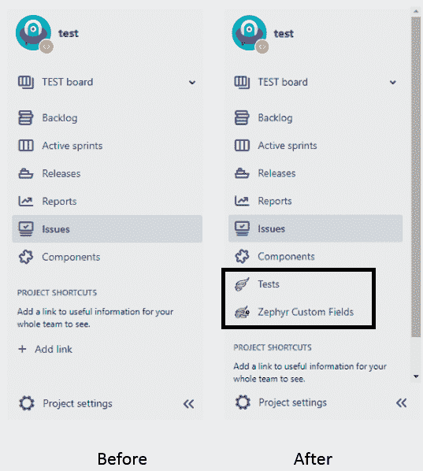

为了查看问题类型的泽法字段(以您的情况下的要求为准，例如，史诗、故事、任务等)，您需要按如下方式进行配置:

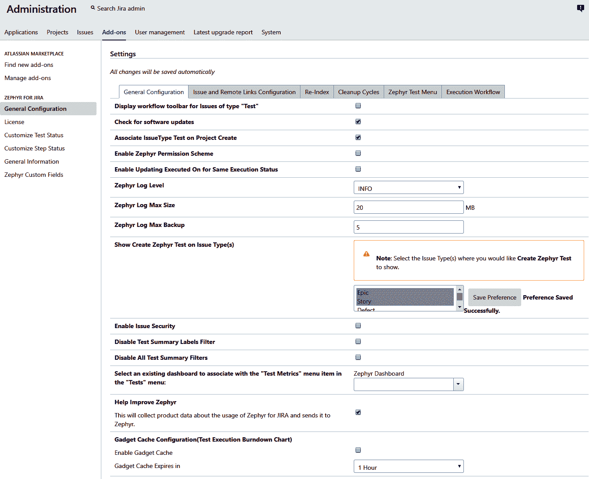

这里有一个链接，可以让你了解支持JIRA的泽法版本:https://market . atlassian . com/apps/1014681/zephyr-for-jira-test-management/version-history。

# 测试管理

测试管理插件是JIRA支持的另一个工具。它有类似于 synapseRT 和泽法的组件，并且使用不同的测试套件来促进测试用例的创建和管理。测试人员可以根据所选需求所需的测试类型，为不同浏览器的测试创建测试周期，等等。

借助可追溯性矩阵可以跟踪缺陷的要求。它使用 REST API 扩展了对自动化工具和 DevOps 工具的支持。测试管理工具可用于本地化语言，如英语、德语、西班牙语、葡萄牙语和意大利语。

测试管理工具可以从亚特兰蒂斯市场([https://marketplace.atlassian.com/](https://marketplace.atlassian.com/))下载。本书使用了当前版本的测试管理工具(v5.1.1)。

在下面的截图中，你会看到安装前后的场景。

在安装和启用测试管理插件之前，JIRA项目在菜单栏中没有测试选项卡:

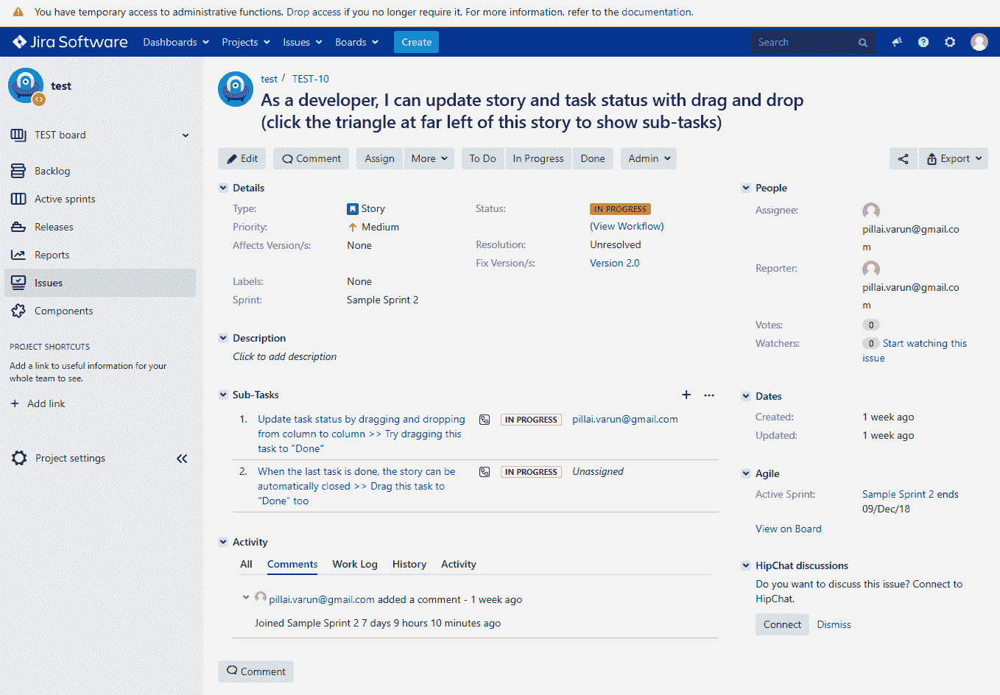

如您所见，它在管理下拉列表中添加了一个名为JIRA测试和测试管理的选项卡:

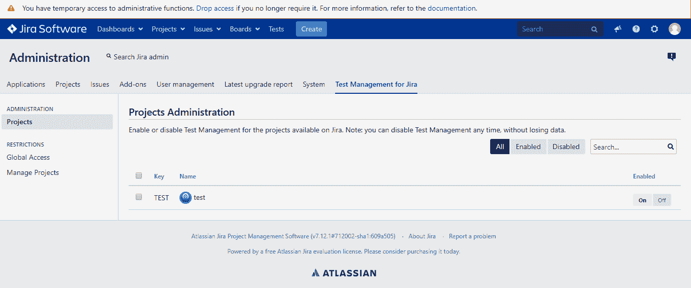

为了查看问题类型的测试管理工具(这是您的情况下的要求)，例如 Epic、Story、Task 等，您需要启用它。为项目启用插件后，您将能够从“测试”选项卡为项目创建测试，如下所示:

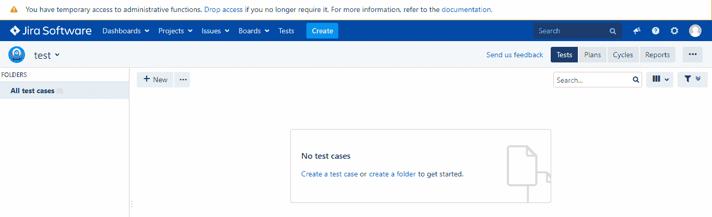

# 摘要

在这一章中，我们了解了JIRA和JIRA支持的插件，以满足您的敏捷项目的需求。JIRA是一个项目管理工具，它提供了各种模板来创建和管理您的项目工件。Scrum 和看板是两种应用最广泛的敏捷项目管理方法。JIRA支持这两种方法，并提供工具来满足您的测试管理需求。使用简单的步骤，您可以在JIRA创建和管理您的项目，并使用不同的权限和角色集来限制对信息的访问。我们探索了在 Scrum 和看板中创建项目的工作流程。在最后一节中，我们探讨了三个测试管理插件的安装和配置——synapsertt、泽法和测试管理。

在下一章中，我们将详细介绍如何使用JIRA的测试管理插件来执行测试管理的每个阶段。我们还将比较每个插件提供的特性。